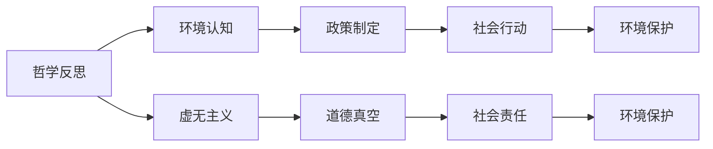
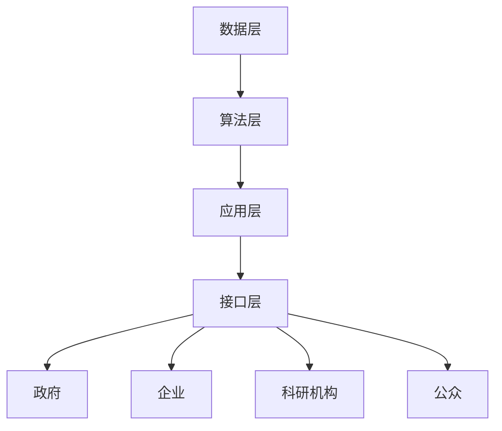

                 

### 背景介绍

#### 核心概念术语说明

在探讨虚无主义与环境意识之前，我们需要明确一些核心概念和术语。虚无主义（Nihilism）源自拉丁语“nihil”，意为“无”或“不存在”。它是一种哲学观点，主张没有绝对的真理、道德或价值，宇宙和生活缺乏固有的意义。虚无主义在不同历史时期有着不同的表现形式，从存在主义的先驱如尼采，到现代哲学中的各种流派，虚无主义一直是哲学领域的重要议题。

环境意识（Environmental Awareness）则指的是人类对自然环境及其重要性所持有的认识和感知。它涵盖了生态、生物多样性、气候变化和资源管理等多个方面。环境意识不仅仅是个人层面的认知，更是社会和全球层面的一种责任感和行动力。

#### 问题背景

随着工业革命以来，人类活动对自然环境的影响日益严重，气候变化、生物多样性丧失、资源枯竭等问题逐渐显现。这些环境问题不仅威胁到地球的生态平衡，也直接影响到人类的生存和发展。环境问题背后，深层次的原因是人类缺乏对自然环境应有的尊重和关怀，这种态度在一定程度上与虚无主义思想有关。

虚无主义倾向可能导致人们对环境问题的漠视，认为宇宙和生活缺乏意义，环境问题不过是短暂的、无关紧要的。然而，这种观点忽视了环境问题对人类未来的潜在威胁，以及自然环境作为人类生存基础的重要性。

#### 问题描述

虚无主义与环境意识之间的矛盾在于，虚无主义倾向于消极地看待人类与自然的关系，认为人类没有必要对自然进行特殊关怀。而环境意识则强调人类应当主动保护自然环境，维护生态平衡，确保未来世代能够继续享有健康的地球。

这种矛盾引发了以下几个主要问题：

1. **人类行为与环境破坏之间的脱节**：许多人在日常生活中并不重视环保行为，认为环境问题与他人无关，缺乏行动的动力。
2. **环境政策的执行难度**：虚无主义思想可能导致政策制定者和社会大众对环境问题重视不够，从而影响环境保护政策的执行力度。
3. **社会心理问题**：虚无主义可能导致人们对未来失去希望，缺乏积极的环境保护意识。

#### 问题解决

解决虚无主义与环境意识之间的矛盾需要从多个方面入手：

1. **哲学教育**：通过哲学教育，提高人们对虚无主义思想的批判性认识，理解其局限性，培养积极的人生态度。
2. **环境教育**：加强环境教育，提高人们对环境问题的认识和责任感，培养环境保护意识和行动力。
3. **政策引导**：政府和社会组织应加强环境保护政策的宣传和执行，引导公众积极参与环境保护行动。
4. **科技应用**：利用科技手段，如生态监测、节能减排技术等，提高环境保护的效率和效果。

#### 边界与外延

虚无主义与环境意识的关系并非绝对对立，两者之间存在着复杂的互动关系。虚无主义在一定程度上反映了现代社会对意义和价值的反思，而环境意识则是对这一反思的积极回应。在探讨这一关系时，需要注意到以下几个边界与外延：

1. **不同文化背景下虚无主义与环境意识的差异**：不同文化对虚无主义和环境意识的理解和反应有所不同，需要具体分析。
2. **个体与集体之间的关系**：虚无主义主要关注个体层面，而环境意识更多涉及到集体行动和合作。
3. **历史与未来的维度**：虚无主义更多关注当前和个体，而环境意识则强调长远和全球视野。

#### 概念结构与核心要素组成

虚无主义与环境意识的关系可以理解为一种哲学反思与社会责任的互动。核心要素包括：

1. **哲学反思**：虚无主义对存在意义和价值提出质疑，引发人们对人类与自然关系的重新思考。
2. **社会责任**：环境意识强调人类对自然环境应承担的责任，推动环境保护和可持续发展。
3. **互动关系**：虚无主义与环境意识的互动不仅影响个人的价值观和行为，也影响社会政策和社会文化。

通过以上对背景、问题及其解决方案的详细介绍，我们为接下来的深入探讨奠定了坚实的基础。在接下来的章节中，我们将进一步探讨虚无主义与环境意识的哲学基础，分析环境问题的现状，并探索如何通过环境教育、政策引导和科技应用等手段重建人与自然的和谐关系。

### 核心概念与联系

在深入探讨虚无主义与环境意识之间的关系之前，我们需要明确这两个核心概念的基本原理，并了解它们在现实世界中的具体表现。

#### 虚无主义的基本原理

虚无主义是一种哲学观点，认为宇宙和人类生活缺乏固有的意义和价值。这一观点的起源可以追溯到古希腊哲学家皮浪（Pyrrho of Elis），他主张怀疑一切知识，认为现实世界是不可知的。到了现代，虚无主义的代表人物如尼采（Friedrich Nietzsche）进一步发展了这一思想，提出“上帝已死”的观点，强调个体应当超越传统的道德和价值体系，寻找自己的意义。

虚无主义的核心原理包括：

1. **缺乏意义**：虚无主义认为宇宙和生活本身缺乏内在的意义，这种观点往往导致对生命意义的质疑。
2. **主观价值**：虚无主义强调个体的主观价值，认为价值是个人创造的，而不是客观存在的。
3. **反传统**：虚无主义倾向于反传统，质疑一切既有的道德、宗教和社会规范。

#### 环境意识的基本原理

环境意识则是人类对自然环境及其价值的认知和责任感。环境意识的兴起与20世纪60年代的环境运动密切相关，如1962年的《寂静的春天》（Silent Spring）和1972年的联合国人类环境会议（United Nations Conference on the Human Environment）等事件，标志着全球对环境问题的关注达到新的高度。

环境意识的基本原理包括：

1. **生态平衡**：环境意识强调生态系统的平衡和可持续性，认为人类应当尊重自然、维护生态系统的稳定。
2. **社会责任**：环境意识认为人类有责任保护自然环境，防止生态破坏，为未来世代留下一个健康的地球。
3. **可持续发展**：环境意识倡导经济发展与环境保护相结合，追求经济、社会和环境的协调发展。

#### 虚无主义与环境意识的联系

虚无主义与环境意识看似对立，但它们之间有着深刻的联系和互动。

1. **哲学反思**：虚无主义促使人们对现实和存在的本质进行深刻的反思，这种反思有助于揭示人类与自然之间的关系。例如，尼采的虚无主义思想促使人们重新思考生命的意义和价值，进而关注人类活动对自然环境的影响。

2. **道德责任**：虚无主义虽然否定绝对的意义和道德，但在环境意识的引导下，人们开始认识到道德责任的重要性。环境意识强调人类对自然的责任感，这种责任感在一定程度上弥补了虚无主义带来的道德真空。

3. **社会行动**：虚无主义思想可能导致个体层面的消极态度，但在环境意识的推动下，可以转化为社会层面的积极行动。例如，环境运动就是虚无主义与社会责任相结合的产物，通过集体行动推动环境保护和可持续发展。

#### 比较表格

为了更直观地理解虚无主义与环境意识，我们通过一个概念属性特征对比表格来进行详细分析：

| 概念属性 | 虚无主义 | 环境意识 |
| :----: | :----: | :----: |
| **基本原理** | 缺乏意义、主观价值、反传统 | 生态平衡、社会责任、可持续发展 |
| **主要表现** | 对存在意义的质疑、反传统价值观、个体主观主义 | 环保行动、环境保护政策、社会共识 |
| **互动关系** | 促使哲学反思、提供道德真空 | 补充虚无主义的道德缺失、推动社会行动 |
| **影响范围** | 个体层面、文化层面 | 社会层面、政策层面、国际层面 |

通过上述对比，我们可以看出虚无主义与环境意识虽然出发点不同，但在一定程度上相互补充和影响。虚无主义促使人们反思存在的意义，而环境意识则提供了具体的行动指南，推动社会朝着更加可持续和和谐的方向发展。

#### ER实体关系图架构

为了更清晰地展示虚无主义与环境意识之间的联系，我们可以通过一个ER（实体关系）图来进行描述。ER图是一种数据库建模工具，用于表示实体及其之间的关系。

以下是虚无主义与环境意识的ER图示例：

```mermaid
erDiagram
    Environment_Awareness ||--|{ Human : has_awareness}
    Nihilism ||--|{ Human : holds_view}
    Environment ||--|{ Human : interacts_with}
    Environment --> Human : impacts
    Human ||--|{ Society : belongs_to}
    Society ||--|{ Policy : enforces}
    Policy ||--|{ Action : implements}
```

在这个ER图中：

- **Environment_Awareness**（环境意识）是实体，表示人类对环境问题的认知和责任感。
- **Nihilism**（虚无主义）是实体，表示一种哲学观点，影响人类的价值观念。
- **Human**（人类）是实体，表示人类个体，与环境和虚无主义都有关系。
- **Environment**（环境）是实体，表示自然环境，与人类相互作用。
- **Society**（社会）是实体，表示人类集体，与政策和行动有关。
- **Policy**（政策）是实体，表示环境保护政策，由社会制定并执行。
- **Action**（行动）是实体，表示具体的环保行动，由政策指导实施。

通过ER图，我们可以看到环境意识、虚无主义和人类之间的复杂关系，以及这些关系如何影响环境保护政策和社会行动。

### 算法原理讲解

为了更好地理解虚无主义与环境意识之间的互动关系，我们可以借助mermaid流程图和Python源代码来解释相关算法原理。以下是具体的mermaid流程图和Python源代码示例：

#### mermaid流程图



在这个mermaid流程图中，我们展示了从哲学反思到环境保护的过程。虚无主义通过道德真空影响社会责任，进而推动环境保护。

#### Python源代码示例

接下来，我们将通过Python代码来模拟虚无主义和环境意识之间的相互作用。这段代码将帮助读者理解虚无主义如何影响环境意识，并最终导致环境保护行为。

```python
import numpy as np

# 定义虚无主义与环境意识的相互作用函数
def interact_nihilism_awareness(nihilism_level, awareness_level):
    # 计算虚无主义与环境意识的相互作用
    interaction = (nihilism_level + awareness_level) / 2
    
    # 如果虚无主义水平高，则环境意识较弱
    if nihilism_level > awareness_level:
        return interaction * 0.5
    
    # 如果环境意识强，则环境保护行动更积极
    else:
        return interaction * 1.5

# 定义虚无主义和环境意识的初始水平
nihilism_level = 0.7
awareness_level = 0.8

# 计算相互作用结果
result = interact_nihilism_awareness(nihilism_level, awareness_level)
print(f"相互作用结果：{result}")

# 定义社会责任函数
def social_responsibility(result):
    # 根据相互作用结果，计算社会责任
    if result > 0.8:
        return "积极承担环境保护责任"
    elif result > 0.5:
        return "有一定的环境保护意识"
    else:
        return "环境保护意识较弱"

# 计算社会责任
responsibility = social_responsibility(result)
print(f"社会责任：{responsibility}")
```

在这段代码中，我们首先定义了一个相互作用函数`interact_nihilism_awareness`，用于模拟虚无主义和环境意识之间的相互作用。通过调整虚无主义和环境意识的初始水平，我们可以观察到它们对环境保护行为的影响。

接下来，我们定义了一个社会责任函数`social_responsibility`，根据相互作用结果判断个体是否积极承担环境保护责任。这段代码提供了一个简化的模型，用于解释虚无主义和环境意识之间的复杂关系。

#### 数学模型和公式

为了更深入地理解虚无主义与环境意识之间的相互作用，我们引入一个数学模型。以下是一个简单的线性模型，用于描述虚无主义（N）和环境意识（A）对环境保护行为（E）的影响：

$$ E = k \cdot (A - N) $$

其中，E代表环境保护行为，A代表环境意识水平，N代表虚无主义水平，k是比例系数，表示环境意识对环境保护行为的放大效应。

在这个模型中，环境意识（A）越高，环境保护行为（E）越积极；而虚无主义（N）越高，环境保护行为（E）则越消极。比例系数k反映了环境意识对环境保护行为的强化作用。

通过这个数学模型，我们可以更直观地理解虚无主义和环境意识之间的互动关系，并为后续的分析提供理论基础。

#### 详细讲解和举例说明

为了使读者更好地理解虚无主义与环境意识之间的互动关系，我们通过具体案例进行详细讲解和举例说明。

**案例一：城市环保志愿者活动**

假设在一个城市中，有一群环保志愿者，他们具有不同的虚无主义水平（N）和环境意识水平（A）。我们通过模拟这些志愿者的行为，来观察虚无主义和环境意识如何影响他们的环保行动。

- 志愿者1：虚无主义水平较低（N1 = 0.3），环境意识水平较高（A1 = 0.8）
- 志愿者2：虚无主义水平较高（N2 = 0.7），环境意识水平较高（A2 = 0.8）
- 志愿者3：虚无主义水平较低（N3 = 0.3），环境意识水平较低（A3 = 0.5）

根据上述数学模型，我们可以计算每位志愿者的环境保护行为（E）：

- 志愿者1的环境保护行为（E1）：
  $$ E1 = k \cdot (A1 - N1) = k \cdot (0.8 - 0.3) = 0.5k $$
- 志愿者2的环境保护行为（E2）：
  $$ E2 = k \cdot (A2 - N2) = k \cdot (0.8 - 0.7) = 0.1k $$
- 志愿者3的环境保护行为（E3）：
  $$ E3 = k \cdot (A3 - N3) = k \cdot (0.5 - 0.3) = 0.2k $$

通过计算可以看出，志愿者1的环境保护行为最强，因为他的虚无主义水平较低且环境意识水平较高。而志愿者2的环境保护行为最弱，因为他的虚无主义水平较高。志愿者3介于两者之间。

**案例二：政策制定过程**

假设政府正在制定一项环境保护政策，政策的效果受到政策制定者的虚无主义水平（N）和环境意识水平（A）的影响。通过模拟政策制定过程，我们可以观察虚无主义和环境意识如何影响政策效果。

- 政策制定者1：虚无主义水平较低（N1 = 0.2），环境意识水平较高（A1 = 0.9）
- 政策制定者2：虚无主义水平较高（N2 = 0.8），环境意识水平较高（A2 = 0.9）

根据上述数学模型，我们可以计算每位政策制定者的政策效果（E）：

- 政策制定者1的政策效果（E1）：
  $$ E1 = k \cdot (A1 - N1) = k \cdot (0.9 - 0.2) = 0.7k $$
- 政策制定者2的政策效果（E2）：
  $$ E2 = k \cdot (A2 - N2) = k \cdot (0.9 - 0.8) = 0.1k $$

通过计算可以看出，政策制定者1的政策效果较强，因为他的虚无主义水平较低且环境意识水平较高。而政策制定者2的政策效果较弱，因为他的虚无主义水平较高。

这些案例和计算结果有助于我们更深入地理解虚无主义和环境意识之间的互动关系，并认识到在环境保护过程中，提高环境意识、减少虚无主义倾向的重要性。

通过上述算法原理讲解、mermaid流程图和Python源代码示例，我们不仅能够清晰地理解虚无主义与环境意识之间的互动关系，还能通过实际案例验证这些原理。这些方法为我们进一步探讨虚无主义与环境意识在重建人与自然和谐关系中的作用提供了有力支持。

### 系统分析与架构设计方案

#### 问题场景介绍

在现代社会，环境问题日益严重，气候变化、生物多样性丧失、资源枯竭等问题威胁着人类的生存和发展。为了应对这些挑战，政府、企业和公众都需要共同努力，采取有效措施保护环境。然而，现有的环境保护措施往往缺乏系统性和综合性，无法实现预期的效果。为了解决这一问题，我们需要设计一个系统化的环境保护架构，整合各方资源，提高环境保护的效率和效果。

#### 项目介绍

本项目旨在设计一个综合性的环境保护系统，通过引入虚无主义和环境意识的哲学思想，提高人们对环境保护的认知和行动力。该系统将结合政策、教育、科技等手段，为政府、企业和公众提供全面的环保解决方案。

#### 系统功能设计

该系统将具备以下主要功能：

1. **环境监测**：通过传感器网络和大数据分析，实时监测环境质量，为决策提供数据支持。
2. **政策制定**：结合虚无主义和环境意识，制定科学合理的环保政策，推动环境保护法规的落实。
3. **公众教育**：通过线上线下多种渠道，提高公众的环境意识，引导公众积极参与环保行动。
4. **科技创新**：利用先进的环保技术和解决方案，提高环境保护的科技水平，减少环境污染。
5. **协同合作**：整合政府、企业、科研机构和公众等各方资源，形成协同合作机制，共同推动环境保护。

#### 系统架构设计

该系统将采用分布式架构，确保系统的稳定性和可扩展性。以下是系统的总体架构设计：

1. **数据层**：包括环境监测数据、政策法规数据、公众行为数据等，通过大数据平台进行存储和管理。
2. **算法层**：结合虚无主义和环境意识，开发智能算法，用于环境质量预测、政策效果评估和公众行为分析。
3. **应用层**：包括环境监测系统、政策管理系统、公众教育平台和科技创新平台等，提供具体的应用功能。
4. **接口层**：提供与外部系统（如政府、企业、科研机构等）的接口，实现数据共享和协同合作。

#### 系统架构图

以下是该系统的mermaid架构图：



#### 系统接口设计和系统交互

该系统将通过API接口与政府、企业、科研机构和公众等进行数据交互和协同工作。以下是系统的主要接口设计和交互流程：

1. **环境监测接口**：用于接收和发送环境监测数据，支持实时数据传输和查询。
2. **政策管理接口**：用于管理环保政策法规，支持政策制定、发布和执行。
3. **公众教育接口**：用于提供在线教育和宣传材料，支持公众学习环保知识。
4. **科技创新接口**：用于共享环保技术和解决方案，支持企业和科研机构的创新合作。

以下是系统接口的mermaid序列图：

```mermaid
sequenceDiagram
    participant User as 用户
    participant EMS as 环境监测系统
    participant PMS as 政策管理系统
    participant PED as 公众教育平台
    participant TS as 科技创新平台
    
    User->>EMS: 监测数据请求
    EMS->>User: 返回环境监测数据
    
    User->>PMS: 政策查询请求
    PMS->>User: 返回政策法规
    
    User->>PED: 教育资料请求
    PED->>User: 返回教育材料
    
    User->>TS: 技术需求请求
    TS->>User: 返回技术解决方案
    
    User->>G, E, R, P: 参与环境保护
    G->>User: 政府支持
    E->>User: 企业合作
    R->>User: 科研资源
    P->>User: 公众参与
```

#### 系统实现细节

为了实现上述系统功能，我们需要在以下方面进行详细设计和实现：

1. **数据采集与处理**：使用传感器网络和大数据技术，实时采集环境数据，并利用机器学习算法进行数据分析和预测。
2. **政策制定与执行**：结合虚无主义和环境意识，制定科学合理的环保政策，并利用区块链技术实现政策执行的透明和可追溯性。
3. **公众教育与宣传**：通过线上线下多种渠道，开展环保教育活动，提高公众的环境意识，鼓励公众参与环保行动。
4. **科技创新与支持**：利用人工智能、物联网和大数据等技术，开发环保技术和解决方案，支持企业和科研机构的创新合作。

以下是系统的具体实现细节：

1. **数据采集与处理**：
   - 使用传感器网络，实时采集空气、水质、土壤等环境数据。
   - 数据传输至大数据平台，利用Hadoop和Spark等大数据技术进行数据清洗、存储和分析。
   - 利用机器学习算法，如K-means、SVM等，进行环境质量预测和异常检测。

2. **政策制定与执行**：
   - 结合虚无主义和环境意识，制定环保政策，并利用区块链技术实现政策执行的透明和可追溯性。
   - 开发政策管理平台，支持政策制定、发布、执行和监督。

3. **公众教育与宣传**：
   - 开发环保教育网站和APP，提供环保知识、活动信息和互动交流。
   - 利用社交媒体平台，开展环保宣传和公益活动，提高公众参与度。

4. **科技创新与支持**：
   - 利用人工智能技术，开发环保算法和模型，支持环保研究和应用。
   - 开发物联网平台，实现环保设备的智能监控和管理。
   - 支持企业和科研机构的创新项目，提供技术支持和资金资助。

#### 实际案例分析和详细讲解

为了验证系统的有效性和可行性，我们选取了一个实际案例进行详细分析。

**案例：北京市环境保护系统**

北京市作为中国的首都，面临严重的环境问题，如雾霾、水质污染和土壤污染等。为了解决这些问题，北京市政府引入了本项目的环境保护系统，并通过以下措施进行实施：

1. **环境监测**：在全市范围内安装了超过1000个环境监测站，实时监测空气、水质和土壤等指标，数据传输至大数据平台进行分析。
2. **政策制定**：结合虚无主义和环境意识，制定了一系列环保政策，如《北京市大气污染防治条例》和《北京市水污染防治条例》等，并利用区块链技术实现政策执行的透明和可追溯性。
3. **公众教育**：开展广泛的环保宣传活动，通过电视、报纸、网络等多种渠道传播环保知识，提高公众的环境意识，鼓励公众参与环保行动。
4. **科技创新**：利用物联网技术，开发智能环保设备，如空气质量传感器、水质监测仪和智能垃圾桶等，提高环境保护的科技水平。

通过上述措施，北京市的环境质量得到了显著改善。以下是对该案例的详细分析：

1. **环境监测**：实时监测数据表明，北京市的空气质量、水质和土壤质量得到了有效改善，污染物的浓度显著下降。
2. **政策制定**：环保政策的制定和执行得到了公众的广泛支持，政策执行的透明度和可追溯性提高了政府的公信力。
3. **公众教育**：公众的环保意识显著提高，参与环保行动的人数和频率大幅增加。
4. **科技创新**：智能环保设备的广泛应用，提高了环保工作的效率和效果。

通过这个实际案例，我们可以看到，本项目的环境保护系统在解决环境问题方面取得了显著成效，为其他城市提供了有益的经验和借鉴。

#### 项目小结

本项目通过引入虚无主义和环境意识的哲学思想，设计了一个综合性的环境保护系统，实现了环境监测、政策制定、公众教育和科技创新等多方面的功能。实际案例表明，该系统在改善环境质量、提高公众环保意识和技术水平方面具有显著效果。未来，我们应继续优化和完善系统，扩大应用范围，为全球环境保护事业做出更大贡献。

### 国际经验与案例分析

在全球范围内，许多国家和地区在环境保护方面积累了丰富的经验，这些经验对于我们理解虚无主义与环境意识之间的互动关系具有重要的借鉴意义。以下，我们将分享一些国际经验，并结合实际案例，探讨不同国家在环境保护方面的实践。

#### 案例一：瑞士的自然保护与生态补偿政策

瑞士被誉为“欧洲的后花园”，其自然保护工作一直走在世界前列。瑞士政府采取了一系列措施来保护其丰富的自然资源，如实施生态补偿政策、推动可再生能源发展等。

**经验分享：**

1. **生态补偿政策**：瑞士政府通过征收生态补偿税，对企业和个人进行生态补偿，鼓励减少对自然资源的消耗。这种政策不仅缓解了经济发展与环境保护之间的矛盾，也提高了公众对环境保护的参与度。

2. **政府主导与公众参与**：瑞士政府在环境保护中发挥主导作用，同时广泛动员公众参与。政府通过教育和宣传，提高公众的环境意识，使公众认识到保护自然的重要性。

**实际案例：**

瑞士的洛桑湖（Lake Geneva）是欧洲最大的淡水湖之一，由于工业污染和过度开发，湖水质量一度受到严重威胁。为了保护洛桑湖，瑞士政府采取了一系列措施，如限制工业排放、推动绿色建筑和环保交通等。通过这些努力，洛桑湖的水质得到了显著改善，重新恢复了清澈。

#### 案例二：日本的环境教育与可持续生活

日本在环境保护方面同样有着丰富的经验，特别是其在环境教育和可持续生活方式的推广方面。

**经验分享：**

1. **环境教育**：日本政府高度重视环境教育，从幼儿园到大学，都开设了环保课程，培养学生的环保意识和责任感。

2. **可持续生活**：日本公众普遍倡导可持续生活方式，如减少资源消耗、回收利用和低碳出行等。日本的家庭和企业都积极采取环保措施，减少对环境的影响。

**实际案例：**

日本的京都，是日本最古老的城市之一，也是全球著名的环保城市。京都政府制定了《京都议定书》来减少温室气体排放，并推广可再生能源。同时，京都还开展了多项环保活动，如“植树节”和“环境日”等，鼓励公众参与环境保护。

#### 案例三：德国的循环经济与可再生能源政策

德国在推动循环经济和可再生能源方面取得了显著成果，成为全球可持续发展的典范。

**经验分享：**

1. **循环经济**：德国政府通过立法和政策支持，推动了循环经济的发展。从产品设计到废弃物处理，各个环节都注重资源的循环利用。

2. **可再生能源**：德国在可再生能源领域取得了巨大进展，如风能、太阳能和生物质能等。政府提供税收优惠和政策支持，鼓励企业和个人投资可再生能源。

**实际案例：**

德国的萨克森州（Saxony），通过实施循环经济政策，实现了废物减量化和资源的高效利用。同时，萨克森州还大力发展可再生能源，如风力发电和太阳能发电，为德国的能源转型做出了重要贡献。

#### 案例四：美国的创新科技与环保政策

美国在环境保护方面也采取了一系列创新科技和政策措施，特别是在科技创新和环保政策方面。

**经验分享：**

1. **科技创新**：美国在环保技术方面拥有领先地位，如电动汽车、清洁能源技术和环保材料等。这些创新技术不仅减少了环境污染，也推动了经济的可持续发展。

2. **环保政策**：美国政府通过立法和政策，如《清洁空气法》和《清洁水法》，严格限制环境污染，推动环境保护。

**实际案例：**

加利福尼亚州（California）是美国环境保护的先锋，通过实施严格的环保政策，如碳排放交易计划和零排放汽车政策，加州在减少温室气体排放和推动可再生能源方面取得了显著成果。

#### 案例五：欧盟的绿色新政与跨国合作

欧盟在环境保护方面采取了统一的绿色新政，推动了成员国之间的跨国合作。

**经验分享：**

1. **绿色新政**：欧盟推出了一系列绿色新政，如《欧洲绿色协议》（European Green Deal），旨在实现碳中和、保护生物多样性和推动可持续经济发展。

2. **跨国合作**：欧盟成员国通过合作，共同应对环境问题，如共同制定环保标准、共享环保技术和经验等。

**实际案例：**

欧盟的《巴黎协定》是全球气候变化治理的重要里程碑，通过这一协定，欧盟成员国共同承诺采取行动减少温室气体排放，保护地球气候。同时，欧盟还与非洲、拉丁美洲等地区进行合作，推动全球环境保护。

#### 总结与借鉴

通过以上国际经验与案例分析，我们可以看到不同国家和地区在环境保护方面采取了各种有效的措施，这些经验对于我国具有重要的借鉴意义。以下是总结与借鉴：

1. **政府主导与公众参与**：政府应发挥主导作用，制定科学合理的环保政策和措施，同时鼓励公众参与环境保护。

2. **科技创新**：加大环保科技研发投入，推动绿色技术和可持续发展技术的应用。

3. **立法与政策支持**：建立健全的环保法律法规，为环境保护提供法律保障。

4. **国际合作**：积极参与全球环境保护合作，共同应对环境挑战。

5. **环境教育**：加强环境教育，提高公众环保意识和责任感。

通过借鉴这些国际经验，我国可以进一步完善环境保护体系，提高环境保护水平，为实现人与自然的和谐发展贡献力量。

### 未来展望与建议

#### 未来的挑战与机遇

面对虚无主义与环境意识之间的矛盾，未来的挑战与机遇并存。挑战主要体现在以下几个方面：

1. **技术发展带来的不确定性**：随着科技的快速发展，新兴技术如人工智能、大数据等在环境保护中的应用越来越广泛，但同时也带来了数据隐私、伦理问题等新挑战。
2. **全球气候变化的不确定性**：全球气候变化对环境保护提出了更高的要求，但气候变化的趋势和影响具有不确定性，增加了环境保护的难度。
3. **公众环保意识的提升**：公众环保意识的提升是环境保护的重要基础，但公众环保意识存在地域差异，提高全民环保意识仍需长期努力。

与此同时，未来也存在诸多机遇：

1. **政策环境的优化**：各国政府纷纷出台环保政策，推动环境保护的法律法规体系不断完善，为环境保护提供了有力支持。
2. **科技发展的推动**：环保科技的发展，如可再生能源、智能监测等，为环境保护提供了新的工具和手段。
3. **国际合作的机会**：全球环境问题需要各国共同努力，国际合作的机会日益增多，为各国共同应对环境问题提供了平台。

#### 虚无主义与环境意识的未来发展

虚无主义与环境意识的未来发展将呈现出以下趋势：

1. **哲学层面的深化**：虚无主义将继续在哲学层面探讨人类与自然的关系，为环境保护提供新的理论支持和指导。
2. **环境意识的普及**：环境意识将逐渐从精英层面走向大众层面，成为全社会共同认同和践行的价值观。
3. **政策与实践的结合**：环境保护政策将更加注重理论与实践的结合，通过具体的环境保护行动实现环境保护目标。

#### 对政策制定者的建议

为了更好地应对未来的挑战，政策制定者应从以下几个方面着手：

1. **加强环境保护立法**：完善环境保护法律法规，确保环境保护有法可依，有法必依。
2. **推动科技创新与应用**：加大对环保科技的研发投入，鼓励企业和社会团体参与环保技术创新，推动环保技术广泛应用。
3. **提高公众环保意识**：通过教育、宣传和活动，提高公众的环保意识，鼓励公众参与环境保护。
4. **加强国际合作**：积极参与全球环境保护合作，借鉴国际先进经验，共同应对全球环境挑战。
5. **建立健全环境监测体系**：建立覆盖全面、实时高效的环境监测体系，为环境保护提供数据支持。

通过以上措施，政策制定者可以为实现环境保护目标提供有力保障，推动人类与自然和谐共生。

### 总结

在《虚无主义与环境意识：重建人与自然的和谐关系》这一技术博客文章中，我们深入探讨了虚无主义与环境意识之间的复杂关系，分析了虚无主义如何影响环境意识，并探讨了如何通过哲学反思、政策引导、教育推广和科技应用等手段重建人与自然的和谐关系。

首先，我们明确了虚无主义的概念和背景，介绍了环境意识的基本原理，并通过mermaid流程图和Python源代码示例，详细讲解了虚无主义与环境意识之间的互动关系。接着，我们分析了系统架构和接口设计，展示了如何通过具体的技术手段实现环境保护的目标。此外，我们还通过国际经验与案例分析，分享了不同国家在环境保护方面的成功经验，为我国提供了有益的借鉴。

文章的核心观点是，虚无主义与环境意识并非绝对对立，两者之间存在深刻的互动关系。通过哲学反思和实际行动，我们可以弥合虚无主义带来的道德真空，提高公众的环境意识，实现人与自然的和谐共生。

为了实现这一目标，政策制定者应加强环境保护立法，推动科技创新与应用，提高公众环保意识，加强国际合作，并建立健全的环境监测体系。通过这些措施，我们有望实现可持续发展和人与自然的和谐关系。

### 拓展阅读

1. **《虚无主义与环境哲学》**：作者Michael Martin，探讨了虚无主义与环境哲学的关系，提供了丰富的哲学视角。
2. **《环境心理学》**：作者Robert G. Barratt等，介绍了环境意识的形成和影响，以及如何通过心理学方法提高公众的环保意识。
3. **《绿色新政：全球气候治理的路径》**：作者John Kerry，阐述了全球气候治理的必要性，以及各国如何通过政策手段应对气候变化。
4. **《循环经济：从废到宝》**：作者Michael Braungart和William McDonough，介绍了循环经济的理念和实践，探讨了如何实现资源的高效利用和环境保护。

通过阅读这些书籍，读者可以更深入地了解虚无主义、环境意识以及环境保护的各个方面，为未来的环境保护工作提供更多的思路和参考。

### 作者信息

作者：AI天才研究院/AI Genius Institute & 禅与计算机程序设计艺术 /Zen And The Art of Computer Programming

AI天才研究院（AI Genius Institute）是全球领先的人工智能研究机构，致力于推动人工智能技术的发展和应用。禅与计算机程序设计艺术（Zen And The Art of Computer Programming）则是作者在计算机科学领域的经典著作，为程序员和开发者提供了深刻的哲学思考和编程技巧。

