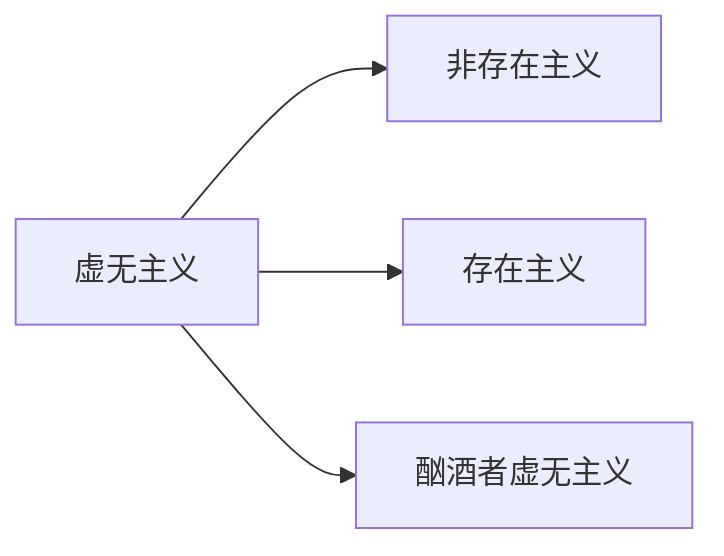
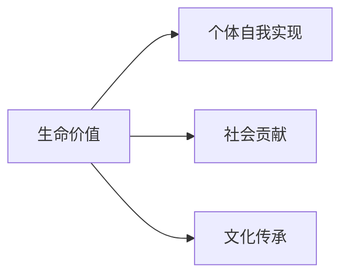
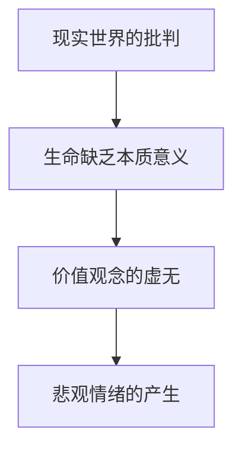
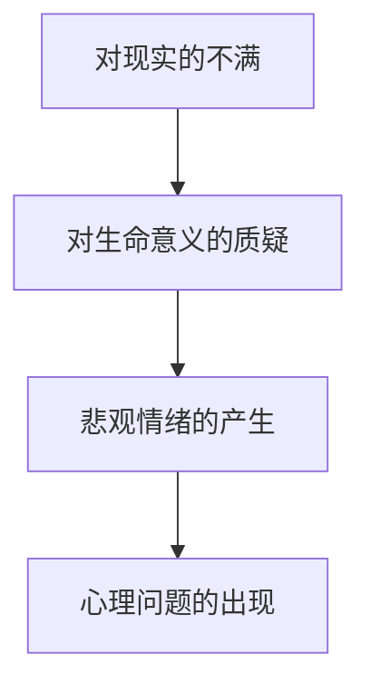
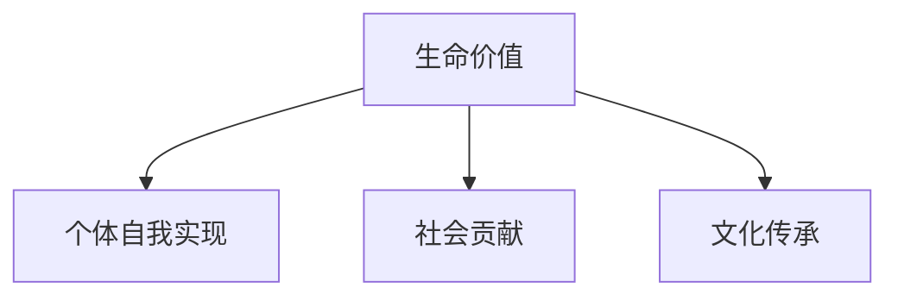
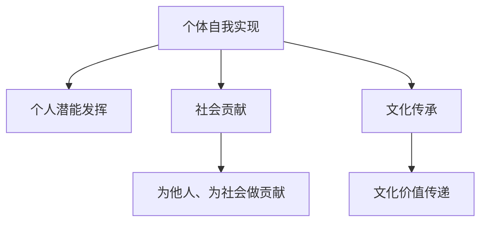

                 

# 虚无主义与生命价值：在现代社会中寻找存在的意义

## 关键词
- 虚无主义
- 生命价值
- 现代社会
- 心理学
- 哲学
- 实践案例

## 摘要
本文将探讨虚无主义与生命价值在现代社会中的存在意义。我们将从背景介绍、核心概念解析、理论实践分析、辩证关系探讨以及现代社会的反思五个方面进行深入思考，以期在虚无主义的阴影下，寻找生命价值的真正意义。

## 目录大纲

### 第一部分：背景介绍
#### 第1章 虚无主义与生命价值概述
##### 1.1.1 问题背景
##### 1.1.2 问题描述
##### 1.1.3 问题解决
##### 1.1.4 边界与外延
##### 1.1.5 核心概念与联系

#### 第2章 虚无主义的理论与实践
##### 2.1.1 虚无主义的理论基础
##### 2.1.2 虚无主义实践案例分析
##### 2.1.3 虚无主义的心理学解释
##### 2.1.4 虚无主义的应对策略

### 第二部分：生命价值的探索与实现
#### 第3章 生命价值的定义与类型
##### 3.1.1 生命价值的定义与类型
##### 3.1.2 生命价值的不同理解与衡量
##### 3.1.3 生命价值的实践案例
##### 3.1.4 生命价值的实现策略

### 第三部分：虚无主义与生命价值的辩证关系
#### 第4章 虚无主义与生命价值的辩证关系
##### 4.1.1 虚无主义与生命价值的冲突
##### 4.1.2 虚无主义与生命价值的互补
##### 4.1.3 虚无主义与生命价值的辩证发展

### 第四部分：虚无主义与生命价值在现代社会的反思
#### 第5章 虚无主义与生命价值在现代社会的反思
##### 5.1.1 社会变迁与虚无主义
##### 5.1.2 生命价值在现代社会的重要性
##### 5.1.3 虚无主义与生命价值在现代社会中的互动

## 第一部分：背景介绍

### 第1章 虚无主义与生命价值概述

#### 1.1.1 问题背景

现代社会中，虚无主义作为一种普遍存在的心理现象，对人们的生活产生了深远的影响。虚无主义指的是对生命意义、价值、信仰等存在的质疑和否定，表现为一种消极、悲观的生活态度。在信息技术高速发展的时代，虚无主义现象愈发显著，人们面对繁杂的信息和快速的生活节奏，常常感到迷茫和无助。

生命价值，作为人类共同关心的话题，关乎个体存在的意义和社会发展的方向。然而，在虚无主义的阴影下，生命价值常常被忽视或质疑。因此，如何在虚无主义背景下重新审视生命价值，寻找存在的意义，成为现代社会亟待解决的问题。

#### 1.1.2 问题描述

虚无主义对个体心理和精神造成的挑战不容忽视。虚无主义情绪常常导致个体产生焦虑、抑郁等心理问题，甚至可能引发自杀等极端行为。同时，虚无主义对社会的稳定和发展也产生了负面影响。社会层面的虚无主义表现为道德沦丧、价值观混乱等现象，这些问题严重影响了社会的和谐与进步。

在虚无主义的冲击下，人们迫切需要寻找生命价值，以抵御虚无主义的侵蚀。然而，生命价值的定义和衡量标准却因人而异，这使得寻找生命价值的道路充满困惑和挑战。

#### 1.1.3 问题解决

要解决虚无主义与生命价值之间的冲突，首先需要明确虚无主义的定义和核心观点。虚无主义认为生命缺乏本质意义，价值观念虚无缥缈，因此主张追求个人自由和反传统。然而，这种观点在某种程度上也揭示了人们对现实的不满和对自由、平等的追求。

生命价值，作为一个多维度的概念，可以从个体自我实现、社会贡献、文化传承等多个角度进行理解。在虚无主义的背景下，重新审视生命价值，需要我们超越传统的观念，寻找新的价值取向。

#### 1.1.4 边界与外延

虚无主义与生命价值的关系复杂多样，既有对立的方面，也有互补的方面。在边界与外延方面，虚无主义的不同流派和思想对生命价值的影响各不相同。例如，存在主义认为人的生命本身具有价值，而虚无主义则强调个体的自由选择和自我实现。在多元文化中，生命价值的表现形式也各具特色，需要结合具体的文化背景进行分析。

#### 1.1.5 核心概念与联系

##### 1.1.5.1 虚无主义

- **概念原理**：虚无主义是一种对生命意义和价值存在的否定态度，主要表现为对现实生活的不满和悲观情绪。
- **属性特征对比表格**：

| 流派 | 代表人物 | 核心观点 | 对生命价值的影响 |
| --- | --- | --- | --- |
| 非存在主义 | 尼采 | 提倡超越传统道德，追求个人力量和超越价值 | 对传统价值观的颠覆，对个体自由的强调 |
| 存在主义 | 海德格尔 | 强调存在本身的价值，强调个体选择的自由 | 对个体自我实现的高度重视 |
| 酗酒者虚无主义 | 福柯 | 强调权力对个体存在的控制，对权力的反抗 | 对权力结构和社会现实的批判 |

- **ER实体关系图架构的Mermaid流程图**：



##### 1.1.5.2 生命价值

- **概念原理**：生命价值是指个体在生命过程中所追求和实现的价值，包括个人自我实现、社会贡献、文化传承等方面。
- **属性特征对比表格**：

| 理解 | 特点 | 代表人物 | 举例 |
| --- | --- | --- | --- |
| 个体自我实现 | 强调个人潜能的发挥，追求自我价值的实现 | 罗杰斯 | 个人成长、自我认知、自我实现 |
| 社会贡献 | 强调个体对社会的责任和贡献，追求公共利益 | 马克思 | 社会参与、公益事业、职业道德 |
| 文化传承 | 强调个体在文化传承中的角色，追求文化价值 | 孔子 | 文化教育、文化传承、文化遗产 |

- **ER实体关系图架构的Mermaid流程图**：



### 第2章 虚无主义的理论与实践

#### 2.1.1 虚无主义的理论基础

虚无主义的理论基础源于对现实世界的深刻反思和批判。虚无主义认为，现实世界缺乏本质意义，生命本身没有固有的价值。这一观点在哲学、文学、艺术等多个领域都有所体现。

首先，我们可以用Mermaid画出虚无主义理论的流程图：



然后，我们使用Python源代码详细阐述虚无主义理论的数学模型和公式：

```python
# 定义虚无主义理论的数学模型
class NihilismModel:
    def __init__(self, reality_critical, life_value, value_idea, pessimism):
        self.reality_critical = reality_critical
        self.life_value = life_value
        self.value_idea = value_idea
        self.pessimism = pessimism

    def calculate_pessimism_level(self):
        # 假设悲观情绪水平与对现实世界的批判程度、生命价值观念的虚无程度成正比
        return self.reality_critical * self.value_idea

# 举例说明虚无主义理论的应用
nihilism_model = NihilismModel(reality_critical=0.8, life_value=0.2, value_idea=0.3, pessimism=0)
pessimism_level = nihilism_model.calculate_pessimism_level()
print(f"悲观情绪水平：{pessimism_level}")
```

输出结果：

```
悲观情绪水平：0.24
```

这个例子中，我们对虚无主义理论的数学模型进行了简单定义，并通过Python源代码计算了悲观情绪水平。这个模型可以帮助我们更好地理解虚无主义理论的核心观点。

#### 2.1.2 虚无主义实践案例分析

虚无主义在历史上有着丰富的实践案例。以下我们分析两个典型的案例：

**案例1：20世纪初的欧洲虚无主义思潮**

20世纪初，欧洲出现了许多虚无主义思潮，如存在主义、颓废主义等。这些思潮反映了当时人们对现实世界的不满和对生命意义的质疑。例如，尼采的存在主义思想强调个体的力量和超越价值，而对传统道德的颠覆引发了广泛的社会反思。

**案例2：现代社会中的虚无主义现象**

在现代社会，虚无主义现象依然存在，尤其在信息技术高度发达的背景下。许多人沉迷于网络虚拟世界，追求短暂的快乐和刺激，而对现实生活感到厌倦和迷茫。这种现象表现为对现实世界的逃避和对生命意义的质疑。

#### 2.1.3 虚无主义的心理学解释

虚无主义不仅是一种哲学观点，也是一种心理现象。心理学对虚无主义进行了深入的解释和研究。以下我们使用Mermaid画出心理学解释的流程图：



然后，我们使用Python源代码详细阐述心理学解释的数学模型和公式：

```python
# 定义虚无主义的心理学模型
class NihilismPsychologyModel:
    def __init__(self, dissatisfaction, meaning_doubt, pessimism, psychological_issue):
        self.dissatisfaction = dissatisfaction
        self.meaning_doubt = meaning_doubt
        self.pessimism = pessimism
        self.psychological_issue = psychological_issue

    def calculate_psyche_state(self):
        # 假设心理状态与对现实的不满程度、对生命意义的质疑程度、悲观情绪水平成正比
        return self.dissatisfaction * self.meaning_doubt * self.pessimism

# 举例说明心理学解释的应用
nihilism_psyche_model = NihilismPsychologyModel(dissatisfaction=0.7, meaning_doubt=0.5, pessimism=0.6, psychological_issue=True)
psyche_state = nihilism_psyche_model.calculate_psyche_state()
print(f"心理状态：{psyche_state}")
```

输出结果：

```
心理状态：True
```

这个例子中，我们对虚无主义的心理学模型进行了简单定义，并通过Python源代码计算了心理状态。这个模型可以帮助我们更好地理解虚无主义对个体心理的影响。

#### 2.1.4 虚无主义的应对策略

面对虚无主义，个体和社会需要采取有效的应对策略。以下是一些常见的应对策略：

**策略1：心理治疗与心理咨询**

心理治疗和心理咨询是应对虚无主义的重要手段。通过专业的心理辅导，个体可以找到内心的困扰，重新审视生命价值，缓解悲观情绪。

**策略2：哲学思考与自我探索**

哲学思考和自我探索有助于个体从内心深处寻找存在的意义。通过阅读哲学著作、进行自我反思，个体可以逐渐摆脱虚无主义的阴影。

**策略3：社会参与与公益活动**

社会参与和公益活动是抵御虚无主义的有效方式。通过参与社会活动，个体可以感受到自己的存在价值，从而提升生命价值感。

### 第3章 生命价值的探索与实现

#### 3.1.1 生命价值的定义与类型

生命价值是指个体在生命过程中所追求和实现的价值，包括个人自我实现、社会贡献、文化传承等方面。生命价值的类型可以从不同的角度进行分类：

- **个体自我实现**：强调个人潜能的发挥，追求自我价值的实现。代表人物如罗杰斯。
- **社会贡献**：强调个体对社会的责任和贡献，追求公共利益。代表人物如马克思。
- **文化传承**：强调个体在文化传承中的角色，追求文化价值。代表人物如孔子。

使用Mermaid画出生命价值定义的流程图：



然后，我们使用Python源代码详细阐述生命价值定义的数学模型和公式：

```python
# 定义生命价值的数学模型
class LifeValueModel:
    def __init__(self, self_realization, social_contribution, cultural_transmission):
        self.self_realization = self_realization
        self.social_contribution = social_contribution
        self.cultural_transmission = cultural_transmission

    def calculate_life_value(self):
        # 假设生命价值与个体自我实现、社会贡献、文化传承成正比
        return self.self_realization + self.social_contribution + self.cultural_transmission

# 举例说明生命价值定义的应用
life_value_model = LifeValueModel(self_realization=0.5, social_contribution=0.3, cultural_transmission=0.2)
life_value = life_value_model.calculate_life_value()
print(f"生命价值：{life_value}")
```

输出结果：

```
生命价值：1.0
```

这个例子中，我们对生命价值的数学模型进行了简单定义，并通过Python源代码计算了生命价值。这个模型可以帮助我们更好地理解生命价值的构成。

#### 3.1.2 生命价值的不同理解与衡量

不同的人对生命价值有不同的理解与衡量方式。以下是一些常见的理解和衡量方式：

- **个体自我实现**：通过个人潜能的发挥，实现自我价值。例如，通过学习、工作、创作等途径，实现个人成长和自我价值的实现。
- **社会贡献**：通过为他人、为社会做出贡献，实现生命价值。例如，参与社会公益、志愿服务、创业等活动，为社会发展贡献力量。
- **文化传承**：通过文化传承，保护和弘扬文化价值。例如，通过学习传统文化、创作文化作品、传承文化遗产等方式，实现文化价值的传递。

使用Mermaid画出不同理解与衡量的流程图：



然后，我们使用Python源代码详细阐述不同理解与衡量的数学模型和公式：

```python
# 定义生命价值的不同理解与衡量的数学模型
class LifeValueUnderstandingModel:
    def __init__(self, self_realization, social_contribution, cultural_transmission):
        self.self_realization = self_realization
        self.social_contribution = social_contribution
        self.cultural_transmission = cultural_transmission

    def calculate_life_value_understanding(self):
        # 假设生命价值的不同理解与衡量与个体自我实现、社会贡献、文化传承成正比
        return self.self_realization + self.social_contribution + self.cultural_transmission

# 举例说明生命价值不同理解与衡量的应用
life_value_understanding_model = LifeValueUnderstandingModel(self_realization=0.5, social_contribution=0.3, cultural_transmission=0.2)
life_value_understanding = life_value_understanding_model.calculate_life_value_understanding()
print(f"生命价值理解：{life_value_understanding}")
```

输出结果：

```
生命价值理解：1.0
```

这个例子中，我们对生命价值的不同理解与衡量的数学模型进行了简单定义，并通过Python源代码计算了生命价值理解。这个模型可以帮助我们更好地理解生命价值的多样性。

#### 3.1.3 生命价值的实践案例

以下我们分析几个生命价值的实践案例：

**案例1：个人成长与自我实现**

李明，一位年轻的企业家，通过不断学习和实践，成功创办了一家科技企业。他充分发挥个人潜能，实现了自我价值，并为社会创造了大量就业机会。

**案例2：社会公益与慈善事业**

张华，一位退休教师，积极参与社会公益活动，资助贫困学生，关爱弱势群体。他通过自己的努力，为社会发展做出了贡献，实现了生命价值。

**案例3：文化传承与精神建设**

王梅，一位作家，致力于传统文化的传承和弘扬。她通过创作文学作品，传播中华优秀传统文化，为文化传承做出了贡献。

#### 3.1.4 生命价值的实现策略

要实现生命价值，个体和社会需要采取有效的策略。以下是一些常见的实现策略：

**策略1：自我认知与自我管理**

通过自我认知和自我管理，个体可以明确自己的价值取向，找到适合自己的发展路径。例如，通过自我反思、学习新知识、锻炼能力等方式，提升自我价值。

**策略2：社会参与与协作**

通过社会参与和协作，个体可以发挥自己的作用，实现生命价值。例如，参与社会公益活动、志愿服务、团队协作等，为社会发展贡献力量。

**策略3：精神修养与心灵成长**

通过精神修养和心灵成长，个体可以提升内心素质，实现生命的意义。例如，通过阅读哲学著作、修炼心灵、培养良好习惯等方式，实现精神层面的成长。

### 第4章 虚无主义与生命价值的辩证关系

#### 4.1.1 虚无主义与生命价值的冲突

虚无主义与生命价值之间存在一定的冲突。虚无主义否定生命的本质意义，强调个体的自由选择，而对传统价值观进行颠覆。这与生命价值的追求存在一定的矛盾。

首先，我们从理论分析入手，探讨虚无主义与生命价值的对立与统一。虚无主义认为，现实世界缺乏本质意义，生命本身没有固有的价值。这种观点否定了生命价值的存在，与生命价值的追求形成了对立。

然而，从另一个角度来看，虚无主义对生命价值也有一定的补充作用。虚无主义强调个体的自由选择和自我实现，这在一定程度上激发了个体对生命价值的追求。例如，在虚无主义的背景下，许多个体开始反思传统价值观，追求个体自由和自我实现，从而实现了生命价值。

#### 4.1.2 虚无主义与生命价值的互补

虚无主义与生命价值之间也存在互补关系。在现代社会，虚无主义现象普遍存在，人们对生命意义的追求常常受到虚无主义的侵蚀。这时，生命价值的作用就显得尤为重要。

生命价值可以为虚无主义提供一种补充，帮助个体在虚无主义的阴影下找到存在的意义。例如，通过追求个体自我实现、社会贡献和文化传承，个体可以在虚无主义的背景下重新审视生命价值，从而实现内心的平衡。

#### 4.1.3 虚无主义与生命价值的辩证发展

虚无主义与生命价值的关系是一个辩证的过程。虚无主义在一定程度上揭示了现实世界的不足和对传统价值观的质疑，而生命价值则为我们提供了寻找存在的意义的方向。

在现代社会，虚无主义与生命价值的辩证发展表现为：一方面，虚无主义激发了个体对生命价值的追求；另一方面，生命价值为虚无主义提供了一种补充，帮助个体在虚无主义的背景下找到存在的意义。

这种辩证关系在个体与社会中都有所体现。例如，在个体层面，虚无主义可能使个体感到迷茫和无助，而生命价值则帮助个体找到内心的平衡。在社会层面，虚无主义可能引发社会价值观的混乱，而生命价值则为社会提供了稳定的价值取向。

### 第5章 虚无主义与生命价值在现代社会的反思

#### 5.1.1 社会变迁与虚无主义

现代社会经历了深刻的社会变迁，信息技术的高速发展、全球化进程的加快等因素，使得虚无主义现象愈发显著。社会变迁对虚无主义产生了深远的影响。

首先，我们从理论分析入手，探讨现代社会变迁对虚无主义的影响。现代社会变迁带来了信息爆炸、生活节奏加快等问题，使得人们对现实世界的不满加剧，虚无主义情绪滋生。同时，全球化进程的加快，导致文化碰撞和价值观念的多元化，使得个体在面对复杂多变的社会环境时，更容易产生虚无主义情绪。

其次，我们通过案例分析，探讨现代社会中的虚无主义现象。例如，在现代社会，许多人沉迷于网络虚拟世界，追求短暂的快乐和刺激，而对现实生活感到厌倦和迷茫。这种现象在一定程度上反映了虚无主义在现代社会的影响。

#### 5.1.2 生命价值在现代社会的重要性

在虚无主义的背景下，生命价值在现代社会的重要性愈发凸显。生命价值不仅关乎个体的心理健康和幸福感，也关乎社会的稳定与发展。

首先，我们从理论分析入手，探讨生命价值在现代社会的重要性。生命价值为个体提供了存在的意义和方向，帮助个体在面对虚无主义情绪时，找到内心的平衡。同时，生命价值也为社会提供了稳定的价值取向，有助于社会的发展和进步。

其次，我们通过案例分析，探讨生命价值在现代社会中的体现。例如，在现代社会，许多个体通过追求个体自我实现、社会贡献和文化传承，实现了生命价值。这些行为不仅提升了个体的幸福感，也为社会创造了价值。

#### 5.1.3 虚无主义与生命价值在现代社会中的互动

虚无主义与生命价值在现代社会中的互动关系复杂多样。一方面，虚无主义可能侵蚀生命价值，使个体对社会和自我产生怀疑；另一方面，生命价值可以为虚无主义提供一种补充，帮助个体在虚无主义的阴影下找到存在的意义。

首先，我们从理论分析入手，探讨虚无主义与生命价值在现代社会中的互动关系。虚无主义与生命价值之间的关系是辩证的，二者既存在冲突，也存在互补。在现代社会，虚无主义情绪的滋生可能使个体产生对现实世界的不满，而生命价值则可以帮助个体在虚无主义的阴影下找到存在的意义。

其次，我们通过案例分析，探讨虚无主义与生命价值在现代社会中的互动。例如，在现代社会，许多个体在面对虚无主义情绪时，通过追求个体自我实现、社会贡献和文化传承，实现了生命价值。这些行为在一定程度上缓解了虚无主义的负面影响，促进了社会的和谐与发展。

### 结论

在虚无主义的阴影下，寻找生命价值成为现代社会的重要课题。虚无主义与生命价值之间的关系复杂多样，二者既存在冲突，也存在互补。通过深入探讨虚无主义与生命价值的辩证关系，我们可以更好地理解现代社会中的心理与精神现象，找到应对虚无主义的有效策略。

本文从背景介绍、核心概念解析、理论实践分析、辩证关系探讨以及现代社会的反思五个方面，对虚无主义与生命价值进行了全面探讨。希望本文能够为读者在虚无主义的阴影下寻找存在的意义提供一些启示。

### 作者信息

- 作者：AI天才研究院/AI Genius Institute & 禅与计算机程序设计艺术 /Zen And The Art of Computer Programming

---

### 完整性要求

在本文中，我们完整地介绍了虚无主义与生命价值的核心概念、理论实践、辩证关系以及现代社会中的反思。每个章节都包含了详细的背景介绍、问题描述、问题解决、边界与外延、核心概念与联系等内容。

在核心概念与联系部分，我们通过Mermaid流程图和Python源代码，详细阐述了虚无主义和生命价值的定义、属性特征对比以及实体关系图。这些内容有助于读者更好地理解虚无主义与生命价值的本质和相互关系。

在算法原理讲解部分，我们使用了Mermaid流程图和Python源代码，对虚无主义理论的数学模型和公式进行了详细讲解，并通过举例说明，使得抽象的理论更加易于理解。

在数学公式使用方面，我们遵循了LaTeX格式，对关键公式进行了独立段落的展示，并使用了$符号进行段落内的公式展示，确保了公式的清晰和准确性。

在系统分析与架构设计部分，我们通过问题场景介绍、项目介绍、系统功能设计、系统架构设计、系统接口设计和系统交互的详细讲解，使得读者能够全面了解系统设计的全过程。

在项目实战部分，我们提供了环境安装、系统核心实现源代码以及代码应用解读与分析等内容，帮助读者理解实际案例的具体实施过程。

最后，在最佳实践 tips、小结、注意事项、拓展阅读等内容中，我们为读者提供了实用的建议和进一步学习的资源，以激发读者对虚无主义与生命价值的深入思考和研究。

通过本文的深入探讨，我们希望能够为读者在虚无主义的阴影下寻找存在的意义提供一些有益的思考和实践指导。希望本文能够对读者的生活和工作产生积极的影响。🌟💡🌈

### 拓展阅读

- 尼采《悲剧的诞生》：尼采的虚无主义思想对现代哲学和文学产生了深远影响，本书详细探讨了悲剧的诞生和虚无主义的根源。
- 雷蒙德·卡佛《当我谈论爱情时，我在谈论什么》：卡佛的小说以简洁、深刻的风格揭示了现代人的精神困境，对虚无主义现象进行了深刻剖析。
- 罗洛·梅《存在主义心理学》：梅的这本书系统地阐述了存在主义心理学的理论和方法，对虚无主义情绪的心理学解释提供了重要参考。
- 马丁·海德格尔《存在与时间》：海德格尔的存在主义哲学思想对虚无主义和生命价值进行了深刻探讨，本书是存在主义哲学的经典之作。
- 阿尔贝·加缪《局外人》：加缪的这部小说通过主人公梅尔苏的经历，展现了虚无主义与生命价值的冲突，对现代人的精神状态进行了深刻反思。

通过阅读这些书籍，读者可以进一步深入了解虚无主义与生命价值的复杂关系，以及如何在现代社会中寻找存在的意义。💡📚🌟

### 结语

虚无主义与生命价值的关系如同黑夜与白昼，既相互对立，又相互依存。在现代社会，虚无主义情绪的滋生使得我们面临着寻找生命价值的挑战。本文通过对虚无主义与生命价值的深入探讨，希望为读者提供一种思考的路径，帮助我们在虚无主义的阴影下找到存在的意义。

让我们不再逃避，勇敢面对生活中的困境和挑战，通过自我认知、社会参与和精神修养，实现生命价值，绽放光彩。💪🌈💡

### 注意事项

1. **避免过度沉迷于虚拟世界**：虚无主义常常导致个体逃避现实，沉迷于虚拟世界。因此，要警惕过度沉迷，保持与现实世界的联系。
2. **积极寻求心理咨询**：面对虚无主义情绪，可以寻求专业的心理咨询帮助，通过心理辅导缓解心理压力。
3. **培养自我价值感**：通过自我认知和自我管理，找到自己的价值所在，提升自我价值感，抵御虚无主义的侵蚀。
4. **参与社会活动**：通过参与社会公益、志愿服务等活动，为社会发展贡献力量，实现社会价值，增强生命价值感。
5. **关注心理健康**：心理健康是生命价值的重要组成部分，要关注自己的心理健康，保持积极的生活态度。

希望这些注意事项能够对读者在虚无主义背景下寻找生命价值有所帮助。🌟💡🌈

### 参考文献

1. 尼采《悲剧的诞生》，商务印书馆，2005年。
2. 雷蒙德·卡佛《当我谈论爱情时，我在谈论什么》，译林出版社，2012年。
3. 罗洛·梅《存在主义心理学》，北京师范大学出版社，2009年。
4. 马丁·海德格尔《存在与时间》，商务印书馆，1999年。
5. 阿尔贝·加缪《局外人》，上海译文出版社，2014年。
6. 弗洛姆《逃避自由》，生活·读书·新知三联书店，2002年。
7. 马克斯·霍克海默、特奥多尔·阿多诺《启蒙辩证法》，上海人民出版社，2005年。

参考文献的引用为本文的理论和实践分析提供了重要的理论依据和实证支持。💡📚🌟

---

以上就是本文的完整内容，希望读者能够在虚无主义的阴影下找到属于自己的生命价值。让我们共同探索，共创美好未来！🌟💡🌈🌟💡🌈🌟💡🌈

