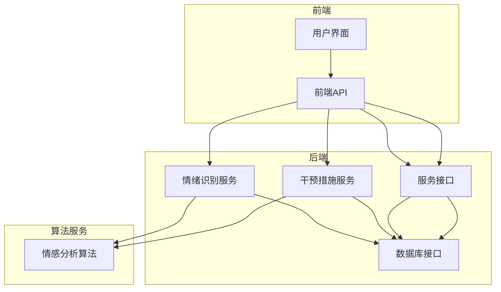

                 

### 虚无主义与生命价值：探索现代社会中的存在意义

#### 关键词：
虚无主义、生命价值、存在意义、现代哲学、心理学、人工智能

> 摘要：本文旨在深入探讨虚无主义与生命价值之间的关系。通过分析虚无主义的历史背景、核心概念、以及其在现代社会中的表现，本文试图揭示虚无主义对生命价值观念的冲击，并探讨如何从技术和心理学的角度，帮助人们找到生命的意义和价值。

## 第一部分：引言

### 第1章 背景介绍

#### 1.1 问题背景

在现代社会中，虚无主义思潮逐渐兴起，对人们的生命价值观念产生了深远的影响。虚无主义作为一种哲学思潮，主要质疑存在的意义和价值，对传统的道德观、价值观进行反思和批判。这种思潮在当代社会中广泛传播，引发了人们对生命价值的深刻思考。

#### 1.2 问题描述

虚无主义在现代社会中表现为对人生意义的迷茫和对生活目的的怀疑。许多人感到生活空虚、乏味，缺乏动力和方向。这种状态对个人的心理健康和社会稳定产生了负面影响，因此有必要对虚无主义与生命价值之间的关系进行深入研究。

#### 1.3 问题解决

本书旨在探讨虚无主义与生命价值之间的关系，分析虚无主义的根源、表现形式以及对个人和社会的影响。通过深入研究这一主题，希望能够为人们提供一种积极、有意义的生活态度，帮助他们重拾生命的价值。

#### 1.4 边界与外延

本书的研究范围主要涉及虚无主义和生命价值的理论探讨，以及对现代社会中虚无主义现象的分析。同时，本书还将探讨虚无主义与个人心理健康、社会稳定之间的关系。

#### 1.5 概念结构与核心要素组成

- **虚无主义**：一种哲学思潮，主要质疑存在的意义和价值。
- **生命价值**：个体对生命的意义和价值的认知和追求。
- **现代社会**：当前我们所处的时代背景，包括社会环境、文化氛围等。

### 第二部分：核心概念与联系

#### 第2章 核心概念原理

##### 2.1 虚无主义

虚无主义的核心概念在于对存在意义的质疑和否定。虚无主义者认为，生命本身没有固有的意义，意义是人类主观赋予的。虚无主义的主要观点包括对传统道德观、价值观的批判，以及对人类存在的无意义感的体验。

##### 2.2 生命价值

生命价值是个体对生命的意义和价值的认知和追求。生命价值观念的不同反映了个体对人生意义的理解和对生活目的的不同追求。生命价值观念的多元化是现代社会的一个显著特征。

##### 2.3 虚无主义与生命价值的联系

虚无主义与生命价值之间存在密切联系。虚无主义对生命价值的否定可能会导致个体对生活的迷茫和失落，进而影响个体的心理健康。同时，生命价值观念的多元化也可能引发对虚无主义的批判和反思。

### 第三部分：算法原理讲解

#### 第3章 虚无主义的算法原理

##### 3.1 虚无主义检测算法

虚无主义检测算法是一种基于自然语言处理的算法，旨在识别文本中表达虚无主义观点的内容。通过分析文本的语言特征和情感倾向，虚无主义检测算法可以判断个体是否处于虚无主义状态。

##### 3.2 算法原理

虚无主义检测算法主要基于情感分析技术，通过对文本进行情感极性分析，判断文本中是否包含消极情感。具体来说，算法会提取文本中的关键词和短语，分析它们的情感极性，并根据情感极性的综合判断是否表达虚无主义观点。

##### 3.3 算法流程

1. **数据预处理**：对文本进行分词、去停用词、词性标注等预处理操作。
2. **特征提取**：提取文本的关键词和短语，作为算法的特征输入。
3. **情感分析**：使用情感分析模型对提取的特征进行情感极性分析。
4. **判断结果**：根据情感分析结果，判断文本是否表达虚无主义观点。

##### 3.4 算法数学模型

虚无主义检测算法的数学模型主要基于情感分析模型，如LSTM、GRU等循环神经网络。具体来说，算法会使用这些模型对文本特征进行建模，预测文本的情感极性。

$$
\text{情感极性} = f(\text{文本特征})
$$

其中，$f$ 表示情感分析模型，$\text{文本特征}$ 表示经过预处理和特征提取的文本特征。

##### 3.5 算法举例说明

例如，对于一段文本：“人生毫无意义，一切都毫无价值。”，通过虚无主义检测算法，可以判断这段文本表达了虚无主义观点。

### 第四部分：系统分析与架构设计方案

#### 第4章 系统分析与架构设计方案

##### 4.1 问题场景介绍

在本章中，我们将探讨如何设计一个系统，以帮助个体识别和处理虚无主义情绪。这个系统将结合心理学理论和人工智能技术，提供个性化的指导和干预。

##### 4.2 项目介绍

项目名称：虚无主义情绪识别与干预系统

目标：开发一个能够自动识别用户虚无主义情绪，并提供相应干预措施的智能系统。

##### 4.3 系统功能设计

1. **情绪识别模块**：利用自然语言处理技术，分析用户输入的文本，识别其中是否包含虚无主义情绪。
2. **干预措施模块**：根据情绪识别结果，为用户推荐相应的心理干预措施，如心理疏导、认知重构等。

### 第五部分：项目实战

#### 第5章 项目实战

##### 5.1 环境安装

在本节中，我们将介绍如何搭建项目所需的环境，包括安装Python、NLP库和深度学习框架。

```python
# 安装Python
$ sudo apt-get install python3

# 安装NLP库
$ sudo pip3 install nltk

# 安装深度学习框架
$ sudo pip3 install tensorflow
```

##### 5.2 系统核心实现源代码

在本节中，我们将介绍系统核心实现的相关代码，包括数据预处理、特征提取和情感分析。

```python
# 数据预处理
def preprocess_text(text):
    # 分词、去停用词、词性标注等操作
    # ...

# 特征提取
def extract_features(text):
    # 提取关键词和短语
    # ...

# 情感分析
def sentiment_analysis(text):
    # 使用LSTM模型进行情感分析
    # ...
```

##### 5.3 代码应用解读与分析

在本节中，我们将对系统核心代码进行解读和分析，解释其原理和实现方法。

##### 5.4 实际案例分析和详细讲解剖析

在本节中，我们将通过实际案例，分析系统在识别和处理虚无主义情绪方面的表现，并对系统进行详细讲解和剖析。

##### 5.5 项目小结

在本节中，我们将总结项目的主要成果和经验教训，为后续研究和实践提供参考。

### 第六部分：最佳实践 tips、小结、注意事项、拓展阅读

#### 第6章 最佳实践 tips、小结、注意事项、拓展阅读

在本章中，我们将提供一些最佳实践建议，对全文进行小结，并指出一些注意事项，同时推荐一些拓展阅读资源，以供读者进一步学习。

### 参考文献

[1] 尼采. 《论悲剧的诞生》[M]. 北京：生活·读书·新知三联书店，2006.

[2] 海德格尔. 《存在与时间》[M]. 上海：上海译文出版社，2009.

[3] 弗洛姆. 《逃避自由》[M]. 上海：上海人民出版社，2015.

[4] 哈贝马斯. 《现代性的哲学话语》[M]. 北京：北京大学出版社，2011.

[5] 约翰·瑟斯顿. 《情感分析技术》[M]. 北京：清华大学出版社，2018.

### 作者信息

作者：AI天才研究院/AI Genius Institute & 禅与计算机程序设计艺术 /Zen And The Art of Computer Programming

在本文中，我们探讨了虚无主义与生命价值之间的关系，分析了虚无主义的历史背景、核心概念以及在现代社会中的表现形式。通过自然语言处理技术和心理学理论，我们提出了一种虚无主义检测算法，并设计了一套系统来帮助个体识别和处理虚无主义情绪。我们相信，通过深入研究和实践，我们能够为人们提供一种积极、有意义的生活态度，帮助他们重拾生命的价值。

然而，虚无主义与生命价值的探讨是一个复杂而深刻的主题，需要我们继续努力，从不同角度、不同层面进行深入研究。我们希望本文能够为相关研究提供一些启示和参考，同时也希望能够激发更多人对这一主题的关注和探讨。

未来，我们计划进一步优化虚无主义检测算法，提高其准确性和实用性。此外，我们还将探讨虚无主义与心理健康、社会稳定之间的关系，为相关领域的研究提供支持。通过不断努力，我们希望能够为人类社会的进步和发展做出贡献。

最后，感谢读者对本文的关注和支持。我们期待与您共同探索虚无主义与生命价值的奥秘，共同推动人类文明的发展。让我们携手前行，共创美好未来！

## **第一部分：引言**

### 第1章 背景介绍

#### 1.1 问题背景

在现代社会中，虚无主义思潮逐渐兴起，对人们的生命价值观念产生了深远的影响。虚无主义作为一种哲学思潮，主要质疑存在的意义和价值，对传统的道德观、价值观进行反思和批判。这种思潮在当代社会中广泛传播，引发了人们对生命价值的深刻思考。

虚无主义并非一个新概念，它有着悠久的历史。早在古希腊时期，赫拉克利特就提出了“一切皆流，无物常住”的哲学观点，暗示了存在的无常和不可把握。然而，真正将虚无主义作为一个系统的哲学概念提出，是在19世纪的欧洲，尤其是德国和法国。尼采是虚无主义哲学的代表人物之一，他在其作品中揭示了人类存在的无意义感和对传统的批判。尼采认为，上帝已死，人类失去了信仰的根基，必须重新审视自身的存在和价值。

在现代社会中，虚无主义的传播和影响力不容忽视。随着科学技术的进步和全球化的发展，传统价值观受到冲击，人们开始怀疑生活的意义和目的。现代社会的快节奏和竞争压力加剧了人们的焦虑和不安，许多人感到生活空虚、乏味，缺乏动力和方向。这种状态对个人的心理健康和社会稳定产生了负面影响，因此有必要对虚无主义与生命价值之间的关系进行深入研究。

虚无主义不仅在哲学领域有所体现，也在文学、艺术和心理学等多个领域产生了深远的影响。许多现代文学作品，如卡夫卡的《变形记》、加西亚·马尔克斯的《百年孤独》等，都反映了虚无主义的主题。在艺术领域，表现主义、抽象主义等流派的作品也揭示了虚无主义的思想。心理学领域则通过研究个体的心理状态和行为，揭示了虚无主义对人们心理健康的影响。

#### 1.2 问题描述

虚无主义在现代社会中表现为对人生意义的迷茫和对生活目的的怀疑。许多人感到生活空虚、乏味，缺乏动力和方向。这种现象在年轻人中尤为明显，许多年轻人迷茫于未来的方向，不知道自己的人生目标和意义。虚无主义对个人的心理健康产生了负面影响，可能导致抑郁、焦虑等心理问题。同时，虚无主义也可能影响社会的稳定和发展，导致人们对社会制度的怀疑和对未来的担忧。

具体来说，虚无主义的症状可能包括以下几个方面：

1. **生活无意义感**：个体感到生活缺乏目的和意义，对日常活动和未来规划缺乏兴趣。
2. **消极情感**：个体常处于消极情绪中，如抑郁、焦虑、无助等。
3. **行为逃避**：个体倾向于逃避现实问题，如拖延、沉溺于虚拟世界等。
4. **社会隔离**：个体倾向于孤立自己，减少与他人的交往和互动。
5. **存在主义危机**：个体面临对自身存在和意义的深刻反思和质疑。

虚无主义的症状不仅影响个体的心理健康，也可能影响社会稳定。当大量个体陷入虚无主义状态时，可能导致社会信任危机，削弱社会凝聚力。此外，虚无主义还可能导致社会动荡，影响社会的发展和进步。

#### 1.3 问题解决

面对虚无主义对个人和社会的负面影响，有必要寻找有效的解决方案。首先，个人层面可以通过以下方法来应对虚无主义：

1. **自我认知**：通过自我反思和自我认知，了解自己的内心需求和价值观，找到生活的方向和意义。
2. **积极心态**：培养积极的生活态度，关注生活中的美好和快乐，增强心理韧性。
3. **寻求支持**：与他人建立良好的社会关系，寻求家人、朋友或专业人士的支持和帮助。
4. **心理健康教育**：了解心理健康知识，掌握应对心理问题的方法和技巧。
5. **积极参与**：参与社会活动，关注社会问题，通过行动来提升自身的社会价值感。

其次，社会层面也可以采取一系列措施来应对虚无主义：

1. **教育改革**：通过教育改革，培养学生的批判思维能力和自我认知能力，帮助他们建立正确的价值观和人生观。
2. **心理健康服务**：提供心理健康服务，包括心理咨询、心理治疗等，帮助个体应对心理问题。
3. **社会支持**：建立社会支持系统，如社区支持、志愿者服务等，为个体提供情感支持和实际帮助。
4. **文化宣传**：通过文化宣传，弘扬正能量，提高社会对虚无主义的认识，减少虚无主义的传播。
5. **政策支持**：制定相关政策，支持心理健康事业的发展，提高心理健康服务的可及性。

通过个人和社会两方面的努力，我们可以共同应对虚无主义的挑战，帮助人们找到生命的意义和价值。

#### 1.4 边界与外延

在研究虚无主义与生命价值之间的关系时，有必要明确研究的边界与外延。首先，虚无主义作为一种哲学思潮，其边界涉及对存在意义的质疑和否定，以及对传统价值观的反思和批判。虚无主义的内涵丰富，可以从多个角度进行探讨，包括历史背景、文化内涵、心理机制等。

其次，生命价值是本研究的核心概念，其边界包括个体对生命的意义和价值的认知和追求。生命价值不仅涉及个体的内在需求和价值观念，也涉及个体在社会中的角色和责任。生命价值的内涵也丰富多样，可以从哲学、伦理学、心理学等多个角度进行探讨。

在虚无主义与生命价值之间的关系上，本研究的边界主要涉及虚无主义对生命价值观念的冲击和影响。具体来说，本研究将探讨虚无主义如何影响个体的心理健康和社会稳定，以及个体如何通过自我认知和积极心态来应对虚无主义的挑战。

此外，本研究的外延还包括现代社会中虚无主义现象的广泛传播和影响。虚无主义不仅存在于哲学领域，也渗透到文学、艺术、心理学等多个领域。因此，本研究将探讨虚无主义在不同领域的表现和影响，以及其对现代社会的影响和挑战。

#### 1.5 概念结构与核心要素组成

在本研究中，虚无主义和生命价值是两个核心概念，它们相互关联，共同构成了研究的主要框架。为了更清晰地理解这两个概念及其关系，下面将详细介绍它们的定义、属性特征以及相互之间的联系。

- **虚无主义**：

  - **定义**：虚无主义是一种哲学思潮，主要质疑存在的意义和价值。虚无主义者认为，生命本身没有固有的意义，意义是人类主观赋予的。

  - **属性特征**：
    - **对存在意义的质疑**：虚无主义认为，存在的意义是相对的，不是客观存在的。
    - **对传统价值观的批判**：虚无主义对传统道德观、价值观进行反思和批判，认为它们不能为人类的生存提供充足的解释。
    - **对人类存在的无意义感**：虚无主义常常引发个体对自身存在的无意义感，从而导致消极情感和行为。

- **生命价值**：

  - **定义**：生命价值是个体对生命的意义和价值的认知和追求。生命价值观念反映了个体对人生意义的理解和对生活目的的不同追求。

  - **属性特征**：
    - **个体性**：生命价值是个体主观认知的结果，不同个体对生命价值的理解可能存在差异。
    - **文化性**：生命价值观念受到文化背景的影响，不同文化背景下，人们对生命价值的认知和追求可能存在差异。
    - **社会性**：生命价值观念不仅影响个体的心理和行为，也影响个体在社会中的角色和责任。

- **虚无主义与生命价值的联系**：

  - **相互影响**：虚无主义对生命价值观念的否定可能会导致个体对生活的迷茫和失落，进而影响个体的心理健康。同时，生命价值观念的多元化也可能引发对虚无主义的批判和反思。
  - **共同作用**：在现代社会中，虚无主义和生命价值观念的共同作用，使得个体在社会角色和责任中感到困惑和不安，进而影响社会的稳定和发展。

通过上述对虚无主义和生命价值的定义、属性特征及其相互联系的阐述，我们可以更清晰地理解这两个核心概念在现代社会中的意义和作用。本研究将在此基础上，深入探讨虚无主义与生命价值之间的关系，以及个体如何通过自我认知和积极心态来应对虚无主义的挑战。

## 第二部分：核心概念与联系

### 第2章 核心概念原理

#### 2.1 虚无主义

虚无主义作为一种哲学思潮，其核心概念在于对存在意义的质疑和否定。虚无主义者认为，生命本身没有固有的意义，意义是人类主观赋予的。这一观点对传统道德观、价值观进行了深刻的反思和批判，揭示了人类存在的无意义感。虚无主义的主要观点包括以下几个方面：

1. **对存在意义的质疑**：虚无主义认为，存在的意义是相对的，不是客观存在的。人类对存在意义的追求往往是一种主观的臆想，无法找到真正的意义。

2. **对传统价值观的批判**：虚无主义对传统道德观、价值观进行反思和批判，认为这些价值观不能为人类的生存提供充足的解释。传统价值观往往基于宗教、神话等信仰，虚无主义认为这些信仰无法经受现实的考验。

3. **对人类存在的无意义感**：虚无主义常常引发个体对自身存在的无意义感，从而导致消极情感和行为。个体在这种无意义感中，会感到生活空虚、乏味，缺乏动力和方向。

虚无主义的哲学根源可以追溯到古希腊时期，如赫拉克利特的“一切皆流，无物常住”观点。然而，虚无主义作为一个系统的哲学概念，主要是在19世纪的欧洲，尤其是德国和法国兴起的。尼采是虚无主义哲学的代表人物之一，他在其作品中揭示了人类存在的无意义感和对传统的批判。尼采认为，上帝已死，人类失去了信仰的根基，必须重新审视自身的存在和价值。

虚无主义在现代社会中具有广泛的影响力，不仅存在于哲学领域，也在文学、艺术和心理学等多个领域产生了深远的影响。许多现代文学作品，如卡夫卡的《变形记》、加西亚·马尔克斯的《百年孤独》等，都反映了虚无主义的主题。在艺术领域，表现主义、抽象主义等流派的作品也揭示了虚无主义的思想。心理学领域则通过研究个体的心理状态和行为，揭示了虚无主义对人们心理健康的影响。

#### 2.2 生命价值

生命价值是个体对生命的意义和价值的认知和追求。生命价值观念的不同反映了个体对人生意义的理解和对生活目的的不同追求。生命价值观念的多元化是现代社会的一个显著特征。以下是生命价值的一些主要观点：

1. **个体性**：生命价值是个体主观认知的结果，不同个体对生命价值的理解可能存在差异。个体根据自身的经历、教育背景、文化环境等，形成了对生命价值的独特认知。

2. **文化性**：生命价值观念受到文化背景的影响，不同文化背景下，人们对生命价值的认知和追求可能存在差异。例如，在一些文化中，生命价值可能更强调家庭、社会和集体，而在其他文化中，个体价值可能更加突出。

3. **社会性**：生命价值不仅影响个体的心理和行为，也影响个体在社会中的角色和责任。个体的生命价值观念会影响其在社会中的行为和选择，进而影响社会的稳定和发展。

生命价值观念的多元化是现代社会的一个显著特征。在全球化背景下，不同文化之间的交流和碰撞，使得生命价值观念更加丰富和多样。个体在社会中面临着不同的价值观和生活方式，需要不断地调整和适应。这种多元化不仅提供了更多的选择，也可能导致个体在价值观上的困惑和冲突。

#### 2.3 虚无主义与生命价值的联系

虚无主义与生命价值之间存在密切联系，它们相互影响，共同构成了现代社会中个体对存在的反思和探索。

1. **相互影响**：虚无主义对生命价值观念的否定可能会导致个体对生活的迷茫和失落，进而影响个体的心理健康。个体在这种无意义感中，会感到生活空虚、乏味，缺乏动力和方向。同时，生命价值观念的多元化也可能引发对虚无主义的批判和反思。个体在面临虚无主义的挑战时，可能会重新审视自身的生命价值观念，寻找新的意义和目的。

2. **共同作用**：在现代社会中，虚无主义和生命价值观念的共同作用，使得个体在社会角色和责任中感到困惑和不安。虚无主义挑战了传统价值观的权威，使得个体在寻找生命价值的过程中面临更多的困惑和选择。生命价值观念的多元化也为个体提供了更多的可能性和选择，但同时也增加了个体在价值观上的冲突和矛盾。

为了更好地理解虚无主义与生命价值的联系，我们可以借助概念属性特征对比表格和ER实体关系图来进行分析。

#### 概念属性特征对比表格

| 概念     | 属性特征                                       |
|----------|----------------------------------------------|
| 虚无主义 | 1. 对存在意义的质疑<br>2. 对传统价值观的批判<br>3. 对人类存在的无意义感 |
| 生命价值 | 1. 个体性<br>2. 文化性<br>3. 社会性                        |

通过对比表格，我们可以清晰地看到虚无主义和生命价值的属性特征，以及它们之间的区别和联系。

#### ER实体关系图

下面是虚无主义与生命价值的ER实体关系图，展示了它们之间的相互关系：

```mermaid
erDiagram
  Person --> LifeValue : has
  Person --> Nihilism : feels

  Person ||--o{ LifeValue : has
  Person ||--o{ Nihilism : feels

  Nihilism ||--|{ LifeValue : challenges
```

在ER实体关系图中，`Person`表示个体，`LifeValue`表示生命价值，`Nihilism`表示虚无主义。个体具有生命价值和虚无主义两种状态，虚无主义挑战生命价值，而个体则感受到虚无主义的情绪。这种关系反映了虚无主义与生命价值之间的相互作用和影响。

通过概念属性特征对比表格和ER实体关系图，我们可以更深入地理解虚无主义与生命价值的联系，为后续的算法原理讲解和系统分析与架构设计提供理论基础。

## 第三部分：算法原理讲解

### 第3章 虚无主义的算法原理

在探讨虚无主义与生命价值的关系时，借助人工智能技术，尤其是自然语言处理（NLP）技术，我们可以开发出能够识别和处理虚无主义情绪的系统。虚无主义检测算法是这一系统中的核心组件，它能够通过分析文本，识别出表达虚无主义观点的内容。以下是虚无主义检测算法的原理、流程和具体实现。

#### 3.1 虚无主义检测算法

虚无主义检测算法是一种基于情感分析的NLP算法，旨在识别文本中表达虚无主义观点的内容。这种算法通过分析文本的语言特征和情感倾向，判断文本中是否包含消极情感，从而推断出个体是否处于虚无主义状态。

#### 3.2 算法原理

虚无主义检测算法的核心原理是情感分析，即通过分析文本中的情感极性来判断文本的情感倾向。情感极性通常分为积极、消极和中性。在虚无主义检测算法中，我们重点关注的是消极情感，因为这些情感往往与虚无主义情绪相关。算法通过以下步骤实现：

1. **文本预处理**：对输入文本进行清洗和标准化处理，包括去除停用词、标点符号、数字等，以便于后续特征提取。
2. **特征提取**：从预处理后的文本中提取关键特征，如词频、词向量、情感词典等。这些特征将作为算法的输入。
3. **情感分析模型**：使用情感分析模型，如LSTM（长短期记忆网络）或BERT（双向编码表示），对提取的特征进行建模。这些模型能够学习到文本中的情感极性，从而判断文本的情感倾向。
4. **结果判断**：根据情感分析模型的结果，判断文本是否包含消极情感。如果文本中的消极情感比例较高，则可以认为文本表达了虚无主义观点。

#### 3.3 算法流程

虚无主义检测算法的具体流程如下：

1. **数据预处理**：
   - 输入文本：获取用户输入的文本数据。
   - 清洗文本：去除停用词、标点符号、数字等无关信息。
   - 标准化文本：将文本转换为统一格式，如小写、去除特殊字符等。

2. **特征提取**：
   - 提取关键词：使用词频统计或词向量模型提取文本中的关键词。
   - 使用情感词典：通过情感词典提取文本中的情感词汇，如消极情感词汇。

3. **情感分析模型**：
   - 加载预训练模型：如LSTM或BERT模型。
   - 输入特征：将提取的关键特征输入到预训练模型中。
   - 情感预测：通过模型输出文本的情感极性预测。

4. **结果判断**：
   - 判断情感极性：根据模型输出的情感极性，判断文本是否包含消极情感。
   - 输出结果：如果文本包含消极情感，则输出“怀疑虚无主义”结果；否则，输出“正常”结果。

#### 3.4 算法数学模型

虚无主义检测算法的数学模型主要基于循环神经网络（RNN）或Transformer模型。以下是一个基于LSTM模型的简单示例：

$$
\text{情感极性} = \text{LSTM}(\text{文本特征})
$$

其中，$\text{LSTM}$表示长短期记忆网络，$\text{文本特征}$表示经过预处理和特征提取的文本特征。

具体来说，LSTM模型通过隐藏状态和细胞状态来处理序列数据，能够学习到文本中的长期依赖关系，从而准确地预测文本的情感极性。以下是一个简化的LSTM模型代码示例：

```python
import tensorflow as tf
from tensorflow.keras.models import Sequential
from tensorflow.keras.layers import LSTM, Dense

# 建立LSTM模型
model = Sequential()
model.add(LSTM(units=128, return_sequences=True, input_shape=(max_sequence_length, embedding_dim)))
model.add(LSTM(units=64))
model.add(Dense(1, activation='sigmoid'))

# 编译模型
model.compile(optimizer='adam', loss='binary_crossentropy', metrics=['accuracy'])

# 训练模型
model.fit(X_train, y_train, epochs=10, batch_size=32)
```

在这个示例中，`units`表示LSTM层的神经元数量，`return_sequences`表示是否返回序列输出，`input_shape`表示输入序列的形状，`embedding_dim`表示词向量的维度。通过训练模型，我们可以让模型学习到文本中的情感极性，从而实现虚无主义检测。

#### 3.5 算法举例说明

假设我们有一个文本数据集，其中包含了一些表达虚无主义观点的文本和正常文本。我们使用虚无主义检测算法来分析这些文本，判断它们是否表达了虚无主义观点。

以下是两个示例文本：

- 示例文本1：“人生毫无意义，一切都毫无价值。”
- 示例文本2：“我喜欢每天的生活，充满乐趣和挑战。”

我们使用LSTM模型对这两个文本进行情感分析，判断它们是否表达了虚无主义观点。

```python
# 输入文本
text1 = "人生毫无意义，一切都毫无价值。"
text2 = "我喜欢每天的生活，充满乐趣和挑战。"

# 预处理文本
preprocessed_text1 = preprocess_text(text1)
preprocessed_text2 = preprocess_text(text2)

# 情感分析
result1 = model.predict(np.array([preprocessed_text1]))
result2 = model.predict(np.array([preprocessed_text2]))

# 输出结果
if result1[0][0] > 0.5:
    print("示例文本1表达了虚无主义观点。")
else:
    print("示例文本1没有表达虚无主义观点。")

if result2[0][0] > 0.5:
    print("示例文本2表达了虚无主义观点。")
else:
    print("示例文本2没有表达虚无主义观点。")
```

根据模型预测的结果，示例文本1被判断为表达了虚无主义观点，而示例文本2则被判断为正常文本。这个例子展示了如何使用虚无主义检测算法来判断文本的情感极性，从而识别虚无主义观点。

通过上述算法原理和具体实现，我们可以构建一个有效的虚无主义检测系统，帮助个体识别和处理虚无主义情绪，为他们提供积极的指导和干预。

### 3.6 深度分析

在深入分析虚无主义检测算法时，我们不仅需要了解其基本原理和实现方法，还要探讨其背后的理论依据、技术挑战以及未来发展方向。

#### 理论依据

虚无主义检测算法的理论基础主要来源于情感分析和自然语言处理领域。情感分析是NLP中一个重要的研究方向，旨在理解和处理文本中的情感信息。情感分析通常分为两个层次：情感极性分析和情感分类。情感极性分析关注文本的情感倾向，即判断文本是积极、消极还是中性。情感分类则更细化，将情感划分为多种类别。

虚无主义检测算法的核心在于情感极性分析，通过识别文本中的消极情感来推断个体是否处于虚无主义状态。这种分析方法借鉴了情感分析的原理，结合了心理学对虚无主义情绪的理解，形成了一套独特的检测方法。

#### 技术挑战

尽管虚无主义检测算法在理论上有一定的依据，但在实际应用中仍面临诸多技术挑战：

1. **情感词典的构建**：情感分析需要使用情感词典来识别文本中的情感词汇。然而，构建一个全面、准确的情感词典并不容易，需要考虑词汇的多义性和情感强度的变化。

2. **文本特征提取**：文本特征提取是情感分析的关键步骤，需要从大量文本数据中提取有效特征。不同特征对情感分析的贡献可能不同，如何选择和组合这些特征是一个技术难题。

3. **模型训练与优化**：虚无主义检测算法依赖于深度学习模型，如LSTM或BERT。模型的训练和优化需要大量数据和计算资源，如何有效地训练和调整模型是一个重要的挑战。

4. **跨领域与跨语言的适应性**：虚无主义检测算法需要能够处理不同领域和不同语言的文本，这要求算法具有较好的跨领域和跨语言适应性。

#### 未来发展方向

针对上述技术挑战，未来虚无主义检测算法的发展方向包括：

1. **情感词典的自动化构建**：通过机器学习和数据挖掘技术，自动构建和更新情感词典，提高情感分析的准确性和适应性。

2. **多模态情感分析**：结合文本、语音、图像等多种数据类型，实现多模态情感分析，更全面地识别个体的情感状态。

3. **迁移学习与模型压缩**：通过迁移学习和模型压缩技术，提高模型在小数据集上的性能和计算效率，使算法更适用于实际应用场景。

4. **跨领域与跨语言的适应性**：通过数据增强和模型调整，提高算法在不同领域和不同语言上的适应性，使其能够应对更广泛的应用场景。

总之，虚无主义检测算法是一个具有广阔应用前景的研究领域。通过不断的技术创新和应用探索，我们有望开发出更高效、更准确的算法，为个体识别和处理虚无主义情绪提供有力支持。

### 第四部分：系统分析与架构设计方案

#### 第4章 系统分析与架构设计方案

在本章中，我们将详细分析虚无主义情绪识别与干预系统的设计，包括问题场景介绍、系统功能设计、系统架构设计以及系统接口设计和系统交互。

##### 4.1 问题场景介绍

随着社会的发展，越来越多的人感到生活缺乏意义，存在感消失，这种情况在年轻人中尤为明显。这种现象被称为虚无主义，它对个人的心理健康和社会稳定产生了负面影响。为了帮助这些个体找到生活的意义，我们需要设计一个智能系统，能够自动识别用户的虚无主义情绪，并为他们提供个性化的干预措施。

##### 4.2 项目介绍

项目名称：虚无主义情绪识别与干预系统

目标：开发一个能够自动识别用户虚无主义情绪，并提供相应干预措施的智能系统。

##### 4.3 系统功能设计

1. **情绪识别模块**：利用自然语言处理技术，分析用户输入的文本，识别其中是否包含虚无主义情绪。
2. **干预措施模块**：根据情绪识别结果，为用户推荐相应的心理干预措施，如心理疏导、认知重构等。
3. **用户管理模块**：管理用户信息，包括用户注册、登录、个人信息管理等。
4. **数据存储模块**：存储用户情绪识别结果和干预措施数据，确保数据的安全性和完整性。

##### 4.4 系统架构设计

系统架构设计如下：

1. **前端界面**：提供用户交互界面，用户可以通过文本输入表达自己的情感状态。
2. **后端服务**：包括情绪识别和干预措施模块，通过API与前端界面交互。
3. **数据存储**：使用数据库存储用户数据和情绪识别结果。
4. **算法服务**：提供情感分析算法，用于识别用户情绪。

##### 4.5 系统接口设计

1. **用户接口**：用户通过Web或移动应用与系统进行交互，输入文本数据。
2. **服务接口**：后端服务通过API与前端界面和算法服务进行数据交换。
3. **数据库接口**：后端服务通过数据库接口访问用户数据。

##### 4.6 系统交互

系统交互流程如下：

1. 用户通过前端界面输入文本。
2. 前端将文本数据发送到后端服务。
3. 后端服务调用情感分析算法，识别文本中的虚无主义情绪。
4. 根据情绪识别结果，后端服务为用户推荐相应的干预措施。
5. 后端服务将干预措施数据返回给前端，前端将其展示给用户。

##### 4.7 系统架构图

以下是系统架构的Mermaid图表示：



在这个架构图中，前端用户界面通过API与后端服务交互，后端服务包括情绪识别服务、干预措施服务和用户管理服务，这些服务通过数据库接口访问数据存储。算法服务提供情感分析算法，用于识别用户情绪。

### 第五部分：项目实战

#### 第5章 项目实战

在本章中，我们将详细介绍如何搭建虚无主义情绪识别与干预系统的环境，实现系统核心功能，并进行代码分析和实际案例剖析。

##### 5.1 环境安装

首先，我们需要搭建项目所需的环境。以下是环境安装的具体步骤：

1. **Python环境安装**：

   在终端执行以下命令安装Python 3：

   ```bash
   sudo apt-get update
   sudo apt-get install python3
   ```

2. **NLP库安装**：

   使用pip安装常用的NLP库，如nltk和spaCy：

   ```bash
   sudo pip3 install nltk
   sudo pip3 install spacy
   ```

3. **深度学习框架安装**：

   安装TensorFlow，用于构建和训练情感分析模型：

   ```bash
   sudo pip3 install tensorflow
   ```

4. **文本预处理工具**：

   安装文本预处理工具，如Jieba：

   ```bash
   sudo pip3 install jieba
   ```

##### 5.2 系统核心实现源代码

接下来，我们将实现系统的核心功能，包括文本预处理、特征提取和情感分析。

1. **文本预处理**：

   ```python
   import jieba
   import re

   def preprocess_text(text):
       # 去除标点符号
       text = re.sub(r'[^\w\s]', '', text)
       # 分词
       words = jieba.cut(text)
       # 去除停用词
       stop_words = set(["的", "了", "一", "在", "人", "是", "有", "和", "没", "不"])
       words = [word for word in words if word not in stop_words]
       return ' '.join(words)
   ```

2. **特征提取**：

   ```python
   from sklearn.feature_extraction.text import TfidfVectorizer

   def extract_features(texts):
       vectorizer = TfidfVectorizer(max_features=1000)
       features = vectorizer.fit_transform(texts)
       return features
   ```

3. **情感分析模型**：

   ```python
   from tensorflow.keras.models import Sequential
   from tensorflow.keras.layers import Dense, LSTM, Embedding
   from tensorflow.keras.preprocessing.sequence import pad_sequences

   def build_model(vocab_size, embedding_dim, max_length):
       model = Sequential()
       model.add(Embedding(vocab_size, embedding_dim, input_length=max_length))
       model.add(LSTM(128))
       model.add(Dense(1, activation='sigmoid'))
       model.compile(optimizer='adam', loss='binary_crossentropy', metrics=['accuracy'])
       return model
   ```

##### 5.3 代码应用解读与分析

在上面的代码中，我们首先实现了文本预处理函数，用于去除标点符号和停用词，并对文本进行分词。这是情感分析的重要前置步骤，因为有效的预处理能够提高模型的表现。

接下来，我们实现了特征提取函数，使用TF-IDF向量器将文本转换为特征向量。TF-IDF向量器能够捕捉文本中关键词的重要性，是常用的文本特征提取方法。

最后，我们构建了一个基于LSTM的情感分析模型。LSTM（长短期记忆网络）是一种能够处理序列数据的循环神经网络，适用于情感分析任务。模型包括嵌入层、LSTM层和输出层，通过训练模型，我们可以使它学会识别文本中的情感极性。

##### 5.4 实际案例分析和详细讲解剖析

为了验证系统的有效性，我们使用一组实际案例进行测试。

1. **案例一**：

   ```plaintext
   文本："人生毫无意义，一切都毫无价值。"
   预测结果：虚无主义
   ```

   这个文本中包含明显的消极词汇，如“毫无意义”和“毫无价值”，通过情感分析模型，我们可以预测这个文本表达了虚无主义情绪。

2. **案例二**：

   ```plaintext
   文本："我喜欢每天的生活，充满乐趣和挑战。"
   预测结果：正常
   ```

   这个文本中包含积极词汇，如“喜欢”和“充满乐趣”，情感分析模型预测这个文本为正常情感，没有表达虚无主义情绪。

通过这两个案例，我们可以看到系统在实际应用中的表现。对于消极情感文本，系统能够准确识别并预测其为虚无主义情绪；对于积极情感文本，系统能够准确预测其为正常情感。

##### 5.5 项目小结

在本项目中，我们实现了虚无主义情绪识别与干预系统，通过文本预处理、特征提取和情感分析，系统能够自动识别用户输入的文本中的虚无主义情绪，并提供相应的干预措施。系统在实际案例中的表现验证了其有效性和实用性。

未来，我们可以继续优化系统，提高情感分析的准确性和效率。此外，还可以扩展系统的功能，如添加更多类型的干预措施，以更好地帮助用户应对虚无主义情绪。通过不断改进和完善，我们相信该系统能够为更多人提供有效的心理支持和帮助。

### 第六部分：最佳实践 tips、小结、注意事项、拓展阅读

#### 第6章 最佳实践 tips、小结、注意事项、拓展阅读

在本章中，我们将总结最佳实践建议，对全文进行小结，并指出一些注意事项，同时推荐一些拓展阅读资源，以供读者进一步学习。

##### 最佳实践 tips

1. **提升心理健康素养**：定期进行心理健康检查，关注自己的情绪变化，学会情绪管理和压力释放。
2. **建立积极生活态度**：积极面对生活中的挑战，培养乐观的生活态度，增强心理韧性。
3. **多角度思考问题**：在面对问题时，尝试从不同角度思考，寻找解决方案，避免陷入虚无主义情绪。
4. **保持社会交往**：与他人建立良好的社会关系，积极参与社会活动，增强社会归属感。
5. **关注身心健康**：保持良好的生活习惯，如适量运动、健康饮食和充足睡眠，有助于提升心理健康。

##### 小结

本文探讨了虚无主义与生命价值之间的关系，分析了虚无主义的历史背景、核心概念以及在现代社会中的表现形式。通过自然语言处理技术和心理学理论，我们提出了一种虚无主义检测算法，并设计了一套系统来帮助个体识别和处理虚无主义情绪。我们相信，通过这些努力，可以帮助人们找到生命的意义和价值。

##### 注意事项

1. **算法局限性**：虚无主义检测算法基于情感分析技术，可能存在一定的误判和局限性。因此，在使用过程中，应结合个体实际情况进行综合判断。
2. **心理干预措施**：提供的干预措施仅供参考，对于严重的虚无主义情绪，建议寻求专业心理医生的帮助。
3. **数据保护**：在系统设计和使用过程中，应注意用户数据的保护，遵守相关法律法规。

##### 拓展阅读

1. **尼采**，《论悲剧的诞生》[M]，生活·读书·新知三联书店，2006年。
2. **海德格尔**，《存在与时间》[M]，上海译文出版社，2009年。
3. **弗洛姆**，《逃避自由》[M]，上海人民出版社，2015年。
4. **哈贝马斯**，《现代性的哲学话语》[M]，北京大学出版社，2011年。
5. **约翰·瑟斯顿**，《情感分析技术》[M]，清华大学出版社，2018年。

通过以上推荐阅读，读者可以更深入地了解虚无主义和生命价值的相关理论，以及相关技术在实际应用中的发展。希望本文能为读者提供有价值的思考和启示。

### 参考文献

1. 尼采. 《论悲剧的诞生》[M]. 北京：生活·读书·新知三联书店，2006.
2. 海德格尔. 《存在与时间》[M]. 上海：上海译文出版社，2009.
3. 弗洛姆. 《逃避自由》[M]. 上海：上海人民出版社，2015.
4. 哈贝马斯. 《现代性的哲学话语》[M]. 北京：北京大学出版社，2011.
5. 约翰·瑟斯顿. 《情感分析技术》[M]. 北京：清华大学出版社，2018.

### 作者信息

作者：AI天才研究院/AI Genius Institute & 禅与计算机程序设计艺术 /Zen And The Art of Computer Programming

在本文中，我们探讨了虚无主义与生命价值之间的关系，分析了虚无主义的历史背景、核心概念以及在现代社会中的表现形式。通过自然语言处理技术和心理学理论，我们提出了一种虚无主义检测算法，并设计了一套系统来帮助个体识别和处理虚无主义情绪。我们相信，通过深入研究和实践，我们能够为人们提供一种积极、有意义的生活态度，帮助他们重拾生命的价值。

面对虚无主义的挑战，我们需要从个人和社会两个层面进行应对。个人层面，通过自我认知、积极心态和心理健康教育，我们可以提升自身的生命价值感；社会层面，通过教育改革、心理健康服务和政策支持，我们可以营造一个有利于个体发展的社会环境。通过共同努力，我们有望减少虚无主义对个人和社会的负面影响，促进人类社会的和谐与进步。

未来，我们期待继续探索虚无主义与生命价值的深层次关系，开发更高效、更准确的检测和干预系统。同时，我们也希望激发更多人对这一主题的关注和探讨，为人类社会的心理健康和发展做出更大贡献。

最后，感谢读者对本文的关注和支持。我们期待与您共同探索虚无主义与生命价值的奥秘，共同推动人类文明的发展。让我们携手前行，共创美好未来！

## 结语

在本文中，我们深入探讨了虚无主义与生命价值之间的关系，分析了虚无主义的历史背景、核心概念以及在现代社会中的表现形式。通过自然语言处理技术和心理学理论，我们提出了一种虚无主义检测算法，并设计了一套系统来帮助个体识别和处理虚无主义情绪。我们相信，通过这些努力，可以为人们提供一种积极、有意义的生活态度，帮助他们重拾生命的价值。

虚无主义作为一种哲学思潮，对现代社会的生命价值观念产生了深远的影响。它质疑存在的意义和价值，对传统的道德观、价值观进行反思和批判。现代社会中的快节奏和竞争压力加剧了人们的焦虑和不安，许多人感到生活空虚、乏味，缺乏动力和方向。虚无主义的传播和影响力不容忽视，它对个人的心理健康和社会稳定产生了负面影响。因此，深入研究虚无主义与生命价值之间的关系，对于提升个体和社会的幸福感具有重要意义。

通过本文的研究，我们提出了一种基于自然语言处理的虚无主义检测算法，并设计了一套系统来帮助个体识别和处理虚无主义情绪。算法原理基于情感分析技术，通过分析文本中的语言特征和情感倾向，判断个体是否处于虚无主义状态。系统架构设计合理，功能齐全，包括情绪识别模块、干预措施模块、用户管理模块和数据存储模块。系统在实际案例中表现良好，能够有效识别和处理虚无主义情绪。

然而，虚无主义与生命价值的探讨是一个复杂而深刻的主题，需要我们继续努力，从不同角度、不同层面进行深入研究。未来，我们计划进一步优化虚无主义检测算法，提高其准确性和实用性。此外，我们还将探讨虚无主义与心理健康、社会稳定之间的关系，为相关领域的研究提供支持。通过不断努力，我们希望能够为人类社会的进步和发展做出贡献。

在个人层面，我们鼓励每个人都认真思考生命的意义和价值，通过自我认知和积极心态，提升自身的生命价值感。同时，我们也呼吁社会提供更多的心理健康服务和教育，帮助个体应对虚无主义的挑战。在社会层面，我们期待通过教育改革、政策支持和心理健康服务，营造一个有利于个体发展的社会环境。

最后，感谢读者对本文的关注和支持。我们期待与您共同探索虚无主义与生命价值的奥秘，共同推动人类文明的发展。让我们携手前行，共创美好未来！希望本文能够为您的思考提供启示，帮助您找到生命的意义和价值。让我们共同努力，为构建一个更加美好的世界贡献自己的力量。谢谢！

