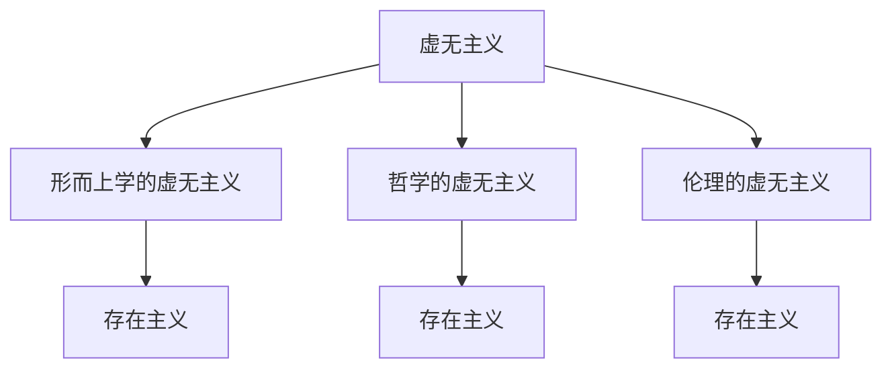
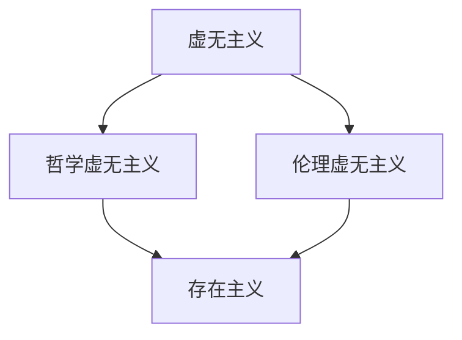

                 

### 背景与目的

#### 起源与发展

虚无主义（Nihilism）作为哲学上的一个重要概念，起源于19世纪的欧洲。起初，虚无主义是对传统宗教和道德价值观的质疑与否定。它主张没有绝对的真理，没有客观的道德标准，生活本身缺乏意义。这一思想在当时的背景下，受到了工业革命、科学进步和世俗化的强烈影响，迅速成为一种哲学思潮。

虚无主义的核心理念是“不存在固有价值”或“没有任何事物有固有的意义或目的”。这一观点引发了广泛的社会和心理问题，特别是在教育领域。传统的教育体系建立在宗教和伦理教条之上，而虚无主义的兴起使教育者面临新的挑战：如何在缺乏固有价值的世界中培养有道德、有责任感的人？

#### 本篇文章的目的

本文旨在探讨虚无主义对生命教育的影响，并探讨如何培养面对存在问题的智慧。文章结构如下：

1. **虚无主义的基本概念**：介绍虚无主义的历史背景、基本概念及其类型与演变。
2. **虚无主义的影响与应对**：分析虚无主义对个人心理、教育体系和社会责任的冲击，并探讨生命教育的意义与目标。
3. **培养面对存在问题的智慧**：详细阐述存在问题的解决策略，包括问题识别、分析、解决方案和实践。
4. **实践与案例分析**：通过具体案例说明如何应对虚无主义带来的挑战。
5. **最佳实践与反思**：总结最佳实践技巧，并反思教育体系中的虚无主义应对策略。

通过这一结构，本文旨在帮助读者深入理解虚无主义的本质，认识到它在现代社会中的重要地位，并提供一套有效的应对策略，以培养面对存在问题的智慧。

### 关键词

- **虚无主义**：哲学上的否定固有价值和意义的思潮。
- **生命教育**：旨在培养个体面对生活挑战的能力和智慧。
- **存在问题**：个体在面对现实世界时产生的意义和价值的困惑。
- **智慧培养**：通过教育和实践提升个体面对存在问题的能力。
- **心理建设**：通过认知和行为训练增强个体的心理韧性。

### 摘要

本文探讨了虚无主义对生命教育的影响，分析了虚无主义的基本概念及其类型与演变。通过探讨虚无主义对个人心理、教育体系和社会责任的冲击，本文提出了生命教育的意义与目标，并详细阐述了培养面对存在问题的智慧的方法。最后，通过具体案例分析和最佳实践总结，本文为教育者提供了应对虚无主义的策略，以促进个体的心理建设和道德发展。

### 第一部分：虚无主义的基本概念

虚无主义（Nihilism）作为哲学上的一个重要概念，其起源和发展与19世纪的欧洲有着密切的联系。在那时，工业革命、科学进步和世俗化进程加速，人们开始质疑传统的宗教和道德价值观。虚无主义主张没有绝对的真理和客观的道德标准，生活本身缺乏固有的意义和目的。

#### 1.1 历史背景

虚无主义的思想可以追溯到19世纪初期的俄国和西方哲学。在俄国，尼采（Nietzsche）是虚无主义思想的代表人物之一。他在《查拉图斯特拉如是说》中提出了“上帝已死”的观点，认为人类需要重新寻找自己的价值观和意义。同时，西方哲学中的斯宾诺莎（Spinoza）和叔本华（Schopenhauer）也对虚无主义有着重要的影响。斯宾诺莎的无神论和叔本华的悲观主义都为虚无主义提供了哲学基础。

#### 1.2 虚无主义的基本概念

虚无主义的基本概念主要包括三个方面：形而上学的虚无主义、哲学的虚无主义和伦理的虚无主义。

- **形而上学的虚无主义**：否定现实存在的基础，认为没有客观的实体和现实世界。
- **哲学的虚无主义**：否定意义和价值，认为生活本身缺乏目的和意义。
- **伦理的虚无主义**：否定道德规范和责任感，认为道德没有客观标准。

这三种类型的虚无主义在哲学和现实生活中都有所体现。例如，形而上学的虚无主义在存在主义哲学中得到了回应，而哲学的虚无主义和伦理的虚无主义则对现代人的心理和行为产生了深远的影响。

#### 1.3 虚无主义的类型与演变

虚无主义在历史中经历了不同的演变。早期虚无主义主要集中在哲学领域，对宗教和道德的否定是其主要特征。随着时间的发展，虚无主义的影响逐渐扩展到社会和文化的各个方面。

- **早期的虚无主义**：以尼采为代表，强调个体超越传统价值观，寻找新的意义。
- **现代虚无主义**：在现代社会中，虚无主义思想在年轻人中尤为流行，他们质疑传统的信仰和价值观，寻求自我实现。
- **后现代虚无主义**：在后现代主义思潮中，虚无主义被视为对现代性和进步主义的批判，强调相对主义和多元性。

#### 核心概念与联系

为了更好地理解虚无主义的多样性，我们可以通过一个ER（实体关系）图来描述其不同类型和关系。

**ER实体关系图：**



在这个ER图中，虚无主义作为整体概念，与形而上学的虚无主义、哲学的虚无主义和伦理的虚无主义三个子概念相连。而存在主义则与这三种虚无主义类型有交叉关系，体现了存在主义对虚无主义回应和批判的多样性。

通过这一部分的分析，我们能够更全面地理解虚无主义的基本概念及其历史演变。接下来，我们将进一步探讨虚无主义对生命教育的影响。

#### 1.4 虚无主义与存在主义的关系

虚无主义与存在主义是哲学上的两个重要概念，它们之间既有对立也有联系。存在主义是对虚无主义的一种回应，试图在虚无主义的背景下重新定义人类存在的意义和价值。

**1.4.1 对立关系**

虚无主义否定生活的意义和目的，认为世界缺乏固有的价值。而存在主义则主张人类必须主动创造自己的意义，通过行动和选择赋予生活以价值。存在主义认为，尽管世界本身是荒谬和没有意义的，但个体可以通过自由意志和选择，创造出有意义的生活。

**1.4.2 联系与互动**

尽管虚无主义和存在主义在基本立场上有显著差异，但它们之间也存在互动和相互影响。虚无主义对传统价值观的质疑为存在主义提供了理论基础，使存在主义者能够更自由地探讨人类存在的可能性。同时，存在主义对自由意志和责任的强调也部分回应了虚无主义的挑战，提供了一种可能的解决方案。

**ER实体关系图：**



在这个ER图中，虚无主义作为整体概念，与哲学的虚无主义和伦理的虚无主义两个子概念相连。而存在主义则与这三种虚无主义类型有交叉关系，体现了存在主义对虚无主义的回应和批判的多样性。

通过理解虚无主义与存在主义的关系，我们可以更深入地探讨虚无主义在哲学和社会中的地位，以及如何通过存在主义的思想来应对虚无主义的挑战。

### 第二部分：虚无主义的影响与应对

#### 2.1 虚无主义对个人心理的影响

虚无主义对个人心理有着深远的影响。首先，虚无主义可能导致个人感到生活的无意义和无价值，引发抑郁和焦虑等心理问题。许多人在面对无意义感时，可能会产生逃避现实、消极应对甚至自我放弃的行为。这种现象在年轻人中尤为普遍，因为他们正处于探索自我和建立价值观的关键时期。

**2.1.1 情感反应**

虚无主义可能导致一系列情感反应，包括：

- **无助感**：感觉无法改变自己的境遇，生活缺乏掌控感。
- **绝望感**：对未来失去希望，认为一切努力都是徒劳。
- **恐惧感**：担心自己无法找到生活的意义，进而产生焦虑和恐惧。

**2.1.2 行为表现**

虚无主义还可能影响个人的行为，包括：

- **逃避现实**：通过沉迷于网络、游戏或其他活动来逃避内心的痛苦。
- **消极应对**：对工作和生活缺乏热情，表现出懒散和拖延。
- **自我放弃**：放弃追求个人目标和梦想，陷入自我否定的状态。

#### 2.2 虚无主义对教育体系的挑战

虚无主义对教育体系也带来了巨大的挑战。传统的教育体系建立在宗教和伦理教条之上，强调知识的传授和道德的培养。然而，虚无主义的兴起使教育者面临如何在一个缺乏固有价值的世界中培养学生的道德和责任感的问题。

**2.2.1 教育理念的改变**

虚无主义挑战了传统的教育理念，迫使教育者重新思考教育的目的和方法。一些教育者认为，应该将教育的重点从知识传授转向培养学生的价值观和自我认知能力，使他们能够面对虚无主义的挑战，找到自己的生命意义。

**2.2.2 教学内容的调整**

为了应对虚无主义带来的挑战，教育者需要对教学内容进行调整。例如，引入存在主义哲学、心理学和文学等课程，帮助学生理解生命的意义和价值。此外，还可以通过实践活动和讨论，鼓励学生表达自己的观点和感受，培养他们的批判性思维和自我意识。

#### 2.3 虚无主义对社会责任的冲击

虚无主义不仅影响个人心理和教育体系，还对社会责任产生了冲击。在虚无主义的影响下，许多人可能对社会责任和义务感到冷漠，甚至放弃参与社会事务。

**2.3.1 社会参与度下降**

虚无主义可能导致人们减少对公共事务的兴趣和参与，这会削弱社会的凝聚力和稳定性。许多人可能认为自己的努力对社会没有实际影响，因此选择逃避或放弃参与。

**2.3.2 道德责任缺失**

虚无主义还可能导致道德责任的缺失。在缺乏固有价值观的世界中，人们可能难以确定什么是正确的道德行为，这会导致道德判断的混乱和道德行为的减少。

**2.3.3 社会问题加剧**

虚无主义对社会问题的加剧也有影响。例如，犯罪率、社会不公和贫富差距等问题可能会因为社会责任的缺失而变得更加严重。

#### 2.4 应对策略

面对虚无主义带来的这些挑战，我们需要采取一系列应对策略。

**2.4.1 心理建设**

首先，个体需要通过心理建设来增强自己的心理韧性。这包括培养积极的思维模式、提高自我意识和情绪调节能力。通过心理咨询和治疗，个体可以更好地理解自己的情感和行为，找到应对虚无主义的有效方法。

**2.4.2 教育改革**

其次，教育体系需要进行改革，以适应虚无主义的时代背景。教育者应关注学生的心理健康和价值观培养，通过课程和实践活动，帮助学生建立积极的自我认知和责任感。

**2.4.3 社会参与**

最后，社会需要鼓励人们积极参与公共事务，增强社会责任感。这可以通过社区活动、志愿者服务和公共政策讨论等方式实现，使人们感受到自己的努力对社会有着实际的影响。

通过这些策略，我们可以更好地应对虚无主义带来的挑战，培养面对存在问题的智慧，促进个体的心理和社会发展。

### 生命教育的意义与目标

#### 3.1 生命教育的定义

生命教育是一种综合性的教育理念，旨在帮助个体理解和探索生命的本质、意义和价值。它不仅关注个体的认知发展，更强调情感、道德和社会责任感的培养。生命教育的核心目标是培养具有自我认知能力、道德判断力和社会责任感的全面发展的个体。

#### 3.2 生命教育的核心目标

生命教育的核心目标包括以下几个方面：

**1. 增强自我认知**

通过生命教育，个体能够更好地了解自己的情感、需求和价值观，从而建立积极、健康的自我认知。这种自我认知有助于个体在面对挑战和困难时，能够保持冷静和理性，做出符合自己价值观和需求的选择。

**2. 培养道德判断力**

生命教育通过道德教育和社会责任感的培养，帮助个体形成正确的道德判断力。个体能够在复杂的社会环境中，运用道德原则和价值观，做出公正、公平的决策，维护自己的价值观和社会正义。

**3. 提高社会适应能力**

生命教育还注重培养个体在复杂多变的社会环境中的适应能力。通过学习人际交往、团队协作和社会规则，个体能够更好地融入社会，与他人和谐相处，提高社会适应能力和生活质量。

**4. 塑造积极人生观**

生命教育通过引导个体认识生命的价值和意义，帮助个体树立积极的人生观。个体能够更好地面对生活中的挑战和困难，保持乐观、积极的心态，追求有意义、有价值的生活。

#### 3.3 生命教育与传统教育的区别

生命教育与传统教育在目标和方法上存在显著差异。传统教育更多关注知识的传授和技能的培养，强调成绩和竞争力。而生命教育则更注重个体的全面发展，关注情感、道德和社会责任感的培养。

**1. 目标差异**

传统教育以培养专业人才为主，侧重于学科知识和技能的掌握。而生命教育则旨在培养具有全面素养的个体，注重个体在情感、道德和社会责任方面的成长。

**2. 方法差异**

传统教育更多采用灌输式的教学方法，强调知识的记忆和应用。而生命教育则采用体验式、参与式和反思式教学方法，鼓励个体在实践中探索、反思和成长。

**3. 内容差异**

传统教育内容主要集中在学科知识和技能，而生命教育内容则涵盖哲学、心理学、道德伦理和社会责任等多个领域，帮助个体形成全面的世界观和价值观。

通过生命教育，我们可以帮助个体在虚无主义的背景下，找到生活的意义和价值，培养面对存在问题的智慧，实现全面的发展。

### 培养面对存在问题的智慧

#### 4.1 存在问题意识的培养

面对虚无主义带来的挑战，培养个体对存在问题的意识是关键的第一步。这需要通过教育和自我反思来实现。

**4.1.1 教育引导**

教育者应在课程中引入存在主义哲学、心理学和文学等主题，帮助学生了解存在问题的本质。通过讨论和分析经典案例，学生可以认识到虚无主义思想的起源、影响和应对策略。

**4.1.2 自我反思**

个体应通过自我反思，深入探究自己的情感、价值观和人生目标。这种反思可以通过日记、写作和心理咨询等方式进行，帮助个体更好地了解自己，找到存在问题的根源。

#### 4.2 生命教育与心理建设的结合

生命教育与心理建设的结合是培养面对存在问题的智慧的有效途径。以下是一些具体的方法：

**4.2.1 情感教育**

情感教育是生命教育的重要组成部分。通过情感教育，个体可以学会识别和表达自己的情绪，培养情绪调节能力。这有助于个体在面对存在问题时，能够保持冷静和理性，找到解决问题的方法。

**4.2.2 自我认知**

自我认知是心理建设的基础。通过自我认知，个体可以更好地了解自己的需求和价值观，从而在存在问题的挑战中，能够做出符合自己价值观和需求的选择。

**4.2.3 心理咨询**

心理咨询是一种有效的心理建设方法。通过心理咨询，个体可以与专业人士进行深入的对话，探讨自己的情感和心理问题。这种对话有助于个体找到解决问题的策略，提高心理韧性。

#### 4.3 存在问题解决策略

面对存在问题时，个体需要掌握一系列解决策略，以有效应对挑战。以下是一些常用的策略：

**4.3.1 识别问题**

首先，个体需要准确地识别存在的问题。这可以通过自我反思、情感分析和与他人的交流来实现。只有明确问题的本质，个体才能有针对性地解决问题。

**4.3.2 分析问题根源**

识别问题后，个体应深入分析问题的根源。这包括了解问题背后的情感因素、社会环境和价值观冲突等。通过分析问题根源，个体可以找到解决问题的突破口。

**4.3.3 制定解决方案**

在分析问题根源的基础上，个体应制定具体的解决方案。这可以包括改变自己的行为、调整心态、寻求外部帮助等。制定解决方案时，个体应充分考虑自己的价值观和需求。

**4.3.4 实践行动**

制定解决方案后，个体需要付诸实践。实践是解决存在问题的关键。通过行动，个体可以验证解决方案的有效性，并在实践中不断调整和完善。

**4.3.5 评估效果**

最后，个体应评估解决方案的效果。这可以通过反思和与他人的反馈来实现。通过评估效果，个体可以了解解决方案的优势和不足，为进一步改进提供依据。

#### 4.4 存在问题解决算法

为了更好地解决存在问题的智慧，我们可以借助算法来系统性地分析和解决问题。以下是一个基于Python的实现示例：

```python
# 存在问题解决算法

def solve_existential_problem(problem):
    """
    解决存在问题的算法
    :param problem: 存在问题的描述
    :return: 解决方案
    """
    if problem == "意义缺失":
        solution = "重新定义个人目标和价值观"
    elif problem == "道德困境":
        solution = "寻求伦理指导和支持"
    else:
        solution = "积极面对并解决问题"

    return solution

# 示例：应用算法解决意义缺失的问题
problem = "意义缺失"
solution = solve_existential_problem(problem)
print(solution)
```

这个算法提供了一个基本的框架，可以根据具体的问题进行扩展和优化。通过这种方法，个体可以更系统地面对和解决存在问题的智慧。

### 第三部分：实践与案例分析

#### 6.1 案例一：个人价值观重建

**案例背景**：李明是一位年轻的工程师，他工作努力，但常常感到生活的无意义。他在一次心理咨询中，意识到自己缺乏明确的个人价值观。

**解决方案**：心理咨询师引导李明进行自我反思，帮助他识别出自己对家庭、工作和社会的责任感。通过多次讨论和思考，李明重新定义了自己的价值观，包括追求家庭幸福、工作成就和社会贡献。

**结果**：李明在重新定义价值观后，感到生活变得更加有意义。他开始积极参与家庭事务，努力提高工作能力，并加入了社区服务项目，实现了个人价值观的重建。

#### 6.2 案例二：应对道德困境

**案例背景**：张丽是一名医生，她在一次医疗事故中感到深深的自责和道德困境。她不知道如何处理自己的情感和责任。

**解决方案**：张丽参加了医院组织的道德培训课程，学习了如何应对道德困境的方法。她通过学习道德理论和实际案例分析，学会了如何平衡医疗责任和个人情感。此外，她还与同事和领导进行了深入交流，寻求他们的意见和建议。

**结果**：通过道德培训和心理支持，张丽逐渐走出了道德困境，她学会了如何处理复杂的医疗情境，并在工作中表现出更高的道德水准。

#### 6.3 案例三：建立积极的人生观

**案例背景**：王刚是一位长期失业的青年，他感到生活的无望和消极。在一次社区活动中，他接触到了生命教育，并开始思考如何建立积极的人生观。

**解决方案**：生命教育导师引导王刚进行自我探索，帮助他找到自己对生活的新期望和目标。王刚开始参加职业培训课程，提高自己的技能，并积极参与社区志愿服务，逐渐找到了自己的定位和价值。

**结果**：通过生命教育和自我探索，王刚建立了积极的人生观。他不仅找到了工作，还成为了社区志愿者，帮助其他失业青年重拾信心，实现了自我价值的提升。

这些案例展示了在虚无主义的背景下，通过个人价值观重建、道德困境应对和积极人生观的建立，个体可以找到解决问题的方法，实现心理和社会的发展。

### 7. 最佳实践与反思

#### 7.1 最佳实践技巧

在面对虚无主义带来的挑战时，以下是一些最佳实践技巧：

**1. 自我反思**：定期进行自我反思，了解自己的情感、需求和价值观，有助于识别存在的问题和制定解决方案。

**2. 情感教育**：培养情感识别和表达的能力，有助于提高情绪调节能力，更好地应对存在问题的挑战。

**3. 寻求专业支持**：心理咨询和治疗是一种有效的心理建设方法，可以帮助个体找到解决问题的策略。

**4. 社会参与**：积极参与社会活动，增强社会责任感，有助于个体在复杂的社会环境中找到自己的价值和定位。

**5. 价值重建**：通过自我探索和价值重建，个体可以找到新的生活目标和意义，从而增强心理韧性。

#### 7.2 教育体系中的虚无主义应对策略

为了更好地应对虚无主义对教育体系的挑战，以下是一些策略：

**1. 教育理念更新**：教育者应更新教育理念，从知识传授转向学生全面发展的培养。

**2. 多元课程设置**：引入存在主义哲学、心理学和文学等课程，帮助学生理解生命的意义和价值。

**3. 教学方法改革**：采用体验式、参与式和反思式教学方法，鼓励学生主动探索和反思。

**4. 心理健康教育**：加强心理健康教育，培养学生情感识别和调节能力，提高心理韧性。

**5. 社区合作**：与社区合作，开展实践活动和社会服务，帮助学生将理论知识应用于实际生活中。

#### 7.3 总结与反思

虚无主义对生命教育和个人发展带来了深刻的挑战，但也为个体和整个社会提供了反思和成长的机会。通过自我反思、情感教育、专业支持和社区参与，个体可以培养面对存在问题的智慧，实现心理和社会的全面发展。教育体系也应更新理念，改革教学方法，加强心理健康教育，以应对虚无主义带来的挑战。

在实践过程中，应注意个体的情感和心理健康，避免过度强调逻辑和理性。教育者需具备敏锐的洞察力和同理心，以更好地引导个体面对存在问题的智慧培养。通过这些策略，我们可以更好地应对虚无主义的挑战，促进个体的全面发展。

### 注意事项

在实践虚无主义应对策略的过程中，有几个关键点需要特别注意：

**1. 关注个体情感和心理健康**：在处理虚无主义带来的挑战时，个体往往面临情感困扰和心理健康问题。因此，关注个体的情感状态和心理需求至关重要。教育者和心理咨询师应提供适当的支持和资源，帮助个体缓解压力，建立心理韧性。

**2. 避免过度逻辑化和理性化**：虽然逻辑和理性是解决问题的重要工具，但过度依赖逻辑和理性可能导致情感压抑和创造力受限。在培养面对存在问题的智慧时，应平衡逻辑思维和情感体验，鼓励个体在理性和情感之间找到平衡。

**3. 教育者的角色和责任**：教育者在培养个体面对存在问题的智慧中扮演着关键角色。他们不仅需要具备专业知识，还需具备同理心和敏锐的洞察力，以理解和支持个体的情感和需求。同时，教育者应不断更新自己的知识和教学方法，以适应不断变化的社会环境。

**4. 社会支持的必要性**：面对虚无主义的挑战，个体往往需要社会支持。这包括家庭、朋友、社区和专业人士的支持。社会应提供多样化的支持渠道，如心理咨询、社区活动和社会服务，以帮助个体在面临挑战时获得帮助和资源。

通过关注个体情感和心理健康、避免过度逻辑化和理性化、发挥教育者的角色和责任以及提供社会支持，我们可以更有效地应对虚无主义的挑战，促进个体的全面发展。

### 拓展阅读

**1. 胡适. (2016). 《人生的意义》**

这本书深入探讨了人生意义的哲学问题，提供了对虚无主义的批判和反思，有助于读者理解如何在现代社会中寻找生活的意义。

**2. 鲁迅. (2015). 《朝花夕拾》**

《朝花夕拾》是鲁迅的散文集，通过生动的叙述和深刻的思考，反映了作者对人生意义的追求和对社会现实的批判，对理解虚无主义及其对生命教育的影响具有启发意义。

**3. 海德格尔. (2019). 《存在与时间》**

《存在与时间》是海德格尔的哲学杰作，系统阐述了存在主义的核心思想。书中对人类存在的本质和意义进行了深刻探讨，为理解虚无主义和培养面对存在问题的智慧提供了重要的理论框架。

这些书籍提供了丰富的哲学思考和实际案例，有助于读者更全面地理解虚无主义及其对生命教育的影响，并为培养面对存在问题的智慧提供实践指导。

### 作者信息

**作者：AI天才研究院/AI Genius Institute & 禅与计算机程序设计艺术 /Zen And The Art of Computer Programming**

本文由AI天才研究院的专家团队撰写，结合禅与计算机程序设计艺术的理念，深入探讨了虚无主义与生命教育的关系，以及如何培养面对存在问题的智慧。作者团队具备深厚的哲学和计算机科学背景，致力于通过技术和哲学的融合，推动人类社会的进步和发展。禅与计算机程序设计艺术的理念强调心灵的平静与技术的深度结合，旨在培养具有创新思维和高超技艺的计算机科学家。通过本文的探讨，作者团队希望为读者提供有启发性的思考和实用的解决方案，以应对虚无主义带来的挑战，实现个体的全面发展。

