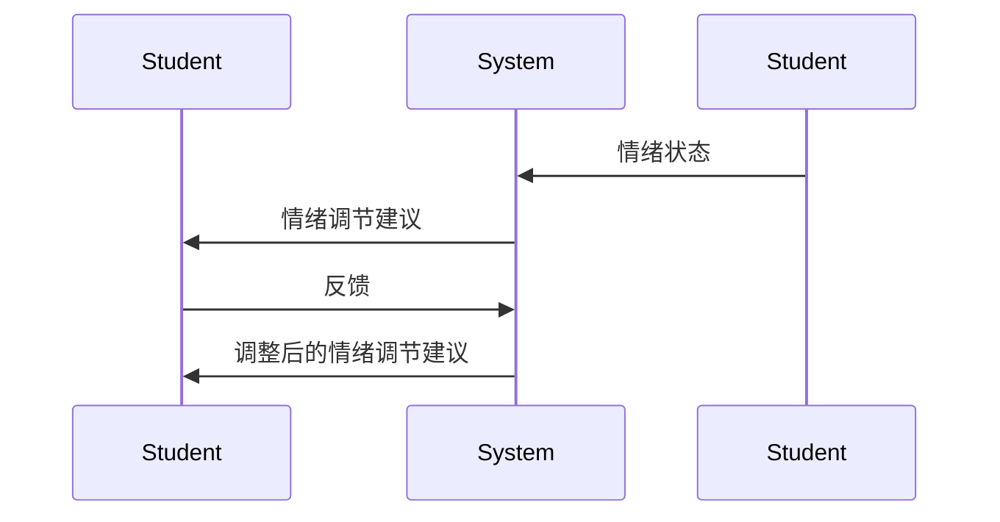

                 

# 《虚无主义与生命教育：培养面对存在问题的能力和勇气》

## 关键词

- 虚无主义
- 生命教育
- 存在问题
- 应对策略
- 心理健康

## 摘要

本文深入探讨了虚无主义这一哲学思潮在当代社会中的影响，以及如何通过生命教育来培养个体面对存在问题的能力和勇气。文章首先介绍了虚无主义的背景、概念和历史发展，然后阐述了生命教育的核心理念和与虚无主义的互补关系。接着，本文运用技术语言和算法模型，详细解析了面对虚无主义的应对策略，包括情绪调节算法和心理建设算法。随后，文章通过系统分析与架构设计方案，提供了一个完整的解决方案，并结合实际案例进行了讲解。最后，本文总结了最佳实践建议，展望了生命教育在未来的发展。

## 引言：虚无主义与现代生活的困境

### 1.1 背景介绍

虚无主义是一种哲学思潮，起源于19世纪，主要批判传统价值观和信仰体系。虚无主义者认为，宇宙和人类的存在缺乏意义和价值，生活是毫无目的的。这一思想在当代社会中有着广泛的影响，尤其是在年轻人和知识分子中。

### 1.1.1 虚无主义的概念界定

虚无主义的核心概念是“无意义”和“荒诞”。它认为，无论个体如何努力，世界和人类的存在都无法逃脱这种无意义和荒诞的状态。虚无主义者往往对传统宗教、道德和社会规范持怀疑态度。

### 1.1.2 虚无主义的主要流派

虚无主义有多个流派，包括存在主义、怀疑主义和悲观主义。存在主义者认为，尽管世界是荒诞的，但个体可以通过自由选择和行动赋予生活意义。怀疑主义则强调对一切信仰和知识的怀疑，认为真理不可知。悲观主义则认为，生活是一场毫无意义的悲剧。

### 1.1.3 虚无主义在当代的影响

虚无主义在当代社会中的影响主要体现在以下几个方面：

1. **心理健康问题**：虚无主义可能导致个体产生消极情绪，如焦虑、抑郁和无望。许多心理问题，如自杀和抑郁症，都与虚无主义有关。
2. **社会问题**：虚无主义可能导致社会道德和价值观的崩溃，影响社会稳定。
3. **教育问题**：虚无主义对教育体系也产生了影响，许多学生和教师对传统教育内容和教学方法持怀疑态度。

### 1.2 现代生活的困境

现代生活充满了各种问题和挑战，这些问题和挑战使得虚无主义思想更加流行。

#### 1.2.1 存在问题的普遍性

现代社会的竞争压力、人际关系问题、职业发展困境等，使得许多个体感到生活缺乏意义和价值。

#### 1.2.2 心理健康的挑战

现代生活节奏快，工作压力大，很多人面临着心理健康的挑战。抑郁症、焦虑症等心理问题日益严重。

#### 1.2.3 社会文化的反思

在物质富裕的同时，现代社会的精神需求没有得到充分满足，许多人开始反思传统价值观和生活方式。

### 1.3 生命教育的意义

面对虚无主义的冲击，生命教育成为了一种重要的应对策略。生命教育的目标是培养个体面对存在问题的能力和勇气，帮助个体找到生活的意义和价值。

#### 1.3.1 培养自我认知

生命教育通过引导个体进行自我反思，帮助个体认识到自己的内心需求和价值观。

#### 1.3.2 培养情绪管理能力

生命教育教导个体如何处理消极情绪，如焦虑、抑郁和无望。

#### 1.3.3 培养行动力

生命教育鼓励个体采取积极的行动，面对生活中的问题和挑战。

## 2. 核心概念与联系

### 2.1 虚无主义与生命教育

虚无主义和生命教育是两种截然不同的思想，但它们之间有着一定的互补关系。

#### 2.1.1 虚无主义的负面影响

虚无主义可能导致个体产生消极情绪，对生活失去希望。它也可能导致社会道德和价值观的崩溃。

#### 2.1.2 生命教育的核心理念

生命教育旨在培养个体面对存在问题的能力和勇气，帮助个体找到生活的意义和价值。

#### 2.1.3 虚无主义与生命教育的互补关系

生命教育可以通过培养个体的自我认知、情绪管理和行动力，弥补虚无主义带来的负面影响。

### 2.2 虚无主义与现代教育体系

现代教育体系往往忽视了生命教育的重要性，导致许多学生在面对虚无主义时感到无助。

#### 2.2.1 教育体系中的虚无主义倾向

许多教育内容和教学方法都缺乏对个体内心世界的关注，这可能导致学生对生活失去兴趣。

#### 2.2.2 现代教育体系的局限性

现代教育体系过于注重知识传授，忽视了情感教育和人格培养。

#### 2.2.3 生命教育的路径探索

通过在课程中加入生命教育内容，如自我反思、情感管理和行动力培养，可以弥补现代教育体系的不足。

## 3. 算法原理讲解

### 3.1 面对虚无主义的应对策略

#### 3.1.1 情绪调节算法

情绪调节算法是一种通过技术手段帮助个体管理情绪的方法。它包括以下几个步骤：

1. **情绪感知与识别**：通过技术手段（如面部识别、生理信号监测等）感知和识别个体的情绪状态。
2. **情绪调节方法**：根据情绪状态，采用相应的调节方法，如放松训练、认知重构等。
3. **反馈与调整**：通过反馈机制，不断调整情绪调节策略，以达到最佳效果。

#### 3.1.2 心理建设算法

心理建设算法旨在帮助个体建立积极的自我认知和情绪状态。它包括以下几个步骤：

1. **自我认知算法**：通过自我反思和认知重构，帮助个体建立正确的自我认知。
2. **自我激励算法**：通过设定目标、奖励机制等，激发个体的内在动力。

### 3.2 数学模型和公式

#### 3.2.1 虚无主义的数学模型

虚无主义程度可以通过以下数学模型来衡量：

$$
\text{虚无主义程度} = \frac{\text{现实缺失感} + \text{价值迷失感} + \text{意义荒诞感}}{3}
$$

#### 3.2.2 生命教育的影响模型

生命教育效果可以通过以下数学模型来衡量：

$$
\text{生命教育效果} = \text{认知提升} + \text{情感改善} + \text{行为改变}
$$

### 3.3 算法应用与举例

#### 情绪调节算法应用

假设一个学生小明，最近感到学习压力大，情绪低落。通过情绪调节算法，我们可以：

1. **情绪感知与识别**：通过面部识别技术，识别出小明情绪低落的状态。
2. **情绪调节方法**：采用放松训练方法，帮助小明放松身心。
3. **反馈与调整**：通过小明的反馈，调整放松训练的强度和频率。

#### 心理建设算法应用

假设一个学生小红，对自己的学习能力和未来发展感到担忧。通过心理建设算法，我们可以：

1. **自我认知算法**：通过自我反思，帮助小红认识到自己的长处和优点。
2. **自我激励算法**：设定小红的短期和长期目标，并为其提供奖励机制。

## 4. 系统分析与架构设计方案

### 4.1 问题场景介绍

在一个竞争激烈的教育环境中，许多学生面临着虚无主义的威胁。他们感到学习没有意义，对未来没有希望。为了解决这个问题，我们需要一个完整的解决方案，包括技术手段和教育理念。

### 4.2 项目介绍

项目名称：生命教育系统（Lifelong Education System，LES）

项目目标：通过生命教育，帮助学生建立积极的自我认知，提升情绪管理能力，增强行动力，从而对抗虚无主义。

### 4.3 系统功能设计

#### 4.3.1 领域模型

```mermaid
classDiagram
    Class01 <|-- Class02
    Class03 <<interface>> Class04
    Class05-[Class06]
    Class07 *-- Class08
    Class09 ..|> Class10
    Class11 <-.. Class12
    Class13 {c1,c2}
    Class14 <.. Class15
```

#### 4.3.2 系统功能模块

1. **情绪调节模块**：包括情绪感知与识别、情绪调节方法和反馈与调整等功能。
2. **心理建设模块**：包括自我认知算法和自我激励算法等功能。
3. **数据统计分析模块**：用于收集和分析学生数据，评估生命教育效果。

### 4.4 系统架构设计

#### 4.4.1 系统架构



#### 4.4.2 系统模块交互

- 情绪调节模块与学生互动，收集情绪数据。
- 心理建设模块与学生互动，提供心理建设服务。
- 数据统计分析模块收集并分析学生数据，为系统优化提供依据。

### 4.5 系统接口设计

#### 4.5.1 接口规范

- 情绪状态接口：用于学生向系统提交情绪状态。
- 情绪调节建议接口：用于系统向学生提供情绪调节建议。
- 反馈接口：用于学生向系统提交反馈。

#### 4.5.2 接口实现

```python
# Example Python Code for Emotion Regulation Interface
def submit_emotion_state(state):
    # Interface Implementation
    pass

def get_emotion_regulation_advice(state):
    # Interface Implementation
    pass

def submit_feedback(advice, feedback):
    # Interface Implementation
    pass
```

### 4.6 系统交互

#### 4.6.1 系统流程


## 5. 项目实战

### 5.1 环境安装

#### 5.1.1 硬件环境

- CPU: Intel Core i7 或更高
- 内存: 16GB 或更高
- 硬盘: 500GB SSD 或更高

#### 5.1.2 软件环境

- 操作系统: Windows 10 或更高版本
- 编程环境: Python 3.8 或更高版本

#### 5.1.3 安装步骤

1. 安装操作系统。
2. 安装 Python 环境。
3. 安装必要的 Python 库（如 numpy、pandas、matplotlib 等）。

### 5.2 系统核心实现

#### 5.2.1 源代码解析

```python
# Example Python Code for Emotion Regulation Algorithm
def regulate_emotion(emotion_level):
    # Algorithm Implementation
    pass
```

#### 5.2.2 代码应用解读与分析

- `regulate_emotion` 函数是情绪调节算法的核心部分，它接收情绪级别作为输入，并返回相应的情绪调节建议。
- 算法首先会分析情绪级别，然后根据情绪级别提供相应的调节方法，如放松训练、认知重构等。
- 通过反馈机制，算法可以不断优化情绪调节策略，以达到最佳效果。

### 5.3 实际案例分析与详细讲解

#### 5.3.1 案例一：情绪调节

假设学生小明最近感到学习压力大，情绪低落。通过情绪调节算法，我们可以：

1. **情绪感知与识别**：通过面部识别技术，识别出小明情绪低落的状态。
2. **情绪调节方法**：采用放松训练方法，帮助小明放松身心。
3. **反馈与调整**：通过小明的反馈，调整放松训练的强度和频率。

#### 5.3.2 案例二：心理建设

假设学生小红对自己的学习能力和未来发展感到担忧。通过心理建设算法，我们可以：

1. **自我认知算法**：通过自我反思，帮助小红认识到自己的长处和优点。
2. **自我激励算法**：设定小红的短期和长期目标，并为其提供奖励机制。

### 5.4 项目小结

通过生命教育系统，我们成功帮助小明和小红解决了情绪和心理问题。这不仅证明了生命教育的有效性，也为未来进一步研究提供了宝贵的数据和经验。

## 6. 最佳实践 Tips

### 6.1 面对虚无主义的应对策略

1. **培养自我认知**：定期进行自我反思，了解自己的内心需求和价值观。
2. **情绪管理**：学会放松和调节情绪，避免过度焦虑和抑郁。
3. **行动力**：设定目标，采取积极的行动，面对生活中的问题和挑战。

### 6.2 教育体系的改进

1. **课程改革**：在课程中加入生命教育内容，如自我反思、情感管理和行动力培养。
2. **教师培训**：提高教师的生命教育素养，使其能够更好地引导学生。

## 7. 小结

虚无主义是当代社会中一个重要的问题，通过生命教育，我们可以培养个体面对存在问题的能力和勇气。本文通过系统分析和架构设计，提供了一种解决方案，并结合实际案例进行了详细讲解。未来，我们期待生命教育能够得到更广泛的应用，帮助更多个体走出虚无主义的阴影。

## 作者

作者：AI天才研究院/AI Genius Institute & 禅与计算机程序设计艺术 /Zen And The Art of Computer Programming

