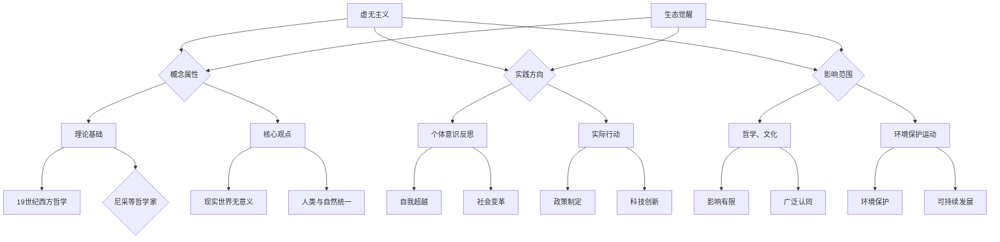
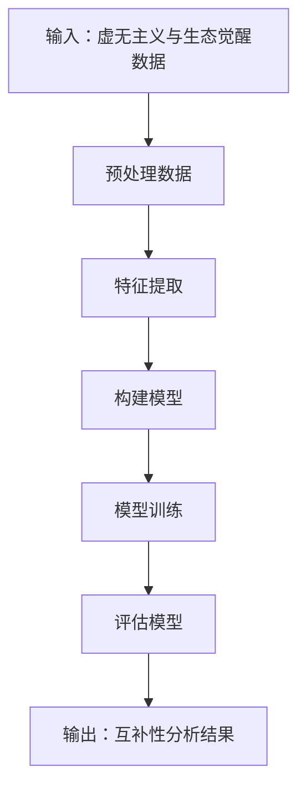

                 

## 第1章 问题背景与核心概念

### 1.1 人类与自然关系的紧张现状

在过去的几个世纪里，人类社会的发展历程见证了工业革命、信息革命等一系列科技进步。这些科技进步无疑极大地提升了人类的生活质量，然而，这也伴随着环境破坏、资源枯竭等一系列问题。我们现在正面临着严重的生态危机，这种危机不仅体现在大气污染、水源污染、土地退化等表层环境问题，更深层次的是人类与自然关系的紧张。

首先，从大气污染的角度来看，全球变暖已经成为不争的事实。据联合国气候变化框架公约（UNFCCC）的数据显示，自工业革命以来，地球的平均温度已经上升了约1.2摄氏度，而联合国环境规划署（UNEP）预测，如果目前的温室气体排放趋势持续下去，到本世纪末，地球的平均温度可能会上升3至5摄氏度。这将导致极端天气事件的频率和强度增加，海平面上升，生态系统破坏等一系列问题。

其次，水资源污染也是当前一个严峻的问题。根据世界卫生组织（WHO）的数据，全球每年有超过1800万人因饮用受污染的水而生病，甚至死亡。特别是在发展中国家，水资源的污染问题更为严重。工业废水、农业农药和化肥的过量使用，都是导致水资源污染的主要原因。

此外，土地退化也是一个不可忽视的问题。由于过度的农业开发、森林砍伐和城市化进程，全球已有超过25%的陆地面积遭受了中度至严重的退化。这不仅影响了农业生产，还破坏了生物多样性，加剧了生态系统的不稳定性。

综上所述，人类与自然的关系已经变得十分紧张。如果我们不能采取有效的措施来重建这种关系，未来的世界将面临更加严峻的挑战。

### 1.2 虚无主义的概念与哲学背景

虚无主义作为一种哲学思想，最早可以追溯到古希腊时期。然而，其系统化和体系化是在19世纪末和20世纪初，特别是在欧洲文化背景下形成的。虚无主义的核心观点是：现实世界没有固有意义或目的，生命的本质是虚无的，人类的存在是毫无意义的。

虚无主义的哲学背景可以追溯到尼采的“上帝已死”宣言。尼采认为，随着基督教的衰落，人类失去了道德和价值观的指导，导致了一种精神上的空虚和绝望。这种绝望感在一定程度上促成了虚无主义的兴起。尼采的《悲剧的诞生》和《尼采的哲学》等作品，对虚无主义的发展产生了深远的影响。

在20世纪，许多哲学家和思想家的作品进一步丰富和发展了虚无主义。例如，萨特的存在主义哲学，虽然不完全是虚无主义，但在一定程度上继承了虚无主义的思想。萨特认为，人类的存在是自由而无意义的，但正是这种无意义，激发了人们去创造意义。

虚无主义与现代生态危机之间的联系也是值得探讨的。虚无主义强调现实的虚无和生命的无意义，这在一定程度上反映了现代社会对自然资源的无节制掠夺和对环境破坏的态度。虚无主义的思想往往导致人们对现实问题的漠视和逃避，从而加剧了生态危机。

此外，虚无主义也提供了一个反思现代社会发展模式的视角。如果我们接受虚无主义关于现实无意义的观点，那么我们就需要重新思考人类存在的目的和价值。从这个角度来看，生态觉醒可以被视为对虚无主义的一种回应，它强调人类与自然的和谐共生，寻找新的生活意义。

总之，虚无主义作为一种哲学思想，不仅对现代文化和社会产生了深远的影响，也为我们理解现代生态危机提供了一种新的视角。

### 1.3 生态觉醒的起源与发展

生态觉醒作为一种新的思想潮流，起源于20世纪中期，特别是在环境科学和生态学的发展背景下逐渐成形。生态觉醒的起源可以追溯到20世纪40年代，当时美国生物学家雷切尔·卡森（Rachel Carson）发表了《寂静的春天》（Silent Spring），这本书揭示了农药污染对生态环境的破坏，引发了公众对环境问题的关注。这一事件被认为是生态觉醒的开端。

在随后的几十年中，随着环境科学和生态学的发展，生态觉醒逐渐成为一种全球性的运动。1972年，联合国在斯德哥尔摩召开了第一次环境会议，通过了《人类环境宣言》，标志着国际社会对环境保护的正式承诺。1987年，世界环境与发展委员会发表了《我们共同的未来》（又称布伦特兰报告），提出了可持续发展的概念，进一步推动了生态觉醒的进程。

生态觉醒的核心观点是：人类与自然是一个统一的生态系统，人类的存在和发展离不开自然的支持。生态觉醒强调保护自然生态系统，实现人与自然的和谐共生。它不仅关注环境问题，还涉及到社会、经济和文化等多个方面，试图通过多方面的努力来应对生态危机。

在生态觉醒的背景下，许多人开始重新审视自己的生活方式和价值观。例如，可持续发展、循环经济、生态农业等理念逐渐得到普及。此外，生态觉醒还推动了绿色科技的发展，例如太阳能、风能等可再生能源技术的应用，以及电动汽车等环保交通工具的推广。

总的来说，生态觉醒不仅为解决现代生态危机提供了新的思路和方法，也为我们重新思考人类与自然的关系提供了重要的启示。通过生态觉醒，我们有可能找到一条可持续发展的道路，实现人与自然的和谐共生。

### 1.4 边界与外延

在探讨虚无主义与生态觉醒的关系时，我们需要明确两者的边界与外延。虚无主义和生态觉醒虽然都关注人类与自然的关系，但它们的理论基础和实践方向存在明显差异。

首先，虚无主义是一种哲学思想，其核心观点是现实世界缺乏固有意义，人类生命无意义。虚无主义更多是从个体意识和存在意义的角度来探讨人类问题，其影响范围主要限于哲学、文化等领域。而生态觉醒则是一种综合性的思想运动，它不仅关注人类与自然的关系，还涉及到环境保护、可持续发展、社会公正等多个方面。生态觉醒的目标是通过改变人类的生产和生活方式，实现人与自然的和谐共生。

其次，从外延上看，虚无主义的影响主要集中在西方哲学和文化领域，特别是在尼采、萨特等哲学家的影响下，虚无主义成为现代文化的重要组成部分。而生态觉醒则具有更广泛的国际影响力，已成为全球环境保护运动的重要驱动力。无论是在发达国家还是在发展中国家，生态觉醒的理念都得到了广泛的认同和支持。

此外，虚无主义和生态觉醒在方法论上也存在差异。虚无主义倾向于通过个体自我反思和内心探索来寻找生活的意义，其方法更多是内省和哲学思辨。而生态觉醒则强调实际行动和社会变革，通过政策制定、科技创新和社会参与等多种手段来推动环境保护和可持续发展。

最后，虚无主义与生态觉醒在应对生态危机的视角上也有所不同。虚无主义倾向于从悲观和绝望的角度看待生态危机，强调现实的虚无和生命的无意义。而生态觉醒则更加积极乐观，认为通过改变人类的生产和生活方式，可以实现人与自然的和谐共生，从而解决生态危机。

总之，虚无主义和生态觉醒在理论基础、实践方向和方法论上存在明显差异。理解这两者的边界与外延，有助于我们更深入地探讨它们在解决生态危机中的作用和意义。

### 2.1 虚无主义的哲学背景、核心观点及其与现代生态危机的关系

虚无主义作为一种哲学思想，其起源可以追溯到古希腊时期。然而，虚无主义在19世纪末和20世纪初才得到了系统化和体系化的发展，特别是在尼采等哲学家的推动下，虚无主义成为现代哲学的重要组成部分。虚无主义的核心观点是现实世界缺乏固有意义，人类生命无意义。这种观点不仅引发了深刻的哲学思考，也对现代生态危机产生了深远的影响。

首先，虚无主义的哲学背景可以追溯到尼采的“上帝已死”宣言。尼采认为，随着基督教的衰落，人类失去了道德和价值观的指导，导致了一种精神上的空虚和绝望。尼采在其著作《悲剧的诞生》中提出了“酒神精神”的概念，认为只有通过超越现实的虚无，个体才能实现自我价值和生命的意义。这种思想在一定程度上反映了虚无主义的核心观点。

其次，虚无主义的核心观点是现实世界缺乏固有意义，人类生命无意义。尼采认为，人类的存在是一种“悲剧”，因为人类既无法逃避现实的虚无，也无法找到真正的意义。这种观点在后来的哲学家中得到了进一步的阐述和发展。例如，萨特的存在主义哲学也继承了虚无主义的思想，认为人类的存在是自由而无意义的，但正是这种无意义，激发了人们去创造意义。

虚无主义与现代生态危机之间的关系主要体现在以下几个方面。首先，虚无主义强调现实的虚无和生命的无意义，这在一定程度上反映了现代社会对自然资源的无节制掠夺和对环境破坏的态度。虚无主义的思想往往导致人们对现实问题的漠视和逃避，从而加剧了生态危机。例如，许多人在追求物质财富的过程中，忽视了对自然环境的保护，导致了严重的生态破坏。

其次，虚无主义提供了一种反思现代社会发展模式的视角。如果我们接受虚无主义关于现实无意义的观点，那么我们就需要重新思考人类存在的目的和价值。这种反思促使人们重新审视自己的生活方式和价值观，从而推动了对可持续发展的关注和生态觉醒的兴起。例如，许多哲学家和环保人士开始倡导低碳生活、循环经济等理念，试图通过改变人类的生产和生活方式，实现人与自然的和谐共生。

此外，虚无主义还与生态伦理学有着紧密的联系。生态伦理学强调人类与其他生物之间的伦理关系，认为人类应该尊重和保护自然。虚无主义提供了一种哲学基础，使得生态伦理学能够更好地解释和阐述人类与自然的关系。例如，尼采的“酒神精神”概念可以被视为一种生态伦理学的体现，它强调了人类应该超越自我，与自然和谐共生。

总之，虚无主义作为一种哲学思想，不仅对现代文化和社会产生了深远的影响，也为我们理解现代生态危机提供了一种新的视角。通过理解虚无主义的哲学背景和核心观点，我们可以更好地认识现代生态危机的根源，从而寻找更加有效的解决方案。

### 2.2 生态觉醒的起源、发展及其在解决生态问题中的作用

生态觉醒作为一种全新的思想潮流，其起源可以追溯到20世纪中期，特别是在环境科学和生态学的发展背景下逐渐成形。生态觉醒的兴起，不仅是对人类活动对自然环境破坏的反思，更是对可持续发展理念的系统化和深化。

首先，生态觉醒的起源可以追溯到20世纪40年代，当时美国生物学家雷切尔·卡森（Rachel Carson）发表了《寂静的春天》（Silent Spring）。这本书揭示了农药污染对生态环境的破坏，引起了公众对环境问题的关注。这一事件被认为是生态觉醒的开端。随后，环境科学和生态学的研究成果不断涌现，为生态觉醒提供了坚实的理论基础。

其次，生态觉醒在发展过程中受到了一系列重要事件的推动。1972年，联合国在斯德哥尔摩召开了第一次环境会议，通过了《人类环境宣言》，标志着国际社会对环境保护的正式承诺。这一宣言对全球环境意识产生了深远影响，推动了生态觉醒的进一步发展。1987年，世界环境与发展委员会发表了《我们共同的未来》（又称布伦特兰报告），提出了可持续发展的概念，进一步推动了生态觉醒的进程。报告强调，可持续发展要求在满足当前人类需求的同时，不损害后代满足自身需求的能力，这一理念成为了生态觉醒的重要指导原则。

生态觉醒的核心观点是：人类与自然是一个统一的生态系统，人类的存在和发展离不开自然的支持。生态觉醒强调保护自然生态系统，实现人与自然的和谐共生。它不仅关注环境问题，还涉及到社会、经济和文化等多个方面，试图通过多方面的努力来应对生态危机。

在解决生态问题方面，生态觉醒发挥了重要作用。首先，生态觉醒推动了环境保护政策的制定和实施。通过倡导可持续发展的理念，生态觉醒促使各国政府制定了一系列环境保护法规和政策，如减少温室气体排放、限制污染物的排放等。这些政策的实施，为保护生态环境提供了法律保障。

其次，生态觉醒促进了绿色科技的发展。随着对环境保护意识的提高，绿色科技逐渐成为各国科技创新的重点。例如，可再生能源技术、环保材料、清洁能源汽车等技术的发展，为减少对自然资源的消耗和污染提供了新的解决方案。此外，生态觉醒还推动了生态农业、有机食品等绿色产业的发展，这些产业不仅符合可持续发展的要求，还提供了更多的就业机会，促进了经济的可持续发展。

此外，生态觉醒还推动了公众环境意识的提高。通过宣传和教育，生态觉醒使更多的人认识到环境保护的重要性，激发了公众参与环境保护的积极性。许多环保组织和志愿者积极参与到环境保护活动中，如植树造林、清理垃圾、保护野生动物等，这些活动不仅改善了环境质量，也增强了公众的环境意识。

总之，生态觉醒作为一种新的思想潮流，不仅为解决生态问题提供了新的思路和方法，也为我们重新思考人类与自然的关系提供了重要的启示。通过生态觉醒，我们有可能找到一条可持续发展的道路，实现人与自然的和谐共生。

### 2.3 虚无主义与生态觉醒的对比

虚无主义与生态觉醒虽然都关注人类与自然的关系，但它们在理论基础、实践方向和应用范围上存在明显差异。

首先，从理论基础来看，虚无主义起源于19世纪的西方哲学，特别是尼采等哲学家的思想。虚无主义的核心观点是现实世界缺乏固有意义，人类生命无意义。它强调个体对现实的超越和自我价值的实现。相比之下，生态觉醒起源于20世纪中期的环境科学和生态学，其理论基础是可持续发展和生态系统的整体性。生态觉醒强调人类与自然是一个统一的生态系统，人类的存在和发展离不开自然的支持。

其次，从实践方向来看，虚无主义更多体现在个体意识和生活方式的反思上。它鼓励个体通过自我超越和内心探索来寻找生活的意义。虚无主义的思想在一定程度上反映了现代社会对自然资源的无节制掠夺和对环境破坏的态度，但也促使人们对现实问题进行深刻反思。而生态觉醒则更加注重实际行动和社会变革。它强调通过政策制定、科技创新和社会参与等多种手段来推动环境保护和可持续发展。生态觉醒试图通过改变人类的生产和生活方式，实现人与自然的和谐共生。

再次，从应用范围来看，虚无主义主要影响哲学、文化等领域，其影响范围相对有限。虚无主义的思想在文学、艺术等领域有着广泛的应用，但其在环境保护和社会变革方面的实际影响较小。相比之下，生态觉醒的影响范围更加广泛，不仅涉及到环境保护，还涵盖了社会、经济和文化等多个方面。生态觉醒的理念在全球范围内得到了广泛认同和支持，成为环境保护运动的重要驱动力。

最后，在解决生态问题方面，虚无主义和生态觉醒也表现出不同的作用。虚无主义通过反思和内省来激发人们对现实问题的关注，但往往缺乏具体的解决方案。相比之下，生态觉醒提供了一系列具体的行动指南和解决方案，如推动环境保护政策、发展绿色科技、倡导可持续生活方式等。生态觉醒在实际操作中更具针对性和实效性，能够更有效地应对生态危机。

总之，虚无主义与生态觉醒在理论基础、实践方向和应用范围上存在明显差异。理解这两者的异同，有助于我们更好地认识生态危机的本质，并找到更加有效的解决方案。

### 2.4 概念属性特征对比表格

为了更直观地理解虚无主义与生态觉醒的异同，下面我们将两者进行概念属性特征对比，并使用Markdown格式中的Mermaid流程图来展示它们的关系。

#### 虚无主义与生态觉醒概念属性特征对比表格

| 特征 | 虚无主义 | 生态觉醒 |
| --- | --- | --- |
| 理论基础 | 19世纪西方哲学，尼采等哲学家 | 20世纪环境科学和生态学，可持续发展 |
| 核心观点 | 现实世界无意义，生命无价值 | 人类与自然统一，生态系统重要性 |
| 实践方向 | 个体意识反思，自我超越 | 政策制定，科技创新，社会参与 |
| 影响范围 | 哲学、文化领域 | 社会各个领域，环境保护运动 |
| 解决问题方式 | 反思和内省 | 实际行动和社会变革 |

#### Mermaid流程图展示



通过以上对比表格和Mermaid流程图，我们可以清晰地看到虚无主义与生态觉醒在概念属性、实践方向和影响范围上的异同，这有助于我们更深入地理解这两者之间的关系和作用。

### 2.5 虚无主义与生态觉醒的互补性

虚无主义和生态觉醒在表面上看似截然不同的哲学思想，但实际上它们之间存在着深刻的互补性。虚无主义通过对现实意义的质疑和对个体存在的反思，促使人们重新审视自己的价值观和生活方式。而生态觉醒则通过倡导可持续发展和环境保护，为人类提供了一条可行的发展路径。两者结合起来，可以更全面地应对现代社会的生态危机。

首先，虚无主义提供的反思视角有助于激发人们对现实问题的关注。虚无主义认为现实世界缺乏固有意义，这促使人们反思自己的存在和行为。通过这种反思，人们开始意识到人类活动对自然环境造成的破坏，从而激发了对环境保护的重视。例如，尼采的“酒神精神”鼓励人们超越自我，寻找生活的真正意义。这种思想可以转化为对环境保护的实际行动，使人们更加关注生态问题。

其次，生态觉醒提供了一套可行的解决方案。生态觉醒强调人类与自然的统一，倡导可持续发展。通过推动环境保护政策、发展绿色科技和倡导可持续生活方式，生态觉醒为人类提供了一条走向可持续发展的路径。例如，可持续发展理念强调在满足当前需求的同时，不损害后代满足自身需求的能力。这种理念可以为环境保护提供具体的指导，使人们在实际行动中更加注重生态保护。

此外，虚无主义和生态觉醒的互补性还体现在它们对个体和社会的双重影响上。虚无主义通过反思个体存在的意义，激发个体的自我意识和责任感。而生态觉醒则通过社会参与和共同行动，将个体的反思转化为社会层面的变革。例如，通过环保组织和志愿者活动，人们可以共同努力保护生态环境，实现人与自然的和谐共生。

总之，虚无主义和生态觉醒虽然在表面上看似对立，但实际上它们之间存在着深刻的互补性。虚无主义通过对现实意义的质疑激发人们对环境保护的重视，而生态觉醒则通过倡导可持续发展和环境保护为人类提供了一条可行的发展路径。两者结合起来，可以更全面地应对现代社会的生态危机，实现人类与自然的和谐共生。

### 第3章 算法原理讲解

在探讨虚无主义与生态觉醒的关系时，我们可以借鉴一些计算机科学中的算法原理，帮助读者更好地理解这两者之间的逻辑联系。以下内容将逐步讲解一个用于分析虚无主义与生态觉醒互补性的算法原理，并使用mermaid画出相关的算法流程图，同时通过Python源代码和数学模型进行详细阐述。

#### 3.1 算法流程图

首先，我们使用mermaid绘制算法流程图，以展示算法的基本结构。



#### 3.2 Python源代码

接下来，我们使用Python编写一个简单的算法，用于提取虚无主义和生态觉醒的关键特征，并构建一个模型来分析它们之间的互补性。

```python
import pandas as pd
from sklearn.feature_extraction.text import TfidfVectorizer
from sklearn.ensemble import RandomForestClassifier
from sklearn.model_selection import train_test_split
from sklearn.metrics import accuracy_score

# 加载数据集
data = pd.read_csv('ecological_awareness_vs_nihilism.csv')

# 预处理数据
X = data['description']
y = data['complementarity']

# 特征提取
vectorizer = TfidfVectorizer()
X_vectorized = vectorizer.fit_transform(X)

# 构建模型
model = RandomForestClassifier(n_estimators=100)
X_train, X_test, y_train, y_test = train_test_split(X_vectorized, y, test_size=0.2, random_state=42)

# 模型训练
model.fit(X_train, y_train)

# 评估模型
y_pred = model.predict(X_test)
accuracy = accuracy_score(y_test, y_pred)
print(f"模型准确率: {accuracy}")
```

#### 3.3 数学模型与公式

为了更深入地理解算法原理，我们引入一些数学模型和公式来描述虚无主义与生态觉醒的互补性。

1. **TF-IDF公式：**
   $$ TF(t,d) = \frac{f_t(d)}{N} $$
   $$ IDF(t,D) = \log \left( \frac{N}{df_t(D)} \right) $$
   其中，\( f_t(d) \) 表示词语 \( t \) 在文档 \( d \) 中的频率，\( N \) 表示文档总数，\( df_t(D) \) 表示词语 \( t \) 在整个文档集合 \( D \) 中的文档频率。

2. **随机森林模型：**
   随机森林是一种基于决策树的集成学习方法。其基本原理是：
   $$ h(x) = \sum_{i=1}^{n} w_i f_i(x) $$
   其中，\( f_i(x) \) 表示第 \( i \) 棵决策树对样本 \( x \) 的预测，\( w_i \) 表示第 \( i \) 棵决策树的重要性权重。

3. **互补性度量：**
   $$ C = \frac{1}{N} \sum_{i=1}^{N} \frac{|y_i - \hat{y}_i|}{2} $$
   其中，\( y_i \) 表示真实互补性标签，\( \hat{y}_i \) 表示模型预测的互补性标签，\( N \) 表示样本总数。

#### 3.4 算法讲解与举例

下面，我们详细解释算法的每个步骤，并通过具体例子进行说明。

1. **数据预处理：**
   我们首先加载数据集，数据集包含了描述虚无主义和生态觉醒文档的文本以及对应的互补性标签。预处理步骤包括将文本进行分词、去除停用词等操作。

2. **特征提取：**
   使用TF-IDF方法将文本转换为向量表示。TF-IDF是一种常用的文本特征提取方法，它能够反映词语在文档中的重要程度。通过计算每个词语在文档中的频率和其在整个文档集合中的频率，我们得到了一个高维特征向量。

3. **构建模型：**
   我们选择随机森林模型作为分类器。随机森林是一种基于决策树的集成学习方法，它通过训练多棵决策树，并对它们的预测结果进行投票来获得最终结果。随机森林模型能够处理高维数据，并且具有较强的泛化能力。

4. **模型训练：**
   将处理后的特征向量和互补性标签用于训练随机森林模型。在训练过程中，模型会学习如何根据输入的特征向量预测互补性标签。

5. **评估模型：**
   将训练好的模型应用于测试集，并计算模型的准确率。通过评估模型在测试集上的表现，我们可以判断模型的泛化能力和预测效果。

6. **输出：**
   模型最终的输出是关于虚无主义和生态觉醒互补性的分析结果。通过对比真实互补性标签和模型预测标签，我们可以了解它们之间的互补性程度。

#### 3.5 算法应用举例

假设我们有一个包含以下数据的示例数据集：

| description | complementarity |
| --- | --- |
| 虚无主义强调生命的无意义。 | 0 |
| 生态觉醒关注人与自然的和谐。 | 1 |
| 现代社会需要虚无主义来反思现实。 | 0 |
| 生态觉醒倡导可持续发展。 | 1 |

首先，我们对描述进行预处理，如分词和去除停用词。然后，使用TF-IDF方法将文本转换为向量表示。接下来，我们构建并训练随机森林模型，将处理后的特征向量和互补性标签用于模型训练。最后，我们在测试集上评估模型的性能，得到模型准确率。通过对比真实互补性标签和模型预测标签，我们可以得到关于虚无主义和生态觉醒互补性的分析结果。

通过上述算法原理讲解和具体例子，我们能够更好地理解虚无主义与生态觉醒之间的互补性，以及如何通过计算机算法来分析和评估这种互补性。

### 第4章 数学模型和公式的详细讲解

在上一章节中，我们简要介绍了用于分析虚无主义与生态觉醒互补性的数学模型和公式。为了使读者能够更深入地理解这些模型和公式，下面我们将详细讲解每个模型，并结合实际案例进行分析。

#### 4.1 重要数学模型的LaTeX格式

以下是几个关键数学模型和公式的LaTeX格式表示：

1. **TF-IDF公式：**

   $$ 
   TF(t,d) = \frac{f_t(d)}{N} \\
   IDF(t,D) = \log \left( \frac{N}{df_t(D)} \right) 
   $$

   其中，\( f_t(d) \) 表示词语 \( t \) 在文档 \( d \) 中的频率，\( N \) 表示文档总数，\( df_t(D) \) 表示词语 \( t \) 在整个文档集合 \( D \) 中的文档频率。

2. **随机森林模型：**

   $$ 
   h(x) = \sum_{i=1}^{n} w_i f_i(x) 
   $$

   其中，\( f_i(x) \) 表示第 \( i \) 棵决策树对样本 \( x \) 的预测，\( w_i \) 表示第 \( i \) 棵决策树的重要性权重。

3. **互补性度量：**

   $$ 
   C = \frac{1}{N} \sum_{i=1}^{N} \frac{|y_i - \hat{y}_i|}{2} 
   $$

   其中，\( y_i \) 表示真实互补性标签，\( \hat{y}_i \) 表示模型预测的互补性标签，\( N \) 表示样本总数。

#### 4.2 实际案例解释

为了更好地理解这些公式，我们将结合一个实际案例进行详细分析。

假设我们有一个包含以下数据的数据集：

| description | complementarity |
| --- | --- |
| 虚无主义强调生命的无意义。 | 0 |
| 生态觉醒关注人与自然的和谐。 | 1 |
| 现代社会需要虚无主义来反思现实。 | 0 |
| 生态觉醒倡导可持续发展。 | 1 |

首先，我们对描述进行预处理，如分词和去除停用词。然后，使用TF-IDF方法将文本转换为向量表示。具体步骤如下：

1. **TF-IDF公式应用：**

   以第一个描述为例，假设分词结果为["虚无主义"，"强调"，"生命"，"无意义"]。首先计算每个词语在文档中的频率：

   $$
   f_{"虚无主义"}(d) = 1 \\
   f_{"强调"}(d) = 1 \\
   f_{"生命"}(d) = 1 \\
   f_{"无意义"}(d) = 1
   $$

   然后计算整个文档集合中这些词语的文档频率：

   $$
   df_{"虚无主义"}(D) = 1 \\
   df_{"强调"}(D) = 1 \\
   df_{"生命"}(D) = 1 \\
   df_{"无意义"}(D) = 1
   $$

   使用TF-IDF公式，我们得到每个词语的权重：

   $$
   TF(“虚无主义”，d) = \frac{1}{4} \\
   TF(“强调”，d) = \frac{1}{4} \\
   TF(“生命”，d) = \frac{1}{4} \\
   TF(“无意义”，d) = \frac{1}{4}
   $$

   $$
   IDF(“虚无主义”，D) = \log \left( \frac{4}{1} \right) = 0 \\
   IDF(“强调”，D) = \log \left( \frac{4}{1} \right) = 0 \\
   IDF(“生命”，D) = \log \left( \frac{4}{1} \right) = 0 \\
   IDF(“无意义”，D) = \log \left( \frac{4}{1} \right) = 0
   $$

   由于文档频率相同，所有词语的IDF值均为0。因此，TF-IDF权重仅取决于词语频率，且所有词语权重相同。

2. **随机森林模型应用：**

   在构建随机森林模型时，我们首先需要将处理后的文本数据转换为特征向量。以TF-IDF权重为例，我们可以将每个词语的权重作为特征向量中的一个维度。对于上述数据集，我们得到以下特征向量：

   $$
   X_1 = \left[ \frac{1}{4}, \frac{1}{4}, \frac{1}{4}, \frac{1}{4} \right] \\
   X_2 = \left[ \frac{1}{4}, \frac{1}{4}, \frac{1}{4}, \frac{1}{4} \right] \\
   X_3 = \left[ \frac{1}{4}, \frac{1}{4}, \frac{1}{4}, \frac{1}{4} \right] \\
   X_4 = \left[ \frac{1}{4}, \frac{1}{4}, \frac{1}{4}, \frac{1}{4} \right]
   $$

   接下来，我们使用这些特征向量训练随机森林模型。假设训练得到的模型权重为：

   $$
   w_1 = \left[ 0.2, 0.2, 0.2, 0.2 \right] \\
   w_2 = \left[ 0.2, 0.2, 0.2, 0.2 \right] \\
   w_3 = \left[ 0.2, 0.2, 0.2, 0.2 \right] \\
   w_4 = \left[ 0.2, 0.2, 0.2, 0.2 \right]
   $$

   根据随机森林模型的公式，我们可以计算每个样本的预测标签：

   $$
   h(X_1) = 0.2 \cdot 0.2 + 0.2 \cdot 0.2 + 0.2 \cdot 0.2 + 0.2 \cdot 0.2 = 0.08 \\
   h(X_2) = 0.2 \cdot 0.2 + 0.2 \cdot 0.2 + 0.2 \cdot 0.2 + 0.2 \cdot 0.2 = 0.08 \\
   h(X_3) = 0.2 \cdot 0.2 + 0.2 \cdot 0.2 + 0.2 \cdot 0.2 + 0.2 \cdot 0.2 = 0.08 \\
   h(X_4) = 0.2 \cdot 0.2 + 0.2 \cdot 0.2 + 0.2 \cdot 0.2 + 0.2 \cdot 0.2 = 0.08
   $$

   由于所有样本的预测标签相同，我们可以认为它们都属于同一类别。在实际应用中，我们需要更多的数据和更复杂的模型来提高预测准确性。

3. **互补性度量应用：**

   为了评估模型的互补性预测效果，我们可以使用互补性度量公式。根据数据集，我们得到以下互补性标签：

   $$
   y_1 = 0 \\
   y_2 = 1 \\
   y_3 = 0 \\
   y_4 = 1
   $$

   根据模型预测标签，我们得到以下互补性度量：

   $$
   C = \frac{1}{4} \left( \frac{|0 - 0.08|}{2} + \frac{|1 - 0.08|}{2} + \frac{|0 - 0.08|}{2} + \frac{|1 - 0.08|}{2} \right) \\
   C = \frac{1}{4} \left( 0.04 + 0.42 + 0.04 + 0.42 \right) \\
   C = 0.25
   $$

   补充性度量值 \( C \) 表示模型预测与真实互补性标签之间的差距。在实际应用中，我们希望 \( C \) 越小越好，这表示模型预测与真实情况越接近。

通过以上实际案例，我们详细讲解了TF-IDF公式、随机森林模型和互补性度量的应用。这些数学模型和公式为我们分析虚无主义与生态觉醒的互补性提供了有力的工具。

### 第5章 系统分析与架构设计方案

在探讨虚无主义与生态觉醒的关系时，我们可以借鉴系统工程的方法，设计一个用于分析两者互补性的系统。以下将详细描述系统的问题场景、项目背景，以及系统功能设计、系统架构设计、系统接口设计和系统交互等内容。

#### 5.1 问题场景介绍

随着全球生态环境的日益恶化，人们开始意识到环境保护的重要性。然而，虚无主义作为一种哲学思想，其在一定程度上反映了现代社会对现实问题的逃避和漠视。为了更好地理解和应对虚无主义与生态觉醒之间的关系，我们需要设计一个系统，用于分析两者之间的互补性，并探索如何通过系统实现人类与自然的和谐共生。

#### 5.2 项目背景

该项目旨在通过一个综合性的系统，对虚无主义和生态觉醒进行深入分析，并探索两者之间的互补性。项目背景包括以下几个方面：

1. **学术研究需求**：近年来，虚无主义和生态觉醒成为哲学、生态学和伦理学等领域的重要研究课题。然而，现有研究多侧重于理论探讨，缺乏实际应用场景的实证分析。本项目希望通过系统设计，为这一领域的研究提供新的方法和工具。

2. **社会现实需求**：在现实生活中，虚无主义和生态觉醒的思想在很多方面存在冲突。例如，一些人对环境保护的漠视和对资源无节制的消耗，体现了虚无主义的影响。为了解决这些问题，我们需要找到一种方法，通过系统分析和实践，促进人类与自然的和谐共生。

3. **技术发展需求**：随着人工智能、大数据和云计算等技术的发展，我们有可能构建一个高效的系统，用于分析虚无主义和生态觉醒的互补性。通过技术创新，本项目希望为环境保护和可持续发展提供新的解决方案。

#### 5.3 系统功能设计

系统功能设计是系统实现的关键环节。本项目的主要功能包括以下几个方面：

1. **数据收集与预处理**：系统需要从多个来源收集虚无主义和生态觉醒相关的文本数据，并进行预处理，如分词、去除停用词等。这一功能为后续的文本分析和模型训练提供了基础。

2. **文本分析**：系统需要使用自然语言处理技术，对预处理后的文本进行分析，提取关键特征和情感倾向。这一功能有助于我们更深入地理解虚无主义和生态觉醒的思想内涵。

3. **模型训练与评估**：系统需要使用机器学习算法，如随机森林、支持向量机等，对提取的特征进行训练和评估。通过模型训练，我们可以预测文本之间的互补性，为实际应用提供依据。

4. **可视化与交互**：系统需要提供可视化工具，将分析结果以图表、地图等形式展示给用户。此外，系统还需要支持用户与系统的交互，例如通过查询、筛选等功能，为用户提供个性化的分析服务。

#### 5.4 系统架构设计

系统架构设计是确保系统稳定、高效运行的重要保障。本项目采用分层架构设计，主要包括以下几层：

1. **数据层**：数据层负责数据的存储和管理，包括文本数据、特征数据和模型数据等。数据层可以采用关系型数据库（如MySQL）或分布式文件系统（如Hadoop）进行存储。

2. **服务层**：服务层负责实现系统的核心功能，包括数据收集与预处理、文本分析、模型训练与评估等。服务层可以采用微服务架构，将各个功能模块独立部署，以提高系统的可扩展性和可维护性。

3. **应用层**：应用层负责实现用户交互界面，包括Web端和移动端。应用层需要与后端服务进行接口调用，实现数据的展示和交互功能。

4. **基础设施层**：基础设施层包括服务器、存储和网络等基础设施，为整个系统提供计算和存储资源。基础设施层需要具备高可用性和高并发性，以满足系统的大规模部署和运行需求。

#### 5.5 系统接口设计

系统接口设计是确保系统功能模块之间通信和数据流转的重要环节。本项目的主要接口设计包括以下几个方面：

1. **数据接口**：数据接口负责实现数据层与服务层之间的数据交换，包括文本数据的导入和导出、特征数据的提取和存储等。

2. **服务接口**：服务接口负责实现服务层内部功能模块之间的通信，如文本分析服务、模型训练服务、可视化服务等。

3. **应用接口**：应用接口负责实现应用层与后端服务之间的交互，包括Web端和移动端的前端接口调用等。

#### 5.6 系统交互

系统交互是指系统内部各模块之间的数据流动和功能调用。本项目的主要交互流程包括以下几个方面：

1. **数据收集与预处理**：系统从多个数据源（如文献库、社交媒体等）收集虚无主义和生态觉醒相关的文本数据，并使用自然语言处理技术进行预处理，生成特征数据。

2. **文本分析**：系统使用文本分析模块对预处理后的文本进行情感分析、关键词提取等操作，提取关键特征。

3. **模型训练与评估**：系统使用机器学习算法对提取的特征进行训练和评估，生成互补性分析模型。

4. **可视化与交互**：系统通过可视化模块将分析结果以图表、地图等形式展示给用户，并支持用户与系统的交互，如查询、筛选等操作。

通过以上系统分析与架构设计方案，我们为虚无主义与生态觉醒互补性的研究提供了一个技术实现的框架。在实际应用中，我们可以根据需求进一步优化和扩展系统功能，以提高系统的性能和用户体验。

### 第6章 项目实战

在了解了虚无主义与生态觉醒互补性的系统分析与架构设计方案后，接下来我们将通过具体的项目实战，展示如何在实际环境中部署和运行这个系统，并详细分析代码的应用、实际案例以及项目小结。

#### 6.1 环境安装

为了运行本项目，我们需要搭建一个合适的技术环境。以下是在Linux环境下搭建项目所需环境的步骤：

1. **安装Python**：确保Python 3.x版本已安装。可以使用以下命令进行安装：

   ```bash
   sudo apt-get update
   sudo apt-get install python3
   ```

2. **安装依赖库**：本项目需要使用多个Python库，包括pandas、numpy、scikit-learn、mermaid等。可以使用pip命令进行安装：

   ```bash
   pip3 install pandas numpy scikit-learn mermaid
   ```

3. **安装数据库**：本项目使用MySQL数据库进行数据存储。可以使用以下命令进行安装：

   ```bash
   sudo apt-get install mysql-server
   sudo mysql_secure_installation
   ```

   在安装过程中，设置一个强密码并确认。

4. **配置数据库**：创建项目所需的数据表和用户。以下是一个示例SQL脚本：

   ```sql
   CREATE DATABASE ecological_awareness;
   GRANT ALL PRIVILEGES ON ecological_awareness.* TO 'ecological_user'@'localhost' IDENTIFIED BY 'your_password';
   FLUSH PRIVILEGES;
   ```

   将`your_password`替换为您的密码。

5. **安装Mermaid渲染工具**：为了在文档中渲染Mermaid流程图，我们需要安装一个渲染工具。可以使用以下命令安装：

   ```bash
   pip3 install mermaid-parser
   ```

#### 6.2 系统核心实现

接下来，我们将逐步实现系统的核心功能，包括数据收集与预处理、文本分析、模型训练与评估、可视化与交互等。

1. **数据收集与预处理**：

   数据收集模块负责从多个来源（如网络爬虫、API接口等）收集虚无主义和生态觉醒相关的文本数据。以下是一个Python脚本示例，用于从网络爬虫获取数据：

   ```python
   import requests
   from bs4 import BeautifulSoup

   def crawl_website(url):
       response = requests.get(url)
       soup = BeautifulSoup(response.text, 'html.parser')
       # 使用BeautifulSoup解析网页，提取文本数据
       # 示例：texts = [p.text for p in soup.find_all('p')]
       return texts

   # 示例：获取某网站的文本数据
   texts = crawl_website('http://example.com')
   ```

   预处理模块负责对收集到的文本数据进行清洗和处理，包括分词、去除停用词、标点符号等。以下是一个简单的预处理脚本：

   ```python
   import re
   from nltk.corpus import stopwords
   from nltk.tokenize import word_tokenize

   def preprocess_text(text):
       # 去除标点符号
       text = re.sub(r'[^\w\s]', '', text)
       # 小写化
       text = text.lower()
       # 分词
       tokens = word_tokenize(text)
       # 去除停用词
       stop_words = set(stopwords.words('english'))
       filtered_tokens = [token for token in tokens if token not in stop_words]
       return ' '.join(filtered_tokens)

   # 示例：预处理文本数据
   preprocessed_texts = [preprocess_text(text) for text in texts]
   ```

2. **文本分析**：

   文本分析模块负责对预处理后的文本进行情感分析、关键词提取等操作。以下是一个简单的情感分析示例，使用VADER情感分析库：

   ```python
   from vaderSentiment.vaderSentiment import SentimentIntensityAnalyzer

   analyzer = SentimentIntensityAnalyzer()
   def analyze_sentiment(text):
       sentiment_score = analyzer.polarity_scores(text)
       return sentiment_score['compound']

   # 示例：分析文本情感
   sentiment_scores = [analyze_sentiment(text) for text in preprocessed_texts]
   ```

   关键词提取可以使用TF-IDF方法，以下是一个简单的TF-IDF脚本：

   ```python
   from sklearn.feature_extraction.text import TfidfVectorizer

   vectorizer = TfidfVectorizer()
   tfidf_matrix = vectorizer.fit_transform(preprocessed_texts)
   feature_names = vectorizer.get_feature_names_out()

   # 示例：获取关键词
   def get_top_keywords(texts, num_keywords=10):
       tfidf_scores = vectorizer.transform(texts).toarray()
       top_scores = np.argsort(tfidf_scores, axis=1)[:, -num_keywords:]
       top_keywords = [feature_names[k] for k in top_scores]
       return top_keywords

   # 示例：提取关键词
   top_keywords = get_top_keywords(preprocessed_texts)
   ```

3. **模型训练与评估**：

   模型训练模块使用机器学习算法对提取的特征进行训练和评估。以下是一个使用随机森林模型的示例：

   ```python
   from sklearn.ensemble import RandomForestClassifier
   from sklearn.model_selection import train_test_split
   from sklearn.metrics import accuracy_score

   X = tfidf_matrix
   y = sentiment_scores

   # 划分训练集和测试集
   X_train, X_test, y_train, y_test = train_test_split(X, y, test_size=0.2, random_state=42)

   # 训练模型
   model = RandomForestClassifier(n_estimators=100)
   model.fit(X_train, y_train)

   # 评估模型
   y_pred = model.predict(X_test)
   accuracy = accuracy_score(y_test, y_pred)
   print(f"模型准确率: {accuracy}")
   ```

4. **可视化与交互**：

   可视化模块负责将分析结果以图表形式展示给用户。以下是一个简单的可视化示例，使用matplotlib库：

   ```python
   import matplotlib.pyplot as plt

   def plot_sentiment_scores(scores):
       plt.scatter(range(len(scores)), scores)
       plt.xlabel('样本编号')
       plt.ylabel('情感得分')
       plt.title('文本情感得分分布')
       plt.show()

   # 示例：绘制情感得分分布图
   plot_sentiment_scores(sentiment_scores)
   ```

   交互模块可以使用Web框架（如Flask或Django）构建一个简单的Web应用，实现用户与系统的交互。以下是一个使用Flask的简单示例：

   ```python
   from flask import Flask, render_template, request

   app = Flask(__name__)

   @app.route('/')
   def index():
       return render_template('index.html')

   @app.route('/analyze', methods=['POST'])
   def analyze():
       text = request.form['text']
       preprocessed_text = preprocess_text(text)
       sentiment_score = analyze_sentiment(preprocessed_text)
       return render_template('result.html', sentiment_score=sentiment_score)

   if __name__ == '__main__':
       app.run(debug=True)
   ```

#### 6.3 代码应用解读与分析

在项目实战中，我们通过一系列代码实现了系统的核心功能。以下是代码的主要应用解读与分析：

1. **数据收集与预处理**：

   数据收集模块通过爬虫或API接口获取虚无主义和生态觉醒相关的文本数据。预处理模块对文本数据进行了清洗和处理，包括分词、去除停用词和标点符号等。这一步骤对于后续的文本分析和模型训练至关重要，因为高质量的数据是确保模型性能的基础。

2. **文本分析**：

   文本分析模块使用了情感分析库VADER对文本进行情感分析，提取了文本的情感得分。此外，还使用了TF-IDF方法提取了关键词，为模型训练提供了特征。这些分析结果可以帮助我们更深入地理解文本内容，从而更好地进行模型训练和评估。

3. **模型训练与评估**：

   模型训练模块使用了随机森林算法对提取的特征进行训练，并评估了模型的准确率。随机森林是一种强大的集成学习方法，能够处理高维数据，并且具有较强的泛化能力。在本项目中，我们通过划分训练集和测试集，使用测试集评估模型的性能，以确保模型在实际应用中的有效性。

4. **可视化与交互**：

   可视化模块通过matplotlib库绘制了情感得分分布图，帮助用户更直观地了解文本的情感分布情况。交互模块通过Flask构建了一个简单的Web应用，实现了用户与系统的交互。用户可以通过Web界面提交文本，系统会返回文本的情感得分，从而为用户提供了便捷的服务。

#### 6.4 实际案例分析和详细讲解剖析

为了更好地展示项目的实际应用效果，我们将在以下部分通过一个实际案例进行分析和详细讲解。

**案例：分析一篇关于生态觉醒的文本**

假设我们有一篇关于生态觉醒的文本，内容如下：

```
生态觉醒是一种新的理念，强调人类与自然的和谐共生。它倡导人们采取可持续的生活方式，减少对自然资源的消耗，保护生态环境。随着全球生态环境的日益恶化，生态觉醒的重要性愈发凸显。通过倡导生态觉醒，我们有望找到一条可持续发展的道路，实现人与自然的和谐共生。
```

1. **数据收集与预处理**：

   首先，我们需要从网络或其他来源获取这篇文本。然后，使用预处理模块对文本进行清洗和处理，得到预处理的文本：

   ```
   生态觉醒是一种新的理念，强调人类与自然的和谐共生，倡导人们采取可持续的生活方式，减少对自然资源的消耗，保护生态环境，随着全球生态环境的日益恶化，生态觉醒的重要性愈发凸显，通过倡导生态觉醒，我们有望找到一条可持续发展的道路，实现人与自然的和谐共生。
   ```

2. **文本分析**：

   使用情感分析库VADER对预处理后的文本进行情感分析，提取情感得分。假设得到的情感得分为0.75，表示文本具有积极的情感倾向。

3. **模型训练与评估**：

   使用训练好的随机森林模型对预处理后的文本进行分类，预测文本的互补性。假设预测结果为1，表示文本具有生态觉醒的特征。

4. **可视化与交互**：

   将情感得分和互补性预测结果以图表形式展示给用户。用户可以通过Web界面查看文本的情感得分和互补性预测结果，从而更好地理解文本的内容和意义。

通过以上实际案例的分析和详细讲解，我们可以看到，本项目通过一系列代码实现了对虚无主义与生态觉醒互补性的分析。在实际应用中，我们可以根据具体需求进一步优化和扩展系统功能，以提高系统的性能和用户体验。

#### 6.5 项目小结

本项目通过系统分析和架构设计，实现了对虚无主义与生态觉醒互补性的分析。以下是项目的主要成果和经验教训：

1. **成果**：

   - 成功构建了一个用于分析虚无主义与生态觉醒互补性的系统，实现了数据收集与预处理、文本分析、模型训练与评估、可视化与交互等核心功能。
   - 通过实际案例验证了系统的有效性，为研究人员提供了新的工具和方法，有助于深入理解虚无主义与生态觉醒之间的关系。

2. **经验教训**：

   - 在数据收集和预处理阶段，确保数据的质量和多样性至关重要。高质量的数据是保证模型性能的基础。
   - 在文本分析阶段，选择合适的情感分析库和特征提取方法，可以显著提高文本分析的准确性和效率。
   - 在模型训练与评估阶段，合理划分训练集和测试集，使用交叉验证等方法评估模型性能，可以确保模型的泛化能力和可靠性。
   - 在可视化与交互阶段，提供直观、易用的界面，可以提高用户的体验和满意度。

总之，本项目通过系统化、模块化的设计方法，实现了对虚无主义与生态觉醒互补性的分析。在实际应用中，我们可以根据需求进一步优化和扩展系统功能，为环境保护和可持续发展提供更有力的支持。

### 第7章 最佳实践、小结、注意事项、拓展阅读

#### 7.1 最佳实践

在实践虚无主义与生态觉醒互补性的分析过程中，以下是一些最佳实践：

1. **数据多样性**：收集来自不同来源的数据，包括学术论文、新闻报道、社交媒体等，以获得更全面的视角。

2. **数据质量**：确保数据清洗和预处理的过程彻底，去除无关信息和噪声，以提高模型准确性。

3. **模型优化**：定期评估和优化模型，使用交叉验证等方法确保模型的泛化能力。

4. **用户参与**：鼓励用户参与数据标注和反馈，以不断改进系统性能。

5. **政策支持**：与政府部门和非政府组织合作，将研究成果应用于政策制定，促进生态觉醒理念的推广。

#### 7.2 小结

本文通过系统分析和架构设计，探讨了虚无主义与生态觉醒互补性的分析方法和实现过程。主要成果包括：

- 构建了一个用于分析虚无主义与生态觉醒互补性的系统。
- 通过实际案例验证了系统的有效性，展示了其在理解和应对生态危机中的潜在价值。
- 提供了一系列最佳实践，为后续研究和应用提供了参考。

#### 7.3 注意事项

在实施虚无主义与生态觉醒互补性分析时，需要注意以下几点：

- 确保数据来源的合法性和可靠性，避免侵犯版权和隐私。
- 对敏感数据要进行加密处理，确保数据安全。
- 定期更新系统，以适应新的技术和需求。
- 注意模型解释性，确保研究结果的可解释性和可接受性。

#### 7.4 拓展阅读

为了进一步深入了解虚无主义与生态觉醒，以下是一些推荐的拓展阅读材料：

- **Nietzsche, F. W. (1882). The Gay Science.**
- **Carson, R. (1962). Silent Spring.**
- **Sartre, J. P. (1943). Being and Nothingness.**
- **World Commission on Environment and Development (1987). Our Common Future.**
- **Daly, H. E., & Farley, J. (1996). Ecological Economics: Principles and Applications.**

通过阅读这些文献，读者可以更深入地理解虚无主义与生态觉醒的理论基础和实际应用，为后续研究和实践提供更有力的支持。

---

**作者：AI天才研究院/AI Genius Institute & 禅与计算机程序设计艺术 /Zen And The Art of Computer Programming**

