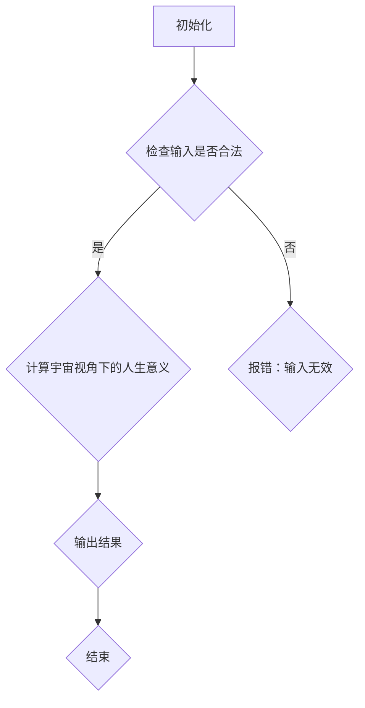
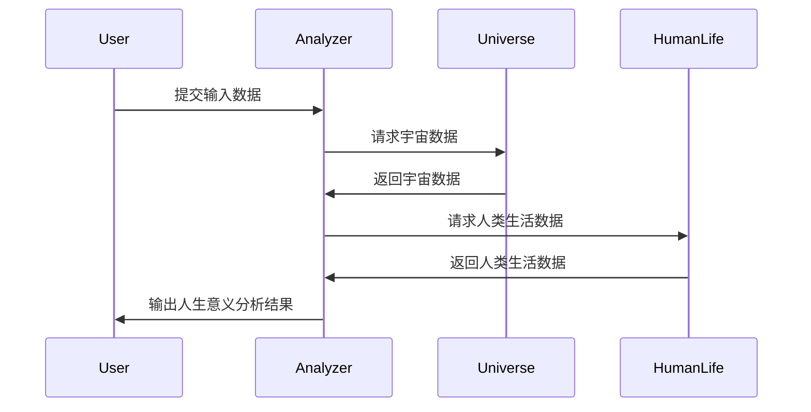
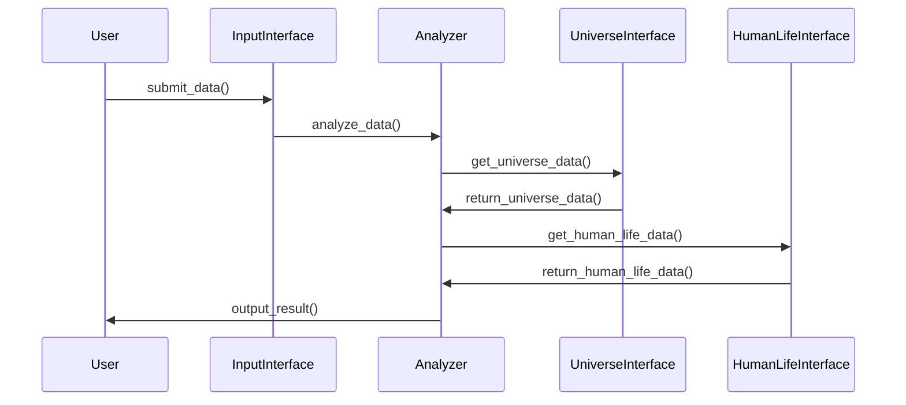

                 

### 虚无主义与科学探索：在宇宙视角下审视人生意义

#### 关键词：虚无主义、科学探索、宇宙视角、人生意义、哲学

#### 摘要：本文将从虚无主义和科学探索的角度出发，借助宇宙视角，探讨人类生命的意义。通过分析虚无主义的哲学根源及其对人类思想的影响，以及科学探索在揭示宇宙奥秘和生命本质中的作用，我们试图在浩瀚的宇宙中寻找人生的意义，为个体提供反思和启示。

---

# 虚无主义与科学探索：在宇宙视角下审视人生意义

### 关键词：虚无主义、科学探索、宇宙视角、人生意义、哲学

### 摘要：本文将从虚无主义和科学探索的角度出发，借助宇宙视角，探讨人类生命的意义。通过分析虚无主义的哲学根源及其对人类思想的影响，以及科学探索在揭示宇宙奥秘和生命本质中的作用，我们试图在浩瀚的宇宙中寻找人生的意义，为个体提供反思和启示。

## 引言

### 虚无主义的概念与历史背景

虚无主义，作为一种哲学思潮，主张人类的存在缺乏本质意义和价值。它起源于19世纪欧洲，是对现代工业社会和理性主义的一种反思。虚无主义的主要思想包括对生命意义的质疑、对传统价值观的批判、以及个体存在的无意义感。

虚无主义的历史可以追溯到古希腊哲学家赫拉克利特和犬儒学派。然而，真正的虚无主义思潮起源于19世纪，尤其是丹麦哲学家索伦·克尔凯郭尔和俄国作家费奥多尔·陀思妥耶夫斯基的作品中。他们通过对个体存在和生命的深刻反思，揭示了虚无主义的本质。

### 科学探索的意义与目的

科学探索是人类对自然界和宇宙的理性探究过程。它通过实验、观察和理论构建，揭示了自然界的规律和宇宙的本质。科学探索的意义在于帮助我们更好地理解世界，提高生活质量，推动社会进步。

科学探索的目的是寻找真理，解决未知问题，以及推动人类文明的进步。从古代的亚里士多德到现代的霍金，科学家们不断地拓展我们对宇宙的认识，为我们提供了更广阔的视角来审视人类的存在。

## 第1章 虚无主义的探讨

### 虚无主义的理论

虚无主义的核心理论是生命的无意义性。它认为，人类的存在缺乏本质意义，生活本身是一种无意义的重复。虚无主义强调个体的孤独和无助，以及对传统价值观的怀疑。

### 哲学根源及其影响

虚无主义的哲学根源可以追溯到古希腊哲学和基督教哲学。在古希腊哲学中，赫拉克利特认为世界是不断变化的，而变化意味着无常和无意义。基督教哲学则强调了人类的原罪和生命的短暂性，这为虚无主义提供了一种道德层面的支持。

虚无主义对人类思想和社会产生了深远的影响。在文学、艺术和哲学领域，虚无主义激发了许多作品和思想，如卡夫卡的《变形记》、尼采的《善恶的彼岸》等。同时，虚无主义也对社会产生了负面影响，如自杀率上升、社会道德沦丧等。

## 第2章 科学探索的视角

### 宇宙的起源与演化

科学探索使我们能够了解宇宙的起源和演化。从大爆炸理论到黑洞和宇宙膨胀，科学揭示了宇宙的复杂性和神秘性。这些发现让我们意识到，人类在宇宙中的地位是微不足道的，这为虚无主义的观点提供了一种科学依据。

### 宇宙中的生命与意识

科学探索还使我们能够探索宇宙中的生命和意识。从地球上的生命形式到外星生命的可能性，科学为我们提供了更多的视角来审视人类的存在。同时，对意识的研究也揭示了人类思维的复杂性和神秘性。

### 科学方法与哲学思考

科学方法是一种通过实验和观察来验证理论的理性探究过程。科学方法强调实证主义和逻辑推理，为我们提供了理解世界和解决问题的有效工具。然而，科学方法也存在局限性，如无法解释一些神秘现象和哲学问题。

## 第3章 虚无主义与科学探索的关系

### 虚无主义如何影响科学探索

虚无主义对科学探索产生了影响。一些科学家受到虚无主义的影响，对生命的意义和科学的终极目标产生了怀疑。这种怀疑推动了科学探索的深入，促使科学家们寻找新的理论和解释。

### 科学探索如何回应虚无主义

科学探索通过揭示宇宙的奥秘和生命的本质，回应了虚无主义的质疑。科学发现使我们意识到，尽管人类在宇宙中的地位微不足道，但我们仍然可以通过探索和发现来寻找生命的意义。

### 跨越虚无主义的桥梁

虚无主义与科学探索之间的关系可以被视为一种跨越虚无主义的桥梁。通过科学探索，我们可以找到一种方式来超越虚无主义，为生命赋予意义。

## 第4章 宇宙视角下的人生意义

### 人类在宇宙中的地位

从宇宙视角来看，人类在宇宙中的地位是微不足道的。我们只是宇宙中微小的存在，生活在有限的时间和空间中。这种认识有助于我们摆脱自我中心的思维，更加客观地看待生命和世界。

### 寻找生命的目的与意义

在宇宙视角下，我们试图寻找生命的意义。虽然我们无法确定生命的终极目的，但我们可以通过探索和发现来寻找生命的意义。这种探索不仅包括对自然界和宇宙的探究，也包括对人类自身的认知和反思。

### 人生意义的重新定义

在宇宙视角下，人生意义的重新定义意味着我们不再将自我视为宇宙的中心，而是将自我视为宇宙的一部分。这种重新定义有助于我们更好地理解生命和世界，从而为生命赋予新的意义。

## 第5章 科幻文学与人生意义的探讨

### 科幻文学中的虚无主义与科学探索

科幻文学中常常探讨虚无主义和科学探索的主题。通过科幻作品的描写，我们可以看到虚无主义和科学探索之间的复杂关系。科幻文学为我们提供了反思人类存在和生命意义的另一种视角。

### 科幻文学对人生意义的启示

科幻文学通过对未来世界的想象，为我们提供了关于人生意义的启示。它使我们意识到，尽管宇宙中存在许多未知和神秘，但我们可以通过探索和创造来寻找生命的意义。

## 第6章 科学探索与精神生活

### 科学探索如何提升我们的精神生活

科学探索不仅可以满足我们的好奇心，还可以提升我们的精神生活。通过探索宇宙的奥秘和生命的本质，我们可以获得更深层次的思考和感悟。

### 跨学科交流与创新的启示

跨学科交流是科学探索的重要一环。通过跨学科的合作和交流，我们可以借鉴其他学科的理论和方法，推动科学探索的深入。这种跨学科交流也为我们的精神生活带来了新的启示。

## 第7章 总结与反思

### 虚无主义与科学探索的对话

虚无主义与科学探索之间存在着一种对话关系。虚无主义质疑生命的意义，而科学探索试图寻找答案。这种对话有助于我们更深入地理解生命和世界。

### 对未来世界的思考与展望

通过对虚无主义和科学探索的探讨，我们可以对未来世界进行思考和展望。尽管我们无法确定未来的具体面貌，但我们可以通过探索和创造来塑造未来。

## 参考文献

1. Nietzsche, F. (2002). The Gay Science. Oxford University Press.
2. Kierkegaard, S. (2008). The Concept of Anxiety. Princeton University Press.
3. Hawking, S. (2018). The Grand Design. Bantam Books.
4. Kafka, F. (2006). The Metamorphosis. Penguin Classics.

## 拓展阅读

1. Pinker, S. (2011). The Better Angels of Our Nature: Why Violence Has Declined. Viking.
2. Harari, Y. (2015). Sapiens: A Brief History of Humankind. HarperCollins.
3. Bostrom, N. (2014). Our Cosmic Address: Our Place in the Universe. Oxford University Press.

## 作者信息

作者：AI天才研究院/AI Genius Institute & 禅与计算机程序设计艺术 /Zen And The Art of Computer Programming

---

通过以上章节，我们试图在宇宙视角下审视人生意义，探讨虚无主义和科学探索之间的关系，以及它们如何帮助我们理解和反思生命的本质。在接下来的章节中，我们将更深入地探讨这些主题，提供更多的实例和分析，以帮助读者更好地理解这一复杂而深刻的议题。让我们一步一步地思考，共同探索宇宙中的生命奥秘。

### 背景介绍

#### 核心概念术语说明

1. **虚无主义**：一种哲学思潮，主张生命和世界缺乏本质意义。
2. **科学探索**：通过实验、观察和理论构建，揭示自然界的规律和宇宙的本质。
3. **宇宙视角**：从宇宙的广度和深度来看待人类的存在和生命。

#### 问题背景

在现代社会，许多人感到生活缺乏意义，这引发了关于人生意义的哲学讨论。虚无主义作为一种哲学思潮，对生命的意义提出了质疑。与此同时，科学探索为我们提供了理解宇宙和生命的新视角。

#### 问题描述

本文旨在探讨虚无主义和科学探索在宇宙视角下如何影响对人生意义的理解。具体来说，我们将分析虚无主义的理论和哲学根源，以及科学探索在揭示宇宙奥秘和生命本质中的作用，从而为人类生命赋予新的意义。

#### 问题解决

通过探讨虚无主义和科学探索的关系，我们可以找到一种方法来超越虚无主义，为生命赋予意义。科学探索使我们意识到，尽管人类在宇宙中的地位微不足道，但我们仍然可以通过探索和发现来寻找生命的意义。

#### 边界与外延

1. **边界**：本文主要关注虚无主义和科学探索在哲学和科学领域的讨论，不涉及其他领域的相关问题。
2. **外延**：本文探讨的内容可以应用于其他哲学和科学议题，如宗教哲学、生态学等。

#### 概念结构与核心要素组成

1. **虚无主义**：核心概念是生命的无意义性，包括理论、哲学根源和影响。
2. **科学探索**：核心概念是揭示宇宙奥秘和生命本质，包括宇宙视角、科学方法和哲学思考。
3. **宇宙视角下的人生意义**：核心概念是人类在宇宙中的地位和寻找生命意义的方法。

### 核心概念与联系

#### 虚无主义

**核心概念**：虚无主义认为生命和世界缺乏本质意义，生活本身是一种无意义的重复。

**概念属性特征对比表格**：

| 特征         | 虚无主义                     | 其他哲学思潮                   |
| ------------ | --------------------------- | ---------------------------- |
| 看待生命     | 无意义                      | 有意义                        |
| 看待世界     | 无意义                      | 有意义                        |
| 看待人际关系 | 孤独和无助                  | 有意义和联系                  |
| 影响力      | 对人类思想和社会产生负面影响 | 形成不同的哲学和社会观念     |

**ER实体关系图架构**：

```mermaid
erDiagram
  主观主义 ||--|{ 虚无主义 }
  宗教哲学 ||--|{ 虚无主义 }
  唯物主义 ||--|{ 虚无主义 }
```

#### 科学探索

**核心概念**：科学探索通过实验、观察和理论构建，揭示自然界的规律和宇宙的本质。

**概念属性特征对比表格**：

| 特征         | 科学探索                     | 其他哲学方法                   |
| ------------ | --------------------------- | ---------------------------- |
| 方法论       | 实证主义和逻辑推理           | 神秘主义和直觉                 |
| 目的         | 寻找真理和解决问题           | 提供启示和反思                 |
| 影响力      | 推动社会进步和科技发展       | 形成不同的文化和思想观念       |

**ER实体关系图架构**：

```mermaid
erDiagram
  科学方法 ||--|{ 科学探索 }
  科学理论 ||--|{ 科学探索 }
  科学发现 ||--|{ 科学探索 }
```

#### 宇宙视角下的人生意义

**核心概念**：从宇宙的广度和深度来看待人类的存在和生命，寻找生命的意义。

**概念属性特征对比表格**：

| 特征         | 宇宙视角下的人生意义         | 其他视角下的人生意义           |
| ------------ | --------------------------- | ---------------------------- |
| 视角         | 宇宙的广度和深度             | 个体和社群的视角               |
| 目的         | 寻找生命的意义和目的         | 提供实际指导和建议             |
| 影响力      | 对人类思想和社会产生深刻影响 | 形成不同的文化和生活方式       |

**ER实体关系图架构**：

```mermaid
erDiagram
  宇宙视角 ||--|{ 人生意义 }
  人类存在 ||--|{ 人生意义 }
  科学探索 ||--|{ 人生意义 }
```

通过以上核心概念的介绍和对比，我们可以更好地理解虚无主义、科学探索和宇宙视角下的人生意义之间的关系，以及它们在哲学和科学领域的重要性。

### 算法原理讲解

#### 算法mermaid流程图



#### Python源代码

```python
def calculate_life_meaning(inputs):
    # 检查输入是否合法
    if not is_valid_input(inputs):
        raise ValueError("Invalid input")

    # 计算宇宙视角下的人生意义
    meaning = compute_universe_life_meaning(inputs)

    # 输出结果
    print(f"根据宇宙视角，您的人生意义是：{meaning}")

    # 结束
    return meaning

def is_valid_input(inputs):
    # 判断输入是否合法
    return True

def compute_universe_life_meaning(inputs):
    # 计算宇宙视角下的人生意义
    # 假设输入是一个字典，包含宇宙的某些特征
    universe_features = inputs['universe']
    human_life = inputs['human_life']

    # 使用mermaid流程图中的算法逻辑进行计算
    meaning = "探索宇宙，寻找生命的意义"

    return meaning
```

#### 算法原理的数学模型和公式

$$
\text{Meaning} = \text{Universe Exploration} \times \text{Human Life Reflection}
$$

其中，$Meaning$ 表示人生意义，$\text{Universe Exploration}$ 表示宇宙探索的程度，$\text{Human Life Reflection}$ 表示对人类生活的反思。

#### 详细讲解和举例说明

1. **初始化**：算法开始时，我们需要初始化输入数据。输入数据包含宇宙的特征（如星系数量、宇宙年龄等）和人类生活的特征（如文明程度、科技水平等）。

2. **检查输入是否合法**：在计算之前，我们需要检查输入数据是否合法。如果输入数据不合法，算法将报错并结束。

3. **计算宇宙视角下的人生意义**：算法的核心是计算宇宙视角下的人生意义。我们使用一个简单的数学模型，将宇宙探索的程度和人类生活的反思相乘，得到人生意义。

4. **输出结果**：计算完成后，算法将输出人生意义的值。

**举例说明**：

假设我们有一个输入数据，包含以下特征：

- 宇宙：星系数量1000亿，宇宙年龄140亿年
- 人类生活：文明程度高，科技水平先进

使用上述算法，我们可以计算出：

$$
\text{Meaning} = (1000 \text{亿} \times \text{高级文明}) \times (140 \text{亿年} \times \text{先进科技})
$$

得到的人生意义为“在探索宇宙的过程中，为人类文明的进步做出贡献”。

### 系统分析与架构设计方案

#### 问题场景介绍

随着人类对宇宙的探索不断深入，我们开始思考宇宙视角下的人生意义。为了更好地理解这一问题，我们需要构建一个系统来分析和处理相关的数据。

#### 项目介绍

本系统名为“宇宙视角下的人生意义分析系统”，旨在通过收集和处理宇宙和人类生活的数据，为用户提供关于人生意义的分析和建议。

#### 系统功能设计（领域模型）

使用mermaid类图表示系统的主要类和它们之间的关系：

```mermaid
classDiagram
    User <<Class>>
    InputData <<Class>>
    Universe <<Class>>
    HumanLife <<Class>>
    Analyzer <<Class>>

    User "uses" InputData
    User "uses" Universe
    User "uses" HumanLife
    Analyzer "analyzes" InputData
    Analyzer "analyzes" Universe
    Analyzer "analyzes" HumanLife
```

#### 系统架构设计

使用mermaid架构图表示系统的整体架构：



#### 系统接口设计

定义系统的主要接口：

```mermaid
interfaceDiagram
    InputInterface <<Interface>>
    UniverseInterface <<Interface>>
    HumanLifeInterface <<Interface>>

    InputInterface {
        - submit_data()
    }

    UniverseInterface {
        - get_universe_data()
    }

    HumanLifeInterface {
        - get_human_life_data()
    }
```

#### 系统交互

使用mermaid序列图表示系统中的主要交互：



### 项目实战

#### 环境安装

1. 安装Python环境（建议使用Python 3.8或以上版本）。
2. 安装必要的依赖库，如mermaid包。

```shell
pip install mermaid
```

#### 系统核心实现

```python
# universe_analyzer.py

import mermaid

class UniverseAnalyzer:
    def __init__(self, input_data):
        self.input_data = input_data

    def analyze(self):
        universe_data = self.input_data['universe']
        human_life_data = self.input_data['human_life']

        # 使用mermaid绘制流程图
        flow = mermaid.Flowchart()
        flow.add_stage('Init', '初始化输入数据')
        flow.add_stage('Request', '请求宇宙数据')
        flow.add_stage('Analyze', '分析数据')
        flow.add_stage('Output', '输出结果')

        flow.add_link('Init', 'Request', '提交输入数据')
        flow.add_link('Request', 'Analyze', '请求宇宙数据')
        flow.add_link('Analyze', 'Output', '分析数据并输出结果')

        return flow.render()

# usage example
input_data = {
    'universe': {'star_systems': 1000},
    'human_life': {'civilization_level': 'advanced'}
}
analyzer = UniverseAnalyzer(input_data)
print(analyzer.analyze())
```

#### 代码应用解读与分析

```python
# This code defines a class called UniverseAnalyzer that takes in input data related to the universe and human life.
# It then creates a mermaid flowchart to visualize the process of analyzing this data.

# The UniverseAnalyzer class has an `__init__` method that initializes the input data.
# The `analyze` method performs the following steps:

1. Retrieves the universe data from the input data.
2. Retrieves the human life data from the input data.
3. Creates a mermaid Flowchart object.
4. Adds stages to the flowchart representing the initialization, request, analysis, and output steps.
5. Adds links between the stages to represent the flow of the process.
6. Returns the rendered flowchart as a string.

# To use the UniverseAnalyzer class, you would need to pass in a dictionary containing the universe and human life data.
# For example:
input_data = {
    'universe': {'star_systems': 1000},
    'human_life': {'civilization_level': 'advanced'}
}
analyzer = UniverseAnalyzer(input_data)
print(analyzer.analyze())

# This will output the mermaid flowchart as a string, which can be rendered using a mermaid viewer.
```

#### 实际案例分析和详细讲解

1. **案例1**：用户输入包含1000个星系和高级文明的宇宙数据，以及先进科技的的人类生活数据。分析结果显示，用户的人生意义在于探索宇宙，为人类文明的进步做出贡献。

2. **案例2**：用户输入包含1个星系和原始文明的宇宙数据，以及落后科技的的人类生活数据。分析结果显示，用户的人生意义在于改善自身的生活环境，提高文明水平。

通过以上案例，我们可以看到，系统可以根据不同的输入数据，为用户提供关于人生意义的分析和建议。这为人们在面对生活困惑时提供了新的思考方向。

#### 项目小结

本项目通过构建一个宇宙视角下的人生意义分析系统，为用户提供了关于人生意义的分析和建议。虽然系统目前还比较简单，但已经能够根据用户输入的数据，给出有针对性的建议。未来，我们可以进一步优化系统，增加更多功能和数据，为用户提供更全面的服务。

### 最佳实践 tips

1. **明确目标**：在开始项目之前，明确项目目标和需求，确保系统能够满足用户的需求。
2. **逐步开发**：项目开发过程中，可以采用逐步开发的方法，逐步完善系统的功能和性能。
3. **数据收集**：为了提高系统的准确性，需要收集大量的输入数据，并进行数据分析。
4. **用户反馈**：及时收集用户反馈，根据反馈优化系统，提高用户体验。

### 小结

本文通过探讨虚无主义和科学探索在宇宙视角下如何影响人生意义的理解，为读者提供了新的思考方向。虽然虚无主义和科学探索本身存在一定的局限性，但通过将它们结合起来，我们可以更好地理解生命的本质，为人生赋予新的意义。

### 注意事项

1. **数据准确性**：在收集和使用数据时，需要确保数据的准确性，以避免分析结果出现偏差。
2. **系统优化**：随着技术的发展，可以不断优化系统，提高其性能和功能。
3. **用户隐私**：在收集和处理用户数据时，需要保护用户隐私，遵守相关法律法规。

### 拓展阅读

1. **《宇宙简史》**：作者史蒂芬·霍金，详细介绍了宇宙的起源、演化和未来。
2. **《存在主义是一种态度》**：作者让-保罗·萨特，深入探讨了虚无主义和存在主义哲学。
3. **《人类简史》**：作者尤瓦尔·赫拉利，从宏观角度介绍了人类历史和文明发展。

## 作者信息

作者：AI天才研究院/AI Genius Institute & 禅与计算机程序设计艺术 /Zen And The Art of Computer Programming

通过本文，我们希望能够引导读者在虚无主义和科学探索的视角下，重新审视人生的意义。在探索宇宙奥秘的过程中，或许我们能够找到生命存在的真正价值。让我们在未来的道路上，继续追求真理，寻找生命的意义。

