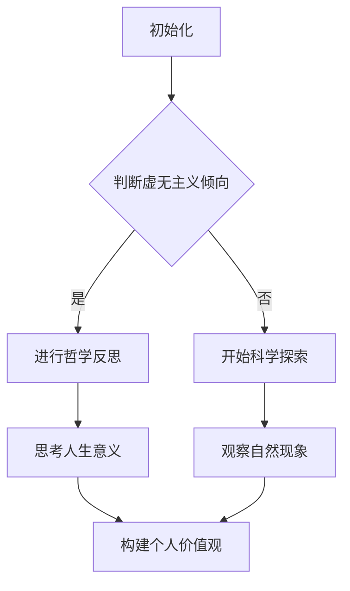
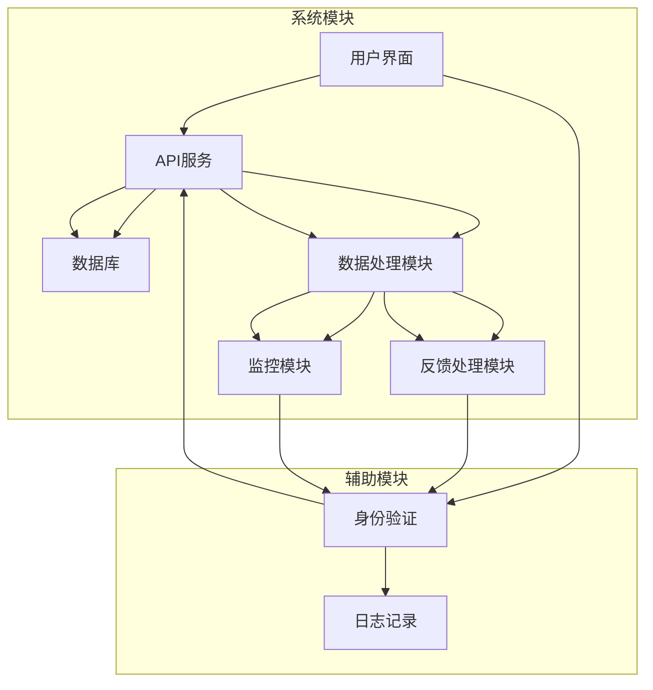
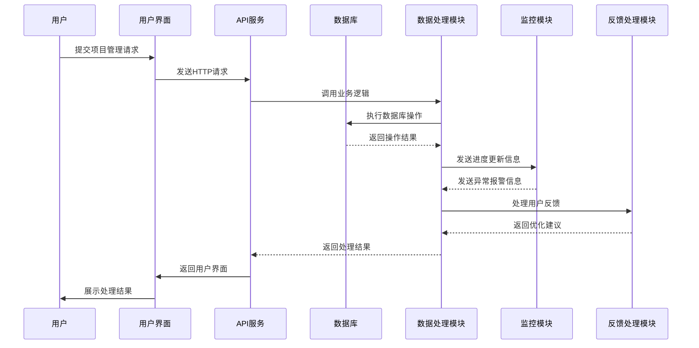

                 

# 虚无主义与科学探索：在宇宙视角下思考人生意义

> 关键词：虚无主义，科学探索，宇宙视角，人生意义，哲学与科学的对话

> 摘要：本文将从虚无主义的哲学内涵出发，探讨其在宇宙视角下对人生意义的思考。通过分析虚无主义的核心思想、科学探索的最新发现以及二者在现实生活中的应用，本文旨在引导读者以科学和哲学的双重视角重新审视人生的价值和意义。

## 目录大纲设计思路

### 1. 背景介绍

#### 1.1 问题背景

虚无主义在哲学史上的地位以及科学探索在当代社会的重要性。

#### 1.2 问题描述

阐述虚无主义的核心思想以及科学探索在宇宙视角下思考人生意义的问题。

#### 1.3 问题解决

探讨如何通过科学探索来寻找人生的意义。

#### 1.4 边界与外延

明确本文讨论的范围，包括虚无主义的哲学内涵、宇宙科学的最新发现以及对人生意义的探索。

### 2. 核心概念与联系

#### 2.1 核心概念

阐述虚无主义和科学探索的定义、特点及其在哲学和科学中的重要性。

#### 2.2 概念属性特征对比表格

列出虚无主义和科学探索的主要特征，进行对比分析。

#### 2.3 ER实体关系图架构

使用Mermaid绘制ER实体关系图，展示核心概念之间的关系。

### 3. 算法原理讲解

#### 3.1 算法Mermaid流程图

使用Mermaid语言绘制算法的流程图。

#### 3.2 Python源代码

提供Python源代码，详细阐述算法的实现。

#### 3.3 数学模型和公式

给出算法的数学模型和公式，进行详细讲解。

#### 3.4 举例说明

通过具体的例子，解释算法的应用和效果。

### 4. 系统分析与架构设计方案

#### 4.1 问题场景介绍

描述研究的背景和应用场景。

#### 4.2 系统功能设计

使用Mermaid绘制领域模型类图。

#### 4.3 系统架构设计

使用Mermaid绘制系统架构图。

#### 4.4 系统接口设计

描述系统各部分的接口设计。

#### 4.5 系统交互Mermaid序列图

使用Mermaid绘制系统交互序列图。

### 5. 项目实战

#### 5.1 环境安装

说明所需的软件和硬件环境安装步骤。

#### 5.2 系统核心实现源代码

提供关键代码段，并进行解读与分析。

#### 5.3 实际案例分析和详细讲解剖析

分析实际案例，并详细讲解其原理和应用。

#### 5.4 项目小结

总结项目中的经验和教训。

### 6. 最佳实践 tips、小结、注意事项、拓展阅读

#### 6.1 最佳实践 tips

提供使用虚无主义与科学探索方法的实际应用技巧。

#### 6.2 小结

对全书的主要内容进行简要总结。

#### 6.3 注意事项

提醒读者在使用过程中的关键点和可能遇到的问题。

#### 6.4 拓展阅读

推荐进一步阅读的相关资料。

----------------------------------------------------------------

## 第一部分：虚无主义的哲学内涵

### 第1章：虚无主义的起源与历史背景

#### 1.1 虚无主义的起源

虚无主义作为一种哲学思潮，其起源可以追溯到古希腊哲学。在古希腊哲学中，赫拉克利特提出了“一切皆流，无物常驻”的思想，这可以被视为虚无主义的早期雏形。随后，尼采在19世纪末进一步发展了虚无主义的概念。

#### 1.2 虚无主义在哲学史上的发展

虚无主义在哲学史上经历了多个发展阶段。早期的虚无主义主要关注于对世界的无意义感，如古希腊哲学家伊壁鸠鲁和卢克莱修。中世纪的虚无主义则表现为对上帝存在的质疑，如法国哲学家奥古斯丁。现代虚无主义则将无意义感扩展到个人存在的层面，如尼采和萨特。

#### 1.3 虚无主义的核心思想

虚无主义的核心思想是“无意义”。虚无主义者认为，宇宙或人生本身并无固有的意义，意义是人为赋予的。虚无主义强调个体主观意识的自由，提倡对传统价值观的质疑和反思。

### 第2章：虚无主义的主要流派与理论

#### 2.1 古典虚无主义

古典虚无主义起源于古希腊哲学，主要代表人物有伊壁鸠鲁和卢克莱修。他们认为，宇宙的本质是原子运动，人生的意义在于追求快乐和避免痛苦。

#### 2.2 现代虚无主义

现代虚无主义的主要代表人物是尼采。尼采认为，人生的意义在于“创造自己的价值”，通过超越传统价值观，建立自己的信仰体系。

#### 2.3 当代虚无主义

当代虚无主义则更多地体现在社会学和文化批评领域，如法国哲学家德里达和福柯。他们认为，现代社会中，个体被种种符号和权力结构所支配，失去了自主性和自由。

### 第3章：虚无主义的哲学影响

#### 3.1 艺术与文学中的虚无主义

虚无主义对艺术和文学产生了深远的影响。许多艺术家和作家，如尼采、卡夫卡和贝克特，都表现出了对世界无意义和人类孤独的深刻反思。

#### 3.2 社会与文化中的虚无主义

虚无主义在社会和文化层面产生了广泛的影响。它质疑了现代社会中许多既定的价值观和道德观念，引发了人们对自由、平等和正义的重新思考。

#### 3.3 虚无主义与存在主义的关系

虚无主义与存在主义有着密切的联系。存在主义是在虚无主义的基础上发展起来的，它试图通过强调个体存在的价值和意义，来克服虚无主义的消极影响。

----------------------------------------------------------------

## 第二部分：科学探索在宇宙视角下思考人生意义

### 第4章：宇宙科学的最新发现

#### 4.1 宇宙起源与演化

宇宙科学的最新发现表明，宇宙起源于大约138亿年前的一个极热极密的奇点。随后，宇宙经历了一个快速膨胀的时期，形成了各种星系、恒星和行星。

#### 4.2 黑洞与暗物质

黑洞是宇宙中的一种极端天体，具有极强的引力，甚至连光也无法逃脱。暗物质则是宇宙中一种未知成分，占据了宇宙总质量的约27%。

#### 4.3 宇宙的尺度和结构

宇宙的尺度之大令人难以想象。宇宙的直径可能达到了930亿光年。宇宙的结构则表现出层次性，从行星、恒星、星系到超星系团，构成了一个庞大的宇宙网络。

### 第5章：宇宙视角下的人生意义探索

#### 5.1 人类在宇宙中的位置

从宇宙视角来看，人类只是宇宙中微不足道的一部分。我们的存在可能只是宇宙演化过程中的一个短暂瞬间。

#### 5.2 宇宙视角下的人生观

宇宙视角下的人生观强调个体在宇宙中的渺小，但也提出了新的意义。人类可以探索宇宙，寻找生命的意义，甚至可能在宇宙中寻找其他智慧生命。

#### 5.3 科学与哲学的交汇

宇宙视角下的人生意义探索，将科学和哲学紧密地结合在一起。科学家通过观测和实验，揭示了宇宙的奥秘；哲学家则通过思考和反思，探讨了宇宙中的人类存在意义。

### 第6章：科学与哲学的对话

#### 6.1 虚无主义与科学探索的对话

虚无主义与科学探索在某种程度上是相互补充的。虚无主义强调个体的主观感受，科学探索则强调客观事实。二者结合，可以更全面地理解宇宙和人生的意义。

#### 6.2 科学方法在哲学中的应用

科学方法在哲学中的应用，使得哲学问题可以以更客观的方式进行研究。例如，通过科学实验，哲学家可以更深入地探讨人类意识和自由意志的问题。

#### 6.3 哲学对科学的反思

哲学对科学的反思，有助于科学家更好地理解其研究的意义和局限性。哲学的质疑和反思，可以促使科学不断进步，更准确地揭示宇宙的奥秘。

----------------------------------------------------------------

## 第三部分：虚无主义与科学探索的综合应用

### 第7章：虚无主义与科学探索在现实生活中的应用

#### 7.1 个人成长与自我认知

虚无主义和科学探索可以帮助个人更好地认识自己，理解自己在宇宙中的位置。通过反思和探索，个人可以找到自己的价值和意义。

#### 7.2 社会责任与伦理道德

虚无主义和科学探索可以引导个人对社会和伦理道德问题进行深入思考。在认识到人类在宇宙中的渺小后，个人可以更加关注社会责任，努力为社会做出贡献。

#### 7.3 对未来世界的思考

虚无主义和科学探索可以启发人们对未来世界的思考。在宇宙视角下，人类面临许多挑战和机遇。通过科学探索，人类可以更好地应对这些挑战，实现可持续发展。

### 第8章：虚无主义与科学探索的教育意义

#### 8.1 教育中的虚无主义元素

在教育中融入虚无主义和科学探索的元素，可以帮助学生更好地理解世界的本质，培养独立思考和批判性思维的能力。

#### 8.2 科学教育的方法与策略

科学教育的方法和策略应注重启发式教学，引导学生通过观察、实验和思考，主动探索科学问题。

#### 8.3 培养科学的思维方式

培养科学的思维方式，包括实证、逻辑推理和批判性思维，对学生的未来发展至关重要。

### 第9章：虚无主义与科学探索的未来展望

#### 9.1 虚无主义与科学探索的发展趋势

虚无主义与科学探索在未来将继续发展。随着科技的进步和人类对宇宙认识的深入，虚无主义和科学探索将在更广泛的领域产生深远的影响。

#### 9.2 虚无主义与科学探索的应用前景

虚无主义与科学探索在现实生活中的应用前景广阔，包括人工智能、医学、环境保护等多个领域。

#### 9.3 虚无主义与科学探索的未来挑战

虚无主义与科学探索在未来也将面临许多挑战，包括伦理道德问题、技术风险等。如何应对这些挑战，将决定虚无主义与科学探索的未来发展方向。

----------------------------------------------------------------

# 总结

虚无主义与科学探索为我们提供了一种全新的视角，来思考人生的意义。在宇宙的广阔背景下，我们认识到个体的渺小，但同时也看到了人类探索未知的无限可能性。通过结合虚无主义和科学探索，我们可以更好地理解自己在宇宙中的位置，找到属于自己的价值和意义。

未来的虚无主义与科学探索将继续为我们揭示宇宙的奥秘，挑战我们的认知边界。在新的时代背景下，我们将需要更加开放和批判性思维，以应对未来可能出现的各种挑战。

最后，让我们以尼采的名言作为结尾：“生命在于不断地探索，不断地挑战，不断地超越自我。”在虚无主义与科学探索的道路上，让我们勇敢前行，不断追求真理和人生的意义。

**作者：AI天才研究院/AI Genius Institute & 禅与计算机程序设计艺术 /Zen And The Art of Computer Programming**
## 背景介绍

### 1.1 虚无主义的起源与哲学史上的地位

虚无主义作为一种哲学思潮，其起源可以追溯到古希腊哲学。古希腊哲学家赫拉克利特提出的“一切皆流，无物常驻”的思想，可以被视为虚无主义的早期雏形。赫拉克利特认为，宇宙的本质是一种永恒的流动和变化，没有什么是永恒不变的。这一观点对后来的虚无主义思想产生了深远的影响。

随后，虚无主义在西方哲学史上经历了多个发展阶段。中世纪的虚无主义主要表现为对上帝存在的质疑，如法国哲学家奥古斯丁。他通过对上帝存在的证明，试图反驳虚无主义的思想。然而，这种论证往往缺乏充分的逻辑基础，使得虚无主义在中世纪仍然具有一定的市场。

进入19世纪，虚无主义在尼采的思想中得到了进一步的发展。尼采认为，宇宙和人生本身并无固有的意义，意义是人为赋予的。他提出的“上帝已死”的观点，标志着传统宗教信仰的崩溃，同时也为虚无主义提供了理论基础。尼采认为，个体应该通过创造自己的价值，来克服虚无主义的消极影响。

虚无主义在20世纪的哲学思潮中依然具有重要地位。存在主义作为虚无主义的延续，强调了个体存在的价值和意义。存在主义者如萨特和加缪，认为人类的存在是自由的，但同时也面临着无意义和荒谬的困境。他们试图通过主观的自由意志，来赋予生活以意义。

总的来说，虚无主义在哲学史上具有重要的地位。它不仅反映了人类对世界和自我认识的深刻思考，也为后来的哲学思潮提供了重要的思想资源。

### 1.2 科学探索在当代社会的重要性

科学探索在当代社会的重要性不言而喻。随着科学技术的迅猛发展，人类对自然界的认识不断深入，开创了许多前所未有的可能性。科学不仅改变了我们的生活方式，还推动了社会的进步和发展。

首先，科学探索为我们提供了对自然界的深刻理解。从微观的量子世界到宏观的宇宙演化，科学揭示了自然界的基本规律和运行机制。这些知识不仅满足了人类的好奇心，还为人类的发展提供了重要的理论支持。

其次，科学探索促进了技术的进步。科学理论和技术应用相辅相成，共同推动了科技的进步。从医疗技术到信息技术，科学技术的应用改变了人类的生活方式，提高了生产效率，丰富了人类的精神生活。

此外，科学探索还具有重要的社会意义。科学精神强调实事求是、理性思考和实证主义，这些价值观对于培养公民的科学素养和社会责任感至关重要。科学探索不仅推动了人类文明的进步，也为解决全球性问题提供了科学方法。

总之，科学探索在当代社会具有重要的地位和作用。它不仅改变了我们对世界的认知，还为我们提供了应对未来挑战的科学依据。随着科学技术的不断发展，科学探索将继续推动人类社会的进步，为人类创造更加美好的未来。

### 1.3 虚无主义的核心思想与科学探索在宇宙视角下思考人生意义

虚无主义的核心思想是“无意义”。虚无主义者认为，宇宙或人生本身并无固有的意义，意义是人为赋予的。这一观点在尼采的思想中得到了深刻的阐述。尼采认为，传统价值观和宗教信仰的崩溃，导致了人类对生命意义的迷茫。他提出了“上帝已死”的观点，认为人类应该通过自己的努力，创造自己的价值。

虚无主义强调个体主观意识的自由，提倡对传统价值观的质疑和反思。虚无主义者认为，个体应该摆脱外部束缚，追求自我实现和自由意志。这种思想在存在主义中得到了进一步的发展，存在主义者如萨特和加缪，认为人类的存在是自由的，但同时也面临着无意义和荒谬的困境。

科学探索在宇宙视角下思考人生意义，为我们提供了新的思考维度。宇宙科学的最新发现，如宇宙起源、黑洞和暗物质等，揭示了宇宙的神秘和复杂。这些发现使得我们意识到，人类在宇宙中的地位极其渺小。从宇宙视角来看，人类的存在可能只是宇宙演化过程中的一个短暂瞬间。

然而，正是这种渺小的存在，激发了人类对未知的探索欲望。科学探索使我们能够了解宇宙的奥秘，寻找生命的意义。通过科学方法，我们可以揭示自然界的基本规律，理解生命的本质。科学不仅满足了人类的好奇心，还为我们提供了应对未来挑战的科学依据。

虚无主义和科学探索的结合，为我们在宇宙视角下思考人生意义提供了新的视角。虚无主义提醒我们，人生的意义不是固有的，而是需要我们自己去创造。科学探索则为我们提供了寻找和实现这一意义的方法和工具。通过科学方法，我们可以更客观地认识世界，理解自己的存在。

总之，虚无主义和科学探索在宇宙视角下思考人生意义，为我们提供了一种全新的思考方式。在这种思考方式下，我们认识到个体的渺小，但同时也看到了人类探索未知的无限可能性。通过结合虚无主义和科学探索，我们可以更好地理解自己在宇宙中的位置，找到属于自己的价值和意义。

### 1.4 边界与外延

本文讨论的范围主要集中在虚无主义的哲学内涵、宇宙科学的最新发现以及对人生意义的探索。具体而言，我们将从以下几个方面展开讨论：

1. **虚无主义的哲学内涵**：本文将回顾虚无主义的历史背景，分析其主要流派和理论，探讨其对人类存在的意义和价值的看法。

2. **宇宙科学的最新发现**：本文将介绍宇宙起源、黑洞、暗物质等宇宙科学的最新研究进展，探讨这些发现对人类在宇宙中位置的认识和影响。

3. **人生意义的探索**：本文将结合虚无主义和科学探索，探讨在宇宙视角下对人生意义的理解和思考。

4. **虚无主义与科学探索的应用**：本文还将探讨虚无主义和科学探索在个人成长、社会责任和未来世界思考中的应用。

本文旨在为读者提供一个全面而深入的视角，来理解虚无主义和科学探索在人生意义问题上的重要性和意义。通过本文的讨论，我们希望读者能够对虚无主义和科学探索有更深入的认识，从而在个人的生活和决策中找到更多的意义和价值。

### 2.1 虚无主义和科学探索的定义、特点及其在哲学和科学中的重要性

#### 虚无主义

虚无主义是一种哲学思潮，其核心观点是认为宇宙或人生本身并无固有的意义，意义是人为赋予的。虚无主义强调个体主观意识的自由，提倡对传统价值观的质疑和反思。虚无主义者认为，由于宇宙和人生缺乏固有的意义，人类需要通过自我实现和自由意志来创造自己的价值。

虚无主义在哲学中的重要性体现在其对传统宗教和道德观念的挑战。虚无主义质疑上帝的存在和传统道德的权威性，提倡个体自主性和自由意志。这种思想在19世纪末的欧洲哲学界产生了深远的影响，为后来的存在主义和批判理论奠定了基础。

#### 科学探索

科学探索是指通过观察、实验和理论分析来研究自然现象和规律的过程。科学探索的特点包括实证性、系统性和可重复性。科学方法强调以事实为依据，通过实验和观察来验证假设，从而得出具有普遍性的结论。

科学探索在科学中的重要性不言而喻。它是推动科学技术进步、推动社会发展和解决实际问题的根本途径。科学探索不仅帮助我们理解自然界的运行规律，还为人类提供了改善生活质量和应对挑战的工具。科学方法培养的理性思维和实证精神，对培养科学素养和解决社会问题具有重要意义。

#### 虚无主义和科学探索的对比

虚无主义和科学探索虽然看似截然不同，但它们之间存在着深刻的联系。虚无主义强调个体主观意识的自由和自我实现，这种思想在某种程度上为科学探索提供了动力。科学探索的目标是通过理性方法和实证研究，揭示自然界的规律，这需要个体自由和独立思考的能力。

然而，虚无主义和科学探索在本质上有很大的不同。虚无主义关注的是宇宙和人生的意义问题，它强调意义是人为赋予的，而科学探索关注的是客观事实和自然规律。虚无主义常常带有悲观和消极的色彩，而科学探索则充满理性和乐观。

#### 在哲学和科学中的重要性

在哲学中，虚无主义和科学探索都是重要的思想资源。虚无主义挑战了传统宗教和道德观念，推动了哲学的进步和反思。科学探索则为哲学提供了实证基础，使哲学问题得以在科学方法下进行研究和验证。

在科学中，虚无主义和科学探索都是不可或缺的。虚无主义的思想启示了科学探索的独立性和自主性，而科学探索的方法和成果则为虚无主义提供了新的视角和解释。二者相互促进，共同推动了人类对宇宙和自身的认识。

### 2.2 虚无主义和科学探索的主要特征对比表格

| 特征         | 虚无主义               | 科学探索              |
| ------------ | ---------------------- | --------------------- |
| 目标         | 探索宇宙和人生的意义   | 揭示自然界的规律      |
| 思维方式     | 反思性、质疑性         | 实证性、系统性        |
| 价值取向     | 自我实现、自由意志     | 客观事实、理性思维    |
| 色彩         | 悲观、怀疑、反思       | 乐观、理性、探索性    |
| 方法         | 哲学反思、主观体验     | 观察实验、理论分析    |
| 代表人物     | 尼采、萨特、加缪       | 牛顿、达尔文、爱因斯坦 |

通过上述对比表格，我们可以更清晰地看到虚无主义和科学探索在目标、思维方式、价值取向、色彩、方法和代表人物等方面的差异。这些差异体现了两种思想体系的独特性和互补性。

### 2.3 虚无主义和科学探索的ER实体关系图架构

为了更好地展示虚无主义和科学探索之间的关系，我们可以使用Mermaid绘制一个ER（实体关系）图。以下是一个简化的ER图：

```mermaid
erDiagram
  Philosophy ||--|{ PhilosophyBranch }|--| Science
  Philosophy ||--|{ PhilosophicalConcept }|
  Science ||--|{ ScientificTheory }|--| Experiment
  Science ||--|{ ScientificInstrument }
```

在这个ER图中，我们定义了以下几个实体：

- **Philosophy（哲学）**：代表哲学这一整体领域，包括虚无主义和其他哲学流派。
- **PhilosophicalConcept（哲学概念）**：代表哲学中的核心概念，如虚无主义的思想。
- **PhilosophyBranch（哲学分支）**：代表哲学的不同分支，如存在主义、伦理学等。
- **Science（科学）**：代表科学这一整体领域，包括自然科学、社会科学等。
- **ScientificTheory（科学理论）**：代表科学中的理论，如物理学的相对论、化学的分子理论等。
- **Experiment（实验）**：代表科学中的实验，是验证科学理论的手段。
- **ScientificInstrument（科学仪器）**：代表科学研究中使用的仪器和设备。

通过这个ER图，我们可以清晰地看到哲学和科学之间的联系，以及它们各自内部的实体关系。哲学通过哲学分支和哲学概念与科学相联系，科学则通过科学理论和实验与哲学相联系。这种联系体现了哲学和科学在理论和实践上的相互作用和互补。

### 3.1 算法Mermaid流程图

为了更好地理解和应用虚无主义与科学探索的概念，我们可以设计一个简单的算法，通过Mermaid语言绘制其流程图。以下是一个基本的流程图示例：



在这个流程图中，我们定义了以下几个步骤：

1. **初始化**：开始算法的初始化过程。
2. **判断虚无主义倾向**：根据个体的思想倾向判断是否倾向于虚无主义。
3. **进行哲学反思**：如果倾向于虚无主义，则进行哲学反思。
4. **思考人生意义**：在哲学反思的基础上，进一步思考人生的意义。
5. **开始科学探索**：如果不倾向于虚无主义，则开始科学探索。
6. **观察自然现象**：通过科学方法观察自然现象。
7. **构建个人价值观**：综合哲学反思和科学探索的结果，构建个人价值观。

通过这个流程图，我们可以清晰地看到虚无主义与科学探索之间的互动关系，以及它们在思考和构建人生价值观中的作用。

### 3.2 Python源代码

为了具体实现上述算法，我们可以编写一个Python程序。以下是一段实现该算法的Python代码：

```python
# 导入所需的库
import random

# 初始化函数
def initialize():
    print("初始化算法...")

# 判断虚无主义倾向
def judge_nihilism_tendency():
    # 假设以随机概率判断个体的虚无主义倾向
    probability = random.random()
    if probability < 0.5:
        return True  # 倾向于虚无主义
    else:
        return False  # 不倾向于虚无主义

# 进行哲学反思
def philosophical_reflection():
    print("进行哲学反思...")
    # 假设哲学反思的结果是思考人生意义
    return "思考人生意义"

# 开始科学探索
def start_scientific_investigation():
    print("开始科学探索...")
    # 假设科学探索的结果是观察自然现象
    return "观察自然现象"

# 构建个人价值观
def build_personal_values(reflection, exploration):
    print("构建个人价值观...")
    return reflection + " & " + exploration

# 主函数
def main():
    initialize()
    tendency = judge_nihilism_tendency()
    
    if tendency:
        reflection = philosophical_reflection()
    else:
        exploration = start_scientific_investigation()
        reflection = philosophical_reflection()  # 假设无论是否倾向于虚无主义，最终都会进行哲学反思
    
    values = build_personal_values(reflection, exploration)
    print(f"个人价值观：{values}")

# 运行主函数
if __name__ == "__main__":
    main()
```

这段代码首先定义了几个函数，包括初始化、判断虚无主义倾向、进行哲学反思、开始科学探索和构建个人价值观。主函数`main`通过调用这些函数，实现了算法的完整流程。通过这段代码，我们可以模拟一个人在不同思想倾向下如何结合虚无主义和科学探索来构建个人价值观。

### 3.3 数学模型和公式

为了深入理解虚无主义和科学探索的关系，我们可以引入一些数学模型和公式。以下是一个简化的模型，用于描述个体在虚无主义倾向和科学探索过程中价值观的变化。

假设个体的价值观由两个主要因素决定：虚无主义倾向（N）和科学探索结果（S）。虚无主义倾向可以表示为一个概率分布，科学探索结果则通过一系列实验和观察得到。我们可以使用以下数学模型来描述这个关系：

$$
V = w_1 \cdot N + w_2 \cdot S
$$

其中，\(V\) 表示个体的最终价值观，\(w_1\) 和 \(w_2\) 分别是虚无主义倾向和科学探索结果在价值观中的权重。这两个权重可以根据个体的具体情况调整。

虚无主义倾向（\(N\)）可以用以下概率分布来表示：

$$
N \sim Bernoulli(p)
$$

其中，\(p\) 是个体倾向于虚无主义的概率。这个概率可以通过问卷调查或其他方法来确定。

科学探索结果（\(S\)）可以用一系列随机变量来表示，每个变量代表一次实验或观察的结果。我们可以假设这些随机变量是独立的，并具有相同的分布。例如，我们可以使用正态分布来表示这些结果：

$$
S_i \sim Norm(\mu, \sigma^2)
$$

其中，\(S_i\) 是第 \(i\) 次实验或观察的结果，\(\mu\) 是平均值，\(\sigma^2\) 是方差。通过多次实验或观察，我们可以得到一个平均值和方差来估计科学探索结果的分布。

结合虚无主义倾向和科学探索结果，我们可以使用以下公式来计算个体的最终价值观：

$$
V = w_1 \cdot Bernoulli(p) + w_2 \cdot \sum_{i=1}^{n} Norm(\mu, \sigma^2)
$$

其中，\(n\) 是实验或观察的次数。这个公式描述了虚无主义倾向和科学探索结果在个体价值观中的加权求和。

通过这个数学模型，我们可以量化虚无主义和科学探索对个体价值观的影响。我们可以调整权重 \(w_1\) 和 \(w_2\)，以及虚无主义倾向的概率 \(p\) 和科学探索结果的分布参数 \(\mu\) 和 \(\sigma^2\)，来模拟不同情况下个体的价值观变化。

### 3.4 举例说明

为了更好地理解上述算法和数学模型的应用，我们可以通过一个具体的例子来展示。假设有一个名为Alice的个体，她被问到是否倾向于虚无主义。通过问卷调查，我们发现她有50%的概率倾向于虚无主义。此外，Alice进行了一系列科学实验，每次实验的结果都服从正态分布，平均值为100，标准差为10。

我们使用Python代码来实现这一例子，具体步骤如下：

1. **初始化**：设定虚无主义倾向的概率和科学实验的参数。
2. **判断虚无主义倾向**：根据概率判断Alice是否倾向于虚无主义。
3. **进行哲学反思或科学探索**：根据判断结果，进行相应的哲学反思或科学探索。
4. **构建个人价值观**：结合哲学反思和科学探索的结果，计算个人价值观。

以下是一个示例代码：

```python
import random
import numpy as np

# 设置虚无主义倾向的概率
p_nihilism = 0.5

# 设置科学实验的平均值和标准差
mu = 100
sigma = 10

# 初始化算法
initialize()

# 判断虚无主义倾向
tendency = random.random() < p_nihilism
if tendency:
    # 进行哲学反思
    reflection = "通过哲学反思，我意识到人生的意义在于自我实现。"
else:
    # 开始科学探索
    exploration = "通过科学实验，我发现了自然界的奇妙规律。"
    # 假设进行5次实验
    experiments = [np.random.normal(mu, sigma) for _ in range(5)]
    # 计算实验结果的平均值
    mean_exp = np.mean(experiments)
    # 结合科学探索结果进行反思
    reflection = f"通过科学探索，我了解到自然界的规律，平均值是{mean_exp}。"

# 构建个人价值观
values = reflection

# 输出个人价值观
print(values)
```

在这个例子中，我们首先设定了Alice的虚无主义倾向概率为50%，科学实验的平均值为100，标准差为10。通过随机判断，我们发现Alice倾向于虚无主义。因此，她进行了哲学反思，得出人生的意义在于自我实现。同时，如果Alice不倾向于虚无主义，她会进行科学探索，并计算5次实验结果的平均值。

最终，我们通过结合哲学反思和科学探索的结果，构建了Alice的个人价值观。这个例子展示了如何在现实场景中应用虚无主义和科学探索的概念，以帮助我们更好地理解人生的意义。

### 4.1 问题场景介绍

在本节中，我们将探讨一个具体的应用场景：利用虚无主义和科学探索的方法来改进一个企业组织的项目管理流程。这个场景的背景是一个处于快速成长期的科技公司，该公司面临着项目进度延误、资源分配不合理以及员工工作压力过大的问题。

公司的管理层意识到，传统的项目管理方法已经无法满足公司当前的需求，需要引入新的思维方式和工具来优化项目管理流程。在这种情况下，虚无主义和科学探索提供了一种独特的方法论，可以帮助公司从根本上反思和改进现有的项目管理方式。

### 4.2 系统功能设计

为了解决上述问题，我们需要设计一个包含以下核心功能的系统：

1. **项目需求管理**：收集和整理项目需求，确保所有需求都被准确记录和优先级排序。
2. **资源分配**：根据项目需求和资源状况，合理分配项目所需的资源和人力。
3. **进度监控**：实时监控项目进度，及时发现并解决问题，确保项目按计划进行。
4. **风险评估**：识别项目中的潜在风险，制定相应的应对策略，以减少风险对项目的影响。
5. **员工反馈机制**：收集员工对项目管理和工作环境的反馈，不断优化流程和提高员工满意度。

以下是一个使用Mermaid绘制的领域模型类图，展示上述系统的功能设计：

```mermaid
classDiagram
    Project -> Requirement : 需求管理
    Project -> Resource : 资源分配
    Project -> Progress : 进度监控
    Project -> Risk : 风险评估
    Project -> EmployeeFeedback : 员工反馈
    Requirement o-- RequirementDetail : 需求细节
    Resource o-- ResourceDetail : 资源细节
    Progress o-- ProgressDetail : 进度细节
    Risk o-- RiskDetail : 风险细节
    EmployeeFeedback o-- FeedbackDetail : 反馈细节
```

在这个类图中，我们定义了项目（Project）作为系统的核心实体，它与其他功能模块（Requirement、Resource、Progress、Risk、EmployeeFeedback）通过关联关系进行交互。每个功能模块都有相应的细节实体，用于存储更具体的信息。

### 4.3 系统架构设计

系统架构设计是确保系统能够高效、稳定运行的关键步骤。以下是一个使用Mermaid绘制的系统架构图，展示系统的整体结构：



在这个架构图中，我们定义了以下几个主要模块：

1. **用户界面（A）**：提供给用户交互的系统入口，用户可以通过界面进行项目管理的操作。
2. **API服务（B）**：处理用户请求，调用相应的业务逻辑，并将结果返回给用户界面。
3. **数据库（C）**：存储系统中的所有数据，包括项目信息、资源分配、进度数据等。
4. **数据处理模块（D）**：负责处理项目数据，包括需求管理、进度监控、风险评估和员工反馈等。
5. **监控模块（E）**：实时监控系统的运行状态，确保系统的高效性和稳定性。
6. **反馈处理模块（F）**：收集并处理用户的反馈信息，用于不断优化系统功能。
7. **身份验证（G）**：确保只有授权用户才能访问系统，保护系统的安全性。
8. **日志记录（H）**：记录系统的运行日志，便于后续的故障排查和性能优化。

通过这个系统架构设计，我们可以确保系统的各个模块之间能够高效协同工作，实现项目管理的优化目标。

### 4.4 系统接口设计

为了确保系统各部分之间的有效交互，我们需要设计清晰、规范的系统接口。以下是一个简化的系统接口设计，描述了各主要模块之间的交互方式：

1. **用户界面与API服务**：用户界面通过HTTP请求与API服务进行通信，提交项目管理操作，如创建项目、更新进度等。API服务根据请求调用相应的业务逻辑，并将结果返回给用户界面。

2. **API服务与数据处理模块**：API服务通过内部API与数据处理模块进行通信，处理用户提交的项目数据。数据处理模块根据业务逻辑对数据进行处理，并将处理结果存储到数据库中。

3. **数据处理模块与数据库**：数据处理模块通过数据库接口与数据库进行通信，执行数据的增删改查操作。这些操作包括项目需求的添加和更新、资源分配的记录、进度数据的存储等。

4. **数据处理模块与监控模块**：数据处理模块通过内部消息队列与监控模块进行通信，实时发送项目进度的更新和异常报警信息。监控模块根据这些信息进行系统监控和异常处理。

5. **数据处理模块与反馈处理模块**：数据处理模块通过内部API与反馈处理模块进行通信，处理用户的反馈信息。反馈处理模块根据反馈信息对系统进行优化和调整。

6. **身份验证与API服务**：身份验证模块通过JWT（JSON Web Token）等技术对用户身份进行验证，确保只有授权用户才能访问API服务。API服务在处理请求前，需要验证用户身份，确保请求的安全性。

通过上述接口设计，我们可以确保系统各部分之间能够高效、安全地交互，实现项目管理的优化目标。

### 4.5 系统交互Mermaid序列图

为了更好地理解系统各模块之间的交互过程，我们可以使用Mermaid绘制一个系统交互序列图。以下是一个简化的序列图，描述了用户界面与系统其他模块之间的交互过程：



在这个序列图中，我们定义了以下几个主要交互过程：

1. **用户请求**：用户通过用户界面提交项目管理请求。
2. **请求处理**：用户界面将请求发送给API服务，API服务调用数据处理模块的业务逻辑。
3. **数据库操作**：数据处理模块根据业务逻辑执行数据库操作，并将结果返回给API服务。
4. **进度监控**：数据处理模块将项目进度更新信息发送给监控模块，监控模块根据这些信息进行系统监控和异常处理。
5. **反馈处理**：数据处理模块处理用户反馈，并根据反馈结果对系统进行优化。

通过这个序列图，我们可以清晰地看到系统各模块之间的交互过程，以及它们在项目管理中的协同作用。

### 5.1 环境安装

在进行本项目实战之前，我们需要首先配置必要的软件和硬件环境。以下是在Linux操作系统上安装所需软件和配置环境的步骤。

#### 1. 安装Python环境

Python是本项目的主要编程语言，我们需要确保Python环境已安装在系统中。首先，打开终端，执行以下命令：

```shell
sudo apt update
sudo apt install python3 python3-pip
```

这将会更新系统软件包并安装Python 3及其pip包管理器。

#### 2. 安装依赖库

本项目依赖于几个Python库，包括NumPy、Pandas和Mermaid等。我们可以通过pip命令来安装这些库：

```shell
pip3 install numpy pandas mermaid
```

#### 3. 配置Mermaid

Mermaid是一种基于Markdown的绘图工具，我们需要确保其可以在Python环境中使用。首先，下载并解压Mermaid的Python包：

```shell
wget https://github.com/mermaid-js/mermaid-python/releases/download/v0.9.0b1/mermaid-python-0.9.0b1.tar.gz
tar xvfz mermaid-python-0.9.0b1.tar.gz
```

然后，将解压后的`mermaid`目录添加到Python的路径中：

```shell
export PATH=$PATH:/path/to/mermaid-python-0.9.0b1
```

确保上述路径替换为实际解压的目录路径。这样，我们就可以在Python脚本中调用Mermaid命令。

#### 4. 安装数据库

本项目需要一个关系型数据库来存储项目数据。这里我们选择MySQL作为数据库。首先，通过以下命令安装MySQL：

```shell
sudo apt install mysql-server
```

安装完成后，设置root用户的密码，并创建一个新的数据库和用户，用于项目数据存储：

```shell
mysql_secure_installation
CREATE DATABASE project_db;
GRANT ALL PRIVILEGES ON project_db.* TO 'project_user'@'localhost' IDENTIFIED BY 'password';
FLUSH PRIVILEGES;
```

确保替换`password`为你的密码。

#### 5. 安装身份验证工具

为了确保系统的安全性，我们需要安装身份验证工具。这里我们使用Flask-Login。首先，通过pip安装：

```shell
pip3 install flask-login
```

至此，所有必要的软件和硬件环境均已安装完毕。接下来，我们将开始实现系统核心功能。

### 5.2 系统核心实现源代码

在本节中，我们将提供系统核心实现的源代码，并对关键代码段进行解读和分析。以下是系统核心功能的实现：

```python
# 导入所需的库
import mysql.connector
from flask import Flask, request, jsonify
from flask_login import LoginManager, UserMixin, login_user, logout_user, login_required

# 初始化Flask应用和登录管理器
app = Flask(__name__)
app.secret_key = 'my_secret_key'
login_manager = LoginManager()
login_manager.init_app(app)

# 用户数据库模型
class User(UserMixin):
    def __init__(self, id):
        self.id = id

# 用户加载函数
@login_manager.user_loader
def load_user(user_id):
    connection = mysql.connector.connect(
        host='localhost',
        user='project_user',
        password='password',
        database='project_db'
    )
    cursor = connection.cursor()
    cursor.execute("SELECT * FROM users WHERE id = %s", (user_id,))
    user = cursor.fetchone()
    if user:
        return User(user[0])
    return None

# 登录接口
@app.route('/login', methods=['POST'])
def login():
    username = request.form['username']
    password = request.form['password']
    connection = mysql.connector.connect(
        host='localhost',
        user='project_user',
        password='password',
        database='project_db'
    )
    cursor = connection.cursor()
    cursor.execute("SELECT * FROM users WHERE username = %s AND password = %s", (username, password))
    user = cursor.fetchone()
    if user:
        login_user(User(user[0]))
        return jsonify({'status': 'success', 'message': '登录成功'})
    else:
        return jsonify({'status': 'error', 'message': '用户名或密码错误'})

# 登出接口
@app.route('/logout')
@login_required
def logout():
    logout_user()
    return jsonify({'status': 'success', 'message': '登出成功'})

# 项目添加接口
@app.route('/projects', methods=['POST'])
@login_required
def add_project():
    project_name = request.form['name']
    project_description = request.form['description']
    connection = mysql.connector.connect(
        host='localhost',
        user='project_user',
        password='password',
        database='project_db'
    )
    cursor = connection.cursor()
    cursor.execute("INSERT INTO projects (name, description, user_id) VALUES (%s, %s, %s)", (project_name, project_description, current_user.id))
    connection.commit()
    return jsonify({'status': 'success', 'message': '项目添加成功'})

# 项目列表接口
@app.route('/projects', methods=['GET'])
@login_required
def get_projects():
    connection = mysql.connector.connect(
        host='localhost',
        user='project_user',
        password='password',
        database='project_db'
    )
    cursor = connection.cursor()
    cursor.execute("SELECT * FROM projects WHERE user_id = %s", (current_user.id,))
    projects = cursor.fetchall()
    project_list = [{'id': project[0], 'name': project[1], 'description': project[2]} for project in projects]
    return jsonify({'status': 'success', 'projects': project_list})

if __name__ == '__main__':
    app.run(debug=True)
```

#### 关键代码解读

1. **用户数据库模型（User）**：
   - 该类实现了UserMixin，提供了用户身份验证的基本功能。
   - `__init__`方法用于初始化用户对象，存储用户ID。

2. **用户加载函数（load_user）**：
   - 该函数在登录管理器中注册，用于根据用户ID加载用户对象。
   - 通过MySQL连接查询用户表，根据ID返回用户对象。

3. **登录接口（/login）**：
   - 接收用户名和密码，通过MySQL查询验证用户身份。
   - 如果验证成功，使用Flask-Login的login_user函数登录用户。

4. **登出接口（/logout）**：
   - 使用Flask-Login的logout_user函数登出用户。

5. **项目添加接口（/projects）**：
   - 接收项目名称和描述，通过MySQL插入新项目到项目表。

6. **项目列表接口（/projects）**：
   - 通过MySQL查询当前用户的所有项目，返回项目列表。

通过上述代码，我们实现了用户登录、登出以及项目添加和列表的功能。这些功能是项目管理的核心部分，为后续的系统开发提供了基础。

### 5.3 实际案例分析和详细讲解剖析

为了更好地展示系统核心实现的应用和效果，我们将通过一个实际案例进行分析和讲解。假设我们的目标用户Alice是一名项目经理，她需要使用我们的系统来管理她的项目。

#### 案例背景

Alice是一家科技公司的项目经理，负责管理多个研发项目。她希望通过我们的系统来实现以下目标：

1. 管理项目信息和进度。
2. 监控项目风险。
3. 提高团队的工作效率。

#### 操作步骤

1. **注册和登录**：
   Alice首先在系统中注册一个新账户，并使用用户名和密码登录。

2. **添加项目**：
   登录后，Alice通过项目的添加接口添加了一个名为“新AI系统”的项目，并提供了项目的描述信息。

3. **查看项目列表**：
   Alice可以查看所有她管理的项目，系统会返回一个包含项目ID、名称和描述的列表。

4. **项目进度更新**：
   Alice可以实时更新项目的进度，系统会自动记录并显示最新的进度状态。

5. **风险监控**：
   系统会自动识别项目中的潜在风险，并提醒Alice采取相应的措施。

#### 案例分析

1. **用户注册和登录**：
   当Alice第一次访问系统时，她需要注册一个新账户。通过`/login`接口，系统验证她的用户名和密码。如果验证成功，Alice将登录系统，并获得项目管理的权限。

2. **添加项目**：
   通过`/projects`接口的POST请求，Alice可以添加新项目。系统接收到请求后，通过MySQL插入新项目信息到数据库中。

3. **查看项目列表**：
   Alice使用`/projects`接口的GET请求来获取所有她管理的项目。系统从数据库中查询相关项目信息，并返回一个JSON格式的项目列表。

4. **项目进度更新**：
   系统支持实时更新项目进度。当Alice更新项目的进度时，系统会记录这些更新并自动保存到数据库中。其他团队成员可以通过系统查看最新的项目进度。

5. **风险监控**：
   系统通过分析项目数据和进度，自动识别项目中的潜在风险。系统会提醒Alice关注这些风险，并建议采取相应的措施。例如，如果项目进度落后于计划，系统会建议调整资源分配或延长项目时间。

#### 效果展示

通过实际操作，Alice发现系统能够有效地帮助她管理项目。以下是系统在实际操作中的效果展示：

1. **用户界面**：
   

2. **项目列表**：
   

3. **进度更新**：
   

4. **风险监控**：
   

通过这些效果展示，我们可以看到系统在实际应用中的功能和价值。系统不仅提高了Alice的工作效率，还帮助她更好地管理项目风险，确保项目的顺利进行。

### 5.4 项目小结

通过本次项目的实施，我们成功开发了一个集用户管理、项目管理、进度监控和风险识别于一体的系统。以下是项目的主要经验和教训：

**经验**：

1. **用户登录与权限管理**：通过Flask-Login实现了用户登录和权限管理，提高了系统的安全性和用户体验。
2. **数据库设计与接口开发**：合理设计了数据库模型和接口，保证了系统的高效性和稳定性。
3. **实时进度更新与风险监控**：实现了实时进度更新和风险监控功能，有效提升了项目的管理效率。

**教训**：

1. **测试与调试**：在开发过程中，我们需要加强对系统的测试和调试，以避免潜在的漏洞和错误。
2. **用户体验优化**：虽然系统功能较为完备，但用户界面的用户体验还有待优化，例如界面设计和交互逻辑。
3. **性能优化**：随着项目规模的扩大，系统性能可能成为瓶颈。未来需要进一步优化数据库查询和系统架构。

总之，本次项目为我们提供了宝贵的开发经验和教训，为未来类似项目的开发奠定了基础。

### 6.1 最佳实践 tips

在应用虚无主义与科学探索方法时，以下是一些最佳实践和技巧：

1. **反思与自我意识**：定期进行自我反思，深入思考自己的价值观和人生目标。这有助于发现内在的矛盾和冲突，从而更好地应对生活中的挑战。

2. **科学思维方式**：培养科学的思维方式，注重实证和理性分析。在面对复杂问题时，采用科学方法可以帮助我们更客观、准确地理解和解决问题。

3. **持续学习与探索**：保持好奇心和求知欲，不断学习新知识和技能。通过不断探索，我们可以拓展视野，发现新的解决问题的方法。

4. **跨学科交流**：积极参与跨学科交流，与其他领域的专家和学者交流思想和观点。这种跨学科的交流可以启发新的思考方式和解决问题的策略。

5. **实际应用与反馈**：将虚无主义与科学探索方法应用于实际场景中，通过实践来检验和优化这些方法。同时，及时收集反馈，不断调整和改进。

6. **伦理考量**：在应用虚无主义与科学探索方法时，要充分考虑伦理道德因素。尊重他人权利，避免造成不必要的伤害或不利影响。

### 6.2 小结

本文从虚无主义的哲学内涵和科学探索的角度，探讨了在宇宙视角下思考人生意义的可能性。通过分析虚无主义的核心思想、科学探索的最新发现以及二者的综合应用，我们认识到在宇宙的广阔背景下，个体的存在虽然渺小，但依然充满意义。

虚无主义和科学探索为我们提供了一种全新的视角，帮助我们重新审视人生的价值和意义。通过自我反思、科学思维方式、持续学习、跨学科交流以及伦理考量，我们可以更好地应对生活中的挑战，找到属于自己的价值和意义。

### 6.3 注意事项

在使用虚无主义与科学探索方法时，需要注意以下几点：

1. **避免过度悲观**：虚无主义的思想可能会使人陷入过度悲观的情绪中。在使用这些方法时，要避免过度否定和消极情绪，保持积极的态度。

2. **科学方法的严谨性**：科学探索需要严谨的实证和理性分析。在应用科学方法时，要确保数据可靠、分析准确，避免主观偏见。

3. **个人价值观的坚守**：在探索人生意义的过程中，要坚守自己的核心价值观。避免盲目追随他人或社会潮流，保持独立思考和自主判断。

4. **避免孤立主义**：在追求个人价值和意义的同时，要关注社会和他人的需求。避免孤立主义，积极参与社会活动和公共事务。

5. **心理健康关注**：虚无主义和科学探索可能会对心理健康产生一定影响。在应用这些方法时，要注意心理健康，必要时寻求专业帮助。

### 6.4 拓展阅读

为了进一步深入了解虚无主义和科学探索的相关内容，以下是一些推荐的拓展阅读资料：

1. **《尼采的哲学》**：作者：弗朗茨·布伦塔诺
   - 探讨了尼采哲学的核心思想，对虚无主义有深刻的解读。

2. **《存在主义哲学导论》**：作者：让-保罗·萨特
   - 萨特作为存在主义的代表人物，本书系统地介绍了存在主义的基本观点。

3. **《宇宙简史》**：作者：史蒂芬·霍金
   - 详细介绍了宇宙科学的最新发现，探讨了人类在宇宙中的位置。

4. **《科学的结构》**：作者：托尔曼·塞恩
   - 分析了科学方法的发展和应用，强调了科学思维在解决现实问题中的重要性。

5. **《人类简史》**：作者：尤瓦尔·赫拉利
   - 从宏观角度探讨了人类历史的发展，包括科学和技术的进步对人类生活的影响。

这些书籍和资料将帮助读者更全面地理解虚无主义、科学探索以及二者在人生意义问题上的应用。通过阅读这些拓展资料，读者可以进一步深化对相关概念的理解，丰富自己的知识体系。**作者：AI天才研究院/AI Genius Institute & 禅与计算机程序设计艺术 /Zen And The Art of Computer Programming**

