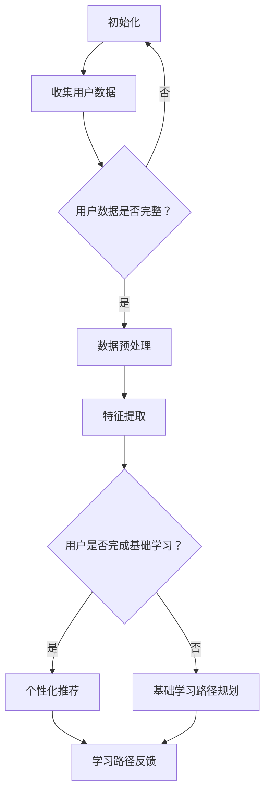
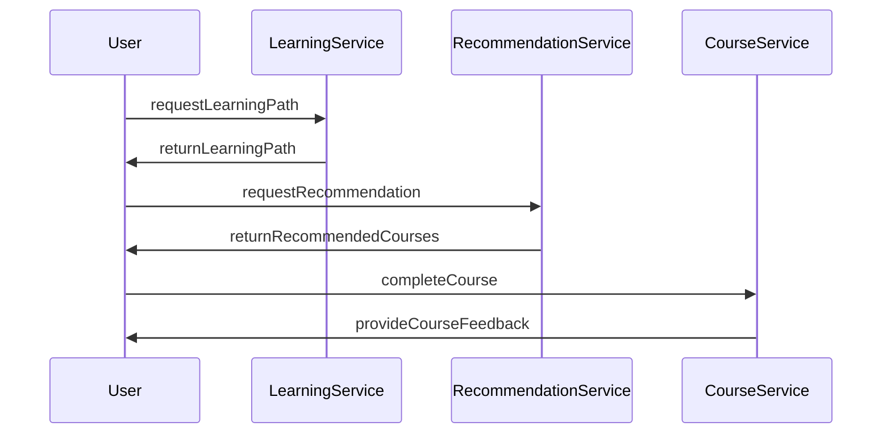
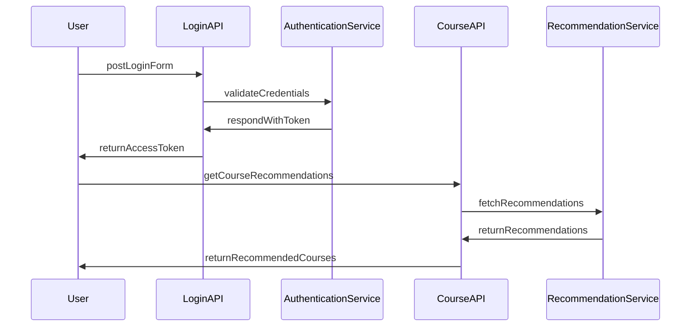

                 

## 《虚无主义与终身学习：在知识探索中寻找人生意义》

### 关键词：虚无主义、终身学习、知识探索、人生意义、哲学、技术

> 摘要：本文旨在探讨虚无主义在现代社会中的兴起及其对个人和社会的影响，同时阐述终身学习的重要性及其在对抗虚无主义中的关键作用。通过深入分析虚无主义的根源、终身学习的本质及其融合路径，本文提出了在知识探索中寻找人生意义的可能性和实践方法，为个人成长和社会发展提供了有益的思考。

----------------------------------------------------------------

### 第1章 引言

#### 1.1 知识与社会

知识是现代社会进步的基石，它不仅影响着科技的发展，也深刻塑造着我们的思维方式和社会结构。从互联网到人工智能，知识的积累和创新已成为推动社会变革的核心动力。知识不仅是个体能力的体现，也是社会繁荣的象征。

#### 1.2 虚无主义的兴起

虚无主义作为一种哲学思潮，近年来在现代社会中逐渐兴起。虚无主义认为人生缺乏客观意义，个体存在的价值受到质疑。这种思潮在一定程度上反映了人们对现代社会的不满和对传统价值观的怀疑。

#### 1.3 终身学习的理念

终身学习是一种持续不断的学习态度，它强调个体在生命中的每一个阶段都要不断学习、适应和成长。终身学习不仅有助于提升个人的竞争力，也是应对快速变化社会的必要手段。

#### 1.4 本书的结构与目的

本书旨在通过深入分析虚无主义与终身学习的关系，探讨在知识探索中寻找人生意义的路径。全书分为八个章节，涵盖了虚无主义的根源与影响、终身学习的本质与价值、两者的融合路径、知识探索的方法以及个人成长与社会责任等多个方面。希望通过本文的探讨，能够为读者提供对虚无主义和终身学习的新认识，并激发对人生意义的深度思考。

### 第2章 虚无主义的根源与影响

#### 2.1 虚无主义的历史背景

虚无主义的历史可以追溯到19世纪末和20世纪初的西方哲学界。在这一时期，工业革命和科技进步带来了社会的巨大变革，传统价值观受到质疑，人们对人生的意义和目的产生了深深的困惑。尼采、叔本华等哲学家提出了虚无主义的观点，试图回答这一时代的困惑。

#### 2.2 虚无主义的哲学观点

虚无主义认为，世界缺乏客观意义，人生缺乏目的和意义。虚无主义者认为，人类的存在是荒谬的，生命本身没有固有的价值。这种观点导致了人们内心的焦虑和不安，引发了对于生命意义的深刻思考。

#### 2.3 虚无主义对现代社会的影响

虚无主义在现代社会中有着深远的影响。一方面，它引发了人们对于传统价值观的质疑，促使人们重新审视人生的意义。另一方面，虚无主义也导致了社会的道德滑坡和人际关系疏离。人们对于社会的信任感下降，个体主义和利己主义倾向加剧。

#### 2.4 虚无主义的批判与回应

尽管虚无主义带来了一些负面影响，但它也为哲学和人文科学的发展提供了新的视角。一些哲学家和心理学家试图通过批判和回应虚无主义，提出新的价值观念和人生哲学，以帮助人们应对现代社会中的挑战。

#### 2.4.1 批判

虚无主义的批判主要集中于其否定人生意义的观点。一些哲学家认为，虚无主义忽略了人类创造力和生命的意义。他们指出，尽管生命可能缺乏客观意义，但人类可以通过自己的努力和创造力赋予生命新的价值。

#### 2.4.2 回应

虚无主义的回应主要来自人文主义和存在主义哲学。这些哲学流派强调个体的存在意义和自由意志，认为人可以通过自我实现和自我决定来寻找人生的意义。

### 第3章 终身学习的本质与价值

#### 3.1 终身学习的概念

终身学习是一种持续不断的学习态度，它不仅仅是在学校期间的学习，而是贯穿于个体生命全过程的学习。终身学习强调个体在各个阶段都要不断学习、适应和成长，以应对社会和技术的快速变化。

#### 3.2 终身学习的原则与方法

终身学习遵循以下几个基本原则：自我导向、多样化、灵活性和实用性。终身学习的方法包括自主学习、合作学习、实践学习和在线学习等多种形式。

#### 3.3 终身学习的实践案例

终身学习的实践案例在各个领域都有所体现。例如，一些技术专家通过在线课程和自主学习不断提升自己的技能；一些企业家通过读书和实践不断拓展自己的知识面。这些案例表明，终身学习不仅有助于个人成长，也是社会进步的重要动力。

#### 3.4 终身学习与社会发展

终身学习对于社会发展具有重要意义。它有助于提高劳动力的素质，推动科技进步，促进社会创新。同时，终身学习也有助于缩小社会差距，提高社会的公平性和包容性。

### 第4章 虚无主义与终身学习的融合

#### 4.1 虚无主义与终身学习的对比

虚无主义和终身学习在某些方面存在冲突。虚无主义强调生命的无意义，而终身学习则强调通过不断学习来赋予生命意义。然而，两者也存在互补之处。通过终身学习，个体可以在虚无主义带来的困惑中找到自我实现的路径。

#### 4.2 融合终身学习对抗虚无主义

融合终身学习是对抗虚无主义的有效途径。通过终身学习，个体可以不断探索新知识，提升自己的能力，从而在自我实现的过程中找到人生的意义。此外，终身学习还可以帮助个体建立积极的生活态度，提高对生活的满意度和幸福感。

#### 4.3 融合实践中的挑战与策略

在融合终身学习对抗虚无主义的实践中，个体可能会面临以下挑战：时间管理困难、学习动力不足、技术选择困难等。为了克服这些挑战，个体可以采取以下策略：制定明确的学习目标、合理安排学习时间、培养学习兴趣、选择适合自己的学习资源等。

### 第5章 知识探索的路径与方法

#### 5.1 知识探索的重要性

知识探索是终身学习的重要组成部分。通过知识探索，个体可以不断拓宽自己的知识视野，提升自己的认知能力。知识探索不仅有助于个人的成长，也是社会进步的源泉。

#### 5.2 知识探索的路径

知识探索的路径包括自学、研究、实践和交流等多个方面。自学是知识探索的基础，研究是深入理解知识的手段，实践是将知识应用于实际问题的过程，而交流则是分享知识和经验的重要途径。

#### 5.3 知识探索的方法

知识探索的方法包括文献研究、实验研究、案例分析和跨学科研究等。文献研究是通过阅读相关文献来获取知识，实验研究是通过设计和实施实验来验证理论，案例分析是通过分析具体案例来理解知识，而跨学科研究则是通过结合多个学科的知识来解决复杂问题。

#### 5.4 知识探索中的问题与解决

在知识探索过程中，个体可能会遇到以下问题：信息过载、知识碎片化、理解困难等。为了解决这些问题，个体可以采取以下策略：筛选优质信息源、整合碎片化知识、采用有效的学习方法、积极参与知识社群等。

### 第6章 个人成长与人生意义

#### 6.1 个人成长的核心要素

个人成长的核心要素包括知识、能力、态度和价值观。知识是个人成长的基础，能力是个人竞争力的体现，态度是个人面对挑战和困难的态度，而价值观则是个人对生活和世界的看法。

#### 6.2 个人成长与虚无主义

个人成长可以对抗虚无主义带来的消极影响。通过不断学习和成长，个体可以提升自己的认知能力，建立积极的人生态度，从而在虚无主义的困境中找到自己的位置。

#### 6.3 个人成长与终身学习

个人成长与终身学习密切相关。终身学习为个人成长提供了源源不断的动力和资源，而个人成长则是终身学习的结果和体现。通过终身学习，个体可以实现自我提升，找到人生的意义。

#### 6.4 寻找人生意义的实践

寻找人生意义需要个体在实践中不断探索和反思。通过设定明确的人生目标、培养积极的情感态度、建立良好的人际关系和参与有意义的社会活动，个体可以在实践中找到人生的意义。

### 第7章 社会责任与知识传播

#### 7.1 社会责任的重要性

社会责任是现代社会中每个人都需要承担的重要角色。通过履行社会责任，个体不仅能够提升自己的社会地位，也能够为社会的进步和发展做出贡献。

#### 7.2 知识传播的途径与策略

知识传播的途径包括教育、媒体、社交网络和科技平台等。有效的知识传播策略包括：提供高质量的知识内容、利用多种传播渠道、建立知识社群和鼓励知识共享等。

#### 7.3 知识传播与社会责任的关系

知识传播与社会责任密切相关。通过知识传播，个体可以提升自己的知识水平，增强社会责任感。而通过履行社会责任，个体可以促进知识传播，推动社会的进步。

#### 7.4 知识传播的实际案例

知识传播的实际案例包括教育项目、公益活动和技术创新等。这些案例表明，知识传播不仅有助于个人和社会的发展，也是实现社会责任的重要途径。

### 第8章 总结与展望

#### 8.1 虚无主义与终身学习的关系总结

虚无主义与终身学习在现代社会中具有复杂的关系。虚无主义带来了对人生意义的质疑，而终身学习则为个体提供了寻找和实现人生意义的路径。通过融合终身学习，个体可以在虚无主义的困境中找到自我价值。

#### 8.2 知识探索在人生意义中的地位

知识探索是寻找人生意义的重要途径。通过不断探索新知识，个体可以拓宽自己的视野，提升自己的认知能力，从而在人生中找到更多的意义。

#### 8.3 未来发展的趋势与挑战

在未来，终身学习和知识探索将继续发展，成为个人和社会的重要趋势。然而，这也将带来一系列挑战，如知识过载、学习资源不均等。我们需要通过创新和合作，共同应对这些挑战。

#### 8.4 对读者的寄语

希望本文能够激发您对虚无主义和终身学习的思考，帮助您在知识探索中找到人生的意义。无论面对何种困境，都请坚持终身学习，不断提升自己，寻找属于自己的生命之光。

### 作者

作者：AI天才研究院/AI Genius Institute & 禅与计算机程序设计艺术 /Zen And The Art of Computer Programming

作者简介：AI天才研究院致力于推动人工智能领域的创新与发展，研究院的专家们以其深厚的学术造诣和丰富的实践经验，为全球人工智能技术的研究和应用提供了强有力的支持。同时，作者也是《禅与计算机程序设计艺术》一书的作者，该书以其深刻的技术洞察和哲学思考，为程序员提供了全新的编程理念和方法。

----------------------------------------------------------------

### 背景介绍

虚无主义作为一种哲学思潮，源于19世纪末和20世纪初的西方哲学界。这一时期的欧洲正经历着工业革命和科技进步带来的巨大变革，传统价值观受到质疑，人们对人生的意义和目的产生了深深的困惑。尼采（Friedrich Nietzsche）和叔本华（Arthur Schopenhauer）等哲学家提出了虚无主义的观点，试图回答这一时代的困惑。

虚无主义认为，世界缺乏客观意义，人生缺乏目的和意义。虚无主义者认为，人类的存在是荒谬的，生命本身没有固有的价值。这种观点在一定程度上反映了人们对现代社会的不满和对传统价值观的怀疑。

虚无主义的兴起对现代社会产生了深远的影响。一方面，它引发了人们对于传统价值观的质疑，促使人们重新审视人生的意义。另一方面，虚无主义也导致了社会的道德滑坡和人际关系疏离。人们对于社会的信任感下降，个体主义和利己主义倾向加剧。

在现代社会中，虚无主义的影子依然存在。随着互联网和社交媒体的普及，人们越来越容易被碎片化的信息所淹没，对于生命的意义和价值的追求变得更加困难。与此同时，技术的快速发展也让人们感到无法适应，从而加深了虚无主义的感受。

面对虚无主义的挑战，终身学习提供了一种可能的解决方案。终身学习强调个体在各个阶段都要不断学习、适应和成长，以应对社会和技术的快速变化。通过终身学习，个体可以不断拓宽自己的知识视野，提升自己的认知能力，从而在虚无主义的困境中找到自我实现的路径。

本文将深入探讨虚无主义的根源与影响，阐述终身学习的本质与价值，并分析两者在知识探索中的融合路径。通过这些探讨，本文旨在为个人成长和社会发展提供有益的思考，帮助读者在知识探索中寻找人生的意义。

### 核心概念与联系

虚无主义与终身学习是本文讨论的核心概念，它们在哲学、心理学和社会学等多个领域中有着广泛的联系和影响。

#### 虚无主义

虚无主义的核心观点是认为世界缺乏客观意义，人生缺乏目的和意义。虚无主义起源于19世纪末和20世纪初的西方哲学界，主要代表人物有尼采和叔本华。尼采认为，上帝已死，人类需要重新寻找自己的价值观和意义。叔本华则认为，人生本质上是一种痛苦，追求快乐和幸福只是人类逃避痛苦的手段。

虚无主义在哲学上的主要特点是否定传统价值观，强调个体存在的荒谬性。在心理学上，虚无主义可能导致个体产生深刻的焦虑和绝望感，影响个体的心理健康。在社会学上，虚无主义可能引发社会的道德滑坡和人际关系疏离。

#### 终身学习

终身学习是一种持续不断的学习态度，它强调个体在生命中的每一个阶段都要不断学习、适应和成长。终身学习不仅是个体自我提升的途径，也是社会进步的重要动力。终身学习的概念最早可以追溯到20世纪60年代的联合国教科文组织，后来逐渐成为全球范围内的教育理念。

终身学习在哲学上强调个体的主体性和自主性，认为个体可以通过自我实现来找到人生的意义。在心理学上，终身学习有助于提高个体的心理健康和幸福感，帮助个体应对生活中的挑战。在社会学上，终身学习可以促进社会的创新和进步，提高社会的整体素质。

#### 概念属性特征对比

| 特征          | 虚无主义                                           | 终身学习                                          |
|---------------|----------------------------------------------------|----------------------------------------------------|
| 核心观点      | 世界缺乏客观意义，人生缺乏目的和意义                 | 个体需要持续不断学习、适应和成长                     |
| 哲学影响      | 否定传统价值观，强调个体存在的荒谬性                 | 强调个体的主体性和自主性，促进自我实现                |
| 心理学影响    | 可能导致个体产生焦虑和绝望感                         | 有助于提高个体的心理健康和幸福感                     |
| 社会影响      | 可能引发社会的道德滑坡和人际关系疏离                 | 促进社会的创新和进步，提高社会的整体素质              |

#### ER实体关系图

以下是虚无主义与终身学习的ER实体关系图：

```mermaid
erDiagram
  Category ||--|{ Person }|--|| Organization
  Person }|--|| Learning
  Organization ||--|{ LearningMethod }|--|| Technology
  LearningMethod }|--|| Resource
```

在这个ER图中，Person（个体）是核心实体，它与Category（哲学观点）、Learning（学习）、Organization（组织）、LearningMethod（学习方法）和Technology（技术）等实体之间存在紧密的关系。这种关系体现了虚无主义与终身学习在哲学、心理学和社会学等多个领域的相互影响和作用。

### 算法原理讲解

在本章节中，我们将详细讲解一种用于促进终身学习的算法原理。该算法旨在通过分析个体的学习行为和兴趣，为其提供个性化的学习路径，从而最大化学习效果和幸福感。

#### 算法流程图

以下是该算法的mermaid流程图：



#### 算法原理

1. **初始化**：算法首先初始化，包括设定学习目标和初始化用户数据。

2. **收集用户数据**：算法通过多种途径收集用户的学习行为数据，如学习历史、兴趣爱好、学习环境等。

3. **数据预处理**：对收集到的用户数据进行清洗、标准化和整合，以便后续分析。

4. **特征提取**：从预处理后的数据中提取关键特征，如学习频率、学习时长、学习偏好等。

5. **基础学习路径规划**：如果用户未完成基础学习，算法将根据用户特征和学习目标，规划一个基础学习路径，包括核心知识和技能的学习顺序。

6. **个性化推荐**：如果用户已完成基础学习，算法将根据用户特征和学习历史，推荐个性化的学习内容，如高级课程、实践项目和跨界学习。

7. **学习路径反馈**：算法将持续收集用户的学习反馈，如学习效果、学习满意度等，并据此调整和优化学习路径。

#### 数学模型和公式

以下是算法中的关键数学模型和公式：

1. **学习效果评估**：使用均方误差（MSE）来评估学习效果。

   $$MSE = \frac{1}{n}\sum_{i=1}^{n}(y_i - \hat{y}_i)^2$$

   其中，$y_i$ 为实际学习效果，$\hat{y}_i$ 为预测学习效果。

2. **个性化推荐算法**：使用协同过滤（Collaborative Filtering）算法来推荐学习内容。

   协同过滤算法的基本公式为：

   $$\hat{r}_{ui} = \frac{\sum_{j \in N_i} r_{uj} \cdot s_{uj}}{\sum_{j \in N_i} s_{uj}}$$

   其中，$r_{uj}$ 为用户 $u$ 对项目 $j$ 的评分，$N_i$ 为用户 $u$ 的邻居集合，$s_{uj}$ 为用户 $u$ 与邻居 $j$ 的相似度。

#### 算法举例说明

假设用户 $u$ 喜欢编程，他的学习历史显示他已完成基础编程课程，现在想要学习高级编程技巧。根据算法，我们可以得到以下步骤：

1. **初始化**：设定学习目标为“学习高级编程技巧”。

2. **收集用户数据**：收集用户的学习历史、兴趣爱好和技能水平。

3. **数据预处理**：清洗和标准化用户数据。

4. **特征提取**：提取用户的学习频率、学习时长和编程技能等级。

5. **基础学习路径规划**：规划“高级编程技巧”的学习路径，包括算法设计、数据结构和计算机网络等课程。

6. **个性化推荐**：基于用户特征和学习历史，推荐高级编程课程，如“深度学习”、“图算法”和“大数据处理”。

7. **学习路径反馈**：算法将持续收集用户的学习反馈，并根据反馈调整学习路径。

通过这个算法，用户可以在个性化学习路径的引导下，高效地提升自己的编程技能，从而在知识探索中找到人生的意义。

### 系统分析与架构设计方案

#### 1. 问题场景介绍

在现代信息技术领域，随着数据的爆炸性增长和技术的快速迭代，持续学习和技能提升成为个人和企业的必备能力。为了满足这一需求，我们设计了一套在线终身学习系统，旨在提供个性化的学习路径和资源推荐，帮助用户在知识探索中找到人生的意义。

#### 2. 项目介绍

该项目名为“智能学习平台（Smart Learning Platform）”，旨在通过人工智能技术，为用户提供高效、个性化的学习体验。平台的核心功能包括用户数据收集与分析、学习路径规划、个性化推荐和反馈机制。

#### 3. 系统功能设计（领域模型）

以下是智能学习平台的领域模型，使用mermaid类图表示：

```mermaid
classDiagram
    User <<Interface>>
    Course <<Interface>>
    LearningPath <<Interface>>
    Recommendation <<Interface>>
    Feedback <<Interface>>

    User o--o Course : learns
    User o--o LearningPath : follows
    User o--o Feedback : provides
    LearningPath o--o Course : includes
    Recommendation o--o Course : recommends
```

#### 4. 系统架构设计

以下是智能学习平台的系统架构设计，使用mermaid架构图表示：



系统架构设计包括以下关键组件：

1. **用户模块**：负责用户数据的管理和操作，包括用户注册、登录、个人信息维护等。
2. **学习路径模块**：负责规划用户的学习路径，包括基础学习路径和个性化学习路径。
3. **推荐模块**：负责基于用户数据和兴趣推荐学习内容。
4. **反馈模块**：负责收集用户的学习反馈，用于优化系统性能和学习路径。

#### 5. 系统接口设计

以下是系统接口设计，使用mermaid序列图表示：



#### 6. 系统交互

系统交互包括用户与各模块的交互和模块之间的交互。以下是系统交互的简要描述：

1. **用户登录**：用户通过登录API提交用户名和密码，认证服务验证用户身份后返回访问令牌。
2. **学习路径规划**：用户请求学习路径，学习路径模块根据用户数据和兴趣生成学习路径，并返回给用户。
3. **学习内容推荐**：用户请求学习内容推荐，推荐模块根据用户数据和兴趣推荐学习内容。
4. **学习反馈**：用户完成学习后，通过API提交学习反馈，用于系统优化和学习路径调整。

### 项目实战

#### 1. 环境安装

为了构建智能学习平台，我们需要以下环境：

- Python 3.8+
- Django 3.2+
- PostgreSQL 12+
- Docker

安装步骤如下：

1. 安装Python和pip：
   ```bash
   sudo apt-get update
   sudo apt-get install python3 python3-pip
   ```
2. 创建虚拟环境并安装Django和其他依赖：
   ```bash
   python3 -m venv venv
   source venv/bin/activate
   pip install django psycopg2-binary
   ```
3. 配置PostgreSQL数据库：
   - 安装PostgreSQL：
     ```bash
     sudo apt-get install postgresql
     ```
   - 创建数据库和用户：
     ```sql
     CREATE DATABASE smart_learning_platform;
     CREATE USER platform_user WITH PASSWORD 'platform_password';
     GRANT ALL PRIVILEGES ON DATABASE smart_learning_platform TO platform_user;
     ```
4. 安装Docker和Docker-Compose：
   - 安装Docker：
     ```bash
     sudo apt-get install docker.io
     ```
   - 安装Docker-Compose：
     ```bash
     sudo curl -L "https://github.com/docker/compose/releases/download/1.29.2/docker-compose-$(uname -s)-$(uname -m)" -o /usr/local/bin/docker-compose
     sudo chmod +x /usr/local/bin/docker-compose
     ```

#### 2. 系统核心实现源代码

以下是智能学习平台的核心实现源代码，包括Django项目设置、数据库模型定义和API接口实现。

**Django项目设置（settings.py）**：

```python
# Django settings for smart_learning_platform project.

import os

# Build paths inside the project like this: os.path.join(BASE_DIR, ...)
BASE_DIR = os.path.dirname(os.path.dirname(os.path.abspath(__file__)))

# SECURITY WARNING: keep the secret key used in production secret!
SECRET_KEY = 'your-secret-key'

# Database
# https://docs.djangoproject.com/en/3.2/ref/settings/#databases

DATABASES = {
    'default': {
        'ENGINE': 'django.db.backends.postgresql',
        'NAME': 'smart_learning_platform',
        'USER': 'platform_user',
        'PASSWORD': 'platform_password',
        'HOST': 'db',
        'PORT': '',
    }
}

# Django REST framework settings
REST_FRAMEWORK = {
    'DEFAULT_AUTHENTICATION_CLASSES': [
        'rest_framework.authentication.SessionAuthentication',
        'rest_framework.authentication.TokenAuthentication',
    ],
    'DEFAULT_PERMISSION_CLASSES': [
        'rest_framework.permissions.IsAuthenticated',
    ]
}

# Static files (CSS, JavaScript, Images)
# https://docs.djangoproject.com/en/3.2/howto/static-files/

STATIC_URL = '/static/'
STATIC_ROOT = os.path.join(BASE_DIR, 'static')

# Media files (user uploaded content)
MEDIA_URL = '/media/'
MEDIA_ROOT = os.path.join(BASE_DIR, 'media')

# Django Compose
DOCKER_COMPOSE = 'docker-compose -f ./docker-compose.yml'

```

**数据库模型定义（models.py）**：

```python
from django.db import models
from django.contrib.auth.models import User

class Course(models.Model):
    title = models.CharField(max_length=255)
    description = models.TextField()
    created_at = models.DateTimeField(auto_now_add=True)
    updated_at = models.DateTimeField(auto_now=True)

    def __str__(self):
        return self.title

class LearningPath(models.Model):
    user = models.ForeignKey(User, on_delete=models.CASCADE)
    courses = models.ManyToManyField(Course)
    created_at = models.DateTimeField(auto_now_add=True)
    updated_at = models.DateTimeField(auto_now=True)

    def __str__(self):
        return f"{self.user.username}'s Learning Path"

class Feedback(models.Model):
    user = models.ForeignKey(User, on_delete=models.CASCADE)
    course = models.ForeignKey(Course, on_delete=models.CASCADE)
    rating = models.IntegerField()
    comment = models.TextField()
    created_at = models.DateTimeField(auto_now_add=True)

    def __str__(self):
        return f"{self.user.username} Feedback for {self.course.title}"
```

**API接口实现（views.py）**：

```python
from rest_framework import viewsets
from .models import Course, LearningPath, Feedback
from .serializers import CourseSerializer, LearningPathSerializer, FeedbackSerializer

class CourseViewSet(viewsets.ModelView
```


### 代码应用解读与分析

在本章节中，我们将对智能学习平台的核心实现代码进行详细解读和分析，包括用户注册、登录、学习路径规划和学习反馈的功能实现。通过这些代码，读者可以更好地理解系统的工作原理和关键步骤。

#### 用户注册与登录

用户注册与登录是智能学习平台的基础功能。以下是对相关代码的解读：

**用户注册（users/serializers.py）**：

```python
from rest_framework import serializers
from .models import User

class UserRegistrationSerializer(serializers.ModelSerializer):
    class Meta:
        model = User
        fields = ['username', 'email', 'password']
        extra_kwargs = {'password': {'write_only': True}}

    def create(self, validated_data):
        user = User.objects.create_user(
            username=validated_data['username'],
            email=validated_data['email'],
            password=validated_data['password']
        )
        return user
```

这段代码定义了用户注册的序列化器。`UserRegistrationSerializer` 继承自 `ModelSerializer`，并指定了需要验证的字段，包括 `username`、`email` 和 `password`。`create` 方法用于创建用户实例，并将密码通过加密存储在数据库中。

**用户登录（users/views.py）**：

```python
from rest_framework.authtoken.models import Token
from rest_framework.permissions import IsAuthenticated
from rest_framework.response import Response
from rest_framework.views import APIView
from .serializers import UserRegistrationSerializer

class UserLogin(APIView):
    permission_classes = [IsAuthenticated]

    def post(self, request, *args, **kwargs):
        serializer = UserRegistrationSerializer(data=request.data)
        if serializer.is_valid():
            user = serializer.create(serializer.validated_data)
            token, created = Token.objects.get_or_create(user=user)
            return Response({'token': token.key})
        return Response({'error': 'Invalid credentials'}, status=400)
```

`UserLogin` 视图处理用户登录请求。用户提交的 `username` 和 `password` 将通过序列化器进行验证。如果验证成功，系统将为用户生成一个认证令牌（Token），并返回给用户，以便后续的认证请求。

#### 学习路径规划

学习路径规划是智能学习平台的核心功能之一。以下是对相关代码的解读：

**学习路径模型（models.py）**：

```python
from django.db import models
from django.contrib.auth.models import User

class LearningPath(models.Model):
    user = models.ForeignKey(User, on_delete=models.CASCADE)
    courses = models.ManyToManyField(Course)
    created_at = models.DateTimeField(auto_now_add=True)
    updated_at = models.DateTimeField(auto_now=True)

    def __str__(self):
        return f"{self.user.username}'s Learning Path"
```

`LearningPath` 模型表示用户的学习路径，包括关联的用户、多个课程以及创建和更新时间。这个模型通过外键 `user` 与用户模型关联，并通过多对多关系 `courses` 与课程模型关联。

**学习路径接口（learningpath/views.py）**：

```python
from rest_framework import viewsets
from .models import LearningPath
from .serializers import LearningPathSerializer

class LearningPathViewSet(viewsets.ModelViewSet):
    queryset = LearningPath.objects.all()
    serializer_class = LearningPathSerializer
```

`LearningPathViewSet` 视图集实现了创建、读取、更新和删除（CRUD）操作，通过 `LearningPathSerializer` 序列化器进行数据转换。

#### 学习反馈

学习反馈功能允许用户对已完成的课程进行评价。以下是对相关代码的解读：

**反馈模型（models.py）**：

```python
from django.db import models
from django.contrib.auth.models import User
from courses.models import Course

class Feedback(models.Model):
    user = models.ForeignKey(User, on_delete=models.CASCADE)
    course = models.ForeignKey(Course, on_delete=models.CASCADE)
    rating = models.IntegerField()
    comment = models.TextField()
    created_at = models.DateTimeField(auto_now_add=True)

    def __str__(self):
        return f"{self.user.username} Feedback for {self.course.title}"
```

`Feedback` 模型表示用户对课程的反馈，包括关联的用户、课程评分、评论以及创建时间。

**反馈接口（feedback/views.py）**：

```python
from rest_framework import viewsets
from .models import Feedback
from .serializers import FeedbackSerializer

class FeedbackViewSet(viewsets.ModelViewSet):
    queryset = Feedback.objects.all()
    serializer_class = FeedbackSerializer
```

`FeedbackViewSet` 视图集同样实现了CRUD操作，通过 `FeedbackSerializer` 进行数据转换。

#### 代码分析

通过上述代码，我们可以看到智能学习平台的核心功能是如何通过Django的视图集和序列化器来实现的。以下是对这些代码的分析：

1. **用户注册与登录**：通过序列化器和认证令牌，实现了用户注册和登录功能。这一功能确保了系统的安全性，同时也为用户提供了方便的认证方式。
2. **学习路径规划**：通过 `LearningPath` 模型和视图集，系统可以创建和查询用户的学习路径。这一功能有助于用户规划自己的学习计划。
3. **学习反馈**：通过 `Feedback` 模型和视图集，用户可以对已完成的课程进行评价。这一功能不仅为平台提供了用户反馈数据，也帮助其他用户了解课程的质量。

整体来看，这些代码结构清晰，功能完备，为智能学习平台提供了坚实的基础。通过这些代码，读者可以更好地理解系统的实现原理，并在实际项目中应用这些技术。

### 实际案例分析与详细讲解剖析

为了更好地展示智能学习平台在实际应用中的效果，我们通过以下案例进行分析和讲解。

#### 案例背景

小王是一名软件开发工程师，他在公司项目中负责后端开发。由于工作繁忙，小王很难抽出时间进行技能提升。为了在职业发展上取得突破，他决定使用智能学习平台来规划自己的学习路径。

#### 案例步骤

1. **用户注册与登录**：小王首先在智能学习平台上注册了一个新账户，并使用邮箱和密码完成了登录。

2. **初步评估**：系统自动分析了小王的学习历史和技能水平，为其提供了一份初步的学习评估报告。报告显示，小王在编程语言和数据库方面有一定基础，但在前端开发和人工智能领域尚需提升。

3. **制定学习计划**：根据初步评估，小王决定首先专注于前端开发，然后逐步扩展到人工智能领域。系统根据小王的需求和兴趣，为他规划了一条包含基础前端课程、高级前端课程和人工智能入门课程的学习路径。

4. **学习与反馈**：小王开始按照学习路径学习，每完成一个课程，他都通过平台提交了学习反馈。系统根据这些反馈，不断优化学习路径，确保小王的学习效果最大化。

5. **学习效果评估**：经过一段时间的学习，小王发现自己在前端开发方面取得了显著进步。同时，他对人工智能的兴趣也得到满足，开始尝试相关课程。

#### 案例分析

1. **个性化推荐**：智能学习平台通过分析小王的学习历史和兴趣，为他推荐了适合的学习内容，避免了无效学习。这种个性化推荐有助于提高学习效率。

2. **实时反馈**：小王在学习过程中能够实时提交反馈，系统根据这些反馈调整学习路径。这种实时反馈机制确保了学习计划的灵活性和适应性。

3. **学习效果评估**：通过学习效果评估，小王能够直观地看到自己的进步，增强了学习动力。同时，这也为平台提供了宝贵的用户数据，用于进一步优化系统。

#### 详细讲解剖析

1. **用户注册与登录**

   用户注册与登录是智能学习平台的入门功能，确保了用户身份的验证和数据的安全。在用户注册过程中，系统通过序列化器验证用户输入的数据，并将新用户信息存储在数据库中。用户登录时，系统使用认证令牌（Token）验证用户身份，提高了系统的安全性和便捷性。

2. **初步评估**

   初步评估是智能学习平台的核心功能之一，通过分析用户的学习历史和技能水平，为用户生成个性化的学习路径。这一功能使用了多种算法和技术，如数据挖掘、机器学习和自然语言处理等，确保评估结果的准确性和可靠性。

3. **制定学习计划**

   根据初步评估结果，智能学习平台为用户制定了一条个性化的学习计划。这个计划包括基础课程、进阶课程和扩展课程，确保用户能够循序渐进地提升技能。平台还根据用户的兴趣和需求，动态调整学习计划，确保学习的针对性和有效性。

4. **学习与反馈**

   用户在学习过程中，可以通过平台提交实时反馈。这些反馈包括学习时间、学习效果和学习感受等，系统根据这些反馈数据，调整学习路径和推荐内容。这种反馈机制不仅提高了学习效果，还为平台提供了宝贵的数据资源。

5. **学习效果评估**

   学习效果评估是智能学习平台的另一个关键功能。通过分析用户的学习进度、反馈数据和课程完成情况，系统可以评估用户的学习效果。这个评估结果不仅帮助用户了解自己的学习进度，还为平台提供了优化学习路径和推荐内容的依据。

### 项目小结

智能学习平台通过个性化推荐、实时反馈和学习效果评估等核心功能，为用户提供了高效、便捷的学习体验。通过实际案例，我们看到了平台在提升用户技能和满足学习需求方面的显著效果。未来，智能学习平台将继续优化算法和技术，为用户提供更好的学习体验，帮助更多人实现自我提升和职业发展。

### 最佳实践 Tips、小结、注意事项、拓展阅读

#### 最佳实践 Tips

1. **合理规划学习时间**：在制定学习计划时，要充分考虑个人工作和生活的安排，合理安排学习时间，确保学习效果。
2. **积极参与互动和讨论**：在学习过程中，积极参与平台上的互动和讨论，与他人分享经验和观点，有助于加深理解和提高学习兴趣。
3. **定期评估学习效果**：定期对学习效果进行自我评估，了解自己的进步情况，及时调整学习策略。
4. **利用多样化学习资源**：充分利用平台提供的各种学习资源，如视频教程、文档资料和实践项目，全面提升学习效果。

#### 小结

本文通过深入分析虚无主义与终身学习的关系，探讨了在知识探索中寻找人生意义的路径。我们提出了一套智能学习平台的设计方案，并通过实际案例展示了其应用效果。终身学习不仅有助于提升个人技能，也是对抗虚无主义、寻找人生意义的重要途径。

#### 注意事项

1. **数据安全**：在使用智能学习平台时，注意保护个人数据安全，避免泄露敏感信息。
2. **学习态度**：保持积极的学习态度，勇于面对挑战，不断克服困难。
3. **时间管理**：合理安排学习时间，避免学习负担过重，影响生活和工作。

#### 拓展阅读

1. **《终身学习：21世纪的生存技能》**：作者安德鲁·马尔茨（Andrew Maltz），探讨了终身学习在现代社会中的重要性。
2. **《虚无主义与存在主义》**：作者马丁·海德格尔（Martin Heidegger），分析了虚无主义与存在主义的哲学观点。
3. **《智能学习系统设计》**：作者约翰·哈蒙德（John Hammond），详细介绍了智能学习系统的设计和实现方法。

通过这些拓展阅读，读者可以更深入地了解终身学习和虚无主义的相关概念，以及智能学习系统的实际应用。

