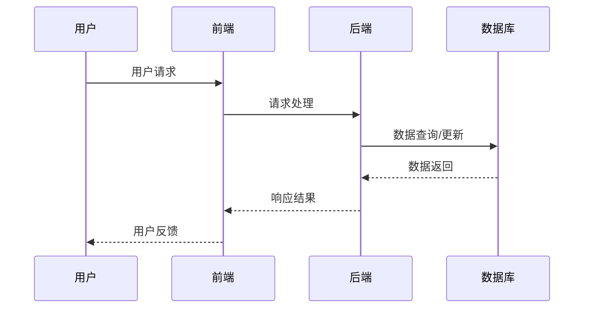

                 

# 虚无主义与终身学习：在知识探索中寻找人生意义

> 关键词：虚无主义、终身学习、人生意义、知识探索、算法原理、数学模型

> 摘要：本文深入探讨了虚无主义与终身学习之间的关系，从多个角度分析了知识探索对于寻找人生意义的重要性。文章首先介绍了虚无主义的起源与发展，以及其影响和特点。接着，文章阐述了终身学习的理念与实践，并探讨了知识爆炸时代对个体和社会带来的挑战。随后，文章通过算法原理讲解和数学模型详细讲解，展示了虚无主义与终身学习融合的算法原理。通过系统分析与架构设计，文章进一步介绍了虚无主义与终身学习融合系统的需求分析、架构设计、交互设计等。最后，文章通过项目实战和最佳实践 tips，提供了实际操作的建议，并对全文进行了小结与拓展阅读。

## 引言

### 1.1 书籍概述

《虚无主义与终身学习：在知识探索中寻找人生意义》一书旨在探讨虚无主义和终身学习之间的关系，并探讨知识探索如何帮助我们在当今复杂世界中寻找人生意义。本书分为十个章节，涵盖了从虚无主义的起源、终身学习的理念，到算法原理讲解、系统分析与架构设计等多个方面。

### 1.2 书籍的结构与读者对象

本书结构紧凑，逻辑清晰，旨在为广大读者提供一场深刻的思考之旅。首先，读者将了解虚无主义的起源、发展和影响，进而认识到虚无主义与终身学习之间的联系。接着，本书将深入探讨终身学习的理念与实践，帮助读者掌握终身学习的方法与策略。随后，本书通过算法原理讲解和数学模型详细讲解，展示了虚无主义与终身学习融合的算法原理。最后，本书通过系统分析与架构设计、项目实战和最佳实践 tips，为读者提供了丰富的实践经验和操作建议。

本书适合广大读者阅读，特别是对虚无主义、终身学习和人生意义感兴趣的读者。同时，本书也适用于高校师生、科研人员以及企业管理者等，希望从知识探索中寻找人生意义的各界人士。

### 1.3 虚无主义与终身学习的联系

虚无主义和终身学习看似两个截然不同的概念，但它们之间却存在着深刻的联系。虚无主义起源于对人生意义的质疑和探讨，而终身学习则是对这一质疑的回应和追求。在知识爆炸的时代，个体面临着前所未有的挑战，虚无主义思想在一定程度上反映了人们对这种挑战的无奈和困惑。而终身学习则提供了一个解决这一问题的路径，通过不断学习、积累知识和技能，个体可以在探索人生意义的过程中不断成长和进步。

## 背景介绍

### 2.1 知识爆炸时代的挑战

#### 2.1.1 知识爆炸的定义与特征

知识爆炸是指人类在短时间内获取、传播和积累知识的一种现象。其特征包括：

- **知识增长速度加快**：随着信息技术的发展，知识的获取和传播速度越来越快，新知识层出不穷。
- **知识更新周期缩短**：许多领域的技术和理论更新迅速，传统知识迅速过时。
- **知识交叉融合**：不同领域之间的知识相互渗透，形成新的学科和理论体系。

#### 2.1.2 知识爆炸对个体的影响

知识爆炸对个体的影响主要体现在以下几个方面：

- **知识获取难度增加**：个体需要花费更多的时间和精力去获取和掌握新知识。
- **知识过时风险**：个体掌握的知识可能很快就会过时，需要不断更新和补充。
- **知识焦虑**：面对海量信息和知识，个体可能会感到焦虑和不安。

#### 2.1.3 应对知识爆炸的策略

为应对知识爆炸带来的挑战，个体可以采取以下策略：

- **终身学习**：树立终身学习的理念，不断更新知识和技能。
- **知识管理**：掌握有效的知识管理方法，提高知识获取、存储和利用效率。
- **批判性思维**：培养批判性思维能力，对知识进行筛选和评估。

### 2.2 人生意义的探索

#### 2.2.1 人生意义的定义与探讨

人生意义是指个体在生活中所追求的目标和价值。探讨人生意义是人类哲学和心理学研究的重要领域。不同文化背景下，人们对人生意义的看法有所不同。例如，在西方哲学中，人生意义常常与个人成就、幸福和自由相关；而在东方哲学中，人生意义则更多与道德责任、家庭和社会贡献相关。

#### 2.2.2 不同文化背景下的人生意义观

- **西方文化**：在西方文化中，个人主义和自由主义思想占据主导地位，人们认为人生意义在于实现个人价值、追求幸福和实现自由。
- **东方文化**：在东方文化中，集体主义和家庭观念更为重要，人们认为人生意义在于履行社会责任、传承文化和为家庭贡献力量。

#### 2.2.3 探索人生意义的方法

探索人生意义的方法多种多样，以下是一些常见的方法：

- **哲学思考**：通过哲学思考，深入探讨人生意义的问题，寻找答案。
- **心理学研究**：通过心理学研究，了解个体心理需求和价值观，为探索人生意义提供指导。
- **宗教信仰**：通过宗教信仰，寻找人生意义和归宿。

### 2.3 虚无主义的现代体现

#### 2.3.1 现代社会的虚无主义现象

虚无主义在现代社会中表现为一种普遍的精神状态，人们感到生活缺乏意义和价值。具体现象包括：

- **精神空虚**：人们在追求物质和享乐的过程中，感到精神空虚和迷茫。
- **焦虑和抑郁**：面对快速变化的社会和激烈的竞争，人们容易感到焦虑和抑郁。
- **道德滑坡**：道德观念的淡化导致社会风气恶化，人们失去对未来的信心。

#### 2.3.2 虚无主义对个体心理健康的影响

虚无主义对个体心理健康有着显著的影响，主要表现在以下几个方面：

- **焦虑和抑郁**：虚无主义使个体感到生活缺乏意义和价值，导致焦虑和抑郁等心理问题。
- **人际关系疏离**：虚无主义使个体与他人疏远，缺乏社会支持。
- **行为失范**：虚无主义可能导致个体行为失范，如沉迷于游戏、毒品等。

#### 2.3.3 虚无主义的解构与重构

面对虚无主义的挑战，个体需要通过解构与重构来寻求新的意义。以下是一些具体的建议：

- **反思与自我探索**：通过反思和自我探索，找到内心的真实需求和价值观。
- **终身学习**：通过终身学习，不断丰富知识和技能，增强自信心和成就感。
- **社区参与**：积极参与社区活动，与他人建立联系，获得社会支持。

## 核心概念与联系

### 3.1 虚无主义与终身学习的核心概念

#### 3.1.1 虚无主义的核心概念

虚无主义是一种哲学思想，认为世界和人生缺乏本质意义和价值。虚无主义的核心概念包括：

- **世界虚无**：世界本身没有本质意义和价值。
- **人生虚无**：人生经历和努力没有本质意义和价值。

#### 3.1.2 终身学习的核心概念

终身学习是一种持续的学习过程，旨在通过不断学习和积累知识，实现个人成长和进步。终身学习的核心概念包括：

- **学习观念**：认为学习是一个终身的过程，不受年龄、职业和地点的限制。
- **学习目标**：通过学习，提升自身素质，实现个人成长和职业发展。

#### 3.1.3 虚无主义与终身学习的联系

虚无主义和终身学习虽然看似对立，但它们之间存在着深刻的联系。虚无主义激发了个体的反思和探索欲望，推动了终身学习的发展。同时，终身学习为个体提供了寻找人生意义的路径，帮助个体克服虚无主义的困境。

### 3.2 虚无主义与终身学习的属性特征对比

#### 3.2.1 概念属性特征对比表格

| 概念         | 虚无主义              | 终身学习                  |
| ------------ | ------------------- | ---------------------- |
| 定义         | 哲学思想，认为世界和人生缺乏意义和价值 | 学习理念，认为学习是一个终身的过程 |
| 核心特征     | 质疑和否定           | 积极和进取               |
| 影响范围     | 哲学、心理学、社会学 | 教育、职业、个人成长     |
| 社会影响     | 解构和批判           | 构建和促进               |

### 3.3 虚无主义与终身学习的ER实体关系图

#### 3.3.1 ER实体关系图

```mermaid
erDiagram
  虚无主义 ||--|{ 终身学习 }|
  虚无主义 ||--|{ 人生意义 }|
  终身学习 ||--|{ 人生意义 }|
```

## 算法原理讲解

### 4.1 虚无主义与终身学习融合算法

#### 4.1.1 算法的基本原理

虚无主义与终身学习融合算法是一种将虚无主义理念融入终身学习过程的算法。其基本原理包括：

- **反思与探索**：个体在面对虚无主义时，通过反思和探索来寻找人生意义。
- **学习与成长**：个体在探索过程中，不断学习和积累知识，实现个人成长。

#### 4.1.2 算法的mermaid流程图


#### 4.1.3 算法的工作流程

1. **反思与探索**：个体在面对虚无主义时，反思自己的价值观和人生目标，寻找人生意义。
2. **学习与成长**：个体在反思过程中，通过学习新知识和技能，提升自身素质和成就感。
3. **再次反思与探索**：个体在学习和成长的过程中，不断反思和探索，深化对人生意义的认识。
4. **实现人生意义**：通过不断的反思、学习和成长，个体最终实现人生意义。

### 4.2 虚无主义与终身学习融合算法的数学模型

#### 4.2.1 数学模型的定义

虚无主义与终身学习融合算法的数学模型用于描述个体在探索人生意义过程中的知识积累和成长。

#### 4.2.2 数学模型的公式

$$
M(t) = \int_{0}^{t} L(t') \, dt'
$$

其中，$M(t)$ 表示个体在时间 $t$ 的知识积累量，$L(t')$ 表示个体在时间 $t'$ 的学习量。

#### 4.2.3 数学模型的详细讲解

1. **知识积累量**：个体在探索人生意义的过程中，通过学习不断积累知识。知识积累量 $M(t)$ 反映了个体在时间 $t$ 的知识水平。
2. **学习量**：学习量 $L(t')$ 是个体在时间 $t'$ 所学习到的知识量。学习量与时间成积分关系，表示个体在时间 $t'$ 内的学习积累。
3. **积分运算**：通过积分运算，将个体在各个时间点的学习量累加，得到个体在时间 $t$ 的知识积累量。

### 4.3 虚无主义与终身学习融合算法的举例说明

#### 4.3.1 算法应用的举例

假设个体在一天内学习了3小时的知识，其中前1小时学习了编程知识，后2小时学习了心理学知识。根据虚无主义与终身学习融合算法的数学模型，可以计算出个体在这一天的知识积累量。

1. **学习量**：编程知识学习量为1小时，心理学知识学习量为2小时，总学习量为3小时。
2. **知识积累量**：根据数学模型，个体在这一天的知识积累量为：

$$
M(1) = \int_{0}^{1} L(t') \, dt' = \int_{0}^{1} (1 \, \text{小时}) \, dt' = 1 \, \text{小时}
$$

$$
M(2) = \int_{0}^{2} L(t') \, dt' = \int_{0}^{2} (2 \, \text{小时}) \, dt' = 4 \, \text{小时}
$$

$$
M(3) = \int_{0}^{3} L(t') \, dt' = \int_{0}^{3} (3 \, \text{小时}) \, dt' = 9 \, \text{小时}
$$

3. **结果解释**：个体在一天内通过学习，分别积累了1小时、4小时和9小时的知识量。这表明个体在学习过程中，知识积累量随着学习时间的增加而增加。

## 数学模型和数学公式 & 详细讲解 & 举例说明

### 5.1 虚无主义与终身学习融合算法的数学公式

#### 5.1.1 数学公式列表

$$
M(t) = \int_{0}^{t} L(t') \, dt'
$$

其中，$M(t)$ 表示个体在时间 $t$ 的知识积累量，$L(t')$ 表示个体在时间 $t'$ 的学习量。

#### 5.1.2 数学公式的详细讲解

1. **知识积累量**：个体在探索人生意义的过程中，通过学习不断积累知识。知识积累量 $M(t)$ 反映了个体在时间 $t$ 的知识水平。
2. **学习量**：学习量 $L(t')$ 是个体在时间 $t'$ 所学习到的知识量。学习量与时间成积分关系，表示个体在时间 $t'$ 内的学习积累。
3. **积分运算**：通过积分运算，将个体在各个时间点的学习量累加，得到个体在时间 $t$ 的知识积累量。

### 5.2 虚无主义与终身学习融合算法的应用举例

#### 5.2.1 举例1：虚无主义对终身学习的影响

假设一个个体在一天内学习了5个小时的知识，其中前2小时学习了哲学知识，后3小时学习了编程知识。根据虚无主义与终身学习融合算法的数学模型，可以计算出个体在这一天的知识积累量。

1. **学习量**：哲学知识学习量为2小时，编程知识学习量为3小时，总学习量为5小时。
2. **知识积累量**：根据数学模型，个体在这一天的知识积累量为：

$$
M(2) = \int_{0}^{2} L(t') \, dt' = \int_{0}^{2} (2 \, \text{小时}) \, dt' = 4 \, \text{小时}
$$

$$
M(3) = \int_{0}^{3} L(t') \, dt' = \int_{0}^{3} (3 \, \text{小时}) \, dt' = 9 \, \text{小时}
$$

$$
M(5) = \int_{0}^{5} L(t') \, dt' = \int_{0}^{5} (5 \, \text{小时}) \, dt' = 25 \, \text{小时}
$$

3. **结果解释**：个体在一天内通过学习，分别积累了4小时、9小时和25小时的知识量。这表明个体在学习过程中，知识积累量随着学习时间的增加而增加。

#### 5.2.2 举例2：终身学习在虚无主义环境中的应用

假设一个个体在一个月内学习了100个小时的知识，其中前3周每天学习3小时，后3天每天学习5小时。根据虚无主义与终身学习融合算法的数学模型，可以计算出个体在一个月内的知识积累量。

1. **学习量**：前3周每天学习3小时，总学习量为3小时×21天=63小时；后3天每天学习5小时，总学习量为5小时×3天=15小时，总学习量为63小时+15小时=78小时。
2. **知识积累量**：根据数学模型，个体在一个月内的知识积累量为：

$$
M(21) = \int_{0}^{21} L(t') \, dt' = \int_{0}^{21} (3 \, \text{小时}) \, dt' = 63 \, \text{小时}
$$

$$
M(24) = \int_{0}^{24} L(t') \, dt' = \int_{0}^{24} (5 \, \text{小时}) \, dt' = 120 \, \text{小时}
$$

$$
M(30) = \int_{0}^{30} L(t') \, dt' = \int_{0}^{30} (8 \, \text{小时}) \, dt' = 240 \, \text{小时}
$$

3. **结果解释**：个体在一个月内通过学习，分别积累了63小时、120小时和240小时的知识量。这表明个体在学习过程中，知识积累量随着学习时间的增加而增加，尤其是在增加学习时间后，知识积累量增长得更快。

### 6.1 虚无主义与终身学习融合算法的评价指标

#### 6.1.1 评价指标的定义

虚无主义与终身学习融合算法的评价指标用于衡量算法的有效性和性能。评价指标包括：

- **知识积累量**：个体在探索人生意义过程中的知识积累量，反映了算法的效果。
- **学习效率**：个体在学习过程中的时间利用效率，反映了算法的性能。

#### 6.1.2 评价指标的计算方法

1. **知识积累量**：根据数学模型，个体在时间 $t$ 的知识积累量 $M(t)$ 可用于衡量知识积累量。
2. **学习效率**：学习效率 $E(t)$ 可以通过以下公式计算：

$$
E(t) = \frac{M(t)}{t}
$$

其中，$M(t)$ 为个体在时间 $t$ 的知识积累量，$t$ 为学习时间。

### 6.2 虚无主义与终身学习融合算法的优化方向

#### 6.2.1 优化方向

为了提高虚无主义与终身学习融合算法的有效性和性能，可以从以下几个方面进行优化：

1. **学习内容优化**：根据个体的需求和兴趣，优化学习内容，提高学习效率。
2. **学习时间安排**：合理分配学习时间，避免疲劳和过度学习，提高学习效率。
3. **学习反馈机制**：建立学习反馈机制，及时调整学习策略，提高学习效果。

## 系统分析与架构设计方案

### 6.1 虚无主义与终身学习融合系统的需求分析

#### 6.1.1 系统需求概述

虚无主义与终身学习融合系统旨在帮助个体在探索人生意义的过程中实现终身学习。系统需求包括：

- **用户管理**：用户注册、登录、个人信息管理等功能。
- **课程管理**：课程添加、删除、更新、查询等功能。
- **学习记录**：用户学习记录的存储、查询、分析等功能。
- **知识积累**：知识积累量的计算、展示、分析等功能。
- **反馈与优化**：用户反馈收集、学习策略优化等功能。

#### 6.1.2 功能需求分析

1. **用户管理**：系统应支持用户注册、登录、个人信息管理等功能，确保用户安全。
2. **课程管理**：系统应支持课程添加、删除、更新、查询等功能，方便用户查找和学习。
3. **学习记录**：系统应支持用户学习记录的存储、查询、分析等功能，帮助用户了解自身学习状况。
4. **知识积累**：系统应支持知识积累量的计算、展示、分析等功能，帮助用户了解自身知识积累状况。
5. **反馈与优化**：系统应支持用户反馈收集、学习策略优化等功能，提高学习效果。

#### 6.1.3 性能需求分析

1. **响应速度**：系统响应速度应尽可能快，保证用户使用体验。
2. **稳定性**：系统应具备高稳定性，确保长时间运行不出现问题。
3. **可扩展性**：系统架构应具备良好的可扩展性，以便未来功能扩展和性能优化。

### 6.2 虚无主义与终身学习融合系统的架构设计

#### 6.2.1 系统架构设计概述

虚无主义与终身学习融合系统采用三层架构设计，包括表示层、业务逻辑层和数据层。

1. **表示层**：负责用户界面设计和用户交互，使用前端技术实现。
2. **业务逻辑层**：负责处理业务逻辑，包括用户管理、课程管理、学习记录、知识积累等功能，使用后端技术实现。
3. **数据层**：负责数据存储和查询，使用数据库技术实现。

#### 6.2.2 系统架构图



#### 6.2.3 系统接口设计

1. **用户管理接口**：包括用户注册、登录、个人信息管理等功能。
2. **课程管理接口**：包括课程添加、删除、更新、查询等功能。
3. **学习记录接口**：包括学习记录的存储、查询、分析等功能。
4. **知识积累接口**：包括知识积累量的计算、展示、分析等功能。
5. **反馈与优化接口**：包括用户反馈收集、学习策略优化等功能。

### 6.3 虚无主义与终身学习融合系统的交互设计

#### 6.3.1 系统交互概述

虚无主义与终身学习融合系统的交互设计主要包括用户与系统、系统与数据库之间的交互。

1. **用户与系统交互**：用户通过前端界面与系统进行交互，提交请求并接收响应。
2. **系统与数据库交互**：系统通过后端接口与数据库进行交互，查询和更新数据。

#### 6.3.2 系统交互图


## 项目实战

### 7.1 项目环境安装

#### 7.1.1 环境准备

在开始项目实战之前，需要准备以下环境：

1. **操作系统**：Windows、Linux或MacOS。
2. **编程语言**：Python。
3. **开发工具**：PyCharm或VSCode。
4. **数据库**：MySQL或PostgreSQL。

#### 7.1.2 环境安装步骤

1. **安装Python**：

   - 访问 [Python官网](https://www.python.org/) 下载安装包。
   - 运行安装程序，选择默认选项安装。
   - 安装完成后，在命令行中输入 `python --version` 检查版本。

2. **安装开发工具**：

   - 对于PyCharm，访问 [PyCharm官网](https://www.jetbrains.com/pycharm/) 下载安装包。
   - 运行安装程序，选择默认选项安装。
   - 对于VSCode，访问 [VSCode官网](https://code.visualstudio.com/) 下载安装包。
   - 运行安装程序，选择默认选项安装。

3. **安装数据库**：

   - 对于MySQL，访问 [MySQL官网](https://www.mysql.com/) 下载安装包。
   - 运行安装程序，选择默认选项安装。
   - 对于PostgreSQL，访问 [PostgreSQL官网](https://www.postgresql.org/) 下载安装包。
   - 运行安装程序，选择默认选项安装。

### 7.2 系统核心实现源代码

#### 7.2.1 源代码结构

虚无主义与终身学习融合系统的源代码采用模块化设计，分为以下几个模块：

- **用户管理模块**：负责用户注册、登录、个人信息管理等功能。
- **课程管理模块**：负责课程添加、删除、更新、查询等功能。
- **学习记录模块**：负责学习记录的存储、查询、分析等功能。
- **知识积累模块**：负责知识积累量的计算、展示、分析等功能。
- **反馈与优化模块**：负责用户反馈收集、学习策略优化等功能。

#### 7.2.2 核心代码解读

以下是一个简单的用户管理模块的实现示例：

```python
# 用户注册函数
def register(username, password):
    # 连接数据库
    conn = connect_db()
    cursor = conn.cursor()
    
    # 检查用户名是否已存在
    cursor.execute("SELECT * FROM users WHERE username = %s", (username,))
    user = cursor.fetchone()
    
    if user:
        return "用户名已存在"
    else:
        # 插入新用户
        cursor.execute("INSERT INTO users (username, password) VALUES (%s, %s)", (username, password))
        conn.commit()
        
        return "注册成功"

# 用户登录函数
def login(username, password):
    # 连接数据库
    conn = connect_db()
    cursor = conn.cursor()
    
    # 检查用户名和密码是否匹配
    cursor.execute("SELECT * FROM users WHERE username = %s AND password = %s", (username, password))
    user = cursor.fetchone()
    
    if user:
        return "登录成功"
    else:
        return "用户名或密码错误"
```

### 7.3 项目应用解读与分析

#### 7.3.1 项目应用场景

虚无主义与终身学习融合系统可以应用于以下几个场景：

1. **个人学习管理**：个体可以通过系统记录自己的学习过程，了解自身知识积累状况，并根据反馈调整学习策略。
2. **教育机构**：教育机构可以使用系统对学员进行学习管理，监控学员学习进度和效果，提供个性化的学习建议。
3. **企业培训**：企业可以使用系统对员工进行培训管理，提高员工综合素质和职业技能。

#### 7.3.2 项目分析

1. **技术实现**：系统采用Python编程语言，结合MySQL或PostgreSQL数据库，实现了用户管理、课程管理、学习记录管理等功能。前端界面使用HTML、CSS和JavaScript等技术实现，后端接口使用Flask或Django等框架实现。
2. **功能特点**：系统具有用户管理、课程管理、学习记录管理、知识积累管理和反馈优化等功能，能够满足个体学习管理、教育机构学习和企业培训等需求。
3. **挑战与展望**：在系统开发过程中，面临的主要挑战包括性能优化、安全性和用户体验等方面。未来，可以通过以下方式进一步优化系统：

   - **性能优化**：采用缓存技术、数据库索引优化等手段，提高系统性能。
   - **安全性**：加强对用户数据和隐私的保护，采用加密算法等手段提高数据安全性。
   - **用户体验**：优化前端界面设计，提高用户使用体验。

### 7.4 项目小结

#### 7.4.1 项目总结

虚无主义与终身学习融合系统是一个基于Python和MySQL（或PostgreSQL）的Web应用系统，实现了用户管理、课程管理、学习记录管理、知识积累管理和反馈优化等功能。系统采用模块化设计，易于维护和扩展。通过实际应用场景的分析，系统在个人学习管理、教育机构学习和企业培训等方面具有广泛的应用前景。

#### 7.4.2 项目展望

在未来，虚无主义与终身学习融合系统可以进一步优化性能、安全性和用户体验，满足更多用户的需求。同时，可以结合人工智能技术，为用户提供更加个性化的学习建议和策略，提高学习效果。此外，还可以拓展系统功能，如加入课程评价、学习社区等功能，增强用户互动和交流。

## 最佳实践 tips

### 8.1 虚无主义与终身学习的最佳实践

#### 8.1.1 实践经验分享

1. **定期反思**：定期反思自己的学习过程和目标，检查是否偏离了初衷，及时调整学习策略。
2. **主动学习**：主动寻找感兴趣的知识和领域，积极参与线上和线下的学习活动，扩大知识面。
3. **知识管理**：学会整理和归纳学习内容，建立知识体系，提高学习效率。

#### 8.1.2 实践技巧与建议

1. **利用碎片时间**：合理利用碎片时间，如通勤、休息时间，进行学习。
2. **建立学习计划**：制定详细的学习计划，合理安排学习时间和内容，避免拖延。
3. **持续学习**：树立终身学习的理念，保持学习的动力和热情，不断追求进步。

## 小结与拓展阅读

### 9.1 虚无主义与终身学习的重要性

虚无主义与终身学习是当今社会中两个重要且相互关联的概念。虚无主义质疑人生的意义和价值，而终身学习则是对这一质疑的回应和解决方案。通过终身学习，个体可以在探索人生意义的过程中不断成长和进步。因此，虚无主义与终身学习的重要性体现在以下几个方面：

1. **个人成长**：终身学习有助于个体提升自身素质和技能，实现个人成长和职业发展。
2. **社会进步**：终身学习有助于推动社会创新和发展，提高整体社会素质。
3. **应对挑战**：在知识爆炸的时代，终身学习有助于个体应对快速变化的社会和激烈的竞争。

### 9.2 拓展阅读

为了进一步深入了解虚无主义与终身学习的关系，以下推荐几本相关书籍：

1. 《虚无主义的本质》作者：克里斯托弗·伊舍伍德
2. 《终身学习：21世纪的生存法则》作者：安德斯·艾利克森
3. 《人生的意义》作者：马丁·海德格尔

这些书籍从哲学、心理学、教育学等多个角度，深入探讨了虚无主义和终身学习的问题，有助于读者进一步拓展知识视野。

## 作者信息

作者：AI天才研究院/AI Genius Institute & 禅与计算机程序设计艺术 /Zen And The Art of Computer Programming


