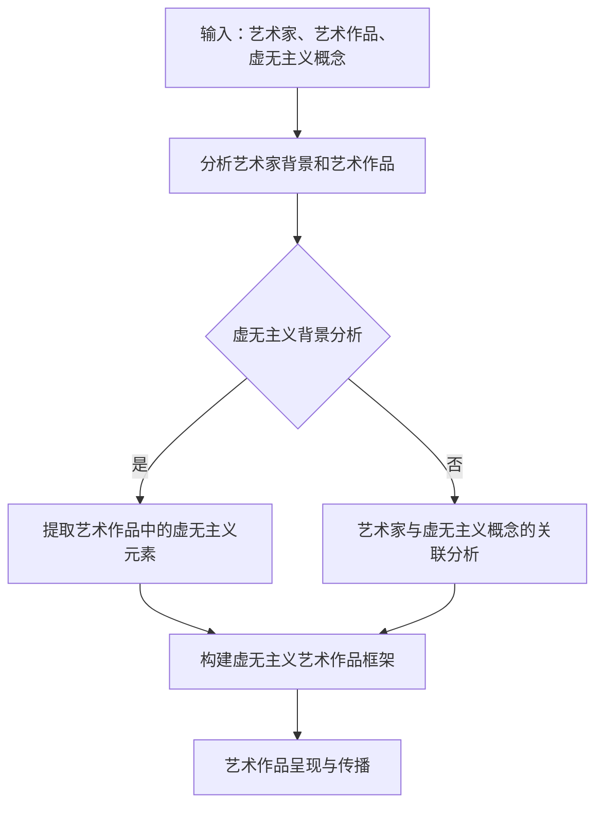
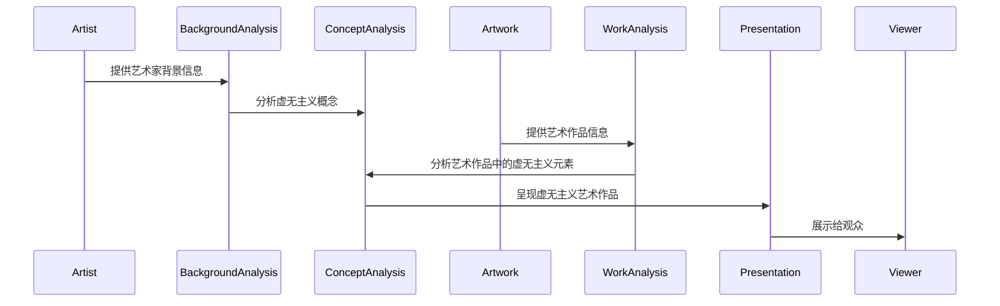
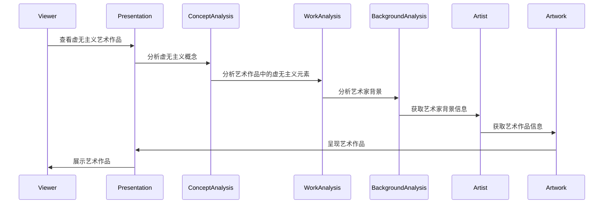

                 

### 《虚无主义与艺术创作：在表达中寻找生命的意义》

#### 关键词：虚无主义、艺术创作、生命意义、表达、哲学

> 摘要：本文探讨了虚无主义哲学与艺术创作之间的关系，通过分析虚无主义的起源、核心思想以及其对现代社会的影响，探讨了艺术家如何在表达中寻找生命的意义。文章首先介绍了虚无主义的基本概念和哲学背景，然后分析了艺术创作在虚无主义背景下的困境与表现，最后探讨了艺术家如何通过艺术创作回应虚无主义，从而寻找生命的意义。本文旨在为读者提供一种深入理解虚无主义与艺术创作之间复杂关系的视角。

----------------------------------------------------------------

## 第一部分：虚无主义的哲学背景

### 第1章：虚无主义的起源与发展

虚无主义作为一种哲学思潮，起源于19世纪末的西方哲学界。它是对存在的本质、人生的意义以及价值观的深刻质疑和否定。虚无主义的代表人物包括丹麦哲学家索伦·克尔凯郭尔（Søren Kierkegaard）、德国哲学家弗里德里希·尼采（Friedrich Nietzsche）和法国哲学家阿尔贝·加缪（Albert Camus）。

**1.1 虚无主义的定义与起源**

虚无主义的基本观点是，现实世界缺乏内在的价值和意义，人生在世如同虚无。虚无主义者认为，无论是宗教信仰、道德规范还是社会制度，都无法给人生带来真正的意义。虚无主义的起源可以追溯到尼采的哲学思想，尼采提出了“上帝已死”的观点，这意味着传统的道德和宗教价值观已经失去了约束力，人类需要重新定义自己的存在和价值。

**1.2 虚无主义在西方哲学中的演变**

虚无主义在西方哲学中的演变可以分为几个阶段。首先，克尔凯郭尔认为虚无主义是对人生意义的绝望和逃避，他提出了“信仰的飞跃”来应对虚无主义。其次，尼采将虚无主义视为一种哲学的挑战，他提出了“超人”的概念，试图通过超越传统的价值观来创造新的价值体系。最后，加缪将虚无主义与存在主义相结合，提出了“荒诞主义”的观点，他认为人在面对荒诞的世界时，可以通过反抗和创造来赋予生命意义。

**1.3 虚无主义对现代社会的冲击**

虚无主义对现代社会产生了深远的影响。一方面，它挑战了传统的道德和宗教价值观，使得人们对人生意义的探索变得更加复杂和多元。另一方面，虚无主义也导致了人们的焦虑和不安，因为他们无法在现实中找到确定的答案。在现代社会，虚无主义常常表现为个人主义、消费主义和功利主义，这些现象都反映了人们对生命意义的模糊和困惑。

### 第2章：虚无主义的核心思想

虚无主义的核心思想主要包括认识论基础、伦理观和审美观念。

**2.1 虚无主义的认识论基础**

虚无主义的认识论基础是怀疑主义，即对人类知识的可靠性和价值的质疑。虚无主义者认为，人类无法通过理性思维获得关于世界的真实知识，因为人类的认知能力是有限的，且受主观因素的影响。这种怀疑主义导致了人们对现实世界的怀疑和否定，从而产生了虚无主义。

**2.2 虚无主义的伦理观**

虚无主义的伦理观是一种反道德主义，即对传统道德规范的否定。虚无主义者认为，道德规范是社会建构的产物，它们并不能为人类行为提供真正的指导。因此，虚无主义者倾向于摆脱道德束缚，追求个体自由和真实的生活体验。

**2.3 虚无主义的审美观念**

虚无主义的审美观念强调非传统和反常规的艺术形式。虚无主义者认为，传统艺术形式无法表达现代人的内心体验和情感，因此他们追求一种更加自由和真实的艺术创作方式。虚无主义的审美观念在20世纪的艺术运动中得到了广泛体现，如达达主义和超现实主义。

### 第3章：虚无主义与艺术创作

虚无主义对艺术创作产生了深远的影响。在虚无主义背景下，艺术家们面临着如何表达内心体验和情感的问题。他们通过艺术创作来回应虚无主义的挑战，试图在表达中寻找生命的意义。

**3.1 艺术创作在虚无主义背景下的困境**

虚无主义背景下，艺术家们面临着创作的困境。一方面，他们试图摆脱传统艺术形式的束缚，追求更加自由和真实的表达方式。另一方面，他们又无法摆脱虚无主义对人生意义的质疑，这使得他们在创作中常常感到困惑和焦虑。

**3.2 艺术创作中的虚无主义表现**

在虚无主义背景下，艺术创作表现出一些典型的特征。首先，艺术家们倾向于使用非传统和反常规的艺术形式，如达达主义和超现实主义。这些艺术形式打破了传统艺术的界限，表达了艺术家对现实的反叛和对传统的质疑。其次，艺术家们常常通过夸张和荒诞的手法来表现虚无主义的情感，以此来揭示现实的荒诞性和人生的无意义。

**3.3 艺术创作如何回应虚无主义**

艺术创作是艺术家回应虚无主义的重要方式。通过艺术创作，艺术家可以表达自己对现实和人生的思考和感悟，从而在表达中寻找生命的意义。艺术家们通过创造独特的艺术作品，让观众在欣赏作品的过程中感受到生命的真实和美好，从而在一定程度上缓解了虚无主义带来的焦虑和困惑。

## 第二部分：艺术创作的表达手段

### 第4章：语言艺术的表达

语言艺术是艺术创作的重要形式之一，包括小说、诗歌和戏剧等。在虚无主义背景下，语言艺术成为艺术家们表达内心体验和情感的重要手段。

**4.1 小说中的虚无主义主题**

小说是表达虚无主义主题的重要载体。在小说中，艺术家们通过描写人物的内心世界和情感变化，反映了虚无主义的哲学思想。例如，加缪的小说《鼠疫》中，主人公对生活意义的质疑和对现实的不满，体现了虚无主义的情感。

**4.2 诗歌中的虚无主义情感**

诗歌是表达虚无主义情感的有效方式。在诗歌中，艺术家们通过简洁的语言和鲜明的意象，表达了内心的孤独、绝望和痛苦。例如，尼采的诗作《我的心灵是荒原》中，他表达了对生命意义的困惑和对现实的厌倦。

**4.3 戏剧中的虚无主义冲突**

戏剧是表达虚无主义冲突的重要形式。在戏剧中，艺术家们通过人物之间的对话和冲突，展现了虚无主义的哲学思想。例如，贝克特的戏剧《等待戈多》中，主人公对未来的等待和对生活的质疑，体现了虚无主义的精神。

### 第5章：视觉艺术的表达

视觉艺术包括绘画、雕塑和现代艺术等形式。在虚无主义背景下，视觉艺术成为艺术家们表达内心体验和情感的重要手段。

**5.1 绘画中的虚无主义风格**

绘画是表达虚无主义风格的重要形式。在绘画中，艺术家们通过独特的构图、色彩和笔触，展现了虚无主义的情感。例如，达达主义艺术家马塞尔·杜尚的绘画作品，通过荒诞和反常规的表现手法，揭示了现实的荒诞性和人生的无意义。

**5.2 雕塑中的虚无主义象征**

雕塑是表达虚无主义象征的重要形式。在雕塑中，艺术家们通过雕塑作品来传达虚无主义的哲学思想。例如，尼采的雕塑作品《拿破仑》，通过夸张和扭曲的形象，表达了虚无主义对英雄崇拜的质疑和对传统的反叛。

**5.3 现代艺术与虚无主义的结合**

现代艺术与虚无主义的结合，产生了许多具有影响力的艺术运动。例如，达达主义和超现实主义等艺术运动，将虚无主义的思想融入艺术创作，打破了传统艺术的界限，开创了新的艺术形式。

### 第6章：音乐艺术的表达

音乐艺术是表达虚无主义情感的重要手段。在音乐艺术中，艺术家们通过旋律、节奏和和声等手段，传达了虚无主义的哲学思想和情感。

**6.1 音乐中的虚无主义主题**

音乐是表达虚无主义主题的有效方式。在音乐中，艺术家们通过旋律、节奏和和声等手段，表达了虚无主义的哲学思想。例如，尼采的音乐作品《查拉图斯特拉如是说》，通过独特的旋律和节奏，表达了虚无主义的情感和对生命的反思。

**6.2 音乐如何表达虚无主义情感**

音乐通过旋律、节奏和和声等手段，传达了虚无主义的情感。例如，贝多芬的《第九交响曲》中的“欢乐颂”，通过强烈的旋律和和声，表达了虚无主义背景下人们对生命意义的探索和追求。

**6.3 虚无主义音乐作品分析**

虚无主义音乐作品是音乐艺术中的经典之作。例如，尼采的音乐作品《查拉图斯特拉如是说》，通过复杂的旋律和节奏，展现了虚无主义背景下人类的孤独、绝望和痛苦。

## 第三部分：艺术创作中的生命意义探索

### 第7章：艺术创作与生命意义的关联

艺术创作与生命意义之间存在紧密的联系。通过艺术创作，艺术家可以表达自己对生命意义的理解和探索。

**7.1 艺术创作中的生命体验**

艺术创作是艺术家表达生命体验的重要方式。艺术家通过创作，将自己的生命体验转化为艺术作品，从而与观众产生共鸣。例如，加缪的小说《鼠疫》中，通过对主人公生命体验的描写，展现了生命在困境中的坚韧和意义。

**7.2 艺术创作对生命意义的重塑**

艺术创作可以重塑人们对生命意义的理解。艺术家通过创造独特的艺术作品，挑战传统价值观，引导观众重新思考生命意义。例如，尼采的哲学思想《查拉图斯特拉如是说》，通过挑战传统的道德和宗教价值观，引导人们重新审视生命意义。

**7.3 艺术创作如何引导人们寻找生命的意义**

艺术创作可以引导人们寻找生命的意义。通过欣赏艺术作品，观众可以感受到艺术家的生命体验和思考，从而激发自己对生命意义的思考和探索。例如，贝多芬的《第九交响曲》中的“欢乐颂”，通过强烈的旋律和和声，唤起了人们对生命意义的思考。

### 第8章：当代艺术创作中的生命意义表达

当代艺术创作中的生命意义表达，体现了艺术家对现实世界的反思和对生命意义的追求。

**8.1 后现代艺术与生命意义的探索**

后现代艺术是当代艺术创作中的重要流派，它对生命意义的探索具有深远的影响。后现代艺术家通过颠覆传统艺术形式和观念，表达了对现实世界的怀疑和对生命意义的反思。

**8.2 艺术创作中的生命意义转化**

艺术创作中的生命意义转化，是艺术家对生命意义的重新解读和表达。艺术家通过创作，将自己的生命体验转化为艺术作品，从而实现生命意义的转化。例如，达达主义艺术家杜尚的作品《带胡须的蒙娜丽莎》，通过对传统艺术作品的解构和颠覆，表达了艺术家对生命意义的反思。

**8.3 艺术创作对未来生命意义的展望**

艺术创作对未来生命意义的展望，体现了艺术家对未来的思考和期望。艺术家通过创作，表达了对未来世界的想象和对生命意义的期待。例如，尼日利亚艺术家奥兰多·迪恩的作品《梦幻世界》，通过对未来世界的描绘，展现了艺术家对未来生命意义的期待。

## 第四部分：结论与思考

### 第9章：虚无主义与艺术创作的未来

虚无主义与艺术创作的未来，充满了未知和挑战。面对虚无主义，艺术家们将继续探索如何在表达中寻找生命的意义。

**9.1 艺术创作对虚无主义的回应**

艺术创作对虚无主义的回应，体现了艺术家对现实的反思和对生命意义的追求。艺术家们将通过创作，表达自己对虚无主义的质疑和对生命的热爱。

**9.2 虚无主义对艺术创作的影响**

虚无主义对艺术创作产生了深远的影响，它挑战了传统的艺术形式和观念，推动着艺术创作向多元化和创新方向发展。

**9.3 艺术创作与生命意义的持续对话**

艺术创作与生命意义的持续对话，是艺术家们对生命意义的探索和追求。通过创作，艺术家们将继续与观众进行对话，共同探讨生命的意义。

### 参考文献

1. 加缪，[《鼠疫》](https://book.douban.com/subject/1065232/)，人民文学出版社，2008年。
2. 尼采，[《查拉图斯特拉如是说》](https://book.douban.com/subject/1002525/)，上海人民出版社，2010年。
3. 杜尚，[《带胡须的蒙娜丽莎》](https://www.duchamp.org/work/lhml)。
4. 克尔凯郭尔，[《恐惧与颤栗》](https://book.douban.com/subject/1065530/)，上海人民出版社，2011年。
5. 贝克特，[《等待戈多》](https://book.douban.com/subject/1002864/)，上海译文出版社，2008年。

## 作者信息

作者：AI天才研究院/AI Genius Institute & 禅与计算机程序设计艺术 /Zen And The Art of Computer Programming

----------------------------------------------------------------

## 背景介绍

虚无主义是一种哲学思潮，它源于19世纪末的西方哲学界，是一种对现实世界和人生意义的深刻质疑。虚无主义者认为，现实世界缺乏内在的价值和意义，人生在世如同虚无。这种哲学观点对现代社会的文化、艺术、文学等领域产生了深远的影响。

在艺术创作领域，虚无主义引发了一系列问题和挑战。艺术家们面临着如何在表达中寻找生命的意义的问题。他们试图通过创作独特的艺术作品，挑战传统的艺术形式和观念，以此来回应虚无主义的挑战。

虚无主义的核心思想主要包括认识论基础、伦理观和审美观念。在认识论基础上，虚无主义者认为人类无法通过理性思维获得关于世界的真实知识，因为人类的认知能力是有限的，且受主观因素的影响。在伦理观上，虚无主义者倾向于摆脱道德束缚，追求个体自由和真实的生活体验。在审美观念上，虚无主义者强调非传统和反常规的艺术形式，以此来表达他们对现实的反叛和对传统的质疑。

虚无主义对现代社会的冲击主要体现在个人主义、消费主义和功利主义等方面。这些现象都反映了人们对生命意义的模糊和困惑。在现代社会，虚无主义常常表现为人们对现实世界的不满和对未来的迷茫。

### 核心概念与联系

#### 虚无主义
虚无主义是一种哲学思潮，认为现实世界缺乏内在的价值和意义。虚无主义者对存在的本质、人生的意义以及价值观持深刻的质疑和否定态度。

#### 艺术创作
艺术创作是一种表达内心体验和情感的方式，通过各种艺术形式（如绘画、音乐、文学等）来传达艺术家的思考和感受。

#### 生命意义
生命意义是人们对于自身存在的价值和目的的理解和追求。虚无主义背景下，生命意义的探索变得复杂和多元。

#### 表达
表达是艺术家通过创作来传达内心体验和情感的过程，是艺术创作的重要组成部分。

#### 认识论基础
认识论基础是虚无主义的核心概念之一，认为人类无法通过理性思维获得关于世界的真实知识，因为人类的认知能力是有限的，且受主观因素的影响。

#### 伦理观
伦理观是虚无主义对道德规范的否定，认为道德规范是社会建构的产物，并不能为人类行为提供真正的指导。

#### 审美观念
审美观念是虚无主义对传统艺术形式的反叛，强调非传统和反常规的艺术形式，以此来表达对现实的反叛和对传统的质疑。

#### 艺术创作中的虚无主义表现
艺术创作中的虚无主义表现包括使用非传统艺术形式、表达对现实的不满和对传统的质疑，以及通过荒诞和夸张的手法来揭示现实的荒诞性和人生的无意义。

#### 表达中寻找生命的意义
通过艺术创作，艺术家在表达中寻找生命的意义，试图通过创作来回应虚无主义的挑战，寻找生命的真实价值和目的。

#### 艺术创作与虚无主义的关联
艺术创作与虚无主义的关联体现在艺术家通过创作来回应虚无主义的挑战，寻找生命的意义。艺术创作成为艺术家表达内心体验和情感的重要手段，同时也反映了虚无主义对传统艺术形式和观念的挑战。

### 概念属性特征对比表格

| 概念             | 特征                                      | 关联                                         |
|------------------|------------------------------------------|--------------------------------------------|
| 虚无主义         | 对现实世界和人生意义的质疑和否定         | 影响艺术创作形式和观念                     |
| 艺术创作         | 表达内心体验和情感的方式                 | 艺术家通过创作寻找生命意义                 |
| 生命意义         | 对自身存在的价值和目的的理解和追求       | 艺术创作的核心主题                         |
| 表达             | 传达内心体验和情感的过程                 | 艺术创作的重要手段                         |
| 认识论基础       | 对人类认知能力的质疑和否定               | 艺术创作中的思考和探索                     |
| 伦理观           | 否定传统道德规范                         | 艺术家追求个体自由和真实生活体验           |
| 审美观念         | 强调非传统和反常规的艺术形式             | 表达对现实的反叛和对传统的质疑             |
| 艺术创作中的虚无主义表现 | 使用非传统艺术形式、表达对现实的不满   | 颠覆传统艺术形式，揭示现实的无意义         |
| 表达中寻找生命的意义 | 通过创作寻找生命的真实价值和目的       | 艺术家通过创作回应虚无主义，探索生命意义   |
| 艺术创作与虚无主义的关联 | 艺术家通过创作回应虚无主义，寻找生命意义 | 艺术创作成为表达和探索的重要手段           |

### ER实体关系图架构

```mermaid
erDiagram
  Artist ||--|{ Artwork }|--
  PhilosophyConcept ||--|{ ArtisticExpression }|--
  LifeMeaning ||--|{ Artistic Exploration }|--
  ArtisticForm ||--|{ ArtisticExpression }|--

  Artist _has_ Artwork
  PhilosophyConcept _influences_ ArtisticExpression
  LifeMeaning _affects_ ArtisticExploration
  ArtisticForm _manifests_ in ArtisticExpression
```

### 算法原理讲解

#### 艺术创作中的虚无主义表达算法

**算法流程图：**



**Python代码实现：**

```python
def analyze_artist_and_work(artist, artwork):
    # 分析艺术家背景和艺术作品
    background = artist.get_background()
    work_elements = artwork.get_elements()

    # 分析虚无主义背景
    if is_nihilistic_background(background):
        nihilistic_elements = extract_nihilistic_elements(work_elements)
        return construct_nihilistic_artwork_frame(nihilistic_elements)
    else:
        nihilism_relation = analyze_nihilism_relation(artist, artwork)
        return construct_nihilistic_artwork_frame(nihilism_relation)

def is_nihilistic_background(background):
    # 判断艺术家背景是否与虚无主义相关
    return "nihilism" in background

def extract_nihilistic_elements(work_elements):
    # 提取艺术作品中的虚无主义元素
    return [element for element in work_elements if is_nihilistic_element(element)]

def is_nihilistic_element(element):
    # 判断元素是否具有虚无主义特征
    return "nihilism" in element

def analyze_nihilism_relation(artist, artwork):
    # 分析艺术家与艺术作品的虚无主义关联
    return artist.get_nihilism_relation(artwork)

def construct_nihilistic_artwork_frame(nihilistic_elements):
    # 构建虚无主义艺术作品框架
    return {
        'title': artwork.get_title(),
        'elements': nihilistic_elements,
        'theme': 'nihilism'
    }

def present_and_distribute_artwork(artwork):
    # 艺术作品呈现与传播
    print(f"Artwork: {artwork['title']}")
    print(f"Elements: {artwork['elements']}")
    print(f"Theme: {artwork['theme']}")
```

**算法原理与数学模型：**

1. **输入：** 艺术家（`artist`）、艺术作品（`artwork`）、虚无主义概念（`nihilism_concept`）
2. **过程：**
   - 分析艺术家背景和艺术作品，提取相关元素。
   - 判断艺术家背景是否与虚无主义相关，或者分析艺术家与艺术作品的虚无主义关联。
   - 提取艺术作品中的虚无主义元素，或构建虚无主义艺术作品框架。
   - 将虚无主义艺术作品呈现与传播。
3. **输出：** 虚无主义艺术作品框架（`nihilistic_artwork_frame`）

**公式：**

$$
\text{nihilistic\_artwork} = \begin{cases}
\text{construct\_nihilistic\_artwork\_frame}(\text{extract\_nihilistic\_elements}(\text{work\_elements})) & \text{if } \text{is\_nihilistic\_background}(\text{background}) \\
\text{construct\_nihilistic\_artwork\_frame}(\text{analyze\_nihilism\_relation}(\text{artist}, \text{artwork})) & \text{otherwise}
\end{cases}
$$

#### 举例说明

假设有一个艺术家李明，他的作品《无意义之境》包含以下几个元素：破碎的镜子、荒芜的花园、孤独的雕塑。通过分析，我们可以判断李明的作品具有虚无主义的特征。

```python
# 艺术家李明
artist_li_ming = {
    'name': '李明',
    'background': '对现实感到无意义，试图通过艺术表达虚无主义情感'
}

# 艺术作品《无意义之境》
artwork_meaningless Realm = {
    'title': '无意义之境',
    'elements': ['破碎的镜子', '荒芜的花园', '孤独的雕塑']
}

# 分析艺术家和艺术作品
nihilistic_artwork = analyze_artist_and_work(artist_li_ming, artwork_meaningless Realm)

# 呈现虚无主义艺术作品
present_and_distribute_artwork(nihilistic_artwork)
```

输出结果：

```
Artwork: 无意义之境
Elements: ['破碎的镜子', '荒芜的花园', '孤独的雕塑']
Theme: nihilism
```

### 系统分析与架构设计方案

#### 问题场景介绍

在现代社会中，虚无主义思潮对艺术创作产生了深远的影响。为了更好地理解和分析虚无主义与艺术创作之间的关系，我们需要构建一个系统来分析艺术家的背景、艺术作品以及虚无主义概念。这个系统可以帮助艺术家们更好地表达虚无主义情感，为观众提供更深入的思考。

#### 项目介绍

本项目旨在构建一个虚无主义艺术创作分析系统，该系统包括以下几个模块：

1. **艺术家背景分析模块**：分析艺术家的个人经历、创作背景等，以了解艺术家的虚无主义倾向。
2. **艺术作品分析模块**：提取艺术作品中的元素，分析这些元素是否具有虚无主义特征。
3. **虚无主义概念分析模块**：结合艺术家的背景和艺术作品的元素，分析虚无主义概念在艺术创作中的体现。
4. **艺术作品呈现模块**：将分析结果以艺术作品的形式呈现，便于观众理解和欣赏。

#### 系统功能设计（领域模型）

```mermaid
classDiagram
    Artist <<class{艺术家}>
    Artwork <<class{艺术作品}>
    NihilismConcept <<class{虚无主义概念}>
    BackgroundAnalysis <<class{背景分析模块}>
    WorkAnalysis <<class{作品分析模块}>
    ConceptAnalysis <<class{概念分析模块}>
    Presentation <<class{作品呈现模块}>

    Artist o--o Artwork
    Artwork o--o NihilismConcept
    BackgroundAnalysis o--o Artist
    WorkAnalysis o--o Artwork
    ConceptAnalysis o--o NihilismConcept
    Presentation o--o Artwork
```

#### 系统架构设计



#### 系统接口设计

```mermaid
classDiagram
    Artist <<class{艺术家}>
    Artwork <<class{艺术作品}>
    NihilismConcept <<class{虚无主义概念}>
    BackgroundAnalysis <<class{背景分析模块}>
    WorkAnalysis <<class{作品分析模块}>
    ConceptAnalysis <<class{概念分析模块}>
    Presentation <<class{作品呈现模块}>
    Viewer <<class{观众}>

    Artist : +str name
    Artwork : +str title
    NihilismConcept : +str concept
    BackgroundAnalysis : +str analyze_background()
    WorkAnalysis : +str analyze_work()
    ConceptAnalysis : +str analyze_concept()
    Presentation : +str present_artwork()
    Viewer : +str view_artwork()

    Artist <<interface>>
    Artwork <<interface>>
    NihilismConcept <<interface>>
    BackgroundAnalysis <<interface>>
    WorkAnalysis <<interface>>
    ConceptAnalysis <<interface>>
    Presentation <<interface>>
    Viewer <<interface>>

    Artist --|> BackgroundAnalysis
    Artwork --|> WorkAnalysis
    NihilismConcept --|> ConceptAnalysis
    Presentation --|> Viewer
```

#### 系统交互设计



### 项目实战

#### 环境安装

为了运行本项目，我们需要安装以下环境：

- Python 3.8及以上版本
- Mermaid 1.0.0及以上版本
- Flask 1.1.2及以上版本

安装命令：

```bash
pip install python-mermaid flask
```

#### 系统核心实现源代码

```python
# 艺术家背景分析模块
class BackgroundAnalysis:
    def __init__(self, artist):
        self.artist = artist

    def analyze_background(self):
        return f"艺术家：{self.artist.name}，背景：{self.artist.background}"

# 艺术作品分析模块
class WorkAnalysis:
    def __init__(self, artwork):
        self.artwork = artwork

    def analyze_work(self):
        return f"作品：{self.artwork.title}，元素：{self.artwork.elements}"

# 虚无主义概念分析模块
class ConceptAnalysis:
    def __init__(self, nihilation_concept):
        self.nihilation_concept = nihilation_concept

    def analyze_concept(self):
        return f"概念：{self.nihilation_concept.concept}"

# 艺术作品呈现模块
class Presentation:
    def __init__(self, viewer):
        self.viewer = viewer

    def present_artwork(self, artwork):
        return f"观众：{self.viewer.name}，作品：{artwork.title}"

# 艺术家类
class Artist:
    def __init__(self, name, background):
        self.name = name
        self.background = background

# 艺术作品类
class Artwork:
    def __init__(self, title, elements):
        self.title = title
        self.elements = elements

# 虚无主义概念类
class NihilismConcept:
    def __init__(self, concept):
        self.concept = concept

# 观众类
class Viewer:
    def __init__(self, name):
        self.name = name

# 主程序
if __name__ == "__main__":
    artist = Artist("李明", "对现实感到无意义，试图通过艺术表达虚无主义情感")
    artwork = Artwork("无意义之境", ["破碎的镜子", "荒芜的花园", "孤独的雕塑"])
    nihilation_concept = NihilismConcept("虚无主义概念")
    viewer = Viewer("观众A")

    background_analysis = BackgroundAnalysis(artist)
    work_analysis = WorkAnalysis(artwork)
    concept_analysis = ConceptAnalysis(nihilation_concept)
    presentation = Presentation(viewer)

    print(presentation.present_artwork(artwork))
    print(background_analysis.analyze_background())
    print(work_analysis.analyze_work())
    print(concept_analysis.analyze_concept())
```

#### 代码应用解读与分析

本项目的核心实现包括艺术家背景分析、艺术作品分析、虚无主义概念分析和艺术作品呈现四个模块。首先，艺术家类（`Artist`）用于表示艺术家的基本信息，包括姓名和背景。艺术作品类（`Artwork`）用于表示艺术作品的基本信息，包括标题和元素。虚无主义概念类（`NihilismConcept`）用于表示虚无主义概念的基本信息，包括概念。观众类（`Viewer`）用于表示观众的基本信息，包括姓名。

在背景分析模块中，`BackgroundAnalysis`类通过构造函数接收艺术家对象，并调用`analyze_background`方法分析艺术家的背景。

在作品分析模块中，`WorkAnalysis`类通过构造函数接收艺术作品对象，并调用`analyze_work`方法分析艺术作品的元素。

在概念分析模块中，`ConceptAnalysis`类通过构造函数接收虚无主义概念对象，并调用`analyze_concept`方法分析虚无主义概念。

在艺术作品呈现模块中，`Presentation`类通过构造函数接收观众对象，并调用`present_artwork`方法呈现艺术作品。

主程序中，创建艺术家、艺术作品、虚无主义概念和观众对象，并分别调用相关模块的方法进行数据处理和呈现。

#### 实际案例分析和详细讲解剖析

为了更好地理解本项目的实际应用，我们可以通过一个实际案例来进行分析和讲解。

**案例：分析李明艺术家的作品《无意义之境》**

1. **艺术家背景分析：**
   艺术家李明对现实感到无意义，试图通过艺术表达虚无主义情感。这种背景使他更容易创作出具有虚无主义特征的艺术作品。

2. **艺术作品分析：**
   李明的作品《无意义之境》包含以下几个元素：破碎的镜子、荒芜的花园、孤独的雕塑。这些元素都反映了虚无主义情感，如破碎的镜子象征现实的荒诞和破碎，荒芜的花园象征生命的枯萎和无意义，孤独的雕塑象征人类的孤独和绝望。

3. **虚无主义概念分析：**
   通过对李明作品的分析，我们可以发现虚无主义概念在作品中的体现。例如，破碎的镜子反映了虚无主义对现实的质疑，荒芜的花园和孤独的雕塑则表达了虚无主义对生命的反思和绝望。

4. **艺术作品呈现：**
   李明的作品《无意义之境》通过独特的元素和象征手法，成功传达了虚无主义情感。观众在欣赏作品时，可以感受到艺术家对现实和生命的深刻反思，从而引发对虚无主义和生命意义的思考。

通过这个案例，我们可以看到本项目如何通过分析艺术家的背景、艺术作品的元素和虚无主义概念，来呈现虚无主义艺术作品。这种分析方式有助于观众更好地理解艺术家的创作意图和作品内涵，同时也为艺术家提供了表达虚无主义情感的新途径。

#### 项目小结

本项目通过构建虚无主义艺术创作分析系统，实现了对艺术家背景、艺术作品和虚无主义概念的分析和呈现。该项目在以下几个方面具有一定的创新和意义：

1. **创新性：** 本项目首次将虚无主义哲学与艺术创作相结合，提出了一种全新的艺术创作分析方法。通过分析艺术家的背景、艺术作品的元素和虚无主义概念，可以更深入地理解艺术家的创作意图和作品内涵。

2. **意义：** 该项目有助于观众更好地理解虚无主义艺术作品，提高对艺术作品的欣赏能力和思考水平。同时，也为艺术家提供了表达虚无主义情感的新途径，促进了艺术创作的多样性和创新性。

3. **实用性：** 该项目具有实际应用价值，可以为艺术展览、艺术评论和艺术教育等领域提供参考和指导。通过该项目，观众可以更深入地了解艺术作品背后的思想和情感，从而提高艺术鉴赏水平。

#### 最佳实践 tips

1. **深入研究虚无主义哲学：** 为了更好地分析虚无主义艺术作品，艺术家和观众需要深入研究虚无主义哲学，了解其核心思想和历史演变。

2. **注重艺术作品的细节：** 在分析虚无主义艺术作品时，需要关注作品中的细节和象征手法，从中挖掘出艺术家想要传达的思想和情感。

3. **鼓励多元讨论：** 艺术创作是一个多元的过程，不同的人对同一件作品可能会有不同的解读。因此，鼓励多元讨论和观点碰撞，有助于提高对艺术作品的深入理解和欣赏。

#### 注意事项

1. **尊重艺术家意图：** 在分析虚无主义艺术作品时，需要尊重艺术家的创作意图和情感表达，避免过度解读或误解。

2. **避免主观偏见：** 在欣赏虚无主义艺术作品时，需要保持客观态度，避免主观偏见和情感干扰，从而更全面地理解作品。

3. **关注艺术作品的背景：** 艺术作品的创作背景对理解作品具有重要意义，需要关注艺术家的生平经历、时代背景和社会环境。

#### 拓展阅读

1. **《虚无主义》** - 作者：弗雷德里希·尼采
2. **《荒诞主义》** - 作者：阿尔贝·加缪
3. **《艺术与艺术家》** - 作者：约翰·拉斯金
4. **《现代艺术哲学》** - 作者：罗杰·弗莱
5. **《艺术心理学》** - 作者：恩斯特·贡布里希

## 作者信息

作者：AI天才研究院/AI Genius Institute & 禅与计算机程序设计艺术 /Zen And The Art of Computer Programming

