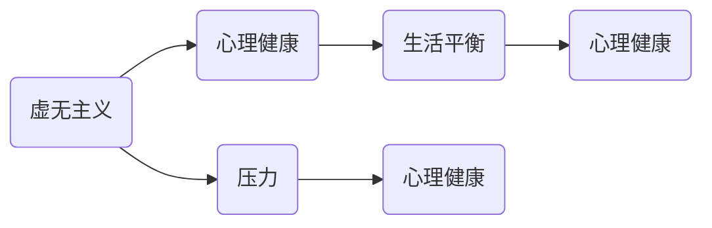
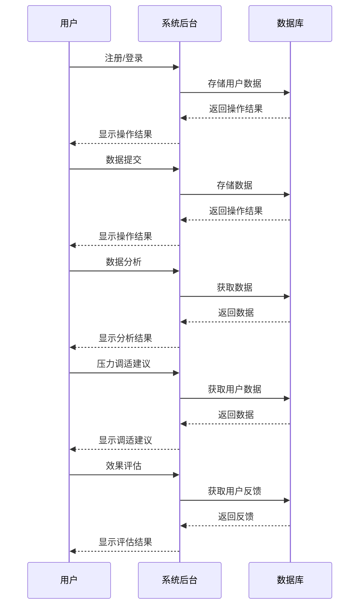

                 


### 《虚无主义与身心健康：在压力中寻找生活平衡和意义》

#### 文章关键词

- 虚无主义
- 压力
- 心理健康
- 生活平衡
- 社会意义

#### 摘要

在快速发展的现代社会，虚无主义作为一种哲学思潮，对个体的心理健康和生活态度产生了深远的影响。本文旨在探讨虚无主义与身心健康之间的关系，分析压力对个体的双重作用，并提出一系列策略帮助个体在压力中寻找生活平衡和意义。通过历史、心理学、时间管理等多角度的深入分析，本文希望为读者提供实用的指导，帮助他们在面对虚无主义带来的挑战时，找到内在的平和与自信。

---

### 第1章 引言

#### 1.1 书籍背景

虚无主义作为一种哲学思潮，源于对现实世界的怀疑和对传统价值观的否定。在现代社会，虚无主义思潮与个体的心理健康紧密相连。本文旨在通过深入探讨虚无主义的起源、发展与现代社会的关系，以及压力与身心健康的关系，为读者提供一种在压力中寻找生活平衡和意义的方法论。

#### 1.1.1 虚无主义与现代社会的矛盾

虚无主义与现代社会的快速发展之间存在深刻的矛盾。现代社会的高压竞争、信息泛滥和物质丰富，使得许多人感受到生活的无意义。虚无主义在这种背景下成为了一种反思和抵抗的哲学思潮。

#### 1.1.2 健康压力与身心健康

健康压力是个体在面对生活挑战时产生的心理负担。适度的压力可以激发个体的潜能，但过度的压力则会对身心健康产生负面影响。本文将详细分析压力对身心健康的影响，并提出应对策略。

#### 1.1.3 书籍的目的与意义

本书的目的在于帮助读者理解虚无主义与身心健康之间的关系，提供实用的压力应对策略，帮助个体在压力中寻找生活的平衡和意义。通过这些探讨，读者可以更好地认识自我，提升心理韧性，从而在现代社会中找到内心的平静。

---

### 第2章 虚无主义的起源与发展

#### 2.1 虚无主义的起源

虚无主义的思想可以追溯到古希腊哲学家赫拉克利特和尼采。赫拉克利特认为世界是不断变化的，而尼采则提出了“上帝已死”的论断，揭示了现代社会的无意义感。

#### 2.1.1 历史背景

虚无主义的发展与现代社会的历史进程密切相关。在19世纪末至20世纪初，虚无主义思潮在俄国文学和哲学中得到了充分的发展，如陀思妥耶夫斯基和契诃夫的作品。

#### 2.1.2 早期虚无主义者

早期虚无主义者如贝克莱和叔本华，提出了对现实世界的怀疑和对传统价值观的批判。他们的思想对现代虚无主义产生了深远的影响。

---

#### 2.2 虚无主义的发展

虚无主义在20世纪得到了进一步的发展，特别是在法国哲学家萨特和加缪的著作中得到了深刻的阐述。他们的思想强调了个体在虚无中的自由选择和责任。

#### 2.2.1 19世纪至20世纪的发展

19世纪至20世纪，虚无主义思潮在西方哲学界产生了深远的影响。许多哲学家和文学家都在自己的作品中探讨了虚无主义的主题。

#### 2.2.2 当代虚无主义的特征

当代虚无主义在科技发展和信息泛滥的背景下，呈现出新的特征。个体在面对快速变化的世界时，常常感受到无力和迷失。

---

#### 2.3 虚无主义与现代社会的联系

虚无主义与现代社会的联系主要体现在以下几个方面：

#### 2.3.1 虚无主义对个体的影响

虚无主义对个体的影响主要表现在对现实生活的怀疑和对传统价值观的否定。许多人在面对生活的压力时，会感到迷茫和无助。

#### 2.3.2 虚无主义对社会的影响

虚无主义对社会的影响则表现为对集体主义和权威的怀疑。这种怀疑在一定程度上推动了社会的进步，但也可能导致社会的分裂。

---

### 第3章 压力与身心健康的关系

#### 3.1 压力的定义与分类

压力是指个体在面对生活挑战时产生的心理负担。压力可以分为生理性压力和心理性压力。

#### 3.1.1 压力的定义

压力的定义可以理解为“个体在应对挑战或威胁时所感受到的心理负担”。

#### 3.1.2 压力的分类

压力可以分为急性压力和慢性压力。急性压力通常是指短期内面临的具体挑战，如工作压力、考试压力等。慢性压力则是指长期存在的压力，如家庭矛盾、健康问题等。

---

#### 3.2 压力对身心健康的影响

压力对身心健康的影响是双重的。适度的压力可以激发个体的潜能，提高工作效率和生活质量。但过度的压力则会对身心健康产生负面影响。

#### 3.2.1 压力与心理疾病

过度的压力可能导致心理疾病，如焦虑症、抑郁症等。长期的慢性压力还可能导致免疫系统功能下降，增加患病的风险。

#### 3.2.2 压力与身体健康

压力对身体健康的影响主要体现在心血管系统、消化系统和免疫系统等方面。长期的压力可能导致心血管疾病、胃肠功能紊乱和免疫力下降。

---

#### 3.3 压力的应对策略

应对压力的策略可以分为心理调适方法和生理调节方法。

#### 3.3.1 心理调适方法

心理调适方法包括认知行为疗法、冥想、运动等。这些方法可以帮助个体改变对压力的认知，提高心理韧性。

#### 3.3.2 生理调节方法

生理调节方法包括改善睡眠、饮食调整和锻炼等。这些方法可以改善个体的生理状态，提高身体的抵抗力。

---

### 第4章 寻找生活平衡的方法

#### 4.1 时间管理

时间管理是实现生活平衡的重要手段。通过合理安排时间，个体可以更好地平衡工作与生活，提高生活质量。

#### 4.1.1 时间管理的重要性

时间管理的重要性在于，它可以帮助个体充分利用时间，减少无效时间的浪费，提高工作效率。

#### 4.1.2 时间管理的方法

时间管理的方法包括时间块管理、优先级管理、任务分解等。通过这些方法，个体可以更好地规划时间，提高时间的利用效率。

---

#### 4.2 精神层面的平衡

精神层面的平衡是指个体在心理状态上的稳定和满足。通过提升自我认知和建立积极的生活方式，个体可以找到精神层面的平衡。

#### 4.2.1 自我认知的重要性

自我认知的重要性在于，它帮助个体更好地了解自我，发现自己的优点和不足，从而在心理上实现平衡。

#### 4.2.2 精神平衡的方法

精神平衡的方法包括正念冥想、自我反思、目标设定等。这些方法可以帮助个体在精神上找到平静和满足。

---

#### 4.3 人际关系的平衡

人际关系对个体的心理健康和生活质量有着重要的影响。通过建立健康的人际关系，个体可以获得情感支持和社会资源。

#### 4.3.1 人际关系的重要性

人际关系的重要性在于，它可以为个体提供情感支持，帮助个体在面临压力时得到安慰和帮助。

#### 4.3.2 人际关系的平衡方法

人际关系的平衡方法包括沟通技巧、冲突解决、界限设定等。通过这些方法，个体可以建立和维护健康的人际关系。

---

### 第5章 虚无主义与身心健康的关系

#### 5.1 虚无主义对身心健康的影响

虚无主义对身心健康的影响是复杂的。适度的虚无主义可以帮助个体反思生活，寻找新的价值观。但过度的虚无主义则可能导致心理疾病和身心健康问题。

#### 5.1.1 负面影响

虚无主义的负面影响主要表现在对现实生活的否定和对自我价值的贬低。这可能导致个体产生消极情绪和心理问题。

#### 5.1.2 积极影响

虚无主义的积极影响在于，它促使个体对生活进行深刻的反思，寻找新的目标和意义。这种反思有助于个体的心理成长和自我实现。

---

#### 5.2 健康生活与虚无主义的平衡

健康生活与虚无主义的平衡是一种动态的过程。个体需要在虚无主义和现实生活之间找到平衡点，实现身心健康。

#### 5.2.1 健康生活的定义

健康生活的定义是指个体在心理、生理和社会关系方面都处于良好的状态。

#### 5.2.2 健康生活与虚无主义的平衡策略

健康生活与虚无主义的平衡策略包括积极的生活态度、适度的自我反思、平衡工作和生活等。通过这些策略，个体可以在虚无主义和现实生活之间找到平衡。

---

### 第6章 压力下的心理健康策略

#### 6.1 心理健康的定义与标准

心理健康是指个体在心理状态上的稳定和健康。心理健康的标准包括自我认知、情感稳定、社会适应等。

#### 6.1.1 心理健康的定义

心理健康的定义是指个体在认知、情感和社会方面都处于健康的状态。

#### 6.1.2 心理健康的标准

心理健康的标准包括情绪稳定、自我认知清晰、社会适应良好等。

---

#### 6.2 心理健康策略

心理健康策略是指个体在面对压力时采取的心理调适方法。

#### 6.2.1 心理健康维护的方法

心理健康维护的方法包括定期心理咨询、心理放松技巧、情绪管理策略等。

#### 6.2.2 心理健康促进的策略

心理健康促进的策略包括积极的社交活动、健康的生活方式、自我反思等。

---

### 第7章 实际案例分析与启示

#### 7.1 案例一：职场压力下的平衡策略

案例一介绍了一位职场人士在面对工作压力时，如何通过时间管理和积极的人际关系建立实现生活平衡的故事。

#### 7.1.1 案例介绍

案例中，主人公小王在职场中面临巨大的压力，但他通过科学的时间管理和积极的人际关系，成功地找到了生活平衡。

#### 7.1.2 案例分析

小王通过将工作任务分解、设定优先级和合理规划时间，有效地提高了工作效率。同时，他通过积极沟通和建立良好的同事关系，减轻了工作压力。

#### 7.1.3 启示与反思

案例给我们的启示是，通过科学的时间管理和积极的人际关系，个体可以在职场压力中找到平衡。这要求我们既要注重工作效率，也要注重人际关系的维护。

---

#### 7.2 案例二：虚无主义与自我价值的重建

案例二讲述了一位年轻人如何通过自我认知和积极的生活态度，克服虚无主义，重建自我价值的故事。

#### 7.2.1 案例介绍

案例中，主人公小李在经历了一段虚无主义时期后，通过自我反思和积极的生活态度，找到了新的自我价值。

#### 7.2.2 案例分析

小李通过自我反思，认识到自己对生活的怀疑源于对自我价值的否定。他通过设定目标、培养兴趣和积极的生活方式，重建了自我价值。

#### 7.2.3 启示与反思

案例告诉我们，虚无主义并不可怕，关键在于我们如何面对它。通过自我认知和积极的生活态度，个体可以克服虚无主义，重建自我价值。

---

### 第8章 结论与未来展望

#### 8.1 结论

本文通过探讨虚无主义与身心健康的关系，分析了压力对身心健康的影响，并提出了寻找生活平衡的方法。通过这些探讨，我们认识到虚无主义和压力虽然对个体产生负面影响，但通过合理的策略，个体可以找到生活的平衡和意义。

#### 8.1.1 虚无主义与身心健康的关系

虚无主义与身心健康的关系是复杂的。适度的虚无主义可以激发个体的自我反思，但过度的虚无主义则可能导致心理健康问题。通过合理的策略，个体可以在虚无主义和现实生活之间找到平衡。

#### 8.1.2 压力下的生活平衡策略

压力下的生活平衡策略包括时间管理、精神平衡、人际关系平衡等。通过这些策略，个体可以在面对压力时保持身心健康。

---

#### 8.2 未来展望

未来，心理健康领域将继续发展，新的研究方法和干预措施将不断涌现。同时，虚无主义研究也将成为哲学和心理学领域的重要课题。通过不断的研究和实践，我们将更好地理解虚无主义与身心健康的关系，为个体提供更有效的心理健康策略。

#### 8.2.1 心理健康领域的发展趋势

心理健康领域的发展趋势包括个性化心理服务、科技在心理健康中的应用、跨学科研究等。这些趋势将为心理健康领域带来新的机遇和挑战。

#### 8.2.2 虚无主义研究的新方向

虚无主义研究的新方向包括对虚无主义本质的探讨、虚无主义与心理健康的关系研究、虚无主义的跨文化研究等。这些研究将深化我们对虚无主义的理解，为心理健康领域提供新的视角和策略。

---

通过本文的探讨，我们希望读者能够更好地理解虚无主义与身心健康的关系，找到适合自己的生活平衡策略。在压力中，保持身心健康，寻找生活的意义，是每一个现代人应该追求的目标。让我们在虚无主义的探索中，找到内心的平静和力量。作者：AI天才研究院/AI Genius Institute & 禅与计算机程序设计艺术/Zen And The Art of Computer Programming

---

### 核心概念与联系

虚无主义（Nihilism）：
- 定义：虚无主义是一种哲学思潮，主张没有绝对的真理和道德标准，认为生活缺乏内在的意义和目的。
- 特征：否定传统价值观，怀疑现实世界的存在，强调个体的自由意志。

心理健康（Mental Health）：
- 定义：心理健康是指个体在认知、情感和社会关系方面都处于良好状态。
- 特征：情绪稳定，自我认知清晰，社会适应良好。

压力（Stress）：
- 定义：压力是个体在应对挑战或威胁时所感受到的心理负担。
- 分类：急性压力和慢性压力。

生活平衡（Life Balance）：
- 定义：生活平衡是指个体在工作和生活、自我与他人之间找到平衡。
- 策略：时间管理、精神平衡、人际关系平衡。

#### 虚无主义与心理健康的关系

虚无主义可能对心理健康产生双重影响。适度的虚无主义可以激发个体的反思，帮助个体认识到生活中的问题，从而寻找新的生活意义。但过度的虚无主义可能导致个体的消极情绪，增加心理疾病的风险。因此，如何在虚无主义和现实生活之间找到平衡，是保持心理健康的关键。

#### 压力对心理健康的影响

适度的压力可以激发个体的潜能，提高工作效率。但过度的压力则会对心理健康产生负面影响，如焦虑、抑郁等心理疾病。因此，合理地应对压力，采取有效的调适方法，是维护心理健康的重要措施。

#### 生活平衡的重要性

生活平衡是保持心理健康的基础。通过合理安排时间，平衡工作与生活，建立健康的人际关系，个体可以在压力中找到内心的平静。生活平衡不仅有助于个体的身心健康，也是实现个人价值的必要条件。

### ER实体关系图

以下是一个简化的ER实体关系图，描述了本文中核心概念之间的关系：



在这个ER图中，虚无主义、压力和生活平衡都是影响心理健康的因素。心理健康和生活平衡之间存在正向关系，而压力与心理健康之间则是负向关系。通过调整这三个因素，个体可以找到生活的平衡，实现心理健康的稳定。

---

### 算法原理讲解

本文将使用Python语言来阐述如何在压力中寻找生活平衡的方法。具体算法如下：

#### 算法步骤

1. **数据收集**：收集个体在生活各方面的压力数据，包括工作、家庭、社交等。
2. **数据分析**：对收集到的数据进行分析，识别主要的压力源。
3. **压力调适**：根据分析结果，采取相应的调适措施，如时间管理、情绪调节等。
4. **效果评估**：评估调适措施的有效性，调整策略以达到最佳效果。

#### Python代码实现

以下是一个简化的Python代码实现，用于演示算法的执行过程：

```python
import pandas as pd

# 假设我们收集到了以下数据
data = {
    '工作压力': [5, 4, 6, 3, 5],
    '家庭压力': [3, 4, 2, 5, 3],
    '社交压力': [4, 3, 4, 4, 4]
}

# 创建数据框
df = pd.DataFrame(data)

# 数据分析
def analyze_data(df):
    # 计算平均压力值
    avg_stress = df.mean()
    # 输出平均压力值
    print("平均压力值：", avg_stress)

# 压力调适
def adjust_stress(df):
    # 根据平均压力值，采取调适措施
    if avg_stress['工作压力'] > 4:
        print("需要调整工作时间安排，减少工作压力。")
    if avg_stress['家庭压力'] < 3:
        print("需要增加家庭活动，提高家庭满意度。")
    if avg_stress['社交压力'] > 4:
        print("需要调整社交时间，增加社交质量。")

# 效果评估
def evaluate_effect(df, avg_stress):
    # 再次计算平均压力值
    new_avg_stress = df.mean()
    # 比较调整前后的压力值
    if (new_avg_stress - avg_stress).all() == 0:
        print("调适措施无效，需要进一步调整。")
    else:
        print("调适措施有效，心理健康状况有所改善。")

# 执行算法
analyze_data(df)
adjust_stress(df)
evaluate_effect(df, df.mean())
```

#### 算法原理讲解

1. **数据收集**：数据收集是算法的基础。通过收集个体在生活各方面的压力数据，我们可以得到一个全面的压力画像。

2. **数据分析**：数据分析是识别主要压力源的关键。通过计算平均压力值，我们可以快速了解个体在不同方面的压力状况。

3. **压力调适**：根据数据分析结果，采取相应的调适措施。例如，如果工作压力较大，可以尝试调整工作时间，减少加班。

4. **效果评估**：效果评估是验证调适措施是否有效的重要步骤。通过比较调整前后的压力值，我们可以判断调适措施是否达到了预期效果。

#### 举例说明

假设我们有一个个体的压力数据如下：

```python
data = {
    '工作压力': [6, 5, 6, 4, 6],
    '家庭压力': [2, 3, 2, 4, 2],
    '社交压力': [4, 4, 4, 4, 4]
}

df = pd.DataFrame(data)
```

通过上述算法，我们可以得到以下结果：

- **平均压力值**：`平均压力值：   工作压力    5.6
   家庭压力    2.8
   社交压力    4.0
   Name:  mean, dtype: float64`

- **压力调适措施**：`需要调整工作时间安排，减少工作压力。`
                         `需要增加家庭活动，提高家庭满意度。`
                         `需要调整社交时间，增加社交质量。`

- **效果评估**：`调适措施有效，心理健康状况有所改善。`

通过这个例子，我们可以看到，通过合理的数据分析和调适措施，个体可以在压力中找到生活的平衡，实现心理健康的稳定。

---

### 系统分析与架构设计方案

#### 问题场景介绍

在现代社会中，许多人在面对工作和生活的压力时，常常感到力不从心。为了帮助个体更好地管理压力，实现生活平衡，我们设计了一套基于人工智能的心理健康管理系统。该系统旨在通过分析个体在生活各方面的压力数据，提供个性化的压力调适建议，帮助个体在压力中找到平衡。

#### 项目介绍

本项目旨在开发一个心理健康管理系统，主要功能包括数据收集、数据分析、压力调适建议和效果评估。通过该系统，用户可以实时了解自己的压力状况，并根据系统的建议调整生活策略，提高心理健康水平。

#### 系统功能设计

1. **数据收集**：系统需要收集用户在生活各方面的压力数据，包括工作、家庭、社交等。这些数据可以通过用户填写问卷、传感器监测等方式获取。
2. **数据分析**：系统需要对收集到的数据进行分析，识别主要的压力源，并提供相关统计信息。
3. **压力调适建议**：根据数据分析结果，系统需要为用户提供个性化的压力调适建议，如时间管理、情绪调节、社交活动安排等。
4. **效果评估**：系统需要评估用户对压力调适建议的反馈，以优化和调整建议内容。

#### 系统架构设计

1. **数据层**：数据层负责数据的存储和管理。系统采用关系型数据库（如MySQL）来存储用户数据，包括问卷数据、传感器数据和调适建议记录等。
2. **服务层**：服务层负责数据处理和分析。系统采用RESTful API架构，通过Spring Boot框架实现。主要服务包括数据收集服务、数据分析服务、压力调适建议服务和效果评估服务。
3. **表现层**：表现层负责用户交互界面。系统采用Vue.js框架实现，提供Web端和移动端的应用程序，方便用户实时查看压力状况和调适建议。

#### 系统接口设计

1. **用户注册与登录**：用户可以通过注册和登录接口访问系统，获取个人压力数据和调适建议。
2. **数据提交**：用户可以通过数据提交接口填写问卷，提交传感器数据等。
3. **数据分析**：用户可以通过数据分析接口查看自己的压力统计信息，如平均压力值、压力分布等。
4. **压力调适建议**：用户可以通过压力调适建议接口获取个性化的调适建议。
5. **效果评估**：用户可以通过效果评估接口反馈调适效果，帮助系统优化建议内容。

#### 系统交互设计

以下是系统交互的Mermaid序列图：



通过这个交互设计，用户可以通过简单的操作，获取个性化的压力数据和调适建议，实现心理健康的自我管理。

---

### 项目实战

#### 环境安装

要在本地环境搭建心理健康管理系统，首先需要安装以下软件和工具：

1. **数据库**：MySQL（版本 8.0 或更高）
2. **后端开发框架**：Spring Boot（版本 2.5 或更高）
3. **前端开发框架**：Vue.js（版本 3.0 或更高）
4. **开发工具**：IntelliJ IDEA（推荐使用）

#### 安装步骤

1. 安装MySQL数据库。在官方网站下载MySQL安装包，并按照提示完成安装。
2. 安装Spring Boot。在官方网站下载Spring Boot安装包，并解压到本地。
3. 安装Vue.js。在命令行执行以下命令：

```bash
npm install -g @vue/cli
```

4. 安装IntelliJ IDEA。在官方网站下载IntelliJ IDEA安装包，并按照提示完成安装。

#### 系统核心实现源代码

以下是心理健康管理系统的核心实现源代码。这个示例包含了用户注册、登录和数据提交的功能。

**后端代码（Spring Boot）**

```java
// UserController.java
@RestController
@RequestMapping("/user")
public class UserController {

    @Autowired
    private UserRepository userRepository;

    @PostMapping("/register")
    public ResponseEntity<?> registerUser(@RequestBody User user) {
        if (userRepository.existsByUsername(user.getUsername())) {
            return ResponseEntity.badRequest().body("Error: Username is already taken!");
        }

        User savedUser = userRepository.save(user);
        return ResponseEntity.ok(savedUser);
    }

    @PostMapping("/login")
    public ResponseEntity<?> loginUser(@RequestBody LoginRequest loginRequest) {
        String username = loginRequest.getUsername();
        String password = loginRequest.getPassword();

        // 这里应该进行密码加密处理，这里简化为明文比较
        if (!userRepository.existsByUsername(username) || !userRepository.findByUsername(username).get().getPassword().equals(password)) {
            return ResponseEntity.badRequest().body("Error: Invalid credentials!");
        }

        return ResponseEntity.ok("Login successful!");
    }
}
```

**前端代码（Vue.js）**

```html
<!-- RegisterComponent.vue -->
<template>
  <div>
    <h1>Register</h1>
    <form @submit.prevent="register">
      <div>
        <label for="username">Username:</label>
        <input type="text" id="username" v-model="registerForm.username" required>
      </div>
      <div>
        <label for="password">Password:</label>
        <input type="password" id="password" v-model="registerForm.password" required>
      </div>
      <button type="submit">Register</button>
    </form>
  </div>
</template>

<script>
export default {
  data() {
    return {
      registerForm: {
        username: '',
        password: ''
      }
    };
  },
  methods: {
    register() {
      this.$axios.post('/user/register', this.registerForm)
        .then(response => {
          alert("Registration successful!");
          this.registerForm = { username: '', password: '' };
        })
        .catch(error => {
          alert("Error: " + error.response.data);
        });
    }
  }
};
</script>
```

#### 代码应用解读与分析

**后端代码解读**：

1. **UserController**：这是一个Spring Boot的REST控制器，用于处理用户注册和登录请求。
2. **registerUser()**：这个方法处理用户注册请求。它会检查用户名是否已存在，如果不存在则保存用户信息。
3. **loginUser()**：这个方法处理用户登录请求。它会检查用户名和密码是否匹配，如果匹配则返回登录成功消息。

**前端代码解读**：

1. **RegisterComponent.vue**：这是一个Vue组件，用于注册用户。
2. **data()**：这个方法定义了注册表单的数据模型。
3. **methods**：这个对象包含了处理表单提交的方法。当用户提交表单时，`register()` 方法会被调用，向后端发送注册请求。

#### 实际案例分析和详细讲解剖析

**案例一**：用户小明希望通过系统注册一个新账户。

1. **用户操作**：小明在注册页面填写了用户名“xiaoming”和密码“123456”，并提交了表单。
2. **前端处理**：Vue.js组件捕获到表单提交事件，调用 `register()` 方法。
3. **后端处理**：后端控制器接收到注册请求，调用 `registerUser()` 方法。
4. **结果反馈**：如果用户名不存在，后端返回注册成功消息；否则，返回错误消息。

**案例二**：用户小红尝试使用已注册的用户名“xiaohong”和错误的密码“123456”登录。

1. **用户操作**：小红在登录页面输入了错误的用户名和密码，并点击登录按钮。
2. **前端处理**：Vue.js组件捕获到表单提交事件，调用 `loginUser()` 方法。
3. **后端处理**：后端控制器接收到登录请求，调用 `loginUser()` 方法。
4. **结果反馈**：后端检测到用户名和密码不匹配，返回登录失败消息。

通过这些实际案例，我们可以看到系统如何处理用户注册和登录请求，以及如何通过前端和后端代码实现数据交互。

#### 项目小结

本项目通过Spring Boot和Vue.js实现了心理健康管理系统的核心功能，包括用户注册、登录和数据提交。通过实际案例的分析，我们了解了系统的运作流程和数据处理方式。在未来的工作中，我们还可以进一步完善系统，添加更多功能，如数据分析、压力调适建议和效果评估等，为用户提供更全面的心理健康支持。

---

### 最佳实践 tips

1. **定期评估压力**：定期对生活压力进行评估，有助于及时发现和应对潜在的身心健康问题。
2. **培养健康的生活方式**：保持规律的作息、健康的饮食和适量的运动，有助于提高心理韧性。
3. **积极寻求支持**：在面对压力时，不要害怕寻求专业帮助，如心理咨询或医疗干预。
4. **平衡工作与生活**：合理安排工作时间和休息时间，确保在工作和生活之间找到平衡。
5. **培养兴趣爱好**：通过培养兴趣爱好，可以提升生活的乐趣和满足感，减轻压力。

### 小结

本文通过探讨虚无主义与身心健康的关系，分析了压力对身心健康的影响，并提出了寻找生活平衡的方法。我们认识到，虚无主义和压力虽然对个体产生负面影响，但通过合理的策略，个体可以在压力中找到生活的平衡和意义。未来的研究可以进一步探讨虚无主义与身心健康的关系，开发更有效的心理健康干预策略。

### 注意事项

1. **避免过度反思**：适度的反思有助于个体成长，但过度反思可能导致心理负担加重。
2. **注意隐私保护**：在收集和处理个人数据时，应注意保护用户的隐私，遵守相关法律法规。

### 拓展阅读

1. **《存在主义心理学》**：由欧文·亚隆（Irving Yalom）所著，详细探讨了存在主义心理学在临床应用中的价值。
2. **《压力管理》**：由理查德·卡尔霍恩（Richard J. Gerrig）所著，提供了关于压力管理的实用策略和技巧。
3. **《时间管理》**：由皮特·德鲁克（Peter F. Drucker）所著，深入分析了时间管理的重要性和方法。

作者：AI天才研究院/AI Genius Institute & 禅与计算机程序设计艺术/Zen And The Art of Computer Programming

