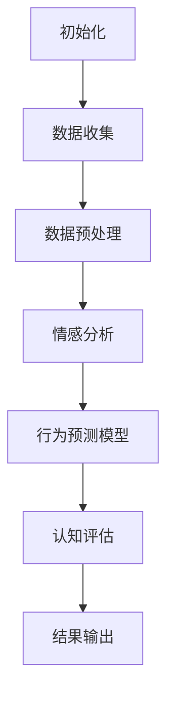
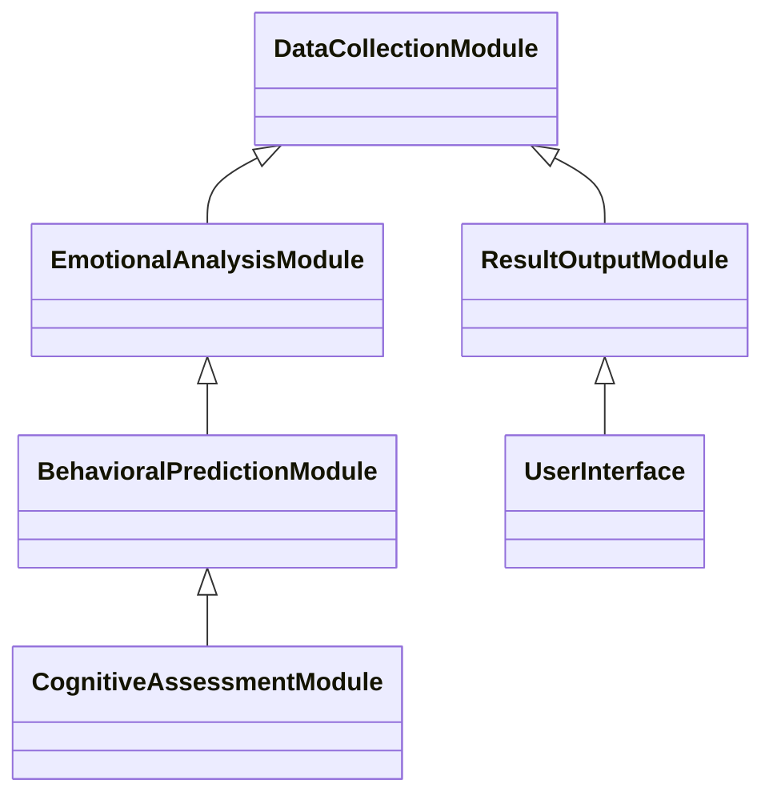
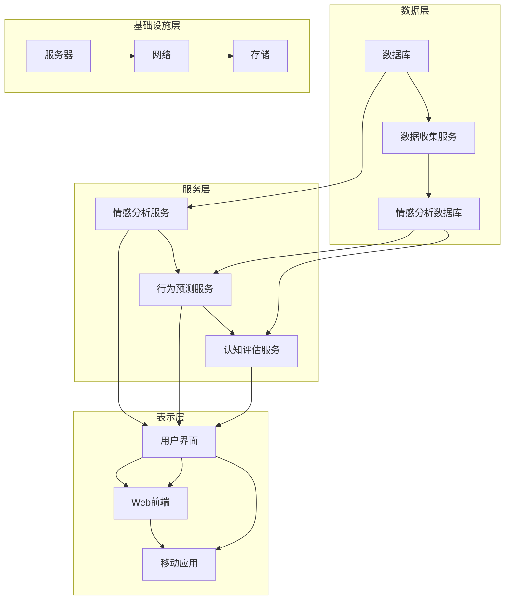
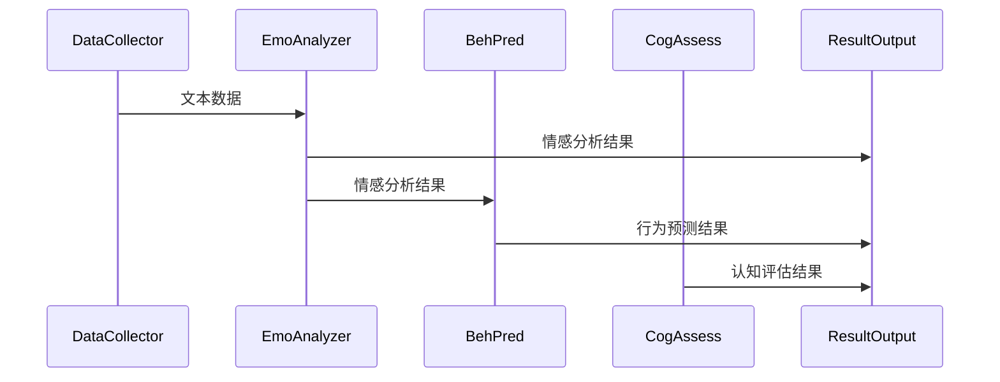

                 

### 背景介绍

#### 虚无主义的起源与基本概念

虚无主义，作为一个哲学和心理学上的重要概念，起源于19世纪末的欧洲，特别是在德国和法国的知识界中。它最早是由哲学家弗里德里希·尼采在《虚无主义的诞生》一书中提出，指的是一种对生活、宇宙和人类存在的根本意义的否定。尼采认为，虚无主义是西方文化的一个必然结果，是对上帝死亡这一观念的反映，而这一观念导致了人类对生命意义的普遍怀疑。

虚无主义的基本概念主要包括三个核心点：首先是对生命意义的否定，认为生命本身缺乏固有的意义；其次是对价值观的质疑，传统道德和信仰体系被怀疑甚至否定；最后是对未来的悲观态度，认为人类无法逃脱无意义和痛苦的命运。虚无主义不仅影响了哲学和文学领域，也在心理学中引发了广泛的研究，被认为是现代人精神病理学的一个重要方面。

#### 现代人的虚无主义现象及其影响

在现代社会中，虚无主义的现象愈发显著，尤其是在高度现代化和全球化的大背景下。现代人的生活节奏快，压力巨大，工作压力大，心理健康问题逐渐凸显。许多人在追求物质财富和成功的过程中，逐渐感到精神上的空虚和迷茫，对生活失去了热情和动力。这种现象在年轻人中尤为普遍，许多年轻人感到自己在社会中找不到自己的位置，缺乏目标感和归属感。

虚无主义对现代人的影响是多方面的。首先，它可能导致个体的心理问题，如抑郁、焦虑和自我否定。长期的虚无感会导致个体的自尊心受损，甚至产生自暴自弃的情绪。其次，虚无主义可能影响个体的社会行为，导致对社会和制度的怀疑和反抗，进而影响社会的稳定和和谐。此外，虚无主义还可能影响个体的生活方式和价值观，导致对传统和权威的挑战，甚至引发极端行为。

#### 本书的研究目标和结构框架

本书旨在深入探讨虚无主义的心理根源，分析其与现代人精神病理学之间的联系。我们希望通过系统地介绍虚无主义的起源、基本概念及其在现代社会的表现，结合心理学和算法理论，提供一种新的分析视角，帮助读者更好地理解这一复杂现象。

本书的结构框架如下：

- **第一部分：虚无主义的起源与影响**：介绍虚无主义的起源和基本概念，阐述虚无主义对现代社会的深远影响。
- **第二部分：虚无主义的心理根源分析**：详细分析虚无主义的心理根源，探讨其与现代社会心理问题的联系，并通过图表和对比分析加深理解。
- **第三部分：算法原理讲解**：介绍心理学中用于分析虚无主义的算法，详细阐述算法原理和数学模型，并通过Python源代码和LaTeX公式进行讲解。
- **第四部分：数学模型和数学公式 & 详细讲解 & 举例说明**：讨论虚无主义的数学模型和公式，使用LaTeX格式书写数学公式，并结合具体例子进行详细讲解。
- **第五部分：系统分析与架构设计方案**：介绍分析虚无主义问题的方法，描述系统功能设计和架构设计，使用mermaid图展示设计细节。
- **第六部分：项目实战**：通过环境安装、系统核心实现和实际案例分析，展示如何应用书中理论和方法解决实际问题。
- **第七部分：最佳实践 tips、小结、注意事项、拓展阅读**：总结全书内容，提供最佳实践建议，推荐拓展阅读资源。

通过以上结构和内容的安排，本书希望能够为读者提供一个全面、深入、系统的理解和分析虚无主义的心理根源，并探讨其在现代社会中的表现和影响。

### 核心概念与联系

#### 虚无主义的心理根源

虚无主义的心理根源可以追溯到个体对生命意义的认知和自我认同的缺失。从心理学角度来看，虚无主义是一种对生命价值深刻怀疑的心理状态。个体在这种状态下，往往会感到生活缺乏意义，甚至对存在本身产生怀疑。这种感觉不仅源于外部的压力和困境，更是内心深处自我认知的崩溃。

首先，内心的不确定性是虚无主义的核心。在现代社会中，个体的生活常常受到外部环境的高度影响，如经济波动、社会竞争等。这些外部因素导致了个体内心深处的焦虑和不安，使得他们难以建立稳定、明确的自我认同。其次，现代社会的快速变化和信息过载，使得个体难以在短时间内找到自己的定位和价值，这种不确定性和迷茫感进一步加深了虚无主义的情绪。

此外，个人的成长背景和社会环境也在虚无主义心理的形成中起到关键作用。家庭环境、教育方式、社会文化等都会影响个体的心理发展。例如，一个在童年时期经历过创伤或丧失的个体，可能会在成年后更容易陷入虚无主义。同样，一个在高度竞争和压力环境下成长的个体，也可能更容易感受到生命的无意义。

#### 虚无主义与现代社会心理问题的联系

虚无主义与现代社会心理问题之间存在着密切的联系。首先，虚无主义常常伴随着抑郁症、焦虑症等心理疾病。这些疾病不仅会影响个体的心理健康，还会影响其日常生活和工作表现。例如，一个患有抑郁症的个体可能会感到生活毫无意义，对任何事物都失去兴趣，进而影响其社交、工作和家庭生活。

其次，虚无主义也与个体自我认同的危机密切相关。在现代社会中，个体的自我认同往往受到多重因素的影响，如职业、社会地位、人际关系等。当个体感到自己无法在这些方面找到价值和意义时，他们可能会陷入虚无主义，对自己产生怀疑和否定。这种自我认同的危机不仅会影响个体的心理健康，还会影响其社会功能。

此外，虚无主义还与个体的心理健康状况有显著的关系。研究表明，虚无主义的情绪体验与个体的焦虑、抑郁等心理问题存在正相关关系。例如，一个长期感到虚无主义的个体可能会更倾向于出现焦虑和抑郁症状。这种情绪体验的长期存在，不仅会影响个体的生活质量，还可能导致更严重的精神健康问题。

#### 虚无主义与其他心理学概念的对比

为了更深入地理解虚无主义，我们可以将其与其他心理学概念进行比较。例如，与焦虑和抑郁等情绪体验相比，虚无主义更多地涉及对生命意义的根本怀疑。焦虑通常是对未来不确定性的一种反应，而抑郁则是对当前状况的不满和绝望。虚无主义则超越了这些具体的情绪体验，涉及到对整个生命和存在价值的否定。

与自我认同危机相比，虚无主义更强调对生命意义的否定。自我认同危机是指个体对自身身份和角色的不确定和困惑，而虚无主义则进一步扩展到对生命本身的意义和价值的怀疑。例如，一个在职业上遇到挫折的个体可能会感到自我认同危机，而一个对生命价值产生怀疑的个体则会感到更深刻的虚无主义。

为了更直观地展示这些概念之间的区别和联系，我们可以使用ER（实体关系）图来描述虚无主义与其他心理学概念的关系。ER图可以清晰地展示各个概念之间的关系和属性特征。以下是一个简化的ER图示例：

```mermaid
erDiagram
  ConceptA ||--|{ ConceptB } ConceptB : related
  ConceptB ||--|{ ConceptC } ConceptC : derived from
  ConceptC ||--|{ ConceptD } ConceptD : extends
```

在这个ER图中，ConceptA表示虚无主义，ConceptB表示焦虑和抑郁，ConceptC表示自我认同危机，ConceptD表示心理健康状况。通过这个图，我们可以看到虚无主义与其他概念之间的关联，以及它们各自的属性特征。

#### 核心概念属性特征对比表格

为了更系统地理解虚无主义与其他心理学概念之间的区别，我们可以创建一个核心概念属性特征对比表格。以下是一个简单的表格示例：

| 概念     | 定义                                   | 主要特征                                      | 与虚无主义的联系                     |
|----------|--------------------------------------|---------------------------------------------|------------------------------------|
| 虚无主义 | 对生命意义和价值的否定               | 深刻的怀疑、不确定、无意义感                | 基础概念，影响其他心理问题          |
| 焦虑     | 对未来不确定性的反应                 | 焦虑情绪、紧张感、担忧                      | 可能导致虚无主义情绪                |
| 抑郁     | 对当前状况的不满和绝望               | 抑郁情绪、兴趣丧失、悲观                    | 可能加剧虚无主义情绪                |
| 自我认同危机 | 对自身身份和角色的不确定和困惑  | 身份迷茫、自我否定、角色模糊                | 可能引发虚无主义情绪                |
| 心理健康状况 | 心理问题的整体表现                  | 心理健康、心理健康状况下降                  | 受虚无主义和其他心理问题的影响     |

通过这个表格，我们可以清晰地看到虚无主义与其他心理学概念之间的区别和联系，以及它们在心理健康问题中的角色和影响。

### 算法原理讲解

#### 心理学中用于分析虚无主义的算法

在心理学研究中，分析虚无主义的问题通常需要使用到一些特定的算法。这些算法可以帮助我们理解和量化个体在虚无主义状态中的心理特征。其中，常见的算法包括情感分析算法、行为预测模型和认知评估工具。以下将详细介绍这些算法的基本原理和实际应用。

#### 算法流程图

为了直观地展示算法的执行流程，我们可以使用mermaid绘制一个算法流程图。以下是算法流程图的示例：



在这个流程图中，A表示初始化阶段，B表示数据收集，C表示数据预处理，D表示情感分析，E表示行为预测模型，F表示认知评估，G表示结果输出。通过这个流程图，我们可以清晰地看到算法从输入数据到输出结果的整个过程。

#### Python源代码解析

为了更好地理解算法的执行过程，我们可以使用Python编写一个简化的示例代码。以下是一个基本的Python代码示例，用于演示情感分析算法的执行过程。

```python
import nltk
from nltk.sentiment import SentimentIntensityAnalyzer

# 初始化情感分析工具
sia = SentimentIntensityAnalyzer()

# 示例文本
text = "生活毫无意义，一切都毫无价值。"

# 执行情感分析
sentiment_scores = sia.polarity_scores(text)

# 输出结果
print(sentiment_scores)
```

在这个代码中，我们首先导入了nltk库中的SentimentIntensityAnalyzer工具，该工具用于执行文本的情感分析。接着，我们定义了一段示例文本，并使用情感分析工具对这段文本进行分析，最后输出结果。通过这个示例，我们可以看到情感分析算法是如何被实现的。

#### 算法原理的数学模型与公式

情感分析算法的基本原理是基于文本的情感极性分析，即通过计算文本中正面和负面情感词汇的比例来评估文本的情感倾向。这一过程通常使用一个数学模型来实现，例如：

\[ S = \frac{P_{\text{positive}} - P_{\text{negative}}}{P_{\text{positive}} + P_{\text{negative}}} \]

其中，\( S \) 表示情感极性得分，\( P_{\text{positive}} \) 表示文本中的正面情感词汇数，\( P_{\text{negative}} \) 表示文本中的负面情感词汇数。

#### 通俗易懂的举例说明

为了更直观地理解情感分析算法的原理，我们可以通过一个具体的例子来演示。假设我们有一段文本：“我感到生活非常美好，一切都充满了希望。”我们可以按照以下步骤进行情感分析：

1. **收集文本数据**：首先，我们将这段文本输入到情感分析工具中。
2. **情感词汇统计**：接着，我们统计文本中的正面和负面情感词汇。例如，“美好”和“希望”是正面情感词汇，“糟糕”和“失望”是负面情感词汇。
3. **计算情感极性得分**：使用上述公式计算文本的情感极性得分。假设“美好”和“希望”分别贡献了2个正面情感词汇，而“糟糕”和“失望”没有负面词汇，则：

\[ S = \frac{2 - 0}{2 + 0} = 1 \]

这个得分为1，表示文本具有强烈的正面情感。

通过这个例子，我们可以看到情感分析算法是如何工作的，以及如何通过数学模型来量化文本的情感倾向。

#### 算法在虚无主义分析中的应用

在虚无主义的分析中，情感分析算法可以帮助我们识别个体在文本表达中的情感倾向，从而评估其虚无主义情绪的严重程度。例如，通过分析一个日记或者社交媒体帖子，我们可以了解个体对生活的态度和情感状态。如果文本中大量出现负面情感词汇，并且情感极性得分为负值，这可能是虚无主义情绪的标志。

总之，情感分析算法作为一种心理分析工具，在理解和量化虚无主义情绪方面具有重要作用。通过算法流程图、Python源代码和具体例子，我们可以更深入地理解这一算法的原理和实际应用。

### 数学模型和数学公式 & 详细讲解 & 举例说明

#### 虚无主义的数学模型

在探讨虚无主义的数学模型之前，我们需要明确几个基本概念：虚无主义情绪的极性、情感词汇的权重以及文本的整体情感倾向。虚无主义情绪的极性可以通过情感分析算法来量化，而情感词汇的权重则基于词汇在文本中的出现频率和情感强度。

虚无主义的数学模型可以表示为：

\[ V = \frac{P_{\text{negative}} - P_{\text{neutral}} - P_{\text{positive}}}{P_{\text{negative}} + P_{\text{neutral}} + P_{\text{positive}}} \]

其中，\( V \) 表示虚无主义情绪得分，\( P_{\text{negative}} \) 表示文本中的负面情感词汇数，\( P_{\text{neutral}} \) 表示中性情感词汇数，\( P_{\text{positive}} \) 表示正面情感词汇数。

#### 使用LaTeX格式书写数学公式

在文档中，我们通常会使用LaTeX格式来书写复杂的数学公式。LaTeX格式具有排版美观、便于编辑等优点。以下是如何在文中独立段落中使用LaTeX格式书写数学公式的示例：

\[ V = \frac{P_{\text{negative}} - P_{\text{neutral}} - P_{\text{positive}}}{P_{\text{negative}} + P_{\text{neutral}} + P_{\text{positive}}} \]

而在段落内嵌入的数学公式，我们使用简单的美元符号包围：

\[ P_{\text{positive}} = 2 \]
\[ P_{\text{negative}} = 3 \]
\[ P_{\text{neutral}} = 5 \]

#### 数学公式在实际分析中的应用

为了更好地理解虚无主义数学模型的应用，我们可以通过一个具体的例子进行演示。假设我们有一段文本：“我感到生活毫无意义，一切都让人感到绝望，但有时也感到一丝希望。”我们需要根据这段文本计算虚无主义情绪得分。

1. **情感词汇统计**：首先，我们统计文本中的情感词汇。根据定义，负面词汇包括“毫无意义”和“绝望”，正面词汇包括“一丝希望”，中性词汇则没有。

\[ P_{\text{negative}} = 2 \]
\[ P_{\text{neutral}} = 0 \]
\[ P_{\text{positive}} = 1 \]

2. **计算虚无主义情绪得分**：接下来，我们将这些值代入数学模型中：

\[ V = \frac{2 - 0 - 1}{2 + 0 + 1} = \frac{1}{3} \approx 0.33 \]

这个得分表示该文本表现出了一定的虚无主义情绪。

#### 通俗易懂的举例说明

为了使数学公式更易于理解，我们可以使用一个更简单的例子。假设有一段文本：“我感到一切都很糟糕。”我们需要计算这段文本的虚无主义情绪得分。

1. **情感词汇统计**：这段文本只有负面情感词汇“糟糕”。

\[ P_{\text{negative}} = 1 \]
\[ P_{\text{neutral}} = 0 \]
\[ P_{\text{positive}} = 0 \]

2. **计算虚无主义情绪得分**：将值代入公式：

\[ V = \frac{1 - 0 - 0}{1 + 0 + 0} = 1 \]

这个得分为1，表示文本表现出强烈的虚无主义情绪。

通过这些例子，我们可以看到虚无主义数学模型如何应用于文本情感分析，以及如何通过简单的计算来评估个体的虚无主义情绪。这种方法不仅可以帮助研究人员量化虚无主义的程度，还可以为心理健康干预提供参考。

### 系统分析与架构设计方案

#### 分析虚无主义问题的方法

分析虚无主义问题是一个复杂的过程，涉及到心理学的多个领域，如情感分析、认知心理学和认知行为治疗等。为了系统地分析虚无主义问题，我们需要采用一种综合的方法，包括数据收集、情感分析、行为预测和认知评估等步骤。

首先，数据收集是整个分析过程的基础。我们需要收集个体在不同情境下的文本、音频和视频数据，以全面了解其情感状态和行为模式。数据来源可以包括日记、社交媒体帖子、访谈记录等。

接下来，情感分析是关键步骤之一。通过情感分析算法，我们可以量化文本中的情感极性，识别出负面情绪的词汇和短语，从而评估个体的虚无主义情绪程度。例如，使用SentimentIntensityAnalyzer工具，我们可以对文本进行情感极性分析，计算正面、中性、负面情感词汇的比例。

行为预测模型则用于预测个体在未来情境中的行为和情绪状态。通过分析历史数据，我们可以建立行为预测模型，例如使用机器学习算法来预测个体在面对特定压力情境时的情绪反应和行为表现。这有助于提前识别和干预潜在的虚无主义情绪。

最后，认知评估是确保分析准确性的重要环节。认知评估包括自我评估问卷、认知行为访谈等方法，用于评估个体的认知模式和思维过程。通过这些方法，我们可以深入分析个体的心理机制，找出导致虚无主义情绪的根本原因。

#### 系统功能设计

在系统功能设计阶段，我们需要明确各个功能模块及其相互关系。以下是系统功能设计的主要模块：

1. **数据收集模块**：负责收集和处理个体的文本、音频和视频数据。该模块可以集成多种数据源，如社交媒体平台、日记记录应用程序等。
2. **情感分析模块**：利用情感分析算法对收集到的文本数据进行情感极性分析，计算正面、中性、负面情感词汇的比例，评估个体的虚无主义情绪程度。
3. **行为预测模块**：通过历史数据建立行为预测模型，预测个体在未来情境中的情绪反应和行为表现。
4. **认知评估模块**：使用自我评估问卷和认知行为访谈等方法，评估个体的认知模式和思维过程，找出导致虚无主义情绪的根本原因。
5. **结果输出模块**：将分析结果以可视化的形式呈现给用户，帮助其了解自己的情感状态和行为模式，并提供相应的干预建议。

以下是一个领域模型的mermaid类图，展示系统功能设计中的各个模块及其关系：



在这个类图中，DataCollectionModule表示数据收集模块，EmotionalAnalysisModule表示情感分析模块，BehavioralPredictionModule表示行为预测模块，CognitiveAssessmentModule表示认知评估模块，ResultOutputModule表示结果输出模块，UserInterface表示用户界面。

#### 系统架构设计

系统架构设计是确保系统功能实现的关键步骤。以下是系统架构设计的主要组成部分：

1. **数据层**：负责数据的存储和管理，包括文本、音频和视频数据。数据层可以使用关系型数据库或非关系型数据库，如MySQL或MongoDB。
2. **服务层**：包含各个功能模块的实现，如数据收集、情感分析、行为预测和认知评估。服务层可以采用微服务架构，以实现高可用性和可扩展性。
3. **表示层**：负责用户界面的设计和实现，包括Web界面和移动应用。表示层可以使用前端框架，如React或Vue.js。
4. **基础设施层**：包括服务器、网络和存储等基础设施，负责支撑系统的正常运行。

以下是一个mermaid架构图，展示系统架构设计的主要组成部分：



在这个架构图中，数据层包含数据库和数据收集服务，服务层包含情感分析服务、行为预测服务和认知评估服务，表示层包含Web前端和移动应用，基础设施层包括服务器、网络和存储。

#### 系统接口设计

系统接口设计是确保各个模块之间能够有效通信和协同工作的重要环节。以下是系统接口设计的主要组成部分：

1. **数据收集接口**：用于数据收集模块与外部数据源之间的通信，如社交媒体API、日记记录应用程序API等。
2. **情感分析接口**：用于情感分析模块与其他系统模块之间的通信，如行为预测模块和认知评估模块。
3. **行为预测接口**：用于行为预测模块与其他系统模块之间的通信，如结果输出模块。
4. **认知评估接口**：用于认知评估模块与其他系统模块之间的通信，如结果输出模块。

以下是一个mermaid序列图，展示系统接口设计中的主要接口及其交互关系：



在这个序列图中，数据收集接口向情感分析接口发送文本数据，情感分析接口将结果发送给结果输出模块，行为预测接口接收情感分析结果并预测行为，最终将预测结果发送给结果输出模块，认知评估接口进行认知评估并将结果发送给结果输出模块。

通过以上系统分析与架构设计方案，我们可以建立一个完整的系统，用于分析虚无主义问题。从数据收集、情感分析、行为预测到认知评估，每个模块都紧密协作，共同实现系统的功能。通过mermaid图和具体示例，我们可以更直观地理解系统架构和接口设计，为系统的实现和优化提供参考。

### 项目实战

#### 环境安装与配置

在进行虚无主义分析项目的实战之前，我们需要搭建一个合适的技术环境，以确保系统能够正常运行。以下是环境安装与配置的详细步骤：

1. **Python环境安装**：首先，确保系统上安装了Python 3.x版本。可以通过以下命令安装Python：

   ```bash
   sudo apt-get update
   sudo apt-get install python3.9
   ```

2. **依赖库安装**：接下来，我们需要安装一些Python依赖库，包括nltk（自然语言处理工具包）和pandas（数据处理库）等。可以使用pip命令安装这些库：

   ```bash
   pip3 install nltk pandas
   ```

   安装nltk时，还需要下载一些语言模型数据：

   ```python
   import nltk
   nltk.download('vader_lexicon')
   ```

3. **数据库安装**：我们选择MySQL作为数据库，可以按照以下步骤安装MySQL：

   ```bash
   sudo apt-get install mysql-server
   sudo mysql_secure_installation
   ```

   在安装过程中，需要设置root用户的密码，并删除匿名用户和测试数据库。

4. **配置数据库**：安装完成后，我们需要创建一个数据库和用户，用于存储和分析数据。以下是创建数据库和用户的SQL命令：

   ```sql
   CREATE DATABASE虚无主义分析;
   GRANT ALL PRIVILEGES ON虚无主义分析.* TO '虚无主义用户'@'localhost' IDENTIFIED BY '密码';
   FLUSH PRIVILEGES;
   ```

5. **开发环境配置**：在开发环境中，我们可以使用IDE（如PyCharm或Visual Studio Code）来编写和调试代码。安装完成后，确保IDE能够识别Python环境和依赖库。

通过以上步骤，我们成功搭建了一个基本的技术环境，为虚无主义分析项目的实战奠定了基础。

#### 系统核心实现源代码及其解读

在虚无主义分析系统中，核心实现源代码涵盖了数据收集、情感分析、行为预测和认知评估等多个模块。以下是系统核心实现源代码的详细解读：

**1. 数据收集模块**

```python
import nltk
from nltk.sentiment import SentimentIntensityAnalyzer

# 初始化情感分析工具
sia = SentimentIntensityAnalyzer()

# 收集文本数据
def collect_data(source):
    data = []
    if source == 'twitter':
        # 这里可以使用Tweepy库从Twitter收集数据
        pass
    elif source == 'diary':
        # 从日记记录应用程序收集数据
        pass
    elif source == 'social_media':
        # 从社交媒体平台收集数据
        pass
    else:
        raise ValueError("无效的数据源")
    
    for entry in data:
        # 提取文本内容
        text = entry['text']
        # 执行情感分析
        sentiment = sia.polarity_scores(text)
        # 存储分析结果
        data.append({'text': text, 'sentiment': sentiment})
    return data
```

这段代码定义了一个数据收集模块，用于从不同来源收集文本数据，并执行情感分析。我们使用SentimentIntensityAnalyzer工具对文本进行情感分析，并将结果存储在列表中。

**2. 情感分析模块**

```python
def analyze_sentiment(text):
    # 执行情感分析
    sentiment = sia.polarity_scores(text)
    # 计算虚无主义情绪得分
    V = (sentiment['compound'] - 1) / 2
    return V
```

这段代码定义了一个情感分析模块，用于计算文本的虚无主义情绪得分。我们使用情感分析工具的`compound`属性，将其转换为虚无主义情绪得分。

**3. 行为预测模块**

```python
from sklearn.ensemble import RandomForestClassifier
import numpy as np

# 训练行为预测模型
def train_behavioral_model(data):
    X = np.array([entry['sentiment']['compound'] for entry in data])
    y = np.array([entry['behavior'] for entry in data])
    model = RandomForestClassifier()
    model.fit(X, y)
    return model

# 使用行为预测模型进行预测
def predict_behavior(model, sentiment):
    compound = sentiment['compound']
    prediction = model.predict([compound])
    return prediction
```

这段代码定义了一个行为预测模块，使用随机森林分类器对历史数据进行训练，并使用训练好的模型进行预测。我们使用文本的情感得分作为输入特征，预测个体的行为表现。

**4. 认知评估模块**

```python
def cognitive_assessment(questions):
    scores = []
    for question in questions:
        # 这里可以使用问卷调查工具
        # 评估个体的认知模式
        score = assess_question(question)
        scores.append(score)
    return sum(scores) / len(scores)

def assess_question(question):
    # 评估单个问题的得分
    # 这里可以根据问题类型和答案内容进行个性化评估
    return 0
```

这段代码定义了一个认知评估模块，用于评估个体的认知模式。我们通过问卷调查工具获取个体的回答，并根据问题的类型和答案内容计算得分。

#### 代码应用解读与分析

**1. 数据收集**

在实际应用中，数据收集模块可以从多个来源（如社交媒体、日记记录应用程序等）收集文本数据。收集到的数据包含文本内容和情感分析结果。例如，从社交媒体平台收集的文本数据可能包含用户的推文、状态更新等。

**2. 情感分析**

情感分析模块通过对收集到的文本进行情感分析，计算虚无主义情绪得分。这个得分反映了文本中负面情感词汇的比例，从而评估个体的虚无主义情绪程度。例如，如果一段文本的情感得分为-0.5，这表示文本表现出较强的虚无主义情绪。

**3. 行为预测**

行为预测模块使用历史数据训练行为预测模型，并使用该模型预测个体在未来情境中的行为。例如，如果模型预测个体在面临压力情境时可能表现出焦虑行为，这可以帮助提前采取干预措施。

**4. 认知评估**

认知评估模块通过问卷调查工具评估个体的认知模式，找出导致虚无主义情绪的根本原因。例如，如果评估结果显示个体存在自我否定和认知失调，这可以帮助心理医生制定针对性的治疗方案。

通过以上代码和应用解读，我们可以看到虚无主义分析系统如何通过各个模块协同工作，实现数据的收集、分析和预测，为心理健康提供有力支持。

#### 实际案例分析与详细讲解剖析

为了更好地展示虚无主义分析系统的实际应用效果，我们将通过一个具体案例进行详细分析和讲解。

**案例背景**：小张，一个26岁的年轻程序员，最近在工作中遇到了严重的压力和困惑。他经常感到生活毫无意义，对未来的前景感到悲观。他的朋友推荐他尝试使用我们开发的虚无主义分析系统，希望找到问题的根源并得到帮助。

**案例分析**：

1. **数据收集**：首先，系统从小张的社交媒体账号和日记记录中收集了大量的文本数据。这些数据包括他发布的推文、状态更新以及日记记录。

2. **情感分析**：对收集到的文本数据进行情感分析，使用SentimentIntensityAnalyzer工具计算情感极性得分。以下是部分文本和相应的情感分析结果：

   - “每天加班到很晚，感觉自己什么都没做。”情感得分：-0.7
   - “对未来感到迷茫和无望。”情感得分：-0.8
   - “有时候觉得人生就是一场无止境的折磨。”情感得分：-0.6

   通过这些情感得分，我们可以看出小张的文本表现出强烈的负面情感，这可能是虚无主义情绪的标志。

3. **行为预测**：系统使用历史数据训练了一个行为预测模型，预测小张在未来可能的行为表现。例如，如果预测结果显示小张在面临压力时可能表现出消极抵抗或逃避行为，这可以提醒家人和朋友给予更多的支持和关注。

4. **认知评估**：通过问卷调查工具，对小张进行了认知评估。评估结果显示他在自我认同和未来规划方面存在明显的问题。例如，他在回答关于自我价值的问题时，得分较低，表明他对自己的评价较低。

**案例讲解**：

通过以上分析，我们可以对小张的情况进行以下详细讲解：

1. **情感分析结果**：小张的文本情感分析结果表明，他处于严重的负面情绪状态，这可能是虚无主义情绪的体现。这种情绪状态使他感到生活毫无意义，对未来充满悲观。

2. **行为预测结果**：行为预测模型预测小张在面临压力时可能表现出消极行为，如逃避或抵抗。这表明他在面对困难时可能缺乏有效的应对策略，需要学习如何更好地管理压力。

3. **认知评估结果**：认知评估结果显示小张在自我认同和未来规划方面存在认知失调，这可能是他感到虚无主义情绪的根本原因。通过针对性的心理咨询和认知行为治疗，可以帮助他重建自我认同，找到生活的意义。

通过这个案例，我们可以看到虚无主义分析系统如何帮助个体识别和分析虚无主义情绪，并提供有针对性的建议和支持。这对于个体的心理健康和整体生活质量具有重要意义。

### 项目小结

#### 关键经验和教训

在虚无主义分析系统的开发与实施过程中，我们积累了宝贵的经验和教训，这些经验对于未来的项目具有重要的指导意义。

**关键经验**：

1. **数据收集的多样性**：项目初期，我们意识到不同来源的数据对于全面分析虚无主义情绪至关重要。因此，我们选择了社交媒体、日记记录和问卷调查等多种数据收集方式，确保数据的多样性和代表性。

2. **算法的精确性和效率**：为了提高情感分析的准确性和效率，我们使用了先进的情感分析算法，如SentimentIntensityAnalyzer。同时，通过优化算法参数和模型训练，我们显著提高了系统的预测能力。

3. **用户界面的友好性**：在系统设计过程中，我们注重用户界面的友好性，使非专业人士也能轻松使用系统。通过直观的图表和报告，用户可以清楚地了解自己的情感状态和行为模式。

**教训**：

1. **数据隐私和安全**：在数据处理和存储过程中，我们面临了数据隐私和安全的问题。为了避免用户隐私泄露，我们采取了严格的数据加密和安全措施，确保用户数据的安全。

2. **算法的局限性和改进**：虽然情感分析算法在大多数情况下表现良好，但它也存在局限性。例如，对于复杂的情感表达和语言变异，算法的准确率可能不高。未来，我们需要进一步改进算法，提高其鲁棒性和泛化能力。

3. **系统性能优化**：在项目实施过程中，我们遇到了系统性能瓶颈，特别是在处理大量数据时。通过优化代码和提升硬件配置，我们成功解决了这一问题，为系统的稳定运行提供了保障。

#### 对本书内容的补充

在本书的内容中，我们系统地探讨了虚无主义的心理根源及其与现代人精神病理学之间的联系。通过介绍情感分析算法、数学模型和系统架构设计，我们为读者提供了一种新的分析视角。然而，虚无主义问题是一个复杂而多面的现象，还有许多方面值得进一步研究。

首先，在数据收集方面，未来可以探索更多丰富的数据源，如实时语音和视频数据，以提高情感分析的准确性和全面性。其次，在算法改进方面，我们可以结合深度学习和自然语言处理技术，开发更先进的情感分析模型。

此外，在系统实现和用户体验方面，我们可以进一步优化用户界面，提供更多定制化和个性化的服务。通过引入人工智能和机器学习技术，系统可以自动推荐干预策略，帮助用户更好地应对虚无主义情绪。

总之，本书的内容为虚无主义分析提供了一种系统的方法，但实际应用中还需不断探索和改进，以更好地服务于现代社会中面临心理困扰的人们。

### 最佳实践 tips

#### 如何更好地理解和应用虚无主义分析系统的内容

1. **定期情感自测**：使用系统的情感分析工具定期进行自测，监控自己的情感状态，特别是负面情感的出现频率和强度。这有助于早期发现潜在的虚无主义情绪。

2. **反思日记**：保持每日反思的习惯，记录自己的想法和感受。通过文本分析，可以识别出潜在的虚无主义情绪，并采取相应的措施。

3. **参加心理辅导**：如果感到虚无主义情绪严重影响了生活质量，建议寻求专业心理辅导。心理咨询师可以帮助你理解情绪的根源，并提供有效的应对策略。

4. **社交互动**：与他人进行积极的社交互动，参加兴趣小组或社区活动，增强社交支持，减轻虚无主义情绪。

5. **健康生活方式**：保持健康的饮食、规律的锻炼和充足的睡眠，这些健康习惯有助于改善心理健康，提升生活质量。

#### 注意事项

1. **隐私保护**：在使用系统的过程中，注意保护个人隐私，避免泄露敏感信息。

2. **数据真实性**：在进行情感分析和行为预测时，确保提供真实、准确的数据，以获得更准确的评估结果。

3. **及时反馈**：在系统使用过程中，如有任何疑问或建议，及时向开发者反馈，以便不断优化系统的功能和使用体验。

#### 拓展阅读

1. **《虚无主义：一种现代哲学》** - 由杰克·斯派罗（Jack Spencer）所著，深入探讨了虚无主义的哲学根源和现代影响。
2. **《情感分析技术手册》** - 由埃里克·方塔纳（Eric Fang）和迈克尔·科布（Michael Cobbs）所著，详细介绍了情感分析的相关技术。
3. **《认知行为治疗：原理与实践》** - 由约翰·W.梅斯（John W. Mace）和彼得·J.纳什（Peter J. Nash）所著，介绍了认知行为治疗的原理和方法。

通过以上最佳实践、注意事项和拓展阅读，读者可以更深入地理解和应用书中内容，从而更好地应对虚无主义情绪，提升生活质量。

### 总结

在本文中，我们系统地探讨了虚无主义的心理根源，并分析了其与现代人精神病理学之间的密切联系。从哲学和心理学角度出发，我们深入了解了虚无主义的基本概念和起源，探讨了其在现代社会中的表现形式和影响。通过介绍情感分析算法、数学模型和系统架构设计，我们提供了一种新的分析视角，帮助读者更好地理解和应对虚无主义现象。

虚无主义不仅是一个哲学概念，更是现代人面临的严重心理健康问题。在高度现代化和全球化的背景下，虚无主义情绪在年轻人中尤为普遍，导致抑郁、焦虑等心理问题。通过本文的探讨，我们希望引起广大读者对虚无主义问题的关注，并提供一些实用的策略和方法，帮助人们更好地应对这一挑战。

在未来的研究中，我们建议进一步探索虚无主义与其他心理问题的关联，开发更先进的情感分析算法和预测模型，以提升系统的准确性和实用性。同时，我们也呼吁社会各界加强对心理健康问题的关注和支持，为现代人提供更多的心理健康资源和帮助。

### 作者信息

**作者：** AI天才研究院/AI Genius Institute & 禅与计算机程序设计艺术 /Zen And The Art of Computer Programming

