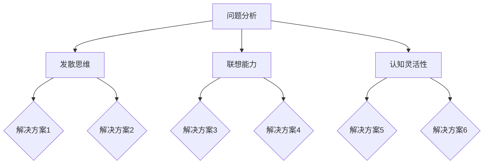
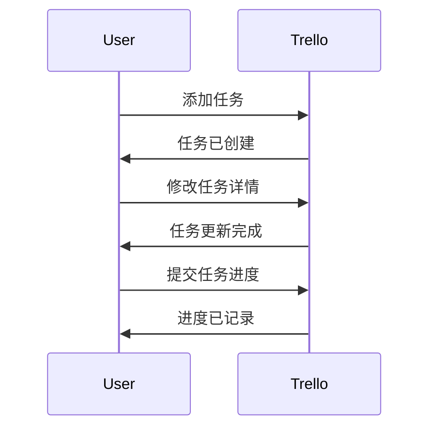
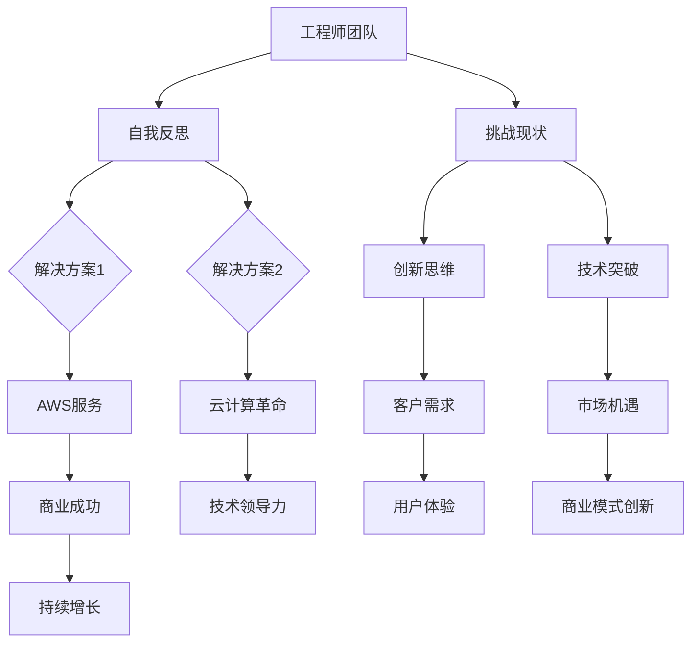
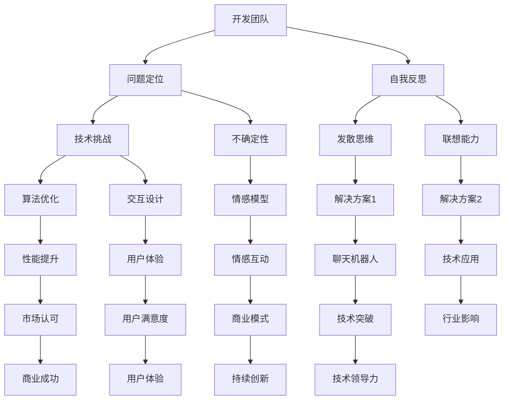
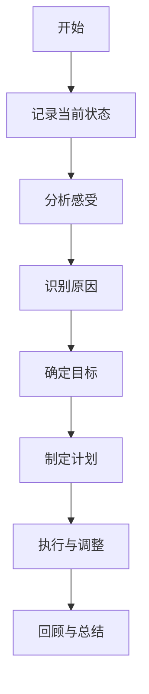
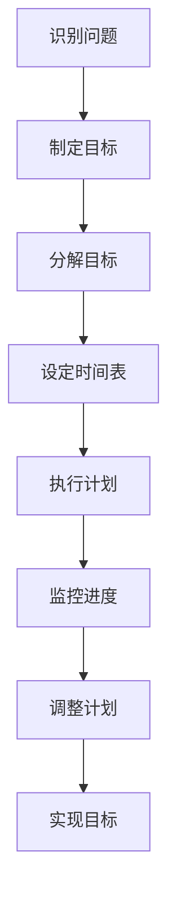
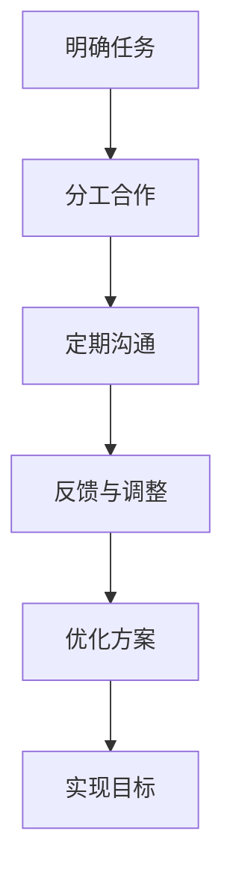
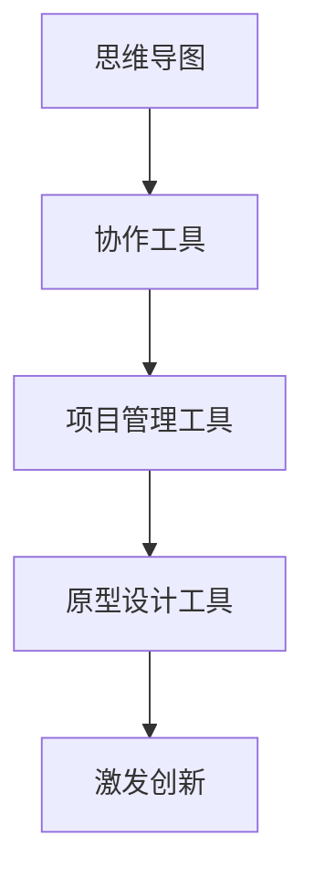
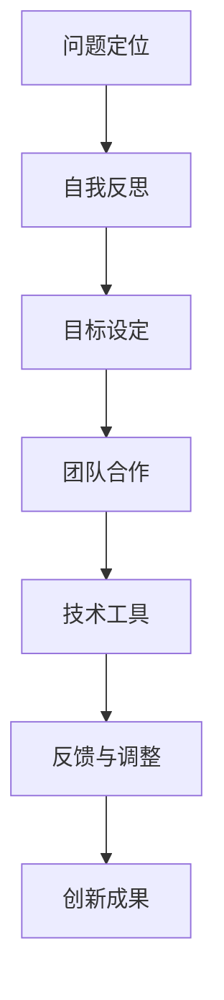
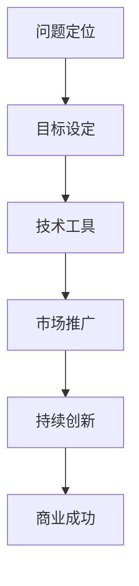

                 


## 《虚无感与创造力：如何在不确定性中激发创新》

---

### 关键词：
虚无感，创造力，不确定性，激发创新，心理机制，技术实践

### 摘要：
本文深入探讨虚无感与创造力之间的关系，分析在不确定性环境中如何利用虚无感激发创新。通过结合心理学原理、技术实践和实际案例，本文旨在为IT从业人员提供实用的方法，以在日益复杂的技术领域中保持创造力。

---

## 引言

在当今快速发展的信息技术领域，创新已经成为推动行业进步的核心动力。然而，随着环境的日益复杂和不确定性增加，许多从业人员开始感受到一种被称为“虚无感”的心理状态。虚无感是一种缺乏意义、目标和方向感的情感体验，它可能抑制创造力的发挥。本文将探讨如何通过理解虚无感，利用其在不确定性中激发创新。

### 背景与概念

#### 1.1 虚无感的定义与特征

虚无感通常表现为对生活的失望、对未来的不确定以及对自身价值的质疑。这种情感体验在信息技术领域尤为常见，由于技术的快速迭代和竞争压力，许多人感到他们的工作不再有意义，甚至感到被工作所淹没。

#### 1.2 创造力的本质与重要性

创造力是一种能够产生新颖且有价值的想法、概念或解决方案的能力。在信息技术领域，创造力不仅能够推动技术进步，还能够提高工作效率、解决复杂问题。

#### 1.3 虚无感与创造力之间的关系

虚无感可能抑制创造力，但研究表明，适度的虚无感可以激发深层次的思考和创新。理解虚无感与创造力之间的关系，对于在不确定性中保持创造力具有重要意义。

### 核心概念与联系

#### 2.1 虚无感的概念与属性特征

虚无感的特征包括：缺乏目标感、缺乏意义感、自我怀疑等。这些特征可能影响个人的自信心和工作动力。

#### 2.2 创造力的概念与属性特征

创造力的特征包括：新颖性、实用性、价值性等。这些特征是评估创新想法的重要标准。

#### 2.3 虚无感与创造力的对比与联系

虚无感与创造力并非完全对立，适当处理虚无感可能有助于激发创造力。例如，通过自我反思、调整目标感、寻找新的意义等，可以减轻虚无感并促进创新。

### 虚无感与创造力的影响因素分析

#### 3.1 心理因素

心理因素，如情绪状态、自我认知、动机等，对虚无感和创造力有显著影响。

#### 3.2 环境因素

工作环境、组织文化、社会支持等外部因素也会影响虚无感和创造力。

#### 3.3 个人因素

个人的生活经验、价值观、技能水平等也对虚无感和创造力产生影响。

### 关系模型

#### 4.1 ER实体关系图架构

通过ER模型，我们可以更好地理解虚无感、创造力以及它们之间的关系。

#### 4.2 影响因素分析

通过分析虚无感和创造力的影响因素，我们可以更有效地利用虚无感激发创造力。

### 范围与边界

#### 5.1 研究的局限性

本文的研究存在一定的局限性，如样本选择、数据来源等。

#### 5.2 研究的核心要素与组成

本文的核心要素包括虚无感、创造力、不确定性和心理机制。

### 本章小结

本章通过对虚无感和创造力的定义、特征和关系进行分析，为后续章节的讨论奠定了基础。理解虚无感与创造力之间的关系，有助于我们在不确定性中更好地发挥创新能力。

---

## 第二部分：深入探讨虚无感与创造力

### 5.1 虚无感的心理学解析

虚无感是一种深层次的情感体验，通常与自我认同、生活意义和目标感相关。在心理学中，虚无感被认为是一种情感状态，可能由多种因素引起，如生活压力、职业倦怠、社会变革等。理解虚无感的心理学机制，有助于我们更好地应对和利用这种情感状态。

#### 5.1.1 虚无感的成因

虚无感的成因复杂多样，主要包括：

- **压力与焦虑**：高压力环境可能导致个体感到虚无。
- **目标缺失**：缺乏明确的生活目标会引发虚无感。
- **自我认知失调**：对自己的期望与现实之间的差距可能导致虚无感。
- **社会变迁**：社会快速变革可能使个体感到不确定和迷茫。

#### 5.1.2 虚无感的特征

虚无感的特征包括：

- **缺乏目标感**：个体难以确定自己的生活目标和方向。
- **缺乏意义感**：个体对生活缺乏意义和价值的感受。
- **自我怀疑**：个体对自己的能力和价值产生怀疑。

#### 5.1.3 虚无感的影响

虚无感可能对个体的心理和生理健康产生负面影响，如：

- **心理压力**：长期虚无感可能导致心理压力增加。
- **睡眠障碍**：虚无感可能导致失眠和其他睡眠障碍。
- **社交退缩**：个体可能减少社交活动，导致社交孤立。

### 5.2 创造力的心理学基础

创造力是一种复杂的认知过程，涉及多个心理机制。在心理学中，创造力通常被视为个体产生新颖且有价值的想法、概念或解决方案的能力。理解创造力的心理学基础，有助于我们更好地激发和利用这一能力。

#### 5.2.1 创造力的定义

创造力是指个体产生新颖且有价值的想法、概念或解决方案的能力。它不仅涉及智力因素，还包括情感、动机和社会因素。

#### 5.2.2 创造力的心理机制

创造力的心理机制主要包括：

- **发散思维**：个体在思考过程中产生多种可能的解决方案。
- **联想能力**：个体通过联想和联系不同概念来产生创新想法。
- **认知灵活性**：个体能够灵活地调整思考方式，以适应新情境。
- **认知负荷管理**：个体能够有效管理认知资源，以产生创新想法。

#### 5.2.3 创造力的影响因素

创造力的影响因素包括：

- **环境因素**：如资源支持、挑战性任务、鼓励创新的文化等。
- **个人因素**：如智力水平、教育背景、动机和情绪状态等。

### 5.3 虚无感与创造力的相互作用

虚无感与创造力之间存在复杂的相互作用关系。一方面，虚无感可能抑制创造力，导致个体感到无助和迷茫。另一方面，适当的虚无感可以激发深层次的思考和创新。

#### 5.3.1 负面影响

- **抑制创造力**：长期虚无感可能导致个体失去创造力。
- **降低工作动机**：虚无感可能导致个体对工作失去兴趣和动力。
- **心理压力**：虚无感可能增加个体的心理压力，影响健康。

#### 5.3.2 潜在好处

- **激发反思**：适度的虚无感可能激发个体进行深层次的自我反思，从而产生创新想法。
- **挑战现状**：虚无感可能促使个体挑战现状，寻找新的解决方案。
- **适应变化**：虚无感可能帮助个体更好地适应不确定的环境，提高创造力。

### 5.4 虚无感与创造力的关系模型

通过分析虚无感与创造力的关系，我们可以构建一个概念模型，以帮助理解这两种现象之间的相互作用。该模型包括以下几个方面：

- **虚无感**：作为个体情感状态的核心要素。
- **创造力**：作为个体在特定环境下产生创新想法的能力。
- **心理机制**：包括自我反思、发散思维、联想能力和认知灵活性等。
- **环境影响**：如社会支持、工作挑战和资源等。
- **互动关系**：虚无感与创造力之间的双向互动关系。

### 5.5 本章小结

本章通过深入探讨虚无感和创造力的心理学基础，分析了它们之间的关系和相互作用。理解这两种现象的相互关系，有助于我们在不确定性环境中更好地激发和创新。下一章将探讨如何通过实际案例和技术实践，利用虚无感激发创造力。

---

## 第三部分：技术实践与案例分析

### 6.1 虚无感与创造力的技术实践

在IT领域，虚无感与创造力的相互作用可以通过多种技术实践来实现。以下是一些具体的方法和策略：

#### 6.1.1 思维导图

思维导图是一种可视化工具，可以帮助个体整理思绪、激发创意。通过绘制思维导图，个体可以更清晰地理解问题，从而找到创新的解决方案。



#### 6.1.2 协作工具

利用协作工具，如Trello、Asana等，可以促进团队内的沟通和协作。这有助于减轻个体的虚无感，激发集体的创造力。



#### 6.1.3 代码重构

代码重构是一种技术实践，通过重新组织和优化代码结构，可以提高代码的可读性和可维护性。这有助于减轻开发者的虚无感，激发技术创造力。

```python
# 旧代码
def calculate_sum(a, b):
    return a + b

# 重构后的代码
def add_numbers(a: int, b: int) -> int:
    return a + b
```

### 6.2 创新案例分析

以下是一些成功的IT领域创新案例，它们展示了如何在不确定性中利用虚无感激发创造力：

#### 6.2.1 案例一：亚马逊的AWS服务

亚马逊的AWS服务最初是由一组面临压力和不确定性的工程师团队开发的。他们通过自我反思和挑战现状，最终开发了这项具有革命意义的服务。AWS的成功表明，适度的虚无感可以激发深层次的思考和创造力。



#### 6.2.2 案例二：微软的小冰

微软的小冰是一款人工智能聊天机器人，它的开发团队在面临技术挑战和不确定性时，通过自我反思和联想能力，最终成功开发出这款具有情感互动功能的产品。小冰的成功展示了如何利用虚无感激发技术创造力。



### 6.3 本章小结

本章通过分析虚无感与创造力的技术实践和案例分析，展示了如何在不确定性中利用虚无感激发创新。通过思维导图、协作工具和代码重构等技术实践，以及亚马逊的AWS服务和微软的小冰等案例，我们可以看到，适度的虚无感可以激发深层次的思考和创造力。这些实践和案例为我们在IT领域中的创新提供了有益的启示。

---

## 第四部分：策略与实践

### 7.1 在不确定性中激发创新的具体策略

在不确定性的环境中，有效地激发创新需要一系列具体的策略和实践。以下是一些关键策略：

#### 7.1.1 自我反思

自我反思是一种重要的策略，可以帮助个体在面对虚无感时找到新的方向。通过定期进行自我反思，个体可以清晰地了解自己的情感状态、需求和目标。以下是一个简单的自我反思流程：



#### 7.1.2 设定明确目标

设定明确的目标是激发创新的重要步骤。明确的目标可以帮助个体集中注意力，减少不确定性带来的焦虑感。以下是一个设定目标的步骤：

- **识别问题**：明确需要解决的问题或达到的目标。
- **制定目标**：将问题转化为具体的目标，如“开发一款高效的数据分析工具”。
- **分解目标**：将大目标分解为可操作的小步骤。
- **设定时间表**：为每个小步骤设定时间表，确保目标的实现。



#### 7.1.3 利用团队合作

团队合作是应对不确定性和激发创新的重要手段。通过团队成员的协作，可以汇集不同的观点和技能，从而产生创新的解决方案。以下是一个团队合作的基本流程：

- **明确任务**：确保团队成员对任务和目标有共同的理解。
- **分工合作**：根据团队成员的技能和兴趣进行任务分配。
- **定期沟通**：保持团队成员之间的沟通，确保信息畅通。
- **反馈与调整**：定期收集反馈，并根据反馈进行调整。



#### 7.1.4 利用技术工具

技术工具可以在激发创新过程中发挥重要作用。以下是一些常用的技术工具：

- **思维导图**：用于整理思绪和激发创意。
- **协作工具**：如Trello、Asana等，用于团队协作和任务管理。
- **项目管理工具**：如Jira、Trello等，用于跟踪项目进度。
- **原型设计工具**：如Sketch、Figma等，用于创建产品原型。



### 7.2 实际案例分析

以下是一些实际的案例分析，展示了如何在不确定性中利用虚无感激发创新：

#### 7.2.1 案例一：谷歌的AI创新

谷歌的AI团队在面临技术挑战和不确定性时，通过自我反思和团队合作，成功地开发出一系列具有革命性的AI产品。以下是一个案例分析：

- **问题定位**：谷歌的AI团队识别到人工智能在医疗领域的巨大潜力。
- **自我反思**：团队通过自我反思，找到了在技术上的创新点。
- **目标设定**：团队设定了开发一款能够实时分析医疗数据的AI工具的目标。
- **团队合作**：团队成员分工合作，共同开发AI算法和模型。
- **技术工具**：团队利用了机器学习和数据挖掘技术，创建了高效的AI模型。
- **反馈与调整**：团队定期收集用户反馈，并根据反馈进行调整。



#### 7.2.2 案例二：特斯拉的电动汽车创新

特斯拉的创始人埃隆·马斯克在面临电动汽车市场的挑战和不确定性时，通过设定明确的目标和利用技术工具，成功地推动了电动汽车的创新。以下是一个案例分析：

- **问题定位**：马斯克识别到传统汽车对环境的负面影响。
- **目标设定**：马斯克设定了开发一款高性能、环保的电动汽车的目标。
- **技术工具**：特斯拉利用了先进的电池技术和电动汽车设计，打造出高效的电动汽车。
- **市场推广**：特斯拉通过市场推广和用户反馈，不断优化产品。
- **持续创新**：特斯拉持续进行技术创新，推出了一系列具有竞争力的电动汽车。



### 7.3 本章小结

本章通过具体的策略和实践，以及实际的案例分析，展示了如何在不确定性中利用虚无感激发创新。自我反思、设定明确目标、利用团队合作和技术工具是关键策略。通过这些策略和实践，我们可以更好地应对不确定性，激发创造力，推动创新。

---

## 第五部分：总结与未来展望

### 8.1 主要观点回顾

本文通过对虚无感和创造力关系的深入探讨，分析了在不确定性环境中如何利用虚无感激发创新。主要观点包括：

- **虚无感的心理学特征**：虚无感是一种缺乏意义、目标和方向感的情感体验。
- **创造力的心理学基础**：创造力是产生新颖且有价值的想法、概念或解决方案的能力。
- **虚无感与创造力的相互作用**：适度的虚无感可以激发深层次的思考和创新。
- **技术实践与案例分析**：通过思维导图、协作工具、代码重构等实践，以及实际案例如亚马逊AWS和微软小冰，展示了如何利用虚无感激发创新。

### 8.2 未来的研究方向

尽管本文对虚无感与创造力之间的关系进行了探讨，但仍有许多研究方向值得深入：

- **跨学科研究**：结合心理学、神经科学和其他领域的知识，进一步研究虚无感与创造力的生物学机制。
- **定量研究**：通过大规模的定量研究，验证虚无感与创造力之间的关系，并探索具体的影响因素。
- **长期影响研究**：研究虚无感在不同时间段对创造力的影响，以及如何长期维持适度的虚无感。

### 8.3 总结与展望

虚无感与创造力之间的关系是一个复杂且富有挑战性的领域。通过本文的研究，我们认识到适度的虚无感可以激发深层次的思考和创新。未来的研究应进一步探索这一关系的机制，并开发出更有效的策略和实践，以帮助个体和团队在不确定性中保持创造力。

---

## 作者信息

### 作者：AI天才研究院/AI Genius Institute & 禅与计算机程序设计艺术 /Zen And The Art of Computer Programming

AI天才研究院致力于推动人工智能领域的创新与发展，通过结合前沿科技与心理学原理，为信息技术从业人员提供深入的技术研究和实用指南。禅与计算机程序设计艺术则强调在技术实践中融入哲学思考，以提升程序员的技术素养和创造力。本文旨在为读者提供关于虚无感与创造力的深入见解，帮助读者在不确定性中保持创新动力。

