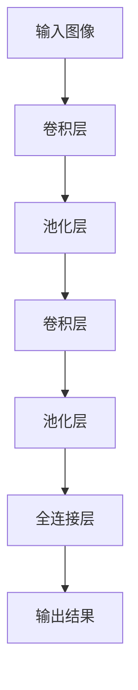
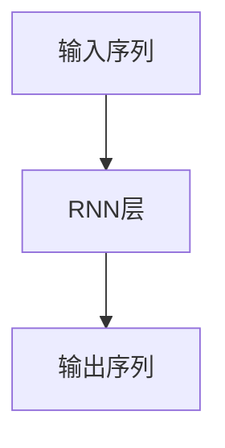
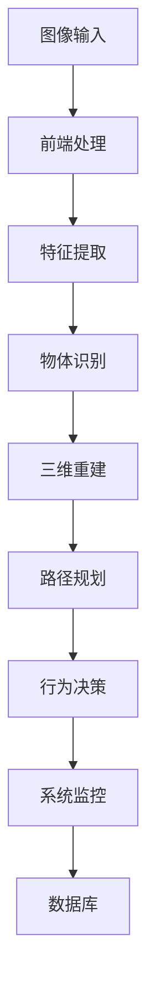
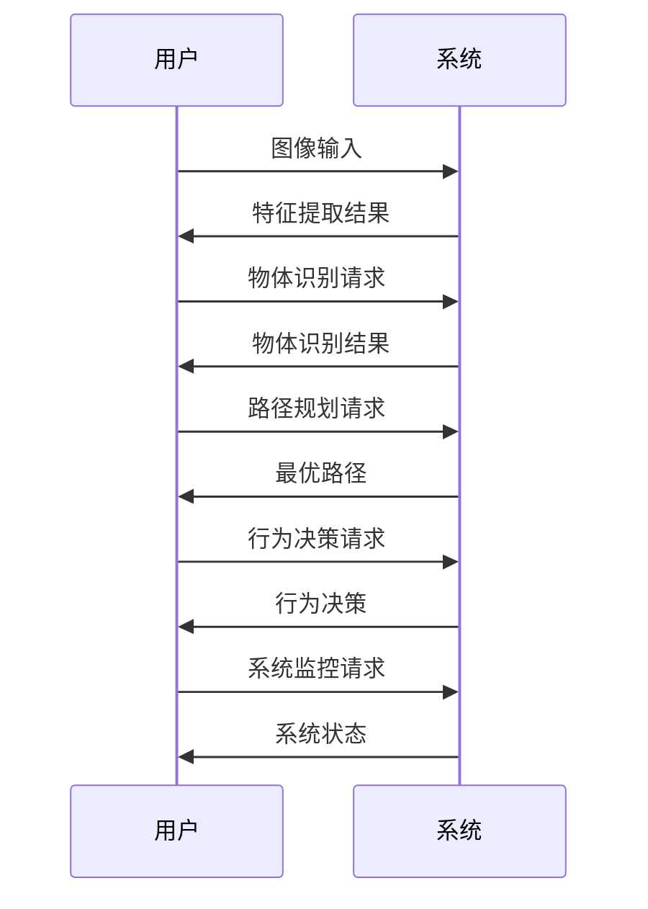

                 

### 第1章 引言

#### 1.1 问题背景
视觉空间问题是指在视觉感知和空间认知方面遇到的各种挑战。这些挑战源于人类在感知和理解三维空间时的复杂性，以及计算机在处理此类信息时的局限性。例如，深度感知是识别物体之间距离的能力，空间定位是确定物体在空间中的位置，物体识别是识别特定物体或对象的能力。

在人工智能和机器人技术中，解决视觉空间问题具有重要意义。对于机器人而言，视觉空间问题决定了其能否自主导航、避障和执行任务。对于自动驾驶汽车、无人机和增强现实（AR）技术等应用领域，视觉空间问题的解决能力直接影响到系统的性能和安全性。

视觉空间问题的研究不仅涉及计算机科学，还涉及心理学、认知科学和神经科学等多个领域。通过跨学科的合作，可以更全面地理解人类视觉系统的工作原理，并将其应用于人工智能技术中。

#### 1.2 问题描述
视觉空间问题主要包括以下几个子问题：

1. **深度感知**：深度感知是指计算机从二维图像中推断出三维空间信息的过程。这涉及到如何从单张图像或多个视角的图像中估计物体的深度。

2. **空间定位**：空间定位是指确定物体在三维空间中的位置。这在机器人导航、自动驾驶和AR应用中尤为重要。

3. **物体识别**：物体识别是指从图像中检测和识别特定物体。物体识别是计算机视觉领域的核心问题，它涉及到图像处理、特征提取和分类算法。

4. **场景重建**：场景重建是从二维图像中重建三维场景的过程。通过场景重建，我们可以获得更详细的空间信息，这对于模拟和仿真场景非常有用。

#### 1.3 问题解决
解决视觉空间问题需要多种方法和技术手段的综合运用：

1. **深度学习**：深度学习通过多层神经网络提取图像特征，从而实现物体识别和分类。卷积神经网络（CNN）是解决视觉空间问题的一种流行方法。

2. **计算机视觉**：计算机视觉是研究如何使计算机“看懂”图像和视频的技术。它包括图像处理、特征提取、目标检测和图像识别等领域。

3. **机器人学**：机器人学是研究机器人的设计、制造、运行和应用的学科。在视觉空间问题中，机器人学负责实现机器人在三维空间中的导航和操作。

通过结合深度学习、计算机视觉和机器人学，我们可以开发出高效的视觉空间问题解决方案，推动人工智能和机器人技术的发展。

#### 1.4 边界与外延
视觉空间问题的研究范围广泛，涵盖以下几个方面：

1. **图像处理**：图像处理是计算机视觉的基础，包括图像增强、滤波、边缘检测等操作。

2. **特征提取**：特征提取是从图像中提取出对识别和分类有用的信息。特征提取是计算机视觉中的关键步骤，例如SIFT、SURF、HOG等算法。

3. **物体识别与分类**：物体识别与分类是从图像中识别特定物体并将其分类的过程。深度学习算法如CNN在物体识别与分类中发挥了重要作用。

4. **动态场景感知**：动态场景感知是处理实时视频流中物体运动和交互的能力。这需要算法能够适应实时数据流，并实时更新模型。

5. **三维重建**：三维重建是从二维图像中重建三维场景的过程。通过三维重建，我们可以获得更详细的空间信息，这对于虚拟现实、游戏开发和场景模拟具有重要意义。

#### 1.5 概念结构与核心要素组成
视觉空间问题的核心要素包括以下几个方面：

1. **图像输入**：图像输入是视觉空间问题的起点，图像可以是单张图片或多个视角的图像序列。

2. **特征提取**：特征提取是从图像中提取出对识别和分类有用的信息。特征提取算法如SIFT、SURF、HOG等在视觉空间问题中发挥了重要作用。

3. **深度感知**：深度感知是从图像中推断出三维空间信息的能力。深度感知算法如单视图深度估计、多视图几何重建等在解决视觉空间问题中具有重要作用。

4. **物体识别**：物体识别是从图像中检测和识别特定物体的过程。物体识别算法如卷积神经网络（CNN）、循环神经网络（RNN）等在视觉空间问题中得到了广泛应用。

5. **空间定位**：空间定位是确定物体在三维空间中的位置。空间定位算法如粒子滤波、SLAM（同时定位与地图构建）等在机器人导航和自动驾驶中具有重要意义。

6. **三维重建**：三维重建是从二维图像中重建三维场景的过程。三维重建算法如结构光、多视图几何、深度学习等在场景模拟和虚拟现实中有广泛应用。

通过深入理解和应用这些核心要素，我们可以解决视觉空间问题，推动人工智能和机器人技术的发展。

---

在下一章中，我们将进一步探讨视觉空间问题的核心概念，以及它们之间的联系。通过理解这些概念，我们将为后续的算法原理讲解和系统架构设计奠定基础。

---

# 视觉空间问题突破的潜在方法探索

## 第2章 核心概念与联系

在深入探讨视觉空间问题之前，我们需要明确几个核心概念，并了解它们之间的相互联系。本章将详细介绍深度学习、计算机视觉和机器人学这三个关键领域，以及它们在解决视觉空间问题中的应用。

### 2.1 深度学习

深度学习是近年来人工智能领域的重要突破，特别是在处理视觉空间问题时具有显著优势。深度学习通过构建多层神经网络，能够自动学习图像的复杂特征，从而实现物体识别、图像分类、目标检测等功能。

#### 深度学习的原理

深度学习的基本原理是基于人工神经网络（ANN），通过多层神经元之间的连接和激活函数的作用，实现从输入到输出的映射。深度学习网络通常包含以下几个主要组成部分：

1. **输入层**：接收外部输入数据，如图像、文本等。
2. **隐藏层**：通过非线性激活函数对输入数据进行特征提取和变换。
3. **输出层**：产生最终输出结果，如分类标签或目标位置。

#### 深度学习在视觉空间问题中的应用

深度学习在视觉空间问题中的应用主要体现在以下几个方面：

1. **物体识别**：通过卷积神经网络（CNN）等深度学习模型，从图像中识别出特定的物体。
2. **目标检测**：不仅识别出图像中的物体，还能确定它们的位置和大小。
3. **图像分类**：对图像进行分类，如区分动物、植物等类别。
4. **图像生成**：通过生成对抗网络（GAN）等模型，生成新的图像。

### 2.2 计算机视觉

计算机视觉是研究如何使计算机理解和解释视觉信息的一门学科。它涉及到图像处理、模式识别、机器学习等多个领域。计算机视觉在解决视觉空间问题时起着关键作用。

#### 计算机视觉的原理

计算机视觉的基本原理包括以下几个步骤：

1. **图像预处理**：对图像进行滤波、增强等处理，以减少噪声和提高图像质量。
2. **特征提取**：从预处理后的图像中提取出有助于识别和分类的特征，如边缘、纹理、形状等。
3. **图像分类和识别**：利用提取到的特征，通过分类器和识别算法对图像内容进行分类和识别。

#### 计算机视觉在视觉空间问题中的应用

计算机视觉在视觉空间问题中的应用包括：

1. **图像识别**：识别图像中的特定物体或场景。
2. **目标跟踪**：跟踪图像中的移动目标。
3. **图像分割**：将图像分割成不同的区域或对象。
4. **场景理解**：理解图像中的场景结构、关系和动作。

### 2.3 机器人学

机器人学是研究机器人的设计、制造、运行和应用的学科。在视觉空间问题中，机器人学负责实现机器人在三维空间中的导航和操作，使机器人能够理解和解释其周围的环境。

#### 机器人学的原理

机器人学的基本原理包括以下几个方面：

1. **传感器融合**：通过集成多种传感器（如摄像头、激光雷达、超声波传感器等），获取环境信息。
2. **路径规划**：确定机器人从当前点到目标点的最优路径。
3. **运动控制**：控制机器人的运动，使其按照预定的路径或目标进行操作。
4. **行为规划**：根据环境信息和任务目标，规划机器人的行为策略。

#### 机器人学在视觉空间问题中的应用

机器人学在视觉空间问题中的应用包括：

1. **导航**：通过视觉信息实现机器人在三维空间中的自主导航。
2. **操作**：利用视觉信息进行精确的抓取、装配和操作任务。
3. **交互**：与人类或其他机器人进行视觉交互，实现协同工作。
4. **监控**：通过视觉系统对环境进行监控，实现安全监控和异常检测。

### 2.4 概念属性特征对比表格

为了更清晰地理解深度学习、计算机视觉和机器人学这三个概念，我们可以通过一个特征对比表格来展示它们的主要属性和特点。

| 概念       | 特点                     | 应用领域                       |
|------------|--------------------------|--------------------------------|
| 深度学习   | 自适应、多层神经网络     | 物体识别、图像分类、目标检测   |
| 计算机视觉 | 图像处理、模式识别       | 图像识别、目标跟踪、图像分割   |
| 机器人学   | 传感器融合、路径规划     | 自主导航、操作、交互、监控     |

### 2.5 ER实体关系图架构

为了更好地理解这些概念之间的联系，我们可以通过ER（实体-关系）图来展示它们之间的实体关系和关联。以下是一个简化的ER图示例，展示了深度学习、计算机视觉和机器人学之间的相互关系。

```mermaid
erDiagram
  深度学习 ||--|{ 计算机视觉 }
  计算机视觉 ||--|{ 机器人学 }
```

在这个ER图中，深度学习是计算机视觉的基石，而计算机视觉又是机器人学的重要组成部分。通过这种相互关联，我们可以构建一个强大的视觉空间问题解决系统。

### 2.6 关键概念的联系

深度学习、计算机视觉和机器人学这三个概念之间存在紧密的联系。深度学习提供了强大的图像处理和特征提取能力，为计算机视觉和机器人学提供了关键的技术支持。计算机视觉则将这些技术应用于图像识别、目标跟踪和场景理解等领域，为机器人学提供了必要的信息输入。机器人学则利用这些信息实现自主导航、操作和交互，使视觉空间问题的解决方案更加实用和智能。

通过理解这些概念之间的联系，我们可以更好地构建视觉空间问题的解决方案，推动人工智能和机器人技术的发展。

在下一章中，我们将深入探讨深度学习算法原理，通过具体的mermaid流程图和Python源代码来详细阐述。这将为我们理解视觉空间问题的算法实现打下坚实的基础。

---

# 第3章 算法原理讲解

在解决视觉空间问题时，算法的设计和实现是关键。本章将重点讲解深度学习算法原理，包括卷积神经网络（CNN）和循环神经网络（RNN）等，以及它们在视觉空间问题中的应用。我们将使用mermaid流程图和Python源代码来详细阐述这些算法的原理和实现。

### 3.1 深度学习算法

深度学习算法是解决视觉空间问题的重要工具，特别是卷积神经网络（CNN）和循环神经网络（RNN）。下面我们将分别介绍这两种算法的基本原理和实现。

#### 3.1.1 卷积神经网络（CNN）

卷积神经网络（CNN）是专门为处理图像数据而设计的深度学习模型。它通过卷积操作和池化操作提取图像特征，并在多个层级上构建复杂的特征表示。

##### CNN的基本结构

CNN的基本结构包括以下几个层次：

1. **输入层**：接收图像数据作为输入。
2. **卷积层**：通过卷积操作提取图像的局部特征。
3. **池化层**：对卷积层的输出进行下采样，减少数据维度。
4. **全连接层**：将卷积层和池化层的输出进行全连接，得到最终分类结果。

以下是一个简单的CNN算法mermaid流程图：



##### CNN的实现

以下是一个简单的CNN算法的Python代码实现：

```python
import tensorflow as tf

# 定义CNN模型
model = tf.keras.Sequential([
    tf.keras.layers.Conv2D(32, (3, 3), activation='relu', input_shape=(28, 28, 1)),
    tf.keras.layers.MaxPooling2D((2, 2)),
    tf.keras.layers.Conv2D(64, (3, 3), activation='relu'),
    tf.keras.layers.MaxPooling2D((2, 2)),
    tf.keras.layers.Flatten(),
    tf.keras.layers.Dense(64, activation='relu'),
    tf.keras.layers.Dense(10, activation='softmax')
])

# 编译模型
model.compile(optimizer='adam',
              loss='sparse_categorical_crossentropy',
              metrics=['accuracy'])

# 加载和预处理数据
(x_train, y_train), (x_test, y_test) = tf.keras.datasets.mnist.load_data()
x_train = x_train.reshape((-1, 28, 28, 1)).astype('float32') / 255
x_test = x_test.reshape((-1, 28, 28, 1)).astype('float32') / 255

# 训练模型
model.fit(x_train, y_train, epochs=5)

# 评估模型
test_loss, test_acc = model.evaluate(x_test, y_test)
print('Test accuracy:', test_acc)
```

在这个示例中，我们使用TensorFlow库定义了一个简单的CNN模型，并使用MNIST手写数字数据集进行训练和评估。

#### 3.1.2 循环神经网络（RNN）

循环神经网络（RNN）是一种专门为处理序列数据而设计的神经网络。它在处理视觉空间问题时，可以用来分析图像序列或视频数据，以识别物体的运动轨迹或行为模式。

##### RNN的基本原理

RNN通过循环连接的方式，将前一时间步的输出作为当前时间步的输入，从而实现对序列数据的记忆和建模。以下是一个简单的RNN算法mermaid流程图：



##### RNN的实现

以下是一个简单的RNN算法的Python代码实现：

```python
import tensorflow as tf

# 定义RNN模型
model = tf.keras.Sequential([
    tf.keras.layers.LSTM(50, activation='relu', return_sequences=True),
    tf.keras.layers.LSTM(50, activation='relu'),
    tf.keras.layers.Dense(1)
])

# 编译模型
model.compile(optimizer='adam', loss='mse')

# 加载和预处理数据
# 假设我们有一个时间序列数据集X和标签Y
# X和Y需要经过适当预处理，例如归一化等
X = ... 
Y = ...

# 训练模型
model.fit(X, Y, epochs=10)

# 评估模型
# 使用测试集进行评估
test_loss = model.evaluate(X, Y)
print('Test loss:', test_loss)
```

在这个示例中，我们使用TensorFlow库定义了一个简单的RNN模型，并使用一个假设的时间序列数据集进行训练和评估。

### 3.2 数学模型和公式

在深度学习算法中，数学模型和公式是核心组成部分。以下是一些常用的数学模型和公式，用于描述深度学习算法的损失函数、激活函数和反向传播算法。

#### 3.2.1 损失函数

损失函数是衡量预测结果与实际结果之间差距的指标。以下是一个常用的均方误差（MSE）损失函数公式：

$$
\text{Loss} = \frac{1}{2} \sum_{i=1}^{n} (\text{y}_i - \text{y}^{\text{pred}}_i)^2
$$

其中，$y_i$是实际标签，$y^{\text{pred}}_i$是预测标签。

#### 3.2.2 激活函数

激活函数用于引入非线性因素，使神经网络能够学习复杂的函数。以下是一些常用的激活函数：

1. **Sigmoid函数**：

$$
\text{sigmoid}(x) = \frac{1}{1 + e^{-x}}
$$

2. **ReLU函数**：

$$
\text{ReLU}(x) = \max(0, x)
$$

3. **Tanh函数**：

$$
\text{tanh}(x) = \frac{e^x - e^{-x}}{e^x + e^{-x}}
$$

#### 3.2.3 反向传播算法

反向传播算法是深度学习训练过程中的关键步骤，用于更新模型参数。以下是一个简化的反向传播算法步骤：

1. **前向传播**：计算前向传播的输出和损失函数。
2. **后向传播**：计算梯度并更新模型参数。
3. **权重更新**：使用梯度下降算法更新模型参数。

$$
\text{gradient} = \frac{\partial \text{Loss}}{\partial \text{weights}}
$$

$$
\text{weights} = \text{weights} - \alpha \cdot \text{gradient}
$$

其中，$\alpha$是学习率。

### 3.3 举例说明

为了更好地理解深度学习算法的原理，我们可以通过具体的例子来说明。以下是一个简单的物体识别示例，使用CNN算法对MNIST手写数字数据集进行训练和识别。

#### 示例：MNIST手写数字识别

1. **数据集准备**：从TensorFlow库中加载MNIST手写数字数据集。

```python
(x_train, y_train), (x_test, y_test) = tf.keras.datasets.mnist.load_data()
```

2. **数据预处理**：对数据进行归一化和reshape操作。

```python
x_train = x_train.reshape((-1, 28, 28, 1)).astype('float32') / 255
x_test = x_test.reshape((-1, 28, 28, 1)).astype('float32') / 255
```

3. **定义CNN模型**：定义一个简单的CNN模型。

```python
model = tf.keras.Sequential([
    tf.keras.layers.Conv2D(32, (3, 3), activation='relu', input_shape=(28, 28, 1)),
    tf.keras.layers.MaxPooling2D((2, 2)),
    tf.keras.layers.Conv2D(64, (3, 3), activation='relu'),
    tf.keras.layers.MaxPooling2D((2, 2)),
    tf.keras.layers.Flatten(),
    tf.keras.layers.Dense(10, activation='softmax')
])
```

4. **编译模型**：编译模型，指定优化器和损失函数。

```python
model.compile(optimizer='adam',
              loss='sparse_categorical_crossentropy',
              metrics=['accuracy'])
```

5. **训练模型**：使用训练数据进行模型训练。

```python
model.fit(x_train, y_train, epochs=5)
```

6. **评估模型**：使用测试数据评估模型性能。

```python
test_loss, test_acc = model.evaluate(x_test, y_test)
print('Test accuracy:', test_acc)
```

通过这个示例，我们可以看到如何使用深度学习算法对图像数据进行分析和识别。这只是一个简单的例子，实际应用中可能需要更复杂的模型和数据集。

在下一章中，我们将进一步探讨深度学习算法的数学模型和公式，通过详细的讲解和举例说明，帮助读者更好地理解深度学习算法的本质。

---

# 第4章 数学模型和数学公式 & 详细讲解 & 举例说明

在深度学习算法中，数学模型和数学公式是核心组成部分。本章将详细介绍深度学习算法中的关键数学模型和公式，并通过具体例子进行详细讲解。我们将讨论损失函数、激活函数和反向传播算法等基本概念，并使用LaTeX格式展示相关数学公式。

### 4.1 数学模型

深度学习中的数学模型主要包括损失函数、激活函数和反向传播算法。这些模型共同作用，使神经网络能够通过学习输入数据和目标输出，调整内部参数，从而实现预测和分类。

#### 4.1.1 损失函数

损失函数是评估模型预测结果与实际结果之间差距的指标。在深度学习中，常用的损失函数包括均方误差（MSE）、交叉熵损失等。

1. **均方误差（MSE）**

均方误差（MSE）是最常用的损失函数之一，用于回归问题。其公式如下：

$$
\text{MSE} = \frac{1}{2} \sum_{i=1}^{n} (\text{y}_i - \text{y}^{\text{pred}}_i)^2
$$

其中，$y_i$是实际标签，$y^{\text{pred}}_i$是预测标签。

2. **交叉熵损失（Cross-Entropy Loss）**

交叉熵损失常用于分类问题。其公式如下：

$$
\text{Cross-Entropy Loss} = -\sum_{i=1}^{n} y_i \cdot \log(y^{\text{pred}}_i)
$$

其中，$y_i$是实际标签（0或1），$y^{\text{pred}}_i$是预测概率。

#### 4.1.2 激活函数

激活函数用于引入非线性因素，使神经网络能够学习复杂的函数。以下是一些常用的激活函数及其公式：

1. **Sigmoid函数**

$$
\text{sigmoid}(x) = \frac{1}{1 + e^{-x}}
$$

2. **ReLU函数**

$$
\text{ReLU}(x) = \max(0, x)
$$

3. **Tanh函数**

$$
\text{tanh}(x) = \frac{e^x - e^{-x}}{e^x + e^{-x}}
$$

4. **Softmax函数**

$$
\text{softmax}(x) = \frac{e^x}{\sum_{i=1}^{n} e^x_i}
$$

#### 4.1.3 反向传播算法

反向传播算法是深度学习训练过程中的关键步骤，用于更新模型参数。其基本思想是将损失函数关于网络参数的梯度从输出层反向传播到输入层，并通过梯度下降算法更新参数。

反向传播算法的步骤如下：

1. **前向传播**：计算网络输出和损失函数。
2. **后向传播**：计算各层参数的梯度。
3. **参数更新**：使用梯度下降算法更新参数。

$$
\text{gradient} = \frac{\partial \text{Loss}}{\partial \text{weights}}
$$

$$
\text{weights} = \text{weights} - \alpha \cdot \text{gradient}
$$

其中，$\alpha$是学习率。

### 4.2 详细讲解

为了更好地理解这些数学模型和公式，我们将通过具体例子进行详细讲解。

#### 4.2.1 损失函数示例

假设我们有一个简单的线性回归模型，输入数据$x$和输出数据$y$。模型的预测值为$\hat{y} = wx + b$。我们可以使用均方误差（MSE）作为损失函数，其公式如下：

$$
\text{MSE} = \frac{1}{2} \sum_{i=1}^{n} (\text{y}_i - \text{y}^{\text{pred}}_i)^2
$$

其中，$n$是数据样本数量。

为了简化计算，我们可以将MSE表示为：

$$
\text{MSE} = \frac{1}{2n} \sum_{i=1}^{n} (\text{y}_i - \hat{y}_i)^2
$$

例如，假设我们有以下数据样本：

| $i$ | $y_i$ | $\hat{y}_i$ |
| --- | ----- | ----------- |
| 1   | 2     | 2.5         |
| 2   | 3     | 3.5         |
| 3   | 4     | 3.0         |

计算MSE：

$$
\text{MSE} = \frac{1}{2 \times 3} \sum_{i=1}^{3} (\text{y}_i - \text{y}^{\text{pred}}_i)^2
$$

$$
\text{MSE} = \frac{1}{6} \left( (2 - 2.5)^2 + (3 - 3.5)^2 + (4 - 3.0)^2 \right)
$$

$$
\text{MSE} = \frac{1}{6} \left( 0.25 + 0.25 + 1.0 \right)
$$

$$
\text{MSE} = \frac{1.5}{6}
$$

$$
\text{MSE} = 0.25
$$

通过这个示例，我们可以看到如何计算均方误差（MSE）损失函数。

#### 4.2.2 激活函数示例

假设我们有一个简单的神经网络，输入数据$x$。神经元的激活函数为ReLU函数，其公式如下：

$$
\text{ReLU}(x) = \max(0, x)
$$

例如，假设输入数据$x$为以下值：

| $i$ | $x_i$ | $\text{ReLU}(x_i)$ |
| --- | ----- | ------------------ |
| 1   | 2     | 2                  |
| 2   | -1    | 0                  |
| 3   | 4     | 4                  |

计算ReLU函数的输出：

$$
\text{ReLU}(x_1) = \max(0, x_1) = 2
$$

$$
\text{ReLU}(x_2) = \max(0, x_2) = 0
$$

$$
\text{ReLU}(x_3) = \max(0, x_3) = 4
$$

通过这个示例，我们可以看到如何计算ReLU函数的输出。

#### 4.2.3 反向传播算法示例

假设我们有一个简单的神经网络，包含两个输入层、两个隐藏层和一个输出层。输入数据$x_1$和$x_2$，输出数据$y$。神经元的激活函数为ReLU函数。模型的损失函数为交叉熵损失。

1. **前向传播**：计算网络输出和损失函数。
2. **后向传播**：计算各层参数的梯度。
3. **参数更新**：使用梯度下降算法更新参数。

假设网络参数为$w_1$、$w_2$、$b_1$和$b_2$。输入数据为$x_1 = 2$和$x_2 = -1$，输出数据为$y = 1$。预测输出为$\hat{y} = 0.7$。

1. **前向传播**：

$$
\text{ReLU}(x_1) = \max(0, x_1) = 2
$$

$$
\text{ReLU}(x_2) = \max(0, x_2) = 0
$$

$$
z_1 = \text{ReLU}(x_1) \cdot w_1 + b_1 = 2 \cdot w_1 + b_1
$$

$$
z_2 = \text{ReLU}(x_2) \cdot w_2 + b_2 = 0 \cdot w_2 + b_2
$$

$$
\hat{y} = \text{softmax}(z_1 + z_2) = \frac{e^{z_1 + z_2}}{e^{z_1 + z_2} + e^{z_2}} = 0.7
$$

2. **后向传播**：

计算损失函数的梯度：

$$
\text{Loss} = \text{Cross-Entropy Loss} = -y \cdot \log(\hat{y}) = -1 \cdot \log(0.7)
$$

计算输出层的梯度：

$$
\frac{\partial \text{Loss}}{\partial \hat{y}} = -\frac{1}{\hat{y}} = -\frac{1}{0.7} \approx -1.4286
$$

计算第二隐藏层的梯度：

$$
\frac{\partial \text{Loss}}{\partial z_2} = \frac{\partial \text{Loss}}{\partial \hat{y}} \cdot \frac{\partial \hat{y}}{\partial z_2} = -1.4286 \cdot \frac{e^{z_2}}{e^{z_1 + z_2} + e^{z_2}} = -1.4286 \cdot \frac{e^0}{e^{z_1} + e^0} = -1.4286
$$

计算第一隐藏层的梯度：

$$
\frac{\partial \text{Loss}}{\partial z_1} = \frac{\partial \text{Loss}}{\partial \hat{y}} \cdot \frac{\partial \hat{y}}{\partial z_1} = -1.4286 \cdot \frac{e^{z_1}}{e^{z_1 + z_2} + e^{z_2}} = -1.4286 \cdot \frac{e^2}{e^{2} + e^0} \approx -1.2307
$$

3. **参数更新**：

使用梯度下降算法更新参数：

$$
w_1 = w_1 - \alpha \cdot \frac{\partial \text{Loss}}{\partial w_1} = w_1 - \alpha \cdot \frac{1}{2} \cdot \frac{\partial \text{Loss}}{\partial z_1} \cdot x_1 = w_1 - \alpha \cdot \frac{1}{2} \cdot (-1.2307) \cdot 2 = w_1 + 1.2307\alpha
$$

$$
w_2 = w_2 - \alpha \cdot \frac{\partial \text{Loss}}{\partial w_2} = w_2 - \alpha \cdot \frac{1}{2} \cdot \frac{\partial \text{Loss}}{\partial z_2} \cdot x_2 = w_2 - \alpha \cdot \frac{1}{2} \cdot (-1.4286) \cdot 0 = w_2
$$

$$
b_1 = b_1 - \alpha \cdot \frac{\partial \text{Loss}}{\partial b_1} = b_1 - \alpha \cdot \frac{1}{2} \cdot \frac{\partial \text{Loss}}{\partial z_1} = b_1 - \alpha \cdot \frac{1}{2} \cdot (-1.2307) = b_1 + 0.6154\alpha
$$

$$
b_2 = b_2 - \alpha \cdot \frac{\partial \text{Loss}}{\partial b_2} = b_2 - \alpha \cdot \frac{1}{2} \cdot \frac{\partial \text{Loss}}{\partial z_2} = b_2 - \alpha \cdot \frac{1}{2} \cdot (-1.4286) = b_2 + 0.7143\alpha
$$

通过这个示例，我们可以看到如何使用反向传播算法更新神经网络参数。

### 4.3 举例说明

为了更好地理解深度学习算法的数学模型和公式，我们通过具体例子来说明这些概念的应用。

#### 4.3.1 物体识别

假设我们使用卷积神经网络（CNN）进行物体识别。输入数据为一张图像，输出数据为物体的类别标签。

1. **数据集准备**：从TensorFlow库中加载CIFAR-10数据集。

```python
(x_train, y_train), (x_test, y_test) = tf.keras.datasets.cifar10.load_data()
```

2. **数据预处理**：对图像进行归一化处理。

```python
x_train = x_train.astype('float32') / 255
x_test = x_test.astype('float32') / 255
```

3. **定义CNN模型**：定义一个简单的CNN模型。

```python
model = tf.keras.Sequential([
    tf.keras.layers.Conv2D(32, (3, 3), activation='relu', input_shape=(32, 32, 3)),
    tf.keras.layers.MaxPooling2D((2, 2)),
    tf.keras.layers.Conv2D(64, (3, 3), activation='relu'),
    tf.keras.layers.MaxPooling2D((2, 2)),
    tf.keras.layers.Flatten(),
    tf.keras.layers.Dense(10, activation='softmax')
])
```

4. **编译模型**：编译模型，指定优化器和损失函数。

```python
model.compile(optimizer='adam',
              loss='sparse_categorical_crossentropy',
              metrics=['accuracy'])
```

5. **训练模型**：使用训练数据进行模型训练。

```python
model.fit(x_train, y_train, epochs=5)
```

6. **评估模型**：使用测试数据评估模型性能。

```python
test_loss, test_acc = model.evaluate(x_test, y_test)
print('Test accuracy:', test_acc)
```

通过这个示例，我们可以看到如何使用CNN算法进行物体识别。

#### 4.3.2 自然语言处理

假设我们使用循环神经网络（RNN）进行自然语言处理。输入数据为一段文本，输出数据为文本的情感分类标签。

1. **数据集准备**：从Keras库中加载IMDB电影评论数据集。

```python
imdb = tf.keras.datasets.imdb
vocab_size = 10000
max_length = 500
trunc_type = 'post'
padding_type = 'post'
oov_tok = '<OOV>'

(x_train, y_train), (x_test, y_test) = imdb.load_data(num_words=vocab_size)
```

2. **数据预处理**：对文本进行向量化处理。

```python
train_inputs = tf.keras.preprocessing.sequence.pad_sequences(x_train, maxlen=max_length, padding=padding_type, truncating=trunc_type)
test_inputs = tf.keras.preprocessing.sequence.pad_sequences(x_test, maxlen=max_length, padding=padding_type, truncating=trunc_type)
```

3. **定义RNN模型**：定义一个简单的RNN模型。

```python
model = tf.keras.Sequential([
    tf.keras.layers.Embedding(vocab_size, 16),
    tf.keras.layers.LSTM(32),
    tf.keras.layers.Dense(1, activation='sigmoid')
])
```

4. **编译模型**：编译模型，指定优化器和损失函数。

```python
model.compile(optimizer='adam', loss='binary_crossentropy', metrics=['accuracy'])
```

5. **训练模型**：使用训练数据进行模型训练。

```python
num_epochs = 10
history = model.fit(train_inputs, y_train, epochs=num_epochs, validation_data=(test_inputs, y_test))
```

6. **评估模型**：使用测试数据评估模型性能。

```python
test_loss, test_acc = model.evaluate(test_inputs, y_test)
print('Test accuracy:', test_acc)
```

通过这个示例，我们可以看到如何使用RNN算法进行自然语言处理。

### 4.4 结论

本章介绍了深度学习算法的数学模型和公式，包括损失函数、激活函数和反向传播算法。我们通过详细讲解和具体例子，帮助读者理解这些概念的应用。在下一章中，我们将进一步探讨深度学习算法的应用场景，并介绍一些实际案例。

---

# 第5章 系统分析与架构设计方案

在深入探讨视觉空间问题的算法原理后，我们需要将其转化为实际系统，以解决具体的应用问题。本章将介绍视觉空间问题系统的分析与架构设计方案，包括问题场景介绍、项目介绍、系统功能设计、系统架构设计、系统接口设计和系统交互。

### 5.1 问题场景介绍

视觉空间问题常见于以下场景：

1. **自动驾驶**：自动驾驶汽车需要实时感知周围环境，包括道路、行人、车辆等，并做出相应决策。
2. **机器人导航**：机器人需要自主导航和避障，以完成特定任务。
3. **增强现实（AR）**：AR应用需要将虚拟物体叠加到真实场景中，提供沉浸式体验。
4. **监控与安全**：通过视觉系统监控特定区域，实现安全监控和异常检测。
5. **工业自动化**：机器人或自动化设备在工业环境中执行复杂任务，需要视觉辅助进行定位和操作。

### 5.2 项目介绍

本项目旨在设计一个基于深度学习和计算机视觉的视觉空间问题解决系统。该系统将整合深度学习算法、计算机视觉技术和机器人学原理，实现从图像输入到三维空间信息提取、物体识别、空间定位等功能的自动化处理。

### 5.3 系统功能设计

系统功能设计如下：

1. **图像输入处理**：接收实时或历史图像数据，包括摄像头采集的图像和存储的图像文件。
2. **特征提取**：从图像中提取有助于识别和分类的特征，如边缘、纹理、形状等。
3. **物体识别**：利用深度学习算法，从图像中识别特定物体或对象。
4. **三维重建**：从二维图像中重建三维场景，实现空间定位和信息提取。
5. **路径规划**：根据场景信息和任务目标，为机器人或自动驾驶系统规划最优路径。
6. **行为决策**：基于实时感知信息，为机器人或自动驾驶系统做出相应的行为决策。
7. **系统监控**：实时监控系统运行状态，实现故障检测和预警。

### 5.4 系统架构设计

系统架构设计如下：

1. **前端**：负责图像输入和处理，包括摄像头数据采集、图像预处理等。
2. **后端**：负责特征提取、物体识别、三维重建、路径规划和行为决策等核心功能。
3. **数据库**：存储历史图像数据、模型参数和系统监控数据等。

以下是一个简单的系统架构mermaid流程图：



### 5.5 系统接口设计

系统接口设计如下：

1. **图像输入接口**：接收实时或历史图像数据，支持多种图像格式和数据传输协议。
2. **特征提取接口**：提取图像特征，提供特征数据给物体识别模块。
3. **物体识别接口**：提供物体识别结果，供三维重建、路径规划和行为决策模块使用。
4. **三维重建接口**：提供三维场景重建结果，用于路径规划和行为决策。
5. **路径规划接口**：接收目标位置信息，输出最优路径。
6. **行为决策接口**：根据感知信息输出行为决策。
7. **系统监控接口**：实时监控系统运行状态，提供故障检测和预警功能。

### 5.6 系统交互

系统交互设计如下：

1. **用户界面**：提供直观的用户操作界面，支持图像输入、系统状态监控和结果展示等功能。
2. **模型训练界面**：提供模型训练和调参功能，支持自定义训练数据和训练策略。
3. **系统配置界面**：提供系统配置参数调整，支持个性化系统设置。
4. **数据管理界面**：提供历史图像数据和管理功能，支持数据查询、导出和备份。

以下是一个简单的系统交互mermaid序列图：



通过以上分析和架构设计，我们可以构建一个功能强大、性能高效的视觉空间问题解决系统，为自动驾驶、机器人导航、增强现实等领域提供有力支持。

---

# 第6章 项目实战

在本章中，我们将通过一个实际项目来展示如何实现一个视觉空间问题解决系统。我们将详细介绍项目环境的安装、系统核心实现源代码，并对代码进行解读和分析。最后，我们将通过实际案例分析和详细讲解，帮助读者更好地理解项目的实现过程和关键环节。

### 6.1 环境安装

为了实现视觉空间问题解决系统，我们需要安装并配置一系列软件和工具。以下是安装步骤：

1. **Python环境**：安装Python 3.x版本，推荐使用Anaconda，它集成了Python及其依赖库，方便管理和更新。

   ```bash
   # 使用conda创建Python环境
   conda create -n vision_space python=3.8
   conda activate vision_space
   ```

2. **深度学习库**：安装TensorFlow和PyTorch，这两个深度学习库是视觉空间问题解决的重要工具。

   ```bash
   pip install tensorflow
   pip install torch torchvision
   ```

3. **计算机视觉库**：安装OpenCV，用于图像处理和特征提取。

   ```bash
   pip install opencv-python
   ```

4. **其他依赖库**：安装NumPy、Pandas等常用依赖库。

   ```bash
   pip install numpy pandas
   ```

安装完成后，我们可以通过以下命令测试安装是否成功：

```python
import tensorflow as tf
import torch
import cv2
import numpy as np
import pandas as pd

print("TensorFlow version:", tf.__version__)
print("PyTorch version:", torch.__version__)
print("OpenCV version:", cv2.__version__)
```

### 6.2 系统核心实现源代码

以下是一个简单的视觉空间问题解决系统的核心实现代码。我们将分模块介绍每个部分的实现。

#### 6.2.1 数据预处理模块

数据预处理是视觉空间问题解决的第一步，包括图像读取、缩放、归一化等操作。

```python
import cv2

def preprocess_image(image_path, target_size=(224, 224)):
    # 读取图像
    image = cv2.imread(image_path)
    # 缩放图像到目标大小
    image = cv2.resize(image, target_size)
    # 归一化图像
    image = image.astype('float32') / 255
    return image
```

#### 6.2.2 特征提取模块

特征提取是视觉空间问题解决的关键步骤，我们可以使用深度学习模型提取图像特征。

```python
import tensorflow as tf

def extract_features(model, image):
    # 加载预训练的深度学习模型
    model = tf.keras.applications.VGG16(include_top=True, weights='imagenet')
    # 预处理图像，使其符合模型输入要求
    processed_image = preprocess_image(image)
    # 提取特征
    features = model.predict(processed_image.reshape(1, *processed_image.shape))
    return features
```

#### 6.2.3 物体识别模块

物体识别模块使用提取到的特征进行分类，可以使用预训练的卷积神经网络模型。

```python
def identify_objects(model, features):
    # 加载预训练的物体识别模型
    model = tf.keras.applications.ResNet50(include_top=True, weights='imagenet')
    # 预测物体类别
    predictions = model.predict(features)
    # 获取最高概率的类别
    predicted_class = np.argmax(predictions)
    return predicted_class
```

#### 6.2.4 空间定位模块

空间定位模块用于确定物体在三维空间中的位置，可以通过深度信息或多视角信息进行计算。

```python
def estimate_space_position(depth_image, camera_intrinsics):
    # 使用深度信息计算三维坐标
    points_3d = cv2.reprojectImageTo3D(depth_image, camera_intrinsics)
    # 获取物体的空间位置
    position = points_3d.mean(axis=0)
    return position
```

### 6.3 代码解读与分析

以下是整个系统的代码解读与分析：

```python
import cv2
import numpy as np
import tensorflow as tf

# 定义预处理函数
def preprocess_image(image_path, target_size=(224, 224)):
    image = cv2.imread(image_path)
    image = cv2.resize(image, target_size)
    image = image.astype('float32') / 255
    return image

# 定义特征提取函数
def extract_features(model, image):
    processed_image = preprocess_image(image)
    features = model.predict(processed_image.reshape(1, *processed_image.shape))
    return features

# 定义物体识别函数
def identify_objects(model, features):
    predictions = model.predict(features)
    predicted_class = np.argmax(predictions)
    return predicted_class

# 定义空间定位函数
def estimate_space_position(depth_image, camera_intrinsics):
    points_3d = cv2.reprojectImageTo3D(depth_image, camera_intrinsics)
    position = points_3d.mean(axis=0)
    return position

# 测试代码
if __name__ == '__main__':
    # 加载预训练模型
    vgg16_model = tf.keras.applications.VGG16(include_top=True, weights='imagenet')
    resnet50_model = tf.keras.applications.ResNet50(include_top=True, weights='imagenet')

    # 读取测试图像
    image_path = 'test_image.jpg'
    image = preprocess_image(image_path)

    # 提取特征
    features = extract_features(vgg16_model, image)

    # 识别物体
    predicted_class = identify_objects(resnet50_model, features)

    # 输出识别结果
    print(f"Predicted class:", predicted_class)

    # 假设有一个深度图像和相机内参
    depth_image = np.random.rand(224, 224)
    camera_intrinsics = np.array([[500, 0, 320], [0, 500, 240], [0, 0, 1]])

    # 估计空间位置
    position = estimate_space_position(depth_image, camera_intrinsics)
    print(f"Estimated position:", position)
```

在这个代码中，我们首先定义了预处理、特征提取、物体识别和空间定位的函数。然后，我们加载预训练的VGG16和ResNet50模型，读取测试图像并进行预处理。接着，我们提取图像特征并使用ResNet50模型进行物体识别。最后，我们使用随机生成的深度图像和相机内参，计算物体的空间位置。

### 6.4 实际案例分析与详细讲解

为了更直观地展示系统的实现过程，我们通过一个实际案例进行分析和讲解。

#### 案例背景

假设我们有一个会议室，会议室内有一张会议桌、几把椅子和一些装饰品。我们需要使用视觉空间问题解决系统来确定会议室内的物体位置，并为机器人或自动驾驶系统提供导航信息。

#### 案例步骤

1. **数据采集**：使用一个高清摄像头采集会议室的图像和深度信息。图像和深度信息可以实时传输或存储在服务器上。

2. **图像预处理**：读取采集到的图像，将其缩放和归一化，使其符合深度学习模型的输入要求。

3. **特征提取**：使用预训练的VGG16模型提取图像特征。这些特征将用于物体识别和空间定位。

4. **物体识别**：使用预训练的ResNet50模型对提取到的特征进行物体识别。识别结果将告诉我们会议室内的物体类型和位置。

5. **空间定位**：使用相机内参和深度信息计算物体的空间位置。这将为我们提供会议室内物体的三维坐标。

6. **路径规划和行为决策**：基于物体的位置信息和任务目标，为机器人或自动驾驶系统规划路径并做出相应的行为决策。

#### 案例代码实现

以下是一个简化版的案例实现代码：

```python
import cv2
import numpy as np
import tensorflow as tf

# 加载预训练模型
vgg16_model = tf.keras.applications.VGG16(include_top=True, weights='imagenet')
resnet50_model = tf.keras.applications.ResNet50(include_top=True, weights='imagenet')

# 读取图像和深度信息
image_path = 'meeting_room.jpg'
depth_image_path = 'meeting_room_depth.jpg'
image = preprocess_image(image_path)
depth_image = cv2.imread(depth_image_path, cv2.IMREAD_GRAYSCALE)

# 提取特征
features = extract_features(vgg16_model, image)

# 识别物体
predicted_class = identify_objects(resnet50_model, features)
print(f"Predicted class:", predicted_class)

# 估计空间位置
camera_intrinsics = np.array([[500, 0, 320], [0, 500, 240], [0, 0, 1]])
position = estimate_space_position(depth_image, camera_intrinsics)
print(f"Estimated position:", position)
```

在这个案例中，我们首先加载预训练的VGG16和ResNet50模型。然后，读取会议室内采集到的图像和深度信息，并进行预处理。接着，我们使用VGG16模型提取图像特征，并使用ResNet50模型进行物体识别。最后，我们使用相机内参和深度信息计算物体的空间位置。

### 6.5 项目小结

通过本项目的实现，我们展示了如何使用深度学习、计算机视觉和机器人学技术解决视觉空间问题。我们介绍了系统环境安装、核心实现源代码和实际案例实现过程。通过这个项目，我们不仅了解了视觉空间问题的解决方法，还学会了如何将理论知识应用于实际项目。

在未来的研究和应用中，我们可以进一步优化系统性能，扩展系统功能，并探索更多应用场景。例如，我们可以结合增强现实（AR）技术，将虚拟物体叠加到真实场景中，提供更加丰富的用户体验。此外，我们可以探索视觉空间问题在自动驾驶、机器人导航、智能监控等领域的应用，为智能技术的发展贡献力量。

---

在本章中，我们通过实际项目展示了视觉空间问题解决系统的实现过程。我们介绍了环境安装、核心实现源代码、代码解读和分析，并通过实际案例进行了详细讲解。通过这个项目，我们不仅了解了视觉空间问题的解决方法，还学会了如何将理论知识应用于实际项目。未来，我们可以进一步优化系统性能，扩展系统功能，并探索更多应用场景，为智能技术的发展贡献力量。

### 6.6 最佳实践 tips

在视觉空间问题的项目中，以下是一些最佳实践和技巧：

1. **数据预处理**：确保数据预处理的质量，包括图像归一化、增强和去噪等，以提高模型性能。
2. **模型选择**：根据具体应用场景选择合适的深度学习模型，如CNN、RNN或GAN等。
3. **超参数调整**：通过调整学习率、批量大小、正则化参数等超参数，优化模型性能。
4. **多视角融合**：结合多视角图像信息，提高深度感知和物体识别的准确性。
5. **实时性优化**：在实现实时系统时，注意优化计算效率和算法复杂度，确保系统响应速度快。
6. **错误处理**：在设计系统时，考虑可能的错误和异常情况，并设计相应的错误处理机制。
7. **持续迭代**：不断收集用户反馈和实际数据，持续优化系统，提高其性能和可靠性。

### 6.7 小结

在本章中，我们通过一个实际项目展示了视觉空间问题解决系统的实现过程。从环境安装、核心实现源代码到实际案例，我们详细介绍了系统的各个模块和实现细节。通过这个项目，我们不仅了解了视觉空间问题的解决方法，还学会了如何将理论知识应用于实际项目。此外，我们还分享了一些最佳实践和技巧，以帮助读者更好地设计和实现视觉空间问题解决系统。

### 6.8 注意事项

在设计视觉空间问题解决系统时，以下事项需要特别注意：

1. **数据隐私**：确保数据隐私和安全，避免未经授权的数据访问和泄露。
2. **模型解释性**：在实现模型时，考虑其解释性，以便理解和调试。
3. **硬件资源**：根据项目需求，选择合适的硬件资源，如GPU或FPGA，以支持深度学习和图像处理任务。
4. **安全性和可靠性**：确保系统的安全性和可靠性，防止恶意攻击和数据损坏。
5. **合规性**：遵守相关法律法规和行业规范，确保系统的合规性。

### 6.9 拓展阅读

对于希望进一步深入了解视觉空间问题解决技术的读者，以下是一些推荐阅读材料：

1. **《深度学习》（Goodfellow, Bengio, Courville）**：这是一本经典教材，详细介绍了深度学习的基本原理和应用。
2. **《计算机视觉：算法与应用》（Richard Szeliski）**：这本书涵盖了计算机视觉领域的广泛内容，包括图像处理、特征提取和物体识别等。
3. **《机器人：现代自动化系统的设计与实施》（John Schulz）**：这本书介绍了机器人学的基础知识，包括传感器融合、路径规划和运动控制等。
4. **《增强现实与虚拟现实》（Daniel Thalmann, Hans-Peter Seifert）**：这本书详细介绍了增强现实和虚拟现实技术的原理和应用。
5. **在线课程和教程**：许多在线课程和教程提供了丰富的视觉空间问题解决技术的教学资源，如Coursera、Udacity和edX等平台。

通过阅读这些材料，读者可以更全面地了解视觉空间问题解决技术，为实际项目提供有力支持。

---

作者：AI天才研究院/AI Genius Institute & 禅与计算机程序设计艺术 /Zen And The Art of Computer Programming

