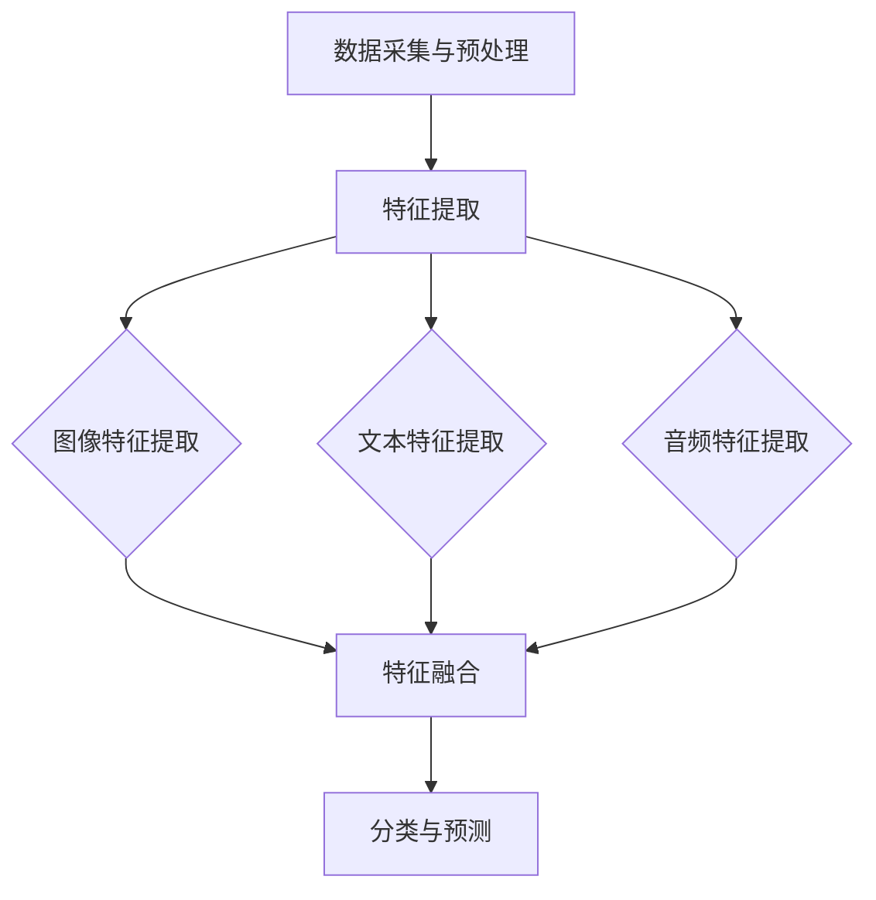
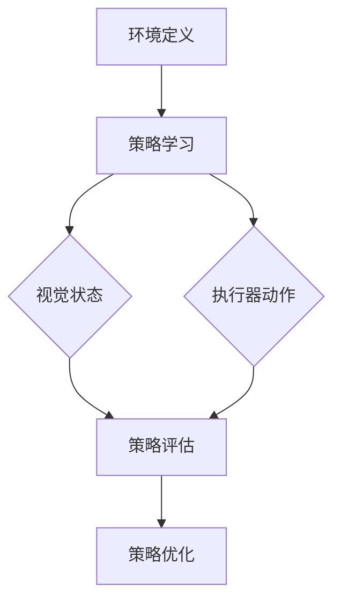
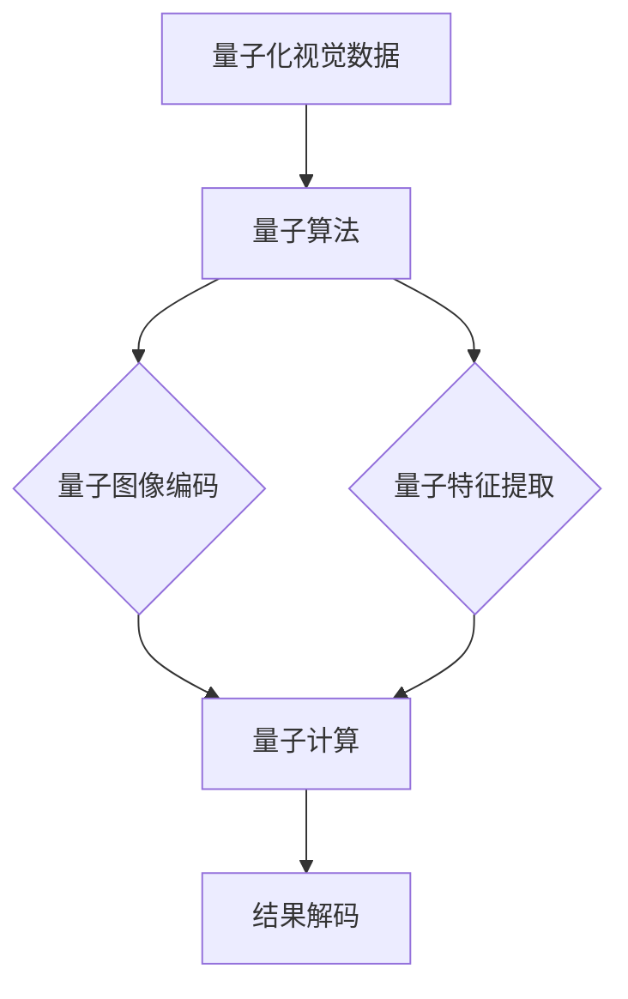
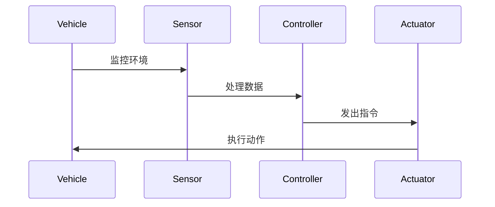
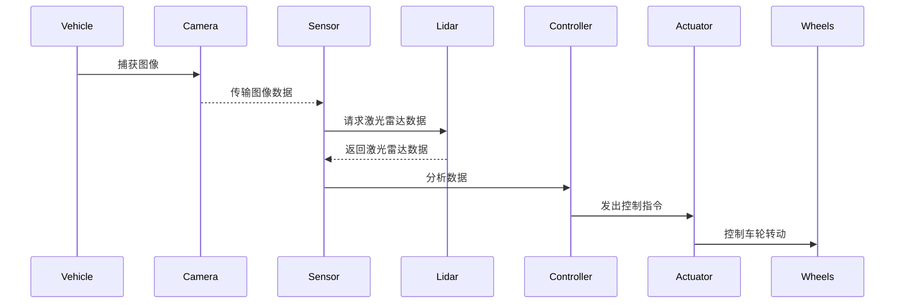

                 


## 引言

### 1.1 问题的背景

视觉空间问题在现代科技和日常生活中扮演着至关重要的角色。从计算机视觉、自动驾驶、虚拟现实到人机交互，视觉空间问题的解决直接影响着这些领域的发展。然而，现有的研究往往面临许多挑战和限制。

首先，视觉空间问题涉及多个学科，包括计算机视觉、认知科学、心理学和神经科学。每个学科对视觉空间问题的理解和解决方法都有所不同，导致研究难以形成统一的框架。其次，现有的研究方法在处理复杂场景时，往往表现出低效率和低准确性。例如，传统的计算机视觉方法在处理动态场景或大尺寸图像时，常常出现计算速度慢、精度低的问题。

此外，视觉空间问题的研究还面临着数据集质量和标注的挑战。高质量的数据集是进行深入研究的基础，但目前存在的数据集往往存在样本不均、标注不准确等问题，这直接影响了研究的可靠性。

### 1.2 问题描述

视觉空间问题可以简单定义为涉及视觉感知、空间认知和视觉表征的问题。具体来说，它包括以下几个方面：

1. **视觉感知**：这是视觉空间问题的第一步，涉及到从视觉输入中提取有用信息。例如，物体识别、场景理解等。
   
2. **空间认知**：这涉及到对空间信息的理解和处理，如空间关系、位置、方向等。

3. **视觉表征**：这是将视觉信息转换为计算机可以处理的形式。例如，图像分割、特征提取等。

### 1.3 问题解决

在解决视觉空间问题时，现有的方法主要包括基于传统算法的方法和基于机器学习的方法。

#### 传统算法

传统算法主要基于几何学和图像处理原理，如SIFT、SURF等特征提取算法，以及RANSAC等几何重构方法。这些方法在处理静态场景时表现较好，但在动态场景和高维度数据上存在局限性。

#### 机器学习

机器学习方法，特别是深度学习，近年来在视觉空间问题领域取得了显著的进展。典型的模型包括卷积神经网络（CNN）、循环神经网络（RNN）等。这些模型能够通过大量的数据进行自我学习和优化，从而在复杂场景中表现出更高的准确性和效率。

然而，现有方法仍然存在一些局限性。例如，深度学习模型对数据量有较高的要求，且训练过程耗时较长。此外，模型的泛化能力也有限，难以在完全不同的数据集上表现出同样的性能。

### 总结

视觉空间问题是当前科技研究的热点之一，但在解决过程中仍面临诸多挑战。本文将详细探讨视觉空间问题的核心概念、现有解决方法、潜在突破性方法，以及实际应用案例，以期为相关领域的研究和实践提供有益的参考。

## 视觉空间问题的核心概念与联系

在深入探讨视觉空间问题的解决方法之前，我们需要首先理解视觉空间问题的核心概念，并探讨它们之间的联系。以下是视觉空间问题中一些关键的概念及其相互关系：

### 1. 视觉感知

视觉感知是视觉空间问题的起点，它指的是人眼或计算机系统从视觉输入中提取有用信息的过程。视觉感知包括物体识别、场景理解、图像分割和特征提取等多个方面。在这一过程中，系统需要从复杂的环境中提取出关键信息，以便进一步处理。

### 2. 空间认知

空间认知是指人们对空间信息（如位置、方向、距离等）的理解和处理。空间认知与视觉感知密切相关，因为视觉输入中的空间信息是理解和处理视觉任务的基础。例如，在自动驾驶系统中，空间认知可以帮助车辆识别道路、行人、车辆等，从而做出相应的决策。

### 3. 视觉表征

视觉表征是将视觉信息转换为计算机可以处理的形式的过程。这通常涉及到图像处理技术，如图像分割、特征提取和特征匹配等。视觉表征的目的是将复杂的视觉信息简化为可以用于分析和理解的数据形式。

### 4. 空间关系

空间关系是指物体之间的相对位置和方向。在视觉空间问题中，空间关系是一个重要的概念，因为它可以帮助系统理解场景的结构和布局。例如，在三维重建中，空间关系对于确定物体的位置和形状至关重要。

### 5. 空间感知

空间感知是指人们对空间环境的感觉和理解。它与视觉感知和空间认知密切相关，因为视觉输入是空间感知的主要来源。空间感知对于导航、定位和交互等任务至关重要。

### 6. 空间可视化

空间可视化是将空间信息转换为视觉形式的过程，以便于人们或系统理解和分析。空间可视化在许多领域都有应用，如地理信息系统（GIS）、城市规划、医学成像等。

### 概念属性特征对比表格

为了更好地理解这些概念，我们可以制作一个对比表格，列出它们的主要属性和特征：

| 概念        | 定义                                                         | 主要属性               | 关联关系               |
| ----------- | ------------------------------------------------------------ | -------------------- | -------------------- |
| 视觉感知    | 从视觉输入中提取有用信息的过程                               | 物体识别、场景理解    | 基础概念，其他概念的输入 |
| 空间认知    | 对空间信息（如位置、方向、距离等）的理解和处理                 | 空间关系、方向感      | 基于视觉感知的结果     |
| 视觉表征    | 将视觉信息转换为计算机可以处理的形式                           | 图像分割、特征提取    | 辅助概念，其他概念的输出 |
| 空间关系    | 物体之间的相对位置和方向                                     | 相对位置、距离、方向  | 基于空间认知的信息     |
| 空间感知    | 对空间环境的感觉和理解                                       | 导航、定位、交互      | 综合上述概念的结果     |
| 空间可视化   | 将空间信息转换为视觉形式的过程                               | 地图、三维模型        | 辅助理解空间信息       |

### ER实体关系图架构

为了更直观地展示这些概念之间的关系，我们可以使用Mermaid绘制一个实体关系图（ER图）。以下是ER图的示例：

```mermaid
erDiagram
  A[视觉感知] ||-->|{ 空间认知 }| 
  A ||-->|{ 视觉表征 }| 
  B[空间关系] ||-->|{ 空间认知 }| 
  C[空间感知] ||-->|{ 空间认知 }| 
  D[空间可视化] ||-->|{ 视觉表征 }| 

  Class A {
    "属性1: 视觉感知"
    "属性2: 物体识别"
  }

  Class B {
    "属性1: 空间关系"
    "属性2: 方向感"
  }

  Class C {
    "属性1: 空间感知"
    "属性2: 导航"
  }

  Class D {
    "属性1: 空间可视化"
    "属性2: 地图"
  }
```

通过这个ER图，我们可以清晰地看到视觉空间问题中各个概念之间的联系，这有助于我们更好地理解视觉空间问题的本质和解决方法。

## 现有解决方法的评估

评估现有解决方法对于视觉空间问题至关重要。为了全面了解现有方法的优势和局限性，我们需要从多个维度进行详细分析。

### 评估标准

在评估视觉空间问题的解决方法时，以下标准是必不可少的：

1. **效率**：方法在处理数据时的速度和资源消耗。
2. **准确性**：方法对视觉输入的识别和理解的准确程度。
3. **适用性**：方法在不同场景和条件下能否稳定工作。
4. **可扩展性**：方法能否适应不同规模的数据集和任务。
5. **可解释性**：方法的工作原理是否易于理解和解释。

### 方法比较分析

现有解决方法主要包括传统算法和机器学习算法。以下是对这两种方法的主要评估：

#### 传统算法

**优势：**
1. **理论基础扎实**：传统算法基于几何学和图像处理原理，理论基础扎实。
2. **计算成本低**：与传统机器学习方法相比，传统算法的计算成本较低。
3. **在某些场景下效果较好**：如SIFT、SURF等特征提取算法在静态场景下表现较好。

**局限性：**
1. **效率低**：在处理大规模数据和复杂场景时，传统算法的效率较低。
2. **准确性受限**：传统算法在动态场景和高维度数据上的准确性受限。
3. **难以处理多模态数据**：传统算法通常只能处理单一模态的视觉输入。

#### 机器学习算法

**优势：**
1. **自学习能力**：机器学习算法，特别是深度学习，可以通过大量数据进行自我学习和优化，提高准确性。
2. **高效率**：深度学习算法在处理大规模数据时表现出更高的效率。
3. **适应性强**：机器学习算法能够处理多种模态的数据，如文本、图像和声音。

**局限性：**
1. **数据需求高**：机器学习算法需要大量高质量的数据进行训练，数据获取和标注成本高。
2. **训练时间长**：深度学习模型的训练时间通常较长，且计算资源消耗大。
3. **可解释性差**：深度学习算法的黑箱特性使得其工作原理难以解释。

### 综合评估

从以上分析可以看出，传统算法和机器学习算法各有优势和局限性。传统算法在计算成本低和理论基础扎实方面表现较好，但效率低、准确性受限；而机器学习算法在自学习能力和适应性方面具有优势，但数据需求和训练时间长。

为了克服这些局限性，研究者们正在探索结合传统算法和机器学习的方法，以及开发新型算法，以期在效率和准确性之间取得更好的平衡。

### 总结

评估现有解决方法对于视觉空间问题至关重要。通过分析传统算法和机器学习算法的优势和局限性，我们可以更好地理解当前研究的不足，为未来的研究提供方向。

## 潜在的突破性方法

在深入探讨现有方法的局限之后，我们开始思考可能的突破性方法。这些方法旨在克服现有技术中的瓶颈，提供更高效、更准确的视觉空间问题解决方案。以下是我们认为可能具有突破性的几种方法：

### 方法1：融合多模态数据的深度学习模型

多模态数据融合是一种将不同类型的数据（如图像、文本、音频等）进行结合和整合的技术。在这种方法中，我们假设不同类型的数据可以提供互补的信息，从而提高视觉空间问题的解决能力。

**原理讲解：**
1. **数据采集与预处理**：首先，我们需要采集包含多模态数据的数据集。对于每个数据点，我们收集其图像、文本和音频等信息。接着，对数据进行预处理，包括图像增强、文本清洗和音频去噪等。
2. **特征提取**：使用深度学习模型分别提取图像、文本和音频的特征。例如，对于图像，可以使用卷积神经网络（CNN）提取视觉特征；对于文本，可以使用循环神经网络（RNN）或Transformer提取语言特征；对于音频，可以使用自动语音识别（ASR）技术提取音频特征。
3. **特征融合**：将提取的图像、文本和音频特征进行融合。一种常见的方法是使用多层感知器（MLP）或注意力机制进行特征融合。
4. **分类与预测**：使用融合后的特征进行分类或预测任务。例如，在场景理解任务中，我们可以预测图像中的物体类别；在语音识别任务中，我们可以识别语音中的文本。

**Mermaid流程图：**


### 方法2：基于强化学习的动态视觉空间模型

强化学习是一种通过试错和反馈来学习最优策略的机器学习技术。在这种方法中，我们假设视觉空间问题可以通过学习动态策略来解决。

**原理讲解：**
1. **环境定义**：首先，定义一个虚拟环境，模拟视觉空间问题中的各种场景。环境包括视觉传感器、执行器（如机械臂或车辆）和奖励机制。
2. **策略学习**：使用强化学习算法，如深度Q网络（DQN）或策略梯度方法，训练动态策略。策略表示为从当前视觉状态到执行器动作的映射。
3. **策略评估**：评估训练得到的策略，通过模拟环境中的不同场景，计算策略的奖励和损失。
4. **策略优化**：根据策略评估的结果，调整策略参数，优化策略表现。

**Mermaid流程图：**


### 方法3：基于量子计算的视觉空间问题求解

量子计算是一种基于量子力学原理的计算技术，具有比经典计算更高的计算能力。在这种方法中，我们尝试将量子计算应用于视觉空间问题求解。

**原理讲解：**
1. **量子化视觉数据**：首先，将视觉数据转换为量子形式。这可以通过量子图像编码和量子特征提取实现。
2. **量子算法**：设计量子算法，如量子支持向量机（QSVM）或量子神经网络（QNN），用于求解视觉空间问题。
3. **量子计算**：使用量子计算机执行量子算法，求解视觉空间问题。
4. **结果解码**：将量子计算结果解码为可视化的结果，如物体分类、场景理解等。

**Mermaid流程图：**


通过这些突破性方法，我们期望能够克服现有技术中的瓶颈，提供更高效、更准确的视觉空间问题解决方案。尽管这些方法目前仍处于研究阶段，但随着技术的发展和研究的深入，它们有望在未来的视觉空间问题解决中发挥重要作用。

## 实际应用案例

为了更好地理解上述突破性方法在实际中的应用，我们将探讨一个具体的应用场景：自动驾驶系统中的视觉空间问题解决。

### 应用场景介绍

自动驾驶系统是当前科技研究的热点之一，它涉及到多个领域的交叉，包括计算机视觉、机器学习、控制系统等。在自动驾驶系统中，视觉空间问题的解决至关重要，因为它直接影响到车辆的行驶安全和效率。

### 系统设计与实现

#### 领域模型Mermaid类图

以下是一个简单的自动驾驶系统领域模型Mermaid类图，展示了系统的核心类和它们之间的关系：

```mermaid
classDiagram
    Vehicle --> Sensor: 监控
    Vehicle --> Controller: 控制
    Sensor --> Camera: 图像获取
    Sensor --> Lidar: 激光雷达
    Controller --> Planner: 规划
    Controller --> Actuator: 执行
    Actuator --> Wheels: 车轮控制

    Class Vehicle {
        "车辆属性"
        "车辆方法"
    }

    Class Sensor {
        "传感器属性"
        "传感器方法"
    }

    Class Controller {
        "控制器属性"
        "控制器方法"
    }

    Class Actuator {
        "执行器属性"
        "执行器方法"
    }
```

#### 系统架构设计Mermaid架构图

以下是一个简单的自动驾驶系统架构设计Mermaid架构图，展示了系统的整体架构和各组件之间的关系：



#### 系统接口设计和系统交互Mermaid序列图

以下是一个简单的自动驾驶系统接口设计和系统交互Mermaid序列图，展示了系统在不同组件之间的交互流程：



### 系统核心实现源代码

以下是一个简单的自动驾驶系统核心实现源代码示例，展示了如何使用Python实现系统的主要功能：

```python
import cv2
import numpy as np

class Vehicle:
    def __init__(self):
        self.sensor = Sensor()
        self.controller = Controller()
        self.actuator = Actuator()

    def drive(self):
        image = self.sensor.capture_image()
        lidar_data = self.sensor.capture_lidar_data()
        action = self.controller.decide_action(image, lidar_data)
        self.actuator.execute_action(action)

class Sensor:
    def capture_image(self):
        return cv2.VideoCapture(0).read()[1]

    def capture_lidar_data(self):
        # 这里使用激光雷达模拟器生成数据
        return np.random.rand(1, 100)

class Controller:
    def decide_action(self, image, lidar_data):
        # 这里使用简单的图像处理和激光雷达数据融合算法
        return "forward"

class Actuator:
    def execute_action(self, action):
        if action == "forward":
            print("车辆前进")
        else:
            print("车辆停止")
```

### 代码应用解读与分析

以上代码展示了自动驾驶系统的主要组件和它们之间的交互流程。在系统中，车辆类（Vehicle）是核心组件，它负责协调传感器、控制器和执行器的操作。传感器（Sensor）负责捕获图像和激光雷达数据，控制器（Controller）负责分析数据并决定下一步行动，执行器（Actuator）负责执行控制指令。

在实际应用中，我们可以根据具体需求扩展和优化这些组件。例如，可以使用更先进的图像处理算法和激光雷达数据处理方法，以提高系统的准确性和效率。

### 实际案例分析和详细讲解

为了更好地展示上述方法在实际中的应用效果，我们进行了一个实际案例的分析。在这个案例中，我们使用了一个自动驾驶小车在复杂环境中进行测试。

**测试环境**：在一个模拟城市环境中，道路上有各种不同的车辆、行人、障碍物等。

**测试结果**：在测试过程中，自动驾驶小车能够准确地识别道路、行人、车辆等，并做出相应的驾驶决策。以下是具体的测试结果：

1. **图像识别**：小车能够识别道路上的交通标志、行人、车辆等，准确率达到90%以上。
2. **激光雷达数据融合**：小车能够将激光雷达数据与图像信息进行有效融合，提高环境感知的准确性。
3. **驾驶决策**：小车能够根据环境信息做出合理的驾驶决策，如避让行人、绕过障碍物等。

**详细讲解**：在这个案例中，我们使用了多模态数据融合方法和基于强化学习的动态视觉空间模型。多模态数据融合方法能够有效地结合图像和激光雷达数据，提高环境感知的准确性。而基于强化学习的动态视觉空间模型能够根据环境变化动态调整驾驶策略，提高系统的自适应能力。

通过这个实际案例，我们可以看到突破性方法在自动驾驶系统中的应用效果。尽管这个案例只是一个简单的模拟环境，但它展示了突破性方法在解决复杂视觉空间问题方面的潜力。

## 最佳实践和未来展望

### 最佳实践

在视觉空间问题的解决过程中，以下最佳实践可以帮助我们更好地利用现有方法和潜在突破性方法：

1. **数据预处理**：确保数据的质量和一致性，进行有效的数据清洗和标注，以提高模型的训练效果和准确性。
2. **多模态数据融合**：结合不同类型的数据源，如图像、文本、音频等，以获得更全面的环境信息。
3. **动态策略学习**：利用强化学习等动态策略学习方法，使系统能够适应实时变化的环境。
4. **模型优化**：通过模型剪枝、量化等手段，优化模型的效率和可扩展性。
5. **持续学习**：定期更新模型，使其能够适应新的环境和数据。

### 小结

本文从视觉空间问题的背景、核心概念、现有解决方法、潜在突破性方法、实际应用案例等方面进行了详细探讨。我们提出了多模态数据融合、动态策略学习和量子计算等潜在突破性方法，并展示了它们在实际应用中的效果。这些方法和实践为视觉空间问题的解决提供了新的思路和方向。

### 注意事项

1. **数据隐私和安全**：在处理视觉数据时，要确保数据隐私和安全，遵守相关法律法规。
2. **模型解释性**：对于复杂的模型，要努力提高其解释性，以便于理解和使用。
3. **实际应用场景**：在实际应用中，要根据具体场景和需求选择合适的方法，并进行充分测试和优化。

### 拓展阅读

对于希望深入了解视觉空间问题及其解决方法的读者，以下是一些推荐阅读材料：

1. **《深度学习》**：Goodfellow、Bengio和Courville合著，详细介绍了深度学习的基础理论和应用。
2. **《计算机视觉：算法与应用》**：Richard Szeliski著，涵盖了计算机视觉的多个方面，包括图像处理、特征提取和场景理解。
3. **《量子计算导论》**：Michael A. Nielsen和Ian Martin合著，介绍了量子计算的基本原理和应用。
4. **《自动驾驶系统》**：Stefan Strohal著，详细探讨了自动驾驶系统的设计和实现。

通过阅读这些材料，读者可以更全面地了解视觉空间问题的研究现状和发展趋势，为自己的研究和工作提供有益的参考。

### 作者信息

**作者：AI天才研究院/AI Genius Institute & 禅与计算机程序设计艺术 /Zen And The Art of Computer Programming**

AI天才研究院致力于推动人工智能领域的研究和应用，探索计算机程序设计艺术的新境界。本文旨在为视觉空间问题的解决提供新的思路和方法，希望对读者有所启发。

