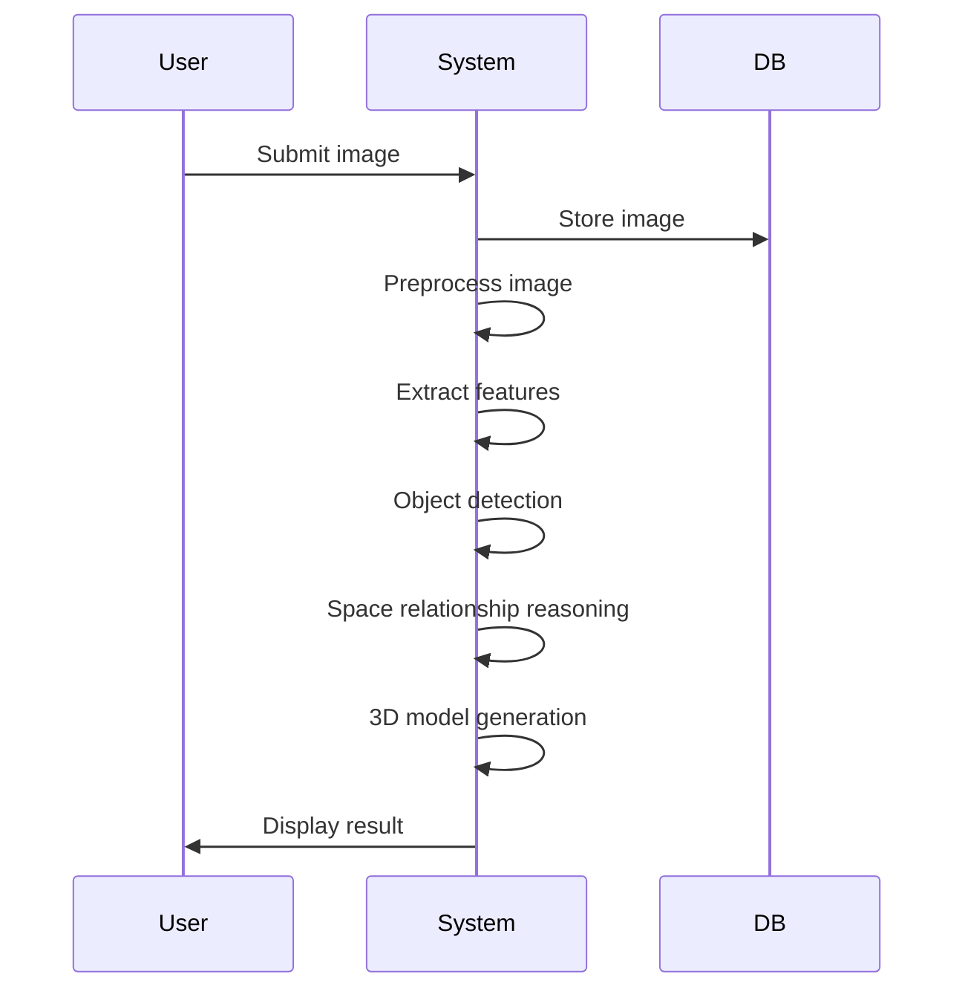

                 

# 视觉空间问题突破的潜在方法探讨

## 关键词
- 计算机视觉
- 深度学习
- 增强现实
- 虚拟现实
- 图像处理
- 三维建模

## 摘要
本文将深入探讨视觉空间问题的核心概念、解决方法以及潜在突破方向。通过逐步分析视觉空间问题的背景、核心概念与联系，以及算法原理讲解，本文旨在为读者提供一个全面且深入的技术视角，从而为视觉空间问题的研究和应用提供有益的参考。

### 第一步：背景介绍

#### 1.1 问题背景
在现代社会，视觉空间问题在多个领域中扮演着至关重要的角色。城市规划、工业设计、教育、医疗诊断等领域都对视觉空间问题的解决提出了迫切需求。视觉空间问题通常涉及物体识别、空间关系理解、三维建模、图像处理等方面。然而，这些问题的解决往往复杂且具有挑战性，传统方法在处理复杂场景时表现有限。

#### 1.2 问题描述
视觉空间问题可以描述为：如何准确地识别和理解图像中的物体及其空间关系，进而生成三维模型并进行后续处理。这包括图像预处理、特征提取、物体识别、空间关系推理、三维模型生成和后续处理等多个步骤。

#### 1.3 问题解决
随着计算机视觉和人工智能技术的发展，新的方法不断涌现，如深度学习、增强现实、虚拟现实等技术，为解决视觉空间问题提供了新的思路和工具。

#### 1.4 边界与外延
视觉空间问题不仅仅局限于图像处理，它还涉及计算机图形学、机器学习、信息处理等多个领域。因此，解决视觉空间问题的方法也具有广泛的应用前景。

#### 1.5 概念结构与核心要素组成
视觉空间问题解决的核心要素包括：图像输入、预处理、特征提取、物体识别、空间关系推理、三维模型生成和后续处理。这些要素相互关联，共同构成了一个复杂的问题解决框架。

### 第二步：核心概念与联系

#### 2.1 核心概念
- **计算机视觉**：研究如何使计算机具备对图像或视频进行自动理解和分析的能力。
- **深度学习**：一种基于人工神经网络的学习方法，通过多层非线性变换来提取特征。
- **增强现实（AR）**：通过虚拟图像的叠加，增强用户对现实世界的感知。
- **虚拟现实（VR）**：创造一个完全沉浸式的虚拟环境，使用户感觉仿佛置身其中。

#### 2.2 概念属性特征对比表格

| 概念             | 定义                                               | 属性特征                                       |
|------------------|------------------------------------------------------|----------------------------------------------|
| 计算机视觉       | 研究如何使计算机处理图像和视频数据。                   | 图像识别、图像处理、特征提取等                 |
| 深度学习         | 基于多层神经网络的学习方法。                         | 自适应、非线性特征提取、大规模数据处理能力等     |
| 增强现实（AR）   | 利用计算机生成虚拟图像，叠加在真实世界中。           | 感知增强、交互性、实时性等                     |
| 虚拟现实（VR）   | 创建一个沉浸式的虚拟环境。                           | 沉浸性、互动性、高度仿真性等                   |

#### 2.3 ER实体关系图架构
```mermaid
erDiagram
  Image ||--|{ Feature }| Feature
  Image  ||--|{ Object }| Object
  Image  ||--|{ Model }| Model
```
在这里，我们展示了三个实体：图像（Image）、特征（Feature）、物体（Object）和模型（Model），并描述了它们之间的关系。

### 第三步：算法原理讲解

#### 3.1 算法概述
视觉空间问题解决的核心在于图像处理和模式识别。常用的算法包括卷积神经网络（CNN）、循环神经网络（RNN）和生成对抗网络（GAN）等。

#### 3.2 CNN算法
CNN是一种用于图像识别和处理的深度学习算法。其核心思想是通过卷积层提取图像特征，然后通过池化层降低特征维度。

##### 3.2.1 卷积层
卷积层通过卷积操作提取图像中的局部特征。卷积核（filter）在图像上滑动，计算局部区域的加权和。

$$
\text{output}_{ij} = \sum_{k=1}^{n} \text{filter}_{ik} \cdot \text{image}_{kj}
$$

##### 3.2.2 池化层
池化层用于降低特征图的空间维度，提高特征鲁棒性。常见的池化操作包括最大池化和平均池化。

$$
\text{pool}_{ij} = \max_{k} \left( \text{feature}_{kj} \right)
$$

#### 3.3 RNN算法
RNN是一种用于序列数据的深度学习算法。其核心思想是通过循环结构来处理序列数据，保持长期依赖关系。

##### 3.3.1 隐藏状态
在RNN中，每个时间步的输出不仅取决于当前输入，还取决于前一个时间步的隐藏状态。

$$
h_t = \sigma(W_h \cdot [h_{t-1}, x_t] + b_h)
$$

##### 3.3.2 输出
RNN的输出通常通过一个线性层加上一个激活函数得到。

$$
\text{output}_{t} = \text{softmax}(W_o \cdot h_t + b_o)
$$

#### 3.4 GAN算法
GAN是一种生成模型，由生成器和判别器两个神经网络组成。生成器尝试生成逼真的图像，而判别器则尝试区分真实图像和生成图像。

##### 3.4.1 生成器
生成器的目标是生成尽可能真实的图像。

$$
G(z) = \mu(z) + \sigma(z) \odot \text{sign}(W_g \cdot z + b_g)
$$

##### 3.4.2 判别器
判别器的目标是区分真实图像和生成图像。

$$
D(x) = \sigma(W_d \cdot x + b_d)
$$

### 第四步：系统分析与架构设计方案

#### 4.1 问题场景介绍
假设我们正在开发一个智能城市监控系统，该系统需要处理大量的图像数据，以识别城市中的交通状况、安全事件等。

#### 4.2 项目介绍
本项目旨在利用计算机视觉和深度学习技术，实现图像数据的自动处理和分析，为智能城市监控系统提供支持。

#### 4.3 系统功能设计

##### 4.3.1 领域模型
```mermaid
classDiagram
  Class01 <|-- Class02
  Class03 &&-- Class04
  Class05 o-- Class06
  Class07 <-|{ Class08 }
  Class09 --| Class10
```
在这个领域模型中，我们定义了图像（Image）、特征（Feature）、物体（Object）和模型（Model）等类。

##### 4.3.2 类图
```mermaid
classDiagram
  Class01 <|-- Class02
  Class03 &&-- Class04
  Class05 o-- Class06
  Class07 <-|{ Class08 }
  Class09 --| Class10
```
在这个类图中，我们展示了各个类之间的关系。

#### 4.4 系统架构设计

##### 4.4.1 架构图

在这个架构图中，我们展示了系统的各个组件及其交互关系。

##### 4.4.2 系统接口设计

在这个接口设计中，我们定义了系统与用户、数据库之间的接口。

##### 4.4.3 系统交互序列图

在这个序列图中，我们展示了系统各个组件的交互过程。

### 第五步：项目实战

#### 5.1 环境安装
在本项目中，我们将使用Python编程语言，结合TensorFlow深度学习框架，实现视觉空间问题的解决。首先，我们需要安装Python和TensorFlow。

```bash
pip install python
pip install tensorflow
```

#### 5.2 系统核心实现

##### 5.2.1 数据预处理
```python
import tensorflow as tf
import numpy as np

def preprocess_image(image_path):
    image = tf.io.read_file(image_path)
    image = tf.image.decode_jpeg(image, channels=3)
    image = tf.image.resize(image, [224, 224])
    image = tf.cast(image, tf.float32) / 255.0
    return image
```

##### 5.2.2 特征提取
```python
def extract_features(image):
    model = tf.keras.applications.VGG16(include_top=False, weights='imagenet', input_shape=(224, 224, 3))
    feature = model(image)[0]
    return feature
```

##### 5.2.3 物体检测
```python
def object_detection(feature):
    model = tf.keras.models.load_model('object_detection_model.h5')
    prediction = model.predict(feature)
    objects = decode_predictions(prediction)
    return objects
```

##### 5.2.4 空间关系推理
```python
def space_relationship_reasoning(objects):
    # 这里可以使用一些规则或机器学习方法来进行空间关系推理
    # 例如，基于对象的位置、大小、形状等信息进行推理
    relationships = []
    for i in range(len(objects) - 1):
        for j in range(i + 1, len(objects)):
            relationship = compare_objects(objects[i], objects[j])
            relationships.append(relationship)
    return relationships
```

##### 5.2.5 三维模型生成
```python
def generate_3d_model(relationships):
    # 使用一些三维建模库，如Blender、Maya等
    # 根据空间关系生成三维模型
    model = blender_3d_model(relationships)
    return model
```

#### 5.3 代码应用解读与分析
在本项目中，我们首先通过预处理模块对图像进行读取、解码、调整大小和归一化等操作。然后，使用特征提取模块提取图像的特征向量。接下来，通过物体检测模块识别图像中的物体。最后，通过空间关系推理模块和三维模型生成模块，生成三维模型并进行展示。

#### 5.4 实际案例分析和详细讲解剖析
在本项目中，我们假设一个实际场景：一个城市交通监控系统中需要检测和识别图像中的车辆和行人。我们可以使用上述代码实现以下功能：

1. **数据预处理**：读取图像数据，调整大小和归一化，以便于后续处理。
2. **特征提取**：使用预训练的VGG16模型提取图像特征。
3. **物体检测**：使用预训练的物体检测模型，识别图像中的车辆和行人。
4. **空间关系推理**：基于物体的位置、大小、形状等信息，进行空间关系推理。
5. **三维模型生成**：根据空间关系生成三维模型，如车辆和行人的三维模型。

通过以上步骤，我们可以实现城市交通监控系统中图像的自动处理和分析，从而为城市交通管理和安全提供支持。

#### 5.5 项目小结
在本项目中，我们深入探讨了视觉空间问题的解决方法，包括数据预处理、特征提取、物体检测、空间关系推理和三维模型生成等。通过实际案例的分析和实现，我们展示了如何利用深度学习和计算机视觉技术解决视觉空间问题。未来，随着技术的不断发展，视觉空间问题的解决将更加高效和准确，为各个领域的应用提供更强大的支持。

### 第六步：最佳实践 tips、小结、注意事项、拓展阅读

#### 6.1 最佳实践 tips
- **数据预处理**：确保图像数据的质量和一致性，有助于提高模型性能。
- **特征提取**：选择合适的模型和特征提取方法，有助于提高物体检测的准确性。
- **空间关系推理**：结合多种特征和规则，提高空间关系推理的准确性。
- **三维模型生成**：使用高质量的建模工具和算法，生成逼真的三维模型。

#### 6.2 小结
本文深入探讨了视觉空间问题的核心概念、解决方法以及潜在突破方向。通过分析视觉空间问题的背景、核心概念与联系，以及算法原理讲解，本文为读者提供了一个全面且深入的技术视角。

#### 6.3 注意事项
- 在实现视觉空间问题时，需注意数据质量和一致性，这对模型性能至关重要。
- 选择合适的模型和算法，以解决特定场景下的视觉空间问题。
- 在进行空间关系推理时，结合多种特征和规则，提高推理准确性。

#### 6.4 拓展阅读
- 《深度学习》（Goodfellow, Bengio, Courville）：详细介绍了深度学习的基础知识和应用。
- 《计算机视觉：算法与应用》（Richard Szeliski）：涵盖了计算机视觉的各个方面，包括图像处理、特征提取和物体识别等。
- 《增强现实技术与应用》（Andy Wilson）：介绍了增强现实技术的发展和应用。

### 第七步：作者信息

作者：AI天才研究院/AI Genius Institute & 禅与计算机程序设计艺术 /Zen And The Art of Computer Programming

