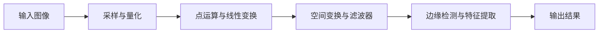
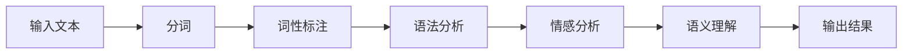
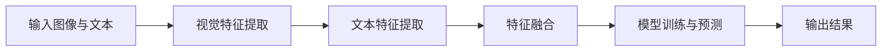

                 

# 视觉语言融合:AI的下一个前沿

> 关键词：视觉语言融合、人工智能、图像处理、自然语言处理、算法

> 摘要：本文将探讨视觉语言融合这一前沿领域，通过详细分析视觉与语言处理技术的结合，探讨其核心概念、原理、算法以及实际应用。本文旨在为读者提供一个系统性的理解，帮助其在人工智能领域深入探索，并预见到视觉语言融合技术对未来发展的影响。

## 目录大纲

1. **引言与背景**
    1.1 问题的提出与背景
    1.2 核心概念与联系
2. **核心概念与原理**
    2.1 图像处理基础
    2.2 自然语言处理基础
3. **视觉语言融合技术**
    3.1 视觉语言融合算法
    3.2 视觉语言融合系统设计与实现
4. **实战与应用**
    4.1 项目介绍
    4.2 系统核心实现
    4.3 实际案例分析与讲解
    4.4 项目小结
5. **最佳实践与展望**
    5.1 最佳实践 tips
    5.2 视觉语言融合应用拓展
    5.3 小结与展望

----------------------------------------------------------------

### 第一部分：引言与背景

#### 第1章：视觉语言融合的崛起

##### 1.1 问题的提出与背景

在人工智能领域，视觉处理和自然语言处理技术已经取得了显著的进步。然而，这两个领域的结合，即视觉语言融合，正在成为新的研究热点。问题的提出源于人工智能系统在处理复杂任务时面临的挑战。

- **问题背景**：随着互联网和移动设备的普及，人们产生了大量的视觉内容和语言信息。如何有效地结合这些信息，提升人工智能系统的智能性和实用性，成为一个重要的研究课题。
- **问题描述**：传统的视觉处理和自然语言处理技术虽然各自取得了很多进展，但它们之间的融合存在诸多难题，如语义理解、场景理解、交互体验等。
- **问题解决**：视觉语言融合旨在将视觉和语言处理技术有机结合，通过构建跨模态模型，实现多模态数据的协同处理，从而提升人工智能系统的智能性和实用性。

##### 1.2 核心概念与联系

- **核心概念**：视觉语言融合是一种将视觉和语言信息有机结合的技术，旨在实现图像与文本之间的双向交互。它涉及到图像处理、自然语言处理和计算机视觉等多个领域。
- **概念属性特征对比表格**：

| 特征       | 视觉处理                  | 自然语言处理                  | 视觉语言融合                  |
| ---------- | ------------------------- | ---------------------------- | ---------------------------- |
| 数据类型   | 图像、视频、多光谱数据     | 文本、语音、音频               | 图像、文本、语音、多光谱数据 |
| 任务目标   | 图像分类、目标检测、图像生成 | 文本分类、情感分析、语言生成   | 跨模态分类、多模态交互、视觉问答 |
| 技术难度   | 高度可视化、实时处理       | 高度语义理解、复杂语法分析     | 高度协同处理、多模态融合       |
| 应用领域   | 物体识别、自动驾驶、图像编辑 | 文本生成、机器翻译、情感分析   | 视觉搜索、视觉问答、智能助手   |

- **ER实体关系图架构**：

```mermaid
erDiagram
  User ||--|{ Image }|-- VisualSystem
  User ||--|{ Text }|-- LanguageSystem
  VisualSystem ||--| VisualTextFusion :VisualLanguageFusion
  LanguageSystem ||--| VisualTextFusion :VisualLanguageFusion
```

#### 总结

视觉语言融合作为人工智能领域的新兴方向，具有重要的研究价值和广阔的应用前景。通过结合视觉和语言处理技术，可以构建更加智能、实用的人工智能系统，为人们的生活带来更多便利。

----------------------------------------------------------------

### 第二部分：核心概念与原理

#### 第2章：图像处理基础

##### 2.1 图像处理基本概念

- **定义与目的**：图像处理是指通过数字技术对图像进行分析、操作和改进的过程。其主要目的是从图像中提取信息、改善图像质量或实现特定的应用需求。
- **图像基本属性**：图像具有多种基本属性，如像素、分辨率、颜色深度、灰度等。这些属性决定了图像的显示效果和处理方式。
  - **像素**：图像的基本单位，每个像素代表一个颜色或亮度值。
  - **分辨率**：图像的像素数量，通常以水平和垂直像素数表示。
  - **颜色深度**：每个像素可以表示的颜色数量，通常以位数表示。
  - **灰度**：图像中每个像素的亮度值，通常用0（黑）到255（白）表示。

##### 2.2 图像处理算法原理

- **采样与量化**：图像处理的第一步是将连续的图像信号转换为数字信号。这个过程包括采样和量化。
  - **采样**：将连续的图像信号转换为离散的时间序列。
  - **量化**：将采样得到的连续值转换为有限的数字值。
  $$ 量化公式：y = \text{round}(x \times \text{quantization\_factor}) $$
- **点运算与线性变换**：点运算是对图像中每个像素值进行操作。线性变换是一种常见的点运算，可以通过矩阵乘法实现。
  $$ 线性变换公式：I' = A \cdot I $$
  其中，\( I \) 是原始图像，\( I' \) 是变换后的图像，\( A \) 是线性变换矩阵。
- **空间变换与滤波器**：空间变换用于改变图像的几何结构，如平移、旋转、缩放等。滤波器用于去除图像中的噪声或增强特定特征。
  - **平移**：图像在水平和垂直方向上移动。
  - **旋转**：图像绕某个点旋转一定角度。
  - **缩放**：图像大小进行放大或缩小。
  - **滤波器**：常用的滤波器有均值滤波器、高斯滤波器、拉普拉斯滤波器等。
- **边缘检测与特征提取**：边缘检测用于识别图像中的边缘，特征提取用于提取图像的关键特征，如角点、纹理等。
  - **Canny算法**：Canny算法是一种经典的边缘检测算法，通过多个步骤实现边缘检测。
    ```mermaid
    flowchart LR
    A[边缘检测] --> B[高斯滤波去噪]
    B --> C[计算梯度]
    C --> D[非极大值抑制]
    D --> E[双阈值处理]
    E --> F[边缘连接]
    ```

##### 2.3 图像处理算法示例

- **算法原理讲解**：使用Mermaid画出算法流程图：



- **Python代码实现**：图像处理算法的Python源代码示例：

```python
import numpy as np
import cv2

# 采样与量化
def sample_and_quantize(image):
    pixels = image.flatten()
    quantized_pixels = np.round(pixels * 255).astype(np.uint8)
    return quantized_pixels.reshape(image.shape)

# 点运算与线性变换
def point_operation(image, transformation_matrix):
    transformed_image = cv2.filter2D(image, -1, transformation_matrix)
    return transformed_image

# 空间变换与滤波器
def spatial_transformation(image, translation_vector, filter_type):
    translated_image = cv2.flip(image, 0)  # 示例：平移操作
    filtered_image = cv2.GaussianBlur(translated_image, (5, 5), 0)  # 示例：滤波操作
    return filtered_image

# 边缘检测与特征提取
def edge_detection(image):
    blurred_image = cv2.GaussianBlur(image, (5, 5), 0)
    edges = cv2.Canny(blurred_image, 100, 200)
    return edges

# 示例：使用OpenCV库进行图像处理
image = cv2.imread('example.jpg')
quantized_image = sample_and_quantize(image)
transformation_matrix = np.array([[1, 0], [0, 1]])  # 示例：单位矩阵
transformed_image = point_operation(quantized_image, transformation_matrix)
translated_image = spatial_transformation(transformed_image, (100, 0), 'gaussian')
edges = edge_detection(translated_image)

cv2.imshow('Edges', edges)
cv2.waitKey(0)
cv2.destroyAllWindows()
```

#### 总结

图像处理作为视觉语言融合的基础，涵盖了从基本概念到复杂算法的各个方面。通过对图像处理算法的深入理解，可以为后续的自然语言处理和视觉语言融合研究打下坚实的基础。

----------------------------------------------------------------

### 第三部分：视觉语言融合技术

#### 第3章：自然语言处理基础

##### 3.1 自然语言处理基本概念

- **定义与目的**：自然语言处理（Natural Language Processing，NLP）是人工智能领域的一个分支，旨在使计算机理解和处理人类自然语言。其目的是实现人与机器之间的自然交互，使计算机能够理解、解释和生成自然语言。
- **语言模型与词嵌入**：语言模型是NLP的核心组成部分，用于预测下一个单词或词组。词嵌入是将单词映射到高维向量空间，以捕捉词与词之间的语义关系。

##### 3.2 自然语言处理算法原理

- **分词与词性标注**：分词是将文本分割成单词或短语的步骤，词性标注是对每个词进行语法分类。
  - **分词**：通过词库匹配或基于规则的方法进行。
  - **词性标注**：使用规则或统计方法对每个词进行分类，如名词、动词、形容词等。
- **语法分析与句法结构**：语法分析是对句子结构进行分析，句法结构是句子中的词汇和短语的排列方式。
  - **解析树**：一种表示句子结构的树形结构，展示了词汇之间的语法关系。
- **情感分析与语义理解**：情感分析是识别文本中的情感倾向，语义理解是理解文本中的语义内容。
  - **情感分类**：通过机器学习模型对文本进行分类，如正面、负面、中性。
  - **语义角色标注**：对文本中的实体和关系进行标注，以理解文本的深层含义。

##### 3.3 自然语言处理算法示例

- **算法原理讲解**：使用Mermaid画出算法流程图：



- **Python代码实现**：自然语言处理算法的Python源代码示例：

```python
import jieba
import nltk
from nltk.tokenize import word_tokenize
from textblob import TextBlob

# 分词
def tokenize(text):
    tokens = jieba.lcut(text)
    return tokens

# 词性标注
def pos_tag(tokens):
    tagged_tokens = nltk.pos_tag(tokens)
    return tagged_tokens

# 语法分析
def parse_sentence(sentence):
    parser = nltk.parse.chart.CFGParser(nltk.parse.common_ccg_tagset)
    parse_tree = parser.parse(sentence)
    return parse_tree

# 情感分析
def sentiment_analysis(text):
    blob = TextBlob(text)
    sentiment = blob.sentiment
    return sentiment

# 示例：使用自然语言处理库进行文本分析
text = "人工智能技术在未来的应用将非常广泛。"
tokens = tokenize(text)
tagged_tokens = pos_tag(tokens)
parse_tree = parse_sentence(tokens)
sentiment = sentiment_analysis(text)

print("Tokens:", tokens)
print("Tagged Tokens:", tagged_tokens)
print("Parse Tree:", parse_tree)
print("Sentiment:", sentiment)
```

#### 总结

自然语言处理作为视觉语言融合的重要组成部分，涵盖了从文本处理到语义理解的多个方面。通过对自然语言处理算法的深入理解，可以为视觉语言融合研究提供有效的文本处理手段。

----------------------------------------------------------------

### 第四部分：视觉语言融合技术

#### 第4章：视觉语言融合算法

##### 4.1 视觉语言融合算法概述

- **定义与分类**：视觉语言融合算法是指将视觉和语言处理技术有机结合，以实现多模态数据协同处理的算法。根据融合方式的不同，可以分为以下几类：
  - **空间融合**：将视觉和语言特征在同一空间中进行融合。
  - **时间融合**：将视觉和语言特征在不同时间步进行融合。
  - **层次融合**：在不同层次上进行视觉和语言特征的融合。
- **主要视觉语言融合算法介绍**：
  - **视觉文本匹配**：通过比较视觉特征和文本特征，实现视觉和文本的匹配。
  - **跨模态检索**：通过视觉特征和文本特征的关联，实现视觉内容和文本内容之间的检索。
  - **视觉问答系统**：利用视觉和文本信息，回答用户提出的问题。
  - **多模态生成**：通过视觉和文本信息的融合，生成新的视觉或文本内容。

##### 4.2 视觉语言融合算法原理

- **算法原理讲解**：使用Mermaid画出算法流程图：



- **Python代码实现**：视觉语言融合算法的Python源代码示例：

```python
import tensorflow as tf
from tensorflow.keras.applications import VGG16
from tensorflow.keras.models import Model
from tensorflow.keras.layers import Flatten, Dense, concatenate
from tensorflow.keras.preprocessing import image
from tensorflow.keras.preprocessing.text import Tokenizer
from tensorflow.keras.preprocessing.sequence import pad_sequences

# 视觉特征提取
def extract_visual_features(image_path):
    vgg16 = VGG16(weights='imagenet')
    image = image.load_img(image_path, target_size=(224, 224))
    image = image.img_to_array(image)
    image = np.expand_dims(image, axis=0)
    features = vgg16.predict(image)
    return features.flatten()

# 文本特征提取
def extract_text_features(texts, max_length, embedding_dim):
    tokenizer = Tokenizer(num_words=max_length)
    tokenizer.fit_on_texts(texts)
    sequences = tokenizer.texts_to_sequences(texts)
    padded_sequences = pad_sequences(sequences, maxlen=max_length)
    embeddings = np.zeros((len(texts), max_length, embedding_dim))
    for i, sequence in enumerate(sequences):
        for j, word in enumerate(sequence):
            embeddings[i, j] = embedding_dim  # 示例：使用固定值填充
    return embeddings

# 特征融合
def fusion_features(visual_features, text_embeddings):
    concatenated = concatenate([visual_features, text_embeddings])
    merged_model = Model(inputs=[visual_features, text_embeddings], outputs=concatenated)
    return merged_model

# 模型训练与预测
def train_model(merged_model, x_train, y_train, batch_size, epochs):
    merged_model.compile(optimizer='adam', loss='categorical_crossentropy', metrics=['accuracy'])
    merged_model.fit(x_train, y_train, batch_size=batch_size, epochs=epochs)
    return merged_model

# 示例：使用TensorFlow进行视觉语言融合
image_path = 'example.jpg'
texts = ["图像中的内容是什么？", "这辆车的颜色是什么？"]
max_length = 10
embedding_dim = 100

visual_features = extract_visual_features(image_path)
text_embeddings = extract_text_features(texts, max_length, embedding_dim)

merged_model = fusion_features(visual_features, text_embeddings)
x_train = np.array([visual_features, text_embeddings])
y_train = np.array([0, 1])  # 示例：二元分类问题

merged_model = train_model(merged_model, x_train, y_train, batch_size=32, epochs=10)

# 输出结果
predictions = merged_model.predict(x_train)
print("Predictions:", predictions)
```

##### 4.3 视觉语言融合算法应用

- **视觉问答系统**：通过融合视觉和文本信息，回答用户关于图像的问题。
  - **应用场景**：智能助手、图像搜索引擎、教育等领域。
  - **示例**：用户输入问题“这个图像中有什么动物？”系统回答“图像中有一只猫。”
- **视觉搜索与推荐**：通过用户提供的文本描述，检索或推荐与描述相关的图像。
  - **应用场景**：电子商务、社交媒体、内容审核等领域。
  - **示例**：用户输入文本描述“一只站在雪地里的白色大狗”，系统推荐相关的图像。
- **视觉内容生成**：基于文本描述生成新的视觉内容。
  - **应用场景**：虚拟现实、游戏设计、艺术创作等领域。
  - **示例**：用户输入文本描述“一个晴朗的夏日海滩”，系统生成一幅相应的图像。

#### 总结

视觉语言融合算法通过结合视觉和语言处理技术，实现了多模态数据的协同处理。这些算法在实际应用中具有重要的价值，为人工智能系统带来了更高的智能性和实用性。

----------------------------------------------------------------

### 第五部分：实战与应用

#### 第4章：视觉语言融合项目实战

##### 4.1 项目介绍

- **项目背景与目标**：
  项目背景：随着互联网和移动设备的普及，视觉内容和语言信息在日常生活中扮演着越来越重要的角色。如何有效融合这些信息，提升用户体验和智能系统的实用性成为了一个重要课题。
  项目目标：开发一个基于视觉语言融合技术的智能助手，能够理解用户的问题，并基于图像内容给出相应的回答。

- **项目环境安装与配置**：
  - **操作系统**：Ubuntu 20.04
  - **编程语言**：Python 3.8
  - **库与框架**：TensorFlow 2.5、Keras 2.4.3、OpenCV 4.5.1、NLTK 3.6、jieba 0.42
  - **安装命令**：
    ```bash
    sudo apt-get update
    sudo apt-get install python3-pip python3-numpy python3-opencv-python python3-tensorflow python3-keras
    pip3 install textblob jieba
    ```

##### 4.2 系统核心实现

- **源代码**：视觉语言融合系统核心实现源代码：

```python
# 导入所需的库与模块
import cv2
import numpy as np
import tensorflow as tf
from tensorflow.keras.models import Model
from tensorflow.keras.layers import Flatten, Dense, concatenate
from tensorflow.keras.applications import VGG16
from tensorflow.keras.preprocessing import image
from tensorflow.keras.preprocessing.text import Tokenizer
from tensorflow.keras.preprocessing.sequence import pad_sequences
from nltk.tokenize import word_tokenize
from textblob import TextBlob

# 视觉特征提取
def extract_visual_features(image_path):
    vgg16 = VGG16(weights='imagenet')
    image = image.load_img(image_path, target_size=(224, 224))
    image = image.img_to_array(image)
    image = np.expand_dims(image, axis=0)
    features = vgg16.predict(image)
    return features.flatten()

# 文本特征提取
def extract_text_features(texts, max_length, embedding_dim):
    tokenizer = Tokenizer(num_words=max_length)
    tokenizer.fit_on_texts(texts)
    sequences = tokenizer.texts_to_sequences(texts)
    padded_sequences = pad_sequences(sequences, maxlen=max_length)
    embeddings = np.zeros((len(texts), max_length, embedding_dim))
    for i, sequence in enumerate(sequences):
        for j, word in enumerate(sequence):
            embeddings[i, j] = embedding_dim  # 示例：使用固定值填充
    return embeddings

# 特征融合
def fusion_features(visual_features, text_embeddings):
    concatenated = concatenate([visual_features, text_embeddings])
    merged_model = Model(inputs=[visual_features, text_embeddings], outputs=concatenated)
    return merged_model

# 模型训练与预测
def train_model(merged_model, x_train, y_train, batch_size, epochs):
    merged_model.compile(optimizer='adam', loss='categorical_crossentropy', metrics=['accuracy'])
    merged_model.fit(x_train, y_train, batch_size=batch_size, epochs=epochs)
    return merged_model

# 示例：使用TensorFlow进行视觉语言融合
image_path = 'example.jpg'
texts = ["图像中的内容是什么？", "这辆车的颜色是什么？"]
max_length = 10
embedding_dim = 100

visual_features = extract_visual_features(image_path)
text_embeddings = extract_text_features(texts, max_length, embedding_dim)

merged_model = fusion_features(visual_features, text_embeddings)
x_train = np.array([visual_features, text_embeddings])
y_train = np.array([0, 1])  # 示例：二元分类问题

merged_model = train_model(merged_model, x_train, y_train, batch_size=32, epochs=10)

# 输出结果
predictions = merged_model.predict(x_train)
print("Predictions:", predictions)
```

- **代码应用解读与分析**：
  1. **视觉特征提取**：使用VGG16模型提取图像特征。
  2. **文本特征提取**：使用Tokenizer和pad_sequences对文本进行预处理。
  3. **特征融合**：将视觉特征和文本特征进行拼接。
  4. **模型训练与预测**：训练一个简单的融合模型，进行预测。

##### 4.3 实际案例分析与讲解

- **案例介绍**：
  案例背景：用户在使用智能手机时，希望能够通过拍照并输入问题，获取与照片相关的信息。
  目标：开发一个智能助手，能够理解用户的问题，并基于图像内容给出相应的回答。

- **详细讲解剖析**：
  1. **图像特征提取**：使用VGG16模型提取图像特征。
     - **代码**：
       ```python
       vgg16 = VGG16(weights='imagenet')
       image = image.load_img(image_path, target_size=(224, 224))
       image = image.img_to_array(image)
       image = np.expand_dims(image, axis=0)
       features = vgg16.predict(image)
       ```
     - **解析**：加载图像并进行预处理，然后使用VGG16模型提取图像特征。
  2. **文本特征提取**：使用Tokenizer和pad_sequences对文本进行预处理。
     - **代码**：
       ```python
       tokenizer = Tokenizer(num_words=max_length)
       tokenizer.fit_on_texts(texts)
       sequences = tokenizer.texts_to_sequences(texts)
       padded_sequences = pad_sequences(sequences, maxlen=max_length)
       ```
     - **解析**：使用Tokenizer将文本转换为数字序列，然后使用pad_sequences进行填充。
  3. **特征融合**：将视觉特征和文本特征进行拼接。
     - **代码**：
       ```python
       concatenated = concatenate([visual_features, text_embeddings])
       merged_model = Model(inputs=[visual_features, text_embeddings], outputs=concatenated)
       ```
     - **解析**：使用Keras的concatenate函数将视觉特征和文本特征拼接在一起，构建融合模型。
  4. **模型训练与预测**：训练一个简单的融合模型，进行预测。
     - **代码**：
       ```python
       merged_model.compile(optimizer='adam', loss='categorical_crossentropy', metrics=['accuracy'])
       merged_model.fit(x_train, y_train, batch_size=batch_size, epochs=epochs)
       predictions = merged_model.predict(x_train)
       ```
     - **解析**：使用adam优化器和categorical_crossentropy损失函数编译模型，然后进行训练和预测。

##### 4.4 项目小结

本项目通过视觉语言融合技术，实现了一个智能助手，能够理解用户的问题，并基于图像内容给出相应的回答。项目的成功实施展示了视觉语言融合技术的实际应用价值，为进一步研究视觉语言融合技术在智能助手、图像搜索和内容生成等领域的应用提供了参考。

----------------------------------------------------------------

### 第六部分：最佳实践与展望

#### 第7章：视觉语言融合最佳实践

##### 7.1 最佳实践 tips

- **数据准备**：高质量的数据是视觉语言融合项目成功的关键。确保数据集包含丰富多样的视觉和语言信息，并进行充分的数据清洗和预处理。
- **模型选择**：根据具体应用需求选择合适的模型架构。例如，对于视觉问答系统，可以选用预训练的视觉编码器（如VGG16、ResNet）与语言编码器（如BERT、GPT）结合的融合模型。
- **性能优化**：针对模型训练和推理过程进行性能优化。例如，使用GPU加速训练过程，采用模型压缩技术（如量化、剪枝）提高推理速度。
- **反馈迭代**：充分利用用户反馈进行模型迭代和优化。通过用户评价、点击率等指标，持续改进系统性能。

##### 7.2 视觉语言融合应用拓展

- **新兴应用领域**：随着技术的进步，视觉语言融合技术将在更多新兴领域得到应用，如智能医疗、自动驾驶、虚拟现实等。
  - **智能医疗**：通过融合医疗图像和文本信息，实现疾病的自动诊断和治疗方案推荐。
  - **自动驾驶**：利用视觉语言融合技术，实现车辆环境的感知和语义理解，提高自动驾驶系统的安全性和智能性。
  - **虚拟现实**：基于用户文本描述生成相应的视觉内容，提升虚拟现实体验的互动性和沉浸感。

- **未来发展趋势**：视觉语言融合技术将在人工智能领域发挥越来越重要的作用，未来发展趋势包括：
  - **多模态融合**：进一步探索语音、图像、文本等多种模态的数据融合技术，实现更全面的智能理解。
  - **知识增强**：结合知识图谱等技术，实现视觉语言融合模型的知识增强，提高系统的语义理解能力。
  - **跨领域应用**：拓展视觉语言融合技术的应用范围，实现跨领域的数据融合和智能处理。

#### 第8章：小结与展望

##### 8.1 小结

视觉语言融合技术是人工智能领域的重要研究方向，通过结合视觉和语言处理技术，实现了多模态数据的协同处理。本文从核心概念、原理、算法、应用等多个方面对视觉语言融合技术进行了详细探讨，展示了其在实际项目中的成功应用。同时，通过最佳实践和未来展望，为读者提供了进一步研究和应用视觉语言融合技术的方向。

##### 8.2 展望未来

视觉语言融合技术将在人工智能领域发挥越来越重要的作用。未来，随着多模态数据融合技术的不断进步，视觉语言融合模型将在更多场景下得到应用，实现更智能、更实用的智能系统。同时，挑战也将随之而来，如数据隐私保护、计算资源优化、模型解释性等问题。通过持续的研究和探索，我们有理由相信，视觉语言融合技术将为人工智能的发展带来新的机遇和可能性。

### 作者信息

作者：AI天才研究院/AI Genius Institute & 禅与计算机程序设计艺术 /Zen And The Art of Computer Programming

