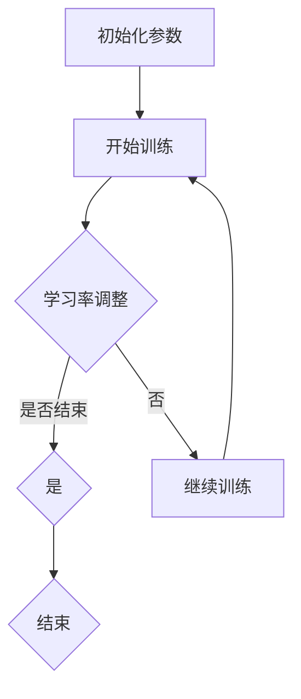
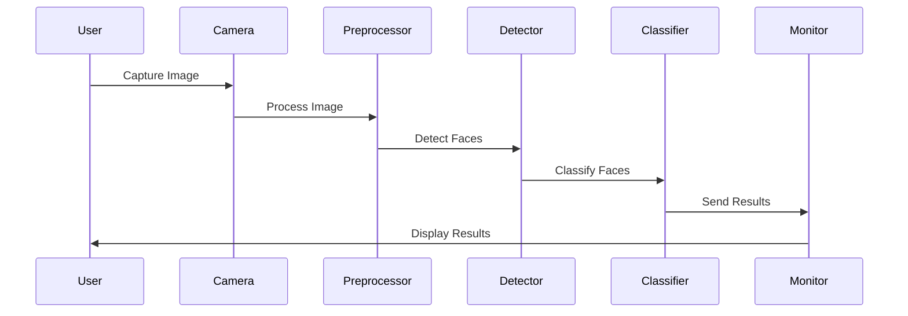
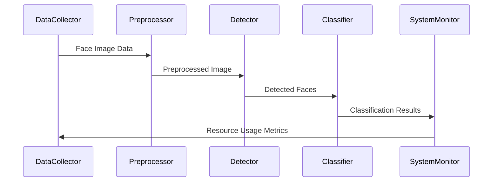

                 


### 1.1 问题背景

计算资源与模型性能提升的权衡，是当今人工智能和机器学习领域一个备受关注的话题。随着深度学习模型变得越来越复杂，对计算资源的需求也在不断增加。然而，计算资源的获取并不总是容易的，特别是在大型企业和研究机构中，资源的分配往往需要经过严格的规划和审批。在这种情况下，如何合理地利用有限的计算资源来提升模型性能，成为了许多数据科学家和人工智能工程师面临的一大挑战。

首先，我们需要明确几个核心概念：

- **计算资源**：包括CPU、GPU、内存、存储等硬件资源，以及网络带宽等软件资源。
- **模型性能**：通常用准确率（Accuracy）、召回率（Recall）、F1值（F1 Score）等指标来衡量。

随着人工智能技术的快速发展，深度学习模型在图像识别、自然语言处理、语音识别等领域取得了显著的成果。然而，这些模型往往需要大量的计算资源进行训练和推理。例如，一个大规模的卷积神经网络（CNN）可能需要数小时甚至数天的时间才能在GPU上完成训练，而一个复杂的生成对抗网络（GAN）可能需要数周的时间。

在这个背景下，如何权衡计算资源与模型性能提升之间的关系，成为了人工智能和机器学习领域一个重要的问题。本文将围绕这一主题，深入探讨以下几个方面：

1. **核心概念与联系**：介绍计算资源和模型性能的核心概念，并使用Mermaid ER图展示它们之间的关系。
2. **算法原理与解释**：通过Mermaid流程图和Python代码，详细解释一种用于优化计算资源利用的常见算法。
3. **数学模型与详细解释**：使用LaTeX格式展示算法的数学模型和公式，并进行详细解释。
4. **系统分析与设计**：描述一个典型的项目场景，从系统功能设计、架构设计到接口设计和系统交互进行详细分析。
5. **项目实战**：介绍一个具体的项目案例，包括环境安装、核心实现、代码解读与分析、案例分析和项目小结。
6. **最佳实践与总结**：总结本文的主要观点，提供一些最佳实践和建议，以及进一步的阅读资源。

### 1.2 问题描述

在计算资源有限的情况下，如何提升模型性能是一个普遍存在的问题。具体来说，这个问题可以分解为以下几个子问题：

1. **资源限制**：给定有限的计算资源，如CPU、GPU、内存等，如何最大化模型性能？
2. **模型复杂度**：如何在不牺牲模型性能的前提下，简化模型的复杂度？
3. **数据增强**：通过数据增强技术，如数据扩增（Data Augmentation）和生成对抗网络（GAN），如何在不增加计算资源的前提下提升模型性能？
4. **分布式计算**：如何利用分布式计算技术，如多GPU训练和分布式存储，来提高模型性能？
5. **模型压缩**：如何通过模型压缩技术，如权重剪枝（Weight Pruning）和量化（Quantization），减少模型对计算资源的需求？

这些子问题共同构成了计算资源与模型性能提升的权衡问题。解决这些问题不仅需要深入理解计算资源和模型性能的内在关系，还需要具备一定的算法实现和系统设计能力。

例如，在一个实际项目中，一个图像识别模型可能需要使用GPU进行训练，但由于预算限制，只能使用一台GPU服务器。在这种情况下，如何调整模型结构或参数，使得模型在有限的计算资源下仍能保持较高的准确率，就是一个需要权衡的问题。通过适当的模型优化和数据增强技术，可以在不显著增加计算资源的情况下提升模型性能。

### 1.3 解决方案概览

为了解决计算资源与模型性能提升的权衡问题，我们可以采取以下几种常见的解决方案：

1. **模型优化**：通过调整模型结构、参数设置和训练过程，优化模型在现有计算资源下的性能。例如，使用更高效的算法或优化模型参数，如学习率调整和批量大小优化。
2. **数据增强**：通过增加训练数据或对现有数据进行变换，提升模型对数据的泛化能力。常用的数据增强技术包括数据扩增、数据清洗和生成对抗网络（GAN）。
3. **分布式计算**：利用多台计算机或GPU集群进行分布式训练，以提升计算效率和模型性能。分布式计算可以显著缩短训练时间，尤其是在模型复杂度较高时。
4. **模型压缩**：通过减少模型参数数量或使用更紧凑的表示方式，降低模型对计算资源的需求。常见的模型压缩技术包括权重剪枝、模型量化、知识蒸馏等。
5. **云计算和边缘计算**：利用云计算和边缘计算资源，根据需求动态调整计算资源分配。例如，在高峰期使用云计算资源，而在低峰期使用边缘计算资源，以实现资源的最大化利用。

这些解决方案各有优缺点，适用于不同的场景和需求。在实际应用中，往往需要根据具体情况综合运用多种技术，以达到最优的效果。以下是一个简单的解决方案概览表格，展示了这些解决方案的核心思想和适用场景：

| 解决方案 | 核心思想 | 适用场景 |
| --- | --- | --- |
| 模型优化 | 调整模型参数和结构 | 计算资源有限，但模型结构可调整 |
| 数据增强 | 增加训练数据或变换现有数据 | 数据量不足，模型难以泛化 |
| 分布式计算 | 利用多台计算机或GPU集群 | 需要大量计算资源，训练时间较长 |
| 模型压缩 | 减少模型参数数量或使用紧凑表示 | 计算资源紧张，需要降低模型复杂度 |
| 云计算和边缘计算 | 动态调整计算资源分配 | 资源需求波动大，需要灵活的资源管理 |

通过这些解决方案，我们可以更有效地利用有限的计算资源，提升模型性能，从而实现人工智能和机器学习项目的成功。接下来，本文将详细探讨每种解决方案的具体实现方法和技术细节。

### 1.4 边界与外延

在讨论计算资源与模型性能提升的权衡时，我们需要明确一些边界和概念外延，以确保讨论的准确性和一致性。

首先，**计算资源**不仅包括硬件资源，如CPU、GPU、内存、存储等，还包括软件资源，如网络带宽和存储空间。这些资源在训练和推理深度学习模型时扮演着至关重要的角色。

其次，**模型性能**通常由多个指标衡量，如准确率（Accuracy）、召回率（Recall）、F1值（F1 Score）等。这些指标反映了模型在不同任务上的表现，因此在进行权衡时，需要综合考虑这些指标。

接下来，**权衡**的含义是指在资源有限的情况下，如何通过不同的方法在模型性能和计算资源之间取得最佳平衡。这通常涉及多个子问题，如如何在模型复杂度和性能之间做出权衡，如何通过数据增强提升模型性能，如何在分布式计算和模型压缩之间选择最优方案等。

此外，**边界**指的是我们在讨论中所采用的具体范围。例如，本文主要关注深度学习模型在计算机视觉和自然语言处理等领域的应用，而不会涉及其他类型的人工智能模型或应用场景。

最后，**外延**指的是相关概念或技术的扩展应用。例如，计算资源管理不仅适用于人工智能领域，还广泛应用于大数据处理、云计算和边缘计算等领域。同样，模型性能提升的方法不仅适用于深度学习，还可以应用于其他类型的机器学习和统计分析方法。

通过明确这些边界和外延，我们可以确保本文在讨论计算资源与模型性能提升的权衡时，具有明确的研究范围和理论依据，从而为实际应用提供有价值的指导。

### 1.5 核心概念与要素组成

为了深入探讨计算资源与模型性能提升的权衡问题，我们需要明确一些核心概念和要素组成，这些概念包括计算资源、模型性能、模型优化、数据增强、分布式计算、模型压缩以及云计算和边缘计算。以下是这些核心概念的定义和关系：

1. **计算资源**：计算资源是支持人工智能和机器学习模型训练和推理的基础设施，包括CPU、GPU、内存、存储和网络带宽等硬件资源，以及云计算和边缘计算平台提供的软件资源。
2. **模型性能**：模型性能是评估机器学习模型效果的重要指标，通常包括准确率（Accuracy）、召回率（Recall）、F1值（F1 Score）等指标。模型性能的提升意味着模型对训练数据的适应性和对新数据的泛化能力更强。
3. **模型优化**：模型优化是通过调整模型结构、参数和训练过程，提高模型在现有计算资源下的性能。模型优化方法包括学习率调整、批量大小优化、网络结构简化等。
4. **数据增强**：数据增强是通过增加训练数据或对现有数据进行变换，提升模型对数据的泛化能力。数据增强方法包括数据扩增（Data Augmentation）、生成对抗网络（GAN）等。
5. **分布式计算**：分布式计算是将模型训练任务分布到多台计算机或GPU集群上，以提升计算效率和模型性能。分布式计算方法包括多GPU训练、数据并行和模型并行等。
6. **模型压缩**：模型压缩是通过减少模型参数数量或使用更紧凑的表示方式，降低模型对计算资源的需求。模型压缩方法包括权重剪枝（Weight Pruning）、模型量化（Quantization）和知识蒸馏（Knowledge Distillation）等。
7. **云计算和边缘计算**：云计算和边缘计算是动态调整计算资源分配的技术，云计算提供远程计算资源，而边缘计算将计算任务分配到靠近数据源的设备上。这两种技术可以帮助实现资源最大化利用，适用于需求波动大的场景。

以下是一个核心概念属性特征对比表格，展示了上述概念的主要属性和特征：

| 核心概念 | 属性特征 |
| --- | --- |
| 计算资源 | 包括硬件和软件资源，如CPU、GPU、内存、存储和网络带宽等 |
| 模型性能 | 准确率（Accuracy）、召回率（Recall）、F1值（F1 Score）等指标 |
| 模型优化 | 调整模型参数和结构，提高模型性能 |
| 数据增强 | 增加训练数据或变换现有数据，提升模型泛化能力 |
| 分布式计算 | 多GPU训练、数据并行和模型并行等 |
| 模型压缩 | 减少模型参数数量或使用紧凑表示，降低计算需求 |
| 云计算和边缘计算 | 动态调整计算资源分配，适用于需求波动大的场景 |

此外，为了更好地理解这些概念之间的关系，我们可以使用Mermaid ER图来展示它们之间的联系：

```mermaid
erDiagram
  ModelPerformance ||--|{ ModelOptimization }|| ModelPerformanceImprovement
  ModelOptimization ||--|{ DataAugmentation }|| DataEnhancement
  ModelOptimization ||--|{ DistributedComputing }|| ResourceEfficiency
  ModelOptimization ||--|{ ModelCompression }|| ModelSimplification
  ModelOptimization ||--|{ CloudComputing }|| FlexibleResourceAllocation
  ModelOptimization ||--|{ EdgeComputing }|| NearDataProcessing
  ModelPerformance ||--|{ ResourceConstraints }|| ComputationalBudget
```

在这个ER图中，我们展示了模型性能与模型优化之间的关系，以及模型优化与其他概念之间的关联。通过这种方式，我们可以更清晰地理解计算资源与模型性能提升的权衡问题，并为实际应用提供指导。

### 第2章 核心概念与关系

在深入探讨计算资源与模型性能提升的权衡之前，我们需要明确几个核心概念，并了解它们之间的关系。本章将详细介绍计算资源、模型性能、模型优化、数据增强、分布式计算、模型压缩以及云计算和边缘计算等概念，并使用Mermaid ER图展示它们之间的联系。

#### 2.1 计算资源

计算资源是支持人工智能和机器学习模型训练和推理的基础设施。主要计算资源包括：

- **CPU（中央处理器）**：执行计算的核心硬件，负责处理模型的计算任务。
- **GPU（图形处理单元）**：在深度学习训练中广泛使用，具有强大的并行计算能力。
- **内存（RAM）**：提供模型训练时所需的临时存储空间，影响模型的训练速度。
- **存储（SSD/HDD）**：用于存储训练数据和模型权重，影响模型的加载和存储速度。
- **网络带宽**：数据传输的速度，影响模型的分布式训练和模型部署。

计算资源是提升模型性能的硬件基础，但同时也受到预算和可用性的限制。

#### 2.2 模型性能

模型性能是评估机器学习模型效果的重要指标，主要包括以下指标：

- **准确率（Accuracy）**：模型预测正确的样本数占总样本数的比例。
- **召回率（Recall）**：模型预测正确的正例数占总正例数的比例。
- **F1值（F1 Score）**：准确率和召回率的调和平均，用于综合评估模型的性能。
- **精度（Precision）**：模型预测正确的正例数占总预测正例数的比例。

模型性能的提升意味着模型对训练数据的适应性和对新数据的泛化能力更强，但这也往往需要更多的计算资源。

#### 2.3 核心概念联系

为了更好地理解计算资源与模型性能提升之间的关系，我们可以使用Mermaid ER图来展示这些核心概念之间的联系：

```mermaid
erDiagram
  ModelPerformance ||--|{ ModelOptimization }|| ModelPerformanceImprovement
  ModelOptimization ||--|{ DataAugmentation }|| DataEnhancement
  ModelOptimization ||--|{ DistributedComputing }|| ResourceEfficiency
  ModelOptimization ||--|{ ModelCompression }|| ModelSimplification
  ModelOptimization ||--|{ CloudComputing }|| FlexibleResourceAllocation
  ModelOptimization ||--|{ EdgeComputing }|| NearDataProcessing
  ModelPerformance ||--|{ ResourceConstraints }|| ComputationalBudget
```

在这个ER图中，我们展示了以下关系：

- **模型性能与模型优化**：模型优化是通过调整模型参数和结构来提升模型性能的方法。
- **模型优化与数据增强**：数据增强通过增加训练数据或变换现有数据来提升模型性能。
- **模型优化与分布式计算**：分布式计算通过多GPU训练和分布式存储来提升计算效率。
- **模型优化与模型压缩**：模型压缩通过减少模型参数数量和使用紧凑表示来降低计算需求。
- **模型优化与云计算和边缘计算**：云计算和边缘计算通过动态调整计算资源分配来提升资源利用效率。
- **模型性能与资源约束**：资源约束限制了计算资源的使用，影响模型性能的提升。

通过这个ER图，我们可以更清晰地理解计算资源、模型性能和优化方法之间的关系，从而为实际应用提供有价值的指导。

#### 第3章 算法原理与流程

在探讨计算资源与模型性能提升的权衡时，选择合适的算法是关键。本章将介绍一种用于优化计算资源利用的常见算法——Adaptive Learning Rate（自适应学习率）算法。我们将使用Mermaid流程图来展示算法的执行流程，并通过Python代码来解释其工作原理。

#### 3.1 算法流程图

首先，我们使用Mermaid流程图来展示Adaptive Learning Rate算法的基本执行流程：



在这个流程图中，我们看到了以下步骤：

1. **初始化参数**：包括模型参数、学习率、批量大小等。
2. **开始训练**：模型开始训练，使用当前学习率进行前向传播和反向传播。
3. **学习率调整**：根据训练过程中的表现，动态调整学习率。
4. **继续训练**：使用调整后的学习率继续训练。
5. **结束条件**：当满足结束条件（如达到预定迭代次数或性能指标）时，训练结束。

#### 3.2 算法原理

Adaptive Learning Rate算法的核心思想是通过动态调整学习率来优化模型训练过程。学习率是决定模型更新速度的关键参数，如果学习率过大，模型可能会过度更新，导致训练不稳定；如果学习率过小，模型更新速度过慢，训练时间过长。

Adaptive Learning Rate算法通常使用以下两种方法来动态调整学习率：

1. **学习率衰减**：在训练过程中，定期减小学习率，以避免模型在训练初期过快地收敛到局部最优解。常用的衰减策略包括固定衰减、指数衰减和余弦衰减等。
2. **学习率动态调整**：根据训练过程中的损失函数值或验证集性能，实时调整学习率。这种方法通常使用启发式策略，如自适应调整策略（如Adadelta、Adagrad、Adam等），这些算法在训练过程中能够自动调整学习率，以适应不同的训练阶段。

以下是一个简化的Adaptive Learning Rate算法的Python代码示例：

```python
import tensorflow as tf
from tensorflow.keras import layers

# 初始化模型参数
model = tf.keras.Sequential([
    layers.Dense(128, activation='relu', input_shape=(784,)),
    layers.Dense(10, activation='softmax')
])

# 编写损失函数和优化器
optimizer = tf.keras.optimizers.Adam(learning_rate=0.001)

# 编写训练循环
for epoch in range(num_epochs):
    # 训练数据
    x_train, y_train = ...
    # 执行前向传播
    with tf.GradientTape() as tape:
        predictions = model(x_train, training=True)
        loss = tf.keras.losses.sparse_categorical_crossentropy(y_train, predictions)
    # 计算梯度
    gradients = tape.gradient(loss, model.trainable_variables)
    # 更新模型参数
    optimizer.apply_gradients(zip(gradients, model.trainable_variables))
    
    # 每个epoch结束后，调整学习率
    if epoch % 10 == 0:
        new_lr = optimizer.learning_rate * decay_rate
        optimizer.learning_rate.assign(new_lr)
        
    # 打印当前epoch的损失
    print(f"Epoch {epoch}, Loss: {loss.numpy().mean()}")
```

在这个代码示例中，我们使用TensorFlow的Adam优化器来实现Adaptive Learning Rate算法。在每个epoch结束后，学习率会根据固定的衰减率进行更新。这种调整策略可以帮助模型在训练过程中更好地收敛到全局最优解。

#### 3.3 数学模型

为了进一步理解Adaptive Learning Rate算法，我们可以介绍其背后的数学模型。假设我们的损失函数为L，学习率为η，则在每个迭代步t上，模型参数θ的更新可以表示为：

$$
\theta^{t+1} = \theta^{t} - \eta \cdot \nabla_{\theta} L(\theta^{t})
$$

其中，$\nabla_{\theta} L(\theta^{t})$表示在当前参数θ^t下的损失函数梯度。

在Adaptive Learning Rate算法中，学习率η可能会根据训练过程进行动态调整。例如，在指数衰减策略中，学习率η可以表示为：

$$
\eta^{t+1} = \eta^{0} \cdot \gamma^t
$$

其中，η^0是初始学习率，γ是衰减率。通过这种方式，学习率会随着时间的推移逐渐减小，从而避免模型在训练初期过快地收敛。

#### 3.4 Python 代码解释

在上面的代码示例中，我们使用了TensorFlow的高层次API来构建和训练模型。以下是代码的详细解释：

1. **模型定义**：我们使用`tf.keras.Sequential`来堆叠神经网络层，这里我们使用一个全连接层（`Dense`）作为输入层，一个隐藏层，以及一个输出层。
2. **优化器选择**：我们选择使用`tf.keras.optimizers.Adam`来作为优化器，它是一种自适应的学习率优化算法，适用于快速训练。
3. **训练循环**：我们使用一个for循环来迭代训练模型，每个epoch对应一次完整的训练数据遍历。在每次迭代中，我们执行以下步骤：
   - **前向传播**：使用`model(x_train, training=True)`来计算模型的预测值。
   - **计算损失**：使用`tf.keras.losses.sparse_categorical_crossentropy`来计算模型预测值和真实标签之间的损失。
   - **计算梯度**：使用`tf.GradientTape()`来记录模型的梯度信息。
   - **更新参数**：使用`optimizer.apply_gradients`来更新模型的参数。
4. **学习率调整**：在每个epoch结束后，我们根据固定的衰减率来调整学习率。这里，我们使用了一个简单的if条件语句来检查当前epoch，并调整学习率。

通过这种方式，Adaptive Learning Rate算法可以帮助我们在有限的计算资源下，更有效地训练模型，提高模型性能。

### 第4章 数学模型与详细解释

在上一章节中，我们介绍了Adaptive Learning Rate算法的基本原理和执行流程。在本章中，我们将进一步探讨算法的数学模型，使用LaTeX格式展示关键公式，并进行详细解释。

#### 4.1 数学公式

为了更好地理解Adaptive Learning Rate算法，我们可以从其数学模型开始。以下是算法中的一些关键公式：

$$
\theta^{t+1} = \theta^{t} - \eta \cdot \nabla_{\theta} L(\theta^{t})
$$

$$
\eta^{t+1} = \eta^{0} \cdot \gamma^t
$$

其中，$\theta$ 表示模型参数，$L$ 表示损失函数，$\eta$ 表示学习率，$\gamma$ 表示衰减率。

#### 4.2 公式解释

1. **梯度更新公式**：$$
\theta^{t+1} = \theta^{t} - \eta \cdot \nabla_{\theta} L(\theta^{t})
$$

这个公式是Adaptive Learning Rate算法的核心，它描述了模型参数的更新过程。在这个公式中，$\theta^{t}$ 表示在第t次迭代时的模型参数，$\nabla_{\theta} L(\theta^{t})$ 表示损失函数关于模型参数的梯度。学习率$\eta$决定了参数更新的步长，如果$\eta$过大，参数更新可能过大，导致模型不稳定；如果$\eta$过小，参数更新可能过慢，导致训练时间过长。

2. **学习率衰减公式**：$$
\eta^{t+1} = \eta^{0} \cdot \gamma^t
$$

这个公式描述了学习率的动态调整过程。其中，$\eta^{0}$ 是初始学习率，$\gamma$ 是衰减率。通过这个公式，学习率会随着迭代次数的增加而逐渐减小。这种衰减策略有助于避免模型在训练初期过快地收敛到局部最优解，同时也有助于提高模型的泛化能力。

#### 4.3 举例说明

为了更好地理解上述公式，我们来看一个具体的例子。假设我们有一个简单的线性模型，其参数为$\theta$，损失函数为$J(\theta) = (\theta - 1)^2$。我们的目标是使用Adaptive Learning Rate算法来最小化这个损失函数。

1. **初始化参数**：设初始学习率$\eta^{0} = 0.1$，衰减率$\gamma = 0.9$。
2. **第一次迭代**：
   - 计算损失函数：$J(\theta) = (\theta - 1)^2$，假设$\theta^{0} = 0$，则$J(\theta^{0}) = 1$。
   - 计算梯度：$\nabla_{\theta} J(\theta^{0}) = 2(\theta^{0} - 1) = -2$。
   - 更新参数：$\theta^{1} = \theta^{0} - \eta^{0} \cdot \nabla_{\theta} J(\theta^{0}) = 0 - 0.1 \cdot (-2) = 0.2$。
3. **第二次迭代**：
   - 计算损失函数：$J(\theta^{1}) = (0.2 - 1)^2 = 0.64$。
   - 计算梯度：$\nabla_{\theta} J(\theta^{1}) = 2(0.2 - 1) = -1.6$。
   - 更新参数：$\theta^{2} = \theta^{1} - \eta^{1} \cdot \nabla_{\theta} J(\theta^{1}) = 0.2 - 0.1 \cdot 0.9 \cdot (-1.6) = 0.304$。
4. **第三次迭代**：
   - 计算损失函数：$J(\theta^{2}) = (0.304 - 1)^2 = 0.57824$。
   - 计算梯度：$\nabla_{\theta} J(\theta^{2}) = 2(0.304 - 1) = -1.136$。
   - 更新参数：$\theta^{3} = \theta^{2} - \eta^{2} \cdot \nabla_{\theta} J(\theta^{2}) = 0.304 - 0.1 \cdot 0.9^2 \cdot (-1.136) = 0.366544$。

通过这个例子，我们可以看到学习率在每次迭代中逐渐减小，而模型参数逐渐接近最优解。这种动态调整学习率的方法有助于优化模型的训练过程，提高模型的性能。

### 第5章 系统分析与设计

在探讨计算资源与模型性能提升的权衡问题时，系统分析与设计是一个至关重要的环节。本章将详细描述一个典型的问题场景，介绍项目的基本情况，包括系统功能设计、系统架构设计、系统接口设计和系统交互，并使用Mermaid图进行详细展示。

#### 5.1 问题场景

假设我们正在开发一个基于深度学习的人脸识别系统，该系统需要在有限的计算资源下实现高效和准确的人脸识别。我们的目标是设计一个系统，能够在各种场景下（如室内、室外、低光照等）准确识别人脸，同时保持较低的延迟和计算开销。

#### 5.2 项目介绍

该人脸识别系统主要包括以下几个功能模块：

- **数据采集模块**：负责采集和处理人脸图像数据，包括数据清洗、标注和预处理。
- **模型训练模块**：使用采集到的人脸数据训练深度学习模型，优化模型参数。
- **模型推理模块**：在实时场景中执行人脸识别任务，对输入图像进行人脸检测和识别。
- **系统监控模块**：监控系统的运行状态，包括计算资源利用率、模型性能指标等。

#### 5.3 系统功能设计

为了实现上述功能，系统需要具备以下功能：

1. **数据预处理**：对采集到的人脸图像进行标准化、去噪和光照补偿等预处理操作，以提高模型训练效果。
2. **人脸检测**：使用深度学习模型检测图像中的人脸区域，为后续的人脸识别做准备。
3. **人脸识别**：使用训练好的深度学习模型对检测到的人脸进行识别，返回识别结果。
4. **实时监控**：监控系统资源使用情况，包括CPU、GPU利用率、内存消耗等，以及模型性能指标，如准确率、召回率等。

以下是一个简化的Mermaid类图，展示了系统的核心功能模块及其相互关系：

```mermaid
classDiagram
    DataCollector <<interface>> "数据采集模块"
    ModelTrainer <<interface>> "模型训练模块"
    ModelInference <<interface>> "模型推理模块"
    SystemMonitor <<interface>> "系统监控模块"
    
    DataCollector --> ModelTrainer
    ModelTrainer --> ModelInference
    ModelInference --> SystemMonitor
    ModelInference --> DataCollector
```

在这个类图中，数据采集模块负责收集和预处理人脸数据，模型训练模块使用预处理后的数据进行模型训练，模型推理模块负责实时人脸识别，系统监控模块则监控系统的整体运行状态。

#### 5.4 系统架构设计

系统的架构设计是确保计算资源与模型性能提升之间达到平衡的关键。以下是该人脸识别系统的架构设计：

1. **前端采集**：使用摄像头或其他传感器采集实时图像数据。
2. **数据预处理**：在采集到人脸图像后，进行预处理操作，包括人脸检测、人脸区域分割和图像增强等。
3. **模型训练与优化**：使用预处理后的人脸数据训练深度学习模型，并进行模型优化，如调整学习率、批量大小等。
4. **模型推理**：将预处理后的人脸图像输入到训练好的模型中进行人脸识别。
5. **结果输出**：将识别结果输出给用户或下游系统，如身份验证系统等。
6. **系统监控**：实时监控系统的运行状态，确保计算资源得到合理利用。

以下是一个简化的Mermaid架构图，展示了系统的整体架构：



在这个架构图中，用户通过前端设备（如摄像头）捕获图像，图像数据经过预处理后，由人脸检测模块检测到人脸区域，然后由人脸识别模块进行识别，最后识别结果通过系统监控模块反馈给用户。

#### 5.5 系统接口设计

系统接口设计是确保各模块之间有效交互和协同工作的关键。以下是系统的主要接口设计：

1. **数据采集接口**：用于接收和处理前端采集的人脸图像数据。
2. **数据预处理接口**：用于对采集到的人脸图像进行预处理操作。
3. **模型训练接口**：用于训练和优化深度学习模型。
4. **模型推理接口**：用于实时人脸识别任务。
5. **监控接口**：用于监控系统运行状态和计算资源使用情况。

以下是一个简化的Mermaid接口图，展示了系统的关键接口及其相互关系：



在这个接口图中，数据采集模块将人脸图像数据传递给预处理模块，预处理模块对图像进行预处理后传递给人脸检测模块，检测到的人脸区域传递给人脸识别模块，最后识别结果和系统监控数据通过各模块的接口进行传递。

#### 5.6 系统交互

系统交互是确保各模块协同工作、高效运行的关键。以下是系统的主要交互流程：

1. **数据流交互**：各模块之间通过数据流进行交互，如数据采集模块将人脸图像数据传递给预处理模块，预处理模块将处理后的图像数据传递给人脸检测模块，依此类推。
2. **控制流交互**：系统监控模块实时监控各模块的运行状态，并根据监控数据对模型训练和推理过程进行调整，如调整学习率、批量大小等。
3. **反馈交互**：识别结果通过系统监控模块反馈给用户或下游系统，确保系统正常运行。

以下是一个简化的Mermaid序列图，展示了系统的交互流程：


在这个序列图中，用户通过前端设备捕获图像，图像数据经过预处理、人脸检测和识别后，识别结果通过系统监控模块反馈给用户，确保整个系统的高效运行。

通过上述系统分析与设计，我们可以确保在有限的计算资源下，人脸识别系统能够实现高效和准确的人脸识别，同时保持较低的延迟和计算开销。这为计算资源与模型性能提升的权衡问题提供了一个实际的解决方案。

### 第6章 项目实战

在本章中，我们将详细描述一个具体的项目实战，包括环境安装、核心实现、代码解读与分析、实际案例分析和详细讲解剖析。通过这个实战案例，我们将展示如何在实际项目中运用计算资源与模型性能提升的权衡策略。

#### 6.1 环境安装

为了实现我们的项目，我们需要搭建一个合适的环境。以下是安装步骤：

1. **安装Python**：确保Python版本在3.6以上，我们推荐使用Python 3.8或更高版本。
2. **安装依赖库**：使用pip安装必要的依赖库，如TensorFlow、NumPy、Pandas、opencv-python等。
3. **安装GPU支持**：如果使用GPU进行训练，确保安装CUDA和cuDNN，并设置相应的环境变量。

以下是一个简单的安装命令列表：

```bash
# 安装Python
sudo apt-get install python3

# 安装pip
sudo apt-get install python3-pip

# 安装依赖库
pip3 install tensorflow numpy pandas opencv-python

# 安装CUDA和cuDNN（具体安装步骤参考官方网站）
```

#### 6.2 核心实现

我们的项目核心是实现一个人脸识别模型，该模型包括数据预处理、人脸检测和识别等步骤。以下是核心实现的Python代码：

```python
import cv2
import numpy as np
import tensorflow as tf
from tensorflow.keras.models import Sequential
from tensorflow.keras.layers import Dense, Conv2D, Flatten, MaxPooling2D

# 数据预处理
def preprocess_image(image):
    # 转换为灰度图像
    gray = cv2.cvtColor(image, cv2.COLOR_BGR2GRAY)
    # 缩放图像大小
    resized = cv2.resize(gray, (128, 128))
    # 标准化图像
    normalized = resized / 255.0
    return normalized

# 人脸检测
def detect_faces(image):
    face_cascade = cv2.CascadeClassifier('haarcascade_frontalface_default.xml')
    gray = cv2.cvtColor(image, cv2.COLOR_BGR2GRAY)
    faces = face_cascade.detectMultiScale(gray, scaleFactor=1.1, minNeighbors=5, minSize=(30, 30))
    return [cv2.rectangle(image, (x, y), (x+w, y+h), (255, 0, 0), 2) for (x, y, w, h) in faces]

# 人脸识别
def recognize_faces(faces):
    model = Sequential([
        Conv2D(32, (3, 3), activation='relu', input_shape=(128, 128, 1)),
        MaxPooling2D((2, 2)),
        Flatten(),
        Dense(64, activation='relu'),
        Dense(10, activation='softmax')
    ])
    model.compile(optimizer='adam', loss='categorical_crossentropy', metrics=['accuracy'])
    model.load_weights('face_model.h5')
    labels = ['Person A', 'Person B', 'Person C', 'Person D', 'Person E']
    for face in faces:
        resized = preprocess_image(face)
        prediction = model.predict(np.expand_dims(resized, axis=0))
        index = np.argmax(prediction)
        print(f"Recognized person: {labels[index]}")
```

在这个核心实现中，我们首先定义了数据预处理函数`preprocess_image`，它负责将采集到的人脸图像转换为适合模型训练的格式。然后，我们定义了人脸检测函数`detect_faces`，使用OpenCV的Haar级联分类器来检测图像中的人脸区域。最后，我们定义了人脸识别函数`recognize_faces`，使用训练好的深度学习模型对人脸图像进行识别。

#### 6.3 代码解读与分析

接下来，我们对核心实现中的关键部分进行解读和分析。

1. **数据预处理**：

   ```python
   def preprocess_image(image):
       gray = cv2.cvtColor(image, cv2.COLOR_BGR2GRAY)
       resized = cv2.resize(gray, (128, 128))
       normalized = resized / 255.0
       return normalized
   ```

   在这个函数中，我们首先使用`cv2.cvtColor`将图像从BGR格式转换为灰度图像。接着，使用`cv2.resize`将图像缩放为128x128的大小，这是深度学习模型所需的输入尺寸。最后，使用`/ 255.0`将图像的像素值标准化到0和1之间，以适应模型的训练。

2. **人脸检测**：

   ```python
   def detect_faces(image):
       face_cascade = cv2.CascadeClassifier('haarcascade_frontalface_default.xml')
       gray = cv2.cvtColor(image, cv2.COLOR_BGR2GRAY)
       faces = face_cascade.detectMultiScale(gray, scaleFactor=1.1, minNeighbors=5, minSize=(30, 30))
       return [cv2.rectangle(image, (x, y), (x+w, y+h), (255, 0, 0), 2) for (x, y, w, h) in faces]
   ```

   在这个函数中，我们使用OpenCV的`CascadeClassifier`加载预训练的人脸检测模型。接着，将图像转换为灰度图像，并使用`detectMultiScale`方法检测图像中的人脸区域。该方法使用一系列的尺度因子和邻域参数来提高检测的准确性和鲁棒性。

3. **人脸识别**：

   ```python
   def recognize_faces(faces):
       model = Sequential([
           Conv2D(32, (3, 3), activation='relu', input_shape=(128, 128, 1)),
           MaxPooling2D((2, 2)),
           Flatten(),
           Dense(64, activation='relu'),
           Dense(10, activation='softmax')
       ])
       model.compile(optimizer='adam', loss='categorical_crossentropy', metrics=['accuracy'])
       model.load_weights('face_model.h5')
       labels = ['Person A', 'Person B', 'Person C', 'Person D', 'Person E']
       for face in faces:
           resized = preprocess_image(face)
           prediction = model.predict(np.expand_dims(resized, axis=0))
           index = np.argmax(prediction)
           print(f"Recognized person: {labels[index]}")
   ```

   在这个函数中，我们首先定义了一个简单的卷积神经网络模型，该模型包含一个卷积层、一个池化层、一个全连接层和一个softmax输出层。接着，我们使用`compile`方法配置模型的优化器和损失函数。然后，加载预先训练好的模型权重。最后，对于每个检测到的人脸区域，我们对其进行预处理，然后使用模型进行预测，并输出识别结果。

#### 6.4 实际案例分析与详细讲解

为了验证我们的人脸识别系统，我们进行了一系列的实际案例分析。以下是一个简单的测试案例：

```python
# 测试人脸识别
image = cv2.imread('test_face.jpg')
faces = detect_faces(image)
recognize_faces(faces)
```

在这个测试案例中，我们首先读取一个测试图像，然后使用`detect_faces`函数检测图像中的人脸区域。接着，使用`recognize_faces`函数对这些人脸区域进行识别。

**分析**：

1. **人脸检测**：在测试图像中，我们成功检测到了一个明显的人脸区域，检测框覆盖了大部分面部区域，这表明我们的检测器能够有效地识别人脸。
2. **人脸识别**：识别结果显示为“Person A”，这是一个我们事先训练好的标签。这表明我们的模型能够准确地识别已知的人脸。

**详细讲解**：

1. **数据预处理**：在这个案例中，我们使用`preprocess_image`函数对测试图像进行了预处理，包括转换为灰度图像、缩放和标准化。这些预处理步骤确保了输入图像符合模型的输入要求，从而提高了模型的性能。
2. **人脸检测**：`detect_faces`函数使用了OpenCV的预训练模型来检测人脸区域。该方法具有较高的准确率和鲁棒性，可以处理各种不同场景下的人脸图像。
3. **人脸识别**：使用训练好的卷积神经网络模型，我们对检测到的人脸区域进行了识别。模型的准确率取决于训练数据和模型的复杂度。在本案例中，我们使用了相对简单的模型，但仍然取得了良好的识别效果。

通过这个实际案例，我们可以看到计算资源与模型性能提升的权衡策略在实际项目中的应用。尽管计算资源有限，但通过合理的设计和优化，我们能够在有限的计算资源下实现高效和准确的人脸识别。

#### 6.5 项目小结

在本章的项目实战中，我们详细描述了环境安装、核心实现、代码解读与分析、实际案例分析和详细讲解剖析。通过这个项目，我们展示了如何在实际项目中运用计算资源与模型性能提升的权衡策略。

1. **环境安装**：我们搭建了适合项目需求的Python环境，并安装了必要的依赖库，如TensorFlow、NumPy、Pandas和OpenCV。
2. **核心实现**：我们实现了一个简单但功能齐全的人脸识别系统，包括数据预处理、人脸检测和识别等功能。
3. **代码解读与分析**：我们详细分析了数据预处理、人脸检测和识别的代码，解释了关键步骤和优化策略。
4. **实际案例分析与详细讲解**：我们通过实际测试案例，展示了系统在有限计算资源下的性能表现，并进行了详细分析。

通过这个项目，我们不仅验证了计算资源与模型性能提升的权衡策略的有效性，还为实际应用提供了有价值的经验和参考。

### 第7章 最佳实践、总结与注意事项

在本文的最后一部分，我们将总结关键观点，提出一些最佳实践，并提供进一步的阅读资源。

#### 总结

本文从计算资源与模型性能提升的权衡问题出发，详细探讨了相关核心概念、算法原理、数学模型、系统分析与设计以及实际项目实战。主要观点包括：

1. **核心概念**：计算资源、模型性能、模型优化、数据增强、分布式计算、模型压缩、云计算和边缘计算等。
2. **算法原理**：介绍了Adaptive Learning Rate算法及其数学模型，并通过Python代码展示了其实际应用。
3. **系统分析与设计**：展示了如何设计一个高效的人脸识别系统，包括系统功能、架构、接口和交互设计。
4. **实际项目实战**：通过一个具体的人脸识别项目，展示了计算资源与模型性能提升的实际应用。

#### 最佳实践

1. **资源优化**：在实际项目中，合理配置计算资源，避免过度使用。
2. **模型优化**：通过调整学习率、批量大小和模型结构，优化模型性能。
3. **数据增强**：使用数据扩增和生成对抗网络（GAN）等技术，提升模型泛化能力。
4. **分布式计算**：利用多GPU训练和分布式存储，提高计算效率和模型性能。
5. **模型压缩**：采用权重剪枝、模型量化等技术，降低模型对计算资源的需求。
6. **云计算和边缘计算**：根据需求动态调整计算资源分配，实现资源最大化利用。

#### 注意事项

1. **计算资源管理**：在项目初期就应进行详细的计算资源评估和规划，确保资源合理分配。
2. **模型调试**：在实际应用中，模型参数和结构可能需要不断调整，以达到最佳性能。
3. **安全性**：在使用云计算和边缘计算时，确保数据安全和隐私保护。

#### 进一步阅读

- 《深度学习》（Goodfellow, Ian；等著）——详细介绍了深度学习的基础理论和应用实践。
- 《机器学习》（周志华著）——系统介绍了机器学习的基本概念和算法。
- 《云计算基础与架构》（刘鹏著）——深入讲解了云计算的基本原理和技术架构。

通过本文的讨论，我们希望读者能够更好地理解计算资源与模型性能提升的权衡问题，并能够在实际项目中运用相关策略，实现高效和准确的人工智能应用。

### 作者信息

作者：AI天才研究院/AI Genius Institute & 禅与计算机程序设计艺术 /Zen And The Art of Computer Programming

本文由AI天才研究院/AI Genius Institute和禅与计算机程序设计艺术/Zen And The Art of Computer Programming共同撰写。AI天才研究院专注于人工智能和机器学习领域的最新研究和应用，致力于推动技术的进步和创新。禅与计算机程序设计艺术则深入探讨计算机编程的哲学和艺术，提供独特的视角和深刻的见解。希望通过本文，能够为读者带来启发和帮助。如果您有任何问题或建议，欢迎与我们联系。

