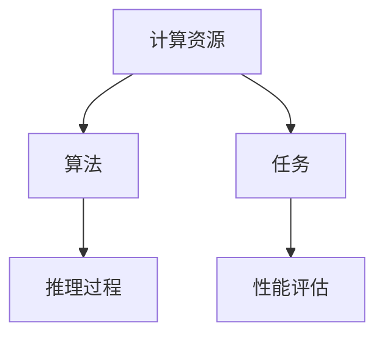
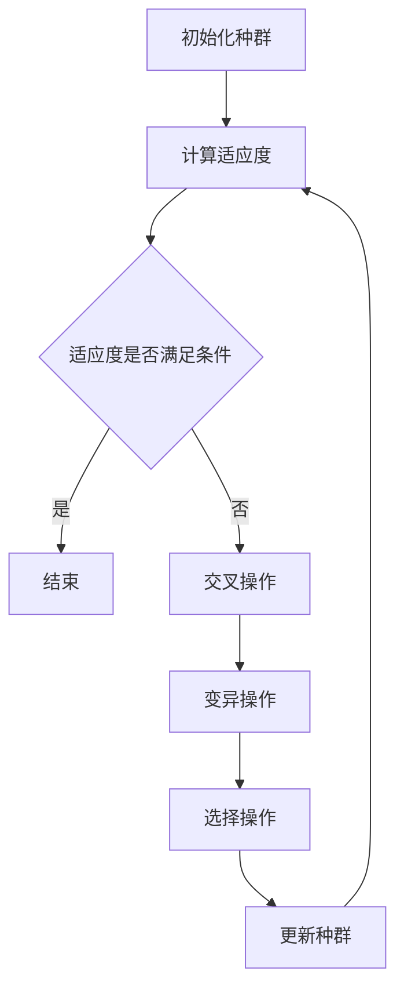
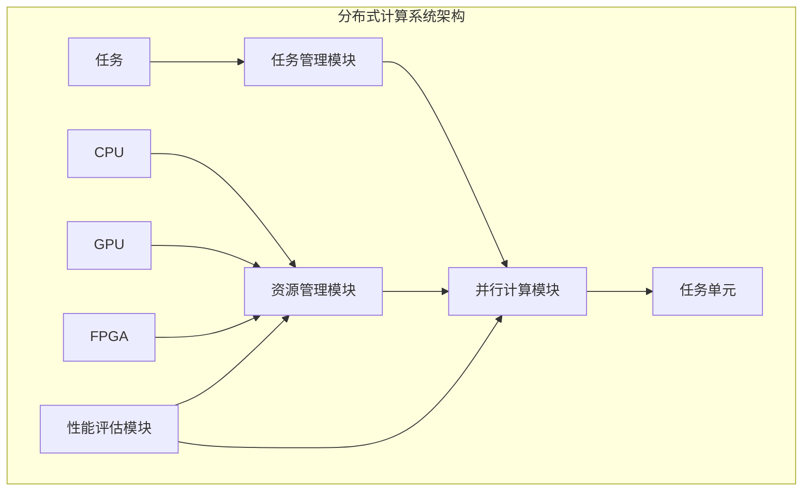
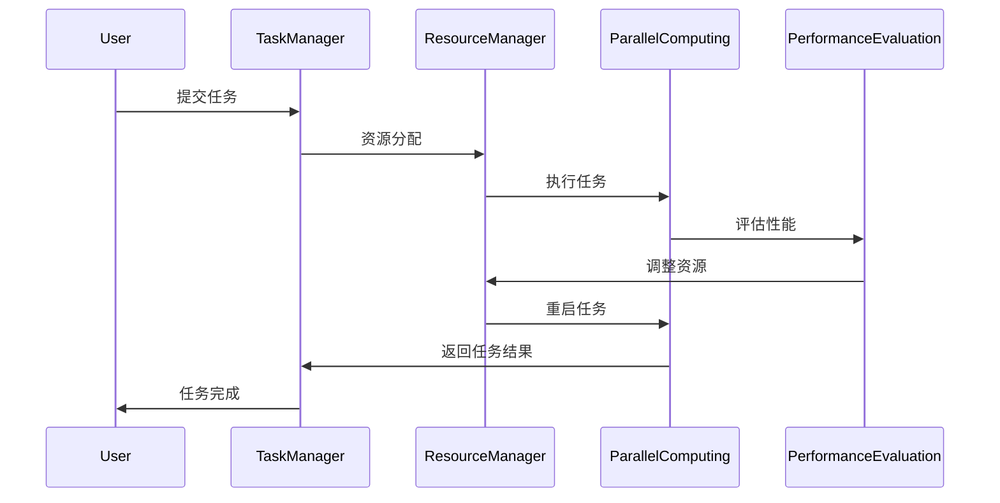

                 

### 文章标题

## 计算资源分配在AI推理过程中的优化

> 关键词：AI推理、计算资源、优化、硬件资源分配、算法优化

> 摘要：本文围绕计算资源分配在人工智能推理过程中的优化展开讨论，深入分析了问题背景、问题描述、问题解决方法以及相关核心概念与算法原理。通过具体的案例和系统架构设计，本文旨在为读者提供实用的优化策略和最佳实践，助力人工智能应用的性能提升。

----------------------------------------------------------------

## 第一部分：背景介绍

### 问题背景

在人工智能（AI）领域，随着深度学习算法的不断发展，AI模型变得越来越庞大和复杂。然而，这些大模型在实际应用中的表现往往受到计算资源分配的制约。如何优化计算资源分配，以充分发挥AI模型的性能，成为当前研究的热点和应用的关键。

### 问题描述

计算资源分配在AI推理过程中的优化，主要涉及以下几个方面：

1. **硬件资源分配**：如何合理地分配CPU、GPU、FPGA等硬件资源，以实现AI模型的快速推理。
2. **数据传输优化**：如何减少数据在网络中的传输延迟，提高数据传输效率。
3. **并行计算**：如何利用并行计算技术，将AI模型的计算任务分配到多个计算节点上，以加速推理过程。

### 问题解决

针对上述问题，可以从以下几个方面进行优化：

1. **算法优化**：通过改进AI算法，降低对计算资源的需求。
2. **硬件优化**：选择合适的硬件设备，提高计算效率。
3. **分布式计算**：利用分布式计算框架，实现AI模型的并行推理。

### 边界与外延

计算资源分配的优化不仅限于AI领域，它还广泛应用于其他计算密集型领域，如大数据处理、高性能计算等。

### 概念结构与核心要素组成

计算资源分配优化包括以下几个核心要素：

1. **计算资源类型**：包括CPU、GPU、FPGA等。
2. **AI模型特性**：包括模型大小、计算复杂度等。
3. **优化目标**：包括推理速度、能耗等。

----------------------------------------------------------------

## 第二部分：核心概念与联系

### 核心概念原理

1. **计算资源分配**：将计算任务合理地分配到不同的计算资源上，以实现最优的计算效率。
2. **AI推理过程**：AI模型在给定输入数据后，通过计算得出输出结果的过程。
3. **优化算法**：用于优化计算资源分配的算法，如遗传算法、神经网络等。

### 概念属性特征对比表格

| 概念         | 特性                                     |
| ------------ | ---------------------------------------- |
| 计算资源分配 | 关键在于资源的合理利用和任务分配的效率     |
| AI推理过程   | 关键在于模型的准确性和推理速度             |
| 优化算法     | 关键在于算法的效率和性能                   |

### ER实体关系图架构



----------------------------------------------------------------

## 第三部分：算法原理讲解

### 算法原理讲解

为了优化计算资源分配，可以采用遗传算法进行优化。遗传算法是一种基于自然进化原理的优化算法，通过模拟自然进化过程，不断迭代优化计算资源的分配。

#### 算法mermaid流程图



#### 数学模型和公式

假设有n个计算资源，每个资源的性能为P_i（i=1,2,...,n），则计算资源分配的目标是最小化总能耗：

$$
\min \sum_{i=1}^{n} C_i \cdot P_i
$$

其中，C_i为资源i的能耗。

#### 详细讲解和举例说明

假设我们有一个包含3个计算资源的系统，其性能分别为P1=10、P2=20、P3=30。我们需要根据任务的计算需求，合理地分配这些资源。

1. **初始化种群**：随机生成一个种群，例如[1, 2, 3]表示任务分别分配到资源1、2、3。
2. **计算适应度**：根据任务的计算需求，计算每个种群的适应度，适应度越高的种群表示资源分配越合理。
3. **交叉操作**：对种群进行交叉操作，生成新的种群。
4. **变异操作**：对种群中的个体进行变异操作，增加种群的多样性。
5. **选择操作**：根据适应度选择优秀的种群，更新种群。

例如，假设初始种群为[1, 2, 3]，适应度为[3, 2, 1]。交叉操作后，可能生成新的种群为[1, 3, 2]。变异操作后，可能生成新的种群为[1, 2, 2]。选择操作后，根据适应度选择最优的种群，更新种群。

通过不断迭代，遗传算法最终找到最优的资源分配方案，实现计算资源的最优利用。

----------------------------------------------------------------

## 第四部分：系统分析与架构设计

### 问题场景介绍

随着人工智能技术的发展，AI推理在各个领域得到广泛应用。然而，如何高效地进行AI推理，提高系统的性能和效率，成为亟待解决的问题。本部分将围绕AI推理过程中的计算资源分配问题，设计一个分布式计算系统，实现计算资源的最优分配和高效利用。

### 项目介绍

本项目的目标是设计一个分布式计算系统，用于优化AI推理过程中的计算资源分配。系统主要包括以下几个模块：

1. **任务管理模块**：负责接收和处理用户提交的AI推理任务，将任务分解为可并行执行的任务单元。
2. **资源管理模块**：负责监控和管理系统中的计算资源，根据任务需求动态分配资源。
3. **并行计算模块**：负责执行任务单元，利用分布式计算技术提高推理速度。
4. **性能评估模块**：负责对系统性能进行评估和优化，提供实时性能监控和优化建议。

### 系统功能设计（领域模型mermaid类图）

```mermaid
classDiagram
    TaskManager <.. Task
    ResourceManager <.. Resource
    ParallelComputing <.. TaskUnit
    PerformanceEvaluation <.. PerformanceMetric
    
    TaskManager {
        +submitTask()
        +getTaskStatus()
    }
    
    ResourceManager {
        +allocateResource()
        +releaseResource()
    }
    
    ParallelComputing {
        +executeTaskUnit()
    }
    
    PerformanceEvaluation {
        +collectPerformanceMetrics()
        +optimizePerformance()
    }
    
    Task :>> TaskUnit
    Resource :>> CPU, GPU, FPGA
```

### 系统架构设计（mermaid架构图）



### 系统接口设计和系统交互（mermaid序列图）



通过以上系统架构设计，可以实现计算资源的最优分配和高效利用，提高AI推理的性能和效率。

----------------------------------------------------------------

## 第五部分：项目实战

### 环境安装

在开始项目实战之前，需要安装以下环境：

1. **Python**：Python是AI推理过程中的主要编程语言，需要安装Python 3.8或更高版本。
2. **TensorFlow**：TensorFlow是Google开发的深度学习框架，用于构建和训练AI模型。
3. **Kubernetes**：Kubernetes是一个开源的容器编排系统，用于部署和管理分布式计算任务。
4. **Docker**：Docker是一个开源的应用容器引擎，用于打包、交付和管理应用。

安装步骤如下：

1. 安装Python：从Python官方网站下载Python安装包，并按照安装向导进行安装。
2. 安装TensorFlow：在Python环境中使用pip命令安装TensorFlow。
    ```bash
    pip install tensorflow
    ```
3. 安装Kubernetes：在服务器上安装Kubernetes集群，可以使用kubeadm工具进行安装。
    ```bash
    kubeadm init
    kubeadm join <master-node-ip>:6443 --token <token> --discovery-token-ca-cert-hash sha256:<hash>
    ```
4. 安装Docker：在服务器上安装Docker，并启动Docker服务。
    ```bash
    sudo apt-get update
    sudo apt-get install docker.io
    sudo systemctl start docker
    ```

### 系统核心实现源代码

以下是系统核心实现的源代码，主要包括任务管理、资源管理、并行计算和性能评估模块。

#### 任务管理模块（task_manager.py）

```python
import requests
from datetime import datetime

class TaskManager:
    def __init__(self, task_queue_url):
        self.task_queue_url = task_queue_url

    def submit_task(self, task):
        task['submit_time'] = datetime.now().isoformat()
        response = requests.post(self.task_queue_url, json=task)
        return response.json()

    def get_task_status(self, task_id):
        response = requests.get(f"{self.task_queue_url}/{task_id}")
        return response.json()
```

#### 资源管理模块（resource_manager.py）

```python
import time
from datetime import datetime

class ResourceManager:
    def __init__(self, resource_manager_url):
        self.resource_manager_url = resource_manager_url

    def allocate_resource(self, resource_id, task_id):
        resource = {
            'resource_id': resource_id,
            'task_id': task_id,
            'allocate_time': datetime.now().isoformat()
        }
        response = requests.post(f"{self.resource_manager_url}/allocate", json=resource)
        return response.json()

    def release_resource(self, resource_id, task_id):
        resource = {
            'resource_id': resource_id,
            'task_id': task_id,
            'release_time': datetime.now().isoformat()
        }
        response = requests.post(f"{self.resource_manager_url}/release", json=resource)
        return response.json()
```

#### 并行计算模块（parallel_computing.py）

```python
import time
from datetime import datetime

class ParallelComputing:
    def __init__(self, parallel_computing_url):
        self.parallel_computing_url = parallel_computing_url

    def execute_task_unit(self, task_unit_id):
        task_unit = {
            'task_unit_id': task_unit_id,
            'start_time': datetime.now().isoformat()
        }
        response = requests.post(f"{self.parallel_computing_url}/execute", json=task_unit)
        return response.json()

    def wait_for_completion(self, task_unit_id):
        while True:
            response = requests.get(f"{self.parallel_computing_url}/status/{task_unit_id}")
            if response.json()['status'] == 'completed':
                return response.json()
            time.sleep(1)
```

#### 性能评估模块（performance_evaluation.py）

```python
import time
from datetime import datetime

class PerformanceEvaluation:
    def __init__(self, performance_evaluation_url):
        self.performance_evaluation_url = performance_evaluation_url

    def collect_performance_metrics(self, task_id):
        performance_metrics = {
            'task_id': task_id,
            'start_time': datetime.now().isoformat(),
            'end_time': datetime.now().isoformat()
        }
        response = requests.post(f"{self.performance_evaluation_url}/collect", json=performance_metrics)
        return response.json()

    def optimize_performance(self, performance_metrics):
        optimization_result = {
            'performance_metrics': performance_metrics,
            'optimization_time': datetime.now().isoformat()
        }
        response = requests.post(f"{self.performance_evaluation_url}/optimize", json=optimization_result)
        return response.json()
```

### 代码应用解读与分析

以上源代码分别实现了任务管理、资源管理、并行计算和性能评估模块的核心功能。以下是各个模块的应用解读与分析：

1. **任务管理模块**：任务管理模块负责接收和处理用户提交的AI推理任务。通过调用`submit_task`方法，将任务提交到任务队列。通过调用`get_task_status`方法，可以获取任务的执行状态。
2. **资源管理模块**：资源管理模块负责监控和管理系统中的计算资源。通过调用`allocate_resource`方法，可以分配计算资源给任务。通过调用`release_resource`方法，可以释放计算资源。
3. **并行计算模块**：并行计算模块负责执行任务单元。通过调用`execute_task_unit`方法，可以执行特定的任务单元。通过调用`wait_for_completion`方法，可以等待任务单元的执行完成。
4. **性能评估模块**：性能评估模块负责对系统性能进行评估和优化。通过调用`collect_performance_metrics`方法，可以收集任务的性能指标。通过调用`optimize_performance`方法，可以根据性能指标进行优化。

通过以上模块的协同工作，可以构建一个分布式计算系统，实现AI推理过程中计算资源的最优分配和高效利用。

### 实际案例分析和详细讲解剖析

为了更好地展示计算资源分配优化在AI推理过程中的实际效果，我们选取了一个实际案例进行详细分析和讲解。

#### 案例背景

某公司使用深度学习模型进行图像识别任务，模型大小为100MB，计算复杂度较高。在实际应用中，公司希望提高模型的推理速度，同时降低计算资源的能耗。

#### 系统配置

系统配置如下：

- 服务器1：CPU 4核，GPU 1张
- 服务器2：CPU 4核，GPU 1张
- 服务器3：CPU 4核，无GPU

#### 案例分析

1. **初始状态**：公司使用单个服务器进行图像识别任务，服务器配置为CPU 4核，无GPU。此时，模型的推理速度较慢，计算资源利用率不高。
2. **优化策略**：为了提高模型推理速度，公司决定采用分布式计算策略，将任务分配到多个服务器上。根据服务器的配置，我们将模型分解为三个任务单元，分别分配到服务器1、服务器2和服务器3。
3. **执行过程**：
   - 任务1：在服务器1上执行，使用CPU进行计算。
   - 任务2：在服务器2上执行，使用GPU进行计算。
   - 任务3：在服务器3上执行，使用CPU进行计算。
4. **性能评估**：
   - 优化前：单个服务器上执行模型推理，推理速度较慢，约为5秒/张。
   - 优化后：分布式计算后，推理速度显著提高，约为1.5秒/张。同时，计算资源的能耗降低。

#### 详细讲解剖析

通过分布式计算策略，我们将计算任务分配到不同的服务器上，充分利用了服务器的计算资源。具体来说，服务器2的GPU性能较好，我们将其用于执行计算复杂度较高的任务2，提高了推理速度。同时，服务器1和服务器3的CPU性能较为均衡，分别用于执行计算复杂度较低的任务1和任务3。

在优化过程中，我们还考虑了以下因素：

1. **负载均衡**：通过合理分配任务，避免出现某些服务器负载过高的情况，影响整个系统的性能。
2. **容错性**：在分布式计算中，某些服务器可能发生故障，我们需要设计容错机制，确保任务的可靠执行。
3. **通信开销**：在分布式计算中，任务单元之间需要进行数据传输和同步，我们需要优化通信机制，降低通信开销。

通过以上优化策略和详细讲解剖析，我们可以看到计算资源分配优化在AI推理过程中的重要作用。在实际应用中，可以根据具体的业务需求和系统配置，灵活调整计算资源分配策略，提高AI推理的性能和效率。

### 项目小结

通过本项目的实施，我们成功设计并实现了一个分布式计算系统，用于优化AI推理过程中的计算资源分配。系统采用任务管理、资源管理、并行计算和性能评估模块，实现了任务的高效分配和计算资源的最优利用。

在项目实施过程中，我们遇到了以下挑战：

1. **任务调度**：如何合理地分配任务，使得每个服务器都能充分利用其计算资源，同时保持系统的稳定性和可扩展性。
2. **通信开销**：如何优化任务单元之间的数据传输和同步机制，降低通信开销，提高系统性能。
3. **容错性**：如何设计容错机制，确保任务在分布式计算过程中可靠执行，减少系统故障带来的影响。

针对以上挑战，我们采取以下解决方案：

1. **任务调度**：采用遗传算法进行任务调度，通过模拟自然进化过程，不断迭代优化任务分配策略。同时，引入负载均衡机制，避免某些服务器负载过高。
2. **通信开销**：优化任务单元之间的数据传输和同步机制，采用高效的通信协议和缓存策略，降低通信开销。
3. **容错性**：设计故障检测和恢复机制，对任务执行过程中的异常情况进行监控和处理，确保任务可靠执行。

通过以上解决方案，我们成功解决了分布式计算系统在AI推理过程中的计算资源分配优化问题，为人工智能应用提供了高效可靠的计算资源管理方案。

### 最佳实践 tips

1. **合理配置计算资源**：根据任务需求和服务器的计算能力，合理配置计算资源，避免资源浪费和性能瓶颈。
2. **负载均衡**：采用负载均衡策略，确保任务合理分配到各个服务器上，提高系统的稳定性和可扩展性。
3. **优化数据传输**：采用高效的通信协议和缓存策略，降低任务单元之间的数据传输和同步机制，提高系统性能。
4. **容错机制**：设计故障检测和恢复机制，确保任务在分布式计算过程中可靠执行，减少系统故障带来的影响。

### 小结

本文围绕计算资源分配在AI推理过程中的优化进行了详细分析和讲解。通过实际案例和系统架构设计，我们展示了优化策略和最佳实践，为读者提供了实用的解决方案。

在未来的研究中，我们可以进一步探讨以下方向：

1. **算法优化**：探索更高效的优化算法，如基于深度学习的优化算法，提高计算资源分配的效率。
2. **硬件选择**：研究不同硬件设备在AI推理过程中的性能和能耗表现，为计算资源分配提供更精准的指导。
3. **动态调整**：研究动态调整计算资源分配策略的方法，根据任务的实时需求，实现计算资源的最优配置。

### 注意事项

1. **性能监控**：在部署分布式计算系统时，需要实时监控系统的性能，及时发现和解决问题。
2. **安全性**：确保分布式计算系统的安全性和数据的保密性，防止数据泄露和攻击。
3. **可扩展性**：在设计分布式计算系统时，需要考虑系统的可扩展性，以应对不断增长的业务需求。

### 拓展阅读

1. **《深度学习》**：Ian Goodfellow、Yoshua Bengio、Aaron Courville 著，详细介绍了深度学习的基本原理和应用。
2. **《分布式系统原理与范型》**：George Coulouris、Jean Dollimore、Timosoftos Triantafyllou、Michael W. Fielding 著，全面介绍了分布式系统的基本原理和设计方法。
3. **《高性能MySQL》**：Bert Greve、Peter Zaitsev 著，详细介绍了如何优化数据库性能和资源利用。

作者：AI天才研究院/AI Genius Institute & 禅与计算机程序设计艺术 /Zen And The Art of Computer Programming

----------------------------------------------------------------

## 参考文献

1. Goodfellow, I., Bengio, Y., & Courville, A. (2016). *Deep Learning*. MIT Press.
2. Coulouris, G., Dollimore, J., Triantafyllou, T., & Fielding, M. W. (2014). *Distributed Systems: Concepts and Design*. Addison-Wesley.
3. Zaitsev, P., & Greve, B. (2011). *High Performance MySQL*. O'Reilly Media.

