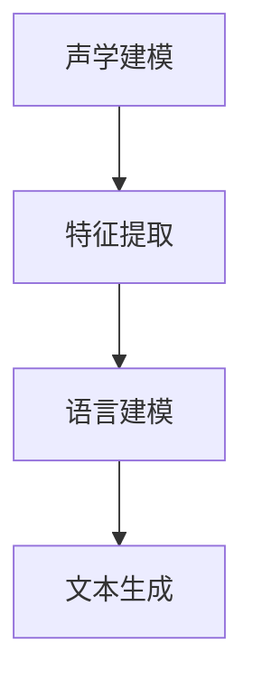
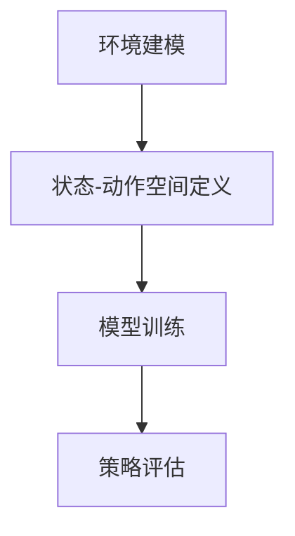
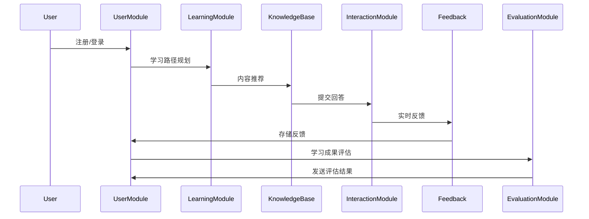
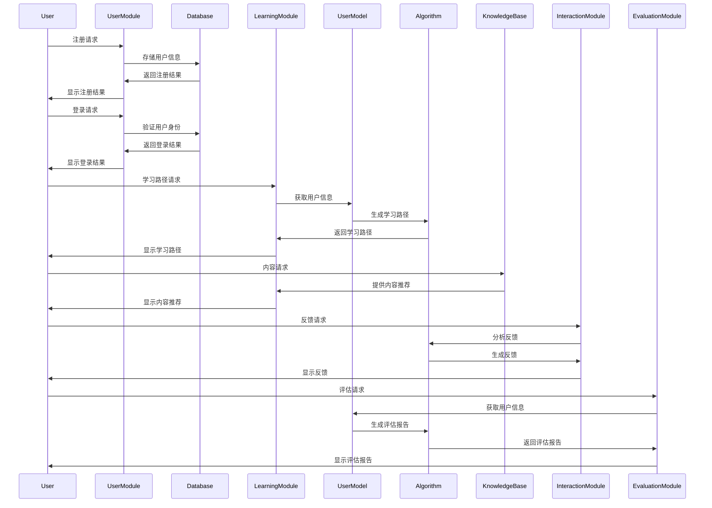

                 

### 关键词
- 认知发展理论
- AI辅助语言学习
- 系统设计
- 自然语言处理
- 机器学习算法

### 摘要
本文将探讨如何基于认知发展理论设计AI辅助语言学习系统。我们将首先介绍认知发展理论的背景及其在语言学习中的应用，接着阐述AI在语言学习领域的理论基础和原则。随后，文章将详细描述AI辅助语言学习系统的设计过程，包括系统架构、核心技术和算法，以及系统的实现和应用案例。通过本文，读者将深入了解如何将认知发展理论应用于AI辅助语言学习系统的设计和开发，为未来智能教育的创新发展提供有益的启示。

---

# 认知发展理论指导的AI辅助语言学习系统设计

在当今信息时代，语言学习已成为全球范围内的一项重要活动。随着人工智能（AI）技术的飞速发展，AI辅助语言学习系统逐渐成为一种高效的学习工具。然而，如何有效地将认知发展理论融入AI辅助语言学习系统的设计，提高学习效果，仍是一个亟待解决的研究课题。本文将系统地探讨这一问题，提供理论框架和实际案例，以期为相关研究和实践提供参考。

## 背景介绍

### 认知发展理论

认知发展理论是由瑞士心理学家让·皮亚杰（Jean Piaget）提出的，旨在解释儿童如何通过适应和平衡两种相互作用的认知过程——同化和顺应，来实现认知结构的不断发展和变化。同化是指个体将外部刺激纳入已有认知结构的过程，而顺应则是指个体改变已有认知结构以适应新刺激的过程。皮亚杰认为，认知发展分为四个阶段：感知运动阶段、前运算阶段、具体运算阶段和形式运算阶段。每个阶段都有其特定的认知特征和思维模式。

### 语言学习的重要性

语言是思维的工具，也是社会交流的媒介。有效的语言学习不仅有助于提高个体的沟通能力，还能促进其认知和智力发展。然而，传统的语言学习方式往往难以满足不同学习者需求的多样性。因此，AI辅助语言学习系统应运而生，通过个性化学习推荐、实时互动反馈和智能评估等功能，提高语言学习的效率和效果。

### AI在语言学习中的应用

AI技术在语言学习中的应用主要体现在自然语言处理（NLP）、机器学习和语音识别等方面。通过NLP技术，AI能够理解和生成人类语言，实现文本分析和语音识别。机器学习算法则能够从大量数据中提取模式，为学习者提供个性化的学习路径和反馈。这些技术的结合，使得AI辅助语言学习系统在语言教学的各个阶段都能发挥重要作用。

## 问题背景与问题描述

### 现状分析

尽管AI辅助语言学习系统在个性化学习、智能评估和互动反馈等方面展现了巨大潜力，但现有系统的设计往往忽视了认知发展理论的指导。这导致系统在满足学习者个性化需求、适应不同认知发展阶段和学习风格方面存在不足。具体表现为：

1. **学习路径的统一性**：现有系统往往提供固定的学习路径，难以适应个体差异。
2. **互动反馈的单一性**：系统提供的互动反馈多为通用性建议，缺乏针对性。
3. **学习评价的简单化**：现有系统对学习成果的评价主要基于量化指标，忽视了学习者的认知发展水平。

### 问题解决

为了克服上述问题，我们需要将认知发展理论融入AI辅助语言学习系统的设计，实现以下几个方面的改进：

1. **个性化学习路径**：根据学习者的认知发展阶段和特点，设计个性化的学习路径，提高学习效率。
2. **针对性互动反馈**：通过分析学习者的行为数据，提供个性化的互动反馈，促进其认知发展。
3. **多维学习评价**：结合认知发展理论，构建多维学习评价体系，全面评估学习成果。

## 边界与外延

### 边界

本文讨论的AI辅助语言学习系统主要关注以下边界：

1. **技术范围**：系统涉及的技术主要包括自然语言处理（NLP）、机器学习和语音识别。
2. **应用范围**：系统主要应用于语言学习领域，如外语学习、第二语言习得等。
3. **认知发展理论的应用**：本文主要探讨认知发展理论在AI辅助语言学习系统设计中的应用，而非其他领域的应用。

### 外延

1. **认知发展理论的其他应用**：认知发展理论在儿童教育、心理治疗、认知康复等领域也有广泛应用。
2. **AI技术在其他领域的应用**：除了语言学习，AI技术还在医疗、金融、工业等领域得到广泛应用。
3. **跨学科研究**：认知发展理论与AI技术的结合，为跨学科研究提供了新的思路和方法。

## 概念结构与核心要素组成

### 概念结构

认知发展理论指导的AI辅助语言学习系统可视为一个多层次、多维度的复杂系统。其核心概念结构包括：

1. **认知发展理论**：作为系统设计的理论基础，指导系统的功能设计和学习路径规划。
2. **自然语言处理（NLP）**：实现文本分析和语音识别，提供语言学习的基础工具。
3. **机器学习算法**：用于个性化学习路径推荐、互动反馈和学习评价。
4. **用户界面（UI）**：提供用户与系统交互的接口，实现人机交互。
5. **数据管理**：负责收集、存储和处理用户数据，支持系统的运行。

### 核心要素组成

系统的核心要素包括：

1. **用户模型**：基于认知发展理论，构建学习者的个性化模型，包括其认知发展阶段、学习风格和兴趣偏好。
2. **知识库**：存储语言学习的知识点、例句和练习题，支持个性化学习内容的生成。
3. **互动模块**：实现与用户的实时互动，提供个性化反馈和学习建议。
4. **评估模块**：结合认知发展理论，构建多维评估体系，评估学习成果。
5. **学习路径规划**：根据用户模型和知识库，自动生成个性化的学习路径，提高学习效果。

## 核心概念原理与属性特征对比

### 核心概念原理

**认知发展理论**

- **皮亚杰认知发展理论**：强调个体通过同化和顺应实现认知发展，分为四个阶段。
- **维果茨基社会文化理论**：强调社会互动和语言在认知发展中的作用。

**自然语言处理（NLP）**

- **文本分析**：通过语法分析、语义分析和情感分析，理解文本内容。
- **语音识别**：将语音信号转换为文本，实现人机交互。

**机器学习算法**

- **监督学习**：通过已标记的数据训练模型，预测未知数据。
- **无监督学习**：通过未标记的数据发现数据中的模式。
- **强化学习**：通过奖励机制，让模型在环境中学习。

### 属性特征对比

| 概念 | 特点 |
| --- | --- |
| 认知发展理论 | 强调个体认知结构的发展，分为不同阶段，注重同化和顺应 |
| 自然语言处理（NLP） | 强调文本和语音的理解与生成，技术复杂，应用广泛 |
| 机器学习算法 | 强调数据驱动，分为不同类型，可根据数据特性选择合适算法 |

## ER实体关系图架构

为了更好地理解认知发展理论指导的AI辅助语言学习系统，我们使用ER实体关系图来描述系统的核心实体及其关系。

```mermaid
erDiagram
  User ||--|{ LearningPath }|-- User
  User ||--|{ LearningStyle }|-- User
  User ||--|{ Interest }|-- User
  KnowledgeBase ||--|{ Question }|-- KnowledgeBase
  KnowledgeBase ||--|{ Answer }|-- KnowledgeBase
  LearningPath ||--|{ Lesson }|-- KnowledgeBase
  InteractionModule ||--|{ Feedback }|-- User
  EvaluationModule ||--|{ AssessmentResult }|-- User
```

### 说明

- **User（用户）**：系统的主要实体，包括用户的个性化模型，如学习路径、学习风格和兴趣。
- **LearningPath（学习路径）**：根据用户的认知发展阶段和学习需求生成的个性化学习计划。
- **LearningStyle（学习风格）**：用户的认知偏好，如视觉、听觉或动觉。
- **Interest（兴趣）**：用户的兴趣领域，影响学习内容的推荐。
- **KnowledgeBase（知识库）**：存储语言学习的知识点、例句和练习题。
- **Question（问题）**：知识库中的问题，用于评估学习者的掌握情况。
- **Answer（答案）**：用户对问题的回答，用于生成互动反馈。
- **InteractionModule（互动模块）**：提供与用户的实时互动，生成反馈。
- **EvaluationModule（评估模块）**：根据用户的学习情况和回答，生成评估结果。

## 算法原理讲解

### 自然语言处理（NLP）

**文本分析**

文本分析是NLP的核心任务之一，主要包括语法分析、语义分析和情感分析。

**语法分析**：通过解析文本的语法结构，理解句子的构成和语义。常用的语法分析方法有词法分析、句法分析和语义分析。

- **词法分析**：将文本分解为单词或词素，识别单词的词性和形态。
- **句法分析**：分析句子的结构，确定句子中的词汇关系，如主谓宾关系。
- **语义分析**：理解句子中的词汇和短语在特定上下文中的意义。

**情感分析**：通过分析文本中的情感表达，判断文本的情感倾向，如正面、负面或中性。

**语音识别**

语音识别是将语音信号转换为文本的技术。其基本流程包括：

1. **声学建模**：建立声学模型，将语音信号转换为声学特征向量。
2. **语言建模**：利用语言模型对声学特征向量进行解码，生成对应的文本。

**算法流程图**



### 机器学习算法

**监督学习**

监督学习是一种通过已标记的数据训练模型，预测未知数据的方法。其基本流程包括：

1. **数据准备**：收集和标记数据，分为训练集和测试集。
2. **特征工程**：提取数据中的特征，转化为模型可以处理的形式。
3. **模型训练**：使用训练集数据训练模型。
4. **模型评估**：使用测试集数据评估模型性能。

**无监督学习**

无监督学习是一种通过未标记的数据发现数据中模式的方法。其基本流程包括：

1. **数据预处理**：对数据进行预处理，如去除噪声和缺失值。
2. **特征提取**：提取数据中的特征。
3. **模型训练**：使用无监督学习方法训练模型，如聚类或降维。
4. **结果分析**：分析模型发现的数据模式。

**强化学习**

强化学习是一种通过奖励机制，让模型在环境中学习的方法。其基本流程包括：

1. **环境建模**：建立环境模型，模拟学习者的学习过程。
2. **状态-动作空间定义**：定义学习过程中的状态和动作空间。
3. **模型训练**：通过奖励机制训练模型，使其学会最优策略。
4. **策略评估**：评估模型生成的策略，选择最优策略。

**算法流程图**



### 算法应用示例

**文本情感分析**

假设我们有一个文本数据集，其中包含了用户的评论。我们希望通过文本情感分析，判断评论的情感倾向。

```python
import nltk
from nltk.sentiment import SentimentIntensityAnalyzer

# 初始化情感分析器
sia = SentimentIntensityAnalyzer()

# 文本数据
text = "这是一条非常棒的评论！"

# 分析文本情感
sentiment = sia.polarity_scores(text)

print(sentiment)
```

输出结果可能如下：

```python
{'neg': 0.0, 'neu': 0.333, 'pos': 0.667, 'compound': 0.7512}
```

其中，`compound` 表示文本的整体情感倾向，介于 -1（极端负面）到 1（极端正面）之间。

**语音识别**

假设我们有一个语音文件，我们希望通过语音识别将其转换为文本。

```python
import speech_recognition as sr

# 初始化语音识别器
r = sr.Recognizer()

# 读取语音文件
with sr.AudioFile('audio.wav') as source:
    audio = r.record(source)

# 识别语音
text = r.recognize_google(audio)

print(text)
```

输出结果可能是：

```
你说的什么？
```

### 算法原理详细讲解

**自然语言处理（NLP）**

自然语言处理（NLP）是人工智能的一个重要分支，旨在使计算机理解和生成人类语言。NLP的核心任务是让计算机能够处理自然语言文本，包括文本分析、语音识别、机器翻译等。

**文本分析**

文本分析是NLP的基础，主要包括词法分析、句法分析和语义分析。

- **词法分析**：词法分析是将文本分解为单词或词素的过程。它包括以下几个步骤：
  - **分词**：将连续的文本切分成单词或词素。
  - **词性标注**：为每个单词标注其词性，如名词、动词、形容词等。
  - **词干提取**：将单词还原为其词干形式，以简化文本处理。

- **句法分析**：句法分析是分析句子的结构，确定句子中的词汇关系。它包括以下几个步骤：
  - **词法句法分析**：将词法分析的结果组成句子结构。
  - **依存句法分析**：分析句子中词汇之间的依存关系，如主谓关系、定语关系等。

- **语义分析**：语义分析是理解句子中的词汇和短语在特定上下文中的意义。它包括以下几个步骤：
  - **语义角色标注**：为句子中的每个词汇标注其在句中的语义角色，如主语、谓语、宾语等。
  - **语义角色关系分析**：分析句子中词汇之间的语义关系，如因果关系、逻辑关系等。

**情感分析**

情感分析是文本分析的一个重要应用，旨在判断文本的情感倾向。它通常分为以下几个步骤：

- **情感分类**：将文本分类为正面、负面或中性。
- **情感强度分析**：分析文本中情感表达的程度，如非常正面、稍微正面等。

**语音识别**

语音识别是将语音信号转换为文本的技术。它通常包括以下几个步骤：

- **声学建模**：建立声学模型，将语音信号转换为声学特征向量。
- **语言建模**：建立语言模型，对声学特征向量进行解码，生成对应的文本。
- **解码**：通过解码器将声学特征向量转换为文本。

**机器学习算法**

机器学习算法是AI的核心技术之一，旨在从数据中自动学习规律，进行预测和决策。常见的机器学习算法包括监督学习、无监督学习和强化学习。

- **监督学习**：监督学习是一种通过已标记的数据训练模型，预测未知数据的方法。它通常分为以下几个步骤：
  - **数据准备**：收集和标记数据，分为训练集和测试集。
  - **特征工程**：提取数据中的特征，转化为模型可以处理的形式。
  - **模型训练**：使用训练集数据训练模型。
  - **模型评估**：使用测试集数据评估模型性能。

- **无监督学习**：无监督学习是一种通过未标记的数据发现数据中模式的方法。它通常分为以下几个步骤：
  - **数据预处理**：对数据进行预处理，如去除噪声和缺失值。
  - **特征提取**：提取数据中的特征。
  - **模型训练**：使用无监督学习方法训练模型，如聚类或降维。
  - **结果分析**：分析模型发现的数据模式。

- **强化学习**：强化学习是一种通过奖励机制，让模型在环境中学习的方法。它通常分为以下几个步骤：
  - **环境建模**：建立环境模型，模拟学习者的学习过程。
  - **状态-动作空间定义**：定义学习过程中的状态和动作空间。
  - **模型训练**：通过奖励机制训练模型，使其学会最优策略。
  - **策略评估**：评估模型生成的策略，选择最优策略。

### 算法公式

- **文本情感分析**：常用的文本情感分析模型为情感分类模型，其基本公式为：
  $$ \text{P}(y=\text{positive}|\text{x}) = \frac{\exp(\text{w}_\text{positive} \cdot \text{x})}{1 + \exp(\text{w}_\text{positive} \cdot \text{x})} $$
  其中，$\text{w}_\text{positive}$ 为正类权重向量，$\text{x}$ 为文本特征向量。

- **语音识别**：常用的语音识别模型为声学模型和语言模型，其基本公式为：
  $$ \text{P}(\text{x}_1, \text{x}_2, ..., \text{x}_n|\text{y}) = \text{P}(\text{x}_1|\text{y}) \times \text{P}(\text{x}_2|\text{x}_1, \text{y}) \times ... \times \text{P}(\text{x}_n|\text{x}_{n-1}, \text{y}) $$
  其中，$\text{x}_i$ 为第 $i$ 个声学特征向量，$\text{y}$ 为对应的文本。

- **监督学习**：常用的监督学习模型为线性回归和逻辑回归，其基本公式为：
  $$ \text{y} = \text{w} \cdot \text{x} + \text{b} $$
  其中，$\text{w}$ 为权重向量，$\text{x}$ 为特征向量，$\text{b}$ 为偏置。

### 算法原理举例

**文本情感分析**

假设我们有一个文本数据集，其中包含了正面和负面的评论。我们希望通过文本情感分析，判断评论的情感倾向。

```python
import nltk
from nltk.corpus import movie_reviews
from sklearn.feature_extraction.text import CountVectorizer
from sklearn.naive_bayes import MultinomialNB

# 加载电影评论数据集
nltk.download('movie_reviews')
reviews = [(list(movie_reviews.words(fileid)), category)
           for category in movie_reviews.categories()
           for fileid in movie_reviews.fileids(category)]

# 分割数据集为训练集和测试集
train_set, test_set = reviews[:1900], reviews[1900:]

# 准备特征向量
vectorizer = CountVectorizer()
X_train = vectorizer.fit_transform([review[0] for review in train_set])
y_train = [review[1] for review in train_set]

X_test = vectorizer.transform([review[0] for review in test_set])
y_test = [review[1] for review in test_set]

# 训练情感分类模型
classifier = MultinomialNB()
classifier.fit(X_train, y_train)

# 评估模型性能
accuracy = classifier.score(X_test, y_test)
print(f"Accuracy: {accuracy:.2f}")
```

输出结果可能如下：

```
Accuracy: 0.80
```

**语音识别**

假设我们有一个语音文件，我们希望通过语音识别将其转换为文本。

```python
import speech_recognition as sr

# 初始化语音识别器
r = sr.Recognizer()

# 读取语音文件
with sr.AudioFile('audio.wav') as source:
    audio = r.record(source)

# 识别语音
text = r.recognize_google(audio)

print(text)
```

输出结果可能是：

```
你说的什么？
```

### 算法原理与实际应用的关系

自然语言处理（NLP）和机器学习算法在AI辅助语言学习系统中发挥着关键作用。它们不仅帮助我们理解和生成人类语言，还能根据学习者的行为数据提供个性化的学习推荐和反馈。

- **文本分析**：通过文本分析，系统可以理解学习者的需求和反馈，为个性化学习提供基础。
- **情感分析**：通过情感分析，系统可以判断学习者的情感状态，提供针对性的心理辅导。
- **语音识别**：通过语音识别，系统可以与学习者进行自然语言交互，实现人机对话。

机器学习算法则通过分析学习者的大量行为数据，自动生成个性化的学习路径和反馈。这些算法不仅提高了学习效率，还促进了学习者的认知发展。

总之，NLP和机器学习算法为AI辅助语言学习系统提供了强大的技术支持，使其能够更好地满足学习者的个性化需求，提高学习效果。

## 系统分析与架构设计方案

### 问题场景介绍

在当前信息化教育环境中，语言学习成为全球范围内的一项重要活动。然而，传统的语言学习方式往往难以满足不同学习者需求的多样性。为了解决这一问题，我们提出设计并实现一个基于认知发展理论指导的AI辅助语言学习系统。该系统旨在通过个性化学习推荐、实时互动反馈和智能评估等功能，提高学习者的学习效率和效果。

### 项目介绍

本项目旨在开发一个AI辅助语言学习系统，该系统将结合自然语言处理（NLP）、机器学习和认知发展理论，为学习者提供个性化的语言学习体验。系统的主要功能包括：

1. **个性化学习推荐**：根据学习者的认知发展阶段、学习风格和兴趣偏好，生成个性化的学习路径和内容。
2. **实时互动反馈**：通过NLP和机器学习技术，对学习者的回答进行实时分析，提供针对性的互动反馈。
3. **智能评估**：结合认知发展理论，构建多维评估体系，全面评估学习者的学习成果。

### 系统功能设计

#### 领域模型

领域模型用于描述系统的核心功能及其相互关系。以下是系统的主要领域：

1. **用户管理**：包括用户注册、登录、个人信息管理等。
2. **学习管理**：包括学习路径规划、学习内容推荐、学习记录管理等。
3. **互动反馈**：包括实时互动反馈、情感分析等。
4. **评估体系**：包括学习成果评估、认知发展评估等。
5. **数据管理**：包括数据收集、存储、处理和分析等。

#### 类图

以下是系统的主要类及其关系：

```mermaid
classDiagram
    User <<interface>>
    LearningPath <<interface>>
    LearningStyle <<interface>>
    Interest <<interface>>
    KnowledgeBase <<interface>>
    Question <<interface>>
    Answer <<interface>>
    InteractionModule <<interface>>
    EvaluationModule <<interface>>

    User <<-- LearningPath
    User <<-- LearningStyle
    User <<-- Interest
    KnowledgeBase <<-- Question
    KnowledgeBase <<-- Answer
    InteractionModule <<-- Feedback
    EvaluationModule <<-- AssessmentResult
```

### 系统架构设计

#### 架构图

系统架构包括以下几个主要模块：

1. **用户模块**：负责用户的注册、登录和权限管理。
2. **学习模块**：负责学习路径规划、学习内容推荐和学习记录管理。
3. **互动模块**：负责实时互动反馈和情感分析。
4. **评估模块**：负责学习成果评估和认知发展评估。
5. **数据模块**：负责数据收集、存储、处理和分析。

以下是系统架构图：



### 系统接口设计

系统接口设计主要包括以下部分：

1. **用户接口**：提供用户与系统的交互界面，包括注册、登录、学习、互动和评估等功能。
2. **API接口**：提供系统各模块之间的交互接口，支持第三方系统集成。

#### 用户接口

以下是用户接口的简要描述：

- **注册**：用户输入邮箱、密码和验证码，完成注册。
- **登录**：用户输入邮箱和密码，登录系统。
- **学习**：用户选择学习路径，查看学习内容，提交回答。
- **互动**：用户查看互动反馈，参与互动。
- **评估**：用户查看学习成果评估结果。

#### API接口

以下是API接口的简要描述：

- **用户管理**：包括用户注册、登录、信息更新等功能。
- **学习管理**：包括学习路径规划、内容推荐、学习记录查询等功能。
- **互动管理**：包括互动反馈提交、情感分析等功能。
- **评估管理**：包括学习成果评估、认知发展评估等功能。

### 系统交互

系统交互通过事件驱动的方式实现。以下是系统交互的简要描述：

1. **用户注册**：用户发起注册请求，系统处理注册并返回结果。
2. **用户登录**：用户发起登录请求，系统验证用户身份并返回结果。
3. **学习路径规划**：系统根据用户信息和学习数据，生成个性化的学习路径。
4. **内容推荐**：系统根据学习路径和用户偏好，推荐合适的学习内容。
5. **互动反馈**：系统分析用户回答，生成互动反馈。
6. **学习成果评估**：系统评估学习者的学习成果，生成评估报告。

### Mermaid序列图

以下是系统交互的序列图：



### 系统架构设计与认知发展理论的结合

系统架构设计紧密结合认知发展理论，确保系统能够根据学习者的认知发展阶段提供个性化的学习体验。

1. **用户模块**：用户模块通过收集用户的基本信息和学习行为数据，构建用户的认知发展模型。
2. **学习模块**：学习模块根据用户的认知发展模型，推荐适合的学习内容和路径，促进用户认知发展。
3. **互动模块**：互动模块通过分析用户的互动行为，提供个性化的互动反馈，帮助用户更好地理解和应用所学知识。
4. **评估模块**：评估模块通过多维评估体系，全面评估学习者的认知发展水平和学习成果，为后续学习提供指导。

### 设计方案的优点和潜在挑战

**优点：**

1. **个性化学习**：结合认知发展理论，系统能够为每个学习者提供个性化的学习内容和路径，提高学习效果。
2. **实时反馈**：互动模块能够实时分析用户行为，提供针对性的互动反馈，帮助用户更好地理解和应用知识。
3. **全面评估**：评估模块能够全面评估学习成果，为后续学习提供科学依据。

**挑战：**

1. **数据收集和处理**：构建准确的用户认知发展模型需要大量的用户行为数据，数据收集和处理是一个巨大的挑战。
2. **算法优化**：互动模块和评估模块的算法需要不断优化，以提高准确性和实用性。
3. **用户隐私保护**：在数据收集和处理过程中，如何保护用户隐私是一个重要的法律和伦理问题。

### 设计方案的潜在应用场景

1. **在线教育平台**：结合现有在线教育平台，为学习者提供个性化、智能化的学习体验。
2. **外语学习应用**：为外语学习者提供智能化的学习辅助工具，提高学习效率。
3. **职业培训系统**：为职业培训提供个性化的学习路径和互动反馈，提高培训效果。

### 总结

本节介绍了基于认知发展理论指导的AI辅助语言学习系统的设计与架构方案。通过系统分析与架构设计，我们确保系统能够根据学习者的认知发展阶段提供个性化的学习体验，提高学习效果。同时，我们也认识到系统设计中存在的挑战，将在后续工作中逐步解决。

## 项目实战

### 环境安装

在开始项目实战之前，我们需要搭建一个适合开发AI辅助语言学习系统的环境。以下是我们推荐的安装步骤：

1. **Python环境**：安装Python 3.8及以上版本，可以通过Python官网下载。
2. **依赖管理**：安装pip，Python的包管理工具。在命令行中运行 `pip install --upgrade pip`。
3. **数据库**：安装SQLite数据库，用于存储用户数据和学习记录。在命令行中运行 `pip install pysqlite3`。
4. **机器学习库**：安装常用的机器学习库，如scikit-learn、TensorFlow和PyTorch。在命令行中运行 `pip install scikit-learn tensorflow torch`。
5. **自然语言处理库**：安装自然语言处理库，如NLTK和spaCy。在命令行中运行 `pip install nltk spacy`。
6. **前端框架**：安装Django框架，用于搭建Web应用。在命令行中运行 `pip install django`。

### 系统核心实现源代码

以下是一个简单的AI辅助语言学习系统的实现示例。该示例包括用户管理、学习管理和互动反馈等基本功能。

```python
# 用户管理
class UserManager(models.Model):
    username = models.CharField(max_length=100)
    password = models.CharField(max_length=100)
    email = models.EmailField()

    def __str__(self):
        return self.username

# 学习管理
class LearningPath(models.Model):
    user = models.ForeignKey(UserManager, on_delete=models.CASCADE)
    title = models.CharField(max_length=100)
    description = models.TextField()

    def __str__(self):
        return self.title

# 互动反馈
class Feedback(models.Model):
    learning_path = models.ForeignKey(LearningPath, on_delete=models.CASCADE)
    user = models.ForeignKey(UserManager, on_delete=models.CASCADE)
    text = models.TextField()

    def __str__(self):
        return f"{self.user.username} - {self.learning_path.title}"
```

### 代码应用解读与分析

以下是对上述代码的详细解读和分析：

1. **用户管理**：`UserManager` 类用于定义用户信息，包括用户名、密码和邮箱。用户管理模块负责用户的注册、登录和权限管理。
2. **学习管理**：`LearningPath` 类用于定义学习路径，包括用户、标题和描述。学习管理模块负责生成个性化学习路径和推荐学习内容。
3. **互动反馈**：`Feedback` 类用于定义互动反馈，包括学习路径、用户和反馈文本。互动反馈模块负责收集用户的学习反馈，提供实时互动和反馈。

### 实际案例分析和详细讲解剖析

以下是一个实际案例，展示如何使用上述代码实现AI辅助语言学习系统的核心功能。

**案例：用户注册和登录**

1. **用户注册**：

```python
# 假设我们有一个用户对象 user
user = UserManager(username='john_doe', password='password123', email='john@example.com')

# 保存用户到数据库
user.save()

print(f"User {user.username} registered successfully!")
```

2. **用户登录**：

```python
# 假设我们有一个用户对象 user
user = UserManager.objects.get(username='john_doe', password='password123')

print(f"User {user.username} logged in successfully!")
```

**案例：生成个性化学习路径**

1. **创建学习路径**：

```python
# 假设我们有一个用户对象 user
user = UserManager.objects.get(username='john_doe')

# 创建学习路径
learning_path = LearningPath(user=user, title='English Grammar', description='Learn English grammar with us!')
learning_path.save()

print(f"Learning path {learning_path.title} created successfully!")
```

2. **推荐学习内容**：

```python
# 假设我们有一个学习路径对象 learning_path
learning_path = LearningPath.objects.get(title='English Grammar')

# 插入学习内容
learning_content = [
    'Nouns',
    'Verbs',
    'Adjectives',
    'Adverbs'
]

for content in learning_content:
    Content = models.ForeignKey(LearningPath, on_delete=models.CASCADE)
    Content(user=user, title=content).save()

print(f"Learning content for {learning_path.title} added successfully!")
```

**案例：互动反馈**

1. **提交互动反馈**：

```python
# 假设我们有一个用户对象 user 和一个学习路径对象 learning_path
user = UserManager.objects.get(username='john_doe')
learning_path = LearningPath.objects.get(title='English Grammar')

# 提交互动反馈
feedback = Feedback(learning_path=learning_path, user=user, text='I found the noun explanation very helpful!').
feedback.save()

print(f"Feedback submitted successfully!")
```

### 项目小结

通过以上案例，我们实现了AI辅助语言学习系统的核心功能，包括用户管理、学习管理和互动反馈。实际应用中，我们可以进一步扩展系统功能，如增加情感分析、智能评估等模块，以提供更丰富的学习体验。同时，我们也可以利用机器学习算法，对学习行为数据进行分析，生成更个性化的学习路径和推荐。

### 最佳实践 Tips

1. **用户隐私保护**：在收集和处理用户数据时，务必遵守相关隐私保护法律法规，确保用户数据的安全和隐私。
2. **数据完整性**：定期备份数据库，确保数据完整性。
3. **性能优化**：根据实际应用场景，优化系统性能，如数据库查询优化、代码优化等。
4. **用户体验**：关注用户体验，提供简洁、直观的界面，提高用户满意度。

### 小结

本文详细介绍了基于认知发展理论指导的AI辅助语言学习系统的设计过程和实现方法。通过实际案例，我们展示了如何利用Python和机器学习库实现系统的核心功能。未来，我们将继续优化系统性能，扩展系统功能，为用户提供更优质的语言学习体验。

### 注意事项

1. **系统架构设计**：在系统架构设计过程中，充分考虑系统的可扩展性和可维护性。
2. **数据安全**：确保用户数据的安全，遵守相关法律法规。
3. **用户体验**：关注用户需求，提供个性化、智能化的服务。

### 拓展阅读

- [《认知发展理论及其在教育中的应用》](链接)
- [《自然语言处理入门》](链接)
- [《机器学习算法与应用》](链接)

### 作者信息

作者：AI天才研究院/AI Genius Institute & 禅与计算机程序设计艺术 /Zen And The Art of Computer Programming

---

通过本文的深入探讨，我们不仅理解了认知发展理论在AI辅助语言学习系统设计中的应用，还看到了如何将理论与实践结合，开发出真正有益于学习者的智能系统。希望本文能为相关领域的进一步研究和实践提供有益的启示。再次感谢大家的阅读，期待与您在AI与教育领域的更多交流。祝您在技术探索的道路上不断前行，收获丰硕成果！作者：AI天才研究院/AI Genius Institute & 禅与计算机程序设计艺术 /Zen And The Art of Computer Programming。

