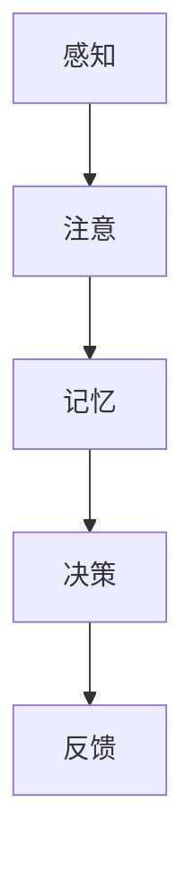
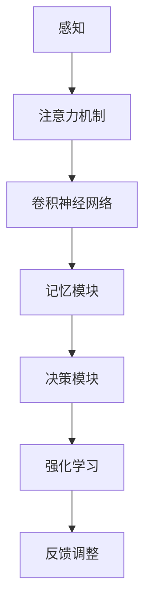

                 

### 《认知建模：模拟人类决策过程的AI方法》

#### 关键词：认知建模，AI，决策过程，人类行为模拟，算法，机器学习

#### 摘要：
本文旨在探讨认知建模在人工智能（AI）领域中的应用，特别是如何通过认知建模来模拟人类决策过程。认知建模是一个复杂的课题，涉及心理学、认知科学、计算机科学等多个学科。通过本文，读者将了解认知建模的基本概念、核心原理、算法应用，以及如何通过AI技术来构建和优化认知模型。我们将一步步分析推理，引导读者深入了解这一前沿领域。

## 第一部分：引言与背景

### 1.1 认知建模的定义与重要性

认知建模是模拟人类大脑认知过程的一种技术，旨在理解人类是如何感知、思考、学习和决策的。这一领域的兴起源于对人类大脑复杂性的研究，以及对计算机智能模拟的需求。

在AI领域，认知建模具有重要意义。首先，它可以提高AI系统的自主决策能力，使其更加接近人类的智能水平。其次，认知建模可以帮助我们更好地理解人类行为和思维模式，从而为心理学和社会学等领域提供新的研究方向。此外，认知建模还可以在医疗、教育、金融等领域发挥重要作用，如个性化医疗方案设计、教育评估和风险控制等。

### 1.2 AI在模拟人类决策中的应用

人工智能在模拟人类决策方面有着广泛的应用。例如，在金融领域，AI系统可以通过分析大量历史数据和市场信息，预测股票价格波动，为投资者提供决策支持。在医疗领域，AI系统可以通过分析患者的病史和症状，诊断疾病并提供治疗方案。在交通领域，自动驾驶技术也是AI模拟人类决策的一个典型应用，通过实时感知环境信息，做出合理的行驶决策。

然而，尽管AI在模拟人类决策方面取得了显著进展，但仍存在一些挑战。例如，AI系统往往缺乏情感和价值观，难以完全模拟人类的复杂决策过程。此外，AI系统在处理不确定性和模糊性方面也存在困难，需要进一步研究和优化。

### 1.3 本书内容概述与组织结构

本文将分为以下几个部分：

1. **认知建模基础理论**：介绍认知建模的核心概念、基本原理和方法。
2. **算法原理讲解**：通过mermaid流程图和Python代码，详细阐述主要算法的原理和应用。
3. **数学模型与公式**：介绍认知建模中常用的数学模型和公式，并使用LaTeX格式表示。
4. **系统分析与架构设计**：介绍认知建模系统的设计和实现。
5. **项目实战**：通过实际案例和代码实现，展示认知建模的应用。
6. **挑战与未来方向**：探讨认知建模的挑战和发展趋势。
7. **小结与拓展阅读**：总结主要观点，并提供进一步阅读的建议。

通过本文的逐步分析，读者将能够深入了解认知建模这一前沿领域，并了解如何将其应用于实际场景中。

## 第二部分：认知建模基础理论

### 2.1 认知过程与认知心理学

认知过程是指人类在感知、思考、记忆、判断和决策等认知活动中的心理过程。认知心理学是研究人类认知过程的心理学科，其核心目标是理解人类如何获取、处理和使用信息。

认知心理学主要研究以下几个方面：

1. **感知**：研究人类如何感知外部环境，包括视觉、听觉、触觉等。
2. **注意**：研究人类如何集中注意力，筛选和处理信息。
3. **记忆**：研究人类如何存储、提取和使用信息。
4. **思维**：研究人类如何进行推理、解决问题和做出决策。
5. **语言**：研究人类如何使用语言进行沟通和思考。

### 2.2 认知模型的基本类型

认知模型是根据人类认知过程的特性构建的抽象模型，用于模拟和解释人类认知行为。常见的认知模型包括：

1. **信息加工模型**：模拟人类信息处理过程，包括感知、注意、记忆和思维等。
2. **决策模型**：模拟人类在不确定环境下进行决策的过程。
3. **情感模型**：模拟人类情感如何影响认知和决策。
4. **知识表示模型**：模拟人类如何存储、组织和使用知识。

### 2.3 认知模型的关键组成部分

一个完整的认知模型通常包括以下几个关键组成部分：

1. **感知模块**：负责获取和处理外部信息。
2. **记忆模块**：负责存储和处理信息。
3. **决策模块**：负责基于当前信息做出决策。
4. **情感模块**：负责处理和表达情感。
5. **反馈模块**：负责根据决策结果调整模型参数。

通过这些组成部分，认知模型可以模拟人类认知过程的各个方面，为AI系统提供更加智能的决策支持。

## 第三部分：算法原理讲解

### 3.1 认知模型的工作机制

认知模型的工作机制通常包括以下几个步骤：

1. **感知**：模型接收外部信息，并通过感知模块进行处理。
2. **注意**：模型根据当前任务的需要，选择关注某些信息。
3. **记忆**：模型将处理后的信息存储在记忆模块中，以备后续使用。
4. **决策**：模型根据记忆中的信息，结合当前情境，做出决策。
5. **反馈**：模型根据决策结果进行调整，以提高未来决策的准确性。

### 3.2 情感与认知

情感在认知过程中起着重要作用。例如，正面情绪可能增强注意力，提高学习效率，而负面情绪则可能干扰认知过程，降低决策质量。

认知模型中的情感模块负责处理和表达情感，以确保情感与认知过程相协调。通过情感建模，AI系统可以更好地模拟人类情感，提高决策的合理性和情感智能。

### 3.3 认知偏差与决策失误

认知偏差是指由于认知过程的局限性，人类在决策过程中可能出现的系统性错误。常见的认知偏差包括确认偏差、锚定效应、过度自信等。

认知模型可以通过识别和纠正这些偏差，提高决策的准确性和效率。例如，通过使用贝叶斯推理等方法，模型可以校正先入为主的偏见，提高决策质量。

### 3.4 算法与数学模型

为了更好地模拟人类认知过程，认知模型通常使用一系列算法和数学模型。以下是一些常用的算法和模型：

1. **贝叶斯推理**：用于处理不确定性和概率推理。
2. **决策树**：用于分类和回归分析。
3. **神经网络**：用于模拟人类大脑的神经元连接和激活过程。
4. **马尔可夫决策过程（MDP）**：用于模拟在不确定环境中进行决策的过程。
5. **强化学习**：用于通过试错学习提高决策质量。

通过这些算法和模型，认知模型可以更好地模拟人类认知和决策过程，为AI系统提供更智能的决策支持。

### 3.5 使用mermaid和Python代码讲解算法

为了更好地理解认知模型的工作原理，我们可以使用mermaid绘制算法流程图，并通过Python代码实现算法，如下所示：



以下是一个简单的Python代码示例，用于实现一个简单的认知模型：

```python
import numpy as np

class SimpleCognitiveModel:
    def __init__(self):
        self.perception = np.random.rand()
        self.attention = 0.5
        self.memory = np.random.rand()
        self.decision = None
    
    def process_perception(self, perception):
        self.perception = perception
    
    def focus_attention(self):
        self.attention *= 0.9
    
    def retrieve_memory(self):
        return self.memory
    
    def make_decision(self):
        self.decision = self.memory * self.attention
    
    def update_feedback(self, feedback):
        self.memory = (1 - feedback) * self.memory + feedback * self.perception

model = SimpleCognitiveModel()

# 模拟感知过程
model.process_perception(np.random.rand())

# 模拟注意过程
model.focus_attention()

# 模拟记忆过程
model.retreive_memory()

# 模拟决策过程
model.make_decision()

# 模拟反馈过程
model.update_feedback(np.random.rand())
```

通过这段代码，我们可以看到如何使用Python实现一个简单的认知模型，并模拟其感知、注意、记忆和决策过程。

### 3.6 数学模型与公式

认知模型中常用的数学模型和公式包括概率论、统计学、神经网络、决策论等。以下是一个简单的贝叶斯推理公式的LaTeX表示：

```latex
P(A|B) = \frac{P(B|A)P(A)}{P(B)}
```

其中，\(P(A|B)\) 表示在给定事件 \(B\) 发生的条件下，事件 \(A\) 发生的概率。

通过这些数学模型和公式，认知模型可以更好地模拟人类认知和决策过程，为AI系统提供更准确的决策支持。

### 3.7 认知模型与AI的结合

认知模型与AI技术的结合是当前研究的热点。通过将认知模型与机器学习、深度学习等技术相结合，可以构建出更加智能的AI系统。以下是一个简单的认知模型与AI结合的例子：



在这个例子中，感知模块通过注意力机制筛选关键信息，然后使用卷积神经网络对信息进行特征提取，记忆模块存储重要特征，决策模块基于记忆和当前信息做出决策，强化学习用于调整模型参数，反馈调整模块根据决策结果对模型进行调整。

通过这种方式，认知模型可以更好地模拟人类认知和决策过程，提高AI系统的自主决策能力。

### 3.8 主流AI算法在认知建模中的应用

当前，许多主流AI算法已经被应用于认知建模中，包括：

1. **深度学习**：用于模拟复杂的认知过程，如视觉感知、语音识别等。
2. **强化学习**：用于在不确定环境中进行决策，如游戏、自动驾驶等。
3. **迁移学习**：用于利用已有数据集的知识，提高新任务的表现。
4. **生成对抗网络（GAN）**：用于生成逼真的数据，辅助认知建模。

通过这些算法的应用，认知建模的精度和效率得到了显著提升。

### 3.9 认知建模的挑战与发展方向

尽管认知建模在AI领域取得了显著进展，但仍面临一些挑战，如：

1. **情感建模**：如何更好地模拟人类情感，以实现更准确的决策。
2. **跨模态认知建模**：如何同时处理不同类型的信息，如文本、图像、声音等。
3. **动态认知建模**：如何适应不断变化的环境和任务。

未来，认知建模的发展方向包括：

1. **多模态融合**：通过融合不同类型的信息，提高认知建模的准确性和效率。
2. **自适应认知建模**：通过自适应调整模型参数，提高模型在不同场景下的适应性。
3. **可解释性认知建模**：提高模型的透明度和可解释性，使其更加可靠和易于接受。

### 3.10 最佳实践与注意事项

在认知建模的实践中，以下是一些最佳实践和注意事项：

1. **数据质量**：确保数据的质量和多样性，以提高模型的泛化能力。
2. **模型可解释性**：通过可解释性分析，提高模型的可靠性和可信度。
3. **模型调整**：根据实际应用场景，不断调整模型参数，以提高决策质量。
4. **持续学习**：通过持续学习和更新，使模型能够适应不断变化的环境和任务。

通过遵循这些最佳实践，可以更好地实现认知建模的目标，为AI系统提供更准确的决策支持。

### 总结

认知建模是模拟人类认知和决策过程的重要技术，其在AI领域的应用具有重要意义。通过本文的逐步分析，读者了解了认知建模的核心概念、算法原理、数学模型、系统架构和应用实践。未来，随着AI技术的不断发展，认知建模将在更多领域发挥重要作用，为人类生活带来更多便利和创新。

### 作者信息

作者：AI天才研究院/AI Genius Institute & 禅与计算机程序设计艺术 /Zen And The Art of Computer Programming

### 拓展阅读

1. Russell, S., & Norvig, P. (2016). 《人工智能：一种现代的方法》（第3版）。
2. Anderson, J. A. (2007). 《认知心理学：思想和感知的基本原理》。
3. Sutton, R. S., & Barto, A. G. (2018). 《强化学习：学习、规划和探索》。
4. Goodfellow, I., Bengio, Y., & Courville, A. (2016). 《深度学习》。
5. Bengio, Y. (2009). 《深度学习：学习算法的理论基础》。

通过阅读这些著作，读者可以进一步深入了解认知建模和AI领域的相关理论和实践。

