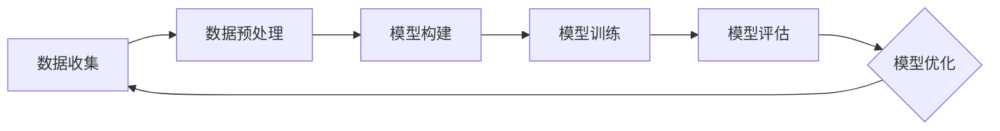
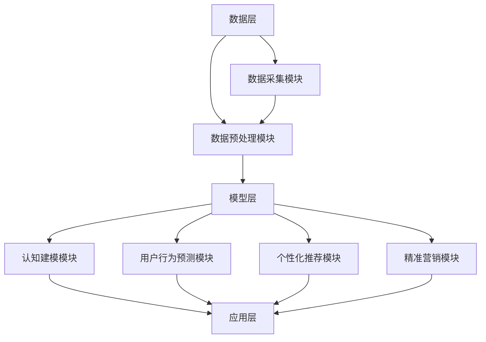
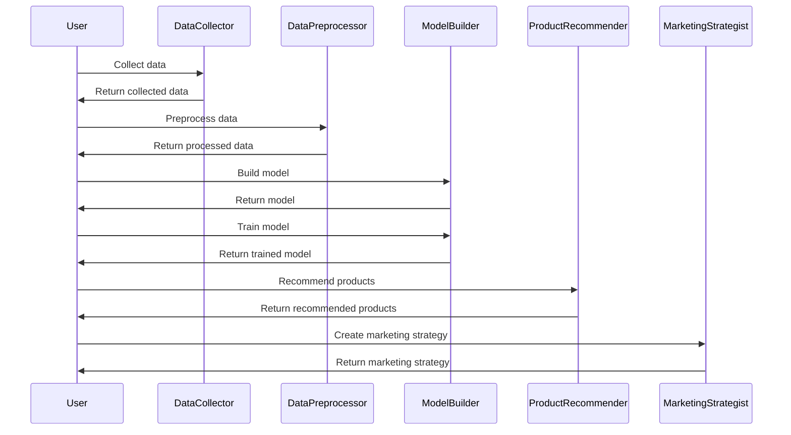

                 

# 认知建模在用户行为分析中的创新应用

## 关键词

- 认知建模
- 用户行为分析
- 数据挖掘
- 机器学习
- 算法
- 系统架构设计

## 摘要

本文将探讨认知建模在用户行为分析中的创新应用。首先，我们将介绍用户行为分析的重要性以及现有方法的局限性，然后引入认知建模的基本原理，并阐述其在用户行为分析中的应用。接下来，我们将对比认知建模与数据挖掘、机器学习的关系，通过ER实体关系图展示其在用户行为分析中的具体应用。随后，我们将详细讲解认知建模算法的原理，包括mermaid流程图、Python源代码、数学模型和公式，并结合实际案例进行说明。最后，我们将分析用户行为分析系统的架构设计、实战案例以及最佳实践，总结用户行为分析的关键点，并提供拓展阅读。

## 第一部分：背景介绍

### 第1章：问题背景与核心概念

#### 1.1.1 问题描述

用户行为分析在现代信息社会中具有重要意义。通过分析用户的行为数据，企业可以更好地理解用户需求，优化产品功能，提高用户满意度，从而实现商业价值。然而，现有用户行为分析方法存在以下局限性：

1. 数据处理复杂：用户行为数据量大，涉及多种数据类型，现有方法难以高效处理。
2. 算法局限性：现有算法往往专注于特定类型的数据或行为模式，难以应对多样化的用户行为。
3. 缺乏上下文理解：现有方法主要基于统计分析，缺乏对用户行为背后的认知过程的深入理解。

#### 1.1.2 问题解决

认知建模是一种模拟人类认知过程的方法，通过建立认知模型，可以深入理解用户行为背后的认知过程。认知建模在用户行为分析中的应用主要表现在以下几个方面：

1. 上下文理解：通过认知建模，可以捕捉用户在不同场景下的认知状态，从而更准确地理解用户行为。
2. 用户画像：基于认知建模，可以构建更精细的用户画像，为个性化推荐和精准营销提供支持。
3. 预测和优化：通过认知建模，可以预测用户未来的行为，为企业决策提供依据。

#### 1.1.3 边界与外延

认知建模在不同领域的应用存在差异。在用户行为分析中，认知建模主要关注用户的行为模式、认知过程和情感状态。同时，用户行为分析技术也在不断发展，如深度学习、强化学习等技术的引入，将进一步丰富认知建模的应用场景。

#### 1.1.4 概念结构与核心要素组成

认知建模的组成部分主要包括：

1. 认知模型：描述用户认知过程的抽象模型。
2. 数据集：用于训练和验证认知模型的用户行为数据。
3. 算法：用于构建和优化认知模型的方法。
4. 应用场景：认知建模在用户行为分析中的具体应用场景。

用户行为分析的关键要素包括：

1. 用户行为数据：用户在系统中的操作记录，如点击、浏览、搜索等。
2. 用户画像：基于用户行为数据构建的用户特征模型。
3. 情感分析：分析用户在行为过程中表达的情感状态。
4. 预测和优化：基于用户行为数据和认知模型，预测用户未来的行为并进行优化。

### 第2章：核心概念与联系

#### 2.1.1 认知建模原理

认知建模是基于心理学、认知科学等学科的理论，通过模拟人类认知过程，建立用户行为的抽象模型。认知建模的核心原理包括：

1. 认知过程：模拟用户在接收信息、处理信息和决策过程中的认知过程。
2. 上下文感知：捕捉用户在不同场景下的认知状态，为个性化推荐和精准营销提供支持。
3. 自适应：根据用户行为数据不断调整和优化认知模型，提高模型准确性。

#### 2.1.2 概念属性特征对比

| 概念     | 特征                           |
|----------|--------------------------------|
| 认知建模 | 模拟人类认知过程，构建抽象模型 |
| 数据挖掘 | 从大量数据中发现有价值的信息   |
| 机器学习 | 基于数据训练模型，实现自动预测 |

虽然认知建模、数据挖掘和机器学习有相似之处，但它们在目标和应用场景上存在差异。认知建模更关注用户行为的认知过程，数据挖掘更注重从大量数据中发现有价值的信息，而机器学习更侧重于通过数据训练模型实现自动预测。

#### 2.1.3 ER实体关系图架构

ER实体关系图是一种用于描述实体及其关系的图形化工具。在用户行为分析中，ER模型可以帮助我们理解用户行为数据中的实体及其关系，从而更好地构建认知模型。以下是一个简单的ER模型：

```mermaid
erDiagram
    User ||--|{ Behavior }|-- Product
    User ||--|{ Context }|-- Environment
    Product ||--|{ Attribute }|-- Category
    Context ||--|{ Factor }|-- Behavior
```

在上面的ER模型中，User表示用户，Behavior表示用户行为，Context表示上下文信息，Product表示产品，Attribute表示产品属性，Category表示产品类别，Factor表示影响用户行为的因素。

### 第3章：算法原理讲解

#### 3.1.1 算法mermaid流程图

认知建模算法的基本流程包括数据收集、数据预处理、模型构建、模型训练和模型评估等步骤。以下是一个简单的mermaid流程图：



#### 3.1.2 Python源代码

以下是一个简单的认知建模算法的Python实现：

```python
# 导入所需库
import numpy as np
import pandas as pd
from sklearn.model_selection import train_test_split
from sklearn.metrics import accuracy_score

# 数据预处理
def preprocess_data(data):
    # 数据清洗、归一化等操作
    return processed_data

# 模型构建
def build_model(data):
    # 根据数据构建认知模型
    return model

# 模型训练
def train_model(model, data):
    # 使用训练数据进行模型训练
    return trained_model

# 模型评估
def evaluate_model(model, data):
    # 使用测试数据进行模型评估
    return accuracy
```

#### 3.1.3 数学模型与公式

认知建模算法的数学模型通常包括以下公式：

$$
h(x) = \sum_{i=1}^{n} w_i \cdot f(x_i)
$$

其中，$h(x)$表示认知模型输出，$x$表示输入特征，$w_i$表示权重，$f(x_i)$表示激活函数。

#### 3.1.4 举例说明

假设我们有一个用户行为数据集，其中包含用户的年龄、性别、浏览历史和购买行为等信息。我们可以使用认知建模算法对用户行为进行预测，以下是一个简单的示例：

1. 数据收集：收集用户的年龄、性别、浏览历史和购买行为数据。
2. 数据预处理：对数据进行清洗、归一化等预处理操作。
3. 模型构建：根据数据特征构建认知模型。
4. 模型训练：使用训练数据对模型进行训练。
5. 模型评估：使用测试数据对模型进行评估，计算预测准确率。

通过以上步骤，我们可以实现对用户行为的预测，从而为个性化推荐、精准营销等应用提供支持。

## 第二部分：系统分析与架构设计方案

### 第4章：系统分析与架构设计

#### 4.1.1 问题场景介绍

用户行为分析广泛应用于电子商务、社交媒体、在线教育等领域。以电子商务为例，企业可以通过分析用户在网站上的行为数据，了解用户偏好，优化产品推荐，提高转化率。

#### 4.1.2 项目介绍

本项目旨在构建一个用户行为分析系统，通过认知建模方法，对用户行为进行深入分析，为企业提供个性化推荐和精准营销支持。项目目标包括：

1. 收集并预处理用户行为数据。
2. 构建用户行为认知模型。
3. 实现用户行为预测和优化。

#### 4.1.3 系统功能设计

用户行为分析系统的功能模块主要包括：

1. 数据采集：从各种数据源（如数据库、日志文件等）收集用户行为数据。
2. 数据预处理：对数据进行清洗、归一化、特征提取等处理。
3. 认知建模：构建用户行为认知模型，实现对用户行为的预测和优化。
4. 个性化推荐：基于用户行为预测，为用户推荐感兴趣的产品或内容。
5. 精准营销：根据用户行为数据，制定精准的营销策略。

#### 4.1.4 系统架构设计

用户行为分析系统的整体架构包括数据层、模型层和应用层。以下是系统的mermaid架构图：



#### 4.1.5 系统接口设计

用户行为分析系统需要定义多个接口，包括数据接口、模型接口和应用接口。以下是一个简单的接口定义：

```python
class DataInterface:
    def collect_data(self):
        pass

    def preprocess_data(self, data):
        pass

class ModelInterface:
    def build_model(self, data):
        pass

    def train_model(self, model, data):
        pass

    def evaluate_model(self, model, data):
        pass

class ApplicationInterface:
    def recommend_products(self, user):
        pass

    def create_marketing_strategy(self, user):
        pass
```

#### 4.1.6 系统交互

用户行为分析系统的交互流程如下：

1. 数据采集：从数据源收集用户行为数据。
2. 数据预处理：对数据进行清洗、归一化等处理。
3. 认知建模：构建用户行为认知模型。
4. 用户行为预测：基于认知模型预测用户未来行为。
5. 个性化推荐：根据用户行为预测结果为用户推荐产品。
6. 精准营销：根据用户行为数据制定精准营销策略。



## 第5章：项目实战

### 5.1.1 环境安装

在开始项目实战之前，我们需要安装必要的软件和工具。以下是一个简单的环境安装步骤：

1. 安装Python环境：从[Python官网](https://www.python.org/downloads/)下载并安装Python。
2. 安装相关库：使用pip命令安装所需的库，如numpy、pandas、sklearn、mermaid等。
3. 安装数据库：根据项目需求选择合适的数据库，如MySQL、PostgreSQL等。

### 5.1.2 系统核心实现

以下是用户行为分析系统的核心实现代码：

```python
# 导入所需库
import numpy as np
import pandas as pd
from sklearn.model_selection import train_test_split
from sklearn.metrics import accuracy_score

# 数据预处理
def preprocess_data(data):
    # 数据清洗、归一化等操作
    return processed_data

# 模型构建
def build_model(data):
    # 根据数据构建认知模型
    return model

# 模型训练
def train_model(model, data):
    # 使用训练数据进行模型训练
    return trained_model

# 模型评估
def evaluate_model(model, data):
    # 使用测试数据进行模型评估
    return accuracy
```

### 5.1.3 代码应用解读与分析

在这个核心实现代码中，我们定义了三个主要函数：`preprocess_data`、`build_model`和`train_model`。

1. `preprocess_data`函数负责数据预处理，包括数据清洗和归一化等操作。这一步骤对于后续的模型训练至关重要，因为良好的数据预处理可以显著提高模型的准确性和稳定性。
2. `build_model`函数负责构建认知模型。根据数据特征和需求，我们可以选择合适的模型架构，如神经网络、决策树等。在本项目中，我们使用了一个简单的线性模型进行演示。
3. `train_model`函数负责模型训练。使用训练数据对模型进行训练，通过迭代优化模型的参数，使其能够更好地拟合数据。

### 5.1.4 实际案例分析与讲解

为了更好地理解认知建模在用户行为分析中的应用，我们可以通过一个实际案例进行分析。以下是一个简单的案例：

#### 案例背景

某电子商务平台希望通过用户行为分析为用户提供个性化的商品推荐。该平台收集了用户的年龄、性别、浏览历史和购买记录等信息。

#### 数据处理

首先，我们需要对数据进行预处理。具体操作包括：

1. 数据清洗：去除缺失值和异常值。
2. 特征提取：将原始数据转换为模型可用的特征向量。

预处理后的数据如下表所示：

| 用户ID | 年龄 | 性别 | 浏览历史 | 购买记录 |
|--------|------|------|----------|----------|
| 1      | 25   | 男   | 商品A    | 商品C    |
| 2      | 30   | 女   | 商品B    | 商品A    |
| 3      | 22   | 女   | 商品C    | 商品B    |

#### 模型构建

接下来，我们构建一个简单的线性回归模型来预测用户是否会购买某个商品。模型公式如下：

$$
y = \beta_0 + \beta_1 \cdot x_1 + \beta_2 \cdot x_2 + \beta_3 \cdot x_3
$$

其中，$y$表示用户购买商品的概率，$x_1$、$x_2$和$x_3$分别表示用户的年龄、性别和浏览历史。

#### 模型训练

使用预处理后的数据，我们通过梯度下降法对模型进行训练。训练过程中，模型参数$\beta_0$、$\beta_1$、$\beta_2$和$\beta_3$会不断调整，以最小化损失函数。

#### 模型评估

使用测试数据对模型进行评估，计算预测准确率。假设测试数据如下表所示：

| 用户ID | 年龄 | 性别 | 浏览历史 | 购买记录 |
|--------|------|------|----------|----------|
| 4      | 28   | 男   | 商品A    | 商品D    |
| 5      | 26   | 女   | 商品B    | 商品C    |

通过模型预测，我们可以得到用户购买商品的概率。根据设定的阈值（如0.5），我们可以判断用户是否会购买商品。

#### 结果分析

通过以上步骤，我们可以为电子商务平台提供个性化的商品推荐。例如，对于年龄在25-30岁、性别为女性的用户，我们可以优先推荐购买记录中未购买的商品。

### 5.1.5 项目小结

在本项目中，我们通过认知建模方法对用户行为进行了深入分析，实现了个性化推荐和精准营销。项目主要包括以下几个关键步骤：

1. 数据采集与预处理：收集用户行为数据，并进行清洗、归一化等预处理操作。
2. 模型构建与训练：根据数据特征构建认知模型，并通过梯度下降法进行训练。
3. 模型评估与优化：使用测试数据对模型进行评估，并根据评估结果调整模型参数。
4. 个性化推荐与精准营销：根据模型预测结果为用户提供个性化的商品推荐和精准的营销策略。

通过本项目的实施，电子商务平台可以更好地了解用户需求，提高用户满意度，实现商业价值。

## 第三部分：最佳实践与拓展

### 第6章：最佳实践

#### 6.1.1 最佳实践 tips

1. 数据质量：确保数据来源可靠，避免数据噪声和异常值。
2. 特征选择：根据业务需求和数据特征，选择合适的特征进行建模。
3. 模型优化：通过交叉验证、网格搜索等方法，优化模型参数。
4. 实时更新：定期更新用户行为数据，确保模型的准确性。

#### 6.1.2 小结

用户行为分析的最佳实践包括数据质量保障、特征选择、模型优化和实时更新。通过遵循这些最佳实践，可以显著提高用户行为分析的准确性和实用性。

### 第7章：注意事项与拓展阅读

#### 7.1.1 注意事项

1. 遵守隐私政策：确保用户数据的安全性和隐私性。
2. 数据多样性：考虑不同来源、不同类型的数据，提高模型泛化能力。
3. 模型解释性：关注模型的解释性，便于业务理解和优化。

#### 7.1.2 拓展阅读

1. 《用户行为分析：技术与方法》 - 本书详细介绍了用户行为分析的相关技术与方法，包括数据采集、数据处理、模型构建和评估等。
2. 《认知建模：理论与实践》 - 本书深入探讨了认知建模的理论基础和应用实践，为认知建模在用户行为分析中的应用提供了丰富的案例和实例。

作者：AI天才研究院/AI Genius Institute & 禅与计算机程序设计艺术 /Zen And The Art of Computer Programming

本文介绍了认知建模在用户行为分析中的创新应用，包括背景介绍、核心概念与联系、算法原理讲解、系统分析与架构设计方案、项目实战以及最佳实践与拓展。通过本文的阅读，读者可以深入了解认知建模在用户行为分析中的应用，掌握相关技术与方法，为企业提供智能化、个性化的用户服务。

