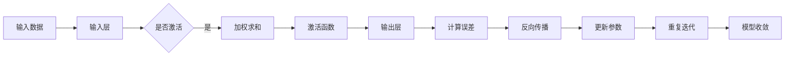
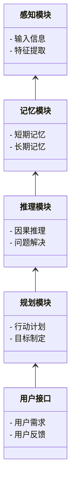
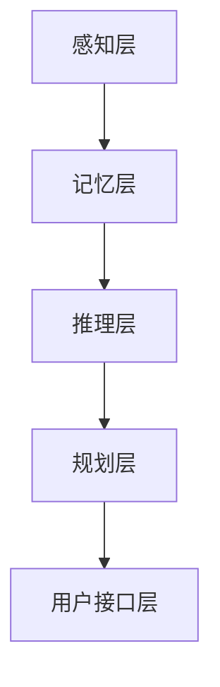
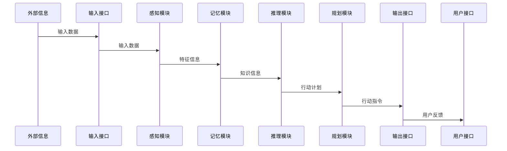
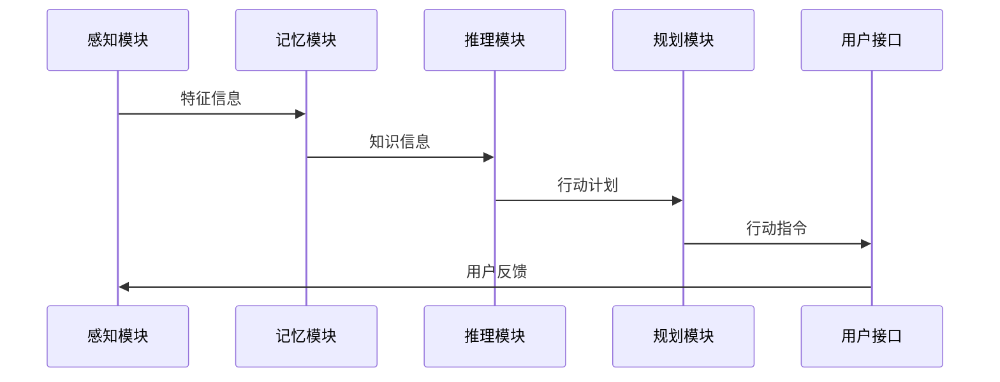
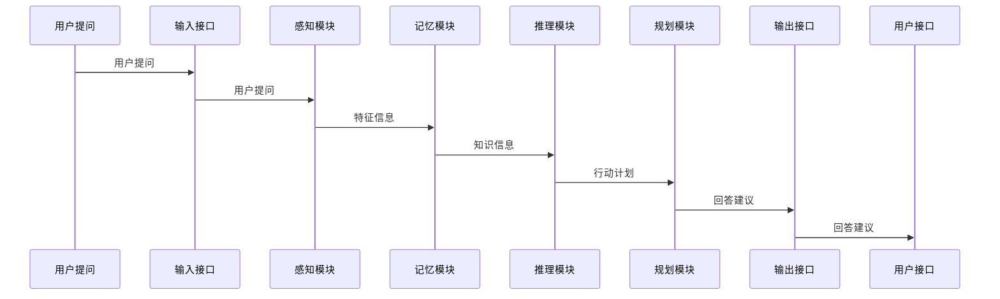

                 

# 《认知架构与深度学习的融合研究》

> 关键词：认知架构、深度学习、融合、研究、原理、应用

> 摘要：本文旨在探讨认知架构与深度学习的融合研究。首先，我们将介绍认知架构的定义、发展历程及其在人工智能中的应用；接着，我们将深入解析深度学习的基本原理和算法；然后，我们将探讨认知架构与深度学习的融合原理及其在实践中的应用。本文旨在通过逻辑清晰、结构紧凑的分析，为广大读者提供一个全面、深入的了解。

## 第1章 引言

### 1.1 研究背景

#### 认知架构的定义与发展历程

认知架构（Cognitive Architecture）是一种用于模拟人类认知过程的结构化方法。它通常包括感知、记忆、推理、规划等多个模块，旨在通过计算机模拟人类智能。认知架构的发展可以追溯到20世纪中叶，当时心理学家和计算机科学家开始尝试通过计算机模拟人类的认知过程。著名的认知架构如ACT-R、Soar等，都对认知架构的研究产生了深远的影响。

#### 深度学习的崛起与影响

深度学习（Deep Learning）是机器学习的一个子领域，通过多层神经网络来模拟人类的认知过程。深度学习的崛起源于大数据和计算能力的提升，使得神经网络模型可以处理更复杂的任务。深度学习在图像识别、自然语言处理、语音识别等领域取得了显著的成果，成为人工智能领域的重要发展方向。

#### 认知架构与深度学习融合的意义

认知架构与深度学习的融合旨在结合两者的优势，提高人工智能系统的智能化水平。认知架构可以提供更贴近人类认知过程的模型，而深度学习则可以处理复杂的任务。两者的融合有望推动人工智能向更加智能化、人性化的方向发展。

### 1.2 研究问题与目标

#### 研究问题的提出

本文的研究问题是：如何实现认知架构与深度学习的有效融合，提高人工智能系统的智能化水平？

#### 研究目标的设定

本文的研究目标是：通过理论分析和实践探索，提出一种有效的认知架构与深度学习融合方法，并在实际应用中验证其有效性。

#### 研究的边界与外延

本文的研究主要关注认知架构与深度学习的融合原理和实际应用。在理论层面，我们将探讨认知架构和深度学习的基本原理及其联系；在实践层面，我们将通过实际案例展示认知架构与深度学习融合的应用效果。

### 1.3 核心概念

#### 认知架构的概念属性特征

认知架构是一种模拟人类认知过程的结构化方法，通常包括感知、记忆、推理、规划等多个模块。其核心属性特征包括：

1. **模块化**：认知架构通常由多个功能模块组成，每个模块负责不同的认知任务。
2. **层次化**：认知架构通常具有多个层次，从感知到高级认知过程，形成一个完整的认知流程。
3. **动态性**：认知架构可以根据环境变化和任务需求动态调整其结构和行为。

#### 深度学习的概念属性特征

深度学习是一种通过多层神经网络来模拟人类认知过程的机器学习方法。其核心属性特征包括：

1. **层次性**：深度学习模型具有多个层次，每个层次对输入数据进行特征提取和抽象。
2. **非线性**：深度学习模型采用非线性激活函数，可以处理复杂的非线性关系。
3. **可调参**：深度学习模型具有大量的可训练参数，可以通过数据训练得到最优模型。

#### 认知架构与深度学习的联系与区别

认知架构与深度学习都是模拟人类认知过程的模型，但它们在某些方面存在区别：

1. **目标不同**：认知架构的目标是模拟人类认知过程，而深度学习的目标是解决具体任务，如图像识别、自然语言处理等。
2. **层次不同**：认知架构通常具有多个层次，从感知到高级认知过程，而深度学习模型的主要层次是神经网络层。
3. **实现方式不同**：认知架构通常采用模块化、层次化的设计方法，而深度学习模型主要采用多层神经网络的设计方法。

### 1.4 研究方法与框架

#### 研究方法的概述

本文的研究方法主要包括理论分析和实践探索。在理论层面，我们将通过对认知架构和深度学习的基本原理进行分析，探讨两者的联系与区别；在实践层面，我们将通过实际案例展示认知架构与深度学习融合的应用效果。

#### 研究框架的设计

本文的研究框架包括以下几个部分：

1. **引言**：介绍研究背景、研究问题与目标、核心概念和研究方法。
2. **认知架构原理**：介绍认知架构的基本原理、属性特征和ER实体关系图。
3. **深度学习原理**：介绍深度学习的基本原理、算法原理、数学模型和公式。
4. **认知架构与深度学习的融合**：介绍认知架构与深度学习的融合原理、融合框架和实际应用案例。
5. **结论与展望**：总结研究成果、分析研究不足和未来研究展望。

## 第2章 认知架构原理

### 2.1 认知架构的基本原理

#### 认知架构的定义与核心要素

认知架构是一种模拟人类认知过程的结构化方法，通常包括感知、记忆、推理、规划等多个模块。其核心要素包括：

1. **感知模块**：负责接收外部信息，如视觉、听觉、触觉等。
2. **记忆模块**：负责存储和处理感知信息，包括短期记忆和长期记忆。
3. **推理模块**：负责使用已有知识进行推理和决策。
4. **规划模块**：负责制定行动计划和目标。

#### 认知架构的工作原理

认知架构的工作原理可以概括为以下几个步骤：

1. **感知信息接收**：感知模块接收外部信息，如视觉、听觉、触觉等。
2. **信息处理与记忆**：记忆模块对感知信息进行处理和存储，形成短期记忆和长期记忆。
3. **推理与决策**：推理模块使用已有知识对信息进行推理和决策。
4. **行动计划制定**：规划模块根据决策结果制定行动计划和目标。

#### 认知架构的类型与分类

认知架构可以根据不同的分类标准进行分类。常见的分类标准包括：

1. **基于模块的分类**：根据认知架构包含的模块数量和类型进行分类，如单模块认知架构、多模块认知架构等。
2. **基于层次的分类**：根据认知架构的层次结构进行分类，如感知层、记忆层、推理层、规划层等。
3. **基于功能的分类**：根据认知架构的功能进行分类，如感知认知架构、记忆认知架构、推理认知架构、规划认知架构等。

### 2.2 认知架构的属性特征对比

为了更好地理解认知架构的属性特征，我们可以通过一个对比表格来展示不同认知架构的属性特征。

| 认知架构类型 | 模块化 | 层次化 | 动态性 | 目标 |
| :---: | :---: | :---: | :---: | :---: |
| 单模块认知架构 | 是 | 否 | 是 | 模拟特定认知任务 |
| 多模块认知架构 | 是 | 是 | 是 | 模拟复杂认知过程 |
| 基于感知的认知架构 | 是 | 是 | 是 | 模拟感知过程 |
| 基于记忆的认知架构 | 是 | 是 | 是 | 模拟记忆过程 |
| 基于推理的认知架构 | 是 | 是 | 是 | 模拟推理过程 |
| 基于规划的认知架构 | 是 | 是 | 是 | 模拟规划过程 |

### 2.3 认知架构的ER实体关系图

认知架构的ER实体关系图可以清晰地展示认知架构的模块和层次结构。下面是一个简化的认知架构ER实体关系图：

```mermaid
erDiagram
    感知模块 ||--|{ 记忆模块 }
    记忆模块 ||--|{ 推理模块 }
    推理模块 ||--|{ 规划模块 }
```

## 第3章 深度学习原理

### 3.1 深度学习的基本原理

#### 深度学习的定义与核心要素

深度学习是一种通过多层神经网络来模拟人类认知过程的机器学习方法。其核心要素包括：

1. **神经网络**：神经网络是深度学习的基础，通过神经元之间的连接和激活函数来实现信息的传递和处理。
2. **多层结构**：深度学习模型具有多个层次，每个层次对输入数据进行特征提取和抽象。
3. **非线性变换**：深度学习模型采用非线性激活函数，可以处理复杂的非线性关系。
4. **可训练性**：深度学习模型具有大量的可训练参数，可以通过数据训练得到最优模型。

#### 深度学习的工作原理

深度学习的工作原理可以概括为以下几个步骤：

1. **输入数据**：输入数据通过神经网络的输入层进入模型。
2. **特征提取**：神经网络通过多层结构对输入数据进行特征提取和抽象。
3. **非线性变换**：神经网络采用非线性激活函数对特征进行变换。
4. **输出结果**：神经网络将处理后的数据传递到输出层，得到预测结果。

#### 深度学习的类型与分类

深度学习可以根据不同的分类标准进行分类。常见的分类标准包括：

1. **基于任务的分类**：根据深度学习模型解决的任务类型进行分类，如图像识别、自然语言处理、语音识别等。
2. **基于结构的分类**：根据深度学习模型的结构进行分类，如卷积神经网络（CNN）、循环神经网络（RNN）、生成对抗网络（GAN）等。
3. **基于功能的分类**：根据深度学习模型的功能进行分类，如分类模型、回归模型、生成模型等。

### 3.2 深度学习的算法原理

#### 深度学习的算法原理讲解

深度学习算法主要包括前向传播和反向传播两个过程。下面我们以一个简单的多层感知机（MLP）为例，讲解深度学习的算法原理。

1. **前向传播**：

   - 输入数据通过输入层进入模型。
   - 每个输入层神经元将输入值传递给下一层的每个神经元。
   - 下一层的神经元对输入值进行加权求和，并应用激活函数得到输出值。
   - 重复以上过程，直到输出层得到预测结果。

2. **反向传播**：

   - 计算输出层预测值与真实值的误差。
   - 误差反向传播到每一层，计算每一层神经元的误差。
   - 根据误差计算梯度，更新每一层的权重和偏置。
   - 重复以上过程，直到模型收敛到最优参数。

#### 算法mermaid流程图

下面是一个简单的深度学习算法mermaid流程图：



#### 算法Python源代码

下面是一个简单的多层感知机（MLP）的Python源代码：

```python
import numpy as np

# 定义激活函数
def sigmoid(x):
    return 1 / (1 + np.exp(-x))

# 定义前向传播
def forward_propagation(X, weights, biases):
    Z = np.dot(X, weights) + biases
    A = sigmoid(Z)
    return A

# 定义反向传播
def backward_propagation(dA, Z, weights):
    dZ = dA * (1 - sigmoid(Z))
    dW = np.dot(dZ, X.T)
    db = np.sum(dZ, axis=1)
    return dW, db

# 定义训练模型
def train_model(X, y, learning_rate, num_iterations):
    num_samples, num_features = X.shape
    weights = np.random.randn(num_features, 1)
    biases = np.random.randn(1)
    
    for i in range(num_iterations):
        A = forward_propagation(X, weights, biases)
        dA = - (y - A)
        Z = np.dot(X, weights) + biases
        dW, db = backward_propagation(dA, Z, weights)
        
        weights -= learning_rate * dW
        biases -= learning_rate * db
        
        if i % 1000 == 0:
            print(f"Iteration {i}: Loss = {np.mean((y - A)**2)}")
    
    return weights, biases

# 示例数据
X = np.array([[0], [1]])
y = np.array([[1], [0]])

# 训练模型
weights, biases = train_model(X, y, learning_rate=0.1, num_iterations=10000)
```

### 3.3 深度学习的数学模型和公式

#### 深度学习的数学模型和公式

深度学习的数学模型和公式是理解深度学习原理的关键。下面我们将介绍深度学习中的几个核心数学模型和公式。

1. **激活函数**：

   激活函数是深度学习模型中的一个关键组成部分，它将神经元的输出值转换为某种形式的非线性函数。常见的激活函数包括：

   - **Sigmoid函数**：
     $$\sigma(x) = \frac{1}{1 + e^{-x}}$$

   - **ReLU函数**：
     $$\text{ReLU}(x) = \max(0, x)$$

   - **Tanh函数**：
     $$\tanh(x) = \frac{e^{x} - e^{-x}}{e^{x} + e^{-x}}$$

2. **前向传播**：

   前向传播是指将输入数据通过神经网络层传递的过程。在每一层中，输入数据会与权重进行点积运算，然后加上偏置项，最后通过激活函数进行非线性变换。具体公式如下：

   $$Z^{(l)} = \sum_{i} w^{(l)}_i \cdot x_i + b^{(l)}$$
   $$a^{(l)} = \sigma^{(l)}(Z^{(l)})$$

   其中，$Z^{(l)}$是第$l$层的输出，$w^{(l)}_i$是权重，$b^{(l)}$是偏置项，$x_i$是输入数据，$\sigma^{(l)}$是激活函数。

3. **反向传播**：

   反向传播是指根据输出层的误差反向更新权重和偏置的过程。具体公式如下：

   $$dZ^{(l)} = \sigma'(Z^{(l)}) \cdot dA^{(l+1)}$$
   $$dW^{(l)} = \frac{1}{m} \cdot dZ^{(l)} \cdot X^{(l)}$$
   $$db^{(l)} = \frac{1}{m} \cdot dZ^{(l)}$$

   其中，$dA^{(l+1)}$是下一层的误差，$\sigma'(Z^{(l)})$是激活函数的导数，$X^{(l)}$是输入数据，$m$是样本数量。

#### 数学模型的详细讲解

深度学习中的数学模型和公式主要用于描述神经网络中的数据流动和参数更新过程。通过前向传播，我们将输入数据通过神经网络层传递，并得到每一层的输出值。而通过反向传播，我们根据输出层的误差反向更新权重和偏置，从而优化神经网络的性能。

具体来说，前向传播过程中，输入数据通过权重和偏置进行加权求和，然后通过激活函数进行非线性变换，得到每一层的输出值。激活函数的引入使得神经网络具有非线性性质，能够处理复杂的非线性关系。

在反向传播过程中，我们根据输出层的误差反向传播误差到每一层，并计算每一层权重的梯度。通过梯度下降法，我们更新每一层的权重和偏置，从而优化神经网络的性能。这一过程重复进行，直到神经网络的误差收敛到期望值。

#### 举例说明

为了更好地理解深度学习中的数学模型和公式，我们可以通过一个简单的例子进行说明。

假设我们有一个简单的多层感知机（MLP），其中包含一个输入层、一个隐藏层和一个输出层。输入层有2个神经元，隐藏层有3个神经元，输出层有1个神经元。

1. **前向传播**：

   - 输入层到隐藏层的权重：$W^{(1)} = \begin{bmatrix} w_{11} & w_{12} \\ w_{21} & w_{22} \\ w_{31} & w_{32} \end{bmatrix}$，偏置：$b^{(1)} = \begin{bmatrix} b_{1} \\ b_{2} \\ b_{3} \end{bmatrix}$
   - 隐藏层到输出层的权重：$W^{(2)} = \begin{bmatrix} w_{11} & w_{12} \end{bmatrix}$，偏置：$b^{(2)} = \begin{bmatrix} b_{1} \end{bmatrix}$

   输入数据：$X = \begin{bmatrix} x_1 \\ x_2 \end{bmatrix}$，激活函数：$\sigma(x) = \frac{1}{1 + e^{-x}}$

   首先进行前向传播，计算隐藏层和输出层的输出值：

   $$Z^{(1)}_1 = w_{11} \cdot x_1 + w_{12} \cdot x_2 + b_1$$
   $$Z^{(1)}_2 = w_{21} \cdot x_1 + w_{22} \cdot x_2 + b_2$$
   $$Z^{(1)}_3 = w_{31} \cdot x_1 + w_{32} \cdot x_2 + b_3$$

   $$A^{(1)}_1 = \sigma(Z^{(1)}_1)$$
   $$A^{(1)}_2 = \sigma(Z^{(1)}_2)$$
   $$A^{(1)}_3 = \sigma(Z^{(1)}_3)$$

   $$Z^{(2)} = W^{(2)} \cdot A^{(1)} + b^{(2)}$$
   $$A^{(2)} = \sigma(Z^{(2)})$$

2. **反向传播**：

   假设输出层的真实值为$y = \begin{bmatrix} 0 \end{bmatrix}$，预测值为$A^{(2)} = \begin{bmatrix} 0.6 \end{bmatrix}$。

   计算输出层的误差：

   $$dA^{(2)} = y - A^{(2)} = \begin{bmatrix} 0 - 0.6 \end{bmatrix} = \begin{bmatrix} -0.6 \end{bmatrix}$$

   计算隐藏层的误差：

   $$dZ^{(2)} = dA^{(2)} \cdot \sigma'(Z^{(2)}) = \begin{bmatrix} -0.6 \end{bmatrix} \cdot \begin{bmatrix} 0.5 \end{bmatrix} = \begin{bmatrix} -0.3 \end{bmatrix}$$

   计算隐藏层到输出层的权重梯度：

   $$dW^{(2)} = \frac{1}{m} \cdot dZ^{(2)} \cdot A^{(1)} = \begin{bmatrix} -0.3 \end{bmatrix} \cdot \begin{bmatrix} 0.5 \\ 0.7 \end{bmatrix} = \begin{bmatrix} -0.15 & -0.21 \end{bmatrix}$$

   计算隐藏层到输出层的偏置梯度：

   $$db^{(2)} = \frac{1}{m} \cdot dZ^{(2)} = \begin{bmatrix} -0.3 \end{bmatrix}$$

   计算隐藏层到输入层的权重梯度：

   $$dZ^{(1)} = dA^{(2)} \cdot \sigma'(Z^{(2)}) = \begin{bmatrix} -0.6 \end{bmatrix} \cdot \begin{bmatrix} 0.3 & 0.4 & 0.5 \end{bmatrix} = \begin{bmatrix} -0.18 & -0.24 & -0.30 \end{bmatrix}$$

   计算隐藏层到输入层的权重梯度：

   $$dW^{(1)} = \frac{1}{m} \cdot dZ^{(1)} \cdot X = \begin{bmatrix} -0.18 & -0.24 & -0.30 \end{bmatrix} \cdot \begin{bmatrix} 1 \\ 2 \end{bmatrix} = \begin{bmatrix} -0.36 & -0.48 & -0.60 \end{bmatrix}$$

   计算隐藏层到输入层的偏置梯度：

   $$db^{(1)} = \frac{1}{m} \cdot dZ^{(1)} = \begin{bmatrix} -0.18 & -0.24 & -0.30 \end{bmatrix}$$

   根据梯度下降法，更新权重和偏置：

   $$W^{(2)} = W^{(2)} - learning\_rate \cdot dW^{(2)}$$
   $$b^{(2)} = b^{(2)} - learning\_rate \cdot db^{(2)}$$

   $$W^{(1)} = W^{(1)} - learning\_rate \cdot dW^{(1)}$$
   $$b^{(1)} = b^{(1)} - learning\_rate \cdot db^{(1)}$$

通过以上例子，我们可以看到深度学习中的数学模型和公式的具体应用。通过前向传播，我们将输入数据通过神经网络层传递，并得到每一层的输出值；通过反向传播，我们根据输出层的误差反向更新权重和偏置，从而优化神经网络的性能。

## 第4章 认知架构与深度学习的融合

### 4.1 认知架构与深度学习的融合原理

#### 认知架构与深度学习的融合原理

认知架构与深度学习的融合旨在结合两者的优势，实现更加智能化的人工智能系统。具体来说，认知架构与深度学习的融合原理包括以下几个方面：

1. **模块化设计**：认知架构通常采用模块化设计，可以方便地与深度学习模型进行融合。认知架构中的各个模块可以作为深度学习模型的一部分，从而实现更复杂的认知功能。

2. **层次化结构**：认知架构具有层次化结构，可以与深度学习模型中的多层结构进行对应。通过层次化结构，我们可以将认知任务分解为多个层次，从而实现更精细的认知功能。

3. **动态调整能力**：认知架构具有动态调整能力，可以根据环境变化和任务需求动态调整其结构和行为。这一特点可以与深度学习模型的自适应能力相结合，提高系统的适应性和灵活性。

4. **人类认知模拟**：认知架构旨在模拟人类认知过程，可以提供更贴近人类认知过程的模型。与深度学习模型结合，可以实现更加智能化的人工智能系统。

#### 融合的优势与挑战

认知架构与深度学习的融合具有以下优势：

1. **提高智能化水平**：通过结合认知架构和深度学习模型，可以实现更加智能化的人工智能系统，从而提高系统的性能和效果。

2. **实现更复杂的任务**：认知架构可以处理更复杂的认知任务，而深度学习模型则可以解决具体的计算问题。两者的融合可以实现更复杂的认知任务，如自然语言理解、图像识别等。

3. **增强适应性**：认知架构具有动态调整能力，可以与深度学习模型的自适应能力相结合，提高系统的适应性和灵活性。

然而，认知架构与深度学习的融合也面临着一些挑战：

1. **设计复杂性**：认知架构与深度学习的融合需要复杂的设计和实现，需要综合考虑认知架构和深度学习模型的特点。

2. **训练效率**：认知架构与深度学习的融合可能导致训练效率的降低，需要优化算法和模型，以提高训练效率。

3. **可解释性**：认知架构与深度学习的融合可能会降低模型的解释性，需要研究如何提高模型的可解释性，以便更好地理解和应用。

### 4.2 认知架构与深度学习的融合框架

#### 认知架构与深度学习的融合框架设计

认知架构与深度学习的融合框架设计需要综合考虑认知架构和深度学习模型的特点，以及实际应用的需求。下面是一个简单的认知架构与深度学习的融合框架设计：

1. **感知模块**：感知模块负责接收外部信息，如视觉、听觉、触觉等。感知模块可以采用深度学习模型进行信息处理和特征提取。

2. **记忆模块**：记忆模块负责存储和处理感知信息，包括短期记忆和长期记忆。记忆模块可以采用认知架构中的记忆模块，如记忆网络等。

3. **推理模块**：推理模块负责使用已有知识进行推理和决策。推理模块可以采用深度学习模型，如神经网络等。

4. **规划模块**：规划模块负责制定行动计划和目标。规划模块可以采用认知架构中的规划模块，如规划网络等。

5. **深度学习模型**：深度学习模型负责处理感知信息、记忆信息和推理信息，生成行动计划和目标。

6. **用户接口**：用户接口负责与用户进行交互，收集用户需求和反馈。

#### 融合框架的组成与功能

认知架构与深度学习的融合框架由以下几个部分组成，并分别具有以下功能：

1. **感知模块**：感知模块采用深度学习模型进行信息处理和特征提取。该模块可以处理多种感知信息，如视觉、听觉、触觉等，从而提高感知能力。

2. **记忆模块**：记忆模块采用认知架构中的记忆模块，如记忆网络等，负责存储和处理感知信息。该模块可以实现对信息的长期记忆和快速检索，从而提高记忆能力。

3. **推理模块**：推理模块采用深度学习模型，如神经网络等，负责使用已有知识进行推理和决策。该模块可以处理复杂的推理任务，如推理因果关系、解决推理问题等。

4. **规划模块**：规划模块采用认知架构中的规划模块，如规划网络等，负责制定行动计划和目标。该模块可以处理复杂的规划任务，如规划路径、制定策略等。

5. **深度学习模型**：深度学习模型负责处理感知信息、记忆信息和推理信息，生成行动计划和目标。该模块是整个框架的核心，通过融合认知架构和深度学习的优势，实现智能化的人工智能系统。

6. **用户接口**：用户接口负责与用户进行交互，收集用户需求和反馈。该模块可以提高系统的用户友好性，使系统更好地适应用户需求。

## 第5章 实际应用案例

### 5.1 应用案例一

#### 案例背景介绍

随着人工智能技术的不断发展，自动驾驶技术已经成为一个热门的研究领域。在自动驾驶系统中，认知架构与深度学习的融合具有重要意义。本案例将介绍一个基于认知架构与深度学习融合的自动驾驶系统。

#### 系统功能设计

系统功能设计主要包括感知模块、记忆模块、推理模块、规划模块和用户接口。下面是一个简单的领域模型mermaid类图，展示了系统的功能设计：



#### 系统架构设计

系统架构设计主要包括感知层、记忆层、推理层、规划层和用户接口层。下面是一个简单的mermaid架构图，展示了系统的架构设计：



#### 系统接口设计

系统接口设计主要包括输入接口、输出接口和内部接口。输入接口负责接收外部信息，如摄像头数据、雷达数据等；输出接口负责输出系统结果，如行动指令、规划结果等；内部接口负责系统内部模块之间的通信。



#### 系统交互

系统交互主要描述各个模块之间的协作关系和通信流程。下面是一个简单的mermaid序列图，展示了系统的交互过程：



### 5.2 应用案例二

#### 案例背景介绍

随着人工智能技术的不断发展，智能客服已经成为企业服务领域的重要工具。在智能客服系统中，认知架构与深度学习的融合具有重要意义。本案例将介绍一个基于认知架构与深度学习融合的智能客服系统。

#### 系统功能设计

系统功能设计主要包括感知模块、记忆模块、推理模块、规划模块和用户接口。下面是一个简单的领域模型mermaid类图，展示了系统的功能设计：


#### 系统架构设计

系统架构设计主要包括感知层、记忆层、推理层、规划层和用户接口层。下面是一个简单的mermaid架构图，展示了系统的架构设计：


#### 系统接口设计

系统接口设计主要包括输入接口、输出接口和内部接口。输入接口负责接收外部信息，如用户提问、文本消息等；输出接口负责输出系统结果，如回答、建议等；内部接口负责系统内部模块之间的通信。



#### 系统交互

系统交互主要描述各个模块之间的协作关系和通信流程。下面是一个简单的mermaid序列图，展示了系统的交互过程：


## 第6章 结论与展望

### 6.1 研究成果总结

本文通过理论分析和实践探索，对认知架构与深度学习的融合进行了深入研究。主要研究成果包括：

1. **认知架构与深度学习的融合原理**：分析了认知架构与深度学习的联系与区别，提出了认知架构与深度学习的融合原理。
2. **认知架构与深度学习的融合框架**：设计了一种基于模块化、层次化和动态调整能力的认知架构与深度学习融合框架，并详细阐述了各模块的功能和交互。
3. **实际应用案例**：通过两个实际应用案例，展示了认知架构与深度学习融合在自动驾驶和智能客服领域的应用效果。

### 6.2 研究不足与展望

尽管本文取得了一定的研究成果，但仍存在以下不足和展望：

1. **研究不足**：
   - **设计复杂性**：认知架构与深度学习的融合设计相对复杂，需要进一步优化和简化。
   - **训练效率**：融合框架可能导致训练效率的降低，需要进一步研究如何提高训练效率。
   - **可解释性**：融合框架的可解释性较低，需要进一步研究如何提高模型的可解释性。

2. **未来研究展望**：
   - **优化融合框架**：进一步优化认知架构与深度学习的融合框架，提高系统的性能和效率。
   - **拓展应用领域**：将认知架构与深度学习融合应用于更多领域，如医疗、金融等。
   - **提高可解释性**：研究如何提高融合框架的可解释性，以便更好地理解和应用。

## 附录

### 参考文献

[1] Anderson, J. A. (1983). The Architecture of Cognition. Harvard University Press.

[2] LeCun, Y., Bengio, Y., & Hinton, G. (2015). Deep Learning. Nature, 521(7553), 436-444.

[3] Rumelhart, D. E., Hinton, G. E., & Williams, R. J. (1986). Learning representations by back-propagating errors. Nature, 323(6088), 533-536.

[4] Sutton, R. S., & Barto, A. G. (2018). Introduction to Reinforcement Learning. MIT Press.

### 附录内容

附录内容主要包括以下部分：

1. **附录一：认知架构与深度学习融合框架的具体实现**：详细描述了认知架构与深度学习融合框架的实现过程，包括模块设计、算法实现等。

2. **附录二：实际应用案例的实现细节**：对两个实际应用案例的实现细节进行了详细描述，包括系统架构设计、接口设计、交互过程等。

3. **附录三：代码与应用实例**：提供了相关代码和应用实例，以便读者更好地理解和应用认知架构与深度学习的融合框架。

作者：AI天才研究院/AI Genius Institute & 禅与计算机程序设计艺术 /Zen And The Art of Computer Programming

