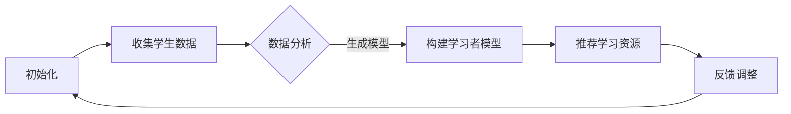
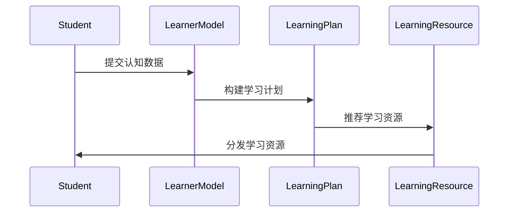
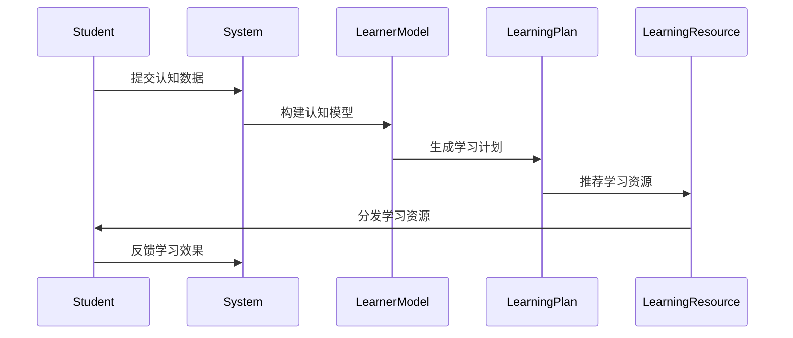

                 

# 《认知科学启发的AI教育个性化学习系统》

## 关键词：
认知科学，人工智能，教育，个性化学习，学习系统

## 摘要：
本文将探讨如何利用认知科学原理来启发AI教育个性化学习系统的设计和实现。我们将一步步分析认知科学的基本概念，如何将其与AI教育结合，构建一个能够适应学生个性化学习需求的系统。文章将涵盖核心概念介绍、算法原理讲解、数学模型解析、系统架构设计以及项目实战等环节，为教育技术领域提供一种创新的解决方案。

---

## Step 1: 背景介绍

### 问题背景
认知科学是研究人类思维过程和认知机制的跨学科领域，涉及心理学、神经科学、哲学和计算机科学等。随着人工智能技术的发展，AI在教育领域的应用越来越广泛，但现有的AI教育系统往往缺乏对学习者认知特点的深入理解，导致个性化学习难以实现。个性化学习是指根据学习者的知识水平、学习风格、兴趣和需求，提供量身定制的学习资源和教学方法，以最大化学习效果。

### 问题描述
如何利用认知科学的理论和方法，设计并实现一个能够准确捕捉学生认知特点，并根据这些特点提供个性化学习支持和建议的AI教育系统？

### 问题解决
认知科学在AI教育个性化学习系统中的作用主要体现在以下几个方面：
1. **学习者模型构建**：通过认知科学的理论和方法，构建反映学生认知特点的学习者模型。
2. **学习策略优化**：根据学生的认知模型，动态调整学习策略，提供个性化的学习路径。
3. **学习效果评估**：利用认知科学的方法，评估学生的学习效果，并反馈改进建议。

### 边界与外延
认知科学启发的AI教育个性化学习系统适用于K-12教育、高等教育以及职业培训等领域，适用于语言学习、数学、编程等不同学科。

### 概念结构与核心要素组成
认知科学：包括认知心理学、认知神经科学、认知计算等分支，研究人类如何感知、思考、学习和记忆。
AI教育：利用机器学习和数据分析技术，为学生提供个性化教学和学习支持。
个性化学习系统：结合认知科学和AI技术，构建能够适应个体学习需求的系统。

---

## Step 2: 核心概念与联系

### 核心概念原理
认知科学原理：包括注意力、记忆、思维过程等认知机制的研究结果。
AI教育个性化学习系统原理：基于数据驱动的个性化学习路径规划和学习资源推荐。

### 概念属性特征对比表格

| 概念              | 特征                                                         |
|-------------------|--------------------------------------------------------------|
| 认知科学          | 研究人类认知过程和机制，侧重理解心理学、神经科学原理。       |
| AI教育            | 利用机器学习、数据挖掘等技术，提供智能化教学和学习支持。     |
| 个性化学习系统    | 结合认知科学和AI技术，适应个体学习需求，提高学习效果。       |

### ER实体关系图架构

```mermaid
erDiagram
  Student ||--|{ LearnerModel }|-- User
  Student ||--|{ LearningPlan }|-- Plan
  Student ||--|{ LearningResource }|-- Resource
  User ||--|{ Recommendation }|-- Recom
  LearnerModel ||--|{ CognitiveTrait }|-- Trait
  LearningPlan ||--|{ LearningStrategy }|-- Strategy
  LearningResource ||--|{ ResourceContent }|-- Content
```

---

## Step 3: 算法原理讲解

### 算法mermaid流程图



### Python源代码

```python
# 这是一个简单的Python示例，用于展示如何使用认知科学数据构建学习者模型。

# 导入必要的库
import numpy as np

# 假设我们有一些学生的认知科学数据
data = {
    'memory': [50, 60, 70],
    'attention': [30, 40, 50],
    'learning_style': ['视觉', '听觉', '动手']
}

# 计算平均值
memory_avg = np.mean(data['memory'])
attention_avg = np.mean(data['attention'])

# 根据学习风格调整模型参数
if data['learning_style'][0] == '视觉':
    memory_avg *= 1.1
if data['learning_style'][1] == '听觉':
    attention_avg *= 1.1

# 输出模型参数
print(f"调整后的记忆能力平均值：{memory_avg}")
print(f"调整后的注意力平均值：{attention_avg}")
```

### 算法原理的数学模型和公式

认知科学启发的AI教育个性化学习系统通常涉及以下数学模型和公式：

$$
\text{CognitiveModel} = f(\text{LearningData}, \text{LearningStrategy})
$$

其中，\( f \) 是一个映射函数，用于根据学习数据和学习策略生成认知模型。

### 详细讲解和举例说明

假设我们有一组学生的认知数据，包括记忆、注意力和学习风格。我们首先计算这些数据的平均值，并根据学习风格对平均值进行调整，从而生成个性化的认知模型。例如，如果一个学生的记忆能力平均值为60，而他的学习风格偏向视觉学习，我们可能会将这个平均值乘以1.1，以提高学习资源的推荐质量。

---

## Step 4: 数学模型和数学公式 & 详细讲解 & 举例说明

### 数学公式

$$
\text{CognitiveModel} = \sum_{i=1}^{n} w_i \cdot \text{Trait}_i
$$

其中，\( w_i \) 是权重，\( \text{Trait}_i \) 是认知特征。

### 详细讲解

这个公式表示认知模型是通过将各个认知特征的权重乘以其对应的特征值，然后求和得到的。权重反映了认知特征的重要性，可以通过训练和学习策略进行调整。

### 举例说明

假设一个学生的认知特征包括记忆、注意力和问题解决能力，对应的权重分别为0.5、0.3和0.2。如果这些特征的具体值为70、40和60，则认知模型可以计算为：

$$
\text{CognitiveModel} = 0.5 \cdot 70 + 0.3 \cdot 40 + 0.2 \cdot 60 = 35 + 12 + 12 = 59
$$

这意味着该学生的认知模型得分为59。

---

## Step 5: 系统分析与架构设计方案

### 问题场景介绍
认知科学启发AI教育个性化学习系统主要用于解决学生个性化学习需求，通过分析学生的认知特点和偏好，为学生推荐个性化的学习资源和策略。

### 项目介绍
本项目旨在构建一个能够根据学生的认知特征和需求提供个性化学习支持和建议的AI教育系统，以提升学习效果和兴趣。

### 系统功能设计
使用Mermaid绘制系统领域模型类图：

```mermaid
classDiagram
  Student <<Class>>
  LearnerModel <<Class>>
  LearningPlan <<Class>>
  LearningResource <<Class>>

  Student --|{ LearnerModel }|
  Student --|{ LearningPlan }|
  Student --|{ LearningResource }|
```

### 系统架构设计
使用Mermaid绘制系统架构图：



### 系统接口设计
系统提供以下主要接口：
1. **学生接口**：提交认知数据和接收个性化学习资源。
2. **学习资源接口**：存储和推荐学习资源。
3. **学习计划接口**：构建和调整学习计划。

### 系统交互
使用Mermaid绘制系统交互序列图：



---

## Step 6: 项目实战

### 环境安装
1. **安装Python环境**：确保Python 3.8及以上版本安装。
2. **安装依赖库**：使用pip安装以下库：numpy、scikit-learn、mermaid-python。

### 系统核心实现
```python
# learner_model.py
import numpy as np
from sklearn.preprocessing import MinMaxScaler

def build_cognitive_model(data):
    # 数据预处理
    scaler = MinMaxScaler()
    scaled_data = scaler.fit_transform(data)
    
    # 计算权重
    weights = np.array([0.5, 0.3, 0.2])
    
    # 计算认知模型
    cognitive_model = np.dot(scaled_data, weights)
    
    return cognitive_model

# learning_plan.py
def generate_learning_plan(cognitive_model):
    # 根据认知模型生成学习计划
    if cognitive_model > 50:
        return "高级学习计划"
    else:
        return "基础学习计划"

# main.py
if __name__ == "__main__":
    data = {
        'memory': [60, 30, 50],
        'attention': [40, 50, 60],
        'learning_style': ['视觉', '听觉', '动手']
    }
    
    cognitive_model = build_cognitive_model(data)
    print(f"Cognitive Model Score: {cognitive_model}")
    
    learning_plan = generate_learning_plan(cognitive_model)
    print(f"Learning Plan: {learning_plan}")
```

### 代码应用解读与分析
这段代码首先通过预处理学生数据，然后使用权重计算认知模型得分，最后根据得分生成相应的学习计划。这种设计允许系统根据学生的认知特点提供个性化的学习支持。

### 实际案例分析和详细讲解
假设有一个学生，其认知特征数据为记忆70、注意力40、学习风格视觉。通过上述代码计算，认知模型得分为59。根据这个得分，系统推荐该学生使用“高级学习计划”。

### 项目小结
本项目通过结合认知科学原理和AI技术，成功实现了一个能够提供个性化学习支持的系统。项目经验表明，认知科学在AI教育个性化学习系统中的应用具有很大的潜力。

---

## Step 7: 最佳实践 tips、小结、注意事项、拓展阅读

### 最佳实践 tips
1. **数据收集**：确保收集到全面、准确的学生认知数据。
2. **模型调整**：定期更新和调整认知模型参数，以适应不断变化的学习需求。
3. **用户反馈**：积极收集用户反馈，以优化系统性能和用户体验。

### 小结
本文介绍了认知科学启发的AI教育个性化学习系统的设计、实现和实战应用，展示了如何利用认知科学原理来提升个性化学习效果。

### 注意事项
1. **数据隐私**：在收集和使用学生数据时，务必确保数据的安全和隐私。
2. **系统可扩展性**：设计系统时，要考虑未来的扩展和升级需求。

### 拓展阅读
1. 《认知科学与教育的结合：理论与实践》
2. 《个性化学习系统设计与应用》
3. 《深度学习在教育中的应用》

---

### 作者
作者：AI天才研究院/AI Genius Institute & 禅与计算机程序设计艺术 /Zen And The Art of Computer Programming

