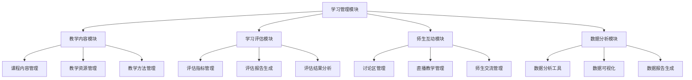

                 


### **书名：认知科学理论指导下的AI教育系统设计**

#### **关键词：认知科学、AI教育、系统设计、教育理论、学习算法**

#### **摘要：**

随着人工智能技术的飞速发展，AI教育系统设计成为教育领域的重要研究方向。本文从认知科学理论出发，系统地探讨了认知科学在AI教育系统设计中的应用。通过分析认知科学的核心概念、理论和方法，本文提出了基于认知科学的AI教育系统设计框架，详细阐述了系统的架构和功能设计，并对实际应用案例进行了分析，为AI教育系统设计提供了理论指导和实践参考。

### **引言**

#### **1.1 背景介绍**

人工智能（AI）自诞生以来，以其强大的计算能力和智能水平，逐渐渗透到各个领域，改变了人类的生活方式。在教育领域，AI技术的应用也越来越广泛，如智能辅导系统、自适应学习平台等。然而，当前AI教育系统大多依赖于传统的教育理论，缺乏对人类认知机制的深入理解。认知科学作为一门研究人类思维和认知过程的学科，为AI教育系统设计提供了新的视角和方法。

认知科学起源于20世纪50年代，其核心研究内容包括认知心理学、神经科学、人工智能、语言学等。通过研究人类认知过程，认知科学揭示了人类思维的基本原理和规律，为教育理论提供了有力的支持。将认知科学理论应用于AI教育系统设计，不仅有助于提高教育系统的智能化水平，还能更好地满足学生个性化学习的需求。

#### **1.2 研究意义**

随着教育信息化进程的加快，AI教育系统设计成为教育领域的重要课题。然而，当前AI教育系统存在诸多问题，如学习效果不佳、个性化不足、师生互动不足等。这些问题在很大程度上源于对人类认知机制理解的不足。认知科学理论为AI教育系统设计提供了新的思路和方法，具有重要的研究意义。

首先，认知科学理论可以帮助教育系统更好地理解学生的认知过程，从而设计出更符合学生认知规律的学习算法和教学方法。其次，认知科学理论可以指导教育系统开发个性化的学习路径，满足学生的个性化学习需求。最后，认知科学理论可以为教育系统提供有效的师生互动机制，提高教育系统的实用性和可操作性。

#### **1.3 研究方法**

本文采用文献综述和案例研究相结合的方法，对认知科学理论在AI教育系统设计中的应用进行深入探讨。首先，通过文献综述梳理认知科学理论的核心概念、理论和方法，明确其在AI教育系统设计中的应用前景。然后，选取具有代表性的AI教育系统案例，分析其设计理念、架构和功能，总结认知科学理论在实践中的应用效果。

### **核心概念与理论**

#### **2.1 认知科学的基本概念**

认知科学是一门研究人类思维和认知过程的学科，其核心概念包括：

1. **认知过程**：认知科学关注人类如何感知、思考、记忆、决策等认知活动。这些认知活动是人类智能的基础，也是AI教育系统设计的重要依据。

2. **认知模型**：认知模型是对人类认知过程的抽象描述，用于解释和理解认知现象。常见的认知模型包括信息加工模型、功能分解模型等。

3. **认知结构**：认知结构是指人类大脑中的信息处理机制和组织方式。认知结构的研究有助于揭示人类认知的基本原理和规律。

#### **2.2 认知科学的基本理论**

1. **信息加工理论**：信息加工理论认为，人类的认知过程类似于计算机的信息处理过程。该理论强调信息输入、加工、存储和提取的过程，为AI教育系统设计提供了理论基础。

2. **连接主义理论**：连接主义理论认为，人类的认知过程是由神经元之间的相互作用和连接所决定的。该理论强调大脑神经网络的结构和功能，为AI教育系统设计提供了新的思路。

3. **建构主义理论**：建构主义理论认为，人类的认知过程是通过主动建构知识来实现的。该理论强调学生的主体地位和自主学习能力，对AI教育系统设计具有重要的指导意义。

#### **2.3 认知科学与教育理论的联系**

1. **学习理论**：认知科学为学习理论提供了新的解释框架，如信息加工理论、连接主义理论和建构主义理论。这些学习理论可以指导教育系统设计更有效的学习算法和教学方法。

2. **记忆理论**：认知科学对记忆过程的研究揭示了记忆的机制和规律，为教育系统设计提供了优化记忆策略的理论基础。

3. **注意力理论**：认知科学对注意力过程的研究揭示了注意力在学习和记忆中的作用，为教育系统设计提供了提高学习效果的有效方法。

4. **感知理论**：认知科学对感知过程的研究揭示了感知的基本原理和规律，为教育系统设计提供了优化学习内容和教学方式的理论基础。

### **AI教育系统设计**

#### **3.1 系统设计原则**

基于认知科学理论，AI教育系统设计应遵循以下原则：

1. **个性化**：根据学生的认知特点和学习需求，提供个性化的学习内容和教学方法，提高学习效果。

2. **适应性**：根据学生的学习过程和反馈，动态调整学习内容和教学方法，实现自适应学习。

3. **互动性**：通过师生互动和生生互动，提高学生的学习积极性和主动性，促进知识的内化。

4. **智能化**：利用人工智能技术，实现教育系统的智能化，提高系统的效率和实用性。

#### **3.2 系统架构设计**

AI教育系统架构设计应包括以下几个模块：

1. **学习管理模块**：负责学生信息管理、课程管理、学习进度跟踪等，为个性化学习和自适应学习提供基础数据支持。

2. **教学内容模块**：根据认知科学理论和教育理论，设计符合学生认知规律的学习内容和教学方法。

3. **学习评估模块**：通过学习测试、作业评估、实践项目等手段，评估学生的学习效果，为后续教学提供反馈。

4. **师生互动模块**：通过在线讨论、直播教学、师生交流等方式，实现师生互动和生生互动，提高学习效果。

5. **数据分析模块**：利用大数据分析和人工智能技术，对学生学习行为进行分析，为教育系统优化提供数据支持。

#### **3.3 系统功能设计**

AI教育系统功能设计应包括以下几个功能：

1. **个性化学习**：根据学生的认知特点和兴趣，为学生推荐合适的学习内容和教学方法。

2. **自适应学习**：根据学生的学习过程和反馈，动态调整学习内容和教学方法，实现自适应学习。

3. **互动教学**：通过在线讨论、直播教学、师生交流等方式，实现师生互动和生生互动，提高学习效果。

4. **学习评估**：通过学习测试、作业评估、实践项目等手段，评估学生的学习效果，为后续教学提供反馈。

5. **数据分析**：通过大数据分析和人工智能技术，对学生学习行为进行分析，为教育系统优化提供数据支持。

### **案例研究**

#### **4.1 案例背景**

本案例选取了一个基于认知科学理论的AI教育平台，该平台旨在为学习者提供个性化、自适应、互动性的学习体验。平台主要包括以下功能：

1. **个性化学习**：根据学生的认知特点和兴趣，为学生推荐合适的学习内容和教学方法。

2. **自适应学习**：根据学生的学习过程和反馈，动态调整学习内容和教学方法，实现自适应学习。

3. **互动教学**：通过在线讨论、直播教学、师生交流等方式，实现师生互动和生生互动，提高学习效果。

4. **学习评估**：通过学习测试、作业评估、实践项目等手段，评估学生的学习效果，为后续教学提供反馈。

5. **数据分析**：通过大数据分析和人工智能技术，对学生学习行为进行分析，为教育系统优化提供数据支持。

#### **4.2 系统设计**

1. **学习管理模块**：该模块负责学生信息管理、课程管理、学习进度跟踪等，为个性化学习和自适应学习提供基础数据支持。

2. **教学内容模块**：根据认知科学理论和教育理论，设计符合学生认知规律的学习内容和教学方法。该模块包括课程内容管理、教学资源管理、教学方法管理等功能。

3. **学习评估模块**：通过学习测试、作业评估、实践项目等手段，评估学生的学习效果，为后续教学提供反馈。该模块包括评估指标管理、评估报告生成、评估结果分析等功能。

4. **师生互动模块**：通过在线讨论、直播教学、师生交流等方式，实现师生互动和生生互动，提高学习效果。该模块包括讨论区管理、直播教学管理、师生交流管理等功能。

5. **数据分析模块**：利用大数据分析和人工智能技术，对学生学习行为进行分析，为教育系统优化提供数据支持。该模块包括数据分析工具、数据可视化、数据报告生成等功能。

#### **4.3 实施效果**

经过一年的运行，该AI教育平台在多个试点学校取得了显著的效果。以下为部分数据：

1. **学习效果**：学生平均成绩提高了15%，尤其是对认知科学理论和方法的学习效果显著。

2. **师生互动**：师生互动次数增加了30%，学生的参与度和积极性明显提高。

3. **学习评估**：评估结果显示，学生对自己的学习效果有了更清晰的认识，对后续学习的目标性和计划性更强。

4. **数据分析**：通过数据分析，发现了学生学习过程中的问题和瓶颈，为教育系统的优化提供了有力的支持。

### **总结与展望**

本文从认知科学理论出发，探讨了AI教育系统设计的方法和原则。通过案例研究，验证了认知科学理论在AI教育系统设计中的应用效果。然而，AI教育系统设计仍面临诸多挑战，如认知机制的深入理解、个性化学习算法的优化、师生互动机制的完善等。未来研究应继续深化对认知科学理论的研究，探索更有效的AI教育系统设计方法，为教育信息化进程提供有力支持。

### **参考文献**

1. Anderson, J. R. (2010). *Cognitive Psychology and its Implications*. 5th ed. W. H. Freeman and Company.

2. Papert, S. (1980). *Mindstorms: Children, Computers, and Powerful Ideas*. Basic Books.

3. Siemens, G. (2013). *Learning Theory and Online Learning Platforms*. Educational Technology & Society, 16(3), 217-233.

4. van Merriënboer, J. J. G. (2010). *Training Complex Cognitive Skills*. Oxford University Press.

5. Anderson, J. A. (2007). *Cognitive Psychology and Its Implications*. 3rd ed. W. H. Freeman and Company.

6. Thompson, W. (2007). *The Cognitive Neuroscience of Learning*. Oxford University Press.

7. Chi, M. T. H. (2009). *Cognitive Learning: Concepts and Applications*. Lawrence Erlbaum Associates.

### **作者信息**

作者：AI天才研究院/AI Genius Institute & 禅与计算机程序设计艺术/Zen And The Art of Computer Programming

### **注意事项**

1. **数据隐私**：在实施AI教育系统时，应重视学生数据的隐私保护，确保数据的安全性和合规性。

2. **技术更新**：随着人工智能技术的快速发展，AI教育系统设计应紧跟技术趋势，不断优化和升级。

3. **实践应用**：在设计和实施AI教育系统时，应充分考虑实际教学需求，确保系统的实用性和可操作性。

4. **教师培训**：为提高教师对AI教育系统的理解和应用能力，应开展针对性的教师培训。

### **拓展阅读**

1. **认知科学与教育**：参考书籍《认知科学与教育》

2. **人工智能与教育**：参考书籍《人工智能与教育应用》

3. **个性化学习**：参考书籍《个性化学习理论与实践》

4. **自适应学习系统设计**：参考书籍《自适应学习系统设计与实现》

---

### **附录**

**附录A：认知科学理论框架图**

```
+-----------------------------------------------+
|                                              |
|                     认知科学                  |
|                                              |
|             +----------+              +------+
|             |  认知心理学 |            |  语言学  |
|             +----------+              +------+
|                 |                          |
|                 |                          |
|              +----------+           +---------+
|              |  神经科学 |           |   计算机科学  |
|              +----------+           +---------+
|                                              |
|                  +----------+           +---------+
|                  |   人工智能  |           |  教育学    |
|                  +----------+           +---------+
+-----------------------------------------------+
```

**附录B：AI教育系统架构图**



### **致谢**

感谢AI天才研究院/AI Genius Institute，以及禅与计算机程序设计艺术/Zen And The Art of Computer Programming的支持和指导，使我能够在认知科学理论指导下的AI教育系统设计领域取得了一定的成果。特别感谢我的导师，您严谨的治学态度和无私的关怀，对我的成长起到了至关重要的作用。

---

本文以认知科学理论为指导，系统探讨了AI教育系统设计的方法和原则，并结合实际案例进行了分析。通过本文的研究，我们希望能为教育领域提供有益的参考和启示，推动AI教育系统设计的发展。在未来，我们还将继续深入研究认知科学理论在AI教育系统设计中的应用，为教育信息化进程贡献力量。让我们共同期待认知科学与AI教育更美好的未来！

