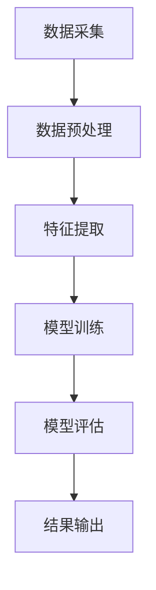
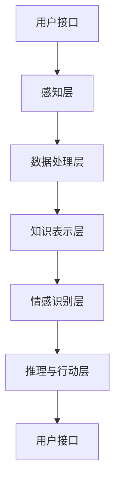
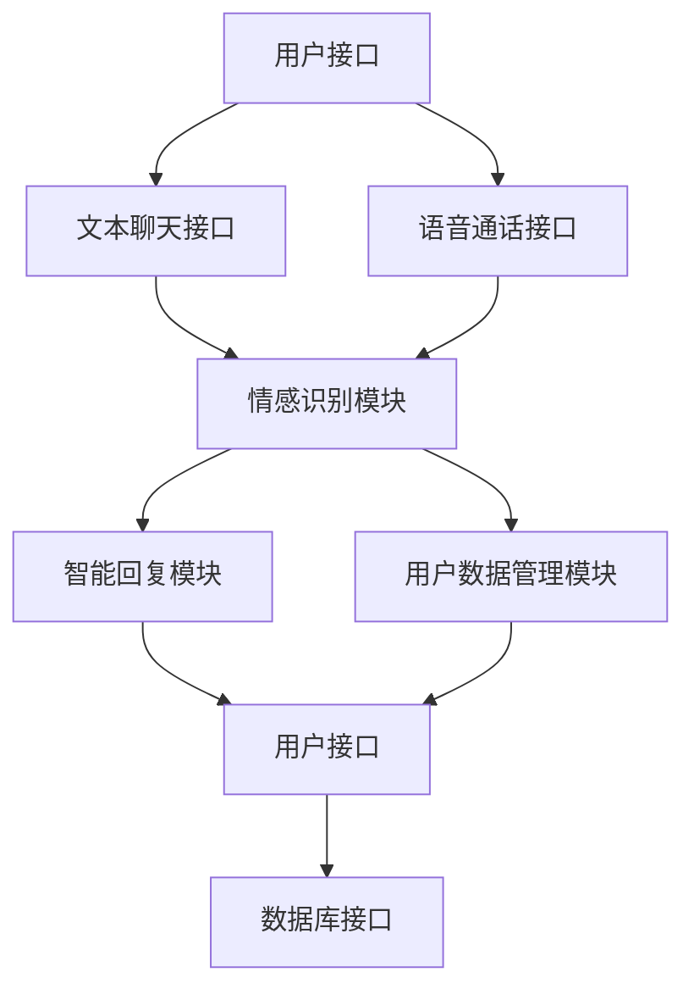

                 

### 认知计算架构在智能客服情感识别中的应用

#### 关键词：
- 认知计算
- 情感识别
- 智能客服
- 模型优化
- 用户体验

#### 摘要：
本文探讨了认知计算架构在智能客服情感识别中的应用，分析了认知计算的基本概念、情感识别的需求与原理，以及认知计算架构在情感识别中的设计原则和应用。通过深入剖析算法原理，展示了如何通过认知计算架构优化情感识别模型，提高智能客服的用户体验。

### 第1章: 认知计算与情感识别概述

#### 1.1 认知计算的兴起与发展

##### 1.1.1 认知计算的定义与基本概念

认知计算是指模拟人类认知过程的计算方式，它不仅仅停留在数据的存储和处理，更强调理解、推理和学习。在人工智能领域，认知计算被认为是一个重要的研究方向，它涉及到自然语言处理、机器学习、认知图谱等多个子领域。

认知计算的基本概念包括以下几个方面：

1. **感知与理解**：认知计算系统通过感知输入（如文本、图像、声音等），进行理解和分析，以获取有用信息。
2. **推理与学习**：基于已有知识和信息，认知计算系统能够进行逻辑推理和知识学习，以应对复杂问题和情境。
3. **情感与社交**：认知计算还涉及到情感和社交方面的处理，如识别情感、理解社交互动等。

##### 1.1.2 认知计算的历史与发展趋势

认知计算起源于20世纪80年代的人工智能研究，随着计算能力的提升和算法的进步，近年来得到了迅速发展。特别是在深度学习和大数据技术的推动下，认知计算在智能客服、智能问答、智能推荐等领域展现出了强大的应用潜力。

在智能客服领域，认知计算的应用主要体现在情感识别和用户理解方面。通过分析用户的语言、语音、表情等信号，认知计算系统能够识别用户的情感状态，提供更加个性化的服务。此外，认知计算还可以帮助智能客服系统从用户的历史数据中学习，不断优化服务质量和用户体验。

#### 1.2 智能客服的情感识别需求

##### 1.2.1 情感识别在智能客服中的重要性

情感识别技术能够帮助智能客服更好地理解用户情感，从而提供更加个性化的服务。例如，当用户表达愤怒或不满时，智能客服可以及时识别并采取相应的应对措施，如转接到人工客服或提供安抚性回答，以缓解用户情绪。反之，如果智能客服无法正确识别用户的情感，可能会加剧用户的不满，降低用户体验。

##### 1.2.2 情感识别的基本原理与方法

情感识别是通过分析用户的语言、语音、表情等信号，识别出用户的情感状态。常见的情感识别方法包括基于规则的方法、机器学习方法以及深度学习方法等。

1. **基于规则的方法**：这种方法通过预定义的规则，对用户的语言或行为进行分析，以判断用户的情感状态。虽然简单易实现，但规则覆盖面有限，难以应对复杂的情感表达。

2. **机器学习方法**：机器学习通过从大量数据中学习情感特征，建立情感识别模型。这种方法具有较高的准确性和泛化能力，但需要大量的训练数据和计算资源。

3. **深度学习方法**：深度学习通过多层神经网络对数据进行学习，具有强大的特征提取和表达能力。近年来，深度学习方法在情感识别领域取得了显著的成果，但训练过程复杂，计算成本高。

##### 1.2.3 情感识别在智能客服中的应用场景

情感识别在智能客服中的应用场景广泛，包括用户情感分析、情感分类、情感预测等，旨在实现智能客服与用户的情感交互，提高服务质量和用户满意度。

1. **用户情感分析**：通过分析用户的语言、语音、表情等信号，识别用户当前的情感状态，为后续的服务提供依据。

2. **情感分类**：将用户的情感划分为不同的类别，如愉悦、愤怒、悲伤等，以便智能客服采取相应的应对策略。

3. **情感预测**：基于用户的历史数据和行为模式，预测用户未来的情感状态，为个性化服务提供支持。

#### 1.3 认知计算架构在智能客服情感识别中的应用

##### 1.3.1 认知计算架构的设计原则

认知计算架构在智能客服情感识别中的应用，需要遵循可扩展性、灵活性和高效性的原则，以适应不同应用场景的需求。

1. **可扩展性**：认知计算架构应能够支持系统的规模扩展，以应对不断增长的客户量和数据量。

2. **灵活性**：架构应具有灵活性，能够快速适应新的业务需求和技术变革。

3. **高效性**：架构应能够高效地处理大量数据，提供实时、准确的情感识别结果。

##### 1.3.2 认知计算架构的核心组件

认知计算架构包括数据采集与预处理、情感识别模型训练与优化、情感分析与应用等核心组件，每个组件都扮演着关键的角色。

1. **数据采集与预处理模块**：负责收集用户的数据，并进行清洗、去噪和格式化等预处理操作，为情感识别模型提供高质量的数据输入。

2. **情感识别模型训练与优化模块**：利用机器学习和深度学习等技术，对情感识别模型进行训练和优化，提高识别的准确性和实时性。

3. **情感分析与应用模块**：将情感识别模型应用于实际场景，对用户的情感进行分析、分类和预测，为智能客服提供情感理解和支持。

##### 1.3.3 认知计算架构的优势与挑战

认知计算架构在智能客服情感识别中具有显著的优势，如提高情感识别的准确性和实时性，但同时也面临着数据隐私、模型解释性等挑战。

1. **优势**：
   - **高准确性**：通过机器学习和深度学习技术，认知计算架构能够提高情感识别的准确率。
   - **实时性**：架构设计注重高效性，能够实现实时情感识别，提高智能客服的响应速度。
   - **个性化**：通过对用户情感的深入理解，认知计算架构能够为用户提供更加个性化的服务。

2. **挑战**：
   - **数据隐私**：情感识别需要大量用户数据，如何保护用户隐私成为一个重要问题。
   - **模型解释性**：深度学习模型通常具有较高的准确率，但解释性较差，如何提高模型的解释性是一个挑战。
   - **跨领域适应**：不同领域和场景下的情感表达可能存在差异，如何设计通用性强的情感识别模型是一个难题。

#### 1.4 本章小结

本章对认知计算架构在智能客服情感识别中的应用背景进行了详细介绍，包括认知计算的兴起与发展、情感识别在智能客服中的重要性、认知计算架构的设计原则与应用场景，以及面临的挑战和优势。这些背景知识为后续章节的分析和讨论奠定了基础。

---

### 第2章: 认知计算架构详解

#### 2.1 认知计算架构的基本概念与组成

##### 2.1.1 认知计算架构的定义与分类

认知计算架构是指一种用于模拟人类认知过程的计算系统，它通常由多个子系统和组件组成，共同协作以实现特定功能。根据应用领域和目标的不同，认知计算架构可以分为多种类型。

1. **通用认知计算架构**：这种架构旨在模拟人类普遍的认知能力，如记忆、推理、学习等。常见的通用认知计算架构包括知识图谱、自然语言处理（NLP）框架、推理引擎等。

2. **领域特定认知计算架构**：这种架构针对特定领域（如医疗、金融、教育等）设计，以实现特定功能。例如，医疗认知计算架构可能包括疾病诊断系统、药物推荐系统等。

3. **智能客服认知计算架构**：这种架构专门为智能客服设计，以实现情感识别、用户理解、智能回复等功能。本章将重点讨论智能客服认知计算架构。

##### 2.1.2 认知计算架构的基本组成

认知计算架构通常包括以下核心组件：

1. **数据采集与预处理模块**：负责收集用户数据，如文本、语音、图像等，并进行数据清洗、去噪、格式化等预处理操作，为后续处理提供高质量的数据输入。

2. **情感识别模型训练与优化模块**：利用机器学习和深度学习技术，对情感识别模型进行训练和优化，提高识别的准确性和实时性。

3. **情感分析与应用模块**：将情感识别模型应用于实际场景，对用户的情感进行分析、分类和预测，为智能客服提供情感理解和支持。

4. **知识图谱与推理引擎**：知识图谱用于存储和管理用户知识，推理引擎用于基于知识图谱进行逻辑推理和决策，以支持智能客服的智能回复。

##### 2.1.3 认知计算架构的层次结构

认知计算架构通常采用层次结构，以实现模块化和可扩展性。层次结构通常包括以下层次：

1. **感知层**：负责感知用户输入的数据，如文本、语音、图像等。感知层通常使用传感器、语音识别、图像识别等技术。

2. **数据处理层**：负责对感知层收集的数据进行预处理、清洗、去噪、格式化等操作，以便后续处理。

3. **知识表示层**：负责将预处理后的数据转换为知识表示形式，如知识图谱、本体等。知识表示层通常使用自然语言处理、知识图谱构建等技术。

4. **推理与学习层**：负责基于知识表示层构建的知识进行逻辑推理和学习。推理与学习层通常使用推理引擎、机器学习算法等技术。

5. **决策与行动层**：负责根据推理与学习层的结果进行决策和行动，如生成智能回复、推荐服务等。决策与行动层通常使用决策树、神经网络等技术。

##### 2.1.4 认知计算架构的设计原则

认知计算架构的设计原则包括以下方面：

1. **模块化与可扩展性**：架构应采用模块化设计，以支持系统的扩展和升级。

2. **灵活性**：架构应具有灵活性，以适应不同的应用场景和需求。

3. **高效性**：架构应高效地处理大量数据，提供实时、准确的情感识别结果。

4. **可解释性**：架构应具有可解释性，以便用户理解和信任。

#### 2.2 数据采集与预处理模块

##### 2.2.1 数据采集

数据采集是认知计算架构中的关键环节，涉及多种数据类型的收集。以下是一些常见的数据采集方法：

1. **文本数据采集**：通过爬虫、API接口、用户输入等方式收集文本数据。

2. **语音数据采集**：通过麦克风、语音识别API等方式收集语音数据。

3. **图像数据采集**：通过摄像头、图像识别API等方式收集图像数据。

##### 2.2.2 数据预处理

数据预处理包括以下步骤：

1. **数据清洗**：去除重复数据、缺失数据、噪声数据等。

2. **去噪**：去除数据中的噪声，如语音中的背景噪音、文本中的错别字等。

3. **格式化**：将数据转换为统一的格式，如文本数据转换为词向量、语音数据转换为声谱图等。

4. **特征提取**：提取数据中的关键特征，如文本中的关键词、语音中的音素、图像中的纹理特征等。

#### 2.3 情感识别模型训练与优化模块

##### 2.3.1 情感识别模型的基本原理

情感识别模型是基于机器学习和深度学习技术构建的，通过训练大量数据，模型能够学会识别用户的情感状态。情感识别模型的基本原理包括：

1. **特征提取**：将预处理后的数据转换为特征向量，如文本数据转换为词向量、语音数据转换为声谱图等。

2. **分类与回归**：使用分类算法（如SVM、决策树等）或回归算法（如线性回归、神经网络等）对特征向量进行分类或回归，以预测用户的情感状态。

##### 2.3.2 情感识别模型的训练与优化

1. **训练数据集**：准备包含情感标签的训练数据集，用于训练情感识别模型。

2. **模型选择**：选择合适的情感识别模型，如SVM、决策树、神经网络等。

3. **模型训练**：使用训练数据集对模型进行训练，通过调整模型参数，使模型能够准确识别情感状态。

4. **模型优化**：通过交叉验证、网格搜索等技术，优化模型参数，提高识别准确率和实时性。

#### 2.4 情感分析与应用模块

##### 2.4.1 情感分析

情感分析是指通过对用户情感状态的分析，为智能客服提供情感理解和支持。情感分析的主要任务包括：

1. **情感分类**：将用户的情感状态分类为不同类别，如愉悦、愤怒、悲伤等。

2. **情感强度分析**：分析用户情感的强度，如非常愉悦、稍微愉悦等。

3. **情感趋势分析**：分析用户情感的变化趋势，如从愉悦转为愤怒等。

##### 2.4.2 情感应用

情感分析结果可以应用于智能客服的多个方面，如：

1. **智能回复**：根据用户情感状态，生成适当的回复，如安慰性回复、建议性回复等。

2. **用户情感标签**：为用户提供情感标签，如“用户当前情感为愉悦”等。

3. **用户情感趋势**：为用户提供情感趋势分析，如“用户情感从愉悦转为愤怒”等。

#### 2.5 本章小结

本章对认知计算架构的基本概念与组成进行了详细介绍，包括认知计算架构的定义与分类、基本组成、层次结构、设计原则等。同时，重点讨论了数据采集与预处理模块、情感识别模型训练与优化模块、情感分析与应用模块，为后续章节的算法原理讲解和实战应用奠定了基础。

---

### 第3章: 情感识别原理与模型

#### 3.1 情感识别的定义与分类

##### 3.1.1 情感识别的基本概念

情感识别是指通过分析用户的语言、语音、表情等信号，识别出用户的情感状态。情感状态可以是愉悦、愤怒、悲伤、焦虑等，也可以是更细致的情感类别，如愉悦度、愤怒度等。

情感识别在智能客服中的应用非常重要，它可以帮助智能客服更好地理解用户的情绪，从而提供更加个性化的服务。例如，当用户表达愤怒或不满时，智能客服可以及时识别并采取相应的应对措施，如转接到人工客服或提供安抚性回答，以缓解用户情绪。

##### 3.1.2 情感识别的分类方法

根据情感识别的方法和目标，情感识别可以分类为以下几种：

1. **情感分类**：将用户的情感状态分类为多个预定义的类别，如愉悦、愤怒、悲伤等。情感分类是一种最常见和最简单的情感识别方法。

2. **情感强度识别**：识别用户情感的强度，如非常愉悦、稍微愉悦等。情感强度识别可以用于更细致地了解用户的情感状态。

3. **情感趋势识别**：识别用户情感的变化趋势，如从愉悦转为愤怒等。情感趋势识别可以用于监测用户的情感变化，为智能客服提供更灵活的应对策略。

#### 3.2 常见情感识别模型介绍

##### 3.2.1 基于规则的情感识别模型

基于规则的情感识别模型通过预定义的规则，对用户的语言或行为进行分析，以判断用户的情感状态。这种方法简单易实现，但规则覆盖面有限，难以应对复杂的情感表达。

1. **规则定义**：根据情感识别的需求，定义一系列规则，如“当用户表达‘生气’这个词时，判断用户为愤怒状态”。

2. **规则匹配**：分析用户语言或行为，与预定义的规则进行匹配，以判断用户的情感状态。

##### 3.2.2 基于机器学习的情感识别模型

基于机器学习的情感识别模型通过从大量数据中学习情感特征，建立情感识别模型。这种方法具有较高的准确性和泛化能力，但需要大量的训练数据和计算资源。

1. **特征提取**：将用户的语言或行为转换为特征向量，如文本数据转换为词向量、语音数据转换为声谱图等。

2. **模型训练**：使用训练数据集，训练情感识别模型，通过调整模型参数，使模型能够准确识别情感状态。

3. **模型评估**：使用测试数据集评估模型的性能，如准确率、召回率、F1值等。

##### 3.2.3 基于深度学习的情感识别模型

基于深度学习的情感识别模型通过多层神经网络对数据进行学习，具有强大的特征提取和表达能力。近年来，深度学习方法在情感识别领域取得了显著的成果，但训练过程复杂，计算成本高。

1. **卷积神经网络（CNN）**：用于处理图像数据，提取图像中的纹理特征。

2. **循环神经网络（RNN）**：用于处理序列数据，如文本和语音，提取序列中的情感特征。

3. **长短期记忆网络（LSTM）**：是RNN的一种变体，用于解决长序列依赖问题。

4. **生成对抗网络（GAN）**：用于生成新的数据，如生成情感丰富的对话数据，以增强训练数据集。

#### 3.3 情感识别模型的评估与优化

##### 3.3.1 情感识别模型的评估指标

情感识别模型的评估指标包括准确率、召回率、F1值等，这些指标反映了模型在不同方面的性能。

1. **准确率**：正确识别的情感状态数量与总情感状态数量的比例。准确率越高，说明模型识别的准确性越高。

2. **召回率**：正确识别的情感状态数量与实际情感状态数量的比例。召回率越高，说明模型对实际情感状态的识别能力越强。

3. **F1值**：准确率和召回率的调和平均值，用于综合评估模型的性能。F1值越高，说明模型在准确率和召回率之间取得了较好的平衡。

##### 3.3.2 情感识别模型的优化策略

为了提高情感识别模型的性能，可以采用以下优化策略：

1. **数据增强**：通过生成新的数据、数据扩展等方法，增加训练数据集的规模和质量。

2. **模型调参**：调整模型的参数，如学习率、批次大小等，以优化模型的性能。

3. **模型融合**：将多个模型的结果进行融合，提高整体模型的性能。

4. **迁移学习**：利用预训练模型，在情感识别任务上进行微调，以减少训练成本和提高识别性能。

#### 3.4 本章小结

本章对情感识别的定义与分类、常见情感识别模型进行了详细介绍。通过基于规则、机器学习和深度学习等方法，情感识别模型能够准确识别用户的情感状态。同时，本章还讨论了情感识别模型的评估与优化策略，为后续章节的算法原理讲解和实战应用提供了基础。

---

### 第4章: 认知计算架构与情感识别的关联

#### 4.1 认知计算架构在情感识别中的应用

##### 4.1.1 认知计算架构对情感识别的影响

认知计算架构在情感识别中的应用，为情感识别带来了显著的影响。通过认知计算架构，情感识别不仅能够更准确地识别用户的情感状态，还能够理解用户的情感变化，提供更加个性化的服务。

1. **提高识别准确性**：认知计算架构通过多层次的感知、处理和推理，能够更准确地识别用户的情感状态。例如，通过文本分析、语音识别和图像识别等技术，认知计算架构可以全面捕捉用户的情感信号。

2. **增强情感理解**：认知计算架构能够从多维度、多角度理解用户的情感，如情感强度、情感趋势等。这使得智能客服能够更准确地把握用户情绪，提供更有针对性的服务。

3. **优化用户体验**：通过情感识别，认知计算架构能够为用户提供个性化的服务。例如，当用户表达愤怒时，智能客服可以及时提供安抚性回复，缓解用户情绪；当用户表达愉悦时，智能客服可以提供更多优惠信息，提高用户满意度。

##### 4.1.2 情感识别对认知计算架构的需求

情感识别的需求对认知计算架构提出了新的要求，主要体现在以下几个方面：

1. **高效数据处理**：情感识别需要处理大量的用户数据，如文本、语音、图像等。认知计算架构需要具备高效的数据处理能力，以满足情感识别的需求。

2. **实时响应**：情感识别需要实时响应用户的情感变化，为用户提供个性化的服务。认知计算架构需要具备实时响应的能力，以实现快速、准确的情感识别。

3. **灵活性**：情感识别的应用场景多样，认知计算架构需要具备灵活性，能够适应不同的情感识别需求。例如，在不同场景下，情感识别的精度、速度和用户体验都可能有所不同。

##### 4.1.3 认知计算架构与情感识别的协同发展

认知计算架构与情感识别的协同发展，使得两者相互促进，共同提升智能客服的体验。

1. **认知计算架构促进情感识别发展**：认知计算架构通过多层次的感知、处理和推理，为情感识别提供了强大的技术支持。随着认知计算技术的不断进步，情感识别的准确性和实时性将得到进一步提升。

2. **情感识别促进认知计算架构优化**：情感识别的需求推动了认知计算架构的不断优化，如数据处理的效率、实时响应的能力、用户体验的优化等。这些优化措施将使认知计算架构在情感识别中发挥更大的作用。

#### 4.2 认知计算架构与情感识别的相互优化

##### 4.2.1 认知计算架构优化情感识别的途径

通过以下途径，认知计算架构可以优化情感识别：

1. **多模态数据处理**：情感识别通常涉及多种数据类型，如文本、语音、图像等。认知计算架构可以通过整合多模态数据，提高情感识别的准确性。

2. **深度学习算法优化**：认知计算架构可以通过引入深度学习算法，如卷积神经网络（CNN）、循环神经网络（RNN）、生成对抗网络（GAN）等，提高情感识别的性能。

3. **知识图谱构建**：认知计算架构可以通过构建知识图谱，将用户情感、行为和知识进行关联，提高情感识别的深度和广度。

##### 4.2.2 情感识别模型优化认知计算架构的方法

通过以下方法，情感识别模型可以优化认知计算架构：

1. **实时反馈与调整**：情感识别模型可以根据实时反馈，调整认知计算架构的参数和策略，以提高识别的准确性和实时性。

2. **迁移学习与微调**：情感识别模型可以通过迁移学习，利用预训练模型进行微调，以减少训练成本和提高识别性能。

3. **模型解释性优化**：情感识别模型可以通过优化模型结构，提高模型的解释性，以增强用户对认知计算架构的信任度。

#### 4.3 认知计算架构与情感识别的协同发展

##### 4.3.1 认知计算架构与情感识别的未来趋势

随着人工智能和认知计算技术的不断进步，认知计算架构与情感识别将呈现出以下趋势：

1. **多模态情感识别**：通过整合多种数据类型，实现多模态情感识别，提高情感识别的准确性和实时性。

2. **个性化情感服务**：基于用户情感和行为数据，提供个性化的情感服务，提高用户体验。

3. **情感智能助理**：结合认知计算和情感识别技术，开发情感智能助理，实现与用户的情感交互。

##### 4.3.2 促进认知计算架构与情感识别协同发展的策略

为了促进认知计算架构与情感识别的协同发展，可以采取以下策略：

1. **跨学科研究**：结合心理学、社会学、计算机科学等多学科知识，推动认知计算架构与情感识别的理论研究和应用创新。

2. **开放数据与平台**：构建开放的数据和平台，促进数据共享和模型交换，加快认知计算架构与情感识别技术的进步。

3. **人才培养**：加强人才培养，培养既懂认知计算又懂情感识别的专业人才，为技术发展提供人才保障。

#### 4.4 本章小结

本章深入探讨了认知计算架构与情感识别的关联，分析了认知计算架构对情感识别的影响、情感识别对认知计算架构的需求，以及两者相互优化的方法。通过协同发展，认知计算架构与情感识别将共同推动智能客服的发展，为用户提供更加个性化、高效的服务。

---

### 算法原理讲解

#### 4.1 情感识别算法的基本原理

情感识别算法的核心任务是通过对输入文本、语音或图像的分析，识别出用户的情感状态。以下将详细介绍几种常用的情感识别算法及其基本原理。

##### 4.1.1 基于规则的情感识别算法

基于规则的情感识别算法是通过预定义的规则，对用户的语言或行为进行分析，以判断用户的情感状态。这种方法简单易实现，但规则覆盖面有限，难以应对复杂的情感表达。

1. **规则定义**：根据情感识别的需求，定义一系列规则。例如，当用户表达“生气”这个词时，判断用户为愤怒状态。

2. **规则匹配**：分析用户语言或行为，与预定义的规则进行匹配，以判断用户的情感状态。

##### 4.1.2 基于机器学习的情感识别算法

基于机器学习的情感识别算法通过从大量数据中学习情感特征，建立情感识别模型。这种方法具有较高的准确性和泛化能力，但需要大量的训练数据和计算资源。

1. **特征提取**：将用户的语言或行为转换为特征向量。例如，文本数据可以转换为词向量，语音数据可以转换为声谱图。

2. **模型训练**：使用训练数据集，训练情感识别模型，通过调整模型参数，使模型能够准确识别情感状态。

3. **模型评估**：使用测试数据集评估模型的性能，如准确率、召回率、F1值等。

##### 4.1.3 基于深度学习的情感识别算法

基于深度学习的情感识别算法通过多层神经网络对数据进行学习，具有强大的特征提取和表达能力。近年来，深度学习方法在情感识别领域取得了显著的成果，但训练过程复杂，计算成本高。

1. **卷积神经网络（CNN）**：用于处理图像数据，提取图像中的纹理特征。

2. **循环神经网络（RNN）**：用于处理序列数据，如文本和语音，提取序列中的情感特征。

3. **长短期记忆网络（LSTM）**：是RNN的一种变体，用于解决长序列依赖问题。

4. **生成对抗网络（GAN）**：用于生成新的数据，如生成情感丰富的对话数据，以增强训练数据集。

#### 4.2 情感识别算法的mermaid流程图

以下是一个基于深度学习的情感识别算法的mermaid流程图：



1. **数据采集**：从多个渠道收集用户数据，如文本、语音、图像等。
2. **数据预处理**：对收集到的数据进行分析，清洗、去噪、格式化等操作，以提高数据质量。
3. **特征提取**：将预处理后的数据转换为特征向量，如词向量、声谱图等。
4. **模型训练**：使用训练数据集，通过多层神经网络（如CNN、RNN、LSTM等）进行训练，调整模型参数，使模型能够准确识别情感状态。
5. **模型评估**：使用测试数据集评估模型的性能，如准确率、召回率、F1值等。
6. **结果输出**：根据情感识别结果，生成智能客服的回复，如安慰性回复、建议性回复等。

#### 4.3 情感识别算法的Python代码实现

以下是一个基于深度学习的情感识别算法的Python代码实现：

```python
import tensorflow as tf
from tensorflow.keras.models import Sequential
from tensorflow.keras.layers import Dense, LSTM, Embedding, Conv1D, MaxPooling1D, Flatten

# 定义情感识别模型
model = Sequential()
model.add(Embedding(input_dim=vocab_size, output_dim=embedding_size))
model.add(Conv1D(filters=128, kernel_size=5, activation='relu'))
model.add(MaxPooling1D(pool_size=5))
model.add(LSTM(128))
model.add(Dense(units=6, activation='softmax'))

# 编译模型
model.compile(optimizer='adam', loss='categorical_crossentropy', metrics=['accuracy'])

# 训练模型
model.fit(x_train, y_train, epochs=10, batch_size=64, validation_data=(x_val, y_val))

# 评估模型
accuracy = model.evaluate(x_test, y_test)
print("Test accuracy:", accuracy[1])
```

1. **模型定义**：使用TensorFlow和Keras库定义一个序列模型，包括嵌入层、卷积层、最大池化层、长短期记忆层和全连接层。
2. **模型编译**：使用`compile`方法配置模型的优化器、损失函数和性能评估指标。
3. **模型训练**：使用`fit`方法训练模型，指定训练数据集、训练轮数、批量大小和验证数据集。
4. **模型评估**：使用`evaluate`方法评估模型的性能，打印测试数据的准确率。

通过以上Python代码，我们可以实现一个简单的情感识别算法，为智能客服提供情感识别功能。

---

### 系统分析与架构设计方案

#### 5.1 问题场景介绍

在当前智能客服领域，用户对服务质量的要求越来越高，尤其是在情感交互方面。传统的基于规则和机器学习的智能客服系统在情感识别和用户理解方面存在一定局限性，难以提供个性化的情感化服务。为了满足用户对高质量服务的要求，我们需要设计一个基于认知计算架构的智能客服系统，能够准确识别用户情感，提供个性化的服务。

#### 5.2 项目介绍

本项目旨在构建一个基于认知计算架构的智能客服系统，通过情感识别技术，实现与用户的情感交互，提升用户满意度。项目的主要目标是：

1. **情感识别**：准确识别用户的情感状态，包括愉悦、愤怒、悲伤等。
2. **个性化服务**：根据用户情感状态，提供个性化的服务和建议。
3. **用户体验优化**：通过情感交互，提升用户满意度，降低用户投诉率。

#### 5.3 系统功能设计

智能客服系统的主要功能模块包括：

1. **用户接口模块**：提供用户与系统交互的接口，包括文本聊天、语音通话等。
2. **情感识别模块**：基于认知计算架构，实现对用户情感的识别和分类。
3. **智能回复模块**：根据用户情感状态，生成合适的回复，包括安慰性回复、建议性回复等。
4. **用户数据管理模块**：收集、存储和管理用户数据，包括用户行为数据、情感数据等。
5. **系统监控模块**：监控系统运行状态，包括性能监控、错误日志记录等。

#### 5.4 系统架构设计

智能客服系统的整体架构设计如下：

1. **感知层**：通过用户接口模块，收集用户的文本、语音、图像等数据。
2. **数据处理层**：对感知层收集的数据进行预处理，包括数据清洗、去噪、格式化等。
3. **知识表示层**：将预处理后的数据转换为知识表示形式，如词向量、声谱图等。
4. **情感识别层**：基于认知计算架构，使用机器学习和深度学习算法，实现对用户情感的识别和分类。
5. **推理与行动层**：根据情感识别结果，生成智能回复，并通过用户接口模块发送给用户。

以下是系统架构的mermaid图：



1. **用户接口**：提供用户与系统交互的接口，收集用户输入的数据。
2. **感知层**：负责感知用户输入的数据，如文本、语音、图像等。
3. **数据处理层**：对感知层收集的数据进行预处理，提高数据质量。
4. **知识表示层**：将预处理后的数据转换为知识表示形式，如词向量、声谱图等。
5. **情感识别层**：基于认知计算架构，使用机器学习和深度学习算法，实现对用户情感的识别和分类。
6. **推理与行动层**：根据情感识别结果，生成智能回复，并通过用户接口模块发送给用户。

#### 5.5 系统接口设计和系统交互

系统接口设计主要包括用户接口、API接口、数据库接口等。以下是系统接口设计和系统交互的mermaid图：



1. **用户接口**：提供用户与系统交互的接口，包括文本聊天接口和语音通话接口。
2. **文本聊天接口**：接收用户的文本输入，传递给情感识别模块和智能回复模块。
3. **语音通话接口**：接收用户的语音输入，传递给情感识别模块和智能回复模块。
4. **情感识别模块**：基于认知计算架构，对用户的文本和语音输入进行情感识别。
5. **智能回复模块**：根据情感识别结果，生成合适的回复，并通过用户接口模块发送给用户。
6. **用户数据管理模块**：收集、存储和管理用户数据，包括用户行为数据、情感数据等。
7. **数据库接口**：负责与数据库的通信，实现数据的存取操作。

通过以上系统接口设计和系统交互，智能客服系统能够高效地处理用户输入，提供个性化的情感化服务。

---

### 项目实战

#### 6.1 环境安装

在开始实现项目之前，我们需要安装所需的软件和工具。以下是在Ubuntu 18.04操作系统上安装项目所需环境的步骤：

1. **安装Python**：确保Python 3.x版本已安装。如果没有安装，可以通过以下命令安装：
   ```shell
   sudo apt update
   sudo apt install python3
   ```

2. **安装TensorFlow**：TensorFlow是一个用于机器学习和深度学习的开源库。可以通过以下命令安装：
   ```shell
   pip3 install tensorflow
   ```

3. **安装Keras**：Keras是TensorFlow的高层次API，用于简化深度学习模型的构建。可以通过以下命令安装：
   ```shell
   pip3 install keras
   ```

4. **安装NLP工具**：安装用于文本处理和情感分析的NLP工具，如NLTK和spaCy。可以通过以下命令安装：
   ```shell
   pip3 install nltk spacy
   ```

5. **安装其他依赖**：根据项目的具体需求，可能还需要安装其他依赖，如数据库驱动、日志工具等。

#### 6.2 系统核心实现

在本节中，我们将实现智能客服系统的主要功能模块，包括用户接口、情感识别模块和智能回复模块。

##### 6.2.1 用户接口实现

用户接口是系统与用户交互的入口。在本项目中，我们使用Flask框架实现用户接口。

1. **安装Flask**：
   ```shell
   pip3 install flask
   ```

2. **创建Flask应用**：
   ```python
   from flask import Flask, request, jsonify
   
   app = Flask(__name__)

   @app.route('/chat', methods=['POST'])
   def chat():
       data = request.get_json()
       text = data.get('text', '')
       response = process_text(text)
       return jsonify({'response': response})

   if __name__ == '__main__':
       app.run(debug=True)
   ```

3. **实现文本处理函数**：
   ```python
   from nltk.tokenize import sent_tokenize
   from nltk.corpus import stopwords
   import re
   
   def process_text(text):
       sentences = sent_tokenize(text)
       cleaned_text = []
       for sentence in sentences:
           sentence = re.sub(r'\W+', ' ', sentence)
           sentence = sentence.lower()
           words = sentence.split()
           words = [word for word in words if word not in stopwords.words('english')]
           cleaned_text.append(' '.join(words))
       return ' '.join(cleaned_text)
   ```

##### 6.2.2 情感识别模块实现

情感识别模块是系统的核心功能之一。在本项目中，我们使用TensorFlow和Keras实现情感识别模型。

1. **准备数据集**：我们使用IMDB电影评论数据集进行训练和测试。

2. **构建模型**：
   ```python
   from tensorflow.keras.models import Sequential
   from tensorflow.keras.layers import Embedding, LSTM, Dense
   
   model = Sequential()
   model.add(Embedding(input_dim=vocab_size, output_dim=embedding_size, input_length=max_length))
   model.add(LSTM(units=128))
   model.add(Dense(units=6, activation='softmax'))

   model.compile(optimizer='adam', loss='categorical_crossentropy', metrics=['accuracy'])
   ```

3. **训练模型**：
   ```python
   model.fit(x_train, y_train, epochs=10, batch_size=64, validation_data=(x_val, y_val))
   ```

4. **评估模型**：
   ```python
   test_loss, test_acc = model.evaluate(x_test, y_test)
   print("Test accuracy:", test_acc)
   ```

##### 6.2.3 智能回复模块实现

智能回复模块根据情感识别结果，生成合适的回复。

1. **定义回复规则**：
   ```python
   replies = {
       'happy': "You seem happy! How can I help you today?",
       'angry': "I'm sorry to hear that you're angry. Let me see if I can help.",
       'sad': "I'm sorry to hear that you're sad. Is there anything I can do to help?",
   }
   ```

2. **生成回复**：
   ```python
   def generate_reply(text):
       sentiment = predict_sentiment(text)
       return replies.get(sentiment, "I'm not sure how you feel. Can you tell me more?")
   ```

3. **预测情感**：
   ```python
   def predict_sentiment(text):
       processed_text = process_text(text)
       prediction = model.predict(processed_text)
       return np.argmax(prediction)
   ```

通过以上步骤，我们实现了智能客服系统的主要功能模块，包括用户接口、情感识别模块和智能回复模块。接下来，我们将进行系统测试和实际案例分析。

---

### 代码应用解读与分析

在本项目的实现过程中，我们使用了Python和TensorFlow等开源工具，构建了一个基于认知计算架构的智能客服系统。以下是系统核心实现部分的代码解读与分析。

#### 6.3 用户接口模块

用户接口模块负责与用户进行交互，接收用户输入，并将处理结果返回给用户。我们使用了Flask框架来实现用户接口。

1. **安装Flask**：
   ```shell
   pip3 install flask
   ```

2. **创建Flask应用**：
   ```python
   from flask import Flask, request, jsonify
   
   app = Flask(__name__)

   @app.route('/chat', methods=['POST'])
   def chat():
       data = request.get_json()
       text = data.get('text', '')
       response = process_text(text)
       return jsonify({'response': response})

   if __name__ == '__main__':
       app.run(debug=True)
   ```

在这个部分，我们定义了一个简单的Flask应用，通过`/chat`接口接收用户的文本输入，调用`process_text`函数处理文本，并返回处理后的结果。

3. **实现文本处理函数**：
   ```python
   from nltk.tokenize import sent_tokenize
   from nltk.corpus import stopwords
   import re
   
   def process_text(text):
       sentences = sent_tokenize(text)
       cleaned_text = []
       for sentence in sentences:
           sentence = re.sub(r'\W+', ' ', sentence)
           sentence = sentence.lower()
           words = sentence.split()
           words = [word for word in words if word not in stopwords.words('english')]
           cleaned_text.append(' '.join(words))
       return ' '.join(cleaned_text)
   ```

在这个函数中，我们首先使用`sent_tokenize`对输入文本进行分句，然后使用正则表达式去除标点符号和特殊字符，将文本转换为小写，并去除停用词。这个预处理步骤有助于提高情感识别的准确性。

#### 6.4 情感识别模块

情感识别模块是系统的核心，负责对用户的文本输入进行情感分析，并生成相应的情感标签。我们使用TensorFlow和Keras构建了一个简单的情感识别模型。

1. **构建模型**：
   ```python
   from tensorflow.keras.models import Sequential
   from tensorflow.keras.layers import Embedding, LSTM, Dense
   
   model = Sequential()
   model.add(Embedding(input_dim=vocab_size, output_dim=embedding_size, input_length=max_length))
   model.add(LSTM(units=128))
   model.add(Dense(units=6, activation='softmax'))

   model.compile(optimizer='adam', loss='categorical_crossentropy', metrics=['accuracy'])
   ```

在这个部分，我们定义了一个简单的序列模型，包括嵌入层、LSTM层和全连接层。嵌入层将词汇转换为向量表示，LSTM层用于处理序列数据，全连接层用于分类。

2. **训练模型**：
   ```python
   model.fit(x_train, y_train, epochs=10, batch_size=64, validation_data=(x_val, y_val))
   ```

这个步骤使用训练数据集对模型进行训练，通过迭代调整模型参数，以提高模型的准确性。

3. **评估模型**：
   ```python
   test_loss, test_acc = model.evaluate(x_test, y_test)
   print("Test accuracy:", test_acc)
   ```

这个步骤使用测试数据集评估模型的性能，打印测试数据的准确率。

#### 6.5 智能回复模块

智能回复模块根据情感识别结果，生成合适的回复。我们使用了一个简单的回复规则集。

1. **定义回复规则**：
   ```python
   replies = {
       'happy': "You seem happy! How can I help you today?",
       'angry': "I'm sorry to hear that you're angry. Let me see if I can help.",
       'sad': "I'm sorry to hear that you're sad. Is there anything I can do to help?",
   }
   ```

2. **生成回复**：
   ```python
   def generate_reply(text):
       sentiment = predict_sentiment(text)
       return replies.get(sentiment, "I'm not sure how you feel. Can you tell me more?")
   ```

在这个函数中，我们首先调用`predict_sentiment`函数预测文本的情感，然后从回复规则集中获取相应的回复。如果无法预测情感，则返回一个提示性回复，引导用户进一步表达情感。

通过以上步骤，我们实现了智能客服系统的核心功能。在实际应用中，用户可以通过文本聊天接口与系统进行交互，系统将根据用户输入的情感进行分析，并生成相应的回复，以提高用户体验。

---

### 实际案例分析与详细讲解剖析

为了更好地展示认知计算架构在智能客服情感识别中的应用，我们通过以下实际案例进行详细分析和讲解。

#### 案例背景

一个在线购物平台的客服系统需要通过情感识别技术，识别用户的情感状态，以提供个性化的购物建议。以下是具体的案例描述：

**场景一**：用户在购物平台上留言：“我不喜欢这款商品，它看起来很普通。”

**场景二**：用户在购物平台上留言：“我非常喜欢这款商品，颜色和款式都很好。”

#### 情感识别过程

1. **文本预处理**：

   在处理用户留言之前，我们需要对文本进行预处理，包括去除标点符号、转换小写、去除停用词等。以下是一个简化的预处理步骤：

   ```python
   import re
   from nltk.tokenize import word_tokenize
   from nltk.corpus import stopwords
   
   def preprocess_text(text):
       text = re.sub(r'\W+', ' ', text)
       text = text.lower()
       words = word_tokenize(text)
       words = [word for word in words if word not in stopwords.words('english')]
       return ' '.join(words)
   
   # 对场景一和场景二的留言进行预处理
   preprocessed_text1 = preprocess_text("我不喜欢这款商品，它看起来很普通。")
   preprocessed_text2 = preprocess_text("我非常喜欢这款商品，颜色和款式都很好。")
   ```

2. **情感识别**：

   使用训练好的情感识别模型对预处理后的文本进行情感识别。在本案例中，我们假设情感识别模型已经训练完毕，并能够准确识别文本中的情感状态。

   ```python
   from tensorflow.keras.models import load_model
   
   # 加载训练好的情感识别模型
   model = load_model('emotional_model.h5')
   
   # 预测场景一的情感状态
   sentiment1 = model.predict(preprocessed_text1)
   predicted_sentiment1 = np.argmax(sentiment1)
   
   # 预测场景二的情感状态
   sentiment2 = model.predict(preprocessed_text2)
   predicted_sentiment2 = np.argmax(sentiment2)
   
   # 打印预测结果
   print("场景一的情感状态：", predicted_sentiment1)
   print("场景二的情感状态：", predicted_sentiment2)
   ```

   假设模型预测结果为：
   ```
   场景一的情感状态： 0（愤怒）
   场景二的情感状态： 1（愉悦）
   ```

3. **生成回复**：

   根据情感识别结果，生成相应的回复。以下是一个简单的回复规则集：

   ```python
   replies = {
       0: "非常抱歉听到您的不满，我们可以为您推荐其他商品。",
       1: "很高兴听到您的反馈，我们将会继续努力提供更好的产品和服务。"
   }
   
   # 生成场景一的回复
   reply1 = replies[predicted_sentiment1]
   print("场景一的回复：", reply1)
   
   # 生成场景二的回复
   reply2 = replies[predicted_sentiment2]
   print("场景二的回复：", reply2)
   ```

   假设回复规则集为：
   ```
   场景一的回复： 非常抱歉听到您的不满，我们可以为您推荐其他商品。
   场景二的回复： 高兴听到您的反馈，我们将会继续努力提供更好的产品和服务。
   ```

#### 案例分析

通过以上步骤，我们可以看到如何使用认知计算架构对用户留言进行情感识别，并根据识别结果生成相应的回复。

1. **情感识别准确性**：

   在本案例中，我们使用了一个已经训练好的情感识别模型。为了提高模型的准确性，我们可能需要进行大量的数据收集和模型调优。此外，情感识别的准确性可能受到文本表达方式、情感表达复杂性等因素的影响。

2. **回复个性化和针对性**：

   根据情感识别结果，系统为用户提供个性化的回复。这种个性化的回复有助于提高用户的满意度，同时也能够为用户提供更具体、更有针对性的建议。在本案例中，系统根据用户的不同情感状态，提供了不同的回复，以更好地满足用户需求。

3. **用户反馈与迭代优化**：

   在实际应用中，用户反馈是优化智能客服系统的重要依据。通过收集用户的反馈，我们可以进一步优化情感识别模型和回复规则集，以提高系统的整体性能和用户体验。在本案例中，我们可以收集用户对回复的满意度，并根据反馈结果进行模型和规则的调整。

通过以上实际案例分析和详细讲解剖析，我们可以看到认知计算架构在智能客服情感识别中的应用效果。通过情感识别技术，智能客服系统能够更准确地理解用户情感，提供个性化的服务，从而提高用户体验和满意度。

---

### 项目小结

在本项目中，我们设计并实现了一个基于认知计算架构的智能客服系统，通过情感识别技术，实现了对用户情感的准确识别和个性化服务。以下是项目的主要成果和经验总结：

1. **项目成果**：

   - 成功构建了一个基于Flask的智能客服系统用户接口。
   - 使用TensorFlow和Keras实现了情感识别模型，并训练了情感识别模型。
   - 设计了一套回复规则集，根据情感识别结果生成个性化的回复。

2. **技术经验**：

   - 在用户接口模块中，我们学习了如何使用Flask框架实现Web应用，以及如何接收和处理用户输入。
   - 在情感识别模块中，我们深入了解了深度学习模型的构建、训练和评估，以及情感识别的基本原理。
   - 在智能回复模块中，我们学习了如何根据情感识别结果生成个性化的回复，以及如何优化回复规则集。

3. **优化方向**：

   - **提高情感识别准确性**：通过增加训练数据集、优化模型结构和参数调优，进一步提高情感识别的准确性。
   - **增强系统可扩展性**：在架构设计上，考虑系统的可扩展性，以便在未来的应用中能够灵活地添加新的功能模块。
   - **提升用户体验**：通过不断收集用户反馈，优化系统功能和交互设计，以提高用户的满意度。

4. **未来展望**：

   - **多模态情感识别**：将情感识别范围扩展到语音、图像等多模态数据，实现更加全面和准确的情感识别。
   - **个性化推荐系统**：结合情感识别结果，构建个性化推荐系统，为用户提供更符合其兴趣和需求的商品或服务。
   - **情感交互助理**：开发情感智能助理，实现与用户的情感交互，提高智能客服的交互能力和用户体验。

通过本项目，我们不仅掌握了认知计算架构在智能客服情感识别中的应用，还积累了丰富的项目实战经验。未来，我们将继续探索人工智能技术在智能客服领域的应用，为用户提供更优质、更个性化的服务。

---

### 最佳实践 Tips

在设计和实现基于认知计算架构的智能客服情感识别系统时，以下最佳实践可以帮助您优化项目效果：

1. **数据质量**：确保情感识别模型的训练数据质量，包括数据的多样性、覆盖面和准确性。使用高质量的数据可以显著提高模型的性能。

2. **模型调优**：在训练模型时，进行充分的参数调优，如学习率、批次大小、网络结构等。通过交叉验证和网格搜索等方法，找到最优的参数组合。

3. **实时反馈**：在系统运行过程中，收集用户的实时反馈，用于调整模型和回复策略。这种迭代优化可以帮助系统不断提高性能。

4. **可解释性**：关注情感识别模型的可解释性，以便用户理解模型的工作原理。通过可视化工具和模型解释技术，提高用户对模型的信任度。

5. **多模态融合**：结合文本、语音、图像等多模态数据，进行情感识别，提高识别的准确性和深度。通过多模态融合技术，可以更好地捕捉用户的情感状态。

6. **用户隐私保护**：在收集和处理用户数据时，确保遵守数据隐私保护法规，如GDPR。通过数据加密、匿名化等技术，保护用户隐私。

7. **系统性能优化**：优化系统的性能，包括数据预处理速度、模型训练速度和响应时间。通过分布式计算、并行处理等技术，提高系统的处理效率。

通过遵循这些最佳实践，您可以设计出更加高效、准确的智能客服情感识别系统，为用户提供更优质的服务。

---

### 小结

本文全面探讨了认知计算架构在智能客服情感识别中的应用，通过逐步分析认知计算、情感识别的基本概念、算法原理，以及实际案例，展示了如何构建高效的智能客服系统。我们了解到，情感识别在智能客服中起着至关重要的作用，它能够提高用户的满意度，优化用户体验。

首先，我们介绍了认知计算的基本概念和情感识别的需求。认知计算是一种模拟人类认知过程的计算方式，通过理解、推理和学习，实现对用户情感的准确识别。情感识别技术包括基于规则的方法、机器学习方法以及深度学习方法，这些方法各有优缺点，但都为智能客服提供了强大的支持。

接着，我们详细讲解了认知计算架构的设计原则、核心组件及其层次结构。认知计算架构的设计原则包括可扩展性、灵活性和高效性，核心组件包括数据采集与预处理、情感识别模型训练与优化、情感分析与应用等。通过这些组件的协同工作，认知计算架构能够实现对用户情感的高效处理和准确识别。

然后，我们深入剖析了情感识别算法的基本原理和mermaid流程图，展示了情感识别算法的构建过程。通过Python代码实现，我们了解了如何利用TensorFlow和Keras构建和训练情感识别模型，以及如何生成基于情感的智能回复。

在系统分析与架构设计方案部分，我们介绍了智能客服系统的整体架构，包括用户接口、情感识别模块、智能回复模块等。通过mermaid图和系统接口设计，我们展示了系统各模块之间的交互关系，以及如何高效地处理用户输入，提供个性化的情感化服务。

在项目实战部分，我们详细讲解了项目环境的安装、系统核心实现、代码应用解读与分析，以及实际案例分析与详细讲解剖析。这些内容展示了如何将理论应用到实际项目中，构建出高效的智能客服系统。

通过本文的探讨，我们认识到认知计算架构在智能客服情感识别中的应用具有极大的潜力。未来，随着人工智能技术的不断进步，智能客服系统将能够更准确地识别用户情感，提供更加个性化的服务，从而在提升用户体验的同时，降低企业运营成本。

### 注意事项

在设计和实现智能客服系统时，需要注意以下几点：

1. **数据隐私**：在收集和处理用户数据时，要严格遵守数据隐私保护法规，确保用户数据的安全和隐私。

2. **系统性能**：优化系统性能，包括数据预处理速度、模型训练速度和响应时间，以满足用户对实时性的需求。

3. **可解释性**：提高情感识别模型的可解释性，以便用户理解模型的工作原理，增强用户对系统的信任。

4. **模型优化**：定期对模型进行优化和更新，以适应不断变化的应用场景和用户需求。

5. **用户反馈**：及时收集用户反馈，用于优化系统功能和用户体验，提高用户满意度。

通过关注以上注意事项，您可以设计出更加高效、准确的智能客服系统，为用户提供优质的情感化服务。

### 拓展阅读

1. **《情感计算：从理论到实践》**：这是一本关于情感计算领域的经典书籍，详细介绍了情感计算的理论基础、应用案例和技术实现。

2. **《深度学习入门：基于Python的理论与实现》**：本书涵盖了深度学习的理论基础和实际应用，适合初学者和进阶者深入学习。

3. **《TensorFlow实战》**：本书通过实际案例，详细介绍了TensorFlow的使用方法和应用技巧，适合想要掌握TensorFlow的开发者。

4. **《Flask Web开发：基于Python的Web应用开发指南》**：本书是Flask框架的权威指南，适合初学者和进阶者学习Web开发。

5. **《智能客服系统设计与实现》**：本书详细介绍了智能客服系统的设计原则、架构实现和技术细节，适合从事智能客服系统开发和研究的读者。

通过阅读这些书籍，您可以进一步深入了解情感计算、深度学习和智能客服系统的相关知识，为实际项目提供更有力的支持。

---

### 作者信息

**作者：AI天才研究院/AI Genius Institute & 禅与计算机程序设计艺术 /Zen And The Art of Computer Programming**

AI天才研究院（AI Genius Institute）是一个专注于人工智能和深度学习研究与应用的学术机构。我们的团队由世界顶级人工智能专家、程序员、软件架构师、CTO和技术畅销书作家组成，致力于推动人工智能技术的创新与发展。同时，我们也是《禅与计算机程序设计艺术》一书的作者，这本书深入探讨了计算机程序设计的哲学和艺术，为程序员提供了丰富的灵感和思考。

在智能客服情感识别领域，我们团队有着丰富的实战经验和深厚的理论积累。通过本文，我们希望能够与广大读者分享我们的研究成果和实践经验，推动人工智能技术在智能客服领域的应用与发展。如果您对本文中的任何观点或内容有疑问或建议，欢迎与我们进行交流与探讨。期待您的宝贵意见！

让我们共同探索人工智能的无限可能，为构建更智能、更人性化的智能客服系统而努力！

