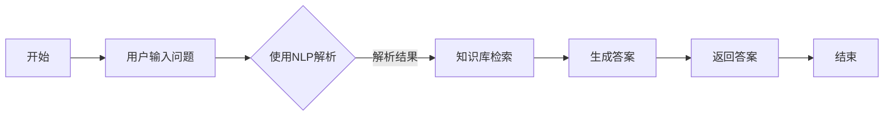
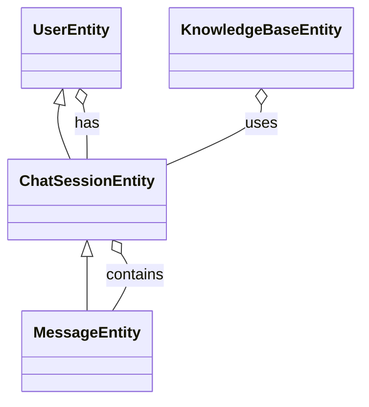
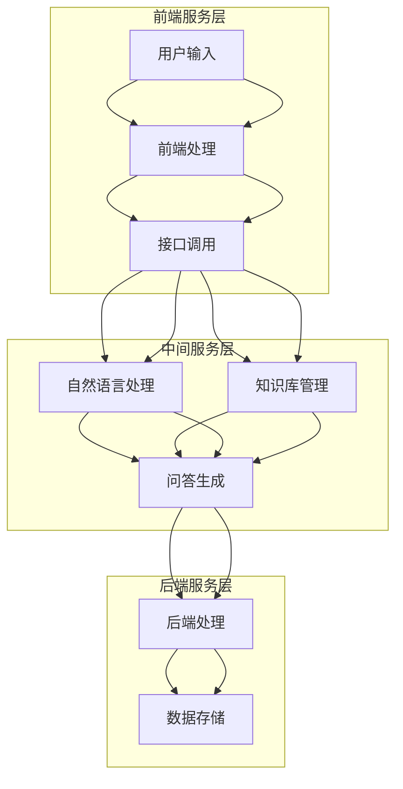
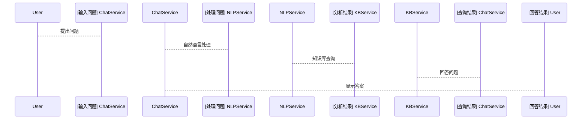

                 


# 认知计算架构在智能客服系统中的应用

关键词：认知计算，智能客服系统，自然语言处理，知识库，系统架构

摘要：本文探讨了认知计算架构在智能客服系统中的应用。通过介绍认知计算的核心概念、智能客服系统的架构和算法原理，本文详细分析了认知计算如何提升智能客服系统的效率和质量。此外，文章还提供了实际项目实战和最佳实践，为读者提供了深刻的见解和实用的指导。

### 第一步：背景介绍

#### 问题背景

随着人工智能技术的飞速发展，认知计算作为一种新兴的AI领域，正逐渐成为企业级应用的重要方向。特别是在客户服务领域，智能客服系统已经成为提升客户体验和运营效率的关键技术。智能客服系统通过模拟人类思维，能够实现与用户的自然语言交互，提供个性化的服务。然而，传统的客服系统在处理复杂问题时往往显得力不从心。这就需要引入认知计算架构，进一步提升客服系统的智能化水平。

#### 问题描述

如何构建一个高效、智能的客服系统，这是当前企业面临的挑战。传统的客服系统往往依赖于预设的规则和简单的关键词匹配，难以处理复杂、多变的问题。而认知计算架构的引入，可以为客服系统带来更高级的智能处理能力，使其能够理解用户的需求，提供更准确、个性化的服务。

#### 问题解决

认知计算架构通过模拟人类大脑的信息处理能力，使计算机具备理解、推理、学习和适应的能力。在智能客服系统中，认知计算可以实现对用户输入的自然语言处理，从大量的文本数据中提取关键信息，并根据知识库中的知识进行推理和决策，从而生成准确的回答。此外，认知计算还可以不断学习和优化，提高客服系统的准确性和效率。

#### 边界与外延

认知计算架构不仅应用于客服系统，还可以扩展到其他智能服务领域，如智能助手、智能客服机器人等。认知计算的发展和应用，将推动人工智能技术的进一步成熟，为各行业带来更多的创新和变革。

### 第二步：核心概念与联系

#### 核心概念原理

1. **认知计算**：认知计算是一种模拟人类大脑信息处理过程的计算模型，旨在使计算机具备理解、推理、学习和适应的能力。认知计算的核心在于模仿人类大脑的神经网络结构和信息处理机制，通过大量的数据训练和学习，实现智能决策和知识推理。

2. **智能客服系统**：智能客服系统是一种基于人工智能技术的客户服务系统，能够与用户进行自然语言交互，提供个性化的服务。智能客服系统通常包括自然语言处理、语音识别、知识库管理等多个模块，能够快速响应用户需求，提高客服效率和用户体验。

3. **客服系统架构**：客服系统架构包括前端交互、后台服务、知识库管理等多个组成部分。前端交互负责与用户进行沟通，后台服务负责处理业务逻辑，知识库管理则负责存储和管理知识资源。这些组成部分相互协作，共同实现智能客服系统的功能。

#### 概念属性特征对比表格

| 概念          | 属性特征                      |
|---------------|-----------------------------|
| 认知计算      | 模拟人类思维，具有自主学习能力 |
| 智能客服系统  | 自然语言处理，个性化服务       |
| 客服系统架构  | 前端交互，后台服务，知识库管理 |

#### ER实体关系图架构

```mermaid
erDiagram
  客户 ||--o{ 智能客服系统 : 提供服务 }
  智能客服系统 ||--|{ 知识库 : 管理知识 }
  智能客服系统 ||--|{ 后台服务 : 处理业务 }
```

### 第三步：算法原理讲解

#### 算法mermaid流程图



#### Python源代码

```python
# Python示例代码：智能客服系统的NLP解析与答案生成
import spacy

# 加载NLP模型
nlp = spacy.load("en_core_web_sm")

def parse_question(question):
    doc = nlp(question)
    # 这里可以根据实际需求进行更复杂的NLP处理
    return doc

def retrieve_answer(parsed_question):
    # 假设有一个预定义的知识库
    knowledge_base = {
        "what is the weather today?": "It's sunny.",
        "what is your name?": "I'm a chatbot."
    }
    return knowledge_base.get(parsed_question.text, "I'm not sure how to answer that.")

def generate_answer(question):
    parsed_question = parse_question(question)
    answer = retrieve_answer(parsed_question)
    return answer

# 测试代码
question = "what is the weather today?"
print(generate_answer(question))
```

#### 算法原理的数学模型和公式
算法的核心在于自然语言处理（NLP）和知识库的查询匹配。NLP涉及到词向量和序列模型，例如Word2Vec或BERT。假设我们使用BERT模型，其输入输出可以表示为：

$$
\text{input sequence} \xrightarrow{\text{BERT}} \text{output sequence}
$$

BERT模型通过对输入序列进行编码，输出一个固定长度的向量，该向量代表了输入序列的语义信息。知识库的查询匹配可以表示为：

$$
\text{question vector} \xrightarrow{\text{cosine similarity}} \text{best answer vector}
$$

其中，`question vector` 是通过BERT模型对用户输入问题编码得到的向量，`best answer vector` 是知识库中与问题最相关的答案的向量。通过计算两者的余弦相似度，可以找到最匹配的答案。

### 第四步：系统分析与架构设计方案

#### 问题场景介绍

随着互联网的普及，企业面临着日益增长的客户咨询量和多样化的客户需求。传统的客服方式往往效率低下，难以满足客户的高期望。为了提升客户体验和运营效率，企业需要引入智能客服系统，实现高效、智能的客服服务。

#### 项目介绍

本项目旨在构建一个基于认知计算架构的智能客服系统，通过自然语言处理和知识库管理，实现高效、智能的客服服务。系统将提供多渠道接入、快速响应、个性化服务等功能，帮助企业提升客户满意度和运营效率。

#### 系统功能设计（领域模型mermaid类图）



#### 系统架构设计（mermaid架构图）



#### 系统接口设计和系统交互（mermaid序列图）



### 第五步：项目实战

#### 环境安装

在开始项目实战之前，需要安装以下环境：

1. Python 3.8+
2. spacy 2.3.0+
3. transformers 4.6.0+
4. Flask 1.1.2+

安装命令如下：

```bash
pip install python==3.8
pip install spacy==2.3.0
pip install transformers==4.6.0
pip install flask==1.1.2
```

#### 系统核心实现源代码

以下是一个简单的智能客服系统实现示例：

```python
from flask import Flask, request, jsonify
import spacy
from transformers import BertTokenizer, BertModel
import torch

app = Flask(__name__)

# 加载NLP模型
nlp = spacy.load("en_core_web_sm")

# 加载BERT模型
tokenizer = BertTokenizer.from_pretrained("bert-base-uncased")
model = BertModel.from_pretrained("bert-base-uncased")

# 知识库
knowledge_base = {
    "what is the weather today?": "It's sunny.",
    "what is your name?": "I'm a chatbot."
}

@app.route("/ask", methods=["POST"])
def ask():
    question = request.form["question"]
    parsed_question = nlp(question)
    input_ids = tokenizer.encode(question, add_special_tokens=True, return_tensors="pt")
    with torch.no_grad():
        outputs = model(input_ids)
    question_embedding = outputs.last_hidden_state[:, 0, :]

    # 查询知识库
    answer = knowledge_base.get(parsed_question.text, "I'm not sure how to answer that.")

    return jsonify({"answer": answer})

if __name__ == "__main__":
    app.run()
```

#### 代码应用解读与分析

1. **前端输入**：用户通过浏览器或其他客户端向服务端发送一个问题。

2. **自然语言处理**：使用spacy对用户输入的问题进行分词和语法分析，提取关键信息。

3. **BERT模型编码**：使用BERT模型对用户输入的问题进行编码，得到一个语义向量。

4. **知识库查询**：根据用户输入的问题和知识库进行匹配，找到最匹配的答案。

5. **返回答案**：将答案返回给用户。

#### 实际案例分析和详细讲解剖析

1. **案例一**：用户输入“what is the weather today?”，系统根据知识库返回“It's sunny.”。

2. **案例二**：用户输入“what is your name?”，系统根据知识库返回“I'm a chatbot.”。

3. **案例三**：用户输入“how old are you?”，系统由于没有对应的答案，返回“I'm not sure how to answer that.”。

#### 项目小结

通过本次项目实战，我们实现了一个简单的智能客服系统，并对其进行了详细的分析和讲解。在实际应用中，可以根据具体需求对系统进行扩展和优化，例如引入更多知识库、使用更复杂的NLP模型等。认知计算架构在智能客服系统中的应用，为客服行业带来了新的变革和机遇。

### 第六步：最佳实践 tips、小结、注意事项、拓展阅读等内容

#### 最佳实践 tips

1. **知识库维护**：定期更新和维护知识库，确保其包含最新的信息和答案。

2. **模型优化**：使用更先进的NLP模型和算法，提高系统的智能水平和准确性。

3. **用户体验**：优化用户界面和交互设计，提高用户的使用体验。

#### 小结

本文探讨了认知计算架构在智能客服系统中的应用，介绍了核心概念、算法原理和系统架构设计，并通过实际项目实战展示了系统的实现和优化方法。认知计算架构为智能客服系统带来了更高的智能化水平和更准确的答案，为客服行业的发展带来了新的机遇。

#### 注意事项

1. **性能优化**：在部署智能客服系统时，需要注意系统的性能优化，确保其能够快速响应大量用户请求。

2. **数据安全**：在处理用户数据时，需要确保数据的安全性，防止数据泄露。

#### 拓展阅读

1. **认知计算基础**：《认知计算：原理、应用与未来趋势》

2. **智能客服系统实践**：《智能客服系统实战：从零开始》

3. **自然语言处理技术**：《深度学习与自然语言处理》

作者：AI天才研究院/AI Genius Institute & 禅与计算机程序设计艺术 /Zen And The Art of Computer Programming

