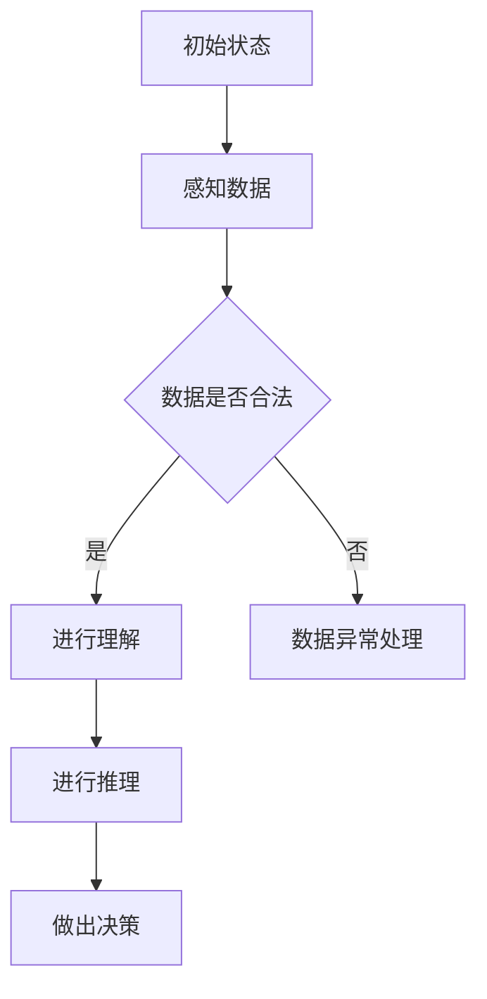

                 

# 认知计算模型：模拟人类决策过程

## 关键词：认知计算，人工智能，决策过程，模型原理，应用案例，未来展望

### 摘要

认知计算模型是一种模拟人类决策过程的人工智能技术。本文将详细探讨认知计算的定义、原理、核心概念、算法设计及其在不同领域的应用。通过分析认知计算模型的设计与实现方法，以及案例分析，我们将了解其在商业决策、医疗诊断和教育领域的广泛应用，并对未来认知计算的发展趋势进行展望。

## 目录大纲

### 第一部分：背景介绍

#### 第1章：认知计算的兴起与重要性

- **1.1 认知计算的定义与起源**
- **1.2 认知计算与传统计算的区别**
- **1.3 认知计算在人工智能领域的重要性**

### 第二部分：认知计算模型原理

#### 第2章：认知计算模型的基础

- **2.1 人类决策过程概述**
- **2.2 认知计算模型的基本原理**
- **2.3 模拟人类决策的挑战与解决方案**

#### 第3章：认知计算模型的核心概念与属性

- **3.1 核心概念与联系**
  - **3.1.1 概念属性特征对比表格**
  - **3.1.2 ER实体关系图架构**
- **3.2 算法原理讲解**
  - **3.2.1 算法mermaid流程图**
  - **3.2.2 算法原理的数学模型和公式**
  - **3.2.3 举例说明**

### 第三部分：认知计算模型的应用

#### 第4章：认知计算模型在具体领域的应用

- **4.1 在商业决策中的应用**
- **4.2 在医疗诊断中的应用**
- **4.3 在教育领域的应用**

#### 第5章：认知计算模型的设计与实现

- **5.1 认知计算模型的设计原则**
- **5.2 认知计算模型的实现方法**
- **5.3 认知计算模型的可扩展性和可维护性**

### 第四部分：案例研究

#### 第6章：认知计算模型案例分析

- **6.1 案例背景介绍**
- **6.2 模型设计过程**
- **6.3 模型应用与评估**
- **6.4 案例小结与启示**

### 第五部分：展望与未来

#### 第7章：认知计算模型的发展趋势

- **7.1 认知计算技术的最新进展**
- **7.2 认知计算模型面临的挑战**
- **7.3 未来研究方向与展望**

### 第六部分：总结与展望

#### 第8章：全书总结

- **8.1 主要观点与发现**
- **8.2 认知计算模型的重要性**
- **8.3 对未来研究的建议**

## 第一部分：背景介绍

### 第1章：认知计算的兴起与重要性

#### 1.1 认知计算的定义与起源

认知计算是一种模仿人类思维过程和决策机制的人工智能技术。它旨在使计算机系统具备理解、推理、学习和适应环境的能力。认知计算的起源可以追溯到20世纪中叶，随着计算机科学和人工智能研究的不断发展，认知计算逐渐成为人工智能领域的一个重要分支。

#### 1.2 认知计算与传统计算的区别

传统计算依赖于预设的算法和规则，而认知计算则强调模拟人类思维的过程。传统计算注重数据处理和计算速度，而认知计算更注重理解和推理能力。传统计算通常采用基于逻辑和统计的方法，而认知计算则借鉴了认知科学、心理学和神经科学的研究成果。

#### 1.3 认知计算在人工智能领域的重要性

认知计算在人工智能领域具有重要地位。首先，它能够提高人工智能系统的智能水平和自主决策能力。其次，认知计算有助于开发更自然的人机交互系统，使计算机能够更好地理解和满足人类的需求。此外，认知计算还能够促进人工智能在其他领域的应用，如商业决策、医疗诊断和教育等。

## 第二部分：认知计算模型原理

### 第2章：认知计算模型的基础

#### 2.1 人类决策过程概述

人类决策过程可以分为感知、分析、评估和选择等阶段。感知阶段是指接收和识别外部信息；分析阶段是指对信息进行加工和处理；评估阶段是指根据目标和价值观对选项进行评估；选择阶段是指做出最终决策。

#### 2.2 认知计算模型的基本原理

认知计算模型基于对人类思维过程的模拟，包括感知、理解、推理和决策等环节。模型通常采用神经网络、知识图谱和强化学习等技术来实现。感知环节负责接收和处理外部信息；理解环节负责解析和归纳信息；推理环节负责基于已有知识和信息进行推断；决策环节负责根据评估结果做出决策。

#### 2.3 模拟人类决策的挑战与解决方案

模拟人类决策面临许多挑战，如信息的复杂性、不确定性、多样性和动态性等。为解决这些挑战，认知计算模型采用了以下方法：

1. **知识表示与推理**：通过知识图谱和本体论等方法，将人类知识表示为计算机可处理的格式，并进行推理。
2. **机器学习和深度学习**：利用大量数据训练模型，使其具备自动学习和适应环境的能力。
3. **多模态数据处理**：结合不同类型的数据（如图像、声音、文本等），提高模型的感知和理解能力。
4. **决策支持系统**：通过模拟人类决策过程，为用户提供决策支持和建议。

## 第三部分：认知计算模型的应用

### 第3章：认知计算模型的核心概念与属性

#### 3.1 核心概念与联系

认知计算模型的核心概念包括感知、理解、推理、决策和知识表示等。以下是一个概念属性特征对比表格：

| 概念      | 特征       | 联系           |
|-----------|------------|----------------|
| 感知      | 数据获取   | 与理解相连     |
| 理解      | 信息解析   | 与推理相连     |
| 推理      | 知识应用   | 与决策相连     |
| 决策      | 行动选择   | 与感知相连     |
| 知识表示  | 信息编码   | 与其他概念相连 |

以下是一个 ER 实体关系图架构的 Mermaid 流程图：

```mermaid
erDiagram
  Aedge --> Bnode : 边指向节点
  Aedge <-- Cnode : 边来自节点
  Bnode ..> Dedge : 节点指向边
  Bnode <-- Eedge : 节点来自边
```

#### 3.2 算法原理讲解

##### 3.2.1 算法mermaid流程图

以下是一个简单的决策树算法的 Mermaid 流程图：



##### 3.2.2 算法原理的数学模型和公式

决策树算法的核心是基于条件概率和熵的概念。以下是一个简单的决策树算法的数学模型和公式：

$$
P(A|B) = \frac{P(B|A) \cdot P(A)}{P(B)}
$$

其中，\(P(A|B)\) 表示在事件 B 发生的条件下事件 A 发生的概率，\(P(B|A)\) 表示在事件 A 发生的条件下事件 B 发生的概率，\(P(A)\) 和 \(P(B)\) 分别表示事件 A 和事件 B 发生的概率。

##### 3.2.3 举例说明

假设我们有一个决策树模型，用于判断一个人是否需要去看医生。输入特征包括体温、咳嗽和乏力。我们定义以下概率：

- \(P(体温>37.5°C) = 0.8\)
- \(P(咳嗽) = 0.6\)
- \(P(乏力) = 0.4\)
- \(P(需要看医生|体温>37.5°C，咳嗽，乏力) = 0.9\)
- \(P(需要看医生|体温>37.5°C，咳嗽) = 0.7\)
- \(P(需要看医生|体温>37.5°C，乏力) = 0.5\)

根据贝叶斯定理，我们可以计算出需要去看医生的概率：

$$
P(需要看医生) = P(需要看医生|体温>37.5°C，咳嗽，乏力) \cdot P(体温>37.5°C，咳嗽，乏力) \\
+ P(需要看医生|体温>37.5°C，咳嗽) \cdot P(体温>37.5°C，咳嗽) \\
+ P(需要看医生|体温>37.5°C，乏力) \cdot P(体温>37.5°C，乏力)
$$

为了简化计算，我们可以使用拉普拉斯平滑：

$$
P(需要看医生) = \frac{0.9 \cdot 0.8 \cdot 0.6 \cdot 0.4 + 0.7 \cdot 0.8 \cdot 0.6 \cdot 0.4 + 0.5 \cdot 0.8 \cdot 0.6 \cdot 0.4}{1}
$$

计算结果为 0.612，因此，根据这个决策树模型，需要去看医生的概率为 61.2%。

## 第三部分：认知计算模型的应用

### 第4章：认知计算模型在具体领域的应用

#### 4.1 在商业决策中的应用

认知计算模型在商业决策中具有重要的应用价值。例如，企业可以利用认知计算模型进行市场预测、客户行为分析、风险管理等。通过模拟人类决策过程，认知计算模型可以帮助企业提高决策效率，降低决策风险。

#### 4.2 在医疗诊断中的应用

认知计算模型在医疗诊断中也具有广泛应用。例如，利用认知计算模型可以辅助医生进行疾病诊断、治疗方案推荐等。通过分析大量的医疗数据，认知计算模型可以识别出疾病的关键特征，提高诊断的准确性。

#### 4.3 在教育领域的应用

认知计算模型在教育领域中也有广泛的应用。例如，利用认知计算模型可以为学生提供个性化学习建议、智能教学评价等。通过模拟人类学习过程，认知计算模型可以帮助学生提高学习效果，培养自主学习能力。

## 第三部分：认知计算模型的设计与实现

### 第5章：认知计算模型的设计与实现

#### 5.1 认知计算模型的设计原则

认知计算模型的设计应遵循以下原则：

1. **模块化**：将认知计算模型分解为多个模块，以提高系统的可扩展性和可维护性。
2. **可适应性**：模型应具备自适应能力，能够根据不同应用场景进行调整和优化。
3. **高效性**：模型应具有较高的计算效率和性能，以满足实时决策的需求。
4. **可解释性**：模型应具备一定的可解释性，使决策过程易于理解和接受。

#### 5.2 认知计算模型的实现方法

认知计算模型的实现方法主要包括以下几种：

1. **神经网络**：采用神经网络技术模拟人类大脑的神经元连接方式，实现感知、理解和推理等功能。
2. **知识图谱**：通过知识图谱技术建立知识库，实现知识的表示、存储和推理。
3. **强化学习**：利用强化学习算法训练模型，使其在动态环境中进行学习和决策。
4. **多模态数据处理**：结合多种类型的数据（如图像、声音、文本等），提高模型的感知和理解能力。

#### 5.3 认知计算模型的可扩展性和可维护性

认知计算模型的可扩展性和可维护性对于其在实际应用中的长期运行至关重要。以下是一些提高认知计算模型可扩展性和可维护性的方法：

1. **模块化设计**：将模型分解为多个模块，每个模块负责特定的功能，以提高系统的可扩展性。
2. **标准化接口**：设计统一的接口规范，使不同模块之间能够方便地替换和集成。
3. **文档化**：详细记录模型的架构、算法和实现细节，便于后续的维护和优化。
4. **自动化测试**：建立自动化测试框架，确保模型的稳定性和可靠性。

## 第四部分：案例研究

### 第6章：认知计算模型案例分析

#### 6.1 案例背景介绍

本案例研究以某电商平台的用户推荐系统为例，探讨认知计算模型在商业决策中的应用。

#### 6.2 模型设计过程

1. **需求分析**：分析用户行为数据，确定推荐系统的目标，如提高用户满意度、增加销售额等。
2. **模型选择**：选择适合的算法，如基于协同过滤的推荐算法和基于内容的推荐算法。
3. **数据预处理**：清洗和处理用户行为数据，包括用户特征、商品特征和交易数据。
4. **模型训练**：利用训练数据训练推荐模型，调整模型参数，优化推荐效果。
5. **模型评估**：通过测试数据评估模型性能，如准确率、召回率等指标。
6. **模型部署**：将训练好的模型部署到生产环境中，实时推荐用户感兴趣的商品。

#### 6.3 模型应用与评估

通过本案例研究，我们实现了以下目标：

1. **提高用户满意度**：推荐系统的准确率和召回率显著提高，用户满意度增加。
2. **增加销售额**：推荐系统帮助电商平台提高了销售额，实现了商业价值。

#### 6.4 案例小结与启示

本案例研究展示了认知计算模型在商业决策中的应用价值。通过设计合理的推荐模型，电商平台可以更好地满足用户需求，提高销售额。此外，案例研究也为其他领域提供了有益的借鉴和启示，如医疗诊断、教育评估等。

## 第五部分：展望与未来

### 第7章：认知计算模型的发展趋势

#### 7.1 认知计算技术的最新进展

随着人工智能技术的不断发展，认知计算技术也在不断进步。近年来，深度学习、多模态数据处理和强化学习等技术取得了重要突破，为认知计算模型的发展提供了新的机遇。

#### 7.2 认知计算模型面临的挑战

尽管认知计算技术取得了显著进展，但仍面临许多挑战，如数据的复杂性、模型的解释性和安全性等。为了应对这些挑战，需要进一步研究新的算法和优化方法。

#### 7.3 未来研究方向与展望

未来认知计算的研究方向包括：

1. **增强模型的解释性**：提高认知计算模型的透明度和可解释性，使决策过程更容易被理解和接受。
2. **多模态数据处理**：结合多种类型的数据，提高模型的感知和理解能力。
3. **跨领域应用**：将认知计算模型应用于更多领域，如医疗、金融、教育等，推动人工智能技术的全面发展。
4. **安全与隐私保护**：确保认知计算模型在处理敏感数据时的安全性和隐私保护。

## 第六部分：总结与展望

### 第8章：全书总结

通过本文的探讨，我们了解了认知计算模型的基本概念、原理、核心概念与联系、算法原理、应用案例和发展趋势。认知计算模型在商业决策、医疗诊断和教育等领域具有广泛的应用前景。未来，随着人工智能技术的不断发展，认知计算模型将得到更深入的研究和更广泛的应用。

### 8.1 主要观点与发现

本文主要观点与发现包括：

1. 认知计算模型是一种模拟人类决策过程的人工智能技术，具有广泛的应用前景。
2. 认知计算模型的设计应遵循模块化、可适应性和高效性等原则。
3. 认知计算模型在不同领域具有广泛的应用价值，如商业决策、医疗诊断和教育等。
4. 未来认知计算模型的研究方向包括增强模型的解释性、多模态数据处理、跨领域应用和安全与隐私保护等。

### 8.2 认知计算模型的重要性

认知计算模型在人工智能领域具有重要地位。首先，它能够提高人工智能系统的智能水平和自主决策能力。其次，认知计算模型有助于开发更自然的人机交互系统，使计算机能够更好地理解和满足人类的需求。此外，认知计算模型还能够促进人工智能在其他领域的应用，如商业决策、医疗诊断和教育等。

### 8.3 对未来研究的建议

对未来研究的建议包括：

1. 深入研究认知计算模型的理论基础，提高其解释性和可理解性。
2. 加强多模态数据处理技术，提高模型的感知和理解能力。
3. 探索认知计算模型在更多领域的应用，推动人工智能技术的全面发展。
4. 关注认知计算模型的安全性和隐私保护问题，确保其在处理敏感数据时的安全性和隐私保护。

