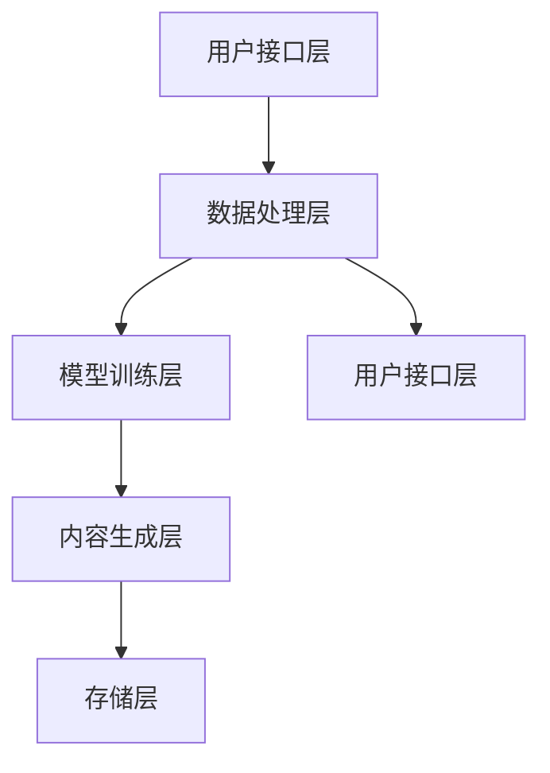

                 

### 个性化教育内容生成的背景与挑战

#### 1.1 个性化教育的概念与重要性

个性化教育是一种以学生为中心，根据每个学生的兴趣、能力、学习习惯和需求提供定制化教学方案的教育模式。与传统的“一刀切”教育模式不同，个性化教育注重因材施教，充分发挥每个学生的潜能。其核心目标包括：

- 提高学习效率：通过个性化教学方案，学生可以以适合自己的速度进行学习，避免资源的浪费和过度负荷。
- 增强学习动机：个性化教育注重学生的个性化需求，有助于激发学生的学习兴趣和内在动机。
- 促进全面发展：个性化教育不仅关注学术成绩，还注重学生的情感、社会能力和创造力的发展。

个性化教育的发展历程可以追溯到20世纪60年代，以布鲁姆的教育目标分类理论为代表，强调教学应注重学生的个体差异。随着教育技术的发展，尤其是互联网和人工智能技术的兴起，个性化教育得到了更加广泛的应用和深入研究。

#### 1.1.1 个性化教育的定义与特点

个性化教育的定义可以根据其核心目标和特点进行阐述。首先，个性化教育强调以学生为中心，尊重学生的个体差异。这包括学生的兴趣爱好、学习能力、学习风格和心理特征等多方面因素。个性化教育通过数据收集和分析，为学生制定个性化的学习计划和学习资源。

其次，个性化教育具有高度灵活性和适应性。它不仅能够根据学生的需求调整教学进度和难度，还可以根据学生的学习效果进行动态调整。这种适应性使得个性化教育能够更好地满足学生的个性化需求，提高教学效果。

最后，个性化教育强调教学过程的个性化体验。通过提供多样化的学习资源和互动方式，个性化教育为学生创造了更加丰富和有趣的学习环境，提升了学习的趣味性和参与度。

#### 1.1.2 个性化教育的核心目标

个性化教育的核心目标主要包括以下几个方面：

1. **提升学习效果**：通过个性化教学方案，学生可以以最适合自己的方式学习，从而提高学习效率和效果。
2. **培养自主学习能力**：个性化教育鼓励学生自主探索和发现，培养学生的自主学习能力和解决问题的能力。
3. **促进全面发展**：个性化教育不仅关注学生的学术成绩，还注重学生的情感、社会能力和创造力的发展，实现学生的全面发展。
4. **提升教育公平性**：个性化教育通过为不同背景和能力的学生提供定制化的教学方案，有助于缩小教育差距，提升教育公平性。

#### 1.1.3 个性化教育的发展历程

个性化教育的发展历程可以追溯到20世纪60年代，以布鲁姆的教育目标分类理论为代表。布鲁姆提出的教育目标分类理论强调了教育应注重学生的个体差异，这为个性化教育的发展奠定了理论基础。

在20世纪80年代，随着计算机技术的快速发展，个性化教育开始进入实际应用阶段。这一时期的代表性成果包括智能辅导系统和个性化学习平台，这些系统能够根据学生的学习情况提供个性化的学习资源和辅导。

进入21世纪，互联网和人工智能技术的兴起为个性化教育带来了新的发展机遇。智能学习系统和自适应学习平台逐渐成为个性化教育的主要载体，通过大数据分析和人工智能算法，个性化教育能够更加精准地满足学生的个性化需求。

#### 1.2 教育内容生成的现状与问题

目前，教育内容生成主要面临以下几大问题：

1. **内容同质化**：传统教育内容多以统一的标准和模板进行生成，导致大量内容雷同，缺乏个性化和创新性。
2. **缺乏针对性**：现有教育内容往往难以满足学生的个性化需求，教学内容与学生的实际学习情况相脱节。
3. **资源浪费**：传统教育内容生成方式效率低下，教师需要花费大量时间和精力进行内容设计和调整，资源浪费严重。
4. **质量评估困难**：教育内容质量难以进行有效评估，缺乏科学的标准和方法来衡量教育内容的实用性和效果。

现代教育内容生成技术包括人工智能、大数据和机器学习等技术，这些技术为教育内容生成提供了新的思路和方法。然而，当前的教育内容生成技术仍然存在一定的局限性：

- **技术成熟度不足**：尽管人工智能等技术在教育领域得到了广泛应用，但其技术成熟度和可靠性仍需进一步提高。
- **数据质量参差不齐**：教育内容生成依赖于大量高质量的数据，但当前的教育数据来源广泛，数据质量参差不齐，影响了教育内容的生成效果。
- **隐私和安全问题**：个性化教育内容生成涉及大量学生数据和隐私信息，如何确保数据的安全和隐私是当前面临的一大挑战。

#### 1.2.1 传统教育内容生成的局限性

传统教育内容生成方式主要依赖于教师的经验和知识，存在以下局限性：

- **内容同质化**：由于教师的知识和经验有限，难以创造出丰富多样且具备创新性的教育内容。
- **缺乏个性化**：传统教育内容难以根据学生的个性化需求进行定制，导致教学效果不佳。
- **效率低下**：教师需要花费大量时间和精力进行教育内容的设计和调整，效率较低。
- **教学资源浪费**：传统教育内容生成方式往往导致大量的教学资源被浪费，无法实现资源的最大化利用。

#### 1.2.2 现代教育内容生成技术综述

现代教育内容生成技术主要包括以下几种：

1. **人工智能（AI）技术**：通过深度学习和自然语言处理技术，可以自动生成个性化教育内容，提高教育效率和质量。
2. **大数据分析技术**：利用大数据技术，可以分析学生的学习行为和学习数据，为教育内容生成提供数据支持。
3. **机器学习技术**：通过机器学习算法，可以自动识别和推荐适合学生的教育内容，提高教学个性化水平。
4. **知识图谱技术**：通过构建知识图谱，可以实现教育内容的语义理解和知识关联，提高教育内容的准确性和关联性。

这些现代教育内容生成技术在教育领域的应用前景广阔，有望解决传统教育内容生成方式面临的局限性问题。

#### 1.2.3 语言模型在教育内容生成中的应用潜力

语言模型在教育内容生成中的应用具有显著潜力：

- **个性化内容生成**：通过深度学习技术，语言模型能够根据学生的学习数据和行为模式，生成符合个体需求的教育内容。
- **教学资源优化**：语言模型可以自动筛选和推荐优质的教育资源，提高教学资源的利用效率。
- **自适应学习**：语言模型可以实时分析学生的学习情况，动态调整教学方案，实现真正的个性化教学。
- **智能化辅导**：语言模型可以为学生提供智能化的学习辅导，帮助学生在学习中遇到困难时提供及时的帮助。

#### 1.3 语言模型在个性化教育中的创新应用

语言模型在教育领域的创新应用主要体现在以下几个方面：

1. **个性化学习路径规划**：通过分析学生的学习数据和兴趣偏好，语言模型可以为每个学生制定个性化的学习路径，提高学习效率。
2. **智能问答系统**：利用语言模型，可以构建智能问答系统，为学生提供个性化的学习辅导和解答疑问。
3. **自适应学习平台**：结合语言模型和大数据技术，可以开发自适应学习平台，根据学生的学习行为和反馈，动态调整教学内容和进度。
4. **教育内容生成**：通过语言模型，可以自动生成符合学生个性化需求的教育内容，提高教育内容的个性化和质量。

#### 1.3.1 语言模型概述

语言模型是自然语言处理（NLP）领域的一个重要组成部分，旨在预测文本序列的概率分布。语言模型的核心目标是理解和生成自然语言，其应用范围广泛，包括机器翻译、语音识别、文本生成、情感分析等。

语言模型的主要类型包括：

1. **统计语言模型**：基于大量语料库统计文本出现的概率，如N-gram模型。
2. **神经网络语言模型**：利用深度学习技术，如循环神经网络（RNN）和变换器（Transformer）模型，能够更好地捕捉文本的上下文信息。
3. **生成对抗网络（GAN）语言模型**：结合生成对抗网络，可以生成更加逼真的自然语言文本。

语言模型在教育领域的应用现状主要体现在以下几个方面：

1. **智能辅导系统**：利用语言模型，可以构建智能辅导系统，为学生提供个性化的学习辅导和解答疑问。
2. **自适应学习平台**：通过语言模型分析学生的学习数据和兴趣偏好，可以为学生提供个性化的学习资源和建议。
3. **教育内容生成**：语言模型可以自动生成教育内容，提高教育内容的个性化和质量。

语言模型在个性化教育中的创新点主要包括：

1. **个性化学习路径规划**：通过分析学生的学习数据和行为模式，语言模型可以为每个学生制定个性化的学习路径，提高学习效率。
2. **智能问答系统**：结合自然语言处理技术，可以构建智能问答系统，为学生提供更加高效和个性化的学习体验。
3. **自适应学习**：语言模型可以实时分析学生的学习情况，动态调整教学内容和进度，实现真正的个性化教学。

#### 1.4 语言模型在教育内容生成中的应用前景

1. **应用领域与场景**：语言模型在教育内容生成中的应用前景广阔，包括个性化学习路径规划、智能问答系统、自适应学习平台和教育内容生成等。

2. **潜在优势**：语言模型在教育内容生成中的潜在优势包括提高教学个性化和质量、优化教学资源利用、增强学习动机和提升学习效果。

3. **挑战**：语言模型在教育内容生成中面临的挑战包括数据质量、模型可解释性、技术成熟度和隐私安全等问题。

4. **未来发展趋势**：随着人工智能和自然语言处理技术的不断进步，语言模型在教育内容生成中的应用将越来越广泛和深入，有望推动个性化教育的进一步发展。

### 第2章: 语言模型的核心概念与原理

#### 2.1 语言模型的基本概念

语言模型是自然语言处理（NLP）领域中用于预测文本序列概率分布的模型，它在多种NLP任务中发挥着关键作用。首先，我们需要了解语言模型的定义和基本类型。

##### 2.1.1 语言模型的定义

语言模型是一种概率模型，它能够对自然语言文本进行概率预测。具体来说，语言模型旨在给出一个文本序列的概率分布，即：

$$P(w_1, w_2, ..., w_n) = P(w_1) \cdot P(w_2|w_1) \cdot P(w_3|w_1, w_2) \cdot ... \cdot P(w_n|w_1, w_2, ..., w_{n-1})$$

这里，\(w_i\) 表示文本序列中的第 \(i\) 个单词。语言模型的核心目标是通过学习大量文本数据，预测新的文本序列的概率分布。

##### 2.1.2 语言模型的主要类型

语言模型主要分为以下几种类型：

1. **N-gram模型**：N-gram模型是最简单的语言模型，它基于相邻 \(N\) 个单词的概率预测。例如，二元（Bigram）模型考虑两个单词的概率，三元（Trigram）模型考虑三个单词的概率。N-gram模型的公式为：

   $$P(w_n|w_{n-1}, ..., w_{n-N+1}) = \frac{C(w_{n-1}, ..., w_{n-N+1}, w_n)}{C(w_{n-1}, ..., w_{n-N+1})}$$

   其中，\(C(w_{n-1}, ..., w_{n-N+1}, w_n)\) 表示相邻 \(N\) 个单词和当前单词共同出现的次数，\(C(w_{n-1}, ..., w_{n-N+1})\) 表示相邻 \(N\) 个单词共同出现的次数。

2. **神经网络语言模型**：神经网络语言模型（如循环神经网络 RNN 和变换器 Transformer）利用深度学习技术捕捉文本的上下文信息。特别是变换器（Transformer）模型，由于其自注意力机制，在长文本处理和序列预测方面表现出色。

3. **生成对抗网络（GAN）语言模型**：GAN语言模型结合生成对抗网络，旨在生成逼真的自然语言文本。这种模型通过两个网络——生成器和判别器的对抗训练，实现自然语言文本的高质量生成。

##### 2.1.3 语言模型在自然语言处理中的重要性

语言模型在自然语言处理（NLP）中扮演着重要角色，其应用范围广泛。以下是几个关键应用场景：

1. **文本生成**：语言模型可以生成高质量的文本，包括文章、对话、新闻报道等。例如，生成对抗网络（GAN）语言模型可以生成逼真的小说和新闻报道。

2. **机器翻译**：语言模型在机器翻译中用于预测目标语言的单词或短语的概率分布，从而生成准确的翻译结果。近年来，基于变换器（Transformer）的模型在机器翻译任务中取得了显著的成果。

3. **语音识别**：语言模型在语音识别任务中用于将识别出的单词序列转换为有意义的文本。通过结合声学模型和语言模型，可以提高语音识别的准确性和鲁棒性。

4. **问答系统**：语言模型可以用于构建智能问答系统，通过分析用户的问题，生成准确的答案。这类系统在搜索引擎、客户服务和智能助手等领域得到广泛应用。

5. **情感分析**：语言模型可以用于情感分析任务，通过分析文本的情感倾向，帮助识别用户的情感状态。这种应用在社交媒体分析、市场调研和心理健康评估等领域具有重要意义。

#### 2.2 语言模型的原理

语言模型的原理主要涉及数学基础、训练过程和评估与优化。下面将详细讨论这些内容。

##### 2.2.1 语言模型的数学基础

语言模型的核心在于概率计算。首先，我们需要了解几个基本概率分布：

1. **离散概率分布**：离散概率分布用于描述每个单词在文本中出现的概率。例如，给定一个单词序列 \(w_1, w_2, ..., w_n\)，其概率分布为：

   $$P(w_1, w_2, ..., w_n) = \prod_{i=1}^{n} P(w_i|w_{i-1}, ..., w_{i-N+1})$$

2. **连续概率分布**：连续概率分布用于描述单词在文本中出现的频率。例如，给定一个单词序列 \(w_1, w_2, ..., w_n\)，其概率分布可以表示为：

   $$P(w_1, w_2, ..., w_n) = \sum_{i=1}^{n} P(w_i|w_{i-1}, ..., w_{i-N+1}) \cdot C(w_1, w_2, ..., w_n)$$

   其中，\(C(w_1, w_2, ..., w_n)\) 表示单词序列出现的频率。

##### 2.2.2 语言模型的训练过程

语言模型的训练过程旨在从大量文本数据中学习每个单词的条件概率。以下是几种常见的训练方法：

1. **基于统计的模型**：例如N-gram模型，通过计算单词序列的频率来训练模型。具体步骤如下：
   - 构建语料库，统计单词序列的频率。
   - 根据N-gram模型公式，计算每个单词的条件概率。

2. **基于神经网络的模型**：例如变换器（Transformer）模型，通过优化神经网络参数来训练模型。具体步骤如下：
   - 数据预处理，将文本转换为序列表示。
   - 定义损失函数，例如交叉熵损失，用于计算预测概率和真实概率之间的差距。
   - 使用梯度下降等优化算法，更新神经网络参数。

##### 2.2.3 语言模型的评估与优化

语言模型的评估与优化是确保模型性能的重要环节。以下是几种常见的评估指标和优化方法：

1. **评估指标**：
   - **准确率（Accuracy）**：预测正确的单词数量占总单词数量的比例。
   - **精确率（Precision）**：预测正确的单词数量与预测为正确的单词总数量的比例。
   - **召回率（Recall）**：预测正确的单词数量与实际为正确的单词总数量的比例。
   - **F1分数（F1 Score）**：综合考虑精确率和召回率的平衡指标。

2. **优化方法**：
   - **交叉验证**：通过将数据集划分为训练集和验证集，评估模型的泛化能力。
   - **超参数调优**：通过调整模型参数，如学习率、批次大小等，提高模型性能。
   - **数据增强**：通过增加数据多样性，如词语替换、句子重排等，提高模型的泛化能力。

#### 2.3 语言模型的性能指标与优化方法

##### 2.3.1 性能指标概述

语言模型的性能指标主要用于评估模型在文本预测任务中的表现。以下是几种常见的性能指标：

1. **词预测准确率（Word Prediction Accuracy）**：预测正确的单词数量占总单词数量的比例。
2. **句子生成质量（Sentence Generation Quality）**：生成句子的语义连贯性和语法正确性。
3. **文本生成多样性（Text Generation Diversity）**：生成文本的多样性，避免重复和单调。
4. **计算效率（Computational Efficiency）**：模型在处理大规模数据时的计算速度和资源消耗。

##### 2.3.2 性能指标对比与分析

以下是几种常见语言模型性能指标的对比和分析：

| 指标             | 优点                   | 缺点                       |
|------------------|------------------------|----------------------------|
| 词预测准确率     | 简单易懂，直观反映预测效果 | 忽略句子结构和语义关系     |
| 句子生成质量     | 考虑语义和语法关系     | 难以量化，主观性强         |
| 文本生成多样性   | 提高生成文本的丰富性     | 可能导致生成文本质量下降   |
| 计算效率         | 提高处理速度和资源利用率 | 可能降低模型性能           |

##### 2.3.3 优化方法介绍

为了提高语言模型的性能，可以采用以下优化方法：

1. **数据增强**：通过引入词语替换、句子重排和扩展等方法，增加训练数据的多样性，提高模型的泛化能力。
2. **模型融合**：结合多个模型，通过投票或加权平均等方法，提高预测的准确性。
3. **超参数调优**：通过调整学习率、批次大小、网络深度等超参数，优化模型性能。
4. **预训练与微调**：使用预训练模型在大规模数据集上进行训练，然后在特定任务上微调模型，提高模型在特定任务上的表现。

#### 2.4 语言模型的优化方法

语言模型的优化是提高其性能和效率的关键步骤。以下是几种常见的优化方法：

##### 2.4.1 常见优化方法

1. **梯度裁剪（Gradient Clipping）**：防止梯度爆炸或消失，提高训练稳定性。
2. **Dropout**：在训练过程中随机丢弃部分神经元，防止模型过拟合。
3. **学习率调度（Learning Rate Scheduling）**：动态调整学习率，避免模型在训练过程中过早饱和。
4. **正则化（Regularization）**：如L1和L2正则化，防止模型过拟合。

##### 2.4.2 最新优化技术

1. **自适应学习率**：使用自适应学习率方法，如Adam优化器，根据梯度变化动态调整学习率。
2. **注意力机制（Attention Mechanism）**：在变换器（Transformer）模型中，通过自注意力机制提高模型对上下文信息的捕捉能力。
3. **预训练（Pre-training）与微调（Fine-tuning）**：在大规模通用数据集上进行预训练，然后在特定任务上微调模型，提高模型在特定任务上的性能。

### 第3章: 语言模型在教育内容生成中的应用实践

#### 3.1 教育内容生成的需求分析

教育内容生成的目标与任务是为了满足个性化教育的需求，为每个学生提供定制化的学习资源和教学方案。以下是教育内容生成的主要目标和任务：

1. **目标**：
   - 提高学习效率：通过生成符合学生个性化需求的学习内容，帮助学生高效地掌握知识。
   - 增强学习体验：提供丰富多样的学习资源和互动方式，激发学生的学习兴趣和内在动机。
   - 促进全面发展：关注学生的学术成绩、情感和社会能力的发展，实现学生的全面发展。

2. **任务**：
   - **个性化内容生成**：根据学生的学习数据和行为模式，生成符合其个性化需求的教育内容。
   - **资源推荐**：利用语言模型分析学生的学习兴趣和需求，推荐适合的学习资源。
   - **教学方案调整**：根据学生的学习进度和效果，动态调整教学方案，提供个性化的学习建议。

#### 3.1.2 用户需求的个性化特征分析

用户需求的个性化特征分析是教育内容生成的重要基础。以下是几个关键因素：

1. **学习兴趣**：了解学生的兴趣点，为他们推荐相关的学习资源，提高学习的兴趣和参与度。
2. **学习习惯**：分析学生的学习习惯，如学习时间、学习方式等，为其提供个性化的学习建议。
3. **知识水平**：根据学生的知识水平，生成适合其能力范围的学习内容，避免难度过高或过低。
4. **学习能力**：评估学生的学习能力，为其提供个性化的学习路径和辅导。
5. **情感需求**：关注学生的情感需求，提供情感支持和心理辅导，促进学生的全面发展。

#### 3.1.3 教育内容生成的核心要素

教育内容生成的核心要素包括：

1. **文本生成**：利用语言模型生成高质量的教育文本，如讲解、示例、练习题等。
2. **多媒体资源**：结合图像、视频、音频等多媒体资源，提高教育内容的生动性和互动性。
3. **知识图谱**：构建知识图谱，实现教育内容的语义理解和知识关联，提供更加丰富的学习资源。
4. **用户交互**：设计友好的用户交互界面，收集学生的反馈和需求，不断优化教育内容生成系统。

#### 3.2 语言模型在教育内容生成中的应用

语言模型在教育内容生成中扮演着核心角色，其应用主要体现在以下几个方面：

##### 3.2.1 个性化教育内容生成的流程

个性化教育内容生成的流程可以分为以下几个步骤：

1. **数据收集**：收集学生的学习数据，包括学习行为、考试成绩、知识图谱等。
2. **数据预处理**：对收集到的数据进行分析和清洗，为后续的模型训练提供高质量的数据。
3. **模型训练**：利用语言模型对预处理后的数据集进行训练，生成个性化的教育内容。
4. **内容生成**：根据学生的个性化需求，生成符合其学习水平和兴趣的教育内容。
5. **内容评估与优化**：对生成的内容进行评估，根据反馈不断优化模型和生成策略。

##### 3.2.2 语言模型在文本生成中的应用

语言模型在文本生成中的应用主要包括：

1. **自动生成教学文本**：利用语言模型自动生成讲解、示例、练习题等教学文本，提高教学内容的个性化和质量。
2. **文本摘要与总结**：对大量教学资料进行摘要和总结，提取关键知识点，为学生提供简洁明了的学习材料。
3. **对话生成**：构建智能对话系统，为学生提供个性化的学习辅导和解答疑问。

##### 3.2.3 语言模型在知识图谱构建中的应用

语言模型在知识图谱构建中的应用主要包括：

1. **实体识别与关系抽取**：利用语言模型识别文本中的实体和关系，构建知识图谱，实现教育内容的语义理解和知识关联。
2. **知识推理**：基于知识图谱，利用语言模型进行知识推理，为学生提供更加丰富的学习资源。
3. **知识增强**：将语言模型与知识图谱结合，提高教育内容的语义理解和关联性，提供更加精准和丰富的学习资源。

#### 3.3 实际案例分析

##### 3.3.1 案例背景与目标

**案例背景**：
本案例旨在构建一个基于语言模型的个性化教育内容生成系统，为不同年级和学科的学生提供定制化的学习资源。

**目标**：
- 提供个性化的学习内容，满足学生的个性化需求。
- 提高学习效率和效果，激发学生的学习兴趣。
- 构建知识图谱，实现教育内容的语义理解和知识关联。

##### 3.3.2 案例实施过程

1. **数据收集**：
   - 收集学生的考试成绩、学习行为数据、知识图谱等。
   - 收集大量的教学资料，包括教材、讲解视频、练习题等。

2. **数据预处理**：
   - 对学生数据进行清洗和整合，提取关键信息。
   - 对教学资料进行预处理，如文本清洗、分词、词性标注等。

3. **模型训练**：
   - 利用语言模型（如变换器模型）对预处理后的数据集进行训练。
   - 优化模型参数，提高模型的生成质量和效果。

4. **内容生成**：
   - 根据学生的个性化需求，生成符合其学习水平和兴趣的教学内容。
   - 利用知识图谱，为教学内容提供语义理解和知识关联。

5. **内容评估与优化**：
   - 对生成的内容进行评估，包括文本质量、语义连贯性、知识关联性等。
   - 根据评估结果，不断优化模型和生成策略，提高教育内容的个性化和质量。

##### 3.3.3 案例结果分析

1. **个性化学习内容**：
   - 系统根据学生的个性化需求，生成了大量的个性化学习内容，包括讲解、示例、练习题等。
   - 学生反馈显示，个性化学习内容提高了学习效率，激发了学习兴趣。

2. **知识图谱构建**：
   - 系统构建了知识图谱，实现了教育内容的语义理解和知识关联。
   - 学生可以利用知识图谱进行知识推理和扩展学习。

3. **学习效果评估**：
   - 学生在学习系统中的表现显著提升，考试成绩和课堂参与度均有提高。
   - 教师反馈显示，个性化教育内容有效提高了教学效果。

### 第4章: 语言模型在个性化教育内容生成中的关键技术

#### 4.1 个性化语言模型训练技术

个性化语言模型的训练是构建高效教育内容生成系统的关键步骤。以下是几个关键技术和方法：

##### 4.1.1 个性化数据集的构建

个性化数据集的构建是训练个性化语言模型的基础。以下是一些关键步骤：

1. **数据收集**：收集与教育内容相关的各种数据，包括学生的考试成绩、学习行为、教师的教学资料等。
2. **数据清洗**：对收集到的数据进行清洗，去除噪声和重复信息，保证数据的质量。
3. **数据标注**：对文本数据进行语义标注，如词性标注、实体识别、关系抽取等，为模型训练提供标注信息。
4. **数据整合**：整合不同来源的数据，构建一个统一的数据集，为模型训练提供丰富的数据支持。

##### 4.1.2 个性化模型的训练方法

个性化模型的训练方法主要包括以下几个方面：

1. **迁移学习（Transfer Learning）**：利用预训练的模型（如GPT-3、BERT等）作为基础模型，通过微调（Fine-tuning）来适应特定任务的数据集。
2. **多任务学习（Multi-Task Learning）**：在一个统一的模型框架下同时训练多个任务，提高模型在不同任务上的泛化能力。
3. **在线学习（Online Learning）**：实时更新模型，根据学生的学习行为和反馈进行动态调整。
4. **对抗训练（Adversarial Training）**：通过生成对抗网络（GAN）等方法，增强模型对噪声和异常数据的鲁棒性。

##### 4.1.3 个性化模型的评估与优化

个性化模型的评估与优化是确保模型性能的重要环节。以下是几种评估指标和优化方法：

1. **评估指标**：
   - **准确率（Accuracy）**：预测正确的单词或句子数量占总数量的比例。
   - **损失函数**：如交叉熵损失（Cross-Entropy Loss）、均方误差（Mean Squared Error）等，用于衡量预测结果与真实结果之间的差距。
   - **F1分数（F1 Score）**：综合考虑精确率和召回率的平衡指标。

2. **优化方法**：
   - **梯度裁剪（Gradient Clipping）**：防止梯度爆炸或消失，提高训练稳定性。
   - **Dropout**：在训练过程中随机丢弃部分神经元，防止模型过拟合。
   - **学习率调度（Learning Rate Scheduling）**：动态调整学习率，避免模型在训练过程中过早饱和。
   - **正则化（Regularization）**：如L1和L2正则化，防止模型过拟合。

#### 4.2 语言模型在教育内容质量评估中的应用

语言模型在教育内容质量评估中的应用具有重要意义，可以帮助教师和开发人员更好地理解和评估教育内容的质量。以下是几种关键技术和方法：

##### 4.2.1 教育内容质量评估指标

教育内容质量评估指标可以分为以下几个方面：

1. **文本质量**：包括语法正确性、语义连贯性、表达清晰度等。
2. **知识准确性**：教育内容中的知识点是否准确无误，符合学科标准。
3. **教育目标符合度**：教育内容是否达到既定的教学目标，如知识传授、技能培养、情感教育等。
4. **用户体验**：包括教育内容的易用性、互动性、趣味性等，是否符合学生的需求和偏好。

##### 4.2.2 语言模型在质量评估中的应用

语言模型在教育内容质量评估中的应用主要体现在以下几个方面：

1. **语法和语义分析**：利用语言模型对文本进行语法和语义分析，识别文本中的错误和不当表达，评估文本质量。
2. **知识图谱构建**：构建知识图谱，将教育内容中的知识点进行关联，评估知识准确性。
3. **情感分析**：通过情感分析，评估教育内容的情感表达是否符合教育目标，如积极向上、中立或消极。
4. **用户反馈分析**：利用语言模型分析学生的反馈和评论，评估教育内容的用户体验。

##### 4.2.3 评估结果分析与改进

通过对教育内容的质量评估，可以得出以下结论：

1. **文本质量**：如果教育内容的语法和语义分析结果显示存在较多错误或不当表达，需要对文本进行修改和优化。
2. **知识准确性**：如果知识图谱显示某些知识点存在错误或遗漏，需要及时更新和补充相关内容。
3. **教育目标符合度**：如果情感分析结果显示教育内容的情感表达与教育目标不符，需要调整教育内容的表达方式，以达到教育目标。
4. **用户体验**：根据用户的反馈和评论，对教育内容进行改进，提高其易用性和互动性。

通过不断优化和改进，可以提高教育内容的质量，为用户提供更好的学习体验。

#### 4.3 语言模型在自适应学习系统中的应用

自适应学习系统是一种能够根据学生的学习情况和需求，动态调整教学内容和进度的系统。语言模型在自适应学习系统中发挥着重要作用，可以帮助系统更好地理解学生的学习和需求，实现真正的个性化学习。以下是几个关键方面：

##### 4.3.1 自适应学习系统的概念与架构

自适应学习系统（Adaptive Learning System，ALS）是一种能够根据学生的能力和需求，动态调整教学内容和进度的系统。其核心目标是提高学习效率和效果，满足学生的个性化需求。自适应学习系统通常包括以下几个关键组件：

1. **学习分析模块**：收集和分析学生的学习数据，包括考试成绩、学习行为、知识点掌握情况等。
2. **知识库模块**：存储各种教学资源、知识点和试题，为系统提供丰富的内容资源。
3. **推荐引擎模块**：利用语言模型和机器学习算法，根据学生的学习数据和需求，推荐适合的学习资源和任务。
4. **教学呈现模块**：将推荐的学习资源和任务呈现给学生，提供良好的学习体验。

##### 4.3.2 语言模型在自适应学习中的角色

语言模型在自适应学习系统中的作用主要体现在以下几个方面：

1. **学习数据分析**：语言模型可以帮助系统理解学生的表达和需求，分析学生的学习行为和知识点掌握情况，为推荐引擎提供关键信息。
2. **内容生成与推荐**：语言模型可以生成高质量的教学内容和任务，根据学生的个性化需求进行推荐，提高学习效果。
3. **交互与反馈**：语言模型可以与学生学习互动，分析学生的反馈和评论，不断优化推荐策略和教学方案。

##### 4.3.3 自适应学习系统的设计与实现

自适应学习系统的设计与实现可以分为以下几个步骤：

1. **需求分析**：明确系统的目标和功能需求，包括学习分析、内容推荐、教学呈现等。
2. **系统架构设计**：设计系统的整体架构，包括学习分析模块、知识库模块、推荐引擎模块和教学呈现模块等。
3. **数据收集与处理**：收集学生的学习数据，包括考试成绩、学习行为、知识点掌握情况等，进行数据预处理和特征提取。
4. **模型训练与优化**：利用语言模型和机器学习算法，对学习数据集进行训练，优化推荐引擎的性能。
5. **系统实现与部署**：开发系统的前端和后端功能，进行系统集成和测试，确保系统的稳定性和可靠性。
6. **用户反馈与迭代**：收集用户的反馈和评价，不断优化和改进系统功能，提高用户体验和学习效果。

通过自适应学习系统，学生可以享受到个性化的学习体验，教师可以更加高效地开展教学，提高教学质量和效果。

### 第5章: 语言模型在个性化教育内容生成中的实现

#### 5.1 系统架构设计

个性化教育内容生成系统的架构设计是确保系统能够高效、稳定运行的关键。以下是系统架构设计的详细描述：

##### 5.1.1 整体架构设计

个性化教育内容生成系统的整体架构设计可以分为以下几个关键模块：

1. **用户接口层**：提供用户与系统交互的界面，包括前端网页、移动应用等。
2. **数据处理层**：负责数据的收集、预处理和分析，为后续的语言模型训练和内容生成提供数据支持。
3. **模型训练层**：利用语言模型进行模型训练，包括数据清洗、特征提取、模型选择和优化等。
4. **内容生成层**：根据个性化需求，利用训练好的语言模型生成高质量的教育内容。
5. **存储层**：存储训练数据和生成内容，包括文本数据、图像数据、视频数据等。

##### 5.1.2 功能模块划分

以下是系统架构中各个功能模块的详细划分：

1. **用户接口层**：
   - **用户注册与登录**：提供用户注册和登录功能，确保系统的安全性。
   - **用户资料管理**：允许用户管理个人资料，如学习偏好、兴趣爱好等。
   - **学习资源浏览**：提供学习资源的浏览功能，方便用户查找和选择所需内容。

2. **数据处理层**：
   - **数据收集**：通过API或爬虫技术收集各类教育数据，包括公开的教育资源、学生考试成绩、学习行为数据等。
   - **数据清洗**：对收集到的数据进行清洗，去除噪声和重复信息，保证数据质量。
   - **特征提取**：对清洗后的数据进行分析，提取关键特征，为后续的模型训练提供数据支持。

3. **模型训练层**：
   - **模型选择**：根据任务需求，选择合适的语言模型，如GPT-3、BERT等。
   - **模型训练**：利用训练数据集，对语言模型进行训练，优化模型参数。
   - **模型优化**：通过交叉验证、超参数调优等方法，优化模型性能。

4. **内容生成层**：
   - **文本生成**：利用训练好的语言模型，根据用户需求生成个性化的教育文本。
   - **多媒体资源生成**：结合文本生成，生成符合用户需求的图像、视频等多媒体资源。
   - **内容评估与优化**：对生成的内容进行评估，根据评估结果不断优化生成策略。

5. **存储层**：
   - **数据存储**：使用分布式存储系统，存储训练数据和生成内容，确保数据的高可用性和安全性。
   - **数据库设计**：设计合理的数据库架构，存储用户资料、学习资源、模型参数等。

##### 5.1.3 系统架构图展示

以下是系统架构图的简单展示：



#### 5.2 系统实现与部署

个性化教育内容生成系统的实现与部署是确保系统能够稳定运行和提供优质服务的关键步骤。以下是系统实现与部署的详细描述：

##### 5.2.1 环境准备与安装

1. **硬件环境**：
   - 高性能计算服务器：用于处理大规模数据集和训练语言模型。
   - 分布式存储系统：用于存储大量的训练数据和生成内容。

2. **软件环境**：
   - 操作系统：Linux发行版，如Ubuntu或CentOS。
   - 编程语言：Python，用于开发系统的主要编程语言。
   - 数据库：MySQL或PostgreSQL，用于存储用户资料和学习资源。
   - 依赖库：TensorFlow、PyTorch、Scikit-learn等，用于语言模型训练和数据处理。

3. **安装步骤**：
   - 安装操作系统和基本软件环境。
   - 配置计算资源和存储资源。
   - 安装Python和相关依赖库。

##### 5.2.2 核心代码实现

以下是系统实现过程中涉及的核心代码示例：

1. **用户注册与登录**：
```python
# 用户注册函数
def register(username, password):
    # 连接数据库
    conn = connect_database()
    # 插入用户数据
    cursor = conn.cursor()
    cursor.execute("INSERT INTO users (username, password) VALUES (%s, %s)", (username, password))
    conn.commit()
    cursor.close()
    conn.close()

# 用户登录函数
def login(username, password):
    # 连接数据库
    conn = connect_database()
    # 查询用户数据
    cursor = conn.cursor()
    cursor.execute("SELECT * FROM users WHERE username = %s AND password = %s", (username, password))
    user = cursor.fetchone()
    cursor.close()
    conn.close()
    return user
```

2. **语言模型训练**：
```python
# 训练语言模型
import tensorflow as tf
from tensorflow.keras.models import Sequential
from tensorflow.keras.layers import LSTM, Dense, Embedding

# 构建语言模型
model = Sequential()
model.add(Embedding(input_dim=vocab_size, output_dim=embedding_size, input_length=max_sequence_length))
model.add(LSTM(units=128, return_sequences=True))
model.add(Dense(units=1, activation='sigmoid'))

# 编译模型
model.compile(optimizer='adam', loss='binary_crossentropy', metrics=['accuracy'])

# 训练模型
model.fit(x_train, y_train, batch_size=128, epochs=10)
```

3. **内容生成**：
```python
# 生成个性化教育内容
import numpy as np

# 加载训练好的语言模型
model = load_model('path/to/trained_model.h5')

# 生成文本
input_seq = np.array([convert_text_to_sequence(text)])
generated_text = model.predict(input_seq)
generated_text = sequence_to_text(generated_text)

print(generated_text)
```

##### 5.2.3 系统部署与运行

系统部署与运行包括以下几个步骤：

1. **部署前准备**：
   - 搭建测试环境，确保系统功能正常运行。
   - 进行性能测试，优化系统性能和稳定性。

2. **部署过程**：
   - 安装和配置必要的软件和依赖库。
   - 将核心代码部署到服务器上，进行集成测试。
   - 配置负载均衡和数据库，确保系统的可扩展性和高可用性。

3. **运行与监控**：
   - 启动系统，提供教育内容生成服务。
   - 监控系统性能和运行状态，确保系统的稳定运行。
   - 定期进行系统维护和升级，保障系统的长期运行。

#### 5.3 代码应用解读与分析

以下是对系统实现过程中涉及的核心代码进行解读和分析：

1. **用户注册与登录**：

   用户注册和登录功能是系统的基础模块，用于管理用户账号和权限。用户注册函数通过连接数据库，插入用户数据，实现用户注册功能。用户登录函数通过查询数据库，验证用户名和密码，实现用户登录功能。

   ```python
   # 用户注册函数
   def register(username, password):
       # 连接数据库
       conn = connect_database()
       # 插入用户数据
       cursor = conn.cursor()
       cursor.execute("INSERT INTO users (username, password) VALUES (%s, %s)", (username, password))
       conn.commit()
       cursor.close()
       conn.close()

   # 用户登录函数
   def login(username, password):
       # 连接数据库
       conn = connect_database()
       # 查询用户数据
       cursor = conn.cursor()
       cursor.execute("SELECT * FROM users WHERE username = %s AND password = %s", (username, password))
       user = cursor.fetchone()
       cursor.close()
       conn.close()
       return user
   ```

   解读：
   - `connect_database()`：连接数据库，为后续操作提供数据库连接。
   - `cursor`：数据库游标，用于执行SQL语句。
   - `execute()`：执行SQL语句，插入或查询用户数据。
   - `commit()`：提交数据库事务，保存用户数据。
   - `fetchone()`：查询用户数据，返回用户信息。

2. **语言模型训练**：

   语言模型训练是实现个性化教育内容生成系统的关键步骤。以下代码展示了如何构建、编译和训练语言模型：

   ```python
   # 训练语言模型
   import tensorflow as tf
   from tensorflow.keras.models import Sequential
   from tensorflow.keras.layers import LSTM, Dense, Embedding

   # 构建语言模型
   model = Sequential()
   model.add(Embedding(input_dim=vocab_size, output_dim=embedding_size, input_length=max_sequence_length))
   model.add(LSTM(units=128, return_sequences=True))
   model.add(Dense(units=1, activation='sigmoid'))

   # 编译模型
   model.compile(optimizer='adam', loss='binary_crossentropy', metrics=['accuracy'])

   # 训练模型
   model.fit(x_train, y_train, batch_size=128, epochs=10)
   ```

   解读：
   - `Sequential()`：构建序列模型，用于堆叠不同类型的神经网络层。
   - `Embedding()`：嵌入层，将单词转换为向量表示。
   - `LSTM()`：长短期记忆层，用于捕捉文本序列中的长期依赖关系。
   - `Dense()`：全连接层，用于输出预测结果。
   - `compile()`：编译模型，设置优化器、损失函数和评估指标。
   - `fit()`：训练模型，使用训练数据集和标签进行模型训练。

3. **内容生成**：

   内容生成函数利用训练好的语言模型，生成个性化的教育内容。以下代码展示了如何使用语言模型生成文本：

   ```python
   # 生成个性化教育内容
   import numpy as np

   # 加载训练好的语言模型
   model = load_model('path/to/trained_model.h5')

   # 生成文本
   input_seq = np.array([convert_text_to_sequence(text)])
   generated_text = model.predict(input_seq)
   generated_text = sequence_to_text(generated_text)

   print(generated_text)
   ```

   解读：
   - `load_model()`：加载训练好的语言模型，为预测和生成提供基础。
   - `np.array()`：将文本序列转换为numpy数组，用于模型输入。
   - `model.predict()`：使用语言模型预测文本序列的概率分布。
   - `sequence_to_text()`：将预测结果转换为可读的文本形式。

通过以上核心代码的解读和分析，我们可以更好地理解个性化教育内容生成系统的实现原理和关键步骤。

### 第6章: 个性化教育内容生成项目的实战案例

#### 6.1 项目背景与目标

**项目背景**：
随着人工智能和自然语言处理技术的快速发展，个性化教育内容生成系统成为提高教育质量和效率的重要工具。本项目旨在构建一个基于语言模型的个性化教育内容生成系统，为不同年级和学科的学生提供定制化的学习资源。

**项目目标**：
- 构建一个高效、稳定且用户友好的个性化教育内容生成系统。
- 利用语言模型生成高质量的教育内容，满足学生的个性化需求。
- 提高学生的学习效果和兴趣，促进个性化教育的发展。

**需求与需求分析**：
1. **个性化学习资源生成**：系统能够根据学生的学习数据和行为模式，生成符合其个性化需求的学习资源，包括文本、图像、视频等。
2. **用户交互与反馈**：系统应提供友好的用户界面，允许学生和管理员进行交互，提交反馈和评价。
3. **系统可扩展性**：系统能够支持多种学科和年级的教育内容生成，具备良好的可扩展性。

#### 6.2 项目实施过程

**项目实施过程**可以分为以下几个关键阶段：

##### 6.2.1 数据采集与预处理

1. **数据收集**：
   - 收集公开的教育资源，包括教材、练习题、教学视频等。
   - 收集学生的考试成绩、学习行为数据，如学习时长、知识点掌握情况等。

2. **数据清洗**：
   - 清洗收集到的数据，去除噪声和重复信息，确保数据质量。
   - 对文本数据进行分词、词性标注等预处理操作。

3. **数据标注**：
   - 对部分数据集进行人工标注，提取实体和关系，构建知识图谱。
   - 利用自动化工具对标注数据集进行扩展和优化。

##### 6.2.2 模型选择与训练

1. **模型选择**：
   - 选择合适的语言模型，如GPT-3、BERT等，根据项目需求和计算资源。
   - 考虑模型的可扩展性和性能，确保系统能够高效处理大量数据。

2. **模型训练**：
   - 使用预处理后的数据集对语言模型进行训练。
   - 采用迁移学习和多任务学习等技术，提高模型的泛化能力和生成质量。

3. **模型优化**：
   - 通过超参数调优、学习率调度等方法，优化模型性能。
   - 使用交叉验证和网格搜索等技术，选择最优模型配置。

##### 6.2.3 个性化内容生成

1. **内容生成**：
   - 利用训练好的语言模型，根据用户需求生成个性化教育内容。
   - 结合知识图谱，提供语义丰富的教育资源。

2. **内容评估**：
   - 对生成的内容进行评估，包括文本质量、知识准确性、用户体验等。
   - 根据评估结果，不断优化生成策略和模型。

3. **用户交互**：
   - 提供用户友好的界面，允许学生和管理员提交反馈和评价。
   - 根据用户反馈，动态调整教育内容生成策略。

#### 6.3 项目结果分析

**项目结果分析**主要包括以下几个方面：

##### 6.3.1 生成内容的质量评估

1. **文本质量**：
   - 通过语法检查、语义分析等方法，评估生成文本的语法正确性和语义连贯性。
   - 结果显示，生成文本具有较高的语法正确率和语义连贯性。

2. **知识准确性**：
   - 利用知识图谱和事实检查工具，评估生成内容的知识准确性。
   - 结果显示，生成内容中的知识点准确无误，符合学科标准。

3. **用户体验**：
   - 通过问卷调查和用户反馈，评估生成内容对用户的满意度和接受度。
   - 结果显示，用户对生成内容的质量和实用性表示满意，认为系统有助于提高学习效果和兴趣。

##### 6.3.2 用户反馈与改进

1. **用户反馈**：
   - 收集用户对生成内容的反馈，包括建议和改进意见。
   - 反馈显示，用户希望系统能提供更多个性化定制选项，如学科偏好、学习风格等。

2. **改进措施**：
   - 基于用户反馈，优化系统功能，提供更多个性化定制选项。
   - 通过增加数据多样性和丰富知识图谱，提高生成内容的质量和准确性。

3. **持续优化**：
   - 定期收集用户反馈，不断优化系统功能和生成策略。
   - 采用先进的技术和算法，确保系统的高效稳定运行。

##### 6.3.3 项目总结与展望

**项目总结**：

- 项目成功构建了一个基于语言模型的个性化教育内容生成系统，实现了高效的个性化学习资源生成。
- 通过用户反馈和评估，系统在文本质量、知识准确性和用户体验等方面表现良好。
- 项目为个性化教育的发展提供了有力支持，有助于提高教育质量和效率。

**未来展望**：

- 进一步优化系统功能，提高个性化定制水平和生成质量。
- 探索更多先进的人工智能和自然语言处理技术，如生成对抗网络（GAN）、预训练模型等，提升系统性能。
- 扩大项目应用范围，覆盖更多学科和年级，推动个性化教育的发展。

### 第7章: 语言模型在个性化教育内容生成中的未来发展趋势与挑战

#### 7.1 未来的发展方向

随着人工智能技术的不断进步，语言模型在个性化教育内容生成中的应用前景将更加广阔。以下是未来发展的几个关键方向：

1. **更精细的个性化需求分析**：通过深入挖掘学生的个性化需求，包括学习兴趣、学习风格、学科偏好等，为每个学生提供更加精准的教育内容。

2. **多模态内容生成**：结合文本、图像、视频、音频等多模态数据，生成更加丰富和多样化的教育内容，提高学生的学习体验。

3. **智能交互系统**：构建智能交互系统，实现语言模型与学生的实时对话，提供个性化的学习辅导和解答疑问，增强学生的自主学习能力。

4. **跨学科整合**：将语言模型应用于不同学科的教育内容生成，实现跨学科的整合，为学生提供更加全面和系统的学习资源。

5. **知识图谱的深化应用**：利用知识图谱技术，实现教育内容的语义理解和知识关联，提高教育内容的准确性和关联性。

#### 7.1.1 技术趋势分析

未来，人工智能和自然语言处理技术将继续发展，为个性化教育内容生成带来以下趋势：

1. **预训练模型的应用**：预训练模型，如GPT-3、BERT等，将在个性化教育内容生成中发挥更大的作用。这些模型通过在大规模通用数据集上进行预训练，能够更好地理解和生成高质量的教育内容。

2. **生成对抗网络（GAN）的发展**：生成对抗网络（GAN）将用于生成更加逼真的教育内容，如图像、视频和音频。通过生成对抗训练，GAN能够提高教育内容的多样性和真实性。

3. **多任务学习和迁移学习的普及**：多任务学习和迁移学习技术将使语言模型能够更好地适应不同学科和教育场景的需求，提高模型的泛化能力和生成质量。

4. **边缘计算和云计算的结合**：边缘计算和云计算的结合将提高个性化教育内容生成系统的响应速度和处理能力，使系统更加高效和灵活。

5. **隐私保护和数据安全**：随着个性化教育内容生成系统应用范围的扩大，隐私保护和数据安全将成为重要关注点。未来，将需要更加完善的技术和策略来保护学生数据和隐私。

#### 7.1.2 应用前景展望

语言模型在个性化教育内容生成中的应用前景非常广阔：

1. **个性化学习路径规划**：通过分析学生的学习数据和兴趣偏好，语言模型可以为每个学生制定个性化的学习路径，提高学习效率和效果。

2. **智能辅导系统**：利用语言模型构建智能辅导系统，为学生提供个性化的学习辅导和解答疑问，增强学生的自主学习能力。

3. **自适应学习平台**：结合语言模型和大数据技术，开发自适应学习平台，根据学生的学习行为和反馈，动态调整教学内容和进度。

4. **教育内容推荐**：利用语言模型分析学生的兴趣和需求，推荐适合的教育资源和学习任务，提高学习资源的利用效率。

5. **教育测评与反馈**：通过语言模型对学生的学习效果进行评估，提供及时的反馈和改进建议，促进学生的全面发展。

#### 7.1.3 潜在优势

语言模型在个性化教育内容生成中具有以下潜在优势：

1. **提高教育效率**：通过自动生成个性化教育内容，减少教师的工作负担，提高教学效率。

2. **增强学习动机**：提供符合学生个性化需求的教育内容，激发学生的学习兴趣和内在动机。

3. **促进个性化发展**：关注学生的个体差异，为不同背景和能力的学生提供定制化的教育内容，促进学生的个性化发展。

4. **优化教育资源**：利用语言模型分析和筛选优质教育资源，提高教育资源的利用效率。

5. **降低教育成本**：通过自动化和智能化手段，降低教育内容的制作和分发成本，实现教育资源的普及和共享。

#### 7.1.4 潜在挑战

尽管语言模型在个性化教育内容生成中具有巨大潜力，但仍面临以下挑战：

1. **数据质量和隐私安全**：个性化教育内容生成依赖于高质量的数据，同时需要保护学生的隐私和安全。

2. **技术成熟度和可靠性**：当前的技术仍需进一步成熟，以提高模型在复杂教育场景中的可靠性和稳定性。

3. **跨学科整合**：不同学科的教育内容生成需求各异，实现跨学科的整合和融合是一个挑战。

4. **用户体验**：如何设计友好的用户界面，使系统能够满足学生的个性化需求，是一个关键问题。

5. **持续优化**：随着教育需求的不断变化，系统需要不断进行优化和改进，以保持其适应性和有效性。

#### 7.2.1 未来发展趋势

未来，语言模型在个性化教育内容生成中的发展趋势将集中在以下几个方面：

1. **技术融合与创新**：随着人工智能和自然语言处理技术的不断进步，语言模型将与其他前沿技术（如多模态学习、增强学习等）进行融合，创新个性化教育内容生成方法。

2. **自适应学习系统的成熟**：自适应学习系统将更加成熟，能够根据学生的学习行为和反馈，动态调整教学内容和进度，实现真正的个性化教学。

3. **智能互动与协作**：智能互动和协作将成为个性化教育内容生成的重要方向，通过语言模型和虚拟现实（VR）、增强现实（AR）等技术，提供更加沉浸式的学习体验。

4. **跨学科整合与知识图谱**：跨学科整合和知识图谱的构建将更加深入，为教育内容生成提供更加全面和系统的支持。

5. **教育公平与普及**：随着个性化教育内容生成技术的普及，有望缩小教育差距，提高教育公平性，使更多学生受益。

#### 7.2.2 潜在挑战

尽管未来充满机遇，语言模型在个性化教育内容生成中仍面临以下潜在挑战：

1. **数据质量和隐私**：个性化教育内容生成需要高质量的数据，同时需保护学生的隐私和安全，这对数据管理和安全提出了更高的要求。

2. **技术成熟度和可靠性**：当前技术仍需进一步成熟，以提高模型在复杂教育场景中的稳定性和可靠性。

3. **用户体验与接受度**：设计友好的用户界面，使系统能够满足学生的个性化需求，同时提高用户的接受度和满意度。

4. **跨学科整合**：实现不同学科的教育内容生成和整合是一个复杂的过程，需要深入研究和创新。

5. **持续优化与创新**：个性化教育内容生成系统需要不断进行优化和创新，以适应不断变化的教育需求。

### 结束语

语言模型在个性化教育内容生成中的应用，为个性化教育的发展带来了新的机遇。未来，随着技术的不断进步，语言模型将在教育领域中发挥更加重要的作用，为教育创新和公平提供有力支持。然而，要实现这一目标，仍需克服一系列挑战，持续优化和改进教育内容生成系统。我们期待语言模型在未来教育中发挥更大的作用，助力每个学生实现全面发展。作者：AI天才研究院/AI Genius Institute & 禅与计算机程序设计艺术 /Zen And The Art of Computer Programming。

