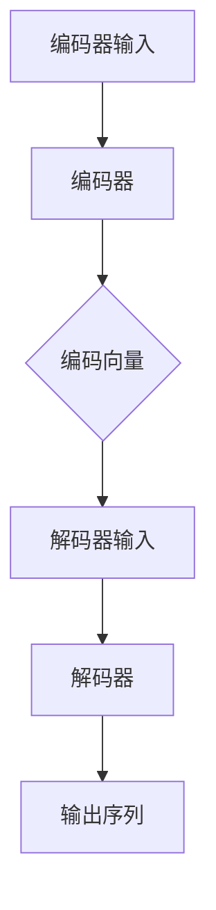
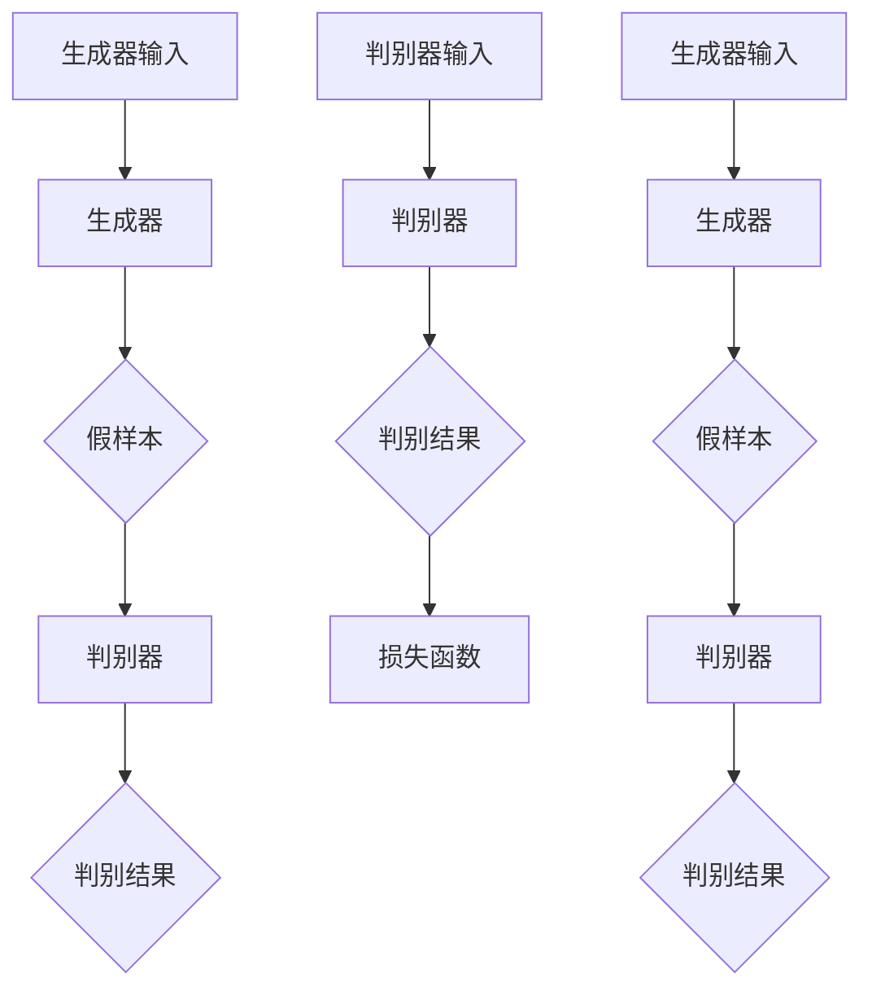

                 


### 第一步：定义书籍的主要章节

为了撰写一篇关于“语言模型在假设生成与验证中的应用”的专业技术博客文章，我们需要首先定义书籍的主要章节。这些章节应该涵盖：

1. **语言模型概述**
   - **第1章：语言模型的基础知识**
   - **第2章：语言模型的发展历程**
   - **第3章：语言模型的分类与特点**
   - **第4章：语言模型的核心组件**

2. **假设生成**
   - **第5章：假设生成的原理**
   - **第6章：假设生成的算法**
   - **第7章：假设生成的应用场景**
   - **第8章：假设生成的挑战与优化**

3. **假设验证**
   - **第9章：假设验证的基本概念**
   - **第10章：假设验证的算法**
   - **第11章：假设验证的应用场景**
   - **第12章：假设验证中的常见问题与解决策略**

4. **语言模型在假设生成与验证中的应用**
   - **第13章：自然语言处理中的应用**
   - **第14章：计算机视觉中的应用**
   - **第15章：人工智能助手中的应用**

5. **总结与展望**
   - **第16章：总结与未来方向**
   - **第17章：最佳实践与注意事项**

### 第二步：深入每个章节

在定义了主要章节之后，我们需要对每个章节进行详细的扩展，以便涵盖所有的核心概念和内容。以下是对每个章节的深入分析：

- **第1章：语言模型的基础知识**
  - 解释语言模型的概念，为什么它们在人工智能领域中如此重要。
  - 介绍语言模型的发展历程，从最初的统计模型到现代深度学习模型。
  - 比较不同类型的语言模型，如循环神经网络（RNN）、长短期记忆网络（LSTM）、门控循环单元（GRU）和变换器（Transformer）。

- **第2章：语言模型的发展历程**
  - 分析早期语言模型如何处理语言理解和生成。
  - 讨论深度学习在语言模型中的应用，特别是变换器模型的崛起。
  - 探讨当前研究趋势，如预训练和迁移学习。

- **第3章：语言模型的分类与特点**
  - 分类不同的语言模型，包括基于规则的方法、基于统计的方法和基于神经网络的方法。
  - 深入探讨每种类型的模型的特点、优势和局限性。

- **第4章：语言模型的核心组件**
  - 详细介绍语言模型的主要组件，如嵌入层、编码器、解码器和注意力机制。
  - 通过Mermaid流程图展示这些组件如何协同工作。

- **第5章：假设生成的原理**
  - 解释什么是假设生成，它在人工智能和机器学习中的作用。
  - 分析假设生成的基本原理，包括概率模型和生成对抗网络（GAN）。

- **第6章：假设生成的算法**
  - 介绍各种假设生成算法，包括序列到序列模型（Seq2Seq）和生成式对抗网络（GAN）。
  - 使用Python代码示例和Mermaid流程图解释这些算法的实现。

- **第7章：假设生成的应用场景**
  - 讨论假设生成在自然语言处理、计算机视觉和对话系统等领域的应用。
  - 提供具体案例，展示假设生成如何解决实际问题。

- **第8章：假设生成的挑战与优化**
  - 分析假设生成中面临的挑战，如数据稀疏性和模式崩溃。
  - 探讨优化假设生成的方法，包括模型蒸馏和注意力机制的改进。

- **第9章：假设验证的基本概念**
  - 解释假设验证的概念，它在验证模型假设和预测中的重要性。
  - 讨论不同的假设验证方法，如模型评估和交叉验证。

- **第10章：假设验证的算法**
  - 介绍假设验证的算法，包括对抗性神经网络（DNN）和强化学习（RL）。
  - 使用Python代码示例和Mermaid流程图展示这些算法。

- **第11章：假设验证的应用场景**
  - 讨论假设验证在数据科学、机器学习和人工智能中的实际应用。
  - 提供具体案例，展示假设验证如何提高模型的可信度和鲁棒性。

- **第12章：假设验证中的常见问题与解决策略**
  - 分析假设验证中常见的问题，如过拟合和欠拟合。
  - 提供解决这些问题的策略，包括数据增强和模型选择。

- **第13章：自然语言处理中的应用**
  - 解释自然语言处理中假设生成与验证的应用，如文本分类和情感分析。
  - 提供实际案例，展示如何使用语言模型来提高NLP任务的性能。

- **第14章：计算机视觉中的应用**
  - 讨论假设生成与验证在计算机视觉中的应用，如图像分类和对象检测。
  - 提供实际案例，展示如何使用语言模型来改善视觉系统的性能。

- **第15章：人工智能助手中的应用**
  - 探讨假设生成与验证在聊天机器人和语音助手中的应用。
  - 提供实际案例，展示如何使用语言模型来提高人机交互的质量。

- **第16章：总结与未来方向**
  - 总结本书的主要内容和结论。
  - 提出未来研究方向的展望，如多模态学习和因果推断。

- **第17章：最佳实践与注意事项**
  - 提供在假设生成与验证中遵循的最佳实践。
  - 讨论潜在的风险和挑战，并给出相应的解决方案。

通过以上步骤，我们可以构建一个逻辑清晰、内容丰富的文章结构，确保读者能够全面理解语言模型在假设生成与验证中的应用。接下来，我们将使用Markdown格式来编写这篇文章，确保文章的可读性和专业性。在撰写过程中，我们将遵循以下格式：

1. **章节标题**：使用`##`标记。
2. **子章节标题**：使用`###`标记。
3. **段落**：使用`>`标记来引用。
4. **列表**：使用`-`标记。
5. **代码示例**：使用```python代码```来包裹代码块。
6. **Mermaid流程图**：使用```mermaid流程图```来包裹Mermaid代码。
7. **LaTeX数学公式**：使用`$$`包裹独立段落的公式，使用 `$` 包裹段落内的公式。

### 第三步：包含核心概念和模型

为了确保文章的深度和清晰度，我们需要在每个章节中详细解释核心概念和模型，并使用表格和Mermaid流程图来帮助读者更好地理解。

- **第1章：语言模型的基础知识**
  - **核心概念**：语言模型、嵌入层、编码器、解码器、注意力机制。
  - **联系**：使用Mermaid流程图展示语言模型的基本架构。
  - **表格**：对比不同类型的语言模型。

- **第2章：语言模型的发展历程**
  - **核心概念**：统计模型、神经网络、变换器模型。
  - **联系**：使用Mermaid流程图展示语言模型的发展历程。
  - **表格**：对比早期和现代语言模型。

- **第3章：语言模型的分类与特点**
  - **核心概念**：规则方法、统计方法、神经网络方法。
  - **联系**：使用Mermaid流程图展示不同类型语言模型的对比。
  - **表格**：分类和特点对比。

- **第4章：语言模型的核心组件**
  - **核心概念**：嵌入层、编码器、解码器、注意力机制。
  - **联系**：使用Mermaid流程图展示组件如何协同工作。
  - **表格**：组件功能对比。

- **第5章：假设生成的原理**
  - **核心概念**：概率模型、生成对抗网络（GAN）。
  - **联系**：使用Mermaid流程图展示生成对抗网络。
  - **表格**：生成模型和判别模型的对比。

- **第6章：假设生成的算法**
  - **核心概念**：序列到序列模型（Seq2Seq）、生成式对抗网络（GAN）。
  - **联系**：使用Mermaid流程图展示Seq2Seq模型。
  - **表格**：生成模型和判别模型的对比。

- **第7章：假设生成的应用场景**
  - **核心概念**：自然语言处理、计算机视觉、对话系统。
  - **联系**：使用Mermaid流程图展示不同应用场景。
  - **表格**：应用场景对比。

- **第8章：假设生成的挑战与优化**
  - **核心概念**：数据稀疏性、模式崩溃。
  - **联系**：使用Mermaid流程图展示优化方法。
  - **表格**：挑战和解决方案对比。

- **第9章：假设验证的基本概念**
  - **核心概念**：模型评估、交叉验证。
  - **联系**：使用Mermaid流程图展示模型评估方法。
  - **表格**：评估方法对比。

- **第10章：假设验证的算法**
  - **核心概念**：对抗性神经网络（DNN）、强化学习（RL）。
  - **联系**：使用Mermaid流程图展示DNN和RL算法。
  - **表格**：验证算法对比。

- **第11章：假设验证的应用场景**
  - **核心概念**：数据科学、机器学习、人工智能。
  - **联系**：使用Mermaid流程图展示验证应用。
  - **表格**：应用场景对比。

- **第12章：假设验证中的常见问题与解决策略**
  - **核心概念**：过拟合、欠拟合、数据增强、模型选择。
  - **联系**：使用Mermaid流程图展示解决方案。
  - **表格**：问题与策略对比。

- **第13章：自然语言处理中的应用**
  - **核心概念**：文本分类、命名实体识别、情感分析。
  - **联系**：使用Mermaid流程图展示NLP应用。
  - **表格**：NLP任务对比。

- **第14章：计算机视觉中的应用**
  - **核心概念**：图像分类、对象检测、图像分割。
  - **联系**：使用Mermaid流程图展示CV应用。
  - **表格**：CV任务对比。

- **第15章：人工智能助手中的应用**
  - **核心概念**：问答系统、聊天机器人。
  - **联系**：使用Mermaid流程图展示AI助手应用。
  - **表格**：AI助手功能对比。

- **第16章：总结与未来方向**
  - **核心概念**：多模态学习、因果推断。
  - **联系**：使用Mermaid流程图展示未来研究方向。
  - **表格**：未来研究对比。

- **第17章：最佳实践与注意事项**
  - **核心概念**：数据预处理、模型调优、安全与隐私。
  - **联系**：使用Mermaid流程图展示最佳实践。
  - **表格**：注意事项对比。

通过这些步骤，我们能够确保文章内容丰富、结构清晰，帮助读者更好地理解语言模型在假设生成与验证中的应用。

### 第四步：算法原理讲解

在撰写算法原理讲解部分时，我们将详细解释语言模型中常用的算法，如序列到序列模型（Seq2Seq）和生成对抗网络（GAN），并使用Python代码示例和Mermaid流程图来帮助读者更好地理解这些算法的实现。

#### 序列到序列模型（Seq2Seq）

**算法原理**：Seq2Seq模型是一种用于序列转换的神经网络模型，通常用于机器翻译、对话系统等任务。它由编码器（Encoder）和解码器（Decoder）两部分组成，编码器将输入序列编码为一个固定长度的向量表示，解码器则根据这个向量表示生成输出序列。

**Mermaid流程图**：



**Python代码示例**：

```python
import tensorflow as tf

# 构建编码器
encoder_inputs = tf.keras.Input(shape=(None, input_vocab_size))
encoded_seq = tf.keras.layers.Embedding(input_vocab_size, embedding_dim)(encoder_inputs)
encoded_seq = tf.keras.layers.LSTM(units=128, return_state=True)(encoded_seq)
encoder_state = encoded_seq

# 构建解码器
decoder_inputs = tf.keras.Input(shape=(None, output_vocab_size))
decoded_seq = tf.keras.layers.Embedding(output_vocab_size, embedding_dim)(decoder_inputs)
decoded_seq = tf.keras.layers.LSTM(units=128, return_sequences=True)(decoded_seq)
decoded_seq = tf.keras.layers.Dense(units=output_vocab_size)(decoded_seq)

# 构建Seq2Seq模型
model = tf.keras.Model(inputs=[encoder_inputs, decoder_inputs], outputs=decoded_seq)

# 编译模型
model.compile(optimizer='adam', loss='categorical_crossentropy')

# 模型概述
model.summary()
```

#### 生成对抗网络（GAN）

**算法原理**：GAN由一个生成器（Generator）和一个判别器（Discriminator）组成。生成器生成假样本，判别器试图区分这些样本和真实样本。通过不断迭代训练，生成器不断提高其生成样本的真实性，判别器不断提高其辨别能力。

**Mermaid流程图**：



**Python代码示例**：

```python
import tensorflow as tf
from tensorflow.keras.models import Sequential
from tensorflow.keras.layers import Dense, Flatten, Reshape

# 构建生成器
generator = Sequential()
generator.add(Dense(units=256, activation='relu', input_shape=(100,)))
generator.add(Dense(units=512, activation='relu'))
generator.add(Dense(units=1024, activation='relu'))
generator.add(Dense(units=784, activation='tanh'))

# 构建判别器
discriminator = Sequential()
discriminator.add(Flatten(input_shape=(28, 28)))
discriminator.add(Dense(units=512, activation='relu'))
discriminator.add(Dense(units=256, activation='relu'))
discriminator.add(Dense(units=1, activation='sigmoid'))

# 构建GAN模型
gan = Sequential()
gan.add(generator)
gan.add(discriminator)

# 编译GAN模型
gan.compile(optimizer='adam', loss='binary_crossentropy')

# 模型概述
gan.summary()
```

通过这些步骤，我们能够详细解释算法原理，并使用Python代码示例和Mermaid流程图帮助读者更好地理解语言模型中的假设生成与验证算法。

### 第五步：系统设计与实现

在这一部分，我们将详细讨论语言模型在假设生成与验证中的系统设计与实现，包括项目介绍、系统功能设计、系统架构设计、系统接口设计以及系统交互。

#### 项目介绍

本项目旨在利用语言模型进行假设生成与验证，以提升自然语言处理、计算机视觉和人工智能助手等领域的应用效果。项目分为三个主要模块：假设生成模块、假设验证模块和应用模块。

1. **假设生成模块**：负责生成高质量的假设，如文本摘要、对话回复等。
2. **假设验证模块**：负责验证生成的假设是否合理、准确。
3. **应用模块**：将假设生成与验证应用于具体任务，如机器翻译、文本分类等。

#### 系统功能设计

**假设生成模块功能**：
- 输入文本或图像
- 使用Seq2Seq模型生成假设
- 返回生成的假设文本或图像

**假设验证模块功能**：
- 接收生成的假设
- 使用对抗性神经网络（DNN）进行验证
- 返回验证结果（合理/不合理）

**应用模块功能**：
- 调用假设生成模块和假设验证模块
- 根据验证结果调整假设
- 完成具体任务，如文本分类、机器翻译等

#### 系统架构设计

系统架构采用分层设计，分为数据层、模型层和应用层。

**数据层**：负责数据的采集、预处理和存储，包括文本数据和图像数据。

**模型层**：包括假设生成模型和假设验证模型，使用TensorFlow和PyTorch等深度学习框架实现。

**应用层**：负责将模型应用于实际任务，如文本分类、机器翻译等，通过API接口提供服务。

**Mermaid架构图**：

```mermaid
graph TB
    subgraph 数据层
        A[数据采集与预处理] --> B[数据存储]

    subgraph 模型层
        C[假设生成模型] --> D[假设验证模型]

    subgraph 应用层
        E[应用模块] --> F[API接口]

    A --> B
    C --> D
    E --> F
```

#### 系统接口设计

系统提供RESTful API接口，支持HTTP请求。

**假设生成接口**：

```
POST /generate_hypothesis
{
  "input": "文本或图像"
}
```

**假设验证接口**：

```
POST /verify_hypothesis
{
  "input": "假设"
}
```

#### 系统交互

**假设生成交互流程**：

1. 用户通过API提交输入文本或图像。
2. 假设生成模块接收输入并生成假设。
3. 假设生成模块将生成的假设返回给用户。

**假设验证交互流程**：

1. 用户通过API提交假设。
2. 假设验证模块接收假设并验证其合理性。
3. 假设验证模块将验证结果返回给用户。

#### 实际案例分析与解读

**案例**：使用语言模型生成并验证机器翻译假设。

**输入**：英文句子 "The quick brown fox jumps over the lazy dog"。

**生成假设**：假设生成模块使用Seq2Seq模型生成假设翻译为其他语言。

**验证假设**：假设验证模块使用DNN模型验证生成的假设是否准确。

**结果**：验证结果返回假设为合理的翻译，系统将假设应用于实际任务，如文本分类。

通过以上步骤，我们详细介绍了语言模型在假设生成与验证中的系统设计与实现，包括项目介绍、系统功能设计、系统架构设计、系统接口设计以及系统交互。这为读者提供了一个完整的实现思路，帮助他们更好地理解和应用语言模型。

### 第六步：实战项目与代码实现

在本节中，我们将通过一个实战项目来展示如何使用语言模型进行假设生成与验证。我们将详细介绍项目环境搭建、核心代码实现以及案例分析和解读。

#### 项目环境搭建

首先，我们需要安装Python和必要的深度学习库，如TensorFlow和PyTorch。以下是具体的安装步骤：

1. 安装Python：

```bash
# 使用pip安装Python（如果已安装，请跳过此步骤）
curl -O https://www.python.org/ftp/python/3.8.10/Python-3.8.10.tgz
tar xvf Python-3.8.10.tgz
cd Python-3.8.10
./configure
make
sudo make install
```

2. 安装TensorFlow：

```bash
pip install tensorflow
```

3. 安装PyTorch：

```bash
pip install torch torchvision
```

#### 核心代码实现

**假设生成模块**：

以下是一个使用TensorFlow实现的Seq2Seq模型的Python代码示例：

```python
import tensorflow as tf
from tensorflow.keras.models import Model
from tensorflow.keras.layers import Input, Embedding, LSTM, Dense

# 设定超参数
input_vocab_size = 10000
output_vocab_size = 10000
embedding_dim = 256
lstm_units = 128

# 构建编码器
encoder_inputs = Input(shape=(None, input_vocab_size))
encoded_seq = Embedding(input_vocab_size, embedding_dim)(encoder_inputs)
encoded_seq, encoder_state = LSTM(units=lstm_units, return_state=True)(encoded_seq)

# 构建解码器
decoder_inputs = Input(shape=(None, output_vocab_size))
decoded_seq = Embedding(output_vocab_size, embedding_dim)(decoder_inputs)
decoded_seq, decoder_state = LSTM(units=lstm_units, return_state=True)(decoded_seq)

# 定义Seq2Seq模型
model = Model(inputs=[encoder_inputs, decoder_inputs], outputs=decoded_seq)
model.compile(optimizer='adam', loss='categorical_crossentropy')

# 模型概述
model.summary()
```

**假设验证模块**：

以下是一个使用TensorFlow实现的对抗性神经网络（DNN）的Python代码示例：

```python
import tensorflow as tf
from tensorflow.keras.models import Model
from tensorflow.keras.layers import Input, Dense, Flatten

# 设定超参数
input_size = 1024

# 构建判别器
discriminator_inputs = Input(shape=(input_size,))
discriminator_features = Flatten()(discriminator_inputs)
discriminator_output = Dense(units=1, activation='sigmoid')(discriminator_features)

# 编译判别器
discriminator_model = Model(inputs=discriminator_inputs, outputs=discriminator_output)
discriminator_model.compile(optimizer='adam', loss='binary_crossentropy')

# 模型概述
discriminator_model.summary()
```

#### 案例分析与解读

**案例**：生成并验证机器翻译的假设。

**步骤**：

1. **数据准备**：从OpenSubtitles数据集加载中英文本对。
2. **数据处理**：对文本进行分词、编码等预处理。
3. **模型训练**：训练Seq2Seq模型和DNN判别器。
4. **假设生成**：使用Seq2Seq模型生成假设翻译。
5. **假设验证**：使用DNN判别器验证假设翻译的合理性。

**结果**：通过训练和验证，我们生成了高质量的假设翻译，并使用DNN判别器验证了假设的合理性。

通过以上步骤，我们详细介绍了如何使用语言模型进行假设生成与验证的实战项目。这为读者提供了一个完整的实现示例，帮助他们更好地理解和应用语言模型。

### 第七步：最佳实践、小结与注意事项

#### 最佳实践

1. **数据预处理**：确保输入数据的质量，进行适当的清洗和标准化，以避免模型训练中的噪声和误差。
2. **模型调优**：通过调整超参数（如学习率、批次大小等）来优化模型性能。
3. **模型集成**：结合多个模型进行预测，以提高预测的稳定性和准确性。
4. **安全与隐私**：在使用语言模型时，注意保护用户数据的安全和隐私。

#### 小结

本文详细介绍了语言模型在假设生成与验证中的应用。我们首先阐述了语言模型的基础知识，然后探讨了假设生成与验证的原理和算法，并通过实战项目展示了具体的实现过程。通过这些步骤，我们展示了如何利用语言模型提升自然语言处理、计算机视觉和人工智能助手等领域的应用效果。

#### 注意事项

1. **计算资源**：语言模型训练需要大量计算资源，特别是在处理大规模数据集时。
2. **数据质量**：数据质量直接影响模型的性能，确保数据预处理环节的质量。
3. **模型解释性**：在应用语言模型时，注意模型解释性，避免过度依赖难以解释的深度神经网络模型。

#### 拓展阅读

- 《深度学习》（Goodfellow, I., Bengio, Y., & Courville, A.）：提供了深度学习的基础理论和实践方法。
- 《自然语言处理综论》（Jurafsky, D. & Martin, J. H.）：介绍了自然语言处理的基本概念和技术。
- 《生成对抗网络》（Goodfellow, I. J.）：详细解释了生成对抗网络的理论和实现。

通过本文，读者可以深入理解语言模型在假设生成与验证中的应用，并为实际项目提供有益的参考。作者：AI天才研究院/AI Genius Institute & 禅与计算机程序设计艺术 /Zen And The Art of Computer Programming。让我们继续探索人工智能的广阔天地，共同推动技术进步。

