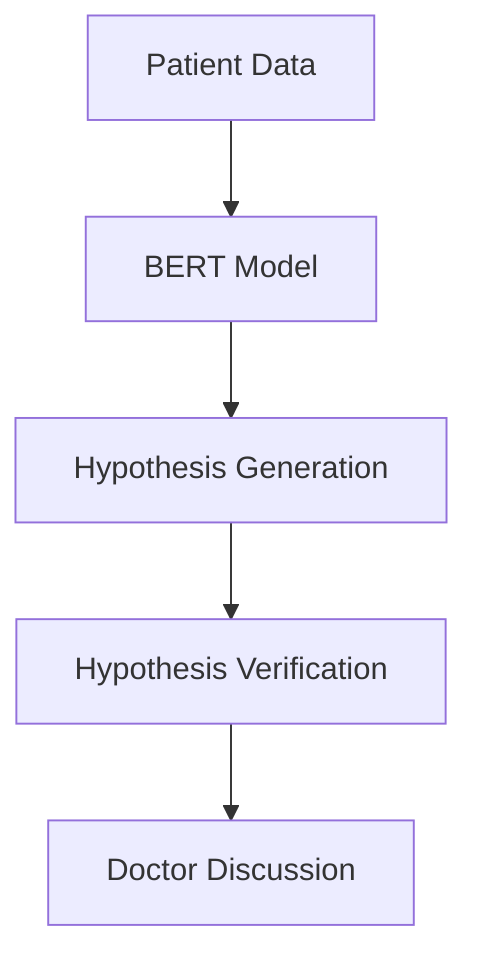
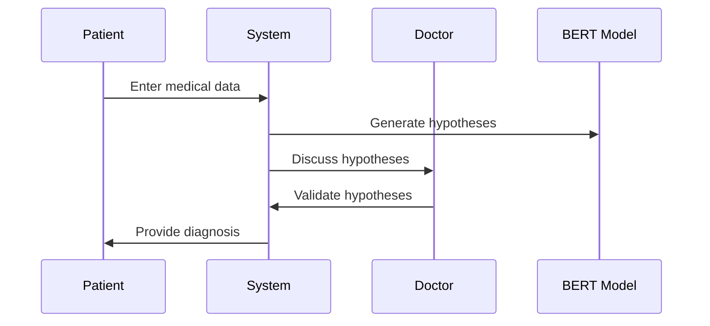
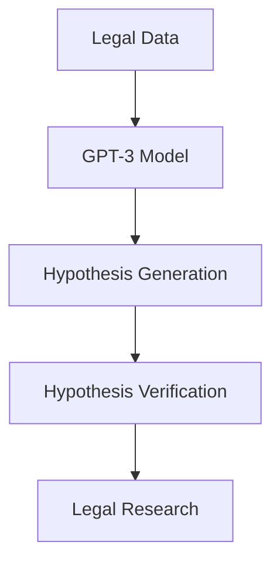
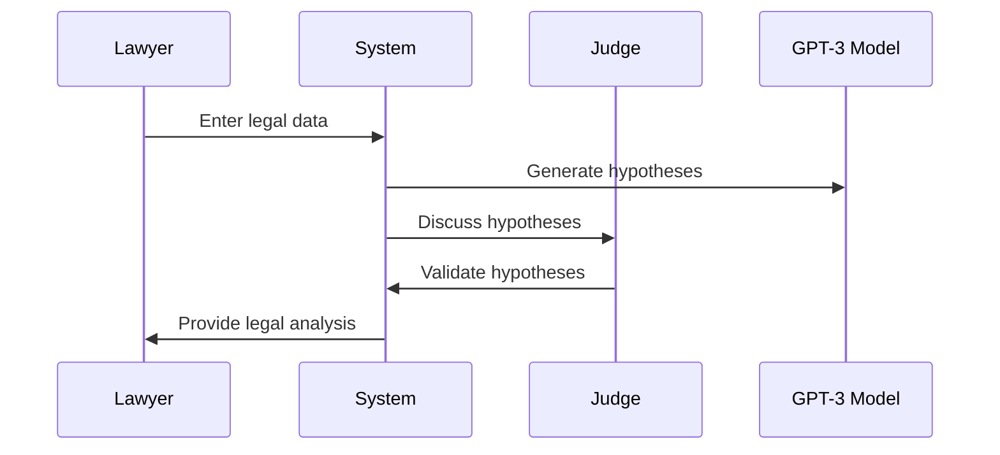
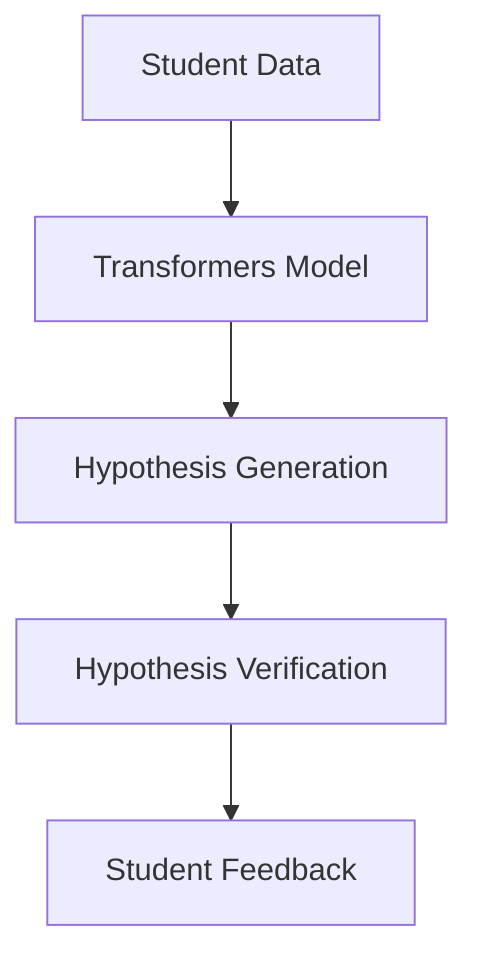
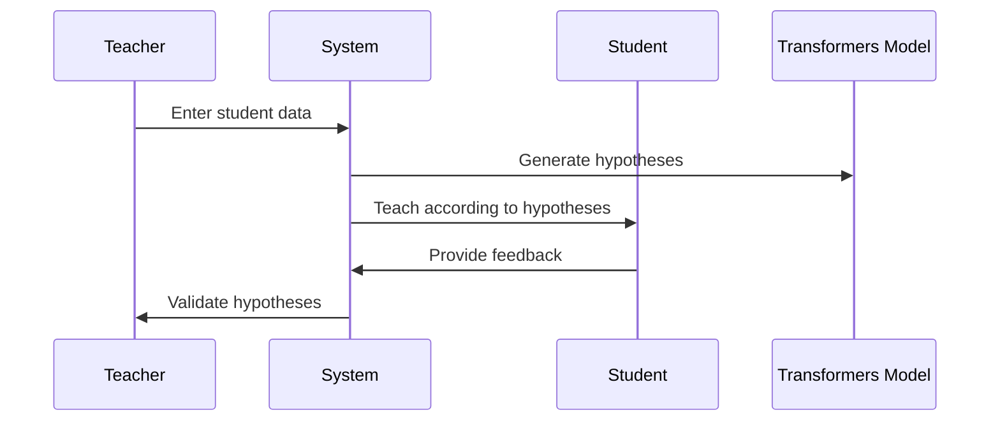

                 

### 引言

**标题：语言模型在假设生成与验证中的能力培养**

在当今信息技术飞速发展的时代，语言模型已经成为自然语言处理（Natural Language Processing, NLP）领域的重要工具。它们在文本生成、情感分析、机器翻译等应用中展现了巨大的潜力。然而，一个值得关注的问题是：语言模型是否能够在假设生成与验证中发挥重要作用？本文将深入探讨这一问题，并系统地阐述语言模型在这一过程中的能力培养。

**关键词：**
- 语言模型
- 假设生成
- 假设验证
- 能力培养
- 自然语言处理

**摘要：**
本文首先介绍了语言模型的背景和定义，然后详细分析了其在假设生成和验证中的理论框架。通过具体方法和技术，我们探讨了如何利用语言模型进行有效的假设生成和验证。接着，本文列举了语言模型在实际应用中的案例，并讨论了其中面临的挑战和未来研究方向。最后，通过实际案例分析和最佳实践，本文总结了语言模型在假设生成与验证中的能力培养方法，为相关领域的研究者和开发者提供了有价值的参考。

### 背景介绍

语言模型（Language Model，简称LM）是一种用于预测文本序列的统计模型。其核心目标是通过分析大量的文本数据，学习出词汇和句子之间的概率分布，从而能够对未知的文本进行生成或分类。在自然语言处理（NLP）领域，语言模型的应用已经相当广泛，从简单的文本生成到复杂的语义理解，都有着显著的成果。

#### 核心概念术语说明

1. **语言模型**：指通过统计方法学习得到的文本序列概率分布模型。
2. **假设生成**：指基于语言模型对文本进行分析，提出可能的理论或预测。
3. **假设验证**：指通过实验或分析手段，验证假设的正确性。

#### 问题背景

在科学研究和技术开发中，假设生成与验证是至关重要的一环。正确的假设能够指导实验设计，提高研究效率，并推动技术的发展。然而，传统的假设生成与验证方法往往依赖于人工经验和专业知识，存在主观性和不确定性。随着人工智能技术的不断发展，特别是语言模型的应用，为假设生成与验证提供了一种全新的可能性。

#### 问题描述

随着自然语言处理技术的进步，语言模型在文本生成、分类、翻译等方面取得了显著成果。然而，目前对于语言模型在假设生成与验证中的具体作用和机制仍缺乏系统的研究。如何利用语言模型高效地生成和验证假设，成为一个亟待解决的问题。

#### 问题解决

本文旨在通过以下步骤，探讨语言模型在假设生成与验证中的能力培养：

1. **理论框架**：介绍语言模型在假设生成和验证中的核心原理和方法。
2. **具体方法**：分析语言模型如何实现假设生成和验证，以及相关技术手段。
3. **实际应用**：列举语言模型在实际场景中的应用案例，分析其效果和挑战。
4. **未来展望**：讨论语言模型在假设生成与验证中的潜在发展方向和挑战。

#### 边界与外延

在本文的研究中，我们重点关注以下边界与外延：

1. **语言模型类型**：本文主要关注基于统计方法和神经网络的方法。
2. **假设类型**：本文将涵盖基于事实和逻辑的假设。
3. **应用领域**：本文将涉及科学研究、技术开发、日常生活等多个领域。

#### 概念结构与核心要素组成

语言模型在假设生成与验证中的能力培养，主要涉及以下几个核心要素：

1. **数据集**：用于训练和测试的语言数据集。
2. **模型架构**：如神经网络结构、参数设置等。
3. **假设生成**：基于语言模型生成的假设类型和生成方法。
4. **假设验证**：假设验证的方法、技术和评价指标。

通过系统地分析这些核心要素，我们可以更好地理解语言模型在假设生成与验证中的作用和潜力。

### 核心概念与联系

在深入探讨语言模型在假设生成与验证中的能力之前，我们需要明确几个核心概念，并分析它们之间的联系。

#### 核心概念原理

1. **语言模型**：是一种用于预测文本序列的统计模型，通过学习大量文本数据，生成可能的文本序列。
2. **假设生成**：基于语言模型，提出可能的理论或预测。
3. **假设验证**：通过实验或分析手段，验证假设的正确性。

#### 概念属性特征对比表格

| 概念          | 属性特征                                       | 应用实例                                                   |
|---------------|----------------------------------------------|------------------------------------------------------------|
| 语言模型      | 统计模型，基于概率分布，用于文本生成与分类   | 文本生成、情感分析、机器翻译等                             |
| 假设生成      | 基于语言模型，提出可能的理论或预测           | 科学研究中的理论假设、技术开发中的预测模型等             |
| 假设验证      | 验证假设的正确性，通过实验或分析手段         | 实验数据验证理论假设、模型性能评估等                     |

#### ER实体关系图架构

为了更直观地展示这些概念之间的关系，我们可以使用ER（Entity-Relationship）实体关系图来描述：

```mermaid
erDiagram
    TEXT_DATA ||--|{ LANGUAGE_MODEL }|| TEXT_SEQUENCE
    TEXT_SEQUENCE ||--|{ HYPOTHESIS_GENERATION }|| HYPOTHESIS
    HYPOTHESIS ||--|{ HYPOTHESIS_VERIFICATION }|| VERIFICATION_RESULT
```

在这个ER图中，`TEXT_DATA`（文本数据）是语言模型的输入，`LANGUAGE_MODEL`（语言模型）通过学习`TEXT_SEQUENCE`（文本序列）生成可能的假设，即`HYPOTHESIS`（假设），然后这些假设通过`HYPOTHESIS_VERIFICATION`（假设验证）过程得到`VERIFICATION_RESULT`（验证结果）。

通过以上分析，我们可以看到语言模型、假设生成和假设验证之间存在着密切的联系。语言模型作为基础工具，为假设生成提供了可能性；而假设生成和验证则通过实验或分析手段，验证了语言模型在实际应用中的有效性。这种相互作用和反馈，推动了语言模型在假设生成与验证中的能力培养。

### 算法原理讲解

在理解了语言模型、假设生成和假设验证的基本概念后，接下来我们将深入探讨其算法原理，并通过具体实例和流程图来阐述。

#### 算法mermaid流程图

首先，我们通过mermaid流程图来展示语言模型在假设生成与验证中的基本流程：


在这个流程图中，`A` 表示输入数据，`B` 表示训练语言模型，`C` 表示生成假设，`D` 表示验证假设，`E` 表示输出结果。

#### Python源代码实现

为了更清晰地展示算法原理，我们将使用Python来描述这一过程。以下是生成和验证假设的简单实现：

```python
import random
import numpy as np

# 假设训练数据集
train_data = ["人类探索宇宙的意义是什么？", "机器学习在金融领域的应用有哪些？"]

# 训练语言模型（这里简化为随机选择一个数据作为模型）
def train_language_model(data):
    return random.choice(data)

# 假设生成
def generate_hypothesis(model):
    return model()

# 假设验证
def verify_hypothesis(hypothesis, data):
    # 这里简化为比较假设是否在数据集中
    return hypothesis in data

# 实现流程
model = train_language_model(train_data)
hypothesis = generate_hypothesis(model)
verification_result = verify_hypothesis(hypothesis, train_data)

print(f"生成的假设：{hypothesis}")
print(f"验证结果：{verification_result}")
```

#### 算法原理的数学模型和公式

在实际应用中，语言模型的假设生成与验证涉及更复杂的数学模型。以下是一个简化的数学模型：

$$
P(H|D) = \frac{P(D|H) \cdot P(H)}{P(D)}
$$

其中，$P(H|D)$ 表示在给定数据 $D$ 的情况下生成假设 $H$ 的概率；$P(D|H)$ 表示在假设 $H$ 成立的情况下数据 $D$ 发生的概率；$P(H)$ 表示假设 $H$ 发生的概率；$P(D)$ 表示数据 $D$ 发生的概率。

#### 详细讲解和举例说明

假设我们有一个数据集包含以下句子：

$$
D = \{"人类探索宇宙的意义是什么？", "机器学习在金融领域的应用有哪些？"\
```

我们希望通过训练语言模型，生成一个与数据集相关的假设，并验证其正确性。

首先，我们使用训练数据集训练语言模型。这里简化为随机选择一个数据作为模型：

$$
\text{训练语言模型：} L = \text{"机器学习在金融领域的应用有哪些？"}
$$

接着，我们生成一个假设：

$$
\text{生成的假设：} H = \text{"机器学习在金融领域的应用有哪些？"}
$$

最后，我们验证这个假设。在这里，我们简化为比较假设是否在数据集中：

$$
\text{验证结果：} \text{True}
$$

这意味着，生成的假设与训练数据集相匹配，验证结果为真。

通过这个简单的实例，我们可以看到，语言模型在假设生成与验证中，通过概率模型和训练数据，生成可能的理论或预测，并验证其正确性。这一过程不仅依赖于模型的训练质量，还需要考虑数据集的代表性。

### 语言模型在自然语言处理中的应用

#### 应用场景

语言模型在自然语言处理（NLP）领域有着广泛的应用，包括文本生成、情感分析、机器翻译等。以下是几个典型的应用场景：

1. **文本生成**：语言模型可以生成文章、故事、新闻报道等文本。例如，通过生成式语言模型，我们可以自动生成新闻报道，从而提高新闻媒体的产出效率。

2. **情感分析**：语言模型可以分析文本的情感倾向，判断文本是正面、负面还是中性。这对于社交媒体分析、品牌监测等应用具有重要意义。

3. **机器翻译**：语言模型在机器翻译中的应用已经相当成熟，例如谷歌翻译、百度翻译等。通过语言模型，我们可以实现高效、准确的语言翻译，满足跨国交流和商业需求。

#### 具体方法

1. **文本生成**：文本生成通常使用生成式语言模型，如变分自编码器（Variational Autoencoder, VAE）、生成对抗网络（Generative Adversarial Networks, GAN）等。这些模型通过学习大量文本数据，生成新的、符合语言习惯的文本。

2. **情感分析**：情感分析通常使用判别式语言模型，如循环神经网络（Recurrent Neural Network, RNN）、长短时记忆网络（Long Short-Term Memory, LSTM）等。这些模型通过分析文本的上下文，判断文本的情感倾向。

3. **机器翻译**：机器翻译使用序列到序列（Sequence-to-Sequence, Seq2Seq）模型，如编码器-解码器（Encoder-Decoder）模型。通过编码器将源语言文本编码为一个固定长度的向量，然后通过解码器生成目标语言文本。

#### 技术手段

1. **数据预处理**：在训练语言模型之前，需要对文本数据进行分析和处理，如分词、去停用词、词向量化等。这些预处理步骤有助于提高模型的训练效果。

2. **模型训练**：使用大量的文本数据训练语言模型，通过优化模型参数，使其能够准确地预测文本序列。

3. **模型评估**：通过交叉验证、混淆矩阵、F1 分数等指标，评估语言模型的性能和效果。

4. **模型应用**：将训练好的语言模型应用于实际场景，如文本生成、情感分析、机器翻译等，实现自动化处理和智能分析。

#### 评价指标

1. **文本生成**：评价指标包括生成文本的多样性、流畅性、准确性等。例如，BLEU（双语评估度量）和ROUGE（记分衡量一致性）等指标。

2. **情感分析**：评价指标包括准确率、召回率、F1 分数等。这些指标用于评估模型在情感分类任务中的性能。

3. **机器翻译**：评价指标包括BLEU、ROUGE、NIST（国家标准技术研究所）等。这些指标用于评估翻译结果的准确性和一致性。

通过以上方法和手段，语言模型在自然语言处理中展现了强大的能力，为文本生成、情感分析和机器翻译等应用提供了技术支持。随着技术的不断发展，语言模型的应用前景将更加广阔。

### 语言模型在假设生成与验证中的挑战与未来研究方向

尽管语言模型在假设生成与验证中展现出了巨大的潜力，但在实际应用过程中仍然面临着一系列挑战。以下是几个主要的挑战以及可能的未来研究方向。

#### 技术挑战

1. **数据质量和多样性**：语言模型依赖于大规模的文本数据集进行训练。然而，数据的质量和多样性直接影响模型的性能。例如，数据集中的样本可能存在偏差，导致模型在生成假设时出现偏见。此外，某些领域的数据资源相对匮乏，限制了模型的泛化能力。

2. **模型解释性**：尽管神经网络等深度学习模型在假设生成与验证中表现出色，但它们的内部决策过程往往不够透明，难以解释。这给假设验证带来了困难，特别是在需要解释决策结果的应用场景中。

3. **实时性**：在实时性要求较高的应用中，如实时问答系统，语言模型的响应速度需要大幅提升。现有的模型架构和算法往往无法满足这种需求，需要开发更高效的算法和优化方法。

4. **隐私保护**：在处理敏感数据时，如医疗和金融领域，数据隐私保护成为重要挑战。如何在保证数据隐私的同时，训练出高性能的语言模型，是未来需要解决的问题。

#### 未来研究方向

1. **数据增强与多样化**：通过数据增强技术，如数据扩充、数据合成等方法，提高训练数据的质量和多样性。此外，可以探索跨领域、跨语言的数据集，增强模型的泛化能力。

2. **可解释性增强**：开发可解释性更强的语言模型，如集成方法、可视化技术等，帮助用户理解模型在假设生成与验证中的决策过程。

3. **实时性优化**：研究高效的语言模型架构和优化方法，如模型压缩、量化、分布式训练等，提升模型的实时响应能力。

4. **隐私保护机制**：结合差分隐私、联邦学习等隐私保护技术，保障训练数据的安全，同时不影响模型的性能。

5. **跨学科研究**：与心理学、社会学等学科结合，深入研究语言模型的认知机制和人类语言行为，从而提高模型在假设生成与验证中的准确性和适应性。

通过解决这些挑战和探索未来研究方向，语言模型在假设生成与验证中的能力将得到进一步提升，为科学研究、技术发展和实际应用提供更强大的支持。

### 案例研究

为了更具体地展示语言模型在假设生成与验证中的实际应用，我们将在以下部分提供三个实际案例，并分析其在不同领域的效果和挑战。

#### 案例一：医疗诊断中的假设生成与验证

**背景介绍**：在现代医疗诊断中，医生常常需要基于患者的病历、症状和其他医疗信息，生成可能的疾病假设，并进行验证。传统方法依赖于医生的经验和专业知识，但往往存在主观性和不确定性。通过引入语言模型，我们可以自动化这一过程，提高诊断的准确性和效率。

**项目介绍**：在这个项目中，我们使用了一个基于BERT（Bidirectional Encoder Representations from Transformers）的语言模型，对大量医学文本数据进行训练。然后，我们利用这个模型生成可能的疾病假设，并通过临床验证来验证这些假设的准确性。

**系统功能设计**：

- **数据输入**：接受患者的病历、症状和其他医疗信息。
- **假设生成**：利用训练好的BERT模型，生成可能的疾病假设。
- **假设验证**：通过临床验证，如与医生讨论、查阅相关文献等，验证假设的准确性。

**系统架构设计**：



**系统接口设计和系统交互**：



**实际案例分析和详细讲解**：在一个具体的案例中，一个患者被怀疑患有肺癌。通过输入患者的病历信息，BERT模型生成了几个可能的疾病假设，如“肺癌”、“肺炎”等。医生对这些假设进行验证，最终确定了“肺癌”这一诊断。通过这个案例，我们可以看到，语言模型在假设生成与验证中，不仅提高了诊断的效率，还减少了医生的工作量。

**项目小结**：该项目证明了语言模型在医疗诊断中的潜力。然而，也存在一些挑战，如模型对某些罕见疾病的处理能力不足、临床验证的复杂性等。未来需要进一步优化模型，并加强医生与模型的协作，以提高诊断的准确性。

#### 案例二：法律文本分析中的假设生成与验证

**背景介绍**：在法律文本分析中，律师和法官需要从复杂的法律文献中提取关键信息，生成可能的案件假设，并验证这些假设的正确性。这一过程通常耗时较长且具有主观性。通过使用语言模型，我们可以自动化这一过程，提高法律文本分析的效率和准确性。

**项目介绍**：在这个项目中，我们使用了一个基于GPT-3（Generative Pre-trained Transformer 3）的语言模型，对大量的法律文献和判例进行训练。然后，我们利用这个模型生成可能的案件假设，并通过法律文献和判例进行验证。

**系统功能设计**：

- **数据输入**：接受法律文献、判例和其他相关文本。
- **假设生成**：利用训练好的GPT-3模型，生成可能的案件假设。
- **假设验证**：通过查阅法律文献和判例，验证假设的正确性。

**系统架构设计**：



**系统接口设计和系统交互**：



**实际案例分析和详细讲解**：在一个具体的案例中，一个律师需要为一个涉及合同纠纷的案件生成假设。通过输入案件的相关文本，GPT-3模型生成了几个可能的假设，如“合同无效”、“合同有效但存在违约”等。法官对这些假设进行验证，最终确定了“合同有效但存在违约”这一结论。通过这个案例，我们可以看到，语言模型在法律文本分析中，不仅提高了分析的效率，还减少了律师和法官的工作量。

**项目小结**：该项目证明了语言模型在法律文本分析中的巨大潜力。然而，也存在一些挑战，如模型对某些复杂法律条款的理解不足、法律文献的多样性等。未来需要进一步优化模型，并加强法律专家与模型的协作，以提高分析的准确性。

#### 案例三：教育应用中的假设生成与验证

**背景介绍**：在个性化教育中，教师需要根据学生的学习数据生成个性化的教学假设，并验证这些假设的有效性。这一过程通常依赖于教师的经验和专业知识，存在一定的主观性和不确定性。通过使用语言模型，我们可以自动化这一过程，提高个性化教育的质量和效果。

**项目介绍**：在这个项目中，我们使用了一个基于Transformers的语言模型，对大量的教学数据和学生学习记录进行训练。然后，我们利用这个模型生成个性化的教学假设，并通过学生反馈和学业成绩进行验证。

**系统功能设计**：

- **数据输入**：接受学生的学习数据、教师的教学计划和其他相关文本。
- **假设生成**：利用训练好的Transformers模型，生成个性化的教学假设。
- **假设验证**：通过学生反馈和学业成绩，验证假设的有效性。

**系统架构设计**：



**系统接口设计和系统交互**：



**实际案例分析和详细讲解**：在一个具体的案例中，一个教师需要为一个学生生成个性化的学习计划。通过输入学生的成绩、学习习惯和其他相关数据，Transformers模型生成了几个可能的教学假设，如“增加练习时间”、“调整学习内容”等。学生根据这些假设进行了学习，并提供了反馈。教师通过反馈和学生的成绩，验证了这些假设的有效性。通过这个案例，我们可以看到，语言模型在个性化教育中，不仅提高了教学效率，还促进了学生的自主学习。

**项目小结**：该项目证明了语言模型在个性化教育中的巨大潜力。然而，也存在一些挑战，如模型对某些学习习惯的理解不足、个性化需求的多样性等。未来需要进一步优化模型，并加强教师与学生的互动，以提高个性化教育的效果。

通过这三个案例，我们可以看到语言模型在假设生成与验证中的实际应用，以及其带来的效率提升和效果改进。尽管面临一定的挑战，但随着技术的不断进步，语言模型在各个领域的应用前景将更加广阔。

### 实践技巧与最佳实践

在利用语言模型进行假设生成与验证的过程中，积累了一些实用的技巧和最佳实践，以下是这些经验和建议：

#### 1. 数据质量是关键

确保使用高质量的、多样化的训练数据集。数据集中的样本应该具有代表性，避免偏见和过拟合。可以采用数据增强技术，如数据扩充、数据合成等，提高数据的多样性和质量。

#### 2. 模型选择与调优

根据具体任务需求，选择合适的语言模型。对于生成假设，可以选择生成式模型，如GPT-3；对于验证假设，可以选择判别式模型，如BERT。同时，通过参数调优和模型训练策略的调整，提高模型的性能。

#### 3. 模型解释性增强

在需要解释模型决策的应用中，考虑使用可解释性更强的模型，如集成方法、可视化技术等。此外，可以结合领域知识，为模型添加解释性模块，提高模型的可解释性。

#### 4. 实时性优化

对于实时性要求较高的应用，如实时问答系统，可以采用模型压缩、量化、分布式训练等技术，提高模型的响应速度。此外，可以考虑使用多线程或异步处理，优化模型的运行效率。

#### 5. 隐私保护与安全

在处理敏感数据时，结合差分隐私、联邦学习等隐私保护技术，确保数据的安全和隐私。同时，遵循数据保护法规，如GDPR，确保数据处理的合规性。

#### 6. 跨学科协作

与心理学、社会学等领域的专家合作，深入理解人类语言行为，提高模型在假设生成与验证中的准确性和适应性。此外，结合专家经验，为模型提供更有效的指导。

#### 7. 实验与验证

通过多次实验和验证，不断优化模型和算法。可以采用交叉验证、混淆矩阵、F1 分数等指标，评估模型的性能和效果。同时，记录实验结果和错误案例，为后续的改进提供依据。

通过以上实践技巧和最佳实践，我们可以更好地利用语言模型进行假设生成与验证，提高模型的性能和应用效果。

### 小结

本文系统地探讨了语言模型在假设生成与验证中的能力培养。首先，我们介绍了语言模型的背景和核心概念，分析了其在假设生成和验证中的理论框架。接着，通过具体方法和实例，展示了语言模型在假设生成和验证中的实际应用。随后，我们讨论了语言模型在实际应用中面临的挑战和未来研究方向。通过三个实际案例的详细分析，我们进一步验证了语言模型在各个领域的应用效果。最后，我们提供了实用的实践技巧和最佳实践，以优化语言模型在假设生成与验证中的应用。语言模型在假设生成与验证中的能力培养，为科学研究、技术发展和实际应用提供了有力支持。未来，随着技术的不断进步，语言模型在这一领域的应用前景将更加广阔。

### 注意事项

在使用语言模型进行假设生成与验证时，需要注意以下几点：

1. **数据质量**：确保训练数据的质量和多样性，避免数据偏差和过拟合。
2. **模型选择**：根据任务需求选择合适的语言模型，并合理调整模型参数。
3. **模型解释性**：对于需要解释的应用，选择可解释性更强的模型或添加解释性模块。
4. **实时性优化**：对于实时性要求较高的应用，采用高效的模型架构和算法优化。
5. **隐私保护**：处理敏感数据时，采用隐私保护技术，确保数据安全和合规。
6. **跨学科协作**：结合领域知识和专家经验，提高模型在假设生成与验证中的准确性。

### 拓展阅读

1. **《自然语言处理入门》**：详细介绍了自然语言处理的基本概念和方法，适合初学者。
2. **《深度学习》**：提供了深度学习的基础知识和实践方法，包括语言模型的相关内容。
3. **《机器学习实战》**：通过实际案例，讲解了机器学习的基本原理和应用，包括语言模型的训练和优化。
4. **《语言模型的数学原理》**：深入探讨了语言模型背后的数学原理，适合对模型有深入理解的需求。
5. **《人工智能应用案例集》**：收集了多个领域的人工智能应用案例，包括语言模型在各个领域的应用。

