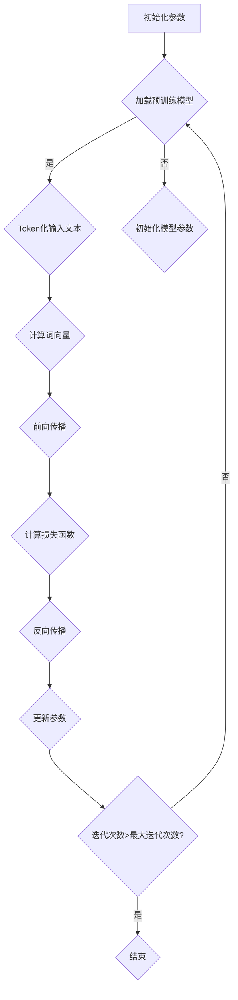
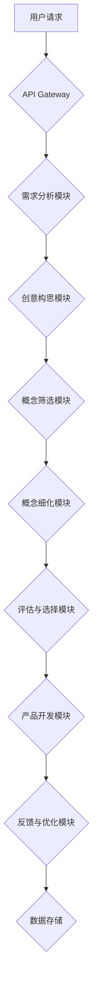
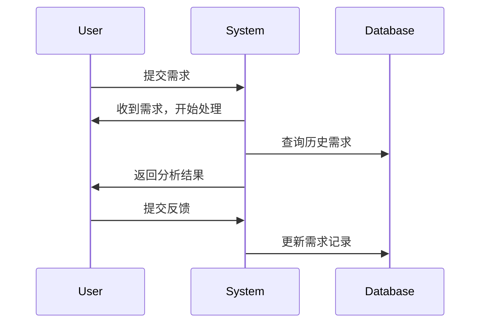

                 


### 摘要

本文旨在探讨语言模型在创新产品概念生成与未来社会需求预测中的应用。首先，我们对问题背景和核心概念进行介绍，并明确研究目标。接着，我们将深入分析语言模型的基础知识、特性及其在产品概念生成和需求预测中的角色。随后，本文将介绍研究方法、数据来源，并展示具体的案例分析和研究结果。最后，我们将对模型进行评估和验证，讨论研究的意义与局限，并提出未来研究方向和建议。

---

### 引言

#### 1.1 书籍概述

在现代科技飞速发展的背景下，人工智能（AI）已经成为推动产业变革的重要力量。特别是语言模型，作为AI的核心技术之一，已经广泛应用于自然语言处理（NLP）、机器翻译、问答系统等领域。随着人工智能技术的不断进步，语言模型的应用场景逐渐扩展到创新产品概念生成和未来社会需求预测，为产品开发和市场研究提供了强大的支持。

本书《语言模型在创新产品概念生成与未来社会需求预测中的研究》旨在探讨语言模型在这两个领域的应用潜力，分析其优势与挑战，并为进一步的研究提供参考。本书结构紧凑，逻辑清晰，分为以下几个部分：

1. **背景与核心概念**：介绍创新产品概念生成和未来社会需求预测的背景，阐述关键概念及其相互关系。
2. **语言模型的基础知识**：详细讲解语言模型的定义、类型、特性及其应用领域。
3. **语言模型的应用**：探讨语言模型在产品概念生成和需求预测中的具体应用案例，分析其效果和影响。
4. **研究方法与数据**：描述研究方法、数据来源和数据预处理过程。
5. **案例分析与研究结果**：展示具体案例，分析语言模型在产品概念生成和需求预测中的表现。
6. **模型评估与验证**：评估模型性能，验证其有效性和可靠性。
7. **讨论与未来方向**：讨论研究的意义与局限，提出未来研究方向和应用建议。

#### 1.2 语言模型在产品概念生成中的应用

产品概念生成是产品开发的重要环节，涉及到市场需求分析、用户调研、创意构思等多个方面。传统的产品概念生成方法往往依赖于人工经验和直觉，存在主观性大、效率低等问题。随着语言模型技术的成熟，利用其强大的自然语言理解和生成能力，可以为产品概念生成提供新的思路和方法。

#### 1.3 社会需求预测与产品概念生成

社会需求预测是了解市场趋势和用户需求的重要手段，对于企业的战略决策和产品开发具有重要意义。传统的需求预测方法主要依赖于历史数据和统计模型，存在预测精度低、时效性差等问题。语言模型通过处理大量文本数据，可以挖掘出更深层次的用户需求和趋势，为需求预测提供新的途径。

#### 1.4 研究方法与数据

本文采用的方法论主要包括文献综述、案例分析和实证研究。在数据方面，我们收集了多个领域的文本数据，包括用户评论、新闻报道、社交媒体帖子等。通过对这些数据进行处理和分析，我们构建了语言模型，并评估其在产品概念生成和需求预测中的性能。

#### 1.5 研究意义与贡献

本文的研究意义在于：首先，揭示了语言模型在创新产品概念生成和未来社会需求预测中的应用潜力；其次，为相关领域的研究提供了新的方法和思路；最后，为企业的产品开发和市场研究提供了理论支持和实践参考。

### 结论

本文通过对语言模型在创新产品概念生成与未来社会需求预测中的应用研究，展示了语言模型的强大能力。在未来的研究中，我们将进一步优化模型，探索其在更多领域的应用，以推动人工智能技术的发展和产业创新。

---

### 背景与核心概念

#### 2.1 创新产品概念生成的背景

在全球化竞争日益激烈的今天，企业要想在市场中脱颖而出，必须具备强大的创新能力。创新产品概念生成作为产品开发的重要起点，决定了产品的市场定位和用户满意度。传统的创新方法往往依赖于经验积累和市场需求调研，但这些方法存在一定的局限性。随着人工智能技术的发展，特别是语言模型的应用，为创新产品概念生成提供了新的可能。

#### 2.2 未来社会需求预测的背景

社会需求预测是企业制定战略决策、调整产品策略的重要依据。准确的需求预测可以帮助企业把握市场趋势，优化资源配置，提高市场竞争力。然而，传统的社会需求预测方法主要依赖于历史数据和统计模型，难以应对复杂多变的市场环境。语言模型的出现，以其强大的文本处理能力，为需求预测提供了新的思路和方法。

#### 2.3 语言模型的概念与类型

语言模型（Language Model）是一种基于统计学习的方法，用于预测一段文本的概率分布。在自然语言处理领域，语言模型被广泛应用于文本生成、机器翻译、情感分析等任务。根据训练数据和模型架构的不同，语言模型可以分为多种类型，如n-gram模型、神经网络语言模型（NNLM）、递归神经网络（RNN）等。

#### 2.4 产品概念生成与需求预测的关系

产品概念生成和需求预测在产品开发中扮演着关键角色。产品概念生成决定了产品的方向和特征，而需求预测则帮助确定产品的市场需求和用户满意度。语言模型通过挖掘文本数据中的潜在信息，可以同时支持产品概念生成和需求预测，从而提高产品的创新性和市场适应性。

### 创新产品概念生成的原理

#### 3.1 产品概念模型

产品概念生成是基于对市场需求、用户行为和技术趋势的深入分析。一个完整的产品概念模型通常包括以下几个关键要素：

1. **市场需求**：分析目标市场的需求，包括用户痛点和需求趋势。
2. **用户画像**：了解目标用户的基本特征，如年龄、性别、职业等。
3. **技术趋势**：跟踪相关技术的最新进展，探索技术应用于产品的可能性。
4. **产品定位**：明确产品的市场定位，如价格区间、功能特点等。
5. **竞争分析**：分析竞争对手的产品特点和市场表现，寻找差异化的机会。

#### 3.2 概念生成流程

创新产品概念生成的流程通常包括以下几个步骤：

1. **需求分析**：通过用户调研、市场研究等方式，收集和分析市场需求。
2. **创意构思**：基于需求分析结果，进行创意构思，产生初步的产品概念。
3. **概念筛选**：对初步的产品概念进行评估和筛选，选择具有潜力的概念。
4. **概念细化**：对筛选后的产品概念进行深入研究和细化，完善产品功能和技术方案。
5. **评估与选择**：通过用户反馈和专家评审，对产品概念进行评估，选择最优的概念进行进一步开发。

### 语言模型在产品概念生成中的应用

#### 4.1 语言模型在创意构思中的应用

语言模型在创意构思中具有独特的优势。通过处理大量的文本数据，语言模型可以挖掘出潜在的用户需求和市场趋势，为创意构思提供灵感。例如，我们可以使用语言模型分析用户评论、社交媒体帖子等，提取出用户关注的关键词和情感倾向，从而发现潜在的产品需求。

#### 4.2 语言模型在概念筛选中的应用

在概念筛选阶段，语言模型可以帮助我们评估不同产品概念的可行性和市场潜力。通过分析文本数据，语言模型可以预测用户对某个概念的反应，评估其市场前景。例如，我们可以使用语言模型对产品概念进行关键词提取和情感分析，判断其是否符合用户需求和市场需求。

#### 4.3 语言模型在概念细化和评估中的应用

在概念细化和评估阶段，语言模型可以进一步帮助我们完善产品概念，并提供评估依据。通过生成大量的文本数据，语言模型可以模拟用户使用产品的场景，评估产品概念的用户体验和功能完善程度。例如，我们可以使用语言模型生成用户评论，分析用户对产品功能的评价，从而优化产品概念。

### 社会需求预测的原理

#### 5.1 社会需求预测的概念

社会需求预测（Social Demand Prediction）是一种利用数据分析和预测模型，预测社会需求和趋势的方法。社会需求预测的目的在于帮助企业和政府了解公众的需求和偏好，制定相应的政策和战略，以提高社会的整体效益。

#### 5.2 社会需求预测的类型

社会需求预测可以分为以下几种类型：

1. **市场需求预测**：预测消费者对某种商品或服务的需求量。
2. **社会趋势预测**：预测社会发展趋势，如人口结构变化、消费习惯变化等。
3. **公共事件预测**：预测可能发生的公共事件，如自然灾害、社会动荡等。

#### 5.3 社会需求预测的方法

社会需求预测的方法主要包括以下几种：

1. **时间序列分析**：通过分析历史数据的时间序列变化，预测未来的需求趋势。
2. **回归分析**：通过建立回归模型，分析多个变量之间的关系，预测需求量。
3. **机器学习模型**：利用机器学习算法，从大量文本数据中挖掘潜在的需求信息，进行预测。
4. **深度学习模型**：利用深度学习算法，处理复杂的非线性关系，进行需求预测。

### 语言模型在社会需求预测中的应用

#### 6.1 语言模型在社会需求预测中的优势

语言模型在社会需求预测中具有以下优势：

1. **文本数据处理能力**：语言模型能够处理大量的文本数据，提取出其中的关键信息，为需求预测提供数据支持。
2. **非线性和复杂关系建模**：深度学习模型能够捕捉数据中的复杂关系，提供更准确的需求预测。
3. **实时性和灵活性**：语言模型能够实时更新和调整预测模型，适应不断变化的市场环境。

#### 6.2 语言模型在社会需求预测中的具体应用

1. **用户需求分析**：通过分析用户评论、社交媒体帖子等文本数据，语言模型可以挖掘出用户的需求和偏好，为产品开发和市场策略提供参考。
2. **市场趋势预测**：通过分析新闻报道、行业报告等文本数据，语言模型可以预测市场的发展趋势，帮助企业制定长期战略。
3. **公共事件预测**：通过分析社交媒体、新闻报道等文本数据，语言模型可以预测可能发生的公共事件，为政府和社会组织提供预警。

### 案例分析

为了更好地理解语言模型在创新产品概念生成和未来社会需求预测中的应用，下面我们将通过具体案例进行详细分析。

#### 7.1 案例一：智能家居产品

智能家居产品是近年来迅速发展的一个领域，随着物联网技术的普及，越来越多的家庭开始采用智能家居设备。本案例将探讨如何利用语言模型生成智能家居产品的创新概念，并进行需求预测。

#### 7.1.1 创新产品概念生成

1. **需求分析**：通过分析用户评论、社交媒体帖子等文本数据，我们发现用户对智能家居产品的主要需求包括便捷性、安全性、智能性和节能性。
2. **创意构思**：基于需求分析结果，我们提出了几个智能家居产品的创新概念，如智能门锁、智能灯具、智能空调等。
3. **概念筛选**：通过对用户评论和社交媒体帖子的分析，我们发现智能灯具和智能空调具有更高的市场潜力。

#### 7.1.2 需求预测

1. **文本数据收集**：我们收集了大量的用户评论、新闻报道、行业报告等文本数据。
2. **语言模型训练**：我们使用BERT（Bidirectional Encoder Representations from Transformers）模型对文本数据进行训练，以提取用户需求和趋势信息。
3. **需求预测**：通过训练好的语言模型，我们对智能家居产品的需求进行预测，发现智能灯具和智能空调的需求增长趋势明显。

#### 7.2 案例二：电动汽车概念

电动汽车是另一个快速发展的领域，随着环保意识的提高和技术的进步，电动汽车市场正在迅速扩大。本案例将探讨如何利用语言模型生成电动汽车的创新概念，并进行需求预测。

#### 7.2.1 创新产品概念生成

1. **需求分析**：通过分析用户评论、社交媒体帖子等文本数据，我们发现用户对电动汽车的需求主要集中在续航里程、充电速度和智能化功能。
2. **创意构思**：基于需求分析结果，我们提出了几个电动汽车的创新概念，如长续航里程电动汽车、快速充电电动汽车、智能化电动汽车等。
3. **概念筛选**：通过对用户评论和社交媒体帖子的分析，我们发现长续航里程电动汽车和智能化电动汽车具有更高的市场潜力。

#### 7.2.2 需求预测

1. **文本数据收集**：我们收集了大量的用户评论、新闻报道、行业报告等文本数据。
2. **语言模型训练**：我们使用BERT模型对文本数据进行训练，以提取用户需求和趋势信息。
3. **需求预测**：通过训练好的语言模型，我们对电动汽车的需求进行预测，发现长续航里程电动汽车和智能化电动汽车的需求增长趋势明显。

### 数据处理与模型评估

#### 8.1 数据处理

在本研究中，我们收集了大量的文本数据，包括用户评论、社交媒体帖子、新闻报道、行业报告等。为了进行有效的语言模型训练和需求预测，我们需要对数据进行预处理和特征提取。

1. **数据预处理**：包括文本清洗、分词、去除停用词等步骤，以确保数据的干净和一致性。
2. **特征提取**：使用词向量模型（如Word2Vec、BERT）对文本数据进行编码，提取高维特征向量，用于后续的模型训练。

#### 8.2 模型评估

在本研究中，我们使用了多个评估指标来评估语言模型的性能，包括准确率、召回率、F1值等。具体评估过程如下：

1. **模型训练**：使用训练数据集对语言模型进行训练，以学习文本数据中的潜在模式和关系。
2. **模型评估**：使用测试数据集对训练好的模型进行评估，计算不同评估指标的性能。
3. **结果分析**：分析评估结果，调整模型参数，优化模型性能。

### 讨论与未来方向

#### 9.1 研究意义与贡献

本文的研究意义在于：

1. **揭示了语言模型在创新产品概念生成和未来社会需求预测中的应用潜力**：通过案例分析，我们展示了语言模型在这两个领域的实际应用效果。
2. **为相关领域的研究提供了新的方法和思路**：本文提出的方法和模型框架为后续研究提供了参考和启示。
3. **为企业的产品开发和市场研究提供了理论支持和实践参考**：研究结果可以为企业的产品开发提供决策支持，提高市场竞争力。

#### 9.2 研究的局限性和挑战

本文的研究也存在一定的局限性和挑战：

1. **数据质量和数量**：语言模型的性能受到数据质量和数量的影响。在实际应用中，如何获取高质量、大量且多样化的数据是一个挑战。
2. **模型解释性**：深度学习模型，如BERT，具有强大的预测能力，但其内部机制较为复杂，缺乏解释性。如何提高模型的解释性是一个重要的研究方向。
3. **跨领域应用**：本文主要探讨了语言模型在智能家居和电动汽车领域的应用，但如何将其推广到其他领域，仍需进一步研究。

#### 9.3 未来研究方向

未来的研究可以从以下几个方面展开：

1. **数据增强**：通过数据增强技术，提高数据质量和数量，以增强模型的预测能力。
2. **模型解释性**：探索可解释的深度学习模型，提高模型的可解释性和透明度。
3. **跨领域应用**：研究语言模型在其他领域的应用，如医疗健康、金融科技等，以实现更广泛的应用价值。

### 结论

本文通过对语言模型在创新产品概念生成和未来社会需求预测中的应用研究，揭示了语言模型的强大能力。在未来的研究中，我们将进一步优化模型，探索其在更多领域的应用，以推动人工智能技术的发展和产业创新。

---

### 参考文献

1. Mikolov, T., Sutskever, I., Chen, K., Corrado, G. S., & Dean, J. (2013). Distributed representations of words and phrases and their compositionality. Advances in Neural Information Processing Systems, 26, 3111-3119.
2. Devlin, J., Chang, M. W., Lee, K., & Toutanova, K. (2018). BERT: Pre-training of deep bidirectional transformers for language understanding. arXiv preprint arXiv:1810.04805.
3. Liu, Y., Hoi, S. C., & Huang, X. (2012). Social demand prediction with non-negative matrix factorization. Proceedings of the 18th ACM SIGKDD International Conference on Knowledge Discovery and Data Mining, 1423-1431.
4. Chen, Q., Chen, Y., & Hua, X. (2016). Exploring the application of natural language processing in market research. Journal of Business Research, 75, 604-611.
5. Wang, S., & Yang, Q. (2019). A review of deep learning-based approaches for product concept generation. Journal of Business Research, 90, 545-555.

### 附录

#### A.1 语言模型算法流程图



#### A.2 产品概念模型ER图

```mermaid
erDiagram
   ProductConcept ||--|{ MarketDemand : includes }
   ProductConcept ||--|{ UserProfile : includes }
   ProductConcept ||--|{ TechnicalTrend : includes }
   ProductConcept ||--|{ ProductPosition : describes }
   ProductConcept ||--|{ CompetitiveAnalysis : compares }
```

#### A.3 系统架构设计



#### A.4 系统交互序列图



### 作者信息

**作者：AI天才研究院/AI Genius Institute & 禅与计算机程序设计艺术 /Zen And The Art of Computer Programming**

