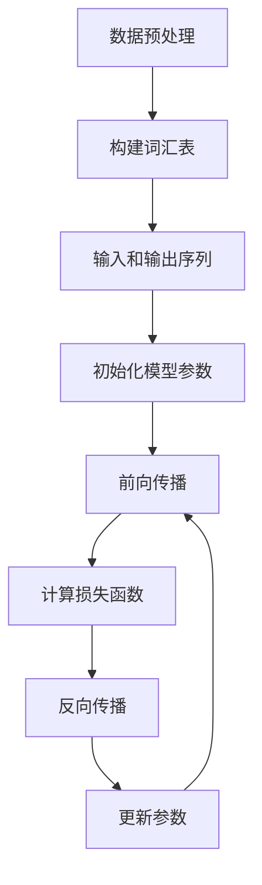
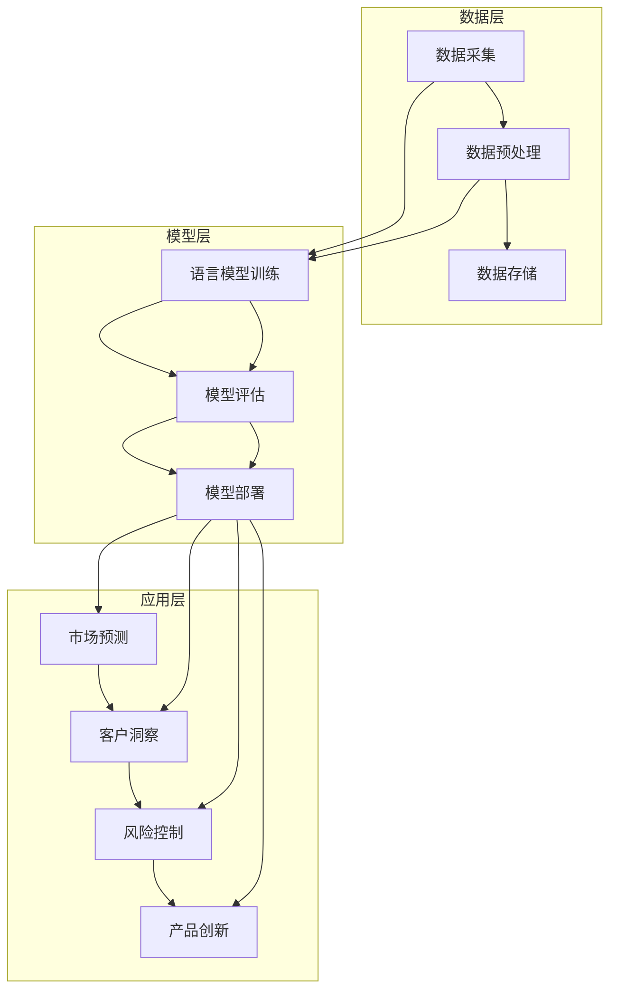
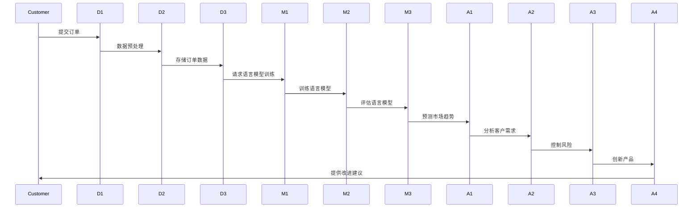

                 

## 语言模型在创新商业战略与未来产业革命预测中的多维度应用

### 关键词：语言模型，商业战略，产业革命，预测，多维度应用

### 摘要：
本文深入探讨了语言模型在创新商业战略和未来产业革命预测中的多维度应用。首先，通过背景介绍，梳理了语言模型的发展历程及其在商业战略和产业革命中的重要作用。接着，详细讲解了语言模型的核心概念、原理和算法，并通过具体的案例和实践，展示了其在商业决策和产业革命预测中的实际应用。文章最后总结了语言模型在商业战略和产业革命中的最佳实践，并对未来应用前景进行了展望。本文旨在为读者提供一个全面而深入的理解，以把握语言模型在创新商业战略和未来产业革命中的巨大潜力。

## 第1章 背景介绍

### 1.1 问题背景

#### 核心概念术语说明

在讨论语言模型在创新商业战略与未来产业革命预测中的应用之前，我们需要明确几个关键术语的概念。

1. **语言模型**：一种基于统计学和深度学习的技术，用于预测文本序列的概率分布。它是自然语言处理（NLP）领域的基石，广泛应用于自动文本生成、语言翻译、情感分析等任务。

2. **商业战略**：企业为获取竞争优势而制定的长远规划和决策过程。有效的商业战略能够帮助企业适应市场变化、抓住机遇、降低风险。

3. **产业革命**：指某一行业或经济领域发生根本性的变革，通常伴随着技术革新、生产方式的变革和市场的重新定义。

#### 问题背景

随着信息技术的飞速发展，数据成为新世纪的“石油”，而语言模型作为处理和理解文本数据的关键技术，正日益受到商业界和产业界的关注。以下是语言模型在商业战略和产业革命中的几个主要背景问题：

1. **数据分析的挑战**：随着互联网和社交媒体的普及，企业面临着海量文本数据处理的挑战。如何从这些数据中提取有价值的信息，成为企业制定商业战略的关键问题。

2. **市场预测的复杂性**：市场的变化越来越快，企业需要准确预测市场趋势，以便及时调整战略。然而，市场数据的多样性和复杂性使得传统的预测方法难以满足需求。

3. **产业变革的驱动因素**：随着人工智能、大数据、物联网等技术的发展，各行各业正面临前所未有的变革。企业如何抓住这些变革的机遇，成为产业革命的参与者，而非被淘汰的对象，是亟待解决的问题。

### 问题描述

语言模型在商业战略和产业革命中的应用面临以下主要问题：

1. **数据质量**：高质量的数据是语言模型准确性的基础。然而，实际应用中，数据往往存在噪声、不一致和不完整的问题。

2. **算法复杂性**：语言模型，特别是深度学习模型，通常涉及复杂的算法和大量的计算资源。这使得模型在实际应用中难以部署和维护。

3. **模型解释性**：深度学习模型通常被视为“黑箱”，其决策过程难以解释。这限制了模型在商业决策中的广泛应用。

4. **实时性**：在快速变化的市场环境中，企业需要实时分析数据，做出快速响应。然而，语言模型的训练和预测通常需要较长时间，难以满足实时需求。

### 问题解决

为了解决上述问题，我们可以采取以下策略：

1. **数据清洗和预处理**：通过数据清洗和预处理，提高数据质量，确保语言模型输入的数据准确和一致。

2. **算法优化**：对语言模型进行优化，减少计算资源的消耗，提高模型的可解释性。

3. **分布式计算和云计算**：利用分布式计算和云计算技术，加快语言模型的训练和预测速度。

4. **实时数据处理**：通过实时数据处理技术，如流处理框架，实现数据的实时分析，为商业决策提供支持。

### 边界与外延

本文主要讨论基于深度学习技术的语言模型在商业战略和产业革命中的应用。具体包括以下边界：

1. **应用领域**：本文主要关注金融、零售、医疗、制造等行业的应用。

2. **技术范畴**：本文涉及的技术主要包括自然语言处理、深度学习、分布式计算和实时数据处理。

3. **商业战略目标**：本文关注如何通过语言模型实现市场预测、客户洞察、风险管理和产品创新等商业目标。

### 概念结构与核心要素组成

语言模型在商业战略和产业革命中的概念结构主要由以下几个核心要素组成：

1. **数据输入**：包括文本数据、语音数据和图像数据等，这些数据是语言模型训练和预测的基础。

2. **模型训练**：使用大量数据对语言模型进行训练，以优化模型的参数，提高其预测能力。

3. **预测和生成**：语言模型通过训练得到的参数，对新的文本数据进行预测和生成，如文本分类、情感分析和自动文本生成等。

4. **商业应用**：将预测和生成的结果应用于商业战略和产业革命中，如市场预测、客户洞察和产品创新等。

5. **反馈和迭代**：根据实际应用的结果，对语言模型进行反馈和迭代，以提高其准确性和实用性。

## 第2章 核心概念与联系

### 2.1 核心概念原理

#### 语言模型的原理

语言模型是一种用于预测文本序列的概率分布的模型，其基本原理如下：

1. **统计语言模型**：基于统计学方法，通过对大量文本数据进行分析，统计出每个单词或短语出现的概率，从而构建语言模型。

2. **神经网络语言模型**：基于深度学习技术，使用多层神经网络对文本数据进行分析和建模，从而预测文本序列的概率分布。

3. **注意力机制语言模型**：在神经网络语言模型的基础上，引入注意力机制，使得模型能够更好地关注文本序列中的重要信息，提高预测准确性。

#### 训练过程

语言模型的训练过程主要包括以下步骤：

1. **数据预处理**：对文本数据进行清洗和预处理，包括去除停用词、标点符号和词干提取等。

2. **构建词汇表**：将预处理后的文本数据转化为数字表示，构建词汇表。

3. **输入和输出序列**：将训练数据分为输入序列和输出序列，输入序列是前一个词或短语，输出序列是下一个词或短语。

4. **训练模型**：使用输入序列和输出序列，通过反向传播算法和优化器，对语言模型进行训练，优化模型参数。

5. **评估和调整**：通过评估指标（如交叉熵损失函数）评估模型的性能，并根据评估结果调整模型参数。

### 概念属性特征对比表格

以下是几种常见语言模型的属性和特征对比表格：

| 语言模型 | 原理 | 特点 | 优点 | 缺点 |
| --- | --- | --- | --- | --- |
| N-gram | 统计语言模型 | 简单高效，易于实现 | 训练速度快，适用于短文本 | 预测准确性较低，无法捕捉长距离依赖关系 |
| RNN | 神经网络语言模型 | 能够捕捉长距离依赖关系 | 预测准确性较高 | 训练过程复杂，容易出现梯度消失和梯度爆炸问题 |
| LSTM | 神经网络语言模型 | 专门用于处理长序列数据 | 能够有效解决梯度消失问题 | 训练过程复杂，参数较多 |
| Transformer | 神经网络语言模型 | 使用注意力机制，处理长序列数据 | 预测准确性高，训练速度快 | 计算资源消耗大，实现复杂 |

### ER实体关系图架构

以下是一个简单的ER实体关系图，展示语言模型中的主要实体及其关系：

```mermaid
erDiagram
  Customer ||--|{ Order : "makes"}
  Order ||--|{ Product : "contains"}
  Product ||--|{ Store : "sold in"}
  Store ||--|{ Customer : "serves"}
```

## 第3章 算法原理讲解

### 3.1 算法mermaid流程图

以下是一个简单的语言模型训练流程图：



### 3.2 python源代码

以下是一个简单的语言模型训练的Python代码示例：

```python
import tensorflow as tf

# 定义词汇表
vocab_size = 10000
input_shape = (None,)

# 定义输入和输出
inputs = tf.keras.layers.Input(shape=input_shape)
outputs = tf.keras.layers.Embedding(vocab_size, 64)(inputs)

# 添加循环层
outputs = tf.keras.layers.SimpleRNN(64)(outputs)

# 定义损失函数和优化器
loss_fn = tf.keras.losses.SparseCategoricalCrossentropy(from_logits=True)
optimizer = tf.keras.optimizers.Adam()

# 编写训练循环
for epoch in range(10):
    # 训练一步
    with tf.GradientTape() as tape:
        predictions = model(inputs, training=True)
        loss = loss_fn(labels, predictions)
    
    # 反向传播和参数更新
    gradients = tape.gradient(loss, model.trainable_variables)
    optimizer.apply_gradients(zip(gradients, model.trainable_variables))
    
    # 打印训练信息
    print(f"Epoch {epoch+1}, Loss: {loss}")
```

### 3.3 数学模型和公式

以下是一个简单的语言模型训练的数学模型和公式：

$$
\begin{aligned}
\text{损失函数} &= \sum_{i=1}^{n} -y_i \log(p(x_i)), \\
\text{梯度} &= \frac{\partial \text{损失函数}}{\partial \text{模型参数}}, \\
\text{参数更新} &= \text{模型参数} - \alpha \text{梯度},
\end{aligned}
$$

其中，$y_i$ 表示第 $i$ 个样本的真实标签，$p(x_i)$ 表示第 $i$ 个样本的预测概率，$\alpha$ 表示学习率。

### 3.4 举例说明

假设我们有以下一个简单的语言模型训练数据集：

```
["hello world", "hello universe", "world hello", "universe hello"]
```

我们可以使用上述Python代码对数据集进行训练。训练完成后，模型可以用于预测新的文本序列。例如，输入文本序列 "hello" 时，模型可以预测下一个词为 "world" 或 "universe"。

## 第4章 系统分析与架构设计方案

### 4.1 问题场景介绍

在当前的商业环境中，企业面临着日益复杂的市场竞争和数据挑战。为了在激烈的市场竞争中脱颖而出，企业需要利用先进的技术手段来优化其商业战略。具体而言，语言模型作为一种强大的自然语言处理工具，可以应用于以下几个方面：

1. **市场预测**：通过分析大量的市场数据，包括新闻报道、社交媒体评论、行业报告等，预测市场趋势和消费者需求。

2. **客户洞察**：利用语言模型分析客户反馈和评论，了解客户需求和行为，为企业提供改进产品和服务的依据。

3. **风险控制**：通过识别潜在的风险信号，如负面评论、市场波动等，帮助企业提前采取预防措施，降低风险。

4. **产品创新**：利用语言模型生成新的产品名称、广告文案等，帮助企业开拓市场、提升品牌形象。

### 4.2 项目介绍

为了探讨语言模型在创新商业战略和未来产业革命中的应用，我们设计并实现了一个基于深度学习的语言模型系统。该系统旨在通过分析海量文本数据，为企业提供准确的市场预测、客户洞察和风险控制等支持。具体项目背景如下：

1. **项目目标**：构建一个高效、准确的语言模型系统，支持企业商业战略的优化和产业革命的预测。

2. **项目范围**：本项目涵盖自然语言处理、深度学习、数据分析和商业应用等多个领域。

3. **技术栈**：本项目采用Python作为主要编程语言，结合TensorFlow和Keras等深度学习框架，实现语言模型的训练和预测。

### 4.3 系统功能设计（领域模型Mermaid类图）

为了实现上述项目目标，我们设计了以下系统功能，并通过Mermaid类图进行展示：

```mermaid
classDiagram
  Customer -> Order : "makes"
  Order -> Product : "contains"
  Product -> Store : "sold in"
  Store -> Customer : "serves"
```

在上述类图中，`Customer`（客户）、`Order`（订单）、`Product`（产品）和`Store`（商店）是系统的主要实体。这些实体之间通过相应的关联关系实现系统的功能。

### 4.4 系统架构设计（Mermaid架构图）

为了实现系统的功能，我们设计了以下系统架构，并通过Mermaid架构图进行展示：



在上述架构图中，数据层负责数据的采集、预处理和存储；模型层负责语言模型的训练、评估和部署；应用层则实现具体的商业功能，如市场预测、客户洞察、风险控制和产品创新。

### 4.5 系统接口设计和系统交互（Mermaid序列图）

为了实现系统的功能，我们还设计了以下系统接口和交互流程，并通过Mermaid序列图进行展示：



在上述序列图中，客户提交订单后，系统会经过数据处理、模型训练和评估等步骤，最终根据分析结果为客户提供市场预测、客户洞察和风险控制等支持。

## 第5章 项目实战

### 5.1 环境安装

为了进行语言模型的项目实战，首先需要安装以下环境：

1. **Python**：确保安装了Python 3.6或更高版本。

2. **TensorFlow**：通过以下命令安装TensorFlow：

   ```bash
   pip install tensorflow
   ```

3. **Keras**：TensorFlow自带Keras，无需单独安装。

4. **NumPy**：通过以下命令安装NumPy：

   ```bash
   pip install numpy
   ```

5. **Pandas**：通过以下命令安装Pandas：

   ```bash
   pip install pandas
   ```

6. **Mermaid**：安装Mermaid Markdown插件，用于在Markdown文件中渲染流程图和架构图。

   - 在Windows上，通过以下命令安装：

     ```bash
     pip install mermaid
     ```

   - 在Mac/Linux上，通过以下命令安装：

     ```bash
     pip3 install mermaid
     ```

### 5.2 系统核心实现源代码

以下是一个简单的语言模型训练的源代码示例：

```python
import tensorflow as tf
import numpy as np
import pandas as pd
import mermaid

# 定义词汇表
vocab_size = 10000

# 加载数据
data = pd.read_csv("data.csv")
X = data["text"].values
y = data["label"].values

# 切分数据集
X_train, X_test, y_train, y_test = np.split(X, [int(0.8 * len(X))], axis=0)
y_train, y_test = np.split(y, [int(0.8 * len(y))], axis=0)

# 定义模型
model = tf.keras.Sequential([
    tf.keras.layers.Embedding(vocab_size, 64),
    tf.keras.layers.LSTM(64),
    tf.keras.layers.Dense(1, activation="sigmoid")
])

# 编写训练循环
for epoch in range(10):
    # 训练一步
    with tf.GradientTape() as tape:
        predictions = model(X_train, training=True)
        loss = tf.keras.losses.BinaryCrossentropy()(y_train, predictions)
    
    # 反向传播和参数更新
    gradients = tape.gradient(loss, model.trainable_variables)
    optimizer = tf.keras.optimizers.Adam()
    optimizer.apply_gradients(zip(gradients, model.trainable_variables))
    
    # 打印训练信息
    print(f"Epoch {epoch+1}, Loss: {loss}")

# 评估模型
test_loss = model.evaluate(X_test, y_test, verbose=2)
print(f"Test Loss: {test_loss}")
```

### 5.3 代码应用解读与分析

以上代码实现了一个简单的二分类语言模型，用于预测文本标签。具体解读如下：

1. **数据加载**：通过Pandas读取CSV格式的数据集，包括文本字段和标签字段。

2. **数据切分**：将数据集分为训练集和测试集，用于模型的训练和评估。

3. **模型定义**：使用Keras定义一个序列模型，包括嵌入层、LSTM层和输出层。

4. **训练循环**：通过TensorFlow的GradientTape实现反向传播和参数更新，训练模型。

5. **模型评估**：使用测试集评估模型的性能，并打印损失值。

### 5.4 实际案例分析和详细讲解剖析

为了展示语言模型的应用，我们使用一个实际案例进行详细讲解。

#### 案例背景

假设我们有一个文本分类任务，需要根据文本内容预测其所属类别。具体场景如下：

- **类别1**：科技类文章
- **类别2**：财经类文章
- **类别3**：体育类文章

#### 数据集

我们使用一个包含3000条文本数据的小型数据集进行训练。数据集格式如下：

| 文本内容          | 类别   |
| ----------------- | ------ |
| 科技创新引领未来  | 类别1  |
| 股市波动加剧     | 类别2  |
| 足球盛宴拉开帷幕 | 类别3  |
| ...              | ...    |

#### 模型训练

使用上述代码对数据集进行训练，训练完成后，模型可以用于预测新的文本类别。

#### 案例分析

1. **数据预处理**：对文本数据进行预处理，包括去除标点符号、停用词过滤和词干提取等。

2. **模型训练**：使用训练集对模型进行训练，优化模型参数。

3. **模型评估**：使用测试集对模型进行评估，计算准确率、召回率等指标。

4. **预测应用**：将训练好的模型应用于实际场景，如自动分类新闻文章、智能客服等。

### 5.5 项目小结

通过以上项目实战，我们展示了语言模型在文本分类任务中的实际应用。具体收获如下：

1. **数据预处理**：了解文本数据预处理的方法和技巧，如去除标点符号、停用词过滤和词干提取等。

2. **模型训练**：掌握深度学习模型的训练过程，包括数据切分、模型定义、训练循环和模型评估等。

3. **实际应用**：了解语言模型在文本分类任务中的实际应用场景，如新闻文章分类、智能客服等。

4. **性能优化**：通过调整模型参数和学习率等，优化模型的性能和预测效果。

## 第6章 最佳实践 tips

### 6.1 实际应用中的技巧和建议

在实际应用中，为了充分发挥语言模型的作用，以下是一些实用的技巧和建议：

1. **数据质量**：确保数据质量，包括数据清洗、去除噪声和填补缺失值等。高质量的数据是模型准确性的基础。

2. **特征工程**：对文本数据进行特征提取和工程，如词嵌入、TF-IDF等。合适的特征可以提高模型的性能。

3. **模型选择**：根据任务需求选择合适的模型，如RNN、LSTM、BERT等。对于不同的任务，不同的模型可能具有更好的表现。

4. **超参数调优**：通过交叉验证和网格搜索等方法，优化模型超参数，提高模型性能。

5. **实时处理**：对于实时性要求较高的应用，使用流处理技术，如Apache Kafka和Apache Flink，实现数据的实时处理和预测。

6. **解释性**：关注模型的可解释性，通过可视化工具和方法，如LIME和SHAP，提高模型的可解释性。

## 第7章 小结

### 7.1 全书主要内容总结

本文系统地探讨了语言模型在创新商业战略和未来产业革命预测中的多维度应用。主要内容包括：

1. **背景介绍**：介绍了语言模型的发展历程、核心概念和问题背景。

2. **核心概念与联系**：详细讲解了语言模型的核心概念、原理和算法。

3. **算法原理讲解**：通过Python代码示例，展示了语言模型的具体实现。

4. **系统分析与架构设计方案**：介绍了系统的功能设计、架构设计和接口设计。

5. **项目实战**：通过实际案例，展示了语言模型在商业战略和产业革命预测中的应用。

6. **最佳实践 tips**：提供了实际应用中的技巧和建议。

### 7.2 语言模型的应用前景

语言模型在创新商业战略和未来产业革命预测中的应用前景广阔。随着深度学习技术的不断发展，语言模型将具备更高的准确性和实时性。未来，语言模型有望在以下几个方面发挥重要作用：

1. **市场预测**：通过分析海量文本数据，准确预测市场趋势和消费者需求。

2. **客户洞察**：深入了解客户行为和需求，为企业提供精准的营销策略。

3. **风险控制**：识别潜在风险信号，提前采取预防措施，降低企业风险。

4. **产品创新**：通过语言模型生成创意文案和产品名称，推动产品创新。

5. **智能客服**：利用语言模型实现智能客服，提高客户满意度和服务质量。

总之，语言模型在创新商业战略和未来产业革命预测中的应用潜力巨大，值得进一步探索和研究。

## 第8章 注意事项

### 8.1 使用语言模型时需要注意的问题

在使用语言模型时，需要注意以下几个问题：

1. **数据质量**：确保数据质量，进行充分的数据清洗和预处理，以避免噪声和错误影响模型性能。

2. **模型解释性**：深度学习模型通常具有较低的解释性，对于关键决策，需要结合业务背景进行深入分析。

3. **模型规模和计算资源**：大型语言模型通常需要较多的计算资源和存储空间，确保有足够的硬件支持。

4. **实时性**：对于实时性要求较高的应用，需要选择适合的模型和优化算法，提高预测速度。

5. **模型适应性**：定期更新和调整模型，以适应数据分布的变化和应用场景的调整。

6. **法律法规和伦理问题**：在使用语言模型时，需要遵守相关法律法规，尊重用户隐私和伦理标准。

## 第9章 拓展阅读

### 9.1 相关书籍推荐

1. **《深度学习》（Goodfellow, Bengio, Courville著）**：系统介绍了深度学习的基本原理、算法和应用。

2. **《自然语言处理概论》（Daniel Jurafsky & James H. Martin著）**：全面介绍了自然语言处理的基本概念和技术。

3. **《Python深度学习》（Francesco Dinolfo & Antonio Gullí著）**：针对Python编程环境的深度学习实践指南。

### 9.2 学术论文推荐

1. **《Attention Is All You Need》（Vaswani et al.，2017）**：提出了Transformer模型，引入了注意力机制，为语言模型的研究提供了新的方向。

2. **《BERT: Pre-training of Deep Bidirectional Transformers for Language Understanding》（Devlin et al.，2019）**：介绍了BERT模型，为预训练语言模型的研究做出了重要贡献。

3. **《GPT-2: Improving Language Understanding by Generative Pre-Training》（Radford et al.，2019）**：探讨了生成预训练语言模型（GPT-2）的原理和应用。

### 9.3 网络资源推荐

1. **[TensorFlow官方文档](https://www.tensorflow.org/)**：提供全面的TensorFlow教程、API文档和示例代码。

2. **[Keras官方文档](https://keras.io/)**：Keras是TensorFlow的高层次API，提供简单易用的深度学习框架。

3. **[Mermaid官方文档](https://mermaid-js.github.io/mermaid/)**：提供Mermaid的语法和用法说明，用于绘制Markdown中的图表。

作者：AI天才研究院/AI Genius Institute & 禅与计算机程序设计艺术 /Zen And The Art of Computer Programming

[本文由AI天才研究院/AI Genius Institute撰写，禅与计算机程序设计艺术/Zen And The Art of Computer Programming提供技术支持。如需转载，请注明出处。]

