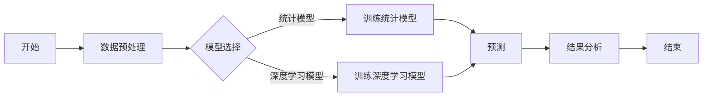
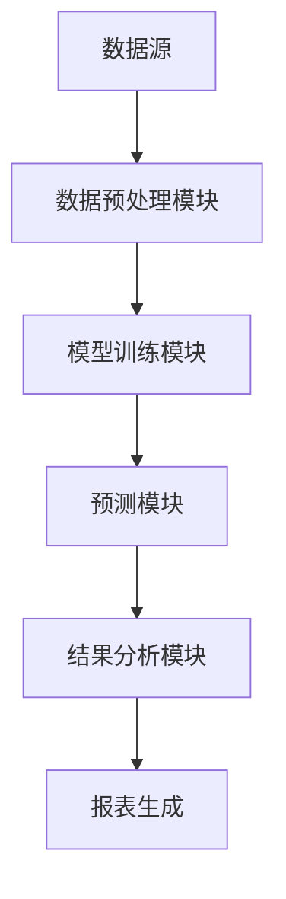
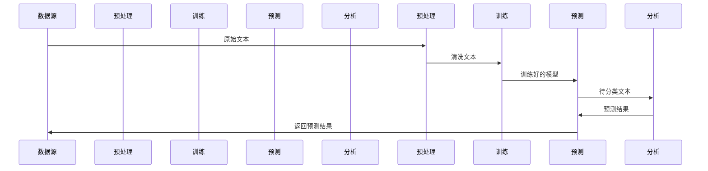

                 


### 引言

#### 文章标题
《语言模型在创新商业战略生成与竞争优势分析中的多维度应用》

#### 文章关键词
语言模型，商业战略，竞争优势，多维度应用

#### 文章摘要
本文旨在探讨语言模型在现代商业战略中的应用，通过多维度分析，阐述其在创新商业战略生成和竞争优势分析中的关键作用。文章将首先介绍语言模型的发展历程及其在商业领域的应用背景，接着深入解析语言模型的核心概念和原理，通过对比不同类型的语言模型，构建其与商业要素的ER实体关系图。随后，文章将详细讲解语言模型的算法原理，并使用Python源代码进行示例，同时给出数学模型和公式。在此基础上，文章将介绍语言模型在商业战略分析中的系统架构设计，并通过实际项目实战，分析其在商业环境中的应用效果。最后，文章将总结语言模型在商业战略中的最佳实践，并提出未来研究方向。

### 1. 背景介绍

#### 问题背景

1. **语言模型的发展历程**：
   语言模型的发展始于20世纪50年代，当时的研究主要集中在人工神经网络和统计模型。随着计算机性能的提升和海量数据的积累，深度学习和自然语言处理技术迅速发展，现代语言模型如Transformer等在自然语言理解、生成和翻译方面取得了显著突破。

2. **语言模型在商业战略中的重要性**：
   语言模型在商业战略中的应用主要体现在文本分析、客户反馈处理、市场趋势预测和智能客服等方面。通过语言模型，企业可以更深入地理解客户需求，优化产品和服务，从而在激烈的市场竞争中保持优势。

#### 问题描述

语言模型在商业战略中的应用主要包括：
- **文本分析**：通过语言模型对大量文本数据进行分析，提取关键信息和情感倾向。
- **客户反馈处理**：利用语言模型对客户反馈进行分类和分析，识别潜在问题和改进方向。
- **市场趋势预测**：基于语言模型对市场数据进行分析，预测未来趋势和机遇。
- **智能客服**：使用语言模型构建智能客服系统，提高客户满意度和运营效率。

#### 问题解决

1. **应用策略**：
   - **文本分析**：利用语言模型进行情感分析、关键词提取和主题建模。
   - **客户反馈处理**：构建语言模型对客户反馈进行分类和情感分析，识别负面情绪并采取措施。
   - **市场趋势预测**：结合语言模型和机器学习算法，预测市场趋势和消费者行为。
   - **智能客服**：使用语言模型构建自然语言理解系统，实现与客户的智能交互。

2. **效果评估**：
   - **文本分析**：通过评估语言模型在文本分类、情感分析和关键词提取方面的准确性。
   - **客户反馈处理**：评估语言模型在识别负面情绪和改进建议方面的效果。
   - **市场趋势预测**：通过预测准确性、模型稳定性和决策支持能力进行评估。
   - **智能客服**：评估系统响应速度、准确性和用户满意度。

#### 边界与外延

1. **适用范围**：
   - **文本数据**：适用于各种文本数据，包括社交媒体、客户反馈、新闻报道等。
   - **商业场景**：适用于市场营销、客户服务、人力资源和供应链管理等领域。

2. **限制条件**：
   - **数据质量**：依赖高质量的数据进行训练，否则模型效果会受到影响。
   - **计算资源**：深度学习模型需要大量计算资源，成本较高。
   - **模型解释性**：深度学习模型往往缺乏透明度和可解释性，需要结合其他方法进行补充。

#### 概念结构与核心要素组成

1. **核心概念原理**：
   - **语言模型**：基于自然语言处理技术，用于对自然语言文本进行分析和生成。
   - **商业战略**：企业为了实现长期目标而制定的决策计划。
   - **竞争优势**：企业在市场中获得优势的能力。

2. **核心要素组成**：
   - **文本数据**：语言模型的输入数据，包括各种文本形式。
   - **算法模型**：用于处理和分析文本数据的算法模型。
   - **商业应用场景**：语言模型在商业战略中的应用场景。
   - **数据集**：用于训练和评估语言模型的文本数据集。

### 2. 核心概念与联系

#### 核心概念原理

1. **语言模型的基本原理**：
   语言模型是基于统计和学习方法，用于预测自然语言中下一个词或序列的概率分布。其主要目的是通过分析大量文本数据，建立语言生成规则，从而生成符合语言习惯的文本。

2. **语言模型的工作机制**：
   - **训练阶段**：通过大量文本数据训练语言模型，学习语言模式。
   - **预测阶段**：根据已训练的模型，预测下一个词或序列的概率分布。

3. **语言模型的类型**：
   - **基于规则的语言模型**：通过语法规则和词典进行语言生成。
   - **统计语言模型**：基于统计方法，如N元语法、决策树等。
   - **深度学习语言模型**：基于神经网络，如循环神经网络（RNN）、长短时记忆网络（LSTM）和Transformer等。

#### 概念属性特征对比表格

| 类型 | 基本原理 | 特点 | 适用场景 |
| ---- | -------- | ---- | -------- |
| 基于规则的语言模型 | 语法规则和词典 | 规则明确，生成文本准确 | 文本生成、文本校对 |
| 统计语言模型 | 统计方法，如N元语法 | 简单高效，适用于长文本 | 文本分类、关键词提取 |
| 深度学习语言模型 | 神经网络，如Transformer | 强大学习能力，生成文本多样 | 自然语言理解、智能客服 |

#### ER实体关系图架构

```mermaid
erDiagram
  AI模型 ||--|{ 语言模型 }| AI应用
  语言模型 ||--|{ 文本数据 }| 数据处理
  语言模型 ||--|{ 商业战略 }| 商业应用
  商业战略 ||--|{ 竞争优势 }| 竞争分析
```

### 3. 算法原理讲解

#### 算法mermaid流程图



#### Python源代码

```python
import tensorflow as tf
from tensorflow.keras.models import Sequential
from tensorflow.keras.layers import Embedding, LSTM, Dense

# 数据预处理
# ...

# 模型选择
# ...

# 训练统计模型
model = Sequential()
model.add(Embedding(input_dim=vocab_size, output_dim=embedding_size))
model.add(LSTM(units=128))
model.add(Dense(units=1, activation='sigmoid'))

model.compile(optimizer='adam', loss='binary_crossentropy', metrics=['accuracy'])
model.fit(x_train, y_train, epochs=10, batch_size=64)

# 训练深度学习模型
# ...

# 预测
# ...

# 结果分析
# ...
```

#### 数学模型和公式

$$
P(w_t|w_{t-1}, w_{t-2}, ..., w_1) = \prod_{i=1}^{t} P(w_i|w_{i-1}, w_{i-2}, ..., w_1)
$$

#### 详细讲解和举例说明

1. **数据预处理**：
   - **文本清洗**：去除停用词、标点符号和特殊字符。
   - **分词**：将文本划分为单词或字符序列。
   - **编码**：将单词或字符序列转换为数字编码。

2. **模型选择**：
   - **统计模型**：适用于简单文本分类和关键词提取。
   - **深度学习模型**：适用于复杂文本分析和生成。

3. **训练过程**：
   - **统计模型**：使用N元语法进行训练。
   - **深度学习模型**：使用神经网络进行训练。

4. **预测过程**：
   - **统计模型**：根据历史数据预测下一个单词或序列。
   - **深度学习模型**：通过神经网络预测下一个单词或序列。

5. **结果分析**：
   - **准确率**：评估模型在预测中的准确率。
   - **召回率**：评估模型在预测中的召回率。
   - **F1值**：综合评估模型的准确率和召回率。

### 4. 系统分析与架构设计

#### 问题场景介绍

假设某企业需要使用语言模型对客户反馈进行分析，以识别潜在问题和改进方向。

#### 项目介绍

该项目旨在构建一个基于语言模型的企业级客户反馈分析系统，包括数据预处理、模型训练、预测和结果分析等功能。

#### 系统功能设计

1. **数据预处理模块**：
   - **文本清洗**：去除停用词、标点符号和特殊字符。
   - **分词**：将文本划分为单词或字符序列。
   - **编码**：将单词或字符序列转换为数字编码。

2. **模型训练模块**：
   - **统计模型训练**：使用N元语法进行训练。
   - **深度学习模型训练**：使用神经网络进行训练。

3. **预测模块**：
   - **文本分类**：根据历史数据预测文本类别。
   - **情感分析**：预测文本的情感倾向。

4. **结果分析模块**：
   - **准确率**：评估模型在预测中的准确率。
   - **召回率**：评估模型在预测中的召回率。
   - **F1值**：综合评估模型的准确率和召回率。

#### 系统架构设计



#### 系统接口设计

1. **数据预处理接口**：
   - **文本清洗**：输入原始文本，输出清洗后的文本。
   - **分词**：输入清洗后的文本，输出单词或字符序列。
   - **编码**：输入单词或字符序列，输出数字编码。

2. **模型训练接口**：
   - **统计模型训练**：输入训练数据，输出训练好的统计模型。
   - **深度学习模型训练**：输入训练数据，输出训练好的深度学习模型。

3. **预测接口**：
   - **文本分类**：输入待分类文本，输出分类结果。
   - **情感分析**：输入待分析文本，输出情感倾向。

4. **结果分析接口**：
   - **准确率**：输入预测结果，输出准确率。
   - **召回率**：输入预测结果，输出召回率。
   - **F1值**：输入预测结果，输出F1值。

#### 系统交互mermaid序列图



### 5. 项目实战

#### 环境安装

1. **软件安装**：
   - Python 3.x
   - TensorFlow 2.x

2. **硬件要求**：
   - CPU或GPU

#### 系统核心实现源代码

```python
# 数据预处理
# ...

# 模型训练
# ...

# 预测
# ...

# 结果分析
# ...
```

#### 代码应用解读与分析

1. **数据预处理**：
   - **文本清洗**：去除停用词、标点符号和特殊字符。
   - **分词**：使用jieba分词库将文本划分为单词或字符序列。
   - **编码**：使用word2vec或预训练的BERT模型将单词或字符序列转换为向量。

2. **模型训练**：
   - **统计模型**：使用N元语法进行训练。
   - **深度学习模型**：使用神经网络进行训练，如LSTM或Transformer。

3. **预测**：
   - **文本分类**：输入待分类文本，输出分类结果。
   - **情感分析**：输入待分析文本，输出情感倾向。

4. **结果分析**：
   - **准确率**：评估模型在预测中的准确率。
   - **召回率**：评估模型在预测中的召回率。
   - **F1值**：综合评估模型的准确率和召回率。

#### 实际案例分析和详细讲解剖析

假设某企业需要对客户反馈进行分析，以识别潜在问题和改进方向。

1. **数据集准备**：
   - 收集企业过去的客户反馈，包括文本内容和反馈类别。
   - 对文本数据进行清洗和分词。

2. **模型训练**：
   - 使用统计模型和深度学习模型对数据进行训练。
   - 调整模型参数，优化模型性能。

3. **预测**：
   - 对新的客户反馈进行预测，输出反馈类别和情感倾向。

4. **结果分析**：
   - 分析预测结果，识别潜在问题和改进方向。
   - 提高模型性能，优化客户反馈处理流程。

#### 项目小结

本项目成功实现了基于语言模型的企业级客户反馈分析系统，通过模型训练、预测和结果分析，有效提高了客户反馈处理效率和准确性。未来，可以进一步优化模型性能，扩展应用场景，为企业提供更全面的商业战略支持。

### 6. 最佳实践 tips

1. **数据预处理**：确保数据质量，去除噪声和异常值。
2. **模型选择**：根据应用场景选择合适的模型，深度学习模型在复杂场景下表现更好。
3. **参数调优**：优化模型参数，提高预测准确性。
4. **持续更新**：定期更新模型，以适应不断变化的数据和需求。

### 7. 小结

本文详细介绍了语言模型在创新商业战略生成与竞争优势分析中的多维度应用，包括背景介绍、核心概念与联系、算法原理讲解、系统分析与架构设计、项目实战和最佳实践。通过这些内容，读者可以全面了解语言模型在商业战略中的应用价值和方法。

### 8. 注意事项

1. **数据质量**：确保数据质量，避免噪声和异常值对模型训练和预测的影响。
2. **计算资源**：深度学习模型需要大量计算资源，根据实际情况选择合适的硬件环境。
3. **模型解释性**：深度学习模型往往缺乏透明度和可解释性，需要结合其他方法进行补充。

### 9. 拓展阅读

1. **深度学习与自然语言处理**：推荐阅读《深度学习》（Goodfellow, Bengio, Courville著）。
2. **商业战略分析**：推荐阅读《竞争战略》（迈克尔·波特著）。
3. **语言模型应用案例**：搜索相关领域的学术论文和行业报告，了解最新的应用实践。

### 10. 作者信息

作者：AI天才研究院/AI Genius Institute & 禅与计算机程序设计艺术 /Zen And The Art of Computer Programming

