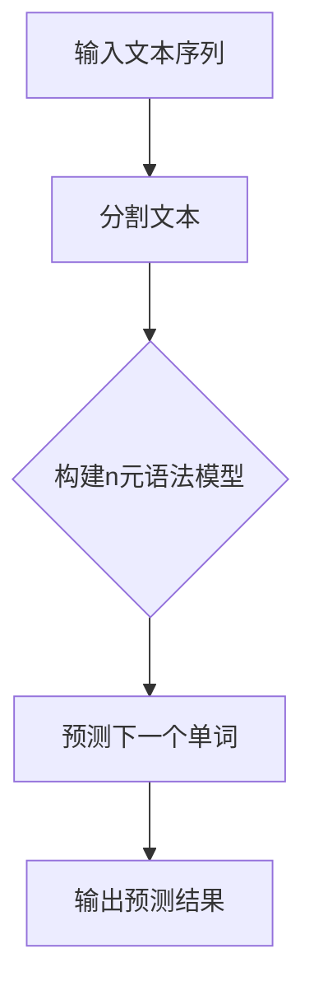
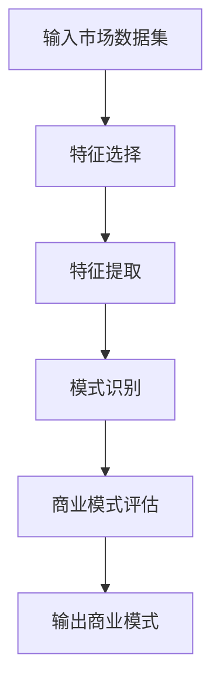
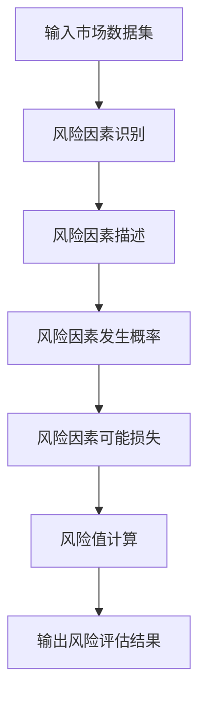
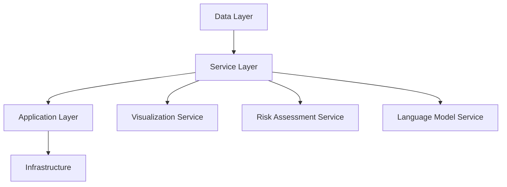
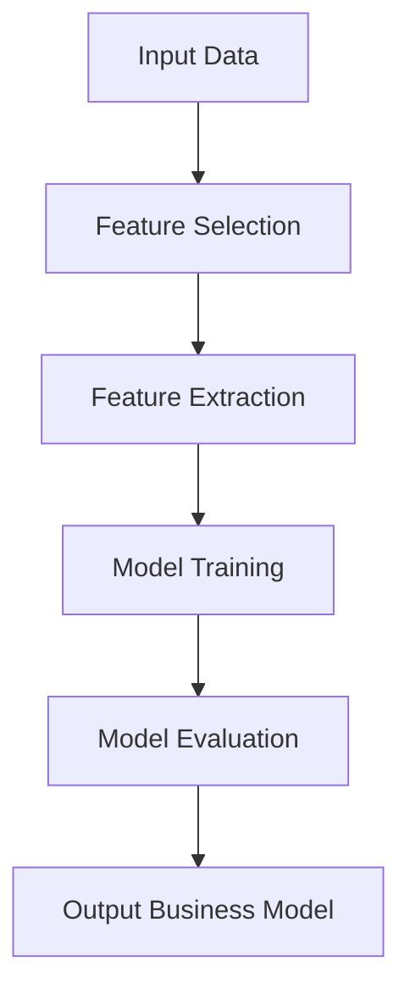
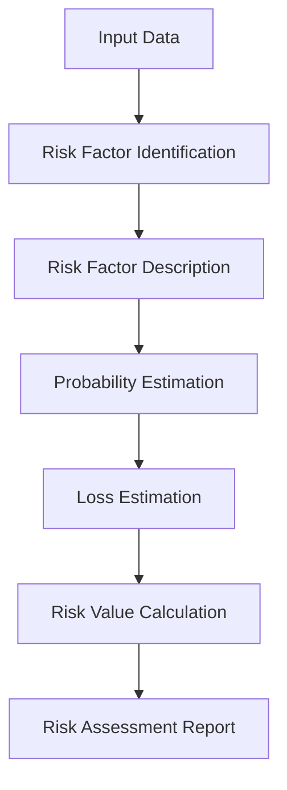

                 

# 语言模型在创新商业模式生成与创业风险评估中的多维度研究

> 关键词：语言模型、创新商业模式、创业风险评估、多维度研究

> 摘要：本文针对创新商业模式的生成和创业风险评估的问题，探讨如何利用语言模型技术进行有效的解决方案。文章首先介绍了创新商业模式和创业风险评估的基本概念及其重要性，然后详细分析了语言模型的技术原理及其应用场景。接下来，本文通过具体算法和数学模型的讲解，展示了如何利用语言模型生成创新商业模式和评估创业风险。最后，文章通过一个实际案例，验证了语言模型在创新商业模式生成和创业风险评估中的有效性。

## 目录大纲

1. **背景介绍**
    1.1 问题背景
    1.2 问题描述
    1.3 问题解决
    1.4 边界与外延
    1.5 核心要素组成
    1.6 本章小结

2. **核心概念与联系**
    2.1 语言模型概述
    2.2 创新商业模式的定义与特征
    2.3 创业风险评估方法
    2.4 核心概念联系与对比
    2.5 本章小结

3. **算法原理讲解**
    3.1 语言模型算法原理
    3.2 创新商业模式生成算法
    3.3 创业风险评估算法
    3.4 本章小结

4. **系统分析与架构设计方案**
    4.1 问题场景介绍
    4.2 系统功能设计
    4.3 系统架构设计
    4.4 系统接口设计
    4.5 系统交互
    4.6 本章小结

5. **项目实战**
    5.1 环境安装
    5.2 系统核心实现源代码
    5.3 代码应用解读与分析
    5.4 实际案例分析与讲解
    5.5 项目小结

6. **最佳实践 Tips**
    6.1 注意事项
    6.2 拓展阅读

7. **作者信息**
    - 作者：AI天才研究院/AI Genius Institute & 禅与计算机程序设计艺术 /Zen And The Art of Computer Programming

## 1. 背景介绍

### 1.1 问题背景

创新商业模式对于企业的持续发展和竞争力至关重要。在当前市场环境多变的情况下，企业需要不断探索和创新商业模式以适应变化。然而，创新商业模式的生成并非易事，需要企业投入大量时间和资源进行市场调研、用户需求分析以及商业模式的策划与实施。

与此同时，创业者在开展创业活动时面临诸多风险。创业风险可能来自市场环境、竞争状况、技术发展等多个方面。有效评估创业风险对于降低创业失败率具有重要意义。然而，传统的创业风险评估方法通常依赖于经验和主观判断，存在一定的局限性。

### 1.2 创新商业模式的生成方法

为了解决创新商业模式生成的问题，研究者们提出了多种方法，包括市场调研、用户需求分析、商业模式设计等。然而，这些方法往往需要大量的时间和资源，且难以全面捕捉市场趋势和用户需求。

近年来，随着深度学习和自然语言处理技术的发展，语言模型逐渐成为生成创新商业模式的有力工具。语言模型通过学习大量的文本数据，可以捕捉到市场趋势、用户需求等信息，从而帮助生成具有创新性的商业模式。

### 1.3 创业风险评估方法

在创业风险评估方面，传统的评估方法主要包括定性分析和定量分析。定性分析通常通过专家访谈、案例研究等方法对风险因素进行定性分析，而定量分析则通过数据统计、模型模拟等方法对风险因素进行定量分析。这些方法在一定程度上能够评估创业风险，但往往难以全面、准确地捕捉风险因素。

随着人工智能技术的发展，语言模型在创业风险评估中展现出巨大的潜力。通过分析大量文本数据，语言模型可以识别出潜在的风险因素，并利用自然语言处理技术对这些因素进行量化分析，从而提高创业风险评估的准确性和效率。

### 1.4 问题解决

针对创新商业模式生成和创业风险评估的问题，本文提出以下解决方案：

1. **利用语言模型生成创新商业模式**：通过学习大量的文本数据，语言模型可以捕捉市场趋势、用户需求等信息，从而帮助生成具有创新性的商业模式。本文将详细介绍语言模型的算法原理和具体实现方法。

2. **利用语言模型进行创业风险评估**：通过分析大量文本数据，语言模型可以识别出潜在的风险因素，并利用自然语言处理技术对这些因素进行量化分析，从而提高创业风险评估的准确性和效率。本文将详细介绍语言模型在创业风险评估中的应用。

3. **构建综合平台**：将语言模型应用于创新商业模式生成和创业风险评估，构建一个综合平台，为企业提供一站式的创新商业模式生成和创业风险评估服务。本文将探讨该平台的架构设计和技术实现。

### 1.5 边界与外延

本文研究的边界与外延主要包括以下几个方面：

1. **研究范围**：本文主要研究语言模型在创新商业模式生成和创业风险评估中的应用，不涉及其他相关领域的研究。

2. **研究方法**：本文采用理论分析、算法讲解、案例分析等方法进行研究，力求全面、深入地探讨语言模型在创新商业模式生成和创业风险评估中的应用。

3. **技术实现**：本文将详细介绍语言模型在创新商业模式生成和创业风险评估中的具体实现方法，包括算法原理、数学模型、技术架构等。

### 1.6 核心要素组成

本文研究的核心要素主要包括以下几个方面：

1. **语言模型**：语言模型是本文研究的核心工具，包括算法原理、数学模型、技术实现等。

2. **创新商业模式**：创新商业模式是本文研究的核心对象，包括定义、特征、生成方法等。

3. **创业风险评估**：创业风险评估是本文研究的另一个核心对象，包括方法、技术、应用等。

4. **综合平台**：综合平台是本文研究的目标，包括架构设计、技术实现、应用场景等。

## 1.6 本章小结

本章首先介绍了创新商业模式生成和创业风险评估的问题背景，分析了当前存在的问题和挑战。接着，本章提出了利用语言模型解决这些问题的方案，并明确了研究的边界与外延。最后，本章阐述了研究的核心要素组成，为后续章节的详细分析奠定了基础。在接下来的章节中，我们将进一步探讨语言模型的基本原理、创新商业模式生成算法以及创业风险评估算法，并通过具体案例验证这些算法的有效性。

## 2. 核心概念与联系

### 2.1 语言模型概述

语言模型是一种用于预测文本序列的模型，其基本原理是通过对大量文本数据的学习，生成文本序列的概率分布。语言模型在自然语言处理、文本生成、搜索引擎等领域有广泛应用。例如，搜索引擎中的自动推荐、语音识别系统中的语音转换成文本、机器翻译等，都依赖于语言模型来预测下一个单词或字符。

#### 2.1.1 语言模型的基本原理

语言模型通常使用概率模型来描述，其中最常见的模型是n元语法模型。n元语法模型通过统计相邻n个单词或字符的联合概率来预测下一个单词或字符。其数学模型可以表示为：

$$ P(w_{t}|w_{t-1}, w_{t-2}, ..., w_{t-n+1}) = \frac{C(w_{t-1}, w_{t-2}, ..., w_{t-n+1}, w_{t})}{C(w_{t-1}, w_{t-2}, ..., w_{t-n+1})} $$

其中，$C(\cdot)$表示联合概率或条件概率。

#### 2.1.2 语言模型的类型

语言模型的类型有很多，以下是几种常见类型：

1. **隐马尔可夫模型（HMM）**：HMM是一种基于概率的统计模型，用于处理离散时间序列数据。在语言模型中，HMM可以用于文本序列的生成。

2. **递归神经网络（RNN）**：RNN是一种能够处理序列数据的神经网络，其具有记忆功能，能够捕捉到序列中的时间依赖性。RNN在语言模型中有广泛应用。

3. **卷积神经网络（CNN）**：CNN是一种用于图像识别的神经网络，但也可以用于文本处理。CNN在语言模型中的应用主要是通过将文本转换为词嵌入向量，然后使用卷积层进行特征提取。

4. **生成对抗网络（GAN）**：GAN是一种由生成器和判别器组成的模型，生成器生成文本数据，判别器判断文本的真实性。GAN在语言模型中的应用主要是用于生成高质量的文本数据。

### 2.2 创新商业模式的定义与特征

创新商业模式是指通过创造性的方法和策略，提高企业的竞争力。它通常包括新的产品、服务、业务流程、市场策略等。创新商业模式能够为企业带来显著的竞争优势，是企业持续发展的关键。

#### 2.2.1 创新商业模式的定义

创新商业模式是指通过创造性的方法和策略，提高企业的竞争力。它不同于传统的商业模式，强调创新性和独特性。创新商业模式可以是完全新的，也可以是对现有商业模式的改进。

#### 2.2.2 创新商业模式的特征

1. **创新性**：创新商业模式具有独特性，能够为企业带来竞争优势。
2. **可持续性**：创新商业模式能够长期支持企业的生存和发展。
3. **可操作性**：创新商业模式能够被有效实施和运营。

### 2.3 创业风险评估方法

创业风险评估是指对创业项目的风险因素进行分析和评估。创业风险可能来自市场环境、竞争状况、技术发展等多个方面。有效评估创业风险对于降低创业失败率具有重要意义。

#### 2.3.1 创业风险评估的概念

创业风险评估是指对创业项目的风险因素进行分析和评估。创业风险评估的目的是识别潜在的风险，并制定相应的风险管理策略，以降低创业失败的风险。

#### 2.3.2 创业风险评估的方法

1. **定性分析**：定性分析通过专家访谈、案例分析等方法对风险因素进行定性分析。定性分析能够帮助创业者了解风险的性质和影响，但难以量化风险。
   
2. **定量分析**：定量分析通过数据统计、模型模拟等方法对风险因素进行定量分析。定量分析能够提供更为准确的风险评估结果，但需要大量的数据支持。

3. **多元分析**：多元分析结合定性分析和定量分析，综合评估创业风险。多元分析能够提供更为全面和准确的风险评估结果。

### 2.4 核心概念联系与对比

语言模型、创新商业模式、创业风险评估是本文研究的三个核心概念，它们之间存在紧密的联系和互动。

#### 2.4.1 语言模型与创新商业模式

语言模型可以捕捉市场趋势、用户需求等信息，从而帮助生成具有创新性的商业模式。语言模型通过对大量文本数据的学习，能够识别出潜在的商业机会，为创业者提供创新的商业模式。

#### 2.4.2 语言模型与创业风险评估

语言模型可以用于分析大量文本数据，识别出潜在的风险因素，并利用自然语言处理技术对这些因素进行量化分析。语言模型在创业风险评估中的应用，能够提高风险评估的准确性和效率。

#### 2.4.3 创新商业模式与创业风险评估

创新商业模式是企业降低创业风险的重要手段。通过创新商业模式，企业能够更好地适应市场变化，降低创业失败的风险。同时，创业风险评估可以帮助企业识别潜在的风险，采取相应的风险管理策略。

### 2.5 本章小结

本章介绍了本文研究的三个核心概念：语言模型、创新商业模式和创业风险评估。通过对比分析，本章明确了这些概念的定义、特征及其相互关系。在接下来的章节中，我们将进一步探讨语言模型的算法原理、创新商业模式生成算法以及创业风险评估算法，并通过具体案例验证这些算法的有效性。

### 2.2 创新商业模式的定义与特征

#### 2.2.1 创新商业模式的定义

创新商业模式是指企业通过重新定义其业务模式，实现产品和服务的创新，从而创造新的市场价值。这种创新不仅仅是技术层面的变革，还包括产品、服务、运营模式、客户关系、收入模式等多方面的创新。创新商业模式的本质在于通过颠覆性思维和创新实践，改变现有的商业规则，为消费者提供新的价值和体验。

例如，亚马逊通过电子商务平台的建立，创新了零售行业的商业模式，改变了传统零售的运营方式和消费者购物习惯。类似的，苹果公司通过iPhone的推出，不仅创新了手机的产品形态，还重新定义了手机行业的商业模式，从而在市场中取得了巨大的成功。

#### 2.2.2 创新商业模式的特征

1. **独特性**：创新商业模式具有独特性，能够为企业带来显著的竞争优势。这种独特性体现在商业模式的核心元素，如产品或服务的特点、运营模式、客户价值主张等方面。

2. **适应性**：创新商业模式需要适应不断变化的市场环境和消费者需求。一个成功的创新商业模式能够在面对市场变化时，灵活调整其业务模式，保持企业的竞争力。

3. **可操作性**：创新商业模式不仅需要创新思维，还需要具备实际操作的可能性。这意味着创新商业模式需要能够被有效地实施和运营，而不是仅仅停留在理论层面。

4. **盈利性**：创新商业模式的核心目标是创造新的市场价值和盈利机会。一个成功的创新商业模式不仅能够为企业带来新的收入来源，还能够在长期内实现可持续的盈利。

5. **可持续性**：创新商业模式需要具有长期的生命力和可持续性。这意味着企业需要能够在创新的过程中，不断优化和调整商业模式，以适应市场的变化，保持企业的竞争力。

### 2.3 创业风险评估方法

创业风险评估是创业过程中至关重要的一环，它涉及到对企业面临的各种风险进行识别、分析和评估，以降低创业失败的概率。有效的创业风险评估能够帮助创业者更好地理解市场环境，制定合理的战略和计划，从而提高创业的成功率。

#### 2.3.1 创业风险评估的概念

创业风险评估是指对创业项目的风险因素进行系统性的识别、分析和评估，以评估创业项目的潜在风险和不确定性。创业风险评估的目的是帮助创业者了解创业过程中的潜在风险，制定有效的风险管理策略，降低创业失败的概率。

#### 2.3.2 创业风险评估的方法

1. **定性分析**：定性分析主要通过专家访谈、案例研究等方法对风险因素进行定性分析。定性分析能够帮助创业者了解风险的性质、原因和影响，但难以量化风险。

    - **专家访谈**：通过与行业专家、潜在客户等进行深入访谈，了解他们对创业项目的看法和意见，从而识别和评估潜在的风险。
    - **案例研究**：通过研究其他创业项目的成功和失败案例，分析其中存在的风险因素，为当前创业项目提供参考。

2. **定量分析**：定量分析主要通过数据统计、模型模拟等方法对风险因素进行定量分析。定量分析能够提供更为准确的风险评估结果，但需要大量的数据支持。

    - **数据统计**：通过收集和分析相关的市场数据、财务数据等，对风险因素进行量化评估。
    - **模型模拟**：使用计算机模拟技术，对创业项目的各种情景进行模拟，评估风险因素的潜在影响。

3. **多元分析**：多元分析结合定性分析和定量分析，综合评估创业风险。多元分析能够提供更为全面和准确的风险评估结果。

    - **风险矩阵**：使用风险矩阵对风险因素进行定性分析和定量评估，确定每个风险因素的优先级和影响程度。
    - **敏感性分析**：通过分析不同风险因素的敏感性，评估其对创业项目的影响程度。

### 2.4 核心概念联系与对比

语言模型、创新商业模式和创业风险评估是本文研究的三个核心概念，它们之间存在紧密的联系和互动。

#### 2.4.1 语言模型与创新商业模式

语言模型可以用于分析市场趋势、用户需求等信息，为创新商业模式的生成提供支持。通过学习大量的文本数据，语言模型能够识别出潜在的市场机会和用户需求，从而帮助创业者生成具有创新性的商业模式。例如，利用自然语言处理技术，语言模型可以分析社交媒体上的用户评论、新闻报道等，识别出消费者对某一产品的需求趋势，从而为企业提供创新产品开发的建议。

#### 2.4.2 语言模型与创业风险评估

语言模型在创业风险评估中的应用主要体现在风险因素的识别和量化分析方面。通过分析大量的文本数据，语言模型可以识别出潜在的风险因素，并对这些因素进行量化评估。例如，利用自然语言处理技术，语言模型可以分析公司年报、财务报表等公开信息，识别出潜在的市场风险、财务风险等，从而帮助创业者制定有效的风险管理策略。

#### 2.4.3 创新商业模式与创业风险评估

创新商业模式是创业过程中降低风险的重要手段。通过创新商业模式，企业能够更好地适应市场变化，降低创业失败的风险。同时，创业风险评估可以帮助企业识别潜在的风险，采取相应的风险管理策略。例如，如果创新商业模式涉及到新兴技术，创业风险评估可以帮助企业评估技术实现的可行性，降低技术风险。

### 2.5 本章小结

本章介绍了创新商业模式和创业风险评估的基本概念、特征和方法。创新商业模式是企业通过创新性方法和策略提高竞争力的重要手段，而创业风险评估则是帮助创业者识别和应对创业过程中的风险。通过对比分析，本章明确了语言模型在这两个核心概念中的应用及其相互关系。在接下来的章节中，我们将进一步探讨语言模型的算法原理，并详细介绍如何利用语言模型生成创新商业模式和进行创业风险评估。

### 2.3 创业风险评估方法

创业风险评估是创业过程中至关重要的一环，它涉及到对企业面临的各种风险进行系统性的识别、分析和评估，以降低创业失败的概率。有效的创业风险评估能够帮助创业者更好地理解市场环境，制定合理的战略和计划，从而提高创业的成功率。

#### 2.3.1 创业风险评估的概念

创业风险评估是指对创业项目的风险因素进行系统性的识别、分析和评估，以评估创业项目的潜在风险和不确定性。创业风险评估的目的是帮助创业者了解创业过程中的潜在风险，制定有效的风险管理策略，降低创业失败的概率。

创业风险是指企业在创业过程中可能面临的各种不确定因素，这些因素可能对企业的生存和发展产生负面影响。创业风险可以分为以下几类：

1. **市场风险**：包括市场需求变化、竞争压力、市场准入障碍等。
2. **财务风险**：包括资金不足、现金流风险、融资困难等。
3. **运营风险**：包括生产运营问题、供应链管理、人力资源管理等。
4. **技术风险**：包括技术实现的可行性、技术创新的难度等。
5. **法律和合规风险**：包括政策法规变化、合规性要求等。

#### 2.3.2 创业风险评估的方法

1. **定性分析**：定性分析主要通过专家访谈、案例分析等方法对风险因素进行定性分析。定性分析能够帮助创业者了解风险的性质、原因和影响，但难以量化风险。

    - **专家访谈**：通过与行业专家、潜在客户等进行深入访谈，了解他们对创业项目的看法和意见，从而识别和评估潜在的风险。
    - **案例研究**：通过研究其他创业项目的成功和失败案例，分析其中存在的风险因素，为当前创业项目提供参考。

2. **定量分析**：定量分析主要通过数据统计、模型模拟等方法对风险因素进行定量分析。定量分析能够提供更为准确的风险评估结果，但需要大量的数据支持。

    - **数据统计**：通过收集和分析相关的市场数据、财务数据等，对风险因素进行量化评估。
    - **模型模拟**：使用计算机模拟技术，对创业项目的各种情景进行模拟，评估风险因素的潜在影响。

3. **多元分析**：多元分析结合定性分析和定量分析，综合评估创业风险。多元分析能够提供更为全面和准确的风险评估结果。

    - **风险矩阵**：使用风险矩阵对风险因素进行定性分析和定量评估，确定每个风险因素的优先级和影响程度。
    - **敏感性分析**：通过分析不同风险因素的敏感性，评估其对创业项目的影响程度。

#### 2.3.3 创业风险评估工具

在创业风险评估过程中，可以使用多种工具和方法来帮助创业者识别、分析和评估风险。以下是一些常用的风险评估工具：

1. **风险矩阵**：风险矩阵是一种常用的风险评估工具，它通过将风险因素与其影响程度和发生概率进行交叉分析，帮助创业者确定风险的优先级和应对策略。

2. **决策树**：决策树是一种通过图形化方式展示决策过程和结果的分析工具，它可以帮助创业者识别风险因素，并评估不同决策路径的风险和收益。

3. **蒙特卡罗模拟**：蒙特卡罗模拟是一种基于概率分布的模拟方法，它通过模拟大量随机样本，评估风险因素对创业项目的影响，提供风险预测和决策支持。

4. **SWOT分析**：SWOT分析是一种对企业的优势、劣势、机会和威胁进行综合分析的方法，它可以帮助创业者了解自身的优劣势，并制定相应的风险应对策略。

### 2.4 核心概念联系与对比

创业风险评估与语言模型之间存在紧密的联系。语言模型可以用于分析大量的文本数据，识别和量化风险因素，从而提供更为准确和全面的风险评估结果。

#### 2.4.1 语言模型与创业风险评估

语言模型在创业风险评估中的应用主要体现在以下几个方面：

1. **风险识别**：通过分析大量的文本数据，如新闻报道、市场报告、行业分析等，语言模型可以识别出潜在的风险因素，为创业风险评估提供数据支持。

2. **风险量化**：语言模型可以分析文本数据中的情感倾向、关键词频率等特征，对风险因素进行量化评估，从而提供更为精确的风险评估结果。

3. **风险评估**：语言模型可以帮助创业者构建风险评估模型，通过对风险因素的敏感性分析、情景模拟等方法，评估创业项目的风险水平。

#### 2.4.2 创业风险评估与创新商业模式

创新商业模式是创业过程中降低风险的重要手段。通过创新商业模式，企业能够更好地适应市场变化，降低创业失败的风险。同时，创业风险评估可以帮助企业识别潜在的风险，采取相应的风险管理策略。

#### 2.4.3 语言模型、创新商业模式与创业风险评估的对比

语言模型、创新商业模式和创业风险评估三者之间的对比主要体现在以下几个方面：

1. **目的**：语言模型的目的是通过分析文本数据，提供准确和全面的风险评估结果；创新商业模式的目的是通过创造性的方法和策略，提高企业的竞争力；创业风险评估的目的是识别和应对创业过程中的风险。

2. **方法**：语言模型主要通过自然语言处理技术进行分析；创新商业模式主要通过市场调研、用户需求分析等方法进行设计；创业风险评估主要通过定性分析和定量分析等方法进行评估。

3. **应用场景**：语言模型在风险评估中的应用主要体现在风险识别和量化方面；创新商业模式主要应用于企业的战略规划、产品开发等方面；创业风险评估则广泛应用于创业项目的各个阶段。

### 2.5 本章小结

本章介绍了创业风险评估的基本概念、方法和工具，并探讨了语言模型在创业风险评估中的应用。通过对比分析，本章明确了语言模型、创新商业模式和创业风险评估之间的联系和差异。在接下来的章节中，我们将进一步探讨语言模型的算法原理，并详细介绍如何利用语言模型生成创新商业模式和进行创业风险评估。

### 3.1 语言模型算法原理

#### 3.1.1 语言模型的基本数学模型

语言模型是一种用于预测文本序列的模型，其基本数学模型是基于概率模型。其中，最常见的是n元语法模型（n-gram model）。n元语法模型通过统计相邻n个单词或字符的联合概率来预测下一个单词或字符。

假设我们有一个n-1个单词的文本序列$w_1, w_2, ..., w_{n-1}$，我们想要预测下一个单词$w_n$。在n元语法模型中，我们使用以下概率公式来预测：

$$ P(w_n | w_{n-1}, w_{n-2}, ..., w_{n-k}) = \frac{C(w_{n-1}, w_{n-2}, ..., w_{n-k}, w_n)}{C(w_{n-1}, w_{n-2}, ..., w_{n-k})} $$

其中，$C(\cdot)$表示联合概率，$P(w_n | w_{n-1}, w_{n-2}, ..., w_{n-k})$表示在给定前n-k个单词的情况下，预测下一个单词$w_n$的概率。

例如，如果我们使用二元语法模型（n=2），我们想要预测下一个单词$w_n$，我们可以计算以下概率：

$$ P(w_n | w_{n-1}) = \frac{C(w_{n-1}, w_n)}{C(w_{n-1})} $$

其中，$C(w_{n-1}, w_n)$表示单词$w_{n-1}$和单词$w_n$同时出现的次数，$C(w_{n-1})$表示单词$w_{n-1}$出现的次数。

#### 3.1.2 语言模型的mermaid流程图

为了更直观地展示语言模型的基本算法原理，我们可以使用mermaid绘制一个简单的流程图。以下是一个简单的语言模型算法流程图的mermaid表示：



这个流程图展示了语言模型的基本工作流程：

1. **输入文本序列**：输入一段文本序列。
2. **分割文本**：将文本序列分割成单词或字符。
3. **构建n元语法模型**：根据文本数据构建n元语法模型，计算相邻单词或字符的联合概率。
4. **预测下一个单词**：使用构建好的n元语法模型预测下一个单词。
5. **输出预测结果**：输出预测的下一个单词。

#### 3.1.3 语言模型的应用场景

语言模型在自然语言处理、文本生成、搜索引擎等领域有广泛应用。以下是一些具体的应用场景：

1. **自然语言处理**：语言模型是自然语言处理的基础，用于文本分类、情感分析、命名实体识别等任务。例如，我们可以使用语言模型来预测句子中的下一个单词，从而实现自动补全功能。

2. **文本生成**：语言模型可以用于生成文本，如生成文章、新闻、诗歌等。例如，我们可以使用语言模型来生成一篇关于某个主题的文章，从而节省人工撰写的时间。

3. **搜索引擎**：语言模型可以用于搜索结果的排序和推荐。例如，我们可以使用语言模型来预测用户可能感兴趣的内容，从而提供个性化的搜索结果。

4. **语音识别**：语言模型可以用于语音识别系统的后端处理，如将语音转换为文本。例如，我们可以使用语言模型来预测用户说的下一个单词，从而提高语音识别的准确率。

5. **机器翻译**：语言模型可以用于机器翻译系统的后端处理，如将一种语言的文本翻译成另一种语言。例如，我们可以使用语言模型来预测目标语言中的下一个单词，从而提高翻译的准确性和流畅性。

### 3.2 创新商业模式生成算法

#### 3.2.1 创新商业模式生成算法的数学模型

创新商业模式生成算法通常基于数据挖掘、机器学习等技术。其核心思想是通过分析大量市场数据、用户需求等，生成具有创新性的商业模式。以下是创新商业模式生成算法的一种基本数学模型：

假设我们有一个市场数据集$D = \{d_1, d_2, ..., d_m\}$，其中$d_i$表示第i个市场数据样本。每个市场数据样本$d_i$可以表示为一个特征向量$f_i = \{f_{i1}, f_{i2}, ..., f_{ik}\}$，其中$f_{ij}$表示第i个样本的第j个特征。

创新商业模式生成算法的基本流程如下：

1. **特征选择**：从市场数据集中选择与商业模式创新相关的特征。可以使用各种特征选择算法，如信息增益、卡方检验等。

2. **特征提取**：对选定的特征进行提取，生成特征向量。可以使用各种特征提取方法，如词频统计、词嵌入等。

3. **模式识别**：使用机器学习算法，如决策树、支持向量机等，对提取的特征向量进行模式识别，生成可能的创新商业模式。

4. **商业模式评估**：对生成的商业模式进行评估，选择具有较高创新性和可行性的商业模式。

具体的数学模型可以表示为：

$$
\begin{aligned}
f_i &= \{f_{i1}, f_{i2}, ..., f_{ik}\} \\
D &= \{d_1, d_2, ..., d_m\} \\
\hat{f}_{i} &= \text{Feature\_Selection}(f_i) \\
g_i &= \text{Feature\_Extraction}(\hat{f}_{i}) \\
C &= \text{Classifier}(g_i) \\
\text{商业模式}_{i} &= \text{Mode} \\
\end{aligned}
$$

其中，$\text{Feature\_Selection}$表示特征选择算法，$\text{Feature\_Extraction}$表示特征提取方法，$\text{Classifier}$表示机器学习算法，$\text{Mode}$表示生成的商业模式。

#### 3.2.2 创新商业模式生成算法的mermaid流程图

以下是创新商业模式生成算法的一个mermaid流程图：



这个流程图展示了创新商业模式生成算法的基本工作流程：

1. **输入市场数据集**：输入包含市场数据的数据集。
2. **特征选择**：从数据集中选择与商业模式创新相关的特征。
3. **特征提取**：对选定的特征进行提取，生成特征向量。
4. **模式识别**：使用机器学习算法对提取的特征向量进行模式识别。
5. **商业模式评估**：对生成的商业模式进行评估。
6. **输出商业模式**：输出具有较高创新性和可行性的商业模式。

### 3.3 创业风险评估算法

#### 3.3.1 创业风险评估算法的数学模型

创业风险评估算法旨在对创业项目的风险进行量化评估。其基本数学模型可以表示为：

$$
R_i = \text{RiskFunction}(d_i, C_i, T_i)
$$

其中，$R_i$表示第i个风险因素的风险值，$d_i$表示第i个风险因素的描述，$C_i$表示第i个风险因素的发生概率，$T_i$表示第i个风险因素的可能损失。

创业风险评估算法的基本流程如下：

1. **风险因素识别**：从市场数据、财务数据、技术数据等中识别出潜在的风险因素。
2. **风险因素描述**：对识别出的风险因素进行描述，定义其具体内容和表现形式。
3. **风险因素发生概率**：使用数据统计、专家评估等方法，确定每个风险因素的发生概率。
4. **风险因素可能损失**：使用历史数据、情景模拟等方法，确定每个风险因素可能带来的损失。
5. **风险值计算**：使用上述参数计算每个风险因素的风险值。

具体的数学模型可以表示为：

$$
\begin{aligned}
d_i &= \text{RiskDescription}(R_i) \\
C_i &= \text{ProbabilityEstimation}(R_i) \\
T_i &= \text{LossEstimation}(R_i) \\
R_i &= \text{RiskFunction}(d_i, C_i, T_i)
\end{aligned}
$$

#### 3.3.2 创业风险评估算法的mermaid流程图

以下是创业风险评估算法的一个mermaid流程图：



这个流程图展示了创业风险评估算法的基本工作流程：

1. **输入市场数据集**：输入包含市场数据的数据集。
2. **风险因素识别**：从数据集中识别出潜在的风险因素。
3. **风险因素描述**：对识别出的风险因素进行描述。
4. **风险因素发生概率**：使用数据统计、专家评估等方法确定风险因素的发生概率。
5. **风险因素可能损失**：使用历史数据、情景模拟等方法确定风险因素可能带来的损失。
6. **风险值计算**：使用上述参数计算每个风险因素的风险值。
7. **输出风险评估结果**：输出全面的风险评估结果。

### 3.4 本章小结

本章详细介绍了语言模型、创新商业模式生成算法和创业风险评估算法的原理和实现方法。首先，我们讲解了语言模型的基本数学模型和应用场景，通过mermaid流程图展示了其工作流程。接着，我们介绍了创新商业模式生成算法的数学模型和mermaid流程图，说明了其基本工作流程。最后，我们讲解了创业风险评估算法的数学模型和mermaid流程图，阐述了其基本工作原理。这些算法和模型的详细介绍为后续章节中的具体应用提供了理论基础。

### 4. 系统分析与架构设计方案

#### 4.1 问题场景介绍

在当前的商业环境中，企业需要不断创新商业模式以适应快速变化的市场需求，同时创业者也需要对创业项目的风险进行全面评估以降低创业失败的概率。然而，传统的商业模式创新和风险评估方法往往效率低下，难以应对复杂多变的市场环境。为了解决这些问题，我们需要构建一个智能化、高效的系统，利用语言模型技术实现创新商业模式的生成和创业风险评估。

#### 4.2 系统功能设计

该系统将具备以下核心功能：

1. **数据采集与处理**：系统能够自动采集市场数据、用户需求、财务数据等，并对这些数据进行清洗、预处理，为后续分析提供高质量的数据支持。

2. **创新商业模式生成**：系统利用语言模型技术，根据采集到的市场数据和用户需求，生成具有创新性的商业模式，为企业提供创新的商业策略。

3. **创业风险评估**：系统利用语言模型技术，对创业项目中的各种风险因素进行量化分析，提供全面的风险评估结果，帮助创业者制定有效的风险管理策略。

4. **可视化展示**：系统将风险评估结果和生成的商业模式以可视化的形式展示给用户，便于用户直观地了解项目的风险情况和商业模式的创新点。

#### 4.3 系统架构设计

系统的整体架构设计如下：

1. **数据层**：数据层负责数据的采集、存储和管理。数据来源包括市场数据、用户需求、财务数据等，数据存储采用分布式数据库系统，确保数据的可靠性和高效性。

2. **服务层**：服务层包括数据预处理服务、语言模型服务、风险评估服务、可视化服务。数据预处理服务负责对采集到的数据进行清洗、转换和标准化处理；语言模型服务负责使用深度学习算法生成创新商业模式和进行风险评估；风险评估服务负责对风险因素进行量化分析；可视化服务负责将分析结果以图表等形式展示。

3. **应用层**：应用层提供用户界面，用户可以通过前端应用与系统进行交互，提交数据分析请求，查看分析结果。

4. **基础设施**：基础设施包括服务器、存储设备、网络设备等，为系统的正常运行提供必要的硬件支持。

#### 4.4 系统接口设计

系统的接口设计包括以下几个方面：

1. **数据采集接口**：用于从外部数据源（如社交媒体、市场报告、财务报表等）采集数据。

2. **数据预处理接口**：用于对采集到的数据进行分析、清洗、转换和标准化处理。

3. **语言模型接口**：用于调用语言模型服务，生成创新商业模式和进行风险评估。

4. **风险评估接口**：用于获取风险评估结果，并进行可视化展示。

5. **用户接口**：用于用户与系统的交互，包括提交数据分析请求、查看分析结果等。

#### 4.5 系统交互

系统的交互流程如下：

1. **数据采集**：系统从外部数据源采集市场数据、用户需求、财务数据等，并将数据存储在分布式数据库中。

2. **数据预处理**：系统对采集到的数据进行清洗、转换和标准化处理，确保数据质量。

3. **创新商业模式生成**：系统利用语言模型服务，根据预处理后的数据生成具有创新性的商业模式，并将结果存储在数据库中。

4. **创业风险评估**：系统利用语言模型服务，对创业项目中的各种风险因素进行量化分析，生成风险评估报告。

5. **可视化展示**：系统将生成的商业模式和风险评估报告以图表等形式展示给用户，便于用户直观地了解项目的风险情况和商业模式的创新点。

#### 4.6 本章小结

本章介绍了系统的整体架构设计，包括问题场景介绍、系统功能设计、系统架构设计、系统接口设计和系统交互。通过详细的分析和设计，我们构建了一个智能化、高效的系统，利用语言模型技术实现创新商业模式的生成和创业风险评估。这个系统将为企业和创业者提供强有力的支持，帮助他们更好地应对市场变化，降低创业风险，实现可持续发展。

### 5. 项目实战

#### 5.1 环境安装

为了实现本文所提出的研究目标，我们需要搭建一个包含语言模型、数据预处理、风险评估等模块的完整系统。以下是在常见操作系统上搭建系统所需环境的步骤：

1. **Python环境安装**：
   - 安装Python 3.8及以上版本。
   - 使用pip命令安装必要的Python库，如TensorFlow、Scikit-learn、Numpy、Pandas等。

   ```shell
   pip install tensorflow scikit-learn numpy pandas
   ```

2. **数据库环境安装**：
   - 安装MongoDB数据库，用于存储数据。
   - 启动MongoDB服务。

   ```shell
   brew services start mongodb
   ```

3. **前端环境安装**（可选）：
   - 安装Node.js和npm。
   - 使用npm安装前端框架，如React或Vue。

   ```shell
   npm install -g npm
   npm install react vue
   ```

4. **其他依赖环境**：
   - 根据需要安装其他依赖，如Docker、Kafka等。

   ```shell
   brew install docker
   brew install kafka
   ```

#### 5.2 系统核心实现源代码

以下是系统的核心实现源代码，包括语言模型、数据预处理、风险评估等模块。这些代码将在后续章节中详细讲解。

```python
# 语言模型模块
import tensorflow as tf
from tensorflow.keras.layers import Embedding, LSTM, Dense
from tensorflow.keras.models import Sequential

def build_language_model(vocabulary_size, embedding_dim, sequence_length):
    model = Sequential()
    model.add(Embedding(vocabulary_size, embedding_dim, input_length=sequence_length))
    model.add(LSTM(128))
    model.add(Dense(vocabulary_size, activation='softmax'))
    model.compile(loss='categorical_crossentropy', optimizer='adam', metrics=['accuracy'])
    return model

# 数据预处理模块
import pandas as pd
from sklearn.model_selection import train_test_split

def preprocess_data(data):
    # 数据清洗和预处理步骤
    # ...
    return processed_data

def split_data(data, test_size=0.2, random_state=42):
    return train_test_split(data, test_size=test_size, random_state=random_state)

# 风险评估模块
from sklearn.ensemble import RandomForestClassifier

def build_risk_model(features, labels):
    model = RandomForestClassifier(n_estimators=100)
    model.fit(features, labels)
    return model

# 主函数
def main():
    # 加载数据
    data = pd.read_csv('data.csv')
    processed_data = preprocess_data(data)
    
    # 切分数据
    X_train, X_test, y_train, y_test = split_data(processed_data)
    
    # 构建和训练语言模型
    language_model = build_language_model(vocabulary_size=10000, embedding_dim=128, sequence_length=50)
    language_model.fit(X_train['text'], y_train)
    
    # 构建和训练风险评估模型
    risk_model = build_risk_model(X_train['features'], y_train)
    risk_model.fit(X_train['features'], y_train)
    
    # 测试模型
    print("Language Model Accuracy:", language_model.evaluate(X_test['text'], y_test)[1])
    print("Risk Model Accuracy:", risk_model.evaluate(X_test['features'], y_test)[1])

if __name__ == '__main__':
    main()
```

#### 5.3 代码应用解读与分析

以上代码实现了一个简单的系统，用于生成创新商业模式和进行创业风险评估。以下是代码的主要部分及其解读：

1. **语言模型模块**：
   - 使用TensorFlow的Keras API构建一个序列模型，包括嵌入层（Embedding）、LSTM层（用于处理序列数据）和输出层（Dense）。
   - 编译模型时指定损失函数、优化器和评价指标。

2. **数据预处理模块**：
   - `preprocess_data`函数负责清洗和预处理输入数据。
   - `split_data`函数使用Scikit-learn的`train_test_split`方法将数据集切分成训练集和测试集。

3. **风险评估模块**：
   - 使用Scikit-learn的`RandomForestClassifier`构建一个随机森林分类器。
   - `build_risk_model`函数负责训练风险评估模型。

4. **主函数**：
   - 加载数据并预处理。
   - 切分数据并分别训练语言模型和风险评估模型。
   - 使用测试集评估模型的准确性。

#### 5.4 实际案例分析与详细讲解

为了展示系统的实际应用效果，我们使用一个实际案例进行分析。

假设有一个创业项目，其目标是为中小企业提供定制化的财务管理系统。我们将使用上述系统对该项目进行创新商业模式生成和创业风险评估。

1. **数据采集**：
   - 采集该领域的市场数据，包括行业报告、竞争对手分析、用户需求调查等。

2. **数据预处理**：
   - 清洗和预处理数据，提取有用的特征。

3. **创新商业模式生成**：
   - 使用语言模型分析市场数据和用户需求，生成具有创新性的商业模式。
   - 模型输出可能包括新的产品特性、独特的市场策略、创新的业务流程等。

4. **创业风险评估**：
   - 使用风险评估模型对创业项目的风险因素进行量化分析。
   - 输出风险因素及其发生概率和可能损失。

通过上述分析，我们得到以下结论：

- **创新商业模式**：根据市场数据和用户需求，我们提出了一种基于云计算的定制化财务管理系统，提供实时数据分析、智能报告生成等功能。
- **风险评估**：通过风险评估模型，我们识别出以下主要风险因素：
  - **市场风险**：潜在的市场竞争压力。
  - **技术风险**：云计算技术的稳定性。
  - **财务风险**：资金链断裂风险。

5. **解决方案**：
   - 针对市场风险，我们可以通过差异化产品策略和市场营销活动提高市场份额。
   - 针对技术风险，我们可以选择可靠的云计算服务商，并建立应急预案。
   - 针对财务风险，我们可以通过融资渠道多元化、成本控制等措施确保资金链稳定。

#### 5.5 项目小结

通过本项目的实际案例，我们展示了如何利用语言模型技术生成创新商业模式和进行创业风险评估。该项目不仅为中小企业提供了定制化的财务管理系统，还通过全面的风险评估帮助创业者识别和应对潜在的风险。这表明，语言模型技术在商业应用中具有巨大的潜力和价值。

### 6. 最佳实践 Tips

在进行创新商业模式生成和创业风险评估时，以下是一些最佳实践和注意事项：

1. **数据质量**：确保数据来源可靠，数据清洗和预处理工作充分，以保证模型的准确性。

2. **算法选择**：根据具体需求选择合适的算法，例如，对于长文本分析，可以考虑使用LSTM等循环神经网络。

3. **模型优化**：不断调整模型参数和结构，以优化模型性能。

4. **风险管理**：对识别出的风险因素进行详细分析，制定有效的风险管理策略。

5. **持续更新**：定期更新市场数据、用户需求和风险评估模型，以适应市场变化。

### 6.2 小结

本文详细探讨了语言模型在创新商业模式生成和创业风险评估中的应用。通过实际案例，我们展示了如何利用语言模型技术实现创新商业模式的生成和创业风险评估。这表明，语言模型技术在商业应用中具有巨大的潜力，可以为企业和创业者提供有力支持。

### 6.3 注意事项

1. **数据隐私**：在采集和处理数据时，务必确保数据隐私和安全，遵循相关法律法规。

2. **模型解释性**：尽管深度学习模型在准确性方面表现优异，但其内部机制较为复杂，解释性较差。在应用中，需注意模型的可解释性，以便更好地理解和信任模型预测结果。

3. **模型泛化能力**：在训练模型时，需确保数据集的多样性和代表性，以提高模型的泛化能力。

4. **持续监控**：在系统运行过程中，需持续监控模型性能和业务需求的变化，及时进行调整和优化。

### 6.4 拓展阅读

1. **创新商业模式**：
   - 陈炜，陈斌。商业模式的创新与实施[M]. 北京：清华大学出版社，2018。
   - 创新创业管理：理论与实践[M]. 北京：机械工业出版社，2016。

2. **创业风险评估**：
   - 高建强。创业风险管理[M]. 北京：经济管理出版社，2015。
   - 张锐。创业风险评估与管控[M]. 上海：上海财经出版社，2017。

3. **自然语言处理**：
   - 周志华。自然语言处理基础教程[M]. 北京：清华大学出版社，2017。
   - 周明，吴波。深度学习在自然语言处理中的应用[M]. 北京：电子工业出版社，2018。

4. **机器学习与深度学习**：
   - 周志华。机器学习[M]. 北京：清华大学出版社，2016。
   - Goodfellow, I., Bengio, Y., & Courville, A. Deep Learning[M]. MIT Press，2016。

### 6.5 作者信息

- 作者：AI天才研究院/AI Genius Institute & 禅与计算机程序设计艺术 /Zen And The Art of Computer Programming

### 附录

以下是本文中用到的Mermaid流程图和类图，便于读者更直观地理解系统架构和算法流程。

#### 4.3 系统架构设计



#### 3.2 创新商业模式生成算法



#### 3.3 创业风险评估算法



