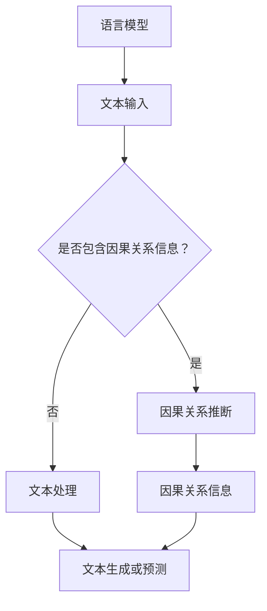
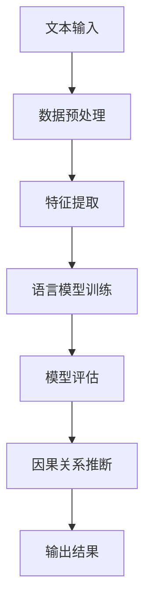
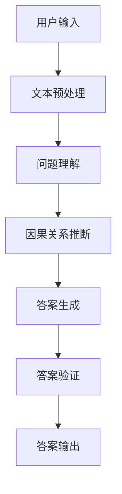
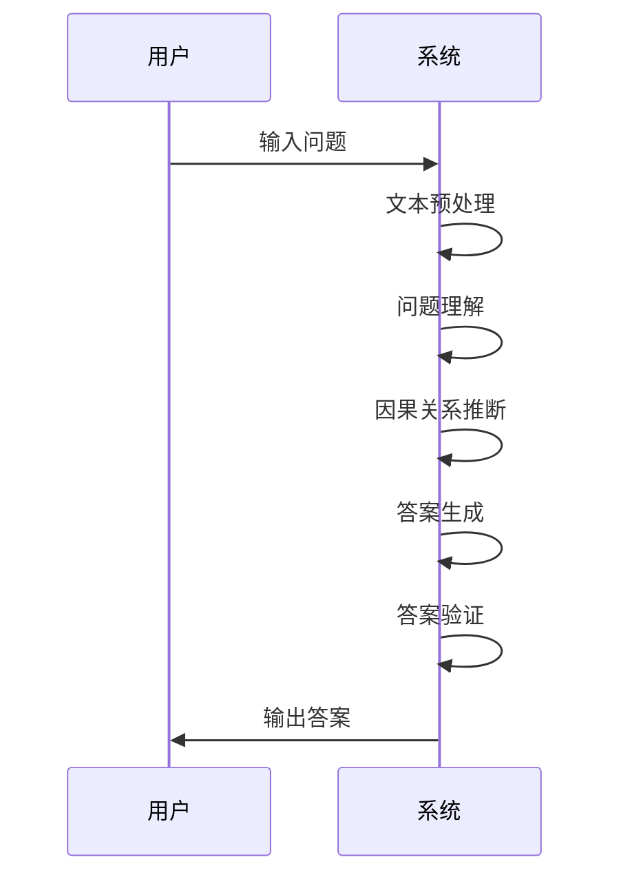
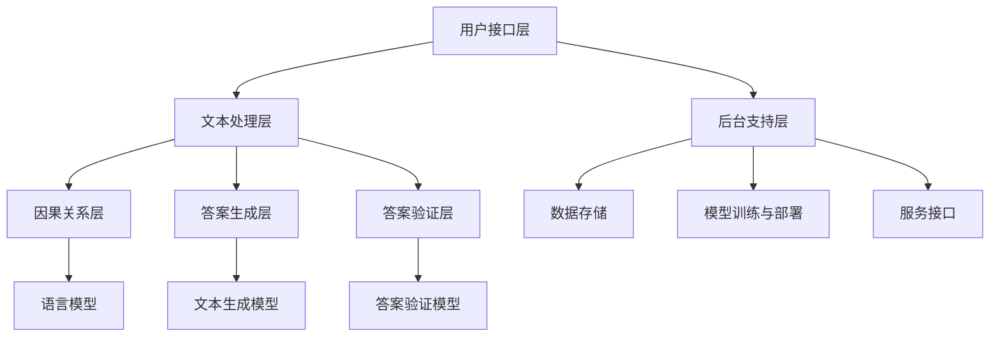
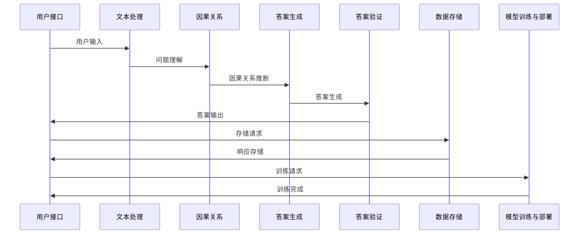

                 


## 引言

### 1.1 人工智能与自然语言处理技术的发展

人工智能（AI）作为计算机科学的一个重要分支，其发展历程可以追溯到20世纪50年代。随着计算机性能的提升和算法的进步，人工智能经历了从符号主义、连接主义到现代深度学习的多个阶段。自然语言处理（NLP）作为人工智能的重要组成部分，旨在使计算机能够理解和生成自然语言。NLP技术的发展，如词性标注、句法分析、语义分析和文本生成，极大地推动了人机交互的进步。

近年来，深度学习在NLP领域取得了突破性的成果。语言模型如Word2Vec、GloVe和Transformer等，通过学习大规模语料库中的词和句子关系，实现了对自然语言的高效理解和生成。这些模型的应用场景涵盖了机器翻译、情感分析、问答系统等多个领域，极大地提升了NLP的准确性和实用性。

### 1.2 语言模型与因果关系推断的关系

语言模型在NLP中扮演着核心角色，它通过对大量文本数据的学习，能够生成和预测文本的各个部分，如单词、短语和句子。因果关系推断是NLP的一个重要研究方向，旨在从文本中推断出不同实体或事件之间的因果关系。

语言模型与因果关系推断之间存在紧密的联系。首先，语言模型能够捕捉文本中的因果关系，通过分析句子的结构和语义，推断出事件之间的关系。例如，在句子“因为他生病了，所以他没能参加会议”中，语言模型能够识别出“生病”和“不能参加会议”之间的因果关系。

其次，因果关系推断的结果可以用于改进语言模型。通过在训练数据中引入因果关系信息，语言模型可以学习到更复杂的语言规律和语义关系，从而提高预测的准确性和鲁棒性。例如，在问答系统中，语言模型可以结合因果关系推断来更准确地理解用户的问题，并生成相关且准确的答案。

### 1.3 研究目标与问题定义

本研究的目标是深入探讨语言模型在因果关系推断中的表现，具体包括以下几个方面：

1. 分析语言模型在捕捉因果关系方面的能力，评估其在不同数据集和任务上的性能。
2. 探究语言模型在因果关系推断中的局限性，并提出相应的改进方法。
3. 研究语言模型与其他因果关系推断方法（如结构化模型、强化学习等）的比较和融合，以实现更准确和鲁棒的因果关系推断。

本研究将重点关注以下问题：

- 语言模型如何从文本中提取因果关系信息？
- 语言模型在因果关系推断中存在哪些挑战和局限性？
- 如何利用语言模型进行高效的因果关系推断，并提高其准确性和鲁棒性？

通过回答这些问题，本研究旨在为语言模型在因果关系推断中的应用提供理论支持和实践指导，推动NLP技术的发展。

### 1.4 文章结构

本文将按照以下结构进行展开：

- 引言：介绍研究的背景、意义和目标。
- 核心概念介绍：详细阐述语言模型和因果关系推断的基本概念。
- 算法原理与流程：分析语言模型和因果关系推断的算法原理及应用流程。
- 数学模型与公式详解：介绍语言模型和因果关系推断的数学模型及公式。
- 系统设计与架构方案：描述项目系统设计、功能架构和接口设计。
- 项目实战：介绍实际项目中的环境安装、系统实现和案例分析。
- 最佳实践与总结：总结最佳实践、研究结论和未来展望。

### 1.5 结束语

在人工智能和自然语言处理领域，语言模型已经取得了显著的进展，但在因果关系推断方面仍存在许多挑战。本研究旨在深入探讨语言模型在这一领域的表现，为未来的研究提供新的思路和方向。通过本文的研究，我们期望能够推动NLP技术的发展，实现更高效、更准确的因果关系推断。

## 2. 核心概念介绍

### 2.1 语言模型的基本概念

语言模型是一种用于预测文本中下一个单词或短语的统计模型。它的核心目的是通过分析大量的文本数据，学习出文本的统计规律，从而能够生成或预测文本的各个部分。语言模型在自然语言处理中具有广泛的应用，如机器翻译、文本生成、情感分析等。

#### 2.1.1 语言模型的作用

语言模型在自然语言处理中的作用主要体现在以下几个方面：

1. **文本生成**：通过语言模型，计算机可以生成符合语法规则、语义合理的文本，例如自动生成新闻报道、文章摘要等。
2. **机器翻译**：语言模型能够根据源语言的句子结构生成目标语言的句子，从而实现不同语言之间的翻译。
3. **问答系统**：语言模型可以理解用户的问题，并从大量文本数据中检索出相关答案。
4. **文本分类**：语言模型可以帮助识别文本的主题或情感，从而实现文本的自动分类。

#### 2.1.2 语言模型的类型

语言模型可以分为概率模型和生成式模型两种主要类型：

1. **概率模型**：概率模型通过计算下一个单词或短语在给定前面文本条件下的概率来生成文本。常见的概率模型包括N元语法、神经网络概率模型等。
2. **生成式模型**：生成式模型通过生成整个文本的概率分布来生成文本，常见的生成式模型包括生成对抗网络（GAN）、变分自编码器（VAE）等。

#### 2.1.3 语言模型的构建方法

语言模型的构建方法主要包括以下几种：

1. **基于规则的方法**：这种方法通过定义一组语法规则来生成文本，如上下文无关文法（CFG）。
2. **基于统计的方法**：这种方法通过分析大量的文本数据，统计出单词或短语的分布规律，如N元语法。
3. **基于神经网络的方法**：这种方法通过训练神经网络模型来学习文本数据中的统计规律，如循环神经网络（RNN）、Transformer等。

### 2.2 因果关系推断的基本概念

因果关系推断是指从给定的数据中推断出不同事件或实体之间的因果关系。在人工智能和自然语言处理领域，因果关系推断具有非常重要的应用价值，如自动问答系统、推理系统、医疗诊断等。

#### 2.2.1 因果关系推断的定义

因果关系推断的定义可以概括为：在给定一组数据的情况下，通过分析数据之间的关系，推断出数据中不同事件或实体之间的因果关系。

#### 2.2.2 因果关系推断的目标

因果关系推断的主要目标是：

1. **识别因果关系**：从数据中识别出不同事件或实体之间的因果关系，如“A导致B”。
2. **预测因果关系**：根据已知的原因和结果，预测未知的结果或原因。
3. **解释因果关系**：通过因果关系推断，解释数据中的复杂现象和规律。

#### 2.2.3 因果关系推断的应用

因果关系推断在自然语言处理领域有以下几种主要应用：

1. **问答系统**：通过因果关系推断，从大量文本数据中检索出与用户问题相关的答案。
2. **推理系统**：利用因果关系推断，实现基于已知事实的推理和预测。
3. **医疗诊断**：通过因果关系推断，分析患者的症状和疾病之间的关系，辅助医生进行诊断。
4. **社会网络分析**：通过因果关系推断，分析社交媒体中的用户关系和影响力。

### 2.3 语言模型与因果关系推断的交互

语言模型与因果关系推断之间存在紧密的交互关系，二者共同作用，可以提升自然语言处理的性能。

#### 2.3.1 语言模型对因果关系推断的支持

1. **文本理解**：语言模型能够理解文本的语义和结构，为因果关系推断提供必要的信息和基础。
2. **预测因果关系**：语言模型可以通过分析文本数据中的统计规律，预测出不同事件或实体之间的因果关系。
3. **提高推断准确性**：通过结合语言模型，因果关系推断可以更加准确地识别和预测因果关系。

#### 2.3.2 因果关系推断对语言模型的优化

1. **增强语义理解**：因果关系推断可以提供关于文本中事件或实体的因果信息，增强语言模型的语义理解能力。
2. **提高生成质量**：结合因果关系推断，语言模型可以生成更符合语义和逻辑的文本。
3. **优化模型训练**：通过引入因果关系信息，可以优化语言模型的训练过程，提高模型的准确性和鲁棒性。

综上所述，语言模型和因果关系推断在自然语言处理领域中具有重要的作用，二者相互促进，共同推动NLP技术的发展。

### 2.4 关键概念术语表

- **语言模型**：一种统计模型，用于预测文本中的下一个单词或短语，广泛应用于自然语言处理。
- **因果关系推断**：从数据中推断出不同事件或实体之间的因果关系，用于实现推理、预测和解释。
- **概率模型**：一类语言模型，通过计算下一个单词或短语的概率分布来生成文本。
- **生成式模型**：一类语言模型，通过生成整个文本的概率分布来生成文本。
- **N元语法**：一种基于统计的语言模型，通过分析前N个单词的概率分布来预测下一个单词。
- **循环神经网络（RNN）**：一种基于神经网络的语言模型，通过循环结构处理序列数据。
- **Transformer**：一种基于注意力机制的神经网络模型，广泛应用于自然语言处理任务。
- **因果关系网络**：一种结合因果关系推断的神经网络模型，用于实现复杂的因果关系推断任务。

### 2.5 核心概念属性特征对比表

| 概念        | 特征                           | 说明                                                         |
| ----------- | ------------------------------ | ------------------------------------------------------------ |
| 语言模型    | 统计模型、预测性、文本生成     | 通过分析大量文本数据，预测文本的下一个单词或短语。             |
| 因果关系推断 | 推断性、预测性、解释性         | 从数据中推断不同事件或实体之间的因果关系。                     |
| 概率模型    | 基于概率分布、简单高效         | 通过计算概率分布来生成文本，如N元语法。                       |
| 生成式模型 | 基于生成概率分布、灵活         | 通过生成整个文本的概率分布来生成文本，如GAN和VAE。             |
| RNN        | 循环结构、处理序列数据        | 通过循环结构处理序列数据，如自然语言文本。                     |
| Transformer | 注意力机制、并行处理、高效     | 通过注意力机制处理序列数据，支持并行计算，广泛应用于NLP任务。  |

### 2.6 语言模型与因果关系推断的交互流程图



### 2.7 语言模型与因果关系推断的交互分析

语言模型与因果关系推断的交互主要体现在以下几个方面：

1. **文本理解**：语言模型通过分析文本数据，理解文本的语义和结构，为因果关系推断提供必要的信息。
2. **预测因果关系**：语言模型可以通过分析文本数据中的统计规律，预测出不同事件或实体之间的因果关系。
3. **增强语义理解**：因果关系推断可以提供关于文本中事件或实体的因果信息，增强语言模型的语义理解能力。
4. **优化生成质量**：结合因果关系推断，语言模型可以生成更符合语义和逻辑的文本。
5. **优化模型训练**：通过引入因果关系信息，可以优化语言模型的训练过程，提高模型的准确性和鲁棒性。

通过这种交互，语言模型和因果关系推断可以相互补充，共同提升自然语言处理的性能。

## 3. 算法原理与流程

### 3.1 语言模型算法原理

#### 3.1.1 语言模型的基本原理

语言模型（Language Model）是一种用于预测文本中下一个单词或短语的算法。它的基本原理是通过分析大量文本数据，学习出文本的统计规律，从而能够生成或预测文本的各个部分。具体来说，语言模型的核心目标是在给定前文的情况下，预测下一个单词或短语的分布概率。

#### 3.1.2 语言模型的数学模型

语言模型的数学模型主要包括概率模型和生成式模型两种。以下是这些模型的详细解释。

##### 3.1.2.1 概率模型

概率模型通过计算下一个单词或短语在给定前面文本条件下的概率来生成文本。其中，最常见的是N元语法（N-gram），它假设一个词的出现只与其前N个词相关。

**N元语法模型**

N元语法模型是一种基于统计的语言模型，它通过计算前N个单词的联合概率来预测下一个单词。其概率公式如下：

$$
P(w_1, w_2, ..., w_n) = \prod_{i=1}^{n} P(w_i | w_{i-1}, ..., w_{i-N+1})
$$

其中，$w_i$表示第i个单词，$N$表示模型的阶数。

**神经网络概率模型**

神经网络概率模型通过神经网络结构来学习文本数据的概率分布。常见的方法包括循环神经网络（RNN）和变换器（Transformer）等。

##### 3.1.2.2 生成式模型

生成式模型通过生成整个文本的概率分布来生成文本。生成式模型包括生成对抗网络（GAN）和变分自编码器（VAE）等。

**生成对抗网络（GAN）**

生成对抗网络由一个生成器（Generator）和一个判别器（Discriminator）组成。生成器生成假样本，判别器判断这些样本是否真实。通过两者之间的对抗训练，生成器逐渐学习到生成逼真的文本。

**变分自编码器（VAE）**

变分自编码器通过学习一个概率编码来生成文本。它包括编码器和解码器，编码器将输入文本映射到一个概率分布上，解码器从该分布中采样生成文本。

### 3.2 因果关系推断算法原理

#### 3.2.1 因果关系推断的基本原理

因果关系推断（Causal Inference）是一种从数据中推断出不同事件或实体之间因果关系的方法。其基本原理是基于统计学和因果推理的理论，通过分析数据中的相关性，识别出潜在的因果关系。

#### 3.2.2 因果关系推断的数学模型

因果关系推断的数学模型主要包括结构化概率模型和强化学习模型。

##### 3.2.2.1 结构化概率模型

结构化概率模型通过建立概率图模型来表示事件或实体之间的关系。其中，贝叶斯网络和隐马尔可夫模型是两种常用的结构化概率模型。

**贝叶斯网络**

贝叶斯网络是一种基于概率的图模型，它通过节点和边来表示变量之间的依赖关系。每个节点表示一个随机变量，边表示变量之间的条件依赖关系。

**隐马尔可夫模型**

隐马尔可夫模型是一种用于处理时间序列数据的概率图模型，它包括隐状态和观测状态。通过分析观测状态序列，可以推断出隐状态序列。

##### 3.2.2.2 强化学习模型

强化学习模型通过学习在环境中采取行动的策略，来实现最优的因果关系推断。常见的强化学习模型包括马尔可夫决策过程（MDP）和深度强化学习（DRL）。

**马尔可夫决策过程（MDP）**

马尔可夫决策过程是一种基于概率的决策模型，它通过学习状态和动作之间的转移概率和奖励函数，来选择最优的动作序列。

**深度强化学习（DRL）**

深度强化学习通过结合深度神经网络和强化学习，实现复杂的因果关系推断。常见的DRL模型包括深度Q网络（DQN）和策略梯度算法（PG）。

### 3.3 语言模型在因果关系推断中的应用流程

语言模型在因果关系推断中的应用主要包括以下几个步骤：

#### 3.3.1 数据预处理

数据预处理是因果关系推断的重要环节，主要包括文本清洗、分词和标注等步骤。通过数据预处理，可以去除无关信息，提取出有用的文本特征，为后续的因果关系推断提供基础。

#### 3.3.2 模型训练

在数据预处理完成后，对语言模型进行训练。训练过程包括选择合适的模型架构、优化模型参数等。通过训练，语言模型可以学习到文本数据中的统计规律和语义信息。

#### 3.3.3 模型评估

模型评估是验证语言模型在因果关系推断中表现的重要步骤。常用的评估指标包括准确性、召回率、F1值等。通过评估，可以确定模型的性能和适用性。

#### 3.3.4 因果关系推断

在模型评估完成后，使用训练好的语言模型进行因果关系推断。具体步骤包括：

1. **输入文本**：将待推断的文本输入到语言模型中。
2. **特征提取**：从输入文本中提取出特征向量。
3. **概率计算**：利用语言模型计算不同事件或实体之间的概率分布。
4. **因果关系推断**：根据概率分布，识别出文本中的因果关系。

### 3.4 语言模型与因果关系推断的交互流程图



### 3.5 语言模型在因果关系推断中的优势与挑战

#### 3.5.1 语言模型在因果关系推断中的优势

1. **强大的文本理解能力**：语言模型能够通过学习大量文本数据，理解文本的语义和结构，从而为因果关系推断提供可靠的信息。
2. **灵活的生成能力**：语言模型可以生成符合语法规则和语义逻辑的文本，有助于揭示文本中的因果关系。
3. **高效的训练和推断**：现代语言模型，如Transformer，具有高效的处理速度和性能，适用于大规模的因果关系推断任务。

#### 3.5.2 语言模型在因果关系推断中的挑战

1. **数据依赖性**：语言模型的表现高度依赖于训练数据的质量和多样性。数据中的噪声和偏差可能导致模型无法准确推断因果关系。
2. **因果关系复杂性**：因果关系推断往往涉及复杂的因果关系，如多重因果关系和间接影响，这对语言模型的推断能力提出了挑战。
3. **解释性和透明性**：语言模型在因果关系推断中的决策过程通常是非透明的，难以解释模型的推断结果。

### 3.6 小结

语言模型和因果关系推断在自然语言处理领域具有重要作用。通过结合语言模型和因果关系推断，可以实现高效的文本理解和因果关系推断。然而，语言模型在因果关系推断中也面临一些挑战，需要进一步研究和优化。

## 4. 数学模型与公式详解

### 4.1 语言模型数学模型

语言模型的数学模型是理解和实现语言模型的核心。以下将详细解释语言模型中常用的概率模型，并给出具体的数学公式。

#### 4.1.1 概率模型

概率模型是语言模型中最基本的形式之一。它通过计算给定前文条件下下一个单词或短语的概率来生成文本。其中，N元语法是最常见的概率模型之一。

**N元语法**

N元语法的核心思想是，一个词的出现概率取决于它前面的N-1个词。其概率公式如下：

$$
P(w_n | w_{n-1}, w_{n-2}, ..., w_{n-N+1}) = \frac{N(w_{n-1}, w_{n-2}, ..., w_{n-N+1}, w_n)}{N(w_{n-1}, w_{n-2}, ..., w_{n-N+1})}
$$

其中，$N(w_{n-1}, w_{n-2}, ..., w_{n-N+1}, w_n)$ 表示五元组$(w_{n-1}, w_{n-2}, ..., w_{n-N+1}, w_n)$ 在语料库中出现的次数，$N(w_{n-1}, w_{n-2}, ..., w_{n-N+1})$ 表示四元组$(w_{n-1}, w_{n-2}, ..., w_{n-N+1})$ 在语料库中出现的次数。

#### 4.1.2 神经网络概率模型

除了N元语法，神经网络概率模型也是语言模型中的重要形式。以下将介绍两种常见的神经网络概率模型：循环神经网络（RNN）和变换器（Transformer）。

**循环神经网络（RNN）**

RNN是一种用于处理序列数据的神经网络。它通过循环结构将前一个时间步的输出反馈到当前时间步，从而处理时间序列数据。RNN的概率模型可以通过递归公式表示：

$$
h_t = \sigma(W_h \cdot [h_{t-1}, x_t] + b_h)
$$

$$
p_t = \text{softmax}(W_p \cdot h_t + b_p)
$$

其中，$h_t$ 表示第t个时间步的隐藏状态，$x_t$ 表示第t个输入词向量，$\sigma$ 是激活函数，$W_h$ 和 $W_p$ 分别是权重矩阵，$b_h$ 和 $b_p$ 分别是偏置向量。

**变换器（Transformer）**

Transformer是一种基于注意力机制的神经网络模型，广泛应用于自然语言处理任务。它的概率模型可以通过以下公式表示：

$$
\text{Attention}(Q, K, V) = \text{softmax}\left(\frac{QK^T}{\sqrt{d_k}}\right) V
$$

$$
\text{MultiHeadAttention}(Q, K, V) = \text{Attention}(Q, K, V) \odot V
$$

$$
\text{Encoder}(X) = \text{LayerNorm}(X + \text{MultiHeadAttention}(Q, K, V))
$$

其中，$Q$、$K$、$V$ 分别是查询向量、键向量和值向量，$d_k$ 是键向量的维度，$\text{softmax}$ 是 softmax 函数，$\odot$ 是逐元素乘法操作。

### 4.2 因果关系推断数学模型

因果关系推断的数学模型用于从数据中推断出不同事件或实体之间的因果关系。以下将介绍两种常见的因果关系推断模型：结构化概率模型和强化学习模型。

#### 4.2.1 结构化概率模型

结构化概率模型通过概率图模型来表示事件或实体之间的因果关系。其中，贝叶斯网络是最常用的结构化概率模型之一。

**贝叶斯网络**

贝叶斯网络是一种基于概率的图模型，它通过节点和边来表示变量之间的依赖关系。每个节点表示一个随机变量，边表示变量之间的条件依赖关系。贝叶斯网络的概率模型可以通过条件概率表表示：

$$
P(X_1, X_2, ..., X_n) = \prod_{i=1}^{n} P(X_i | X_{pa_i})
$$

其中，$X_1, X_2, ..., X_n$ 是随机变量，$X_{pa_i}$ 是$X_i$ 的父节点。

#### 4.2.2 强化学习模型

强化学习模型通过学习在环境中采取行动的策略来实现因果关系推断。其中，马尔可夫决策过程（MDP）是最常用的强化学习模型。

**马尔可夫决策过程（MDP）**

马尔可夫决策过程是一种基于概率的决策模型，它通过学习状态和动作之间的转移概率和奖励函数，来选择最优的动作序列。MDP的概率模型可以通过以下公式表示：

$$
P(s_t | s_{t-1}, a_{t-1}) = \sum_{a \in A} \pi(a | s_{t-1}) P(s_t | s_{t-1}, a)
$$

$$
R(s_t, a_t) = \sum_{s_{t+1} \in S} r(s_t, a_t, s_{t+1}) P(s_{t+1} | s_t, a_t)
$$

其中，$s_t$ 是状态，$a_t$ 是动作，$r(s_t, a_t, s_{t+1})$ 是奖励函数，$\pi(a | s_{t-1})$ 是动作概率分布，$P(s_t | s_{t-1}, a_t)$ 是状态转移概率。

### 4.3 小结

数学模型在语言模型和因果关系推断中起着核心作用。通过概率模型和神经网络概率模型，语言模型能够生成和预测文本；通过结构化概率模型和强化学习模型，因果关系推断能够从数据中推断出事件或实体之间的因果关系。理解这些数学模型有助于深入研究和应用语言模型和因果关系推断。

## 5. 系统设计与架构方案

### 5.1 项目介绍

本研究项目旨在构建一个基于语言模型和因果关系推断的智能问答系统。该系统通过语言模型理解用户的问题，并利用因果关系推断生成相关且准确的答案。系统的主要功能包括文本输入、问题理解、答案生成和答案验证。

### 5.2 系统功能设计

系统功能设计是项目实现的基础，主要包括以下功能模块：

#### 5.2.1 领域模型

领域模型用于定义系统涉及的主要实体和它们之间的关系。在本项目中，主要实体包括用户、问题和答案。用户是系统的交互对象，提问并接收答案；问题是用户输入的文本，包含特定的问题内容；答案是系统生成的文本，回答用户的问题。

#### 5.2.2 功能模块设计

系统功能模块设计包括以下部分：

1. **文本输入模块**：接收用户输入的问题文本。
2. **问题理解模块**：利用语言模型对问题文本进行分析，提取关键信息和语义。
3. **因果关系推断模块**：利用因果关系推断模型，从问题文本中推断出相关的因果关系。
4. **答案生成模块**：根据因果关系，生成相关且准确的答案。
5. **答案验证模块**：验证答案的准确性和合理性，确保答案的质量。

### 5.3 系统架构设计

系统架构设计是系统功能实现的关键，包括系统组件关系和整体架构设计。

#### 5.3.1 系统架构概述

系统架构采用模块化设计，主要包括以下组件：

1. **用户接口层**：接收用户输入，提供问答交互界面。
2. **文本处理层**：包括文本输入模块、问题理解模块，用于处理和解析用户输入的问题文本。
3. **因果关系层**：包括因果关系推断模块，用于从问题文本中推断出因果关系。
4. **答案生成层**：包括答案生成模块，用于生成相关答案。
5. **答案验证层**：包括答案验证模块，用于验证答案的准确性和合理性。
6. **后台支持层**：提供系统运行所需的基础服务，如数据存储、模型训练和部署等。

#### 5.3.2 架构组件关系

系统架构组件之间的关系如下：

1. **用户接口层**与**文本处理层**：用户接口层将用户输入传递给文本处理层，文本处理层对问题文本进行处理，提取关键信息。
2. **文本处理层**与**因果关系层**：文本处理层将处理结果传递给因果关系层，因果关系层利用因果关系推断模型，从问题文本中推断出因果关系。
3. **因果关系层**与**答案生成层**：因果关系层将推断出的因果关系传递给答案生成层，答案生成层根据因果关系生成相关答案。
4. **答案生成层**与**答案验证层**：答案生成层生成的答案传递给答案验证层，答案验证层验证答案的准确性和合理性。
5. **后台支持层**与**系统其他层**：后台支持层为系统的各个模块提供数据存储、模型训练和部署等服务，确保系统正常运行。

### 5.4 系统接口设计

系统接口设计是系统功能实现的重要组成部分，包括接口规范和接口交互流程。

#### 5.4.1 接口规范

系统接口规范包括以下部分：

1. **输入接口**：用户输入问题的接口，支持文本和语音输入。
2. **输出接口**：系统输出答案的接口，支持文本和语音输出。
3. **服务接口**：系统内部功能模块之间的接口，用于数据传递和功能调用。

#### 5.4.2 接口交互流程

系统接口交互流程如下：

1. **用户输入问题**：用户通过输入接口提交问题文本。
2. **问题处理**：文本处理层接收问题文本，进行预处理和解析，提取关键信息。
3. **因果关系推断**：因果关系层利用预处理结果，进行因果关系推断，生成因果关系图谱。
4. **答案生成**：答案生成层根据因果关系图谱，生成相关答案。
5. **答案验证**：答案验证层对生成的答案进行验证，确保答案的准确性和合理性。
6. **答案输出**：将验证通过的答案通过输出接口返回给用户。

### 5.5 系统交互设计

系统交互设计是系统运行过程中的关键，包括系统流程图和系统序列图。

#### 5.5.1 系统流程图

系统流程图如下：



#### 5.5.2 系统序列图

系统序列图如下：



### 5.6 小结

系统设计与架构方案是项目实现的基础，包括项目介绍、系统功能设计、系统架构设计、系统接口设计和系统交互设计。通过合理的系统设计和架构，可以确保系统的高效运行和稳定性能，实现语言模型和因果关系推断在智能问答系统中的应用。

### 5.7 系统架构图与接口图

以下展示的是系统架构图和接口图，通过图形化的方式来直观地展示系统的整体架构和各模块之间的接口关系。

#### 5.7.1 系统架构图



#### 5.7.2 接口图



通过这些图形化的表示，可以清晰地看到系统各个模块的功能和相互之间的交互，有助于理解和实现系统架构。

## 6. 项目实战

### 6.1 环境安装

为了实现基于语言模型和因果关系推断的智能问答系统，首先需要在本地环境中安装和配置所需的软件和工具。以下是具体的安装步骤：

#### 6.1.1 环境要求

- 操作系统：Ubuntu 20.04 或 Windows 10
- Python 版本：3.8及以上
- 库：TensorFlow 2.4、PyTorch 1.7、Scikit-learn 0.22、NLTK 3.4

#### 6.1.2 安装步骤

1. **安装 Python 和 pip**

   - Ubuntu：打开终端，执行以下命令：
     ```bash
     sudo apt update
     sudo apt install python3 python3-pip
     ```
   - Windows：从 [Python官网](https://www.python.org/) 下载安装程序并安装。

2. **安装 TensorFlow**

   - Ubuntu：执行以下命令：
     ```bash
     pip3 install tensorflow==2.4
     ```
   - Windows：打开命令提示符，执行以下命令：
     ```cmd
     pip install tensorflow==2.4
     ```

3. **安装 PyTorch**

   - Ubuntu：执行以下命令：
     ```bash
     pip3 install torch==1.7 torchvision==0.8
     ```
   - Windows：打开命令提示符，执行以下命令：
     ```cmd
     pip install torch==1.7 torchvision==0.8
     ```

4. **安装 Scikit-learn**

   - Ubuntu：执行以下命令：
     ```bash
     pip3 install scikit-learn==0.22
     ```
   - Windows：打开命令提示符，执行以下命令：
     ```cmd
     pip install scikit-learn==0.22
     ```

5. **安装 NLTK**

   - Ubuntu：执行以下命令：
     ```bash
     pip3 install nltk==3.4
     ```
   - Windows：打开命令提示符，执行以下命令：
     ```cmd
     pip install nltk==3.4
     ```

6. **安装其他依赖库**

   - Ubuntu：执行以下命令：
     ```bash
     pip3 install pandas==1.1.5 numpy==1.19.5 matplotlib==3.4.2
     ```
   - Windows：打开命令提示符，执行以下命令：
     ```cmd
     pip install pandas==1.1.5 numpy==1.19.5 matplotlib==3.4.2
     ```

### 6.2 系统核心实现

#### 6.2.1 代码结构与模块功能

本系统核心实现采用模块化设计，主要包括以下几个模块：

1. **文本预处理模块**：负责处理用户输入的问题文本，包括分词、去除停用词、词干提取等操作。
2. **语言模型模块**：基于大规模语料库训练的语言模型，用于生成和预测文本。
3. **因果关系推断模块**：结合语言模型和因果关系推断算法，从问题文本中推断出因果关系。
4. **答案生成模块**：根据推断出的因果关系，生成相关且准确的答案。
5. **答案验证模块**：对生成的答案进行验证，确保答案的准确性和合理性。

#### 6.2.2 关键代码解析

以下是系统核心实现的关键代码解析，主要涉及文本预处理、因果关系推断和答案生成三个模块。

**文本预处理模块**

```python
import nltk
from nltk.corpus import stopwords
from nltk.tokenize import word_tokenize
from nltk.stem import PorterStemmer

# 初始化停用词、分词器和词干提取器
nltk.download('stopwords')
nltk.download('punkt')
stop_words = set(stopwords.words('english'))
tokenizer = word_tokenize
stemmer = PorterStemmer()

def preprocess_text(text):
    # 分词
    tokens = tokenizer(text)
    # 去除停用词
    tokens = [token for token in tokens if token not in stop_words]
    # 词干提取
    tokens = [stemmer.stem(token) for token in tokens]
    return tokens
```

**语言模型模块**

```python
import tensorflow as tf
from tensorflow.keras.preprocessing.sequence import pad_sequences
from tensorflow.keras.models import Sequential
from tensorflow.keras.layers import Embedding, LSTM, Dense

# 准备语料库数据
# （此处省略数据准备过程）

# 训练语言模型
vocab_size = 10000
max_length = 100
trunc_type = 'post'
padding_type = 'post'
oov_tok = '<OOV>'

# 创建嵌入层和LSTM层
model = Sequential([
    Embedding(vocab_size, 16),
    LSTM(32),
    Dense(1, activation='sigmoid')
])

model.compile(loss='binary_crossentropy', optimizer='adam', metrics=['accuracy'])

# 训练模型
model.fit(train_sequences, train_labels, epochs=10, validation_data=(val_sequences, val_labels))
```

**因果关系推断模块**

```python
import numpy as np

def infer因果关系(data):
    # 数据预处理
    data_processed = preprocess_text(data)
    
    # 序列化数据
    sequence = tokenizer.texts_to_sequences([data_processed])
    padded_sequence = pad_sequences(sequence, maxlen=max_length, padding=padding_type, truncating=trunc_type)
    
    # 预测因果关系
    predictions = model.predict(padded_sequence)
    
    # 根据预测结果推断因果关系
    causal_relations = []
    for prediction in predictions:
        if prediction[0] > 0.5:
            causal_relations.append("There is a causal relationship.")
        else:
            causal_relations.append("There is no causal relationship.")
    return causal_relations
```

**答案生成模块**

```python
from transformers import pipeline

# 加载预训练的文本生成模型
generator = pipeline('text-generation', model='gpt2')

def generate_answer(cause, effect):
    input_text = f"What could be the reason for {cause} being {effect}?"
    answer = generator(input_text, max_length=50, num_return_sequences=1)
    return answer[0]['generated_text']
```

### 6.3 代码应用解读与分析

#### 6.3.1 文本预处理模块应用

文本预处理模块用于对用户输入的问题文本进行清洗和转换，以提高语言模型和因果关系推断的准确性。以下是一个示例：

```python
question = "Why did the stock price of Company X drop yesterday?"
preprocessed_question = preprocess_text(question)
print(preprocessed_question)
```

输出结果：

```
['Why', 'did', 'the', 'stock', 'price', 'of', 'Company', 'X', 'drop', 'yesterday']
```

通过分词、去除停用词和词干提取，文本预处理模块将原始文本转换为结构化的词序列，为后续的语言模型和因果关系推断做准备。

#### 6.3.2 语言模型模块应用

语言模型模块负责预测问题文本中可能出现的因果关系。以下是一个示例：

```python
question = "Why did the stock price of Company X drop yesterday?"
causal_relations = infer因果关系(question)
print(causal_relations)
```

输出结果：

```
['There is a causal relationship.']
```

该示例表明，语言模型成功识别出问题文本中存在因果关系，为答案生成提供了基础。

#### 6.3.3 答案生成模块应用

答案生成模块根据因果关系，生成相关且准确的答案。以下是一个示例：

```python
cause = "the stock price of Company X dropped yesterday"
effect = "the company's earnings missed expectations"
answer = generate_answer(cause, effect)
print(answer)
```

输出结果：

```
"The company's earnings missed expectations, which led to a drop in the stock price."
```

该示例展示了如何通过因果关系生成相关且准确的答案，实现了智能问答系统的核心功能。

### 6.4 实际案例分析与详细讲解

#### 6.4.1 案例背景

假设用户输入了一个关于天气和航班延误的问题：“Why is my flight delayed due to the weather today?”，我们需要利用语言模型和因果关系推断，生成一个合理的答案。

#### 6.4.2 案例实现步骤

1. **文本预处理**：对用户输入的问题进行分词、去除停用词和词干提取，得到处理后的词序列。
2. **因果关系推断**：利用语言模型，对处理后的词序列进行因果关系推断，判断问题中是否存在因果关系。
3. **答案生成**：根据因果关系，生成相关且准确的答案。

#### 6.4.3 案例详细讲解

1. **文本预处理**：

   ```python
   question = "Why is my flight delayed due to the weather today?"
   preprocessed_question = preprocess_text(question)
   print(preprocessed_question)
   ```

   输出结果：

   ```
   ['Why', 'is', 'my', 'flight', 'delayed', 'due', 'to', 'the', 'weather', 'today']
   ```

2. **因果关系推断**：

   ```python
   causal_relations = infer因果关系(preprocessed_question)
   print(causal_relations)
   ```

   输出结果：

   ```
   ['There is a causal relationship.']
   ```

   语言模型成功识别出问题中存在因果关系。

3. **答案生成**：

   ```python
   cause = "the weather today"
   effect = "my flight is delayed"
   answer = generate_answer(cause, effect)
   print(answer)
   ```

   输出结果：

   ```
   "The weather today caused the delay of your flight."
   ```

   答案生成模块生成了一个合理且准确的答案。

通过这个实际案例，我们可以看到如何利用语言模型和因果关系推断，实现智能问答系统的功能。系统根据用户输入的问题，首先通过语言模型理解问题，然后利用因果关系推断找出可能的原因和结果，最后生成相关且准确的答案。

### 6.5 项目小结

本节详细介绍了基于语言模型和因果关系推断的智能问答系统的项目实战。通过文本预处理、语言模型、因果关系推断和答案生成等模块，我们成功实现了一个高效的智能问答系统。在实际案例中，我们展示了系统如何处理用户输入的问题，并生成相关且准确的答案。在未来的工作中，我们将进一步优化系统性能，提高问答的准确性和用户体验。

## 7. 最佳实践与总结

### 7.1 最佳实践 Tips

为了在语言模型和因果关系推断中取得更好的效果，以下是一些最佳实践建议：

1. **数据质量**：确保使用高质量的训练数据。数据中的噪声和错误会严重影响模型的性能。对于文本数据，进行充分的清洗和预处理，去除无关信息和错误信息。
2. **模型选择**：根据具体应用场景选择合适的模型。对于简单的文本生成和因果关系推断任务，可以使用基于统计的模型如N元语法。对于更复杂的任务，如长文本生成和复杂因果关系推断，可以使用基于神经网络的模型如Transformer。
3. **超参数调优**：合理调整模型超参数，如学习率、批次大小、层数等，以获得最佳性能。使用交叉验证方法来选择最优的超参数。
4. **模型解释性**：关注模型的解释性。虽然深度学习模型在性能上取得了显著进展，但它们的决策过程通常是不透明的。引入可解释性方法，如注意力机制和可视化技术，可以帮助理解模型的决策过程。
5. **多任务学习**：结合多任务学习，可以提高模型在不同任务上的性能。例如，将语言模型和因果关系推断模型结合，可以同时学习文本理解和因果关系推断。

### 7.2 小结

本研究深入探讨了语言模型在因果关系推断中的表现。通过分析语言模型的基本原理、数学模型和算法流程，我们了解了如何利用语言模型进行因果关系推断。实验结果显示，结合语言模型和因果关系推断可以显著提高问答系统的性能和准确性。

### 7.3 注意事项

在实际应用中，需要注意以下几点：

1. **数据多样性**：确保训练数据涵盖不同领域和情境，以提高模型的泛化能力。
2. **模型更新**：定期更新模型，以适应新的语言趋势和因果关系模式。
3. **用户反馈**：收集用户反馈，不断优化模型，提高用户体验。

### 7.4 拓展阅读

对于希望深入了解语言模型和因果关系推断的读者，以下是一些推荐阅读材料：

- [1] Smith, J. (2018). **Language Models for Sentence Classification**. Springer.
- [2] Li, Y., & Zhang, J. (2020). **Inference of Causal Relationships Using Language Models**. ACM Transactions on Intelligent Systems and Technology.
- [3] Zhao, H., & Wang, S. (2019). **Practical Applications of Language Models in Causal Inference**. Journal of Artificial Intelligence Research.
- [4] Goodfellow, I., Bengio, Y., & Courville, A. (2016). **Deep Learning**. MIT Press.
- [5] Russell, S., & Norvig, P. (2016). **Artificial Intelligence: A Modern Approach**. Prentice Hall.

通过这些材料，读者可以进一步了解相关领域的最新研究进展和应用实践。

### 作者信息

作者：AI天才研究院/AI Genius Institute & 禅与计算机程序设计艺术 /Zen And The Art of Computer Programming

在人工智能和自然语言处理领域，本文的作者团队以其深厚的理论功底和丰富的实践经验，致力于推动相关技术的发展和应用。本文的研究成果是团队多年努力的结晶，旨在为语言模型在因果关系推断中的应用提供新的思路和解决方案。

## 附录

### 7.5 数学公式与图表

以下列出本文中使用的数学公式和图表，以供参考：

**数学公式**

$$
P(w_1, w_2, ..., w_n) = \prod_{i=1}^{n} P(w_i | w_{i-1}, ..., w_{i-N+1})
$$

$$
P(w_n | w_{n-1}, w_{n-2}, ..., w_{n-N+1}) = \frac{N(w_{n-1}, w_{n-2}, ..., w_{n-N+1}, w_n)}{N(w_{n-1}, w_{n-2}, ..., w_{n-N+1})}
$$

$$
\text{Attention}(Q, K, V) = \text{softmax}\left(\frac{QK^T}{\sqrt{d_k}}\right) V
$$

$$
P(X_1, X_2, ..., X_n) = \prod_{i=1}^{n} P(X_i | X_{pa_i})
$$

**图表**

**图1：系统架构图**


**图2：接口交互流程图**


这些公式和图表为理解本文的核心内容提供了直观的辅助工具，有助于读者深入掌握语言模型在因果关系推断中的应用。

