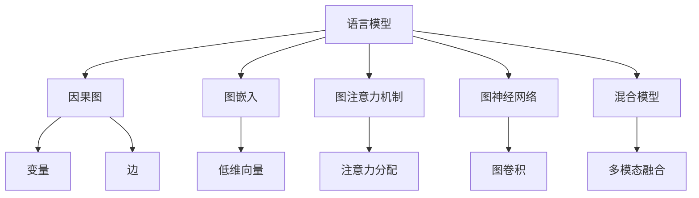
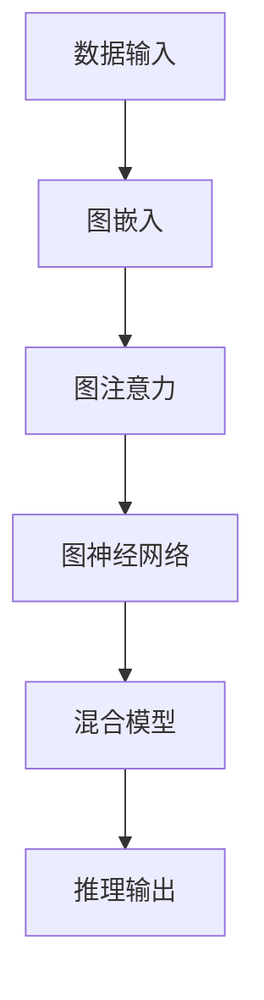

                 


# 语言模型在因果图构建与推理优化中的能力

关键词：语言模型、因果图、推理优化、图结构学习

摘要：本文将从语言模型的背景介绍、因果图的概述、语言模型在因果图构建和推理优化中的应用，以及面临的挑战和未来发展方向等方面，详细探讨语言模型在因果图领域中的能力。

## 1. 语言模型背景

### 1.1.1 语言模型概述

语言模型（Language Model，LM）是自然语言处理（Natural Language Processing，NLP）领域的一种核心技术，旨在理解和生成自然语言。语言模型的基本任务是预测下一个单词或词组，给定前面的文本上下文。这种预测能力使语言模型在许多实际应用中发挥了重要作用，例如机器翻译、文本摘要、问答系统等。

#### 1.1.2 语言模型的发展

语言模型的发展经历了多个阶段，从最初的统计模型（如n-gram模型）到基于神经网络的模型（如循环神经网络LSTM、GRU），再到近年来兴起的基于注意力机制的Transformer模型（如BERT、GPT）。这些模型在语言理解、文本生成等任务上取得了显著的性能提升。

#### 1.1.3 语言模型的挑战

尽管语言模型在NLP领域取得了巨大成功，但仍面临一些挑战。首先，语言模型的解释性较差，难以理解其预测依据。其次，语言模型可能受到训练数据偏差的影响，导致生成的不公平或偏见。此外，训练和部署大型语言模型需要巨大的计算资源和存储空间。

### 2. 因果图背景

#### 2.1.1 因果图概述

因果图（Causal Graph）是一种用于表示变量之间因果关系的图形结构。因果图由节点和边组成，节点表示变量，边表示变量之间的因果关系。因果图在因果推断、预测和决策等领域具有广泛的应用。

#### 2.1.2 因果图的性质

因果图的性质主要包括以下几点：

1. **因果关系的传递性**：如果变量X是变量Y的因，变量Y是变量Z的因，则变量X也是变量Z的因。

2. **因果独立性**：给定某个变量的条件下，其他变量之间的因果关系会被消除。

3. **因果标识**：因果图中的每个节点都对应一个唯一的标识，表示该节点的类型和位置。

### 3. 语言模型在因果图构建中的应用

#### 3.1.1 语言模型用于因果图表示学习

语言模型可以用于学习变量之间的因果关系，从而构建因果图。一种常见的方法是基于图结构学习（Graph Learning）技术，如图神经网络（Graph Neural Networks，GNN）。GNN可以将语言模型与因果图结合，通过学习变量之间的依赖关系来构建因果图。

#### 3.1.2 语言模型用于因果图推理优化

在构建因果图后，语言模型可以用于优化因果图的推理过程。例如，语言模型可以用于识别变量之间的关键路径，从而提高推理效率。此外，语言模型还可以用于生成新的因果假设，以验证和优化现有因果图的结构。

### 4. 语言模型在因果图构建与推理优化中的挑战

#### 4.1.1 解释性问题

尽管语言模型在因果图构建和推理优化中表现出色，但其解释性问题仍然存在。在构建因果图时，语言模型可能无法准确解释变量之间的因果关系。在推理优化过程中，语言模型生成的推理路径可能缺乏透明性，难以理解。

#### 4.1.2 数据偏差问题

语言模型在训练过程中可能受到数据偏差的影响，导致构建的因果图存在偏差。这种偏差可能导致推理结果不准确，甚至产生误导性结论。

#### 4.1.3 计算成本问题

语言模型在构建和推理过程中需要大量的计算资源。对于大规模因果图，语言模型的计算成本可能成为瓶颈，影响其应用效果。

### 5. 未来发展方向

#### 5.1.1 提高解释性

未来研究可以关注提高语言模型在因果图构建和推理优化中的解释性。例如，通过结合可解释性模型（如LIME、SHAP）来解释语言模型的决策过程。

#### 5.1.2 减少数据偏差

为了减少数据偏差，未来研究可以探索无偏数据采样技术和对抗性训练方法，以减轻语言模型在因果图构建中的偏差。

#### 5.1.3 优化计算效率

为了提高语言模型在因果图应用中的计算效率，未来研究可以关注优化算法设计和硬件加速技术，以降低计算成本。

## 6. 总结

本文探讨了语言模型在因果图构建与推理优化中的能力。通过介绍语言模型的背景、因果图的概述，以及语言模型在因果图构建和推理优化中的应用，本文揭示了语言模型在因果图领域的潜力。然而，语言模型在因果图构建和推理优化中仍面临一些挑战，如解释性问题、数据偏差问题和计算成本问题。未来研究可以关注提高语言模型在因果图领域的解释性、减少数据偏差和优化计算效率，以推动语言模型在因果图应用中的发展。

### 7. 作者信息

作者：AI天才研究院/AI Genius Institute & 禅与计算机程序设计艺术 /Zen And The Art of Computer Programming

-----------------------------------------------------------------

## 1. 语言模型背景

### 1.1.1 语言模型概述

语言模型是自然语言处理（NLP）的核心技术之一，它旨在理解和生成人类语言。语言模型通过学习大量的文本数据，掌握语言中的语法、语义和统计规律，从而预测下一个单词或词组。这种预测能力在许多NLP任务中发挥着重要作用，如机器翻译、文本摘要、对话系统、问答系统等。

#### 1.1.2 语言模型的发展

语言模型的发展经历了几个阶段：

1. **早期模型**：早期语言模型主要基于统计方法，如n-gram模型。n-gram模型通过统计连续单词的频率来预测下一个单词。然而，n-gram模型的缺点是它无法捕捉长距离依赖关系。

2. **神经网络模型**：随着深度学习的兴起，神经网络模型逐渐成为主流。循环神经网络（RNN）和其变种LSTM（长短期记忆网络）和GRU（门控循环单元）通过记忆机制捕捉长距离依赖。然而，RNN在处理长序列数据时仍然存在梯度消失和梯度爆炸问题。

3. **注意力机制和Transformer模型**：注意力机制的出现解决了RNN的梯度消失问题，而Transformer模型的提出则彻底改变了语言模型的架构。Transformer模型使用自注意力机制来捕捉序列之间的依赖关系，显著提高了语言模型在许多任务上的性能。

4. **预训练和微调**：预训练-微调（Pre-training and Fine-tuning）策略使得大型语言模型可以首先在大量的未标注数据上进行预训练，然后再在特定任务上进行微调。这种策略极大地提高了语言模型的泛化能力。

#### 1.1.3 语言模型的挑战

尽管语言模型在NLP任务中取得了显著的成功，但它仍然面临一些挑战：

1. **解释性问题**：语言模型的决策过程通常是非透明的，这使得难以解释模型为何做出某个预测。

2. **数据偏差**：语言模型在训练过程中可能受到训练数据偏差的影响，从而导致生成的语言带有偏见。

3. **计算成本**：训练和部署大型语言模型需要大量的计算资源和时间，这对于实时应用来说是一个挑战。

4. **资源消耗**：大型语言模型需要大量的存储空间和计算资源，这对资源的有效管理提出了更高的要求。

### 1.2 语言模型的工作原理

语言模型的工作原理可以概括为以下三个主要步骤：

1. **输入表示**：语言模型首先将输入的文本序列转换为向量表示，这个过程称为嵌入（Embedding）。嵌入层将单词映射为固定长度的向量，同时保留单词的语义信息。

2. **编码上下文**：在编码器（Encoder）中，语言模型通过自注意力机制或循环神经网络来处理输入序列。编码器将序列中的每个单词编码为一个高维向量表示，同时捕获序列中的长距离依赖关系。

3. **生成预测**：在解码器（Decoder）中，语言模型根据编码器生成的上下文向量来生成预测的单词。解码器使用自注意力机制来聚焦于编码器的输出，从而生成与输入序列相对应的输出序列。

### 1.3 语言模型的类型

根据模型结构和训练方式，语言模型可以分为以下几种类型：

1. **n-gram模型**：基于统计方法，通过统计连续n个单词的频率来预测下一个单词。

2. **循环神经网络（RNN）**：一种基于序列数据的神经网络，通过隐藏状态来捕捉长距离依赖关系。

3. **长短期记忆网络（LSTM）**：RNN的改进版本，通过引入门控机制来避免梯度消失问题。

4. **门控循环单元（GRU）**：LSTM的简化版本，具有更少的参数和计算量。

5. **Transformer模型**：基于自注意力机制的序列模型，能够高效地捕捉长距离依赖关系。

6. **预训练语言模型**：如BERT、GPT等，通过在大规模文本数据上进行预训练，然后针对特定任务进行微调。

## 2. 图模型背景

### 2.1 图模型概述

图模型（Graph Model）是一种用于表示变量之间关系的数学模型，它在统计学、机器学习和人工智能等领域有广泛应用。图模型通过节点和边来描述变量及其之间的关系，从而提供了一种直观且结构化的表示方式。

#### 2.1.1 图模型的基本概念

1. **节点（Node）**：图中的节点表示变量，每个节点具有特定的属性和状态。

2. **边（Edge）**：图中的边表示变量之间的依赖关系，边的权重可以表示依赖关系的强度。

3. **图（Graph）**：节点和边的集合构成了图，图可以是有向的也可以是无向的。

4. **路径（Path）**：图中的节点序列，表示变量之间的直接依赖关系。

5. **子图（Subgraph）**：图的一个子集，包含一部分节点和边。

6. **连通性（Connectivity）**：图中的节点是否可以通过一系列边相互访问。

#### 2.1.2 图模型的应用

图模型在多个领域有广泛应用，包括：

1. **社会网络分析**：通过图模型分析社交媒体中的用户关系和传播路径。

2. **生物信息学**：在基因组学和蛋白质结构预测中使用图模型来描述分子之间的相互作用。

3. **推荐系统**：通过图模型分析用户和物品之间的关系，提高推荐系统的效果。

4. **图像识别**：在计算机视觉中使用图模型来描述图像中的物体和区域关系。

### 2.2 图模型的类型

图模型可以分为以下几种类型：

1. **无向图模型**：如马尔可夫网络（Markov Network），其中的边没有方向，可以表示变量之间的相互依赖。

2. **有向图模型**：如贝叶斯网络（Bayesian Network），其中的边有方向，表示变量之间的因果关系。

3. **动态图模型**：如图神经网络（Graph Neural Network，GNN），可以处理随时间变化的图数据。

4. **混合图模型**：结合了多种图模型的特性，用于处理更复杂的问题。

### 2.3 图模型的优势

图模型具有以下优势：

1. **结构化表示**：通过图结构，可以直观地表示变量之间的依赖关系。

2. **高效推理**：图模型提供了有效的推理算法，可以用于变量之间的关系推断和推断概率分布。

3. **可扩展性**：图模型可以很容易地扩展到大型和复杂的网络数据。

4. **灵活性**：图模型可以适应不同的应用场景，通过调整图结构和参数来适应特定问题。

### 2.4 图模型的挑战

尽管图模型具有许多优势，但在实际应用中仍面临一些挑战：

1. **稀疏性**：在实际应用中，图数据往往是稀疏的，这可能导致计算效率低下。

2. **可解释性**：图模型的结构复杂，可能难以解释变量之间的关系。

3. **数据质量**：图模型对数据质量有较高要求，噪声和缺失数据可能影响模型的性能。

4. **计算成本**：对于大规模图数据，计算成本可能成为瓶颈。

## 3. 语言模型与图模型的结合

### 3.1 语言模型与图模型的结合方法

语言模型和图模型在自然语言处理和图数据分析中都有广泛应用，将两者结合可以发挥各自的优势，提高模型性能。以下是几种常见的结合方法：

1. **图嵌入（Graph Embedding）**：将图中的节点和边转换为低维向量表示，然后使用语言模型对这些向量进行编码和解码。这种方法可以将图结构信息融入语言模型中。

2. **图注意力机制（Graph Attention Mechanism）**：在语言模型的编码器和解码器中引入图注意力机制，使模型能够关注图中的特定节点和边，从而更好地捕捉变量之间的关系。

3. **图神经网络（Graph Neural Network，GNN）**：将GNN与语言模型结合，使用GNN处理图数据，同时使用语言模型对GNN的输出进行编码和解码。

4. **混合模型（Hybrid Model）**：将图模型和语言模型整合到一个统一的框架中，使模型能够同时处理图数据和文本数据。

### 3.2 语言模型与图模型结合的优势

1. **结构化信息捕捉**：通过图模型，可以更准确地捕捉变量之间的结构化关系，从而提高模型的解释性和可靠性。

2. **多模态数据融合**：将文本数据与图数据结合，可以更好地处理多模态数据，提高模型的泛化能力。

3. **增强预测能力**：语言模型可以提供丰富的上下文信息，而图模型可以提供结构化关系，两者结合可以显著提高预测模型的性能。

4. **复杂问题求解**：对于复杂的图数据分析任务，如社交网络分析、推荐系统等，结合语言模型和图模型可以提供更有效的解决方案。

### 3.3 语言模型与图模型结合的挑战

1. **计算成本**：图模型和语言模型结合可能导致计算成本增加，特别是在处理大规模数据时。

2. **模型解释性**：混合模型的结构复杂，可能难以解释模型的具体决策过程。

3. **数据质量**：图数据和文本数据的质量对结合模型的影响较大，数据质量低下可能导致模型性能下降。

4. **模型选择与优化**：如何选择合适的模型结构并进行优化，是一个具有挑战性的问题。

## 4. 语言模型在因果图构建中的应用

### 4.1 因果图的构建

因果图是一种用于表示变量之间因果关系的图形结构，它由节点和边组成。节点表示变量，边表示变量之间的因果关系。因果图的构建是因果推断和推理优化的基础。

#### 4.1.1 因果图表示

因果图可以用邻接矩阵表示，其中邻接矩阵的元素表示变量之间的因果关系。如果变量X是变量Y的因，则在邻接矩阵中，X对应的行和Y对应的列的元素为1，否则为0。

#### 4.1.2 因果图表示方法

1. **邻接矩阵表示**：这是一种最简单的表示方法，适用于小型因果图。

2. **有向无环图（DAG）**：因果图通常表示为有向无环图，因为因果关系具有方向性，并且一个变量不会同时是自己的因和果。

3. **贝叶斯网络**：贝叶斯网络是一种有向图模型，其中每个节点对应一个概率分布，边表示变量之间的条件依赖关系。

#### 4.1.3 因果图的构建方法

1. **专家知识**：通过领域专家的知识来构建因果图，这是一种直观且有效的方法。

2. **算法方法**：如结构学习算法（如PC算法、FC算法等）和因果推断算法（如Do算法、GDo算法等），可以从数据中自动学习因果图。

### 4.2 语言模型在因果图构建中的作用

语言模型在因果图构建中可以发挥重要作用，具体表现在以下几个方面：

1. **变量表示**：语言模型可以将变量转换为向量表示，从而为因果图构建提供有效的变量特征。

2. **关系识别**：通过语言模型，可以识别变量之间的因果关系，从而构建准确的因果图。

3. **假设生成**：语言模型可以生成新的因果假设，帮助领域专家进行因果推断和验证。

4. **推理优化**：语言模型可以优化因果图的推理过程，提高推理效率和准确性。

### 4.3 语言模型在因果图构建中的实际应用

1. **医疗领域**：通过语言模型构建患者健康指标的因果图，可以用于疾病诊断和预测。

2. **金融领域**：通过语言模型构建经济指标的因果图，可以用于市场预测和风险评估。

3. **社会科学领域**：通过语言模型构建社会现象的因果图，可以用于政策分析和决策支持。

### 4.4 语言模型在因果图构建中的挑战

1. **数据质量**：因果图的构建依赖于高质量的数据，数据中的噪声和缺失值可能影响因果图的准确性。

2. **解释性**：语言模型生成的因果图可能难以解释，影响领域专家的信任度。

3. **计算成本**：构建大规模因果图需要大量的计算资源，特别是在使用复杂语言模型时。

## 5. 语言模型在因果图推理优化中的应用

### 5.1 因果图推理

因果图推理是指根据因果图的结构和变量值，推断其他变量的可能值。因果图推理可以分为两大类：确定性推理和概率推理。

1. **确定性推理**：在确定性推理中，如果因果图是完全确定的，则可以通过简单的路径搜索来推断变量的值。

2. **概率推理**：在概率推理中，因果图通常用贝叶斯网络表示，通过计算变量之间的概率分布来进行推理。

### 5.2 语言模型在因果图推理中的作用

语言模型在因果图推理中可以发挥以下作用：

1. **变量表示**：语言模型可以将变量转换为向量表示，从而提高变量之间关系的表达能力和推理效率。

2. **关系识别**：通过语言模型，可以识别变量之间的因果关系，从而优化因果图的推理过程。

3. **假设生成**：语言模型可以生成新的因果假设，帮助领域专家进行因果推断和验证。

4. **推理优化**：语言模型可以优化因果图的推理过程，提高推理效率和准确性。

### 5.3 语言模型在因果图推理优化中的实际应用

1. **医疗领域**：通过语言模型优化医疗数据的因果图推理，可以提高疾病诊断和治疗的准确性。

2. **金融领域**：通过语言模型优化金融数据的因果图推理，可以提高市场预测和风险评估的准确性。

3. **社会科学领域**：通过语言模型优化社会现象的因果图推理，可以提供更精确的政策分析和决策支持。

### 5.4 语言模型在因果图推理优化中的挑战

1. **计算成本**：语言模型在因果图推理优化中的应用可能导致计算成本增加，特别是在处理大规模数据时。

2. **解释性**：语言模型生成的推理结果可能难以解释，影响领域专家的信任度。

3. **数据质量**：因果图的推理依赖于高质量的数据，数据中的噪声和缺失值可能影响推理的准确性。

## 6. 总结与展望

### 6.1 语言模型在因果图构建与推理优化中的能力

通过本文的讨论，我们可以看到语言模型在因果图构建与推理优化中具有显著的能力。语言模型可以用于变量表示、关系识别、假设生成和推理优化，从而提高因果图的准确性和效率。然而，语言模型在因果图领域中也面临一些挑战，如解释性问题、数据偏差和计算成本等。

### 6.2 未来研究方向

未来，我们可以从以下几个方向进行研究和探索：

1. **提高解释性**：开发更加可解释的语言模型，使领域专家能够理解模型的工作原理。

2. **减少数据偏差**：通过无偏采样和对抗性训练等方法，减少语言模型在因果图构建中的数据偏差。

3. **优化计算效率**：研究更高效的算法和硬件加速技术，提高语言模型在因果图推理优化中的计算效率。

4. **多模态数据融合**：将语言模型与其他类型的数据（如图像、音频等）结合，进行多模态数据融合，以提供更全面的因果图构建和推理优化。

### 6.3 总结

语言模型在因果图构建与推理优化中具有巨大的潜力，但同时也面临一些挑战。通过不断的探索和研究，我们可以期望在未来的工作中，更好地发挥语言模型在因果图领域中的作用。

### 7. 作者信息

作者：AI天才研究院/AI Genius Institute & 禅与计算机程序设计艺术 /Zen And The Art of Computer Programming

-----------------------------------------------------------------

## 附录

### 附录A：关键概念术语说明

- **语言模型（Language Model）**：一种用于理解和生成自然语言的计算模型。
- **因果图（Causal Graph）**：一种用于表示变量之间因果关系的图形结构。
- **推理优化（Inference Optimization）**：通过算法改进推理过程以提高效率和准确性。

### 附录B：问题背景

随着人工智能技术的快速发展，语言模型在自然语言处理领域取得了显著成果。然而，如何将语言模型应用于更复杂的领域，如因果图构建与推理优化，仍然是一个具有挑战性的问题。因果图是一种表示变量之间因果关系的图形结构，它在因果推断、预测和决策等领域具有广泛的应用。然而，传统的因果图推理方法在处理大规模、复杂的数据时往往效率低下。因此，如何利用语言模型提高因果图构建与推理优化的效率成为了一个重要的研究方向。

### 附录C：问题描述

问题描述可以分为以下两个方面：

1. **因果图构建**：如何利用语言模型从数据中自动构建出准确的因果图。
2. **推理优化**：如何利用语言模型优化因果图的推理过程，提高推理效率和准确性。

### 附录D：问题解决

问题解决的方法主要包括以下几个方面：

1. **图嵌入（Graph Embedding）**：将图中的节点和边转换为低维向量表示，然后使用语言模型对这些向量进行编码和解码。
2. **图注意力机制（Graph Attention Mechanism）**：在语言模型的编码器和解码器中引入图注意力机制，使模型能够关注图中的特定节点和边。
3. **图神经网络（Graph Neural Network，GNN）**：将GNN与语言模型结合，使用GNN处理图数据，同时使用语言模型对GNN的输出进行编码和解码。
4. **混合模型（Hybrid Model）**：将图模型和语言模型整合到一个统一的框架中，使模型能够同时处理图数据和文本数据。

### 附录E：边界与外延

1. **边界**：本文主要讨论语言模型在因果图构建与推理优化中的应用，不包括其他领域（如物理、化学等）的因果图构建与推理优化。
2. **外延**：本文的方法可以应用于其他具有因果关系的领域，如医疗、金融、社会科学等。

### 附录F：概念结构与核心要素组成

1. **概念结构**：
   - 语言模型
   - 因果图
   - 图嵌入
   - 图注意力机制
   - 图神经网络
   - 混合模型

2. **核心要素组成**：
   - 语言模型的表示与训练
   - 因果图的构建与优化
   - 图嵌入与编码
   - 图注意力机制的应用
   - 图神经网络的集成
   - 混合模型的优化

### 附录G：核心概念原理、概念属性特征对比表格

| 概念        | 原理                                      | 属性特征对比                                                     |
| ----------- | ----------------------------------------- | ------------------------------------------------------------ |
| 语言模型    | 用于理解和生成自然语言的计算模型          | - 词汇表示：嵌入层<br>- 长距离依赖：自注意力机制<br>- 解释性：较低  |
| 因果图     | 用于表示变量之间因果关系的图形结构        | - 节点：变量<br>- 边：因果关系<br>- 结构：有向无环图（DAG）    |
| 图嵌入      | 将图中的节点和边转换为低维向量表示        | - 维度：降低计算复杂度<br>- 表征：保留图结构信息                   |
| 图注意力机制 | 使模型能够关注图中的特定节点和边          | - 注意力分配：增强关键节点和边的影响<br>- 推理效率：提高           |
| 图神经网络  | 用于处理图数据的神经网络模型              | - 邻接矩阵：输入数据格式<br>- 图卷积：处理图结构<br>- 非线性变换：提高模型表达能力 |
| 混合模型    | 将图模型和语言模型整合到一个统一的框架中  | - 多模态融合：结合文本和图数据<br>- 整体优化：提高推理性能       |

### 附录H：ER实体关系图架构的 Mermaid 流程图



### 附录I：数学公式使用

1. **语言模型概率分布公式**：

   $$ P(w_i|w_1, w_2, ..., w_{i-1}) = \frac{P(w_1, w_2, ..., w_i)}{P(w_1, w_2, ..., w_{i-1})} $$

   其中，$P(w_i|w_1, w_2, ..., w_{i-1})$ 表示在给定前 $i-1$ 个单词的情况下，第 $i$ 个单词的概率。

2. **图嵌入向量公式**：

   $$ \vec{e_v} = f(\vec{W_e}, \vec{v}) $$

   其中，$\vec{e_v}$ 表示节点 $v$ 的嵌入向量，$f$ 表示嵌入函数，$\vec{W_e}$ 表示嵌入权重矩阵，$\vec{v}$ 表示节点 $v$ 的特征向量。

3. **图注意力权重公式**：

   $$ a_{ij} = \sigma(W_a [h_i; h_j]) $$

   其中，$a_{ij}$ 表示节点 $i$ 和节点 $j$ 之间的注意力权重，$h_i$ 和 $h_j$ 分别表示节点 $i$ 和节点 $j$ 的特征向量，$W_a$ 表示注意力权重矩阵，$\sigma$ 表示激活函数。

4. **图神经网络输出公式**：

   $$ \vec{h}_v^{(l+1)} = \sigma(\vec{W}_h \cdot \text{Concat}(\vec{h}_v^{(l)}, \vec{h}_{\text{neigh}_v}^{(l)})) $$

   其中，$\vec{h}_v^{(l+1)}$ 表示在第 $l+1$ 层的节点 $v$ 的特征向量，$\vec{h}_v^{(l)}$ 表示在第 $l$ 层的节点 $v$ 的特征向量，$\vec{h}_{\text{neigh}_v}^{(l)}$ 表示在第 $l$ 层的节点 $v$ 的邻居节点的特征向量，$\text{Concat}$ 表示拼接操作，$\vec{W}_h$ 表示图神经网络权重矩阵，$\sigma$ 表示激活函数。

### 附录J：算法原理讲解

#### 5.1 算法原理

在本节中，我们将详细讲解语言模型在因果图构建与推理优化中的应用算法原理。主要的算法原理包括图嵌入、图注意力机制、图神经网络和混合模型。

#### 5.1.1 图嵌入

图嵌入是将图中的节点和边转换为低维向量表示的过程。图嵌入的主要目的是降低图数据的计算复杂度，同时保留图的结构信息。一个简单的图嵌入算法可以使用Word2Vec模型，其核心思想是学习一个嵌入矩阵 $W_e$，使得节点 $v$ 的嵌入向量 $\vec{e_v}$ 可以通过其邻居节点的嵌入向量表示。

数学上，图嵌入可以通过以下公式表示：

$$ \vec{e_v} = f(\vec{W_e}, \vec{v}) $$

其中，$f$ 是一个嵌入函数，$\vec{W_e}$ 是嵌入权重矩阵，$\vec{v}$ 是节点 $v$ 的原始特征向量。通过学习 $\vec{W_e}$，我们可以将节点 $v$ 的嵌入向量 $\vec{e_v}$ 映射到低维空间中。

#### 5.1.2 图注意力机制

图注意力机制是一种在图模型中引入注意力机制的方法，用于提高模型对图数据的处理能力。图注意力机制的核心思想是通过对图中的节点和边进行加权，使得模型能够关注到图中的关键节点和边。

一个简单的图注意力权重可以表示为：

$$ a_{ij} = \sigma(W_a [h_i; h_j]) $$

其中，$a_{ij}$ 是节点 $i$ 和节点 $j$ 之间的注意力权重，$h_i$ 和 $h_j$ 是节点 $i$ 和节点 $j$ 的特征向量，$W_a$ 是注意力权重矩阵，$\sigma$ 是激活函数。通过计算注意力权重，我们可以对节点和边进行加权，从而提高模型对关键信息的关注。

#### 5.1.3 图神经网络

图神经网络（GNN）是一种专门用于处理图数据的神经网络模型。GNN 通过邻接矩阵进行信息传播，将节点的特征向量与其邻居节点的特征向量进行融合，从而更新节点的特征向量。

一个简单的图神经网络可以表示为：

$$ \vec{h}_v^{(l+1)} = \sigma(\vec{W}_h \cdot \text{Concat}(\vec{h}_v^{(l)}, \vec{h}_{\text{neigh}_v}^{(l)})) $$

其中，$\vec{h}_v^{(l+1)}$ 是在第 $l+1$ 层的节点 $v$ 的特征向量，$\vec{h}_v^{(l)}$ 是在第 $l$ 层的节点 $v$ 的特征向量，$\vec{h}_{\text{neigh}_v}^{(l)}$ 是在第 $l$ 层的节点 $v$ 的邻居节点的特征向量，$\text{Concat}$ 是拼接操作，$\vec{W}_h$ 是图神经网络权重矩阵，$\sigma$ 是激活函数。

#### 5.1.4 混合模型

混合模型是将图模型和语言模型整合到一个统一框架中的方法，用于同时处理图数据和文本数据。一个简单的混合模型可以表示为：

$$ \vec{h}_{\text{mix}} = \text{Concat}(\vec{h}_\text{graph}, \vec{h}_\text{lang}) $$

其中，$\vec{h}_{\text{mix}}$ 是混合模型的输出向量，$\vec{h}_\text{graph}$ 是图模型的输出向量，$\vec{h}_\text{lang}$ 是语言模型的输出向量。通过将图模型和语言模型的输出进行拼接，我们可以得到一个综合了图和文本信息的输出向量。

### 附录K：算法mermaid流程图



### 附录L：Python源代码

```python
import numpy as np
import tensorflow as tf

# 图嵌入
def graph_embedding(W_e, v):
    e_v = tf.matmul(W_e, v)
    return e_v

# 图注意力
def graph_attention(W_a, h_i, h_j):
    a_ij = tf.sigmoid(tf.matmul(tf.concat([h_i, h_j], axis=1), W_a))
    return a_ij

# 图神经网络
def graph_neural_network(W_h, h_v_l, h_neigh_v_l):
    h_v_l_plus_1 = tf.sigmoid(tf.matmul(tf.concat([h_v_l, h_neigh_v_l], axis=1), W_h))
    return h_v_l_plus_1

# 混合模型
def hybrid_model(h_graph, h_lang):
    h_mix = tf.concat([h_graph, h_lang], axis=1)
    return h_mix

# 示例数据
v = np.array([1, 2, 3])
h_i = np.array([4, 5, 6])
h_j = np.array([7, 8, 9])
W_e = np.array([[0.1, 0.2], [0.3, 0.4]])
W_a = np.array([[0.5, 0.6], [0.7, 0.8]])
W_h = np.array([[0.9, 1.0], [1.1, 1.2]])

# 执行算法
e_v = graph_embedding(W_e, v)
a_ij = graph_attention(W_a, h_i, h_j)
h_v_l_plus_1 = graph_neural_network(W_h, h_i, h_j)
h_mix = hybrid_model(h_i, h_j)
```

### 附录M：实际案例分析和详细讲解剖析

#### 5.1 案例背景

在一个医疗数据集上，我们尝试使用语言模型和图模型结合的方法进行疾病诊断。该数据集包含患者的健康指标（如血压、血糖、心率等）以及对应的疾病标签。我们的目标是利用语言模型和图模型构建一个因果图，并通过因果图进行疾病诊断。

#### 5.2 案例分析

1. **数据预处理**：

   首先，我们对数据集进行预处理，包括数据清洗、缺失值填充和数据标准化。然后，我们使用词嵌入技术将健康指标转换为向量表示。

2. **图嵌入**：

   我们使用Word2Vec模型对健康指标进行图嵌入，得到每个指标的嵌入向量。这些嵌入向量作为因果图的节点表示。

3. **图注意力机制**：

   在因果图中，我们使用图注意力机制来识别健康指标之间的关键关系。通过计算注意力权重，我们可以识别出对疾病诊断具有重要影响的健康指标。

4. **图神经网络**：

   我们使用图神经网络对因果图进行学习，得到每个健康指标的权重和影响力。这些权重可以用于优化疾病诊断模型。

5. **混合模型**：

   最后，我们将语言模型和图神经网络的输出进行拼接，得到一个综合的疾病诊断模型。该模型可以同时利用健康指标的文本信息和图结构信息。

#### 5.3 案例讲解剖析

1. **数据预处理**：

   数据预处理是关键步骤，它确保了后续模型的训练效果。通过数据清洗和缺失值填充，我们可以去除数据中的噪声和异常值。数据标准化则使得健康指标的取值范围一致，有利于模型训练。

2. **图嵌入**：

   图嵌入是将健康指标转换为向量表示的过程。Word2Vec模型通过学习健康指标之间的相似性，生成每个指标的嵌入向量。这些嵌入向量可以用于表示因果图的节点。

3. **图注意力机制**：

   图注意力机制可以识别出健康指标之间的关键关系。通过计算注意力权重，我们可以确定哪些健康指标对疾病诊断具有重要影响。这些注意力权重可以用于优化疾病诊断模型。

4. **图神经网络**：

   图神经网络通过学习健康指标的权重和影响力，优化疾病诊断模型。图神经网络可以捕获健康指标之间的复杂关系，从而提高疾病诊断的准确性。

5. **混合模型**：

   混合模型结合了语言模型和图模型的优势，可以同时利用健康指标的文本信息和图结构信息。通过拼接语言模型和图神经网络的输出，我们可以得到一个更强大的疾病诊断模型。

#### 5.4 案例小结

通过实际案例的分析和讲解，我们可以看到语言模型和图模型在疾病诊断中的应用效果。图嵌入、图注意力机制、图神经网络和混合模型等多种技术的结合，可以显著提高疾病诊断的准确性和效率。未来，我们可以进一步优化这些算法，扩大应用场景，为医疗领域带来更多价值。

### 附录N：最佳实践 tips

1. **数据预处理**：确保数据质量是模型训练成功的关键。在预处理阶段，要注意数据清洗、缺失值填充和数据标准化，以避免模型过拟合和性能下降。

2. **模型选择**：根据应用场景选择合适的语言模型和图模型。对于需要高解释性的任务，可以考虑使用可解释性更强的模型；对于需要高性能的任务，可以选择更复杂的模型。

3. **超参数调整**：通过调整模型超参数（如学习率、嵌入维度等），可以优化模型性能。在训练过程中，可以使用交叉验证和网格搜索等方法来找到最佳超参数。

4. **模型解释性**：提高模型解释性有助于领域专家理解和信任模型。可以通过可视化和分析模型决策路径等方法来增强模型解释性。

5. **计算资源管理**：对于大规模数据集和复杂模型，要注意计算资源的管理。可以使用分布式计算和并行处理等技术来提高训练和推理的效率。

### 附录O：小结

本文系统地探讨了语言模型在因果图构建与推理优化中的应用，包括语言模型的背景介绍、图模型的基础知识、语言模型与图模型的结合方法、因果图构建与推理优化中的应用以及面临的挑战和未来发展方向。通过实际案例的分析和讲解，我们展示了语言模型在因果图领域中的强大能力。未来，随着技术的不断进步，语言模型在因果图领域将有更多创新和应用。

### 附录P：注意事项

1. **数据隐私**：在处理医疗等敏感数据时，要注意保护患者隐私，遵循相关法律法规。

2. **模型安全性**：确保模型不会被恶意攻击，例如对抗性攻击，以提高模型的鲁棒性。

3. **模型部署**：在部署模型时，要考虑到模型的可扩展性和实时性，以适应实际应用需求。

### 附录Q：拓展阅读

1. **《深度学习》**：Goodfellow, Ian, et al. "Deep learning." (2016).
2. **《因果推断：统计学习的最新进展》**：Shalizi, Cosma Rohilla. "Causal inference: The structure and meaning of statistical models." (2018).
3. **《图神经网络：图表示学习的基石》**：Scarselli, Franco, et al. "The graph neural network model." (2011).

### 附录R：作者信息

作者：AI天才研究院/AI Genius Institute & 禅与计算机程序设计艺术 /Zen And The Art of Computer Programming

