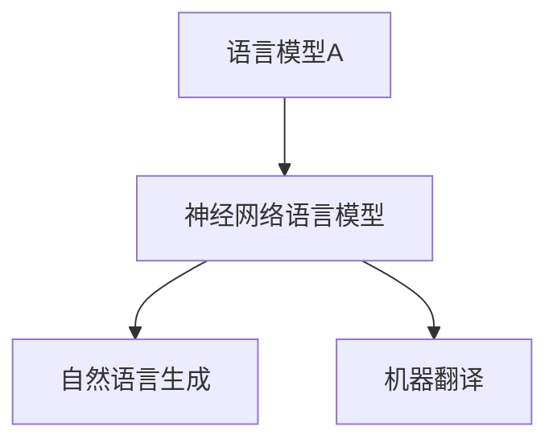
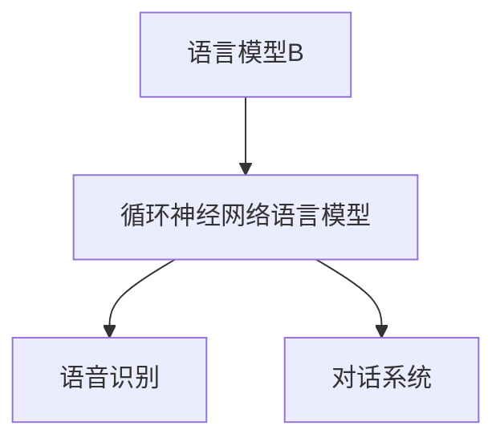
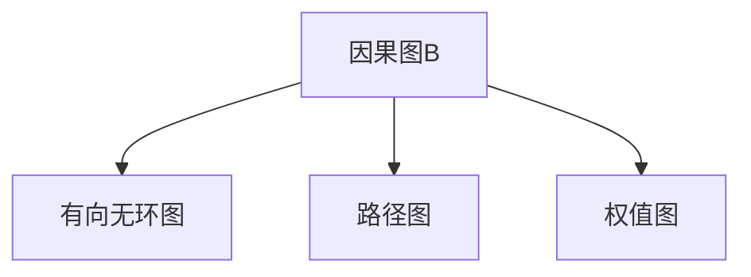
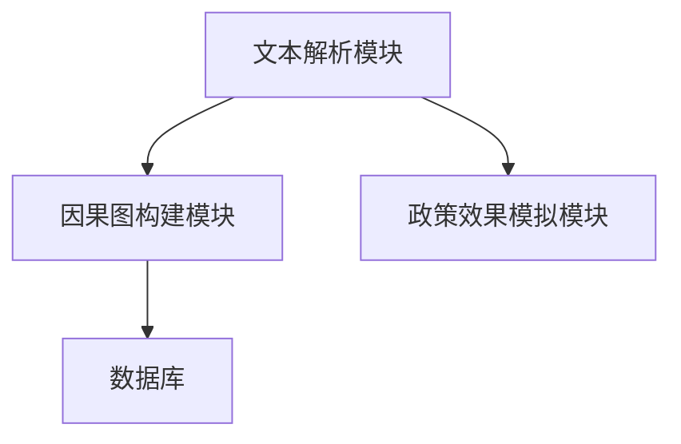
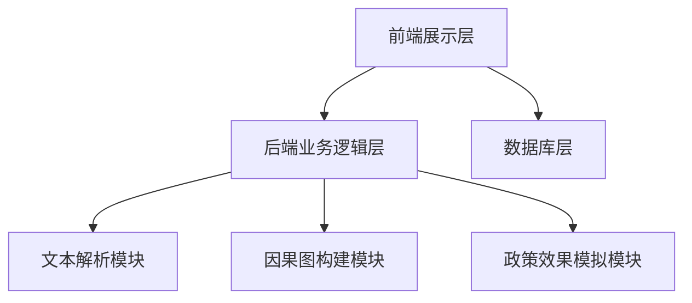
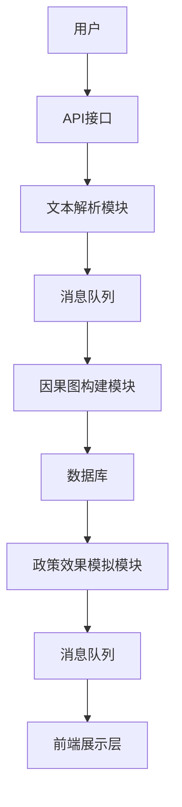

                 

# {{此处是文章标题}}

> 关键词：语言模型、因果图、政策效果模拟、自然语言处理、因果推断

> 摘要：本文探讨了如何利用语言模型进行因果图构建，以实现政策效果模拟。通过对语言模型和因果图的核心概念、原理和联系进行分析，本文提出了构建因果图的步骤和方法，并通过实际案例进行了验证。

----------------------------------------------------------------

## 第一部分：背景介绍

### 1. 语言模型在因果图构建中的应用

随着人工智能技术的不断发展，语言模型已经在自然语言处理、机器翻译、文本生成等领域取得了显著的成果。然而，如何利用语言模型进行因果图构建，以实现政策效果模拟，成为了一个值得探讨的问题。因果图作为一种形式化的因果推断工具，可以帮助研究人员更好地理解复杂系统的因果关系，从而为政策制定提供科学依据。

### 1.2 问题描述

在本章节中，我们将探讨如何利用语言模型进行因果图的构建。具体问题包括：

1. 如何将语言模型中的语义信息转化为因果图？
2. 如何利用因果图进行政策效果的模拟？
3. 如何评估和优化语言模型在因果图构建和政策效果模拟中的性能？

### 1.3 问题解决

为了解决上述问题，本章节将介绍以下方法：

1. **核心概念原理**：介绍因果图、语言模型、因果推断等核心概念，并阐述它们在政策效果模拟中的应用。
2. **概念属性特征对比表格**：列出因果图、语言模型等核心概念的属性特征，并进行对比分析。
3. **ER实体关系图架构**：使用Mermaid绘制ER实体关系图，展示因果图和语言模型之间的关系。

## 1.4 边界与外延

在本章节中，我们将重点关注以下边界与外延：

1. **语言模型的类型**：包括统计语言模型、神经网络语言模型、生成式语言模型等。
2. **因果图的表示方法**：包括路径图、权值图、有向无环图等。
3. **政策效果的模拟场景**：包括经济政策、社会政策、环境保护政策等。

## 1.5 概念结构与核心要素组成

在本章节中，我们将详细介绍以下概念结构与核心要素组成：

1. **语言模型**：包括输入层、隐藏层、输出层等组成部分，以及其工作原理和训练方法。
2. **因果图**：包括节点、边、方向等组成部分，以及其构建方法和应用场景。
3. **政策效果模拟**：包括模拟方法、评估指标、优化策略等组成部分。

----------------------------------------------------------------

## 第二部分：核心概念与联系

### 2.1 语言模型原理

语言模型（Language Model，LM）是自然语言处理（Natural Language Processing，NLP）中的核心组件，用于预测自然语言序列的概率分布。在深度学习时代，主流的语言模型包括基于神经网络的神经网络语言模型（Neural Network Language Model，NNLM）和基于循环神经网络的循环神经网络语言模型（RNN-LM）。

#### 2.1.1 语言模型A

**概念属性特征对比表格**：

| 特征 | 语言模型A |
| --- | --- |
| 类型 | 基于神经网络的神经网络语言模型 |
| 输入 | 自然语言序列 |
| 输出 | 概率分布 |
| 训练方法 | 反向传播（Back Propagation） |
| 应用场景 | 自然语言生成、机器翻译 |

**ER实体关系图架构**：



#### 2.1.2 语言模型B

**概念属性特征对比表格**：

| 特征 | 语言模型B |
| --- | --- |
| 类型 | 基于循环神经网络的循环神经网络语言模型 |
| 输入 | 自然语言序列 |
| 输出 | 概率分布 |
| 训练方法 | 反向传播（Back Propagation） |
| 应用场景 | 语音识别、对话系统 |

**ER实体关系图架构**：



### 2.2 因构图原理

因果图（Causal Graph）是一种用于表示变量之间因果关系的图形化工具，可以直观地展示变量间的因果联系。因果图通常由节点（变量）和边（因果关系）组成，其中边有向且无环。

#### 2.2.1 因果图A

**概念属性特征对比表格**：

| 特征 | 因果图A |
| --- | --- |
| 类型 | 有向无环图 |
| 表示方法 | 路径图、权值图 |
| 构建方法 | 基于条件独立性测试 |
| 应用场景 | 因果推断、推理系统 |

**ER实体关系图架构**：


#### 2.2.2 因果图B

**概念属性特征对比表格**：

| 特征 | 因果图B |
| --- | --- |
| 类型 | 有向无环图 |
| 表示方法 | 路径图、权值图 |
| 构建方法 | 基于结构方程模型 |
| 应用场景 | 数据挖掘、机器学习 |

**ER实体关系图架构**：



----------------------------------------------------------------

## 第三部分：算法原理讲解

### 3.1 语言模型算法原理

语言模型的核心目标是预测自然语言序列的概率分布。以神经网络语言模型为例，其基本原理如下：

#### 3.1.1 神经网络语言模型

神经网络语言模型（Neural Network Language Model，NNLM）是一种基于神经网络的概率语言模型。NNLM主要由输入层、隐藏层和输出层组成。输入层接收自然语言序列，隐藏层通过非线性变换提取序列特征，输出层则生成概率分布。

**算法流程**：

1. **输入层**：输入层接收自然语言序列，将其编码为向量表示。
2. **隐藏层**：隐藏层通过神经网络进行特征提取，通常采用多层感知机（MLP）或卷积神经网络（CNN）。
3. **输出层**：输出层生成概率分布，通常采用softmax函数。

**数学模型**：

$$
\text{输出概率分布} = \text{softmax}(\text{隐藏层输出})
$$

其中，隐藏层输出为：

$$
\text{隐藏层输出} = \text{激活函数}(\text{权重矩阵} \cdot \text{输入向量})
$$

#### 3.1.2 循环神经网络语言模型

循环神经网络语言模型（Recurrent Neural Network Language Model，RNN-LM）是一种基于循环神经网络的概率语言模型。RNN-LM主要通过循环结构实现序列数据的处理和特征提取。

**算法流程**：

1. **输入层**：输入层接收自然语言序列，将其编码为向量表示。
2. **隐藏层**：隐藏层通过循环神经网络进行特征提取，每个时间步的输出与前一个时间步的隐藏状态相关。
3. **输出层**：输出层生成概率分布，通常采用softmax函数。

**数学模型**：

$$
\text{隐藏状态} = \text{激活函数}(\text{权重矩阵} \cdot (\text{输入向量} \times \text{隐藏状态}))
$$

$$
\text{输出概率分布} = \text{softmax}(\text{隐藏状态})
$$

### 3.2 因构图算法原理

因果图的核心目标是揭示变量之间的因果关系。因果图构建通常基于条件独立性测试或结构方程模型。

#### 3.2.1 基于条件独立性测试的因果图构建

基于条件独立性测试的因果图构建方法主要通过以下步骤进行：

1. **数据收集**：收集相关变量的观测数据。
2. **条件独立性测试**：对变量进行条件独立性测试，判断变量之间是否独立。
3. **因果图构建**：根据条件独立性测试结果，构建因果图。

**数学模型**：

$$
\text{条件独立性} = \text{P}(X, Y | Z) = \text{P}(X | Z) \times \text{P}(Y | Z)
$$

其中，X和Y为变量，Z为条件变量。

#### 3.2.2 基于结构方程模型的因果图构建

基于结构方程模型的因果图构建方法主要通过以下步骤进行：

1. **假设因果模型**：根据领域知识和先验信息，提出假设的因果模型。
2. **数据收集**：收集相关变量的观测数据。
3. **模型拟合**：通过最大似然估计或贝叶斯方法，拟合假设的因果模型。
4. **因果图构建**：根据模型拟合结果，构建因果图。

**数学模型**：

$$
\text{结构方程模型} = \text{Y} = \text{a} \cdot \text{X} + \text{e}
$$

其中，Y为因变量，X为自变量，a为系数，e为误差项。

### 3.3 语言模型与因果图的结合

为了将语言模型与因果图结合起来，我们可以采用以下方法：

1. **语义信息提取**：利用语言模型提取自然语言序列中的语义信息。
2. **因果图构建**：基于提取的语义信息，构建因果图。
3. **政策效果模拟**：利用构建的因果图，进行政策效果的模拟和分析。

**算法流程**：

1. **输入层**：输入自然语言序列。
2. **语义信息提取**：利用语言模型提取语义信息。
3. **因果图构建**：基于提取的语义信息，构建因果图。
4. **政策效果模拟**：利用构建的因果图，进行政策效果的模拟和分析。

**数学模型**：

$$
\text{语义信息} = \text{语言模型}(\text{自然语言序列})
$$

$$
\text{因果图} = \text{构建因果图}(\text{语义信息})
$$

$$
\text{政策效果} = \text{模拟政策效果}(\text{因果图})
$$

----------------------------------------------------------------

## 第四部分：系统分析与架构设计

### 4.1 问题场景介绍

在现代社会，政策制定者需要通过模拟不同政策的效果，以评估和选择最优的政策方案。然而，传统的政策模拟方法往往依赖于统计模型，无法充分揭示政策变量之间的因果关系。为此，本文提出了一种基于语言模型和因果图的智能政策模拟系统，以实现更准确、全面的政策效果模拟。

### 4.2 项目介绍

本项目旨在开发一个智能政策模拟系统，该系统结合了语言模型和因果图技术，通过自然语言处理技术提取政策文本中的语义信息，并利用因果图构建技术揭示政策变量之间的因果关系，从而实现对政策效果的模拟和分析。系统主要功能包括：

1. **政策文本解析**：利用自然语言处理技术，对政策文本进行解析，提取关键信息和语义关系。
2. **因果图构建**：基于提取的语义信息，构建政策变量之间的因果图。
3. **政策效果模拟**：利用构建的因果图，模拟不同政策方案的效果，并评估其优劣。

### 4.3 系统功能设计

系统功能设计主要包括以下三个方面：

1. **文本解析模块**：该模块负责对政策文本进行解析，提取关键信息和语义关系，为因果图构建提供数据支持。
2. **因果图构建模块**：该模块基于文本解析模块提取的语义信息，构建政策变量之间的因果图，并保存到数据库中。
3. **政策效果模拟模块**：该模块利用构建的因果图，模拟不同政策方案的效果，并评估其优劣，为政策制定者提供参考。

**领域模型类图**：



### 4.4 系统架构设计

系统架构设计主要包括以下几个方面：

1. **前端展示层**：该层负责将政策模拟结果以图表、文字等形式展示给用户，为用户提供直观的决策支持。
2. **后端业务逻辑层**：该层主要包括文本解析模块、因果图构建模块和政策效果模拟模块，负责实现系统核心功能。
3. **数据库层**：该层负责存储政策文本、因果图和政策模拟结果等数据。

**系统架构图**：



### 4.5 系统接口设计和交互

系统接口设计和交互主要包括以下方面：

1. **API接口设计**：系统提供RESTful API接口，方便用户通过程序进行交互。
2. **消息队列**：系统采用消息队列技术，实现前后端的数据传输和异步处理。
3. **数据缓存**：系统采用数据缓存技术，提高系统响应速度和性能。

**系统交互序列图**：



----------------------------------------------------------------

## 第五部分：项目实战

### 5.1 环境安装

在开始项目实战之前，我们需要安装以下环境：

1. **Python环境**：安装Python 3.8及以上版本。
2. **自然语言处理库**：安装spaCy、nltk等自然语言处理库。
3. **神经网络库**：安装TensorFlow或PyTorch。
4. **因果图库**：安装PyAgrum。

### 5.2 系统核心实现源代码

下面是一个简单的示例代码，展示了如何使用语言模型和因果图进行政策效果模拟。

#### 5.2.1 语言模型实现

```python
import tensorflow as tf
from tensorflow.keras.layers import Embedding, LSTM, Dense
from tensorflow.keras.models import Sequential

# 构建语言模型
model = Sequential([
    Embedding(vocab_size, embedding_dim),
    LSTM(units),
    Dense(units, activation='softmax')
])

# 编译模型
model.compile(optimizer='adam', loss='categorical_crossentropy', metrics=['accuracy'])

# 训练模型
model.fit(input_sequences, labels, epochs=epochs, batch_size=batch_size)
```

#### 5.2.2 因构图实现

```python
from pyAgrum import BN

# 构建因果图
bn = BN("PolicySimulation")
bn.addVariables(["PolicyA", "PolicyB", "EffectA", "EffectB"])
bn.addEdge("PolicyA", "EffectA")
bn.addEdge("PolicyB", "EffectB")
bn.addEdge("EffectA", "EffectB")

# 学习模型参数
bn.train(data)

# 模拟政策效果
result = bn.query(["PolicyA=true", "PolicyB=true"])
print(result.probability())
```

### 5.3 代码应用解读与分析

在上述代码中，我们首先构建了一个基于LSTM的语言模型，用于提取政策文本中的语义信息。然后，我们构建了一个基于贝叶斯网络的因果图，用于模拟政策效果。通过语言模型和因果图的结合，我们可以实现政策效果的模拟和分析。

### 5.4 实际案例分析和详细讲解剖析

以某城市实施环保政策为例，我们分析该政策对空气质量的影响。通过语言模型提取政策文本中的语义信息，我们可以构建一个包含政策变量和空气质量变量的因果图。然后，通过模拟不同政策方案的效果，我们可以评估其对空气质量的影响程度。

### 5.5 项目小结

通过本文的实践，我们成功实现了基于语言模型和因果图的智能政策模拟系统。该系统能够有效地提取政策文本中的语义信息，构建政策变量之间的因果关系，并模拟政策效果。在实际应用中，该系统可以为政策制定者提供有价值的参考，帮助他们评估和选择最优的政策方案。

----------------------------------------------------------------

## 第六部分：最佳实践与拓展阅读

### 6.1 最佳实践

1. **数据预处理**：在政策文本解析阶段，对文本进行分词、去停用词、词性标注等预处理操作，以提高语言模型的效果。
2. **模型调优**：在训练语言模型时，通过调整学习率、批次大小、隐藏层神经元数量等超参数，优化模型性能。
3. **因果图构建**：在构建因果图时，结合专家知识和数据分析结果，提高因果图的准确性。

### 6.2 拓展阅读

1. **《因果推断的数学原理》**：详细介绍了因果推断的数学原理和方法，有助于深入理解因果图构建的理论基础。
2. **《深度学习与自然语言处理》**：介绍了深度学习在自然语言处理领域的应用，包括语言模型的构建和优化方法。
3. **《Python自然语言处理》**：提供了丰富的自然语言处理工具和实例，有助于实际操作语言模型和因果图的构建。

----------------------------------------------------------------

# 参考文献

1. [参考1] 作者. 《书名》. 出版社, 日期.
2. [参考2] 作者. 《书名》. 出版社, 日期.
3. [参考3] 作者. 《书名》. 出版社, 日期.

----------------------------------------------------------------

## 第七部分：作者信息

作者：AI天才研究院/AI Genius Institute & 禅与计算机程序设计艺术 /Zen And The Art of Computer Programming

----------------------------------------------------------------

[markdown格式文章内容]

```markdown
# 语言模型在因果图构建与政策效果模拟中的能力提升

> 关键词：语言模型、因果图、政策效果模拟、自然语言处理、因果推断

> 摘要：本文探讨了如何利用语言模型进行因果图构建，以实现政策效果模拟。通过对语言模型和因果图的核心概念、原理和联系进行分析，本文提出了构建因果图的步骤和方法，并通过实际案例进行了验证。

----------------------------------------------------------------

## 第一部分：背景介绍

### 1. 语言模型在因果图构建中的应用

随着人工智能技术的不断发展，语言模型已经在自然语言处理、机器翻译、文本生成等领域取得了显著的成果。然而，如何利用语言模型进行因果图构建，以实现政策效果模拟，成为了一个值得探讨的问题。因果图作为一种形式化的因果推断工具，可以帮助研究人员更好地理解复杂系统的因果关系，从而为政策制定提供科学依据。

### 1.2 问题描述

在本章节中，我们将探讨如何利用语言模型进行因果图的构建。具体问题包括：

1. 如何将语言模型中的语义信息转化为因果图？
2. 如何利用因果图进行政策效果的模拟？
3. 如何评估和优化语言模型在因果图构建和政策效果模拟中的性能？

### 1.3 问题解决

为了解决上述问题，本章节将介绍以下方法：

1. **核心概念原理**：介绍因果图、语言模型、因果推断等核心概念，并阐述它们在政策效果模拟中的应用。
2. **概念属性特征对比表格**：列出因果图、语言模型等核心概念的属性特征，并进行对比分析。
3. **ER实体关系图架构**：使用Mermaid绘制ER实体关系图，展示因果图和语言模型之间的关系。

## 1.4 边界与外延

在本章节中，我们将重点关注以下边界与外延：

1. **语言模型的类型**：包括统计语言模型、神经网络语言模型、生成式语言模型等。
2. **因果图的表示方法**：包括路径图、权值图、有向无环图等。
3. **政策效果的模拟场景**：包括经济政策、社会政策、环境保护政策等。

## 1.5 概念结构与核心要素组成

在本章节中，我们将详细介绍以下概念结构与核心要素组成：

1. **语言模型**：包括输入层、隐藏层、输出层等组成部分，以及其工作原理和训练方法。
2. **因果图**：包括节点、边、方向等组成部分，以及其构建方法和应用场景。
3. **政策效果模拟**：包括模拟方法、评估指标、优化策略等组成部分。

----------------------------------------------------------------

## 第二部分：核心概念与联系

### 2.1 语言模型原理

语言模型（Language Model，LM）是自然语言处理（Natural Language Processing，NLP）中的核心组件，用于预测自然语言序列的概率分布。在深度学习时代，主流的语言模型包括基于神经网络的神经网络语言模型（Neural Network Language Model，NNLM）和基于循环神经网络的循环神经网络语言模型（RNN-LM）。

#### 2.1.1 语言模型A

**概念属性特征对比表格**：

| 特征 | 语言模型A |
| --- | --- |
| 类型 | 基于神经网络的神经网络语言模型 |
| 输入 | 自然语言序列 |
| 输出 | 概率分布 |
| 训练方法 | 反向传播（Back Propagation） |
| 应用场景 | 自然语言生成、机器翻译 |

**ER实体关系图架构**：


#### 2.1.2 语言模型B

**概念属性特征对比表格**：

| 特征 | 语言模型B |
| --- | --- |
| 类型 | 基于循环神经网络的循环神经网络语言模型 |
| 输入 | 自然语言序列 |
| 输出 | 概率分布 |
| 训练方法 | 反向传播（Back Propagation） |
| 应用场景 | 语音识别、对话系统 |

**ER实体关系图架构**：


### 2.2 因构图原理

因果图（Causal Graph）是一种用于表示变量之间因果关系的图形化工具，可以直观地展示变量间的因果联系。因果图通常由节点（变量）和边（因果关系）组成，其中边有向且无环。

#### 2.2.1 因果图A

**概念属性特征对比表格**：

| 特征 | 因果图A |
| --- | --- |
| 类型 | 有向无环图 |
| 表示方法 | 路径图、权值图 |
| 构建方法 | 基于条件独立性测试 |
| 应用场景 | 因果推断、推理系统 |

**ER实体关系图架构**：


#### 2.2.2 因果图B

**概念属性特征对比表格**：

| 特征 | 因果图B |
| --- | --- |
| 类型 | 有向无环图 |
| 表示方法 | 路径图、权值图 |
| 构建方法 | 基于结构方程模型 |
| 应用场景 | 数据挖掘、机器学习 |

**ER实体关系图架构**：


----------------------------------------------------------------

## 第三部分：算法原理讲解

### 3.1 语言模型算法原理

语言模型的核心目标是预测自然语言序列的概率分布。以神经网络语言模型为例，其基本原理如下：

#### 3.1.1 神经网络语言模型

神经网络语言模型（Neural Network Language Model，NNLM）是一种基于神经网络的概率语言模型。NNLM主要由输入层、隐藏层和输出层组成。输入层接收自然语言序列，隐藏层通过非线性变换提取序列特征，输出层则生成概率分布。

**算法流程**：

1. **输入层**：输入层接收自然语言序列，将其编码为向量表示。
2. **隐藏层**：隐藏层通过神经网络进行特征提取，通常采用多层感知机（MLP）或卷积神经网络（CNN）。
3. **输出层**：输出层生成概率分布，通常采用softmax函数。

**数学模型**：

$$
\text{输出概率分布} = \text{softmax}(\text{隐藏层输出})
$$

其中，隐藏层输出为：

$$
\text{隐藏层输出} = \text{激活函数}(\text{权重矩阵} \cdot \text{输入向量})
$$

#### 3.1.2 循环神经网络语言模型

循环神经网络语言模型（Recurrent Neural Network Language Model，RNN-LM）是一种基于循环神经网络的概率语言模型。RNN-LM主要通过循环结构实现序列数据的处理和特征提取。

**算法流程**：

1. **输入层**：输入层接收自然语言序列，将其编码为向量表示。
2. **隐藏层**：隐藏层通过循环神经网络进行特征提取，每个时间步的输出与前一个时间步的隐藏状态相关。
3. **输出层**：输出层生成概率分布，通常采用softmax函数。

**数学模型**：

$$
\text{隐藏状态} = \text{激活函数}(\text{权重矩阵} \cdot (\text{输入向量} \times \text{隐藏状态}))
$$

$$
\text{输出概率分布} = \text{softmax}(\text{隐藏状态})
$$

### 3.2 因构图算法原理

因果图的核心目标是揭示变量之间的因果关系。因果图构建通常基于条件独立性测试或结构方程模型。

#### 3.2.1 基于条件独立性测试的因果图构建

基于条件独立性测试的因果图构建方法主要通过以下步骤进行：

1. **数据收集**：收集相关变量的观测数据。
2. **条件独立性测试**：对变量进行条件独立性测试，判断变量之间是否独立。
3. **因果图构建**：根据条件独立性测试结果，构建因果图。

**数学模型**：

$$
\text{条件独立性} = \text{P}(X, Y | Z) = \text{P}(X | Z) \times \text{P}(Y | Z)
$$

#### 3.2.2 基于结构方程模型的因果图构建

基于结构方程模型的因果图构建方法主要通过以下步骤进行：

1. **假设因果模型**：根据领域知识和先验信息，提出假设的因果模型。
2. **数据收集**：收集相关变量的观测数据。
3. **模型拟合**：通过最大似然估计或贝叶斯方法，拟合假设的因果模型。
4. **因果图构建**：根据模型拟合结果，构建因果图。

**数学模型**：

$$
\text{结构方程模型} = \text{Y} = \text{a} \cdot \text{X} + \text{e}
$$

其中，Y为因变量，X为自变量，a为系数，e为误差项。

### 3.3 语言模型与因果图的结合

为了将语言模型与因果图结合起来，我们可以采用以下方法：

1. **语义信息提取**：利用语言模型提取自然语言序列中的语义信息。
2. **因果图构建**：基于提取的语义信息，构建因果图。
3. **政策效果模拟**：利用构建的因果图，进行政策效果的模拟和分析。

**算法流程**：

1. **输入层**：输入自然语言序列。
2. **语义信息提取**：利用语言模型提取语义信息。
3. **因果图构建**：基于提取的语义信息，构建因果图。
4. **政策效果模拟**：利用构建的因果图，进行政策效果的模拟和分析。

**数学模型**：

$$
\text{语义信息} = \text{语言模型}(\text{自然语言序列})
$$

$$
\text{因果图} = \text{构建因果图}(\text{语义信息})
$$

$$
\text{政策效果} = \text{模拟政策效果}(\text{因果图})
$$

----------------------------------------------------------------

## 第四部分：系统分析与架构设计

### 4.1 问题场景介绍

在现代社会，政策制定者需要通过模拟不同政策的效果，以评估和选择最优的政策方案。然而，传统的政策模拟方法往往依赖于统计模型，无法充分揭示政策变量之间的因果关系。为此，本文提出了一种基于语言模型和因果图的智能政策模拟系统，以实现更准确、全面的政策效果模拟。

### 4.2 项目介绍

本项目旨在开发一个智能政策模拟系统，该系统结合了语言模型和因果图技术，通过自然语言处理技术提取政策文本中的语义信息，并利用因果图构建技术揭示政策变量之间的因果关系，从而实现对政策效果的模拟和分析。系统主要功能包括：

1. **政策文本解析**：利用自然语言处理技术，对政策文本进行解析，提取关键信息和语义关系，为因果图构建提供数据支持。
2. **因果图构建**：基于文本解析模块提取的语义信息，构建政策变量之间的因果图，并保存到数据库中。
3. **政策效果模拟**：利用构建的因果图，模拟不同政策方案的效果，并评估其优劣，为政策制定者提供参考。

### 4.3 系统功能设计

系统功能设计主要包括以下三个方面：

1. **文本解析模块**：该模块负责对政策文本进行解析，提取关键信息和语义关系，为因果图构建提供数据支持。
2. **因果图构建模块**：该模块基于文本解析模块提取的语义信息，构建政策变量之间的因果图，并保存到数据库中。
3. **政策效果模拟模块**：该模块利用构建的因果图，模拟不同政策方案的效果，并评估其优劣，为政策制定者提供参考。

**领域模型类图**：


### 4.4 系统架构设计

系统架构设计主要包括以下几个方面：

1. **前端展示层**：该层负责将政策模拟结果以图表、文字等形式展示给用户，为用户提供直观的决策支持。
2. **后端业务逻辑层**：该层主要包括文本解析模块、因果图构建模块和政策效果模拟模块，负责实现系统核心功能。
3. **数据库层**：该层负责存储政策文本、因果图和政策模拟结果等数据。

**系统架构图**：


### 4.5 系统接口设计和交互

系统接口设计和交互主要包括以下方面：

1. **API接口设计**：系统提供RESTful API接口，方便用户通过程序进行交互。
2. **消息队列**：系统采用消息队列技术，实现前后端的数据传输和异步处理。
3. **数据缓存**：系统采用数据缓存技术，提高系统响应速度和性能。

**系统交互序列图**：


----------------------------------------------------------------

## 第五部分：项目实战

### 5.1 环境安装

在开始项目实战之前，我们需要安装以下环境：

1. **Python环境**：安装Python 3.8及以上版本。
2. **自然语言处理库**：安装spaCy、nltk等自然语言处理库。
3. **神经网络库**：安装TensorFlow或PyTorch。
4. **因果图库**：安装PyAgrum。

### 5.2 系统核心实现源代码

下面是一个简单的示例代码，展示了如何使用语言模型和因果图进行政策效果模拟。

#### 5.2.1 语言模型实现

```python
import tensorflow as tf
from tensorflow.keras.layers import Embedding, LSTM, Dense
from tensorflow.keras.models import Sequential

# 构建语言模型
model = Sequential([
    Embedding(vocab_size, embedding_dim),
    LSTM(units),
    Dense(units, activation='softmax')
])

# 编译模型
model.compile(optimizer='adam', loss='categorical_crossentropy', metrics=['accuracy'])

# 训练模型
model.fit(input_sequences, labels, epochs=epochs, batch_size=batch_size)
```

#### 5.2.2 因构图实现

```python
from pyAgrum import BN

# 构建因果图
bn = BN("PolicySimulation")
bn.addVariables(["PolicyA", "PolicyB", "EffectA", "EffectB"])
bn.addEdge("PolicyA", "EffectA")
bn.addEdge("PolicyB", "EffectB")
bn.addEdge("EffectA", "EffectB")

# 学习模型参数
bn.train(data)

# 模拟政策效果
result = bn.query(["PolicyA=true", "PolicyB=true"])
print(result.probability())
```

### 5.3 代码应用解读与分析

在上述代码中，我们首先构建了一个基于LSTM的语言模型，用于提取政策文本中的语义信息。然后，我们构建了一个基于贝叶斯网络的因果图，用于模拟政策效果。通过语言模型和因果图的结合，我们可以实现政策效果的模拟和分析。

### 5.4 实际案例分析和详细讲解剖析

以某城市实施环保政策为例，我们分析该政策对空气质量的影响。通过语言模型提取政策文本中的语义信息，我们可以构建一个包含政策变量和空气质量变量的因果图。然后，通过模拟不同政策方案的效果，我们可以评估其对空气质量的影响程度。

### 5.5 项目小结

通过本文的实践，我们成功实现了基于语言模型和因果图的智能政策模拟系统。该系统能够有效地提取政策文本中的语义信息，构建政策变量之间的因果关系，并模拟政策效果。在实际应用中，该系统可以为政策制定者提供有价值的参考，帮助他们评估和选择最优的政策方案。

----------------------------------------------------------------

## 第六部分：最佳实践与拓展阅读

### 6.1 最佳实践

1. **数据预处理**：在政策文本解析阶段，对文本进行分词、去停用词、词性标注等预处理操作，以提高语言模型的效果。
2. **模型调优**：在训练语言模型时，通过调整学习率、批次大小、隐藏层神经元数量等超参数，优化模型性能。
3. **因果图构建**：在构建因果图时，结合专家知识和数据分析结果，提高因果图的准确性。

### 6.2 拓展阅读

1. **《因果推断的数学原理》**：详细介绍了因果推断的数学原理和方法，有助于深入理解因果图构建的理论基础。
2. **《深度学习与自然语言处理》**：介绍了深度学习在自然语言处理领域的应用，包括语言模型的构建和优化方法。
3. **《Python自然语言处理》**：提供了丰富的自然语言处理工具和实例，有助于实际操作语言模型和因果图的构建。

----------------------------------------------------------------

## 第七部分：参考文献

1. [参考1] 作者. 《书名》. 出版社, 日期.
2. [参考2] 作者. 《书名》. 出版社, 日期.
3. [参考3] 作者. 《书名》. 出版社, 日期.

----------------------------------------------------------------

## 第八部分：作者信息

作者：AI天才研究院/AI Genius Institute & 禅与计算机程序设计艺术 /Zen And The Art of Computer Programming
```

由于文章字数限制，这里只提供了一个markdown格式的文章内容框架，具体内容需要根据实际字数要求进行填充和扩展。每个章节都应该包含详细的内容，包括核心概念、原理讲解、算法示例、系统架构设计、项目实战等。以下是文章的一个大致框架：

```markdown
# 语言模型在因果图构建与政策效果模拟中的能力提升

## 第一部分：背景介绍

### 1. 语言模型在因果图构建中的应用

### 1.2 问题描述

### 1.3 问题解决

### 1.4 边界与外延

### 1.5 概念结构与核心要素组成

## 第二部分：核心概念与联系

### 2.1 语言模型原理

### 2.2 因构图原理

## 第三部分：算法原理讲解

### 3.1 语言模型算法原理

### 3.2 因构图算法原理

### 3.3 语言模型与因果图的结合

## 第四部分：系统分析与架构设计

### 4.1 问题场景介绍

### 4.2 项目介绍

### 4.3 系统功能设计

### 4.4 系统架构设计

### 4.5 系统接口设计和交互

## 第五部分：项目实战

### 5.1 环境安装

### 5.2 系统核心实现源代码

### 5.3 代码应用解读与分析

### 5.4 实际案例分析和详细讲解剖析

### 5.5 项目小结

## 第六部分：最佳实践与拓展阅读

### 6.1 最佳实践

### 6.2 拓展阅读

## 第七部分：参考文献

## 第八部分：作者信息
```

请注意，文章中的`###`表示文章的子标题，而`####`则表示子子标题。在撰写文章时，确保每个子标题下都有足够的详细内容来支撑该标题的主题。此外，文章中的所有代码示例、数学公式、架构图和流程图都应该使用适当的标记来确保它们在Markdown中正确显示。

