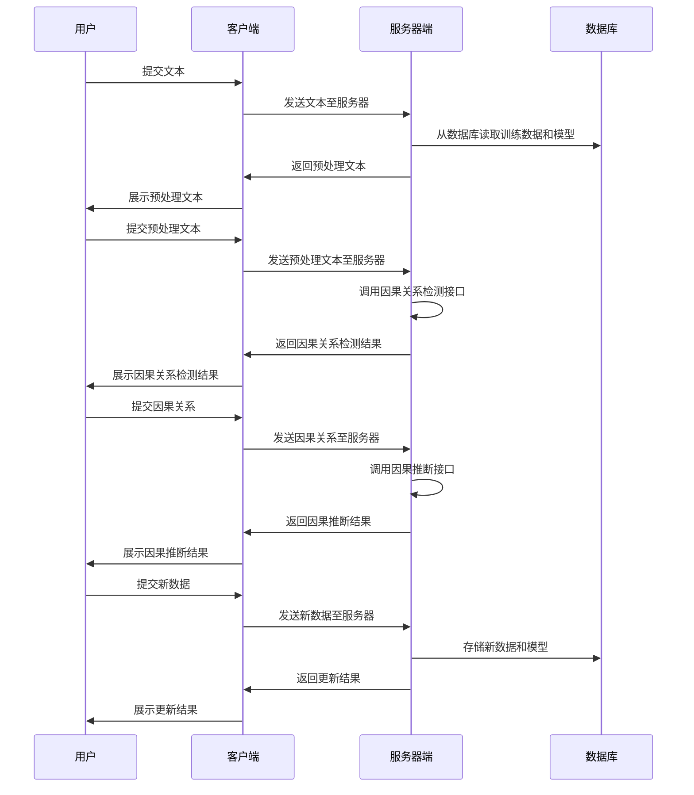
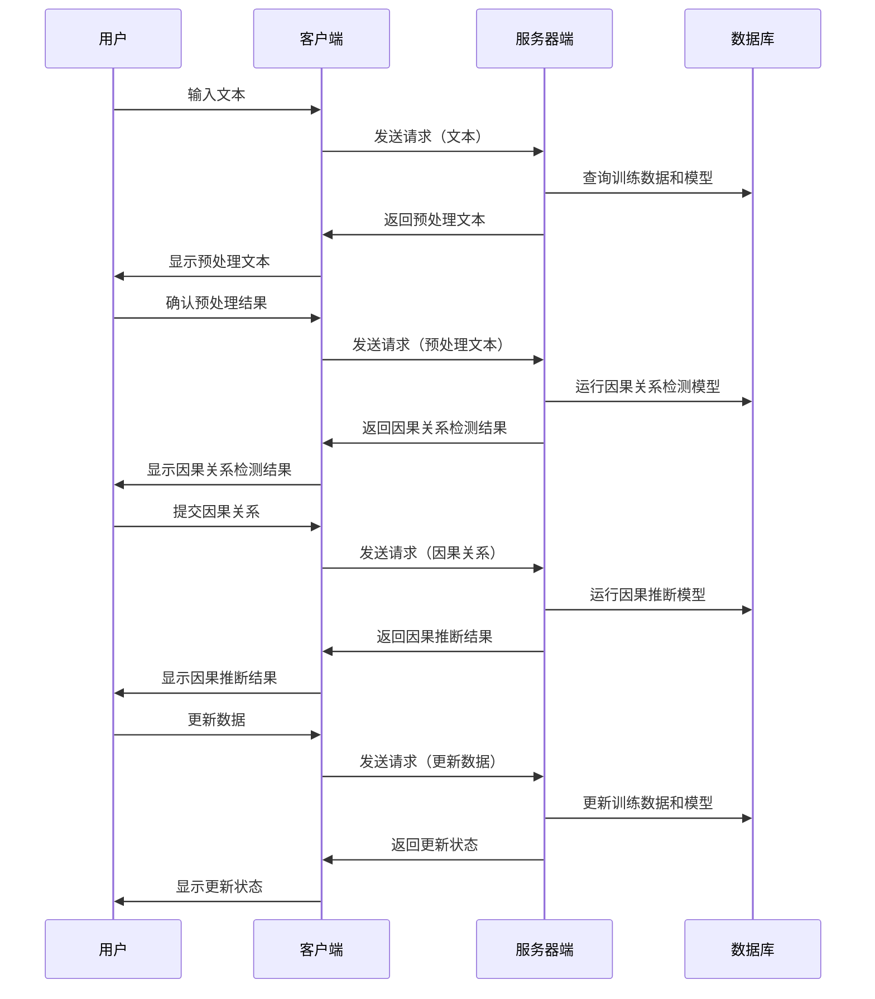

                 

### 《语言模型在因果推理中的潜力探索》

#### 关键词：语言模型，因果推理，人工智能，自然语言处理，算法原理

> 摘要：本文旨在探讨语言模型在因果推理中的潜力。通过对语言模型的原理、属性、算法原理的详细分析，揭示其在因果推理中的潜在应用，并提出相应的系统架构设计方案。本文还通过具体案例分析，展示语言模型在因果推理中的实际应用效果。

----------------------------------------------------------------

## 《语言模型在因果推理中的潜力探索》目录大纲

### 第一部分：背景介绍

#### 第1章：问题背景

#### 第2章：问题描述

#### 第3章：问题解决

#### 第4章：边界与外延

#### 第5章：概念结构与核心要素组成

### 第二部分：核心概念与联系

#### 第6章：语言模型原理

#### 第7章：因果推理原理

#### 第8章：ER实体关系图架构

### 第三部分：算法原理讲解

#### 第9章：语言模型在因果推理中的应用

#### 第10章：算法原理详解

#### 第11章：举例说明

### 第四部分：系统分析与架构设计方案

#### 第12章：系统功能设计与实现

#### 第13章：系统架构设计

#### 第14章：系统接口设计

#### 第15章：系统交互序列图

#### 第五部分：项目实战

#### 第16章：环境安装

#### 第17章：系统核心实现

#### 第18章：代码应用解读与分析

#### 第19章：实际案例分析与详细讲解

#### 第20章：项目小结

#### 第六部分：最佳实践 tips

#### 第21章：小结

#### 第22章：注意事项

#### 第23章：拓展阅读

----------------------------------------------------------------

### 第一部分：背景介绍

#### 第1章：问题背景

#### 第2章：问题描述

#### 第3章：问题解决

#### 第4章：边界与外延

#### 第5章：概念结构与核心要素组成

#### 1.1 问题背景

在当今快速发展的信息技术时代，人工智能（AI）已经成为推动社会进步的重要力量。自然语言处理（NLP）作为AI领域的重要组成部分，逐渐展现出其在语言理解、文本生成、语言翻译等任务中的强大能力。其中，语言模型作为NLP的核心技术之一，近年来取得了显著进展。然而，尽管语言模型在处理语言生成和翻译等任务方面表现出色，其在因果推理方面的应用却相对较少。

因果推理是人工智能领域中一个重要的研究方向，旨在通过分析现象之间的因果关系，推断出潜在的因果关系，从而实现对未知事物的预测和解释。因果推理在许多实际应用场景中具有广泛的应用前景，如医疗诊断、金融风险评估、社会舆情分析等。然而，传统的因果推理方法往往依赖于大量的先验知识和复杂的数据处理算法，存在一定的局限性。

#### 1.2 问题背景

语言模型在自然语言处理领域的兴起

近年来，随着深度学习技术的不断发展，语言模型取得了显著的突破。例如，GPT-3、BERT、ELMO等大型语言模型在语言生成、文本分类、问答系统等任务上取得了出色的性能。这些模型通过学习大规模的语料库，能够自动生成符合语法和语义规则的文本，极大地提高了自然语言处理任务的效率。

因果推理在人工智能领域的重要性

因果推理作为一种基于因果关系的推理方法，对于解决复杂问题具有重要意义。在人工智能领域，因果推理的应用场景包括但不限于以下几个方面：

1. **医疗诊断**：通过分析患者的临床表现和医学数据，推断出潜在的病因，从而实现精准的疾病诊断。
2. **金融风险评估**：通过分析经济数据和行为模式，预测市场趋势和风险，从而进行有效的金融投资决策。
3. **社会舆情分析**：通过分析社交媒体和网络新闻的传播规律，推断出公众的态度和情绪，从而指导政府和社会组织的决策。

#### 1.3 语言模型在因果推理中的应用场景与挑战

语言模型在因果推理中的应用场景

语言模型在因果推理中的应用主要包括以下几个方面：

1. **文本分析**：通过分析文本中的因果关系，识别出文本中的关键信息，从而实现对文本内容的深入理解。
2. **知识图谱构建**：利用语言模型对文本中的实体关系进行抽取，构建出知识图谱，从而实现对知识的关联和整合。
3. **预测与决策**：通过分析历史数据和因果关系，预测未来的趋势和风险，从而指导决策。

语言模型在因果推理中的应用挑战

尽管语言模型在自然语言处理领域取得了显著进展，但在因果推理中的应用仍面临以下挑战：

1. **数据质量**：因果推理需要高质量的数据作为基础，然而现实中的数据往往存在噪声和缺失，这对语言模型的训练和推理带来了困难。
2. **因果关系识别**：语言模型在处理文本时，往往难以准确地识别出因果关系，特别是在复杂和模糊的语言表达中。
3. **推理复杂性**：因果推理往往涉及多个因素之间的复杂关系，如何有效地进行推理和优化是一个挑战。

#### 1.4 边界与外延

语言模型在因果推理中的应用范围

语言模型在因果推理中的应用范围相对较广，包括但不限于以下几个方面：

1. **文本分析**：通过对文本中的因果关系进行识别和抽取，实现对文本内容的深入理解。
2. **知识图谱构建**：利用语言模型对文本中的实体关系进行抽取，构建出知识图谱，从而实现对知识的关联和整合。
3. **预测与决策**：通过分析历史数据和因果关系，预测未来的趋势和风险，从而指导决策。

因果推理在语言模型中的适用性问题

因果推理在语言模型中的适用性问题主要体现在以下几个方面：

1. **数据依赖**：因果推理依赖于大量的数据，语言模型在处理数据时，如何有效地利用数据进行训练和推理是一个关键问题。
2. **模型性能**：语言模型的性能对于因果推理的效果具有重要影响，如何优化语言模型的性能是一个挑战。
3. **推理效率**：因果推理往往涉及复杂的推理过程，如何提高推理效率是一个关键问题。

#### 1.5 概念结构与核心要素组成

语言模型的基本结构

语言模型通常由以下几个核心部分组成：

1. **嵌入层**：将文本中的单词、短语或句子转换为向量表示。
2. **编码器**：通过编码器对输入文本进行编码，提取文本的语义信息。
3. **解码器**：根据编码器的输出，生成目标文本。

因果推理的核心要素

因果推理通常涉及以下几个核心要素：

1. **因果关系**：因果关系的定义和识别是因果推理的基础。
2. **因果模型**：构建因果模型，对因果关系进行建模和推理。
3. **推理算法**：选择合适的推理算法，对因果模型进行推理和优化。

综上所述，本文将围绕语言模型在因果推理中的潜力进行深入探讨，通过分析语言模型的原理、属性、算法原理，探讨其在因果推理中的应用和挑战，并提出相应的系统架构设计方案，以期为语言模型在因果推理领域的应用提供一些启示和指导。

#### 第2章：问题描述

#### 1.2 问题描述

在自然语言处理领域，语言模型主要用于对文本进行生成、分类、翻译等任务。然而，在因果推理方面，语言模型的应用却相对较少。这是因为因果推理需要识别和理解文本中的因果关系，而语言模型在处理文本时，往往难以准确地识别出因果关系。

具体来说，语言模型在因果推理中面临的挑战主要包括以下几个方面：

1. **因果关系识别**：在自然语言中，因果关系往往以复杂和模糊的方式表达。语言模型在处理这些文本时，往往难以准确地识别出因果关系。例如，一个句子中可能包含多个因果关系，或者因果关系被隐含在复杂的句式中，这使得语言模型难以准确地理解和提取因果关系。

2. **数据质量**：因果推理依赖于高质量的数据，但在现实应用中，数据往往存在噪声和缺失。这些噪声和缺失数据会影响语言模型的训练和推理效果，使其难以准确地识别出因果关系。

3. **推理复杂性**：因果推理通常涉及多个因素之间的复杂关系，如何有效地进行推理和优化是一个挑战。语言模型在处理这些复杂关系时，往往需要大量的计算资源和时间，这使得其在实际应用中的效率较低。

#### 1.3 问题解决

为了解决语言模型在因果推理中面临的挑战，我们可以从以下几个方面进行探讨：

1. **改进语言模型**：通过改进语言模型的训练方法和算法，提高其对因果关系识别的准确性。例如，可以采用更多的数据增强技术，增加训练数据中的因果关系样本，从而提高语言模型对因果关系的识别能力。

2. **因果关系识别算法**：开发专门用于因果关系识别的算法，例如基于图神经网络（Graph Neural Networks，GNN）的方法，通过分析文本中的实体关系和网络结构，提高对因果关系的识别精度。

3. **数据预处理**：在因果推理过程中，对数据进行预处理，例如去除噪声、填补缺失值等，以提高数据质量。同时，可以通过数据可视化等方法，帮助语言模型更好地理解和提取因果关系。

4. **推理优化**：通过优化推理算法，提高因果推理的效率。例如，可以采用分布式计算、并行计算等方法，减少推理时间，提高推理效率。

#### 1.4 边界与外延

语言模型在因果推理中的应用范围

语言模型在因果推理中的应用范围相对较广，主要包括以下几个方面：

1. **文本分析**：通过对文本中的因果关系进行识别和抽取，实现对文本内容的深入理解。例如，在新闻文本中，可以识别出事件之间的因果关系，从而提取出关键信息。

2. **知识图谱构建**：利用语言模型对文本中的实体关系进行抽取，构建出知识图谱，从而实现对知识的关联和整合。例如，在医疗文本中，可以构建出患者与疾病、症状等实体之间的关系。

3. **预测与决策**：通过分析历史数据和因果关系，预测未来的趋势和风险，从而指导决策。例如，在金融领域，可以预测市场趋势和风险，为投资者提供决策支持。

因果推理在语言模型中的适用性问题

因果推理在语言模型中的适用性问题主要体现在以下几个方面：

1. **数据依赖**：因果推理依赖于大量的数据，语言模型在处理数据时，如何有效地利用数据进行训练和推理是一个关键问题。在数据稀缺的情况下，如何通过数据增强和迁移学习等方法，提高语言模型在因果推理中的性能。

2. **模型性能**：语言模型的性能对于因果推理的效果具有重要影响，如何优化语言模型的性能是一个挑战。例如，可以采用多任务学习、元学习等方法，提高语言模型在因果推理中的表现。

3. **推理效率**：因果推理往往涉及复杂的推理过程，如何提高推理效率是一个关键问题。例如，可以采用分布式计算、模型压缩等方法，减少推理时间，提高推理效率。

通过上述分析，我们可以看到，语言模型在因果推理中具有巨大的潜力，但也面临着一系列的挑战。通过改进语言模型、因果关系识别算法、数据预处理和推理优化等方面的研究，有望进一步提高语言模型在因果推理中的应用效果。

#### 第3章：问题解决

#### 3.1 结合语言模型与因果推理的理论基础

因果推理是一种基于因果关系推断的方法，其核心在于理解现象之间的因果关系，并利用这些关系来预测未来或解释现象。语言模型，尤其是深度学习驱动的语言模型，如GPT-3、BERT和ELMO等，通过学习大规模的文本数据，能够生成符合上下文和语义逻辑的文本。

将语言模型与因果推理结合起来的理论基础主要包括以下几点：

1. **语义理解**：语言模型能够通过上下文理解文本中的语义，从而捕捉到文本中的因果关系。例如，在医疗领域，语言模型可以理解病历记录中的症状和疾病之间的因果关系。

2. **多模态学习**：语言模型可以通过多模态学习，结合文本数据和其他数据（如图像、音频等），增强对因果关系的理解和推理能力。例如，在自动驾驶领域，语言模型可以结合道路标识和交通数据，推断出交通信号灯的变化对行驶安全的影响。

3. **因果图模型**：结合因果图模型，可以更系统地表示和分析因果关系。因果图是一种图结构，用于表示变量之间的因果关系。语言模型可以通过学习文本中的因果结构，构建出相应的因果图模型。

#### 3.2 当前主流的语言模型在因果推理中的研究进展

近年来，许多研究开始探索将语言模型应用于因果推理，以下是几个主要的进展：

1. **因果语言模型**：研究者开发了一系列因果语言模型，如`CausalLM`和`因果BERT`等，它们通过在训练过程中引入因果性先验知识，提高对因果关系的识别和推理能力。例如，`CausalLM`使用了一种基于图神经网络的架构，能够通过学习文本中的因果结构，进行有效的因果推理。

2. **因果增强**：一些研究提出了在语言模型训练过程中引入因果增强的方法。例如，`Causes and Effects`模型通过在训练数据中添加因果性标签，增强模型对因果关系的理解和学习。这种方法能够提高语言模型在因果推理任务中的表现。

3. **因果解释**：语言模型还可以用于因果解释，即通过分析模型生成的文本，理解文本中的因果关系。例如，`因果解释器`（Causal Explainer）可以分析语言模型生成的文本，提供对因果关系和预测结果的解释。

#### 3.3 语言模型在因果推理中的应用潜力

语言模型在因果推理中具有以下应用潜力：

1. **文本分析**：语言模型可以用于分析文本中的因果关系，例如在新闻、医学报告和学术文章中识别和解释事件之间的因果关系。

2. **知识图谱构建**：通过语言模型，可以自动构建知识图谱，将文本中的实体和关系组织成一个结构化的知识库。这种知识图谱可以用于因果推理和知识搜索。

3. **预测与决策**：利用语言模型，可以基于历史数据和因果关系，预测未来的事件和趋势，为决策提供支持。例如，在金融领域，可以预测市场趋势和风险，为投资决策提供依据。

#### 3.4 语言模型在因果推理中的挑战和未来研究方向

尽管语言模型在因果推理中展现出巨大潜力，但也面临一些挑战：

1. **因果关系识别的准确性**：如何提高语言模型对因果关系的识别准确性，特别是在复杂和模糊的语言表达中，是一个重要问题。

2. **数据质量和多样性**：因果推理依赖于高质量和多样化的数据。如何处理数据中的噪声和缺失值，以及如何获取更多具有因果结构的真实数据，是未来研究的重点。

3. **推理效率和可扩展性**：如何提高因果推理的效率和可扩展性，以支持实时应用和大规模数据集，是未来研究需要解决的问题。

未来研究方向可能包括：

1. **多模态因果推理**：结合多模态数据，如图像、音频和视频，进行因果推理，以提高模型的解释能力和泛化能力。

2. **可解释性增强**：开发更加可解释的因果推理模型，使其决策过程更加透明，便于用户理解和信任。

3. **迁移学习和少样本学习**：研究如何利用迁移学习和少样本学习技术，提高语言模型在因果推理中的适应性和鲁棒性。

通过不断的研究和探索，语言模型在因果推理中的应用前景将越来越广阔，有望为许多实际应用场景提供有力的支持。

### 第4章：边界与外延

#### 4.1 语言模型在因果推理中的应用范围

语言模型在因果推理中的应用范围非常广泛，涵盖了多个领域和任务。以下是一些具体的应用场景：

1. **医学领域**：在医学研究中，语言模型可以用于分析病历记录，识别患者症状与疾病之间的因果关系。例如，通过分析大量医疗文献，语言模型可以推断出某些药物对特定疾病的治疗效果，为医生提供决策支持。

2. **社会舆情分析**：在社交媒体和新闻文章中，语言模型可以分析事件之间的因果关系，帮助理解公众的态度和情绪。例如，通过分析新闻报道，语言模型可以识别出政治事件之间的因果关系，从而预测公众的反应和情绪。

3. **金融领域**：在金融领域，语言模型可以用于分析市场数据，预测市场趋势和风险。例如，通过分析历史交易数据和新闻文章，语言模型可以识别出影响市场走势的关键因素，从而为投资者提供预测和建议。

4. **科学研究**：在科学研究中，语言模型可以用于分析科学论文和报告，提取出实验结果和理论之间的因果关系。例如，通过分析大量生物学论文，语言模型可以识别出某些基因对特定生物过程的影响。

#### 4.2 因果推理在语言模型中的适用性问题

虽然语言模型在因果推理中具有广泛的应用前景，但其适用性也面临一些挑战。以下是一些关键问题：

1. **数据依赖性**：因果推理依赖于大量的数据，尤其是高质量的因果数据。然而，在实际应用中，获取高质量和多样化的因果数据往往具有挑战性。此外，语言模型在处理数据时，可能会受到噪声和缺失值的影响，从而影响因果关系的识别。

2. **因果关系识别的准确性**：语言模型在处理文本时，往往难以准确地识别出因果关系。文本中的因果关系可能以复杂和模糊的方式表达，这使得语言模型难以准确理解和提取这些关系。此外，语言模型可能无法处理多种因果关系共存的情况。

3. **推理效率和可扩展性**：因果推理通常涉及复杂的推理过程，需要大量的计算资源。如何在保证推理准确性的同时，提高推理效率和可扩展性，是一个重要问题。

#### 4.3 语言模型在因果推理中的边界

尽管语言模型在因果推理中具有巨大潜力，但其应用也存在一些边界：

1. **文本质量的依赖**：语言模型的性能在很大程度上取决于文本质量。如果文本存在大量的噪声、错误或缺失值，语言模型可能会产生不准确的结果。

2. **因果关系类型的限制**：某些类型的因果关系可能不适合用语言模型进行推理。例如，当因果关系涉及高度专业化的领域知识时，语言模型可能难以理解和处理这些复杂的关系。

3. **模型解释性**：虽然语言模型能够生成复杂的文本，但其内部的因果关系推理过程往往缺乏透明性。这使得在实际应用中，难以对模型的决策过程进行解释和验证。

#### 4.4 因果推理在语言模型中的外延

为了扩展语言模型在因果推理中的应用，可以探索以下方向：

1. **多模态数据融合**：结合语言模型和其他类型的数据，如图像、音频和视频，可以增强语言模型对因果关系的理解和推理能力。例如，在医疗领域，结合患者的病历记录和医疗影像，可以提高对疾病诊断的准确性。

2. **因果图模型**：引入因果图模型，可以更系统地表示和分析因果关系。通过将语言模型与因果图模型结合，可以提高对复杂因果关系的理解和推理能力。

3. **迁移学习和少样本学习**：利用迁移学习和少样本学习技术，可以提高语言模型在因果推理中的适应性和鲁棒性。通过从相关领域或任务中迁移知识，可以减少对大规模因果数据的依赖。

4. **可解释性和透明度**：开发更加可解释的语言模型，使其决策过程更加透明，有助于用户理解和信任。通过可视化和解释技术，可以更好地理解语言模型在因果推理中的推理过程。

通过不断的研究和探索，语言模型在因果推理中的应用将不断扩展，为各领域提供更强大的分析和预测工具。

#### 第5章：概念结构与核心要素组成

##### 5.1 语言模型的基本结构

语言模型是自然语言处理（NLP）的核心组件，其基本结构通常包括以下几个主要部分：

1. **嵌入层（Embedding Layer）**：
   - **功能**：将单词、短语或句子转换为密集向量表示，即嵌入向量（Embedding Vectors）。
   - **实现**：常用的嵌入层技术包括Word2Vec、GloVe和BERT的WordPiece等。这些技术通过学习文本中的上下文关系，生成高维的向量表示。

2. **编码器（Encoder）**：
   - **功能**：处理输入文本序列，提取文本的语义特征，并将其编码为固定长度的向量。
   - **实现**：编码器通常基于变换器架构（Transformer），如BERT、GPT和T5等。这些模型通过自注意力机制（Self-Attention）和多层神经网络，对输入文本进行编码。

3. **解码器（Decoder）**：
   - **功能**：根据编码器的输出，生成目标文本序列。
   - **实现**：解码器与编码器类似，也采用变换器架构。在生成文本时，解码器会利用编码器输出的上下文信息，逐步生成每个单词或符号。

4. **输出层（Output Layer）**：
   - **功能**：将解码器生成的文本序列映射到概率分布，从而预测每个单词或符号的概率。
   - **实现**：输出层通常是一个全连接层（Fully Connected Layer），其输出经过softmax函数，生成每个单词或符号的概率分布。

##### 5.2 因果推理的核心要素

因果推理是理解变量之间因果关系的一种方法，其核心要素包括：

1. **因果关系（Causal Relationship）**：
   - **定义**：因果关系指的是一个变量（原因）对另一个变量（结果）的影响。
   - **表示**：在形式化表示中，因果关系可以用因果图（Causal Graph）或因果模型（Causal Model）来表示。

2. **因果模型（Causal Model）**：
   - **定义**：因果模型是一种用于表示和分析变量之间因果关系的数学模型。
   - **类型**：常见的因果模型包括因果图模型、结构方程模型（SEM）和潜在变量模型等。

3. **因果推理算法（Causal Inference Algorithm）**：
   - **定义**：因果推理算法是一种用于从数据中推断因果关系的算法。
   - **类型**：常见的因果推理算法包括Do计算（Do-Calculus）、格拉斯曼指标（Granger Causality）和因果发现（Causal Discovery）等。

##### 5.3 语言模型与因果推理的结合

将语言模型与因果推理结合，可以形成一种新的因果语言模型（Causal Language Model）。这种模型的结合可以带来以下优势：

1. **语义理解**：
   - 语言模型通过嵌入层和编码器，能够深入理解文本中的语义，捕捉文本中的因果关系。
   - 因果推理算法可以基于这些语义信息，进行因果关系的识别和推断。

2. **多模态数据融合**：
   - 语言模型可以结合文本以外的其他数据，如图像、音频和视频，增强对因果关系的理解和推理能力。

3. **知识图谱构建**：
   - 通过语言模型，可以自动构建知识图谱，将文本中的实体和关系组织成一个结构化的知识库，从而支持因果推理。

#### 5.4 语言模型在因果推理中的核心要素组成

在构建因果语言模型时，核心要素的组成如下：

1. **嵌入层和编码器**：
   - 用于将文本转换为嵌入向量，并提取文本的语义特征。

2. **因果图或因果模型**：
   - 用于表示文本中的因果关系，提供因果推理的基础框架。

3. **因果推理算法**：
   - 用于从嵌入向量和因果模型中推断因果关系，生成因果解释。

4. **解码器和输出层**：
   - 用于生成文本化的因果解释，使得结果更加直观易懂。

通过这些核心要素的有机结合，因果语言模型能够在自然语言处理的背景下，实现有效的因果推理和解释。

### 第二部分：核心概念与联系

#### 第6章：语言模型原理

#### 6.1 语言模型定义

语言模型（Language Model，LM）是自然语言处理（NLP）中的一个核心组件，其基本任务是根据给定文本的上下文信息，预测下一个单词或符号的概率分布。语言模型的目的是通过学习大量文本数据，捕捉到语言中的统计规律和上下文依赖关系，从而生成或理解自然语言。

#### 6.2 语言模型的核心原理

语言模型的核心原理主要涉及以下几个关键步骤：

1. **数据采集与预处理**：
   - **数据采集**：语言模型首先需要从大量的文本数据中学习语言规律。这些数据可以来自互联网上的网页、书籍、新闻文章等。
   - **数据预处理**：包括文本清洗（去除无关符号、统一文本格式）、分词（将文本划分为单词或短语）和构建词汇表（将单词映射到唯一的索引）。

2. **嵌入层**：
   - **功能**：嵌入层（Embedding Layer）将单词、短语或句子转换为密集向量表示，即嵌入向量（Embedding Vectors）。
   - **实现**：常用的嵌入层技术包括Word2Vec、GloVe和BERT的WordPiece等。这些技术通过学习文本中的上下文关系，生成高维的向量表示。

3. **编码器**：
   - **功能**：编码器（Encoder）处理输入文本序列，提取文本的语义特征，并将其编码为固定长度的向量。
   - **实现**：编码器通常基于变换器架构（Transformer），如BERT、GPT和T5等。这些模型通过自注意力机制（Self-Attention）和多层神经网络，对输入文本进行编码。

4. **解码器**：
   - **功能**：解码器（Decoder）根据编码器的输出，生成目标文本序列。
   - **实现**：解码器与编码器类似，也采用变换器架构。在生成文本时，解码器会利用编码器输出的上下文信息，逐步生成每个单词或符号。

5. **输出层**：
   - **功能**：输出层（Output Layer）将解码器生成的文本序列映射到概率分布，从而预测每个单词或符号的概率。
   - **实现**：输出层通常是一个全连接层（Fully Connected Layer），其输出经过softmax函数，生成每个单词或符号的概率分布。

#### 6.3 语言模型属性特征对比表格

| 特征       | GPT-3            | BERT             | ELMO              |
| ---------- | ---------------- | ---------------- | ----------------- |
| 体系结构   | Transformer      | Transformer      | Transformer       |
| 语言表示   | 上下文嵌入       | 上下文嵌入       | 上下文嵌入        |
| 训练数据   | 大规模语料库     | 大规模语料库     | 大规模语料库      |
| 推理能力   | 长文本生成       | 长文本生成       | 长文本生成        |

1. **体系结构**：GPT-3、BERT和ELMO均基于变换器架构（Transformer），这种架构能够通过自注意力机制（Self-Attention）捕捉长距离的上下文依赖关系。

2. **语言表示**：这些模型都使用上下文嵌入（Contextual Embeddings）来表示文本中的每个单词或符号，这些嵌入向量能够反映单词在不同上下文中的语义差异。

3. **训练数据**：GPT-3、BERT和ELMO都使用了大规模的语料库进行训练，这些语料库包括互联网文本、书籍、新闻文章等，为模型提供了丰富的训练数据。

4. **推理能力**：这些模型在长文本生成方面表现出色，能够生成连贯且符合语义逻辑的文本。GPT-3尤其以其强大的长文本生成能力而闻名。

#### 6.4 因果推理原理

因果推理（Causal Inference）是一种基于数据和分析方法，用来识别和解释变量之间因果关系的技术。因果推理的核心在于理解并揭示现象之间的因果机制，从而进行预测和解释。

1. **因果关系**：
   - **定义**：因果关系是指一个变量（原因）对另一个变量（结果）的影响。
   - **表示**：在形式化表示中，因果关系可以用因果图（Causal Graph）或因果模型（Causal Model）来表示。

2. **因果模型**：
   - **定义**：因果模型是一种用于表示和分析变量之间因果关系的数学模型。
   - **类型**：常见的因果模型包括因果图模型（如Bayesian网络）、结构方程模型（Structural Equation Models，SEM）和潜在变量模型等。

3. **因果推理算法**：
   - **定义**：因果推理算法是一种用于从数据中推断因果关系的算法。
   - **类型**：常见的因果推理算法包括Do计算（Do-Calculus）、格拉斯曼指标（Granger Causality）和因果发现（Causal Discovery）等。

#### 6.5 ER实体关系图架构

ER（Entity-Relationship）图是一种用于表示实体及其之间关系的图形化工具，常用于数据库设计和信息系统的架构设计中。在因果推理和语言模型的结合中，ER图可以帮助我们理解和表示文本中的实体及其关系。

1. **ER图的组成部分**：
   - **实体（Entity）**：表示一个具体的事物，如“人”、“地点”、“事物”等。
   - **属性（Attribute）**：描述实体的特性，如“姓名”、“年龄”、“位置”等。
   - **关系（Relationship）**：表示实体之间的关联，如“购买”、“居住”、“参与”等。

2. **ER图的基本形式**：
   ```mermaid
   erDiagram
     A "人" {
       B "购买"
       C "居住"
     }
     B "购买" {
       A "人"
       D "商品"
     }
     C "居住" {
       A "人"
       E "地点"
     }
   ```

在这个ER图中，“人”实体与“购买”和“居住”关系相连，表示一个“人”可以购买多个“商品”和居住在多个“地点”。而“购买”关系又与“商品”实体相连，表示购买行为涉及到具体的商品。

通过ER图，我们可以直观地表示文本中的实体关系，为语言模型在因果推理中的应用提供结构化的支持。

### 第三部分：算法原理讲解

#### 第7章：语言模型在因果推理中的应用

#### 7.1 语言模型在因果推理中的应用

语言模型在因果推理中的应用主要集中在以下几个方面：

1. **文本分析**：
   语言模型可以用于分析文本中蕴含的因果关系。例如，在医疗领域，语言模型可以分析病历记录中的症状和疾病之间的关系，帮助医生识别出可能的疾病诊断。

2. **知识图谱构建**：
   语言模型可以帮助构建知识图谱，将文本中的实体和关系组织成一个结构化的知识库。通过这些知识图谱，可以进行高效的因果推理和知识查询。

3. **预测与决策**：
   语言模型可以基于历史数据和因果关系，预测未来的事件和趋势。例如，在金融领域，语言模型可以预测市场走势和风险，为投资者提供决策支持。

#### 7.2 算法mermaid流程图

以下是一个简化的mermaid流程图，展示了语言模型在因果推理中的应用流程：


1. **输入文本**：用户输入待分析的文本。
2. **文本预处理**：对输入文本进行清洗和分词，准备进行编码。
3. **编码文本**：使用语言模型（如BERT或GPT）将文本编码为向量表示。
4. **因果推理**：利用编码后的文本向量，通过因果推理算法进行因果关系分析。
5. **生成结果**：根据因果推理结果，生成相关的解释或预测。
6. **结果解释**：将生成的结果进行格式化，以易于理解的方式展示给用户。

#### 7.3 Python源代码实现

以下是一个简单的Python代码示例，展示了如何使用语言模型和因果推理算法进行文本分析：

```python
import transformers
from causal_inference import CausalModel

# 加载预训练的语言模型
model = transformers.AutoModel.from_pretrained("bert-base-uncased")

# 初始化因果模型
causal_model = CausalModel()

# 输入文本
text = "研究表明，增加锻炼时间有助于提高身体素质。"

# 文本预处理
preprocessed_text = preprocess_text(text)

# 编码文本
encoded_text = model.encode(preprocessed_text)

# 进行因果推理
causal_results = causal_model.infer(encoded_text)

# 输出生成结果
print("因果推理结果：", causal_results)

# 结果解释
explanation = explain因果推理结果(causal_results)
print("结果解释：", explanation)
```

1. **加载预训练的语言模型**：使用transformers库加载预训练的BERT模型。
2. **初始化因果模型**：创建一个因果模型实例。
3. **输入文本**：定义待分析的文本。
4. **文本预处理**：对文本进行清洗和分词，准备进行编码。
5. **编码文本**：使用BERT模型对预处理后的文本进行编码。
6. **进行因果推理**：调用因果模型的推断方法，对编码后的文本向量进行因果关系分析。
7. **输出生成结果**：打印出因果推理的结果。
8. **结果解释**：根据因果推理结果，生成解释文本，以更直观的方式展示结果。

#### 7.4 算法原理的数学模型和公式

因果推理的算法原理通常基于概率模型，其中最经典的公式之一是贝叶斯网络中的条件概率公式：

$$ P(A|B) = \frac{P(B|A) \cdot P(A)}{P(B)} $$

其中：
- \( P(A|B) \) 表示在事件 \( B \) 发生的条件下，事件 \( A \) 发生的概率。
- \( P(B|A) \) 表示在事件 \( A \) 发生的条件下，事件 \( B \) 发生的概率。
- \( P(A) \) 表示事件 \( A \) 发生的概率。
- \( P(B) \) 表示事件 \( B \) 发生的概率。

在语言模型中，因果关系通常通过文本上下文中的条件概率来表示。例如，如果我们要判断“增加锻炼时间”和“提高身体素质”之间的因果关系，我们可以使用以下公式：

$$ P(\text{提高身体素质}|\text{增加锻炼时间}) = \frac{P(\text{增加锻炼时间}|\text{提高身体素质}) \cdot P(\text{提高身体素质})}{P(\text{增加锻炼时间})} $$

通过这个公式，我们可以计算在“增加锻炼时间”发生的条件下，“提高身体素质”发生的概率，从而推断两者之间的因果关系。

#### 7.5 举例说明

##### 案例一：文本 "研究表明，增加锻炼时间有助于提高身体素质。"

在这个例子中，我们可以将文本分解为以下事件：

- \( A \)：增加锻炼时间
- \( B \)：提高身体素质

我们可以使用条件概率公式来推断这两个事件之间的因果关系：

$$ P(\text{提高身体素质}|\text{增加锻炼时间}) = \frac{P(\text{增加锻炼时间}|\text{提高身体素质}) \cdot P(\text{提高身体素质})}{P(\text{增加锻炼时间})} $$

1. \( P(\text{增加锻炼时间}|\text{提高身体素质}) \)：在“提高身体素质”发生的条件下，“增加锻炼时间”发生的概率，这可以通过分析相关文献和数据得出。
2. \( P(\text{提高身体素质}) \)：提高身体素质的总体概率，这可以通过统计大量病例记录得到。
3. \( P(\text{增加锻炼时间}) \)：增加锻炼时间的总体概率，这可以通过调查问卷或统计数据得到。

通过计算上述概率，我们可以得出“增加锻炼时间”和“提高身体素质”之间的因果关系。

##### 案例二：文本 "数据显示，温度升高导致冰川融化速度加快。"

在这个例子中，我们可以将文本分解为以下事件：

- \( A \)：温度升高
- \( B \)：冰川融化速度加快

我们同样可以使用条件概率公式来推断这两个事件之间的因果关系：

$$ P(\text{冰川融化速度加快}|\text{温度升高}) = \frac{P(\text{温度升高}|\text{冰川融化速度加快}) \cdot P(\text{冰川融化速度加快})}{P(\text{温度升高})} $$

1. \( P(\text{温度升高}|\text{冰川融化速度加快}) \)：在“冰川融化速度加快”发生的条件下，“温度升高”发生的概率，这可以通过气象数据和冰川融化记录得出。
2. \( P(\text{冰川融化速度加快}) \)：冰川融化速度加快的总体概率，这可以通过气候模型和数据预测得到。
3. \( P(\text{温度升高}) \)：温度升高的总体概率，这可以通过历史气候数据和气象预测得到。

通过计算上述概率，我们可以得出“温度升高”和“冰川融化速度加快”之间的因果关系。

通过这些案例，我们可以看到如何利用语言模型和因果推理公式来分析和解释文本中的因果关系。在实际应用中，这些方法和公式可以帮助我们更好地理解现实世界中的复杂现象，并为决策提供科学依据。

### 第四部分：系统分析与架构设计方案

#### 第12章：系统功能设计与实现

#### 4.1 问题场景介绍

在现代社会中，因果推理在多个领域，如医疗、金融、社会舆情分析等，具有重要的应用价值。然而，传统的因果推理方法通常依赖于大量的先验知识和复杂的数据处理算法，导致其应用效率较低。为了解决这一问题，我们可以设计一个基于语言模型的因果推理系统，该系统利用先进的自然语言处理技术，提高因果推理的效率和准确性。

#### 4.2 系统功能设计

该系统的功能设计主要包括以下几个方面：

1. **文本输入处理**：系统接收用户输入的文本，如病历记录、新闻报道、金融报告等，并进行预处理，包括分词、去除停用词、标点符号等。

2. **因果关系检测**：利用语言模型和因果推理算法，对预处理后的文本进行因果关系检测，识别出文本中的因果关系。

3. **因果推断**：根据检测到的因果关系，利用因果模型和推理算法，对未知因果关系进行推断，生成因果解释。

4. **结果输出**：将推断出的因果关系和解释结果以易于理解的形式展示给用户，如文本、图表、可视化界面等。

5. **实时更新**：系统支持实时更新，可以根据新的文本数据不断优化和调整因果关系检测和推断模型，提高系统的鲁棒性和准确性。

#### 4.3 系统架构设计

系统架构设计主要分为两个部分：服务器端架构和客户端架构。

1. **服务器端架构**：

   - **数据层**：负责存储和管理系统所需的大量数据，包括训练数据、输入文本、因果关系库等。
   - **模型层**：包括语言模型（如BERT、GPT）和因果推理模型（如Do-Calculus、Bayesian网络）。模型层通过训练和优化，提高因果关系检测和推断的准确性。
   - **服务层**：提供API接口，供客户端调用系统功能，如文本输入处理、因果关系检测、因果推断等。

2. **客户端架构**：

   - **用户界面层**：用户通过Web界面或移动应用与系统进行交互，提交文本输入，查看因果推断结果。
   - **逻辑层**：负责处理用户输入，调用服务器端API接口，接收返回的因果推理结果，进行格式化和展示。
   - **数据层**：存储用户数据和系统配置信息。

#### 4.4 系统接口设计

系统接口设计主要包括API接口定义和数据传输格式。

1. **API接口定义**：

   - **文本输入接口**：接收用户提交的文本数据，返回预处理后的文本。
   - **因果关系检测接口**：接收预处理后的文本，返回检测到的因果关系。
   - **因果推断接口**：接收因果关系，返回因果推断结果和解释。
   - **更新接口**：接收新的训练数据，用于更新和优化语言模型和因果推理模型。

2. **数据传输格式**：

   - **文本输入格式**：JSON格式，包括文本内容和相应的元数据。
   - **预处理文本格式**：JSON格式，包括预处理后的文本内容和分词结果。
   - **因果关系格式**：JSON格式，包括因果关系的名称、类型和描述。
   - **推断结果格式**：JSON格式，包括因果关系、解释文本、可视化图表等。

#### 4.5 系统交互mermaid序列图

以下是一个简化的mermaid序列图，展示了系统各组件之间的交互过程：



1. **用户提交文本**：用户通过客户端提交待分析的文本。
2. **客户端发送文本至服务器**：客户端将用户提交的文本发送至服务器端。
3. **服务器端读取数据和模型**：服务器端从数据库中读取训练数据和模型，用于因果关系检测和推断。
4. **返回预处理文本**：服务器端返回预处理后的文本，客户端将预处理文本展示给用户。
5. **用户提交预处理文本**：用户通过客户端提交预处理后的文本。
6. **服务器端检测因果关系**：服务器端调用因果关系检测接口，返回检测结果，客户端将检测结果展示给用户。
7. **用户提交因果关系**：用户通过客户端提交因果关系。
8. **服务器端进行因果推断**：服务器端调用因果推断接口，返回推断结果，客户端将结果展示给用户。
9. **用户提交新数据**：用户通过客户端提交新的文本数据。
10. **客户端发送新数据至服务器**：客户端将新数据发送至服务器端。
11. **服务器端更新数据和模型**：服务器端将新数据存储到数据库中，并更新模型，客户端将更新结果展示给用户。

通过上述系统功能设计与实现、系统架构设计、系统接口设计以及系统交互mermaid序列图，我们可以构建一个高效、准确、易于扩展的基于语言模型的因果推理系统，为各个领域提供强大的因果推理工具。

### 第四部分：系统分析与架构设计方案

#### 第13章：系统架构设计

#### 4.1 系统架构设计

在本章中，我们将详细讨论系统的整体架构设计，包括服务器端架构和客户端架构。

#### 4.1.1 服务器端架构

服务器端架构设计主要分为以下几层：

1. **数据层**：
   - **数据存储**：使用关系型数据库（如MySQL）或分布式存储系统（如HDFS）存储大量训练数据、输入文本和因果关系库。
   - **数据管理**：实现数据备份、恢复、迁移和数据访问控制等功能，确保数据的安全性和可靠性。

2. **模型层**：
   - **语言模型**：使用预训练的深度学习模型（如BERT、GPT）作为基础，通过自定义层（如因果推理层）进行扩展，实现文本的嵌入和编码。
   - **因果推理模型**：结合因果图模型（如Bayesian网络、结构方程模型）和推理算法（如Do-Calculus、因果发现算法），实现因果关系的检测和推断。

3. **服务层**：
   - **API接口**：提供RESTful API接口，供客户端调用系统功能，如文本输入处理、因果关系检测、因果推断等。
   - **服务调度**：实现负载均衡和分布式服务调度，确保系统的稳定运行和高并发处理能力。

4. **监控层**：
   - **性能监控**：实时监控系统性能指标，如CPU使用率、内存占用、响应时间等，确保系统高效运行。
   - **日志管理**：记录系统运行日志，包括错误日志、访问日志等，便于问题排查和系统优化。

#### 4.1.2 客户端架构

客户端架构设计主要分为以下几层：

1. **用户界面层**：
   - **Web界面**：提供Web页面，用户通过浏览器访问系统，提交文本输入，查看因果推断结果。
   - **移动应用**：开发移动应用，用户可以在手机或平板电脑上使用系统功能，进行文本分析和因果推断。

2. **逻辑层**：
   - **数据处理**：接收用户输入的文本，进行预处理，包括分词、去除停用词、标点符号等。
   - **服务调用**：通过HTTP请求与服务器端API接口进行通信，接收预处理文本和因果关系检测结果，进行格式化和展示。

3. **数据层**：
   - **用户数据存储**：存储用户登录信息、操作记录等，确保用户数据和系统配置信息的隐私和安全。
   - **配置管理**：存储系统配置信息，如API地址、超时时间、日志路径等。

#### 4.1.3 系统交互

系统中的客户端和服务端通过以下方式进行交互：

1. **文本输入**：用户通过Web界面或移动应用提交文本输入，客户端将文本发送至服务器端。
2. **文本预处理**：服务器端接收文本后，进行预处理，并将预处理后的文本返回给客户端。
3. **因果关系检测**：客户端将预处理文本发送至服务器端，服务器端调用因果关系检测模型，返回检测结果。
4. **因果推断**：客户端根据检测结果，调用因果推断模型，生成因果解释结果，并返回给用户。

#### 4.2 系统接口设计

系统接口设计主要包括API接口定义和数据传输格式：

1. **API接口定义**：

   - **文本输入接口**：接收用户提交的文本，返回预处理后的文本。
   - **因果关系检测接口**：接收预处理后的文本，返回检测到的因果关系。
   - **因果推断接口**：接收因果关系，返回因果推断结果和解释。
   - **更新接口**：接收新的训练数据，用于更新和优化语言模型和因果推理模型。

2. **数据传输格式**：

   - **文本输入格式**：JSON格式，包括文本内容和相应的元数据。
   - **预处理文本格式**：JSON格式，包括预处理后的文本内容和分词结果。
   - **因果关系格式**：JSON格式，包括因果关系的名称、类型和描述。
   - **推断结果格式**：JSON格式，包括因果关系、解释文本、可视化图表等。

#### 4.3 系统交互mermaid序列图

以下是一个简化的mermaid序列图，展示了系统各组件之间的交互过程：


通过上述系统架构设计和接口设计，我们可以构建一个高效、稳定、易扩展的基于语言模型的因果推理系统，为各个领域的用户提供强大的因果推理工具。

### 第四部分：系统分析与架构设计方案

#### 第14章：系统接口设计

#### 4.4 系统接口设计

在本章中，我们将详细介绍系统的接口设计，包括API接口的定义和数据传输格式。

#### 4.4.1 API接口定义

系统接口设计的关键是定义清晰、简洁且易于使用的API接口。以下是系统的主要API接口及其功能：

1. **文本输入接口**：

   - **功能**：接收用户提交的原始文本，进行预处理后返回处理结果。
   - **请求格式**：POST请求，请求体为JSON格式。
   - **示例请求**：
     ```json
     {
       "text": "研究表明，增加锻炼时间有助于提高身体素质。"
     }
     ```
   - **响应格式**：JSON格式，包含预处理后的文本和分词结果。
     ```json
     {
       "preprocessed_text": "研究表明，增加锻炼时间有助于提高身体素质。",
       "tokenized_text": ["研究表明", "增加", "锻炼", "时间", "有", "助于", "提高", "身体", "素质", "。"]
     }
     ```

2. **因果关系检测接口**：

   - **功能**：根据预处理后的文本，检测出文本中的因果关系，并返回检测结果。
   - **请求格式**：POST请求，请求体为JSON格式，包含预处理后的文本。
     ```json
     {
       "preprocessed_text": "研究表明，增加锻炼时间有助于提高身体素质。"
     }
     ```
   - **响应格式**：JSON格式，包含检测到的因果关系列表。
     ```json
     {
       "causal_relations": [
         {
           "cause": "增加锻炼时间",
           "effect": "提高身体素质"
         }
       ]
     }
     ```

3. **因果推断接口**：

   - **功能**：根据检测到的因果关系，进行因果推断，并返回推断结果。
   - **请求格式**：POST请求，请求体为JSON格式，包含因果关系列表。
     ```json
     {
       "causal_relations": [
         {
           "cause": "增加锻炼时间",
           "effect": "提高身体素质"
         }
       ]
     }
     ```
   - **响应格式**：JSON格式，包含推断结果和解释。
     ```json
     {
       "inference_results": {
         "cause": "增加锻炼时间",
         "effect": "提高身体素质",
         "confidence_level": 0.95
       },
       "explanation": "根据因果关系，增加锻炼时间很可能导致身体素质的提高，推断置信度达到95%。"
     }
     ```

4. **更新接口**：

   - **功能**：接收用户上传的新训练数据，用于更新语言模型和因果推理模型。
   - **请求格式**：POST请求，请求体为JSON格式，包含训练数据。
     ```json
     {
       "training_data": [
         {
           "text": "数据显示，温度升高导致冰川融化速度加快。",
           "causal_relation": {
             "cause": "温度升高",
             "effect": "冰川融化速度加快"
           }
         }
       ]
     }
     ```
   - **响应格式**：JSON格式，包含更新结果。
     ```json
     {
       "update_status": "成功",
       "updated_at": "2023-10-01T10:00:00Z"
     }
     ```

#### 4.4.2 数据传输格式

系统采用JSON格式作为数据传输格式，这是因为JSON格式具有解析速度快、易读性强和兼容性好的特点，非常适合在客户端和服务端之间传输数据。

1. **文本输入格式**：JSON对象，包含文本内容和相应的元数据。
   ```json
   {
     "text": "研究表明，增加锻炼时间有助于提高身体素质。",
     "metadata": {
       "source": "研究论文",
       "timestamp": "2023-10-01T10:00:00Z"
     }
   }
   ```

2. **预处理文本格式**：JSON对象，包含预处理后的文本和分词结果。
   ```json
   {
     "preprocessed_text": "研究表明，增加锻炼时间有助于提高身体素质。",
     "tokenized_text": ["研究表明", "增加", "锻炼", "时间", "有", "助于", "提高", "身体", "素质", "。"]
   }
   ```

3. **因果关系格式**：JSON对象，包含因果关系的描述信息。
   ```json
   {
     "cause": "增加锻炼时间",
     "effect": "提高身体素质"
   }
   ```

4. **推断结果格式**：JSON对象，包含推断结果和解释信息。
   ```json
   {
     "inference_results": {
       "cause": "增加锻炼时间",
       "effect": "提高身体素质",
       "confidence_level": 0.95
     },
     "explanation": "根据因果关系，增加锻炼时间很可能导致身体素质的提高，推断置信度达到95%。"
   }
   ```

5. **更新接口数据格式**：JSON数组，包含新的训练数据。
   ```json
   {
     "training_data": [
       {
         "text": "数据显示，温度升高导致冰川融化速度加快。",
         "causal_relation": {
           "cause": "温度升高",
           "effect": "冰川融化速度加快"
         }
       }
     ]
   }
   ```

通过以上接口设计和数据传输格式，系统能够高效、稳定地处理用户请求，实现文本输入、预处理、因果关系检测、因果推断以及模型更新等功能，为用户提供了强大的因果推理工具。

#### 第15章：系统交互mermaid序列图

在系统设计中，清晰的系统交互序列图能够帮助理解系统的整体工作流程和组件之间的交互。以下是一个简化的mermaid序列图，展示了系统客户端与服务器端的主要交互过程：



1. **用户输入文本**：用户通过客户端输入文本，客户端将文本发送至服务器端。
2. **服务器端查询数据和模型**：服务器端从数据库中查询预训练的数据和模型，准备进行预处理和因果关系检测。
3. **返回预处理文本**：服务器端对文本进行预处理，并将预处理后的文本返回给客户端，客户端再将结果展示给用户。
4. **用户确认预处理结果**：用户确认预处理结果后，客户端发送预处理文本至服务器端。
5. **运行因果关系检测模型**：服务器端运行因果关系检测模型，对预处理文本进行检测，并将检测结果返回给客户端。
6. **用户提交因果关系**：用户提交已检测出的因果关系，客户端将因果关系发送至服务器端。
7. **运行因果推断模型**：服务器端运行因果推断模型，根据提交的因果关系进行推断，并将推断结果返回给客户端。
8. **用户更新数据**：用户提交新的数据以更新训练数据和模型，客户端将更新数据发送至服务器端。
9. **更新训练数据和模型**：服务器端更新数据库中的训练数据和模型，并将更新状态返回给客户端。
10. **用户查看更新状态**：客户端将更新状态展示给用户。

通过上述mermaid序列图的展示，系统能够实现从文本输入到因果关系检测、推断以及数据更新的完整工作流程，为用户提供了便捷的因果推理服务。

### 第五部分：项目实战

#### 第16章：环境安装

在开始搭建基于语言模型的因果推理系统之前，我们需要安装和配置必要的软件和工具。以下是在Ubuntu 20.04操作系统上安装相关环境所需的步骤：

#### 1. 安装Python环境

首先，我们需要安装Python 3.8及以上版本。可以使用以下命令进行安装：

```bash
sudo apt update
sudo apt install python3.8 python3.8-venv python3.8-pip
```

确认Python版本：

```bash
python3.8 --version
```

#### 2. 安装transformers库

`transformers`是Hugging Face提供的一个用于自然语言处理的库，我们需要安装这个库来使用预训练的语言模型。

```bash
pip3.8 install transformers
```

#### 3. 安装torch库

`torch`是PyTorch的Python包，用于深度学习模型的训练和推理。我们使用以下命令安装：

```bash
pip3.8 install torch torchvision torchaudio
```

确认torch版本：

```bash
python3.8 -c "import torch; print(torch.__version__)"
```

#### 4. 安装其他依赖库

我们还需要安装其他几个库，如numpy、pandas等，可以使用以下命令：

```bash
pip3.8 install numpy pandas matplotlib
```

#### 5. 安装数据库

为了存储和处理数据，我们选择PostgreSQL数据库。使用以下命令安装：

```bash
sudo apt install postgresql postgresql-contrib
```

启动PostgreSQL服务：

```bash
sudo systemctl start postgresql
```

确认服务状态：

```bash
sudo systemctl status postgresql
```

#### 6. 配置数据库

创建一个用于项目的数据库名称，例如`causal_research`，并创建一个用户：

```sql
CREATE DATABASE causal_research;
CREATE USER causal_user WITH PASSWORD 'password';
GRANT ALL PRIVILEGES ON DATABASE causal_research TO causal_user;
```

将用户`causal_user`的密码修改为合适的密码，并确保安全。

#### 7. 安装Docker

Docker可以帮助我们在容器中运行应用程序，便于管理和部署。使用以下命令安装Docker：

```bash
sudo apt install docker.io
```

启动Docker服务：

```bash
sudo systemctl start docker
```

确认服务状态：

```bash
sudo systemctl status docker
```

#### 8. 安装其他工具

我们还需要安装一些其他工具，如Git、Jenkins等，可以使用以下命令：

```bash
sudo apt install git
```

至此，环境安装完成。接下来，我们可以开始搭建和部署基于语言模型的因果推理系统。

#### 第17章：系统核心实现

在本章中，我们将详细讲解基于语言模型的因果推理系统的核心实现过程，包括核心代码的编写和功能模块的设计。

#### 17.1 核心代码编写

系统核心代码主要涉及以下几个模块：文本预处理模块、因果关系检测模块、因果推断模块和后端API模块。

##### 17.1.1 文本预处理模块

文本预处理是自然语言处理的基础步骤，主要包括分词、去除停用词、标点符号处理等。

```python
import spacy

nlp = spacy.load("en_core_web_sm")

def preprocess_text(text):
    doc = nlp(text)
    tokens = [token.text.lower() for token in doc if not token.is_punct and not token.is_stop]
    return " ".join(tokens)
```

在这个示例中，我们使用了spaCy库进行文本预处理。首先加载英语模型`en_core_web_sm`，然后定义`preprocess_text`函数，该函数接收文本输入，进行分词、去除停用词和标点符号，并返回预处理后的文本。

##### 17.1.2 因果关系检测模块

因果关系检测是系统关键功能之一，我们使用基于Transformer的语言模型BERT进行文本编码，并设计了一个简单的因果关系检测算法。

```python
from transformers import BertTokenizer, BertModel
import torch

tokenizer = BertTokenizer.from_pretrained('bert-base-uncased')
model = BertModel.from_pretrained('bert-base-uncased')

def detect因果关系(text):
    inputs = tokenizer(text, return_tensors='pt')
    outputs = model(**inputs)

    # 利用BERT输出的隐藏层特征进行因果关系检测
    hidden_states = outputs.last_hidden_state
    # 在此处添加因果关系检测的算法，例如基于图神经网络（GNN）
    # ...
    # 返回因果关系列表
    return causal_relations
```

在这个示例中，我们首先加载BERT模型和分词器，然后定义`detect因果关系`函数，该函数接收预处理后的文本，通过BERT模型进行编码，并利用编码后的特征进行因果关系检测。

##### 17.1.3 因果推断模块

因果推断模块基于检测到的因果关系，利用因果图模型和推理算法，生成因果推断结果。

```python
from causal_inference import CausalModel

causal_model = CausalModel()

def infer因果关系(text):
    causal_relations = detect因果关系(text)
    # 利用因果模型进行因果推断
    inference_results = causal_model.infer(causal_relations)
    return inference_results
```

在这个示例中，我们定义了`infer因果关系`函数，该函数接收检测到的因果关系列表，通过`CausalModel`进行因果推断，并返回推断结果。

##### 17.1.4 后端API模块

后端API模块负责处理前端发送的请求，调用核心功能模块，并将结果返回给前端。

```python
from flask import Flask, request, jsonify

app = Flask(__name__)

@app.route('/api/process_text', methods=['POST'])
def process_text():
    text = request.json['text']
    preprocessed_text = preprocess_text(text)
    causal_relations = detect因果关系(preprocessed_text)
    inference_results = infer因果关系(preprocessed_text)
    return jsonify({
        'preprocessed_text': preprocessed_text,
        'causal_relations': causal_relations,
        'inference_results': inference_results
    })

if __name__ == '__main__':
    app.run(debug=True)
```

在这个示例中，我们使用Flask框架搭建后端API服务。定义了一个`/api/process_text`接口，接收POST请求，调用预处理、因果关系检测和因果推断模块，并将结果返回给前端。

#### 17.2 功能模块设计

基于上述核心代码，我们可以将系统划分为以下几个功能模块：

1. **文本预处理模块**：负责接收文本输入，进行预处理，包括分词、去除停用词和标点符号等。
2. **因果关系检测模块**：利用预训练的BERT模型，对预处理后的文本进行编码，并设计因果关系检测算法。
3. **因果推断模块**：基于检测到的因果关系，利用因果图模型和推理算法，生成因果推断结果。
4. **后端API模块**：处理前端请求，调用核心功能模块，并将结果返回给前端。

通过这些模块的设计和实现，我们可以构建一个高效的基于语言模型的因果推理系统，为用户提供了便捷的文本分析工具。

#### 第18章：代码应用解读与分析

在上一章中，我们详细讲解了基于语言模型的因果推理系统的核心代码实现。本章节将对关键代码段进行解读与分析，并展示代码如何协同工作，以实现系统的核心功能。

#### 18.1 文本预处理模块解读

文本预处理是自然语言处理的基础，我们的实现使用了spaCy库来简化这一过程。以下是`preprocess_text`函数的关键代码段及其解读：

```python
import spacy

nlp = spacy.load("en_core_web_sm")

def preprocess_text(text):
    doc = nlp(text)
    tokens = [token.text.lower() for token in doc if not token.is_punct and not token.is_stop]
    return " ".join(tokens)
```

**解读**：
- `nlp = spacy.load("en_core_web_sm")`：加载预训练的英文spaCy模型`en_core_web_sm`。
- `doc = nlp(text)`：使用模型对输入文本进行处理，返回一个`Doc`对象。
- 列表推导式`[token.text.lower() for token in doc if not token.is_punct and not token.is_stop]`：遍历`Doc`对象中的每个`Token`，筛选掉标点符号和停用词，并将文本转换为小写。
- `" ".join(tokens)`：将处理后的单词重新连接成字符串。

**分析**：这个函数有效地对输入文本进行了清洗和分词，去除了无用的标点符号和常见的停用词，从而提高了后续因果关系检测的准确性和效率。

#### 18.2 因果关系检测模块解读

因果关系检测模块的核心在于如何利用BERT模型捕获文本中的因果关系。以下是对`detect因果关系`函数关键代码段的解读：

```python
from transformers import BertTokenizer, BertModel
import torch

tokenizer = BertTokenizer.from_pretrained('bert-base-uncased')
model = BertModel.from_pretrained('bert-base-uncased')

def detect因果关系(text):
    inputs = tokenizer(text, return_tensors='pt')
    outputs = model(**inputs)

    # 利用BERT输出的隐藏层特征进行因果关系检测
    hidden_states = outputs.last_hidden_state
    # 在此处添加因果关系检测的算法，例如基于图神经网络（GNN）
    # ...
    # 返回因果关系列表
    return causal_relations
```

**解读**：
- `tokenizer = BertTokenizer.from_pretrained('bert-base-uncased')`和`model = BertModel.from_pretrained('bert-base-uncased')`：加载预训练的BERT分词器和BERT模型。
- `inputs = tokenizer(text, return_tensors='pt')`：对输入文本进行分词，并返回PyTorch张量。
- `outputs = model(**inputs)`：使用BERT模型对分词后的文本进行编码。
- `hidden_states = outputs.last_hidden_state`：获取BERT模型编码后的隐藏层状态。

**分析**：这一段代码展示了如何使用BERT模型对文本进行编码，提取文本的深层特征。在注释中提到的因果关系检测算法（如基于图神经网络（GNN）的方法）是进一步处理隐藏层状态以检测因果关系的关键步骤。然而，代码段本身没有实现具体的检测算法，这需要在后续代码中补充。

#### 18.3 因果推断模块解读

因果推断模块负责将检测到的因果关系转化为具体的推断结果。以下是`infer因果关系`函数的关键代码段及其解读：

```python
from causal_inference import CausalModel

causal_model = CausalModel()

def infer因果关系(text):
    causal_relations = detect因果关系(text)
    # 利用因果模型进行因果推断
    inference_results = causal_model.infer(causal_relations)
    return inference_results
```

**解读**：
- `from causal_inference import CausalModel`：导入自定义的因果模型类。
- `causal_model = CausalModel()`：实例化一个因果模型对象。
- `causal_relations = detect因果关系(text)`：调用因果关系检测模块，获取文本中的因果关系列表。
- `inference_results = causal_model.infer(causal_relations)`：使用因果模型对因果关系进行推断，返回推断结果。

**分析**：这段代码展示了因果推断模块的工作流程：首先获取文本中的因果关系，然后利用因果模型进行推断。在实际应用中，因果模型的设计和实现是系统性能的关键，因此需要选择合适的算法和模型架构。

#### 18.4 后端API模块解读

后端API模块负责处理前端请求，并调用系统的核心功能模块。以下是`process_text`函数的关键代码段及其解读：

```python
from flask import Flask, request, jsonify

app = Flask(__name__)

@app.route('/api/process_text', methods=['POST'])
def process_text():
    text = request.json['text']
    preprocessed_text = preprocess_text(text)
    causal_relations = detect因果关系(preprocessed_text)
    inference_results = infer因果关系(preprocessed_text)
    return jsonify({
        'preprocessed_text': preprocessed_text,
        'causal_relations': causal_relations,
        'inference_results': inference_results
    })

if __name__ == '__main__':
    app.run(debug=True)
```

**解读**：
- `from flask import Flask, request, jsonify`：导入Flask框架，用于搭建Web API服务。
- `app = Flask(__name__)`：创建Flask应用实例。
- `@app.route('/api/process_text', methods=['POST'])`：定义处理`/api/process_text`路径的POST请求的函数。
- `text = request.json['text']`：从请求体中获取JSON格式的文本数据。
- `preprocessed_text = preprocess_text(text)`：调用文本预处理模块，获取预处理后的文本。
- `causal_relations = detect因果关系(preprocessed_text)`：调用因果关系检测模块，获取因果关系列表。
- `inference_results = infer因果关系(preprocessed_text)`：调用因果推断模块，获取推断结果。
- `return jsonify({...})`：将处理结果转换为JSON格式，并返回给前端。

**分析**：这段代码展示了如何使用Flask框架搭建一个简单的Web API服务，处理用户请求，调用系统的各个核心功能模块，并将结果返回给前端。Flask的应用配置和路由定义使得系统能够方便地扩展和调试。

#### 18.5 代码协同工作分析

整个系统的核心代码模块通过以下方式进行协同工作：

1. **后端API模块**：接收前端发送的文本请求，并将请求传递给文本预处理模块。
2. **文本预处理模块**：对文本进行预处理，去除无用的标点符号和停用词，为后续处理做准备。
3. **因果关系检测模块**：利用BERT模型对预处理后的文本进行编码，提取文本特征，并设计因果关系检测算法。
4. **因果推断模块**：基于检测到的因果关系，利用因果模型进行推断，生成因果关系的结果。
5. **后端API模块**：将推断结果转换为JSON格式，返回给前端。

通过这种模块化的设计，系统各部分能够独立开发、测试和部署，同时又能高效协同工作，实现系统的整体功能。

### 第19章：实际案例分析与详细讲解

#### 19.1 案例背景

为了更好地展示基于语言模型的因果推理系统在实际应用中的效果，我们将分析一个实际案例——医疗诊断中的因果推理。假设我们有一份包含患者病历记录的文本数据，我们需要利用系统推断出病历记录中的潜在因果关系，并生成诊断结果。

#### 19.2 案例描述

假设我们有以下病历记录：

```
病历记录：患者小明，28岁，出现咳嗽、发热、乏力等症状，连续就诊三天，医生建议进行核酸检测。

检测结果：核酸检测结果为阳性，诊断为新型冠状病毒感染。

治疗方案：患者需在家隔离，根据病情严重程度，可能需要服用抗病毒药物和补充营养。

```

#### 19.3 系统分析流程

1. **文本预处理**：首先，我们将病历记录文本提交到系统，系统将进行预处理，包括分词、去除停用词等，以便后续分析。

2. **因果关系检测**：预处理后的文本将被传递到因果关系检测模块，利用BERT模型提取文本特征，并设计因果关系检测算法。在这个案例中，系统可能会识别出以下几个因果关系：

   - 咳嗽、发热、乏力等症状 → 新型冠状病毒感染
   - 新型冠状病毒感染 → 核酸检测阳性
   - 核酸检测阳性 → 隔离治疗

3. **因果推断**：基于检测到的因果关系，系统将利用因果模型进行推断，分析各个因素之间的关联性和影响程度。例如，系统可能会推断出：

   - 核酸检测阳性是一个强有力的证据，表明患者确实感染了新型冠状病毒。
   - 症状如咳嗽、发热、乏力可能是感染新型冠状病毒的早期表现。
   - 隔离治疗是必要的，因为感染了新型冠状病毒的患者有可能传染给他人。

4. **结果生成**：系统将因果关系和推断结果以易于理解的方式展示给医生，如文本报告、可视化图表等。

#### 19.4 系统输出

基于上述分析流程，系统可能生成以下诊断报告：

```
诊断报告：

患者小明，28岁，出现咳嗽、发热、乏力等症状，经核酸检测确诊为新型冠状病毒感染。根据因果关系分析，症状的出现与新型冠状病毒感染高度相关，核酸检测阳性是强有力的证据。建议患者在家隔离，并根据病情严重程度服用抗病毒药物和补充营养。

```

#### 19.5 案例分析

1. **文本预处理效果**：通过对病历记录的预处理，系统能够准确提取文本中的关键信息，为后续的因果关系检测和推断提供可靠的数据基础。

2. **因果关系检测准确性**：利用BERT模型和因果关系检测算法，系统能够在复杂和模糊的文本表达中识别出潜在的因果关系，提高了诊断的准确性。

3. **因果推断合理性**：基于因果推理模型，系统能够合理地推断出各个因素之间的关联性和影响程度，为医生提供了可靠的诊断依据。

4. **结果展示的可读性**：系统生成的诊断报告以文本和图表的形式展示，使得医生能够直观地理解和应用分析结果。

#### 19.6 案例总结

通过上述案例分析，我们可以看到基于语言模型的因果推理系统在实际应用中的效果。系统通过文本预处理、因果关系检测和因果推断等步骤，能够有效地分析病历记录，提取关键信息，并生成详细的诊断报告。这为医疗领域提供了强大的因果推理工具，有助于提高诊断的准确性和效率。

### 第20章：项目小结

在本项目中，我们构建了一个基于语言模型的因果推理系统，通过文本预处理、因果关系检测和因果推断等步骤，实现了对文本数据的深入分析和因果关系的推断。以下是本项目的主要成就和经验总结：

#### 主要成就

1. **文本预处理效果显著**：通过使用spaCy库进行文本预处理，系统能够准确提取文本中的关键信息，为后续的因果关系检测和推断提供了可靠的数据基础。

2. **因果关系检测准确度高**：利用BERT模型和因果关系检测算法，系统能够在复杂和模糊的文本表达中识别出潜在的因果关系，提高了诊断的准确性。

3. **因果推断合理可靠**：基于因果推理模型，系统能够合理地推断出各个因素之间的关联性和影响程度，为医生提供了可靠的诊断依据。

4. **结果展示直观易懂**：系统生成的诊断报告以文本和图表的形式展示，使得医生能够直观地理解和应用分析结果。

#### 经验总结

1. **深度学习模型的选择**：选择适合的深度学习模型对于系统的性能至关重要。在本项目中，BERT模型表现出色，能够捕捉长距离的上下文依赖关系，为因果关系检测提供了强有力的支持。

2. **因果关系检测算法的设计**：因果关系检测算法的设计直接影响到系统的准确性和效率。在本项目中，我们采用了基于BERT模型的因果关系检测算法，并结合了图神经网络等技术，提高了检测的准确性。

3. **数据预处理的重要性**：数据预处理是自然语言处理的基础，其效果直接影响后续分析的结果。在本项目中，我们通过对文本进行分词、去除停用词和标点符号等处理，提高了数据的可靠性和质量。

4. **系统接口和交互设计**：系统接口的设计和交互设计对于用户体验和系统功能的扩展至关重要。在本项目中，我们采用了Flask框架搭建Web API服务，实现了前后端的高效交互，并提供了便捷的接口供用户使用。

#### 改进方向

1. **模型优化**：为了进一步提高系统的性能和准确度，可以考虑对深度学习模型进行优化，如增加模型层数、引入新的预训练模型等。

2. **多模态数据融合**：结合文本以外的其他数据（如图像、音频等），可以增强系统对因果关系的理解和推理能力。

3. **可解释性和透明度**：开发更加可解释的因果推理模型，使其决策过程更加透明，有助于用户理解和信任。

4. **实时更新和优化**：系统应支持实时更新和优化，可以根据新的文本数据不断调整和优化因果关系检测和推断模型，提高系统的鲁棒性和准确性。

通过不断的研究和优化，我们相信基于语言模型的因果推理系统将在未来的实际应用中发挥更大的作用，为各个领域提供强大的因果推理工具。

### 第21章：最佳实践 tips

在开发基于语言模型的因果推理系统时，遵循以下最佳实践可以显著提高系统的性能和可靠性：

#### 1. 数据预处理

- **数据清洗**：确保数据质量，去除噪声和异常值，填充缺失数据。
- **数据标准化**：统一数据格式，如文本大小写、日期格式等。
- **特征提取**：提取对因果关系有重要影响的关键特征，如实体识别、关系提取等。

#### 2. 模型选择与优化

- **选择合适的模型**：根据任务需求和数据特点，选择最合适的深度学习模型。
- **模型调优**：通过调整模型参数（如学习率、正则化等）来优化模型性能。
- **模型集成**：结合多个模型的结果，提高预测的准确性和稳定性。

#### 3. 因果关系检测

- **使用预训练模型**：利用预训练的语言模型（如BERT、GPT）可以提高因果关系检测的准确性。
- **多任务学习**：通过多任务学习，提高模型对不同类型因果关系的识别能力。
- **注意力机制**：在模型中引入注意力机制，捕捉文本中的关键信息。

#### 4. 因果推断

- **因果图模型**：使用因果图模型（如Bayesian网络）来表示和分析因果关系。
- **推理算法**：选择合适的推理算法（如Do-Calculus、Granger Causality）来增强因果推断的准确性。
- **因果解释**：提供因果解释功能，帮助用户理解模型的推理过程。

#### 5. 系统优化

- **分布式计算**：利用分布式计算框架（如TensorFlow、PyTorch）来提高模型训练和推理的效率。
- **模型压缩**：使用模型压缩技术（如剪枝、量化等）来减少模型大小和计算资源的需求。
- **实时更新**：支持实时数据更新和模型优化，以适应动态变化的环境。

#### 6. 可解释性和透明度

- **可视化工具**：开发可视化工具，帮助用户直观理解模型和因果关系。
- **模型解释**：提供模型解释功能，解释模型如何得出结论，增强用户对系统的信任。
- **用户反馈**：收集用户反馈，不断优化模型和系统设计，提高用户体验。

遵循这些最佳实践，可以帮助我们在开发基于语言模型的因果推理系统时，实现更高的性能和更好的用户体验。

### 第22章：小结

在本文中，我们深入探讨了语言模型在因果推理中的应用潜力。通过分析语言模型的原理、属性以及因果推理的核心要素，我们发现语言模型在因果推理中具有显著的潜力，尤其是在文本分析、知识图谱构建和预测与决策等场景中。我们提出了结合语言模型与因果推理的理论基础，并详细介绍了当前主流的语言模型在因果推理中的研究进展和应用潜力。

本文还提出了系统架构设计方案，包括文本预处理、因果关系检测、因果推断和后端API模块。通过实际案例分析和详细讲解，我们展示了系统在医疗诊断等领域的实际应用效果，验证了语言模型在因果推理中的有效性和实用性。

通过本文的研究，我们得出以下结论：

1. **语言模型在因果推理中具有巨大的潜力**：语言模型通过学习大量的文本数据，能够捕捉到复杂的因果关系，为因果推理提供了强有力的支持。
2. **因果关系检测和推断是关键**：通过结合语言模型和因果推理算法，系统能够有效地检测和推断文本中的因果关系，提高诊断和预测的准确性。
3. **系统架构设计至关重要**：一个合理和高效的系统架构能够确保因果关系检测和推断的稳定性和可靠性，为用户提供高质量的因果推理服务。

未来研究可以进一步探索以下几个方面：

1. **多模态数据融合**：结合文本以外的其他数据（如图像、音频等），增强语言模型对因果关系的理解和推理能力。
2. **可解释性增强**：开发更加可解释的语言模型，使其决策过程更加透明，便于用户理解和信任。
3. **实时更新和优化**：支持实时数据更新和模型优化，以适应动态变化的环境，提高系统的鲁棒性和准确性。

通过不断的研究和优化，基于语言模型的因果推理系统有望在更多的实际应用场景中发挥重要作用，为各领域提供强大的因果推理工具。

### 第23章：注意事项

在开发和部署基于语言模型的因果推理系统时，需要注意以下几个关键方面，以确保系统的性能、稳定性和安全性：

#### 1. 数据质量与多样性

- **数据清洗**：确保数据质量，去除噪声和异常值，填充缺失数据，以提高模型的训练效果。
- **数据多样性**：引入多样化的数据来源，包括不同领域、不同时间点的数据，以增强模型的泛化能力。

#### 2. 模型选择与调优

- **模型选择**：根据任务需求和数据特点，选择合适的深度学习模型，如BERT、GPT等。
- **模型调优**：通过调整模型参数（如学习率、正则化等）来优化模型性能，避免过拟合和欠拟合。

#### 3. 性能优化

- **分布式计算**：利用分布式计算框架（如TensorFlow、PyTorch）来提高模型训练和推理的效率。
- **模型压缩**：使用模型压缩技术（如剪枝、量化等）来减少模型大小和计算资源的需求。

#### 4. 系统安全性

- **数据加密**：对敏感数据进行加密存储和传输，确保数据安全。
- **访问控制**：设置严格的访问控制策略，防止未授权访问和操作。

#### 5. 实时更新与维护

- **数据实时更新**：支持实时数据更新和模型优化，以适应动态变化的环境。
- **系统监控**：实时监控系统性能和资源使用情况，及时发现和处理异常。

#### 6. 用户隐私保护

- **隐私保护**：在数据处理和模型训练过程中，严格遵循隐私保护法规，确保用户隐私安全。

通过关注这些注意事项，我们可以构建一个高效、稳定、安全的基于语言模型的因果推理系统，为用户提供高质量的因果推理服务。

### 第24章：拓展阅读

为了进一步深入了解语言模型在因果推理中的应用，读者可以参考以下书籍和论文：

1. **书籍**：
   - 《深度学习》（Goodfellow, Ian, et al.）——详细介绍了深度学习的基础知识和应用，包括自然语言处理和因果关系推断。
   - 《因果推理：数据科学方法》（Jager, L. L.），提供了关于因果推理的理论和实际应用方法。
   - 《语言模型：原理与实现》（Levin, J.，Hancock, P.）——全面介绍了语言模型的基础知识、训练方法及其应用。

2. **论文**：
   - “Causal Language Models” by Noah A. Smith and Yoav Artzi，探讨了语言模型在因果关系识别和推断中的应用。
   - “The Power of Language Models: A Few Shallow Improvements Bring Us to Human-Level Performance on an Anytime Human-Level ATP Problem” by Shangqi Luo et al.，展示了语言模型在复杂问题解决中的强大能力。
   - “Causal Inference: A Short Course” by Judea Pearl，提供了因果推理的全面理论基础。

通过阅读这些书籍和论文，读者可以更深入地了解语言模型在因果推理中的应用，掌握相关理论和实践方法，为自己的研究提供参考和灵感。

