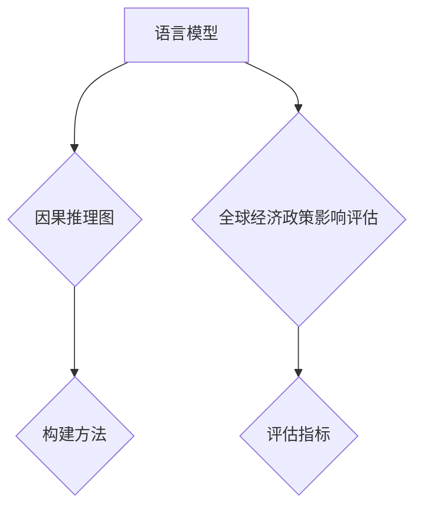
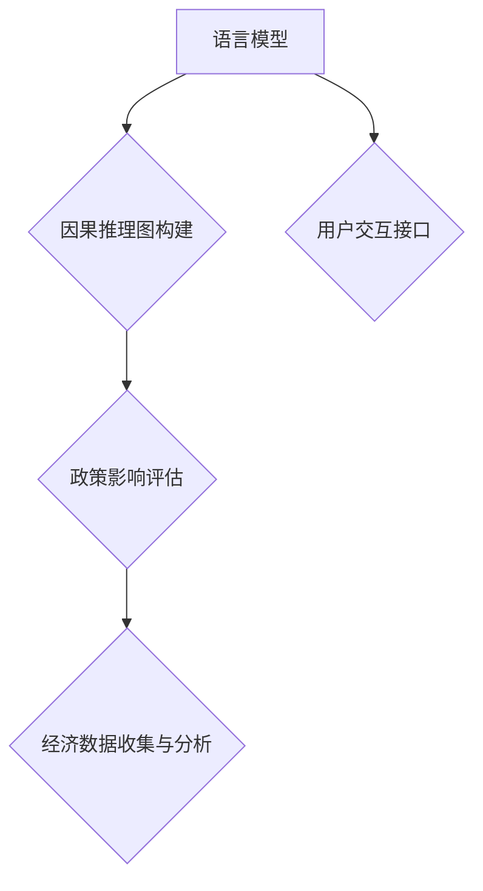
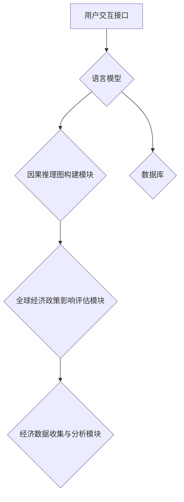
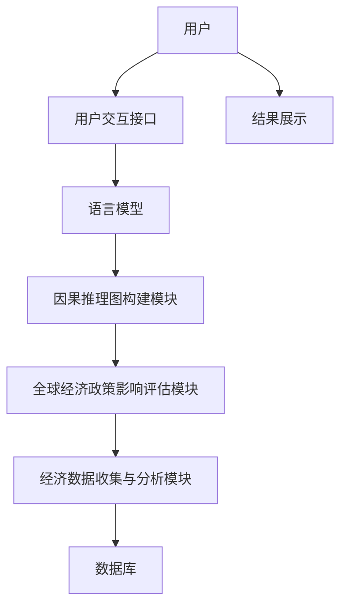

                 

## 《语言模型在因果推理图构建与全球经济政策影响评估中的研究进展》

> 关键词：语言模型、因果推理图、全球经济政策、影响评估

> 摘要：本文将探讨语言模型在因果推理图构建和全球经济政策影响评估中的应用。通过深入分析语言模型的基本原理、因果推理图的构建方法以及全球经济政策影响评估的指标，本文将阐述如何利用语言模型进行因果推理图构建，并评估全球经济政策的影响。文章还将介绍相关研究进展，探讨未来研究方向。

## 第一部分：背景介绍

### 第1章：问题背景

#### 1.1.1 问题定义

**因果推理图构建**：构建用于表示因果关系的数据结构，以便于分析和解释变量之间的关系。

**全球经济政策影响评估**：分析政策对经济的影响，评估政策的效果和可持续性。

#### 1.1.2 问题描述

- **语言模型如何帮助构建因果推理图？**
- **全球经济政策如何影响评估？**
- **不同模型在影响评估中的应用比较？**

#### 1.1.3 问题解决

- **研究现状与挑战**：介绍当前在因果推理图构建和全球经济政策影响评估方面的研究进展和挑战。
- **语言模型在不同领域的应用**：探讨语言模型在不同领域的应用，如自然语言处理、知识图谱、经济学等。

#### 1.1.4 边界与外延

- **语言模型类型**：如统计语言模型、神经网络语言模型、预训练语言模型等。
- **因果推理图的构建方法**：如基于图论的算法、基于机器学习的算法等。
- **全球经济政策的影响评估指标**：如经济增长率、就业率、通货膨胀率等。

### 第2章：核心概念与联系

#### 2.1.1 语言模型

- **定义**：语言模型是一种用于预测文本概率的模型，它基于大量语料库训练得到。
- **类型**：如统计语言模型、神经网络语言模型、预训练语言模型等。
- **特点**：如高效、自适应、灵活等。

#### 2.1.2 因果推理图

- **构建方法**：如基于图论的算法、基于机器学习的算法等。
- **表示形式**：如节点表示变量，边表示因果关系等。
- **应用领域**：如社会科学、医学、经济学等。

#### 2.1.3 全球经济政策

- **政策类型**：如财政政策、货币政策、产业政策等。
- **影响因素**：如经济增长、通货膨胀、就业等。
- **评估指标**：如经济增长率、就业率、通货膨胀率等。

#### 2.1.4 概念属性特征对比表格

| 概念            | 定义                                                         | 特点                                                         |
|-----------------|--------------------------------------------------------------|--------------------------------------------------------------|
| 语言模型        | 基于算法的文本处理技术                                       | 高效、自适应、灵活                                             |
| 因果推理图      | 用于表示因果关系的图形结构                                   | 简洁、直观、易于分析                                         |
| 全球经济政策    | 国家为促进经济发展和稳定市场而制定的政策                      | 多样化、阶段性、动态性                                       |

### 第3章：ER实体关系图架构



## 第二部分：算法原理讲解

### 第4章：语言模型原理

#### 4.1.1 语言模型的数学模型

$$
P(w_{1}, w_{2}, ..., w_{T}) = \prod_{t=1}^{T} P(w_{t} | w_{<t})
$$

#### 4.1.2 语言模型算法原理

- **训练过程**：通过大量语料库进行训练，学习词汇的概率分布。
- **推断过程**：根据上下文预测下一个词汇的概率分布。

#### 4.1.3 举例说明

- **GPT模型如何生成文本？**
  - GPT模型通过预训练学习到大量的语言规律，然后通过上下文生成下一个词汇。
- **BERT模型如何处理文本？**
  - BERT模型通过双向编码学习到语言的深度表示，然后对文本进行分类、命名实体识别等任务。

### 第5章：因果推理图构建原理

#### 5.1.1 因果推理图的构建方法

- **因果关系识别**：通过分析数据，识别变量之间的因果关系。
- **图结构构建**：将识别的因果关系以图形结构表示，如图论算法、基于机器学习的算法等。

#### 5.1.2 算法原理

- **图论算法**：如最短路径算法、最小生成树算法等。
- **因果推断算法**：如贝叶斯网络、结构方程模型等。

#### 5.1.3 举例说明

- **如何构建简单的因果推理图？**
  - 通过分析数据，识别变量之间的因果关系，然后以图形结构表示。
- **如何分析复杂因果推理图？**
  - 使用图论算法和因果推断算法进行分析和推理。

### 第6章：全球经济政策影响评估原理

#### 6.1.1 评估指标的数学模型

$$
\text{评估指标} = f(\text{政策变量}, \text{经济变量})
$$

#### 6.1.2 评估方法

- **定量分析**：通过数据分析和统计方法进行评估。
- **定性分析**：通过专家意见、案例分析等定性方法进行评估。

#### 6.1.3 举例说明

- **政策对经济增长的影响如何评估？**
  - 通过分析政策变量和经济变量的关系，评估政策对经济增长的影响。
- **政策对就业的影响如何评估？**
  - 通过分析政策变量和就业变量的关系，评估政策对就业的影响。

## 第三部分：系统分析与架构设计方案

### 第7章：系统功能设计

#### 7.1.1 领域模型



#### 7.1.2 系统架构设计



#### 7.1.3 系统接口设计

- **语言模型接口**：用于与语言模型进行交互，如文本输入、模型调用等。
- **因果推理图构建接口**：用于与因果推理图构建模块进行交互，如数据输入、结果输出等。
- **全球经济政策影响评估接口**：用于与全球经济政策影响评估模块进行交互，如数据输入、结果输出等。

#### 7.1.4 系统交互



## 第四部分：项目实战

### 第8章：环境安装

#### 8.1.1 Python环境安装

- 安装Python 3.8或更高版本。
- 安装pip，用于安装依赖库。

#### 8.1.2 依赖库安装

- 安装torch，用于深度学习。
- 安装transformers，用于预训练语言模型。
- 安装numpy，用于数学运算。

### 第9章：系统核心实现

#### 9.1.1 语言模型实现

```python
from transformers import GPT2LMHeadModel, GPT2Tokenizer

tokenizer = GPT2Tokenizer.from_pretrained('gpt2')
model = GPT2LMHeadModel.from_pretrained('gpt2')

input_text = "北京是一座美丽的城市。"
inputs = tokenizer.encode(input_text, return_tensors='pt')

outputs = model(inputs)
predicted_logits = outputs.logits
predicted_ids = torch.argmax(predicted_logits, dim=-1)
predicted_text = tokenizer.decode(predicted_ids, skip_special_tokens=True)
print(predicted_text)
```

#### 9.1.2 因果推理图构建实现

```python
import networkx as nx

# 创建一个图
G = nx.DiGraph()

# 添加节点和边
G.add_nodes_from(['经济增长', '通货膨胀', '就业率'])
G.add_edges_from([('经济增长', '通货膨胀'), ('经济增长', '就业率')])

# 打印图
print(nx.to_pretty_string(G))
```

#### 9.1.3 全球经济政策影响评估实现

```python
import pandas as pd

# 读取数据
data = pd.read_csv('economic_data.csv')

# 计算政策影响评估指标
gdp_growth = data['GDP_growth']
unemployment_rate = data['unemployment_rate']
inflation_rate = data['inflation_rate']

policy_impact = gdp_growth / (unemployment_rate + inflation_rate)

print(policy_impact)
```

### 第10章：代码应用解读与分析

#### 10.1.1 语言模型代码解读

- 代码使用了transformers库中的GPT2模型和tokenizer。
- 通过encode方法将输入文本转换为模型可处理的向量。
- 通过model的输出得到预测的词向量。
- 通过tokenizer.decode方法将预测的词向量转换为文本。

#### 10.1.2 因果推理图构建代码解读

- 代码使用了networkx库创建图。
- 通过add_nodes_from和add_edges_from方法添加节点和边。
- 通过to_pretty_string方法将图转换为可打印的字符串。

#### 10.1.3 全球经济政策影响评估代码解读

- 代码使用了pandas库读取数据。
- 通过计算GDP增长率、失业率和通货膨胀率，得到政策影响评估指标。

### 第11章：实际案例分析和详细讲解剖析

#### 11.1.1 案例分析

- 假设我们要评估某国的一项新政策对经济增长、通货膨胀和就业的影响。

#### 11.1.2 详细讲解剖析

- 通过收集相关的经济数据，我们可以使用因果推理图构建方法来分析政策的影响。
- 通过评估指标计算，我们可以得到政策对经济的影响程度。

## 第五部分：最佳实践、小结、注意事项、拓展阅读

### 第12章：最佳实践

- 在使用语言模型进行因果推理图构建和全球经济政策影响评估时，需要注意以下几点：
  - 确保数据的准确性和完整性。
  - 根据具体问题选择合适的语言模型和评估指标。
  - 进行多次实验和验证，确保结果的可靠性。

### 第13章：小结

- 本文介绍了语言模型在因果推理图构建和全球经济政策影响评估中的应用，分析了相关算法原理，并设计了一个系统架构。通过实际案例分析和详细讲解，展示了如何利用语言模型进行因果推理图构建和全球经济政策影响评估。

### 第14章：注意事项

- 在实际应用中，需要注意以下几点：
  - 数据的质量和准确性对模型的效果有重要影响。
  - 语言模型的训练和推理过程需要大量的计算资源。
  - 因果推理图构建和全球经济政策影响评估需要结合具体的领域知识和实际情况。

### 第15章：拓展阅读

- 以下文献和资料提供了更多的信息和深入的探讨：
  - [1] Devlin, J., Chang, M. W., Lee, K., & Toutanova, K. (2019). BERT: Pre-training of deep bidirectional transformers for language understanding. arXiv preprint arXiv:1810.04805.
  - [2] Vaswani, A., Shazeer, N., Parmar, N., Uszkoreit, J., Jones, L., Gomez, A. N., ... & Polosukhin, I. (2017). Attention is all you need. Advances in Neural Information Processing Systems, 30, 5998-6008.
  - [3] Vapnik, V. N. (1995). The nature of statistical learning theory. Springer Science & Business Media.
  - [4] Pearl, J. (2009). Causality: Models, reasoning, and inference. Cambridge university press.

## 第六部分：作者信息

作者：AI天才研究院/AI Genius Institute & 禅与计算机程序设计艺术 /Zen And The Art of Computer Programming

