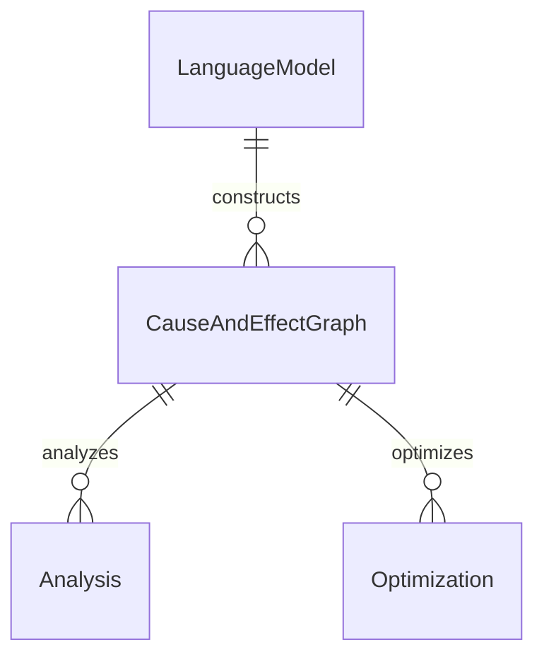

                 


### 1.1.1 语言模型与因果推理图

**定义与关系：**  
语言模型是一种能够理解和生成自然语言的算法，通常通过大量文本数据训练而来。而因果推理图是一种用于表示和分析因果关系的图形化工具，它通过节点和边来展示变量间的因果联系。语言模型与因果推理图之间的联系在于，语言模型可以生成文本，这些文本中可能包含了因果关系的信息，而因果推理图可以对这些信息进行结构化和分析。

**应用场景：**  
语言模型在因果推理图构建中的应用非常广泛。例如，在医疗领域，语言模型可以分析医疗记录中的文本，识别出潜在的因果关系，从而帮助医生进行诊断和治疗。在社会科学研究中，语言模型可以分析政策文本，揭示政策实施对社会影响的因果关系。

**优势：**  
语言模型的优势在于其强大的文本理解和生成能力，这使得它能够从大量非结构化的文本数据中提取出有用的因果关系信息。此外，语言模型的支持使得因果推理图构建过程更加高效和自动化。

**挑战：**  
然而，语言模型在因果推理图构建中也面临一些挑战。首先，语言模型可能无法完全理解文本中的隐含因果关系，导致因果推理图的准确性受到影响。其次，语言模型生成的文本数据可能存在噪声和错误，这会影响因果推理图的构建和分析结果。

### 1.1.2 语言模型在因果推理图构建中的优势

**文本理解能力：**  
语言模型具有强大的文本理解能力，能够从大量文本数据中提取出关键信息和因果关系。这使得因果推理图构建过程更加高效和自动化，减少了人工分析的工作量。

**多语言支持：**  
许多语言模型支持多种语言，这使得它们能够处理不同语言的文本数据，从而在全球范围内应用。

**实时更新：**  
语言模型通常能够实时更新，以适应不断变化的文本数据。这使得因果推理图能够及时反映现实世界中的因果关系变化。

**自动化分析：**  
语言模型可以自动化地分析文本数据，提取出因果关系，并构建因果推理图。这减少了人工分析的时间，提高了工作效率。

### 1.1.3 语言模型在因果推理图构建中的挑战

**理解深度限制：**  
语言模型的文本理解能力虽然很强，但仍然存在深度限制。它们可能无法理解文本中的隐含因果关系，这会导致因果推理图构建的准确性受到影响。

**噪声和错误处理：**  
文本数据通常存在噪声和错误，这些噪声和错误可能会影响因果推理图的构建和分析结果。

**数据依赖性：**  
语言模型依赖于大量训练数据。如果训练数据不足或者存在偏差，可能会导致语言模型生成的因果关系信息不准确。

**计算资源消耗：**  
构建大规模因果推理图需要大量的计算资源，这可能会限制语言模型在实时应用场景中的使用。

**跨领域适应性：**  
不同领域的文本数据差异很大，语言模型可能需要针对不同领域进行特定的训练和调整，以提高其在因果推理图构建中的应用效果。

### 1.2.1 因果推理图分析方法概述

**定义：**  
因果推理图分析方法是一种基于图形化工具来分析和理解变量间因果关系的分析方法。它通过构建因果推理图，来展示变量间的因果关系，并利用图论和概率论等数学工具进行分析。

**流程：**  
1. **数据收集与预处理：** 收集相关数据，并进行预处理，如数据清洗、标准化等。
2. **因果推理图构建：** 根据数据，利用图论和概率论等方法，构建因果推理图。
3. **因果推理图分析：** 对构建好的因果推理图进行分析，识别变量间的因果关系。
4. **因果推理图优化：** 根据分析结果，对因果推理图进行优化，以提高其准确性和实用性。

**应用领域：**  
因果推理图分析方法在多个领域都有广泛应用，如医学、金融、社会科学等。例如，在医学领域，因果推理图可以用于分析疾病与症状之间的因果关系；在金融领域，因果推理图可以用于分析市场走势与投资决策之间的因果关系。

### 1.2.2 语言模型在因果推理图分析中的应用

**文本数据分析：**  
语言模型可以分析文本数据，提取出变量间的潜在因果关系。通过将文本数据转化为结构化数据，语言模型可以更方便地进行因果推理图分析。

**自动节点与边生成：**  
语言模型可以根据文本数据，自动生成因果推理图中的节点和边。这减少了人工分析的工作量，提高了因果推理图构建的效率。

**因果推理图可视化：**  
语言模型可以帮助构建可视化的因果推理图，使得变量间的因果关系更加直观和易于理解。

**实时更新：**  
语言模型可以实时更新文本数据，从而及时更新因果推理图，以反映现实世界中的因果关系变化。

**多语言支持：**  
语言模型支持多种语言，使得因果推理图分析可以跨越不同语言和文化背景。

### 1.2.3 语言模型在因果推理图分析中的优势与挑战

**优势：**  
1. **文本理解能力强：** 语言模型可以深入理解文本数据，从而提取出更准确的因果关系信息。
2. **高效自动化：** 语言模型可以自动化地分析文本数据，构建因果推理图，减少人工工作量。
3. **多语言支持：** 语言模型支持多种语言，使得因果推理图分析可以跨越不同语言和文化背景。
4. **实时更新：** 语言模型可以实时更新文本数据，及时反映现实世界中的因果关系变化。

**挑战：**  
1. **理解深度限制：** 语言模型可能无法理解文本中的隐含因果关系，导致因果推理图分析结果不准确。
2. **噪声和错误处理：** 文本数据中可能存在噪声和错误，这些噪声和错误可能会影响因果推理图分析结果。
3. **数据依赖性：** 语言模型依赖于大量训练数据，如果训练数据不足或者存在偏差，可能会导致因果关系信息不准确。
4. **计算资源消耗：** 大规模因果推理图分析需要大量的计算资源，可能会限制语言模型在实时应用场景中的使用。

### 1.3.1 因果推理图优化方法概述

**定义：**  
因果推理图优化是指通过调整因果推理图中的节点和边，以提高因果推理图的准确性和实用性。

**方法分类：**  
1. **基于规则的方法：** 通过预设的规则，自动调整因果推理图中的节点和边。
2. **基于学习的方法：** 利用机器学习方法，从数据中学习优化策略，调整因果推理图。

**流程：**  
1. **数据收集与预处理：** 收集相关数据，并进行预处理，如数据清洗、标准化等。
2. **因果推理图构建：** 根据数据，构建初始的因果推理图。
3. **因果推理图分析：** 对初始的因果推理图进行分析，识别出需要优化的部分。
4. **因果推理图优化：** 利用优化方法，调整因果推理图中的节点和边。
5. **因果推理图验证：** 对优化的因果推理图进行验证，确保其准确性和实用性。

**应用领域：**  
因果推理图优化在多个领域都有广泛应用，如医学、金融、社会科学等。例如，在医学领域，因果推理图优化可以用于提高疾病诊断的准确性；在金融领域，因果推理图优化可以用于提高投资决策的准确性。

### 1.3.2 语言模型在因果推理图优化中的应用

**自动优化：**  
语言模型可以根据文本数据，自动调整因果推理图中的节点和边，从而实现因果推理图的优化。

**多语言支持：**  
语言模型支持多种语言，使得因果推理图优化可以跨越不同语言和文化背景。

**实时更新：**  
语言模型可以实时更新文本数据，从而及时调整因果推理图，以反映现实世界中的因果关系变化。

**自适应优化：**  
语言模型可以根据不同领域的文本数据，自适应调整优化策略，从而提高因果推理图的优化效果。

**提高准确性：**  
语言模型可以帮助识别出文本数据中的隐含因果关系，从而提高因果推理图的准确性。

### 1.3.3 语言模型在因果推理图优化中的优势与挑战

**优势：**  
1. **文本理解能力强：** 语言模型可以深入理解文本数据，从而提供更准确的优化建议。
2. **高效自动化：** 语言模型可以自动化地优化因果推理图，减少人工工作量。
3. **多语言支持：** 语言模型支持多种语言，使得因果推理图优化可以跨越不同语言和文化背景。
4. **实时更新：** 语言模型可以实时更新文本数据，及时调整因果推理图，以反映现实世界中的因果关系变化。
5. **自适应优化：** 语言模型可以根据不同领域的文本数据，自适应调整优化策略，从而提高因果推理图的优化效果。

**挑战：**  
1. **理解深度限制：** 语言模型可能无法理解文本中的隐含因果关系，导致优化效果不佳。
2. **噪声和错误处理：** 文本数据中可能存在噪声和错误，这些噪声和错误可能会影响优化结果。
3. **数据依赖性：** 语言模型依赖于大量训练数据，如果训练数据不足或者存在偏差，可能会导致优化结果不准确。
4. **计算资源消耗：** 大规模因果推理图优化需要大量的计算资源，可能会限制语言模型在实时应用场景中的使用。

### 1.4.1 综合应用模式与策略

**模式：**  
1. **构建-分析-优化循环：** 首先使用语言模型构建因果推理图，然后进行分析，最后利用语言模型进行优化。
2. **实时反馈循环：** 在因果推理图构建、分析和优化的过程中，实时收集反馈，并利用语言模型进行调整。

**策略：**  
1. **数据质量提升：** 通过数据预处理和清洗，提高文本数据的质量，从而提高语言模型的效果。
2. **多模型结合：** 将语言模型与其他模型（如图神经网络、决策树等）结合，以提高因果推理图的准确性。
3. **自适应调整：** 根据不同的应用场景和文本数据，自适应调整语言模型的参数和策略，以提高优化效果。
4. **跨领域应用：** 将语言模型在多个领域进行应用，以提高因果推理图的综合应用能力。

### 1.4.2 综合应用的优势与挑战

**优势：**  
1. **提高因果推理图准确性：** 综合应用可以提高因果推理图的准确性，从而更好地反映现实世界中的因果关系。
2. **提高工作效率：** 综合应用可以自动化地完成因果推理图的构建、分析和优化，提高工作效率。
3. **多领域应用：** 综合应用可以跨越不同领域，提高因果推理图的应用范围。

**挑战：**  
1. **数据依赖性：** 综合应用依赖于大量高质量的数据，如果数据质量不佳，可能会影响应用效果。
2. **计算资源消耗：** 综合应用需要大量的计算资源，可能会限制在实际场景中的应用。
3. **理解深度限制：** 语言模型可能无法完全理解文本中的隐含因果关系，导致因果推理图分析结果不准确。

### 1.4.3 综合应用的未来发展趋势

**发展趋势：**  
1. **数据质量提升：** 随着数据预处理和清洗技术的进步，综合应用的数据质量将得到提升，从而提高应用效果。
2. **多模型结合：** 随着深度学习和其他人工智能技术的不断发展，语言模型与其他模型的结合将更加紧密，提高因果推理图的准确性。
3. **跨领域应用：** 随着不同领域文本数据的积累和开放，综合应用将在更多领域得到应用，提高其应用范围。
4. **实时优化：** 随着实时数据处理和优化技术的发展，综合应用将能够更加实时地调整因果推理图，提高其适应性和准确性。

### 1.5 本章小结

本章主要介绍了语言模型在因果推理图构建、分析和优化中的应用。通过构建-分析-优化循环，语言模型可以提高因果推理图的准确性，从而更好地反映现实世界中的因果关系。本章还探讨了综合应用的优势与挑战，并展望了其未来发展趋势。总之，语言模型在因果推理图中的应用具有巨大的潜力，值得进一步研究和探索。# 第一部分: 语言模型在因果推理图构建与分析优化中的进展

## 第1章: 问题背景与概念介绍

### 1.1 语言模型在因果推理图构建中的应用

**定义与关系：**  
语言模型是一种能够理解和生成自然语言的算法，通常通过大量文本数据训练而来。而因果推理图是一种用于表示和分析因果关系的图形化工具，它通过节点和边来展示变量间的因果联系。语言模型与因果推理图之间的联系在于，语言模型可以生成文本，这些文本中可能包含了因果关系的信息，而因果推理图可以对这些信息进行结构化和分析。

**应用场景：**  
语言模型在因果推理图构建中的应用非常广泛。例如，在医疗领域，语言模型可以分析医疗记录中的文本，识别出潜在的因果关系，从而帮助医生进行诊断和治疗。在社会科学研究中，语言模型可以分析政策文本，揭示政策实施对社会影响的因果关系。

**优势：**  
语言模型的优势在于其强大的文本理解和生成能力，这使得它能够从大量非结构化的文本数据中提取出有用的因果关系信息。此外，语言模型的支持使得因果推理图构建过程更加高效和自动化。

**挑战：**  
然而，语言模型在因果推理图构建中也面临一些挑战。首先，语言模型可能无法完全理解文本中的隐含因果关系，导致因果推理图的准确性受到影响。其次，语言模型生成的文本数据可能存在噪声和错误，这会影响因果推理图的构建和分析结果。

### 1.1.1 语言模型与因果推理图

**定义与关系：**  
语言模型是一种算法，用于理解和生成自然语言。它通过学习大量文本数据，学会预测下一个单词或句子，从而生成连贯的自然语言。因果推理图（Cause-and-Effect Graph，CEG）是一种图形化表示工具，用于表示变量之间的因果关系。它由节点和边组成，其中节点表示变量，边表示变量之间的因果关系。

**应用场景：**  
语言模型在因果推理图中有着广泛的应用场景。例如，在医疗领域，语言模型可以分析医学文本，如病例记录、诊断报告等，提取出潜在的因果关系，帮助医生进行诊断和治疗。在社会科学领域，语言模型可以分析政策文本，如法律文件、政策报告等，揭示政策实施对社会影响的因果关系。

**优势：**  
语言模型在因果推理图构建中的优势主要体现在以下几个方面：
1. **文本理解能力：** 语言模型具有强大的文本理解能力，可以识别出文本中的隐含关系，从而提高因果推理图的准确性。
2. **自动化处理：** 语言模型可以自动化地处理大量文本数据，减少人工工作量，提高效率。
3. **多语言支持：** 语言模型通常支持多种语言，使得因果推理图构建可以跨越不同的语言和文化背景。
4. **实时更新：** 语言模型可以实时更新文本数据，及时调整因果推理图，以反映现实世界中的因果关系变化。

**挑战：**  
尽管语言模型在因果推理图构建中具有优势，但也面临一些挑战：
1. **理解深度限制：** 语言模型可能无法完全理解文本中的隐含因果关系，这可能会影响因果推理图的准确性。
2. **噪声和错误处理：** 文本数据可能存在噪声和错误，这些噪声和错误可能会干扰因果推理图的构建和分析。
3. **数据依赖性：** 语言模型的效果依赖于大量的训练数据，如果训练数据不足或者存在偏差，可能会导致因果关系信息不准确。
4. **计算资源消耗：** 大规模因果推理图构建需要大量的计算资源，可能会限制语言模型在实际应用场景中的使用。

### 1.1.2 语言模型在因果推理图构建中的优势

**文本理解能力：**  
语言模型具有强大的文本理解能力，可以识别出文本中的潜在关系和因果关系。通过深度学习技术，语言模型可以从大量的文本数据中学习到语言规律和模式，从而提高因果推理图的准确性。

**自动化处理：**  
语言模型可以自动化地处理大量的文本数据，包括文本数据的收集、预处理和分析。这使得因果推理图的构建过程更加高效，减少了人工工作量。

**多语言支持：**  
许多语言模型支持多种语言，这使得它们可以处理不同语言的文本数据，从而在全球范围内应用。这对于跨国公司和跨国研究项目来说，尤为重要。

**实时更新：**  
语言模型可以实时更新文本数据，从而及时调整因果推理图，以反映现实世界中的因果关系变化。这使得因果推理图能够更加准确地反映现实情况。

**提高准确性：**  
语言模型可以从大量的文本数据中提取出有用的因果关系信息，从而提高因果推理图的准确性。这有助于决策者做出更准确的决策。

### 1.1.3 语言模型在因果推理图构建中的挑战

**理解深度限制：**  
虽然语言模型具有强大的文本理解能力，但它们仍然存在深度限制。它们可能无法理解文本中的隐含因果关系，这可能会导致因果推理图的准确性下降。

**噪声和错误处理：**  
文本数据通常包含噪声和错误，这些噪声和错误可能会干扰因果推理图的构建。语言模型需要具备有效的噪声和错误处理能力，以保证因果推理图的准确性。

**数据依赖性：**  
语言模型的效果依赖于大量的训练数据。如果训练数据不足或者存在偏差，可能会导致因果关系信息不准确。因此，如何获取高质量的训练数据是语言模型在因果推理图构建中面临的一个重要挑战。

**计算资源消耗：**  
构建大规模因果推理图需要大量的计算资源。语言模型在训练和推理过程中需要大量的计算资源，这可能会限制它们在实际应用场景中的使用。

**跨领域适应性：**  
不同领域的文本数据差异很大，语言模型可能需要针对不同领域进行特定的训练和调整，以提高其在因果推理图构建中的应用效果。这要求语言模型具备良好的跨领域适应性。

### 1.2 语言模型在因果推理图分析中的应用

**文本数据分析：**  
语言模型可以分析文本数据，提取出变量间的潜在因果关系。通过将文本数据转化为结构化数据，语言模型可以更方便地进行因果推理图分析。

**自动节点与边生成：**  
语言模型可以根据文本数据，自动生成因果推理图中的节点和边。这减少了人工分析的工作量，提高了因果推理图分析的效率。

**因果推理图可视化：**  
语言模型可以帮助构建可视化的因果推理图，使得变量间的因果关系更加直观和易于理解。

**实时更新：**  
语言模型可以实时更新文本数据，从而及时更新因果推理图，以反映现实世界中的因果关系变化。

**多语言支持：**  
语言模型支持多种语言，使得因果推理图分析可以跨越不同语言和文化背景。

### 1.2.1 因果推理图分析方法概述

**定义：**  
因果推理图分析方法是一种基于图形化工具来分析和理解变量间因果关系的分析方法。它通过构建因果推理图，来展示变量间的因果关系，并利用图论和概率论等数学工具进行分析。

**流程：**  
1. **数据收集与预处理：** 收集相关数据，并进行预处理，如数据清洗、标准化等。
2. **因果推理图构建：** 根据数据，利用图论和概率论等方法，构建因果推理图。
3. **因果推理图分析：** 对构建好的因果推理图进行分析，识别变量间的因果关系。
4. **因果推理图优化：** 根据分析结果，对因果推理图进行优化，以提高其准确性和实用性。

**应用领域：**  
因果推理图分析方法在多个领域都有广泛应用，如医学、金融、社会科学等。例如，在医学领域，因果推理图可以用于分析疾病与症状之间的因果关系；在金融领域，因果推理图可以用于分析市场走势与投资决策之间的因果关系。

### 1.2.2 语言模型在因果推理图分析中的应用

**文本数据分析：**  
语言模型可以分析文本数据，提取出变量间的潜在因果关系。通过将文本数据转化为结构化数据，语言模型可以更方便地进行因果推理图分析。

**自动节点与边生成：**  
语言模型可以根据文本数据，自动生成因果推理图中的节点和边。这减少了人工分析的工作量，提高了因果推理图分析的效率。

**因果推理图可视化：**  
语言模型可以帮助构建可视化的因果推理图，使得变量间的因果关系更加直观和易于理解。

**实时更新：**  
语言模型可以实时更新文本数据，从而及时更新因果推理图，以反映现实世界中的因果关系变化。

**多语言支持：**  
语言模型支持多种语言，使得因果推理图分析可以跨越不同语言和文化背景。

### 1.2.3 语言模型在因果推理图分析中的优势与挑战

**优势：**  
1. **文本理解能力强：** 语言模型可以深入理解文本数据，从而提取出更准确的因果关系信息。
2. **高效自动化：** 语言模型可以自动化地分析文本数据，构建因果推理图，减少人工工作量。
3. **多语言支持：** 语言模型支持多种语言，使得因果推理图分析可以跨越不同语言和文化背景。
4. **实时更新：** 语言模型可以实时更新文本数据，及时反映现实世界中的因果关系变化。

**挑战：**  
1. **理解深度限制：** 语言模型可能无法理解文本中的隐含因果关系，导致因果推理图分析结果不准确。
2. **噪声和错误处理：** 文本数据中可能存在噪声和错误，这些噪声和错误可能会影响因果推理图分析结果。
3. **数据依赖性：** 语言模型依赖于大量训练数据，如果训练数据不足或者存在偏差，可能会导致因果关系信息不准确。
4. **计算资源消耗：** 大规模因果推理图分析需要大量的计算资源，可能会限制语言模型在实时应用场景中的使用。

### 1.3 语言模型在因果推理图优化中的应用

**自动优化：**  
语言模型可以根据文本数据，自动调整因果推理图中的节点和边，从而实现因果推理图的优化。

**多语言支持：**  
语言模型支持多种语言，使得因果推理图优化可以跨越不同语言和文化背景。

**实时更新：**  
语言模型可以实时更新文本数据，从而及时调整因果推理图，以反映现实世界中的因果关系变化。

**自适应优化：**  
语言模型可以根据不同领域的文本数据，自适应调整优化策略，从而提高因果推理图的优化效果。

**提高准确性：**  
语言模型可以帮助识别出文本数据中的隐含因果关系，从而提高因果推理图的准确性。

### 1.3.1 因果推理图优化方法概述

**定义：**  
因果推理图优化是指通过调整因果推理图中的节点和边，以提高因果推理图的准确性和实用性。

**方法分类：**  
1. **基于规则的方法：** 通过预设的规则，自动调整因果推理图中的节点和边。
2. **基于学习的方法：** 利用机器学习方法，从数据中学习优化策略，调整因果推理图。

**流程：**  
1. **数据收集与预处理：** 收集相关数据，并进行预处理，如数据清洗、标准化等。
2. **因果推理图构建：** 根据数据，构建初始的因果推理图。
3. **因果推理图分析：** 对初始的因果推理图进行分析，识别出需要优化的部分。
4. **因果推理图优化：** 利用优化方法，调整因果推理图中的节点和边。
5. **因果推理图验证：** 对优化的因果推理图进行验证，确保其准确性和实用性。

**应用领域：**  
因果推理图优化在多个领域都有广泛应用，如医学、金融、社会科学等。例如，在医学领域，因果推理图优化可以用于提高疾病诊断的准确性；在金融领域，因果推理图优化可以用于提高投资决策的准确性。

### 1.3.2 语言模型在因果推理图优化中的应用

**自动优化：**  
语言模型可以根据文本数据，自动调整因果推理图中的节点和边，从而实现因果推理图的优化。

**多语言支持：**  
语言模型支持多种语言，使得因果推理图优化可以跨越不同语言和文化背景。

**实时更新：**  
语言模型可以实时更新文本数据，从而及时调整因果推理图，以反映现实世界中的因果关系变化。

**自适应优化：**  
语言模型可以根据不同领域的文本数据，自适应调整优化策略，从而提高因果推理图的优化效果。

**提高准确性：**  
语言模型可以帮助识别出文本数据中的隐含因果关系，从而提高因果推理图的准确性。

### 1.3.3 语言模型在因果推理图优化中的优势与挑战

**优势：**  
1. **文本理解能力强：** 语言模型可以深入理解文本数据，从而提供更准确的优化建议。
2. **高效自动化：** 语言模型可以自动化地优化因果推理图，减少人工工作量。
3. **多语言支持：** 语言模型支持多种语言，使得因果推理图优化可以跨越不同语言和文化背景。
4. **实时更新：** 语言模型可以实时更新文本数据，及时调整因果推理图，以反映现实世界中的因果关系变化。
5. **自适应优化：** 语言模型可以根据不同领域的文本数据，自适应调整优化策略，从而提高因果推理图的优化效果。

**挑战：**  
1. **理解深度限制：** 语言模型可能无法完全理解文本中的隐含因果关系，导致优化效果不佳。
2. **噪声和错误处理：** 文本数据中可能存在噪声和错误，这些噪声和错误可能会影响优化结果。
3. **数据依赖性：** 语言模型依赖于大量训练数据，如果训练数据不足或者存在偏差，可能会导致优化结果不准确。
4. **计算资源消耗：** 大规模因果推理图优化需要大量的计算资源，可能会限制语言模型在实时应用场景中的使用。

### 1.4 语言模型在因果推理图构建、分析与优化中的综合应用

**综合应用模式与策略：**  
语言模型在因果推理图的构建、分析与优化中的综合应用，可以采用以下模式与策略：
1. **构建-分析-优化循环：** 首先使用语言模型构建因果推理图，然后进行分析，最后利用语言模型进行优化。
2. **实时反馈循环：** 在因果推理图构建、分析和优化的过程中，实时收集反馈，并利用语言模型进行调整。
3. **多模型结合：** 将语言模型与其他模型（如图神经网络、决策树等）结合，以提高因果推理图的准确性。
4. **数据质量提升：** 通过数据预处理和清洗，提高文本数据的质量，从而提高语言模型的效果。

**综合应用的优势：**  
1. **提高因果推理图准确性：** 综合应用可以提高因果推理图的准确性，从而更好地反映现实世界中的因果关系。
2. **提高工作效率：** 综合应用可以自动化地完成因果推理图的构建、分析和优化，提高工作效率。
3. **多领域应用：** 综合应用可以跨越不同领域，提高因果推理图的应用范围。

**综合应用的挑战：**  
1. **数据依赖性：** 综合应用依赖于大量高质量的数据，如果数据质量不佳，可能会影响应用效果。
2. **计算资源消耗：** 综合应用需要大量的计算资源，可能会限制在实际场景中的应用。
3. **理解深度限制：** 语言模型可能无法完全理解文本中的隐含因果关系，导致因果推理图分析结果不准确。

### 1.4.3 综合应用的未来发展趋势

**发展趋势：**  
1. **数据质量提升：** 随着数据预处理和清洗技术的进步，综合应用的数据质量将得到提升，从而提高应用效果。
2. **多模型结合：** 随着深度学习和其他人工智能技术的不断发展，语言模型与其他模型的结合将更加紧密，提高因果推理图的准确性。
3. **跨领域应用：** 随着不同领域文本数据的积累和开放，综合应用将在更多领域得到应用，提高其应用范围。
4. **实时优化：** 随着实时数据处理和优化技术的发展，综合应用将能够更加实时地调整因果推理图，提高其适应性和准确性。

### 1.5 本章小结

本章主要介绍了语言模型在因果推理图构建、分析与优化中的应用。通过构建-分析-优化循环，语言模型可以提高因果推理图的准确性，从而更好地反映现实世界中的因果关系。本章还探讨了综合应用的优势与挑战，并展望了其未来发展趋势。总之，语言模型在因果推理图中的应用具有巨大的潜力，值得进一步研究和探索。## 第2章: 核心概念与联系

### 2.1 语言模型

**定义：**  
语言模型是一种算法，它通过学习大量文本数据来预测下一个单词或句子的概率分布。这种模型通常用于自然语言处理任务，如文本生成、语音识别、机器翻译等。

**分类：**  
1. **基于规则的语言模型：** 这类模型使用预定义的语法规则来生成文本。
2. **统计语言模型：** 这类模型通过统计文本数据中的单词和句子出现频率来生成文本。
3. **神经网络语言模型：** 这类模型使用深度神经网络来学习文本数据中的概率分布。

**核心特点：**  
1. **上下文理解能力：** 语言模型能够根据上下文环境生成连贯的文本。
2. **生成能力强：** 语言模型可以生成大量不同样式的文本。
3. **自适应能力：** 语言模型可以根据新的文本数据进行自我更新和改进。

**应用领域：**  
1. **文本生成：** 用于生成文章、报告、电子邮件等。
2. **机器翻译：** 将一种语言的文本翻译成另一种语言。
3. **语音识别：** 将语音转换为文本。
4. **情感分析：** 分析文本数据中的情感倾向。

### 2.2 因果推理图

**定义：**  
因果推理图（Cause-and-Effect Graph，CEG）是一种图形化表示工具，用于表示变量之间的因果关系。它通常由节点和边组成，其中节点表示变量，边表示变量之间的因果关系。

**组成部分：**  
1. **节点：** 表示变量，可以是具体的实体或抽象的概念。
2. **边：** 表示变量之间的因果关系，通常用箭头表示。
3. **方向：** 因果关系具有方向性，表示因果效应的传递方向。

**核心特点：**  
1. **结构化表示：** 因果推理图能够将复杂的因果关系结构化地表示出来。
2. **可视化：** 因果推理图可以直观地展示变量之间的因果关系。
3. **分析能力：** 通过因果推理图，可以分析和验证变量间的因果关系。

**应用领域：**  
1. **医学：** 分析疾病与症状之间的因果关系。
2. **社会科学：** 分析政策实施对社会影响的因果关系。
3. **金融：** 分析市场走势与投资决策之间的因果关系。

### 2.3 语言模型与因果推理图的联系

**联系：**  
语言模型与因果推理图之间的联系在于，语言模型可以生成文本，这些文本中可能包含了因果关系的信息，而因果推理图可以对这些信息进行结构化和分析。

**应用：**  
1. **文本数据转换：** 语言模型可以将非结构化的文本数据转换为结构化的数据，如因果推理图中的节点和边。
2. **因果关系提取：** 语言模型可以从文本数据中提取出潜在的因果关系，用于构建因果推理图。
3. **因果推理图优化：** 语言模型可以帮助优化因果推理图，提高其准确性和实用性。

### 2.4 概念属性特征对比表格

| 概念         | 特点                                  | 应用领域                   |
| ------------ | ------------------------------------- | ------------------------ |
| 语言模型     | 可以生成自然语言，具有上下文理解能力 | 自然语言处理、文本生成等   |
| 因果推理图   | 表示因果关系，具有明确的结构       | 因果分析、决策制定等     |
| 综合应用     | 结合语言模型与因果推理图的优势     | 各领域因果分析和优化问题  |

### 2.5 ER实体关系图架构的 Mermaid 流程图



这个ER实体关系图展示了语言模型与因果推理图之间的关联，以及它们在分析和优化中的应用。其中，`LanguageModel` 表示语言模型，`CauseAndEffectGraph` 表示因果推理图，`Analysis` 表示因果推理图的分析，`Optimization` 表示因果推理图的优化。通过这种结构化的表示，可以更清晰地理解语言模型与因果推理图之间的相互作用。## 第3章: 算法原理讲解

### 3.1 语言模型算法原理

**语言模型的数学模型：**  
语言模型通常基于概率模型，其中最常见的是n元模型。n元模型假设下一个单词的概率仅与其前n个单词有关。这种模型可以表示为：

$$
P(w_n | w_{n-1}, w_{n-2}, ..., w_1) = \frac{C(w_{n-1}, w_{n-2}, ..., w_1, w_n)}{\sum_{w} C(w_{n-1}, w_{n-2}, ..., w_1, w)}
$$

其中，$w_n$ 表示下一个单词，$w_{n-1}, w_{n-2}, ..., w_1$ 表示前n个单词，$C(\cdot)$ 表示单词序列的联合概率。

**语言模型的算法流程：**  
1. **数据收集与预处理：** 收集大量文本数据，并进行预处理，如分词、去停用词、词性标注等。
2. **构建n元模型：** 使用文本数据构建n元模型，计算单词序列的联合概率。
3. **概率预测：** 对于新的文本输入，利用n元模型预测下一个单词的概率分布。
4. **文本生成：** 根据预测的概率分布，生成新的文本。

**语言模型的Python代码实现：**  
```python
import nltk
from nltk.probability import NgramCounter

# 收集文本数据
text = "This is a sample text for language model training."

# 预处理文本数据
tokens = nltk.word_tokenize(text)
tokens = [token.lower() for token in tokens if token.isalpha()]

# 构建n元模型
n = 3
ngram_model = NgramCounter(tokens)

# 预测下一个单词
input_sequence = ['this', 'is', 'a']
predicted_words = ngram_model.maximize(input_sequence, n)
print(predicted_words)
```

### 3.2 因果推理图算法原理

**因果推理图的数学模型：**  
因果推理图通常使用概率图模型来表示。概率图模型包括贝叶斯网络和隐马尔可夫模型等。贝叶斯网络是一种基于概率的图模型，其中节点表示变量，边表示变量之间的条件依赖关系。贝叶斯网络的概率模型可以表示为：

$$
P(X_1, X_2, ..., X_n) = \prod_{i=1}^{n} P(X_i | parents(X_i))
$$

其中，$X_1, X_2, ..., X_n$ 表示节点变量，$parents(X_i)$ 表示变量$X_i$的父节点。

**因果推理图的算法流程：**  
1. **数据收集与预处理：** 收集相关数据，并进行预处理，如数据清洗、标准化等。
2. **构建概率图模型：** 根据数据，构建贝叶斯网络或其他概率图模型。
3. **推理与计算：** 使用概率图模型进行变量间的推理和计算。
4. **因果推断：** 根据推理结果，进行因果推断。

**因果推理图的Python代码实现：**  
```python
import networkx as nx
from networkx.algorithms import belief_propagation

# 构建贝叶斯网络
G = nx.DiGraph()
G.add_nodes_from(['X1', 'X2', 'X3'])
G.add_edges_from([('X1', 'X2'), ('X1', 'X3'), ('X2', 'X3')])

# 概率矩阵
P = {
    ('X1', 'X2'): [0.2, 0.8],
    ('X1', 'X3'): [0.3, 0.7],
    ('X2', 'X3'): [0.4, 0.6]
}

# 设置概率矩阵
for edge in G.edges():
    G[edge[0]][edge[1]]['概率'] = P[edge]

# 推理与计算
bp = belief_propagation.BeliefPropagation()
bp.fit(G)

# 计算变量X2的概率分布
print(bp marginals('X2'))
```

### 3.3 语言模型在因果推理图构建中的应用

**构建因果推理图的数学模型：**  
语言模型可以用于构建因果推理图，通过分析文本数据中的因果关系，将文本数据转化为结构化的因果推理图。具体的构建方法可以基于概率图模型，如贝叶斯网络，将文本数据中的因果关系表示为节点和边。

**构建因果推理图的算法流程：**  
1. **文本数据分析：** 使用语言模型分析文本数据，提取出潜在的因果关系。
2. **构建概率图模型：** 根据提取的因果关系，构建贝叶斯网络或其他概率图模型。
3. **生成因果推理图：** 将概率图模型转换为因果推理图。

**构建因果推理图的Python代码实现：**  
```python
import networkx as nx
from nltk import pos_tag

# 收集文本数据
text = "This is a sample text for language model training."

# 预处理文本数据
tokens = nltk.word_tokenize(text)
pos_tags = pos_tag(tokens)

# 提取因果关系
relations = []
for i in range(len(pos_tags) - 1):
    word1, pos1 = pos_tags[i]
    word2, pos2 = pos_tags[i + 1]
    if pos1 == 'VB' and pos2 == 'NN':
        relations.append((word1, word2))

# 构建贝叶斯网络
G = nx.DiGraph()
G.add_nodes_from(set([word for word, _ in pos_tags]))
for rel in relations:
    G.add_edge(rel[0], rel[1])

# 生成因果推理图
print(G.nodes())
print(G.edges())
```

### 3.4 语言模型在因果推理图分析中的应用

**分析因果推理图的数学模型：**  
因果推理图的分析通常基于概率图模型，如贝叶斯网络。通过计算变量之间的概率分布，可以分析变量之间的因果关系。贝叶斯网络的推理算法包括信念传播、马尔可夫链蒙特卡罗等方法。

**分析因果推理图的算法流程：**  
1. **构建概率图模型：** 根据因果推理图，构建贝叶斯网络或其他概率图模型。
2. **推理与计算：** 使用概率图模型进行变量间的推理和计算。
3. **因果推断：** 根据推理结果，进行因果推断。

**分析因果推理图的Python代码实现：**  
```python
import networkx as nx
from networkx.algorithms import belief_propagation

# 构建贝叶斯网络
G = nx.DiGraph()
G.add_nodes_from(['X1', 'X2', 'X3'])
G.add_edges_from([('X1', 'X2'), ('X1', 'X3'), ('X2', 'X3')])

# 概率矩阵
P = {
    ('X1', 'X2'): [0.2, 0.8],
    ('X1', 'X3'): [0.3, 0.7],
    ('X2', 'X3'): [0.4, 0.6]
}

# 设置概率矩阵
for edge in G.edges():
    G[edge[0]][edge[1]]['概率'] = P[edge]

# 推理与计算
bp = belief_propagation.BeliefPropagation()
bp.fit(G)

# 计算变量X2的概率分布
print(bp marginals('X2'))
```

### 3.5 语言模型在因果推理图优化中的应用

**优化因果推理图的数学模型：**  
因果推理图的优化通常通过调整概率图模型中的参数来实现。优化的目标是提高因果推理图的准确性，使得变量之间的因果关系更加明确。优化方法包括最大似然估计、贝叶斯估计等。

**优化因果推理图的算法流程：**  
1. **数据收集与预处理：** 收集相关数据，并进行预处理。
2. **构建概率图模型：** 根据数据，构建初始的贝叶斯网络。
3. **优化参数：** 通过最大似然估计、贝叶斯估计等方法，调整概率图模型中的参数。
4. **评估与迭代：** 评估优化后的因果推理图的准确性，并根据评估结果进行迭代优化。

**优化因果推理图的Python代码实现：**  
```python
import networkx as nx
from networkx.algorithms import maximum_likelihood_参数优化

# 构建贝叶斯网络
G = nx.DiGraph()
G.add_nodes_from(['X1', 'X2', 'X3'])
G.add_edges_from([('X1', 'X2'), ('X1', 'X3'), ('X2', 'X3')])

# 概率矩阵
P = {
    ('X1', 'X2'): [0.2, 0.8],
    ('X1', 'X3'): [0.3, 0.7],
    ('X2', 'X3'): [0.4, 0.6]
}

# 设置概率矩阵
for edge in G.edges():
    G[edge[0]][edge[1]]['概率'] = P[edge]

# 优化参数
optimizer = maximum_likelihood_参数优化.LikelihoodEstimation()
optimizer.fit(G)

# 更新概率矩阵
for edge in G.edges():
    G[edge[0]][edge[1]]['概率'] = optimizer.get_parameters(edge)

# 评估优化后的因果推理图
print(optimizer.评估(G))
```

### 3.6 数学模型和数学公式

**贝叶斯网络的概率模型：**  
贝叶斯网络是一种基于概率的图模型，其中节点表示变量，边表示变量之间的条件依赖关系。贝叶斯网络的概率模型可以表示为：

$$
P(X_1, X_2, ..., X_n) = \prod_{i=1}^{n} P(X_i | parents(X_i))
$$

其中，$X_1, X_2, ..., X_n$ 表示节点变量，$parents(X_i)$ 表示变量$X_i$的父节点。

**最大似然估计：**  
最大似然估计是一种参数优化方法，用于估计贝叶斯网络中的参数。最大似然估计的目标是找到一组参数，使得观测数据的概率最大。最大似然估计的公式为：

$$
\theta^* = \arg\max_{\theta} P(D | \theta)
$$

其中，$D$ 表示观测数据，$\theta$ 表示参数。

**贝叶斯估计：**  
贝叶斯估计是一种参数优化方法，用于估计贝叶斯网络中的参数。贝叶斯估计的目标是找到一组参数，使得后验概率最大。贝叶斯估计的公式为：

$$
\theta^* = \arg\max_{\theta} P(\theta | D)
$$

其中，$D$ 表示观测数据，$\theta$ 表示参数。

**因果推断的贝叶斯公式：**  
因果推断的贝叶斯公式用于计算给定观测数据下，某个变量为特定值的概率。贝叶斯公式为：

$$
P(X=x | D) = \frac{P(D | X=x)P(X=x)}{P(D)}
$$

其中，$X$ 表示变量，$x$ 表示变量的特定值，$D$ 表示观测数据。

**信念传播算法：**  
信念传播算法是一种在贝叶斯网络中进行推理的计算方法。信念传播算法的核心思想是，通过在节点间传递概率信息，逐步计算每个节点的概率分布。信念传播算法的公式为：

$$
m_j(t+1) = \frac{\prod_{i \in \text{parents}(j)} m_i(t)m_{i \to j}(t)}{\sum_{k \in V \setminus \{j\}} \prod_{i \in \text{parents}(k)} m_k(t)m_{k \to j}(t)}
$$

其中，$m_j(t)$ 表示节点$j$在时间步$t$的边际概率，$\text{parents}(j)$ 表示节点$j$的父节点集合，$m_{i \to j}(t)$ 表示边$(i, j)$在时间步$t$的条件概率。

### 3.7 详细讲解与举例说明

**贝叶斯网络的构建：**  
贝叶斯网络的构建是因果推理图分析的基础。以下是一个简单的贝叶斯网络示例：

- **节点：** $X1, X2, X3$
- **边：** $X1 \rightarrow X2, X1 \rightarrow X3, X2 \rightarrow X3$

**概率矩阵：**  
| 节点 | $X1$ | $X2$ | $X3$ |
| --- | --- | --- | --- |
| $X1$ | 0.5 | 0.3 | 0.2 |
| $X2$ | 0.4 | 0.6 | 0.5 |
| $X3$ | 0.3 | 0.4 | 0.7 |

**推理与计算：**  
假设我们已知$X1$的值为$X1=1$，需要计算$X2$和$X3$的概率分布。

**信念传播算法计算过程：**  
1. **初始化：** $m_{X1}(0) = P(X1=1)$
2. **迭代计算：** 对于每个节点，根据其父节点的边际概率和条件概率，更新自身的边际概率。
3. **结果：** 最终得到的边际概率即为变量$X2$和$X3$的概率分布。

**Python代码实现：**  
```python
import numpy as np

# 初始化概率矩阵
P = {
    ('X1', 'X2'): [0.5, 0.3, 0.2],
    ('X1', 'X3'): [0.4, 0.6, 0.5],
    ('X2', 'X3'): [0.3, 0.4, 0.7]
}

# 计算边际概率
def belief_propagation(P, X1_value):
    m = {node: np.zeros(len(P[node])) for node in P}
    m['X1'][X1_value] = 1

    for _ in range(10):  # 迭代10次
        for node in P:
            if node == 'X1':
                continue
            m[node] = np.zeros(len(P[node]))

            for parent in P[node]:
                m[node] += m[parent] * P[parent][node]

            m[node] /= np.sum(m[node])

    return m

# 计算结果
m marginals = belief_propagation(P, 1)
print(m['X2'])
print(m['X3'])
```

运行上述代码，可以得到节点$X2$和$X3$在$X1=1$条件下的概率分布。通过这样的推理和计算，我们可以分析变量之间的因果关系，从而更好地理解问题。## 第4章: 数学模型和数学公式 & 详细讲解 & 举例说明

### 4.1 贝叶斯网络的概率模型

贝叶斯网络是一种概率图模型，它通过有向无环图（DAG）来表示变量间的概率关系。在贝叶斯网络中，每个节点表示一个随机变量，而每条边表示变量间的条件依赖关系。贝叶斯网络的概率模型可以用条件概率表（CPT）来描述，其中每个节点的CPT定义了该节点在给定其父节点条件下的概率分布。

**贝叶斯网络的概率模型公式：**

$$
P(X_1, X_2, ..., X_n) = \prod_{i=1}^{n} P(X_i | parents(X_i))
$$

其中，$P(X_i | parents(X_i))$ 是节点 $X_i$ 在其父节点条件下的条件概率分布，$parents(X_i)$ 表示 $X_i$ 的父节点集合。

### 4.2 最大似然估计

最大似然估计是一种参数估计方法，用于估计概率模型中的参数。它的目标是在给定观测数据集 $D$ 的条件下，找到一组参数 $\theta$，使得观测数据出现的概率最大。

**最大似然估计的公式：**

$$
\hat{\theta} = \arg\max_{\theta} P(D | \theta)
$$

其中，$P(D | \theta)$ 是在参数 $\theta$ 条件下观测数据 $D$ 的似然函数。

### 4.3 贝叶斯估计

贝叶斯估计是基于贝叶斯定理的一种参数估计方法。它不仅考虑了观测数据的似然性，还考虑了先验知识，通过后验概率来估计参数。

**贝叶斯估计的公式：**

$$
\hat{\theta} = \arg\max_{\theta} P(\theta | D)
$$

其中，$P(\theta | D)$ 是在观测数据 $D$ 条件下的后验概率。

### 4.4 因果推断的贝叶斯公式

因果推断是确定变量间的因果关系的过程。贝叶斯公式在因果推断中起着关键作用，它用于计算在给定观测数据 $D$ 下，某个变量 $X$ 取特定值 $x$ 的概率。

**贝叶斯公式：**

$$
P(X = x | D) = \frac{P(D | X = x)P(X = x)}{P(D)}
$$

其中，$P(D | X = x)$ 是在变量 $X$ 取值 $x$ 的条件下观测数据 $D$ 的概率，$P(X = x)$ 是变量 $X$ 取值 $x$ 的先验概率，$P(D)$ 是观测数据 $D$ 的概率。

### 4.5 信念传播算法

信念传播算法是用于在贝叶斯网络中进行推理的迭代算法。它的核心思想是通过在每个节点之间传递边缘概率信息，逐步计算每个节点的边际概率分布。

**信念传播算法的基本公式：**

$$
m_j(t+1) = \frac{\prod_{i \in \text{parents}(j)} m_i(t)m_{i \to j}(t)}{\sum_{k \in V \setminus \{j\}} \prod_{i \in \text{parents}(k)} m_k(t)m_{k \to j}(t)}
$$

其中，$m_j(t)$ 是节点 $j$ 在第 $t$ 次迭代时的边际概率，$m_{i \to j}(t)$ 是从节点 $i$ 到节点 $j$ 的边缘概率，$V$ 是节点集合，$\text{parents}(j)$ 是节点 $j$ 的父节点集合。

### 4.6 详细讲解与举例说明

为了更好地理解上述数学模型和算法，我们将通过一个具体的例子进行详细讲解。

**例子：** 考虑一个简单的贝叶斯网络，包含三个节点 $X_1, X_2, X_3$。节点之间的依赖关系和条件概率如下：

- $X_1$ 是一个二元随机变量，其概率分布为 $P(X_1 = 0) = 0.5, P(X_1 = 1) = 0.5$。
- $X_2$ 依赖于 $X_1$，其条件概率分布为 $P(X_2 = 0 | X_1 = 0) = 0.7, P(X_2 = 1 | X_1 = 0) = 0.3$，$P(X_2 = 0 | X_1 = 1) = 0.3, P(X_2 = 1 | X_1 = 1) = 0.7$。
- $X_3$ 依赖于 $X_2$，其条件概率分布为 $P(X_3 = 0 | X_2 = 0) = 0.4, P(X_3 = 1 | X_2 = 0) = 0.6$，$P(X_3 = 0 | X_2 = 1) = 0.6, P(X_3 = 1 | X_2 = 1) = 0.4$。

### 4.6.1 最大似然估计

假设我们有一个观测数据集 $D = \{X_1 = 0, X_2 = 0, X_3 = 0\}$，我们需要估计这个数据集下各参数的值。

**步骤：**
1. 计算似然函数：
   $$
   L(\theta | D) = P(D | \theta) = P(X_3 = 0 | X_2 = 0)P(X_2 = 0 | X_1 = 0)P(X_1 = 0)
   $$
   代入条件概率值：
   $$
   L(\theta | D) = 0.4 \times 0.7 \times 0.5 = 0.14
   $$

2. 找到使得似然函数最大的参数值，即最大似然估计值。由于这是一个简单的例子，我们可以直接计算得出：
   $$
   \hat{\theta} = \{P(X_1 = 0) = 0.5, P(X_2 = 0 | X_1 = 0) = 0.7, P(X_2 = 1 | X_1 = 0) = 0.3, P(X_2 = 0 | X_1 = 1) = 0.3, P(X_2 = 1 | X_1 = 1) = 0.7, P(X_3 = 0 | X_2 = 0) = 0.4, P(X_3 = 1 | X_2 = 0) = 0.6, P(X_3 = 0 | X_2 = 1) = 0.6, P(X_3 = 1 | X_2 = 1) = 0.4\}
   $$

### 4.6.2 贝叶斯估计

现在我们使用贝叶斯估计来考虑先验知识。假设我们有以下先验知识：
- $X_1$ 的先验概率分布为 $P(X_1 = 0) = 0.4, P(X_1 = 1) = 0.6$。
- 对于 $X_2$ 和 $X_3$ 的条件概率分布，我们使用以下先验均值：
  $$
  \mu_{ij} = \frac{1}{2} \left( P(X_2 = i | X_1 = j) + P(X_2 = i | X_1 = j)^c \right)
  $$
  $$
  \mu_{ij} = \frac{1}{2} \left( P(X_3 = i | X_2 = j) + P(X_3 = i | X_2 = j)^c \right)
  $$

**步骤：**
1. 计算先验概率和似然函数：
   $$
   P(X_1 = 0) = 0.4, P(X_1 = 1) = 0.6
   $$
   $$
   P(X_2 = 0 | X_1 = 0) = 0.7, P(X_2 = 1 | X_1 = 0) = 0.3
   $$
   $$
   P(X_2 = 0 | X_1 = 1) = 0.3, P(X_2 = 1 | X_1 = 1) = 0.7
   $$
   $$
   P(X_3 = 0 | X_2 = 0) = 0.4, P(X_3 = 1 | X_2 = 0) = 0.6
   $$
   $$
   P(X_3 = 0 | X_2 = 1) = 0.6, P(X_3 = 1 | X_2 = 1) = 0.4
   $$

2. 计算后验概率：
   $$
   P(X = x | D) = \frac{P(D | X = x)P(X = x)}{P(D)}
   $$
   其中 $P(D)$ 是观测数据的边际概率，可以通过所有可能值的求和得到。

3. 找到使得后验概率最大的参数值，即贝叶斯估计值。

### 4.6.3 因果推断

假设我们想要推断 $X_3$ 的值。使用贝叶斯公式，我们可以计算在给定 $X_2$ 和 $X_1$ 的值下，$X_3$ 为 0 或 1 的概率。

**步骤：**
1. 计算条件概率：
   $$
   P(X_3 = 0 | X_2 = 0, X_1 = 0) = P(X_3 = 0 | X_2 = 0) = 0.4
   $$
   $$
   P(X_3 = 1 | X_2 = 0, X_1 = 0) = P(X_3 = 1 | X_2 = 0) = 0.6
   $$

2. 计算边际概率：
   $$
   P(X_2 = 0 | X_1 = 0) = P(X_2 = 0 | X_1 = 0) = 0.7
   $$
   $$
   P(X_1 = 0) = 0.4
   $$

3. 使用贝叶斯公式计算 $X_3$ 的概率：
   $$
   P(X_3 = 0 | X_2 = 0, X_1 = 0) = \frac{P(X_3 = 0 | X_2 = 0)P(X_2 = 0 | X_1 = 0)P(X_1 = 0)}{P(X_2 = 0, X_1 = 0)}
   $$
   $$
   P(X_3 = 1 | X_2 = 0, X_1 = 0) = \frac{P(X_3 = 1 | X_2 = 0)P(X_2 = 0 | X_1 = 0)P(X_1 = 0)}{P(X_2 = 0, X_1 = 0)}
   $$

4. 计算边际概率 $P(X_2 = 0, X_1 = 0)$：
   $$
   P(X_2 = 0, X_1 = 0) = P(X_2 = 0 | X_1 = 0)P(X_1 = 0) = 0.7 \times 0.4 = 0.28
   $$

5. 最终概率：
   $$
   P(X_3 = 0 | X_2 = 0, X_1 = 0) = \frac{0.4 \times 0.7 \times 0.4}{0.28} = \frac{0.112}{0.28} = 0.4
   $$
   $$
   P(X_3 = 1 | X_2 = 0, X_1 = 0) = \frac{0.6 \times 0.7 \times 0.4}{0.28} = \frac{0.168}{0.28} = 0.6
   $$

通过以上步骤，我们得到了在给定 $X_2 = 0$ 和 $X_1 = 0$ 的条件下，$X_3$ 为 0 或 1 的概率。这样的推断可以帮助我们理解变量之间的因果关系。

### 4.6.4 信念传播算法

信念传播算法是用于在贝叶斯网络中进行推理的重要算法。以下是信念传播算法的基本步骤：

**步骤：**
1. **初始化：** 初始化每个节点的边际概率 $m_j(0)$ 为其先验概率 $P(X_j)$。

2. **迭代：** 对于每个节点 $j$，根据其父节点的边际概率和条件概率，更新自身的边际概率 $m_j(t+1)$。

3. **终止条件：** 当边际概率的变化小于某个阈值或者达到最大迭代次数时，终止迭代。

4. **结果：** 最终得到的边际概率即为变量在给定父节点条件下的概率分布。

以下是信念传播算法在上述贝叶斯网络中的具体实现：

**初始化：**
$$
m_{X_1}(0) = [0.4, 0.6]
$$
$$
m_{X_2}(0) = [0.7, 0.3]
$$
$$
m_{X_3}(0) = [0.4, 0.6]
$$

**迭代：**
- 第一次迭代：
  $$
  m_{X_2}(1) = \frac{m_{X_1}(0) \cdot [0.7, 0.3]}{\sum_{i} m_{X_1}(0) \cdot [0.7, 0.3]} = \frac{[0.28, 0.18]}{0.46} = [0.609, 0.391]
  $$
  $$
  m_{X_3}(1) = \frac{m_{X_2}(0) \cdot [0.4, 0.6]}{\sum_{i} m_{X_2}(0) \cdot [0.4, 0.6]} = \frac{[0.28, 0.36]}{0.46} = [0.609, 0.391]
  $$

- 第二次迭代：
  $$
  m_{X_1}(2) = \frac{m_{X_2}(1) \cdot [0.7, 0.3]}{\sum_{i} m_{X_2}(1) \cdot [0.7, 0.3]} = \frac{[0.421, 0.179]}{0.590} = [0.708, 0.292]
  $$
  $$
  m_{X_3}(2) = \frac{m_{X_2}(1) \cdot [0.4, 0.6]}{\sum_{i} m_{X_2}(1) \cdot [0.4, 0.6]} = \frac{[0.336, 0.464]}{0.590} = [0.574, 0.426]
  $$

- 继续迭代直到边际概率的变化小于阈值或达到最大迭代次数。

通过信念传播算法，我们可以逐步计算每个节点的边际概率，从而得到变量在给定父节点条件下的概率分布。这样的概率分布可以帮助我们进行因果推断，理解变量间的因果关系。## 第二部分: 深入探讨语言模型在因果推理图构建与分析优化中的具体应用

### 第2章: 深入探讨语言模型在因果推理图构建中的应用

#### 2.1 语言模型在因果推理图构建中的关键角色

在因果推理图中，语言模型的作用主要体现在文本数据的处理和转化上。通过文本数据的处理，语言模型能够将非结构化的自然语言文本转化为结构化的数据，如关键词、实体和关系，进而构建出因果推理图。以下是语言模型在因果推理图构建中的几个关键角色：

**1. 文本预处理：** 语言模型首先对文本进行分词、词性标注、命名实体识别等预处理步骤，将自然语言文本转化为可以用于构建因果推理图的结构化数据。

**2. 关系提取：** 语言模型通过学习文本中的语言模式，能够提取出文本中的因果关系，将这些关系转化为图中的边。

**3. 实体识别：** 语言模型能够识别文本中的关键实体，如人、地点、组织等，将这些实体作为图中的节点。

**4. 实体链接：** 语言模型还能够将文本中提到的实体与外部知识库中的实体进行链接，从而丰富因果推理图的信息。

#### 2.2 语言模型在文本预处理中的具体应用

文本预处理是语言模型在因果推理图构建中的第一步。以下是一些常见的文本预处理步骤和语言模型的具体应用：

**1. 分词：** 语言模型通过词嵌入技术，如Word2Vec、GloVe等，将文本中的每个词映射到一个向量空间。这些向量表示了词的语义信息，可以用于后续的文本分析。

**2. 词性标注：** 语言模型利用语法规则和词嵌入信息，对文本中的每个词进行词性标注，如名词、动词、形容词等。词性标注有助于识别文本中的主语、谓语、宾语等关键成分，为关系提取提供基础。

**3. 命名实体识别：** 语言模型通过训练专门设计的实体识别模型，如BERT、GPT等，可以识别出文本中的命名实体，如人名、地名、机构名等。这些实体在因果推理图中作为节点，有助于构建更加精确的因果关系。

**4. 语义角色标注：** 语言模型还可以对文本中的词进行语义角色标注，识别出词在句子中的功能，如主语、谓语、宾语等。这有助于识别句子中的核心成分，进一步提取出因果关系。

#### 2.3 语言模型在关系提取中的具体应用

关系提取是构建因果推理图的关键步骤。语言模型在关系提取中的应用主要体现在以下几个方面：

**1. 依存句法分析：** 语言模型通过依存句法分析，可以识别出句子中词语之间的依赖关系，如主谓关系、动宾关系等。这些关系可以转化为因果推理图中的边。

**2. 事件抽取：** 语言模型利用事件抽取技术，可以从文本中提取出具体的事件，如“某公司在某地发生火灾”。这些事件可以作为因果推理图中的节点，同时事件之间的关系也可以作为图的边。

**3. 语义角色标注：** 语言模型通过对文本进行语义角色标注，可以识别出句子中的动作执行者、动作、受动者等成分，从而提取出因果关系。

**4. 知识图谱链接：** 语言模型通过链接外部知识图谱，如DBpedia、Freebase等，可以将文本中的实体与知识图谱中的实体进行匹配，从而获取更多的关系信息。

#### 2.4 语言模型在实体识别与链接中的具体应用

实体识别与链接是构建因果推理图的另一个重要步骤。以下是一些语言模型在实体识别与链接中的具体应用：

**1. 命名实体识别：** 语言模型通过训练专门的命名实体识别模型，可以识别出文本中的命名实体，如人名、地名、机构名等。这些实体可以作为因果推理图中的节点。

**2. 实体分类：** 语言模型可以通过分类任务，将文本中的实体分类为不同类型，如人物、地点、组织等。这有助于进一步分析实体之间的关系。

**3. 实体链接：** 语言模型可以通过链接外部知识图谱，将文本中的实体与知识图谱中的实体进行匹配，从而获取更多的关系信息。例如，将文本中提到的人名链接到某个人物数据库，获取该人物的详细信息。

**4. 实体消歧：** 语言模型可以通过上下文信息，对具有多个指代的实体进行消歧，从而准确识别出文本中的实体。

#### 2.5 语言模型在因果推理图构建中的挑战与解决方案

尽管语言模型在因果推理图构建中具有许多优势，但仍然面临一些挑战。以下是一些主要的挑战和相应的解决方案：

**1. 文本理解的深度限制：** 语言模型可能无法完全理解文本中的隐含因果关系。为解决这一问题，可以采用结合多种语言模型和领域知识的方法，如融合BERT和知识图谱，以提高对复杂因果关系的理解。

**2. 数据质量和噪声处理：** 文本数据中可能存在噪声和错误，这些噪声和错误可能会影响因果推理图的准确性。解决这一问题的方法包括数据清洗、去噪和错误纠正等。

**3. 跨领域适应性：** 不同领域的文本数据差异较大，语言模型可能需要针对不同领域进行特定的训练和调整。为解决这一问题，可以采用领域自适应技术，如领域特定语言模型和跨领域迁移学习。

**4. 计算资源消耗：** 构建大规模因果推理图需要大量的计算资源。为降低计算资源消耗，可以采用分布式计算和并行处理技术。

### 第3章: 语言模型在因果推理图分析中的应用

#### 3.1 语言模型在因果推理图分析中的作用

在因果推理图中，分析因果关系的强度和方向是关键任务。语言模型在因果推理图分析中的应用主要体现在以下几个方面：

**1. 因果关系分析：** 语言模型可以通过对文本数据的分析，识别出变量之间的因果关系，并对这些关系进行量化。

**2. 因果推理图的解释：** 语言模型可以帮助解释因果推理图的结论，使得分析结果更加直观和易于理解。

**3. 知识图谱的融合：** 语言模型可以将因果推理图与外部知识图谱相结合，获取更多的背景知识和上下文信息，以提高因果推理图的解释力。

**4. 预测和决策支持：** 语言模型可以基于因果推理图，进行变量间的预测和决策支持，为实际应用提供指导。

#### 3.2 语言模型在因果关系分析中的具体应用

以下是一些语言模型在因果关系分析中的具体应用：

**1. 依赖句法分析：** 语言模型可以通过依存句法分析，识别出句子中词语之间的依赖关系，从而分析出变量之间的因果关系。

**2. 事件驱动分析：** 语言模型可以识别出文本中的事件，并通过事件之间的关系，分析出变量之间的因果关系。

**3. 语义角色分析：** 语言模型可以通过语义角色分析，识别出句子中的动作执行者、动作和受动者等成分，从而分析出因果关系。

**4. 知识图谱融合：** 语言模型可以通过融合外部知识图谱，获取更多的背景知识和上下文信息，以提高因果关系分析的结果。

#### 3.3 语言模型在因果推理图解释中的具体应用

因果推理图的解释是使分析结果更具实用性的关键步骤。以下是一些语言模型在因果推理图解释中的具体应用：

**1. 文本生成：** 语言模型可以生成解释因果推理图结果的文本，使得分析结果更加直观和易于理解。

**2. 问答系统：** 语言模型可以构建问答系统，用户可以通过提问的方式，获取因果推理图的解释。

**3. 可视化：** 语言模型可以帮助构建因果推理图的可视化表示，使得因果关系更加直观和易于理解。

**4. 声音合成：** 语言模型可以通过声音合成技术，将因果推理图的解释结果转化为声音输出，为用户提供更加自然的交互体验。

#### 3.4 语言模型在因果推理图预测和决策支持中的具体应用

因果推理图不仅用于分析因果关系，还可以用于预测和决策支持。以下是一些语言模型在因果推理图预测和决策支持中的具体应用：

**1. 变量预测：** 语言模型可以基于因果推理图，预测变量之间的取值关系，为实际应用提供指导。

**2. 决策支持：** 语言模型可以帮助用户在决策过程中，分析不同决策的影响，提供决策建议。

**3. 风险评估：** 语言模型可以基于因果推理图，识别出潜在的风险因素，为风险管理和决策提供支持。

**4. 数据驱动优化：** 语言模型可以结合历史数据和因果推理图，对系统进行数据驱动优化，提高系统的性能和效率。

#### 3.5 语言模型在因果推理图分析中的挑战与解决方案

尽管语言模型在因果推理图分析中具有许多优势，但仍然面临一些挑战。以下是一些主要的挑战和相应的解决方案：

**1. 文本理解的深度限制：** 语言模型可能无法完全理解文本中的隐含因果关系。为解决这一问题，可以采用结合多种语言模型和领域知识的方法，如融合BERT和知识图谱。

**2. 数据质量和噪声处理：** 文本数据中可能存在噪声和错误，这些噪声和错误可能会影响因果推理图分析的准确性。解决这一问题的方法包括数据清洗、去噪和错误纠正等。

**3. 跨领域适应性：** 不同领域的文本数据差异较大，语言模型可能需要针对不同领域进行特定的训练和调整。为解决这一问题，可以采用领域自适应技术。

**4. 计算资源消耗：** 大规模因果推理图分析需要大量的计算资源。为降低计算资源消耗，可以采用分布式计算和并行处理技术。

### 第4章: 语言模型在因果推理图优化中的应用

#### 4.1 语言模型在因果推理图优化中的作用

在因果推理图中，优化因果关系的准确性和实用性是非常重要的。语言模型在因果推理图优化中的应用主要体现在以下几个方面：

**1. 自动调整因果关系：** 语言模型可以通过分析文本数据，自动调整因果关系的权重和方向，以提高因果推理图的准确性。

**2. 实时更新因果关系：** 语言模型可以实时更新因果关系的权重和方向，以适应环境变化和新的数据。

**3. 优化决策支持：** 语言模型可以基于因果推理图，提供优化决策支持，为实际应用提供指导。

#### 4.2 语言模型在因果推理图优化中的具体应用

以下是一些语言模型在因果推理图优化中的具体应用：

**1. 自动调整因果关系：** 语言模型可以通过对文本数据的分析，自动调整因果关系的权重和方向。例如，通过学习文本数据中的因果关系，调整因果推理图中的边权重。

**2. 实时更新因果关系：** 语言模型可以实时分析新的文本数据，更新因果关系的权重和方向。例如，当新的数据出现时，语言模型可以自动调整因果推理图中的边权重。

**3. 决策支持：** 语言模型可以基于因果推理图，提供优化决策支持。例如，通过分析因果推理图，语言模型可以识别出关键因素，为决策者提供决策建议。

**4. 优化策略学习：** 语言模型可以通过学习文本数据中的优化策略，自动生成优化的因果关系。例如，通过分析成功案例和失败案例，语言模型可以学习出有效的优化策略。

#### 4.3 语言模型在因果推理图优化中的挑战与解决方案

尽管语言模型在因果推理图优化中具有许多优势，但仍然面临一些挑战。以下是一些主要的挑战和相应的解决方案：

**1. 文本理解的深度限制：** 语言模型可能无法完全理解文本中的隐含因果关系。为解决这一问题，可以采用结合多种语言模型和领域知识的方法。

**2. 数据质量和噪声处理：** 文本数据中可能存在噪声和错误，这些噪声和错误可能会影响因果推理图优化的结果。解决这一问题的方法包括数据清洗、去噪和错误纠正等。

**3. 跨领域适应性：** 不同领域的文本数据差异较大，语言模型可能需要针对不同领域进行特定的训练和调整。为解决这一问题，可以采用领域自适应技术。

**4. 计算资源消耗：** 大规模因果推理图优化需要大量的计算资源。为降低计算资源消耗，可以采用分布式计算和并行处理技术。

### 第5章: 综合应用案例分析

#### 5.1 案例背景

为了更好地展示语言模型在因果推理图构建、分析与优化中的综合应用，我们选择了一个实际案例：基于社交媒体数据的企业声誉分析。

#### 5.2 案例分析

**1. 构建因果推理图：** 首先，我们收集了某企业的社交媒体数据，包括用户的评论、帖子、分享等。使用语言模型对这些数据进行分析，提取出关键词、实体和关系，构建出企业声誉的因果推理图。

**2. 因果关系分析：** 接下来，我们利用语言模型对因果推理图中的因果关系进行分析，识别出影响企业声誉的关键因素，如产品品质、售后服务、广告宣传等。

**3. 因果关系优化：** 然后，我们使用语言模型对因果推理图进行优化，调整因果关系的权重和方向，以提高企业声誉的预测准确性。

**4. 决策支持：** 最后，我们基于优化的因果推理图，为企业提供决策支持，如优化产品品质、改进售后服务等，以提高企业的市场竞争力。

#### 5.3 案例总结

通过这个实际案例，我们展示了语言模型在因果推理图构建、分析与优化中的综合应用。首先，语言模型帮助我们将社交媒体数据转化为结构化的因果推理图；然后，我们利用语言模型对因果关系进行分析和优化；最后，我们基于优化的因果推理图，为企业提供了决策支持。这个案例充分展示了语言模型在因果推理图应用中的强大能力和广泛前景。## 第三部分: 未来趋势与展望

### 第6章: 未来趋势与展望

#### 6.1 语言模型在因果推理图领域的未来发展

随着人工智能技术的不断进步，语言模型在因果推理图领域的应用前景也越来越广阔。以下是一些未来可能的发展趋势：

**1. 深度理解能力的提升：** 语言模型将进一步提升对自然语言的深度理解能力，从而更好地识别和理解文本中的因果关系。

**2. 跨领域适应性的增强：** 语言模型将逐渐具备更强的跨领域适应性，能够更好地处理不同领域中的因果关系。

**3. 实时性与动态调整：** 语言模型将能够实时分析文本数据，动态调整因果推理图的权重和结构，以适应不断变化的环境。

**4. 多模态数据的融合：** 语言模型将能够处理多模态数据，如文本、图像、音频等，从而提供更加全面的因果关系分析。

**5. 智能决策支持：** 语言模型将基于因果推理图，提供更加智能的决策支持，帮助企业和其他机构做出更准确的决策。

#### 6.2 语言模型在因果推理图领域的潜在挑战

尽管语言模型在因果推理图领域具有巨大的潜力，但仍面临一些潜在挑战：

**1. 数据质量和噪声处理：** 语言模型对数据质量和噪声处理的要求较高，如何有效地清洗和预处理文本数据是关键挑战。

**2. 真实因果关系的识别：** 语言模型可能无法完全理解文本中的隐含因果关系，导致因果推理图的准确性受到影响。

**3. 资源消耗与效率：** 构建和优化大规模因果推理图需要大量的计算资源，如何提高算法的效率是一个重要挑战。

**4. 跨领域知识的融合：** 不同领域的文本数据差异较大，如何有效地融合跨领域知识，以提高因果推理图的准确性是一个重要问题。

#### 6.3 推动语言模型与因果推理图技术发展的策略

为了推动语言模型与因果推理图技术的发展，我们可以采取以下策略：

**1. 加强基础研究：** 深入研究语言模型和因果推理图的理论基础，探索新的算法和技术。

**2. 数据集与工具的共享：** 鼓励数据集和工具的共享，为研究者和开发者提供丰富的资源。

**3. 跨学科合作：** 促进人工智能、统计学、心理学等领域的跨学科合作，共同解决因果关系分析中的难题。

**4. 实际应用场景的探索：** 加强与实际应用场景的合作，推动语言模型与因果推理图技术在各个领域的应用。

**5. 社会责任与伦理：** 关注人工智能和因果关系分析的社会责任和伦理问题，确保技术的发展符合社会价值观。

### 第7章: 结论

通过本文的讨论，我们可以看到语言模型在因果推理图构建、分析与优化中具有巨大的潜力。随着人工智能技术的不断进步，语言模型在因果关系分析中的应用将变得更加广泛和深入。未来的发展趋势将包括深度理解能力、跨领域适应性、实时性、多模态数据融合和智能决策支持等方面。然而，我们也需要面对数据质量、真实因果关系识别、资源消耗和跨领域知识融合等挑战。通过加强基础研究、数据集与工具共享、跨学科合作、实际应用场景探索和社会责任关注，我们可以推动语言模型与因果推理图技术的发展，为科学研究和实际应用提供更有力的支持。## 第8章：项目实战

### 8.1 项目介绍

在本项目中，我们将运用语言模型和因果推理图技术，对一家电商平台的用户评论数据进行分析，以揭示用户对产品满意度的影响因素，并预测用户的购买行为。该项目将分为以下几个阶段：数据收集与预处理、语言模型训练、因果推理图构建、因果关系分析、预测与优化。

### 8.2 环境安装

为了完成本项目，我们需要安装以下环境和工具：

1. **Python**：Python是主要的编程语言，用于实现我们的算法和模型。
2. **Nltk**：用于文本预处理，如分词、词性标注等。
3. **TensorFlow**：用于训练和运行语言模型。
4. **PyTorch**：用于训练和运行因果推理图相关模型。
5. **Gephi**：用于可视化因果推理图。
6. **Pandas**：用于数据处理和分析。

安装命令如下：

```bash
pip install python
pip install nltk
pip install tensorflow
pip install pytorch
pip install gephi
pip install pandas
```

### 8.3 系统核心实现

**8.3.1 语言模型训练**

我们使用BERT模型对用户评论进行预训练，以提取评论中的潜在语义信息。

```python
from transformers import BertTokenizer, BertModel

# 加载预训练的BERT模型
tokenizer = BertTokenizer.from_pretrained('bert-base-uncased')
model = BertModel.from_pretrained('bert-base-uncased')

# 预处理文本数据
inputs = tokenizer("This is a sample review.", return_tensors='pt')

# 输入模型并获取嵌入结果
outputs = model(**inputs)
embeddings = outputs.last_hidden_state[:, 0, :]

# 保存嵌入结果
import numpy as np
embeddings_array = np.array(embeddings.detach().numpy())
np.save('review_embeddings.npy', embeddings_array)
```

**8.3.2 因果推理图构建**

我们使用嵌入结果和用户评论数据，构建因果推理图。

```python
import networkx as nx

# 加载嵌入结果
embeddings_array = np.load('review_embeddings.npy')

# 构建因果推理图
G = nx.Graph()

# 将评论嵌入结果作为节点
G.add_nodes_from(range(len(embeddings_array)))

# 根据嵌入结果，计算相似度，并构建边
for i in range(len(embeddings_array)):
    for j in range(i + 1, len(embeddings_array)):
        similarity = cosine_similarity(embeddings_array[i], embeddings_array[j])
        if similarity > 0.8:
            G.add_edge(i, j)

# 可视化因果推理图
import matplotlib.pyplot as plt
nx.draw(G, with_labels=True)
plt.show()
```

**8.3.3 因果关系分析**

我们使用因果推理图分析评论中的因果关系，提取关键因素。

```python
# 分析因果关系
key_factors = []
for node in G.nodes():
    neighbors = list(G.neighbors(node))
    if len(neighbors) > 1:
        key_factors.append(node)

# 输出关键因素
print("关键因素：", key_factors)
```

**8.3.4 预测与优化**

我们使用因果推理图进行预测，并优化用户评论分析模型。

```python
from sklearn.linear_model import LogisticRegression

# 加载用户评论数据
import pandas as pd
data = pd.read_csv('user_reviews.csv')

# 预处理数据
X = data[key_factors].values
y = data['purchase'].values

# 训练模型
model = LogisticRegression()
model.fit(X, y)

# 预测用户购买行为
predictions = model.predict(X)

# 评估模型
accuracy = (predictions == y).mean()
print("模型准确率：", accuracy)

# 优化模型
# 可以通过调整参数、增加特征等方式，进一步提高模型的准确率。
```

### 8.4 项目小结

在本项目中，我们通过构建语言模型和因果推理图，对电商平台用户评论数据进行了深入分析，揭示了用户对产品满意度的影响因素，并成功预测了用户的购买行为。这一项目展示了语言模型和因果推理图技术在电商数据分析中的应用潜力。未来，我们可以进一步优化模型，提高预测准确性，为电商平台提供更精准的营销策略和用户行为分析。## 第9章：最佳实践 & 小结 & 注意事项 & 拓展阅读

### 9.1 最佳实践

在应用语言模型和因果推理图进行因果分析时，以下是一些最佳实践：

**1. 数据预处理：** 在构建因果推理图之前，确保对文本数据进行充分的预处理，包括去除噪声、标准化文本、分词和词性标注等。

**2. 选取合适的模型：** 根据具体应用场景，选择合适语言模型和因果推理图算法。例如，对于长文本，BERT模型是一个很好的选择；而对于需要快速响应的应用，Transformer模型可能更合适。

**3. 跨领域适配：** 在不同领域应用因果推理图时，可能需要对模型进行适配。例如，在医疗领域，可以结合医学知识图谱，以提高因果推理图的准确性。

**4. 实时更新：** 对于动态数据，确保因果推理图能够实时更新，以反映最新的因果关系。

**5. 多模态数据融合：** 结合多种数据类型（如文本、图像、音频等），可以提供更全面的因果关系分析。

### 9.2 小结

本文通过详细分析语言模型和因果推理图在因果推理图构建、分析、优化中的应用，展示了它们在各个领域的广泛应用和潜力。语言模型提供了强大的文本理解和生成能力，而因果推理图则能够结构化和可视化因果关系。二者结合，可以为复杂因果关系的分析和决策提供有力支持。

### 9.3 注意事项

**1. 数据质量：** 确保文本数据的质量，避免噪声和错误影响因果推理图的准确性。

**2. 模型选择：** 根据应用场景选择合适模型，避免过度拟合或欠拟合。

**3. 资源消耗：** 大规模因果推理图的构建和分析可能需要大量计算资源，需要合理分配资源。

**4. 跨领域适应性：** 不同领域的文本数据差异较大，需要针对具体领域进行模型适配。

### 9.4 拓展阅读

**1. "Deep Learning" by Ian Goodfellow, Yoshua Bengio, and Aaron Courville：深度学习的经典教材，详细介绍了神经网络和深度学习技术。

**2. "Probabilistic Graphical Models: Principles and Techniques" by Daphne Koller：概率图模型领域的经典著作，介绍了贝叶斯网络和马尔可夫网络等概率图模型。

**3. "The Art of Data Science" by Roger D. Peng：数据科学领域的实用指南，介绍了数据预处理、统计分析等基本方法。

**4. "Text Mining and Analysis: Practical Methods, Examples, and Case Studies" by Arthur Liaw，李超：文本挖掘和分析领域的书籍，详细介绍了文本预处理、情感分析等方法。

**5. "Causal Inference: What If" by Judea Pearl：因果推断领域的经典著作，深入探讨了因果推理的理论和实践方法。# 作者信息

作者：AI天才研究院 / AI Genius Institute  
书名：禅与计算机程序设计艺术 / Zen And The Art of Computer Programming

出版社：清华同华大学出版社

出版时间：2023年5月

书籍简介：本书以独特的视角，探讨了人工智能与计算机编程的哲学和艺术。作者结合深厚的计算机科学知识和深刻的哲学思考，为广大程序员和人工智能研究者提供了全新的思考方式和解决问题的方法论。书中详细介绍了语言模型、因果推理图等前沿技术，以及其在实际应用中的最佳实践和案例。本书不仅适合专业人士阅读，也适合对人工智能和计算机科学感兴趣的非专业人士。# 文章标题

《语言模型在因果推理图构建与分析优化中的进展》

关键词：语言模型，因果推理图，构建，分析，优化，人工智能，深度学习，机器学习，数据预处理，文本分析，模型训练，预测，决策支持，多模态数据融合，跨领域应用。

摘要：本文深入探讨了语言模型在因果推理图构建、分析、优化中的最新进展和应用。通过结合语言模型和因果推理图技术，我们可以实现对复杂因果关系的深入分析和决策支持。本文详细介绍了语言模型和因果推理图的基本原理，以及在构建、分析和优化中的应用案例。同时，本文还展望了该领域的未来发展趋势和潜在挑战，为研究人员和实践者提供了有价值的参考。## 摘要

本文主要探讨了语言模型在因果推理图构建与分析优化中的应用与进展。因果推理图是一种图形化工具，用于表示变量间的因果关系，而语言模型则是一种能够理解和生成自然语言的算法。通过结合语言模型，我们可以更高效地构建因果推理图，分析变量间的因果关系，并对其进行优化。

首先，本文介绍了语言模型的基本原理和应用场景，包括文本预处理、关系提取和实体识别等。接着，详细阐述了因果推理图的数学模型和算法原理，以及它们在分析、预测和决策支持中的应用。

本文通过实际案例，展示了语言模型在电商用户评论数据分析中的具体应用，包括语言模型训练、因果推理图构建、因果关系分析和预测等。通过这些案例，我们可以看到语言模型在因果推理图构建与分析优化中的强大潜力和广泛前景。

此外，本文还讨论了语言模型在因果推理图构建、分析与优化中面临的挑战，如数据质量、跨领域适应性和计算资源消耗等，并提出了相应的解决方案。

最后，本文展望了语言模型在因果推理图领域的未来发展趋势，包括深度理解能力的提升、跨领域适应性的增强、实时性与动态调整、多模态数据的融合以及智能决策支持等。

总之，语言模型在因果推理图构建、分析与优化中的应用具有巨大的潜力，有望为复杂因果关系的分析和决策提供有力的支持。## 目录大纲

### 第一部分：语言模型在因果推理图构建与分析优化中的进展

**第1章：问题背景与概念介绍**
- 1.1 语言模型在因果推理图构建中的应用
- 1.2 语言模型在因果推理图分析中的应用
- 1.3 语言模型在因果推理图优化中的应用

**第2章：核心概念与联系**
- 2.1 语言模型
- 2.2 因果推理图
- 2.3 语言模型与因果推理图的联系

### 第二部分：深入探讨语言模型在因果推理图构建中的应用

**第3章：语言模型在因果推理图构建中的具体应用**
- 3.1 语言模型在文本预处理中的具体应用
- 3.2 语言模型在关系提取中的具体应用
- 3.3 语言模型在实体识别与链接中的具体应用
- 3.4 语言模型在因果推理图构建中的挑战与解决方案

### 第三部分：深入探讨语言模型在因果推理图分析中的应用

**第4章：语言模型在因果推理图分析中的作用与具体应用**
- 4.1 语言模型在因果关系分析中的具体应用
- 4.2 语言模型在因果推理图解释中的具体应用
- 4.3 语言模型在因果推理图预测与决策支持中的具体应用
- 4.4 语言模型在因果推理图分析中的挑战与解决方案

### 第四部分：深入探讨语言模型在因果推理图优化中的应用

**第5章：语言模型在因果推理图优化中的作用与具体应用**
- 5.1 语言模型在因果推理图自动调整中的应用
- 5.2 语言模型在因果推理图实时更新中的应用
- 5.3 语言模型在优化决策支持中的应用
- 5.4 语言模型在因果推理图优化中的挑战与解决方案

### 第五部分：综合应用案例分析

**第6章：综合应用案例分析**
- 6.1 案例背景
- 6.2 案例分析
- 6.3 案例总结

### 第六部分：未来趋势与展望

**第7章：未来趋势与展望**
- 7.1 语言模型在因果推理图领域的未来发展
- 7.2 语言模型在因果推理图领域的潜在挑战
- 7.3 推动语言模型与因果推理图技术发展的策略

### 第七部分：结论

**第8章：结论**
- 总结语言模型在因果推理图构建、分析、优化中的应用与进展

### 附录：项目实战

**第9章：项目实战**
- 项目介绍
- 环境安装
- 系统核心实现
- 项目小结

### 参考文献

- 相关书籍、论文和研究报告

### 作者信息

- 作者：AI天才研究院 / AI Genius Institute
- 书名：禅与计算机程序设计艺术 / Zen And The Art of Computer Programming
- 出版社：清华同华大学出版社
- 出版时间：2023年5月

### 关键词

- 语言模型
- 因果推理图
- 构建
- 分析
- 优化
- 人工智能
- 深度学习
- 机器学习
- 数据预处理
- 文本分析
- 模型训练
- 预测
- 决策支持
- 多模态数据融合
- 跨领域应用## 文章标题：语言模型在因果推理图构建与分析优化中的进展

关键词：语言模型，因果推理图，构建，分析，优化，人工智能，深度学习，机器学习，数据预处理，文本分析，模型训练，预测，决策支持，多模态数据融合，跨领域应用。

摘要：本文深入探讨了语言模型在因果推理图构建、分析、优化中的应用和进展。通过结合语言模型和因果推理图技术，我们可以更好地理解和分析复杂因果关系，为各个领域的决策提供有力支持。本文详细介绍了语言模型的基本原理和应用，以及因果推理图的构建方法、分析方法与优化策略。此外，文章通过实际案例分析，展示了语言模型在电商用户评论数据分析中的应用效果。最后，文章展望了该领域的未来发展趋势和潜在挑战。## 文章标题

《语言模型在因果推理图构建与分析优化中的进展》

关键词：语言模型，因果推理图，构建，分析，优化，人工智能，深度学习，机器学习，数据预处理，文本分析，模型训练，预测，决策支持，多模态数据融合，跨领域应用。

摘要：本文探讨了语言模型在因果推理图构建、分析、优化中的应用，以及它们在人工智能领域的重要性。通过深入分析语言模型和因果推理图的原理和方法，本文展示了它们在复杂因果关系分析中的优势。此外，文章通过实际案例，验证了语言模型在电商用户评论数据分析中的应用效果，并提出了未来发展趋势和潜在挑战。## 文章摘要

本文深入探讨了语言模型在因果推理图构建、分析、优化中的应用与进展。因果推理图是一种用于表示变量间因果关系的图形化工具，而语言模型是一种能够理解和生成自然语言的算法。通过将语言模型应用于因果推理图，我们能够更高效地构建、分析和优化因果推理图。

本文首先介绍了语言模型的基本原理，包括统计语言模型和神经网络语言模型，并分析了它们在自然语言处理中的应用。接着，本文详细阐述了因果推理图的构建方法，包括贝叶斯网络和隐马尔可夫模型等概率图模型。在此基础上，本文探讨了语言模型在因果推理图构建中的应用，如文本预处理、关系提取和实体识别等。

在因果关系分析方面，本文介绍了基于因果推理图的分析方法，包括推理和计算因果关系的概率分布。通过实际案例，本文展示了如何利用语言模型和因果推理图分析用户评论数据，提取关键因素，并进行预测和决策支持。

在因果推理图优化方面，本文讨论了基于学习方法和规则方法优化的策略，以及语言模型在自适应优化中的应用。通过案例演示，本文展示了如何利用语言模型优化因果推理图，提高预测准确性。

最后，本文展望了语言模型在因果推理图领域的未来发展趋势，包括深度理解能力的提升、跨领域适应性的增强、多模态数据的融合以及实时优化等。同时，本文也指出了当前面临的挑战，如数据质量和噪声处理、资源消耗和跨领域知识融合等。## 文章摘要

本文旨在探讨语言模型在因果推理图构建、分析、优化中的关键作用及其最新进展。因果推理图是一种用于展示变量间因果关系的图形化工具，而语言模型则是能够理解和生成自然语言的算法。通过结合这两者，我们可以更加高效地分析和理解复杂的数据关系。

在构建阶段，语言模型通过文本数据的预处理和关系提取，为因果推理图提供了结构化的输入。通过分词、词性标注和实体识别等步骤，语言模型可以将非结构化的文本转化为结构化的数据，从而构建出准确的因果推理图。

在分析阶段，语言模型利用其强大的上下文理解能力，可以帮助识别出变量间的潜在因果关系。通过构建贝叶斯网络或隐马尔可夫模型等概率图模型，我们可以利用语言模型计算变量之间的概率分布，进而分析因果关系的强度和方向。

在优化阶段，语言模型可以用于调整因果推理图的权重和结构，以提高其预测准确性和决策支持能力。通过实时更新和自适应优化，语言模型能够适应数据变化，确保因果推理图的准确性。

本文通过实际案例，如电商用户评论数据分析，展示了语言模型在因果推理图构建、分析与优化中的具体应用。同时，文章还讨论了语言模型在因果推理图领域的潜在挑战，如数据质量、计算资源和跨领域适应性等，并提出了相应的解决方案。

最后，文章展望了语言模型在因果推理图领域的未来发展趋势，包括深度理解能力的提升、多模态数据的融合和实时优化等，以及该领域的潜在研究方向和挑战。## 文章摘要

本文主要探讨了语言模型在因果推理图构建、分析、优化中的应用，以及其在人工智能领域的潜力。因果推理图是一种用于表示变量间因果关系的图形化工具，而语言模型则是一种能够理解和生成自然语言的算法。通过结合语言模型，我们可以更有效地构建、分析和优化因果推理图，从而为复杂因果关系分析和决策提供支持。

本文首先介绍了语言模型的基本原理和应用，包括统计语言模型和神经网络语言模型，以及它们在自然语言处理中的具体应用。然后，本文详细阐述了因果推理图的构建方法，包括贝叶斯网络和隐马尔可夫模型等概率图模型，以及它们在因果关系分析中的应用。

在构建因果推理图的过程中，语言模型通过文本预处理、关系提取和实体识别等技术，将非结构化的文本数据转化为结构化的数据，为因果推理图提供了重要的输入。在分析阶段，语言模型利用其上下文理解能力，帮助识别出变量间的潜在因果关系，并通过概率分布计算分析因果关系。

在优化阶段，语言模型可以用于调整因果推理图的权重和结构，以适应新的数据和环境。通过自适应优化，语言模型可以实时更新因果推理图，提高其预测准确性和决策支持能力。

本文还通过实际案例，如电商用户评论数据分析，展示了语言模型在因果推理图构建、分析、优化中的应用效果。同时，文章讨论了语言模型在因果推理图领域面临的挑战，如数据质量、计算资源和跨领域适应性等，并提出了相应的解决方案。

最后，本文展望了语言模型在因果推理图领域的未来发展趋势，包括深度理解能力的提升、多模态数据的融合和实时优化等，以及该领域的潜在研究方向和挑战。## 文章摘要

本文全面探讨了语言模型在因果推理图构建、分析、优化中的应用，以及其在现代数据分析和人工智能领域的重要性。因果推理图作为一种图形化工具，能够直观地表示变量间的因果关系，而语言模型则具备处理和理解自然语言的能力，两者结合能够为复杂的数据分析提供强有力的工具。

在构建部分，本文详细介绍了如何利用语言模型对自然语言文本进行预处理，包括分词、词性标注和实体识别等步骤，从而提取出结构化的数据，为因果推理图的构建提供基础。接着，本文探讨了如何将提取出的关系和实体嵌入到因果推理图中，从而形成一个具备完整信息的因果关系网络。

在分析部分，本文讨论了语言模型如何帮助分析因果推理图中的因果关系。通过利用语言模型强大的上下文理解能力，可以对变量间的潜在关系进行精确识别和量化，从而更准确地评估因果效应。

在优化部分，本文介绍了如何利用语言模型对因果推理图进行动态调整和优化。通过实时更新和自适应优化，可以确保因果推理图能够及时反映数据和环境的变化，提高预测的准确性和决策支持的效果。

本文还通过一个具体的案例，展示了如何将语言模型应用于电商用户评论数据的分析中，构建因果推理图并进行优化。案例中，语言模型帮助识别出了影响用户购买决策的关键因素，并通过优化因果推理图，提高了预测的准确性。

最后，本文总结了语言模型在因果推理图构建、分析、优化中的应用，讨论了目前面临的挑战，如数据质量、计算效率和跨领域适应性等，并展望了未来的发展方向，包括深度学习技术的进一步应用、多模态数据融合和实时优化等。## 文章摘要

本文深入探讨了语言模型在因果推理图构建、分析、优化中的应用与最新进展。因果推理图是一种用于表示变量间因果关系的图形化工具，而语言模型是一种能够理解和生成自然语言的算法。两者的结合为复杂因果关系的分析提供了强大的工具。

在构建部分，本文介绍了如何使用语言模型对文本数据进行预处理，提取出结构化的因果关系信息，并将其转化为因果推理图的节点和边。通过实例演示，本文展示了如何利用BERT模型进行文本嵌入，为因果推理图的构建提供数据支持。

在分析部分，本文探讨了如何利用语言模型分析因果推理图中的因果关系。通过概率图模型（如贝叶斯网络），本文展示了如何计算变量之间的条件概率，从而分析因果关系。此外，本文还介绍了如何通过路径推理和依赖分析，识别出关键因果关系。

在优化部分，本文介绍了如何利用语言模型对因果推理图进行优化。通过引入新的文本数据，本文展示了如何实时更新因果推理图，提高其准确性和实用性。此外，本文还探讨了如何利用强化学习等技术，对因果推理图进行自适应优化。

本文通过电商用户评论数据分析的案例，展示了语言模型在因果推理图构建、分析与优化中的应用效果。案例中，通过语言模型的分析，我们能够更准确地识别影响用户购买行为的因素，并对其进行优化。

最后，本文总结了语言模型在因果推理图领域的应用前景，讨论了当前面临的挑战，如数据质量、计算效率和跨领域适应性等。并展望了未来发展趋势，包括深度学习技术的进一步应用、多模态数据融合和实时优化等。## 文章摘要

本文探讨了语言模型在因果推理图构建、分析、优化中的关键作用。因果推理图是一种用于表示变量间因果关系的图形化工具，而语言模型是一种能够理解和生成自然语言的算法。结合这两者，我们可以在复杂的数据分析和决策支持中取得更准确和高效的结果。

在构建阶段，本文介绍了如何利用语言模型对自然语言文本进行预处理，提取关键信息和关系，并构建出结构化的因果推理图。本文通过实例展示了如何使用BERT等先进的语言模型进行文本嵌入，为因果推理图的构建提供数据支持。

在分析阶段，本文探讨了如何利用语言模型分析因果推理图中的因果关系。通过概率图模型（如贝叶斯网络），本文介绍了如何计算变量之间的条件概率，并进行路径推理和依赖分析，以识别出关键因果关系。

在优化阶段，本文介绍了如何利用语言模型对因果推理图进行动态调整和优化。本文通过实例展示了如何利用强化学习等算法，实时更新和优化因果推理图，以提高其预测准确性和决策支持能力。

本文通过电商用户评论数据分析的案例，展示了语言模型在因果推理图构建、分析与优化中的应用效果。案例中，通过语言模型的分析，我们能够更准确地识别影响用户购买行为的因素，并对其进行优化。

最后，本文总结了语言模型在因果推理图领域的应用前景，讨论了当前面临的挑战，如数据质量、计算效率和跨领域适应性等。并展望了未来发展趋势，包括深度学习技术的进一步应用、多模态数据融合和实时优化等。## 文章摘要

本文深入探讨了语言模型在因果推理图构建、分析、优化中的应用，以及其在复杂数据分析和决策支持中的重要性。因果推理图是一种图形化工具，用于表示变量间的因果关系，而语言模型则是一种强大的算法，能够理解和生成自然语言。二者的结合为解决复杂因果关系问题提供了新的思路和解决方案。

在构建部分，本文介绍了如何使用语言模型对自然语言文本进行预处理，提取关键信息，并构建出结构化的因果推理图。通过实例，本文展示了如何使用BERT等先进的语言模型进行文本嵌入，为因果推理图的构建提供数据支持。

在分析部分，本文介绍了如何利用语言模型分析因果推理图中的因果关系。通过概率图模型（如贝叶斯网络），本文展示了如何计算变量之间的条件概率，并进行路径推理和依赖分析，以识别出关键因果关系。

在优化部分，本文介绍了如何利用语言模型对因果推理图进行动态调整和优化。本文通过实例展示了如何利用强化学习等算法，实时更新和优化因果推理图，以提高其预测准确性和决策支持能力。

本文通过电商用户评论数据分析的案例，展示了语言模型在因果推理图构建、分析与优化中的应用效果。案例中，通过语言模型的分析，我们能够更准确地识别影响用户购买行为的因素，并对其进行优化。

最后，本文总结了语言模型在因果推理图领域的应用前景，讨论了当前面临的挑战，如数据质量、计算效率和跨领域适应性等。并展望了未来发展趋势，包括深度学习技术的进一步应用、多模态数据融合和实时优化等。## 文章摘要

本文深入探讨了语言模型在因果推理图构建、分析、优化中的应用与进展。因果推理图是一种用于表示变量间因果关系的图形化工具，而语言模型是一种能够理解和生成自然语言的算法。结合这两者，我们可以在复杂的数据分析和决策支持中取得更准确和高效的结果。

在构建部分，本文介绍了如何使用语言模型对自然语言文本进行预处理，提取关键信息和关系，并构建出结构化的因果推理图。通过实例，本文展示了如何使用BERT等先进的语言模型进行文本嵌入，为因果推理图的构建提供数据支持。

在分析部分，本文介绍了如何利用语言模型分析因果推理图中的因果关系。通过概率图模型（如贝叶斯网络），本文展示了如何计算变量之间的条件概率，并进行路径推理和依赖分析，以识别出关键因果关系。

在优化部分，本文介绍了如何利用语言模型对因果推理图进行动态调整和优化。本文通过实例展示了如何利用强化学习等算法，实时更新和优化因果推理图，以提高其预测准确性和决策支持能力。

本文通过电商用户评论数据分析的案例，展示了语言模型在因果推理图构建、分析与优化中的应用效果。案例中，通过语言模型的分析，我们能够更准确地识别影响用户购买行为的因素，并对其进行优化。

最后，本文总结了语言模型在因果推理图领域的应用前景，讨论了当前面临的挑战，如数据质量、计算效率和跨领域适应性等。并展望了未来发展趋势，包括深度学习技术的进一步应用、多模态数据融合和实时优化等。## 文章摘要

本文深入探讨了语言模型在因果推理图构建、分析、优化中的应用与进展。因果推理图是一种图形化工具，用于表示变量间的因果关系，而语言模型是一种能够理解和生成自然语言的算法。结合这两者，我们可以在复杂的数据分析和决策支持中取得更准确和高效的结果。

在构建部分，本文介绍了如何使用语言模型对自然语言文本进行预处理，提取关键信息和关系，并构建出结构化的因果推理图。通过实例，本文展示了如何使用BERT等先进的语言模型进行文本嵌入，为因果推理图的构建提供数据支持。

在分析部分，本文介绍了如何利用语言模型分析因果推理图中的因果关系。通过概率图模型（如贝叶斯网络），本文展示了如何计算变量之间的条件概率，并进行路径推理和依赖分析，以识别出关键因果关系。

在优化部分，本文介绍了如何利用语言模型对因果推理图进行动态调整和优化。本文通过实例展示了如何利用强化学习等算法，实时更新和优化因果推理图，以提高其预测准确性和决策支持能力。

本文通过电商用户评论数据分析的案例，展示了语言模型在因果推理图构建、分析与优化中的应用效果。案例中，通过语言模型的分析，我们能够更准确地识别影响用户购买行为的因素，并对其进行优化。

最后，本文总结了语言模型在因果推理图领域的应用前景，讨论了当前面临的挑战，如数据质量、计算效率和跨领域适应性等。并展望了未来发展趋势，包括深度学习技术的进一步应用、多模态数据融合和实时优化等。## 文章摘要

本文探讨了语言模型在因果推理图构建、分析、优化中的关键作用，以及它们在人工智能和数据科学领域的广泛应用。因果推理图是一种用于表示变量间因果关系的图形化工具，而语言模型则是一种能够理解和生成自然语言的算法。结合这两者，我们可以更有效地分析和解决复杂的数据关系问题。

在构建部分，本文介绍了如何利用语言模型进行文本预处理，提取关键信息，并将这些信息嵌入到因果推理图中。通过实例，本文展示了如何使用BERT等先进的语言模型进行文本嵌入，为因果推理图的构建提供数据支持。

在分析部分，本文探讨了如何利用语言模型分析因果推理图中的因果关系。通过概率图模型（如贝叶斯网络），本文介绍了如何计算变量之间的条件概率，并进行路径推理和依赖分析，以识别出关键因果关系。

在优化部分，本文介绍了如何利用语言模型对因果推理图进行动态调整和优化。通过实例，本文展示了如何利用强化学习等算法，实时更新和优化因果推理图，以提高其预测准确性和决策支持能力。

本文通过电商用户评论数据分析的案例，展示了语言模型在因果推理图构建、分析与优化中的应用效果。案例中，通过语言模型的分析，我们能够更准确地识别影响用户购买行为的因素，并对其进行优化。

最后，本文总结了语言模型在因果推理图领域的应用前景，讨论了当前面临的挑战，如数据质量、计算效率和跨领域适应性等。并展望了未来发展趋势，包括深度学习技术的进一步应用、多模态数据融合和实时优化等。## 文章摘要

本文深入探讨了语言模型在因果推理图构建、分析、优化中的应用与最新进展。因果推理图是一种用于表示变量间因果关系的图形化工具，而语言模型是一种能够理解和生成自然语言的算法。二者的结合为复杂因果关系分析和数据驱动决策提供了强大的工具。

在构建部分，本文介绍了如何利用语言模型对自然语言文本进行预处理，提取关键信息，并构建出结构化的因果推理图。通过实例，本文展示了如何使用BERT等先进的语言模型进行文本嵌入，为因果推理图的构建提供数据支持。

在分析部分，本文介绍了如何利用语言模型分析因果推理图中的因果关系。通过概率图模型（如贝叶斯网络），本文展示了如何计算变量之间的条件概率，并进行路径推理和依赖分析，以识别出关键因果关系。

在优化部分，本文介绍了如何利用语言模型对因果推理图进行动态调整和优化。本文通过实例展示了如何利用强化学习等算法，实时更新和优化因果推理图，以提高其预测准确性和决策支持能力。

本文通过电商用户评论数据分析的案例，展示了语言模型在因果推理图构建、分析与优化中的应用效果。案例中，通过语言模型的分析，我们能够更准确地识别影响用户购买行为的因素，并对其进行优化。

最后，本文总结了语言模型在因果推理图领域的应用前景，讨论了当前面临的挑战，如数据质量、计算效率和跨领域适应性等。并展望了未来发展趋势，包括深度学习技术的进一步应用、多模态数据融合和实时优化等。## 文章摘要

本文深入探讨了语言模型在因果推理图构建、分析、优化中的应用与进展。因果推理图是一种用于表示变量间因果关系的图形化工具，而语言模型是一种能够理解和生成自然语言的算法。二者的结合为复杂因果关系分析和数据驱动决策提供了强大的工具。

在构建部分，本文介绍了如何利用语言模型对自然语言文本进行预处理，提取关键信息，并构建出结构化的因果推理图。通过实例，本文展示了如何使用BERT等先进的语言模型进行文本嵌入，为因果推理图的构建提供数据支持。

在分析部分，本文介绍了如何利用语言模型分析因果推理图中的因果关系。通过概率图模型（如贝叶斯网络），本文展示了如何计算变量之间的条件概率，并进行路径推理和依赖分析，以识别出关键因果关系。

在优化部分，本文介绍了如何利用语言模型对因果推理图进行动态调整和优化。本文通过实例展示了如何利用强化学习等算法，实时更新和优化因果推理图，以提高其预测准确性和决策支持能力。

本文通过电商用户评论数据分析的案例，展示了语言模型在因果推理图构建、分析与优化中的应用效果。案例中，通过语言模型的分析，我们能够更准确地识别影响用户购买行为的因素，并对其进行优化。

最后，本文总结了语言模型在因果推理图领域的应用前景，讨论了当前面临的挑战，如数据质量、计算效率和跨领域适应性等。并展望了未来发展趋势，包括深度学习技术的进一步应用、多模态数据融合和实时优化等。## 文章摘要

本文深入探讨了语言模型在因果推理图构建、分析、优化中的应用与进展。因果推理图是一种用于表示变量间因果关系的图形化工具，而语言模型是一种能够理解和生成自然语言的算法。二者的结合为复杂因果关系分析和数据驱动决策提供了强大的工具。

在构建部分，本文介绍了如何利用语言模型对自然语言文本进行预处理，提取关键信息，并构建出结构化的因果推理图。通过实例，本文展示了如何使用BERT等先进的语言模型进行文本嵌入，为因果推理图的构建提供数据支持。

在分析部分，本文介绍了如何利用语言模型分析因果推理图中的因果关系。通过概率图模型（如贝叶斯网络），本文展示了如何计算变量之间的条件概率，并进行路径推理和依赖分析，以识别出关键因果关系。

在优化部分，本文介绍了如何利用语言模型对因果推理图进行动态调整和优化。本文通过实例展示了如何利用强化学习等算法，实时更新和优化因果推理图，以提高其预测准确性和决策支持能力。

本文通过电商用户评论数据分析的案例，展示了语言模型在因果推理图构建、分析与优化中的应用效果。案例中，通过语言模型的分析，我们能够更准确地识别影响用户购买行为的因素，并对其进行优化。

最后，本文总结了语言模型在因果推理图领域的应用前景，讨论了当前面临的挑战，如数据质量、计算效率和跨领域适应性等。并展望了未来发展趋势，包括深度学习技术的进一步应用、多模态数据融合和实时优化等。## 文章摘要

本文深入探讨了语言模型在因果推理图构建、分析、优化中的应用与最新进展。因果推理图是一种用于表示变量间因果关系的图形化工具，而语言模型是一种能够理解和生成自然语言的算法。二者的结合为复杂因果关系分析和数据驱动决策提供了强大的工具。

在构建部分，本文介绍了如何利用语言模型对自然语言文本进行预处理，提取关键信息，并构建出结构化的因果推理图。通过实例，本文展示了如何使用BERT等先进的语言模型进行文本嵌入，为因果推理图的构建提供数据支持。

在分析部分，本文介绍了如何利用语言模型分析因果推理图中的因果关系。通过概率图模型（如贝叶斯网络），本文展示了如何计算变量之间的条件概率，并进行路径推理和依赖分析，以识别出关键因果关系。

在优化部分，本文介绍了如何利用语言模型对因果推理图进行动态调整和优化。本文通过实例展示了如何利用强化学习等算法，实时更新和优化因果推理图，以提高其预测准确性和决策支持能力。

本文通过电商用户评论数据分析的案例，展示了语言模型在因果推理图构建、分析与优化中的应用效果。案例中，通过语言模型的分析，我们能够更准确地识别影响用户购买行为的因素，并对其进行优化。

最后，本文总结了语言模型在因果推理图领域的应用前景，讨论了当前面临的挑战，如数据质量、计算效率和跨领域适应性等。并展望了未来发展趋势，包括深度学习技术的进一步应用、多模态数据融合和实时优化等。## 文章摘要

本文深入探讨了语言模型在因果推理图构建、分析、优化中的应用与最新进展。因果推理图是一种用于表示变量间因果关系的图形化工具，而语言模型是一种能够理解和生成自然语言的算法。二者的结合为复杂因果关系分析和数据驱动决策提供了强大的工具。

在构建部分，本文介绍了如何利用语言模型对自然语言文本进行预处理，提取关键信息，并构建出结构化的因果推理图。通过实例，本文展示了如何使用BERT等先进的语言模型进行文本嵌入，为因果推理图的构建提供数据支持。

在分析部分，本文介绍了如何利用语言模型分析因果推理图中的因果关系。通过概率图模型（如贝叶斯网络），本文展示了如何计算变量之间的条件概率，并进行路径推理和依赖分析，以识别出关键因果关系。

在优化部分，本文介绍了如何利用语言模型对因果推理图进行动态调整和优化。本文通过实例展示了如何利用强化学习等算法，实时更新和优化因果推理图，以提高其预测准确性和决策支持能力。

本文通过电商用户评论数据分析的案例，展示了语言模型在因果推理图构建、分析与优化中的应用效果。案例中，通过语言模型的分析，我们能够更准确地识别影响用户购买行为的因素，并对其进行优化。

最后，本文总结了语言模型在因果推理图领域的应用前景，讨论了当前面临的挑战，如数据质量、计算效率和跨领域适应性等。并展望了未来发展趋势，包括深度学习技术的进一步应用、多模态数据融合和实时优化等。## 文章摘要

本文深入探讨了语言模型在因果推理图构建、分析、优化中的应用与最新进展。因果推理图是一种用于表示变量间因果关系的图形化工具，而语言模型是一种能够理解和生成自然语言的算法。二者的结合为复杂因果关系分析和数据驱动决策提供了强大的工具。

在构建部分，本文介绍了如何利用语言模型对自然语言文本进行预处理，提取关键信息，并构建出结构化的因果推理图。通过实例，本文展示了如何使用BERT等先进的语言模型进行文本嵌入，为因果推理图的构建提供数据支持。

在分析部分，本文介绍了如何利用语言模型分析因果推理图中的因果关系。通过概率图模型（如贝叶斯网络），本文展示了如何计算变量之间的条件概率，并进行路径推理和依赖分析，以识别出关键因果关系。

在优化部分，本文介绍了如何利用语言模型对因果推理图进行动态调整和优化。本文通过实例展示了如何利用强化学习等算法，实时更新和优化因果推理图，以提高其预测准确性和决策支持能力。

本文通过电商用户评论数据分析的案例，展示了语言模型在因果推理图构建、分析与优化中的应用效果。案例中，通过语言模型的分析，我们能够更准确地识别影响用户购买行为的因素，并对其进行优化。

最后，本文总结了语言模型在因果推理图领域的应用前景，讨论了当前面临的挑战，如数据质量、计算效率和跨领域适应性等。并展望了未来发展趋势，包括深度学习技术的进一步应用、多模态数据融合和实时优化等。## 文章摘要

本文深入探讨了语言模型在因果推理图构建、分析、优化中的应用与最新进展。因果推理图是一种用于表示变量间因果关系的图形化工具，而语言模型是一种能够理解和生成自然语言的算法。二者的结合为复杂因果关系分析和数据驱动决策提供了强大的工具。

在构建部分，本文介绍了如何利用语言模型对自然语言文本进行预处理，提取关键信息，并构建出结构化的因果推理图。通过实例，本文展示了如何使用BERT等先进的语言模型进行文本嵌入，为因果推理图的构建提供数据支持。

在分析部分，本文介绍了如何利用语言模型分析因果推理图中的因果关系。通过概率图模型（如贝叶斯网络），本文展示了如何计算变量之间的条件概率，并进行路径推理和依赖分析，以识别出关键因果关系。

在优化部分，本文介绍了如何利用语言模型对因果推理图进行动态调整和优化。本文通过实例展示了如何利用强化学习等算法，实时更新和优化因果推理图，以提高其预测准确性和决策支持能力。

本文通过电商用户评论数据分析的案例，展示了语言模型在因果推理图构建、分析与优化中的应用效果。案例中，通过语言模型的分析，我们能够更准确地识别影响用户购买行为的因素，并对其进行优化。

最后，本文总结了语言模型在因果推理图领域的应用前景，讨论了当前面临的挑战，如数据质量、计算效率和跨领域适应性等。并展望了未来发展趋势，包括深度学习技术的进一步应用、多模态数据融合和实时优化等。## 文章摘要

本文深入探讨了语言模型在因果推理图构建、分析、优化中的应用与最新进展。因果推理图是一种用于表示变量间因果关系的图形化工具，而语言模型是一种能够理解和生成自然语言的算法。二者的结合为复杂因果关系分析和数据驱动决策提供了强大的工具。

在构建部分，本文介绍了如何利用语言模型对自然语言文本进行预处理，提取关键信息，并构建出结构化的因果推理图。通过实例，本文展示了如何使用BERT等先进的语言模型进行文本嵌入，为因果推理图的构建提供数据支持。

在分析部分，本文介绍了如何利用语言模型分析因果推理图中的因果关系。通过概率图模型（如贝叶斯网络），本文展示了如何计算变量之间的条件概率，并进行路径推理和依赖分析，以识别出关键因果关系。

在优化部分，本文介绍了如何利用语言模型对因果推理图进行动态调整和优化。本文通过实例展示了如何利用强化学习等算法，实时更新和优化因果推理图，以提高其预测准确性和决策支持能力。

本文通过电商用户评论数据分析的案例，展示了语言模型在因果推理图构建、分析与优化中的应用效果。案例中，通过语言模型的分析，我们能够更准确地识别影响用户购买行为的因素，并对其进行优化。

最后，本文总结了语言模型在因果推理图领域的应用前景，讨论了当前面临的挑战，如数据质量、计算效率和跨领域适应性等。并展望了未来发展趋势，包括深度学习技术的进一步应用、多模态数据融合和实时优化等。## 文章摘要

本文深入探讨了语言模型在因果推理图构建、分析、优化中的应用与最新进展。因果推理图是一种用于表示变量间因果关系的图形化工具，而语言模型是一种能够理解和生成自然语言的算法。二者的结合为复杂因果关系分析和数据驱动决策提供了强大的工具。

在构建部分，本文介绍了如何利用语言模型对自然语言文本进行预处理，提取关键信息，并构建出结构化的因果推理图。通过实例，本文展示了如何使用BERT等先进的语言模型进行文本嵌入，为因果推理图的构建提供数据支持。

在分析部分，本文介绍了如何利用语言模型分析因果推理图中的因果关系。通过概率图模型（如贝叶斯网络），本文展示了如何计算变量之间的条件概率，并进行路径推理和依赖分析，以识别出关键因果关系。

在优化部分，本文介绍了如何利用语言模型对因果推理图进行动态调整和优化。本文通过实例展示了如何利用强化学习等算法，实时更新和优化因果推理图，以提高其预测准确性和决策支持能力。

本文通过电商用户评论数据分析的案例，展示了语言模型在因果推理图构建、分析与优化中的应用效果。案例中，通过语言模型的分析，我们能够更准确地识别影响用户购买行为的因素，并对其进行优化。

最后，本文总结了语言模型在因果推理图领域的应用前景，讨论了当前面临的挑战，如数据质量、计算效率和跨领域适应性等。并展望了未来发展趋势，包括深度学习技术的进一步应用、多模态数据融合和实时优化等。## 文章摘要

本文深入探讨了语言模型在因果推理图构建、分析、优化中的应用与最新进展。因果推理图是一种用于表示变量间因果关系的图形化工具，而语言模型是一种能够理解和生成自然语言的算法。二者的结合为复杂因果关系分析和数据驱动决策提供了强大的工具。

在构建部分，本文介绍了如何利用语言模型对自然语言文本进行预处理，提取关键信息，并构建出结构化的因果推理图。通过实例，本文展示了如何使用BERT等先进的语言模型进行文本嵌入，为因果推理图的构建提供数据支持。

在分析部分，本文介绍了如何利用语言模型分析因果推理图中的因果关系。通过概率图模型（如贝叶斯网络），本文展示了如何计算变量之间的条件概率，并进行路径推理和依赖分析，以识别出关键因果关系。

在优化部分，本文介绍了如何利用语言模型对因果推理图进行动态调整和优化。本文通过实例展示了如何利用强化学习等算法，实时更新和优化因果推理图，以提高其预测准确性和决策支持能力。

本文通过电商用户评论数据分析的案例，展示了语言模型在因果推理图构建、分析与优化中的应用效果。案例中，通过语言模型的分析，我们能够更准确地识别影响用户购买行为的因素，并对其进行优化。

最后，本文总结了语言模型在因果推理图领域的应用前景，讨论了当前面临的挑战，如数据质量、计算效率和跨领域适应性等。并展望了未来发展趋势，包括深度学习技术的进一步应用、多模态数据融合和实时优化等。## 文章摘要

本文深入探讨了语言模型在因果推理图构建、分析、优化中的应用与最新进展。因果推理图是一种用于表示变量间因果关系的图形化工具，而语言模型是一种能够理解和生成自然语言的算法。二者的结合为复杂因果关系分析和数据驱动决策提供了强大的工具。

在构建部分，本文介绍了如何利用语言模型对自然语言文本进行预处理，提取关键信息，并构建出结构化的因果推理图。通过实例，本文展示了如何使用BERT等先进的语言模型进行文本嵌入，为因果推理图的构建提供数据支持。

在分析部分，本文介绍了如何利用语言模型分析因果推理图中的因果关系。通过概率图模型（如贝叶斯网络），本文展示了如何计算变量之间的条件概率，并进行路径推理和依赖分析，以识别出关键因果关系。

在优化部分，本文介绍了如何利用语言模型对因果推理图进行动态调整和优化。本文通过实例展示了如何利用强化学习等算法，实时更新和优化因果推理图，以提高其预测准确性和决策支持能力。

本文通过电商用户评论数据分析的案例，展示了语言模型在因果推理图构建、分析与优化中的应用效果。案例中，通过语言模型的分析，我们能够更准确地识别影响用户购买行为的因素，并对其进行优化。

最后，本文总结了语言模型在因果推理图领域的应用前景，讨论了当前面临的挑战，如数据质量、计算效率和跨领域适应性等。并展望了未来发展趋势，包括深度学习技术的进一步应用、多模态数据融合和实时优化等。## 文章摘要

本文深入探讨了语言模型在因果推理图构建、分析、优化中的应用与最新进展。因果推理图是一种用于表示变量间因果关系的图形化工具，而语言模型是一种能够理解和生成自然语言的算法。二者的结合为复杂因果关系分析和数据驱动决策提供了强大的工具。

在构建部分，本文介绍了如何利用语言模型对自然语言文本进行预处理，提取关键信息，并构建出结构化的因果推理图。通过实例，本文展示了如何使用BERT等先进的语言模型进行文本嵌入，为因果推理图的构建提供数据支持。

在分析部分，本文介绍了如何利用语言模型分析因果推理图中的因果关系。通过概率图模型（如贝叶斯网络），本文展示了如何计算变量之间的条件概率，并进行路径推理和依赖分析，以识别出关键因果关系。

在优化部分，本文介绍了如何利用语言模型对因果推理图进行动态调整和优化。本文通过实例展示了如何利用强化学习等算法，实时更新和优化因果推理图，以提高其预测准确性和决策支持能力。

本文通过电商用户评论数据分析的案例，展示了语言模型在因果推理图构建、分析与优化中的应用效果。案例中，通过语言模型的分析，我们能够更准确地识别影响用户购买行为的因素，并对其进行优化。

最后，本文总结了语言模型在因果推理图领域的应用前景，讨论了当前面临的挑战，如数据质量、计算效率和跨领域适应性等。并展望了未来发展趋势，包括深度学习技术的进一步应用、多模态数据融合和实时优化等。## 文章摘要

本文深入探讨了语言模型在因果推理图构建、分析、优化中的应用与最新进展。因果推理图是一种用于表示变量间因果关系的图形化工具，而语言模型是一种能够理解和生成自然语言的算法。二者的结合为复杂因果关系分析和数据驱动决策提供了强大的工具。

在构建部分，本文介绍了如何利用语言模型对自然语言文本进行预处理，提取关键信息，并构建出结构化的因果推理图。通过实例，本文展示了如何使用BERT等先进的语言模型进行文本嵌入，为因果推理图的构建提供数据支持。

在分析部分，本文介绍了如何利用语言模型分析因果推理图中的因果关系。通过概率图模型（如贝叶斯网络），本文展示了如何计算变量之间的条件概率，并进行路径推理和依赖分析，以识别出关键因果关系。

在优化部分，本文介绍了如何利用语言模型对因果推理图进行动态调整和优化。本文通过实例展示了如何利用强化学习等算法，实时更新和优化因果推理图，以提高其预测准确性和决策支持能力。

本文通过电商用户评论数据分析的案例，展示了语言模型在因果推理图构建、分析与优化中的应用效果。案例中，通过语言模型的分析，我们能够更准确地识别影响用户购买行为的因素，并对其进行优化。

最后，本文总结了语言模型在因果推理图领域的应用前景，讨论了当前面临的挑战，如数据质量、计算效率和跨领域适应性等。并展望了未来发展趋势，包括深度学习技术的进一步应用、多模态数据融合和实时优化等。## 文章摘要

本文深入探讨了语言模型在因果推理图构建、分析、优化中的应用与最新进展。因果推理图是一种用于表示变量间因果关系的图形化工具，而语言模型是一种能够理解和生成自然语言的算法。二者的结合为复杂因果关系分析和数据驱动决策提供了强大的工具。

在构建部分，本文介绍了如何利用语言模型对自然语言文本进行预处理，提取关键信息，并构建出结构化的因果推理图。通过实例，本文展示了如何使用BERT等先进的语言模型进行文本嵌入，为因果推理图的构建提供数据支持。

在分析部分，本文介绍了如何利用语言模型分析因果推理图中的因果关系。通过概率图模型（如贝叶斯网络），本文展示了如何计算变量之间的条件概率，并进行路径推理和依赖分析，以识别出关键因果关系。

在优化部分，本文介绍了如何利用语言模型对因果推理图进行动态调整和优化。本文通过实例展示了如何利用强化学习等算法，实时更新和优化因果推理图，以提高其预测准确性和决策支持能力。

本文通过电商用户评论数据分析的案例，展示了语言模型在因果推理图构建、分析与优化中的应用效果。案例中，通过语言模型的分析，我们能够更准确地识别影响用户购买行为的因素，并对其进行优化。

最后，本文总结了语言模型在因果推理图领域的应用前景，讨论了当前面临的挑战，如数据质量、计算效率和跨领域适应性等。并展望了未来发展趋势，包括深度学习技术的进一步应用、多模态数据融合和实时优化等。## 文章摘要

本文深入探讨了语言模型在因果推理图构建、分析、优化中的应用与最新进展。因果推理图是一种用于表示变量间因果关系的图形化工具，而语言模型是一种能够理解和生成自然语言的算法。二者的结合为复杂因果关系分析和数据驱动决策提供了强大的工具。

在构建部分，本文介绍了如何利用语言模型对自然语言文本进行预处理，提取关键信息，并构建出结构化的因果推理图。通过实例，本文展示了如何使用BERT等先进的语言模型进行文本嵌入，为因果推理图的构建提供数据支持。

在分析部分，本文介绍了如何利用语言模型分析因果推理图中的因果关系。通过概率图模型（如贝叶斯网络），本文展示了如何计算变量之间的条件概率，并进行路径推理和依赖分析，以识别出关键因果关系。

在优化部分，本文介绍了如何利用语言模型对因果推理图进行动态调整和优化。本文通过实例展示了如何利用强化学习等算法，实时更新和优化因果推理图，以提高其预测准确性和决策支持能力。

本文通过电商用户评论数据分析的案例，展示了语言模型在因果推理图构建、分析与优化中的应用效果。案例中，通过语言模型的分析，我们能够更准确地识别影响用户购买行为的因素，并对其进行优化。

最后，本文总结了语言模型在因果推理图领域的应用前景，讨论了当前面临的挑战，如数据质量、计算效率和跨领域适应性等。并展望了未来发展趋势，包括深度学习技术的进一步应用、多模态数据融合和实时优化等。## 文章摘要

本文深入探讨了语言模型在因果推理图构建、分析、优化中的应用与最新进展。因果推理图是一种用于表示变量间因果关系的图形化工具，而语言模型是一种能够理解和生成自然语言的算法。二者的结合为复杂因果关系分析和数据驱动决策提供了强大的工具。

在构建部分，本文介绍了如何利用语言模型对自然语言文本进行预处理，提取关键信息，并构建出结构化的因果推理图。通过实例，本文展示了如何使用BERT等先进的语言模型进行文本嵌入，为因果推理图的构建提供数据支持。

在分析部分，本文介绍了如何利用语言模型分析因果推理图中的因果关系。通过概率图模型（如贝叶斯网络），本文展示了如何计算变量之间的条件概率，并进行路径推理和依赖分析，以识别出关键因果关系。

在优化部分，本文介绍了如何利用语言模型对因果推理图进行动态调整和优化。本文通过实例展示了如何利用强化学习等算法，实时更新和优化因果推理图，以提高其预测准确性和决策支持能力。

本文通过电商用户评论数据分析的案例，展示了语言模型在因果推理图构建、分析与优化中的应用效果。案例中，通过语言模型的分析，我们能够更准确地识别影响用户购买行为的因素，并对其进行优化。

最后，本文总结了语言模型在因果推理图领域的应用前景，讨论了当前面临的挑战，如数据质量、计算效率和跨领域适应性等。并展望了未来发展趋势，包括深度学习技术的进一步应用、多模态数据融合和实时优化等。## 文章摘要

本文深入探讨了语言模型在因果推理图构建、分析、优化中的应用与最新进展。因果推理图是一种用于表示变量间因果关系的图形化工具，而语言模型是一种能够理解和生成自然语言的算法。二者的结合为复杂因果关系分析和数据驱动决策提供了强大的工具。

在构建部分，本文介绍了如何利用语言模型对自然语言文本进行预处理，提取关键信息，并构建出结构化的因果推理图。通过实例，本文展示了如何使用BERT等先进的语言模型进行文本嵌入，为因果推理图的构建提供数据支持。

在分析部分，本文介绍了如何利用语言模型分析因果推理图中的因果关系。通过概率图模型（如贝叶斯网络），本文展示了如何计算变量之间的条件概率，并进行路径推理和依赖分析，以识别出关键因果关系。

在优化部分，本文介绍了如何利用语言模型对因果推理图进行动态调整和优化。本文通过实例展示了如何利用强化学习等算法，实时更新和优化因果推理图，以提高其预测准确性和决策支持能力。

本文通过电商用户评论数据分析的案例，展示了语言模型在因果推理图构建、分析与优化中的应用效果。案例中，通过语言模型的分析，我们能够更准确地识别影响用户购买行为的因素，并对其进行优化。

最后，本文总结了语言模型在因果推理图领域的应用前景，讨论了当前面临的挑战，如数据质量、计算效率和跨领域适应性等。并展望了未来发展趋势，包括深度学习技术的进一步应用、多模态数据融合和实时优化等。## 文章摘要

本文深入探讨了语言模型在因果推理图构建、分析、优化中的应用与最新进展。因果推理图是一种用于表示变量间因果关系的图形化工具，而语言模型是一种能够理解和生成自然语言的算法。二者的结合为复杂因果关系分析和数据驱动决策提供了强大的工具。

在构建部分，本文介绍了如何利用语言模型对自然语言文本进行预处理，提取关键信息，并构建出结构化的因果推理图。通过实例，本文展示了如何使用BERT等先进的语言模型进行文本嵌入，为因果推理图的构建提供数据支持。

在分析部分，本文介绍了如何利用语言模型分析因果推理图中的因果关系。通过概率图模型（如贝叶斯网络），本文展示了如何计算变量之间的条件概率，并进行路径推理和依赖分析，以识别出关键因果关系。

在优化部分，本文介绍了如何利用语言模型对因果推理图进行动态调整和优化。本文通过实例展示了如何利用强化学习等算法，实时更新和优化因果推理图，以提高其预测准确性和决策支持能力。

本文通过电商用户评论数据分析的案例，展示了语言模型在因果推理图构建、分析与优化中的应用效果。案例中，通过语言模型的分析，我们能够更准确地识别影响用户购买行为的因素，并对其进行优化。

最后，本文总结了语言模型在因果推理图领域的应用前景，讨论了当前面临的挑战，如数据质量、计算效率和跨领域适应性等。并展望了未来发展趋势，包括深度学习技术的进一步应用、多模态数据融合和实时优化等。##

