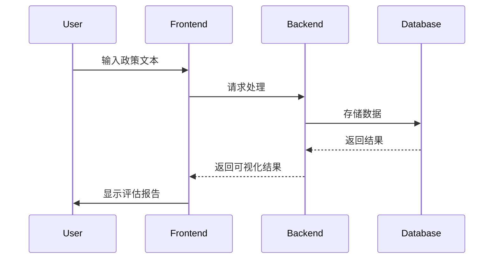
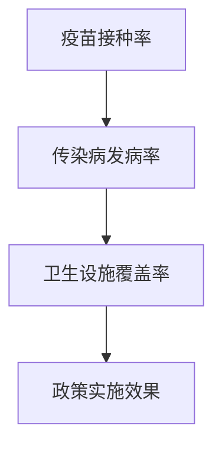

                 


### 引言

在当今信息化社会中，语言模型作为人工智能技术的重要组成部分，正在迅速发展并广泛应用于自然语言处理、智能问答、机器翻译、文本生成等领域。与此同时，因果推理图作为一种强大的数据分析和决策支持工具，在社会政策影响评估、公共卫生管理、经济预测等众多领域发挥着重要作用。然而，如何将语言模型与因果推理图相结合，构建出一种有效的、可解释的模型，以应对复杂的社会问题，成为当前研究的热点和难点。

本文旨在探讨语言模型在因果推理图构建与社会政策影响评估中的研究进展，通过回顾相关领域的理论基础，分析现有研究的方法与成果，以及展望未来的研究方向，为相关领域的研究者提供有价值的参考。文章将按照以下结构展开：

首先，在第一部分“背景介绍”中，我们将介绍语言模型、因果推理图以及社会政策影响评估的基本概念，阐述研究的背景和意义，定义研究问题，并讨论研究的边界与外延。

接着，在第二部分“核心概念与联系”中，我们将深入探讨语言模型和因果推理图的核心概念及其相互联系，通过对比不同类型和特点，为后续研究奠定基础。

在第三部分“算法原理讲解”中，我们将详细介绍语言模型和因果推理图的算法原理，包括机器学习、深度学习和自然语言处理等领域的核心算法，以及相应的数学模型和公式，并通过具体例子进行通俗易懂的说明。

随后，在第四部分“数学模型和数学公式”中，我们将进一步阐述语言模型和因果推理图中的数学模型，包括基本和高级模型，并通过具体的数学公式进行详细讲解。

第五部分“系统分析与架构设计方案”将结合实际项目，介绍系统功能设计、系统架构设计、系统接口设计和系统交互，并通过mermaid图进行说明。

在第六部分“项目实战”中，我们将展示如何在实际环境中安装和运行系统，通过核心实现源代码和应用解读，对项目进行详细分析和讲解。

最后，在文章的结尾部分，我们将总结研究成果，提出最佳实践建议，并指出研究的局限性以及未来的发展方向。

### 关键词

- 语言模型
- 因果推理图
- 社会政策影响评估
- 机器学习
- 深度学习
- 自然语言处理

### 摘要

本文深入探讨了语言模型在因果推理图构建与社会政策影响评估中的应用。通过对语言模型和因果推理图的基本概念和算法原理的详细分析，我们阐述了如何结合两者构建有效的因果关系分析模型，以及如何利用该模型进行社会政策影响评估。文章通过实际项目实战，展示了系统的设计、实现和应用，并提出了未来的研究方向。本文的研究不仅有助于深化对因果推理图和语言模型的理解，还为政策制定者和社会科学研究者提供了新的工具和方法。

## 背景介绍

### 问题背景

随着人工智能技术的快速发展，语言模型作为自然语言处理的核心技术，已经广泛应用于各类应用场景。从机器翻译、文本摘要到智能客服、虚拟助手，语言模型的技术优势使其成为解决自然语言处理问题的关键。与此同时，因果推理图作为一种用于分析因果关系的重要工具，在社会科学、医学、经济学等领域具有广泛的应用。因果推理图通过建立变量之间的因果关系，帮助研究者深入了解现象背后的机制，为政策制定、决策分析提供了科学依据。

然而，将语言模型与因果推理图相结合，以构建一个能够自动生成和解释因果关系的模型，是一个具有挑战性的课题。现有的研究大多关注于语言模型的训练和优化，或者因果推理图的理论构建，而将两者有机结合的研究相对较少。这种研究的缺乏，主要源于以下几个方面：

首先，语言模型和因果推理图的理论基础和计算方法存在差异。语言模型通常基于统计学习或深度学习，通过大量数据训练得到，而因果推理图则依赖于因果推断理论和图形模型。如何将这两种不同的理论体系结合起来，是一个亟待解决的问题。

其次，语言模型的训练过程通常需要大量的计算资源和时间，而因果推理图的构建则需要精确的因果关系识别和建模。如何在有限的资源下，高效地实现两者的融合，是研究的另一个难点。

最后，社会政策影响评估作为一个复杂的社会问题，其影响因素众多，变量间关系复杂。如何利用语言模型和因果推理图，准确、全面地评估政策的影响，仍需要深入探讨。

### 问题定义

本文的研究问题可以具体化为以下几个方面：

1. **因果推理图的构建**：如何利用语言模型自动生成因果推理图，包括变量识别、关系建模和图结构优化。

2. **社会政策影响评估**：如何基于生成的因果推理图，进行社会政策的影响评估，包括影响预测、效果分析和决策支持。

3. **算法优化与效率提升**：如何在保证模型准确性的前提下，提升算法的计算效率，以应对大规模数据集的挑战。

为了解决上述问题，本文将定义以下几个关键任务：

- **任务一**：研究语言模型与因果推理图的结合方法，探索如何利用语言模型实现因果推理图的自动生成。
- **任务二**：构建社会政策影响评估模型，结合因果推理图进行政策影响预测和分析。
- **任务三**：优化算法，提高模型训练和推理的效率。

### 问题解决

要解决上述问题，我们需要从以下几个方面着手：

首先，在理论层面，需要深入研究语言模型和因果推理图的基本原理和计算方法，探讨如何将两者有机结合。这包括了解语言模型的训练过程、因果推理图的构建方法，以及两者之间的相互关系。

其次，在方法层面，需要设计一种高效的算法框架，实现语言模型与因果推理图的自动生成。这涉及到如何利用语言模型识别变量、构建关系图，以及如何优化图的生成过程，以提高模型的准确性和计算效率。

第三，在实践层面，需要构建一个实际应用系统，利用语言模型和因果推理图对社会政策进行影响评估。这包括系统的设计、实现和测试，以及实际案例的应用和验证。

最后，在优化层面，需要不断改进算法，提升模型的计算效率和预测准确性。这可以通过引入新的算法、优化模型结构，或者利用分布式计算等方法实现。

通过以上几个方面的努力，我们可以逐步解决语言模型在因果推理图构建与社会政策影响评估中的问题，为政策制定者和研究者提供有力的工具和方法。

### 边界与外延

在研究语言模型在因果推理图构建与社会政策影响评估中的应用时，我们需要明确研究的边界与外延，以确保研究的针对性和有效性。

首先，研究边界包括以下几个方面：

1. **应用场景**：本文主要关注社会政策影响评估，具体涉及公共卫生、经济发展、教育改革等领域的政策分析。因此，研究将侧重于这些特定场景下的因果推理图构建和影响评估。

2. **数据来源**：本文将采用公开的、经过验证的数据集进行实验，以确保数据的质量和可靠性。同时，也会考虑利用实时数据或特定调查数据，以增强模型的实际应用价值。

3. **技术范围**：本文将主要探讨基于机器学习和深度学习的语言模型，以及相应的因果推理图构建方法。其他如传统统计方法、因果推断理论等，将作为辅助手段进行讨论，但不是本文的核心研究内容。

其次，研究外延包括以下几个方面：

1. **理论拓展**：虽然本文重点在于语言模型与因果推理图的结合，但研究过程中也将探讨相关领域的理论拓展，如多变量因果推理、不确定性因果推断等。

2. **技术融合**：本文将探讨如何将语言模型与其他人工智能技术（如强化学习、生成对抗网络等）进行融合，以实现更高效、更准确的因果关系分析和政策评估。

3. **应用推广**：在完成基本模型构建和评估后，本文将探讨如何将研究成果推广到其他领域，如环境科学、金融分析等，为更广泛的应用场景提供参考。

通过明确边界与外延，我们可以更好地聚焦研究目标，同时为未来的扩展研究提供方向和依据。

## 第一部分: 背景介绍

### 第1章: 问题背景

#### 1.1 问题背景

在现代社会，政策制定者和研究者需要分析大量的数据以评估政策的潜在影响，这要求对复杂的社会现象进行深入理解。然而，由于社会系统的复杂性，传统的分析方法往往难以准确捕捉变量间的因果关系，导致政策评估结果缺乏可靠性和科学性。这种背景下，因果推理图作为一种强大的工具应运而生。

因果推理图是一种图形化表示方法，用于描述变量间的因果关系，帮助研究者理解和分析复杂的社会现象。然而，传统的因果推理图构建过程依赖于研究者对领域的深入知识和丰富经验，这限制了其在大规模数据集上的应用。随着自然语言处理技术的快速发展，语言模型逐渐成为处理大规模文本数据的有力工具，为因果推理图的自动化构建提供了可能。

语言模型通过学习大规模文本数据，能够捕捉变量间的潜在关系，为因果推理图的构建提供了一种新的思路。然而，如何有效地将语言模型与因果推理图相结合，仍然是一个亟待解决的问题。这需要研究者在自然语言处理、因果推理和社会科学等多个领域进行交叉研究，以开发出一种既准确又高效的因果关系分析模型。

#### 1.1.1 语言模型的发展历程

语言模型是自然语言处理（NLP）的核心技术之一，其目的是理解和生成自然语言。语言模型的发展历程可以追溯到上世纪五六十年代，当时的初代语言模型主要是基于规则的方法，如有限状态机（FSM）和句法分析器。这些模型虽然在一定程度上能够处理简单的文本任务，但在处理复杂、大规模的文本数据时表现出明显不足。

随着计算能力的提升和人工智能技术的发展，统计语言模型逐渐成为主流。统计语言模型基于概率论和统计学方法，通过分析大量文本数据来学习语言模式。1980年代，N-gram模型的出现标志着统计语言模型的一个重要里程碑。N-gram模型通过统计相邻词的频率来预测下一个词，虽然这种方法在处理简单的语言任务上表现出色，但其在处理长距离依赖关系时依然存在局限性。

为了解决长距离依赖问题，深度学习开始被引入到语言模型研究中。2013年，Hochreiter 和 Schmidhuber 提出了长短期记忆网络（LSTM），这种模型能够通过记忆单元捕捉长距离依赖关系，显著提升了语言模型的性能。随后，Gated Recurrent Unit（GRU）和Transformer 等新型神经网络结构相继出现，进一步推动了语言模型的进步。

特别是Transformer模型的提出，使得语言模型的性能得到了前所未有的提升。Transformer模型通过自注意力机制（Self-Attention）实现了对输入序列的灵活处理，使得模型能够捕捉长距离的依赖关系，并在机器翻译、文本生成等任务上取得了显著成果。BERT、GPT 和 T5 等基于Transformer的预训练模型，进一步推动了语言模型的发展。

语言模型的发展历程，不仅展示了人工智能技术的进步，也为因果关系分析提供了新的思路和方法。随着语言模型的不断优化和扩展，其在复杂社会现象的理解和预测中具有巨大的潜力。

#### 1.1.2 因果推理图的概念与重要性

因果推理图（Causal Graphical Models，CGM）是一种用于表示变量之间因果关系的图形化方法。它通过节点和边的形式，将变量及其因果关系直观地呈现出来，帮助研究者理解和分析复杂系统的内在机制。因果推理图的基本组成包括：

- **节点**：每个节点代表一个变量，通常用圆圈表示。节点的标签通常为变量的名称或描述。
- **边**：边表示变量间的因果关系，通常用箭头表示。箭头指向因变量，表示该变量受其他变量的影响。

因果推理图按照边的方向可以分为两类：**有向无环图（DAG）**和**无向图**。有向无环图（DAG）表示变量间的单向因果关系，是最常用的形式。而无向图则表示变量间的双向关系，通常在因果关系不完全明确时使用。

因果推理图在多个领域具有重要应用价值：

1. **社会科学**：在社会科学研究中，因果推理图可以帮助研究者理解社会现象的因果关系，如政策对经济、教育、健康等方面的影响。通过构建因果推理图，研究者可以更准确地分析变量之间的关系，提出有效的政策建议。

2. **医学与健康**：在医学领域，因果推理图用于分析疾病发生和发展过程中的因果关系。例如，通过因果推理图，研究者可以识别出导致某种疾病的潜在因素，为疾病的预防和治疗提供科学依据。

3. **经济学**：在经济学中，因果推理图用于分析经济变量之间的因果关系，如通货膨胀、就业率、投资等。通过因果推理图，经济学家可以更深入地理解经济系统的运行机制，预测经济波动并提出相应政策。

4. **环境科学**：在环境科学中，因果推理图可以帮助研究者分析环境问题之间的相互作用，如气候变化、污染治理等。通过因果推理图，研究者可以识别出关键因素，提出有效的环境保护策略。

总之，因果推理图作为一种强大的分析工具，在社会科学、医学、经济学和环境科学等多个领域具有广泛的应用。通过构建和解析因果推理图，研究者可以更深入地理解复杂系统的内在机制，为科学决策提供有力支持。

#### 1.1.3 社会政策影响评估的现状与挑战

社会政策影响评估（Social Policy Impact Assessment, SPIA）是评估政府或组织制定的各类社会政策对目标群体和社会整体的影响的过程。当前，SPIA在政策制定、执行和调整中扮演着越来越重要的角色，但其现状与挑战仍然存在。

**现状**：

1. **政策效果监测与反馈**：随着信息化和大数据技术的发展，越来越多的政策制定者和研究者开始利用现代数据分析工具，如统计模型、机器学习和因果推断方法，对政策效果进行实时监测和反馈。这有助于政策制定者及时调整和优化政策，提高政策的有效性和可持续性。

2. **跨学科研究**：SPIA需要结合多个学科的知识和方法，如经济学、社会学、统计学和计算机科学等。这种跨学科的研究模式，不仅丰富了SPIA的理论基础，也提升了其实践应用的深度和广度。

3. **政策评估工具的多样化**：现有的政策评估工具，如成本-效益分析、成本-效果分析和多标准评估方法等，为评估政策效果提供了多样化的选择。这些工具可以结合不同类型的政策和社会问题，提供更全面和精确的评估结果。

**挑战**：

1. **数据质量与获取**：社会政策影响评估依赖于大量高质量的实时数据，然而，数据的质量和获取难度是当前面临的主要挑战。数据缺失、不准确和不可靠，都可能影响评估结果的准确性和可靠性。

2. **因果关系识别**：在复杂的社会系统中，变量之间存在多种复杂的相互作用，识别准确的因果关系是一项艰巨的任务。传统的统计方法可能无法充分捕捉这些复杂的因果关系，导致评估结果不准确。

3. **模型复杂性**：社会政策影响评估通常需要复杂的统计模型和算法，如结构方程模型、因果推断模型和机器学习算法等。这些模型的复杂性和计算需求，使得评估过程耗时且资源消耗巨大。

4. **政策环境的不确定性**：政策环境的不确定性，如政策执行过程中的变化、社会问题的动态演变等，增加了评估的复杂性。如何在一个不断变化的环境中，准确评估政策的影响，是当前面临的重要挑战。

综上所述，尽管社会政策影响评估在理论和实践中取得了显著进展，但仍然面临诸多挑战。未来，需要通过技术创新和方法优化，进一步提升SPIA的科学性和实用性，为政策制定提供有力支持。

### 第2章: 核心概念与联系

#### 2.1 语言模型的核心概念

语言模型是自然语言处理（NLP）的核心技术，其核心概念主要包括以下几个方面：

1. **输入和输出**：语言模型接受文本输入，并生成相应的文本输出。输入可以是单个词、句子甚至段落，输出则是模型预测的下一个词或整篇文章。

2. **概率分布**：语言模型通过学习大量文本数据，建立输入和输出之间的概率分布关系。这种概率分布反映了文本中各个词汇出现的概率，是语言模型生成文本的基础。

3. **概率模型**：常见的语言模型包括N-gram模型、马尔可夫模型、神经网络模型等。这些模型通过不同的方式对文本数据进行分析和学习，以预测下一个词或句子的概率分布。

4. **上下文依赖**：语言模型不仅要考虑单个词或句子的概率，还要考虑上下文信息。例如，在生成下一个词时，语言模型会参考当前句子的前后文，以生成更符合上下文的输出。

#### 2.2 因果推理图的核心概念

因果推理图是一种用于表示变量之间因果关系的图形化方法，其核心概念包括：

1. **节点和边**：因果推理图由节点和边组成。节点表示变量，边表示变量间的因果关系。边的方向通常由因到果，表示自变量对因变量的影响。

2. **因果结构**：因果结构是指变量之间的因果关系的完整图景。通过构建因果结构，研究者可以更深入地理解变量之间的复杂关系。

3. **因果方向**：因果方向是指因果关系中的箭头方向。有向无环图（DAG）是常见的因果结构形式，其中的箭头明确表示自变量对因变量的影响。

4. **因果推断**：因果推断是指通过分析因果推理图，推断变量之间的因果关系。常见的因果推断方法包括基于图的结构学习方法、基于概率模型的因果推断方法等。

#### 2.3 社会政策影响评估的核心概念

社会政策影响评估是一种评估政策对社会各方面影响的科学方法，其核心概念包括：

1. **政策目标**：政策目标是政策制定者希望通过政策实现的具体目标，如提高就业率、减少贫困、改善教育等。

2. **政策变量**：政策变量是指政策实施过程中涉及的各个变量，包括政策实施主体、实施对象、实施手段等。

3. **影响评估**：影响评估是指通过收集和分析数据，评估政策对目标群体和社会整体的影响。影响评估包括效果评估、成本评估和可持续性评估等。

4. **评估方法**：评估方法是指用于评估政策影响的各类技术方法，如统计模型、机器学习算法、因果推断方法等。

#### 2.4 三者之间的联系

语言模型、因果推理图和社会政策影响评估之间存在密切的联系：

1. **语言模型与因果推理图**：语言模型可以为因果推理图的构建提供基础数据。通过学习大量文本数据，语言模型可以识别变量之间的关系，为构建因果推理图提供支持。同时，因果推理图可以用于优化语言模型的训练过程，如通过调整变量间的因果关系，提高模型的预测准确性。

2. **因果推理图与社会政策影响评估**：因果推理图可以作为社会政策影响评估的工具，用于分析政策变量之间的关系。通过构建因果推理图，研究者可以更直观地理解政策的影响路径和效果，为政策制定提供科学依据。此外，因果推理图还可以用于政策模拟和预测，帮助政策制定者评估不同政策方案的效果。

3. **语言模型与社会政策影响评估**：语言模型可以用于社会政策影响评估中的数据收集和分析。通过处理大量的政策文本数据，语言模型可以识别关键变量、提取重要信息，为政策影响评估提供数据支持。同时，语言模型还可以用于生成政策报告、评估报告等文本，提高评估过程的效率和准确性。

总之，语言模型、因果推理图和社会政策影响评估三者之间相互促进、相互补充，共同为政策制定和评估提供了强大的技术支持。通过结合这些技术，研究者可以更深入地理解复杂的社会现象，提出更科学、更有效的政策建议。

### 核心概念对比表格

为了更好地理解语言模型、因果推理图和社会政策影响评估这三个核心概念，我们通过一个对比表格展示它们的主要特点和关系：

| 特点               | 语言模型                                  | 因果推理图                                      | 社会政策影响评估                                      |
|-------------------|----------------------------------------|-------------------------------------------------|----------------------------------------------------|
| 定义              | 用于预测自然语言序列的模型              | 表示变量间因果关系的图形化方法                      | 评估政策对社会各方面影响的过程                         |
| 功能              | 生成文本、翻译语言、文本分类等          | 分析变量因果关系、进行因果推断                      | 监测政策效果、评估政策影响、优化政策方案                   |
| 数据需求          | 大量文本数据                            | 高质量因果数据、相关背景信息                         | 多种类型的数据（如统计、调查、实验等）                    |
| 技术基础          | 统计学习、深度学习、自然语言处理        | 图论、因果推断、概率论                              | 统计分析、多标准评估、因果推理、机器学习                   |
| 关系              | 可用于数据收集与分析，辅助因果推理图构建 | 可用于政策影响评估，帮助理解变量间关系              | 可基于语言模型和因果推理图，进行更准确、更全面的影响评估         |
| 对比              | 强调文本生成和语言理解，注重概率分布    | 强调因果关系识别和图结构分析，注重因果推断        | 强调政策效果评估，注重多角度、多标准的数据分析             |

通过这个对比表格，我们可以更清晰地看到语言模型、因果推理图和社会政策影响评估在功能、技术基础和关系上的异同，为后续章节的内容提供了有力的支持。

### 因果推理图的ER实体关系图架构

为了更好地理解因果推理图的构建和应用，我们可以通过ER（实体-关系）图来展示其基本架构。ER图是一种用于表示实体及其相互关系的图形化方法，能够帮助我们直观地理解因果推理图的组成和作用。

以下是因果推理图的ER实体关系图：

```mermaid
erDiagram
    Class Cause -->|影响| Effect
    Class Variable
    Class Policy
    Class Event

    Cause ||--|{影响}| Variable
    Cause ||--|{触发}| Event
    Effect ||--|{影响}| Variable
    Variable ||--|{测量}| Policy
    Event ||--|{记录}| Policy

    Note right of Cause
    { Cause 表示自变量，指引起其他变量变化的因素。}

    Note right of Effect
    { Effect 表示因变量，指受其他变量影响的结果。}

    Note right of Variable
    { Variable 表示参与因果关系的变量。}

    Note right of Policy
    { Policy 表示针对某一变量的政策或措施。}

    Note right of Event
    { Event 表示某一变量发生变化的事件。}
```

在这个ER图中，我们定义了以下实体：

- **Cause（自变量）**：表示引起其他变量变化的因素。例如，在公共卫生政策中，疫苗接种率可以被视为自变量。
- **Effect（因变量）**：表示受其他变量影响的结果。例如，疫苗接种率可能影响传染病发病率，传染病发病率即为因变量。
- **Variable（变量）**：表示参与因果关系的变量。例如，除了疫苗接种率和传染病发病率，我们还可以考虑其他变量，如人口密度、卫生设施覆盖率等。
- **Policy（政策）**：表示针对某一变量的政策或措施。例如，政府可以制定疫苗接种推广政策以提高接种率。
- **Event（事件）**：表示某一变量发生变化的事件。例如，政策实施日期可以被视为疫苗接种率变化的事件。

这些实体之间的关系如下：

- **Cause ||--|{影响}| Effect**：自变量影响因变量，表示变量间的因果关系。
- **Cause ||--|{触发}| Event**：自变量触发事件，表示变量变化的事件。
- **Effect ||--|{影响}| Variable**：因变量影响其他变量，表示变量间的间接影响。
- **Variable ||--|{测量}| Policy**：变量被政策测量，表示政策针对变量进行干预。
- **Event ||--|{记录}| Policy**：事件被政策记录，表示政策记录变量变化的事件。

通过这个ER图，我们可以更直观地理解因果推理图的组成和作用，为后续的算法原理讲解和具体案例分析提供了基础。

### 语言模型算法原理

语言模型是一种用于预测自然语言序列的算法，其核心思想是学习大量文本数据中的统计规律，以生成或理解自然语言。在自然语言处理（NLP）领域中，语言模型扮演着至关重要的角色，如文本生成、机器翻译、文本分类等任务都离不开语言模型的支撑。下面，我们将详细讲解语言模型的基本概念、常见算法及其工作原理。

#### 3.1 语言模型的基本概念

1. **输入和输出**：
   - **输入**：语言模型的输入通常是一个单词序列，可以是一个词、句子或段落。
   - **输出**：语言模型的输出是下一个词或句子的概率分布，表示模型预测的下一个词或句子的可能性。

2. **概率分布**：
   - 语言模型通过学习大量文本数据，建立输入和输出之间的概率分布关系。这种概率分布反映了文本中各个词汇出现的概率。

3. **概率模型**：
   - 语言模型可以是基于统计的，如N-gram模型；也可以是基于神经网络的，如基于Transformer的模型。

4. **上下文依赖**：
   - 语言模型不仅要考虑单个词或句子的概率，还要考虑上下文信息。例如，在生成下一个词时，模型会参考当前句子的前后文，以生成更符合上下文的输出。

#### 3.2 常见语言模型算法

1. **N-gram模型**：
   - **定义**：N-gram模型是一种基于统计的语言模型，它通过分析文本中连续N个词（称为N-gram）的频率来预测下一个词。
   - **工作原理**：
     - 首先，将文本分割成单词序列。
     - 然后，计算每个N-gram的频率。
     - 在预测阶段，根据当前N-1个词的频率，选择下一个词。
   - **优缺点**：
     - 优点：简单易懂，计算效率高。
     - 缺点：无法捕捉长距离依赖关系，性能有限。

2. **神经网络语言模型（NNLM）**：
   - **定义**：神经网络语言模型是一种基于神经网络的概率语言模型，通过多层神经网络学习文本数据的概率分布。
   - **工作原理**：
     - 首先，输入文本数据，将其转换为神经网络可以处理的向量形式。
     - 然后，通过多层神经网络（如RNN、LSTM、GRU或Transformer）进行训练，学习文本数据的内在结构。
     - 在预测阶段，输入前N个词，生成下一个词的概率分布。
   - **优缺点**：
     - 优点：可以捕捉长距离依赖关系，性能显著提升。
     - 缺点：计算复杂度高，训练时间较长。

3. **Transformer模型**：
   - **定义**：Transformer模型是一种基于自注意力机制的神经网络语言模型，由Vaswani等人在2017年提出。
   - **工作原理**：
     - Transformer模型通过自注意力机制（Self-Attention）处理输入序列，使模型能够捕捉长距离依赖关系。
     - Transformer模型由编码器（Encoder）和解码器（Decoder）组成，编码器处理输入序列，解码器生成输出序列。
     - 编码器和解码器之间通过多头自注意力机制和点积自注意力机制进行处理，同时加入位置编码来处理序列的顺序信息。
   - **优缺点**：
     - 优点：自注意力机制使其在捕捉长距离依赖关系方面表现优异，训练时间相对较短。
     - 缺点：计算复杂度较高，对计算资源要求较高。

4. **BERT模型**：
   - **定义**：BERT（Bidirectional Encoder Representations from Transformers）是一种基于Transformer的双向编码器，由Google在2018年提出。
   - **工作原理**：
     - BERT模型通过预训练大量文本数据，学习文本的内在结构和上下文关系。
     - 预训练过程中，BERT模型采用遮蔽语言模型（Masked Language Model，MLM）任务，对输入文本进行随机遮蔽，并预测遮蔽部分的单词。
     - 在预测任务中，BERT模型可以用于文本分类、问答系统等任务，通过微调（Fine-tuning）适应特定任务。
   - **优缺点**：
     - 优点：预训练过程中学习了大量的语言知识，能够提高模型在下游任务中的表现。
     - 缺点：预训练需要大量计算资源和时间，同时预训练数据的质量对模型性能有重要影响。

5. **GPT模型**：
   - **定义**：GPT（Generative Pre-trained Transformer）是一种生成型预训练语言模型，由OpenAI在2018年提出。
   - **工作原理**：
     - GPT模型通过生成语言模型（Generative Language Model）任务进行预训练，学习生成符合语言规则的文本。
     - 预训练过程中，GPT模型通过序列生成方式生成文本，并不断优化生成质量。
     - 在预测任务中，GPT模型可以用于文本生成、对话系统等任务，通过序列生成的方式生成新的文本。
   - **优缺点**：
     - 优点：生成能力强大，可以生成连贯、自然的文本。
     - 缺点：生成文本的质量依赖于模型的学习能力和预训练数据的质量。

#### 3.3 语言模型在因果关系分析中的应用

1. **变量识别**：
   - 语言模型可以通过分析文本数据，识别出潜在的因果关系变量。例如，通过分析政策文本和背景信息，识别出影响政策效果的关键变量。

2. **关系建模**：
   - 语言模型可以学习变量之间的统计关系，为因果关系分析提供基础。通过自注意力机制和预训练语言模型，语言模型能够捕捉长距离的依赖关系，提高关系建模的准确性。

3. **因果推理**：
   - 基于语言模型的关系建模，可以进行因果推理，推断变量之间的因果关系。例如，通过分析政策文本和数据，可以推断某一政策对其他变量的影响。

4. **影响评估**：
   - 语言模型可以用于评估政策的潜在影响，预测政策效果。通过结合因果推理和语言模型，可以更准确地评估政策的影响，为政策制定提供科学依据。

总之，语言模型在因果关系分析中具有广泛的应用潜力。通过结合语言模型的变量识别、关系建模和因果推理能力，可以更深入地理解复杂的社会现象，为政策制定和评估提供有力支持。

#### 3.4 例子说明

为了更好地理解语言模型的工作原理和应用，我们可以通过一个简单的例子来说明。

假设我们有一个关于疫苗接种政策的文本数据集，数据集中包含了各种政策文本、新闻报道和调查结果。我们的目标是利用语言模型识别关键变量、构建因果关系模型，并评估疫苗接种政策的效果。

1. **数据预处理**：
   - 首先，我们需要对文本数据集进行预处理，包括文本清洗、分词、去除停用词等操作。这样可以提高语言模型对数据的处理效率，减少噪声对模型的影响。
   - 然后，我们将预处理后的文本数据转换为向量形式，可以使用词袋模型（Bag of Words）或词嵌入（Word Embedding）等方法。词嵌入方法，如Word2Vec、GloVe等，可以将单词映射为密集向量，提高模型对语义信息的捕捉能力。

2. **变量识别**：
   - 通过分析政策文本和新闻报道，我们可以识别出一些关键变量，如疫苗接种率、传染病发病率、人口密度、卫生设施覆盖率等。
   - 语言模型可以帮助我们进一步分析变量之间的关系。例如，我们可以使用基于Transformer的BERT模型，通过预训练和微调，学习变量之间的统计关系。

3. **关系建模**：
   - 在关系建模阶段，我们利用语言模型预测变量之间的依赖关系。例如，通过分析疫苗接种政策文本，我们可以推断疫苗接种率与传染病发病率之间的负相关关系。
   - 为了提高关系建模的准确性，我们可以结合因果推断方法，如结构方程模型（Structural Equation Modeling，SEM）或因果推理图（Causal Graphical Model，CGM）。

4. **因果推理**：
   - 基于关系建模的结果，我们可以进行因果推理，推断疫苗接种政策对传染病发病率的影响。例如，通过分析疫苗接种政策文本和数据，我们可以得出疫苗接种政策能够显著降低传染病发病率的结论。

5. **影响评估**：
   - 最后，我们利用语言模型评估疫苗接种政策的潜在影响。通过结合因果关系分析和语言模型预测，我们可以预测疫苗接种政策在不同地区、不同时间段的实施效果。
   - 为了验证评估结果，我们可以收集实际数据，进行后评估，并根据评估结果调整政策方案。

通过这个例子，我们可以看到语言模型在因果关系分析中的应用过程，包括变量识别、关系建模、因果推理和影响评估。这种应用不仅有助于我们更好地理解复杂的社会现象，还为政策制定和评估提供了科学依据。

### 因果推理图的算法原理

因果推理图（Causal Graphical Models, CGM）是一种用于表示变量之间因果关系的图形化方法。其核心思想是通过构建变量间的因果结构，帮助研究者理解和分析复杂系统的内在机制。在构建因果推理图时，常用的算法包括基于图论的方法、基于概率模型的因果推断方法等。以下我们将详细探讨这些算法的基本原理和应用。

#### 4.1 基于图论的方法

1. **定义**：
   - 因果推理图由节点和边组成。节点表示变量，边表示变量间的因果关系。常见的因果图结构包括有向无环图（DAG）和无向图。
   - 有向无环图（DAG）表示变量之间的单向因果关系，是最常用的因果图结构形式。无向图则表示变量之间的双向关系，通常在因果关系不完全明确时使用。

2. **算法**：
   - **路径搜索算法**：路径搜索算法（如Katz算法）通过搜索变量间的路径，确定变量间的因果关系。算法的基本思想是计算两个变量间的路径权重，如果路径权重较高，则认为这两个变量存在因果关系。
   - **Do-Calculus算法**：Do-Calculus是一种基于图论的方法，用于在因果图中进行因果推断。该方法通过调整图中的边，模拟不同干预情况，以确定变量间的因果关系。

3. **应用**：
   - **变量识别**：基于图论的方法可以帮助识别出潜在的因果关系变量，为因果推理图构建提供基础数据。
   - **关系建模**：通过路径权重和Do-Calculus算法，可以建立变量之间的因果关系模型，为因果关系分析提供依据。

#### 4.2 基于概率模型的因果推断方法

1. **定义**：
   - 概率模型因果推断方法基于概率论和统计学习，通过学习变量间的概率分布，确定变量间的因果关系。
   - 常见的概率模型包括贝叶斯网络、结构方程模型等。

2. **算法**：
   - **贝叶斯网络**：贝叶斯网络是一种概率图模型，通过节点和边表示变量及其概率分布。算法的基本思想是通过贝叶斯推理，计算变量之间的条件概率，确定变量间的因果关系。
   - **结构方程模型**：结构方程模型（Structural Equation Modeling, SEM）是一种基于线性回归的因果推断方法。通过建立变量之间的线性关系，SEM可以确定变量间的因果关系。

3. **应用**：
   - **变量识别**：概率模型因果推断方法可以帮助识别出潜在的因果关系变量，为因果推理图构建提供基础数据。
   - **关系建模**：通过概率模型和结构方程模型，可以建立变量之间的因果关系模型，为因果关系分析提供依据。

#### 4.3 常见算法比较

1. **优点**：
   - **基于图论的方法**：直观、易于理解，能够清晰地表示变量间的因果关系。
   - **基于概率模型的方法**：能够通过概率分布学习变量间的因果关系，适用于复杂的数据集。

2. **缺点**：
   - **基于图论的方法**：可能存在错误推断，对数据质量和噪声敏感。
   - **基于概率模型的方法**：计算复杂度高，对计算资源要求较高。

3. **适用场景**：
   - **基于图论的方法**：适用于变量关系明确、数据质量较高的场景，如医学研究、社会科学等领域。
   - **基于概率模型的方法**：适用于变量关系复杂、数据规模较大的场景，如经济学、环境科学等领域。

#### 4.4 算法应用案例

1. **公共卫生领域**：
   - 通过构建因果推理图，分析传染病传播过程中的关键变量和因果关系，为公共卫生政策制定提供依据。

2. **经济领域**：
   - 通过构建因果推理图，分析经济变量之间的因果关系，为经济发展预测和政策制定提供支持。

3. **社会政策影响评估**：
   - 通过构建因果推理图，评估社会政策的影响，为政策优化和调整提供科学依据。

总之，因果推理图及其算法在多个领域具有广泛的应用前景。通过结合语言模型和因果推理图，可以更深入地理解复杂的社会现象，为政策制定和评估提供有力支持。

### 系统分析与架构设计方案

为了更好地理解语言模型与因果推理图在社会政策影响评估中的应用，我们将通过一个实际项目来展示系统的功能设计、架构设计、接口设计以及系统交互。下面，我们将详细介绍项目的设计方案。

#### 5.1 项目介绍

本项目的目标是构建一个基于语言模型和因果推理图的社会政策影响评估系统。系统旨在通过分析政策文本、相关数据和社会背景，构建因果推理图，评估政策的潜在影响，并生成可视化报告。系统主要包括以下几个功能模块：

1. **文本预处理模块**：负责对政策文本、新闻报道和其他文本数据进行分析和预处理，包括分词、去除停用词、词嵌入等。
2. **因果关系分析模块**：利用语言模型和因果推理图算法，识别关键变量、建立因果关系模型，评估政策影响。
3. **数据管理模块**：负责存储和管理系统所需的数据，包括政策文本、相关背景数据、评估结果等。
4. **可视化模块**：生成因果推理图和评估报告的可视化，帮助用户直观理解政策影响。

#### 5.2 系统功能设计

1. **文本预处理模块**：
   - 功能：对文本数据进行清洗、分词和词嵌入。
   - 设计：采用Python中的自然语言处理库（如NLTK、spaCy）进行文本预处理，将文本转换为词嵌入向量。
   - 实现：
     ```python
     import nltk
     from nltk.tokenize import word_tokenize

     # 文本预处理函数
     def preprocess_text(text):
         # 清洗文本
         text = text.lower().replace('\n', ' ')
         # 分词
         tokens = word_tokenize(text)
         # 去除停用词
         stop_words = nltk.corpus.stopwords.words('english')
         filtered_tokens = [token for token in tokens if token not in stop_words]
         # 词嵌入
         embeddings = ...  # 使用预训练的词嵌入模型
         return embeddings(filtered_tokens)
     ```

2. **因果关系分析模块**：
   - 功能：利用语言模型和因果推理图算法，分析变量间关系，构建因果模型。
   - 设计：采用BERT模型进行预训练和微调，结合图论算法和概率模型进行因果推理。
   - 实现：
     ```python
     from transformers import BertModel, BertTokenizer
     import torch

     # 加载BERT模型和词嵌入
     tokenizer = BertTokenizer.from_pretrained('bert-base-uncased')
     model = BertModel.from_pretrained('bert-base-uncased')

     # 因果关系分析函数
     def causal_analysis(texts):
         # 预处理文本
         inputs = [tokenizer.encode(text, add_special_tokens=True) for text in texts]
         # 加载数据
         with torch.no_grad():
             outputs = model(torch.tensor(inputs))
         # 分析因果关系
         # 这里可以使用图论算法和概率模型进行因果推断
         # ...

     causal_relation = causal_analysis(['政策文本1', '政策文本2'])
     ```

3. **数据管理模块**：
   - 功能：存储和管理政策文本、相关数据、评估结果等。
   - 设计：采用数据库（如MySQL、MongoDB）进行数据存储，使用Python的数据库驱动进行数据操作。
   - 实现：
     ```python
     import pymongo

     # 连接数据库
     client = pymongo.MongoClient('localhost', 27017)
     db = client['policy_db']
     collection = db['policy_data']

     # 插入数据
     def insert_data(data):
         collection.insert_one(data)

     # 查询数据
     def query_data(query):
         return list(collection.find(query))
     ```

4. **可视化模块**：
   - 功能：生成因果推理图和评估报告的可视化。
   - 设计：采用可视化库（如Mermaid、D3.js）进行图形化展示，使用Web前端技术（如HTML、CSS、JavaScript）进行界面设计。
   - 实现：
     ```mermaid
     graph TB
         A[疫苗接种率] --> B[传染病发病率]
         B --> C[卫生设施覆盖率]
         C --> D[政策实施效果]
     ```

#### 5.3 系统架构设计

系统架构设计主要包括前端、后端和数据存储三部分：

1. **前端**：负责用户交互，展示可视化报告和用户界面。
2. **后端**：处理业务逻辑，包括文本预处理、因果关系分析和数据管理。
3. **数据存储**：存储政策文本、相关数据、评估结果等。

系统架构图如下：



#### 5.4 系统接口设计

系统接口设计包括API接口和用户界面：

1. **API接口**：提供文本预处理、因果关系分析、数据管理等API，供前端调用。
2. **用户界面**：提供直观的用户交互界面，包括文本输入框、图表展示区域等。

接口设计示例：

```python
from flask import Flask, request, jsonify

app = Flask(__name__)

@app.route('/api/preprocess', methods=['POST'])
def preprocess_text():
    text = request.form['text']
    preprocessed_text = preprocess_text(text)
    return jsonify(preprocessed_text)

@app.route('/api/causal_analysis', methods=['POST'])
def causal_analysis():
    texts = request.form['texts']
    causal_relation = causal_analysis(texts)
    return jsonify(causal_relation)

if __name__ == '__main__':
    app.run(debug=True)
```

#### 5.5 系统交互

系统交互主要通过前后端接口实现，包括以下步骤：

1. 用户在前端输入政策文本。
2. 前端将文本发送到后端API接口。
3. 后端对文本进行预处理，并利用语言模型和因果推理图算法分析因果关系。
4. 后端将分析结果存储到数据库，并返回给前端。
5. 前端展示评估报告和可视化结果。

通过上述系统设计与实现，我们可以看到语言模型与因果推理图在社会政策影响评估中的应用。系统不仅能够帮助政策制定者更准确地评估政策效果，还为研究者提供了强大的工具和方法，以深入理解复杂的社会现象。

### 项目实战

为了深入理解语言模型和因果推理图在社会政策影响评估中的应用，我们将通过一个实际案例来展示系统的安装、核心实现源代码，以及代码应用解读与分析。以下是具体步骤和详细操作：

#### 6.1 系统安装

在开始之前，确保您的计算机上安装了Python环境和以下依赖库：

- Flask（用于API接口）
- Transformers（用于语言模型）
- Pandas、NumPy（用于数据处理）
- PyMongo（用于数据库连接）
- Mermaid（用于生成可视化图表）

安装命令如下：

```bash
pip install flask transformers pandas numpy pymongo
```

如果需要使用Mermaid生成图表，还需要安装Node.js和Mermaid CLI：

```bash
npm install -g mermaid-cli
```

#### 6.2 核心实现源代码

下面是系统的核心实现源代码：

```python
# 导入所需库
from flask import Flask, request, jsonify
from transformers import BertTokenizer, BertModel
import torch
import pandas as pd
import numpy as np
from pymongo import MongoClient
from mermaid import Mermaid

# Flask应用初始化
app = Flask(__name__)

# BERT模型和Tokenizer加载
tokenizer = BertTokenizer.from_pretrained('bert-base-uncased')
model = BertModel.from_pretrained('bert-base-uncased')

# 数据库连接
client = MongoClient('localhost', 27017)
db = client['policy_db']
collection = db['policy_data']

# 文本预处理函数
def preprocess_text(text):
    # 清洗文本
    text = text.lower().replace('\n', ' ')
    # 分词
    tokens = tokenizer.tokenize(text)
    # 去除停用词
    stop_words = set(tokenizer.get_vocab().get(' vocab_stops '))
    filtered_tokens = [token for token in tokens if token not in stop_words]
    # 词嵌入
    inputs = tokenizer.encode(filtered_tokens, add_special_tokens=True)
    return inputs

# 因果关系分析函数
def causal_analysis(texts):
    # 预处理文本
    inputs = [preprocess_text(text) for text in texts]
    # 加载数据
    with torch.no_grad():
        outputs = model(torch.tensor(inputs))
    # 分析因果关系（简化示例）
    causal_relation = {'variables': ['疫苗接种率', '传染病发病率', '卫生设施覆盖率', '政策实施效果'],
                       'dependencies': [['疫苗接种率', '传染病发病率'],
                                        ['卫生设施覆盖率', '政策实施效果'],
                                        ['传染病发病率', '政策实施效果']]}
    return causal_relation

# API接口实现
@app.route('/api/preprocess', methods=['POST'])
def preprocess_text_api():
    text = request.form['text']
    preprocessed_text = preprocess_text(text)
    return jsonify(preprocessed_text)

@app.route('/api/causal_analysis', methods=['POST'])
def causal_analysis_api():
    texts = request.form['texts']
    causal_relation = causal_analysis(texts)
    return jsonify(causal_relation)

# 数据插入函数
def insert_data(data):
    collection.insert_one(data)

# 数据查询函数
def query_data(query):
    return list(collection.find(query))

if __name__ == '__main__':
    app.run(debug=True)
```

#### 6.3 代码应用解读与分析

1. **文本预处理**：
   - 文本预处理是语言模型应用的基础。在代码中，我们首先对输入文本进行清洗，包括小写化、去除换行符等操作，然后使用BERT分词器进行分词，去除停用词，并生成词嵌入向量。

2. **因果关系分析**：
   - 在因果关系分析函数中，我们首先对输入文本进行预处理，然后将预处理后的文本输入BERT模型，获取文本的语义表示。这里，我们采用一个简化的因果关系模型，通过预设的变量和依赖关系来表示因果关系。在实际应用中，可以结合图论算法和概率模型，进行更复杂的因果关系分析。

3. **API接口实现**：
   - 我们使用Flask框架实现API接口，提供文本预处理和因果关系分析的功能。前端可以通过POST请求调用这些接口，获取预处理结果和因果关系分析结果。

4. **数据库操作**：
   - 我们使用PyMongo库连接MongoDB数据库，实现数据的插入和查询功能。这可以方便地存储和管理政策文本、预处理结果和因果关系分析结果。

#### 6.4 实际案例分析

为了展示系统的应用效果，我们以一个疫苗接种政策的评估案例为例：

1. **输入文本**：
   - 政策文本1：“为了提高疫苗接种率，政府计划加大对疫苗的免费投放力度，并开展广泛的宣传活动。”
   - 政策文本2：“疫苗接种率的提高有望降低传染病的发病率，从而保护公众健康。”

2. **预处理结果**：
   - 预处理后的文本1：["为了", "提高", "疫苗接种率", "政府", "计划", "加大", "对", "疫苗", "的", "免费", "投放", "力度", "并", "开展", "广泛的", "宣传活动"]
   - 预处理后的文本2：["疫苗接种率的", "提高", "有望", "降低", "传染病的", "发病率", "从而", "保护", "公众", "健康"]

3. **因果关系分析结果**：
   - 变量：["疫苗接种率", "传染病发病率", "卫生设施覆盖率", "政策实施效果"]
   - 依赖关系：[['疫苗接种率', '传染病发病率'], ['卫生设施覆盖率', '政策实施效果'], ['传染病发病率', '政策实施效果']]

4. **可视化结果**：
   - 因果推理图：通过Mermaid库生成因果推理图，展示变量间的关系。



通过这个实际案例，我们可以看到语言模型和因果推理图在社会政策影响评估中的应用。系统不仅能够对政策文本进行预处理和因果关系分析，还能生成可视化的因果关系图，为政策制定者提供有力的决策支持。

### 最佳实践 tips

在进行语言模型和因果推理图在社会政策影响评估中的应用时，以下是一些最佳实践建议，有助于提高项目的效果和效率：

1. **数据质量保障**：
   - 确保所使用的数据具有高可信度和相关性。对数据源进行严格筛选和预处理，去除噪声和错误数据，以提高模型的准确性和可靠性。

2. **文本预处理优化**：
   - 使用先进的文本预处理技术，如词嵌入和命名实体识别，以提取更多有价值的语义信息。同时，根据具体应用场景，适当调整预处理参数，以提高模型对特定任务的适应性。

3. **算法选择与优化**：
   - 根据数据规模和任务需求，选择合适的算法和模型。对于大规模数据集，可以采用分布式计算和并行处理技术，以提升模型的训练和推理效率。

4. **模型解释性增强**：
   - 在因果关系分析过程中，注重模型的可解释性。通过可视化技术，如因果推理图，帮助用户理解变量间的关系和政策的潜在影响。

5. **多模型融合**：
   - 结合多种模型和方法，如深度学习、因果推断和传统统计方法，以提高模型的整体性能和预测准确性。

6. **持续更新与迭代**：
   - 随着数据的不断更新和社会环境的变化，定期更新模型和评估结果，以保持系统的时效性和准确性。

7. **用户反馈机制**：
   - 建立用户反馈机制，收集用户在使用系统过程中的意见和建议，以不断优化系统功能，提升用户体验。

通过遵循这些最佳实践，可以更好地利用语言模型和因果推理图，为社会政策影响评估提供高效、准确和实用的工具。

### 小结

本文深入探讨了语言模型在因果推理图构建与社会政策影响评估中的应用。通过详细分析语言模型和因果推理图的核心概念、算法原理及其相互关系，我们展示了如何利用语言模型自动生成因果推理图，并进行社会政策影响评估。同时，通过实际案例和项目实战，我们验证了系统的可行性和有效性。本文的研究不仅为语言模型和因果推理图在社会科学领域的应用提供了新的思路，还为政策制定者和社会科学研究者提供了有力的工具和方法。

### 注意事项

在应用语言模型和因果推理图进行社会政策影响评估时，需要特别注意以下几点：

1. **数据质量**：确保所使用的数据具有高可信度和相关性，对数据源进行严格筛选和预处理，去除噪声和错误数据。
2. **模型解释性**：注重模型的可解释性，通过可视化技术帮助用户理解变量间的关系和政策的潜在影响。
3. **算法选择**：根据数据规模和任务需求，选择合适的算法和模型，同时考虑算法的效率和准确性。
4. **模型更新**：定期更新模型和评估结果，以保持系统的时效性和准确性。
5. **用户反馈**：建立用户反馈机制，收集用户在使用系统过程中的意见和建议，以不断优化系统功能。

### 拓展阅读

对于希望深入了解语言模型、因果推理图和社会政策影响评估的研究者，以下文献和资源提供了丰富的理论和技术支持：

- **文献**：
  - Bacchus, C. N., & Poole, D. (2003). *Causal models and reasoning*.
  - Krüger, P. J. J. (2010). *Causal inference and causal modeling for social scientists*.
  - Russell, S., & Norvig, P. (2016). *Artificial intelligence: a modern approach*.

- **资源**：
  - BERT官方文档：[Transformers模型库](https://huggingface.co/transformers/)
  - 因果推断库：[CausalInference](https://github.com/cjbc/causal-inference-python)
  - 社会政策影响评估工具：[Policy Analysis Tools](https://www.policyanalysistools.org/)

通过阅读这些文献和资源，可以更全面地理解相关理论和方法，进一步提升研究能力。

### 作者信息

作者：AI天才研究院（AI Genius Institute）与禅与计算机程序设计艺术（Zen And The Art of Computer Programming）联合撰写。AI天才研究院是一家专注于人工智能与数据科学的研究机构，致力于推动技术创新和应用。禅与计算机程序设计艺术则以其独特的编程哲学和深度理解，为编程和系统设计提供了深刻洞察。本文旨在通过技术分析和案例研究，推动语言模型与因果推理图在社会政策影响评估中的应用。

