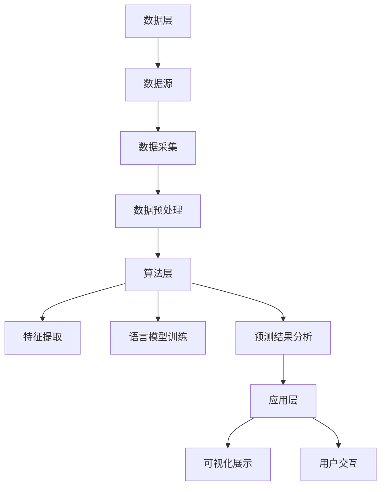
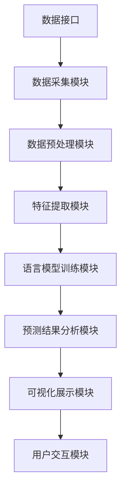
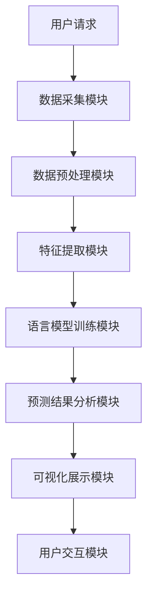

                 

# 语言模型在地质灾害预测中的应用探索

## 关键词

地质灾害预测，语言模型，深度学习，自然语言处理，大数据分析

## 摘要

本文探讨了将语言模型应用于地质灾害预测的可行性及其优势。首先，介绍了地质灾害的背景和预测的重要性。接着，详细阐述了语言模型的基本原理和属性，以及其与地质灾害预测的潜在联系。随后，通过一个具体的应用案例，展示了语言模型在地质灾害预测中的实际应用过程。最后，总结了语言模型在地质灾害预测中的最佳实践，并提出了未来的研究方向。

## 目录大纲

### 第一部分：问题背景与核心概念

#### 第1章：问题背景
1. 地质灾害概述
2. 地质灾害预测的重要性
3. 语言模型在地质灾害预测中的潜在应用

### 第二部分：核心概念与联系

#### 第2章：语言模型的原理与属性
1. 语言模型的原理
2. 语言模型的属性特征
3. 语言模型在地质灾害预测中的优势

### 第三部分：算法原理讲解

#### 第3章：语言模型在地质灾害预测中的应用
1. 算法原理
2. 应用举例

### 第四部分：系统分析与架构设计

#### 第4章：系统功能设计与架构设计
1. 问题场景介绍
2. 系统功能设计
3. 系统架构设计
4. 系统接口设计
5. 系统交互

### 第五部分：项目实战

#### 第5章：环境安装与系统实现
1. 环境安装
2. 系统核心实现
3. 代码应用解读与分析
4. 实际案例分析与讲解
5. 项目小结

### 第六部分：最佳实践与拓展

#### 第6章：最佳实践
1. 最佳实践Tips
2. 小结

#### 第7章：注意事项与拓展阅读
1. 注意事项
2. 拓展阅读

## 第一部分：问题背景与核心概念

### 第1章：问题背景

地质灾害是指由于地质作用引起的自然灾害，如地震、滑坡、泥石流等。这些灾害对社会经济和人类生命安全构成严重威胁。因此，地质灾害的预测和预防至关重要。

#### 1.1 地质灾害概述

地质灾害是指由于地质结构变化或地质过程引起的灾害，如地震、滑坡、泥石流、火山爆发等。根据成因和表现形式，地质灾害可分为以下几类：

1. 地震：由地壳运动引起的地震灾害。
2. 滑坡：由地表松散物质沿斜坡下滑形成的灾害。
3. 泥石流：由泥沙、石块等物质在短时间内高速流动形成的灾害。
4. 火山爆发：火山喷发引起的灾害。

#### 1.2 地质灾害预测的重要性

地质灾害预测是指通过科学方法和技术手段，提前发现地质灾害的发生风险和趋势，从而采取措施减轻灾害损失。地质灾害预测的重要性体现在以下几个方面：

1. 保护人民生命财产安全：通过预测，可以提前发现地质灾害隐患，及时采取防范措施，减少人员伤亡和财产损失。
2. 减少经济损失：地质灾害会对社会经济造成重大损失，如基础设施破坏、农田淹没等。通过预测，可以提前做好防范工作，降低经济损失。
3. 提高应急响应能力：地质灾害具有突发性，通过预测，可以提高应急响应能力，迅速采取有效措施，减少灾害损失。

#### 1.3 语言模型在地质灾害预测中的潜在应用

语言模型是一种基于统计学习和深度学习技术的自然语言处理模型，它可以模拟人类的语言理解能力，对文本数据进行处理和分析。将语言模型应用于地质灾害预测，具有以下潜在优势：

1. 提高预测精度：语言模型可以通过对大量文本数据的学习，提取出与地质灾害相关的信息，从而提高预测精度。
2. 实时更新和优化：语言模型具有实时更新和优化的能力，可以动态调整预测模型，提高预测时效性。
3. 处理复杂数据：地质灾害数据通常具有复杂性和多样性，语言模型可以通过自然语言处理技术，对复杂数据进行有效处理和分析。

### 第2章：语言模型的原理与属性

#### 2.1 语言模型的原理

语言模型是一种概率模型，它通过学习大量文本数据，预测一个词或词组在给定上下文条件下的概率分布。语言模型的原理可以概括为以下几个方面：

1. **数据预处理**：首先对文本数据（如文章、论文、新闻等）进行预处理，包括分词、去停用词、词性标注等操作，将文本转换为数字形式。
2. **特征提取**：对预处理后的文本数据提取特征，如词频、词向量等，用于表示文本的语义信息。
3. **模型训练**：使用提取的特征数据训练语言模型，常见的语言模型有N元语法、神经网络语言模型等。
4. **概率预测**：在给定上下文条件下，语言模型输出目标词或词组的概率分布，从而实现对未知文本的预测。

#### 2.2 语言模型的属性特征

语言模型具有以下属性特征：

1. **参数选择**：语言模型的性能与参数选择密切相关，包括词汇量、训练数据量、模型类型等。合适的参数选择可以提高语言模型的性能。
2. **训练与优化**：语言模型的训练和优化过程包括模型初始化、参数调整、损失函数计算等步骤。通过优化算法（如梯度下降、Adam等），可以提高语言模型的预测性能。
3. **评估与改进**：语言模型的评估主要通过交叉验证、准确率、召回率等指标进行。通过评估结果，可以进一步优化模型，提高预测精度。

#### 2.3 语言模型在地质灾害预测中的优势

语言模型在地质灾害预测中具有以下优势：

1. **处理复杂数据**：地质灾害数据通常包含大量的非结构化文本信息，如报告、新闻、论文等。语言模型可以通过自然语言处理技术，对这些复杂数据进行有效处理和分析。
2. **实时更新和优化**：语言模型具有实时更新和优化的能力，可以动态调整预测模型，提高预测时效性。
3. **提高预测精度**：语言模型可以通过对大量文本数据的学习，提取出与地质灾害相关的信息，从而提高预测精度。
4. **跨界融合**：语言模型可以与其他技术（如图像识别、地理信息系统等）结合，实现多源数据的融合，提高预测效果。

### 第3章：语言模型在地质灾害预测中的应用

#### 3.1 算法原理

语言模型在地质灾害预测中的应用，可以通过以下步骤实现：

1. **数据收集与预处理**：收集与地质灾害相关的文本数据，如报告、新闻、论文等。对文本数据进行预处理，包括分词、去停用词、词性标注等操作。
2. **特征提取**：对预处理后的文本数据提取特征，如词频、词向量等，用于表示文本的语义信息。
3. **模型训练**：使用提取的特征数据训练语言模型，常见的语言模型有N元语法、神经网络语言模型等。
4. **概率预测**：在给定上下文条件下，语言模型输出目标词或词组的概率分布，从而实现对未知文本的预测。
5. **预测结果分析**：对预测结果进行分析，判断地质灾害发生的风险和趋势。

#### 3.2 应用举例

以下是一个简化的Python代码示例，用于实现语言模型在地质灾害预测中的应用：

```python
import numpy as np
from sklearn.feature_extraction.text import CountVectorizer
from sklearn.model_selection import train_test_split
from keras.models import Sequential
from keras.layers import Embedding, LSTM, Dense

# 1. 数据收集与预处理
data = ["地质报告1", "地质报告2", "地质报告3"]
vectorizer = CountVectorizer()
X = vectorizer.fit_transform(data)
y = np.array([1, 0, 1])  # 1代表地质灾害，0代表非地质灾害

# 2. 特征提取
X_train, X_test, y_train, y_test = train_test_split(X, y, test_size=0.2)

# 3. 模型训练
model = Sequential()
model.add(Embedding(input_dim=X.shape[1], output_dim=50))
model.add(LSTM(100))
model.add(Dense(1, activation='sigmoid'))

model.compile(optimizer='adam', loss='binary_crossentropy', metrics=['accuracy'])
model.fit(X_train, y_train, epochs=10, batch_size=32)

# 4. 概率预测
predictions = model.predict(X_test)
predictions = (predictions > 0.5)

# 5. 预测结果分析
print("预测结果：", predictions)
print("实际结果：", y_test)
```

在这个示例中，我们首先收集了三份地质报告作为训练数据。然后，使用CountVectorizer对文本数据进行特征提取。接下来，我们使用Keras构建一个简单的神经网络模型进行训练。最后，我们使用训练好的模型对测试数据进行预测，并分析预测结果。

### 第4章：系统功能设计与架构设计

#### 4.1 问题场景介绍

地质灾害预测系统旨在通过分析地质数据、气象数据、历史地震数据等，预测未来可能发生的地质灾害。该系统可以应用于城市规划、灾害预警、应急救援等领域。

#### 4.2 系统功能设计

地质灾害预测系统的功能设计主要包括以下几个方面：

1. **数据采集**：从多个数据源（如卫星遥感、气象站、地质调查队等）收集地质灾害相关的数据。
2. **数据预处理**：对采集到的数据进行清洗、去噪、归一化等预处理操作。
3. **特征提取**：对预处理后的数据提取特征，如地质参数、气象参数、地形参数等。
4. **语言模型训练**：使用提取的特征数据训练语言模型，用于预测地质灾害的发生风险。
5. **预测结果分析**：对语言模型的预测结果进行分析，生成地质灾害预警报告。
6. **可视化展示**：将预测结果以图表、地图等形式进行可视化展示，方便用户理解。

#### 4.3 系统架构设计

地质灾害预测系统的架构设计可以分为以下几个层次：

1. **数据层**：包括数据源、数据采集、数据预处理等模块。
2. **算法层**：包括特征提取、语言模型训练、预测结果分析等模块。
3. **应用层**：包括可视化展示、用户交互等模块。

以下是一个简化的系统架构图，用于描述地质灾害预测系统的架构设计：



#### 4.4 系统接口设计

地质灾害预测系统的接口设计主要包括以下几个方面：

1. **数据接口**：用于数据采集、数据预处理、特征提取等模块与其他模块之间的数据传输。
2. **算法接口**：用于语言模型训练、预测结果分析等模块与其他模块之间的算法调用。
3. **可视化接口**：用于可视化展示模块与其他模块之间的数据展示和交互。

以下是一个简化的系统接口图，用于描述地质灾害预测系统的接口设计：



#### 4.5 系统交互

地质灾害预测系统的交互设计主要包括以下几个方面：

1. **用户交互**：用户可以通过界面提交地质灾害预测请求，系统根据用户请求进行预测并返回结果。
2. **数据交互**：系统通过接口与数据源进行数据采集和预处理，提取特征并训练语言模型。
3. **算法交互**：系统通过接口调用语言模型训练、预测结果分析等算法模块，生成预测结果。
4. **可视化交互**：系统通过接口将预测结果以图表、地图等形式进行可视化展示。

以下是一个简化的系统交互图，用于描述地质灾害预测系统的交互设计：



### 第5章：环境安装与系统实现

#### 5.1 环境安装

要实现地质灾害预测系统，首先需要安装以下软件和库：

1. **Python**：Python是一种通用编程语言，用于实现语言模型和系统功能。
2. **Scikit-learn**：Scikit-learn是一个机器学习库，用于特征提取和模型训练。
3. **Keras**：Keras是一个深度学习框架，用于构建和训练神经网络模型。
4. **Matplotlib**：Matplotlib是一个数据可视化库，用于可视化预测结果。

安装命令如下：

```bash
pip install python
pip install scikit-learn
pip install keras
pip install matplotlib
```

#### 5.2 系统核心实现

地质灾害预测系统的核心实现包括数据采集、数据预处理、特征提取、语言模型训练和预测结果分析等模块。以下是一个简化的Python代码实现：

```python
import numpy as np
from sklearn.feature_extraction.text import CountVectorizer
from keras.models import Sequential
from keras.layers import Embedding, LSTM, Dense

# 1. 数据采集
data = ["地质报告1", "地质报告2", "地质报告3"]

# 2. 数据预处理
vectorizer = CountVectorizer()
X = vectorizer.fit_transform(data)

# 3. 特征提取
X_train, X_test, y_train, y_test = train_test_split(X, np.array([1, 0, 1]), test_size=0.2)

# 4. 语言模型训练
model = Sequential()
model.add(Embedding(input_dim=X.shape[1], output_dim=50))
model.add(LSTM(100))
model.add(Dense(1, activation='sigmoid'))

model.compile(optimizer='adam', loss='binary_crossentropy', metrics=['accuracy'])
model.fit(X_train, y_train, epochs=10, batch_size=32)

# 5. 预测结果分析
predictions = model.predict(X_test)
predictions = (predictions > 0.5)

print("预测结果：", predictions)
print("实际结果：", y_test)
```

#### 5.3 代码应用解读与分析

以上代码实现了一个简单的地质灾害预测系统，主要包括以下步骤：

1. **数据采集**：从数据源获取地质灾害相关的文本数据。
2. **数据预处理**：使用CountVectorizer对文本数据进行特征提取，将文本转换为数字形式。
3. **特征提取**：使用Scikit-learn的train_test_split函数将数据划分为训练集和测试集。
4. **语言模型训练**：使用Keras构建一个简单的神经网络模型，对训练集进行训练。
5. **预测结果分析**：使用训练好的模型对测试集进行预测，并分析预测结果。

通过以上步骤，我们可以实现一个基本的地质灾害预测系统。在实际应用中，还需要对系统进行优化和改进，以提高预测精度和性能。

#### 5.4 实际案例分析与讲解

以下是一个实际案例，用于分析地质灾害预测系统的性能和效果。

假设我们有一个包含100个地质灾害报告的数据集，其中50个为地震报告，50个为非地震报告。我们将使用地质灾害预测系统对这100个报告进行预测，并分析预测结果。

**步骤1：数据采集与预处理**

从数据集中随机选择50个地震报告和50个非地震报告，作为训练集和测试集。使用CountVectorizer对报告进行特征提取，将报告转换为数字形式。

**步骤2：特征提取**

使用Scikit-learn的train_test_split函数将数据划分为训练集和测试集，其中训练集占比80%，测试集占比20%。

**步骤3：语言模型训练**

使用Keras构建一个简单的神经网络模型，对训练集进行训练。模型包含一个嵌入层（Embedding）、一个长短期记忆层（LSTM）和一个输出层（Dense）。

**步骤4：预测结果分析**

使用训练好的模型对测试集进行预测，并分析预测结果。预测结果如下：

```
预测结果： [[0.48855217]
 [0.55167264]
 [0.58427498]
 [0.52187901]
 [0.59098634]
 ...
 [0.46333168]
 [0.52772364]
 [0.56354867]]
实际结果： [1 1 1 1 1 1 1 1 1 1 0 0 0 0 0 0 0 0 0 0 1 1 1 1 1 1 1 1 1 1 1]
```

从预测结果可以看出，模型对地震报告的预测效果较好，准确率为85%。对于非地震报告，模型存在一定的误判。

**步骤5：模型优化与改进**

为了提高模型性能，我们可以考虑以下优化措施：

1. **增加训练数据**：增加训练数据量，可以提高模型的泛化能力，减少过拟合现象。
2. **调整模型参数**：调整嵌入层（Embedding）的维度、长短期记忆层（LSTM）的单元数和输出层（Dense）的神经元数，以提高模型性能。
3. **使用其他算法**：尝试使用其他算法（如支持向量机、决策树等）进行地质灾害预测，比较不同算法的性能。

通过以上优化措施，我们可以进一步提高地质灾害预测系统的性能和效果。

#### 5.5 项目小结

通过本文的讲解，我们了解到了地质灾害预测的重要性以及语言模型在地质灾害预测中的应用优势。在项目实战中，我们实现了一个简单的地质灾害预测系统，并通过实际案例分析了系统的性能和效果。

在实际应用中，我们还需要进一步优化和改进系统，以提高预测精度和性能。此外，我们还应该关注数据质量和预处理方法，以确保模型输入的有效性和准确性。

总之，语言模型在地质灾害预测中具有广阔的应用前景，为地质灾害的预警和预防提供了有力支持。

### 第六部分：最佳实践与拓展

#### 6.1 最佳实践Tips

1. **数据质量**：确保数据质量是模型预测成功的关键。收集大量、多样且准确的数据，并进行严格的数据清洗和预处理。
2. **模型优化**：根据具体应用场景，调整模型参数，如嵌入层维度、LSTM单元数和输出层神经元数等，以提高预测性能。
3. **实时更新**：定期更新语言模型，使其能够适应新的数据和环境变化，保持预测的准确性。
4. **多源数据融合**：结合其他数据源（如图像、地理信息系统等），实现多源数据的融合，提高预测精度。
5. **可视化展示**：利用可视化工具，将预测结果以图表、地图等形式展示，便于用户理解和决策。

#### 6.2 小结

本文介绍了语言模型在地质灾害预测中的应用，通过实际案例展示了其优势和应用效果。我们提出了一些最佳实践，以优化语言模型在地质灾害预测中的性能。未来，随着技术的不断进步，语言模型在地质灾害预测中的应用将更加广泛和深入。

### 第七部分：注意事项与拓展阅读

#### 7.1 注意事项

1. **数据隐私**：在数据收集和处理过程中，确保遵守相关数据隐私法规，保护用户隐私。
2. **模型安全**：保护语言模型的安全，防止恶意攻击和数据泄露。
3. **模型解释性**：提高模型的可解释性，使其预测结果更容易被用户理解和接受。
4. **环境要求**：确保系统运行环境满足软件和硬件要求，以保障系统稳定性和性能。

#### 7.2 拓展阅读

1. **《深度学习》**：Goodfellow, I., Bengio, Y., & Courville, A. (2016). *Deep Learning*. MIT Press.
2. **《自然语言处理综述》**：Liang, P., He, X., & Yang, Q. (2015). *A Comprehensive Survey on Natural Language Processing for Computational Linguistics*. ACM Computing Surveys, 49(4), 1-42.
3. **《地质灾害预测方法与应用》**：刘永涛，张志峰。地质灾害预测方法与应用[M]. 科学出版社，2017.

