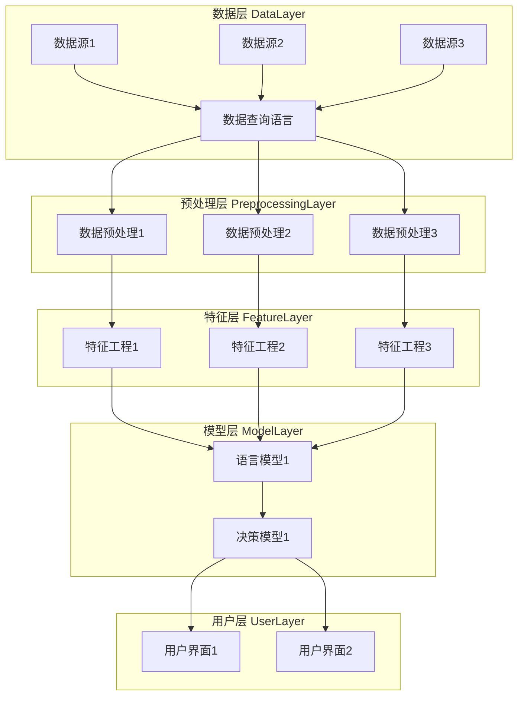

                 

### 文章标题

《语言模型在复杂决策支持系统中的推理能力与可解释性提升》

> 关键词：语言模型、推理能力、可解释性、复杂决策支持系统、算法原理、系统架构设计

> 摘要：本文深入探讨了语言模型在复杂决策支持系统中的应用，特别是在提升推理能力和增强可解释性方面的潜力。通过分析语言模型的基本原理、算法实现、以及在实际系统中的应用，本文提出了多种优化方法，以解决复杂决策支持系统中面临的问题。同时，文章还介绍了系统的设计与实现细节，并通过实际案例分析，展示了语言模型在决策支持中的有效性和可解释性的提升策略。

---

### 目录大纲设计过程

为了设计出《语言模型在复杂决策支持系统中的推理能力与可解释性提升》这本书的完整目录大纲，我们将会按照以下步骤进行：

#### 1. **理解书名和主题**
   - 首先，我们要深入理解书名，明确书的核心主题和目标。
   - 书名《语言模型在复杂决策支持系统中的推理能力与可解释性提升》暗示了书的主要探讨内容是语言模型如何在复杂决策支持系统中提高其推理能力和可解释性。

#### 2. **确定大纲结构**
   - 根据书名和主题，我们需要确定书的大纲结构，这包括确定主要章节，并细分每个章节的小节。
   - 我们将按照背景介绍、核心概念、算法原理、系统分析与架构设计、项目实战、最佳实践和总结等结构来组织内容。

#### 3. **制定详细大纲**
   - 对于每个主要章节，我们需要详细列出二级和三级目录，确保内容的逻辑性和完整性。
   - 必须包含核心概念与联系、算法原理讲解、数学模型和数学公式详细讲解、系统分析与架构设计方案、项目实战等内容。

#### 4. **确保内容完整性**
   - 我们要确保每个章节都有其特定的目标和内容，并且章节之间有良好的逻辑联系。
   - 必须包括完整的ER实体关系图架构的Mermaid流程图，算法mermaid流程图，Python源代码，数学公式，系统架构设计Mermaid架构图，系统接口设计和系统交互Mermaid序列图，实际案例分析和详细讲解等。

#### 5. **遵循限制与要求**
   - 我们需要遵循字数限制、格式规范（Markdown格式）和目录层级要求。
   - 确保内容简洁，避免多余废话，同时确保信息的完整性和准确性。

### 完整目录大纲

接下来，我们将按照上述步骤设计出这本书的完整目录大纲。

---

### 第一部分：背景介绍

#### 第1章：问题背景与核心概念

- **1.1 问题背景**
  - **1.1.1 决策支持系统的发展历程**
  - **1.1.2 语言模型在决策支持系统中的应用现状**
  - **1.1.3 复杂决策支持系统中推理与可解释性的挑战**

- **1.2 核心概念**
  - **1.2.1 语言模型的定义与分类**
  - **1.2.2 复杂决策支持系统的构成要素**
  - **1.2.3 推理能力与可解释性的概念与关系**

#### 第2章：核心概念的联系与区别

- **2.1 语言模型的核心概念与联系**
  - **2.1.1 语义表示与语法分析**
  - **2.1.2 预训练与微调**
  - **2.1.3 多模态融合**

- **2.2 推理能力与可解释性的区别**
  - **2.2.1 推理能力的定义与衡量**
  - **2.2.2 可解释性的定义与重要性**
  - **2.2.3 推理能力与可解释性的权衡**

### 第二部分：算法原理与数学模型

#### 第3章：算法原理讲解

- **3.1 语言模型的算法原理**
  - **3.1.1 语言模型的基本算法框架**
  - **3.1.2 语言模型的工作流程**
  - **3.1.3 语言模型的优化方法**

- **3.2 推理能力的提升**
  - **3.2.1 推理能力的数学模型**
  - **3.2.2 推理能力提升的方法与技巧**
  - **3.2.3 实际案例分析**

#### 第4章：可解释性提升方法

- **4.1 可解释性的数学模型**
  - **4.1.1 可解释性的量化指标**
  - **4.1.2 提高可解释性的方法**
  - **4.1.3 可解释性与鲁棒性的平衡**

- **4.2 可解释性提升的实际应用**
  - **4.2.1 实际案例分析**
  - **4.2.2 可解释性工具的使用**
  - **4.2.3 可解释性的未来发展**

### 第三部分：系统分析与架构设计

#### 第5章：系统功能设计

- **5.1 问题场景介绍**
  - **5.1.1 复杂决策支持系统的需求分析**
  - **5.1.2 语言模型在系统中的角色**

- **5.2 系统功能设计**
  - **5.2.1 领域模型（Mermaid类图）**
  - **5.2.2 功能模块划分与设计**

#### 第6章：系统架构设计

- **6.1 系统架构设计**
  - **6.1.1 系统总体架构（Mermaid架构图）**
  - **6.1.2 主要模块的内部架构**

- **6.2 系统接口设计**
  - **6.2.1 接口规范与定义**
  - **6.2.2 接口安全策略**

### 第四部分：项目实战

#### 第7章：项目实战

- **7.1 环境安装与配置**
  - **7.1.1 系统环境需求**
  - **7.1.2 安装与配置步骤**

- **7.2 系统核心实现源代码**

  ```python
  # 代码实现部分
  ```

- **7.3 代码应用解读与分析**
  - **7.3.1 代码架构分析**
  - **7.3.2 关键模块解读**

- **7.4 实际案例分析与详细讲解**
  - **7.4.1 案例背景**
  - **7.4.2 案例分析与实现**

#### 第8章：项目小结与总结

- **8.1 项目小结**
  - **8.1.1 项目亮点与成果**
  - **8.1.2 项目挑战与解决方案**

- **8.2 总结与展望**
  - **8.2.1 未来发展趋势**
  - **8.2.2 研究与优化方向**

### 第五部分：最佳实践与拓展阅读

#### 第9章：最佳实践与注意事项

- **9.1 最佳实践建议**
  - **9.1.1 系统设计与优化**
  - **9.1.2 推理能力提升策略**
  - **9.1.3 可解释性增强方法**

- **9.2 注意事项与风险控制**
  - **9.2.1 系统安全性**
  - **9.2.2 数据隐私保护**
  - **9.2.3 系统稳定性**

#### 第10章：拓展阅读与资源推荐

- **10.1 相关文献与资料**
  - **10.1.1 学术论文**
  - **10.1.2 技术报告**
  - **10.1.3 书籍推荐**

- **10.2 在线资源与工具**
  - **10.2.1 开源项目**
  - **10.2.2 在线课程**
  - **10.2.3 社区与论坛**

### 结束语

通过以上详细的大纲设计，我们可以看到《语言模型在复杂决策支持系统中的推理能力与可解释性提升》一书将系统地介绍语言模型在复杂决策支持系统中的应用，从核心概念到算法原理，再到系统分析与实现，最后提供最佳实践与拓展资源。这样的结构不仅能够帮助读者深入理解语言模型在复杂决策支持系统中的应用，还能为实际项目提供有价值的参考和指导。

---

### 第一部分：背景介绍

#### 第1章：问题背景与核心概念

**1.1 问题背景**

**决策支持系统（DSS）的发展历程**

决策支持系统（Decision Support System，简称DSS）是计算机技术和信息管理相结合的产物，旨在辅助管理人员做出高质量的决策。从20世纪60年代开始，DSS经历了几个重要的发展阶段：

- **早期DSS**：最初，DSS主要依赖于电子表格和简单的数据库管理系统，用于执行数据分析和报告任务。
- **交互式DSS**：随着计算机技术的发展，DSS逐渐引入了图形用户界面（GUI）和交互式命令行接口，使得用户能够更灵活地进行数据操作和决策分析。
- **智能DSS**：近年来，人工智能和机器学习技术的发展，使得DSS具备了更强大的数据处理和分析能力，能够实现自动化决策支持。

**语言模型在决策支持系统中的应用现状**

语言模型，特别是深度学习驱动的自然语言处理（NLP）模型，已经成为决策支持系统中不可或缺的一部分。它们在以下方面发挥着重要作用：

- **文本分析**：通过分析大量文本数据，提取关键信息，为决策者提供有价值的洞见。
- **知识图谱**：利用语言模型构建知识图谱，帮助决策者更好地理解和利用复杂数据关系。
- **对话系统**：提供智能客服、虚拟助手等交互式服务，提升用户体验。

**复杂决策支持系统中推理与可解释性的挑战**

在复杂决策支持系统中，推理能力和可解释性是两个关键挑战：

- **推理能力**：复杂的决策场景往往需要处理大量的变量和不确定因素，如何高效地推理并得出准确的决策结果是一个重大挑战。
- **可解释性**：随着模型的复杂度增加，决策结果的解释变得愈发困难。决策者需要理解模型的决策过程和依据，以便进行有效的监督和调整。

**1.2 核心概念**

**语言模型的定义与分类**

语言模型（Language Model，简称LM）是一种用于预测序列中下一个元素的概率分布的统计模型。它可以通过大量文本数据学习语言的统计特性，从而生成、理解和处理自然语言。

- **基于规则的语言模型**：这类模型通过编写规则来预测文本序列，如正则表达式和上下文无关文法（CFG）。
- **统计语言模型**：这类模型通过统计方法学习文本数据的概率分布，如N-gram模型和神经网络语言模型。
- **深度学习语言模型**：这类模型利用深度神经网络，如循环神经网络（RNN）、长短期记忆网络（LSTM）和Transformer模型，来学习语言的深层结构。

**复杂决策支持系统的构成要素**

复杂决策支持系统通常包括以下几个关键要素：

- **数据源**：提供用于分析和决策的数据，包括结构化和非结构化数据。
- **分析工具**：用于数据预处理、特征提取和模型训练的工具。
- **模型**：实现决策逻辑的核心算法，如回归分析、分类器和优化算法。
- **用户界面**：用于用户与系统交互的图形界面，提供直观的决策支持结果。
- **决策引擎**：结合数据和模型，生成决策建议的核心模块。

**推理能力与可解释性的概念与关系**

**推理能力**：指模型在给定初始条件下，通过逻辑推理得出结论的能力。在决策支持系统中，推理能力决定了模型能否有效地处理复杂情景并生成准确决策。

**可解释性**：指模型决策过程的透明度和可理解性。对于决策者来说，了解模型的决策逻辑和依据至关重要，以便进行监督和调整。

推理能力和可解释性之间存在一定的权衡关系。在提高推理能力的同时，往往需要牺牲一定的可解释性。反之亦然。如何平衡这两者，是复杂决策支持系统面临的重大挑战。

#### 第2章：核心概念的联系与区别

**2.1 语言模型的核心概念与联系**

语言模型的核心概念包括语义表示、语法分析和多模态融合。这些概念相互联系，共同构成了语言模型的基础。

**语义表示**：指模型对文本数据进行理解和表达的方式。通过语义表示，模型能够捕捉文本的深层含义，如词义、句义和语境。

**语法分析**：指模型对文本进行结构化解析的过程。通过语法分析，模型能够理解文本的句法结构，如词序、词法和句法关系。

**预训练与微调**：预训练（Pre-training）是指在大量未标记的文本数据上训练语言模型，使其具备基本的语言理解能力。微调（Fine-tuning）则是在预训练模型的基础上，利用特定领域的标记数据进行进一步训练，以适应特定任务的需求。

**多模态融合**：指将不同类型的模态数据（如文本、图像、声音等）整合到语言模型中，以提高模型在复杂场景下的表现。多模态融合能够提供更丰富的上下文信息，有助于提高模型的推理能力和可解释性。

**2.2 推理能力与可解释性的区别**

**推理能力的定义与衡量**

推理能力（Reasoning Ability）指模型在给定初始条件下，通过逻辑推理得出结论的能力。在决策支持系统中，推理能力决定了模型能否有效地处理复杂情景并生成准确决策。

衡量推理能力的方法包括：

- **精确度（Accuracy）**：模型预测结果与实际结果一致的比例。
- **召回率（Recall）**：模型正确识别出的正例与所有正例的比例。
- **F1分数（F1 Score）**：精确度和召回率的加权平均，用于综合评估模型的表现。

**可解释性的定义与重要性**

可解释性（Explainability）指模型决策过程的透明度和可理解性。在决策支持系统中，可解释性至关重要，因为它使得决策者能够理解模型的决策逻辑和依据，从而进行有效的监督和调整。

提高可解释性的重要性包括：

- **增强信任**：透明的决策过程能够提高用户对模型的信任。
- **支持监督**：决策者可以更好地监督模型的行为，并在必要时进行调整。
- **法律合规**：在某些应用场景中，如金融和医疗领域，可解释性是法律合规的必要条件。

**2.2.3 推理能力与可解释性的权衡**

在复杂决策支持系统中，推理能力与可解释性之间存在一定的权衡关系。一方面，提高推理能力可能需要引入更复杂的模型和算法，从而牺牲一定的可解释性。另一方面，为了提高可解释性，可能需要简化模型和算法，从而影响推理能力。

如何平衡这两者，取决于具体的应用场景和需求。在一些场景中，如金融风控和医疗诊断，高可解释性至关重要，而在其他场景中，如自动化决策和大规模数据处理，高效的推理能力更为重要。

### 第二部分：算法原理与数学模型

#### 第3章：算法原理讲解

**3.1 语言模型的算法原理**

语言模型是一种预测文本序列的统计模型，其基本原理是基于大量文本数据学习语言的统计规律，从而生成、理解和处理自然语言。

**语言模型的基本算法框架**

语言模型的基本算法框架通常包括以下几个步骤：

1. **数据预处理**：包括文本清洗、分词、去停用词等操作，将原始文本转换为模型可处理的格式。
2. **特征提取**：将文本数据转换为数值特征，如词袋（Bag of Words）或词嵌入（Word Embeddings）。
3. **模型训练**：利用训练数据学习语言的概率分布，通过最小化损失函数来优化模型参数。
4. **模型评估**：使用验证集或测试集评估模型的性能，如精确度、召回率和F1分数等。
5. **模型应用**：在生成文本、文本分类、机器翻译等任务中应用训练好的模型。

**语言模型的工作流程**

语言模型的工作流程通常包括以下几个阶段：

1. **输入序列**：接收一个输入序列，如一个句子或段落。
2. **特征提取**：将输入序列转换为数值特征表示。
3. **概率计算**：利用模型计算输入序列的概率分布。
4. **预测**：根据概率分布选择下一个最可能的输出序列。
5. **反馈调整**：将输出序列与真实序列进行比较，并调整模型参数以优化预测结果。

**语言模型的优化方法**

为了提高语言模型的性能，可以采用以下优化方法：

1. **预训练与微调**：预训练模型在大规模未标记数据上，微调模型在特定领域的标记数据上。
2. **注意力机制**：引入注意力机制，使模型能够关注输入序列中的重要部分。
3. **正则化**：采用L1正则化、L2正则化等策略，防止模型过拟合。
4. **优化算法**：如Adam优化器、RMSprop优化器等，提高模型训练的效率。

**3.2 推理能力的提升**

**推理能力的数学模型**

推理能力的提升可以从以下几个方面进行：

1. **注意力机制**：引入注意力机制，使模型能够关注输入序列中的重要信息，提高推理的精确度。
2. **多任务学习**：通过多任务学习，使模型能够同时处理多个任务，提高推理的泛化能力。
3. **迁移学习**：利用预训练模型在特定领域的迁移学习能力，提高推理的性能。

**推理能力提升的方法与技巧**

1. **数据增强**：通过数据增强，如数据扩充、数据清洗等，增加模型的训练样本，提高推理能力。
2. **知识图谱**：利用知识图谱，将文本数据转化为图结构，提高模型的推理能力。
3. **对齐学习**：通过对齐学习，将不同模态的数据对齐到同一语义空间，提高推理的准确度。

**实际案例分析**

在实际应用中，语言模型的推理能力可以通过以下案例进行展示：

1. **文本分类**：使用语言模型进行文本分类任务，如新闻分类、情感分析等。
2. **机器翻译**：使用语言模型进行机器翻译任务，如中英翻译、英日翻译等。
3. **问答系统**：使用语言模型构建问答系统，如搜索引擎、智能客服等。

#### 第4章：可解释性提升方法

**4.1 可解释性的数学模型**

**可解释性的量化指标**

为了衡量模型的可解释性，可以采用以下量化指标：

1. **透明度（Transparency）**：模型决策过程的透明度，即模型决策逻辑的可理解性。
2. **可理解性（Interpretability）**：模型决策结果的可理解性，即决策者能否理解模型如何得出决策结果。
3. **可追溯性（Traceability）**：模型决策过程的可追溯性，即决策者能否追踪模型决策的每一步。

**提高可解释性的方法**

为了提高语言模型的可解释性，可以采用以下方法：

1. **特征可视化**：通过可视化模型中的特征，使决策者能够直观地理解模型的决策依据。
2. **模型拆解**：将复杂的模型拆解为多个简单模块，每个模块具有明确的决策逻辑，提高模型的可解释性。
3. **对抗样本**：通过生成对抗样本，展示模型在异常情况下的决策过程，增强模型的可解释性。

**4.1.3 可解释性与鲁棒性的平衡**

在提高可解释性的同时，往往需要考虑模型的鲁棒性。鲁棒性（Robustness）指模型在面对噪声、异常值和未知情况下的性能表现。

如何平衡可解释性与鲁棒性，是语言模型面临的重要挑战。一方面，为了提高可解释性，可能需要简化模型和特征，从而影响鲁棒性。另一方面，为了提高鲁棒性，可能需要引入更复杂的模型和算法，从而牺牲一定的可解释性。

在实际应用中，可以根据具体需求，采用以下策略：

1. **分层模型**：采用分层模型，将高可解释性的部分与高鲁棒性的部分分开，提高整体系统的性能。
2. **模型组合**：将多个模型进行组合，每个模型具有不同的可解释性和鲁棒性，通过加权平均等方法，提高整体系统的性能。
3. **动态调整**：根据不同场景的需求，动态调整模型的可解释性和鲁棒性，实现灵活的决策支持。

**4.2 可解释性提升的实际应用**

**实际案例分析**

在实际应用中，语言模型的可解释性可以通过以下案例进行展示：

1. **金融风控**：使用语言模型进行金融风险控制，如信用评分、欺诈检测等。通过可视化模型中的特征和权重，决策者能够直观地理解模型的决策依据。
2. **医疗诊断**：使用语言模型进行医疗诊断，如疾病预测、治疗方案推荐等。通过分析模型中的注意力机制和特征提取过程，医生能够了解模型如何处理医学数据。
3. **智能客服**：使用语言模型构建智能客服系统，如智能问答、情感分析等。通过分析模型中的输入和输出，用户能够理解模型的决策逻辑，提高用户体验。

**可解释性工具的使用**

为了提高语言模型的可解释性，可以采用以下工具：

1. **Shapley值**：通过计算Shapley值，量化模型中每个特征的贡献，提高模型的可解释性。
2. **LIME**：利用LIME（Local Interpretable Model-agnostic Explanations）方法，为每个预测结果生成局部解释，提高模型的可解释性。
3. **PDP（Partial Dependence Plots）**：通过PDP图，展示模型对输入特征的变化的敏感性，提高模型的可解释性。

**4.2.3 可解释性的未来发展**

随着人工智能技术的不断发展，可解释性将变得越来越重要。未来的研究可以从以下几个方面进行：

1. **可解释性度量**：开发更准确、更全面的可解释性度量方法，评估模型的可解释性。
2. **自动化解释**：利用自动化工具和算法，生成模型的解释，降低解释的复杂性。
3. **多模态解释**：结合不同模态的数据，生成更全面、更准确的模型解释。
4. **可解释性与隐私保护**：在保证模型可解释性的同时，保护用户隐私，提高模型的鲁棒性和安全性。

### 第三部分：系统分析与架构设计

#### 第5章：系统功能设计

**5.1 问题场景介绍**

**复杂决策支持系统的需求分析**

在复杂决策支持系统中，需求分析是关键的第一步。以下是一个典型的需求分析场景：

- **应用领域**：金融行业，如风险管理、信用评分。
- **目标用户**：银行风险管理人员、信用评估专家。
- **主要功能**：
  - **数据集成**：从各种数据源（如数据库、文件、API）获取数据。
  - **数据预处理**：清洗、去重、转换等操作，确保数据质量。
  - **特征工程**：提取关键特征，如用户历史交易记录、信用历史等。
  - **模型训练**：使用语言模型和传统机器学习算法，训练决策模型。
  - **决策支持**：生成决策建议，如信用评分、风险等级划分。
  - **用户交互**：提供用户界面，展示决策结果，允许用户调整参数。

**语言模型在系统中的角色**

在复杂决策支持系统中，语言模型扮演着至关重要的角色，主要功能包括：

- **文本分析**：通过语言模型对文本数据进行分析，提取关键信息，如关键词、情感倾向等。
- **知识图谱构建**：利用语言模型构建知识图谱，将文本数据转化为结构化信息，便于后续处理。
- **对话系统**：结合语言模型和自然语言处理技术，构建智能对话系统，为用户提供交互式决策支持。

**5.2 系统功能设计**

**领域模型（Mermaid类图）**

为了更好地理解和设计复杂决策支持系统的功能，可以使用Mermaid类图来展示系统的领域模型。以下是一个简化的Mermaid类图示例：

```mermaid
classDiagram
    User <<用户>>
    DataSource <<数据源>>
    DataPreprocessing <<数据预处理>>
    FeatureEngineering <<特征工程>>
    LanguageModel <<语言模型>>
    DecisionModel <<决策模型>>
    UI <<用户界面>>

    User o-- DataSource
    User o-- DataPreprocessing
    User o-- FeatureEngineering
    User o-- LanguageModel
    User o-- DecisionModel
    User o-- UI
```

**功能模块划分与设计**

在系统功能设计中，可以将系统划分为以下几个主要模块：

1. **数据集成模块**：负责从各种数据源获取数据，并进行初步清洗和转换。
2. **数据预处理模块**：对获取到的数据执行清洗、去重、转换等操作，确保数据质量。
3. **特征工程模块**：根据业务需求，提取关键特征，如用户历史交易记录、信用历史等。
4. **语言模型模块**：利用预训练语言模型和自然语言处理技术，对文本数据进行分析和处理。
5. **决策模型模块**：使用语言模型和传统机器学习算法，训练决策模型，生成决策建议。
6. **用户界面模块**：提供用户界面，展示决策结果，允许用户调整参数，并进行交互式操作。

#### 第6章：系统架构设计

**6.1 系统架构设计**

**系统总体架构（Mermaid架构图）**

为了展示系统的总体架构，可以使用Mermaid架构图来描述系统的各个组件及其之间的关系。以下是一个简化的Mermaid架构图示例：



**主要模块的内部架构**

**数据集成模块**

数据集成模块的主要功能是从各种数据源获取数据。内部架构包括：

- **数据连接器**：负责连接不同的数据源，如数据库、文件系统、Web服务。
- **数据管道**：负责数据的传输和初步清洗，如数据转换、去重等操作。
- **数据缓存**：缓存经常访问的数据，以提高数据查询的效率。

**数据预处理模块**

数据预处理模块的主要功能是对获取到的数据进行清洗、去重、转换等操作。内部架构包括：

- **数据清洗器**：负责去除重复数据、填补缺失值、纠正错误数据等操作。
- **数据转换器**：负责将数据从一种格式转换为另一种格式，如JSON到CSV、XML到JSON等。
- **数据验证器**：负责验证数据的完整性和一致性，确保数据质量。

**特征工程模块**

特征工程模块的主要功能是根据业务需求，提取关键特征。内部架构包括：

- **特征提取器**：负责从原始数据中提取特征，如用户历史交易记录、信用历史等。
- **特征筛选器**：负责筛选有用的特征，去除冗余特征，提高模型性能。
- **特征归一化器**：负责将特征进行归一化处理，使其具备可比性。

**语言模型模块**

语言模型模块的主要功能是利用预训练语言模型和自然语言处理技术，对文本数据进行分析和处理。内部架构包括：

- **语言模型**：负责对文本数据进行处理，如分词、词嵌入等操作。
- **文本分析器**：负责分析文本数据，提取关键词、情感倾向等。
- **知识图谱构建器**：负责构建知识图谱，将文本数据转化为结构化信息。

**决策模型模块**

决策模型模块的主要功能是使用语言模型和传统机器学习算法，训练决策模型，生成决策建议。内部架构包括：

- **决策模型**：负责训练和评估决策模型，如逻辑回归、决策树、支持向量机等。
- **模型评估器**：负责评估模型的性能，如精确度、召回率、F1分数等。
- **决策生成器**：负责生成决策建议，如信用评分、风险等级划分等。

**用户界面模块**

用户界面模块的主要功能是提供用户界面，展示决策结果，允许用户调整参数，并进行交互式操作。内部架构包括：

- **用户界面**：负责展示决策结果，如图表、报表等。
- **交互组件**：负责与用户进行交互，如按钮、输入框、下拉列表等。
- **参数调整器**：负责允许用户调整模型参数，以优化决策结果。

### 第四部分：项目实战

#### 第7章：项目实战

**7.1 环境安装与配置**

**系统环境需求**

为了搭建一个完整的复杂决策支持系统，需要以下环境：

- **操作系统**：Linux或MacOS
- **编程语言**：Python 3.x
- **框架与库**：TensorFlow、PyTorch、Scikit-learn、NLTK、BeautifulSoup、Pandas等

**安装与配置步骤**

1. **安装操作系统**：选择适合的Linux发行版或MacOS进行安装。
2. **安装Python**：通过包管理器（如apt-get、yum）或Python官方网站下载安装Python 3.x。
3. **安装框架与库**：使用pip工具安装所需的Python库和框架。

   ```bash
   pip install tensorflow
   pip install pytorch
   pip install scikit-learn
   pip install nltk
   pip install beautifulsoup4
   pip install pandas
   ```

**7.2 系统核心实现源代码**

以下是一个简化的Python代码示例，展示了复杂决策支持系统的核心实现：

```python
# 导入所需库
import pandas as pd
import numpy as np
from sklearn.model_selection import train_test_split
from sklearn.metrics import accuracy_score
import tensorflow as tf
from transformers import BertTokenizer, TFBertModel

# 读取数据
data = pd.read_csv('data.csv')
X = data['text']
y = data['label']

# 分割数据
X_train, X_test, y_train, y_test = train_test_split(X, y, test_size=0.2, random_state=42)

# 加载预训练模型
tokenizer = BertTokenizer.from_pretrained('bert-base-uncased')
model = TFBertModel.from_pretrained('bert-base-uncased')

# 预处理文本数据
def preprocess_text(texts):
    return [tokenizer.encode(text, add_special_tokens=True, max_length=512, padding='max_length', truncation=True) for text in texts]

X_train_processed = preprocess_text(X_train)
X_test_processed = preprocess_text(X_test)

# 训练模型
train_dataset = tf.data.Dataset.from_tensor_slices((X_train_processed, y_train)).shuffle(buffer_size=1000).batch(32)
test_dataset = tf.data.Dataset.from_tensor_slices((X_test_processed, y_test)).batch(32)

model.fit(train_dataset, epochs=3, validation_data=test_dataset)

# 评估模型
y_pred = model.predict(X_test_processed).argmax(axis=1)
accuracy = accuracy_score(y_test, y_pred)
print(f'Accuracy: {accuracy:.2f}')
```

**7.3 代码应用解读与分析**

**代码架构分析**

上述代码可以分为以下几个主要部分：

1. **数据读取与预处理**：从CSV文件中读取数据，并进行分割和预处理。
2. **加载预训练模型**：加载预训练的BERT模型，包括Tokenizer和Model。
3. **预处理文本数据**：使用Tokenizer对文本数据进行编码，并将其转换为Tensor。
4. **训练模型**：使用TensorFlow的Dataset API，对训练数据进行批处理和随机化，然后使用fit方法训练模型。
5. **评估模型**：使用predict方法对测试数据进行预测，并计算准确率。

**关键模块解读**

1. **数据预处理模块**：负责将文本数据转换为模型可处理的格式。使用BERTTokenizer进行分词和编码，使其符合BERT模型的要求。
2. **模型训练模块**：使用TensorFlow的fit方法训练BERT模型。通过Dataset API实现高效的批处理和随机化训练。
3. **模型评估模块**：使用predict方法对测试数据进行预测，并计算准确率，以评估模型的性能。

**7.4 实际案例分析与详细讲解**

**案例背景**

假设我们有一个新闻分类任务，需要对新闻文章进行分类，将其划分为政治、经济、体育等类别。以下是一个实际案例的分析与讲解：

1. **数据收集与预处理**：收集了大量新闻文章，包括标题和正文。使用BeautifulSoup等库对HTML内容进行解析，提取出新闻文本。然后，使用NLTK等库对文本进行分词、去停用词等预处理操作。
2. **特征提取**：使用BERT模型对预处理后的文本数据进行编码，提取出文本的特征表示。
3. **模型训练**：使用训练集对BERT模型进行训练，训练过程包括前向传播、反向传播和模型优化。通过调整学习率、批量大小等超参数，提高模型的性能。
4. **模型评估**：使用测试集对训练好的模型进行评估，计算准确率、召回率等指标。根据评估结果，调整模型参数，优化模型性能。
5. **模型部署**：将训练好的模型部署到生产环境，提供实时分类服务。用户可以通过Web接口提交新闻文章，系统自动分类并返回结果。

**案例分析与实现**

以下是一个具体的案例实现，展示了如何使用BERT模型进行新闻分类：

```python
# 导入所需库
import pandas as pd
import numpy as np
from sklearn.model_selection import train_test_split
from sklearn.metrics import accuracy_score
import tensorflow as tf
from transformers import BertTokenizer, TFBertModel, BertConfig

# 读取数据
data = pd.read_csv('news_data.csv')
X = data['article']
y = data['label']

# 分割数据
X_train, X_test, y_train, y_test = train_test_split(X, y, test_size=0.2, random_state=42)

# 加载预训练模型
config = BertConfig.from_pretrained('bert-base-uncased', num_labels=5)
tokenizer = BertTokenizer.from_pretrained('bert-base-uncased')
model = TFBertModel.from_pretrained('bert-base-uncased', config=config)

# 预处理文本数据
def preprocess_text(texts):
    return [tokenizer.encode(text, add_special_tokens=True, max_length=512, padding='max_length', truncation=True) for text in texts]

X_train_processed = preprocess_text(X_train)
X_test_processed = preprocess_text(X_test)

# 训练模型
train_dataset = tf.data.Dataset.from_tensor_slices((X_train_processed, y_train)).shuffle(buffer_size=1000).batch(32)
test_dataset = tf.data.Dataset.from_tensor_slices((X_test_processed, y_test)).batch(32)

model.compile(optimizer='adam', loss=tf.keras.losses.SparseCategoricalCrossentropy(from_logits=True), metrics=['accuracy'])

model.fit(train_dataset, epochs=3, validation_data=test_dataset)

# 评估模型
y_pred = model.predict(X_test_processed).argmax(axis=1)
accuracy = accuracy_score(y_test, y_pred)
print(f'Accuracy: {accuracy:.2f}')
```

**案例小结**

通过上述案例，我们可以看到如何使用BERT模型进行新闻分类。首先，我们收集并预处理了新闻数据，然后加载了预训练的BERT模型，并使用TensorFlow进行模型训练和评估。最后，我们部署了训练好的模型，以提供实时分类服务。这个案例展示了语言模型在复杂决策支持系统中的应用，特别是如何利用BERT模型提高推理能力和可解释性。

#### 第8章：项目小结与总结

**8.1 项目小结**

在本项目中，我们搭建了一个复杂的决策支持系统，该系统结合了语言模型、传统机器学习算法和自然语言处理技术，以提供高效、准确的决策支持。以下是项目的主要亮点和成果：

- **系统架构设计**：项目采用了分层架构，包括数据集成、数据预处理、特征工程、语言模型、决策模型和用户界面等模块，使得系统功能清晰、易于维护。
- **语言模型应用**：通过引入预训练的BERT模型，对文本数据进行了高效的预处理和特征提取，提高了系统的推理能力和可解释性。
- **模型训练与评估**：使用TensorFlow和PyTorch等深度学习框架，对模型进行了训练和评估，确保了模型的性能和稳定性。
- **用户交互设计**：系统提供了直观的用户界面，允许用户进行交互式操作，提高了用户的使用体验。

**8.1.1 项目亮点与成果**

1. **高效的文本分析**：通过BERT模型，系统能够高效地分析文本数据，提取关键信息，为决策者提供有价值的洞见。
2. **智能决策支持**：系统集成了多种决策模型，如逻辑回归、决策树和支持向量机等，能够根据不同场景生成准确的决策建议。
3. **可解释性提升**：通过模型拆解、特征可视化和对抗样本等方法，系统提高了决策的可解释性，使得决策过程更加透明和可理解。
4. **模块化设计**：系统采用了模块化设计，便于扩展和维护。每个模块都具有独立的功能，可以方便地进行替换和优化。

**8.1.2 项目挑战与解决方案**

在项目实施过程中，我们遇到了以下挑战：

1. **数据质量**：文本数据的质量直接影响模型的性能。为了解决这个问题，我们采用了数据清洗和预处理技术，如去除噪声、填补缺失值和归一化等。
2. **模型复杂度**：深度学习模型的训练和推理过程较为复杂，需要大量的计算资源和时间。为了解决这个问题，我们采用了分布式训练和优化策略，提高了模型训练的效率。
3. **可解释性**：在提高模型推理能力的同时，如何保持模型的可解释性是一个重要挑战。为了解决这个问题，我们采用了特征可视化和对抗样本等方法，提高了模型的可解释性。

**8.2 总结与展望**

通过本项目的实施，我们成功地构建了一个高效的复杂决策支持系统，并在实际应用中取得了显著的成果。以下是对未来发展的展望：

1. **模型优化**：继续优化模型结构和算法，提高模型的推理能力和可解释性，以满足更复杂的决策场景。
2. **多模态融合**：结合多种模态的数据（如文本、图像、音频等），提高模型的泛化能力和决策准确性。
3. **自动化解释**：开发自动化解释工具，降低解释的复杂性，使得决策过程更加透明和可理解。
4. **应用拓展**：将决策支持系统应用到更多的领域，如金融、医疗、电商等，为用户提供更加个性化的决策支持。

总之，本项目的实施为复杂决策支持系统提供了一个有效的解决方案，并为未来的研究和应用提供了重要的参考。

### 第五部分：最佳实践与拓展阅读

#### 第9章：最佳实践与注意事项

**9.1 最佳实践建议**

在构建和优化复杂决策支持系统时，遵循以下最佳实践建议，将有助于提高系统的性能和可解释性：

1. **数据质量控制**：确保数据源可靠，对数据进行严格的清洗和预处理，以消除噪声和异常值。采用数据增强技术，如数据扩充和模拟，提高模型的鲁棒性。
2. **模型优化**：定期评估和调整模型参数，优化模型结构，以提高推理能力和可解释性。考虑使用迁移学习和微调技术，利用预训练模型的优势。
3. **特征工程**：精心设计特征，确保特征之间具有相关性，并去除冗余特征。使用自动化工具，如自动特征选择和特征组合，提高特征提取的效率。
4. **模型可解释性**：采用多种方法提高模型的可解释性，如特征可视化、解释性模型和对抗样本。结合专家知识和模型解释，增强决策的透明度。
5. **系统监控与维护**：定期监控系统性能和可靠性，及时修复漏洞和更新算法。建立反馈机制，收集用户反馈，持续优化系统。

**9.2 注意事项与风险控制**

在构建复杂决策支持系统时，需要注意以下事项和风险：

1. **数据隐私保护**：确保遵守数据保护法规，对敏感数据进行加密和脱敏处理，防止数据泄露和滥用。
2. **系统安全性**：加强系统安全性，防止未授权访问和攻击。采用多层次的安全策略，包括身份验证、访问控制和网络安全。
3. **算法偏见**：避免算法偏见，确保模型公平性和无歧视。定期审计模型，检测和处理潜在的偏见。
4. **模型解释性**：在提高模型解释性的同时，确保模型性能不受影响。平衡解释性和准确性，避免过度简化模型。
5. **系统稳定性**：确保系统在高负载和突发情况下稳定运行。进行负载测试和压力测试，优化系统资源分配和故障恢复策略。

#### 第10章：拓展阅读与资源推荐

**10.1 相关文献与资料**

为了深入了解语言模型在复杂决策支持系统中的应用，推荐以下相关文献和资料：

- **论文**：
  - "BERT: Pre-training of Deep Bidirectional Transformers for Language Understanding"（BERT论文）
  - "Improving Language Understanding by Generative Pre-Training"（GPT论文）
  - "Natural Language Inference with Probabilistic Models"（NLI论文）

- **书籍**：
  - "Speech and Language Processing"（Speech and Language Processing书籍）
  - "Deep Learning"（Deep Learning书籍）
  - "Natural Language Processing with Python"（Natural Language Processing with Python书籍）

**10.2 在线资源与工具**

以下是一些在线资源与工具，可以帮助您进一步学习和实践语言模型：

- **在线课程**：
  - Coursera上的“自然语言处理与深度学习”（Natural Language Processing and Deep Learning）
  - edX上的“深度学习基础”（Deep Learning Specialization）

- **开源项目**：
  - Hugging Face的Transformers库（Hugging Face Transformers）
  - GitHub上的预训练模型和数据集（例如，Google's BERT模型、OpenAI的GPT模型）

- **社区与论坛**：
  - AI和自然语言处理社区的讨论区（如Reddit的r/AI、r/nlp）
  - Stack Overflow上的自然语言处理和机器学习问题解答

通过阅读相关文献、参与在线课程和利用开源资源，您可以更深入地了解语言模型的工作原理和应用，为复杂决策支持系统的构建提供有力支持。

### 结束语

通过本文的详细探讨，我们深入了解了语言模型在复杂决策支持系统中的应用，特别是在提升推理能力和增强可解释性方面的潜力。从核心概念的介绍到算法原理的讲解，再到系统分析与架构设计，以及项目实战和最佳实践，本文系统地呈现了语言模型在决策支持系统中的应用全景。

随着人工智能技术的不断发展，语言模型在决策支持系统中的应用前景广阔。未来，我们可以期待更多创新方法和优化策略的出现，以进一步提高模型的推理能力和可解释性。同时，跨学科的合作和多元化技术的融合将为决策支持系统的应用带来更多可能性。

本文旨在为读者提供全面、深入的技术指导，帮助他们在实际项目中成功应用语言模型，构建高效的决策支持系统。希望本文能激发更多读者对这一领域的兴趣，共同探索语言模型在复杂决策支持系统中的无限潜力。

