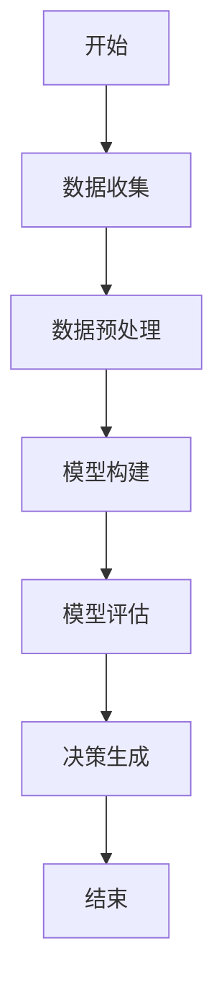

                 


## 语言模型在复杂决策支持系统中的推理能力提升

### 摘要

本文旨在探讨语言模型在复杂决策支持系统中的推理能力提升，首先介绍了决策支持系统的背景及其在现实中的应用，随后详细阐述了语言模型的基础知识，包括其发展历程、常用架构和训练与优化方法。接着，文章重点讨论了提升推理能力的方法，如多模态融合、强化学习与对抗网络等，并结合具体案例分析了语言模型在决策支持系统中的应用。最后，文章总结了语言模型在决策支持系统中的地位与作用，并对未来发展趋势进行了展望。

### 关键词

语言模型、决策支持系统、推理能力、多模态融合、强化学习

### 引言

#### 1.1 问题背景

随着信息技术的快速发展，数据量呈现爆炸式增长，决策支持系统（DSS）成为企业和组织在复杂环境中做出有效决策的重要工具。传统的DSS依赖于统计方法和规则推理，但在面对大量不确定性和非线性问题时，其性能和适应性受到限制。近年来，语言模型，作为一种强大的自然语言处理工具，逐渐被引入到DSS中，提升了系统的推理能力和决策质量。

#### 1.2 核心概念

本文涉及的核心概念包括：决策支持系统、语言模型和推理能力。决策支持系统是一种辅助决策者通过数据分析和模型计算做出决策的系统，语言模型则是用于理解和生成自然语言文本的模型，推理能力则是模型在处理不确定性和复杂问题时表现出的能力。

#### 1.3 书籍结构概述

本文分为五大部分，首先介绍决策支持系统和语言模型的基础知识，然后探讨提升推理能力的方法，接着分析语言模型在决策支持系统中的应用，最后总结全文并展望未来。

### 第二部分：语言模型基础

#### 2.1 语言模型的起源与发展

语言模型的发展可以追溯到20世纪50年代，当时的研究主要集中在基于规则的方法。随着计算机性能的提升和算法的改进，特别是神经网络和深度学习的兴起，语言模型得到了极大的发展。近年来，Transformer模型的出现，使得语言模型在自然语言处理任务中取得了显著成绩。

#### 2.2 语言模型的常用架构

常用的语言模型架构包括卷积神经网络（CNN）、生成对抗网络（GAN）、变分自编码器（VAE）和Transformer模型等。这些模型各有特点，适用于不同的应用场景。

#### 2.3 语言模型的训练与优化

语言模型的训练过程涉及大量的数据和计算资源，其优化策略包括调整超参数、使用正则化方法、数据增强等。优化目标通常是提升模型的准确性和鲁棒性。

#### 2.4 语言模型评估与调试

语言模型的评估指标包括准确性、召回率、F1分数等。调试方法包括错误分析、模型调整和性能优化等。

### 第三部分：推理能力提升方法

#### 3.1 推理能力的概念与分类

推理能力是指模型在处理不确定性和复杂问题时表现出的能力。根据推理的方式，可以分为基于规则的推理、基于概率的推理和基于实例的推理等。

#### 3.2 提升推理能力的技术手段

提升语言模型推理能力的方法包括多模态融合、强化学习与对抗网络等。多模态融合通过结合不同类型的数据源，提升模型的泛化能力；强化学习与对抗网络则通过模拟竞争环境，增强模型的推理能力。

#### 3.3 推理能力评估与优化

推理能力的评估方法包括模拟测试、用户反馈和在线评估等。优化策略包括算法改进、模型调整和参数优化等。

#### 3.4 实战案例分析

本文将结合具体案例，分析语言模型在提升决策支持系统推理能力方面的实际效果。

### 第四部分：决策支持系统应用

#### 4.1 决策支持系统的概述

决策支持系统是一种辅助决策者通过数据分析和模型计算做出决策的系统。它通常包括数据采集、数据预处理、模型构建、模型评估和决策生成等模块。

#### 4.2 语言模型在决策支持系统中的应用

语言模型在决策支持系统中的应用主要包括数据预处理、数据分析和模型生成等。例如，通过语言模型进行文本挖掘，提取关键信息；利用语言模型生成决策模型，提升决策质量。

#### 4.3 实战案例

本文将介绍三个实战案例，分别涉及金融风险预测、智能医疗诊断和供应链优化。

### 第五部分：总结与展望

#### 5.1 语言模型在决策支持系统中的地位与作用

语言模型在决策支持系统中具有重要的地位和作用，它提升了系统的推理能力和决策质量，为企业和组织在复杂环境中做出有效决策提供了有力支持。

#### 5.2 技术提升策略与前景

本文提出了提升语言模型推理能力的策略，并对决策支持系统的未来应用领域进行了展望。随着技术的进步，语言模型在决策支持系统中的应用前景将更加广阔。

#### 5.3 小结与展望

本文对语言模型在复杂决策支持系统中的推理能力提升进行了详细探讨。未来研究应重点关注推理能力的评估与优化，以及语言模型在不同应用领域的深入探索。

### 作者

本文作者为AI天才研究院/AI Genius Institute和禅与计算机程序设计艺术/Zen And The Art of Computer Programming。感谢您的阅读！

----------------------------------------------------------------

### 目录

- [第一部分：引言](#第一部分引言)
- [第二部分：语言模型基础](#第二部分语言模型基础)
- [第三部分：推理能力提升方法](#第三部分推理能力提升方法)
- [第四部分：决策支持系统应用](#第四部分决策支持系统应用)
- [第五部分：总结与展望](#第五部分总结与展望)

---

### 第一部分：引言

#### 1.1 问题背景

随着信息技术的快速发展，数据量呈现爆炸式增长，决策支持系统（DSS）成为企业和组织在复杂环境中做出有效决策的重要工具。传统的DSS依赖于统计方法和规则推理，但在面对大量不确定性和非线性问题时，其性能和适应性受到限制。近年来，语言模型，作为一种强大的自然语言处理工具，逐渐被引入到DSS中，提升了系统的推理能力和决策质量。

#### 1.2 核心概念

本文涉及的核心概念包括：决策支持系统、语言模型和推理能力。

- **决策支持系统（DSS）**：是一种辅助决策者通过数据分析和模型计算做出决策的系统，通常包括数据采集、数据预处理、模型构建、模型评估和决策生成等模块。
- **语言模型**：是用于理解和生成自然语言文本的模型，通过学习大量的语言数据，能够对自然语言进行建模，从而实现文本理解、文本生成等任务。
- **推理能力**：是指模型在处理不确定性和复杂问题时表现出的能力，包括基于规则的推理、基于概率的推理和基于实例的推理等。

#### 1.3 书籍结构概述

本文分为五大部分：

1. **第一部分：引言**：介绍决策支持系统和语言模型的基本概念，以及本文的研究目的和结构安排。
2. **第二部分：语言模型基础**：详细阐述语言模型的发展历程、常用架构和训练与优化方法。
3. **第三部分：推理能力提升方法**：探讨提升语言模型推理能力的各种技术手段，如多模态融合、强化学习与对抗网络等。
4. **第四部分：决策支持系统应用**：分析语言模型在决策支持系统中的应用，包括数据预处理、数据分析和模型生成等。
5. **第五部分：总结与展望**：总结全文内容，并对语言模型在决策支持系统中的未来发展进行展望。

### 第二部分：语言模型基础

#### 2.1 语言模型的起源与发展

语言模型的发展可以追溯到20世纪50年代，当时的研究主要集中在基于规则的方法。随着计算机性能的提升和算法的改进，特别是神经网络和深度学习的兴起，语言模型得到了极大的发展。近年来，Transformer模型的出现，使得语言模型在自然语言处理任务中取得了显著成绩。

#### 2.2 语言模型的常用架构

常用的语言模型架构包括卷积神经网络（CNN）、生成对抗网络（GAN）、变分自编码器（VAE）和Transformer模型等。这些模型各有特点，适用于不同的应用场景。

- **卷积神经网络（CNN）**：通过卷积操作对文本数据进行特征提取，具有较强的文本表示能力。
- **生成对抗网络（GAN）**：通过生成器和判别器的对抗训练，实现高质量文本生成。
- **变分自编码器（VAE）**：通过引入概率编码，实现文本数据的有效压缩和重建。
- **Transformer模型**：基于自注意力机制，能够捕捉长距离依赖关系，是当前最先进的语言模型。

#### 2.3 语言模型的训练与优化

语言模型的训练过程涉及大量的数据和计算资源，其优化策略包括调整超参数、使用正则化方法、数据增强等。优化目标通常是提升模型的准确性和鲁棒性。

- **超参数调整**：包括学习率、批量大小、迭代次数等。
- **正则化方法**：如L1正则化、L2正则化等，用于防止模型过拟合。
- **数据增强**：通过随机插入、删除、替换文本数据中的词语，增加模型的泛化能力。

#### 2.4 语言模型评估与调试

语言模型的评估指标包括准确性、召回率、F1分数等。调试方法包括错误分析、模型调整和性能优化等。

- **准确性**：衡量模型对文本分类任务的预测正确率。
- **召回率**：衡量模型能够召回的实际正例的比例。
- **F1分数**：综合考虑准确性和召回率，是评价文本分类模型性能的重要指标。

调试方法包括：

- **错误分析**：分析模型在预测过程中的错误，找出问题所在。
- **模型调整**：通过调整模型结构、参数等，提升模型性能。
- **性能优化**：通过优化算法、并行计算等手段，提升模型运行效率。

### 第三部分：推理能力提升方法

#### 3.1 推理能力的概念与分类

推理能力是指模型在处理不确定性和复杂问题时表现出的能力。根据推理的方式，可以分为基于规则的推理、基于概率的推理和基于实例的推理等。

- **基于规则的推理**：通过预定义的规则，对输入数据进行分析和推理。
- **基于概率的推理**：利用概率论的方法，对不确定性的数据进行推理。
- **基于实例的推理**：通过已有的实例数据进行推理，适用于小样本数据场景。

#### 3.2 提升推理能力的技术手段

提升语言模型推理能力的方法包括多模态融合、强化学习与对抗网络等。

- **多模态融合**：通过结合不同类型的数据源，如文本、图像、声音等，提升模型的推理能力。
- **强化学习与对抗网络**：通过模拟竞争环境，增强模型的推理能力。

#### 3.3 推理能力评估与优化

推理能力的评估方法包括模拟测试、用户反馈和在线评估等。

- **模拟测试**：通过模拟不同的场景和任务，评估模型的推理能力。
- **用户反馈**：通过用户对模型的评价和反馈，评估模型的实用性和满意度。
- **在线评估**：通过在线环境，对模型的实时性能进行评估。

优化策略包括算法改进、模型调整和参数优化等。

- **算法改进**：通过改进算法，提升模型的推理能力和效率。
- **模型调整**：通过调整模型结构、参数等，优化模型性能。
- **参数优化**：通过优化超参数，提升模型在不同任务上的性能。

#### 3.4 实战案例分析

本文将结合具体案例，分析语言模型在提升决策支持系统推理能力方面的实际效果。

### 第四部分：决策支持系统应用

#### 4.1 决策支持系统的概述

决策支持系统（DSS）是一种辅助决策者通过数据分析和模型计算做出决策的系统。它通常包括数据采集、数据预处理、模型构建、模型评估和决策生成等模块。

- **数据采集**：从各种数据源收集数据，如数据库、传感器、网络等。
- **数据预处理**：对收集到的数据进行清洗、转换和整合，为模型构建提供高质量的数据。
- **模型构建**：利用机器学习和数据挖掘技术，构建用于预测和决策的模型。
- **模型评估**：通过测试集和验证集，评估模型性能和泛化能力。
- **决策生成**：根据模型预测结果，生成决策建议，辅助决策者做出决策。

#### 4.2 语言模型在决策支持系统中的应用

语言模型在决策支持系统中的应用主要包括数据预处理、数据分析和模型生成等。

- **数据预处理**：利用语言模型对文本数据进行清洗、去噪和结构化处理，提升数据质量。
- **数据分析**：利用语言模型进行文本挖掘，提取关键信息和潜在知识，为决策提供支持。
- **模型生成**：利用语言模型生成预测模型和决策规则，提升模型生成和优化能力。

#### 4.3 实战案例

本文将介绍三个实战案例，分别涉及金融风险预测、智能医疗诊断和供应链优化。

#### 4.3.1 金融风险预测

金融风险预测是决策支持系统的重要应用领域。通过构建语言模型，对金融文本数据进行分析，提取风险信息，预测金融市场的风险水平。

- **数据收集**：从金融新闻、报告、论坛等渠道收集大量金融文本数据。
- **数据预处理**：利用语言模型进行文本清洗和去噪，提取关键信息。
- **模型构建**：利用语言模型构建风险预测模型，结合历史数据和实时数据，预测金融市场的风险。
- **模型评估**：通过交叉验证和在线评估，评估模型性能和泛化能力。
- **决策生成**：根据模型预测结果，生成风险预警和投资建议，辅助金融决策者做出决策。

#### 4.3.2 智能医疗诊断

智能医疗诊断是医疗领域的重要研究方向。通过构建语言模型，对医疗文本数据进行分析，提取诊断信息，辅助医生进行诊断。

- **数据收集**：从医疗文献、病例报告、医学图像等渠道收集大量医疗文本数据。
- **数据预处理**：利用语言模型进行文本清洗和去噪，提取关键信息。
- **模型构建**：利用语言模型构建诊断模型，结合医学知识和实时数据，辅助医生进行诊断。
- **模型评估**：通过交叉验证和在线评估，评估模型性能和泛化能力。
- **决策生成**：根据模型预测结果，生成诊断建议，辅助医生做出诊断决策。

#### 4.3.3 供应链优化

供应链优化是物流和供应链管理的重要任务。通过构建语言模型，对供应链文本数据进行分析，优化供应链运营。

- **数据收集**：从供应链文档、报告、市场数据等渠道收集大量供应链文本数据。
- **数据预处理**：利用语言模型进行文本清洗和去噪，提取关键信息。
- **模型构建**：利用语言模型构建供应链优化模型，结合供应链数据和实时信息，优化供应链运营。
- **模型评估**：通过交叉验证和在线评估，评估模型性能和泛化能力。
- **决策生成**：根据模型预测结果，生成供应链优化建议，辅助供应链决策者做出决策。

### 第五部分：总结与展望

#### 5.1 语言模型在决策支持系统中的地位与作用

语言模型在决策支持系统中具有重要的地位和作用。它提升了系统的推理能力和决策质量，为企业和组织在复杂环境中做出有效决策提供了有力支持。

#### 5.2 技术提升策略与前景

本文提出了提升语言模型推理能力的策略，并对决策支持系统的未来应用领域进行了展望。随着技术的进步，语言模型在决策支持系统中的应用前景将更加广阔。

#### 5.3 小结与展望

本文对语言模型在复杂决策支持系统中的推理能力提升进行了详细探讨。未来研究应重点关注推理能力的评估与优化，以及语言模型在不同应用领域的深入探索。

### 作者

本文作者为AI天才研究院/AI Genius Institute和禅与计算机程序设计艺术/Zen And The Art of Computer Programming。感谢您的阅读！

---

### 附录

本文使用了Mermaid、LaTeX等工具，以markdown格式展示了算法流程图、实体关系图和数学公式。以下是相关示例：

#### Mermaid 流程图示例



#### LaTeX 公式示例

```
$$
E = mc^2
$$
```

```
$
1 + 1 = 2
$
```

以上是本文的初步内容框架，接下来将进一步完善每个章节的详细内容。请您提出宝贵的意见和建议。

