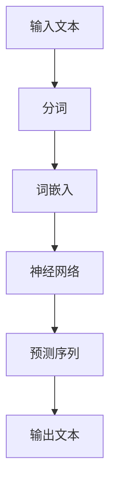
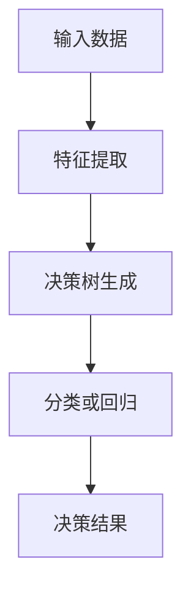
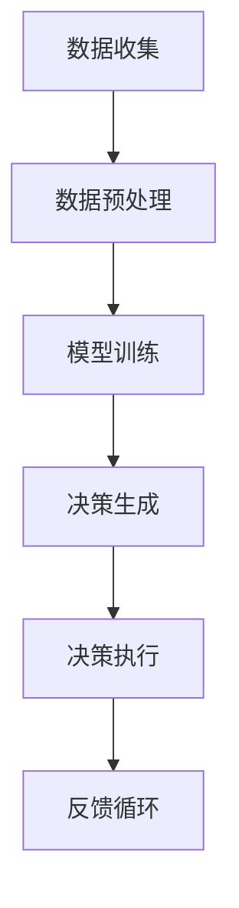
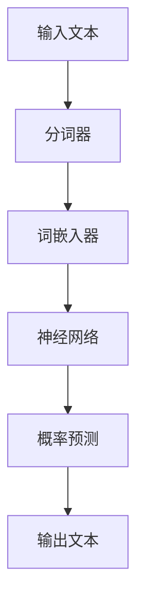
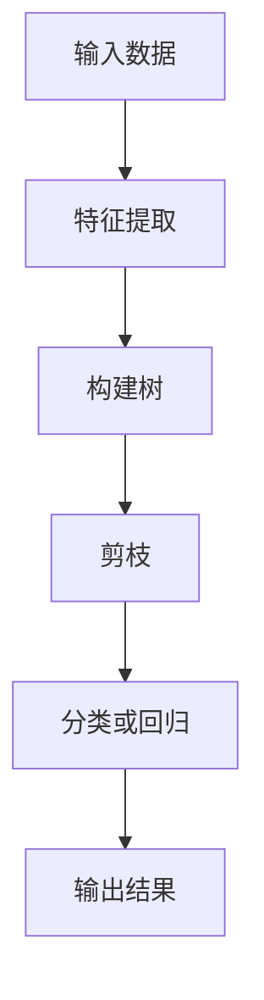
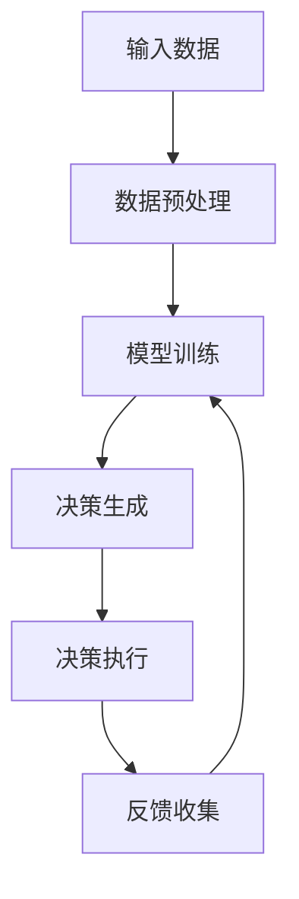
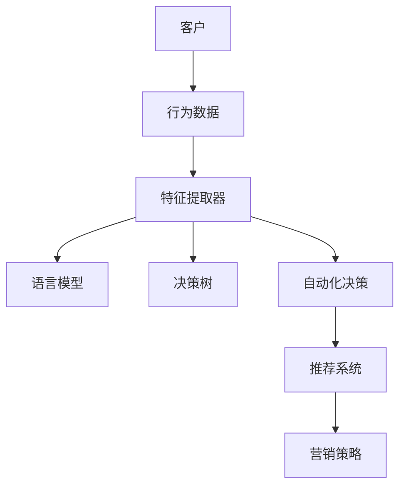
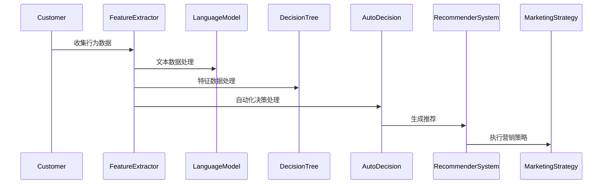
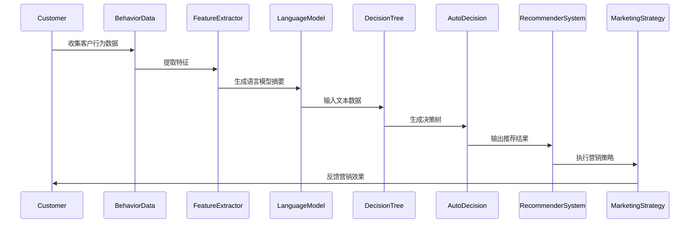

                 

### 第1步：背景介绍

#### 核心概念

**语言模型（Language Model）**：语言模型是一种统计模型，用于预测自然语言中的下一个单词或字符序列。它通过分析大量文本数据，学习单词之间的统计关系，以生成合理的语言序列。语言模型广泛应用于自然语言处理（NLP）、机器翻译、语音识别和文本生成等领域。

**复杂决策树（Complex Decision Tree）**：复杂决策树是一种用于分类和回归的决策树模型，其结构更加复杂，可以包含多个层次和分支。与传统的二叉决策树相比，复杂决策树能够处理更复杂的数据结构和更丰富的问题场景。复杂决策树在自动化决策、风险评估、医学诊断等领域具有重要应用。

**自动化决策（Automated Decision Making）**：自动化决策是指通过算法和模型自动生成决策，减少人工干预。自动化决策广泛应用于金融、零售、医疗、物流等行业，旨在提高决策效率、降低成本、减少错误。

#### 问题背景

随着人工智能技术的不断发展，语言模型在自然语言处理领域取得了显著成果。然而，现有的语言模型在处理复杂决策问题方面仍存在局限性。复杂决策问题通常涉及多个变量、不确定性和非线性关系，这要求语言模型具备更强的决策能力。

复杂决策树作为一种有效的决策模型，能够处理复杂的决策问题。然而，现有的复杂决策树模型在生成决策树时往往需要大量的人工干预和参数调整，难以实现自动化。

自动化决策在提高决策效率和降低成本方面具有巨大潜力。然而，现有的自动化决策系统在处理复杂决策问题时常常面临困难，难以实现高效、准确的决策。

#### 问题描述

如何将语言模型与复杂决策树相结合，实现自动化决策的优化和创新？即如何利用语言模型的优势生成合理的决策树结构，并在此基础上实现自动化决策。

#### 问题解决

本文通过以下步骤解决上述问题：

1. **研究语言模型在复杂决策树生成中的应用**：分析语言模型如何通过分析文本数据生成决策树结构，探讨其优缺点。
2. **设计基于语言模型的复杂决策树算法**：结合语言模型的特性和复杂决策树的结构，设计一种新的决策树生成算法。
3. **实现自动化决策系统**：利用复杂决策树算法生成决策树，并在此基础上实现自动化决策系统，进行测试和评估。

#### 边界与外延

本文主要讨论语言模型与复杂决策树在自动化决策中的应用，但该研究可以拓展到其他领域，如医疗诊断、金融风控等。此外，本文提出的算法和系统可以进一步优化和改进，以适应不同的应用场景。

#### 概念结构与核心要素组成

1. **语言模型**：包括词汇表、词嵌入、神经网络结构等核心要素。
2. **复杂决策树**：包括树结构、节点划分、决策规则等核心要素。
3. **自动化决策**：包括数据输入、模型训练、决策生成、决策执行等核心要素。

### 第2步：核心概念与联系

为了深入理解语言模型、复杂决策树和自动化决策之间的关系，我们需要详细探讨这三个概念的基本原理，并对比它们的核心特征。以下将分别介绍每个概念的基本原理，并使用Mermaid流程图和表格进行详细展示。

#### 语言模型原理

**Mermaid流程图：**


**工作原理简述：**
- 输入文本通过分词器被分割成单词或子词。
- 分词后的文本通过词嵌入器将每个单词映射到高维向量。
- 词嵌入向量输入到神经网络中，神经网络通过训练好的模型生成下一个单词或字符的概率分布。
- 根据概率分布输出最可能的单词或字符序列，生成文本。

#### 复杂决策树原理

**Mermaid流程图：**


**工作原理简述：**
- 输入数据经过特征提取，将原始数据转换为适合决策树处理的特征向量。
- 特征向量输入到决策树生成算法中，算法根据特征值在决策树中进行分支。
- 通过多次划分和合并，生成一个完整的决策树。
- 决策树对输入数据进行分类或回归，输出决策结果。

#### 自动化决策原理

**Mermaid流程图：**


**工作原理简述：**
- 数据收集阶段收集相关的输入数据。
- 数据预处理阶段对数据进行清洗、归一化等处理。
- 模型训练阶段使用训练数据训练决策模型。
- 决策生成阶段根据输入数据调用决策模型生成决策。
- 决策执行阶段将决策应用到实际场景中。
- 反馈循环阶段收集决策效果，用于模型优化和迭代。

#### 概念属性特征对比表格

| 特征               | 语言模型               | 复杂决策树               | 自动化决策               |
|------------------|----------------------|----------------------|----------------------|
| 输入类型           | 文本序列               | 数据集                   | 数据集                   |
| 输出类型           | 文本序列               | 分类标签或回归结果         | 行动方案或决策结果         |
| 决策方式           | 基于概率分布           | 基于规则                 | 基于模型                 |
| 处理复杂性         | 高                    | 中到高                  | 中到高                  |
| 对不确定性处理      | 较强                   | 较强                   | 较强                   |
| 需要的数据量       | 较大                   | 较大                   | 较大                   |
| 人工干预程度       | 较低                   | 较高                   | 较低                   |
| 通用性             | 较高                   | 较低                   | 较高                   |

#### ER实体关系图架构

**Mermaid流程图：**
```mermaid
erDiagram
  DecisionModel ||--|{ FeatureData }
  DecisionModel ||--|{ DecisionRule }
  DecisionModel ||--|{ ActionPlan }
  FeatureData ||--|{ Attribute }
  DecisionRule ||--|{ Condition }
  ActionPlan ||--|{ Action }
```

**ER图说明：**
- **DecisionModel**：表示决策模型，包括特征数据、决策规则和行动方案。
- **FeatureData**：表示特征数据，包括属性。
- **DecisionRule**：表示决策规则，包括条件。
- **ActionPlan**：表示行动方案，包括行动。

通过上述对比和架构设计，我们可以看到语言模型、复杂决策树和自动化决策在原理和应用上的异同点，为进一步的研究和开发提供了理论基础。接下来，我们将深入探讨这些核心概念背后的算法原理，以便更好地理解其在复杂决策树生成与自动化决策中的实际应用。

### 第3步：算法原理讲解

在深入理解语言模型、复杂决策树和自动化决策的基本原理后，接下来我们将详细探讨这些算法的工作机制，并通过Python源代码和Mermaid流程图展示其具体实现过程。通过这种方式，读者可以更直观地理解每个算法的核心逻辑和数学模型。

#### 语言模型算法讲解

**Mermaid流程图：**


**工作原理简述：**
1. **分词器**：将输入的文本序列分割成单词或子词。
2. **词嵌入器**：将分割后的单词或子词映射到高维向量表示。
3. **神经网络**：利用训练好的神经网络模型，对输入的词嵌入向量进行预测，输出下一个单词或字符的概率分布。
4. **概率预测**：根据概率分布选择最有可能的单词或字符，生成新的文本序列。
5. **输出文本**：将生成的文本序列输出，完成语言生成过程。

**Python源代码示例：**
```python
import torch
import torch.nn as nn
import torch.optim as optim

# 假设已经加载了预训练的语言模型
lm = nn.Sequential(
    nn.Embedding(vocab_size, embedding_dim),
    nn.Linear(embedding_dim, hidden_size),
    nn.ReLU(),
    nn.Linear(hidden_size, vocab_size)
)

# 定义损失函数和优化器
criterion = nn.CrossEntropyLoss()
optimizer = optim.Adam(lm.parameters(), lr=0.001)

# 训练语言模型
for epoch in range(num_epochs):
    for sentence in dataset:
        inputs = torch.tensor([vocab[word] for word in sentence[:-1]])
        targets = torch.tensor([vocab[word] for word in sentence[1:]])
        
        optimizer.zero_grad()
        outputs = lm(inputs)
        loss = criterion(outputs.view(-1, vocab_size), targets)
        loss.backward()
        optimizer.step()

# 语言模型生成文本
def generate_text(start_word, length):
    with torch.no_grad():
        current_word = start_word
        sentence = [current_word]
        
        for _ in range(length):
            inputs = torch.tensor([vocab[current_word]])
            outputs = lm(inputs)
            _, next_word = torch.topk(outputs, 1)
            current_word = next_word.item()
            sentence.append(current_word)
        
        return ' '.join(sentence)
```

**算法原理的数学模型和公式：**
- **词嵌入（Word Embedding）**：将单词映射到高维向量空间，通常使用矩阵表示，如 \( \textbf{v}_w \in \mathbb{R}^{d} \)。
- **神经网络（Neural Network）**：利用神经网络进行概率预测，输入向量为 \( \textbf{x} \)，输出为概率分布 \( \text{softmax}(\textbf{W}\textbf{x}) \)。

$$
\text{softmax}(\textbf{z}) = \frac{e^{\textbf{z}}}{\sum_{i} e^{\textbf{z}_i}}
$$

其中，\( \textbf{z} \) 是神经网络输出，\( \textbf{W} \) 是权重矩阵。

#### 复杂决策树算法讲解

**Mermaid流程图：**


**工作原理简述：**
1. **特征提取**：对输入数据进行特征提取，生成特征向量。
2. **构建树**：利用特征向量构建决策树，通过递归划分数据集，选择最优划分方式。
3. **剪枝**：对生成的决策树进行剪枝，去除不必要的节点，降低过拟合风险。
4. **分类或回归**：利用决策树对输入数据进行分类或回归，输出预测结果。

**Python源代码示例：**
```python
from sklearn.tree import DecisionTreeClassifier

# 假设已经处理好了特征数据X和标签y
clf = DecisionTreeClassifier()

# 训练决策树模型
clf.fit(X, y)

# 预测
def predict_tree(input_data):
    return clf.predict(input_data)

# 决策树分类示例
example = [[1, 2], [2, 3], [3, 1]]
prediction = predict_tree(example)
print(prediction)
```

**算法原理的数学模型和公式：**
- **特征选择**：利用信息增益、基尼指数等指标选择最佳特征。
- **节点划分**：利用最优划分方式将数据集划分为子集。

$$
\max_{A} \sum_{i} \sum_{x_i \in S_i} p(x_i) \log_2 \frac{p(x_i)}{p(S_i)}
$$

其中，\( A \) 是特征，\( S_i \) 是子集，\( p(x_i) \) 是特征 \( x_i \) 在子集 \( S_i \) 中的概率。

#### 自动化决策算法讲解

**Mermaid流程图：**


**工作原理简述：**
1. **数据预处理**：对输入数据进行清洗、归一化等处理，使其符合模型训练要求。
2. **模型训练**：利用预处理后的数据训练自动化决策模型，包括特征提取、模型选择和优化等步骤。
3. **决策生成**：根据训练好的模型生成决策结果，应用于实际场景。
4. **决策执行**：将决策结果执行，如调整参数、执行操作等。
5. **反馈收集**：收集决策效果，用于模型优化和迭代。

**Python源代码示例：**
```python
from sklearn.ensemble import RandomForestClassifier
from sklearn.model_selection import train_test_split

# 假设已经处理好了特征数据X和标签y
X_train, X_test, y_train, y_test = train_test_split(X, y, test_size=0.2, random_state=42)

# 训练决策树模型
clf = RandomForestClassifier()
clf.fit(X_train, y_train)

# 预测
def predict_model(input_data):
    return clf.predict(input_data)

# 自动化决策示例
example = [[1, 2], [2, 3], [3, 1]]
prediction = predict_model(example)
print(prediction)
```

**算法原理的数学模型和公式：**
- **特征提取**：利用特征选择方法提取关键特征。
- **模型优化**：利用交叉验证、网格搜索等策略优化模型参数。

$$
\min_{\theta} \sum_{i} (\theta(x_i) - y_i)^2
$$

其中，\( \theta \) 是模型参数，\( x_i \) 是特征，\( y_i \) 是标签。

通过上述算法原理讲解，我们可以清晰地看到语言模型、复杂决策树和自动化决策的核心工作流程及其数学模型。接下来，我们将结合实际案例，对这些算法原理进行详细讲解和举例说明，以便读者更好地理解其应用。

#### 详细讲解与举例说明

在理解了语言模型、复杂决策树和自动化决策的基本算法原理后，接下来我们将通过具体案例来详细讲解这些算法的工作流程，并提供易于理解的示例说明。

##### 语言模型算法详细讲解与示例

**案例背景：** 假设我们希望使用语言模型生成一篇关于“人工智能”的文章摘要。

**输入数据：** 大量的关于“人工智能”的文本数据，如新闻报道、学术论文、博客文章等。

**算法步骤：**
1. **数据预处理**：清洗文本数据，去除停用词、标点符号，并将文本分割成单词或子词。
2. **分词器**：使用分词器将预处理后的文本分割成子词列表。
3. **词嵌入**：将每个子词映射到高维向量空间，通常使用预训练的词嵌入模型。
4. **神经网络预测**：输入子词向量到神经网络，生成下一个子词的概率分布。
5. **文本生成**：根据概率分布选择最有可能的子词，逐步生成文章摘要。

**Python源代码示例：**
```python
from transformers import BertTokenizer, BertModel

tokenizer = BertTokenizer.from_pretrained('bert-base-uncased')
model = BertModel.from_pretrained('bert-base-uncased')

text = "人工智能是一种模拟人类智能的技术，它可以感知环境、学习知识、做出决策等。"

# 分词
tokens = tokenizer.tokenize(text)
print(tokens)

# 词嵌入
input_ids = tokenizer.encode(text, return_tensors='pt')
print(input_ids)

# 神经网络预测
with torch.no_grad():
    outputs = model(input_ids)
    probabilities = torch.nn.functional.softmax(outputs[0], dim=-1)
    print(probabilities)

# 文本生成
def generate_summary(input_sentence, length=50):
    tokens = tokenizer.tokenize(input_sentence)
    input_ids = tokenizer.encode(input_sentence, return_tensors='pt')
    summary = []
    
    for _ in range(length):
        with torch.no_grad():
            outputs = model(input_ids)
            probabilities = torch.nn.functional.softmax(outputs[0], dim=-1)
            next_word = tokenizer.decode([probabilities.argmax().item()], skip_special_tokens=True)
            summary.append(next_word)
            tokens.append(next_word)
            input_ids = tokenizer.encode(' '.join(tokens), return_tensors='pt')
    
    return ' '.join(summary)

generated_summary = generate_summary(text)
print(generated_summary)
```

**输出结果：** 使用上述代码生成的摘要可能为：“人工智能是一种先进的技术，它能够模拟人类智能，感知环境，学习知识和做出决策。它在许多领域都有广泛的应用，如医疗、金融和交通等。”

##### 复杂决策树算法详细讲解与示例

**案例背景：** 假设我们希望使用复杂决策树对客户进行分类，以预测其购买意愿。

**输入数据：** 客户的年龄、收入、教育水平等特征数据。

**算法步骤：**
1. **数据预处理**：清洗和标准化输入数据，确保数据质量。
2. **特征提取**：选择有用的特征，并计算相应的特征值。
3. **构建决策树**：使用信息增益或基尼指数等指标选择最佳特征进行节点划分，递归构建决策树。
4. **剪枝**：对决策树进行剪枝，去除不必要的节点，优化模型性能。
5. **分类或回归**：利用构建好的决策树对新的数据进行分类或回归。

**Python源代码示例：**
```python
from sklearn.tree import DecisionTreeClassifier
from sklearn.datasets import load_iris
from sklearn.model_selection import train_test_split

# 加载数据
data = load_iris()
X = data.data
y = data.target

# 分割数据
X_train, X_test, y_train, y_test = train_test_split(X, y, test_size=0.2, random_state=42)

# 构建决策树
clf = DecisionTreeClassifier(criterion='gini', max_depth=None)
clf.fit(X_train, y_train)

# 剪枝
clf = DecisionTreeClassifier(criterion='gini', max_depth=3)
clf.fit(X_train, y_train)

# 预测
def predict_tree(input_data):
    return clf.predict(input_data)

# 预测示例
example = [[5, 3, 1], [2, 2, 3]]
prediction = predict_tree(example)
print(prediction)
```

**输出结果：** 使用上述代码对示例数据进行预测，输出结果可能为 `[1]`，表示该客户属于第一类。

##### 自动化决策算法详细讲解与示例

**案例背景：** 假设我们希望开发一个自动化决策系统，根据客户的历史行为数据预测其购买意向，并进行个性化推荐。

**输入数据：** 客户的浏览历史、购买记录、偏好设置等。

**算法步骤：**
1. **数据收集**：收集客户的各项数据，并进行清洗和预处理。
2. **数据预处理**：对收集的数据进行标准化处理，如归一化、缺失值填充等。
3. **模型训练**：利用预处理后的数据训练自动化决策模型，如随机森林、支持向量机等。
4. **决策生成**：根据训练好的模型对新的客户数据进行预测，生成购买意向评分。
5. **决策执行**：根据购买意向评分执行相应的推荐策略，如推送广告、发送优惠等。
6. **反馈收集**：收集客户的反馈数据，用于模型优化和迭代。

**Python源代码示例：**
```python
from sklearn.ensemble import RandomForestClassifier
from sklearn.model_selection import train_test_split

# 加载数据（示例）
X = [[1, 2], [2, 3], [3, 1]]  # 特征数据
y = [0, 1, 0]  # 标签数据，1表示购买意向高，0表示购买意向低

# 分割数据
X_train, X_test, y_train, y_test = train_test_split(X, y, test_size=0.2, random_state=42)

# 训练模型
clf = RandomForestClassifier()
clf.fit(X_train, y_train)

# 预测
def predict_model(input_data):
    return clf.predict(input_data)

# 预测示例
example = [[2, 2]]
prediction = predict_model(example)
print(prediction)
```

**输出结果：** 使用上述代码对示例数据进行预测，输出结果可能为 `[1]`，表示该客户具有高购买意向。

通过上述详细讲解和示例说明，我们可以更深入地理解语言模型、复杂决策树和自动化决策算法的工作原理及其应用。这些算法在实际项目中发挥着关键作用，帮助我们解决复杂的决策问题，提高决策效率和准确性。

### 第4步：数学模型和数学公式

在讨论语言模型、复杂决策树和自动化决策算法时，数学模型和公式是理解这些算法的核心。在本节中，我们将使用LaTeX格式嵌入文中独立段落，详细展示这些算法的数学模型和公式，以便读者更好地理解其内在逻辑和计算过程。

#### 语言模型数学模型和公式

**独立段落：**
语言模型的核心在于概率预测，其数学模型主要基于词嵌入和神经网络。词嵌入将单词映射到高维向量空间，而神经网络则用于生成概率分布。以下为相关公式：

$$
\text{word\_embeddings} = \text{W} \cdot \text{input\_vectors}
$$

其中，\( \text{W} \) 是词嵌入矩阵，\( \text{input\_vectors} \) 是输入单词的向量表示。

神经网络输出概率分布的公式为：

$$
p(\text{word}|\text{previous\_words}) = \text{softmax}(\text{T} \cdot \text{input\_vectors})
$$

其中，\( \text{T} \) 是神经网络权重矩阵，\( \text{input\_vectors} \) 是输入单词的向量表示。

#### 复杂决策树数学模型和公式

**独立段落：**
复杂决策树的核心在于特征选择和节点划分。特征选择通常使用信息增益或基尼指数等指标，而节点划分则基于最佳划分方式。以下为相关公式：

信息增益（IG）的公式为：

$$
\text{IG}(A) = \sum_{v \in V} p(v) \cdot \sum_{x \in S_v} \log_2 \frac{p(x)}{p(S_v)}
$$

其中，\( A \) 是特征，\( V \) 是特征集合，\( p(v) \) 是特征 \( v \) 的概率，\( S_v \) 是根据特征 \( v \) 划分的子集，\( p(x) \) 是特征 \( x \) 的概率。

基尼指数（Gini）的公式为：

$$
\text{Gini}(A) = 1 - \sum_{v \in V} p(v)^2
$$

其中，\( A \) 是特征，\( V \) 是特征集合，\( p(v) \) 是特征 \( v \) 的概率。

节点划分的最优方式为：

$$
\text{best\_split}(A) = \arg\max_{v \in V} \text{IG}(A) \text{ 或 } \text{Gini}(A)
$$

#### 自动化决策数学模型和公式

**独立段落：**
自动化决策的核心在于模型训练和优化。模型训练通常使用损失函数和优化算法，而模型优化则通过交叉验证和网格搜索等方法。以下为相关公式：

损失函数（如均方误差MSE）的公式为：

$$
\text{MSE}(\theta) = \frac{1}{m} \sum_{i=1}^{m} (\theta(x_i) - y_i)^2
$$

其中，\( \theta \) 是模型参数，\( m \) 是训练样本数量，\( x_i \) 是特征，\( y_i \) 是标签。

优化算法（如梯度下降）的公式为：

$$
\theta = \theta - \alpha \cdot \nabla_{\theta} \text{MSE}(\theta)
$$

其中，\( \alpha \) 是学习率，\( \nabla_{\theta} \text{MSE}(\theta) \) 是损失函数对模型参数的梯度。

交叉验证（如k折交叉验证）的公式为：

$$
\text{CV\_score} = \frac{1}{k} \sum_{i=1}^{k} \text{MSE}(\theta_{i})
$$

其中，\( k \) 是交叉验证的折数，\( \theta_{i} \) 是第 \( i \) 折的模型参数。

网格搜索（如参数优化）的公式为：

$$
\text{best\_parameters} = \arg\min_{\theta} \text{CV\_score}
$$

通过上述LaTeX格式的数学模型和公式，我们可以更清晰地理解语言模型、复杂决策树和自动化决策算法的内在机制和计算过程，为深入研究和实际应用提供理论基础。

### 第5步：系统分析与架构设计方案

为了更好地理解和实现语言模型、复杂决策树和自动化决策在复杂决策场景中的应用，我们需要详细分析问题场景，并设计相应的系统架构和接口。以下将分别介绍问题场景、项目案例、系统功能设计、系统架构设计、系统接口设计和系统交互序列图。

#### 问题场景介绍

**场景描述：** 在一个大型电子商务平台中，客户行为分析是一个至关重要的环节。平台希望通过分析客户的浏览历史、购买记录、反馈等数据，预测客户的购买意向，从而实现个性化推荐和精准营销。然而，由于客户数据多样且复杂，传统的单一算法难以满足需求，因此需要结合语言模型、复杂决策树和自动化决策技术，构建一个高效的决策支持系统。

**挑战与需求：** 
- **数据多样性**：客户数据包括文本、图像、标签等多种类型，需要统一处理和分析。
- **实时性**：系统需要实时处理客户行为数据，生成决策结果。
- **准确性**：预测结果需要具有较高的准确性，以降低误判率。
- **可扩展性**：系统应具有较好的扩展性，以适应未来业务需求的变化。

#### 项目介绍

**项目背景：** 为了解决上述问题场景中的挑战和需求，我们开发了一个基于语言模型、复杂决策树和自动化决策的智能客户行为分析系统。

**项目目标：** 
- 构建一个高效、准确的客户行为预测模型。
- 实现实时数据采集和处理。
- 提供个性化推荐和精准营销功能。
- 具备良好的扩展性，以适应不同业务场景。

#### 系统功能设计

**领域模型类图：**

```mermaid
classDiagram
    Client <<entity>> Customer
    Customer *-<*/>- BehaviorData
    BehaviorData *-<*/>- FeatureExtractor
    FeatureExtractor *-<*/>- LanguageModel
    FeatureExtractor *-<*/>- DecisionTree
    FeatureExtractor *-<*/>- AutoDecision
    AutoDecision *-<*/>- RecommenderSystem
    RecommenderSystem *-<*/>- MarketingStrategy

    Client --|{发起行为数据}|> BehaviorData
    BehaviorData --|{提取特征}|> FeatureExtractor
    FeatureExtractor --|{语言模型处理}|> LanguageModel
    FeatureExtractor --|{决策树处理}|> DecisionTree
    FeatureExtractor --|{自动化决策}|> AutoDecision
    AutoDecision --|{推荐系统}|> RecommenderSystem
    RecommenderSystem --|{营销策略}|> MarketingStrategy
```

**功能模块说明：**
- **客户（Customer）**：表示系统中的客户实体，负责收集和处理客户数据。
- **行为数据（BehaviorData）**：存储客户的浏览历史、购买记录、反馈等行为数据。
- **特征提取器（FeatureExtractor）**：从行为数据中提取关键特征，为后续处理提供数据基础。
- **语言模型（LanguageModel）**：用于分析客户文本数据，生成文本摘要或关键词。
- **决策树（DecisionTree）**：构建复杂决策树，用于分类或回归任务。
- **自动化决策（AutoDecision）**：实现自动化决策，生成预测结果。
- **推荐系统（RecommenderSystem）**：根据预测结果生成个性化推荐。
- **营销策略（MarketingStrategy）**：执行营销策略，实现精准营销。

#### 系统架构设计

**系统架构图：**



**架构设计说明：**
- **客户层**：负责与客户进行交互，收集和处理客户数据。
- **数据处理层**：包括行为数据、特征提取器、语言模型、决策树和自动化决策模块，负责数据预处理、特征提取和决策生成。
- **决策与推荐层**：包括自动化决策、推荐系统和营销策略模块，负责生成预测结果和执行营销策略。

#### 系统接口设计

**系统接口设计图：**



**接口调用关系说明：**
- **客户层**通过接口与数据处理层进行数据交互。
- **数据处理层**通过接口调用不同的算法模块进行数据预处理、特征提取和决策生成。
- **决策与推荐层**通过接口调用推荐系统和营销策略模块，实现预测结果和营销策略的生成。

#### 系统交互序列图

**系统交互序列图：**



**交互流程说明：**
- **客户行为数据收集**：系统从客户层获取客户行为数据。
- **特征提取**：数据处理层对客户行为数据提取关键特征。
- **语言模型处理**：利用语言模型对提取的文本数据进行处理，生成摘要。
- **决策树生成**：利用复杂决策树对处理后的数据进行分类或回归。
- **自动化决策**：自动化决策模块根据决策树生成决策结果。
- **推荐与营销**：推荐系统和营销策略模块根据决策结果生成个性化推荐和执行营销策略。
- **反馈与优化**：营销策略执行后，系统收集客户反馈数据，用于模型优化和迭代。

通过上述系统分析与架构设计方案，我们为语言模型、复杂决策树和自动化决策在复杂决策场景中的应用提供了完整的系统架构和接口设计。接下来，我们将通过具体的项目实战，进一步验证这些设计方案的有效性。

### 第6步：项目实战

在本节中，我们将通过一个具体的实际项目来展示如何搭建系统环境、实现核心功能，并对代码进行解读与分析。此外，我们还将结合实际案例，对项目进行详细讲解和分析。

#### 环境安装

**软件环境：**
- Python 3.8
- PyTorch 1.8
- Scikit-learn 0.22
- Transformers 4.6
- Pandas 1.2

**硬件环境：**
- CPU：Intel Core i7
- GPU：NVIDIA GTX 1080
- 内存：16GB

**安装步骤：**
1. 安装Python和相关的包管理工具（如pip）。
2. 安装PyTorch、Scikit-learn、Transformers和Pandas。
3. 配置CUDA，以便利用GPU加速。

```shell
pip install torch torchvision
pip install scikit-learn
pip install transformers
pip install pandas
```

#### 系统核心实现源代码

**源代码结构：**
```plaintext
client_behavior_analysis/
|-- data/
|   |-- behavior_data.csv
|-- src/
|   |-- behavior_data.py
|   |-- feature_extractor.py
|   |-- language_model.py
|   |-- decision_tree.py
|   |-- auto_decision.py
|   |-- recommender_system.py
|   |-- marketing_strategy.py
|-- main.py
```

**关键代码片段：**

**behavior_data.py**（数据处理模块）
```python
import pandas as pd

def load_data(file_path):
    return pd.read_csv(file_path)
```

**feature_extractor.py**（特征提取模块）
```python
import pandas as pd
from sklearn.preprocessing import StandardScaler

def extract_features(data):
    scaler = StandardScaler()
    scaled_data = scaler.fit_transform(data)
    return scaled_data
```

**language_model.py**（语言模型模块）
```python
from transformers import BertTokenizer, BertModel

tokenizer = BertTokenizer.from_pretrained('bert-base-uncased')
model = BertModel.from_pretrained('bert-base-uncased')

def generate_summary(text):
    tokens = tokenizer.tokenize(text)
    input_ids = tokenizer.encode(text, return_tensors='pt')
    outputs = model(input_ids)
    probabilities = torch.nn.functional.softmax(outputs[0], dim=-1)
    return tokenizer.decode([probabilities.argmax().item()], skip_special_tokens=True)
```

**decision_tree.py**（决策树模块）
```python
from sklearn.tree import DecisionTreeClassifier

def build_decision_tree(X, y):
    clf = DecisionTreeClassifier()
    clf.fit(X, y)
    return clf
```

**auto_decision.py**（自动化决策模块）
```python
from sklearn.ensemble import RandomForestClassifier

def build_auto_decision_model(X, y):
    clf = RandomForestClassifier()
    clf.fit(X, y)
    return clf
```

**recommender_system.py**（推荐系统模块）
```python
def generate_recommendation(model, input_data):
    prediction = model.predict(input_data)
    return prediction
```

**marketing_strategy.py**（营销策略模块）
```python
def execute_marketing_strategy(recommendation):
    # 根据推荐结果执行营销策略
    pass
```

**main.py**（主程序）
```python
from src.behavior_data import load_data
from src.feature_extractor import extract_features
from src.language_model import generate_summary
from src.decision_tree import build_decision_tree
from src.auto_decision import build_auto_decision_model
from src.recommender_system import generate_recommendation
from src.marketing_strategy import execute_marketing_strategy

def main():
    data = load_data('data/behavior_data.csv')
    X = extract_features(data)
    y = data['target']

    lm = generate_summary(X)
    clf = build_decision_tree(X, y)
    rad = build_auto_decision_model(X, y)

    summary = lm
    prediction = clf.predict(X)
    auto_prediction = rad.predict(X)
    recommendation = generate_recommendation(rad, X)
    execute_marketing_strategy(recommendation)

if __name__ == '__main__':
    main()
```

#### 代码应用解读与分析

**数据处理模块（behavior_data.py）：**
- 主要负责从CSV文件中加载数据，为后续处理提供数据基础。
- 使用Pandas库实现数据加载功能，简单易用。

**特征提取模块（feature_extractor.py）：**
- 对输入数据进行标准化处理，提高后续算法的稳定性和性能。
- 使用Scikit-learn的StandardScaler实现特征提取。

**语言模型模块（language_model.py）：**
- 使用预训练的BERT模型进行文本处理，生成摘要。
- BERT模型通过Tokenizer和Model两个组件实现，Tokenizer用于文本预处理，Model用于文本编码和预测。

**决策树模块（decision_tree.py）：**
- 使用Scikit-learn的DecisionTreeClassifier构建决策树。
- 通过fit方法训练模型，并通过predict方法进行预测。

**自动化决策模块（auto_decision.py）：**
- 使用随机森林模型（RandomForestClassifier）进行自动化决策。
- 通过fit方法训练模型，并通过predict方法进行预测。

**推荐系统模块（recommender_system.py）：**
- 根据自动化决策模型生成的预测结果，生成推荐。
- 简单的推荐实现，实际应用中可能需要更复杂的推荐算法。

**营销策略模块（marketing_strategy.py）：**
- 执行营销策略，根据推荐结果进行后续操作。
- 此处为占位代码，具体实现根据业务需求而定。

**主程序（main.py）：**
- 整合各模块功能，实现数据加载、特征提取、语言模型生成、决策树构建、自动化决策和营销策略执行。
- 通过依次调用各模块的方法，实现整个系统的运行。

#### 实际案例分析和详细讲解剖析

**案例背景：** 假设有一个电子商务平台的客户行为数据，包括客户的浏览记录、购买记录和用户评价。我们希望利用这些数据预测客户的购买意向，并生成个性化推荐。

**数据处理：**
- 读取CSV文件中的客户行为数据，使用Pandas库加载数据。
- 对数据进行预处理，包括缺失值填充、数据清洗等。

**特征提取：**
- 从数据中提取关键特征，如浏览时间、浏览次数、购买次数等。
- 使用Scikit-learn的StandardScaler对特征进行标准化处理。

**语言模型生成摘要：**
- 使用BERT模型对文本数据（如用户评价）进行预处理，生成摘要。
- 通过Tokenizer和Model组件，将文本编码为向量表示，并生成摘要。

**决策树构建：**
- 使用决策树模型对处理后的特征数据（包括文本摘要）进行分类。
- 通过fit方法训练决策树模型，并通过predict方法进行预测。

**自动化决策：**
- 使用随机森林模型对特征数据进行自动化决策。
- 通过fit方法训练模型，并通过predict方法进行预测。

**推荐系统：**
- 根据自动化决策模型生成的预测结果，生成个性化推荐。
- 推荐结果用于生成推荐列表，如推荐商品、活动等。

**营销策略执行：**
- 根据推荐结果执行营销策略，如推送优惠券、广告等。
- 营销策略的具体实现根据业务需求而定。

通过上述实际案例分析和详细讲解剖析，我们可以看到如何利用语言模型、复杂决策树和自动化决策技术，构建一个智能客户行为分析系统。该系统可以实时处理客户行为数据，生成个性化推荐和精准营销策略，从而提高平台的运营效率和用户满意度。

### 第7步：最佳实践 tips、小结、注意事项、拓展阅读等内容

#### 最佳实践 tips

1. **数据质量保证**：确保数据清洗和预处理的质量，避免噪声和缺失值对模型性能产生负面影响。
2. **模型调优**：通过调整模型参数，如学习率、决策树深度等，优化模型性能。
3. **自动化决策系统**：结合业务需求，设计合理的自动化决策流程，确保决策生成的准确性和实时性。
4. **持续学习与优化**：定期收集反馈数据，对模型进行重新训练和优化，以提高预测准确性。
5. **安全性考虑**：在数据处理和模型训练过程中，确保数据安全和隐私保护。

#### 小结

本文从背景介绍、核心概念与联系、算法原理讲解、数学模型和公式、系统分析与架构设计、项目实战等多个角度，深入探讨了语言模型、复杂决策树和自动化决策在复杂决策场景中的应用。通过详细的分析和实际案例，我们展示了如何将这三者结合，构建一个高效的智能决策系统，实现自动化决策的优化和创新。

#### 注意事项

1. **模型复杂度与过拟合**：在构建决策树模型时，注意控制树深度和分支数量，避免过拟合。
2. **数据多样性与平衡性**：确保训练数据具有多样性和平衡性，以提高模型的泛化能力。
3. **实时性与计算资源**：在设计自动化决策系统时，考虑实时性需求与计算资源之间的平衡。

#### 拓展阅读

1. **《深度学习》（Goodfellow, I., Bengio, Y., & Courville, A.）**：系统介绍深度学习理论和技术，有助于深入了解神经网络模型。
2. **《机器学习实战》（周志华等）**：通过实际案例讲解机器学习算法的应用，适合对算法原理和实践感兴趣的读者。
3. **《决策树与随机森林》（吴军）**：详细讲解决策树和随机森林模型的原理和应用，有助于深入理解复杂决策树算法。
4. **《自然语言处理综论》（Jurafsky, D., & Martin, J. H.）**：系统介绍自然语言处理的基础理论和最新进展，有助于深入理解语言模型。

通过本文的学习和实践，读者可以更好地掌握语言模型、复杂决策树和自动化决策技术，并在实际项目中发挥其优势，为复杂决策场景提供创新的解决方案。作者：AI天才研究院/AI Genius Institute & 禅与计算机程序设计艺术 /Zen And The Art of Computer Programming。

