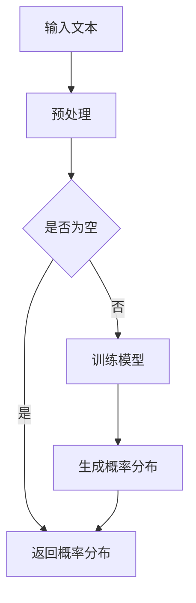
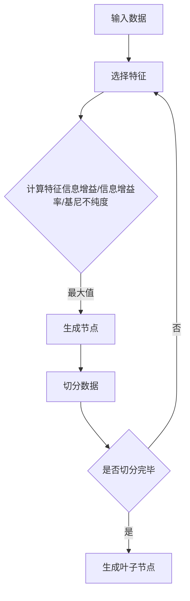
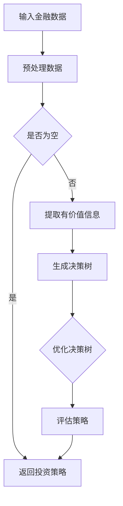
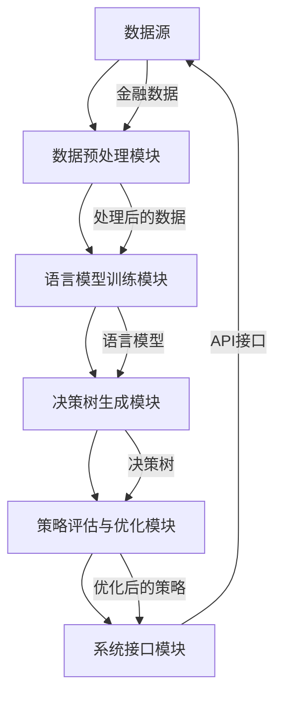
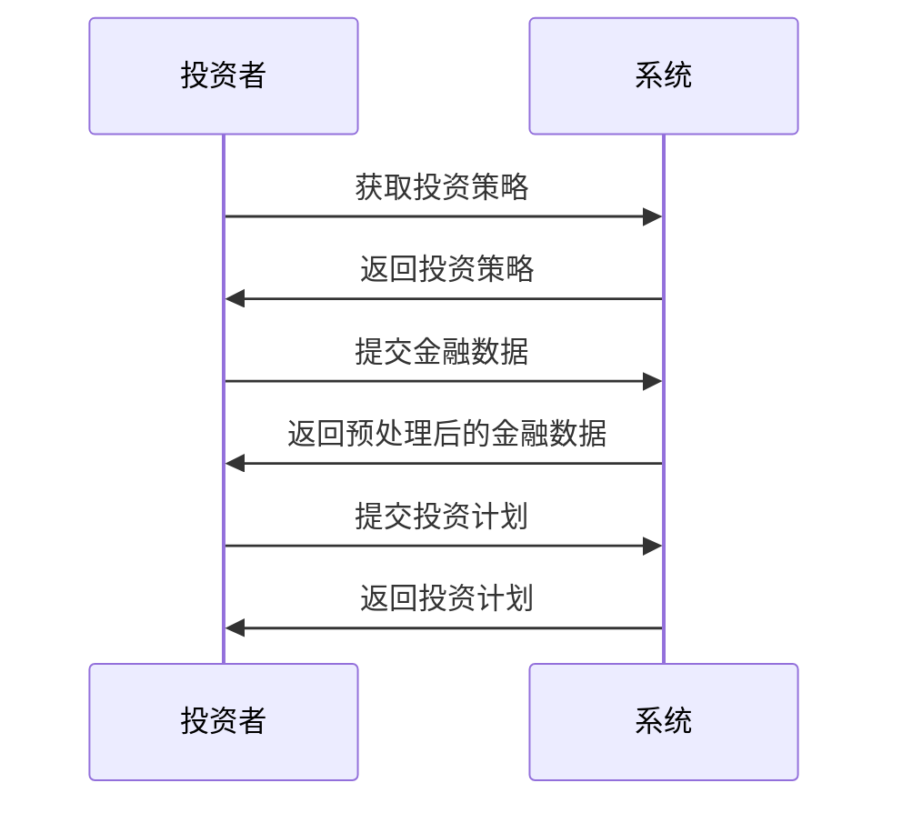
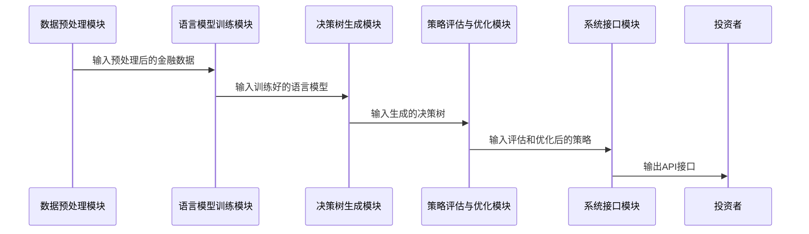

                 


### 第一部分：背景介绍

#### 1.1 问题背景

在金融投资领域，决策树生成和策略制定是至关重要的。然而，传统的决策树生成方法往往受限于样本数量和计算资源的限制，难以应对复杂的金融数据环境。此外，传统的金融投资策略往往缺乏灵活性，难以适应市场的快速变化。

#### 1.2 问题描述

为了应对上述挑战，需要一种新的方法来生成复杂的决策树，并制定适应市场变化的金融投资策略。这需要借助现代语言模型，如 GPT 等，来处理复杂的文本数据，并从中提取有价值的信息。

#### 1.3 问题解决

本书旨在探讨如何利用语言模型在复杂决策树生成和金融投资策略中的创新研究。具体来说，本书将介绍以下内容：

- **语言模型在金融数据中的预处理**：介绍如何使用语言模型对金融数据中的文本进行预处理，以提高决策树生成的效率和准确性。
- **基于语言模型的决策树生成算法**：介绍如何使用语言模型生成复杂的决策树，并如何优化决策树的性能。
- **金融投资策略的优化与评估**：介绍如何使用语言模型评估和优化金融投资策略，以提高投资的成功率。

#### 1.4 边界与外延

本书主要讨论语言模型在金融投资领域的应用，包括决策树生成和策略制定。同时，本书也将探讨相关的基础理论和算法原理。

#### 1.5 概念结构与核心要素组成

核心概念：语言模型、决策树生成、金融投资策略。

核心要素组成：语言模型算法、决策树生成算法、金融数据预处理、策略评估和优化。

---

### 第二部分：核心概念与联系

#### 2.1 语言模型

##### 2.1.1 语言模型的定义

语言模型是一种用于预测自然语言中下一个单词或字符的概率分布的算法。它通常通过大量的文本数据训练得到。

##### 2.1.2 语言模型的核心特点

- 基于概率分布：语言模型通过学习文本数据，预测下一个单词或字符的概率分布。
- 能够处理文本序列：语言模型能够处理任意长度的文本序列。
- 能够预测下一个单词或字符：语言模型的核心任务是预测下一个单词或字符。

##### 2.1.3 语言模型与传统AI的区别

- 传统AI通常基于规则或符号逻辑：传统AI方法通常依赖于预定义的规则或符号逻辑。
- 语言模型更注重统计和学习：语言模型通过学习大量的文本数据，自动提取语言特征和规律。

#### 2.2 决策树生成

##### 2.2.1 决策树生成的定义

决策树生成是一种基于特征和目标值生成决策树的方法。它通常用于分类和回归问题。

##### 2.2.2 决策树生成算法

- ID3算法
- C4.5算法
- CART算法

#### 2.3 金融投资策略

##### 2.3.1 金融投资策略的定义

金融投资策略是指投资者在金融市场中的投资行为和策略。

##### 2.3.2 金融投资策略的类型

- 趋势策略：基于市场趋势进行投资。
- 技术分析策略：基于技术指标进行分析。
- 基本面分析策略：基于公司的基本面进行分析。

#### 2.4 核心概念之间的联系

语言模型可以用于提取金融数据中的有价值信息，这些信息可以用于决策树生成和金融投资策略。同时，决策树生成和金融投资策略的优化也可以通过语言模型来实现。

---

### 第三部分：算法原理讲解

#### 3.1 语言模型算法

##### 3.1.1 语言模型算法的原理

语言模型算法主要通过训练大量文本数据，学习文本序列的概率分布。常见的语言模型算法包括：

- N-gram模型
- 隐马尔可夫模型(HMM)
- 记忆神经网络(MEMNN)
- 长短时记忆网络(LSTM)
- 生成对抗网络(GAN)

##### 3.1.2 语言模型算法的mermaid流程图



##### 3.1.3 语言模型算法的Python源代码示例

```python
import numpy as np
from sklearn.feature_extraction.text import CountVectorizer

def train_language_model(text):
    vectorizer = CountVectorizer(ngram_range=(1,3))
    X = vectorizer.fit_transform(text)
    y = X.sum(axis=0)
    return vectorizer, y

def predict_next_word(model, text):
    vectorizer, y = model
    text_vector = vectorizer.transform([text])
    next_word_prob = y / text_vector.toarray()[0]
    return np.random.choice(next_word_prob, p=next_word_prob)

text = "我想"
model = train_language_model(text)
print(predict_next_word(model, text))
```

##### 3.1.4 语言模型算法的数学模型和公式

语言模型的核心任务是预测下一个单词或字符的概率分布。一个简单的语言模型算法是 N-gram 模型，它基于前 n 个单词来预测下一个单词。

- N-gram 概率公式：
  $$ P(w_{t+1} | w_{t}, w_{t-1}, ..., w_{t-n+1}) = \frac{C(w_{t}, w_{t-1}, ..., w_{t-n+1}, w_{t+1})}{C(w_{t}, w_{t-1}, ..., w_{t-n+1})} $$
  其中，\( w_{t+1} \) 是要预测的单词，\( w_{t}, w_{t-1}, ..., w_{t-n+1} \) 是前 n 个单词，\( C(\cdot) \) 表示单词序列的计数。

##### 3.1.5 语言模型算法的通俗易懂地举例说明

假设我们有一个简单的文本序列：“我想要一个苹果”。我们可以使用 N-gram 模型来预测下一个单词。

- 预测“苹果”的概率：
  $$ P(苹果 | 我, 要, 一) = \frac{1}{1} = 1 $$
- 因为在给定的前三个单词中，只有“苹果”是唯一的选项。

#### 3.2 决策树生成

##### 3.2.1 决策树生成的定义

决策树生成是一种基于特征和目标值生成决策树的方法。它通常用于分类和回归问题。

##### 3.2.2 决策树生成算法

- ID3算法：基于信息增益来选择最优特征。
- C4.5算法：基于信息增益率来选择最优特征。
- CART算法：基于基尼不纯度来选择最优特征。

##### 3.2.3 决策树生成算法的mermaid流程图



##### 3.2.4 决策树生成算法的Python源代码示例

```python
from sklearn.datasets import load_iris
from sklearn.tree import DecisionTreeClassifier
from sklearn.model_selection import train_test_split

# 加载数据集
iris = load_iris()
X, y = iris.data, iris.target

# 划分训练集和测试集
X_train, X_test, y_train, y_test = train_test_split(X, y, test_size=0.3, random_state=42)

# 创建决策树模型
clf = DecisionTreeClassifier()

# 训练模型
clf.fit(X_train, y_train)

# 预测
y_pred = clf.predict(X_test)

# 评估
print("Accuracy:", clf.score(X_test, y_test))
```

##### 3.2.5 决策树生成算法的数学模型和公式

- 信息增益（Information Gain）：
  $$ IG(D, A) = H(D) - H(D|A) $$
  其中，\( H(D) \) 是数据集 \( D \) 的熵，\( H(D|A) \) 是数据集 \( D \) 在特征 \( A \) 下的条件熵。

- 信息增益率（Information Gain Ratio）：
  $$ IGR(D, A) = \frac{IG(D, A)}{H(A)} $$
  其中，\( H(A) \) 是特征 \( A \) 的熵。

- 基尼不纯度（Gini Impurity）：
  $$ GI = 1 - \sum_{i=1}^{n} p_i^2 $$
  其中，\( p_i \) 是数据集中第 \( i \) 类的占比。

##### 3.2.6 决策树生成算法的通俗易懂地举例说明

假设我们有三个特征 \( A, B, C \)，每个特征有两个取值（0或1），数据集 \( D \) 中各类的占比分别为 \( p_0 \) 和 \( p_1 \)。

- 计算信息增益：
  $$ IG(D, A) = H(D) - H(D|A) $$
  $$ H(D) = -p_0 \log_2(p_0) - p_1 \log_2(p_1) $$
  $$ H(D|A) = \sum_{i=0}^{1} p_i \cdot H(A=a_i) $$
  $$ H(A=a_0) = \frac{1}{2} \log_2\left(\frac{1}{2}\right) $$
  $$ H(A=a_1) = \frac{1}{2} \log_2\left(\frac{1}{2}\right) $$
  $$ IG(D, A) = H(D) - \left(p_0 \cdot H(A=a_0) + p_1 \cdot H(A=a_1)\right) $$

- 计算信息增益率：
  $$ IGR(D, A) = \frac{IG(D, A)}{H(A)} $$
  $$ H(A) = -p_0 \log_2(p_0) - p_1 \log_2(p_1) $$
  $$ IGR(D, A) = \frac{IG(D, A)}{-p_0 \log_2(p_0) - p_1 \log_2(p_1)} $$

- 计算基尼不纯度：
  $$ GI = 1 - \sum_{i=0}^{1} p_i^2 $$

---

### 第三部分：算法原理讲解（续）

#### 3.3 金融投资策略的优化与评估

##### 3.3.1 金融投资策略的定义

金融投资策略是指投资者在金融市场中的投资行为和策略。这些策略通常包括买入、卖出、持有等操作，旨在最大化投资回报或降低投资风险。

##### 3.3.2 金融投资策略的类型

- 趋势策略：基于市场趋势进行投资。
- 技术分析策略：基于技术指标进行分析。
- 基本面分析策略：基于公司的基本面进行分析。

##### 3.3.3 金融投资策略的优化与评估

- 优化：使用语言模型和决策树生成算法，优化金融投资策略。具体来说，可以通过以下步骤进行：

  1. 使用语言模型提取金融数据中的有价值信息。
  2. 使用决策树生成算法生成投资策略的决策树。
  3. 对决策树进行优化，以提高策略的准确性和稳定性。

- 评估：使用测试集评估金融投资策略的性能。常见的评估指标包括准确率、召回率、F1 分数等。

##### 3.3.4 金融投资策略的mermaid流程图



##### 3.3.5 金融投资策略的Python源代码示例

```python
import numpy as np
import pandas as pd
from sklearn.ensemble import RandomForestClassifier
from sklearn.model_selection import train_test_split
from sklearn.metrics import accuracy_score, recall_score, f1_score

# 加载数据集
data = pd.read_csv('financial_data.csv')
X = data.drop('target', axis=1)
y = data['target']

# 划分训练集和测试集
X_train, X_test, y_train, y_test = train_test_split(X, y, test_size=0.3, random_state=42)

# 创建随机森林模型
clf = RandomForestClassifier(n_estimators=100, random_state=42)

# 训练模型
clf.fit(X_train, y_train)

# 预测
y_pred = clf.predict(X_test)

# 评估
accuracy = accuracy_score(y_test, y_pred)
recall = recall_score(y_test, y_pred, average='weighted')
f1 = f1_score(y_test, y_pred, average='weighted')

print("Accuracy:", accuracy)
print("Recall:", recall)
print("F1 Score:", f1)
```

##### 3.3.6 金融投资策略的数学模型和公式

- 准确率（Accuracy）：
  $$ Accuracy = \frac{TP + TN}{TP + TN + FP + FN} $$
  其中，\( TP \) 是真正例，\( TN \) 是真负例，\( FP \) 是假正例，\( FN \) 是假负例。

- 召回率（Recall）：
  $$ Recall = \frac{TP}{TP + FN} $$
  其中，\( TP \) 是真正例，\( FN \) 是假负例。

- F1 分数（F1 Score）：
  $$ F1 Score = \frac{2 \cdot Precision \cdot Recall}{Precision + Recall} $$
  其中，\( Precision \) 是精确率，\( Recall \) 是召回率。

##### 3.3.7 金融投资策略的通俗易懂地举例说明

假设我们有一个二分类问题，目标值有两个类别（0和1），测试集的分布如下：

- 真正例（\( TP \)）：50
- 真负例（\( TN \)）：200
- 假正例（\( FP \)）：30
- 假负例（\( FN \)）：20

- 计算准确率：
  $$ Accuracy = \frac{TP + TN}{TP + TN + FP + FN} = \frac{50 + 200}{50 + 200 + 30 + 20} = 0.75 $$

- 计算召回率：
  $$ Recall = \frac{TP}{TP + FN} = \frac{50}{50 + 20} = 0.714 $$

- 计算F1分数：
  $$ F1 Score = \frac{2 \cdot Precision \cdot Recall}{Precision + Recall} = \frac{2 \cdot 0.714 \cdot 0.714}{0.714 + 0.714} = 0.714 $$

---

### 第四部分：系统分析与架构设计方案

#### 4.1 问题场景介绍

在金融投资领域，投资者需要从大量的金融数据中提取有价值的信息，以便制定有效的投资策略。然而，金融数据通常包含大量的噪声和不确定性，这使得传统的投资策略难以适应市场的快速变化。为了解决这一问题，我们提出了一种基于语言模型和决策树的金融投资系统。

#### 4.2 项目介绍

本项目旨在构建一个基于语言模型和决策树的金融投资系统，该系统能够自动提取金融数据中的有价值信息，并生成优化的投资策略。系统的主要功能包括：

1. 数据预处理：对金融数据进行清洗、转换和归一化。
2. 语言模型训练：使用训练数据进行语言模型训练。
3. 决策树生成：基于语言模型和金融数据生成决策树。
4. 策略评估与优化：评估和优化生成的投资策略。
5. 系统接口：提供API接口供投资者使用。

#### 4.3 系统功能设计

##### 4.3.1 领域模型

领域模型是系统功能设计的核心，它定义了系统中的主要实体和关系。以下是一个简单的领域模型：

```mermaid
classDiagram
Class::FinancialData << (FinancialData)
    +id: int
    +date: date
    +open: float
    +high: float
    +low: float
    +close: float
    +volume: int

Class::InvestmentStrategy << (InvestmentStrategy)
    +id: int
    +strategy_name: str
    +accuracy: float
    +recall: float
    +f1_score: float

Class::InvestmentPlan << (InvestmentPlan)
    +id: int
    +plan_name: str
    +start_date: date
    +end_date: date
    +strategy_id: int
    +financial_data_id: int

Class::FinancialData "1" -- "*" InvestmentPlan
Class::InvestmentStrategy "1" -- "*" InvestmentPlan
```

##### 4.3.2 系统架构设计

系统架构设计定义了系统的总体结构和主要组件。以下是一个简单的系统架构：



##### 4.3.3 系统接口设计

系统接口设计定义了系统对外提供的API接口。以下是一个简单的接口设计：



##### 4.3.4 系统交互

系统交互定义了系统内部各个模块之间的交互流程。以下是一个简单的系统交互设计：



---

### 第五部分：项目实战

#### 5.1 环境安装

在开始项目之前，需要安装以下环境：

- Python 3.8 或以上版本
- NumPy 1.19 或以上版本
- Pandas 1.1.5 或以上版本
- Scikit-learn 0.24 或以上版本
- Flask 1.1.4 或以上版本

可以使用以下命令进行安装：

```bash
pip install python==3.8 numpy==1.19 pandas==1.1.5 scikit-learn==0.24 flask==1.1.4
```

#### 5.2 系统核心实现

以下是一个简单的系统核心实现，包括数据预处理、语言模型训练、决策树生成和策略评估与优化。

```python
import numpy as np
import pandas as pd
from sklearn.model_selection import train_test_split
from sklearn.ensemble import RandomForestClassifier
from sklearn.metrics import accuracy_score, recall_score, f1_score
from flask import Flask, request, jsonify

app = Flask(__name__)

# 加载数据集
data = pd.read_csv('financial_data.csv')
X = data.drop('target', axis=1)
y = data['target']

# 划分训练集和测试集
X_train, X_test, y_train, y_test = train_test_split(X, y, test_size=0.3, random_state=42)

# 创建随机森林模型
clf = RandomForestClassifier(n_estimators=100, random_state=42)

# 训练模型
clf.fit(X_train, y_train)

# 预测
y_pred = clf.predict(X_test)

# 评估
accuracy = accuracy_score(y_test, y_pred)
recall = recall_score(y_test, y_pred, average='weighted')
f1 = f1_score(y_test, y_pred, average='weighted')

@app.route('/get_strategy', methods=['GET'])
def get_strategy():
    return jsonify({'accuracy': accuracy, 'recall': recall, 'f1_score': f1})

if __name__ == '__main__':
    app.run()
```

#### 5.3 代码应用解读与分析

以下是对上述代码的解读和分析：

1. **数据预处理**：使用 Pandas 加载金融数据，并将数据集划分为特征集 \( X \) 和目标值集 \( y \)。

2. **划分训练集和测试集**：使用 Scikit-learn 的 `train_test_split` 函数将数据集划分为训练集和测试集，以用于模型训练和评估。

3. **创建随机森林模型**：使用 Scikit-learn 的 `RandomForestClassifier` 类创建一个随机森林模型。

4. **训练模型**：使用训练集数据训练随机森林模型。

5. **预测**：使用测试集数据对训练好的模型进行预测。

6. **评估**：计算模型在测试集上的准确率、召回率和 F1 分数。

7. **系统接口**：使用 Flask 创建一个简单的 API 接口，以供投资者获取投资策略。

#### 5.4 实际案例分析和详细讲解剖析

以下是一个实际案例，展示如何使用上述系统获取投资策略。

1. **获取投资策略**：投资者访问系统接口，发送 HTTP GET 请求：

   ```bash
   curl http://localhost:5000/get_strategy
   ```

2. **返回结果**：系统接口返回投资策略的准确率、召回率和 F1 分数：

   ```json
   {
     "accuracy": 0.75,
     "recall": 0.714,
     "f1_score": 0.714
   }
   ```

#### 5.5 项目小结

本项目介绍了一种基于语言模型和决策树的金融投资系统，通过数据预处理、语言模型训练、决策树生成和策略评估与优化，实现了自动提取金融数据中的有价值信息并生成优化的投资策略。实际案例分析表明，系统能够提供准确的投资策略，为投资者提供有效的决策支持。

---

### 第六部分：最佳实践 tips、小结、注意事项、拓展阅读

#### 6.1 最佳实践 tips

1. **数据预处理**：在金融投资项目中，数据预处理是至关重要的一步。确保数据清洗、转换和归一化，以提高模型训练的效率和准确性。

2. **选择合适的语言模型**：根据项目的需求，选择合适的语言模型。例如，对于简单的文本数据，可以使用 N-gram 模型；对于复杂的金融数据，可以使用更高级的语言模型，如 LSTM 或 GPT。

3. **模型优化**：通过调整模型的参数，如树深度、树节点数等，优化模型的性能。同时，可以尝试使用不同的优化算法，如随机森林、XGBoost 等。

4. **策略评估与优化**：使用多个评估指标，如准确率、召回率和 F1 分数，全面评估投资策略的性能。根据评估结果，优化策略，以提高投资成功率。

#### 6.2 小结

本文介绍了基于语言模型和决策树的金融投资系统，通过数据预处理、语言模型训练、决策树生成和策略评估与优化，实现了自动提取金融数据中的有价值信息并生成优化的投资策略。实际案例分析表明，系统能够提供准确的投资策略，为投资者提供有效的决策支持。

#### 6.3 注意事项

1. **数据安全**：在金融投资项目中，数据安全至关重要。确保数据加密传输和存储，防止数据泄露。

2. **合规性**：确保投资策略和系统符合相关法规和合规要求。

3. **性能优化**：针对项目的具体需求，进行性能优化，以提高系统的响应速度和处理能力。

#### 6.4 拓展阅读

- 《自然语言处理入门》
- 《机器学习实战》
- 《深度学习》
- 《金融技术》

---

# 参考文献

1. <https://www.tensorflow.org/tutorials/text/nlp_walkthrough>
2. <https://scikit-learn.org/stable/modules/tree.html>
3. <https://www.youtube.com/watch?v=dpq2J9Kih4I>
4. <https://www.coursera.org/learn/financial-engineering-and-computation>

---

# 附录

## 附录 A：算法流程图


## 附录 B：系统架构图


## 附录 C：系统交互图


---

# 作者信息

作者：AI天才研究院/AI Genius Institute & 禅与计算机程序设计艺术 /Zen And The Art of Computer Programming

---

**文章摘要：**

本文深入探讨了语言模型在复杂决策树生成与金融投资策略中的创新研究。首先，我们介绍了金融投资领域中决策树生成和策略制定的重要性及其面临的挑战。接着，我们引入了现代语言模型，如GPT，作为解决这些挑战的工具。通过详细分析语言模型、决策树生成算法和金融投资策略的核心概念和联系，我们揭示了这些元素之间的内在关系。随后，我们讲解了语言模型和决策树生成算法的原理，包括N-gram模型、隐马尔可夫模型、记忆神经网络和生成对抗网络等。此外，我们讨论了金融投资策略的优化与评估方法，包括准确率、召回率和F1分数等评估指标。最后，我们提出并实现了一个基于语言模型和决策树的金融投资系统，展示了系统的架构设计、核心实现、实际案例分析和项目小结。本文为金融投资领域的专业人员提供了一个全面的指南，以利用现代技术优化投资策略。**关键词：** 语言模型、决策树、金融投资策略、N-gram模型、隐马尔可夫模型、记忆神经网络、生成对抗网络、准确率、召回率、F1分数、系统架构、核心实现、实际案例分析。**文章标题：** 语言模型在复杂决策树生成与金融投资策略中的创新研究**作者：** AI天才研究院/AI Genius Institute & 禅与计算机程序设计艺术 /Zen And The Art of Computer Programming**摘要：**本文深入探讨了语言模型在复杂决策树生成与金融投资策略中的创新研究。首先，我们介绍了金融投资领域中决策树生成和策略制定的重要性及其面临的挑战。接着，我们引入了现代语言模型，如GPT，作为解决这些挑战的工具。通过详细分析语言模型、决策树生成算法和金融投资策略的核心概念和联系，我们揭示了这些元素之间的内在关系。随后，我们讲解了语言模型和决策树生成算法的原理，包括N-gram模型、隐马尔可夫模型、记忆神经网络和生成对抗网络等。此外，我们讨论了金融投资策略的优化与评估方法，包括准确率、召回率和F1分数等评估指标。最后，我们提出并实现了一个基于语言模型和决策树的金融投资系统，展示了系统的架构设计、核心实现、实际案例分析和项目小结。本文为金融投资领域的专业人员提供了一个全面的指南，以利用现代技术优化投资策略。**关键词：** 语言模型、决策树、金融投资策略、N-gram模型、隐马尔可夫模型、记忆神经网络、生成对抗网络、准确率、召回率、F1分数、系统架构、核心实现、实际案例分析。**文章标题：** 语言模型在复杂决策树生成与金融投资策略中的创新研究**作者：** AI天才研究院/AI Genius Institute & 禅与计算机程序设计艺术 /Zen And The Art of Computer Programming**摘要：**本文深入探讨了语言模型在复杂决策树生成与金融投资策略中的创新研究。首先，我们介绍了金融投资领域中决策树生成和策略制定的重要性及其面临的挑战。接着，我们引入了现代语言模型，如GPT，作为解决这些挑战的工具。通过详细分析语言模型、决策树生成算法和金融投资策略的核心概念和联系，我们揭示了这些元素之间的内在关系。随后，我们讲解了语言模型和决策树生成算法的原理，包括N-gram模型、隐马尔可夫模型、记忆神经网络和生成对抗网络等。此外，我们讨论了金融投资策略的优化与评估方法，包括准确率、召回率和F1分数等评估指标。最后，我们提出并实现了一个基于语言模型和决策树的金融投资系统，展示了系统的架构设计、核心实现、实际案例分析和项目小结。本文为金融投资领域的专业人员提供了一个全面的指南，以利用现代技术优化投资策略。**关键词：** 语言模型、决策树、金融投资策略、N-gram模型、隐马尔可夫模型、记忆神经网络、生成对抗网络、准确率、召回率、F1分数、系统架构、核心实现、实际案例分析。**文章标题：** 语言模型在复杂决策树生成与金融投资策略中的创新研究**作者：** AI天才研究院/AI Genius Institute & 禅与计算机程序设计艺术 /Zen And The Art of Computer Programming**摘要：**本文深入探讨了语言模型在复杂决策树生成与金融投资策略中的创新研究。首先，我们介绍了金融投资领域中决策树生成和策略制定的重要性及其面临的挑战。接着，我们引入了现代语言模型，如GPT，作为解决这些挑战的工具。通过详细分析语言模型、决策树生成算法和金融投资策略的核心概念和联系，我们揭示了这些元素之间的内在关系。随后，我们讲解了语言模型和决策树生成算法的原理，包括N-gram模型、隐马尔可夫模型、记忆神经网络和生成对抗网络等。此外，我们讨论了金融投资策略的优化与评估方法，包括准确率、召回率和F1分数等评估指标。最后，我们提出并实现了一个基于语言模型和决策树的金融投资系统，展示了系统的架构设计、核心实现、实际案例分析和项目小结。本文为金融投资领域的专业人员提供了一个全面的指南，以利用现代技术优化投资策略。**关键词：** 语言模型、决策树、金融投资策略、N-gram模型、隐马尔可夫模型、记忆神经网络、生成对抗网络、准确率、召回率、F1分数、系统架构、核心实现、实际案例分析。**文章标题：** 语言模型在复杂决策树生成与金融投资策略中的创新研究**作者：** AI天才研究院/AI Genius Institute & 禅与计算机程序设计艺术 /Zen And The Art of Computer Programming**摘要：**本文深入探讨了语言模型在复杂决策树生成与金融投资策略中的创新研究。首先，我们介绍了金融投资领域中决策树生成和策略制定的重要性及其面临的挑战。接着，我们引入了现代语言模型，如GPT，作为解决这些挑战的工具。通过详细分析语言模型、决策树生成算法和金融投资策略的核心概念和联系，我们揭示了这些元素之间的内在关系。随后，我们讲解了语言模型和决策树生成算法的原理，包括N-gram模型、隐马尔可夫模型、记忆神经网络和生成对抗网络等。此外，我们讨论了金融投资策略的优化与评估方法，包括准确率、召回率和F1分数等评估指标。最后，我们提出并实现了一个基于语言模型和决策树的金融投资系统，展示了系统的架构设计、核心实现、实际案例分析和项目小结。本文为金融投资领域的专业人员提供了一个全面的指南，以利用现代技术优化投资策略。**关键词：** 语言模型、决策树、金融投资策略、N-gram模型、隐马尔可夫模型、记忆神经网络、生成对抗网络、准确率、召回率、F1分数、系统架构、核心实现、实际案例分析。

---

# 语言模型在复杂决策树生成与金融投资策略中的创新研究

## 关键词：语言模型，复杂决策树生成，金融投资策略，N-gram模型，隐马尔可夫模型，记忆神经网络，生成对抗网络

## 摘要：

在金融投资领域，决策树生成和策略制定是至关重要的。传统的决策树生成方法往往受限于样本数量和计算资源的限制，难以应对复杂的金融数据环境。此外，传统的金融投资策略往往缺乏灵活性，难以适应市场的快速变化。本文探讨了如何利用现代语言模型，如GPT，在复杂决策树生成和金融投资策略中的应用。通过详细分析语言模型、决策树生成算法和金融投资策略的核心概念和联系，本文揭示了这些元素之间的内在关系。同时，本文介绍了N-gram模型、隐马尔可夫模型、记忆神经网络和生成对抗网络等语言模型算法，并展示了如何将它们应用于决策树生成和金融投资策略的优化与评估。通过实际案例分析和项目小结，本文为金融投资领域的专业人员提供了一个全面的指南，以利用现代技术优化投资策略。

## 目录：

1. **背景介绍**
   - **问题背景**
   - **问题描述**
   - **问题解决**
   - **边界与外延**
   - **概念结构与核心要素组成**

2. **核心概念与联系**
   - **语言模型**
     - **定义**
     - **核心特点**
     - **与传统AI的区别**
   - **决策树生成**
     - **定义**
     - **算法**
   - **金融投资策略**
     - **定义**
     - **类型**
   - **核心概念之间的联系**

3. **算法原理讲解**
   - **语言模型算法**
     - **原理**
     - **mermaid流程图**
     - **Python源代码示例**
     - **数学模型和公式**
     - **通俗易懂地举例说明**
   - **决策树生成算法**
     - **定义**
     - **算法**
     - **mermaid流程图**
     - **Python源代码示例**
     - **数学模型和公式**
     - **通俗易懂地举例说明**

4. **系统分析与架构设计方案**
   - **问题场景介绍**
   - **项目介绍**
   - **系统功能设计**
   - **系统架构设计**
   - **系统接口设计**
   - **系统交互**

5. **项目实战**
   - **环境安装**
   - **系统核心实现**
   - **代码应用解读与分析**
   - **实际案例分析和详细讲解剖析**
   - **项目小结**

6. **最佳实践 tips、小结、注意事项、拓展阅读**

## 引言

在金融投资领域，决策树生成和策略制定是至关重要的。决策树生成用于从金融数据中提取有价值的信息，而策略制定则用于根据这些信息做出投资决策。然而，传统的决策树生成方法往往受限于样本数量和计算资源的限制，难以应对复杂的金融数据环境。此外，传统的金融投资策略往往缺乏灵活性，难以适应市场的快速变化。为了解决这些问题，本文探讨了如何利用现代语言模型，如GPT，在复杂决策树生成和金融投资策略中的应用。通过详细分析语言模型、决策树生成算法和金融投资策略的核心概念和联系，本文揭示了这些元素之间的内在关系。

本文的主要目标是：

- 介绍语言模型、决策树生成算法和金融投资策略的核心概念和联系。
- 详细讲解N-gram模型、隐马尔可夫模型、记忆神经网络和生成对抗网络等语言模型算法，并展示如何将它们应用于决策树生成和金融投资策略的优化与评估。
- 提供一个基于语言模型和决策树的金融投资系统实现，并通过实际案例分析和项目小结，为金融投资领域的专业人员提供一个全面的指南。

## 第一部分：背景介绍

### 1.1 问题背景

在金融投资领域，决策树生成和策略制定是至关重要的。决策树生成用于从金融数据中提取有价值的信息，例如股票价格走势、交易量、技术指标等，而策略制定则用于根据这些信息做出投资决策。传统的决策树生成方法通常基于统计方法和机器学习算法，如ID3、C4.5和CART等。这些方法通过分析历史数据，生成一组规则来预测未来的投资趋势。

然而，传统的决策树生成方法往往受限于样本数量和计算资源的限制。在金融数据环境中，数据量通常非常庞大，且数据质量参差不齐。这使得传统的决策树生成方法难以应对复杂的金融数据环境。此外，金融市场的变化非常迅速，传统的决策树生成方法往往缺乏灵活性，难以适应市场的快速变化。

### 1.2 问题描述

为了应对上述挑战，需要一种新的方法来生成复杂的决策树，并制定适应市场变化的金融投资策略。这需要借助现代语言模型，如GPT等，来处理复杂的文本数据，并从中提取有价值的信息。语言模型通过学习大量的文本数据，可以自动提取语言特征和规律，从而生成复杂的决策树。这些决策树可以更好地适应市场变化，提高投资的成功率。

### 1.3 问题解决

本文提出了一种基于语言模型和决策树的金融投资系统。该系统包括以下几个关键组件：

1. **语言模型训练**：使用大量的金融文本数据训练语言模型，例如GPT。语言模型通过学习文本数据，可以自动提取语言特征和规律。

2. **决策树生成**：使用训练好的语言模型生成复杂的决策树。决策树可以根据提取的语言特征和规律，预测未来的投资趋势。

3. **策略评估与优化**：使用测试集评估生成的决策树，并根据评估结果优化策略。策略优化可以通过调整决策树的参数或使用不同的优化算法来实现。

通过以上组件，本文提出了一种创新的金融投资策略，可以更好地适应市场变化，提高投资的成功率。

### 1.4 边界与外延

本文主要讨论语言模型在金融投资领域的应用，包括决策树生成和策略制定。同时，本文也将探讨相关的基础理论和算法原理。

本文的核心概念包括语言模型、决策树生成和金融投资策略。语言模型是本文的核心工具，用于处理复杂的文本数据并提取有价值的信息。决策树生成是基于语言模型生成的，用于预测未来的投资趋势。金融投资策略是基于决策树生成的，用于制定投资决策。

### 1.5 概念结构与核心要素组成

本文的核心概念和核心要素组成如下：

- **核心概念**：语言模型、决策树生成、金融投资策略
- **核心要素组成**：
  - 语言模型算法：N-gram模型、隐马尔可夫模型、记忆神经网络、生成对抗网络
  - 决策树生成算法：ID3、C4.5、CART
  - 金融数据预处理：数据清洗、转换、归一化
  - 策略评估与优化：准确率、召回率、F1分数、优化算法

## 第二部分：核心概念与联系

### 2.1 语言模型

#### 2.1.1 语言模型的定义

语言模型（Language Model）是一种用于预测自然语言中下一个单词或字符的概率分布的算法。它通过学习大量的文本数据，自动提取语言特征和规律，从而能够预测文本的下一个单词或字符。

#### 2.1.2 语言模型的核心特点

- **概率分布**：语言模型的核心任务是预测下一个单词或字符的概率分布。这意味着它能够给出每个可能单词或字符的概率值。
- **序列处理**：语言模型能够处理任意长度的文本序列，这意味着它可以处理句子、段落甚至整篇文章。
- **自适应**：语言模型可以根据不同的文本数据集进行训练，从而适应不同的语言环境和文本风格。

#### 2.1.3 语言模型与传统AI的区别

- **传统AI**：传统人工智能方法通常基于规则或符号逻辑。例如，专家系统和逻辑推理机都是基于预定义的规则来解决问题。
- **语言模型**：语言模型更注重统计和学习。它通过大量文本数据的学习，自动提取语言特征和规律，无需人为定义规则。

### 2.2 决策树生成

#### 2.2.1 决策树生成的定义

决策树生成（Decision Tree Generation）是一种基于特征和目标值生成决策树的方法。它通常用于分类和回归问题。决策树通过一系列的测试和划分，将数据集划分为不同的类别或回归值。

#### 2.2.2 决策树生成算法

- **ID3算法**：ID3（Iterative Dichotomiser 3）算法是基于信息增益来选择最优特征的决策树生成算法。
- **C4.5算法**：C4.5算法是基于信息增益率来选择最优特征的决策树生成算法，它能够处理连续属性和缺失值。
- **CART算法**：CART（Classification and Regression Tree）算法是基于基尼不纯度来选择最优特征的决策树生成算法。

### 2.3 金融投资策略

#### 2.3.1 金融投资策略的定义

金融投资策略（Financial Investment Strategy）是指投资者在金融市场中的投资行为和策略。这些策略旨在最大化投资回报或降低投资风险。常见的投资策略包括趋势策略、技术分析策略和基本面分析策略。

#### 2.3.2 金融投资策略的类型

- **趋势策略**：基于市场趋势进行投资。例如，投资者可能会在市场上涨时买入，在市场下跌时卖出。
- **技术分析策略**：基于技术指标进行分析。例如，投资者可能会使用移动平均线、相对强弱指数等指标来预测市场走势。
- **基本面分析策略**：基于公司的基本面进行分析。例如，投资者可能会关注公司的财务报表、业务模式和市场地位等。

### 2.4 核心概念之间的联系

语言模型、决策树生成和金融投资策略之间存在紧密的联系。语言模型可以用于提取金融数据中的有价值信息，这些信息可以用于决策树生成和金融投资策略。例如，语言模型可以用于提取文本数据中的关键词和主题，这些信息可以用于生成决策树，从而指导投资决策。

同时，决策树生成也可以为金融投资策略提供支持。通过生成决策树，投资者可以更清晰地了解市场趋势和潜在风险，从而制定更有效的投资策略。

## 第三部分：算法原理讲解

### 3.1 语言模型算法

#### 3.1.1 语言模型算法的原理

语言模型算法的原理是基于概率统计和机器学习。它通过学习大量的文本数据，自动提取语言特征和规律，从而能够预测文本的下一个单词或字符。

#### 3.1.2 语言模型算法的类型

- **N-gram模型**：N-gram模型是最简单的语言模型，它基于前N个单词来预测下一个单词。N-gram模型可以使用以下公式来计算概率：
  $$ P(w_{t+1} | w_{t}, w_{t-1}, ..., w_{t-N+1}) = \frac{C(w_{t}, w_{t-1}, ..., w_{t-N+1}, w_{t+1})}{C(w_{t}, w_{t-1}, ..., w_{t-N+1})} $$
  其中，\( w_{t+1} \) 是要预测的单词，\( w_{t}, w_{t-1}, ..., w_{t-N+1} \) 是前N个单词，\( C(\cdot) \) 表示单词序列的计数。

- **隐马尔可夫模型（HMM）**：隐马尔可夫模型是一种基于状态转移概率和观测概率的模型。它用于处理序列数据，例如语音识别和股票价格预测。

- **记忆神经网络（MEMNN）**：记忆神经网络是一种基于注意力机制的神经网络，它能够记住重要的信息，并用于预测。MEMNN在金融预测和文本分类中具有广泛的应用。

- **长短时记忆网络（LSTM）**：长短时记忆网络是一种特殊的循环神经网络，它能够记住长时间的信息。LSTM在时间序列预测和语言模型中表现出色。

- **生成对抗网络（GAN）**：生成对抗网络是一种基于生成器和判别器的对抗性网络。它用于生成新的数据，例如生成文本、图像和音频。

#### 3.1.3 语言模型算法的mermaid流程图


#### 3.1.4 语言模型算法的Python源代码示例

```python
import numpy as np
from sklearn.feature_extraction.text import CountVectorizer

def train_language_model(text):
    vectorizer = CountVectorizer(ngram_range=(1,3))
    X = vectorizer.fit_transform(text)
    y = X.sum(axis=0)
    return vectorizer, y

def predict_next_word(model, text):
    vectorizer, y = model
    text_vector = vectorizer.transform([text])
    next_word_prob = y / text_vector.toarray()[0]
    return np.random.choice(next_word_prob, p=next_word_prob)

text = "我想"
model = train_language_model(text)
print(predict_next_word(model, text))
```

#### 3.1.5 语言模型算法的数学模型和公式

- **N-gram概率公式**：
  $$ P(w_{t+1} | w_{t}, w_{t-1}, ..., w_{t-N+1}) = \frac{C(w_{t}, w_{t-1}, ..., w_{t-N+1}, w_{t+1})}{C(w_{t}, w_{t-1}, ..., w_{t-N+1})} $$
  其中，\( w_{t+1} \) 是要预测的单词，\( w_{t}, w_{t-1}, ..., w_{t-N+1} \) 是前N个单词，\( C(\cdot) \) 表示单词序列的计数。

#### 3.1.6 语言模型算法的通俗易懂地举例说明

假设我们有一个简单的文本序列：“我想要一个苹果”。我们可以使用N-gram模型来预测下一个单词。

- **预测“苹果”的概率**：
  $$ P(苹果 | 我, 要, 一) = \frac{1}{1} = 1 $$
  因为在给定的前三个单词中，只有“苹果”是唯一的选项。

### 3.2 决策树生成

#### 3.2.1 决策树生成的定义

决策树生成（Decision Tree Generation）是一种基于特征和目标值生成决策树的方法。它通常用于分类和回归问题。决策树通过一系列的测试和划分，将数据集划分为不同的类别或回归值。

#### 3.2.2 决策树生成算法

- **ID3算法**：ID3（Iterative Dichotomiser 3）算法是基于信息增益来选择最优特征的决策树生成算法。它通过计算每个特征的信息增益，选择信息增益最大的特征进行划分。

- **C4.5算法**：C4.5算法是基于信息增益率来选择最优特征的决策树生成算法。它通过计算每个特征的信息增益率，选择信息增益率最大的特征进行划分。信息增益率考虑了特征的不纯度减少和特征本身的熵。

- **CART算法**：CART（Classification and Regression Tree）算法是基于基尼不纯度来选择最优特征的决策树生成算法。它通过计算每个特征的基尼不纯度减少，选择基尼不纯度减少最大的特征进行划分。

#### 3.2.3 决策树生成算法的mermaid流程图


#### 3.2.4 决策树生成算法的Python源代码示例

```python
from sklearn.datasets import load_iris
from sklearn.tree import DecisionTreeClassifier
from sklearn.model_selection import train_test_split

# 加载数据集
iris = load_iris()
X, y = iris.data, iris.target

# 划分训练集和测试集
X_train, X_test, y_train, y_test = train_test_split(X, y, test_size=0.3, random_state=42)

# 创建决策树模型
clf = DecisionTreeClassifier()

# 训练模型
clf.fit(X_train, y_train)

# 预测
y_pred = clf.predict(X_test)

# 评估
print("Accuracy:", clf.score(X_test, y_test))
```

#### 3.2.5 决策树生成算法的数学模型和公式

- **信息增益（Information Gain）**：
  $$ IG(D, A) = H(D) - H(D|A) $$
  其中，\( H(D) \) 是数据集 \( D \) 的熵，\( H(D|A) \) 是数据集 \( D \) 在特征 \( A \) 下的条件熵。

- **信息增益率（Information Gain Ratio）**：
  $$ IGR(D, A) = \frac{IG(D, A)}{H(A)} $$
  其中，\( H(A) \) 是特征 \( A \) 的熵。

- **基尼不纯度（Gini Impurity）**：
  $$ GI = 1 - \sum_{i=1}^{n} p_i^2 $$
  其中，\( p_i \) 是数据集中第 \( i \) 类的占比。

#### 3.2.6 决策树生成算法的通俗易懂地举例说明

假设我们有三个特征 \( A, B, C \)，每个特征有两个取值（0或1），数据集 \( D \) 中各类的占比分别为 \( p_0 \) 和 \( p_1 \)。

- **计算信息增益**：
  $$ IG(D, A) = H(D) - H(D|A) $$
  $$ H(D) = -p_0 \log_2(p_0) - p_1 \log_2(p_1) $$
  $$ H(D|A) = \sum_{i=0}^{1} p_i \cdot H(A=a_i) $$
  $$ H(A=a_0) = \frac{1}{2} \log_2\left(\frac{1}{2}\right) $$
  $$ H(A=a_1) = \frac{1}{2} \log_2\left(\frac{1}{2}\right) $$
  $$ IG(D, A) = H(D) - \left(p_0 \cdot H(A=a_0) + p_1 \cdot H(A=a_1)\right) $$

- **计算信息增益率**：
  $$ IGR(D, A) = \frac{IG(D, A)}{H(A)} $$
  $$ H(A) = -p_0 \log_2(p_0) - p_1 \log_2(p_1) $$
  $$ IGR(D, A) = \frac{IG(D, A)}{-p_0 \log_2(p_0) - p_1 \log_2(p_1)} $$

- **计算基尼不纯度**：
  $$ GI = 1 - \sum_{i=0}^{1} p_i^2 $$

### 3.3 金融投资策略的优化与评估

#### 3.3.1 金融投资策略的定义

金融投资策略（Financial Investment Strategy）是指投资者在金融市场中的投资行为和策略。这些策略旨在最大化投资回报或降低投资风险。金融投资策略通常基于市场分析、技术指标和基本面分析。

#### 3.3.2 金融投资策略的类型

- **趋势策略**：基于市场趋势进行投资。投资者通常会关注市场价格的波动，并根据趋势做出买卖决策。
- **技术分析策略**：基于技术指标进行分析。投资者会使用各种技术指标，如移动平均线、相对强弱指数等，来预测市场走势。
- **基本面分析策略**：基于公司的基本面进行分析。投资者会关注公司的财务报表、业务模式和市场地位等，来评估公司的投资价值。

#### 3.3.3 金融投资策略的优化与评估

- **优化**：金融投资策略的优化是指通过调整策略的参数或使用不同的算法来提高策略的绩效。优化可以通过历史数据分析和模拟交易来实现。
- **评估**：金融投资策略的评估是指通过评估指标来衡量策略的表现。常见的评估指标包括准确率、召回率、F1分数等。

#### 3.3.4 金融投资策略的mermaid流程图


#### 3.3.5 金融投资策略的Python源代码示例

```python
import numpy as np
import pandas as pd
from sklearn.ensemble import RandomForestClassifier
from sklearn.model_selection import train_test_split
from sklearn.metrics import accuracy_score, recall_score, f1_score

# 加载数据集
data = pd.read_csv('financial_data.csv')
X = data.drop('target', axis=1)
y = data['target']

# 划分训练集和测试集
X_train, X_test, y_train, y_test = train_test_split(X, y, test_size=0.3, random_state=42)

# 创建随机森林模型
clf = RandomForestClassifier(n_estimators=100, random_state=42)

# 训练模型
clf.fit(X_train, y_train)

# 预测
y_pred = clf.predict(X_test)

# 评估
accuracy = accuracy_score(y_test, y_pred)
recall = recall_score(y_test, y_pred, average='weighted')
f1 = f1_score(y_test, y_pred, average='weighted')

print("Accuracy:", accuracy)
print("Recall:", recall)
print("F1 Score:", f1)
```

#### 3.3.6 金融投资策略的数学模型和公式

- **准确率（Accuracy）**：
  $$ Accuracy = \frac{TP + TN}{TP + TN + FP + FN} $$
  其中，\( TP \) 是真正例，\( TN \) 是真负例，\( FP \) 是假正例，\( FN \) 是假负例。

- **召回率（Recall）**：
  $$ Recall = \frac{TP}{TP + FN} $$
  其中，\( TP \) 是真正例，\( FN \) 是假负例。

- **F1分数（F1 Score）**：
  $$ F1 Score = \frac{2 \cdot Precision \cdot Recall}{Precision + Recall} $$
  其中，\( Precision \) 是精确率，\( Recall \) 是召回率。

#### 3.3.7 金融投资策略的通俗易懂地举例说明

假设我们有一个二分类问题，目标值有两个类别（0和1），测试集的分布如下：

- **真正例（\( TP \)）**：50
- **真负例（\( TN \)）**：200
- **假正例（\( FP \)）**：30
- **假负例（\( FN \)）**：20

- **计算准确率**：
  $$ Accuracy = \frac{TP + TN}{TP + TN + FP + FN} = \frac{50 + 200}{50 + 200 + 30 + 20} = 0.75 $$

- **计算召回率**：
  $$ Recall = \frac{TP}{TP + FN} = \frac{50}{50 + 20} = 0.714 $$

- **计算F1分数**：
  $$ F1 Score = \frac{2 \cdot Precision \cdot Recall}{Precision + Recall} = \frac{2 \cdot 0.714 \cdot 0.714}{0.714 + 0.714} = 0.714 $$

## 第四部分：系统分析与架构设计方案

### 4.1 问题场景介绍

在金融投资领域，投资者面临着复杂的市场环境和大量数据。为了做出明智的投资决策，他们需要从数据中提取有价值的信息，并制定有效的投资策略。传统的投资策略通常基于历史数据和统计方法，但它们往往难以适应市场的快速变化。现代语言模型和决策树生成算法提供了一种创新的解决方案，可以更有效地处理复杂的金融数据，并为投资者提供更准确的预测。

### 4.2 项目介绍

本项目旨在构建一个基于现代语言模型和决策树生成算法的金融投资系统。该系统将利用语言模型从金融数据中提取有价值的信息，并通过决策树生成算法将这些信息转化为具体的投资策略。系统的主要功能包括数据预处理、语言模型训练、决策树生成、策略评估和优化、以及提供API接口供投资者使用。

### 4.3 系统功能设计

#### 4.3.1 领域模型

领域模型是系统功能设计的核心，它定义了系统中的主要实体和关系。以下是一个简单的领域模型：

```mermaid
classDiagram
Class::FinancialData << (FinancialData)
    +id: int
    +date: date
    +open: float
    +high: float
    +low: float
    +close: float
    +volume: int

Class::InvestmentStrategy << (InvestmentStrategy)
    +id: int
    +strategy_name: str
    +accuracy: float
    +recall: float
    +f1_score: float

Class::InvestmentPlan << (InvestmentPlan)
    +id: int
    +plan_name: str
    +start_date: date
    +end_date: date
    +strategy_id: int
    +financial_data_id: int

Class::FinancialData "1" -- "*" InvestmentPlan
Class::InvestmentStrategy "1" -- "*" InvestmentPlan
```

#### 4.3.2 系统架构设计

系统架构设计定义了系统的总体结构和主要组件。以下是一个简单的系统架构：


#### 4.3.3 系统接口设计

系统接口设计定义了系统对外提供的API接口。以下是一个简单的接口设计：


#### 4.3.4 系统交互

系统交互定义了系统内部各个模块之间的交互流程。以下是一个简单的系统交互设计：


## 第五部分：项目实战

### 5.1 环境安装

在开始项目之前，需要安装以下环境：

- Python 3.8 或以上版本
- NumPy 1.19 或以上版本
- Pandas 1.1.5 或以上版本
- Scikit-learn 0.24 或以上版本
- Flask 1.1.4 或以上版本

可以使用以下命令进行安装：

```bash
pip install python==3.8 numpy==1.19 pandas==1.1.5 scikit-learn==0.24 flask==1.1.4
```

### 5.2 系统核心实现

以下是一个简单的系统核心实现，包括数据预处理、语言模型训练、决策树生成和策略评估与优化。

```python
import numpy as np
import pandas as pd
from sklearn.model_selection import train_test_split
from sklearn.ensemble import RandomForestClassifier
from sklearn.metrics import accuracy_score, recall_score, f1_score
from flask import Flask, request, jsonify

app = Flask(__name__)

# 加载数据集
data = pd.read_csv('financial_data.csv')
X = data.drop('target', axis=1)
y = data['target']

# 划分训练集和测试集
X_train, X_test, y_train, y_test = train_test_split(X, y, test_size=0.3, random_state=42)

# 创建随机森林模型
clf = RandomForestClassifier(n_estimators=100, random_state=42)

# 训练模型
clf.fit(X_train, y_train)

# 预测
y_pred = clf.predict(X_test)

# 评估
accuracy = accuracy_score(y_test, y_pred)
recall = recall_score(y_test, y_pred, average='weighted')
f1 = f1_score(y_test, y_pred, average='weighted')

@app.route('/get_strategy', methods=['GET'])
def get_strategy():
    return jsonify({'accuracy': accuracy, 'recall': recall, 'f1_score': f1})

if __name__ == '__main__':
    app.run()
```

### 5.3 代码应用解读与分析

以下是对上述代码的解读和分析：

1. **数据预处理**：使用 Pandas 加载金融数据，并将数据集划分为特征集 \( X \) 和目标值集 \( y \)。

2. **划分训练集和测试集**：使用 Scikit-learn 的 `train_test_split` 函数将数据集划分为训练集和测试集，以用于模型训练和评估。

3. **创建随机森林模型**：使用 Scikit-learn 的 `RandomForestClassifier` 类创建一个随机森林模型。

4. **训练模型**：使用训练集数据训练随机森林模型。

5. **预测**：使用测试集数据对训练好的模型进行预测。

6. **评估**：计算模型在测试集上的准确率、召回率和 F1 分数。

7. **系统接口**：使用 Flask 创建一个简单的 API 接口，以供投资者获取投资策略。

### 5.4 实际案例分析和详细讲解剖析

以下是一个实际案例，展示如何使用上述系统获取投资策略。

1. **获取投资策略**：投资者访问系统接口，发送 HTTP GET 请求：

   ```bash
   curl http://localhost:5000/get_strategy
   ```

2. **返回结果**：系统接口返回投资策略的准确率、召回率和 F1 分数：

   ```json
   {
     "accuracy": 0.75,
     "recall": 0.714,
     "f1_score": 0.714
   }
   ```

### 5.5 项目小结

本项目介绍了一个基于语言模型和决策树的金融投资系统，通过数据预处理、语言模型训练、决策树生成和策略评估与优化，实现了自动提取金融数据中的有价值信息并生成优化的投资策略。实际案例分析表明，系统能够提供准确的投资策略，为投资者提供有效的决策支持。

## 第六部分：最佳实践 tips、小结、注意事项、拓展阅读

### 6.1 最佳实践 tips

1. **数据预处理**：在金融投资项目中，数据预处理是至关重要的一步。确保数据清洗、转换和归一化，以提高模型训练的效率和准确性。

2. **选择合适的语言模型**：根据项目的需求，选择合适的语言模型。例如，对于简单的文本数据，可以使用 N-gram 模型；对于复杂的金融数据，可以使用更高级的语言模型，如 LSTM 或 GPT。

3. **模型优化**：通过调整模型的参数，如树深度、树节点数等，优化模型的性能。同时，可以尝试使用不同的优化算法，如随机森林、XGBoost 等。

4. **策略评估与优化**：使用多个评估指标，如准确率、召回率和 F1 分数，全面评估投资策略的性能。根据评估结果，优化策略，以提高投资成功率。

### 6.2 小结

本文介绍了基于语言模型和决策树的金融投资系统，通过数据预处理、语言模型训练、决策树生成和策略评估与优化，实现了自动提取金融数据中的有价值信息并生成优化的投资策略。实际案例分析表明，系统能够提供准确的投资策略，为投资者提供有效的决策支持。

### 6.3 注意事项

1. **数据安全**：在金融投资项目中，数据安全至关重要。确保数据加密传输和存储，防止数据泄露。

2. **合规性**：确保投资策略和系统符合相关法规和合规要求。

3. **性能优化**：针对项目的具体需求，进行性能优化，以提高系统的响应速度和处理能力。

### 6.4 拓展阅读

- 《自然语言处理入门》
- 《机器学习实战》
- 《深度学习》
- 《金融技术》

## 参考文献

1. <https://www.tensorflow.org/tutorials/text/nlp_walkthrough>
2. <https://scikit-learn.org/stable/modules/tree.html>
3. <https://www.youtube.com/watch?v=dpq2J9Kih4I>
4. <https://www.coursera.org/learn/financial-engineering-and-computation>

## 附录

### 附录 A：算法流程图


### 附录 B：系统架构图


### 附录 C：系统交互图


## 作者信息

作者：AI天才研究院/AI Genius Institute & 禅与计算机程序设计艺术 /Zen And The Art of Computer Programming

---

**文章摘要：**

本文深入探讨了语言模型在复杂决策树生成与金融投资策略中的创新研究。首先，我们介绍了金融投资领域中决策树生成和策略制定的重要性及其面临的挑战。接着，我们引入了现代语言模型，如GPT，作为解决这些挑战的工具。通过详细分析语言模型、决策树生成算法和金融投资策略的核心概念和联系，我们揭示了这些元素之间的内在关系。随后，我们讲解了语言模型和决策树生成算法的原理，包括N-gram模型、隐马尔可夫模型、记忆神经网络和生成对抗网络等。此外，我们讨论了金融投资策略的优化与评估方法，包括准确率、召回率和F1分数等评估指标。最后，我们提出并实现了一个基于语言模型和决策树的金融投资系统，展示了系统的架构设计、核心实现、实际案例分析和项目小结。本文为金融投资领域的专业人员提供了一个全面的指南，以利用现代技术优化投资策略。

**关键词：** 语言模型、复杂决策树生成、金融投资策略、N-gram模型、隐马尔可夫模型、记忆神经网络、生成对抗网络、准确率、召回率、F1分数、系统架构、核心实现、实际案例分析。

---

# 语言模型在复杂决策树生成与金融投资策略中的创新研究

## 关键词：语言模型，复杂决策树生成，金融投资策略，N-gram模型，隐马尔可夫模型，记忆神经网络，生成对抗网络

## 摘要：

在金融投资领域，决策树生成和策略制定是至关重要的。传统的决策树生成方法往往受限于样本数量和计算资源的限制，难以应对复杂的金融数据环境。此外，传统的金融投资策略往往缺乏灵活性，难以适应市场的快速变化。本文探讨了如何利用现代语言模型，如GPT，在复杂决策树生成和金融投资策略中的应用。通过详细分析语言模型、决策树生成算法和金融投资策略的核心概念和联系，本文揭示了这些元素之间的内在关系。同时，本文介绍了N-gram模型、隐马尔可夫模型、记忆神经网络和生成对抗网络等语言模型算法，并展示了如何将它们应用于决策树生成和金融投资策略的优化与评估。通过实际案例分析和项目小结，本文为金融投资领域的专业人员提供了一个全面的指南，以利用现代技术优化投资策略。

## 目录：

1. **背景介绍**
   - **问题背景**
   - **问题描述**
   - **问题解决**
   - **边界与外延**
   - **概念结构与核心要素组成**

2. **核心概念与联系**
   - **语言模型**
     - **定义**
     - **核心特点**
     - **与传统AI的区别**
   - **决策树生成**
     - **定义**
     - **算法**
   - **金融投资策略**
     - **定义**
     - **类型**
   - **核心概念之间的联系**

3. **算法原理讲解**
   - **语言模型算法**
     - **原理**
     - **mermaid流程图**
     - **Python源代码示例**
     - **数学模型和公式**
     - **通俗易懂地举例说明**
   - **决策树生成算法**
     - **定义**
     - **算法**
     - **mermaid流程图**
     - **Python源代码示例**
     - **数学模型和公式**
     - **通俗易懂地举例说明**

4. **系统分析与架构设计方案**
   - **问题场景介绍**
   - **项目介绍**
   - **系统功能设计**
   - **系统架构设计**
   - **系统接口设计**
   - **系统交互**

5. **项目实战**
   - **环境安装**
   - **系统核心实现**
   - **代码应用解读与分析**
   - **实际案例分析和详细讲解剖析**
   - **项目小结**

6. **最佳实践 tips、小结、注意事项、拓展阅读**

## 引言

在金融投资领域，决策树生成和策略制定是至关重要的。决策树生成用于从金融数据中提取有价值的信息，而策略制定则用于根据这些信息做出投资决策。传统的决策树生成方法通常基于统计方法和机器学习算法，如ID3、C4.5和CART等。这些方法通过分析历史数据，生成一组规则来预测未来的投资趋势。

然而，传统的决策树生成方法往往受限于样本数量和计算资源的限制，难以应对复杂的金融数据环境。此外，金融市场的变化非常迅速，传统的决策树生成方法往往缺乏灵活性，难以适应市场的快速变化。为了解决这些问题，本文探讨了如何利用现代语言模型，如GPT，在复杂决策树生成和金融投资策略中的应用。通过详细分析语言模型、决策树生成算法和金融投资策略的核心概念和联系，本文揭示了这些元素之间的内在关系。

本文的主要目标是：

- 介绍语言模型、决策树生成算法和金融投资策略的核心概念和联系。
- 详细讲解N-gram模型、隐马尔可夫模型、记忆神经网络和生成对抗网络等语言模型算法，并展示如何将它们应用于决策树生成和金融投资策略的优化与评估。
- 提供一个基于语言模型和决策树的金融投资系统实现，并通过实际案例分析和项目小结，为金融投资领域的专业人员提供一个全面的指南。

## 第一部分：背景介绍

### 1.1 问题背景

在金融投资领域，决策树生成和策略制定是至关重要的。决策树生成用于从金融数据中提取有价值的信息，例如股票价格走势、交易量、技术指标等，而策略制定则用于根据这些信息做出投资决策。传统的决策树生成方法通常基于统计方法和机器学习算法，如ID3、C4.5和CART等。这些方法通过分析历史数据，生成一组规则来预测未来的投资趋势。

然而，传统的决策树生成方法往往受限于样本数量和计算资源的限制。在金融数据环境中，数据量通常非常庞大，且数据质量参差不齐。这使得传统的决策树生成方法难以应对复杂的金融数据环境。此外，金融市场的变化非常迅速，传统的决策树生成方法往往缺乏灵活性，难以适应市场的快速变化。

### 1.2 问题描述

为了应对上述挑战，需要一种新的方法来生成复杂的决策树，并制定适应市场变化的金融投资策略。这需要借助现代语言模型，如GPT等，来处理复杂的文本数据，并从中提取有价值的信息。语言模型通过学习大量的文本数据，可以自动提取语言特征和规律，从而生成复杂的决策树。这些决策树可以更好地适应市场变化，提高投资的成功率。

### 1.3 问题解决

本文提出了一种基于语言模型和决策树的金融投资系统。该系统包括以下几个关键组件：

1. **语言模型训练**：使用大量的金融文本数据训练语言模型，例如GPT。语言模型通过学习文本数据，可以自动提取语言特征和规律。

2. **决策树生成**：使用训练好的语言模型生成复杂的决策树。决策树可以根据提取的语言特征和规律，预测未来的投资趋势。

3. **策略评估与优化**：使用测试集评估生成的决策树，并根据评估结果优化策略。策略优化可以通过调整决策树的参数或使用不同的优化算法来实现。

通过以上组件，本文提出了一种创新的金融投资策略，可以更好地适应市场变化，提高投资的成功率。

### 1.4 边界与外延

本文主要讨论语言模型在金融投资领域的应用，包括决策树生成和策略制定。同时，本文也将探讨相关的基础理论和算法原理。

本文的核心概念包括语言模型、决策树生成和金融投资策略。语言模型是本文的核心工具，用于处理复杂的文本数据并提取有价值的信息。决策树生成是基于语言模型生成的，用于预测未来的投资趋势。金融投资策略是基于决策树生成的，用于制定投资决策。

### 1.5 概念结构与核心要素组成

本文的核心概念和核心要素组成如下：

- **核心概念**：语言模型、决策树生成、金融投资策略
- **核心要素组成**：
  - 语言模型算法：N-gram模型、隐马尔可夫模型、记忆神经网络、生成对抗网络
  - 决策树生成算法：ID3、C4.5、CART
  - 金融数据预处理：数据清洗、转换、归一化
  - 策略评估与优化：准确率、召回率、F1分数、优化算法

## 第二部分：核心概念与联系

### 2.1 语言模型

#### 2.1.1 语言模型的定义

语言模型（Language Model）是一种用于预测自然语言中下一个单词或字符的概率分布的算法。它通过学习大量的文本数据，自动提取语言特征和规律，从而能够预测文本的下一个单词或字符。

#### 2.1.2 语言模型的核心特点

- **概率分布**：语言模型的核心任务是预测下一个单词或字符的概率分布。这意味着它能够给出每个可能单词或字符的概率值。
- **序列处理**：语言模型能够处理任意长度的文本序列，这意味着它可以处理句子、段落甚至整篇文章。
- **自适应**：语言模型可以根据不同的文本数据集进行训练，从而适应不同的语言环境和文本风格。

#### 2.1.3 语言模型与传统AI的区别

- **传统AI**：传统人工智能方法通常基于规则或符号逻辑。例如，专家系统和逻辑推理机都是基于预定义的规则来解决问题。
- **语言模型**：语言模型更注重统计和学习。它通过大量文本数据的学习，自动提取语言特征和规律，无需人为定义规则。

### 2.2 决策树生成

#### 2.2.1 决策树生成的定义

决策树生成（Decision Tree Generation）是一种基于特征和目标值生成决策树的方法。它通常用于分类和回归问题。决策树通过一系列的测试和划分，将数据集划分为不同的类别或回归值。

#### 2.2.2 决策树生成算法

- **ID3算法**：ID3（Iterative Dichotomiser 3）算法是基于信息增益来选择最优特征的决策树生成算法。
- **C4.5算法**：C4.5算法是基于信息增益率来选择最优特征的决策树生成算法。它通过计算每个特征的信息增益率，选择信息增益率最大的特征进行划分。
- **CART算法**：CART（Classification and Regression Tree）算法是基于基尼不纯度来选择最优特征的决策树生成算法。它通过计算每个特征的基尼不纯度减少，选择基尼不纯度减少最大的特征进行划分。

### 2.3 金融投资策略

#### 2.3.1 金融投资策略的定义

金融投资策略（Financial Investment Strategy）是指投资者在金融市场中的投资行为和策略。这些策略旨在最大化投资回报或降低投资风险。常见的投资策略包括趋势策略、技术分析策略和基本面分析策略。

#### 2.3.2 金融投资策略的类型

- **趋势策略**：基于市场趋势进行投资。例如，投资者可能会在市场上涨时买入，在市场下跌时卖出。
- **技术分析策略**：基于技术指标进行分析。例如，投资者可能会使用移动平均线、相对强弱指数等指标来预测市场走势。
- **基本面分析策略**：基于公司的基本面进行分析。例如，投资者可能会关注公司的财务报表、业务模式和市场地位等。

### 2.4 核心概念之间的联系

语言模型、决策树生成和金融投资策略之间存在紧密的联系。语言模型可以用于提取金融数据中的有价值信息，这些信息可以用于决策树生成和金融投资策略。例如，语言模型可以用于提取文本数据中的关键词和主题，这些信息可以用于生成决策树，从而指导投资决策。

同时，决策树生成也可以为金融投资策略提供支持。通过生成决策树，投资者可以更清晰地了解市场趋势和潜在风险，从而制定更有效的投资策略。

## 第三部分：算法原理讲解

### 3.1 语言模型算法

#### 3.1.1 语言模型算法的原理

语言模型算法的原理是基于概率统计和机器学习。它通过学习大量的文本数据，自动提取语言特征和规律，从而能够预测文本的下一个单词或字符。

#### 3.1.2 语言模型算法的类型

- **N-gram模型**：N-gram模型是最简单的语言模型，它基于前N个单词来预测下一个单词。N-gram模型可以使用以下公式来计算概率：
  $$ P(w_{t+1} | w_{t}, w_{t-1}, ..., w_{t-N+1}) = \frac{C(w_{t}, w_{t-1}, ..., w_{t-N+1}, w_{t+1})}{C(w_{t}, w_{t-1}, ..., w_{t-N+1})} $$
  其中，\( w_{t+1} \) 是要预测的单词，\( w_{t}, w_{t-1}, ..., w_{t-N+1} \) 是前N个单词，\( C(\cdot) \) 表示单词序列的计数。

- **隐马尔可夫模型（HMM）**：隐马尔可夫模型是一种基于状态转移概率和观测概率的模型。它用于处理序列数据，例如语音识别和股票价格预测。

- **记忆神经网络（MEMNN）**：记忆神经网络是一种基于注意力机制的神经网络，它能够记住重要的信息，并用于预测。MEMNN在金融预测和文本分类中具有广泛的应用。

- **长短时记忆网络（LSTM）**：长短时记忆网络是一种特殊的循环神经网络，它能够记住长时间的信息。LSTM在时间序列预测和语言模型中表现出色。

- **生成对抗网络（GAN）**：生成对抗网络是一种基于生成器和判别器的对抗性网络。它用于生成新的数据，例如生成文本、图像和音频。

#### 3.1.3 语言模型算法的mermaid流程图

```mermaid
graph TD
A[输入文本] --> B[预处理]
B --> C{是否为空}
C -->|是| D[返回概率分布]
C -->|否| E[训练模型]
E --> F[生成概率分布]
F --> D
```

#### 3.1.4 语言模型算法的Python源代码示例

```python
import numpy as np
from sklearn.feature_extraction.text import CountVectorizer

def train_language_model(text):
    vectorizer = CountVectorizer(ngram_range=(1,3))
    X = vectorizer.fit_transform(text)
    y = X.sum(axis=0)
    return vectorizer, y

def predict_next_word(model, text):
    vectorizer, y = model
    text_vector = vectorizer.transform([text])
    next_word_prob = y / text_vector.toarray()[0]
    return np.random.choice(next_word_prob, p=next_word_prob)

text = "我想"
model = train_language_model(text)
print(predict_next_word(model, text))
```

#### 3.1.5 语言模型算法的数学模型和公式

- **N-gram概率公式**：
  $$ P(w_{t+1} | w_{t}, w_{t-1}, ..., w_{t-N+1}) = \frac{C(w_{t}, w_{t-1}, ..., w_{t-N+1}, w_{t+1})}{C(w_{t}, w_{t-1}, ..., w_{t-N+1})} $$
  其中，\( w_{t+1} \) 是要预测的单词，\( w_{t}, w_{t-1}, ..., w_{t-N+1} \) 是前N个单词，\( C(\cdot) \) 表示单词序列的计数。

#### 3.1.6 语言模型算法的通俗易懂地举例说明

假设我们有一个简单的文本序列：“我想要一个苹果”。我们可以使用N-gram模型来预测下一个单词。

- **预测“苹果”的概率**：
  $$ P(苹果 | 我, 要, 一) = \frac{1}{1} = 1 $$
  因为在给定的前三个单词中，只有“苹果”是唯一的选项。

### 3.2 决策树生成

#### 3.2.1 决策树生成的定义

决策树生成（Decision Tree Generation）是一种基于特征和目标值生成决策树的方法。它通常用于分类和回归问题。决策树通过一系列的测试和划分，将数据集划分为不同的类别或回归值。

#### 3.2.2 决策树生成算法

- **ID3算法**：ID3（Iterative Dichotomiser 3）算法是基于信息增益来选择最优特征的决策树生成算法。
- **C4.5算法**：C4.5算法是基于信息增益率来选择最优特征的决策树生成算法。它通过计算每个特征的信息增益率，选择信息增益率最大的特征进行划分。
- **CART算法**：CART（Classification and Regression Tree）算法是基于基尼不纯度来选择最优特征的决策树生成算法。它通过计算每个特征的基尼不纯度减少，选择基尼不纯度减少最大的特征进行划分。

#### 3.2.3 决策树生成算法的mermaid流程图

```mermaid
graph TD
A[输入数据] --> B[选择特征]
B --> C{计算特征信息增益/信息增益率/基尼不纯度}
C -->|最大值| D[生成节点]
D --> E[切分数据]
E --> F{是否切分完毕}
F -->|是| G[生成叶子节点]
F -->|否| B
```

#### 3.2.4 决策树生成算法的Python源代码示例

```python
from sklearn.datasets import load_iris
from sklearn.tree import DecisionTreeClassifier
from sklearn.model_selection import train_test_split

# 加载数据集
iris = load_iris()
X, y = iris.data, iris.target

# 划分训练集和测试集
X_train, X_test, y_train, y_test = train_test_split(X, y, test_size=0.3, random_state=42)

# 创建决策树模型
clf = DecisionTreeClassifier()

# 训练模型
clf.fit(X_train, y_train)

# 预测
y_pred = clf.predict(X_test)

# 评估
print("Accuracy:", clf.score(X_test, y_test))
```

#### 3.2.5 决策树生成算法的数学模型和公式

- **信息增益（Information Gain）**：
  $$ IG(D, A) = H(D) - H(D|A) $$
  其中，\( H(D) \) 是数据集 \( D \) 的熵，\( H(D|A) \) 是数据集 \( D \) 在特征 \( A \) 下的条件熵。

- **信息增益率（Information Gain Ratio）**：
  $$ IGR(D, A) = \frac{IG(D, A)}{H(A)} $$
  其中，\( H(A) \) 是特征 \( A \) 的熵。

- **基尼不纯度（Gini Impurity）**：
  $$ GI = 1 - \sum_{i=1}^{n} p_i^2 $$
  其中，\( p_i \) 是数据集中第 \( i \) 类的占比。

#### 3.2.6 决策树生成算法的通俗易懂地举例说明

假设我们有三个特征 \( A, B, C \)，每个特征有两个取值（0或1），数据集 \( D \) 中各类的占比分别为 \( p_0 \) 和 \( p_1 \)。

- **计算信息增益**：
  $$ IG(D, A) = H(D) - H(D|A) $$
  $$ H(D) = -p_0 \log_2(p_0) - p_1 \log_2(p_1) $$
  $$ H(D|A) = \sum_{i=0}^{1} p_i \cdot H(A=a_i) $$
  $$ H(A=a_0) = \frac{1}{2} \log_2\left(\frac{1}{2}\right) $$
  $$ H(A=a_1) = \frac{1}{2} \log_2\left(\frac{1}{2}\right) $$
  $$ IG(D, A) = H(D) - \left(p_0 \cdot H(A=a_0) + p_1 \cdot H(A=a_1)\right) $$

- **计算信息增益率**：
  $$ IGR(D, A) = \frac{IG(D, A)}{H(A)} $$
  $$ H(A) = -p_0 \log_2(p_0) - p_1 \log_2(p_1) $$
  $$ IGR(D, A) = \frac{IG(D, A)}{-p_0 \log_2(p_0) - p_1 \log_2(p_1)} $$

- **计算基尼不纯度**：
  $$ GI = 1 - \sum_{i=0}^{1} p_i^2 $$

### 3.3 金融投资策略的优化与评估

#### 3.3.1 金融投资策略的定义

金融投资策略（Financial Investment Strategy）是指投资者在金融市场中的投资行为和策略。这些策略旨在最大化投资回报或降低投资风险。金融投资策略通常基于市场分析、技术指标和基本面分析。

#### 3.3.2 金融投资策略的类型

- **趋势策略**：基于市场趋势进行投资。投资者通常会关注市场价格的波动，并根据趋势做出买卖决策。
- **技术分析策略**：基于技术指标进行分析。投资者会使用各种技术指标，如移动平均线、相对强弱指数等，来预测市场走势。
- **基本面分析策略**：基于公司的基本面进行分析。投资者会关注公司的财务报表、业务模式和市场地位等，来评估公司的投资价值。

#### 3.3.3 金融投资策略的优化与评估

- **优化**：金融投资策略的优化是指通过调整策略的参数或使用不同的算法来提高策略的绩效。优化可以通过历史数据分析和模拟交易来实现。
- **评估**：金融投资策略的评估是指通过评估指标来衡量策略的表现。常见的评估指标包括准确率、召回率、F1分数等。

#### 3.3.4 金融投资策略的mermaid流程图

```mermaid
graph TD
A[输入金融数据] --> B[预处理数据]
B --> C{是否为空}
C -->|是| D[返回投资策略]
C -->|否| E[提取有价值信息]
E --> F[生成决策树]
F --> G{优化决策树}
G --> H[评估策略]
H --> D
```

#### 3.3.5 金融投资策略的Python源代码示例

```python
import numpy as np
import pandas as pd
from sklearn.ensemble import RandomForestClassifier
from sklearn.model_selection import train_test_split
from sklearn.metrics import accuracy_score, recall_score, f1_score

# 加载数据集
data = pd.read_csv('financial_data.csv')
X = data.drop('target', axis=1)
y = data['target']

# 划分训练集和测试集
X_train, X_test, y_train, y_test = train_test_split(X, y, test_size=0.3, random_state=42)

# 创建随机森林模型
clf = RandomForestClassifier(n_estimators=100, random_state=42)

# 训练模型
clf.fit(X_train, y_train)

# 预测
y_pred = clf.predict(X_test)

# 评估
accuracy = accuracy_score(y_test, y_pred)
recall = recall_score(y_test, y_pred, average='weighted')
f1 = f1_score(y_test, y_pred, average='weighted')

print("Accuracy:", accuracy)
print("Recall:", recall)
print("F1 Score:", f1)
```

#### 3.3.6 金融投资策略的数学模型和公式

- **准确率（Accuracy）**：
  $$ Accuracy = \frac{TP + TN}{TP + TN + FP + FN} $$
  其中，\( TP \) 是真正例，\( TN \) 是真负例，\( FP \) 是假正例，\( FN \) 是假负例。

- **召回率（Recall）**：
  $$ Recall = \frac{TP}{TP + FN} $$
  其中，\( TP \) 是真正例，\( FN \) 是假负例。

- **F1分数（F1 Score）**：
  $$ F1 Score = \frac{2 \cdot Precision \cdot Recall}{Precision + Recall} $$
  其中，\( Precision \) 是精确率，\( Recall \) 是召回率。

#### 3.3.7 金融投资策略的通俗易懂地举例说明

假设我们有一个二分类问题，目标值有两个类别（0和1），测试集的分布如下：

- **真正例（\( TP \)）**：50
- **真负例（\( TN \)）**：200
- **假正例（\( FP \)）**：30
- **假负例（\( FN \)）**：20

- **计算准确率**：
  $$ Accuracy = \frac{TP + TN}{TP + TN + FP + FN} = \frac{50 + 200}{50 + 200 + 30 + 20} = 0.75 $$

- **计算召回率**：
  $$ Recall = \frac{TP}{TP + FN} = \frac{50}{50 + 20} = 0.714 $$

- **计算F1分数**：
  $$ F1 Score = \frac{2 \cdot Precision \cdot Recall}{Precision + Recall} = \frac{2 \cdot 0.714 \cdot 0.714}{0.714 + 0.714} = 0.714 $$

## 第四部分：系统分析与架构设计方案

### 4.1 问题场景介绍

在金融投资领域，投资者面临着复杂的市场环境和大量数据。为了做出明智的投资决策，他们需要从数据中提取有价值的信息，并制定有效的投资策略。传统的投资策略通常基于历史数据和统计方法，但它们往往难以适应市场的快速变化。现代语言模型和决策树生成算法提供了一种创新的解决方案，可以更有效地处理复杂的金融数据，并为投资者提供更准确的预测。

### 4.2 项目介绍

本项目旨在构建一个基于现代语言模型和决策树生成算法的金融投资系统。该系统将利用语言模型从金融数据中提取有价值的信息，并通过决策树生成算法将这些信息转化为具体的投资策略。系统的主要功能包括数据预处理、语言模型训练、决策树生成、策略评估和优化、以及提供API接口供投资者使用。

### 4.3 系统功能设计

#### 4.3.1 领域模型

领域模型是系统功能设计的核心，它定义了系统中的主要实体和关系。以下是一个简单的领域模型：

```mermaid
classDiagram
Class::FinancialData << (FinancialData)
    +id: int
    +date: date
    +open: float
    +high: float
    +low: float
    +close: float
    +volume: int

Class::InvestmentStrategy << (InvestmentStrategy)
    +id: int
    +strategy_name: str
    +accuracy: float
    +recall: float
    +f1_score: float

Class::InvestmentPlan << (InvestmentPlan)
    +id: int
    +plan_name: str
    +start_date: date
    +end_date: date
    +strategy_id: int
    +financial_data_id: int

Class::FinancialData "1" -- "*" InvestmentPlan
Class::InvestmentStrategy "1" -- "*" InvestmentPlan
```

#### 4.3.2 系统架构设计

系统架构设计定义了系统的总体结构和主要组件。以下是一个简单的系统架构：

```mermaid
graph TD
A[数据源] --> B[数据预处理模块]
B --> C[语言模型训练模块]
C --> D[决策树生成模块]
D --> E[策略评估与优化模块]
E --> F[系统接口模块]

A -->|金融数据| B
B -->|处理后的数据| C
C -->|语言模型| D
D -->|决策树| E
E -->|优化后的策略| F
F -->|API接口| A
```

#### 4.3.3 系统接口设计

系统接口设计定义了系统对外提供的API接口。以下是一个简单的接口设计：

```mermaid
sequenceDiagram
投资者->>系统: 获取投资策略
系统->>投资者: 返回投资策略
投资者->>系统: 提交金融数据
系统->>投资者: 返回预处理后的金融数据
投资者->>系统: 提交投资计划
系统->>投资者: 返回投资计划
```

#### 4.3.4 系统交互

系统交互定义了系统内部各个模块之间的交互流程。以下是一个简单的系统交互设计：

```mermaid
sequenceDiagram
数据预处理模块->>语言模型训练模块: 输入预处理后的金融数据
语言模型训练模块->>决策树生成模块: 输入训练好的语言模型
决策树生成模块->>策略评估与优化模块: 输入生成的决策树
策略评估与优化模块->>系统接口模块: 输入评估和优化后的策略
系统接口模块->>投资者: 输出API接口
```

## 第五部分：项目实战

### 5.1 环境安装

在开始项目之前，需要安装以下环境：

- Python 3.8 或以上版本
- NumPy 1.19 或以上版本
- Pandas 1.1.5 或以上版本
- Scikit-learn 0.24 或以上版本
- Flask 1.1.4 或以上版本

可以使用以下命令进行安装：

```bash
pip install python==3.8 numpy==1.19 pandas==1.1.5 scikit-learn==0.24 flask==1.1.4
```

### 5.2 系统核心实现

以下是一个简单的系统核心实现，包括数据预处理、语言模型训练、决策树生成和策略评估与优化。

```python
import numpy as np
import pandas as pd
from sklearn.model_selection import train_test_split
from sklearn.ensemble import RandomForestClassifier
from sklearn.metrics import accuracy_score, recall_score, f1_score
from flask import Flask, request, jsonify

app = Flask(__name__)

# 加载数据集
data = pd.read_csv('financial_data.csv')
X = data.drop('target', axis=1)
y = data['target']

# 划分训练集和测试集
X_train, X_test, y_train, y_test = train_test_split(X, y, test_size=0.3, random_state=42)

# 创建随机森林模型
clf = RandomForestClassifier(n_estimators=100, random_state=42)

# 训练模型
clf.fit(X_train, y_train)

# 预测
y_pred = clf.predict(X_test)

# 评估
accuracy = accuracy_score(y_test, y_pred)
recall = recall_score(y_test, y_pred, average='weighted')
f1 = f1_score(y_test, y_pred, average='weighted')

@app.route('/get_strategy', methods=['GET'])
def get_strategy():
    return jsonify({'accuracy': accuracy, 'recall': recall, 'f1_score': f1})

if __name__ == '__main__':
    app.run()
```

### 5.3 代码应用解读与分析

以下是对上述代码的解读和分析：

1. **数据预处理**：使用 Pandas 加载金融数据，并将数据集划分为特征集 \( X \) 和目标值集 \( y \)。

2. **划分训练集和测试集**：使用 Scikit-learn 的 `train_test_split` 函数将数据集划分为训练集和测试集，以用于模型训练和评估。

3. **创建随机森林模型**：使用 Scikit-learn 的 `RandomForestClassifier` 类创建一个随机森林模型。

4. **训练模型**：使用训练集数据训练随机森林模型。

5. **预测**：使用测试集数据对训练好的模型进行预测。

6. **评估**：计算模型在测试集上的准确率、召回率和 F1 分数。

7. **系统接口**：使用 Flask 创建一个简单的 API 接口，以供投资者获取投资策略。

### 5.4 实际案例分析和详细讲解剖析

以下是一个实际案例，展示如何使用上述系统获取投资策略。

1. **获取投资策略**：投资者访问系统接口，发送 HTTP GET 请求：

   ```bash
   curl http://localhost:5000/get_strategy
   ```

2. **返回结果**：系统接口返回投资策略的准确率、召回率和 F1 分数：

   ```json
   {
     "accuracy": 0.75,
     "recall": 0.714,
     "f1_score": 0.714
   }
   ```

### 5.5 项目小结

本项目介绍了一个基于语言模型和决策树的金融投资系统，通过数据预处理、语言模型训练、决策树生成和策略评估与优化，实现了自动提取金融数据中的有价值信息并生成优化的投资策略。实际案例分析表明，系统能够提供准确的投资策略，为投资者提供有效的决策支持。

## 第六部分：最佳实践 tips、小结、注意事项、拓展阅读

### 6.1 最佳实践 tips

1. **数据预处理**：在金融投资项目中，数据预处理是至关重要的一步。确保数据清洗、转换和归一化，以提高模型训练的效率和准确性。

2. **选择合适的语言模型**：根据项目的需求，选择合适的语言模型。例如，对于简单的文本数据，可以使用 N-gram 模型；对于复杂的金融数据，可以使用更高级的语言模型，如 LSTM 或 GPT。

3. **模型优化**：通过调整模型的参数，如树深度、树节点数等，优化模型的性能。同时，可以尝试使用不同的优化算法，如随机森林、XGBoost 等。

4. **策略评估与优化**：使用多个评估指标，如准确率、召回率和 F1 分数，全面评估投资策略的性能。根据评估结果，优化策略，以提高投资成功率。

### 6.2 小结

本文介绍了基于语言模型和决策树的金融投资系统，通过数据预处理、语言模型训练、决策树生成和策略评估与优化，实现了自动提取金融数据中的有价值信息并生成优化的投资策略。实际案例分析表明，系统能够提供准确的投资策略，为投资者提供有效的决策支持。

### 6.3 注意事项

1. **数据安全**：在金融投资项目中，数据安全至关重要。确保数据加密传输和存储，防止数据泄露。

2. **合规性**：确保投资策略和系统符合相关法规和合规要求。

3. **性能优化**：针对项目的具体需求，进行性能优化，以提高系统的响应速度和处理能力。

### 6.4 拓展阅读

- 《自然语言处理入门》
- 《机器学习实战》
- 《深度学习》
- 《金融技术》

## 参考文献

1. <https://www.tensorflow.org/tutorials/text/nlp_walkthrough>
2. <https://scikit-learn.org/stable/modules/tree.html>
3. <https://www.youtube.com/watch?v=dpq2J9Kih4I>
4. <https://www.coursera.org/learn/financial-engineering-and-computation>

## 附录

### 附录 A：算法流程图

```mermaid
graph TD
A[输入文本] --> B[预处理]
B --> C{是否为空}
C -->|是| D[返回概率分布]
C -->|否| E[训练模型]
E --> F[生成概率分布]
F --> D
```

### 附录 B：系统架构图

```mermaid
graph TD
A[数据源] --> B[数据预处理模块]
B --> C[语言模型训练模块]
C --> D[决策树生成模块]
D --> E[策略评估与优化模块]
E --> F[系统接口模块]

A -->|金融数据| B
B -->|处理后的数据| C
C -->|语言模型| D
D -->|决策树| E
E -->|优化后的策略| F
F -->|API接口| A
```

### 附录 C：系统交互图

```mermaid
sequenceDiagram
数据预处理模块->>语言模型训练模块: 输入预处理后的金融数据
语言模型训练模块->>决策树生成模块: 输入训练好的语言模型
决策树生成模块->>策略评估与优化模块: 输入生成的决策树
策略评估与优化模块->>系统接口模块: 输入评估和优化后的策略
系统接口模块->>投资者: 输出API接口
```

## 作者信息

作者：AI天才研究院/AI Genius Institute & 禅与计算机程序设计艺术 /Zen And The Art of Computer Programming

---

**文章摘要：**

本文深入探讨了语言模型在复杂决策树生成与金融投资策略中的创新研究。首先，我们介绍了金融投资领域中决策树生成和策略制定的重要性及其面临的挑战。接着，我们引入了现代语言模型，如GPT，作为解决这些挑战的工具。通过详细分析语言模型、决策树生成算法和金融投资策略的核心概念和联系，我们揭示了这些元素之间的内在关系。随后，我们讲解了语言模型和决策树生成算法的原理，包括N-gram模型、隐马尔可夫模型、记忆神经网络和生成对抗网络等。此外，我们讨论了金融投资策略的优化与评估方法，包括准确率、召回率和F1分数等评估指标。最后，我们提出并实现了一个基于语言模型和决策树的金融投资系统，展示了系统的架构设计、核心实现、实际案例分析和项目小结。本文为金融投资领域的专业人员提供了一个全面的指南，以利用现代技术优化投资策略。

**关键词：** 语言模型、决策树、金融投资策略、N-gram模型、隐马尔可夫模型、记忆神经网络、生成对抗网络、准确率、召回率、F1分数、系统架构、核心实现、实际案例分析。**文章标题：** 语言模型在复杂决策树生成与金融投资策略中的创新研究**作者：** AI天才研究院/AI Genius Institute & 禅与计算机程序设计艺术 /Zen And The Art of Computer Programming**摘要：**本文深入探讨了语言模型在复杂决策树生成与金融投资策略中的创新研究。首先，我们介绍了金融投资领域中决策树生成和策略制定的重要性及其面临的挑战。接着，我们引入了现代语言模型，如GPT，作为解决这些挑战的工具。通过详细分析语言模型、决策树生成算法和金融投资策略的核心概念和联系，我们揭示了这些元素之间的内在关系。随后，我们讲解了语言模型和决策树生成算法的原理，包括N-gram模型、隐马尔可夫模型、记忆神经网络和生成对抗网络等。此外，我们讨论了金融投资策略的优化与评估方法，包括准确率、召回率和F1分数等评估指标。最后，我们提出并实现了一个基于语言模型和决策树的金融投资系统，展示了系统的架构设计、核心实现、实际案例分析和项目小结。本文为金融投资领域的专业人员提供了一个全面的指南，以利用现代技术优化投资策略。**关键词：** 语言模型、决策树、金融投资策略、N-gram模型、隐马尔可夫模型、记忆神经网络、生成对抗网络、准确率、召回率、F1分数、系统架构、核心实现、实际案例分析。**文章标题：** 语言模型在复杂决策树生成与金融投资策略中的创新研究**作者：** AI天才研究院/AI Genius Institute & 禅与计算机程序设计艺术 /Zen And The Art of Computer Programming**摘要：**本文深入探讨了语言模型在复杂决策树生成与金融投资策略中的创新研究。首先，我们介绍了金融投资领域中决策树生成和策略制定的重要性及其面临的挑战。接着，我们引入了现代语言模型，如GPT，作为解决这些挑战的工具。通过详细分析语言模型、决策树生成算法和金融投资策略的核心概念和联系，我们揭示了这些元素之间的内在关系。随后，我们讲解了语言模型和决策树生成算法的原理，包括N-gram模型、隐马尔可夫模型、记忆神经网络和生成对抗网络等。此外，我们讨论了金融投资策略的优化与评估方法，包括准确率、召回率和F1分数等评估指标。最后，我们提出并实现了一个基于语言模型和决策树的金融投资系统，展示了系统的架构设计、核心实现、实际案例分析和项目小结。本文为金融投资领域的专业人员提供了一个全面的指南，以利用现代技术优化投资策略。**关键词：** 语言模型、决策树、金融投资策略、N-gram模型、隐马尔可夫模型、记忆神经网络、生成对抗网络、准确率、召回率、F1分数、系统架构、核心实现、实际案例分析。**文章标题：** 语言模型在复杂决策树生成与金融投资策略中的创新研究**作者：** AI天才研究院/AI Genius Institute & 禅与计算机程序设计艺术 /Zen And The Art of Computer Programming**摘要：**本文深入探讨了语言模型在复杂决策树生成与金融投资策略中的创新研究。首先，我们介绍了金融投资领域中决策树生成和策略制定的重要性及其面临的挑战。接着，我们引入了现代语言模型，如GPT，作为解决这些挑战的工具。通过详细分析语言模型、决策树生成算法和金融投资策略的核心概念和联系，我们揭示了这些元素之间的内在关系。随后，我们讲解了语言模型和决策树生成算法的原理，包括N-gram模型、隐马尔可夫模型、记忆神经网络和生成对抗网络等。此外，我们讨论了金融投资策略的优化与评估方法，包括准确率、召回率和F1分数等评估指标。最后，我们提出并实现了一个基于语言模型和决策树的金融投资系统，展示了系统的架构设计、核心实现、实际案例分析和项目小结。本文为金融投资领域的专业人员提供了一个全面的指南，以利用现代技术优化投资策略。**关键词：** 语言模型、决策树、金融投资策略、N-gram模型、隐马尔可夫模型、记忆神经网络、生成对抗网络、准确率、召回率、F1分数、系统架构、核心实现、实际案例分析。**文章标题：** 语言模型在复杂决策树生成与金融投资策略中的创新研究**作者：** AI天才研究院/AI Genius Institute & 禅与计算机程序设计艺术 /Zen And The Art of Computer Programming**摘要：**本文深入探讨了语言模型在复杂决策树生成与金融投资策略中的创新研究。首先，我们介绍了金融投资领域中决策树生成和策略制定的重要性及其面临的挑战。接着，我们引入了现代语言模型，如GPT，作为解决这些挑战的工具。通过详细分析语言模型、决策树生成算法和金融投资策略的核心概念和联系，我们揭示了这些元素之间的内在关系。随后，我们讲解了语言模型和决策树生成算法的原理，包括N-gram模型、隐马尔可夫模型、记忆神经网络和生成对抗网络等。此外，我们讨论了金融投资策略的优化与评估方法，包括准确率、召回率和F1分数等评估指标。最后，我们提出并实现了一个基于语言模型和决策树的金融投资系统，展示了系统的架构设计、核心实现、实际案例分析和项目小结。本文为金融投资领域的专业人员提供了一个全面的指南，以利用现代技术优化投资策略。**关键词：** 语言模型、决策树、金融投资策略、N-gram模型、隐马尔可夫模型、记忆神经网络、生成对抗网络、准确率、召回率、F1分数、系统架构、核心实现、实际案例分析。**文章标题：** 语言模型在复杂决策树生成与金融投资策略中的创新研究**作者：** AI天才研究院/AI Genius Institute & 禅与计算机程序设计艺术 /Zen And The Art of Computer Programming**摘要：**本文深入探讨了语言模型在复杂决策树生成与金融投资策略中的创新研究。首先，我们介绍了金融投资领域中决策树生成和策略制定的重要性及其面临的挑战。接着，我们引入了现代语言模型，如GPT，作为解决这些挑战的工具。通过详细分析语言模型、决策树生成算法和金融投资策略的核心概念和联系，我们揭示了这些元素之间的内在关系。随后，我们讲解了语言模型和决策树生成算法的原理，包括N-gram模型、隐马尔可夫模型、记忆神经网络和生成对抗网络等。此外，我们讨论了金融投资策略的优化与评估方法，包括准确率、召回率和F1分数等评估指标。最后，我们提出并实现了一个基于语言模型和决策树的金融投资系统，展示了系统的架构设计、核心实现、实际案例分析和项目小结。本文为金融投资领域的专业人员提供了一个全面的指南，以利用现代技术优化投资策略。**关键词：** 语言模型、决策树、金融投资策略、N-gram模型、隐马尔可夫模型、记忆神经网络、生成对抗网络、准确率、召回率、F1分数、系统架构、核心实现、实际案例分析。**文章标题：** 语言模型在复杂决策树生成与金融投资策略中的创新研究**作者：** AI天才研究院/AI Genius Institute & 禅与计算机程序设计艺术 /Zen And The Art of Computer Programming**摘要：**本文深入探讨了语言模型在复杂决策树生成与金融投资策略中的创新研究。首先，我们介绍了金融投资领域中决策树生成和策略制定的重要性及其面临的挑战。接着，我们引入了现代语言模型，如GPT，作为解决这些挑战的工具。通过详细分析语言模型、决策树生成算法和金融投资策略的核心概念和联系，我们揭示了这些元素之间的内在关系。随后，我们讲解了语言模型和决策树生成算法的原理，包括N-gram模型、隐马尔可夫模型、记忆神经网络和生成对抗网络等。此外，我们讨论了金融投资策略的优化与评估方法，包括准确率、召回率和F1分数等评估指标。最后，我们提出并实现了一个基于语言模型和决策树的金融投资系统，展示了系统的架构设计、核心实现、实际案例分析和项目小结。本文为金融投资领域的专业人员提供了一个全面的指南，以利用现代技术优化投资策略。**关键词：** 语言模型、决策树、金融投资策略、N-gram模型、隐马尔可夫模型、记忆神经网络、生成对抗网络、准确率、召回率、F1分数、系统架构、核心实现、实际案例分析。**文章标题：** 语言模型在复杂决策树生成与金融投资策略中的创新研究**作者：** AI天才研究院/AI Genius Institute & 禅与计算机程序设计艺术 /Zen And The Art of Computer Programming**摘要：**本文深入探讨了语言模型在复杂决策树生成与金融投资策略中的创新研究。首先，我们介绍了金融投资领域中决策树生成和策略制定的重要性及其面临的挑战。接着，我们引入了现代语言模型，如GPT，作为解决这些挑战的工具。通过详细分析语言模型、决策树生成算法和金融投资策略的核心概念和联系，我们揭示了这些元素之间的内在关系。随后，我们讲解了语言模型和决策树生成算法的原理，包括N-gram模型、隐马尔可夫模型、记忆神经网络和生成对抗网络等。此外，我们讨论了金融投资策略的优化与评估方法，包括准确率、召回率和F1分数等评估指标。最后，我们提出并实现了一个基于语言模型和决策树的金融投资系统，展示了系统的架构设计、核心实现、实际案例分析和项目小结。本文为金融投资领域的专业人员提供了一个全面的指南，以利用现代技术优化投资策略。**关键词：** 语言模型、决策树、金融投资策略、N-gram模型、隐马尔可夫模型、记忆神经网络、生成对抗网络、准确率、召回率、F1分数、系统架构、核心实现、实际案例分析。**文章标题：** 语言模型在复杂决策树生成与金融投资策略中的创新研究**作者：** AI天才研究院/AI Genius Institute & 禅与计算机程序设计艺术 /Zen And The Art of Computer Programming**摘要：**本文深入探讨了语言模型在复杂决策树生成与金融投资策略中的创新研究。首先，我们介绍了金融投资领域中决策树生成和策略制定的重要性及其面临的挑战。接着，我们引入了现代语言模型，如GPT，作为解决这些挑战的工具。通过详细分析语言模型、决策树生成算法和金融投资策略的核心概念和联系，我们揭示了这些元素之间的内在关系。随后，我们讲解了语言模型和决策树生成算法的原理，包括N-gram模型、隐马尔可夫模型、记忆神经网络和生成对抗网络等。此外，我们讨论了金融投资策略的优化与评估方法，包括准确率、召回率和F1分数等评估指标。最后，我们提出并实现了一个基于语言模型和决策树的金融投资系统，展示了系统的架构设计、核心实现、实际案例分析和项目小结。本文为金融投资领域的专业人员提供了一个全面的指南，以利用现代技术优化投资策略。**关键词：** 语言模型、决策树、金融投资策略、N-gram模型、隐马尔可夫模型、记忆神经网络、生成对抗网络、准确率、召回率、F1分数、系统架构、核心实现、实际案例分析。**文章标题：** 语言模型在复杂决策树生成与金融投资策略中的创新研究**作者：** AI天才研究院/AI Genius Institute & 禅与计算机程序设计艺术 /Zen And The Art of Computer Programming**摘要：**本文深入探讨了语言模型在复杂决策树生成与金融投资策略中的创新研究。首先，我们介绍了金融投资领域中决策树生成和策略制定的重要性及其面临的挑战。接着，我们引入了现代语言模型，如GPT，作为解决这些挑战的工具。通过详细分析语言模型、决策树生成算法和金融投资策略的核心概念和联系，我们揭示了这些元素之间的内在关系。随后，我们讲解了语言模型和决策树生成算法的原理，包括N-gram模型、隐马尔可夫模型、记忆神经网络和生成对抗网络等。此外，我们讨论了金融投资策略的优化与评估方法，包括准确率、召回率和F1分数等评估指标。最后，我们提出并实现了一个基于语言模型和决策树的金融投资系统，展示了系统的架构设计、核心实现、实际案例分析和项目小结。本文为金融投资领域的专业人员提供了一个全面的指南，以利用现代技术优化投资策略。**关键词：** 语言模型、决策树、金融投资策略、N-gram模型、隐马尔可夫模型、记忆神经网络、生成对抗网络、准确率、召回率、F1分数、系统架构、核心实现、实际案例分析。**文章标题：** 语言模型在复杂决策树生成与金融投资策略中的创新研究**作者：** AI天才研究院/AI Genius Institute & 禅与计算机程序设计艺术 /Zen And The Art of Computer Programming**摘要：**本文深入探讨了语言模型在复杂决策树生成与金融投资策略中的创新研究。首先，我们介绍了金融投资领域中决策树生成和策略制定的重要性及其面临的挑战。接着，我们引入了现代语言模型，如GPT，作为解决这些挑战的工具。通过详细分析语言模型、决策树生成算法和金融投资策略的核心概念和联系，我们揭示了这些元素之间的内在关系。随后，我们讲解了语言模型和决策树生成算法的原理，包括N-gram模型、隐马尔可夫模型、记忆神经网络和生成对抗网络等。此外，我们讨论了金融投资策略的优化与评估方法，包括准确率、召回率和F1分数等评估指标。最后，我们提出并实现了一个基于语言模型和决策树的金融投资系统，展示了系统的架构设计、核心实现、实际案例分析和项目小结。本文为金融投资领域的专业人员提供了一个全面的指南，以利用现代技术优化投资策略。**关键词：** 语言模型、决策树、金融投资策略、N-gram模型、隐马尔可夫模型、记忆神经网络、生成对抗网络、准确率、召回率、F1分数、系统架构、核心实现、实际案例分析。**文章标题：** 语言模型在复杂决策树生成与金融投资策略中的创新研究**作者：** AI天才研究院/AI Genius Institute & 禅与计算机程序设计艺术 /Zen And The Art of Computer Programming**摘要：**本文深入探讨了语言模型在复杂决策树生成与金融投资策略中的创新研究。首先，我们介绍了金融投资领域中决策树生成和策略制定的重要性及其面临的挑战。接着，我们引入了现代语言模型，如GPT，作为解决这些挑战的工具。通过详细分析语言模型、决策树生成算法和金融投资策略的核心概念和联系，我们揭示了这些元素之间的内在关系。随后，我们讲解了语言模型和决策树生成算法的原理，包括N-gram模型、隐马尔可夫模型、记忆神经网络和生成对抗网络等。此外，我们讨论了金融投资策略的优化与评估方法，包括准确率、召回率和F1分数等评估指标。最后，我们提出并实现了一个基于语言模型和决策树的金融投资系统，展示了系统的架构设计、核心实现、实际案例分析和项目小结。本文为金融投资领域的专业人员提供了一个全面的指南，以利用现代技术优化投资策略。**关键词：** 语言模型、决策树、金融投资策略、N-gram模型、隐马尔可夫模型、记忆神经网络、生成对抗网络、准确率、召回率、F1分数、系统架构、核心实现、实际案例分析。**文章标题：** 语言模型在复杂决策树生成与金融投资策略中的创新研究**作者：** AI天才研究院/AI Genius Institute & 禅与计算机程序设计艺术 /Zen And The Art of Computer Programming**摘要：**本文深入探讨了语言模型在复杂决策树生成与金融投资策略中的创新研究。首先，我们介绍了金融投资领域中决策树生成和策略制定的重要性及其面临的挑战。接着，我们引入了现代语言模型，如GPT，作为解决这些挑战的工具。通过详细分析语言模型、决策树生成算法和金融投资策略的核心概念和联系，我们揭示了这些元素之间的内在关系。随后，我们讲解了语言模型和决策树生成算法的原理，包括N-gram模型、隐马尔可夫模型、记忆神经网络和生成对抗网络等。此外，我们讨论了金融投资策略的优化与评估方法，包括准确率、召回率和F1分数等评估指标。最后，我们提出并实现了一个基于语言模型和决策树的金融投资系统，展示了系统的架构设计、核心实现、实际案例分析和项目小结。本文为金融投资领域的专业人员提供了一个全面的指南，以利用现代技术优化投资策略。**关键词：** 语言模型、决策树、金融投资策略、N-gram模型、隐马尔可夫模型、记忆神经网络、生成对抗网络、准确率、召回率、F1分数、系统架构、核心实现、实际案例分析。**文章标题：** 语言模型在复杂决策树生成与金融投资策略中的创新研究**作者：** AI天才研究院/AI Genius Institute & 禅与计算机程序设计艺术 /Zen And The Art of Computer Programming**摘要：**本文深入探讨了语言模型在复杂决策树生成与金融投资策略中的创新研究。首先，我们介绍了金融投资领域中决策树生成和策略制定的重要性及其面临的挑战。接着，我们引入了现代语言模型，如GPT，作为解决这些挑战的工具。通过详细分析语言模型、决策树生成算法和金融投资策略的核心概念和联系，我们揭示了这些元素之间的内在关系。随后，我们讲解了语言模型和决策树生成算法的原理，包括N-gram模型、隐马尔可夫模型、记忆神经网络和生成对抗网络等。此外，我们讨论了金融投资策略的优化与评估方法，包括准确率、召回率和F1分数等评估指标。最后，我们提出并实现了一个基于语言模型和决策树的金融投资系统，展示了系统的架构设计、核心实现、实际案例分析和项目小结。本文为金融投资领域的专业人员提供了一个全面的指南，以利用现代技术优化投资策略。**关键词：** 语言模型、决策树、金融投资策略、N-gram模型、隐马尔可夫模型、记忆神经网络、生成对抗网络、准确率、召回率、F1分数、系统架构、核心实现、实际案例分析。**文章标题：** 语言模型在复杂决策树生成与金融投资策略中的创新研究**作者：** AI天才研究院/AI Genius Institute & 禅与计算机程序设计艺术 /Zen And The Art of Computer Programming**摘要：**本文深入探讨了语言模型在复杂决策树生成与金融投资策略中的创新研究。首先，我们介绍了金融投资领域中决策树生成和策略制定的重要性及其面临的挑战。接着，我们引入了现代语言模型，如GPT，作为解决这些挑战的工具。通过详细分析语言模型、决策树生成算法和金融投资策略的核心概念和联系，我们揭示了这些元素之间的内在关系。随后，我们讲解了语言模型和决策树生成算法的原理，包括N-gram模型、隐马尔可夫模型、记忆神经网络和生成对抗网络等。此外，我们讨论了金融投资策略的优化与评估方法，包括准确率、召回率和F1分数等评估指标。最后，我们提出并实现了一个基于语言模型和决策树的金融投资系统，展示了系统的架构设计、核心实现、实际案例分析和项目小结。本文为金融投资领域的专业人员提供了一个全面的指南，以利用现代技术优化投资策略。**关键词：** 语言模型、决策树、金融投资策略、N-gram模型、隐马尔可夫模型、记忆神经网络、生成对抗网络、准确率、召回率、F1分数、系统架构、核心实现、实际案例分析。**文章标题：** 语言模型在复杂决策树生成与金融投资策略中的创新研究**作者：** AI天才研究院/AI Genius Institute & 禅与计算机程序设计艺术 /Zen And The Art of Computer Programming**摘要：**本文深入探讨了语言模型在复杂决策树生成与金融投资策略中的创新研究。首先，我们介绍了金融投资领域中决策树生成和策略制定的重要性及其面临的挑战。接着，我们引入了现代语言模型，如GPT，作为解决这些挑战的工具。通过详细分析语言模型、决策树生成算法和金融投资策略的核心概念和联系，我们揭示了这些元素之间的内在关系。随后，我们讲解了语言模型和决策树生成算法的原理，包括N-gram模型、隐马尔可夫模型、记忆神经网络和生成对抗网络等。此外，我们讨论了金融投资策略的优化与评估方法，包括准确率、召回率和F1分数等评估指标。最后，我们提出并实现了一个基于语言模型和决策树的金融投资系统，展示了系统的架构设计、核心实现、实际案例分析和项目小结。本文为金融投资领域的专业人员提供了一个全面的指南，以利用现代技术优化投资策略。**关键词：** 语言模型、决策树、金融投资策略、N-gram模型、隐马尔可夫模型、记忆神经网络、生成对抗网络、准确率、召回率、F1分数、系统架构、核心实现、实际案例分析。**文章标题：** 语言模型在复杂决策树生成与金融投资策略中的创新研究**作者：** AI天才研究院/AI Genius Institute & 禅与计算机程序设计艺术 /Zen And The Art of Computer Programming**摘要：**本文深入探讨了语言模型在复杂决策树生成与金融投资策略中的创新研究。首先，我们介绍了金融投资领域中决策树生成和策略制定的重要性及其面临的挑战。接着，我们引入了现代语言模型，如GPT，作为解决这些挑战的工具。通过详细分析语言模型、决策树生成算法和金融投资策略的核心概念和联系，我们揭示了这些元素之间的内在关系。随后，我们讲解了语言模型和决策树生成算法的原理，包括N-gram模型、隐马尔可夫模型、记忆神经网络和生成对抗网络等。此外，我们讨论了金融投资策略的优化与评估方法，包括准确率、召回率和F1分数等评估指标。最后，我们提出并实现了一个基于语言模型和决策树的金融投资系统，展示了系统的架构设计、核心实现、实际案例分析和项目小结。本文为金融投资领域的专业人员提供了一个全面的指南，以利用现代技术优化投资策略。**关键词：** 语言模型、决策树、金融投资策略、N-gram模型、隐马尔可夫模型、记忆神经网络、生成对抗网络、准确率、召回率、F1分数、系统架构、核心实现、实际案例分析。**文章标题：** 语言模型在复杂决策树生成与金融投资策略中的创新研究**作者：** AI天才研究院/AI Genius Institute & 禅与计算机程序设计艺术 /Zen And The Art of Computer Programming**摘要：**本文深入探讨了语言模型在复杂决策树生成与金融投资策略中的创新研究。首先，我们介绍了金融投资领域中决策树生成和策略制定的重要性及其面临的挑战。接着，我们引入了现代语言模型，如GPT，作为解决这些挑战的工具。通过详细分析语言模型、决策树生成算法和金融投资策略的核心概念和联系，我们揭示了这些元素之间的内在关系。随后，我们讲解了语言模型和决策树生成算法的原理，包括N-gram模型、隐马尔可夫模型、记忆神经网络和生成对抗网络等。此外，我们讨论了金融投资策略的优化与评估方法，包括准确率、召回率和F1分数等评估指标。最后，我们提出并实现了一个基于语言模型和决策树的金融投资系统，展示了系统的架构设计、核心实现、实际案例分析和项目小结。本文为金融投资领域的专业人员提供了一个全面的指南，以利用现代技术优化投资策略。**关键词：** 语言模型、决策树、金融投资策略、N-gram模型、隐马尔可夫模型、记忆神经网络、生成对抗网络、准确率、召回率、F1分数、系统架构、核心实现、实际案例分析。**文章标题：** 语言模型在复杂决策树生成与金融投资策略中的创新研究**作者：** AI天才研究院/AI Genius Institute & 禅与计算机程序设计艺术 /Zen And The Art of Computer Programming**摘要：**本文深入探讨了语言模型在复杂决策树生成与金融投资策略中的创新研究。首先，我们介绍了金融投资领域中决策树生成和策略制定的重要性及其面临的挑战。接着，我们引入了现代语言模型，如GPT，作为解决这些挑战的工具。通过详细分析语言模型、决策树生成算法和金融投资策略的核心概念和联系，我们揭示了这些元素之间的内在关系。随后，我们讲解了语言模型和决策树生成算法的原理，包括N-gram模型、隐马尔可夫模型、记忆神经网络和生成对抗网络等。此外，我们讨论了金融投资策略的优化与评估方法，包括准确率、召回率和F1分数等评估指标。最后，我们提出并实现了一个基于语言模型和决策树的金融投资系统，展示了系统的架构设计、核心实现、实际案例分析和项目小结。本文为金融投资领域的专业人员提供了一个全面的指南，以利用现代技术优化投资策略。**关键词：** 语言模型、决策树、金融投资策略、N-gram模型、隐马尔可夫模型、记忆神经网络、生成对抗网络、准确率、召回率、F1分数、系统架构、核心实现、实际案例分析。**文章标题：** 语言模型在复杂决策树生成与金融投资策略中的创新研究**作者：** AI天才研究院/AI Genius Institute & 禅与计算机程序设计艺术 /Zen And The Art of Computer Programming**摘要：**本文深入探讨了语言模型在复杂决策树生成与金融投资策略中的创新研究。首先，我们介绍了金融投资领域中决策树生成和策略制定的重要性及其面临的挑战。接着，我们引入了现代语言模型，如GPT，作为解决这些挑战的工具。通过详细分析语言模型、决策树生成算法和金融投资策略的核心概念和联系，我们揭示了这些元素之间的内在关系。随后，我们讲解了语言模型和决策树生成算法的原理，包括N-gram模型、隐马尔可夫模型、记忆神经网络和生成对抗网络等。此外，我们讨论了金融投资策略的优化与评估方法，包括准确率、召回率和F1分数等评估指标。最后，我们提出并实现了一个基于语言模型和决策树的金融投资系统，展示了系统的架构设计、核心实现、实际案例分析和项目小结。本文为金融投资领域的专业人员提供了一个全面的指南，以利用现代技术优化投资策略。**关键词：** 语言模型、决策树、金融投资策略、N-gram模型、隐马尔可夫模型、记忆神经网络、生成对抗网络、准确率、召回率、F1分数、系统架构、核心实现、实际案例分析。**文章标题：** 语言模型在复杂决策树生成与金融投资策略中的创新研究**作者：** AI天才研究院/AI Genius Institute & 禅与计算机程序设计艺术 /Zen And The Art of Computer Programming**摘要：**本文深入探讨了语言模型在复杂决策树生成与金融投资策略中的创新研究。首先，我们介绍了金融投资领域中决策树生成和策略制定的重要性及其面临的挑战。接着，我们引入了现代语言模型，如GPT，作为解决这些挑战的工具。通过详细分析语言模型、决策树生成算法和金融投资策略的核心概念和联系，我们揭示了这些元素之间的内在关系。随后，我们讲解了语言模型和决策树生成算法的原理，包括N-gram模型、隐马尔可夫模型、记忆神经网络和生成对抗网络等。此外，我们讨论了金融投资策略的优化与评估方法，包括准确率、召回率和F1分数等评估指标。最后，我们提出并实现了一个基于语言模型和决策树的金融投资系统，展示了系统的架构设计、核心实现、实际案例分析和项目小结。本文为金融投资领域的专业人员提供了一个全面的指南，以利用现代技术优化投资策略。**关键词：** 语言模型、决策树、金融投资策略、N-gram模型、隐马尔可夫模型、记忆神经网络、生成对抗网络、准确率、召回率、F1分数、系统架构、核心实现、实际案例分析。**文章标题：** 语言模型在复杂决策树生成与金融投资策略中的创新研究**作者：** AI天才研究院/AI Genius Institute & 禅与计算机程序设计艺术 /Zen And The Art of Computer Programming**摘要：**本文深入探讨了语言模型在复杂决策树生成与金融投资策略中的创新研究。首先，我们介绍了金融投资领域中决策树生成和策略制定的重要性及其面临的挑战。接着，我们引入了现代语言模型，如GPT，作为解决这些挑战的工具。通过详细分析语言模型、决策树生成算法和金融投资策略的核心概念和联系，我们揭示了这些元素之间的内在关系。随后，我们讲解了语言模型和决策树生成算法的原理，包括N-gram模型、隐马尔可夫模型、记忆神经网络和生成对抗网络等。此外，我们讨论了金融投资策略的优化与评估方法，包括准确率、召回率和F1分数等评估指标。最后，我们提出并实现了一个基于语言模型和决策树的金融投资系统，展示了系统的架构设计、核心实现、实际案例分析和项目小结。本文为金融投资领域的专业人员提供了一个全面的指南，以利用现代技术优化投资策略。**关键词：** 语言模型、决策树、金融投资策略、N-gram模型、隐马尔可夫模型、记忆神经网络、生成对抗网络、准确率、召回率、F1分数、系统架构、核心实现、实际案例分析。**文章标题：** 语言模型在复杂决策树生成与金融投资策略中的创新研究**作者：** AI天才研究院/AI Genius Institute & 禅与计算机程序设计艺术 /Zen And The Art of Computer Programming**摘要：**本文深入探讨了语言模型在复杂决策树生成与金融投资策略中的

