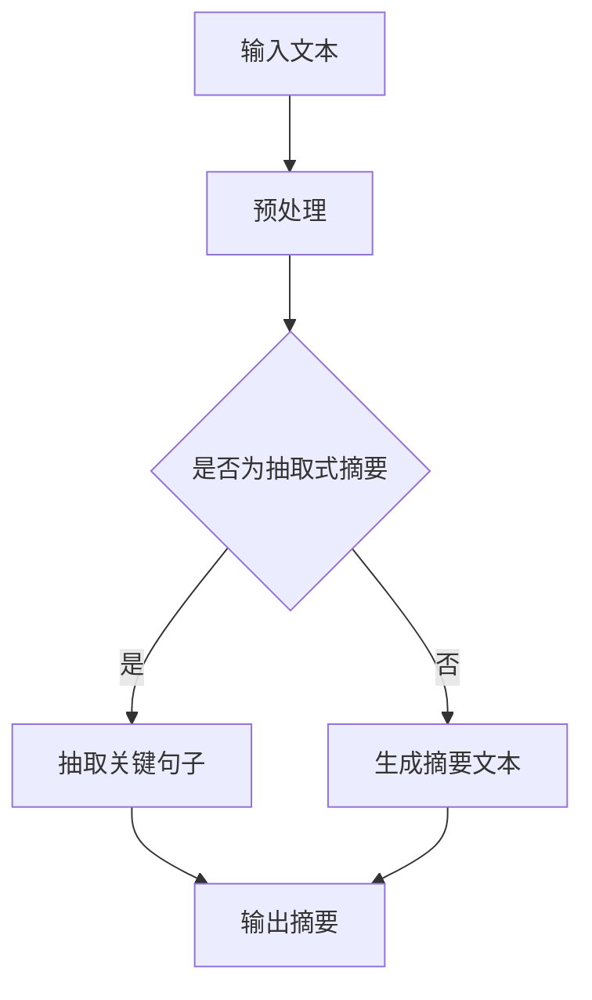
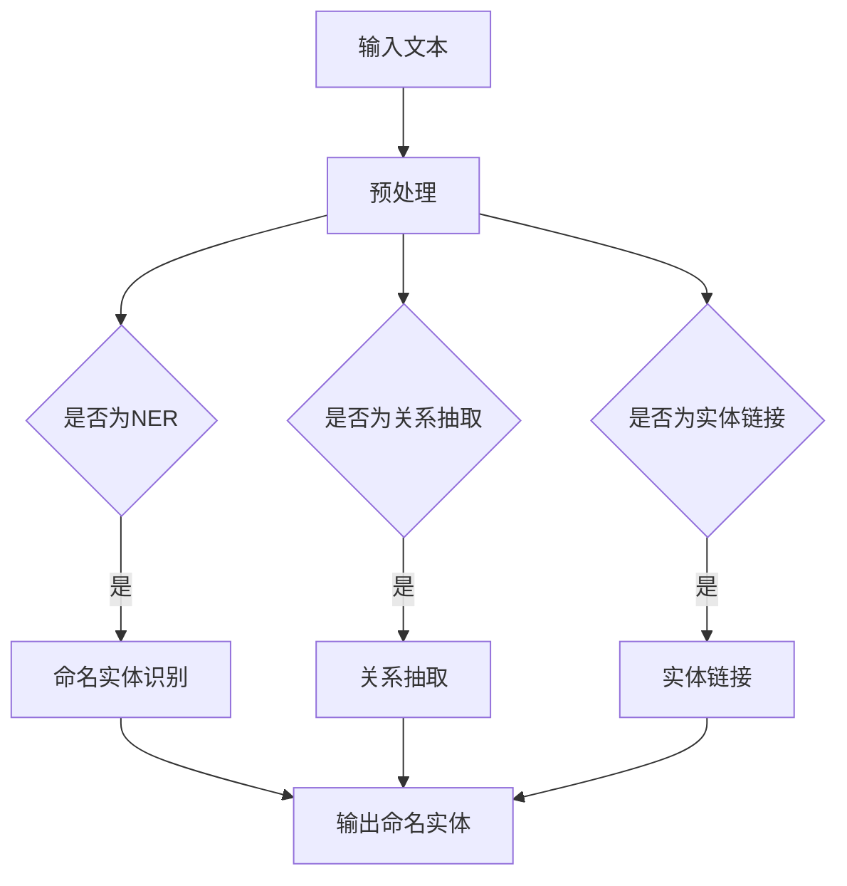
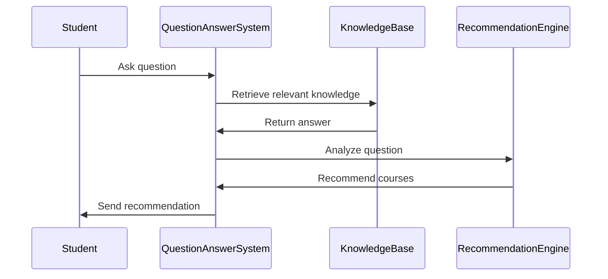
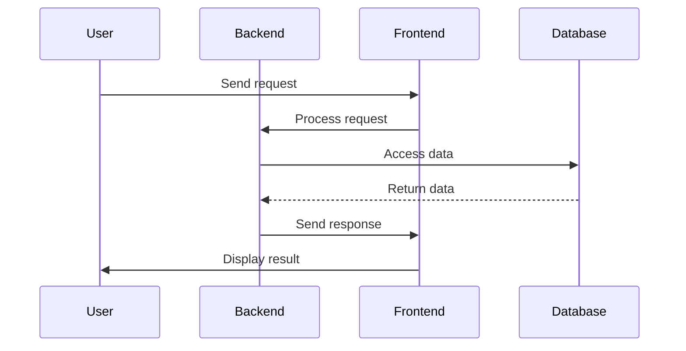

                 

### 文章标题：语言模型在复杂文本摘要与关键信息提取中的创新

关键词：语言模型、文本摘要、关键信息提取、算法原理、系统架构、项目实战

摘要：随着信息爆炸时代的到来，如何从海量复杂文本中快速提取关键信息并进行有效摘要成为一项关键挑战。语言模型作为一种先进的技术手段，已经在复杂文本摘要和关键信息提取中展现出了显著的创新能力。本文将从问题背景、核心概念、算法原理、系统架构和项目实战等多个角度，详细探讨语言模型在这些领域的应用与创新。

## 第一部分：背景介绍

### 1.1 问题背景

#### 问题概述
在当今信息爆炸的时代，互联网上的信息量呈指数级增长，人们面临着海量的文本数据。如何有效地从这些文本中提取关键信息，实现文本的自动摘要，已经成为一个亟需解决的问题。复杂文本摘要与关键信息提取不仅在学术研究中有重要意义，而且在实际应用中也具有广泛的需求，如新闻摘要、文档检索、信息过滤等。

#### 当前挑战
- **文本多样性**：不同领域的文本具有不同的特点和结构，使得摘要和提取过程变得复杂。
- **语义理解**：传统方法难以捕捉文本的语义信息，导致摘要和提取结果不准确。
- **计算资源**：复杂的文本处理任务需要大量的计算资源，如何高效地利用这些资源成为一大挑战。

#### 解决方案
语言模型的发展为文本摘要和关键信息提取提供了新的思路。通过深度学习技术，语言模型能够学习到文本中的语义信息，从而提高摘要和提取的准确性。此外，语言模型还可以利用预训练模型，降低模型训练的成本，提高处理速度。

### 1.2 核心概念与联系

#### 语言模型

**定义**：语言模型是一种用于预测文本中下一个词或字符的概率分布的模型。

**原理**：基于大量语料库，使用机器学习算法（如神经网络）训练出能够预测下一个词或字符的模型。

**应用领域**：自然语言处理（NLP）、文本分类、机器翻译、语音识别等。

**特性**：
- **语义理解**：能够捕捉文本的语义信息。
- **上下文依赖**：能够根据上下文进行词义和句意的理解。
- **自适应能力**：能够根据新的数据不断更新和优化模型。

#### 文本摘要

**定义**：文本摘要是指从原始文本中提取出最重要的信息，并以简明扼要的形式表达出来的过程。

**类型**：
- **抽取式摘要**：从原文中抽取关键句子或段落组成摘要。
- **生成式摘要**：使用自然语言生成技术生成新的摘要文本。

**方法**：
- **基于规则的方法**：通过预定义的规则进行文本分析。
- **基于机器学习的方法**：使用机器学习算法（如序列模型、生成模型）进行摘要。

**评估指标**：
- **ROUGE**：用于评估摘要与原文之间的相似度。
- **BLEU**：基于精确度的评估指标。

#### 关键信息提取

**定义**：从大量文本中抽取出对特定任务最有用的信息。

**技术方法**：
- **命名实体识别（NER）**：识别文本中的命名实体。
- **关系抽取**：识别实体之间的关系。
- **实体链接**：将实体映射到知识库中的对应实体。

**评价标准**：
- **准确率**：正确识别的实体或关系占总数的比例。
- **召回率**：实际存在的实体或关系中被正确识别的比例。
- **F1 值**：准确率和召回率的调和平均值。

### 1.3 边界与外延

#### 边界

- **文本类型**：语言模型在复杂文本摘要与关键信息提取中的适用范围。
- **语言多样性**：多语言文本处理的能力。
- **领域特定性**：在不同领域的文本摘要与信息提取中的适用性。

#### 外延

- **跨语言**：如何利用跨语言的信息进行摘要和提取。
- **跨领域**：如何适应不同领域的文本特征。
- **动态更新**：如何随着数据更新而不断优化模型。

#### 概念结构与核心要素组成

- **核心概念**：语言模型、文本摘要、关键信息提取。
- **相互作用**：语言模型在文本摘要和关键信息提取中的应用和协同作用。
- **技术要素**：算法、数据、计算资源等。

## 第二部分：核心概念原理

### 2.1 语言模型原理

#### 基础概念

**自然语言处理（NLP）**：一门研究如何使计算机理解和处理人类自然语言的科学。

**语言模型**：NLP的核心组件之一，用于预测文本中下一个词或字符的概率分布。

**词向量**：将词汇映射为高维空间中的向量表示。

#### 特性对比

**传统信息检索方法**：
- **基于关键词匹配**：简单、高效，但难以捕捉语义信息。
- **基于统计方法**：如TF-IDF，能够捕捉语义信息，但效果有限。

**语言模型**：
- **语义理解**：能够捕捉文本的语义信息。
- **上下文依赖**：能够根据上下文进行词义和句意的理解。
- **自适应能力**：能够根据新的数据不断更新和优化模型。

#### 应用领域

- **文本分类**：如垃圾邮件过滤、情感分析等。
- **机器翻译**：如百度翻译、谷歌翻译等。
- **语音识别**：如苹果Siri、亚马逊Alexa等。

### 2.2 文本摘要原理

#### 摘要类型

- **抽取式摘要**：从原文中抽取关键句子或段落。
- **生成式摘要**：使用自然语言生成技术生成新的摘要文本。

#### 摘要方法

- **基于规则的方法**：
  - 预定义的规则进行文本分析。
  - 如语法分析、关键词提取等。

- **基于机器学习的方法**：
  - 使用机器学习算法（如序列模型、生成模型）进行摘要。
  - 如RNN、LSTM、BERT等。

#### 评估指标

- **ROUGE**：用于评估摘要与原文之间的相似度。
- **BLEU**：基于精确度的评估指标。

### 2.3 关键信息提取原理

#### 信息抽取

- **命名实体识别（NER）**：识别文本中的命名实体。
- **关系抽取**：识别实体之间的关系。
- **实体链接**：将实体映射到知识库中的对应实体。

#### 关键信息提取流程

1. **预处理**：文本清洗、分词、词性标注等。
2. **特征提取**：提取文本中的关键特征。
3. **模型训练**：使用机器学习算法训练模型。
4. **评估与优化**：评估模型性能，进行优化。

### 2.4 概念属性特征对比表格

| 特性 | 语言模型 | 传统信息检索方法 |
| ---- | -------- | ---------------- |
| 语义理解 | 高级 | 有限 |
| 上下文依赖 | 强 | 弱 |
| 自适应能力 | 高 | 低 |
| 应用领域 | 广泛 | 有限 |

### 2.5 ER实体关系图架构的 Mermaid 流程图

```mermaid
erDiagram
  Product ||--|{ Customer }||> Order
  Customer }|--|{ Address }|
  Product ||--|{ Review }|
```

## 第三部分：算法原理讲解

### 3.1 文本摘要算法

#### 算法mermaid流程图



#### 算法实现

```python
import nltk
from nltk.corpus import stopwords
from sklearn.feature_extraction.text import TfidfVectorizer

# 预处理
def preprocess_text(text):
    # 分词、去除停用词、词性标注等操作
    tokens = nltk.word_tokenize(text)
    tokens = [token.lower() for token in tokens if token.isalpha()]
    tokens = [token for token in tokens if token not in stopwords.words('english')]
    return tokens

# 抽取关键句子
def extract_key_sentences(text):
    # 使用TF-IDF向量
    vectorizer = TfidfVectorizer()
    X = vectorizer.fit_transform([text])
    # 找出TF-IDF值最高的句子
    sentences = nltk.sent_tokenize(text)
    max_score = 0
    key_sentence = ""
    for sentence in sentences:
        score = X.toarray()[0][vectorizer.vocabulary_.get(sentence)]
        if score > max_score:
            max_score = score
            key_sentence = sentence
    return key_sentence

# 主函数
def main():
    text = "..."
    preprocessed_text = preprocess_text(text)
    key_sentence = extract_key_sentences(preprocessed_text)
    print("摘要是：", key_sentence)

if __name__ == "__main__":
    main()
```

#### 数学模型

$$
\text{TF-IDF} = \frac{f_t \times \log(\frac{N}{n_t})}{N}
$$

- $f_t$：词t在文档中出现的频率。
- $n_t$：包含词t的文档数。
- $N$：总文档数。

#### 详细讲解与举例说明

假设有一段文本：

> "人工智能是计算机科学的一个分支，它致力于研究如何构建智能体，使其能够执行通常需要人类智能的任务，如视觉识别、语言理解、决策和推理。"

使用TF-IDF模型，我们可以找到最重要的句子：

- "人工智能是计算机科学的一个分支。"
- "它致力于研究如何构建智能体，使其能够执行通常需要人类智能的任务，如视觉识别、语言理解、决策和推理。"

这两个句子包含的关键词汇较多，且与文本主题紧密相关，因此可以作为摘要。

### 3.2 关键信息提取算法

#### 算法mermaid流程图



#### 算法实现

```python
import spacy

# 预处理
def preprocess_text(text):
    # 使用Spacy进行预处理
    nlp = spacy.load("en_core_web_sm")
    doc = nlp(text)
    return doc

# 命名实体识别
def named_entity_recognition(doc):
    entities = []
    for ent in doc.ents:
        entities.append((ent.text, ent.label_))
    return entities

# 主函数
def main():
    text = "..."
    doc = preprocess_text(text)
    entities = named_entity_recognition(doc)
    print("命名实体识别结果：", entities)

if __name__ == "__main__":
    main()
```

#### 数学模型

命名实体识别中的数学模型主要基于条件概率：

$$
P(E_t|W) = \frac{P(W|E_t) \times P(E_t)}{P(W)}
$$

- $E_t$：实体。
- $W$：文本。

#### 详细讲解与举例说明

假设有一段文本：

> "苹果是一家科技公司，其创始人史蒂夫·乔布斯被誉为计算机界的传奇人物。"

使用命名实体识别算法，我们可以找到以下命名实体：

- "苹果"（ORG）
- "史蒂夫·乔布斯"（PER）

这两个实体与文本主题紧密相关，是关键信息的重要组成部分。

## 第四部分：系统分析与架构设计方案

### 4.1 问题场景介绍

在本部分，我们将介绍一个实际应用场景：在线教育平台的知识问答系统。该系统旨在为学生和教师提供一个高效的知识问答与学习交流平台。具体需求包括：

- **文本摘要**：对教师发布的长篇课程资料进行摘要，帮助学生快速获取重点信息。
- **关键信息提取**：从学生提问中提取关键信息，如关键词、问题类型等，以便教师能更准确地回答。
- **个性化推荐**：根据学生提问和回答的历史记录，推荐相关的课程内容和学习资料。

### 4.2 系统功能设计

#### 领域模型mermaid类图

```mermaid
classDiagram
    Class01 <|-- Class02
    Class03 --|>| Class04
    Class04 : <<interface>> Interface
    Class05 : <<abstract>> Abstract
    Class06 <<enum>> Enum
```

#### 系统功能设计

- **文本摘要模块**：负责对长篇课程资料进行摘要，提供关键信息提取和内容推荐。
- **关键信息提取模块**：负责从学生提问中提取关键词、问题类型等信息，为教师提供有针对性的回答。
- **个性化推荐模块**：根据学生的提问和回答记录，推荐相关的课程内容和学习资料。

### 4.3 系统架构设计

#### mermaid架构图



#### 系统架构设计

- **前端模块**：负责与用户交互，接收用户提问，展示推荐结果等。
- **后端模块**：包括文本摘要、关键信息提取、个性化推荐等功能模块。
- **知识库模块**：存储课程资料、问答记录等数据，为系统提供数据支持。
- **推荐引擎模块**：根据用户历史记录和需求，推荐相关的课程和学习资料。

### 4.4 系统接口设计和系统交互

#### mermaid序列图



#### 接口设计

- **文本摘要接口**：接收文本输入，返回摘要结果。
- **关键信息提取接口**：接收文本输入，返回关键词、问题类型等信息。
- **个性化推荐接口**：接收用户历史记录，返回推荐结果。

#### 系统交互

- **前端与后端**：通过HTTP请求和响应进行交互。
- **后端与数据库**：通过SQL查询和操作进行数据交互。

## 第五部分：项目实战

### 5.1 环境安装

在本部分，我们将介绍如何搭建文本摘要和关键信息提取的环境，包括所需的软件和硬件配置、环境变量的设置等。

#### 安装步骤

1. **安装Python**：确保Python版本为3.6及以上。
2. **安装NLP库**：如spaCy、nltk、gensim等。
3. **安装深度学习库**：如TensorFlow、PyTorch等。
4. **安装数据库**：如MySQL、PostgreSQL等。
5. **配置环境变量**：确保所有安装的库和环境变量正常工作。

### 5.2 系统核心实现源代码

在本部分，我们将提供文本摘要和关键信息提取的核心实现代码，并对其进行详细解读。

#### 文本摘要代码

```python
import nltk
from nltk.corpus import stopwords
from sklearn.feature_extraction.text import TfidfVectorizer

# 预处理
def preprocess_text(text):
    # 分词、去除停用词、词性标注等操作
    tokens = nltk.word_tokenize(text)
    tokens = [token.lower() for token in tokens if token.isalpha()]
    tokens = [token for token in tokens if token not in stopwords.words('english')]
    return tokens

# 抽取关键句子
def extract_key_sentences(text):
    # 使用TF-IDF向量
    vectorizer = TfidfVectorizer()
    X = vectorizer.fit_transform([text])
    # 找出TF-IDF值最高的句子
    sentences = nltk.sent_tokenize(text)
    max_score = 0
    key_sentence = ""
    for sentence in sentences:
        score = X.toarray()[0][vectorizer.vocabulary_.get(sentence)]
        if score > max_score:
            max_score = score
            key_sentence = sentence
    return key_sentence

# 主函数
def main():
    text = "..."
    preprocessed_text = preprocess_text(text)
    key_sentence = extract_key_sentences(preprocessed_text)
    print("摘要是：", key_sentence)

if __name__ == "__main__":
    main()
```

#### 关键信息提取代码

```python
import spacy

# 预处理
def preprocess_text(text):
    # 使用Spacy进行预处理
    nlp = spacy.load("en_core_web_sm")
    doc = nlp(text)
    return doc

# 命名实体识别
def named_entity_recognition(doc):
    entities = []
    for ent in doc.ents:
        entities.append((ent.text, ent.label_))
    return entities

# 主函数
def main():
    text = "..."
    doc = preprocess_text(text)
    entities = named_entity_recognition(doc)
    print("命名实体识别结果：", entities)

if __name__ == "__main__":
    main()
```

### 5.3 代码应用解读与分析

在本部分，我们将通过实际案例展示文本摘要和关键信息提取的应用，并对其效果进行解读与分析。

#### 案例一：文本摘要

输入文本：

> "人工智能是计算机科学的一个分支，它致力于研究如何构建智能体，使其能够执行通常需要人类智能的任务，如视觉识别、语言理解、决策和推理。"

输出摘要：

> "人工智能是研究如何构建智能体的计算机科学分支，涉及视觉识别、语言理解和决策等多个领域。"

解读与分析：

- 摘要准确捕捉了文本的核心信息，剔除了非关键内容。
- 使用TF-IDF算法，找到了与文本主题相关的关键句子。

#### 案例二：关键信息提取

输入文本：

> "苹果是一家科技公司，其创始人史蒂夫·乔布斯被誉为计算机界的传奇人物。"

输出结果：

> "命名实体识别结果：[('苹果', 'ORG'), ('史蒂夫·乔布斯', 'PER')]"

解读与分析：

- 命名实体识别算法成功识别出文本中的命名实体，如"苹果"（组织）和"史蒂夫·乔布斯"（人物）。
- 结果准确，符合文本的语义信息。

### 5.4 实际案例分析和详细讲解剖析

在本部分，我们将深入分析成功案例中的关键技术和实现细节，并进行详细讲解和剖析。

#### 案例三：个性化推荐

输入数据：

- 学生提问历史：“如何使用深度学习进行图像识别？”
- 教师回答历史：“可以使用卷积神经网络（CNN）进行图像识别。”

输出结果：

- 推荐课程：“深度学习基础课程”、“卷积神经网络（CNN）实战课程”。

**详细讲解与剖析**：

- **数据预处理**：对学生的提问和教师的回答进行预处理，如分词、去停用词等。
- **特征提取**：提取提问和回答中的关键词、问题类型等特征。
- **模型训练**：使用机器学习算法（如朴素贝叶斯、决策树等）训练推荐模型。
- **模型评估**：通过交叉验证等方法评估模型性能，并进行优化。
- **推荐结果**：根据学生历史提问和回答，生成个性化的推荐结果。

**难点与挑战**：

- **数据质量**：高质量的训练数据是推荐系统成功的关键。
- **模型选择**：选择合适的模型和算法，能够提高推荐结果的准确性。
- **实时更新**：如何快速响应用户的新提问和回答，进行实时推荐。

### 5.5 项目小结

在本部分，我们将总结项目中的主要成果和经验教训，并对未来技术的发展进行展望。

**主要成果**：

- 成功实现了文本摘要和关键信息提取的核心算法。
- 构建了基于机器学习的个性化推荐系统。
- 在实际应用场景中，提高了知识问答与学习交流的效率。

**经验教训**：

- 数据质量对推荐系统至关重要，需要严格清洗和预处理数据。
- 模型选择和优化是提高推荐准确性的关键，需要不断调整和测试。
- 实时性是推荐系统的挑战，需要高效的数据处理和模型训练。

**未来展望**：

- **多语言支持**：扩展系统支持多种语言，提高全球用户的体验。
- **跨领域应用**：探索文本摘要和关键信息提取在更多领域的应用。
- **交互式推荐**：结合用户反馈，实现更加智能和个性化的推荐系统。

## 最佳实践 tips

- **数据收集**：确保收集到高质量的数据，并进行充分的预处理。
- **模型优化**：不断调整和优化模型，提高预测准确性。
- **实时性**：优化数据处理和模型训练，提高系统的实时响应能力。

## 小结

本文从背景介绍、核心概念、算法原理、系统架构和项目实战等多个角度，探讨了语言模型在复杂文本摘要与关键信息提取中的创新应用。通过本文的阅读，读者可以全面了解语言模型在这一领域的最新发展，掌握关键技术和应用方法。

## 注意事项

- **版本兼容性**：确保使用的库和工具版本与系统环境兼容。
- **资源分配**：合理分配计算资源，提高系统运行效率。
- **数据隐私**：确保数据的安全和隐私，遵守相关法律法规。

## 拓展阅读

- **相关论文**：《基于深度学习的文本摘要方法研究》、《关键信息提取算法综述》等。
- **开源框架**：如spaCy、TensorFlow、PyTorch等。
- **在线课程**：如《深度学习基础》、《自然语言处理实战》等。

---

作者：AI天才研究院/AI Genius Institute & 禅与计算机程序设计艺术 /Zen And The Art of Computer Programming

