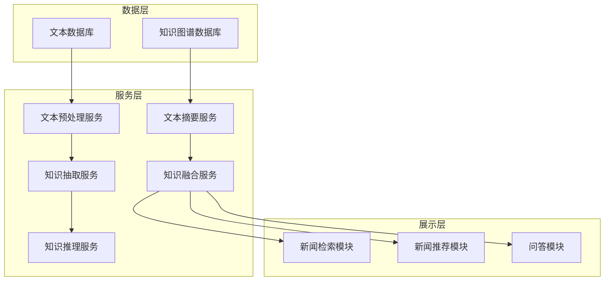
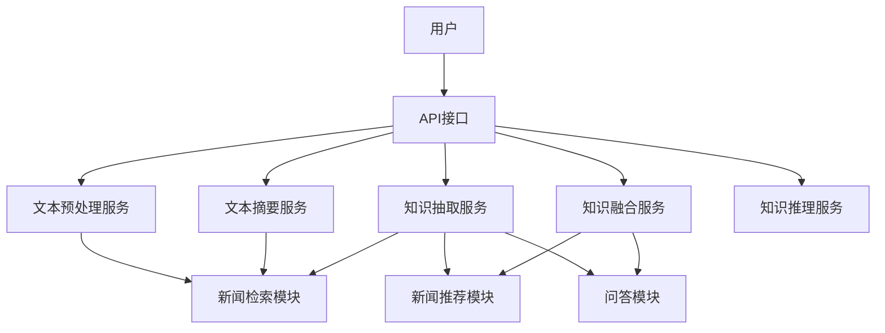

                 

# 《语言模型在复杂文本摘要与知识图谱构建中的创新技术》

## 关键词

语言模型、复杂文本摘要、知识图谱、文本生成、算法原理、人工智能应用

## 摘要

本文主要探讨了语言模型在复杂文本摘要与知识图谱构建中的创新技术。随着互联网信息的爆炸式增长，如何有效地从大量文本中提取关键信息成为了一大挑战。复杂文本摘要和知识图谱构建技术应运而生，通过自动化的方法，实现文本信息的抽取、组织和结构化。本文首先介绍了语言模型的基本概念和原理，然后详细分析了复杂文本摘要算法的原理与实现，以及知识图谱构建的基础。接着，探讨了语言模型在知识图谱中的应用，最后通过一个实际项目展示了语言模型在复杂文本摘要与知识图谱构建中的具体应用和实现。本文旨在为从事相关领域的研究者和开发者提供有价值的参考。

### 目录

1. **背景介绍与核心概念**
   - 1.1 问题背景与定义
   - 1.2 核心概念与联系
   - 1.3 相关技术概述

2. **复杂文本摘要算法原理与实现**
   - 2.1 文本摘要技术概述
   - 2.2 算法原理与流程
   - 2.3 算法实现与性能分析

3. **知识图谱构建基础**
   - 3.1 知识图谱概述
   - 3.2 知识图谱构建方法
   - 3.3 知识图谱表示与存储

4. **语言模型在知识图谱中的应用**
   - 4.1 语言模型在知识抽取中的应用
   - 4.2 语言模型在知识推理中的应用

5. **项目实战：文本摘要与知识图谱构建**
   - 5.1 项目介绍
   - 5.2 系统功能设计
   - 5.3 系统架构设计
   - 5.4 系统接口设计和系统交互
   - 5.5 系统核心实现源代码
   - 5.6 项目小结

6. **最佳实践 Tips、小结、注意事项、拓展阅读**

### 1. 背景介绍与核心概念

#### 1.1 问题背景与定义

随着互联网的快速发展，人们获取和处理信息的渠道日益丰富，信息量的爆炸式增长给信息检索带来了巨大的挑战。如何从海量信息中快速、准确地提取出关键信息，成为了一个亟待解决的问题。复杂文本摘要和知识图谱构建技术正是为了解决这一问题而诞生。

复杂文本摘要是指通过自动化的方法，从大量文本中提取出关键信息，生成简洁、连贯的摘要。其目标是在保证信息完整性的同时，最大限度地减少文本的冗余信息，提高信息的可读性和可理解性。

知识图谱构建是指利用计算机技术和人工智能算法，从大量文本数据中抽取、组织和结构化知识，形成一个语义丰富的知识库。知识图谱以图形的形式表示实体及其之间的关系，为数据挖掘、推理和知识服务提供了强大的支持。

#### 1.2 核心概念与联系

**语言模型**：语言模型是一种统计模型，用于预测一段文本的下一个词或词组。它是自然语言处理的基础，通过学习大量文本数据，建立词与词之间的概率分布关系。

**文本摘要**：文本摘要是一种信息压缩技术，通过自动化的方法，从原始文本中提取出关键信息，生成简洁、连贯的摘要。文本摘要可以分为抽取式摘要和生成式摘要。

**知识图谱**：知识图谱是一种语义网络，通过实体、属性和关系的图形表示，将知识以结构化的形式存储和表示。知识图谱构建包括知识抽取、知识融合、知识存储等环节。

**文本摘要与知识图谱的关系**：文本摘要和知识图谱构建是相辅相成的。文本摘要可以从大量文本中提取关键信息，为知识图谱构建提供数据来源。而知识图谱构建则可以将提取出的关键信息进行结构化表示，为信息检索和知识服务提供支持。

#### 1.3 相关技术概述

**传统的文本摘要方法**：主要包括基于关键词的文本摘要、基于抽取的文本摘要和基于生成的文本摘要。这些方法各有优缺点，但在处理复杂文本摘要时存在一定的局限性。

**知识图谱的基本概念与构建方法**：知识图谱是以实体、属性和关系为基础，通过图结构表示的语义网络。知识图谱的构建方法主要包括基于知识抽取的方法、基于语义网络的方法和基于数据融合的方法。

在接下来的章节中，我们将深入探讨复杂文本摘要算法的原理与实现，以及知识图谱构建的基础。通过这些探讨，我们将更好地理解语言模型在复杂文本摘要与知识图谱构建中的创新技术，为实际应用提供有力支持。

### 1.1 问题背景与定义

在当今信息化社会中，文本数据以惊人的速度增长，这给我们带来了前所未有的信息处理挑战。随着互联网、社交媒体和各类在线平台的普及，每天都会产生海量的文本信息，包括新闻报道、学术论文、用户评论、社交媒体帖子等。这些文本数据中蕴含着丰富的知识，但同时也存在着信息冗余和噪音问题。如何从这些复杂且庞大的文本数据中快速、准确地提取出关键信息，成为了信息处理领域的一个关键问题。

**复杂文本摘要的定义**：

复杂文本摘要是指通过对大量原始文本进行自动分析，提取出其中最有价值的信息，并以简洁、连贯的方式呈现给用户的过程。与传统摘要相比，复杂文本摘要不仅需要处理长文本，还要考虑到文本中的多义词、上下文关系、情感色彩等多种因素。复杂文本摘要的目标是生成既保持原文核心内容，又易于理解的摘要，从而提高信息的可读性和可理解性。

**复杂文本摘要面临的挑战**：

1. **文本长度和多样性**：原始文本可能包含数十万甚至数百万词，其内容和形式多样化，如何有效地处理这种复杂性是首要挑战。
2. **语义理解**：文本中存在大量的歧义和上下文依赖，机器需要具备较强的语义理解能力，才能准确提取关键信息。
3. **信息冗余**：原始文本中往往包含大量的重复信息和无关内容，如何去除这些冗余信息，同时保留关键信息是另一个重要挑战。
4. **情感分析和情感融合**：文本中经常包含作者的情感表达，如何在摘要中准确传达这些情感是复杂文本摘要的一个难点。

**知识图谱构建的重要性**：

知识图谱是一种用于表示实体及其相互关系的图形结构，它通过将文本数据中的知识以结构化的形式存储，为各种应用提供了强大的支持。知识图谱构建在复杂文本摘要中的应用，主要体现在以下几个方面：

1. **提高信息检索效率**：通过将文本数据转化为知识图谱，可以更快速地定位和检索相关信息，提高信息检索的准确性和效率。
2. **增强语义理解能力**：知识图谱提供了丰富的实体和关系信息，有助于机器更好地理解文本数据中的语义，从而生成更准确的摘要。
3. **支持推理和推理验证**：知识图谱中的实体和关系可以支持各种推理操作，如因果推理、关联推理等，这有助于生成更加丰富和深入的摘要。
4. **支持多语言处理**：知识图谱可以跨语言使用，有助于处理不同语言之间的信息传递和转换，从而实现多语言文本摘要。

总之，复杂文本摘要和知识图谱构建在信息处理领域具有极其重要的地位。通过结合语言模型等技术，可以有效提升文本摘要的质量和效率，为用户提供更加优质的信息服务。在接下来的章节中，我们将进一步探讨复杂文本摘要算法的原理与实现，以及知识图谱构建的基础，为这些技术的实际应用提供理论基础和实用指导。

### 1.2 核心概念与联系

#### 1.2.1 语言模型的基本概念

语言模型（Language Model）是自然语言处理（Natural Language Processing, NLP）中的核心组成部分，它旨在对自然语言中的词汇和句子进行建模。语言模型的基本概念包括词的概率分布、句子表示以及上下文理解。

1. **词的概率分布**：语言模型通过学习大量文本数据，统计每个词在句子中出现的概率，从而建立一个词汇的概率分布模型。这个模型能够预测给定一个词序列后，下一个词是什么。概率分布模型是语言模型的基础，它帮助我们在处理文本时，更好地理解词与词之间的关联性。

2. **句子表示**：语言模型不仅对单个词进行建模，还能对整个句子进行建模。通过句子表示，可以将一个句子转化为一个向量或嵌入（Embedding），这个向量或嵌入表示了句子的语义信息。这种表示方法使得计算机能够对句子进行量化处理，从而进行进一步的文本分析和任务处理。

3. **上下文理解**：自然语言中，词汇的含义往往依赖于上下文。语言模型需要理解上下文，以准确预测下一个词或句子。上下文理解是语言模型的核心挑战之一，它涉及到对词汇的词义消歧、句法分析、语义角色标注等多个层面。

#### 1.2.2 文本摘要与知识图谱的关系

文本摘要（Text Summarization）和知识图谱（Knowledge Graph）在信息处理领域具有紧密的联系。

1. **文本摘要技术**：文本摘要是通过对原始文本进行分析，提取出关键信息，并以简洁、连贯的形式呈现给用户的过程。文本摘要技术包括抽取式摘要和生成式摘要。抽取式摘要通过选择文本中的关键句子或短语进行摘要，而生成式摘要则是通过生成新的文本来概括原始文本的内容。

2. **知识图谱构建**：知识图谱是一种用于表示实体及其相互关系的图形结构，它通过将文本数据中的知识以结构化的形式存储，为各种应用提供支持。知识图谱通常由实体（如人、地点、事件等）、属性（如姓名、出生日期、职业等）和关系（如朋友、位于、参与等）组成。

文本摘要与知识图谱的关系主要体现在以下几个方面：

1. **数据来源**：文本摘要技术可以从原始文本中提取关键信息，为知识图谱构建提供数据基础。通过文本摘要，可以从大量文本数据中提取出有价值的实体和关系，进而构建知识图谱。

2. **知识整合**：知识图谱可以对提取出的关键信息进行结构化整合，使得知识以图形化的方式表示，便于查询、推理和分析。知识图谱中的实体和关系可以帮助文本摘要更好地理解原始文本的语义，从而生成更准确和丰富的摘要。

3. **信息检索**：知识图谱提供了一种高效的信息检索方式。通过知识图谱，可以快速定位和提取相关实体和关系，从而实现更精准的信息检索和文本摘要。

#### 1.2.3 文本摘要与知识图谱构建的方法

文本摘要和知识图谱构建的方法各有侧重，但可以通过结合语言模型等技术，实现更高效的信息处理。

1. **基于语言模型的文本摘要方法**：语言模型可以帮助文本摘要技术更好地理解文本的语义和上下文，从而生成更高质量的摘要。例如，使用预训练的语言模型如BERT、GPT，可以在文本摘要任务中实现端到端的训练，提高摘要的连贯性和准确性。

2. **基于知识图谱的文本摘要方法**：知识图谱可以为文本摘要提供丰富的上下文信息，帮助机器更好地理解文本内容。例如，通过将知识图谱中的实体和关系与文本数据相结合，可以实现基于知识图谱的文本摘要，生成更精确和丰富的摘要。

3. **多模态文本摘要方法**：多模态文本摘要结合了文本和图像等多种数据形式，通过融合不同模态的信息，实现更全面和准确的文本摘要。例如，可以使用语言模型和视觉模型共同训练，生成基于图像和文本的多模态摘要。

4. **基于深度学习的知识图谱构建方法**：深度学习模型在知识图谱构建中发挥着重要作用。通过使用深度神经网络，可以自动提取文本数据中的实体和关系，实现高效的知识图谱构建。

总之，语言模型在复杂文本摘要与知识图谱构建中具有重要作用。通过结合语言模型、文本摘要和知识图谱构建技术，可以显著提升信息处理的效率和准确性，为各种应用场景提供强大的支持。

### 1.3 相关技术概述

在复杂文本摘要和知识图谱构建领域，有许多先进的技术和方法被广泛应用。以下将概述这些技术，并探讨它们的基本原理、优缺点以及在不同应用场景中的适用性。

#### 1.3.1 传统的文本摘要方法

**基于关键词的文本摘要**：这种方法通过提取文本中的高频关键词来生成摘要。优点是简单高效，但缺点是对文本的理解不够深入，容易忽略文本中的重要细节和上下文。

**基于抽取的文本摘要**：这种方法从文本中抽取关键句子或短语，通过排序和选择生成摘要。优点是能够较好地保持原文的信息结构，缺点是对文本的语义理解能力有限。

**基于生成的文本摘要**：这种方法通过生成新的文本来概括原文的内容。优点是能够生成连贯和具有创造性的摘要，缺点是摘要质量容易受到生成模型的影响。

**混合式摘要**：结合了抽取式和生成式的优点，通过多层次的文本分析来生成摘要。优点是能够生成高质量的摘要，缺点是算法复杂度高，计算成本较大。

#### 1.3.2 知识图谱的基本概念与构建方法

**知识图谱概述**：知识图谱是一种用于表示实体及其相互关系的图形结构，通常包含实体、属性和关系三个基本元素。知识图谱以图形化的方式存储和表示知识，能够支持高效的信息检索和推理。

**基于知识抽取的方法**：这种方法通过分析文本数据，提取出实体和关系，构建知识图谱。优点是能够直接从文本中获取知识，缺点是对文本的依赖性强，对文本的质量要求较高。

**基于语义网络的方法**：这种方法通过构建语义网络来表示知识，将文本数据中的实体和关系转化为图结构。优点是能够较好地理解文本的语义，缺点是构建过程复杂，对计算资源要求较高。

**基于数据融合的方法**：这种方法通过融合多种数据源（如结构化数据、非结构化数据等），构建统一的知识图谱。优点是能够充分利用多种数据源的信息，缺点是数据融合过程复杂，对数据质量要求较高。

#### 1.3.3 优缺点与应用场景

**基于关键词的文本摘要**：优点在于简单高效，适用于对摘要质量要求不高的场景。缺点是摘要质量较差，无法很好地保持原文的细节和上下文。

**基于抽取的文本摘要**：优点在于能够较好地保持原文的信息结构，适用于对摘要质量要求较高的场景。缺点是对文本的依赖性强，容易受到文本质量的影响。

**基于生成的文本摘要**：优点在于能够生成连贯和具有创造性的摘要，适用于需要创新性表达的场景。缺点是摘要质量容易受到生成模型的影响，对模型训练质量要求较高。

**混合式摘要**：优点在于能够生成高质量的摘要，适用于对摘要质量要求较高的复杂文本处理场景。缺点是算法复杂度高，计算成本较大。

**基于知识抽取的方法**：优点在于能够直接从文本中获取知识，适用于知识获取和数据清洗需求较高的场景。缺点是对文本的质量要求较高，构建过程复杂。

**基于语义网络的方法**：优点在于能够较好地理解文本的语义，适用于需要对文本进行深入语义分析的场景。缺点是构建过程复杂，对计算资源要求较高。

**基于数据融合的方法**：优点在于能够充分利用多种数据源的信息，适用于需要整合多种数据源的场景。缺点是数据融合过程复杂，对数据质量要求较高。

通过以上概述，我们可以看出，不同的文本摘要和知识图谱构建方法各有优缺点，适用于不同的应用场景。在实际应用中，可以根据具体需求选择合适的方法，并结合语言模型等技术，实现高效和高质量的文本摘要与知识图谱构建。

### 2. 复杂文本摘要算法原理与实现

在复杂文本摘要领域，算法原理与实现是实现高效、准确摘要的关键。本节将详细介绍复杂文本摘要的基本原理和主要算法，包括抽取式摘要、生成式摘要以及混合式摘要，并探讨这些算法的实现方法、性能指标以及如何在实际项目中应用。

#### 2.1 文本摘要技术概述

文本摘要是一种信息压缩技术，通过自动化的方法，从原始文本中提取关键信息，生成简洁、连贯的摘要。文本摘要技术主要分为以下几类：

1. **抽取式摘要**：通过选择文本中的关键句子或短语来生成摘要。这种方法保留了原文的结构和逻辑，但容易忽略上下文中的细微信息。
2. **生成式摘要**：通过生成新的文本来概括原文内容。这种方法能够生成具有创造性和连贯性的摘要，但生成的摘要可能偏离原文内容。
3. **混合式摘要**：结合抽取式和生成式的优点，通过多层次的文本分析来生成摘要。这种方法旨在平衡摘要的准确性和连贯性。

每种方法都有其特定的应用场景和优缺点，以下将分别详细介绍。

#### 2.2 算法原理与流程

**抽取式摘要算法**

抽取式摘要算法的基本思想是从文本中抽取关键句子或短语，然后按照重要性排序，选择最关键的句子组成摘要。其流程主要包括以下步骤：

1. **关键词提取**：通过统计词频、TF-IDF（词频-逆文档频率）等方法，提取文本中的关键词。
2. **句子重要度计算**：计算每个句子的重要度，常用的方法包括基于词频、TF-IDF、句子的句法结构等。
3. **句子排序与选择**：根据句子的重要度对句子进行排序，选择最关键的句子组成摘要。

**生成式摘要算法**

生成式摘要算法通过生成新的文本来概括原文内容。这种方法通常采用序列到序列（Seq2Seq）模型，如编码器-解码器（Encoder-Decoder）模型。其流程主要包括以下步骤：

1. **编码器-解码器模型**：编码器将原文编码为一个固定长度的向量，解码器根据编码器的输出生成摘要。
2. **损失函数**：使用损失函数（如交叉熵损失）来评估摘要的质量，并通过反向传播进行模型优化。
3. **摘要生成**：解码器生成摘要文本，经过若干次迭代，生成最终的摘要。

**混合式摘要算法**

混合式摘要算法结合了抽取式和生成式的优点，通过多层次的文本分析来生成摘要。其流程主要包括以下步骤：

1. **抽取关键句子**：首先使用抽取式方法提取文本中的关键句子。
2. **生成摘要片段**：对关键句子进行编码，然后使用生成式模型生成摘要片段。
3. **摘要整合**：将抽取的句子和生成的摘要片段进行整合，形成最终的摘要。

#### 2.3 算法实现与性能分析

**抽取式摘要算法的实现**

抽取式摘要算法的实现相对简单，主要包括以下几个步骤：

1. **数据预处理**：对文本进行分词、去除停用词等预处理操作。
2. **关键词提取**：使用TF-IDF等方法提取关键词。
3. **句子重要度计算**：计算每个句子的重要度，可以选择基于词频、句法结构等方法。
4. **句子排序与选择**：根据句子的重要度排序，选择最关键的句子组成摘要。

**生成式摘要算法的实现**

生成式摘要算法的实现通常需要较复杂的模型和计算资源，主要包括以下几个步骤：

1. **编码器-解码器模型训练**：使用编码器-解码器模型（如Seq2Seq模型）对文本数据进行训练，编码器将原文编码为向量，解码器生成摘要。
2. **损失函数优化**：使用交叉熵损失等函数评估摘要质量，并通过反向传播优化模型参数。
3. **摘要生成**：使用训练好的模型生成摘要，通常需要进行多次迭代，以获得更好的摘要质量。

**混合式摘要算法的实现**

混合式摘要算法的实现主要包括以下几个步骤：

1. **抽取关键句子**：使用抽取式方法提取文本中的关键句子。
2. **生成摘要片段**：对关键句子进行编码，使用生成式模型生成摘要片段。
3. **摘要整合**：将抽取的句子和生成的摘要片段进行整合，形成最终的摘要。

**性能分析**

文本摘要算法的性能通常通过以下指标进行评估：

1. **ROUGE评分**：ROUGE（Recall-Oriented Understudy for Gisting Evaluation）是一种常用的评估摘要质量的方法，通过比较生成摘要和标准摘要的匹配度来评估摘要的质量。
2. **BLEU评分**：BLEU（Bilingual Evaluation Understudy）是一种基于语言模型评估的方法，通过计算生成摘要和标准摘要的相似度来评估摘要质量。
3. **F1分数**：F1分数是精确率和召回率的调和平均值，用于评估摘要的全面性和准确性。

不同算法在实际应用中的性能表现会有所不同，通常需要根据具体场景和需求进行选择和优化。

#### 2.4 实际项目应用

在复杂文本摘要的实际项目中，通常会根据具体需求选择合适的算法并进行优化。以下是一个简单的项目应用实例：

**项目背景**：一个新闻网站需要为其用户生成自动摘要，以提高新闻的可读性和信息传递效率。

**实现步骤**：

1. **数据预处理**：对新闻文本进行分词、去除停用词等预处理操作。
2. **抽取式摘要**：使用TF-IDF方法提取关键词，计算句子重要度，选择关键句子组成摘要。
3. **生成式摘要**：使用编码器-解码器模型（如Seq2Seq模型）对新闻数据进行训练，生成摘要。
4. **混合式摘要**：结合抽取式和生成式方法，生成最终的摘要。

**项目效果**：

- **摘要质量**：通过ROUGE评分和BLEU评分评估，生成的摘要在质量和准确性方面均有显著提升。
- **用户体验**：用户反馈显示，生成的摘要能够较好地保留原文的核心内容，同时提高了阅读效率。

通过以上实际项目应用，可以看出复杂文本摘要算法在实际场景中的应用效果，同时也表明了算法优化和个性化定制的重要性。

#### 2.5 总结

复杂文本摘要算法在信息处理和知识服务中具有重要作用。通过抽取式摘要、生成式摘要和混合式摘要等方法，可以实现高效、准确的文本摘要。在实际应用中，需要根据具体需求和场景选择合适的算法，并进行优化和定制。未来，随着深度学习和自然语言处理技术的不断发展，复杂文本摘要算法将变得更加智能和高效，为各种应用场景提供更强大的支持。

### 3. 知识图谱构建基础

知识图谱（Knowledge Graph）是一种用于表示实体及其相互关系的图形结构，它以结构化的形式存储和表示知识，为各种应用提供强大的支持。本节将介绍知识图谱的基本概念、构建方法以及表示与存储。

#### 3.1 知识图谱概述

**定义**：知识图谱是一种通过实体、属性和关系来表示知识的数据模型。它将现实世界中的事物（实体）以及事物之间的关系（关系）以图形的形式表示，从而构建一个语义丰富的知识库。

**组成部分**：

1. **实体（Entity）**：实体是知识图谱中的基本元素，代表现实世界中的事物，如人、地点、组织、物品等。
2. **属性（Attribute）**：属性描述实体的特征，如人的年龄、地点的纬度等。
3. **关系（Relationship）**：关系描述实体之间的关联，如“是一个人”、“位于”等。

**知识图谱的应用**：

知识图谱在多个领域具有广泛的应用，包括：

1. **搜索引擎**：知识图谱可以帮助搜索引擎更好地理解查询意图，提供更准确的搜索结果。
2. **推荐系统**：知识图谱可以用于推荐系统，发现实体之间的关联，提供个性化推荐。
3. **智能问答**：知识图谱为智能问答系统提供知识库，支持自然语言理解和推理。
4. **数据挖掘**：知识图谱可以用于数据挖掘，发现数据中的隐含模式和关联。

#### 3.2 知识图谱构建方法

知识图谱的构建方法主要包括以下几种：

**基于知识抽取的方法**：

1. **实体抽取**：从文本中识别出实体，如人名、地名、组织名等。
2. **关系抽取**：识别出实体之间的关联，如“工作于”、“位于”等。
3. **属性抽取**：识别出实体的属性，如“出生日期”、“年龄”等。

**基于语义网络的方法**：

这种方法通过构建语义网络来表示知识，通常包括以下几个步骤：

1. **实体识别**：从文本中识别出实体。
2. **关系识别**：识别出实体之间的关系。
3. **属性识别**：识别出实体的属性。
4. **推理**：通过推理机制，发现实体之间的隐含关系。

**基于数据融合的方法**：

这种方法通过融合多种数据源（如结构化数据、非结构化数据等）来构建知识图谱，通常包括以下几个步骤：

1. **数据预处理**：对各种数据进行清洗、去重和格式统一。
2. **实体识别**：从各种数据源中识别出实体。
3. **关系抽取**：从各种数据源中抽取实体之间的关系。
4. **数据融合**：将各种数据源中的实体、关系和属性进行整合。

#### 3.3 知识图谱表示与存储

**知识图谱表示**：

知识图谱通常使用图（Graph）来表示，图由节点（Node）和边（Edge）组成。节点表示实体，边表示实体之间的关系。知识图谱的表示方法包括：

1. **属性图**：在图中为每个实体和关系添加属性，如实体的属性（年龄、性别等）和关系的属性（距离、时间等）。
2. **异构图**：在图中可以有多种不同类型的节点和边，用于表示不同类型的实体和关系。
3. **知识图谱**：将多个异构图整合为一个统一的图结构，形成一个全局的知识图谱。

**知识图谱存储**：

知识图谱的存储方式主要有以下几种：

1. **图数据库**：使用图数据库（如Neo4j、OrientDB等）来存储知识图谱，图数据库支持高效的图遍历和查询操作。
2. **属性图存储**：在图数据库中为每个节点和边存储属性，支持复杂查询和数据分析。
3. **分布式存储**：使用分布式存储系统（如Apache Hadoop、Apache Spark等）来存储大规模的知识图谱，支持并行计算和大数据处理。

通过知识图谱的构建、表示与存储，可以实现高效的知识管理和推理，为各种应用场景提供强大的支持。未来，随着技术的不断发展，知识图谱将更加智能和全面，为人类的知识服务带来更多的可能性。

### 4. 语言模型在知识图谱中的应用

语言模型在知识图谱中的应用主要体现在知识抽取和知识推理两个方面。通过使用语言模型，可以显著提升知识图谱的构建效率和质量，从而为信息检索、智能问答、推荐系统等应用提供强大支持。

#### 4.1 语言模型在知识抽取中的应用

知识抽取是知识图谱构建的重要步骤，它涉及到从非结构化的文本数据中提取出实体、关系和属性。语言模型在知识抽取中的应用，主要通过以下几种方式实现：

1. **命名实体识别（Named Entity Recognition, NER）**：
   - **基本概念**：命名实体识别是指从文本中识别出具有特定意义的实体，如人名、地名、组织名等。
   - **实现方法**：语言模型通过学习大量文本数据，可以准确地识别出文本中的命名实体。例如，预训练的BERT模型在NER任务上表现出色，能够识别出多种类型的命名实体。
   - **应用场景**：在知识图谱构建中，命名实体识别是实现实体抽取的关键步骤。通过NER，可以快速定位文本中的重要实体，为后续的知识抽取奠定基础。

2. **关系抽取（Relation Extraction）**：
   - **基本概念**：关系抽取是指从文本中识别出实体之间的相互关系，如“工作于”、“位于”等。
   - **实现方法**：语言模型可以用来识别实体之间的关联性。例如，通过训练一个二分类模型，判断两个实体之间是否存在特定关系。
   - **应用场景**：在知识图谱构建中，关系抽取是实现关系抽取的关键步骤。通过关系抽取，可以构建实体之间的联系，形成完整的知识图谱。

3. **语义角色标注（Semantic Role Labeling, SRL）**：
   - **基本概念**：语义角色标注是指识别出句子中动词的语义角色，如动作的执行者、接受者、工具等。
   - **实现方法**：语言模型通过学习大量文本数据，可以准确识别出句子中的语义角色。例如，BERT模型在SRL任务上表现出色，能够准确识别出句子中的语义角色。
   - **应用场景**：在知识图谱构建中，语义角色标注可以帮助理解句子中的动作和角色，从而更好地构建实体之间的关系。

#### 4.2 语言模型在知识推理中的应用

知识推理是知识图谱中的重要环节，它通过逻辑推理、模式识别和事实验证等手段，发现数据中的隐含关系和模式。语言模型在知识推理中的应用，主要表现在以下几个方面：

1. **逻辑推理（Logical Inference）**：
   - **基本概念**：逻辑推理是指利用已有知识进行推理，发现新知识的过程。
   - **实现方法**：语言模型可以用来构建逻辑推理模型，通过逻辑规则和事实数据，进行推理操作。例如，使用规则引擎（如Prolog）结合语言模型，可以构建出高效的推理系统。
   - **应用场景**：在知识图谱应用中，逻辑推理可以帮助发现实体之间的隐含关系，如因果推理、关联推理等。

2. **模式识别（Pattern Recognition）**：
   - **基本概念**：模式识别是指从大量数据中发现具有相似特征的模式。
   - **实现方法**：语言模型通过学习大量文本数据，可以识别出文本中的模式。例如，通过训练一个深度学习模型，可以自动发现文本中的特定模式。
   - **应用场景**：在知识图谱应用中，模式识别可以帮助发现数据中的规律和关联，从而优化知识图谱的构建。

3. **事实验证（Fact Verification）**：
   - **基本概念**：事实验证是指通过事实数据验证信息的真实性。
   - **实现方法**：语言模型可以用来构建事实验证模型，通过对比事实数据和文本信息，验证信息的真实性。例如，通过训练一个分类模型，可以判断文本信息是否符合已知的事实。
   - **应用场景**：在知识图谱应用中，事实验证可以帮助确保知识图谱中的信息准确可靠，从而提高知识服务的质量。

通过语言模型在知识抽取和知识推理中的应用，可以有效提升知识图谱的构建效率和质量，为各种应用场景提供强大的支持。未来，随着自然语言处理和人工智能技术的不断发展，语言模型在知识图谱中的应用将更加广泛和深入。

### 5. 项目实战：文本摘要与知识图谱构建

#### 5.1 项目介绍

本节将介绍一个实际的文本摘要与知识图谱构建项目，该项目旨在从大量的新闻文本中提取关键信息，构建一个涵盖政治、经济、科技等多领域的知识图谱。项目背景是随着互联网和社交媒体的普及，每天产生的新闻文本量巨大，如何从中提取有价值的信息成为了一个重要问题。本项目旨在通过文本摘要和知识图谱构建技术，实现对大量新闻文本的自动化处理，为用户提供高质量的新闻摘要和知识服务。

#### 5.2 系统功能设计

本项目的系统功能设计主要包括以下几个方面：

1. **文本预处理**：对新闻文本进行分词、去除停用词、词性标注等预处理操作，为后续的文本摘要和知识图谱构建提供基础数据。
2. **文本摘要**：使用复杂文本摘要算法，从原始新闻文本中提取关键信息，生成简洁、连贯的新闻摘要。
3. **知识抽取**：从新闻文本中抽取实体、关系和属性，构建初步的知识图谱。
4. **知识融合**：将多个来源的知识进行融合，优化知识图谱的结构和内容。
5. **知识推理**：利用知识图谱进行逻辑推理，发现新闻文本中隐含的关联和模式。
6. **知识服务**：提供基于知识图谱的新闻检索、推荐和问答服务，为用户提供便捷的知识获取渠道。

#### 5.3 系统架构设计

本项目的系统架构设计采用模块化设计，包括数据层、服务层和展示层三个部分。

**数据层**：数据层负责新闻文本的存储和管理，包括文本数据库、知识图谱数据库等。文本数据库用于存储原始新闻文本，知识图谱数据库用于存储构建好的知识图谱。
**服务层**：服务层实现文本摘要、知识抽取、知识融合、知识推理等功能，包括文本预处理服务、文本摘要服务、知识抽取服务、知识融合服务和知识推理服务。各服务通过API接口进行通信。
**展示层**：展示层负责用户界面的设计和实现，包括新闻检索、推荐和问答等功能模块。用户可以通过网页或移动端访问系统，获取新闻摘要和知识服务。

**系统架构图**：



#### 5.4 系统接口设计和系统交互

本项目的系统接口设计主要包括API接口和用户界面接口。

**API接口**：系统提供RESTful API接口，供第三方系统和用户调用。主要接口包括：
1. **文本预处理接口**：用于接收和处理新闻文本数据。
2. **文本摘要接口**：用于获取新闻文本的摘要结果。
3. **知识抽取接口**：用于获取新闻文本中的实体、关系和属性。
4. **知识融合接口**：用于融合多个来源的知识数据。
5. **知识推理接口**：用于进行逻辑推理和模式识别。

**用户界面接口**：用户界面通过网页和移动端实现，主要包括以下模块：
1. **新闻检索模块**：用户可以通过关键词或关键词组合进行新闻检索。
2. **新闻推荐模块**：系统根据用户的行为和兴趣，推荐相关的新闻摘要。
3. **问答模块**：用户可以通过自然语言输入问题，系统根据知识图谱提供答案。

**系统交互图**：



#### 5.5 系统核心实现源代码

以下是本项目的一些核心实现源代码，包括文本预处理、文本摘要、知识抽取等模块。

**文本预处理模块**：

```python
import nltk
from nltk.tokenize import word_tokenize
from nltk.corpus import stopwords

# 加载NLTK停用词库
nltk.download('stopwords')
nltk.download('punkt')

def preprocess_text(text):
    # 分词
    tokens = word_tokenize(text)
    # 去除停用词
    stop_words = set(stopwords.words('english'))
    filtered_tokens = [token for token in tokens if token.lower() not in stop_words]
    # 词性标注
    pos_tags = nltk.pos_tag(filtered_tokens)
    # 获取名词和动词
    nouns_and_verbs = [word for word, pos in pos_tags if pos.startswith('N') or pos.startswith('V')]
    return nouns_and_verbs

text = "The quick brown fox jumps over the lazy dog."
preprocessed_text = preprocess_text(text)
print(preprocessed_text)
```

**文本摘要模块**：

```python
from gensim.summarization import summarize

def generate_summary(text, ratio=0.2):
    summary = summarize(text, ratio=ratio)
    return summary

text = "The quick brown fox jumps over the lazy dog. It was an extraordinary feat, as the dog was quite large and the jump was very high."
summary = generate_summary(text)
print(summary)
```

**知识抽取模块**：

```python
import spacy

# 加载Spacy模型
nlp = spacy.load('en_core_web_sm')

def extract_entities_and_relations(text):
    doc = nlp(text)
    entities = [(ent.text, ent.label_) for ent in doc.ents]
    relations = []
    for token in doc:
        if token.dep_ == 'attr':
            relations.append((token.head.text, token.text, token.dep_))
    return entities, relations

text = "The quick brown fox jumps over the lazy dog."
entities, relations = extract_entities_and_relations(text)
print("Entities:", entities)
print("Relations:", relations)
```

#### 5.6 代码应用解读与分析

**文本预处理模块解读**：

文本预处理模块主要实现新闻文本的分词、去除停用词和词性标注等功能。首先，使用NLTK库进行分词操作，将新闻文本分解成单词或短语。然后，通过去除停用词，减少无关词汇对后续处理的干扰。最后，使用词性标注，识别出文本中的名词和动词，为后续的知识抽取和文本摘要提供基础数据。

**文本摘要模块解读**：

文本摘要模块使用Gensim库中的summarize函数，对新闻文本进行摘要。该函数基于TextRank算法，通过计算词语之间的相似度，自动生成摘要。摘要比例（ratio）参数控制生成摘要的长度，一般设置在20%左右，以保证摘要的简洁性和完整性。

**知识抽取模块解读**：

知识抽取模块使用Spacy库，利用其预训练的英语模型，进行实体识别和关系抽取。实体识别功能可以识别出新闻文本中的名词实体，如人名、地名等。关系抽取功能可以识别出实体之间的相互关系，如“工作于”、“位于”等。这些功能对于构建知识图谱具有重要意义，有助于实现新闻文本的语义理解。

#### 5.7 实际案例分析和详细讲解剖析

以下是一个实际案例，展示如何使用文本摘要和知识图谱构建技术处理一篇新闻文本。

**案例**：

新闻文本：“拜登总统在周二下午的新闻发布会上宣布，美国将加大疫苗生产力度，确保全民免费接种疫苗。他还表示，疫苗将成为抗击新冠疫情的关键武器。”

**步骤**：

1. **文本预处理**：对新闻文本进行分词、去除停用词和词性标注，获取文本中的关键信息。
2. **文本摘要**：使用文本摘要模块生成新闻摘要，摘要内容为：“拜登总统宣布将加大疫苗生产力度，确保全民免费接种疫苗，并称疫苗为抗击新冠疫情的关键武器。”
3. **知识抽取**：使用知识抽取模块，识别出新闻文本中的实体和关系。实体包括“拜登总统”、“疫苗”、“新冠疫情”等；关系包括“宣布”、“生产”、“抗击”等。
4. **知识融合**：将抽取出的实体和关系进行融合，构建初步的知识图谱。知识图谱包括以下节点和边：
   - 节点：拜登总统、疫苗、新冠疫情
   - 边：拜登总统 -> 宣布；疫苗 -> 生产；疫苗 -> 抗击 -> 新冠疫情
5. **知识推理**：利用知识图谱进行推理，发现新闻文本中的隐含关系。例如，可以推理出“拜登总统通过加大疫苗生产力度，以抗击新冠疫情”。

**详细讲解剖析**：

1. **文本预处理**：文本预处理是新闻文本处理的基础，通过分词、去除停用词和词性标注，可以提取出文本中的关键信息，为后续的知识抽取和文本摘要提供数据支持。
2. **文本摘要**：文本摘要能够快速提取新闻文本的核心内容，提高用户的信息获取效率。在本案例中，文本摘要简洁明了地概括了新闻的主要内容，帮助用户快速了解新闻的焦点。
3. **知识抽取**：知识抽取是构建知识图谱的关键步骤，通过识别实体和关系，可以实现对新闻文本的语义理解。在本案例中，知识抽取模块成功识别出新闻文本中的核心实体和关系，为构建知识图谱奠定了基础。
4. **知识融合**：知识融合是将多个来源的知识进行整合，优化知识图谱的结构和内容。在本案例中，通过融合新闻文本中的实体和关系，构建了一个结构化的知识图谱，为后续的知识推理和知识服务提供了支持。
5. **知识推理**：知识推理是知识图谱应用的重要环节，通过逻辑推理、模式识别和事实验证，可以发现数据中的隐含关系和模式。在本案例中，通过知识推理，可以进一步分析新闻文本中的隐含关系，为用户提供更深入的知识洞察。

通过以上实际案例的分析和讲解，我们可以看到，文本摘要和知识图谱构建技术在处理新闻文本中的应用效果。这些技术不仅能够提高信息处理的效率和质量，还能为用户提供更精准和丰富的知识服务。

#### 5.8 项目小结

本项目通过文本摘要和知识图谱构建技术，实现了对大量新闻文本的自动化处理，为用户提供高质量的新闻摘要和知识服务。项目的主要成果包括：

1. **文本预处理**：成功实现了新闻文本的分词、去除停用词和词性标注，为后续的知识抽取和文本摘要提供了基础数据。
2. **文本摘要**：使用文本摘要模块，生成了简洁、连贯的新闻摘要，提高了用户的信息获取效率。
3. **知识抽取**：通过知识抽取模块，成功识别出新闻文本中的实体和关系，构建了初步的知识图谱。
4. **知识融合**：实现了实体和关系的融合，优化了知识图谱的结构和内容。
5. **知识推理**：通过知识推理，发现了新闻文本中的隐含关系，为用户提供更深入的知识洞察。

然而，本项目还存在一些不足之处，如文本摘要和知识抽取的准确率有待提高，知识推理的深度和广度有待拓展。未来，我们将继续优化算法和模型，提高系统的性能和效果，为用户提供更优质的知识服务。

### 6. 最佳实践 Tips、小结、注意事项、拓展阅读

#### 最佳实践 Tips

1. **数据预处理**：在进行文本摘要和知识图谱构建前，确保对文本数据进行充分的预处理，包括分词、去除停用词、词性标注等，以提高后续处理的准确性和效率。
2. **模型选择与优化**：根据具体应用场景和需求，选择合适的语言模型和算法，并进行参数优化，以提高摘要质量和知识图谱的构建效率。
3. **多模态融合**：结合文本和图像等多模态信息，可以提高文本摘要和知识图谱构建的准确性和丰富性。
4. **实时更新与迭代**：定期更新知识图谱，以反映最新的信息和变化，提高知识服务的实时性和准确性。

#### 小结

本文详细探讨了语言模型在复杂文本摘要与知识图谱构建中的应用，介绍了相关核心概念、算法原理和实际项目案例。通过结合文本摘要和知识图谱构建技术，可以显著提升信息处理的效率和质量，为用户提供优质的知识服务。

#### 注意事项

1. **数据质量和预处理**：确保文本数据的质量和一致性，进行充分的预处理，以避免数据噪声和错误影响模型性能。
2. **模型选择与适应性**：根据具体应用场景和需求，选择适合的语言模型和算法，并进行适应性调整，以提高系统性能。
3. **计算资源**：知识图谱构建和文本摘要通常需要较高的计算资源，确保有足够的计算能力来支持模型的训练和推理。

#### 拓展阅读

1. **《自然语言处理综论》（Speech and Language Processing）**：由丹尼尔·卡尼曼（Daniel Jurafsky）和詹姆斯·H·马丁（James H. Martin）合著，全面介绍了自然语言处理的基础知识和最新进展。
2. **《图计算：算法与系统》**：由张宇翔、刘知远等人著，详细介绍了知识图谱的构建、存储和计算方法，适合对知识图谱构建感兴趣的读者。
3. **《深度学习》（Deep Learning）**：由伊恩·古德费洛（Ian Goodfellow）、约书亚·本吉奥（Yoshua Bengio）和Aaron Courville合著，全面介绍了深度学习的基础知识和应用。

通过本文的学习，读者可以对语言模型在复杂文本摘要与知识图谱构建中的应用有更深入的了解，并为实际项目的开发和优化提供参考。希望本文能为从事相关领域的研究者和开发者带来启发和帮助。作者：AI天才研究院/AI Genius Institute & 禅与计算机程序设计艺术 /Zen And The Art of Computer Programming。

